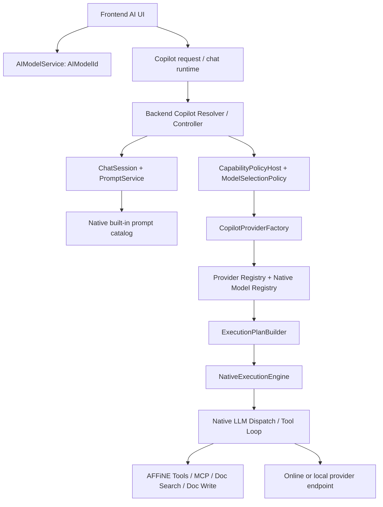
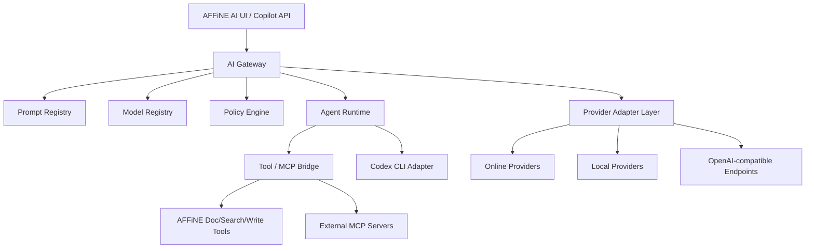
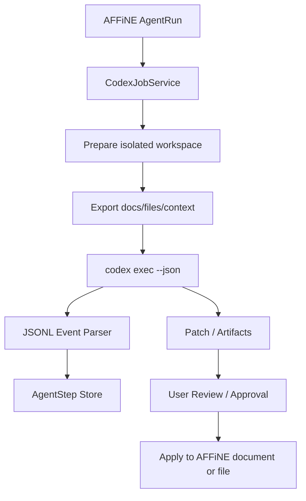

# AFFiNE AI 能力梳理与改造计划

## 1. 背景与目标

当前 AFFiNE canary 已经具备一套较完整的 Copilot/AI 基础能力：前端 AI 面板、Prompt 驱动的会话、后端 Copilot 插件、Native LLM 调度层、工具调用、文档检索、图片生成、Embedding、Rerank、BYOK 与 MCP 工具暴露等。但是从自部署和二次开发角度看，现有实现仍然偏向官方托管模型组合和固定内置 Prompt 目录，模型、提示词、工具、Agent 编排之间的耦合较强。

本改造计划的目标是建设一个可长期扩展的 AI 中间层，使 AFFiNE 分支可以：

- 兼容更多在线模型：OpenAI、Anthropic、Gemini、Azure OpenAI、OpenRouter、DeepSeek、Qwen/DashScope、Moonshot/Kimi、Zhipu、Volcengine、Together、Groq、Mistral 等。
- 兼容更多本地模型：Ollama、LM Studio、vLLM、llama.cpp server、LocalAI，以及任意 OpenAI-compatible endpoint。
- 将模型管理从源码内置清单升级为可配置、可观测、可验证的 Model Registry。
- 将 Prompt 从静态内置 JSON 升级为版本化、可灰度、可回滚、可评测的 Prompt Registry。
- 实现面向办公场景的 Agent 能力：文档、知识库、会议、表格、PPT、任务、自动化流程。
- 对接成熟开源 Agent，包括 Codex CLI，将其作为外部 Agent 后端/工具执行器接入 AFFiNE。
- 在现有 Copilot 能力上做渐进式演进，减少对上游 AFFiNE canary 的冲突面。

## 2. 当前 AI 能力总览

### 2.1 后端 Copilot 插件

主要代码位于 `packages/backend/server/src/plugins/copilot`。

| 模块                | 关键文件                                                                                                            | 当前职责                                                                                                                              |
| ------------------- | ------------------------------------------------------------------------------------------------------------------- | ------------------------------------------------------------------------------------------------------------------------------------- |
| 配置                | `config.ts`                                                                                                         | 定义 Copilot 开关、BYOK、provider profiles、provider defaults、Unsplash、Exa、Copilot storage。                                       |
| Provider 注册与路由 | `providers/provider-registry.ts`、`providers/factory.ts`                                                            | 构造 provider registry，解析 `providerId/modelId` 前缀，按 output type、默认 provider、BYOK、额度策略选择路线。                       |
| Provider 实现       | `providers/openai.ts`、`providers/gemini/*`、`providers/anthropic/*`、`providers/cloudflare.ts`、`providers/fal.ts` | 对接 OpenAI、Gemini、Anthropic、Cloudflare Workers AI、FAL 等后端。                                                                   |
| 模型能力匹配        | `providers/provider-model-runtime.ts`                                                                               | 调用 native model registry，判断模型是否支持 text/object/structured/embedding/rerank/image、附件和远程 URL。                          |
| 执行计划            | `runtime/execution-plan.ts`                                                                                         | 将一次 text、streamText、streamObject、structured、embedding、rerank、image 请求转为可序列化 execution plan 和 native dispatch plan。 |
| Native 执行         | `runtime/native-execution-engine.ts`                                                                                | 调用 native LLM dispatch，处理流式输出、tool loop、BYOK usage、错误映射。                                                             |
| 会话编排            | `runtime/turn-orchestrator.ts`                                                                                      | 从前端 query 读取 `modelId`、reasoning、webSearch、toolsConfig、BYOK lease，并完成 chat/object/image 选择与流式输出。                 |
| 模型选择策略        | `runtime/model-selection-policy.ts`、`runtime/hosts/capability-policy-host.ts`                                      | 在 prompt 默认模型、可选模型、前端请求模型、pro 模型之间做选择。                                                                      |
| Prompt              | `prompt/service.ts`                                                                                                 | 读取 native 内置 Prompt catalog，渲染 prompt/session。当前 canary 不再默认从 DB prompt 表读取内置 prompt。                            |
| 固定任务模型        | `runtime/task-policy.ts`                                                                                            | 历史上固定 embedding/rerank 默认模型；当前已改为返回空模型条件，让 provider registry/default route 选择任务模型。                     |
| 工具                | `tools/*`                                                                                                           | 文档读取、写入、同步、搜索、摘要、图片/网页/代码 artifact 等工具。                                                                    |
| MCP                 | `mcp/provider.ts`、`mcp/controller.ts`                                                                              | 将 AFFiNE workspace 工具以 MCP server 形式暴露，包含 read/search，dev/canary 下还有 create/update document。                          |
| Embedding           | `embedding/client.ts`、`embedding/job.ts`                                                                           | 文档、文件、workspace 语义检索所需的 embedding 任务和客户端。                                                                         |

### 2.2 Native LLM 层

主要代码位于 `packages/backend/native/src/llm`。

| 模块             | 关键文件                                            | 当前职责                                                                                       |
| ---------------- | --------------------------------------------------- | ---------------------------------------------------------------------------------------------- |
| 内置 Prompt 目录 | `assets/prompts/built-in.json`、`prompt_catalog.rs` | 编译内置 prompt，支持 partial、builtin params、模板参数、token 计算。                          |
| 模型注册         | `core/model_registry.rs`                            | 包装 `llm_adapter::core::default_model_registry_variants()`，提供模型解析和 capability match。 |
| 请求构建         | `core/request_builder/*`                            | 将 AFFiNE prompt message、tools、attachments 转为 provider 协议请求。                          |
| Dispatch         | `ffi/dispatch.rs`、`ffi/middleware.rs`              | Native 层实际发起 LLM 请求，提供 middleware、stream normalizer。                               |
| Tool loop        | `host/tool_loop/*`                                  | 支持模型工具调用循环。                                                                         |
| Action           | `action/*`                                          | 内置 action runtime/catalog，例如 slides outline。                                             |

### 2.3 前端 AI 能力

主要代码位于 `packages/frontend/core/src`。

| 模块         | 关键文件                                                | 当前职责                                                                                                                                      |
| ------------ | ------------------------------------------------------- | --------------------------------------------------------------------------------------------------------------------------------------------- |
| 模型列表     | `modules/ai-button/services/models.ts`                  | 通过 GraphQL `currentUser.copilot.models(promptName)` 获取当前 prompt 的默认模型、可选模型和 pro 模型，并保存用户选择到全局状态 `AIModelId`。 |
| AI 请求      | `blocksuite/ai/runtime/request/*`                       | 创建 Copilot session、发送请求、处理 action definition。                                                                                      |
| Chat runtime | `blocksuite/ai/runtime/chat/*`                          | 管理 chat session 策略、消息状态和交互流。                                                                                                    |
| AI UI        | `blocksuite/ai/components/*`、`blocksuite/ai/widgets/*` | 渲染 AI 面板、输入框、工具调用结果、edgeless copilot 等。                                                                                     |

### 2.4 当前调用链



## 3. 现有问题与限制

### 3.1 模型与 Prompt 耦合过强

`packages/backend/native/src/llm/assets/prompts/built-in.json` 中每个 prompt 都直接写死 `model` 和 `optionalModels`。例如 chat prompt 默认仍可能指向 `gemini-2.5-flash`，某些写作 prompt 指向 Gemini，代码/Make it real 指向 Claude，图片任务指向 `gpt-image-1` 或 FAL workflow。

这导致自部署时即使配置了 OpenAI provider，只要 prompt 默认模型仍是 Gemini，运行时仍会尝试解析 Gemini 模型，最终出现类似：

```text
No copilot provider available: gemini-2.5-flash
```

### 3.2 模型清单主要来自源码/Native Registry

`provider-model-runtime.ts` 调用 native registry 做模型解析和能力匹配。任意新模型 ID 不是只加 provider config 就一定可用，还需要：

- Native model registry 能解析模型。
- Provider 能匹配该模型的 backend kind。
- 模型 capability 满足 output type、input type、附件、structured、tool calling 等条件。
- Prompt 的 `model` / `optionalModels` 与 provider route 能对上。

这种方式对官方模型稳定，但对自部署用户添加本地模型、OpenAI-compatible 聚合模型、临时新模型不够友好。

### 3.3 Provider 类型扩展成本偏高

当前 provider type 是枚举：

```ts
CopilotProviderType.OpenAI;
CopilotProviderType.Gemini;
CopilotProviderType.GeminiVertex;
CopilotProviderType.Anthropic;
CopilotProviderType.AnthropicVertex;
CopilotProviderType.CloudflareWorkersAi;
CopilotProviderType.FAL;
```

新增 DeepSeek、Qwen、OpenRouter、Ollama、LM Studio、vLLM 等时，如果按 provider type 横向增加，会不断扩大配置 schema、provider token、middleware、runtime host、模型 registry 的改动面。

### 3.4 OpenAI-compatible 后端没有成为一等抽象

大量在线和本地模型都能暴露 OpenAI-compatible API，但当前系统中 OpenAI provider 仍更像官方 OpenAI provider，而不是通用 `openai_compatible` provider。对于模型 alias、工具调用差异、Responses API/Chat Completions 差异、embedding dims、structured output 支持差异，缺少统一配置层。

### 3.5 Embedding 与 Rerank 默认模型硬编码

历史问题：`runtime/task-policy.ts` 曾固定 embedding 和 rerank 默认模型，导致本地部署在没有 Gemini 或 OpenAI 对应 route 时，语义检索、文件索引、rerank 能力失败。

当前代码已将默认配置下的 `TaskPolicy.resolveEmbeddingModelId()`、`resolveWorkspaceIndexingModelId()` 与 `resolveRerankModelId()` 改为返回 `undefined`，由 provider registry、`copilot.providers.defaults`、provider health、route policy 与模型 capability 共同决定默认路线。后续第 63 节又新增 `copilot.tasks.models`，允许自部署显式配置 `embedding`、`workspaceIndexing` 与 `rerank` 逻辑模型 alias；因此“返回 `undefined`”只描述空配置默认行为，不再描述所有运行状态。该项的最小落地与验证记录见第 28、63 节。

剩余约束：workspace embedding 索引仍传入固定 `EMBEDDING_DIMENSIONS = 1024`，这是当前 pgvector 表结构和索引兼容性要求，不等同于默认模型 ID 硬编码。

### 3.6 前端模型列表依赖 prompt 可选模型

`AIModelService` 默认读取 `Chat With AFFiNE AI` 的可选模型；后端 resolver 通过 `PromptService.get(promptName)` 返回 prompt 默认/可选模型，再用 `providerFactory.resolveProvider` 过滤不可用模型。

这意味着：

- Admin 配置了 provider，但 prompt 的 `optionalModels` 没有包含该模型时，前端不会显示。
- Prompt 中包含的模型 provider 不可用时，前端列表会缺项。
- 模型管理 UI 与 prompt catalog 绑定太深。

### 3.7 Prompt 缺少版本化生命周期

当前 built-in prompt 是随代码发布的静态 JSON。它有模板能力，但缺少：

- Prompt version。
- workspace/user override。
- 灰度发布。
- prompt eval。
- 回滚。
- prompt 与模型能力的兼容矩阵。
- prompt 变更审计。

### 3.8 Agent Runtime 还停留在“工具调用增强 Chat”

现有工具调用和 MCP 基础已经存在，但还不是完整办公 Agent 运行时：

- 缺少可持久化 plan/task/run/step 状态。
- 缺少长任务队列和恢复。
- 缺少多 Agent handoff。
- 缺少工具权限审批、变更预览、执行确认。
- 缺少办公任务模板和自动化工作流。
- 缺少跨文档/跨文件的上下文预算管理。

## 4. 目标架构

建议引入一个 provider-neutral 的 AI 中间层，放在现有 Copilot ProviderFactory / Native LLM 层之上或旁边，逐步替代硬编码策略。



### 4.1 核心组件

| 组件                   | 作用                                                                                     | 首要改造点                                                                    |
| ---------------------- | ---------------------------------------------------------------------------------------- | ----------------------------------------------------------------------------- |
| AI Gateway             | 统一入口，归一化 chat、structured、embedding、rerank、image、agent run 请求。            | 从 `CapabilityRuntime` 和 `ExecutionPlanBuilder` 周边开始抽象。               |
| Model Registry         | DB/配置驱动的模型注册中心，支持 alias、capability、endpoint、cost、health。              | 替代 purely native/default registry，保留 native registry 作为内置 fallback。 |
| Provider Adapter Layer | 提供 OpenAI-compatible、Anthropic-compatible、Gemini-compatible、本地 provider adapter。 | 优先新增 `openaiCompatible` 通用 provider，而不是每家厂商都新增 enum。        |
| Prompt Registry        | 版本化 prompt、partial、变量、模型策略、eval、灰度、workspace override。                 | 从 `PromptService` 加 override resolver，内置 prompt 作为 seed/fallback。     |
| Policy Engine          | 选择模型、选择 provider、限流、成本、隐私、本地优先、失败 fallback。                     | 扩展 `ModelSelectionPolicy`、`TaskPolicy`。                                   |
| Agent Runtime          | 长任务、计划、工具调用、多步骤执行、审批、恢复、审计。                                   | 在 `runtime` 下新增 agent run/step/job 模型。                                 |
| Tool/MCP Bridge        | 将 AFFiNE 工具、外部 MCP、Codex CLI 能力统一为 Tool Contract。                           | 复用 `mcp/provider.ts` 和 `tools/*`，新增外部 tool registry。                 |
| Codex CLI Adapter      | 把 Codex CLI 作为代码/文件/自动化类 Agent 后端接入。                                     | 通过 `codex exec --json` 或 app-server 协议封装为异步 job。                   |

## 5. 在线模型兼容计划

### 5.1 新增 OpenAI-compatible Provider

优先不要为每个服务商新增 provider type，而是新增通用 provider：

```ts
type OpenAICompatibleProviderConfig = {
  apiKey?: string;
  baseURL: string;
  headers?: Record<string, string>;
  chatPath?: string;
  embeddingsPath?: string;
  imagesPath?: string;
  compatibility?: {
    apiStyle: 'chat_completions' | 'responses' | 'auto';
    toolCallStyle?: 'openai' | 'anthropic' | 'none';
    structuredOutputStyle?: 'json_schema' | 'json_object' | 'prompt_only';
    streamStyle?: 'sse' | 'openai_sse';
  };
};
```

适配范围：

| 服务                  | 接入方式                                               | 备注                                                            |
| --------------------- | ------------------------------------------------------ | --------------------------------------------------------------- |
| OpenAI                | official OpenAI provider 或 OpenAI-compatible provider | 保留官方 provider 以支持 Responses、images、advanced features。 |
| Azure OpenAI          | OpenAI-compatible + endpoint path override             | 需要 deployment name、api-version 参数处理。                    |
| OpenRouter            | OpenAI-compatible                                      | 模型 ID 多，capability 建议通过配置覆盖。                       |
| DeepSeek              | OpenAI-compatible                                      | 注意 reasoning、tool calling、JSON 输出能力差异。               |
| Qwen/DashScope        | OpenAI-compatible 或专用 adapter                       | 国内网络和模型命名需要 alias。                                  |
| Moonshot/Kimi         | OpenAI-compatible                                      | 长上下文能力应配置 context window。                             |
| Zhipu                 | OpenAI-compatible 或专用 adapter                       | 工具调用和 embedding 能力按实际 API 配置。                      |
| Volcengine            | OpenAI-compatible path override                        | 需要 region/endpoint 管理。                                     |
| Together/Groq/Mistral | OpenAI-compatible                                      | 高吞吐/低延迟模型可作为 fallback route。                        |

### 5.2 Model Alias 与路由策略

不要让 prompt 直接写死厂商模型。建议引入逻辑模型 alias：

| Alias                | 用途                   | 默认能力要求                                  |
| -------------------- | ---------------------- | --------------------------------------------- |
| `office-chat-fast`   | 日常问答、文档 QA      | text、tool calling、streaming、32k+ context。 |
| `office-chat-strong` | 高质量写作、复杂分析   | text、tool calling、reasoning、64k+ context。 |
| `office-structured`  | JSON/NDJSON/表格结构化 | structured output、schema validation。        |
| `office-vision`      | 图片理解               | image input、text output。                    |
| `office-embedding`   | 文档索引               | embedding、可配置 dims。                      |
| `office-rerank`      | 检索重排               | rerank 或 cross-encoder compatible。          |
| `office-image`       | 图片生成/编辑          | image output，可选 image input。              |
| `office-code-agent`  | 代码/文件/脚本任务     | tool calling 或外部 Codex adapter。           |

Prompt 只绑定 alias，Model Registry 再将 alias 解析到真实 provider/model：

```text
Chat With AFFiNE AI -> office-chat-fast -> openai-default/gpt-5.2
Write an article -> office-chat-strong -> anthropic-default/claude-sonnet-4-5
Workspace embedding -> office-embedding -> local-ollama/nomic-embed-text
```

### 5.3 Provider 健康检查与 fallback

Model Registry 应记录：

- provider enabled/disabled。
- endpoint health。
- last success/failure。
- average latency。
- rate limit。
- cost policy。
- workspace allowed providers。
- privacy level：cloud、private cloud、local。

执行计划中 `fallbackOrder` 不应只来自 provider priority，还应综合：

- 请求类型：chat、structured、embedding、rerank、image、agent。
- 数据敏感性：是否包含私有文档、附件、代码、个人信息。
- 用户策略：本地优先、低成本优先、质量优先、速度优先。
- 模型健康状态。
- prompt 对模型能力的最低要求。

## 6. 本地模型兼容计划

### 6.1 支持目标

| 本地后端         | 推荐协议                           | 主要用途                        |
| ---------------- | ---------------------------------- | ------------------------------- |
| Ollama           | OpenAI-compatible 或 Ollama native | chat、embedding、本地隐私场景。 |
| LM Studio        | OpenAI-compatible                  | 桌面本地模型快速接入。          |
| vLLM             | OpenAI-compatible                  | 服务端高吞吐推理。              |
| llama.cpp server | OpenAI-compatible                  | 轻量本地/边缘部署。             |
| LocalAI          | OpenAI-compatible                  | 本地多模态/embedding 兼容层。   |

### 6.2 本地模型配置示例

建议在 Admin 中支持如下配置结构，最终落 DB 或 config：

```json
{
  "id": "local-ollama",
  "type": "openai_compatible",
  "displayName": "Local Ollama",
  "baseURL": "http://host.docker.internal:11434/v1",
  "apiKey": "ollama",
  "privacy": "local",
  "models": [
    {
      "id": "qwen3:32b",
      "aliases": ["office-chat-fast"],
      "capabilities": ["text", "streaming", "tool_calling"],
      "contextWindow": 32768
    },
    {
      "id": "nomic-embed-text",
      "aliases": ["office-embedding"],
      "capabilities": ["embedding"],
      "embeddingDimensions": 768
    }
  ]
}
```

### 6.3 本地模型能力降级

本地模型能力差异大，中间层必须支持能力降级：

| 能力              | 强模型路径      | 弱/本地模型降级                                   |
| ----------------- | --------------- | ------------------------------------------------- |
| Tool calling      | 原生 tool calls | prompt-only function call JSON + parser + retry。 |
| Structured output | JSON Schema     | JSON object mode / prompt约束 / repair loop。     |
| Long context      | 直接塞上下文    | RAG 检索 + 分块总结 + sliding window。            |
| Vision            | 多模态模型      | OCR/文件解析后转文本。                            |
| Rerank            | 原生 rerank API | embedding similarity 或本地 cross-encoder。       |
| Image generation  | 原生 image API  | ComfyUI/Stable Diffusion/FAL adapter。            |

### 6.4 Docker 自部署注意点

容器内访问本机服务时，应支持：

- `host.docker.internal`。
- 用户自定义 Docker network service name。
- Admin UI 中 endpoint connectivity test。
- embedding dimensions 变更后重建索引。
- 本地模型 cold start timeout、并发限制、队列。

## 7. Prompt 能力升级计划

### 7.1 Prompt Registry 数据模型

新增或升级 prompt 数据结构：

```ts
type PromptDefinition = {
  id: string;
  key: string;
  version: string;
  title: string;
  scope: 'system' | 'workspace' | 'user';
  status: 'draft' | 'active' | 'deprecated' | 'archived';
  modelAlias: string;
  fallbackModelAliases?: string[];
  inputSchema?: JsonSchema;
  outputSchema?: JsonSchema;
  tools?: string[];
  partials?: string[];
  messages: Array<{
    role: 'system' | 'user' | 'assistant';
    template: string;
  }>;
  evals?: {
    datasetId: string;
    minScore: number;
  }[];
  rollout?: {
    percentage: number;
    workspaceIds?: string[];
  };
};
```

### 7.2 Prompt Resolver 顺序

建议 `PromptService` 改为分层解析：

1. User override。
2. Workspace active prompt。
3. System DB prompt。
4. Native built-in prompt fallback。

这样既保留上游内置 prompt，又允许自部署版本不改源码直接升级 prompt。

### 7.3 Prompt 与模型解耦

Prompt 不直接绑定真实模型 ID，而绑定：

- `modelAlias`：逻辑模型。
- `requiredCapabilities`：必须支持的能力。
- `preferredTraits`：低延迟、强推理、低成本、本地优先等。

示例：

```json
{
  "key": "Chat With AFFiNE AI",
  "version": "2026.06.01",
  "modelAlias": "office-chat-fast",
  "requiredCapabilities": ["text", "streaming", "tool_calling"],
  "fallbackModelAliases": ["office-chat-strong"]
}
```

### 7.4 Prompt 评测与发布

建立 prompt 发布流水线：

- Prompt lint：模板变量、partial、JSON Schema、tool references。
- Golden cases：固定输入输出质量检查。
- Provider matrix eval：同一个 prompt 在 OpenAI/Anthropic/Gemini/本地模型上的兼容性。
- Regression eval：升级 prompt 后对历史办公任务重新跑样本。
- Canary rollout：按 workspace 或用户灰度。
- 自动回滚：错误率、超时率、JSON parse 失败率、tool call 失败率超过阈值。

## 8. 办公 Agent 能力计划

### 8.1 目标场景

| Agent             | 能力                                                     |
| ----------------- | -------------------------------------------------------- |
| 文档写作 Agent    | 大纲、续写、改写、语气调整、引用、长文生成、版本对比。   |
| 知识库问答 Agent  | 跨文档检索、引用、来源校验、答案追问。                   |
| 会议 Agent        | 音频转写、说话人分离、摘要、行动项、待办同步。           |
| 表格/数据库 Agent | 表格理解、字段生成、分类、批量清洗、公式建议、图表解释。 |
| PPT Agent         | 主题扩展、页面大纲、配图关键词、讲稿、风格统一。         |
| 项目管理 Agent    | 从文档提取任务、生成计划、跟踪状态、周报/月报。          |
| 文件处理 Agent    | PDF/Word/Excel/图片解析、摘要、转换、归档。              |
| 自动化 Agent      | 定时总结、监控变更、批量处理 workspace 内容。            |

### 8.2 Agent Runtime 数据模型

```ts
type AgentRun = {
  id: string;
  workspaceId: string;
  userId: string;
  agentKey: string;
  status: 'queued' | 'running' | 'waiting_approval' | 'completed' | 'failed' | 'cancelled';
  input: unknown;
  plan?: AgentPlan;
  currentStepId?: string;
  createdAt: Date;
  updatedAt: Date;
};

type AgentStep = {
  id: string;
  runId: string;
  type: 'model' | 'tool' | 'approval' | 'handoff' | 'codex' | 'mcp';
  status: 'pending' | 'running' | 'completed' | 'failed' | 'skipped';
  input: unknown;
  output?: unknown;
  error?: string;
};
```

### 8.3 权限与审批

办公 Agent 需要明确区分读、写、外发、执行命令：

| 操作              | 默认策略                                        |
| ----------------- | ----------------------------------------------- |
| 读取当前文档      | 允许，遵守 AFFiNE 权限系统。                    |
| 跨 workspace 搜索 | 需要 workspace 权限。                           |
| 修改文档          | 先生成 diff/preview，再确认写入。               |
| 创建新文档        | 可配置自动创建或确认。                          |
| 调用外部在线模型  | 根据 workspace 隐私策略决定。                   |
| 调用本地模型      | 可设为隐私优先默认路径。                        |
| 执行 Codex/命令行 | 必须在隔离 workspace、sandbox、审批策略下运行。 |

### 8.4 工具层扩展

在现有 `tools/*` 基础上，建议统一为 Tool Contract：

```ts
type ToolContract = {
  name: string;
  description: string;
  inputSchema: JsonSchema;
  outputSchema?: JsonSchema;
  permission: {
    scope: 'doc' | 'workspace' | 'external' | 'filesystem' | 'network';
    action: 'read' | 'write' | 'execute';
    approval?: 'never' | 'on_write' | 'always';
  };
  handler: ToolHandler;
};
```

工具来源：

- AFFiNE internal tools：doc_read、doc_write、doc_search、section_edit、conversation_summary。
- MCP tools：workspace MCP、外部 MCP server。
- Connector tools：邮件、日历、网盘、知识库、Issue 系统。
- Local execution tools：Codex CLI、脚本、文件转换、OCR。

## 9. Codex CLI / 开源 Agent 对接计划

### 9.1 对接原则

Codex CLI 不应被直接当成普通 LLM provider，而应作为外部 Agent Backend：

- 它有自己的模型选择、工具执行、文件系统操作、sandbox、approval、安全策略。
- 它适合代码、文件、仓库、脚本、自动修复、复杂多步任务。
- AFFiNE 应负责传入任务上下文、权限边界和工作目录，Codex 负责在受控环境中执行。

### 9.2 可用接口形态

根据 Codex CLI 官方手册，适合接入的形态包括：

| 形态                         | 用途                                                                                                     | 接入建议                               |
| ---------------------------- | -------------------------------------------------------------------------------------------------------- | -------------------------------------- |
| `codex exec`                 | 非交互式任务，适合后台 job。                                                                             | 首选第一阶段 adapter。                 |
| `codex exec --json`          | 输出 JSONL 事件流，包含 thread、turn、item、command、file changes、MCP tool calls、plan updates 等事件。 | 用于映射到 AFFiNE AgentRun/AgentStep。 |
| `codex exec --output-schema` | 约束最终结构化输出。                                                                                     | 用于报告、任务提取、文档生成。         |
| `codex app-server`           | 本地开发/调试服务，支持 stdio/WebSocket/Unix socket。                                                    | 后续用于更深度的双向协议。             |
| `codex mcp-server`           | 将 Codex 作为 MCP server 暴露。                                                                          | 可作为 Tool/MCP Bridge 的候选路径。    |

### 9.3 Codex Adapter 架构



### 9.4 上下文桥接

AFFiNE 到 Codex：

- 当前文档 markdown。
- 相关文档检索结果和引用 metadata。
- 附件文件副本。
- 用户任务说明。
- 允许写入的目标：新文档、当前文档、临时 workspace、代码仓库。
- 规则文件：可生成任务专属 `AGENTS.md` 或 prompt constraints。

Codex 到 AFFiNE：

- 最终回答。
- JSONL 事件流。
- 执行过的命令摘要。
- 文件 diff。
- 生成 artifacts。
- 待用户确认的变更。
- 错误和日志。

### 9.5 安全边界

Codex Adapter 必须默认隔离：

- 每个 AgentRun 使用临时工作目录。
- 默认只读导出 AFFiNE 文档，写入必须走 AFFiNE API 或显式 apply。
- 默认关闭危险权限；需要命令执行时配置 sandbox。
- API key 只注入 Codex 进程，不暴露给用户文档或日志。
- 对输出 patch 做大小、路径、文件类型限制。
- 所有写入 AFFiNE 的结果都要经过权限检查和审计。

## 10. 配置与数据模型设计

### 10.1 ProviderProfile

```ts
type ProviderProfile = {
  id: string;
  type: 'openai' | 'openai_compatible' | 'anthropic' | 'gemini' | 'fal' | 'local' | 'agent';
  displayName: string;
  enabled: boolean;
  priority: number;
  privacy: 'cloud' | 'private_cloud' | 'local';
  config: Record<string, unknown>;
  middleware?: ProviderMiddlewareConfig;
  health?: {
    status: 'unknown' | 'healthy' | 'degraded' | 'down';
    lastCheckedAt?: string;
    lastError?: string;
  };
};
```

### 10.2 ModelDefinition

```ts
type ModelDefinition = {
  id: string;
  providerId: string;
  rawModelId: string;
  displayName: string;
  aliases: string[];
  enabled: boolean;
  capabilities: {
    input: Array<'text' | 'image' | 'audio' | 'file'>;
    output: Array<'text' | 'object' | 'structured' | 'embedding' | 'rerank' | 'image'>;
    toolCalling?: boolean;
    streaming?: boolean;
    structuredOutput?: boolean;
    remoteAttachments?: boolean;
  };
  limits?: {
    contextWindow?: number;
    maxOutputTokens?: number;
    embeddingDimensions?: number;
  };
  cost?: {
    inputPer1M?: number;
    outputPer1M?: number;
  };
};
```

### 10.3 ModelRoute

```ts
type ModelRoute = {
  alias: string;
  routes: Array<{
    providerId: string;
    modelId: string;
    weight?: number;
    priority?: number;
    conditions?: {
      workspaceId?: string;
      featureKind?: string;
      privacy?: 'cloud' | 'private_cloud' | 'local';
    };
  }>;
};
```

## 11. 关键代码改造点

| 阶段 | 文件/模块                             | 改造内容                                                                                              |
| ---- | ------------------------------------- | ----------------------------------------------------------------------------------------------------- |
| P0   | `runtime/task-policy.ts`              | 移除 embedding/rerank 硬编码，改为从 Model Registry 选择 alias：`office-embedding`、`office-rerank`。 |
| P0   | `prompt/service.ts`                   | 增加 DB/config override resolver，native built-in 作为 fallback。                                     |
| P0   | `assets/prompts/built-in.json`        | 将真实模型 ID 逐步替换为 alias，或在渲染后做 alias resolution。                                       |
| P0   | `resolver.ts` 的 `models(promptName)` | 返回 Model Registry 中 alias 对应的可用模型，而不是只返回 prompt optionalModels。                     |
| P1   | `providers/config.ts`                 | 增加 `openaiCompatible` provider profile schema。                                                     |
| P1   | `providers/*`                         | 新增通用 OpenAI-compatible adapter，支持 chat、stream、embedding、structured。                        |
| P1   | `provider-model-runtime.ts`           | 支持 DB/config model definitions 与 native registry 合并。                                            |
| P1   | `ExecutionPlanBuilder`                | route selection 增加 alias、privacy、health、cost、fallback 策略。                                    |
| P2   | `PromptService` / Prisma schema       | 新增 prompt version、scope、status、eval、rollout。                                                   |
| P2   | `tools/*`、`mcp/*`                    | 统一 Tool Contract，支持权限声明、审批和外部 MCP。                                                    |
| P2   | 新增 `agent/*`                        | AgentRun、AgentStep、AgentJob queue、事件流、恢复。                                                   |
| P3   | 新增 `agent/codex/*`                  | Codex CLI Adapter，封装 `codex exec --json`、事件解析、artifact apply。                               |
| P3   | 前端 AI UI                            | 模型管理、provider health、Agent run timeline、变更确认 UI。                                          |

## 12. 分阶段路线图

### P0：自部署可用性修复

目标：解决“配置了 OpenAI 但 prompt 仍请求 Gemini/Claude”的根问题。

- 增加模型 alias resolver。
- Prompt 默认模型通过 alias 解析，不直接依赖 `gemini-2.5-flash`。
- Embedding/rerank 默认模型改为配置驱动。
- Admin AI 配置页增加“测试 chat/embedding/structured/image”。
- 前端模型列表改为显示当前可用模型和 alias，而不是仅 prompt optionalModels。
- 保留现有 provider profiles 兼容。

验收：

- 只配置 OpenAI-compatible provider 时，Chat With AFFiNE AI 可用。
- 只配置本地 Ollama chat + embedding 时，普通 chat 和 workspace search 可用。
- 不再出现 prompt 默认 Gemini 导致的 `NO_COPILOT_PROVIDER_AVAILABLE`。

### P1：Provider 与 Model Registry 产品化

目标：让在线/本地模型通过 Admin UI 或配置文件可管理。

- 新增 `openai_compatible` provider。
- Model Registry 支持 DB/config/native 三层合并。
- 支持模型 capability 手动声明和自动探测。
- 支持 provider health check。
- 支持 route fallback 和 alias。
- 支持 workspace 级 provider 策略：本地优先、云优先、禁用外部云。

验收：

- 可在 Admin UI 添加 OpenRouter、DeepSeek、Qwen、LM Studio、Ollama。
- 新模型无需改 native registry 即可被 prompt 使用。
- Chat、structured、embedding 能按 capability 正确路由。

### P2：Prompt Registry 与办公 Prompt 升级

目标：把提示词变成可迭代资产。

- Prompt version、scope、status、rollout。
- Workspace prompt override。
- Prompt eval 数据集和回归测试。
- Prompt 与 tool set、required capabilities 绑定。
- 内置办公 prompt 重构：写作、总结、翻译、会议、PPT、知识库 QA。

验收：

- 可在不改代码的情况下升级 chat prompt。
- prompt 变更可灰度、可回滚。
- prompt eval 能发现 JSON 输出、引用格式、工具调用回归。

### P3：办公 Agent Runtime

目标：从“AI 聊天工具”升级为“办公任务执行系统”。

- AgentRun/AgentStep 持久化。
- 长任务队列、取消、恢复。
- 工具审批和变更预览。
- 文档/PPT/会议/知识库/表格 Agent。
- MCP tool registry。
- Agent timeline UI。

验收：

- 用户可以发起“整理这个 workspace 的会议纪要并生成周报”类长任务。
- Agent 能检索、计划、写入新文档，并在写入前展示预览。
- Agent run 可以失败重试、恢复和审计。

### P4：Codex CLI 与成熟 Agent 对接

目标：把 Codex CLI 作为可替换外部 Agent 后端接入。

- 实现 CodexJobService。
- 支持 `codex exec --json` 事件流解析。
- 支持文档/附件导出到临时 workspace。
- 支持 Codex 输出 patch/artifact 到 AFFiNE 文档。
- 支持安全策略：sandbox、approval、路径限制、密钥隔离。
- 后续评估 `codex app-server` 或 `codex mcp-server` 深度接入。

验收：

- AFFiNE 中可发起“分析这些文档并生成项目方案 Markdown”的 Codex job。
- Codex 执行过程可在 Agent timeline 中展示。
- 写入 AFFiNE 前可 review。

## 13. 测试与验证策略

| 层级        | 测试内容                                                                                   |
| ----------- | ------------------------------------------------------------------------------------------ |
| Unit        | Model alias resolution、capability matching、prompt resolver、provider config validation。 |
| Integration | OpenAI-compatible chat/embedding/structured streaming、本地 Ollama/LM Studio route。       |
| E2E         | 前端模型选择、chat 面板、文档检索、写入工具、图片任务。                                    |
| Eval        | Prompt golden cases、tool call 成功率、JSON schema 输出成功率、引用格式正确率。            |
| Load        | provider fallback、并发、超时、队列、长任务恢复。                                          |
| Security    | workspace 权限、工具审批、Codex sandbox、密钥不落日志。                                    |

## 14. 风险与应对

| 风险                                    | 应对                                                                        |
| --------------------------------------- | --------------------------------------------------------------------------- |
| 上游 canary 频繁变动                    | 中间层尽量新增模块，少改核心调用点；用 adapter 包装现有 CapabilityRuntime。 |
| 本地模型能力不稳定                      | capability 显式配置 + health check + 降级策略 + prompt repair loop。        |
| Prompt 与模型表现差异大                 | prompt eval matrix，按 provider/model 维护 overrides。                      |
| Agent 写入造成误操作                    | 默认 preview/diff，写操作需要权限和审批。                                   |
| Codex 执行命令风险                      | 临时 workspace、sandbox、最小权限、路径 allowlist、输出审计。               |
| embedding dimensions 变化导致索引不可用 | embedding model 变更触发索引版本升级和重建任务。                            |

## 15. 推荐优先级

短期不要先做完整 Agent 平台。建议先修通模型和 prompt 中间层，否则后续 Agent 仍会被模型硬编码和 prompt 硬编码限制。

推荐顺序：

1. P0：模型 alias、Prompt override、embedding/rerank 配置化。
2. P1：OpenAI-compatible provider 和 DB/config Model Registry。
3. P2：Prompt Registry、eval、workspace override。
4. P3：办公 Agent Runtime。
5. P4：Codex CLI Adapter。

这样可以先解决自部署 AI 可用性，再逐步建设办公 Agent 和外部成熟 Agent 对接能力。

## 16. P0 落地记录：策略层自部署可用性修复

本轮 P0 先采用策略层最小改造，不直接重写 native prompt catalog，也不把完整 Model Registry 提前塞入 P0：

- Prompt 默认模型如果不可路由，`CapabilityPolicyHost` 和 `CopilotResolver.models()` 会回退到当前可用 provider 的 text 自动路由，避免自部署 OpenAI/OpenAI-compatible 配置仍请求 Gemini/Claude。
- 前端模型列表除 prompt `optionalModels` 外，会合并 provider profile 中声明的模型，并在返回前用 provider/native capability 路由过滤不可用模型。
- Embedding 与 rerank 不再固定 `gemini-embedding-001` / `gpt-4o-mini`，而是传入空模型条件，让 provider defaults、profile models 和 native capability 自动选择路线。
- Provider defaults 允许覆盖所有 `ModelOutputType`，包括 `rerank`。
- 当前 `profile.models` 仍是 provider/native registry 可解析模型的 allowlist 和展示来源，不是完整 capability 声明。任意本地或聚合模型无需 native registry 即可用，仍属于 P1 Model Registry 范围。

剩余风险：

- embedding dimensions 仍受现有索引维度约束，切换 embedding 模型后需要索引版本和重建机制。
- 本地模型、OpenRouter 等任意模型的 capability、context window、tool calling、structured output 仍缺少 DB/config 驱动声明。
- Prompt Registry override 尚未落地，当前只是运行时 fallback，内置 prompt catalog 仍保留真实模型 ID。

## 17. P0 落地记录：Prompt 配置覆盖桥接层

本轮继续补齐 P0 中 `PromptService` 的最小 override resolver，先以配置层实现 Prompt Registry 的过渡形态：

- 新增 `copilot.prompts.overrides` 配置项，用于按 prompt `name` 覆盖 `model`、`optionalModels` 和 `config`。
- 后续第 29 节继续补充 `copilot.prompts.defaults.text`，用于批量覆盖文本类 prompt 的默认模型策略；逐 prompt override 仍拥有更高优先级。
- `PromptService.get()` 在解析 compat prompt 或 native built-in prompt 后统一应用启用的配置覆盖。
- 覆盖范围仅限 prompt 元数据，built-in prompt 的消息模板、参数渲染和 session 渲染仍保留 native catalog 作为 fallback。
- `config` 采用浅合并：未声明字段继承 built-in/compat prompt 原配置，显式 `null` 可清空原配置。
- `enabled: false` 的 override 会被忽略，便于灰度配置和临时回滚。

该实现解决自部署场景中“内置 prompt 默认模型仍固定指向 Gemini/Claude”的配置入口问题，使部署者可以不修改 native prompt catalog 即调整默认模型与可选模型。

剩余风险：

- 当前 override 还不是完整 Prompt Registry，不支持 DB 持久化、workspace/user scope、版本、灰度、审计、eval 或消息模板替换。
- `config` 目前为浅合并，嵌套结构如果后续变复杂，需要升级为字段级 merge 策略。
- Prompt 与模型能力兼容性仍依赖现有 provider/native capability 过滤，任意模型的完整 capability 声明仍属于 P1 Model Registry 范围。

## 18. P1 落地记录：配置驱动 Model Definition 桥接层

本轮开始落地 P1 的 Model Registry 过渡层，先在 provider profile 中引入配置驱动模型定义，不新增 DB 表：

- `copilot.providers.profiles[].modelDefinitions` 可声明模型 `id`、`rawModelId`、`displayName`、`aliases`、`capabilities`、`protocol`、`requestLayer`、`routeOverrides`、`behaviorFlags`、`limits` 和 `cost`。
- `ProviderModelRuntimeContext` 会携带当前 provider profile 的 `modelDefinitions`，模型匹配时优先使用配置定义，未命中再回退 native model registry。
- `CopilotProviderFactory.getConfiguredModelIds()` 会把 `models` 与 `modelDefinitions` 合并为前端模型列表候选来源。
- 当 profile 同时存在 legacy `models` allowlist 与新 `modelDefinitions` 时，路由 allowlist 以二者并集判断，避免新模型定义被旧 allowlist 拦截。
- 常见 backend kind 会推导默认 `protocol` / `requestLayer`，必要时可在模型定义或 `routeOverrides` 中显式覆盖。

该实现使自部署用户可以用配置声明本地模型、OpenAI-compatible 聚合模型或新上线模型的基础能力，不必先修改 Rust/native 内置 model registry。

剩余风险：

- 当前仍是 config-only 过渡层，不包含 DB 持久化、Admin UI、模型健康检查、成本、隐私策略、自动 capability 探测或 workspace 级路由策略。
- 配置模型定义仍是 provider profile 内联形态，尚未升级为 DB 持久化的全局 Model Registry。
- capability 声明准确性依赖管理员配置；错误声明会导致运行时请求失败，需要后续 health check 和模型测试入口兜底。

## 19. P1 落地记录：OpenAI-compatible 一等 Provider 桥接层

本轮继续落地 P1 的 Provider Adapter Layer，新增 OpenAI-compatible provider 的 Node 侧一等接入：

- 新增 `CopilotProviderType.OpenAICompatible`，配置键采用现有 AFFiNE camelCase 风格 `openaiCompatible`；规划中的 `openai_compatible` 保留为产品/文档语义名称。
- `OpenAICompatibleProvider` 复用 OpenAI native driver 模板，支持 chat、stream chat、structured、embedding 和 image 的 prepared native dispatch 路径。
- `copilot.providers.openaiCompatible` 可作为 legacy 快捷配置；`copilot.providers.profiles[]` 可配置多个 OpenAI-compatible profile，例如 OpenRouter、DeepSeek、Ollama、LM Studio、vLLM 或 LocalAI。
- OpenAI-compatible 默认走 `chat_completions` / `openai_chat`，可通过 `apiStyle: 'responses'` 显式切换到 Responses 路径；官方 OpenAI provider 仍保留默认 Responses 能力和 `oldApiStyle` 兼容开关。
- OpenAI-compatible 支持 `headers` 透传，便于 OpenRouter 等聚合服务注入额外路由、来源或鉴权头；`apiKey` 对本地模型端点可为空。
- 与第 18 节的 `modelDefinitions` 结合后，新 provider 可在不修改 native registry 的情况下声明本地或聚合模型的 raw model id、alias 和 capability。

剩余风险：

- 当前仍是后端配置层能力，Admin UI 尚未提供 OpenAI-compatible provider 创建、模型测试、健康检查或自动 capability 探测入口。
- `apiStyle: 'auto'` 已在第 27 节先落地为可执行的模型定义路由语义；path override、Azure deployment/api-version、tool call/structured output 兼容策略仍未落地。
- embedding dimensions 仍沿用现有默认值，后续应进入 Model Definition limits、索引版本管理和重建流程。

## 20. P1 落地记录：Provider Health 路由门控桥接层

本轮继续补齐 P1 中 “provider health check + fallback” 的最小闭环，先把配置层健康状态接入现有 provider registry 和 route selection：

- `copilot.providers.profiles[]` 新增 `health` 元数据，当前支持 `unknown`、`healthy`、`degraded`、`down` 四种状态，以及 `lastCheckedAt`、`lastError` 诊断字段。
- Registry 与 ProviderFactory 统一把 `health.status === 'down'` 视为不可路由；`unknown`、`healthy`、`degraded` 保持可路由，便于健康探测未落地前兼容现有配置。
- `resolveModel()`、`CopilotProviderFactory.resolveRoutes()`、`getConfiguredModelIds()` 共用该 route gate，因此前端模型列表、prompt fallback、embedding/rerank/image 等 execution route 都会避开 down provider。
- `CopilotProviderLifecycleService` 在配置变更后会对 down profile 主动 unregister，避免 provider factory 中残留已下线 provider 的注册状态。
- 如果默认 provider 被标记为 down，路由会继续按 `providers.defaults.fallback` 和 profile priority 查找后备 provider，从而为后续健康检查服务写入状态后自动 fallback 打基础。

剩余风险：

- 当前只是配置驱动的 route gate，还没有实现自动 health probe、周期性检测、失败计数、恢复阈值、熔断窗口或 DB 持久化健康状态。
- `degraded` 目前仍按可用处理，尚未参与权重降低、成本/延迟排序或灰度降级策略。
- Health 状态仍是 provider profile 内联字段，后续 DB-backed Model Registry/Provider Registry 需要把运行时健康状态与静态配置拆开，避免配置文件成为动态状态存储。

## 21. P1 落地记录：Provider Privacy 与 Route Policy 桥接层

本轮继续补齐 P1 中 “workspace 级 provider 策略：本地优先、云优先、禁用外部云” 的最小配置闭环，先不新增 DB 表或 Admin UI：

- `copilot.providers.profiles[]` 新增 `privacy` 元数据，当前支持 `cloud`、`private_cloud`、`local`。未声明时保守按 `cloud` 处理，避免启用隐私策略后把未知 provider 误判为本地。
- 新增 `copilot.providers.routePolicy` 配置项，支持全局、按 `featureKind`、按 `workspaceId` 声明 `allowedProviderIds`、`blockedProviderIds`、`allowedPrivacy` 和 `preferredPrivacy`。
- `resolveModel()` 在 provider health gate 与可用 provider 过滤之后继续应用 route policy；显式 `provider/model` 请求如果违反策略会返回空候选，不会自动绕到其他 provider。
- `CopilotProviderFactory.resolveRoutes()` 会把请求上下文中的 `workspaceId` 与 `featureKind` 传入 route policy，因此 chat、embedding、workspace indexing、rerank、image 等路线可以使用不同隐私策略。
- `preferredPrivacy` 只调整候选排序，不改变 capability 匹配语义；真正能否执行仍由 provider/native capability 与 `modelDefinitions` 决定。

该实现让自部署用户可以在配置层表达 “workspace indexing 只走 local/private_cloud”、“某 workspace 禁用 cloud provider” 或 “本地优先，私有云次之，公有云兜底” 等策略，为后续 DB-backed Provider/Model Registry 与 Admin UI 打基础。

剩余风险：

- 当前 route policy 仍是 config-only，不支持 DB 持久化、组织/用户/空间层级继承、Admin UI、审计或策略变更预览。
- `privacy` 由管理员静态声明，系统尚未自动识别 endpoint 是否本地、私有云或公有云；错误声明会导致策略绕过或误拦截。
- route policy 目前只处理 provider 维度，不包含成本、延迟、模型上下文窗口、数据驻留区域、租户密钥隔离或 tool 权限约束。
- BYOK profile 暂沿用默认 `cloud` 隐私级别，后续如果支持本地 BYOK 或私有云 BYOK，需要在 BYOK profile 生成处补充 privacy 元数据。

## 22. P1 落地记录：Model Alias 一等路由暴露

本轮继续补齐 P1 中 “route fallback 和 alias” 的配置闭环，把 `modelDefinitions[].aliases` 从 provider 内部匹配条件提升为前端、Prompt override 和默认模型选择都可以使用的稳定路由 ID：

- `CopilotProviderFactory.getConfiguredModelIds()` 现在会同时暴露 `modelDefinitions[].id` 与 `modelDefinitions[].aliases`，统一以 `providerId/modelOrAlias` 形式进入前端模型候选列表和 `ModelSelectionPolicy` 的额外可选模型集合。
- 当请求显式使用 `providerId/alias` 时，ProviderFactory 会保留该稳定 route ID 作为 `resolveModelId()` 结果；真正准备 native dispatch 时仍由 `ProviderModelRuntime` 映射到 `rawModelId`，避免把逻辑 alias 泄漏给下游模型 API。
- 当未指定模型、但 provider profile 已声明 `models` 或 `modelDefinitions` 时，自动路由会按 `models + modelDefinitions.id + aliases` 尝试 capability 匹配；默认无模型 fallback 仍保留既有 profile 顺序，显式 prompt/default/requested model 则可以直接使用 alias。
- `profile.models` 与 `modelDefinitions` 继续作为并集 allowlist；alias 被纳入 allowlist 后，Prompt override 可以直接配置 `office-chat-fast`、`office-embedding` 这类逻辑模型名，也可以通过 provider prefix 精确绑定后端。

该实现让自部署配置能够表达 “Chat With AFFiNE AI -> ollama-main/office-chat-fast -> qwen3:32b” 这类逻辑路由，前端展示和用户选择保存稳定 alias，执行层仍调用真实 raw model。

剩余风险：

- alias 仍是 provider profile 内联配置，不支持跨 provider 的全局 alias route 表、权重、条件路由或 DB 持久化；完整 `ModelRoute` 仍属于后续 DB-backed Model Registry 范围。
- 当前 alias 展示名沿用被映射模型的 `displayName`，尚未支持 alias 自己的产品化名称、说明、成本和健康状态。
- 如果多个 provider 暴露相同 alias，前端会以 `providerId/alias` 区分；裸 alias 的跨 provider 优先级仍由现有 provider priority、privacy 和 health policy 决定。

## 23. P1 落地记录：Model Definition Limits 与 Embedding Dimensions 桥接层

本轮继续补齐 P1 中 Model Registry 过渡层的模型限制元数据，先把 embedding 维度从 provider driver 固定默认值提升为可配置的模型定义属性：

- `copilot.providers.profiles[].modelDefinitions[].limits` 新增 `contextWindow`、`maxOutputTokens` 和 `embeddingDimensions` 字段；本轮先在 embedding prepared route 中消费 `embeddingDimensions`。
- `ProviderModelRuntimeContext` 解析配置模型时会保留 `limits` 元数据，使 `providerId/model` 与 `providerId/alias` 路由都能在执行准备阶段读取模型限制。
- `prepareNativeEmbeddingExecution()` 构建 native embedding request 时按 `options.dimensions -> modelDefinitions[].limits.embeddingDimensions -> driver.defaultDimensions` 的优先级选择维度。
- 显式请求参数仍然优先，便于 workspace 索引等调用方继续指定与当前存储结构兼容的维度。
- Workspace embedding 索引暂不改为配置维度，`ProductionEmbeddingClient` 仍传入 `EMBEDDING_DIMENSIONS = 1024`，因为当前 pgvector 表结构仍是 `vector(1024)`。

该实现让 OpenAI-compatible、本地模型和聚合模型可以先在 route 层声明 embedding 输出维度，支持非索引 embedding 调用和后续 Model Registry 限制元数据扩展，同时避免破坏现有 workspace search 索引。

剩余风险：

- 还没有索引版本、embedding 模型变更检测、历史索引重建任务或多维度索引共存机制，因此 workspace search 仍必须保持 `1024` 维约束。
- `contextWindow` 与 `maxOutputTokens` 已进入配置 schema 和 resolved model 元数据，但尚未参与 prompt budgeting、model selection 或 request clamp。
- limits 仍是 provider profile 内联配置，不支持 DB 持久化、Admin UI 校验、自动模型探测或运行时健康验证。

## 24. P1 落地记录：Model Definition Max Output Tokens 执行层消费

本轮继续把 Model Definition limits 从“可声明元数据”推进到“执行层可消费策略”，先接入 `limits.maxOutputTokens`：

- Chat prepared route 会保留 resolved model 元数据，构建 native text/object request 前读取 `modelDefinitions[].limits.maxOutputTokens`。
- Structured prepared route 在选择 configured/native model 后同样读取 `limits.maxOutputTokens`，并注入到 canonical structured request。
- `maxTokens` 选择优先级为 `request options.maxTokens -> modelDefinitions[].limits.maxOutputTokens -> undefined`；显式请求参数不会被模型定义覆盖。
- 该策略对 OpenAI-compatible、本地模型和后续 provider adapter 统一生效，不需要在每个 provider 内重复实现。

该实现让自部署管理员可以在配置层约束本地或聚合模型的最大输出 token，减少小模型、低上下文模型或高成本模型被 prompt 默认参数压垮的概率，也为后续 Admin UI 的模型限制校验打基础。

剩余风险：

- `contextWindow` 仍未参与 prompt budgeting、历史消息裁剪、检索上下文预算或模型选择排序。
- `maxOutputTokens` 当前只在 Node 侧 prepared request 中作为默认 `maxTokens` 注入，尚未和 native `clamp_max_tokens` middleware 的 provider-specific 上限合并成统一策略。
- limits 仍是 provider profile 内联配置，不支持 DB 持久化、workspace 级覆盖、成本预算、UI 可视化或自动探测。

## 25. P1 落地记录：Model Definition Context Window 会话预算消费

本轮继续把 Model Definition limits 接入执行前的上下文预算层，先让 `limits.contextWindow` 参与 chat session prompt 渲染：

- `ProviderModelRuntime` 新增 `resolveModelContextWindow()`，统一从 resolved configured/native model 元数据读取上下文窗口。
- `CopilotProviderFactory.resolveModelContextWindow()` 复用现有 provider route resolution，因此 health、privacy、BYOK/quota-backed route access、provider prefix 和 alias 规则与实际执行路线保持一致。
- `CapabilityPolicyHost.selectChat()` 在完成 prompt/request/default/fallback 模型选择后，会查询最终模型的 `contextWindow` 并返回给 turn orchestration。
- `TurnOrchestrator` 现在先完成模型选择，再调用 `ChatSession.finish()`；`ChatSession.finish()` 使用 `min(prompt.config.maxTokens 或默认 128K, modelDefinitions[].limits.contextWindow)` 作为 native prompt session 的 `maxTokenSize`。
- 该策略直接作用于 native prompt session 历史消息选择逻辑，可让本地小上下文模型或低成本在线模型在请求构建前裁剪过长会话历史。

剩余风险：

- `contextWindow` 当前只接入普通 chat/object/image turn orchestration 的 session render 路径；session-backed action 的接入另见第 26 节，built-in action prompt、PromptRuntime 单次 prompt、工具内部 prompt 和检索上下文预算尚未统一接入。
- `contextWindow` 只作为历史裁剪上限，不会基于 prompt tokens、检索片段、附件、tool schema 和 `maxOutputTokens` 做完整 token budget partition。
- 模型选择排序还不会根据 `contextWindow` 过滤或偏好更大上下文模型；如果管理员把过小窗口配置给复杂 prompt，系统只会裁剪历史而不会自动换路由。

## 26. P1 落地记录：Action Session Context Window 预算消费

本轮继续收窄第 25 节的剩余风险，把 `limits.contextWindow` 从普通 chat/object/image turn orchestration 扩展到 session-backed action 的 prompt 渲染路径：

- `ActionStreamHost` 新增 `CopilotProviderFactory` 依赖，在非内置 action、非 image action 调用 `ChatSession.finish()` 前解析 action structured route 的 `contextWindow`。
- 解析条件使用 `ModelOutputType.Structured`、请求中的 `modelId`、`workspaceId`、`byokLeaseId`、`quotaBackedRoutesAllowed` 与 `featureKind: 'action'`，因此预算查询与后续 structured route preparation 的 health、privacy、BYOK/quota-backed route access、provider prefix 和 alias 规则保持一致。
- `ChatSession.finish(params, { contextWindow })` 现在会作用于 session-backed action 的历史消息裁剪，避免长历史在 action prompt 阶段超过本地或聚合模型的上下文窗口。
- `ACTION_PROMPTS` 中的 `mindmap.generate`、`slides.outline` 仍走 built-in prompt catalog 的 `PromptService.finish()`，保持现有 native action prompt 行为不变。
- image action 继续由 `prepareImageRoutes()` 使用 action prompt catalog 与 image route，不在本轮引入 structured context window 预算，避免把文本 action 预算策略误套到图片生成链路。

剩余风险：

- built-in action prompt、`PromptRuntime` 单次 prompt、工具内部 prompt 和检索上下文预算仍未统一接入 `contextWindow`；这些路径需要后续抽象统一的 prompt render budget API。
- 当前 action 预算只复用 structured route 的上下文窗口，不会基于 action recipe 的多步骤 token 分配、tool schema、附件、检索结果或 `maxOutputTokens` 做完整 partition。
- 没有新增 action 专用模型选择策略；如果 action 未显式传入 `modelId`，预算查询与执行 route 一样依赖现有 provider fallback，而不会先根据 action 复杂度选择更大上下文模型。

## 27. P1 落地记录：OpenAI-compatible apiStyle auto 路由语义

本轮继续收窄第 19 节的剩余风险，先把规划中的 `apiStyle: 'auto'` 落到当前 native contract 能真实执行的范围内：

- `OpenAICompatibleConfig.apiStyle` 与 `copilot.providers.openaiCompatible` / `copilot.providers.profiles[]` schema 新增 `auto` 取值，便于 OpenRouter、本地网关或混合模型池在同一 profile 下承载不同 API 风格的模型。
- `apiStyle: 'auto'` 不新增 native 目前不支持的 endpoint path 字段，也不猜测下游能力；provider 级默认仍回退到 `openai_chat` / `chat_completions`，保持本地 OpenAI-compatible endpoint 的保守兼容性。
- 管理员可以通过 `modelDefinitions[].backendKind = 'openai_responses'`、或显式 `protocol` / `requestLayer` / `routeOverrides`，让指定模型走 `openai_responses` / `responses` native route。
- 未声明 `backendKind` 的模型在 `auto` 下继续使用 provider 默认的 `openai_chat` / `chat_completions` route，避免因 profile 切到 `auto` 破坏既有 Ollama、LM Studio、vLLM 或 LocalAI 配置。
- 测试覆盖同一个 OpenAI-compatible `auto` profile 下 Responses 模型与 Chat Completions 模型的 prepared native route，确保最终 `protocol`、`request_layer` 和 raw model id 都由模型定义正确决定。

该实现把 `auto` 定义为“provider 不强制单一 API 风格，模型定义/路由元数据决定真实 request layer；缺省保守回退 Chat Completions”。这与现有 native `LlmBackendConfig` 契约一致，避免新增无法影响执行层的伪配置。

剩余风险：

- `auto` 当前不是运行时探测能力，不会自动请求 `/models`、试探 Responses/Chat Completions、或根据失败自动切换 API 风格；capability 与 route 仍由管理员配置声明。
- native `LlmBackendConfig` 还没有 `chatPath`、`embeddingsPath`、`imagesPath`、Responses path、Azure deployment 或 `api-version` 字段，因此 endpoint path override 与 Azure OpenAI 兼容必须先扩展 native contract/adapter，不能只在 Node 配置层增加字段。
- tool call、structured output、reasoning、JSON schema 等 provider 兼容策略仍只通过现有 middleware、`behaviorFlags` 和模型 capability 间接表达，尚未形成独立的 compatibility policy。

## 28. P1 落地记录：Embedding/Rerank 任务默认模型改为路由驱动

本轮修正第 3.5 节与当前代码之间的冲突，并补充测试锁定实际行为：

- `TaskPolicy.resolveEmbeddingModelId()` 和 `TaskPolicy.resolveRerankModelId()` 不再返回 `gemini-embedding-001` 或 `gpt-4o-mini` 等固定模型字符串，而是返回 `undefined`。
- `ProductionEmbeddingClient` 继续把该 `undefined` 传给 `CapabilityRuntime.embeddingConfigured()`、`runtime.embed()` 与 `runtime.rerank()`，让执行计划进入 provider registry 的默认路由选择。
- 当未显式指定任务模型时，`CopilotProviderFactory.prepareEmbeddingRoutes()` 使用 `ModelOutputType.Embedding`，`prepareRerankRoutes()` 使用 `ModelOutputType.Rerank`，并由 `copilot.providers.defaults[embedding/rerank]`、fallback、profile priority、health、privacy/route policy、BYOK/quota gate 与 `modelDefinitions` capability 共同解析候选 provider 和模型。
- 测试覆盖 OpenAI-compatible 本地 profile 中 `office-embedding -> nomic-embed-text`、`office-rerank -> bge-reranker-v2` 的默认路由，确保任务默认模型来自 registry route，而不是旧硬编码。
- Host service 测试同步改为期望 `undefined` 任务模型，避免测试 fixture 继续表达旧默认模型语义。

该实现解决自部署场景下 embedding/rerank 路径被 Gemini/OpenAI 字符串牵引的问题，使本地 Ollama、LM Studio、vLLM、LocalAI 或其他 OpenAI-compatible endpoint 可以通过 `modelDefinitions` 和 provider defaults 接管语义检索与 rerank 路线。

剩余风险：

- workspace embedding 仍显式传入 `EMBEDDING_DIMENSIONS = 1024`，用于兼容当前 pgvector `vector(1024)` 表结构；支持其他 embedding 维度仍需要索引版本、重建任务和多维索引迁移方案。
- 自动 health probe、模型测试入口和 capability 探测尚未落地，管理员仍需正确声明 embedding/rerank 模型能力。
- 完整 DB-backed Model Registry/Admin UI 尚未完成，目前默认路由仍主要来自配置层。

## 29. P1 落地记录：Prompt 全局文本模型默认策略

本轮继续收窄第 3.1 与第 3.6 节的自部署可用性问题，在第 17 节逐 prompt override 之上新增配置层全局默认策略：

- `copilot.prompts.defaults.text` 新增 `model`、`optionalModels`、`proModels`、`includeNames`、`excludeNames`、`includeActions`、`excludeActions` 字段。
- `PromptService.get()` 的元数据解析顺序调整为：native/compat prompt -> 全局文本默认策略 -> 逐 prompt override。逐 prompt override 仍然优先，便于对图片、转录、代码、工作流等特殊 prompt 做精确覆盖。
- 全局文本默认策略默认只作用于 text-like prompt；`action === 'image'`、`image.*`、`workflow:*`、FAL action、带 `modelName/loras` 的图片/FAL prompt、以及 `requireAttachment=true` 且 `requireContent=false` 的附件专用 prompt 会被跳过，避免把普通 chat alias 误套到图片生成、图片理解或音频转录路线。
- 自部署管理员现在可以用一段配置把大量内置 Gemini/Claude 文本 prompt 批量切到 `ollama-main/office-chat-fast`、`openai-default/gpt-5-mini` 或其他 Model Definition alias，再按需用 `copilot.prompts.overrides[]` 修正个别 prompt。
- 测试覆盖全局文本默认、逐 prompt override 优先级，以及附件/图片 prompt 的跳过规则。

该实现不是完整 Prompt Registry，但它把“默认模型策略”从每个 built-in prompt 的静态模型字段中剥离出来一层，让 prompt catalog 可以继续作为模板 fallback，同时让 self-host provider/model registry 更容易接管日常文本能力。

剩余风险：

- 仍是 config-only，不支持 DB 持久化、workspace/user scope、版本、灰度、审计、eval 或回滚。
- 全局 text 默认无法自动判断某个文本 prompt 应该使用 fast、strong、code-agent 还是 structured alias；当前需要通过 include/exclude 或逐 prompt override 做精细策略。
- 图片、音频、结构化、workflow 和 Agent prompt 的默认策略还没有分桶建模，后续应扩展为按 output type、capability、prompt category 和 workspace policy 选择 alias。

## 30. P1 落地记录：前端模型选择失效清理

本轮继续收窄第 3.6 节的前端模型列表问题。后端 resolver 已经把 `CopilotProviderFactory.getConfiguredModelIds()` 并入 `currentUser.copilot.models(promptName)` 的候选列表，并且运行时 `CapabilityPolicyHost` 会对不可路由 requested model 回退到默认 route；但前端 `AIModelService` 仍可能长期保存旧的全局 `AIModelId`，例如自部署从 Gemini/Claude 切换到本地 OpenAI-compatible profile 后，UI 显示默认模型，实际请求仍携带已不在当前模型列表中的旧模型 ID。

- `AIModelService` 将 GraphQL 返回的 `defaultModel`、`optionalModels`、`proModels` 归一化为前端 `AIModel[]` 后，会检查当前持久化的 `AIModelId` 是否仍存在于最新可用模型列表。
- 如果保存的模型 ID 已不在当前 `optionalModels` 中，服务会清空 `AIModelId`，让后续聊天请求不再继续携带过期模型，而是回到后端默认模型、Prompt 默认策略和 provider route fallback。
- 保留既有订阅校验逻辑：未订阅用户选择 pro model 时仍会被阻止；订阅状态变化导致当前 pro model 不可用时仍会重置。
- 新增前端单测覆盖模型元数据映射，以及“旧持久化模型不在最新模型列表时应重置”的判断。
- Docker selfhost 测试入口同步追加该前端 vitest 文件，使本轮前端行为随 copilot 后端 suite 一起验证。

该实现不改变后端模型选择语义，而是在 UI 偏好层消除旧模型 ID 对自部署切换的干扰，让配置层 Model Definition、Prompt 默认策略和 provider fallback 更容易成为真实请求的来源。

剩余风险：

- 当前模型选择仍是全局偏好，不区分 workspace、prompt、session 或 agent task；完整策略仍需要后续 Prompt Registry/Model Registry 的作用域模型。
- 前端仍依赖后端 `currentUser.copilot.models(promptName)` 返回的可用模型列表，不提供本地离线模型缓存、模型健康详情、成本/隐私标签或 Admin UI 编辑能力。
- 如果用户正在打开旧 session，session 自身保存的 prompt/model 元数据仍按后端 session 与 capability policy 处理；本轮只清理全局 `AIModelId`，不迁移历史 session。

## 31. P1 落地记录：Embedding 索引维度运行时保护

本轮继续收窄第 3.5 与第 23 节的剩余风险。当前 Model Definition 已能声明 `limits.embeddingDimensions`，但 workspace/context embedding 表结构仍是 `vector(1024)`；如果本地或聚合 embedding endpoint 忽略请求中的 `dimensions: 1024`，继续返回 768/1536 等维度，旧行为会把错误推迟到数据库写入阶段，定位成本较高。

- `ProductionEmbeddingClient` 在 `runtime.embed()` 返回后统一校验每条 embedding 的实际长度必须等于 `EMBEDDING_DIMENSIONS = 1024`。
- 当返回维度不匹配时，服务会记录包含 provider/model 路由与实际维度的错误日志，并抛出 `CopilotFailedToGenerateEmbedding`，阻止不兼容向量继续进入 workspace/context 索引写入路径。
- 校验保留现有请求语义：embedding client 仍显式向 runtime 传入 `dimensions: 1024`，由 provider registry/default route 选择真实 embedding provider 和模型。
- Host service 测试新增 768 维返回值的失败用例，确保自部署本地 embedding 模型配置不兼容时能在 embedding client 层被发现。

该实现不是多维度索引迁移，而是对当前 pgvector `vector(1024)` 存储契约的运行时护栏。它让 `modelDefinitions[].limits.embeddingDimensions` 与真实 API 返回不一致的问题更早暴露，避免 workspace search 索引写入半路才由数据库报错。

剩余风险：

- workspace/context embedding 仍只能使用 1024 维向量；支持 768、1536 或混合维度仍需要索引版本、重建任务、历史索引迁移和查询端维度路由。
- 非持久化 embedding 场景如果未来需要可变维度，应拆出不依赖 `EmbeddingClient` 持久化契约的 runtime API，避免被 workspace 索引维度约束。
- 管理员仍需正确配置本地 embedding endpoint 是否支持 `dimensions` 参数；系统尚未实现自动 probe、预检或 Admin UI 配置校验。

## 32. P1 落地记录：前端模型列表可观测元数据桥接

本轮继续补齐第 3.6 与 P1 “Provider 与 Model Registry 产品化”的缺口。此前 `currentUser.copilot.models(promptName)` 只返回 `id/name`，前端无法区分模型来自哪个 provider、隐私级别如何、健康状态是否 degraded/down，也无法为后续 Admin UI、模型列表标签或路由解释提供基础数据。

- `CopilotModelType` 新增只读元数据字段：`providerId`、`providerType`、`providerPrivacy`、`providerHealth`。
- `CopilotResolver.models()` 在完成现有 provider route/capability 过滤后，从实际解析到的 route profile 上填充上述字段，因此前端看到的是“当前可路由模型”的 provider 元数据，而不是未过滤的静态配置。
- 前端 `AIModelService` 的模型归一化逻辑保留这些字段到 `AIModel`，但本轮不改变 UI 展示和用户选择行为，避免把观测数据扩展与产品界面改版耦合。
- GraphQL common 查询与类型同步请求/声明这些字段，后端 resolver 测试和前端 helper 单测覆盖 provider health/privacy 元数据的透传。

该实现把配置层 `privacy`、`health.status` 和 provider profile identity 第一次打通到前端模型列表，为后续“模型管理、provider health、成本/隐私标签、路由解释、Admin UI 编辑能力”提供契约基础。

剩余风险：

- 这些字段仍来自 config-only provider profile，不是 DB-backed Model Registry；健康状态也仍需管理员配置，尚未有自动 probe、失败计数或恢复阈值。
- 前端当前只保存元数据，不显示标签、不提供筛选、成本信息、路由解释或 Admin UI 编辑入口。
- `providerHealth` 只表达 provider profile 状态，不代表单个模型的实时可用性、限流、额度、延迟或价格。

## 33. P1 落地记录：模型菜单 Provider 可观测标签

本轮继续收窄第 32 节的前端剩余风险，把已经透传到 `AIModel` 的 provider 可观测元数据接入现有 AI 输入框模型菜单，但不改变模型选择、订阅校验或请求携带语义。

- `AIModelService` 新增 `formatAIModelProviderLabel()` helper，将 `providerId/providerType`、`providerPrivacy` 与 `providerHealth` 格式化为紧凑标签，例如 `ollama-main / Local / Healthy`。
- `ChatInputPreference` 的模型 submenu 右侧信息区现在在模型版本下方显示 provider 标签，便于自部署管理员和用户区分本地、私有云、公有云路线，以及识别 degraded/unknown provider。
- 标签来自后端已过滤的可路由模型列表，因此 UI 展示的是当前 resolver 解析到的 provider profile 元数据；未提供元数据时保持原有菜单显示，不阻断模型选择。
- 菜单显示使用固定最大宽度与省略号处理长 provider id，避免 OpenAI-compatible 聚合 endpoint 或 `providerId/alias` 过长时撑破现有 AI 输入框菜单布局。
- 前端 helper 单测覆盖 local/healthy、private_cloud/degraded 和空元数据场景；Docker selfhost 格式检查同步纳入 `preference-popup.ts`，使模型菜单改动进入容器构建验证链路。

该实现仍不是完整 Model Registry UI，但它把 registry 过渡层的隐私/健康/来源信息首次展示到实际模型选择入口，为后续成本标签、路由解释、provider 详情弹窗和 Admin 管理界面打基础。

剩余风险：

- 模型菜单只显示静态 provider profile 标签，不提供实时 probe、失败详情、延迟、价格、额度或 per-model 可用性。
- 前端尚未提供按隐私级别、健康状态或 provider 类型筛选/排序的能力；当前仍沿用后端返回顺序。
- 标签没有 workspace/prompt/session 级差异解释；如果后续 route policy 按 workspace 或 feature 改变可用路线，需要扩展 UI 解释当前策略来源。

## 34. P1 落地记录：模型 Limits 元数据桥接

本轮继续推进第 4.1 节 Model Registry 与 Policy Engine 的契约基础。第 31
节已经让 `modelDefinitions[].limits.embeddingDimensions` 参与 embedding
运行时保护，但前端模型列表仍只能看到 provider 来源/隐私/健康，无法读取上下文窗口、最大输出
token 或 embedding 维度等模型能力边界。

- `CopilotModelType` 新增可空只读字段：`contextWindow`、`maxOutputTokens`
  、`embeddingDimensions`。
- `CopilotResolver.models()` 在 provider route/capability 过滤完成后，从实际
  resolved provider model 上读取 `limits`，随同 provider 元数据返回给
  `currentUser.copilot.models(promptName)`。
- 该元数据来自当前可路由模型的 `modelDefinitions[].limits`；没有声明 limits
  的模型保持字段为空，不影响旧模型列表兼容性。当前 native model registry
  fallback 仍只提供名称与 capability 等基础模型信息，不声明这些 limits 字段。
- GraphQL common 查询与类型同步请求/声明这些字段，前端 `AIModelService` 将
  limits 保留到 `AIModel`，但本轮不改变菜单排序、选择、订阅校验或请求携带语义。
- 后端 resolver 单测覆盖 limits 透传；前端 helper 单测覆盖 limits 在
  `buildAIModels()` 归一化中的保留。
- Docker selfhost 镜像标签推进到
  `localmind-affine:ai-p1-model-limits-metadata` 与
  `localmind-affine:ai-p1-model-limits-metadata-test-runner`，用于本轮容器构建、测试和运行验证。

该实现不是完整模型成本/容量策略 UI，但它把 Model Registry
中最关键的模型边界数据打通到前端模型对象，为后续上下文预算提示、路由解释、Admin
配置校验、embedding 维度预检和模型能力筛选提供稳定字段。

剩余风险：

- limits 仍是静态 registry/config 元数据，不是实时 provider probe，也不会校验远端模型是否真的接受对应
  context window 或 max output。
- 前端暂时只保存 limits，不显示 token 窗口、输出上限或 embedding 维度；后续 UI
  需要避免把 embedding-only 信息误展示到 chat 模型菜单。
- 不同 workspace/prompt/session 的 route policy 仍未在 UI 中解释；同一模型 ID
  在不同策略下可能解析到不同 provider 或 limits，后续需要把策略来源和最终 route
  一起暴露。
- workspace embedding 仍受当前 `vector(1024)` 存储契约约束；limits
  透传不能替代多维度索引迁移、重建任务或查询端维度路由。

## 35. P1 落地记录：模型菜单 Chat Limits 标签

本轮继续收窄第 34 节的前端剩余风险，把已经透传到 `AIModel` 的
`contextWindow` 与 `maxOutputTokens` 接入现有 AI 输入框模型菜单，但不改变模型选择、
排序、订阅校验或请求携带语义。

- `AIModelService` 新增 `formatAIModelLimitsLabel()` helper，将 chat 相关的
  `contextWindow` 与 `maxOutputTokens` 格式化为紧凑标签，例如
  `32.8K ctx / 4.1K out`。
- 该 helper 明确忽略 `embeddingDimensions`，避免把 embedding-only 维度误展示到
  chat 模型菜单；embedding 维度仍只作为 registry 元数据和索引兼容性校验基础。
- `ChatInputPreference` 的模型 submenu 现在会在 provider 标签下方显示 limits 标签，
  让自部署管理员和用户在选择本地、小上下文或高成本模型时能直接看到上下文窗口与输出上限。
- 未声明 limits 的模型保持原有菜单显示，不阻断 legacy/native registry fallback 模型。
- 前端 helper 单测覆盖 K/M token 格式、空 limits，以及 embedding-only 维度不展示。
- Docker selfhost 镜像标签推进到 `localmind-affine:ai-p1-model-limits-menu` 与
  `localmind-affine:ai-p1-model-limits-menu-test-runner`，用于本轮容器构建、测试和运行验证。

该实现仍不是完整模型容量/成本策略 UI，但它把 Model Registry 中最常用的 chat
边界数据展示到实际模型选择入口，为后续 prompt token 预算提示、模型筛选、路由解释和
Admin 配置校验提供用户可见的基础。

剩余风险：

- limits 仍是静态 registry/config 元数据，不是实时 provider probe；系统尚不会自动校验远端模型是否真的接受对应
  context window 或 max output。
- 菜单只展示 token 边界，不提供按 context window、输出上限、成本、隐私或健康状态筛选/排序的能力。
- 不同 workspace/prompt/session 的 route policy 仍未在 UI 中解释；同一模型 ID
  在不同策略下可能解析到不同 provider 或 limits，后续需要把策略来源和最终 route 一起暴露。
- embedding 维度仍不展示在 chat 菜单；后续若做 embedding/rerank 管理界面，应在专用模型管理入口展示并校验
  `embeddingDimensions`。

## 36. P1 落地记录：前端模型选择排序

本轮继续收窄第 33 与第 35 节的前端剩余风险。模型菜单已经能显示 provider
来源、隐私、健康状态和 chat limits，但仍完全沿用后端返回顺序；当 self-hosted
配置同时暴露本地、私有云、公有云以及不同健康状态的模型时，用户需要手动辨认可用性和隐私偏好。

- `AIModelService` 新增 `sortAIModelsForSelection()` helper，在前端归一化模型后做稳定排序。
- 排序规则保持默认模型第一，随后按 provider health（healthy、unknown、degraded、down）、provider privacy（local、private_cloud、cloud）、`contextWindow` 与 `maxOutputTokens` 排序，最后保留后端原始顺序作为稳定兜底。
- `buildAIModels()` 现在返回已排序的模型列表；这只改变菜单展示顺序，不改变后端 `currentUser.copilot.models(promptName)` 契约、provider resolver、订阅校验或请求携带的 `modelId`。
- 前端 helper 单测覆盖默认模型优先、健康状态、本地优先和上下文容量排序，避免后续 UI 调整破坏 self-hosted 模型选择体验。
- Docker selfhost 镜像标签推进到 `localmind-affine:ai-p1-model-selection-ranking` 与
  `localmind-affine:ai-p1-model-selection-ranking-test-runner`，用于本轮新镜像构建、测试和运行验证。

该实现不是完整 Model Registry 筛选 UI，但它把已经透传到前端的 registry 元数据用于最小可用排序，让自部署模型配置在无 Admin UI 的阶段也能优先展示默认路线、健康路线和本地/私有路线。

剩余风险：

- 排序规则仍是前端静态启发式，不读取 workspace/prompt/session 级 route policy 解释，也不支持用户自定义排序偏好。
- provider health 仍来自静态配置或现有 profile 状态，不是实时 probe；如果管理员未维护 health 字段，排序只能把 unknown 放在 healthy 之后。
- 模型菜单仍不提供显式筛选、成本标签、延迟、额度、失败详情或最终 route 解释；完整产品化仍需要 DB-backed Model Registry、health probe 和 Admin UI。

## 37. P1 落地记录：模型列表来源解释

本轮继续收窄第 34、35、36 节的剩余风险。前端模型列表已经能展示 provider
来源、隐私、健康、limits 并按自部署友好的启发式排序，但用户仍看不出某个模型为什么会出现在列表里：
它可能来自 prompt 默认模型、prompt optional 模型、配置层 Model Registry，也可能是 pro 模型。

- `CopilotModelType` 新增 `sources: [String!]!` 字段，当前来源值包括 `default`、`prompt`、`registry`、`pro`。
- `CopilotResolver.models()` 在合并默认模型、prompt optional models、`getConfiguredModelIds()` 与 pro models 时保留来源集合；同一模型 ID 多次出现时会去重并保留多个来源，例如 `Default / Registry`。
- GraphQL common 查询和类型同步请求 `sources`，前端 `AIModelService` 将来源保留到 `AIModel`。
- `AIModelService` 新增 `formatAIModelSourcesLabel()` helper，将来源格式化为 `Default / Prompt / Registry / Pro` 这类紧凑标签。
- `ChatInputPreference` 模型菜单在 provider 标签与 limits 标签之间显示来源标签，让 self-hosted 管理员能直接区分“当前默认路线”“prompt 内置可选模型”和“配置层 registry 暴露模型”。
- 后端 resolver 测试覆盖默认/Prompt/Registry/Pro 来源保留；前端 helper 单测覆盖来源标签格式化与默认/pro 兜底。
- Docker selfhost 镜像标签推进到 `localmind-affine:ai-p1-model-source-explanation` 与
  `localmind-affine:ai-p1-model-source-explanation-test-runner`，用于本轮新镜像构建、测试和运行验证。

该实现仍不是完整 route policy 解释器，但它把模型列表的候选来源显式暴露出来，减少 self-hosted 场景下“模型为什么出现在菜单里”的黑盒感，并为后续 workspace/prompt/session 级策略说明、Admin UI 与最终 route trace 打基础。

剩余风险：

- `sources` 只解释候选模型来源，不解释最终一次请求为什么选择某个 provider route；运行时仍可能因为 subscription、BYOK、quota、route policy 或 capability fallback 选择其他路线。
- 当前来源值是静态字符串契约，尚未升级为完整策略对象；未来 DB-backed Model Registry/Prompt Registry 应提供可本地化、可审计、可追踪的 policy metadata。
- 前端只展示来源标签，不支持按来源筛选，也不显示 workspace/prompt/session 级 policy 差异。

## 38. P1 落地记录：模型列表最终 Route 元数据

本轮继续收窄第 37 节的剩余风险。`sources` 已经能解释候选模型为什么进入列表，
但 self-hosted 管理员仍无法直接看到该候选模型在当前 resolver 下实际解析到哪个 provider
内部模型；这在 OpenAI-compatible、本地模型 alias、`providerId/modelId` 前缀和配置层
Model Registry 共存时尤其容易形成黑盒。

- `CopilotModelType` 新增 `routeModelId` 只读字段，表示 `CopilotResolver.models()`
  当前通过 `CopilotProviderFactory.resolveProvider()` 解析出的 provider 内部模型 ID。
- `routeModelId` 与已有 `providerId` 组合后能表达当前模型列表候选的解析路线，例如
  `ollama-main/qwen3:32b`；候选 `id` 仍保持前端请求携带的稳定模型 ID，不改变选择、
  订阅校验或请求语义。
- GraphQL common 查询和类型同步请求 `routeModelId`，前端 `AIModelService` 将其保留到
  `AIModel`。
- `AIModelService` 新增 `formatAIModelRouteLabel()` helper，将 `providerId/routeModelId`
  格式化为紧凑的 `Route ...` 标签。
- `ChatInputPreference` 模型菜单在 provider 标签和来源标签之间显示 route 标签，让管理员能区分
  “前端候选 ID”与“实际 provider 内部模型 ID”，尤其适合本地模型 alias 和聚合端点。
- 后端 resolver 测试覆盖 provider-prefixed 候选与 provider 内部模型 ID 不一致的场景；前端
  helper 单测覆盖 route 标签格式化。
- Docker selfhost 镜像标签推进到 `localmind-affine:ai-p1-model-route-metadata` 与
  `localmind-affine:ai-p1-model-route-metadata-test-runner`，用于本轮新镜像构建、测试和运行验证。

该实现仍不是完整运行时 trace，但它把模型列表阶段的最终 provider/model 解析结果暴露给前端，
比单纯显示候选来源更接近 Model Registry/Policy Engine 的可观测契约，也为后续 workspace、
prompt、session 级 route policy 说明和 Admin UI 诊断入口打基础。

剩余风险：

- `routeModelId` 只代表模型列表 resolver 在当前查询上下文中的解析结果，不代表某一次 chat
  请求在 BYOK、quota、subscription、workspace route policy 或 capability fallback 参与后的最终执行路线。
- route 标签仍是静态展示，不包含 route policy 命中原因、优先级、失败候选、延迟、成本或实时健康 probe。
- 前端暂时只展示 route 标签，不支持按 provider/model route 筛选，也未提供 provider 详情弹窗或 Admin
  配置编辑入口。

## 39. P1 落地记录：模型列表 Route Policy 元数据

本轮继续收窄第 38 节的剩余风险。`routeModelId` 已经能展示模型列表候选解析到的
provider/model，但仍缺少“为什么 provider route 会按某种隐私级别、provider 白名单或黑名单被过滤/排序”的策略说明。

实际代码与完整规划存在一个约束差异：当前 `currentUser.copilot.models(promptName)` GraphQL 契约没有
workspace 参数，resolver 也不是某一次 chat session 的运行时 trace。因此本轮不伪造 workspace/session 级解释，而是做最小修正：
模型列表 resolver 显式使用 `featureKind: chat` 的 route policy 上下文，并暴露该上下文下的有效策略摘要。

- `provider-registry.ts` 新增 `describeProviderRoutePolicy()` helper，复用现有 `resolveRoutePolicyRule()` 逻辑返回只读摘要，
  避免 UI 展示的策略解释与实际 `applyProviderRoutePolicy()` 过滤/排序规则分叉。
- `CopilotProviderFactory` 新增 `describeRoutePolicy()`，供 resolver 读取当前 provider registry 的有效 route policy 摘要。
- `CopilotResolver.models()` 现在在解析默认模型、候选模型和 pro 模型时统一传入 `featureKind: chat`，并在 `CopilotModelType`
  上透传 `routePolicyEnabled`、`routePolicyFeatureKind`、`routePolicyAllowedProviderIds`、`routePolicyBlockedProviderIds`、
  `routePolicyAllowedPrivacy`、`routePolicyPreferredPrivacy` 与 `routePolicyWorkspaceId`。
- GraphQL common 查询和类型同步请求这些 route policy 字段，前端 `AIModelService` 将其保留到 `AIModel`。
- `AIModelService` 新增 `formatAIModelRoutePolicyLabel()` helper；模型菜单在 route 标签后、sources 标签前显示策略标签，
  例如 `Policy Chat / Preferred Local, Private cloud, Cloud`。没有实际约束时不额外显示空策略行。
- 后端 provider registry 单测覆盖有效策略摘要，resolver 单测覆盖 `featureKind: chat` 上下文和策略元数据透传；
  前端 helper 单测覆盖策略标签格式化、禁用策略和空约束场景。
- Docker selfhost 镜像标签推进到 `localmind-affine:ai-p1-model-route-policy-metadata` 与
  `localmind-affine:ai-p1-model-route-policy-metadata-test-runner`，用于本轮新镜像构建、测试和运行验证。

该实现仍不是完整运行时 route trace，但它把模型列表阶段使用的 route policy 约束显式暴露给前端，
让 self-hosted 管理员能区分“候选来自哪里”“候选解析到哪个 provider/model”以及“当前 chat 模型列表受哪些隐私/provider 策略约束”。

剩余风险：

- 当前 GraphQL 契约仍没有 workspace 参数，因此 `byWorkspace` 只有在后续扩展模型列表查询上下文后才能准确展示；
  本轮字段保留了 `routePolicyWorkspaceId` 以便未来平滑接入。
- 策略摘要只解释模型列表 resolver 的 chat feature 查询上下文，不代表某一次 chat 请求在 BYOK、quota、subscription、
  workspace policy、capability fallback 或失败重试后的最终执行路线。
- 前端只显示紧凑策略标签，不支持按策略筛选、展开命中规则详情、显示 fallback 候选链、成本、延迟或实时 health probe。

## 40. P1 落地记录：模型列表 Workspace Route Policy 上下文

本轮继续收窄第 39 节的剩余风险，把模型列表 route policy 从全局 `chat`
查询上下文推进到 workspace-aware 查询上下文。实际代码中已经存在
`currentUser.copilot(workspaceId)` 父级入口，并且 `UserCopilotResolver.copilot()`
会在传入 workspace 时校验 `Workspace.Copilot` 权限后返回 `CopilotType.workspaceId`。
因此本轮不把 `workspaceId` 直接加到 `models(promptName)` 参数上，而是复用现有父级
GraphQL 契约，让模型列表自然继承已授权 workspace 上下文。

- `CopilotResolver.models()` 新增 `@Parent() copilot` 读取父级 `workspaceId`，并通过
  `modelListRoutePolicyContext()` 生成 `{ featureKind: 'chat', workspaceId }`。
- 该 route policy 上下文现在统一传给 `describeRoutePolicy()`、默认模型
  `resolveModelId()`、fallback 默认模型 `resolveModelId()` 和候选模型 `resolveProvider()`，
  让 `byWorkspace` 策略可以参与模型列表候选过滤、排序和前端策略标签展示。
- GraphQL common 的 `getPromptModels` 查询新增可选 `$workspaceId`，并通过
  `currentUser.copilot(workspaceId: $workspaceId)` 进入后端；未传 workspace 时仍保持原有全局模型列表行为。
- `AIModelService` 新增 `setWorkspaceId()` 与 `buildGetPromptModelsVariables()`，模型列表请求会携带当前
  workspace；`fetchModelsForPrompt()` 暴露为可测试/可复用入口。
- `ChatInputPreference` 新增 `workspaceId` 属性，并在 `workspaceId` 或 `aiModelService`
  变化时刷新模型列表；`ai-chat-input` 将当前 `workspaceId` 传给模型菜单。
- 后端 resolver 单测覆盖从 `CopilotType` 父级继承 workspace route policy 上下文；前端 helper
  单测覆盖 workspace-scoped 模型列表 GraphQL 变量。
- Docker selfhost 运行镜像固定使用 `localmind-affine:local`，测试镜像固定使用
  `localmind-affine:test`；阶段信息只记录在本文档与验证日志中，不再通过 milestone-specific
  image tag 表达。

该实现仍不是完整运行时 route trace，但它让模型菜单展示的 route policy 与用户所在 workspace
策略对齐，避免 `byWorkspace` 策略只能在实际请求阶段生效、而模型列表仍显示全局策略的偏差。

剩余风险：

- 策略摘要仍只解释模型列表 resolver 的 `chat` 查询上下文，不代表某一次 chat 请求在 BYOK、quota、
  subscription、capability fallback 或失败重试后的最终执行路线。
- 前端当前只按 active workspace 刷新菜单列表，用户选择的 `AIModelId` 仍保存在全局状态中；
  后续如需严格隔离不同 workspace 的模型偏好，应引入 workspace-scoped preference。
- 菜单仍只显示紧凑策略标签，不展示 fallback 候选链、成本、延迟、实时 health probe 或策略命中详情。

## 41. 工程约束修正：Docker 固定 Tag 与资源清理

本轮对齐新的 Docker 资源与构建约束，修正第 35 到 40 节中以 milestone-specific image tag
表达阶段进度的历史做法。后续 AI 改造仍必须以容器结果为准，但 Docker 是验证环境，不是每个小改动的默认构建目标。

- `.docker/selfhost/compose.localmind.yml` 的运行服务改为
  `${LOCALMIND_AFFINE_IMAGE:-localmind-affine:local}`。
- `.docker/selfhost/compose.localmind.yml` 的测试服务改为
  `${LOCALMIND_AFFINE_TEST_IMAGE:-localmind-affine:test}`。
- 阶段名、验收记录、风险项写入本文档、commit message 或验证日志；不得再新增
  `localmind-affine:ai-p1-*` / `localmind-affine:ai-p1-*-test-runner` 这类 milestone-specific tag。
- 纯源码逻辑与单测改动优先复用已有容器、已有镜像和 BuildKit cache，通过 `docker exec`、
  `docker compose run --no-build` 或一次性测试容器做最小有效验证。
- 只有依赖、Dockerfile、native build、runtime packaging、自部署镜像结构变更，或阶段交付前验收，
  才允许构建相关 Docker 镜像。
- 每次构建前必须检查 `docker system df`；若预计或实际新增镜像/cache 超过 30GB，应停止构建并说明替代验证方式。
- 每轮 Docker 验证结束后执行 build cache 清理，默认保留上限 20GB：
  `docker builder prune --force --filter until=24h --keep-storage 20GB`。

剩余风险：

- 历史文档章节仍会提到旧的 milestone tag 或旧 `test-runner` tag 作为当时落地记录；从第 41 节起，以固定 tag
  `localmind-affine:dev-base`、`localmind-affine:test`、`localmind-affine:local` 约束为准。
- 旧 milestone tag 或旧 `localmind-affine:test-runner` 若仍存在于本机 Docker，应在同一轮验证完成后删除；已被旧容器引用时需先切换容器到固定 tag。

## 42. P1 落地记录：模型选择 Workspace 偏好隔离

本轮继续收窄第 40 节的剩余风险。模型列表已经通过 `currentUser.copilot(workspaceId)`
按 workspace 刷新，但用户选择的模型 ID 仍写入全局 `AIModelId`，导致一个 workspace 中选择的本地/私有模型可能影响另一个 workspace。

- `AIModelService` 新增 `getAIModelIdKey(workspaceId)` helper；无 workspace 时继续使用旧 key
  `AIModelId`，保持全局/旧状态兼容。
- 有 workspace 时模型偏好写入 `AIModelId:<workspaceId>`，让不同 workspace 的模型选择彼此隔离。
- `AIModelService.setWorkspaceId()` 在 workspace 改变后重新绑定当前 `modelId` 订阅，并继续触发模型列表刷新。
- `resetModel()`、`setModel()` 与不可用模型重置逻辑统一使用当前 workspace 对应的 active key。
- 前端 helper 单测覆盖 legacy key 与 workspace-scoped key，避免后续 UI 调整把模型偏好退回全局状态。

该实现不改变后端模型选择、订阅校验或请求携带语义，只把前端用户偏好与 workspace route policy
上下文对齐，降低 self-hosted 多 workspace 场景中“某个 workspace 的模型选择污染另一个 workspace”的风险。

剩余风险：

- 旧全局 `AIModelId` 的安全迁移规则见第 43 节；只有旧模型仍在当前 workspace 可用时才会 seed 到
  `AIModelId:<workspaceId>`，不可用时仍回到该 workspace 模型列表默认模型。
- 该偏好仍是本地 `GlobalState`，不是服务端同步的 workspace/user preference；跨设备或跨浏览器不共享。
- 运行时最终 route trace、fallback 链、成本、延迟和实时 health probe 仍未进入模型菜单。

## 43. P1 落地记录：Workspace 模型偏好 Legacy Seeding

本轮继续收窄第 42 节的升级体验风险。第 42 节把模型偏好从全局 `AIModelId`
隔离到 `AIModelId:<workspaceId>` 后，首次进入 workspace 会回到该 workspace 模型列表默认值；
这对 self-hosted 单 workspace 或从旧全局偏好升级的用户会带来一次不必要的重新选择。

- `AIModelService` 新增 `shouldSeedWorkspaceAIModelId()` helper，用于判断是否可以从旧全局
  `AIModelId` 安全初始化当前 workspace 偏好。
- 当且仅当当前 workspace 还没有自己的模型偏好、旧全局 `AIModelId` 存在，并且该模型仍在当前
  workspace 模型列表中可用时，服务会把旧全局偏好写入 `AIModelId:<workspaceId>`。
- 如果旧全局模型不在当前 workspace 可用模型列表中，不会迁移；仍按第 42 节逻辑回到该
  workspace 的默认模型或清理不可用偏好。
- 该逻辑不改变后端请求语义、订阅校验、provider route policy 或 session 已保存的模型信息，只降低升级到
  workspace-scoped preference 时的用户摩擦。
- 前端 helper 单测覆盖可迁移、已有 workspace 偏好、不在 workspace 上下文、旧模型不可用四类场景。

工程约束补充：日常纯源码小改动不重建 `localmind-affine:test`。已有测试镜像时优先使用
`docker compose run --no-build affine_test` 这类不构建路径；但当前 Windows 环境的 Docker Compose
v5.1.3 `run` 命令不支持 `--no-build` 参数，因此实际执行前需要先检查 CLI 支持情况。若本机 Compose
不支持该参数，应使用“确认固定测试镜像已存在且禁止 pull/build”的等价方式，例如
`docker compose --profile test run --rm --pull never affine_test ...` 或
`docker run --rm localmind-affine:test ...`。只有依赖、Dockerfile、native build 或打包结构变化时才重建
`localmind-affine:test`；阶段验收前再完整构建 runtime 镜像。

剩余风险：

- legacy seeding 仍是本地浏览器状态迁移，不是服务端同步的 workspace/user preference；跨设备不共享。
- 如果旧全局偏好在多个 workspace 都可用，它会在首次进入这些 workspace 时分别 seed；用户仍可在各 workspace
  内独立修改。
- 日常小改动若需要单测，应先确认是否已有固定测试镜像 `localmind-affine:test`；没有可复用测试镜像时，不应为纯源码小改动自动重建测试镜像。

## 44. P1 落地记录：模型菜单 Route 诊断摘要

本轮继续收窄第 39、40、42 节关于“模型菜单只显示紧凑标签，缺少策略命中详情和 route
诊断入口”的剩余风险。当前后端模型列表已经能透传 provider、route、sources、limits 与 route policy
摘要，但 provider 优先级仍只存在于 provider profile 内部；前端也只把这些字段拆成多行标签，缺少一个便于
self-hosted 管理员复制排查的完整诊断串。

- `CopilotModelType` 新增 `providerPriority: SafeInt` 可选字段，来自当前解析命中的 provider profile
  `priority`，用于解释同一隐私/健康状态下 provider route 的基础排序信号。
- `CopilotResolver.models()` 在构建模型列表候选时把 `resolved.profile.priority` 透传到模型元数据中；
  该字段只描述模型列表 resolver 当前命中的 provider profile，不代表某一次请求经过 BYOK、quota 或失败 fallback
  后的最终执行顺序。
- GraphQL common 查询与类型同步请求 `providerPriority`，前端 `AIModelService` 将其保留到 `AIModel`。
- `AIModelService` 新增 `formatAIModelDiagnosticsLabel()` helper，把候选 ID、provider/隐私/健康、provider priority、
  route、route policy、sources 与 limits 合成为多行诊断摘要。
- `ChatInputPreference` 将该诊断摘要挂到模型菜单条目的 `title` 上；不新增可见文案、不改变菜单布局、排序、
  订阅校验或请求携带语义。
- 后端 resolver 期望覆盖 `providerPriority` 透传；前端 helper 单测覆盖完整诊断摘要格式。

该实现不是完整运行时 route trace，但它把当前模型列表阶段已经可观测的 Model Registry / Policy Engine
元数据整理成一个稳定的诊断入口，为后续 Admin UI、route trace 弹窗、fallback 链、成本/延迟标签和实时 health probe
继续铺路。

剩余风险：

- `providerPriority` 是静态 provider profile 排序元数据，不是实时 latency、cost、quota 或 health probe。
- 诊断摘要仍来自模型列表 resolver 的 workspace-aware `chat` 查询上下文，不代表某一次 chat 请求的最终执行路线。
- 当前只是 hover title，不支持筛选、复制按钮、展开详情、失败候选链、成本、延迟或实时 probe。
- 由于本轮是纯源码小改动且当前没有可复用 `localmind-affine:test` 镜像，日常验证不重建测试镜像；
  阶段验收前需要重新构建 runtime 镜像并在容器内执行完整测试/运行验证。

## 45. P1 落地记录：Provider Display Name 透传

本轮继续收窄第 44 节的诊断入口可读性问题。配置层 `CopilotProviderProfile` 已经支持
`displayName`，但模型列表只把 provider id/type 展示给前端；在自部署配置中，`ollama-main`、
`openrouter-backup`、`office-private-cloud` 这类 ID 更适合作为稳定 route key，而不是给最终用户或管理员阅读的名称。

- `CopilotModelType` 新增 `providerName: String` 可选字段，来自当前解析命中的 provider profile
  `displayName`。
- `CopilotResolver.models()` 仅在 profile 配置了 `displayName` 时透传 `providerName`，避免为 legacy provider
  生成无意义的 `undefined` 元数据。
- GraphQL common 查询与类型同步请求 `providerName`，前端 `AIModelService` 将其保留到 `AIModel`。
- `formatAIModelProviderLabel()` 优先显示 `providerName (providerId)`，无 display name 时保持原来的
  `providerId` 或 `providerType` 展示。
- `formatAIModelDiagnosticsLabel()` 复用 provider label，因此 hover 诊断摘要也包含友好 provider 名称和稳定 provider ID。
- 后端 resolver 期望覆盖本地 provider displayName 透传；前端 helper 单测覆盖 provider label 和诊断摘要格式。

该实现仍不改变 route 选择、排序、订阅校验或请求携带语义，只把配置层 Model/Provider Registry
已有的人类可读元数据暴露到模型菜单，为后续 Admin UI、provider 详情弹窗和 route trace 报告打基础。

剩余风险：

- `displayName` 仍是静态配置字段，不是本地化资源，也没有 Admin UI 编辑入口。
- provider ID 仍是最终 route/debug 的稳定键；display name 只用于可读性，不应被前端当作请求参数。
- 当前 runtime 镜像未包含本轮纯源码改动；阶段验收前仍需要完整构建 runtime 镜像并在容器内验证。

## 46. P1 落地记录：Resolved Model Definition 诊断元数据

本轮继续收敛第 44、45 节中“模型菜单诊断仍缺少模型定义层 route 解释”的剩余风险。此前模型菜单已经能看到 provider、route
model、route policy、limits 与 provider display name，但对于 OpenAI-compatible、本地模型或聚合模型来说，管理员仍难以确认当前候选最终命中了哪类
native backend、哪个 canonical model definition，以及是否带有兼容性 behavior flags。

- `CopilotModelType` 新增只读可选字段：`routeBackendKind`、`routeCanonicalModelKey` 与 `routeBehaviorFlags`。
- `CopilotResolver.models()` 在 `resolved.provider.resolveModel()` 后，从当前命中的 `ResolvedProviderModel` 读取
  `backendKind`、`canonicalKey` 与 `behaviorFlags`；仅在字段存在时透传，避免 legacy/native fixture 产生无意义的 `undefined`。
- GraphQL common 查询和手写同步类型请求这些字段，前端 `AIModelService` 将它们保留到 `AIModel`。
- `AIModelService` 新增 `formatAIModelDefinitionLabel()`，并把 definition 摘要纳入
  `formatAIModelDiagnosticsLabel()` 的 hover 诊断，而不新增可见菜单行、不改变排序、选择、订阅校验或请求携带语义。
- 后端 resolver 单测覆盖配置模型的 backend kind、canonical key 与 behavior flags 透传；前端 helper 单测覆盖 definition label
  与完整 diagnostics 摘要格式。

该实现仍不是完整运行时 route trace，但它把配置层 Model Registry 最关键的“模型定义身份”和“协议兼容性提示”暴露给诊断入口。自部署管理员排查
Ollama、LM Studio、vLLM、OpenRouter、Responses/Chat Completions 混合配置时，可以更直接确认某个菜单候选是否按预期解析到了
`openai_chat`、`openai_responses`、`gemini_api` 等 backend kind，以及是否带有预期 behavior flags。

验证策略：

- 本轮为纯源码与 GraphQL 类型同步改动，不涉及依赖、Dockerfile、native build 或 runtime packaging，不重建
  `localmind-affine:test`。
- 若本机存在固定测试镜像，可使用不构建路径运行相关测试；当前环境若仍不存在 `localmind-affine:test`，则仅执行静态检查和现有容器健康/log
  验证，阶段验收前再完整构建 runtime 镜像。

剩余风险：

- 这些字段描述的是模型列表 resolver 在当前 workspace-aware `chat` 查询上下文中解析到的模型定义，不代表某一次请求经 BYOK、quota、subscription、
  fallback、失败重试或工具链路后的最终执行 route。
- `behaviorFlags` 仍是底层兼容性提示字符串，不是稳定的用户可见产品文案；前端只能用于诊断，不应作为请求参数或业务分支依据。
- 当前 runtime 镜像未包含本轮纯源码改动；阶段验收前仍需要完整构建 runtime 镜像并在容器内验证。

## 47. P1 落地记录：Resolved Model Capability 诊断摘要

本轮继续收敛第 46 节的可观测性边界。模型菜单 hover 诊断已经能看到 provider、route model、policy、limits、provider display name、
backend kind、canonical key 与 behavior flags，但仍无法直接判断当前候选模型在 Model Registry 中声明了哪些 input/output capability。对于本地模型、
OpenAI-compatible 聚合模型和多用途 alias，这会让管理员难以排查“模型显示在 chat 菜单里，但 structured、vision、embedding 或 rerank 声明是否正确”的问题。

- `CopilotModelType` 新增只读可选字段：`routeInputTypes` 与 `routeOutputTypes`。
- `CopilotResolver.models()` 从当前命中的 `ResolvedProviderModel.capabilities` 聚合去重 input/output 类型，仅在存在声明时透传到模型列表响应。
- GraphQL common 查询与手写同步类型请求这些字段，前端 `AIModelService` 将其保留到 `AIModel`。
- `AIModelService` 新增 `formatAIModelCapabilityLabel()`，并把 capability 摘要纳入
  `formatAIModelDiagnosticsLabel()` 的 hover 诊断；不新增可见菜单行、不改变模型排序、选择、订阅校验或请求携带语义。
- 后端 resolver 单测覆盖配置模型的 input/output capability 透传；前端 helper 单测覆盖 capability label 与完整 diagnostics 摘要格式。

该实现仍不是完整 capability 管理 UI，也不会把模型菜单变成跨 output type 的筛选器；它只把当前解析命中的 registry capability 摘要暴露到诊断入口。这样自部署管理员在配置
Ollama、LM Studio、vLLM、OpenRouter 或 embedding/rerank 模型时，可以更快确认 `modelDefinitions[].capabilities`
是否被系统读取，并为后续 Admin UI、模型测试入口、capability probe 和 Prompt Registry 的 required capabilities 绑定打基础。

验证策略：

- 本轮为纯源码与 GraphQL 类型同步改动，不涉及依赖、Dockerfile、native build 或 runtime packaging，不重建
  `localmind-affine:test`。
- 若固定测试镜像不存在，仍按日常小改动规则使用静态检查与现有容器健康/log 验证；阶段验收前再完整构建 runtime 镜像并执行容器内测试。

剩余风险：

- capability 字段仍来自静态 config/native registry 声明，不是实时模型 probe；声明错误仍可能导致运行时请求失败。
- `routeInputTypes` / `routeOutputTypes` 描述的是模型列表 resolver 当前命中的 chat 候选模型能力，不代表某一次请求经过 BYOK、quota、subscription、
  fallback 或失败重试后的最终能力判定。
- 前端只在 hover diagnostics 中展示摘要，不支持按 capability 筛选、冲突预警、required capability 对比或 Admin UI 编辑。
- 当前 runtime 镜像未包含本轮纯源码改动；阶段验收前仍需要完整构建 runtime 镜像并在容器内验证。

## 48. P1 落地记录：Model Cost 元数据诊断桥接

本轮继续对齐第 5.3、10.2 与 P1 路线中关于 cost policy 的目标。规划中的 `ModelDefinition` 已包含
`cost.inputPer1M` 与 `cost.outputPer1M`，但当前配置层模型定义只支持 route、capability、limits 与 behavior flags；前端诊断也无法看到管理员在配置中声明的模型成本信息。

- `CopilotModelDefinition` 新增可选 `cost` 元数据，支持 `inputPer1M` 与 `outputPer1M`，配置校验要求非负数。
- `ProviderModelRuntimeContext` 解析配置模型时保留 `cost`，并通过 `ResolvedProviderModel` 随当前命中模型进入 resolver。
- `CopilotModelType` 新增只读可选字段：`costInputPer1M` 与 `costOutputPer1M`。
- GraphQL common 查询与手写同步类型请求这些字段，前端 `AIModelService` 将其保留到 `AIModel`。
- `AIModelService` 新增 `formatAIModelCostLabel()`，并把成本摘要纳入
  `formatAIModelDiagnosticsLabel()` 的 hover 诊断；不新增可见菜单行、不改变模型排序、选择、订阅校验、路由策略或请求携带语义。
- 后端 resolver 单测覆盖配置模型成本透传；前端 helper 单测覆盖成本格式化与完整 diagnostics 摘要格式。

该实现仍不是 cost-aware routing，也不会自动计算真实账单或 token 费用；它只是把 config-only Model Registry 的成本元数据接入诊断契约。后续可以在此基础上扩展
Admin UI 成本输入、成本标签、workspace/user cost policy、fallback 排序和预算预估。

验证策略：

- 本轮为纯源码、配置 schema 与 GraphQL 类型同步改动，不涉及依赖、Dockerfile、native build 或 runtime packaging，不重建
  `localmind-affine:test`。
- 若固定测试镜像不存在，仍按日常小改动规则使用静态检查与现有容器健康/log 验证；阶段验收前再完整构建 runtime 镜像并执行容器内测试。

剩余风险：

- 成本字段仍是管理员声明的静态元数据，不来自 provider 实时报价、账单 API 或 token 计费回传。
- 当前成本信息只进入 hover diagnostics，不参与 route selection、fallback 排序、workspace budget、quota、BYOK 或 subscription 策略。
- 不同 provider 的价格单位、缓存 token、reasoning token、图片/音频/embedding/rerank 计费方式并未统一建模；后续完整 Cost Policy 需要扩展成本维度和计费事件。
- 当前 runtime 镜像未包含本轮纯源码改动；阶段验收前仍需要完整构建 runtime 镜像并在容器内验证。

## 49. P1 落地记录：Provider Health 诊断细节透传

本轮继续收敛第 20 节的 provider health 可观测性边界。配置层 `copilot.providers.profiles[].health`
已经支持 `lastCheckedAt` 与 `lastError` 诊断字段，但模型列表和前端 hover diagnostics 只显示 health status，self-hosted
管理员无法从模型菜单判断某个 degraded/unknown provider 最近一次检查时间或失败原因。

- `CopilotModelType` 新增只读可选字段：`providerHealthCheckedAt` 与 `providerHealthLastError`。
- `CopilotResolver.models()` 从当前命中的 provider profile `health.lastCheckedAt` / `health.lastError` 条件透传到模型列表响应；未配置时保持空字段，避免 legacy provider 生成无意义元数据。
- GraphQL common 查询与手写同步类型请求这些字段，前端 `AIModelService` 将其保留到 `AIModel`。
- `AIModelService` 新增 `formatAIModelHealthDetailLabel()`，并把 health detail 摘要纳入
  `formatAIModelDiagnosticsLabel()` 的 hover 诊断；不改变 provider label、菜单可见行、排序、路由门控或请求携带语义。
- 后端 resolver 单测覆盖 provider health detail 透传；前端 helper 单测覆盖 health detail label 与完整 diagnostics 摘要格式。

该实现仍不是自动 health probe，也不会把 `degraded` 纳入权重降低或失败熔断；它只是把已有配置层诊断字段接入模型列表可观测契约。后续自动探测服务、DB-backed health state、
失败计数、恢复阈值和 Admin UI provider 详情页可以复用这两个字段作为最小展示面。

验证策略：

- 本轮为纯源码与 GraphQL 类型同步改动，不涉及依赖、Dockerfile、native build 或 runtime packaging，不重建
  `localmind-affine:test`。
- 若固定测试镜像不存在，仍按日常小改动规则使用静态检查与现有容器健康/log 验证；阶段验收前再完整构建 runtime 镜像并执行容器内测试。

剩余风险：

- `lastCheckedAt` 与 `lastError` 仍来自静态 provider profile 配置，不是自动 probe 写入的运行时状态。
- health detail 只进入 hover diagnostics，不参与 route selection、fallback 排序、provider 权重、熔断、quota、BYOK 或 subscription 策略。
- 当前 runtime 镜像未包含本轮纯源码改动；阶段验收前仍需要完整构建 runtime 镜像并在容器内验证。

## 50. P1 落地记录：Model Route Fallback Provider 诊断链路

本轮继续收敛第 44 至 49 节的模型菜单可观测性边界。此前 hover diagnostics 已经能解释当前候选的 provider、route model、policy、limits、
model definition、capability、cost 与 health detail，但仍缺少“同一轮 resolver 还会尝试哪些 provider”的候选链摘要。对于 self-hosted
部署来说，管理员在配置本地优先、私有云备份或 OpenAI-compatible 聚合 provider 时，需要能快速确认当前模型列表解析出来的 fallback provider 顺序。

- `ResolvedCopilotProvider` 新增可选 `fallbackProviderIds`，由 `CopilotProviderFactory.resolveRoutes()` 基于本轮已解析且可用的 route 候选 provider
  顺序生成，并附着到每条 route。
- `CopilotResolver.models()` 将该字段作为 `routeFallbackProviderIds` 条件透传到 `CopilotModelType`；未解析出候选链时保持空字段。
- GraphQL schema、common 查询和手写同步类型请求 `routeFallbackProviderIds`，前端 `AIModelService` 将其保留到 `AIModel`。
- `AIModelService` 新增 `formatAIModelFallbackLabel()`，并把 fallback provider 链纳入
  `formatAIModelDiagnosticsLabel()` 的 hover 诊断；不新增可见菜单行、不改变模型排序、订阅校验、provider 选择或请求携带语义。
- 后端 resolver 单测覆盖 fallback provider ids 透传；前端 helper 单测覆盖 fallback label、payload 映射与完整 diagnostics 摘要格式。

该实现仍不是完整运行时 retry trace。它描述的是模型列表 resolver 在当前 workspace-aware `chat` 查询上下文中，通过 provider registry、route policy、
health、BYOK/quota 可用性和模型能力过滤后得到的候选 provider 链；真实 chat 请求仍可能因为 subscription、quota、BYOK lease、工具链路、prepare 阶段或运行时失败重试而变化。

验证策略：

- 本轮为纯源码、GraphQL 类型与测试断言同步改动，不涉及依赖、Dockerfile、native build 或 runtime packaging，不重建
  `localmind-affine:test`。
- 若固定测试镜像存在，可使用 `docker compose run --no-build affine_test` 路径运行相关测试；若当前环境不存在
  `localmind-affine:test`，则仅执行静态检查与现有容器健康/log 验证，阶段验收前再完整构建 runtime 镜像并执行容器内测试。

剩余风险：

- `routeFallbackProviderIds` 是模型列表查询时的候选 provider 链，不代表某一次运行时请求最终执行、失败重试或熔断后的真实 trace。
- fallback 链当前只进入 hover diagnostics，不参与 UI 筛选、复制按钮、Admin provider 详情页、route trace 弹窗或 cost/latency 排序。
- BYOK route 存在时该链会优先反映 BYOK registry 命中结果；只有 BYOK 无匹配且 quota-backed route 可用时才展示 quota-backed provider 链。
- 当前 runtime 镜像未包含本轮纯源码改动；阶段验收前仍需要完整构建 runtime 镜像并在容器内验证。

## 51. P1 落地记录：Workspace Embedding 维度契约预检

本轮继续收敛第 3.5、23、28、34、35 节关于 workspace embedding 维度约束的剩余风险。当前 workspace search 的 pgvector 表结构仍固定为
`vector(1024)`，运行时 `ProductionEmbeddingClient.getEmbeddings()` 已经强制请求 `EMBEDDING_DIMENSIONS` 并在 provider 返回后校验向量长度；
但 `CopilotEmbeddingClientService.refresh()` 的配置预检此前只检查通用 embedding route 是否存在，没有使用 workspace indexing 的 feature kind 和 1024 维请求契约。

- `CapabilityRuntime.embeddingConfigured()` 新增可选 `CopilotEmbeddingOptions` 参数，并将该 options 传入
  `ExecutionPlanBuilder.buildEmbeddingPlan()`。
- `ProductionEmbeddingClient.configured()` 现在用 `dimensions: EMBEDDING_DIMENSIONS` 和 `featureKind: 'workspace_indexing'`
  预检 embedding route，让配置状态与实际 workspace indexing 请求路径共享同一套 route policy、provider health、BYOK/quota gate 与维度请求。
- `ProductionEmbeddingClient.getEmbeddings()` 继续在真实返回后校验向量长度，不允许非 1024 维结果写入当前 workspace vector index。
- 后端 host-services 单测覆盖 refresh 预检参数、workspace context 透传，以及 768 维 embedding 返回时的拒绝路径。

该实现仍不解除当前索引维度限制，也不会自动为不同 embedding 模型创建多维度索引；它只是把“workspace indexing 必须能构建 1024 维 embedding route”的检查提前到配置刷新阶段，降低配置看似可用但实际索引任务失败的概率。

验证策略：

- 本轮为纯 TypeScript 源码与测试断言改动，不涉及依赖、Dockerfile、native build、DB migration 或 runtime packaging，不重建
  `localmind-affine:test`。
- 若固定测试镜像存在，可使用 `docker compose run --no-build affine_test` 路径运行相关 host-services 测试；若当前环境不存在
  `localmind-affine:test`，则仅执行静态检查与现有容器健康/log 验证，阶段验收前再完整构建 runtime 镜像并执行容器内测试。

剩余风险：

- `dimensions` 是请求侧契约，仍不能替代真实 provider 返回长度校验；某些 provider 可能忽略维度参数，仍会在返回后被拒绝。
- 尚未实现 embedding 索引版本、模型变更检测、历史索引重建任务或多维度索引共存；切换到非 1024 维 workspace embedding 模型仍需要后续 schema 与重建机制。
- 配置预检没有 workspaceId，因此只能验证 `workspace_indexing` feature 的通用有效策略；具体 workspace 的 `byWorkspace` route policy 仍会在实际任务请求时生效。
- 当前 runtime 镜像未包含本轮纯源码改动；阶段验收前仍需要完整构建 runtime 镜像并在容器内验证。

## 52. P1 落地记录：Model Route Protocol 与 Request Layer 诊断透传

本轮继续收敛第 19、27、44、46 节关于 OpenAI-compatible / Responses API 路由可观测性的剩余风险。配置层
`modelDefinitions[].protocol`、`requestLayer` 与 `routeOverrides` 已经能影响 prepared native dispatch，但模型菜单 diagnostics 此前只显示
`backendKind` 与 `canonicalKey`，self-hosted 管理员无法直接确认某个候选最终会走 `openai_chat`、`openai_responses`、`chat_completions`、
`responses` 或其他 native request layer。

- `CopilotModelType` 新增只读可选字段：`routeProtocol` 与 `routeRequestLayer`。
- `CopilotResolver.models()` 从当前命中的 `ResolvedProviderModel.protocol` / `requestLayer` 条件透传这两个字段；未解析到模型定义时保持空字段。
- GraphQL schema、common 查询和手写同步类型请求 `routeProtocol` 与 `routeRequestLayer`，前端 `AIModelService` 将其保留到 `AIModel`。
- `formatAIModelDefinitionLabel()` 将 protocol 与 request layer 纳入 hover diagnostics；不新增可见菜单行、不改变排序、选择、订阅校验、provider route 或请求携带语义。
- 后端 resolver 单测覆盖 configured model 的 protocol/request layer 透传；前端 helper 单测覆盖 definition label 与完整 diagnostics 摘要格式。

该实现仍不是运行时 API 风格探测，也不会自动在 Chat Completions 与 Responses API 之间切换；它只把当前配置/native registry 解析出的协议与请求层暴露给诊断入口。后续 Admin UI、route trace 弹窗和 provider 测试入口可以复用这两个字段帮助定位 OpenRouter、Ollama、LM Studio、vLLM、Azure OpenAI 或 Responses/Chat Completions 混合配置问题。

验证策略：

- 本轮为纯源码、GraphQL 类型与测试断言同步改动，不涉及依赖、Dockerfile、native build、DB migration 或 runtime packaging，不重建
  `localmind-affine:test`。
- 若固定测试镜像存在，可使用 `docker compose run --no-build affine_test` 路径运行相关 resolver/frontend helper 测试；若当前环境不存在
  `localmind-affine:test`，则仅执行静态检查与现有容器健康/log 验证，阶段验收前再完整构建 runtime 镜像并执行容器内测试。

剩余风险：

- `routeProtocol` / `routeRequestLayer` 描述的是模型列表 resolver 当前命中的配置或 native registry 元数据，不代表某一次运行时请求经过 BYOK、quota、subscription、prepare 阶段 fallback 或失败重试后的最终 dispatch trace。
- 字段当前只进入 hover diagnostics，不参与 route selection、fallback 排序、provider health、cost policy 或 Admin UI 编辑。
- `routeOverrides` 按 output type 覆盖协议/请求层；本轮模型列表查询固定使用 chat/text 上下文，因此不解释 embedding、rerank、image 或 structured route override 的完整矩阵。
- 当前 runtime 镜像未包含本轮纯源码改动；阶段验收前仍需要完整构建 runtime 镜像并在容器内验证。

## 53. P1 落地记录：PromptRuntime Route Context 预解析对齐

本轮继续收敛第 7.3、25、26、29 节关于 Prompt Registry 过渡层与 Model Registry/Policy Engine 的契约缺口。`PromptRuntime` 负责标题生成、工具内部 prompt、结构化 prompt 等单次 prompt 执行路径；此前它只把
`user/workspace/byokLeaseId/quotaBackedRoutesAllowed/featureKind` 放进最终 provider options，模型预解析阶段仍用无上下文的 `resolvePromptModel()`。当 workspace route policy、BYOK coverage 或 feature policy 禁用某个 prompt 默认模型时，预解析可能仍保留旧的 built-in 默认模型，直到执行计划阶段才再次 fallback，导致观测与策略入口不一致。

- `CapabilityPolicyHost.resolvePromptModel()` 新增可选 `routeContext`，并复用 `CopilotProviderFactory.resolveModelId()` 的 provider registry、health、route policy、BYOK/quota gate 与 text 输出能力判断。
- `PromptRuntime.preparePrompt()` 从 `providerOptions` 提取 `user`、`workspace`、`byokLeaseId`、`quotaBackedRoutesAllowed` 与 `featureKind`，传给 prompt 模型预解析；未显式指定时默认使用 `featureKind: 'action'`，让单次 prompt 与办公 action/task 语义对齐。
- `PromptRuntime.runText()` 与 `runStructured()` 会把解析得到的 `featureKind` 写回最终 provider options，保证模型预解析、执行计划、BYOK usage/failure 记录使用同一个 feature 维度。
- 后端测试覆盖 prompt 默认模型在 action route context 下不可路由时，`PromptRuntime` 能提前 fallback 到自动 text route，并且最终 runtime options 保留 user/workspace/BYOK/quota/action 上下文。

该实现不是完整 Prompt Registry，也没有改变 built-in prompt message 模板、DB prompt 生命周期、eval 或灰度发布；它只是把 PromptRuntime 这个单次 prompt 执行入口纳入现有 Model Registry/Policy Engine 的上下文契约，减少 Prompt 默认模型与自部署 route policy 之间的隐式分叉。

验证策略：

- 本轮为纯 TypeScript 源码与测试断言改动，不涉及依赖、Dockerfile、native build、DB migration 或 runtime packaging，不重建
  `localmind-affine:test`。
- 若固定测试镜像存在，可使用 `docker compose run --no-build affine_test` 路径运行相关 copilot 测试；若当前环境不存在
  `localmind-affine:test`，则仅执行静态检查与现有容器健康/log 验证，阶段验收前再完整构建 runtime 镜像并执行容器内测试。

剩余风险：

- `PromptRuntime` 仍使用 `PromptService.finish()` 渲染单次 prompt，尚未引入统一 prompt render budget API；第 25、26 节提到的工具内部 prompt、检索上下文预算和 built-in action prompt 的 token budget 统一仍需后续切片。
- 默认 `featureKind: 'action'` 会让未显式传入上下文的单次 prompt 采用 action 维度的 route policy 和 BYOK usage 语义；如后续出现 transcript、embedding、agent-specific prompt，应扩展更细的 prompt category/feature 映射。
- 完整 DB-backed Prompt Registry、workspace/user scope、版本、灰度、审计、eval 和回滚仍未落地。
- 当前 runtime 镜像未包含本轮纯源码改动；阶段验收前仍需要完整构建 runtime 镜像并在容器内验证。

## 54. P1 落地记录：PromptRuntime Structured 能力与追加消息预算入口

本轮继续收敛第 7.3、25、26、53 节的剩余风险。`PromptRuntime.runStructured()` 此前复用 text 输出类型做模型预解析，可能把只声明 text 能力的 alias 当作 structured prompt 候选；同时 `appendMessages` 型 prompt 仍是简单拼接，无法复用已在 chat/session-backed action 中落地的 `contextWindow` 预算入口。

- `CapabilityPolicyHost.selectPrompt()` 新增 prompt 选择结果对象，统一返回 `model` 与 `contextWindow`；调用 `resolveModelId()` 和 `resolveModelContextWindow()` 时使用同一个 output type 与 route context。
- `PromptRuntime.runText()` 默认继续按 `ModelOutputType.Text` 选择模型；`runStructured()` 改为按 `ModelOutputType.Structured` 选择模型，让 Prompt Registry 过渡层的 required capabilities 可以先落到当前 provider/native capability 过滤。
- `PromptRuntime` 在存在 `appendMessages` 时改用 `PromptService.renderSession()` 渲染 prompt session，并用 `min(prompt.config.maxTokens 或默认 128K, resolved contextWindow)` 作为 `maxTokenSize`，与 `ChatSession.finish()` 的预算合并规则保持一致。
- 无 `appendMessages` 的纯单次 prompt 仍使用 `PromptService.finish()`，避免把没有历史消息的模板渲染路径强行改成 session 渲染。
- 后端测试覆盖 structured prompt 使用 structured output type fallback，以及 appendMessages prompt 按 selected model context window 传入 `renderSession()`。

该实现仍不是完整 prompt render budget API，但它让 PromptRuntime 的两个关键缺口进入同一套中间层契约：结构化 prompt 先按结构化能力选路，带追加消息的 prompt 先按模型上下文窗口裁剪历史。

验证策略：

- 本轮为纯 TypeScript 源码与测试断言改动，不涉及依赖、Dockerfile、native build、DB migration 或 runtime packaging，不重建
  `localmind-affine:test`。
- 若固定测试镜像存在，可使用 `docker compose run --no-build affine_test` 路径运行相关 copilot 测试；若当前环境不存在
  `localmind-affine:test`，则仅执行静态检查与现有容器健康/log 验证，阶段验收前再完整构建 runtime 镜像并执行容器内测试。

剩余风险：

- `appendMessages` 只覆盖 PromptRuntime 已显式传入历史/上下文消息的路径；纯模板 prompt、工具自行拼接的检索内容、附件 token、tool schema 和多步骤 agent recipe 仍没有统一 token partition。
- `runStructured()` 现在按 structured output type 预解析模型，但结构化输出质量、JSON repair、schema 复杂度与 provider/model eval matrix 仍属于后续 Prompt Registry eval 范围。
- 完整 DB-backed Prompt Registry、workspace/user scope、版本、灰度、审计、eval 和回滚仍未落地。
- 当前 runtime 镜像未包含本轮纯源码改动；阶段验收前仍需要完整构建 runtime 镜像并在容器内验证。

## 55. P1 落地记录：Prompt Structured 默认模型策略桶

本轮继续收敛第 7.3、29、54 节关于 Prompt 与模型解耦的剩余风险。此前 `copilot.prompts.defaults.text` 可以批量覆盖 text-like prompt，但结构化 prompt 只能依赖逐 prompt override；如果自部署希望把会议摘要 JSON、转录结构化输出或其他结构化 prompt 统一切到 `office-structured` alias，需要重复配置多个 override。

- `CopilotPromptDefaults` 新增 `structured?: CopilotPromptModelDefault`，配置形态复用现有 `model`、`optionalModels`、`proModels`、`includeNames`、`excludeNames`、`includeActions`、`excludeActions` 字段。
- `PromptService.get()` 的默认策略解析顺序调整为：native/compat prompt -> explicit structured defaults -> text defaults -> per-prompt override。
- `structured` 桶必须通过 `includeNames` 或 `includeActions` 显式命中才会生效；不会自动套到所有名称包含 structured 的 prompt，也不会自动覆盖普通文本 prompt，避免误把 JSON/Schema alias 应用到不需要结构化输出的任务。
- 如果同一个 prompt 同时匹配 `structured` 与 `text`，`structured` 优先；逐 prompt override 仍然最后应用并拥有最高优先级。
- 后端 PromptService 测试覆盖 structured 默认策略优先于 text 默认策略，以及缺少显式 include 时不应用 structured 默认策略。

该实现仍不是完整 Prompt Registry，但它把 Prompt 默认模型策略从单一 text 桶扩展到第一个 required-capability-oriented 桶，为后续按 output type、prompt category、workspace policy 和 eval matrix 选择 alias 打基础。

验证策略：

- 本轮为纯 TypeScript 配置 schema、PromptService 和测试断言改动，不涉及依赖、Dockerfile、native build、DB migration 或 runtime packaging，不重建
  `localmind-affine:test`。
- 若固定测试镜像存在，可使用 `docker compose run --no-build affine_test` 路径运行相关 prompt-service 测试；若当前环境不存在
  `localmind-affine:test`，则仅执行静态检查与现有容器健康/log 验证，阶段验收前再完整构建 runtime 镜像并执行容器内测试。

剩余风险：

- `structured` 桶当前是 config-only 且显式 include 驱动，不会自动从 native prompt catalog 推断 JSON schema、responseFormat 或 structured output 需求。
- 结构化 prompt 的 schema 复杂度、JSON repair、provider/model eval matrix、灰度发布和回滚仍属于后续 Prompt Registry 范围。
- 图片、音频、workflow、agent prompt 仍未形成独立默认策略桶；后续应继续扩展为按 capability/output type/prompt category 选择 alias。
- 当前 runtime 镜像未包含本轮纯源码改动；阶段验收前仍需要完整构建 runtime 镜像并在容器内验证。

## 56. 工程约束修正：Docker Test 镜像角色轻量化

本轮对齐 `/docs/localmind-docker-development-constraints.md`，修正第 41 节之后仍沿用
`localmind-affine:test-runner` 和 `FROM verify AS test-runner` 的冲突。该冲突会让日常 AI 中间层源码验证继续继承完整
prettier、native build、web/admin/mobile/server bundle 与 package 前置阶段，不符合“Docker 是验证环境，但 full image build 不是默认开发循环”的约束。

- `Dockerfile.localmind` 将原 `build` stage 拆为 `dev-base`、`deps` 与 `native-build`，并新增 `FROM native-build AS test`。
- `verify` 与 `package` 仍保留完整 prettier/native/bundle/runtime packaging 验证链，供阶段验收和 runtime 镜像构建使用。
- `.docker/selfhost/compose.localmind.yml` 的 `affine_test` 默认镜像改为
  `${LOCALMIND_AFFINE_TEST_IMAGE:-localmind-affine:test}`，构建 target 改为 `test`。
- `localmind-affine:test` 仍包含源码、安装后的 workspace 依赖和当前后端 copilot/provider 测试需要的 native addon，能运行现有 focused
  backend/frontend 测试命令，但不再要求先完成 web/admin/mobile/server bundle 或 runtime package。
- 主规划中的规范性测试镜像表述从 `localmind-affine:test-runner` 收敛到 `localmind-affine:test`；早期 milestone-specific
  `*-test-runner` 记录只作为历史落地记录保留。

验证策略：

- 本轮涉及 Dockerfile 与 Compose 测试服务结构，允许在检查 `docker system df` 后首次构建固定测试镜像
  `localmind-affine:test`。
- 由于当前 Windows Docker Compose `run` 不支持 `--no-build`，测试运行时应使用 `docker compose --profile test run --rm --pull never affine_test`
  作为等价不构建路径，前提是已确认 `localmind-affine:test` 存在。
- 由于本轮调整了 Dockerfile stage 拓扑，仍需构建一次固定 runtime 镜像 `localmind-affine:local`，验证 `verify -> package -> runtime`
  路径没有因测试镜像轻量化而回归。

剩余风险：

- `localmind-affine:test` 仍是镜像内源码快照，不是 bind-mounted dev container；普通源码小改动若要让测试看到最新代码，仍需后续引入不遮蔽 `node_modules` 的挂载/volume 策略。
- 当前 focused 后端测试仍依赖 `@affine/server-native` addon，因此测试镜像无法完全跳过 native build；它只是避免完整 bundle/package。
- 旧 `localmind-affine:test-runner` 镜像若仍存在，应在确认没有容器引用后删除，避免后续误用旧完整 verify 测试镜像。
- `dev-base` 当前只是 Dockerfile stage，尚未单独保留为 `localmind-affine:dev-base` 镜像；如后续要进一步减少测试镜像构建成本，可按约束单独构建并复用该固定 base。

## 57. P1 落地记录：PromptRuntime Feature Kind 推导

本轮继续收敛第 53、54、55 节关于 PromptRuntime route context 的剩余风险。此前 `PromptRuntime` 在调用方未显式传入
`featureKind` 时统一使用 `action`，导致图片 prompt、转录结构化 prompt、普通办公 action prompt 在 route policy、BYOK coverage 与用量归因上默认落入同一策略桶；而 `CopilotProviderRoutePolicyFeatureKind` 实际已经支持
`image`、`transcript`、`embedding`、`workspace_indexing`、`rerank` 等更细维度。

- `CapabilityPolicyHost.ChatSelectionOptions.featureKind` 改为复用 `CopilotProviderRoutePolicyFeatureKind`，避免 chat/action/image 的局部类型定义与 provider route policy 支持范围分叉。
- `PromptRuntime.preparePrompt()` 在 provider options 未显式传入 `featureKind` 时，根据 prompt `action/name/config` 推导 route feature：
  - `action === 'image'`、`image.*`、`workflow:image*`、`fal-*`、带 `modelName` 或 `loras` 的 prompt 进入 `image`。
  - action/name 包含 `transcript` 的 prompt 进入 `transcript`。
  - 其余单次 prompt 继续默认进入 `action`。
- 显式传入的 `providerOptions.featureKind` 保持最高优先级，用于调用方在特殊办公 workflow、tool prompt 或后续 Agent Runtime 中覆盖默认推导。
- 后端测试覆盖图片 prompt 推导到 `image`、转录结构化 prompt 推导到 `transcript`，以及显式 `featureKind: 'action'` 覆盖转录默认推导。

该实现仍不是完整 Prompt Registry category schema，但它把 PromptRuntime 的默认策略从单一 action 桶推进到可由 prompt metadata 过渡驱动的 route feature 映射，为后续按 prompt category、required capability、eval matrix 与 workspace policy 做统一选路打基础。

验证策略：

- 本轮为纯 TypeScript 与测试断言改动，不涉及依赖、Dockerfile、native build、DB migration 或 runtime packaging，不重建
  `localmind-affine:test`。
- 使用现有固定测试镜像 `localmind-affine:test` 时，应通过容器内命令验证；由于当前测试镜像仍是源码快照，若不重建镜像，应采用只挂载本轮相关源码文件的方式让容器读取最新改动。

剩余风险：

- 当前 feature 推导仍是代码规则，不是 DB-backed Prompt Registry 的显式 category/feature metadata；命名异常或未来新增 prompt 类型仍可能需要同步规则。
- 图片 prompt 在 `runText()` 路径下只影响 text route 预解析与诊断上下文，不等同于图片生成执行计划；真实图片 action 仍由 image route preparation 负责。
- 转录任务主链路已经显式传入 `featureKind: 'transcript'`，本轮主要补齐 PromptRuntime 直接调用与工具内部 prompt 的默认语义。
- 当前 runtime 镜像未包含本轮纯源码改动；阶段验收前仍需要完整构建 runtime 镜像并在容器内验证。

## 58. P1 落地记录：Prompt 默认模型 Image / Transcript 策略桶

本轮继续收敛第 55、57 节关于 Prompt 默认模型策略桶和 prompt category 过渡层的剩余风险。此前 `copilot.prompts.defaults.text`
会主动排除图片、音频附件类 prompt，`structured` 桶也已支持显式 include；但自部署想统一替换图片生成/编辑 prompt 或转录 prompt 的默认模型时，仍只能逐 prompt override。PromptRuntime 的 feature kind 推导也有一套独立规则，容易与 PromptService 默认策略分叉。

- 新增 `prompt/category.ts`，抽出 `isImagePromptCategory()` 与 `isTranscriptPromptCategory()`，让 PromptService 默认策略与 PromptRuntime route feature 推导共用同一套 prompt metadata 识别规则。
- `CopilotPromptDefaults` 新增 `image?: CopilotPromptModelDefault` 与 `transcript?: CopilotPromptModelDefault`，配置形态复用现有
  `model`、`optionalModels`、`proModels`、`includeNames`、`excludeNames`、`includeActions`、`excludeActions`。
- `PromptService.get()` 的默认策略解析顺序调整为：image defaults -> transcript defaults -> explicit structured defaults -> text defaults -> per-prompt override。
- `image` 桶自动匹配 `image`、`image.*`、`workflow:image*`、`fal-*`、`gpt-image-1`、`lora/*`、`*/image-to-image` 以及带 `modelName/loras` 的 prompt；`transcript` 桶自动匹配 action/name 中包含 transcript/transcrib 的 prompt。两者仍可用 include/exclude 收窄范围。
- `text` 桶改为复用相同 category helper 排除 image/transcript prompt，避免未来 prompt 命名扩展时默认模型桶与 feature kind 推导出现新分叉。
- 后端 PromptService 测试覆盖 image 默认桶、transcript 默认桶、text fallback 与逐 prompt override 优先级。

该实现仍不是完整 DB-backed Prompt Registry category schema，但它把图片与转录从“只能逐 prompt override”推进到 config-driven category defaults，为后续将 prompt category、required capability、默认模型 alias 和 route feature metadata 持久化到 Prompt Registry 打基础。

验证策略：

- 本轮为纯 TypeScript 配置 schema、PromptService、PromptRuntime helper 与测试断言改动，不涉及依赖、Dockerfile、native build、DB migration 或 runtime packaging，不重建
  `localmind-affine:test`。
- 使用现有固定测试镜像 `localmind-affine:test` 时，应通过容器内命令验证；由于当前测试镜像仍是源码快照，若不重建镜像，应采用只挂载本轮相关源码文件的方式让容器读取最新改动。

剩余风险：

- image/transcript category 仍是代码规则，不是 Prompt Registry 中可审计、可迁移、可灰度的显式 metadata。
- 当前只新增 image/transcript 默认策略桶；audio、vision、workflow、agent、code-agent 等更细 prompt category 仍需要后续扩展。
- image 默认桶只替换 prompt metadata 的 `model/optionalModels/proModels`，不自动验证真实 image route 的 provider capability、附件输入规则或 FAL/OpenAI Images 参数兼容性。
- 当前 runtime 镜像未包含本轮纯源码改动；阶段验收前仍需要完整构建 runtime 镜像并在容器内验证。

## 59. P1 落地记录：Prompt 默认策略诊断透传到模型列表

本轮继续收敛第 3.6、7.3、55、58 节关于前端模型列表与 Prompt 默认模型策略之间缺少解释链路的问题。此前
`currentUser.copilot.models(promptName)` 已能返回 provider、route、capability、policy、limits、cost 等模型路由诊断，但无法说明当前 prompt 是按哪个 prompt category/default bucket/override
进入模型候选集合；自部署用户看到默认模型变化时，仍需要回到配置和内置 prompt 目录排查。

- `ResolvedPrompt` 增加诊断元数据：`category`、`defaultPolicy`、`overrideApplied`。其中 category 复用 `prompt/category.ts` 的 image/transcript 识别规则，其他 prompt 暂归为 text。
- `PromptService.get()` 在应用 defaults 与逐 prompt override 时记录实际命中的默认策略桶：`image`、`transcript`、`structured` 或 `text`；逐 prompt override 只记录 `overrideApplied`，不改变已有优先级。
- `CopilotResolver.models()` 将 prompt 元数据透传到每个 `CopilotModelType` 候选：`promptName`、`promptAction`、`promptSource`、`promptCategory`、`promptDefaultPolicy`、`promptOverrideApplied`。
- GraphQL 查询与前端手写同步类型补齐这些字段，`AIModelService` 的 diagnostics 文本新增 `Prompt ...` 行，用于解释模型候选来自哪个 prompt 默认策略和是否被 override。
- 后端 PromptService 测试覆盖 text/image/transcript/structured 默认策略元数据与 override 标记；resolver 测试覆盖模型列表返回 prompt 元数据；前端 helper 测试覆盖 prompt diagnostics label 与完整 copyable diagnostics 摘要。

该实现仍不是完整 Prompt Registry，但它把 Prompt 默认模型策略从“只影响结果”推进到“可被模型列表观测”，为后续 Admin UI、Prompt Registry 审计、灰度/回滚和 route trace 弹窗提供稳定字段。

验证策略：

- 本轮为纯 TypeScript、GraphQL 查询/类型、测试断言与规划文档改动，不涉及依赖、Dockerfile、native build、DB migration 或 runtime packaging，不重建
  `localmind-affine:test`。
- 使用现有固定测试镜像 `localmind-affine:test` 时，应通过 `docker compose run --no-build affine_test` 或等价不构建路径运行相关 PromptService、resolver 与前端 helper 测试；由于测试镜像仍是源码快照，若不重建镜像，应 bind mount 本轮相关源码文件让容器读取最新改动。

剩余风险：

- `category` 仍是代码规则，不是 Prompt Registry 中可审计、可迁移、可灰度的显式字段；未来新增 audio、vision、workflow、agent、code-agent 分类仍需扩展。
- `promptDefaultPolicy` 只描述 PromptService 当前命中的默认策略桶，不代表最终 runtime route fallback、BYOK、quota、provider health 或 workspace route policy 的最终 dispatch trace。
- 前端目前只在模型 diagnostics 文本中展示这些字段，尚未进入 Admin UI、route trace 详情页或配置测试入口。
- 当前 runtime 镜像未包含本轮纯源码改动；阶段验收前仍需要完整构建 runtime 镜像并在容器内验证。

## 60. P1 落地记录：Workspace Embedding 维度契约诊断

本轮继续收敛第 3.5、23、28、31、51 节关于 Embedding/Rerank 自部署路线的剩余风险。当前 workspace 语义索引仍以
`EMBEDDING_DIMENSIONS = 1024` 作为 pgvector 表结构和索引契约；这不是模型 ID 硬编码，而是现有数据结构兼容性约束。此前 route
预检只返回 embedding 是否 configured，无法解释 Model Registry 声明的 embedding 维度、实际请求维度，以及二者是否可能冲突。

- `PreparedNativeEmbeddingExecution` 增加 `requestedDimensions` 与 `modelLimits.embeddingDimensions` 元数据，prepared route 能保留 Model Registry
  声明维度和本次请求维度。
- `prepareNativeEmbeddingExecution()` 的维度选择顺序调整为：显式 `options.dimensions` -> model definition
  `limits.embeddingDimensions` -> provider driver `defaultDimensions`；workspace 索引调用仍显式传入 1024。
- `CapabilityRuntime.describeEmbeddingRoute()` 返回 embedding route 诊断：`configured`、`fallbackOrder`、`providerId`、`modelId`、
  `requestedDimensions`、`modelEmbeddingDimensions` 与 `dimensionMismatch`。`embeddingConfigured()` 保留为兼容包装。
- `ProductionEmbeddingClient.configured()` 使用 `featureKind: 'workspace_indexing'` 和 `dimensions: EMBEDDING_DIMENSIONS` 做 workspace route
  预检；当模型声明维度与 workspace 1024 契约不一致时记录警告，提示需要选择兼容模型或重建索引。
- `ProductionEmbeddingClient.getEmbeddings()` 在 provider 返回后校验每条 embedding 的实际长度；如果 provider 忽略 1024 维请求并返回不兼容向量，
  会在写入 workspace vector index 前抛出 `CopilotFailedToGenerateEmbedding`。
- 后端测试覆盖 workspace embedding route 诊断、Model Registry embeddingDimensions 进入 prepared route、显式 1024 override 的 mismatch
  可观测，以及返回向量维度不符合 workspace contract 时提前失败。

该实现不是多维 embedding index 迁移，也不改变现有 pgvector schema。它只把 workspace 1024 维契约从隐式写入失败前移到 route
诊断和返回值校验，为后续 Admin 配置测试、索引重建向导、按 workspace 选择 embedding 维度做准备。

验证策略：

- 本轮为纯 TypeScript、测试断言与规划文档改动，不涉及依赖、Dockerfile、native build、DB migration 或 runtime packaging，不重建
  `localmind-affine:test`。
- 使用现有固定测试镜像 `localmind-affine:test` 时，应通过等价不构建路径运行相关 Copilot focused 测试；由于测试镜像仍是源码快照，若不重建镜像，
  应 bind/copy 本轮相关源码文件让容器读取最新改动。

剩余风险：

- 部分 OpenAI-compatible 或本地 embedding provider 可能忽略 `dimensions` 参数；本轮会在返回后阻断不兼容向量，但不会自动降级到另一个 route。
- workspace 仍只有单一 1024 维索引契约；支持 768/1536/3072 等多维索引、在线迁移和重建进度管理仍需后续 DB migration 与索引编排。
- `describeEmbeddingRoute()` 目前是后端 runtime API，尚未接入 Admin UI、模型配置测试面板或完整 route trace。
- Rerank 默认路线已 route-driven，但 rerank 分数范围、topK、provider-specific request limit 与 health diagnostics 仍需要后续补齐。
- 当前 runtime 镜像未包含本轮纯源码改动；阶段验收前仍需要完整构建 runtime 镜像并在容器内验证。

## 61. P1 落地记录：Rerank Route 预检诊断

本轮继续收敛第 3.5、28、60 节关于 Rerank 自部署路线的剩余风险。Embedding route 已经能暴露 workspace 维度契约、provider/model
和 fallback order，但 Rerank 仍只有 `rerankConfigured()` 的 boolean 检查；当本地或 OpenAI-compatible rerank route 没有命中时，workspace
search 只会在实际重排失败后退回距离排序，管理员缺少预检阶段的 route 解释。

- `CapabilityRuntime` 新增 `RerankRouteDiagnostics` 与 `describeRerankRoute()`，返回 `configured`、`fallbackOrder`、`providerId`、`modelId`、
  `topK` 与 `candidateCount`。
- `rerankConfigured()` 保留为兼容包装，并改为复用 `describeRerankRoute()`。
- `ProductionEmbeddingClient.configured()` 在 embedding workspace 预检后同步执行 rerank route 预检，使用 `featureKind: 'rerank'` 和
  `TaskPolicy.resolveRerankModelId()`；rerank 缺失只记录警告，不阻断 embedding client 初始化，因为当前搜索仍可 fallback 到向量距离排序。
- 后端测试覆盖 `describeRerankRoute()` 从 prepared plan 暴露 provider/model/fallback/candidateCount，以及 embedding client refresh 阶段会触发
  rerank route diagnostics。

该实现仍不是完整 Rerank 健康探测或质量评估。它只把“是否能为 rerank 构建 native prepared route”从不可观测的增强路径变成后端 runtime
诊断，为后续 Admin 模型配置测试、rerank provider request limit、score calibration 和 route trace 打基础。

验证策略：

- 本轮为纯 TypeScript、测试断言与规划文档改动，不涉及依赖、Dockerfile、native build、DB migration 或 runtime packaging，不重建
  `localmind-affine:test`。
- 使用现有固定测试镜像 `localmind-affine:test` 时，应通过等价不构建路径运行相关 `CapabilityRuntime` 与
  `CopilotEmbeddingClientService` focused 测试；由于测试镜像仍是源码快照，若不重建镜像，应 bind/copy 本轮相关源码文件让容器读取最新改动。

剩余风险：

- Rerank 预检只验证 route 能准备请求，不会真实调用 provider，也不校验 score 范围、排序质量、topK 上限、candidate 数限制或 provider-specific
  request 体兼容性。
- `describeRerankRoute()` 目前只在后端服务初始化日志路径使用，尚未接入 Admin UI、模型配置测试面板或前端 route trace。
- Workspace search 仍会在 rerank 调用失败时 fallback 到向量距离排序；本轮没有新增自动切换到备用 rerank route 的重试策略。
- 当前 runtime 镜像未包含本轮纯源码改动；阶段验收前仍需要完整构建 runtime 镜像并在容器内验证。

## 62. P1 落地记录：Task Route 诊断透传到模型列表

本轮继续收敛第 3.5、3.6、60、61 节关于 workspace embedding/rerank 自部署路线缺少前端可观测入口的问题。此前
`CapabilityRuntime.describeEmbeddingRoute()` 与 `describeRerankRoute()` 已经能在后端暴露 workspace 索引维度契约和 rerank route
预检结果，但这些信息仍停留在后端 runtime API 与日志路径；用户在前端模型列表看到 chat 候选模型时，无法同时确认当前 workspace 的
embedding/rerank task route 是否配置、走哪个 provider/model、fallback 顺序和维度是否匹配。

- `CopilotResolver.models(promptName)` 复用 `CapabilityRuntime.describeEmbeddingRoute()` 与 `describeRerankRoute()`，在 `CopilotModelsType`
  顶层新增 `embeddingRoute` 与 `rerankRoute` 诊断字段。
- task route 诊断保持在 `CopilotModelsType` 顶层，而不是放入单个 `CopilotModelType`。原因是 workspace indexing/rerank 是搜索任务路线，
  不属于某一个 chat 候选模型的属性；前端只把同一份顶层诊断复制到候选模型对象中，方便沿用现有 hover/copy diagnostics 展示。
- GraphQL 查询、手写 schema 类型和前端 `AIModelService` 补齐 `CopilotTaskRouteDiagnosticsType` 字段：`configured`、`featureKind`、
  `fallbackProviderIds`、`providerId`、`modelId`、`requestedDimensions`、`modelEmbeddingDimensions`、`dimensionMismatch`、`candidateCount` 与
  `topK`。
- 前端 diagnostics 文本新增 `Task routes ...` 行，能展示 workspace indexing route、rerank route、fallback provider、embedding 维度契约和
  rerank probe candidate 数，便于自部署用户从模型菜单直接复制排障上下文。
- 后端 resolver 测试覆盖 task route diagnostics 的 GraphQL DTO 映射和 workspace-scoped runtime 预检参数；前端 helper 测试覆盖 task route
  文本格式和完整 copyable diagnostics 摘要。

该实现不是 Admin UI、配置测试面板或真实 provider 健康探测。它只把已有 route preflight diagnostics 接到现有模型列表查询和前端诊断文本，
为后续 Admin 模型配置测试、route trace 弹窗、索引重建向导与 provider health probe 打基础。

验证策略：

- 本轮为纯 TypeScript、GraphQL 查询/类型、测试断言与规划文档改动，不涉及依赖、Dockerfile、native build、DB migration 或 runtime
  packaging，不重建 `localmind-affine:test`。
- 使用现有固定测试镜像 `localmind-affine:test` 时，通过等价不构建路径运行相关 resolver 与前端 helper focused 测试；由于测试镜像仍是源码快照，
  若不重建镜像，应 bind/copy 本轮相关源码文件让容器读取最新改动。

剩余风险：

- task route diagnostics 仍是 preflight 级别，只验证 runtime 能准备 embedding/rerank route，不真实调用 provider，也不校验向量质量、rerank 分数范围或
  provider-specific request limit。
- 前端当前只在模型 diagnostics 文本中展示 task route，不提供可点击的 Admin 修复入口、索引维度迁移向导或 route trace 详情页。
- `embeddingRoute` / `rerankRoute` 随模型列表查询返回，会在每次打开模型菜单时触发轻量 route 准备；当前不做真实 provider 请求，但后续如加入 health
  probe 需要单独做缓存、限流和权限控制。
- 当前 runtime 镜像未包含本轮纯源码改动；阶段验收前仍需要完整构建 runtime 镜像并在容器内验证。

## 63. P1 落地记录：Task Model Alias 配置入口

本轮继续收敛第 3.5、7.3、28、60-62 节关于 embedding/rerank 任务模型只能隐式依赖 provider defaults 和
`modelDefinitions.defaultForOutputType` 的问题。此前 `TaskPolicy.resolveEmbeddingModelId()` 与 `resolveRerankModelId()` 固定返回
`undefined`，这能避免旧 Gemini/OpenAI 硬编码，但自部署用户想显式指定 `office-embedding`、`office-rerank` 或单独的
`workspace-indexing` alias 时，只能通过 provider defaults 间接影响 provider，不能在 task policy 层表达“这个任务用这个逻辑模型”。

- 新增 `copilot.tasks.models` 配置入口，支持：
  - `embedding`：通用 embedding 调用的逻辑模型 alias。
  - `workspaceIndexing`：workspace/doc/file 索引专用 embedding alias；未配置时回退到 `embedding`。
  - `rerank`：workspace search rerank alias。
- `TaskPolicy` 改为从 `copilot.tasks.models` 解析任务模型；默认配置为空时仍返回 `undefined`，保持由 provider registry defaults、
  provider priority、health、route policy 与 model definition capability 自动选路的现有行为。
- `ProductionEmbeddingClient.configured()` 与模型列表 `embeddingRoute` 诊断使用 `resolveWorkspaceIndexingModelId()`，确保前端看到的是 workspace
  indexing 真实预检路线。
- `ProductionEmbeddingClient.getEmbeddings()` 根据调用的 `featureKind` 选择模型：`workspace_indexing` 使用 `workspaceIndexing`/`embedding`
  alias，普通 `embedding` 使用通用 `embedding` alias。
- 后端测试覆盖默认仍 route-driven、显式 task alias、workspace indexing alias 回退、embedding client 预检与运行时传参。

该实现不是 DB-backed Task Registry，也不做配置模型的 capability 自动探测。它只是为自部署提供一个比 provider defaults 更直接的任务模型策略入口，
同时保留 provider registry 的 fallback 和 capability 过滤，让任务模型 alias 可以先进入配置层 Policy Engine。

验证策略：

- 本轮为纯 TypeScript 配置 schema、TaskPolicy、embedding client、resolver 与测试断言改动，不涉及依赖、Dockerfile、native build、DB migration 或
  runtime packaging，不重建 `localmind-affine:test`。
- 使用现有固定测试镜像 `localmind-affine:test` 时，通过等价不构建路径运行相关 `TaskPolicy`、`CopilotEmbeddingClientService` 与 resolver focused
  测试；由于测试镜像仍是源码快照，若不重建镜像，应 bind/copy 本轮相关源码文件让容器读取最新改动。

剩余风险：

- `copilot.tasks.models` 仍是全局配置，不支持 workspace/user/prompt/agent task scope；后续完整 Task Registry/Policy Engine 需要加入作用域、审计和灰度。
- 配置的 alias 仍依赖 provider registry/modelDefinitions 能解析并匹配 capability；本轮不会在配置保存时主动 probe provider 或校验 embedding 维度。
- Workspace 仍只有单一 1024 维索引契约；即使 `workspaceIndexing` 指向不同 embedding 模型，也必须能返回兼容 1024 维向量，或等待后续多维索引迁移。
- 当前 runtime 镜像未包含本轮纯源码改动；阶段验收前仍需要完整构建 runtime 镜像并在容器内验证。

## 64. P1 落地记录：Task Alias 请求模型诊断

本轮继续收敛第 62、63 节之间的观测断点。`copilot.tasks.models` 已经可以显式配置 embedding、workspace indexing 和 rerank
任务模型 alias，但模型列表 diagnostics 只显示最终解析出的 `providerId/modelId`，无法直接说明“配置里请求的是哪个 alias”。当 alias 经
provider registry 解析为 raw model、fallback route 或 capability-matched default model 时，自部署用户仍需要回到配置文件和 provider
定义中手动对照。

- `CapabilityRuntime.describeEmbeddingRoute()` 与 `describeRerankRoute()` 的 diagnostics 新增 `requestedModelId`，记录传入执行计划的显式任务模型
  alias；未配置时保持 `undefined`，表示继续由 provider registry 自动选路。
- `CopilotTaskRouteDiagnosticsType`、GraphQL schema/query、common 手写类型和前端 `AIModelTaskRoute` 同步新增 `requestedModelId`。
- `CopilotResolver.models(promptName)` 在 `embeddingRoute` / `rerankRoute` 顶层 task route diagnostics 中透传 `requestedModelId`，从而让
  `currentUser.copilot.models(promptName)` 能同时展示 requested alias 与最终 provider/model。
- 前端 diagnostics 文本在 `Task routes ...` 行中增加 `requested <alias>` 片段，便于复制排障上下文时区分任务策略请求值和最终解析路线。
- 后端 runtime、resolver 与前端 helper 测试覆盖 requested alias 的传播和展示。

该实现不是完整 route trace，也不会记录每一个候选 provider 的失败原因。它只把 task policy 的输入模型和 route preflight 的输出模型放到同一条
诊断记录里，为后续 Admin route trace、配置测试入口和 alias 解析详情页打基础。

验证策略：

- 本轮为纯 TypeScript、GraphQL 查询/类型、测试断言与规划文档改动，不涉及依赖、Dockerfile、native build、DB migration 或 runtime
  packaging，不重建 `localmind-affine:test`。
- 使用现有固定测试镜像 `localmind-affine:test` 时，通过等价不构建路径运行相关 `CapabilityRuntime`、resolver 和前端 helper focused
  测试；由于测试镜像仍是源码快照，若不重建镜像，应 bind/copy 本轮相关源码文件让容器读取最新改动。

剩余风险：

- `requestedModelId` 只记录入口 alias，不包含 alias 匹配链、raw model 选择、fallback route 失败原因或 provider-specific capability mismatch
  详情；完整 trace 仍需后续 ExecutionPlan/ProviderFactory 级别的结构化 route trace。
- 未配置 task alias 时 `requestedModelId` 为空，前端只显示最终 route；这符合默认 route-driven 行为，但不是完整解释。
- 前端仍只在模型 diagnostics 文本中展示该字段，没有 Admin UI 修复入口或配置测试按钮。
- 当前 runtime 镜像未包含本轮纯源码改动；阶段验收前仍需要完整构建 runtime 镜像并在容器内验证。

## 65. P1 落地记录：Task Route 预检错误诊断

本轮继续收敛第 62、64 节中 task route diagnostics 的失败可观测性。此前 `embeddingRoute` / `rerankRoute`
能展示 requested alias 与最终 provider/model，但当 route preflight 在执行计划准备阶段抛错时，前端只能看到 `configured: false`，
无法区分是 alias 不存在、provider 被策略过滤、模型 capability 不匹配，还是其他配置错误。

- `CapabilityRuntime.describeEmbeddingRoute()` 与 `describeRerankRoute()` 的 diagnostics 新增 `errorMessage`，仅在 route preflight
  抛错时填充异常 message；成功路径和正常 no-route 预检不增加错误字段。
- `CopilotTaskRouteDiagnosticsType`、GraphQL schema/query、common 手写类型和前端 `AIModelTaskRoute` 同步新增 `errorMessage`。
- `CopilotResolver.models(promptName)` 在 `embeddingRoute` / `rerankRoute` 中透传 `errorMessage`，让模型列表 task route diagnostics
  能携带预检失败原因。
- 前端 diagnostics 文本在 task route 行中增加 `error <message>` 片段，便于复制排障上下文时直接看到 route 准备阶段失败原因。
- 后端 runtime 测试覆盖 embedding/rerank preflight 抛错时的 `errorMessage` 返回；resolver 与前端 helper 测试覆盖字段透传和展示。

该实现仍不是完整结构化 route trace。它只暴露执行计划准备阶段的异常 message，不枚举每个 provider 候选、能力匹配失败原因、fallback
过滤步骤或 health/capability probe 结果；这些仍应在后续 ExecutionPlan/ProviderFactory 级别的 route trace 中落地。

验证策略：

- 本轮为纯 TypeScript、GraphQL 查询/类型、测试断言与规划文档改动，不涉及依赖、Dockerfile、native build、DB migration 或 runtime
  packaging，不重建 `localmind-affine:test`。
- 使用现有固定测试镜像 `localmind-affine:test` 时，通过等价不构建路径运行相关 `CapabilityRuntime`、resolver 和前端 helper focused
  测试；由于测试镜像仍是源码快照，若不重建镜像，应 bind/copy 本轮相关源码文件让容器读取最新改动。

剩余风险：

- `errorMessage` 仍是非结构化文本，不支持机器可读错误码、provider 候选失败列表、route policy 阶段定位或本地化展示。
- 当前字段会展示执行计划准备阶段抛出的 message；后续若引入更深 provider probe，需要在 Admin UI/日志之间区分可公开诊断和敏感内部错误。
- 前端仍只在模型 diagnostics 文本中展示失败原因，没有 Admin UI 修复入口、配置测试按钮或 provider/model 详情页。
- 当前 runtime 镜像未包含本轮纯源码改动；阶段验收前仍需要完整构建 runtime 镜像并在容器内验证。

## 66. P1 落地记录：Task Route 预检错误码诊断

本轮继续收敛第 65 节的剩余风险。`errorMessage` 能帮助人工排障，但它是非结构化文本，不适合作为 Admin UI、配置测试入口、日志聚合或
自动修复建议的稳定判断依据。为了给后续完整 route trace 留出机器可读契约，本轮先补一个最小 `errorCode` 字段。

- `CapabilityRuntime.describeEmbeddingRoute()` 与 `describeRerankRoute()` 的 diagnostics 新增 `errorCode`。
- 对 `UserFriendlyError` 这类已有业务错误，`errorCode` 使用其稳定 `name`，例如 `no_copilot_provider_available`。
- 对普通 `Error` 或未知异常，`errorCode` 统一归一化为 `route_preflight_error`，避免把 JavaScript 构造名 `Error` 当成产品诊断码。
- `CopilotTaskRouteDiagnosticsType`、GraphQL schema/query、common 手写类型和前端 `AIModelTaskRoute` 同步新增 `errorCode`。
- 前端 diagnostics 文本在 task route 行中新增 `code <errorCode>` 片段，并继续保留 `error <message>` 给人工阅读。
- 后端 runtime 测试覆盖业务错误码和普通异常归一化；resolver 与前端 helper 测试覆盖字段透传和展示。

该实现仍不是完整 route trace 或错误 taxonomy。它只是把 task route preflight 的错误从纯文本推进为“稳定错误码 + 文本消息”的最小组合，为后续
Admin UI 按错误码展示修复建议、按 provider 候选聚合失败原因、以及 route policy 阶段定位打基础。

验证策略：

- 本轮为纯 TypeScript、GraphQL 查询/类型、测试断言与规划文档改动，不涉及依赖、Dockerfile、native build、DB migration 或 runtime
  packaging，不重建 `localmind-affine:test`。
- 使用现有固定测试镜像 `localmind-affine:test` 时，通过等价不构建路径运行相关 `CapabilityRuntime`、resolver 和前端 helper focused
  测试；由于测试镜像仍是源码快照，若不重建镜像，应 bind/copy 本轮相关源码文件让容器读取最新改动。

剩余风险：

- `errorCode` 目前只覆盖 preflight catch 层，未覆盖每个 provider 候选的 capability mismatch、health filtered、privacy blocked、quota/BYOK gate 等细分原因。
- 普通异常统一归一为 `route_preflight_error`，便于稳定展示，但会牺牲细粒度分类；后续需要在 ProviderFactory/ExecutionPlan 层产生结构化 reason。
- 前端仍只在模型 diagnostics 文本中展示错误码，没有 Admin UI 修复入口、配置测试按钮或 provider/model 详情页。
- 当前 runtime 镜像未包含本轮纯源码改动；阶段验收前仍需要完整构建 runtime 镜像并在容器内验证。

## 67. P1 落地记录：Task Route Prepared Provider 计数诊断

本轮继续收敛第 66 节中“缺少 provider 候选级 route trace”的剩余风险，但不提前重写 `ProviderFactory`。当前 `ExecutionPlan` 层能可靠看到的是
已经通过 route resolution、capability match 和 provider runtime prepare 的 routes；它不能区分更早阶段被 health、privacy、quota/BYOK 或 capability
过滤掉的原始候选。因此本轮只暴露语义准确的 `preparedProviderCount`，避免把 prepared route 数误称为完整候选数。

- `CapabilityRuntime.describeEmbeddingRoute()` 与 `describeRerankRoute()` 的 diagnostics 新增 `preparedProviderCount`。
- 成功路径从 `nativeDispatch.embedding.routes.length` / `nativeDispatch.rerank.routes.length` 读取准备成功的 provider 数；当测试或兼容路径没有
  native dispatch routes 数组时，回退到 `routePolicy.fallbackOrder.length`。
- 预检抛错路径返回 `preparedProviderCount: 0`，与 `configured: false`、`errorCode`、`errorMessage` 共同表达失败状态。
- `CopilotTaskRouteDiagnosticsType`、GraphQL schema/query、common 手写类型和前端 `AIModelTaskRoute` 同步新增 `preparedProviderCount`。
- 前端 diagnostics 文本在 task route 行中显示 `N prepared provider(s)`，帮助自部署用户判断当前 task route 是单一路由还是已有多 provider fallback
  进入 native prepared dispatch。
- 后端 runtime、resolver 和前端 helper 测试覆盖 prepared provider count 的传播和展示。

该实现仍不是 provider 候选失败列表。它只把 ExecutionPlan 已经拥有的 prepared routes 数量暴露给模型列表 diagnostics，为后续 ProviderFactory
级结构化 route trace 打基础。

验证策略：

- 本轮为纯 TypeScript、GraphQL 查询/类型、测试断言与规划文档改动，不涉及依赖、Dockerfile、native build、DB migration 或 runtime
  packaging，不重建 `localmind-affine:test`。
- 使用现有固定测试镜像 `localmind-affine:test` 时，通过等价不构建路径运行相关 `CapabilityRuntime`、resolver 和前端 helper focused
  测试；由于测试镜像仍是源码快照，若不重建镜像，应 bind/copy 本轮相关源码文件让容器读取最新改动。

剩余风险：

- `preparedProviderCount` 只统计准备成功并进入 native dispatch 的 routes，不包含被 provider policy、health、privacy、quota/BYOK 或 capability match
  过滤掉的原始候选。
- 字段只能说明 fallback route 数量，不能说明每个 route 的权重、排序原因、失败原因、成本或延迟；这些仍需要 ProviderFactory/ExecutionPlan
  级别的结构化 trace。
- 前端仍只在模型 diagnostics 文本中展示计数，没有 Admin UI route trace 弹窗、配置测试入口或 provider/model 详情页。
- 当前 runtime 镜像未包含本轮纯源码改动；阶段验收前仍需要完整构建 runtime 镜像并在容器内验证。

## 68. P1 落地记录：Task Route Protocol 与 Request Layer 诊断

本轮继续收敛第 52、62、67 节之间的观测差距。模型列表中的 chat 候选模型已经能展示 `routeProtocol` 与 `routeRequestLayer`，但
workspace indexing / rerank 这类 task route diagnostics 只展示 provider/model 和 prepared provider 数。自部署用户在排查 Ollama、LM Studio、
OpenRouter、Azure OpenAI 或 Responses/Chat Completions 混合配置时，仍无法直接确认 embedding/rerank task route 最终进入 native dispatch 的协议和
request layer。

- `CapabilityRuntime.describeEmbeddingRoute()` 与 `describeRerankRoute()` 的 diagnostics 新增 `protocol` 与 `requestLayer`。
- 成功路径从 prepared native route 读取 `prepared.route.protocol` 与 `prepared.route.backendConfig.request_layer`；失败或未配置路径保持空字段。
- `CopilotTaskRouteDiagnosticsType`、GraphQL schema/query、common 手写类型和前端 `AIModelTaskRoute` 同步新增 `protocol` 与 `requestLayer`。
- 前端 diagnostics 文本在 task route 行中新增 `protocol <value>` 与 `layer <value>` 片段，让 embedding/rerank task route 的 request layer
  能和 chat 候选模型的 Model definition diagnostics 对齐。
- 后端 runtime、resolver 与前端 helper 测试覆盖 protocol/requestLayer 的传播和展示。

该实现仍不是完整 runtime trace。它只暴露 prepared task route 的最终协议/request layer，不解释该协议是来自 native registry、config
modelDefinitions、routeOverrides 还是 provider 默认值；来源追踪仍属于后续 ProviderFactory/ExecutionPlan 结构化 route trace 范围。

验证策略：

- 本轮为纯 TypeScript、GraphQL 查询/类型、测试断言与规划文档改动，不涉及依赖、Dockerfile、native build、DB migration 或 runtime
  packaging，不重建 `localmind-affine:test`。
- 使用现有固定测试镜像 `localmind-affine:test` 时，通过等价不构建路径运行相关 `CapabilityRuntime`、resolver 和前端 helper focused
  测试；由于测试镜像仍是源码快照，若不重建镜像，应 bind/copy 本轮相关源码文件让容器读取最新改动。

剩余风险：

- `protocol` / `requestLayer` 只描述最终 prepared route，不包含来源、覆盖链或失败 fallback 的协议差异。
- 字段仍通过模型 diagnostics 文本展示，没有 Admin UI 配置测试入口、route trace 弹窗或 provider/model 详情页。
- 当前 runtime 镜像未包含本轮纯源码改动；阶段验收前仍需要完整构建 runtime 镜像并在容器内验证。

## 69. P1 落地记录：Task Route Model Definition 诊断

本轮继续收敛第 46、62、68 节之间的观测差距。模型菜单中的 chat 候选模型已经能展示 resolved model definition
的 backend kind、canonical key 与 behavior flags，但 workspace indexing / rerank 这类 task route diagnostics 仍只能看到最终
provider/model、protocol 与 request layer。自部署用户在排查 `modelDefinitions`、alias、route override 或本地/OpenAI-compatible
任务模型时，仍无法确认 prepared task route 背后实际命中了哪一个模型定义。

- `PreparedNativeEmbeddingExecution` 与 `PreparedNativeRerankExecution` 新增 `modelDefinition` 元数据，记录当前 resolved model 的
  `backendKind`、`canonicalKey` 与 `behaviorFlags`。
- `prepareNativeEmbeddingExecution()` 与 `prepareNativeRerankExecution()` 在构建 prepared native route 时从 resolved provider model
  读取这些元数据；该信息只用于诊断，不改变 native request payload、路由排序、fallback 或 provider 调用行为。
- `CapabilityRuntime.describeEmbeddingRoute()` 与 `describeRerankRoute()` 的 diagnostics 新增 `modelBackendKind`、
  `canonicalModelKey` 与 `behaviorFlags`，成功路径从 prepared route 透出，失败或未配置路径保持空字段。
- `CopilotTaskRouteDiagnosticsType`、GraphQL schema/query、common 手写类型和前端 `AIModelTaskRoute` 同步新增这些字段。
- 前端 diagnostics 文本在 task route 行中新增 `backend ...`、`canonical ...` 与 `flags ...` 片段，让 embedding/rerank task route
  的模型定义身份可以和 chat 候选模型的 Model definition diagnostics 对齐。
- 后端 runtime、resolver 与前端 helper 测试覆盖 model definition metadata 的传播和展示。

该实现仍不是完整 route trace。它只暴露 prepared task route 已解析到的模型定义身份，不解释该身份来自 native registry、config
`modelDefinitions`、alias、routeOverrides 还是 provider 默认值；也不枚举 fallback route 中每个候选的差异。来源追踪和候选失败原因仍属于后续
ProviderFactory/ExecutionPlan 结构化 route trace 范围。

验证策略：

- 本轮为纯 TypeScript、GraphQL 查询/类型、测试断言与规划文档改动，不涉及依赖、Dockerfile、native build、DB migration 或 runtime
  packaging，不重建 `localmind-affine:test`。
- 使用现有固定测试镜像 `localmind-affine:test` 时，通过等价不构建路径运行相关 `CapabilityRuntime`、resolver 和前端 helper focused
  测试；由于测试镜像仍是源码快照，若不重建镜像，应 bind/copy 本轮相关源码文件让容器读取最新改动。

剩余风险：

- `modelBackendKind` / `canonicalModelKey` / `behaviorFlags` 只描述主 prepared route，不包含 fallback route 列表中每个 provider/model 的
  模型定义差异。
- `behaviorFlags` 仍是底层兼容性提示字符串，只适合诊断展示，不应成为前端业务分支或请求参数。
- 字段仍通过模型 diagnostics 文本展示，没有 Admin UI 配置测试入口、route trace 弹窗或 provider/model 详情页。
- 当前 runtime 镜像未包含本轮纯源码改动；阶段验收前仍需要完整构建 runtime 镜像并在容器内验证。

## 70. P1 落地记录：Task Route Prepared Routes 列表诊断

本轮继续收敛第 67、69 节的剩余风险。此前 task route diagnostics 已经能显示 prepared provider 数和主 prepared route 的
provider/model/protocol/model definition，但当 embedding/rerank 已经准备了多条 fallback route 时，前端仍只能看到数量，看不到每条已进入
native dispatch 的 provider/model 与模型定义差异。

- `ExecutionPlan` 的 native dispatch plan 在原有 `routes` 之外新增 Node 侧诊断副本 `preparedRoutes`。
- 原有 `routes` 仍是给 native/Rust fallback dispatch 使用的脱敏 dispatch route；新增 `preparedRoutes` 保留 prepared execution 的
  provider/model/protocol/request layer/model definition 元数据，仅供 Node diagnostics 读取，不进入 GraphQL request body，也不改变 native
  调度。
- `CapabilityRuntime.describeEmbeddingRoute()` 与 `describeRerankRoute()` 的 diagnostics 新增 `preparedRoutes`，列出每条 prepared fallback
  route 的 `providerId`、`modelId`、`protocol`、`requestLayer`、`modelBackendKind`、`canonicalModelKey` 与 `behaviorFlags`。
- `preparedProviderCount` 优先使用 Node 侧 `preparedRoutes.length`，和前端展示的 prepared route 列表保持同源；没有该诊断副本的兼容路径仍回退到
  native dispatch routes 数量或 fallback order 长度。
- `CopilotTaskRouteDiagnosticsType` 新增嵌套 `preparedRoutes` GraphQL 字段，common 查询/类型与前端 `AIModelTaskRoute` 同步透传。
- 前端 diagnostics 文本新增 `prepared routes ...` 片段，按 prepared fallback 顺序展示 provider/model、protocol/layer 与模型定义摘要。

该实现仍不是完整候选失败列表。它只展示已经通过 provider registry、route policy、capability match 和 runtime prepare、并进入 native fallback
dispatch 的 routes；更早被 health、privacy、quota/BYOK、capability 或配置错误过滤掉的原始候选仍不可见。它也不会暴露 backend config、auth token
或 request body。

验证策略：

- 本轮为纯 TypeScript、GraphQL 查询/类型、测试断言与规划文档改动，不涉及依赖、Dockerfile、native build、DB migration 或 runtime
  packaging，不重建 `localmind-affine:test`。
- 使用现有固定测试镜像 `localmind-affine:test` 时，通过等价不构建路径运行相关 `CapabilityRuntime`、resolver 和前端 helper focused
  测试；由于测试镜像仍是源码快照，若不重建镜像，应 bind/copy 本轮相关源码文件让容器读取最新改动。

剩余风险：

- `preparedRoutes` 不包含被过滤的原始候选，也不包含每个候选的排序原因、失败原因、成本、延迟或健康探测结果。
- prepared route 列表仍通过模型 diagnostics 文本展示，较长 fallback 链可能不适合最终 UI；后续应进入 Admin route trace 弹窗或配置测试面板。
- 当前 runtime 镜像未包含本轮纯源码改动；阶段验收前仍需要完整构建 runtime 镜像并在容器内验证。

## 71. P1 落地记录：Task Route Policy 摘要诊断

本轮继续收敛第 39、40、62、70 节之间的观测差距。模型列表中的 chat 候选模型已经能展示 workspace-aware route policy
摘要，但 embedding/rerank task route diagnostics 此前只展示最终 route、prepared fallback 列表和模型定义元数据。自部署用户仍无法从同一份模型菜单
diagnostics 中确认 workspace indexing / rerank route 是否受 allowed provider、blocked provider、allowed privacy 或 preferred privacy 策略约束。

- `CopilotResolver.models()` 在构建 `embeddingRoute` / `rerankRoute` diagnostics 时，分别使用 `featureKind: workspace_indexing` 与
  `featureKind: rerank` 调用 `CopilotProviderFactory.describeRoutePolicy()`。
- `CopilotTaskRouteDiagnosticsType` 新增 `policyEnabled`、`policyFeatureKind`、`policyWorkspaceId`、`policyAllowedProviderIds`、
  `policyBlockedProviderIds`、`policyAllowedPrivacy` 与 `policyPreferredPrivacy`。
- GraphQL schema/query、common 手写类型和前端 `AIModelTaskRoute` 同步新增这些字段。
- 前端 task route diagnostics 文本新增 `policy ...` 片段，复用 chat 模型 route policy 的标签格式，但保留小写 `policy` 前缀以区分它属于当前
  task route，而不是 chat 候选模型本身。
- 后端 resolver 测试覆盖 workspace indexing 与 rerank route policy 摘要透传；前端 helper 测试覆盖 task route policy 文本展示。

该实现仍不是完整 route trace。它只展示当前 workspace/feature 下的有效 policy 摘要，不枚举被 policy 过滤掉的 provider 候选，也不解释
provider priority、health、quota/BYOK、capability match 或 prepared fallback 排序的全部原因。

验证策略：

- 本轮为纯 TypeScript、GraphQL 查询/类型、测试断言与规划文档改动，不涉及依赖、Dockerfile、native build、DB migration 或 runtime
  packaging，不重建 `localmind-affine:test`。
- 使用现有固定测试镜像 `localmind-affine:test` 时，通过等价不构建路径运行相关 resolver 和前端 helper focused 测试；由于测试镜像仍是源码快照，
  若不重建镜像，应 bind/copy 本轮相关源码文件让容器读取最新改动。

剩余风险：

- route policy 摘要只说明当前规则结果，不包含每个原始候选被允许/阻断/排序的逐项原因。
- task route policy 仍通过模型 diagnostics 文本展示，没有 Admin UI route trace 弹窗、配置测试入口或 provider/model 详情页。
- 当前 runtime 镜像未包含本轮纯源码改动；阶段验收前仍需要完整构建 runtime 镜像并在容器内验证。

## 72. P1 落地记录：Task Route Policy 候选诊断

本轮继续收敛第 71 节的剩余风险。此前 task route diagnostics 只能展示当前 route policy 摘要，不能看到每个已配置 provider 在
workspace indexing / rerank 策略下是被允许、被阻断，还是因为 provider 不可用而无法进入候选。本轮先补一个轻量候选诊断层，复用现有 route
policy 规则，但不改变实际路由行为。

- `provider-registry.ts` 新增 `describeProviderRoutePolicyCandidates()`，基于当前 registry、provider 顺序、route policy context 和可用 provider
  集合返回候选诊断。
- 候选诊断只包含 `providerId`、`privacy`、`health`、`available`、`allowed` 与 reason codes，例如 `candidate_allowed`、
  `provider_unavailable`、`provider_blocked`、`provider_not_allowed`、`privacy_not_allowed`、`privacy_preferred` 与
  `privacy_not_preferred`。
- `CopilotProviderFactory.describeRoutePolicyCandidates()` 使用当前 registry 顺序和已注册/健康 provider 集合调用该 helper；现有
  `resolveModel()`、`applyProviderRoutePolicy()` 和 provider prepare 流程不依赖该诊断结果。
- `CopilotResolver.models()` 在 `embeddingRoute` / `rerankRoute` diagnostics 中分别透出 `policyCandidates`，GraphQL schema/query、common
  手写类型和前端 `AIModelTaskRoute` 同步新增字段。
- 前端 task route diagnostics 文本新增 `policy candidates ...` 片段，按 policy 后的允许候选优先、其余候选保持原 registry 顺序展示，方便复制
  自部署排障上下文。
- 后端 provider registry 单测覆盖候选 reason codes 与“不改变 resolveModel 路由结果”；resolver 测试覆盖 workspace task route 候选透传；前端
  helper 测试覆盖候选文本展示。

该实现仍不是完整 route trace。它只解释 provider 可用性与 route policy 层的候选状态，不解释模型 capability mismatch、profile model list
过滤、BYOK/quota 分支、provider runtime prepare 失败、成本/延迟排序或 native fallback 执行结果。它也不会暴露 baseURL、headers、token、backend
config 或请求体。

验证策略：

- 本轮为纯 TypeScript、GraphQL 查询/类型、测试断言与规划文档改动，不涉及依赖、Dockerfile、native build、DB migration 或 runtime
  packaging，不重建 `localmind-affine:test`。
- 使用现有固定测试镜像 `localmind-affine:test` 时，通过等价不构建路径运行 provider registry、resolver 和前端 helper focused 测试；由于测试镜像
  仍是源码快照，若不重建镜像，应 bind/copy 本轮相关源码文件让容器读取最新改动。

剩余风险：

- `policyCandidates` 仍只覆盖 provider policy/可用性层，不包含模型能力匹配、prepare 阶段或执行阶段失败的逐项原因。
- reason codes 目前是诊断字符串，后续若进入 Admin UI 修复建议，需要沉淀为稳定错误 taxonomy 和本地化映射。
- task route policy 候选仍通过模型 diagnostics 文本展示，较长 provider 列表不适合最终菜单 UI；后续应进入 Admin route trace 弹窗或配置测试面板。
- 当前 runtime 镜像未包含本轮纯源码改动；阶段验收前仍需要完整构建 runtime 镜像并在容器内验证。

## 73. P1 落地记录：Task Route Resolution 候选诊断

本轮继续收敛第 72 节剩余风险。`policyCandidates` 能解释 provider policy/可用性层，但自部署用户仍无法区分“provider 已通过 policy，但
profile model allowlist 不包含请求模型”、“没有 profile model 能匹配 task output type”，还是“provider capability match 失败”。本轮补一层
只读 `routeCandidates`，对应 ProviderFactory route resolution 阶段。

- `CopilotProviderFactory.describeRouteCandidates()` 新增只读诊断路径，复用当前 registry、provider availability、route policy、preferred provider
  和 `resolveModel()` 的候选 provider 结果。
- 每个 route candidate 只暴露 `providerId`、`requestedModelId`、`modelId`、`candidateModelIds`、`matched` 与 reason codes，例如
  `profile_model_matched`、`profile_model_not_allowed`、`no_profile_model_match`、`capability_matched`、`capability_mismatch`、
  `capability_match_error` 与 `provider_runtime_unavailable`。
- 诊断 helper 会调用现有 `provider.match()`，该函数只做 provider configured 与 native/model registry capability match，不执行外部模型请求；
  诊断结果不回写、不参与排序，也不改变 `resolveRoutes()`、`prepareEmbeddingRoutes()` 或 `prepareRerankRoutes()`。
- `CopilotResolver.models()` 在 `embeddingRoute` / `rerankRoute` diagnostics 中透出 `routeCandidates`，位置介于 `policyCandidates` 与
  `preparedRoutes` 之间，形成 `policyCandidates -> routeCandidates -> preparedRoutes` 的排障链路。
- GraphQL schema/query、common 手写类型与前端 `AIModelTaskRoute` 同步新增字段；前端 diagnostics 文本新增 `route candidates ...` 片段。
- 后端 `provider-native.spec.ts` 覆盖无显式 task model 时的 profile model 匹配、capability mismatch，以及显式 provider/model 被 profile
  allowlist 拦截；resolver 和前端 helper 测试覆盖字段透传与文本展示。

该实现仍不是完整 route trace。它解释 ProviderFactory resolution 阶段，但仍不覆盖 BYOK registry 与 quota-backed registry 的分支选择结果、
quota fallback 抛错语义、provider runtime prepare 返回空、native dispatch 失败、成本/延迟排序或执行后失败记录。它也不会暴露 backend config、
baseURL、headers、auth token 或请求体。

验证策略：

- 本轮为纯 TypeScript、GraphQL 查询/类型、测试断言与规划文档改动，不涉及依赖、Dockerfile、native build、DB migration 或 runtime
  packaging，不重建 `localmind-affine:test`。
- 使用现有固定测试镜像 `localmind-affine:test` 时，通过等价不构建路径运行 provider factory、resolver 和前端 helper focused 测试；由于测试镜像
  仍是源码快照，若不重建镜像，应 bind/copy 本轮相关源码文件让容器读取最新改动。

剩余风险：

- `routeCandidates` 当前只针对主 quota-backed registry 提供直接诊断；如果 BYOK profile 生效，完整 trace 仍需要展示 BYOK registry 与
  quota-backed registry 的分支选择关系。
- capability mismatch 仍是粗粒度 reason code，未解释具体缺少 input/output/attachment/structured/image/rerank 哪一项能力。
- route candidates 仍通过模型 diagnostics 文本展示，长 provider/model 列表会使菜单诊断过长；后续应进入 Admin route trace 弹窗或配置测试面板。
- 当前 runtime 镜像未包含本轮纯源码改动；阶段验收前仍需要完整构建 runtime 镜像并在容器内验证。

## 74. P1 落地记录：Route Candidate Capability Reason Hints

本轮继续收敛第 73 节中 “capability mismatch 仍是粗粒度 reason code” 的剩余风险。此前 `routeCandidates` 只能说明某个 provider/model
没有通过 native capability match，但不能直接判断是 output type、input type、附件 kind、附件来源，还是远程附件规则不满足。本轮补一层 Node
侧 capability reason hints，只用于诊断展示。

- `CopilotProviderFactory.describeRouteCandidates()` 在 `capability_mismatch` 或 `no_profile_model_match` 时，额外读取候选模型的
  `capabilities` 声明并生成 reason hints。
- 新增 reason codes 包括 `capability_not_declared`、`output_not_supported`、`input_not_supported`、`attachment_not_supported`、
  `attachment_kind_not_supported`、`attachment_source_not_supported` 与 `remote_attachment_not_supported`。
- 对无显式 task model、逐个 profile model 尝试均失败的场景，诊断会聚合所有 `candidateModelIds` 的 capability hint，帮助判断为什么没有任何
  profile model 能匹配当前 task output/input/attachment 条件。
- 对显式 model capability mismatch，诊断会从 resolved provider model 中读取 capability 声明并追加细分 reason。
- 该 helper 仍不替代 native matcher；真实是否匹配继续以 `provider.match()` / native model registry 为准，新增 reason hints 不参与排序、
  fallback、prepare 或执行。
- 后端 `provider-native.spec.ts` 增加 output mismatch 与 remote attachment/source mismatch 覆盖；前端和 GraphQL 字段无需新增结构，因为 hints
  复用现有 `routeCandidates.reasons`。

该实现仍不是完整 capability trace。它通过 Node 层声明检查提供稳定 hints，但不会复刻 native matcher 的全部规则，也不会解释 provider-specific
runtime prepare 失败、模型上下文窗口、token 上限、成本、速率限制或服务端实际错误。

验证策略：

- 本轮为纯 TypeScript、测试断言与规划文档改动，不涉及依赖、Dockerfile、native build、DB migration 或 runtime packaging，不重建
  `localmind-affine:test`。
- 使用现有固定测试镜像 `localmind-affine:test` 时，通过等价不构建路径运行 provider factory focused 测试、resolver focused 测试和前端 helper
  测试；由于测试镜像仍是源码快照，若不重建镜像，应 bind/copy 本轮相关源码文件让容器读取最新改动。

剩余风险：

- reason hints 是 Node 层近似诊断，仍可能比 native matcher 少一些内部细节；如果 native matcher 后续扩展规则，需要同步扩展 hint helper。
- BYOK registry 与 quota-backed registry 的分支选择仍未进入 `routeCandidates` 结构化输出。
- diagnostics 文本已较长，后续应迁移到 Admin route trace 弹窗或配置测试面板。
- 当前 runtime 镜像未包含本轮纯源码改动；阶段验收前仍需要完整构建 runtime 镜像并在容器内验证。

## 75. P1 落地记录：Route Candidate BYOK / Quota Branch 诊断

本轮继续收敛第 73、74 节剩余风险。此前 `routeCandidates` 已能解释 provider policy 之后的模型能力匹配，但仍只等价观察主 quota-backed
registry，无法说明真实 `resolveRoutes()` 为什么优先使用 BYOK route、为什么 quota-backed route 被 BYOK shadow，或为什么 quota 不可用时仍存在一个
可匹配的 quota fallback candidate。本轮补一层 registry branch 元数据，仍保持只读诊断。

- `CopilotProviderFactory.describeRouteCandidates()` 改为分别诊断 BYOK registry 与 quota-backed registry，并复用现有
  `CopilotAccessPolicy.resolveRouteAccess()` 的 `byokProfiles` 与 `quotaBackedRoutesAvailable` 结果。
- `CopilotProviderRouteCandidateDiagnostics` 新增 `registryKind`、`registryAvailable` 与 `registrySelected`：
  - `registryKind` 为 `byok` 或 `quota_backed`。
  - `registryAvailable` 说明该 registry 分支当前是否可用；对 quota-backed 分支对应 quota/显式禁用结果，对 BYOK 分支对应是否存在 BYOK profiles。
  - `registrySelected` 说明该候选是否属于真实路由会选中的 registry 分支。
- 新增 reason codes：`registry_selected`、`registry_shadowed_by_byok`、`registry_unavailable` 与
  `quota_exceeded_fallback_candidate`。这些 reason 只解释分支选择，不改变 provider capability match、fallback 顺序、quota 抛错语义或 native
  dispatch 行为。
- GraphQL schema/query、common 手写类型和前端 `AIModelTaskRouteCandidate` 同步新增上述字段。
- 前端 diagnostics 文本在 `route candidates ...` 中展示 `registry byok`、`registry quota_backed`、`selected registry` 与
  `registry unavailable`，让模型菜单复制出的排障信息能覆盖 `policyCandidates -> routeCandidates -> preparedRoutes` 之间的 BYOK/quota 分支。
- 后端 provider factory 测试覆盖 BYOK 命中并 shadow quota-backed route、quota 不可用但存在 quota fallback candidate 两类场景；resolver 与前端
  helper 测试覆盖字段透传和文本展示。

该实现仍不是完整 Admin route trace。它不会暴露 baseURL、headers、auth token、backend config 或 request body；也不会解释 provider runtime
prepare 返回空、native dispatch 阶段失败、成本/延迟排序或服务端实际错误。

验证策略：

- 本轮为纯 TypeScript、GraphQL 查询/类型、测试断言与规划文档改动，不涉及依赖、Dockerfile、native build、DB migration 或 runtime
  packaging，不重建 `localmind-affine:test`。
- 使用现有固定测试镜像 `localmind-affine:test` 时，通过等价不构建路径运行 provider factory focused 测试、resolver focused 测试和前端 helper
  测试；由于测试镜像仍是源码快照，若不重建镜像，应 bind/copy 本轮相关源码文件让容器读取最新改动。

剩余风险：

- `registryAvailable` 是分支级诊断，不等价于每个 provider/model 的健康、能力或 prepare 成功状态。
- `quota_exceeded_fallback_candidate` 只说明 quota-backed registry 中存在可匹配候选；真实请求仍按现有 `resolveRoutes()` 在 quota 不足时抛
  `CopilotQuotaExceeded`。
- diagnostics 文本继续变长，下一阶段应优先沉淀 Admin route trace 结构，而不是继续把所有细节堆到模型菜单文案中。
- 当前 runtime 镜像未包含本轮纯源码改动；阶段验收前仍需要完整构建 runtime 镜像并在容器内验证。

## 76. P1 落地记录：Task Route Trace Phase 摘要结构

本轮继续收敛第 75 节中 “diagnostics 文本继续变长” 的剩余风险。此前 task route diagnostics 已经暴露
`policyCandidates -> routeCandidates -> preparedRoutes` 三段细节，但这些细节主要服务于模型菜单复制文案；后续 Admin 配置测试入口或 route trace
弹窗需要一个更稳定、可机器读取的阶段摘要，而不是继续扩展长文本。

- `CopilotTaskRouteDiagnosticsType` 新增 `routeTrace`，每个 task route 输出固定 phase 摘要。
- `routeTrace` 当前包含三个 phase：
  - `policy`：汇总 `policyCandidates` 的候选数、可用数、允许数、阻断数和 reason codes。
  - `resolution`：汇总 `routeCandidates` 的候选数、registry 可用数、registry 选中数、模型匹配数和 reason codes。
  - `prepared`：汇总 `preparedRoutes` 的 prepared 数和主 route 选中状态。
- `CopilotResolver.models()` 复用已有诊断数组生成 `routeTrace`；该结构只读，不参与 provider routing、capability match、fallback、prepare 或 native
  dispatch。
- GraphQL schema/query、common 手写类型与前端 `AIModelTaskRoute` 同步新增 `routeTrace`。前端保留该结构化数据，但不把它追加到模型菜单 diagnostics
  文本中，避免继续拉长用户可见菜单文案。
- 后端 resolver 测试覆盖 `workspace_indexing` 与 `rerank` 的 phase summary；前端 helper 测试覆盖 `buildAIModels()` 原样保留 `routeTrace`。

该实现仍不是完整 Admin route trace。它是阶段级摘要，不包含每个候选的完整请求上下文、prepare 失败详情、native dispatch 失败记录、成本/延迟排序、
服务端错误或修复建议。

验证策略：

- 本轮为纯 TypeScript、GraphQL 查询/类型、测试断言与规划文档改动，不涉及依赖、Dockerfile、native build、DB migration 或 runtime
  packaging，不重建 `localmind-affine:test`。
- 使用现有固定测试镜像 `localmind-affine:test` 时，通过等价不构建路径运行 resolver focused 测试和前端 helper 测试；由于测试镜像仍是源码快照，
  若不重建镜像，应 bind/copy 本轮相关源码文件让容器读取最新改动。

剩余风险：

- `routeTrace` 目前只由已有 diagnostics 派生，不能替代真实 runtime trace/span。
- `prepared` phase 只说明已准备 routes 数量，不记录 prepare 阶段被过滤的 provider 或失败原因。
- 还没有 Admin route trace UI、配置测试入口、本地化 reason taxonomy 或修复建议映射。
- 当前 runtime 镜像未包含本轮纯源码改动；阶段验收前仍需要完整构建 runtime 镜像并在容器内验证。

## 77. P1 落地记录：Prepared Phase 过滤摘要诊断

本轮继续收敛第 76 节中 “`prepared` phase 只说明已准备 routes 数量” 的剩余风险。此前 `routeTrace.prepared.candidateCount`
直接等于 `preparedRoutes.length`，无法看出 resolution 阶段已经匹配了多少候选，以及有多少候选在 prepare 阶段没有进入最终 native fallback
dispatch。自部署用户排查 embedding/rerank 时，仍需要区分 “capability 没匹配上” 和 “capability 匹配了但 provider runtime prepare 没产出 route”。

- `CopilotResolver.models()` 的 `buildTaskRouteTrace()` 调整 prepared phase 语义：
  - `candidateCount` 表示 resolution phase 中 `matched=true` 的 route candidate 数。
  - `preparedCount` 表示实际进入 `preparedRoutes` 的 route 数。
  - `selectedCount` 仍表示是否存在主 prepared route。
- 当 `preparedCount < candidateCount` 时，prepared phase 的 `reasons` 新增 `prepared_route_filtered`。
- 该 reason 是阶段摘要，不定位具体 provider，也不改变 `prepareEmbeddingRoutes()`、`prepareRerankRoutes()`、fallback、quota/BYOK 或 native dispatch
  行为。
- 后端 resolver 测试覆盖 “resolution 有 3 个 matched candidates，但 prepared routes 只有 2 条” 的摘要；前端 helper 测试覆盖 `buildAIModels()`
  原样保留 `prepared_route_filtered`。

该实现仍不是完整 prepare trace。它能说明 prepare 阶段发生了过滤，但不说明具体哪个 provider 被过滤、过滤原因是 driver 不支持、runtime host 返回空、
request 参数不兼容，还是 provider-specific prepare 异常。

验证策略：

- 本轮为纯 TypeScript、测试断言与规划文档改动，不涉及依赖、Dockerfile、native build、DB migration 或 runtime packaging，不重建
  `localmind-affine:test`。
- 使用现有固定测试镜像 `localmind-affine:test` 时，通过等价不构建路径运行 resolver focused 测试和前端 helper 测试；由于测试镜像仍是源码快照，
  若不重建镜像，应 bind/copy 本轮相关源码文件让容器读取最新改动。

剩余风险：

- `prepared_route_filtered` 是阶段级 reason，尚未关联具体 provider/model。
- provider runtime prepare 返回空或异常的细粒度原因仍未进入 trace。
- 还没有 Admin route trace UI、配置测试入口、本地化 reason taxonomy 或修复建议映射。
- 当前 runtime 镜像未包含本轮纯源码改动；阶段验收前仍需要完整构建 runtime 镜像并在容器内验证。

## 78. P1 落地记录：Prepared Candidate 结构化诊断

本轮继续收敛第 77 节中 “`prepared_route_filtered` 是阶段级 reason，尚未关联具体 provider/model” 的剩余风险。此前 `routeTrace.prepared`
只能说明 matched route candidate 与 prepared route 的数量差异，但不能直接定位哪个 provider/model 已进入 prepared fallback，哪个候选没有进入
prepared 阶段。本轮新增一层只读 `prepareCandidates`，为后续 Admin route trace UI 提供结构化数据来源。

- `CopilotTaskRouteDiagnosticsType` 新增 `prepareCandidates`，从已有 `routeCandidates` 与 `preparedRoutes` 派生，不调用 provider、不读取 backend
  config，也不参与路由排序或 fallback。
- 每个 prepare candidate 只包含 provider/model 身份、registry branch 元数据、`prepared`、`preparedModelId` 与 reason codes。
- 新增 reason codes：
  - `prepared_route_available`：matched candidate 已进入 prepared routes。
  - `prepared_model_resolved`：candidate model 与 prepared native route model 不同，通常表示 alias/raw model 在 prepare 阶段被解析。
  - `prepared_route_not_selected`：matched candidate 所在 registry branch 没有被真实路由选中，例如 quota-backed route 被 BYOK branch shadow。
  - `prepared_route_filtered`：matched candidate 属于选中分支或未知分支，但没有出现在 prepared routes 中。
- GraphQL schema/query、common 手写类型与前端 `AIModelTaskRoute` 同步新增 `prepareCandidates`。前端 `buildAIModels()` 原样保留该结构化字段，但不将其
  追加到模型菜单 diagnostics 文本，避免继续拉长用户可见菜单文案。
- 后端 resolver 测试覆盖 matched embedding candidates 中两个 prepared、一个未 selected/未 prepared 的场景；前端 helper 测试覆盖
  `buildAIModels()` 原样透传 `prepareCandidates`。

该实现仍不是完整 provider runtime prepare trace。它能定位未进入 prepared 阶段的 provider/model 候选，但不能说明 provider runtime host
为何返回空、是否抛异常、是否因为 request 参数、driver 支持度、模型 endpoint 差异或 provider-specific 规则被过滤。后续如果要做到完整 trace，应在
`prepareResolvedRoutes()` 或 provider runtime host 边界记录 sanitized prepare result，并继续避免泄露 baseURL、headers、auth token、backend config
和请求体。

验证策略：

- 本轮为纯 TypeScript、GraphQL 查询/类型、测试断言与规划文档改动，不涉及依赖、Dockerfile、native build、DB migration 或 runtime
  packaging，不重建 `localmind-affine:test`。
- 使用现有固定测试镜像 `localmind-affine:test` 时，通过等价不构建路径运行 resolver focused 测试和前端 helper 测试；由于测试镜像仍是源码快照，
  若不重建镜像，应 bind/copy 本轮相关源码文件让容器读取最新改动。

剩余风险：

- `prepareCandidates` 仍是 resolver 层派生诊断，不是 provider runtime 边界真实 trace/span。
- 同 provider 多 matched candidate 或同 provider 多 prepared route 的极端场景当前按 providerId 对齐，后续若 route fan-out 到同 provider
  多模型，需要升级为 providerId + model identity 对齐。
- 还没有 Admin route trace UI、配置测试入口、本地化 reason taxonomy 或修复建议映射。
- 当前 runtime 镜像未包含本轮纯源码改动；阶段验收前仍需要完整构建 runtime 镜像并在容器内验证。

## 79. P1 落地记录：Provider Prepare Probe 诊断

本轮继续收敛第 78 节中 “`prepareCandidates` 仍是 resolver 层派生诊断，不是 provider runtime 边界真实 trace/span” 的剩余风险。此前
`prepareCandidates` 只能从 `routeCandidates` 与 `preparedRoutes` 对齐推断结果，不能区分 provider runtime host 在 prepare 阶段是成功、返回空，
还是抛出异常。本轮先为 embedding/rerank task route 增加一个只读 provider prepare probe，用于模型列表诊断，不改变真实执行路径。

- `CopilotProviderFactory` 新增 `describeEmbeddingPrepareCandidates()` 与 `describeRerankPrepareCandidates()`：
  - 复用当前 `resolveRoutes()` 结果和 provider runtime host 的 `prepare.embedding` / `prepare.rerank` 边界。
  - 每个候选只输出 `providerId`、候选 `modelId`、`prepared`、`preparedModelId`、`errorCode` 与 reason codes。
  - 不输出 backendConfig、baseURL、headers、auth token、request body 或错误 message。
- 新增 provider prepare reason codes：
  - `provider_prepare_succeeded`：provider runtime prepare 产生了 native prepared route。
  - `provider_prepare_returned_empty`：provider runtime prepare 返回空，真实 prepare path 仍会过滤该 route。
  - `provider_prepare_error`：provider runtime prepare 抛错，diagnostics 只保留 sanitized `errorCode`。
- `CopilotResolver.models()` 的 `prepareCandidates` 改为合并 provider prepare probe 结果与既有 route/prepared 对齐结果；前端继续只保留结构化字段，不追加到
  模型菜单文案。
- `routeTrace.prepared.reasons` 同步汇总 provider prepare probe reason codes，让后续 Admin route trace UI 即使只读取 phase summary，也能看到
  `provider_prepare_succeeded`、`provider_prepare_returned_empty` 或 `provider_prepare_error` 的阶段概况。
- 后端 provider factory 测试覆盖 “真实 `prepareEmbeddingRoutes()` 仍返回空，但 diagnostics 可见 `provider_prepare_returned_empty`” 以及 rerank
  prepare 异常只暴露 `errorCode` 的场景；resolver 测试覆盖 provider prepare reason 透传；前端 helper 测试覆盖 `errorCode` 字段保留。

该实现仍不是完整 runtime trace。它只覆盖 embedding/rerank 的 task route diagnostics，且 probe 会在模型列表查询时额外执行一次 prepare preflight；
prepare 本身不发起外部模型请求，但仍会运行 provider runtime host 的参数归一化、backend config 构建和模型选择逻辑。后续若要覆盖 chat、structured、
image 或真正的执行失败，应在 ExecutionPlan / NativeExecutionEngine 引入统一 sanitized trace/span，而不是继续把所有细节堆进模型列表。

验证策略：

- 本轮为纯 TypeScript、GraphQL 查询/类型、测试断言与规划文档改动，不涉及依赖、Dockerfile、native build、DB migration 或 runtime
  packaging，不重建 `localmind-affine:test`。
- 使用现有固定测试镜像 `localmind-affine:test` 时，通过等价不构建路径运行 provider factory focused 测试、resolver focused 测试和前端 helper
  测试；由于测试镜像仍是源码快照，若不重建镜像，应 bind/copy 当前脏工作区相关源码文件让容器读取最新改动。

剩余风险：

- provider prepare probe 当前只覆盖 embedding/rerank task route，不覆盖 chat/structured/image prepare。
- probe 不是执行阶段 trace，无法说明 native dispatch、provider endpoint 响应、重试、fallback 后失败或执行耗时。
- probe 可能让模型列表查询多一次 prepare preflight；目前 prepare 不触网，但如果未来 provider driver 在 prepare 中增加外部 I/O，需要加缓存或显式配置测试入口。
- 还没有 Admin route trace UI、配置测试入口、本地化 reason taxonomy 或修复建议映射。
- 当前 runtime 镜像未包含本轮纯源码改动；阶段验收前仍需要完整构建 runtime 镜像并在容器内验证。

## 80. P1 落地记录：Task Route Reason Taxonomy Helper

本轮继续收敛第 79 节中 “还没有本地化 reason taxonomy 或修复建议映射” 的剩余风险。此前后端已经输出结构化 reason codes，但前端和后续
Admin route trace UI 只能拿到裸字符串，容易在多个 UI 中重复硬编码解释。本轮先在前端 AI model helper 层沉淀一个轻量 taxonomy，不改变模型列表查询、
路由行为或现有模型菜单文案。

- `modules/ai-button/services/models.ts` 新增 `AIModelTaskRouteReasonMetadata`、phase/severity 类型，以及
  `getAIModelTaskRouteReasonMetadata()` / `getAIModelTaskRouteReasonMetadataList()`。
- taxonomy 覆盖当前 route diagnostics 中已有的 policy、resolution、prepared reason codes，包括 provider policy、registry branch、capability
  mismatch hints、prepared route 对齐和 provider prepare probe reason。
- 每个 reason metadata 只包含 `code`、`label`、`description`、`phase` 与 `severity`，不读取或暴露 provider config、backendConfig、baseURL、
  headers、auth token、request body 或错误 message。
- 未识别 reason 使用稳定兜底：`phase: unknown`、`severity: info`，避免后端新增 reason 后前端崩溃。
- `models.spec.ts` 覆盖 policy/resolution/prepared reason 映射、未知 reason 兜底和去重列表输出。

该实现不是最终本地化系统，也不是修复建议引擎。它先把 reason code 的解释集中在一个前端 helper 中，方便后续 Admin route trace UI、配置测试入口或
诊断弹窗复用；如果需要多语言和可操作修复建议，后续应把 label/description 升级为 i18n key 与 remediation metadata。

验证策略：

- 本轮为纯 TypeScript、前端 helper 测试与规划文档改动，不涉及依赖、Dockerfile、native build、DB migration 或 runtime packaging，不重建
  `localmind-affine:test`。
- 使用现有固定测试镜像 `localmind-affine:test` 时，通过等价不构建路径运行前端 helper focused 测试；由于测试镜像仍是源码快照，若不重建镜像，应
  bind/copy 当前脏工作区相关源码文件让容器读取最新改动。

剩余风险：

- taxonomy 暂时是英文 label/description，还没有接入 AFFiNE i18n。
- taxonomy 暂不包含 remediation/action 建议，也没有 Admin route trace UI 使用入口。
- 如果后端新增 reason code，需要同步扩展 helper；未知 reason 兜底只能保证 UI 不崩溃，不能提供准确解释。
- 当前 runtime 镜像未包含本轮纯源码改动；阶段验收前仍需要完整构建 runtime 镜像并在容器内验证。

## 81. P1 落地记录：Task Route Reason Remediation Metadata

本轮继续收敛第 80 节中 “taxonomy 暂不包含 remediation/action 建议” 的剩余风险。此前前端 helper 已经能把后端 route diagnostics reason code
映射为 label、description、phase 与 severity，但后续 Admin route trace UI 或配置测试入口仍需要稳定的动作分类，才能把 “为什么失败” 进一步连接到
“应该检查哪类配置”。本轮先在前端 helper 层补充轻量 remediation metadata，不改变模型列表查询、后端路由、provider prepare probe 或现有菜单文案。

- `modules/ai-button/services/models.ts` 新增 `AIModelTaskRouteReasonActionKind`，并在 `AIModelTaskRouteReasonMetadata` 中加入可选
  `actionKind` 与 `remediation` 字段。
- taxonomy 为当前 policy、resolution、prepared reason codes 增加动作分类，例如：
  - `configure_provider`：provider 不可用，优先检查 provider 启用状态、健康状态、凭据或本地 endpoint。
  - `check_policy` / `check_privacy_policy`：route policy 或隐私策略阻断候选。
  - `check_model_profile` / `check_model_capability`：provider profile allowlist 或模型 capability 声明不满足任务需求。
  - `check_quota` / `check_registry`：quota-backed registry、BYOK shadow 或 registry branch 可用性问题。
  - `inspect_prepare_trace` / `check_provider_runtime`：prepare 阶段返回空、过滤或抛出 sanitized error。
- 成功类 reason 使用 `actionKind: none`，避免 UI 后续把正常路径误显示为需要修复。
- 未识别 reason 仍保持稳定兜底：`phase: unknown`、`severity: info`，且不提供 remediation，避免后端新增 reason 时前端给出错误建议。
- `models.spec.ts` 覆盖成功类 reason、能力不匹配 reason、provider prepare error reason 的动作分类和修复建议字段。

该实现仍不是最终 Admin 配置测试 UI，也不是自动修复系统。它只提供可复用的前端元数据，后续 UI 可以基于 `actionKind` 聚合问题类型、筛选严重度或跳转到
对应配置区域；真正的修复仍需要用户确认，并且不能在 diagnostics 中暴露 backendConfig、baseURL、headers、auth token、request body 或原始错误信息。

验证策略：

- 本轮为纯 TypeScript、前端 helper 测试与规划文档改动，不涉及依赖、Dockerfile、native build、DB migration 或 runtime packaging，不重建
  `localmind-affine:test`。
- 使用现有固定测试镜像 `localmind-affine:test` 时，通过等价不构建路径运行前端 helper focused 测试；由于测试镜像仍是源码快照，若不重建镜像，应
  bind/copy 当前脏工作区相关源码文件让容器读取最新改动。

剩余风险：

- remediation 文案暂时是英文静态文本，还没有接入 AFFiNE i18n。
- `actionKind` 只是 UI 动作分类，不保证某个具体配置入口已经存在。
- helper 仍需要随后端新增 reason code 同步扩展；未知 reason 只能保证 UI 稳定，不能提供准确修复建议。
- 当前 runtime 镜像未包含本轮纯源码改动；阶段验收前仍需要完整构建 runtime 镜像并在容器内验证。

## 82. P1 落地记录：Prepare Candidate Model Identity 对齐

本轮继续收敛第 78 节中 “同 provider 多 matched candidate 或同 provider 多 prepared route 的极端场景当前按 providerId 对齐” 的剩余风险。此前
`CopilotResolver.models()` 生成 `prepareCandidates` 时只按 `providerId` 查找 prepared route 与 provider prepare probe 结果；如果同一个 provider
下同时存在多个 embedding/rerank 候选模型，一个模型成功 prepare 可能会让另一个同 provider 候选被误标为 `prepared: true`，降低自部署模型排障准确性。

- `CopilotResolver.models()` 的 `buildTaskRoutePrepareCandidates()` 改为优先使用 provider + model identity 对齐：
  - provider prepare probe 使用 `providerId + modelId` 匹配。
  - prepared route 使用 `providerId + route.modelId`、`providerId + canonicalModelKey`，以及 provider prepare probe 的 `preparedModelId` 匹配。
  - candidate identity 会合并 `modelId`、`requestedModelId` 与 `candidateModelIds`，覆盖 alias、raw model 与 profile model 的常见路径。
- 仅当某个 provider 在当前 matched candidates 中只有一个候选时，才保留 provider-only 兜底，兼容旧诊断数据或无 model identity 的 probe 结果。
- resolver focused 测试新增同一个 `ollama-main` provider 下两个 matched embedding candidates 的场景；只有 `workspace-embedding` 对应的 prepared route
  应标记为 prepared，`workspace-embedding-large` 必须保持 `prepared: false` 与 `prepared_route_filtered`。

该实现仍是 resolver 层结构化诊断，不改变真实 provider 路由、fallback、prepare 或 native dispatch。它降低了同 provider 多模型候选的误归因概率，但并不替代
执行阶段 trace；如果未来 provider runtime 在 prepare 阶段返回更完整的 route/candidate id，应继续向 diagnostics 透传一个稳定 correlation id。

验证策略：

- 本轮为纯 TypeScript、resolver 测试与规划文档改动，不涉及依赖、Dockerfile、native build、DB migration 或 runtime packaging，不重建
  `localmind-affine:test`。
- 使用现有固定测试镜像 `localmind-affine:test` 时，通过等价不构建路径运行 resolver focused 测试；由于测试镜像仍是源码快照，若不重建镜像，应
  bind/copy 当前脏工作区相关源码文件让容器读取最新改动。

剩余风险：

- 如果 provider prepare probe 缺失 model identity，且同 provider 存在多个 matched candidates，本轮会选择不做 provider-only 归因，避免误报 prepared；
  这可能让某些旧 probe 数据缺少更细粒度原因。
- 当前 prepared route 没有独立 candidate id，只能通过 model/canonical model identity 近似对齐。
- 仍没有 Admin route trace UI、配置测试入口或执行阶段 trace/span。
- 当前 runtime 镜像未包含本轮纯源码改动；阶段验收前仍需要完整构建 runtime 镜像并在容器内验证。

## 83. P1 落地记录：Task Route Reason Summary Helper

本轮继续收敛第 80、81 节中 “还没有 Admin route trace UI、配置测试入口、本地化 reason taxonomy 或修复建议映射” 的剩余风险。此前前端 helper
已经能把单个 reason code 映射为 metadata，但后续配置测试面板需要从完整 task route 结构中聚合问题：同一个 reason 可能同时出现在 `routeTrace`、
`policyCandidates`、`routeCandidates` 与 `prepareCandidates`，UI 需要知道最高严重度、出现次数、来源和建议检查的配置类型。本轮先补一个纯数据 summary helper，
不改变模型列表查询、菜单文案、后端路由或 provider prepare probe。

- `modules/ai-button/services/models.ts` 新增 `getAIModelTaskRouteReasonSummary(route)`。
- summary 会从以下只读字段收集 reason codes：
  - `routeTrace[].reasons`
  - `policyCandidates[].reasons`
  - `routeCandidates[].reasons`
  - `prepareCandidates[].reasons`
- 每个 reason 输出 metadata、`count` 与 `sources`，其中 sources 标记为 `route_trace`、`policy_candidate`、`route_candidate` 或
  `prepare_candidate`。
- summary 额外返回：
  - `highestSeverity`
  - `bySeverity`
  - `byActionKind`，只包含非 `none` 的 remediation action kind，方便后续 Admin UI 聚合 “需要检查 provider / policy / capability / prepare trace”
    等类别。
- 空 route 或无 reason 的 route 返回稳定空 summary，最高严重度默认为 `info`。
- `models.spec.ts` 覆盖跨 trace/candidate 的 reason 去重、计数、来源、最高严重度和 action 分组。

该实现仍不是 Admin route trace UI，也不会执行自动修复。它只是把后端结构化 diagnostics 转成前端可复用 summary，后续 UI 可基于它渲染过滤器、分组、
跳转入口或复制诊断信息。summary 不读取、不暴露 provider config、backendConfig、baseURL、headers、auth token、request body 或原始错误信息。

验证策略：

- 本轮为纯 TypeScript、前端 helper 测试与规划文档改动，不涉及依赖、Dockerfile、native build、DB migration 或 runtime packaging，不重建
  `localmind-affine:test`。
- 使用现有固定测试镜像 `localmind-affine:test` 时，通过等价不构建路径运行前端 helper focused 测试；由于测试镜像仍是源码快照，若不重建镜像，应
  bind/copy 当前脏工作区相关源码文件让容器读取最新改动。

剩余风险：

- summary 仍是英文 metadata 的聚合结果，尚未接入 AFFiNE i18n。
- `byActionKind` 只是后续 UI 的分组数据，当前没有新增 Admin 配置入口或自动跳转。
- summary 依赖后端 reason code 与前端 taxonomy 同步；未知 reason 仍只会按 `unknown/info` 兜底。
- 当前 runtime 镜像未包含本轮纯源码改动；阶段验收前仍需要完整构建 runtime 镜像并在容器内验证。

## 84. P1 落地记录：Task Route Readiness Summary Helper

本轮继续为后续 Admin route trace / 配置测试入口补前端数据层。第 83 节已经能聚合 reason metadata，但 UI 仍需要一个更直接的状态判断：embedding/rerank
任务路由到底是 ready、warning、blocked，还是尚未配置。本轮在前端 helper 中增加 task route readiness summary，不改变模型列表查询、菜单文案、后端路由、
provider prepare probe 或 native dispatch。

- `modules/ai-button/services/models.ts` 新增：
  - `AIModelTaskRouteReadinessStatus`
  - `AIModelTaskRouteReadinessSummary`
  - `AIModelTaskRoutesReadinessSummary`
  - `getAIModelTaskRouteReadiness(route, fallbackFeatureKind)`
  - `getAIModelTaskRoutesReadiness(model)`
- 单个 task route 的状态规则：
  - `blocked`：route 未 configured、有 `errorCode`，或 `preparedProviderCount <= 0`。
  - `warning`：route 已 configured 但存在 embedding dimension mismatch，或 reason summary 的最高严重度不是 `info`。
  - `ready`：route configured、有 prepared provider，且没有 warning/error reasons。
  - `unconfigured`：route 对象缺失，用于前端稳定处理缺省 payload。
- 聚合 summary 会同时返回 embedding 与 rerank 的 route readiness、整体最高严重度、整体 status，以及去重后的 remediation `actionKinds`。
- `models.spec.ts` 覆盖 ready、warning、blocked、unconfigured 以及 embedding/rerank 聚合结果。

该实现仍不是 UI，也不会自动修复配置。它只把当前结构化 diagnostics 转成前端可复用状态数据，后续配置测试入口可以直接展示任务路由是否可用、需要检查哪些配置类别。
helper 不读取、不暴露 provider config、backendConfig、baseURL、headers、auth token、request body 或原始错误信息。

验证策略：

- 本轮为纯 TypeScript、前端 helper 测试与规划文档改动，不涉及依赖、Dockerfile、native build、DB migration 或 runtime packaging，不重建
  `localmind-affine:test`。
- 使用现有固定测试镜像 `localmind-affine:test` 时，通过等价不构建路径运行前端 helper focused 测试；由于测试镜像仍是源码快照，若不重建镜像，应
  bind/copy 当前脏工作区相关源码文件让容器读取最新改动。

剩余风险：

- readiness status 是前端诊断归纳，不替代真实 runtime execution trace。
- `unconfigured` 只表示前端 payload 缺失 route 对象；后端明确返回 route 但配置失败时仍按 `blocked` 处理。
- warning/error reason 的准确性依赖后端 diagnostics 和前端 taxonomy 持续同步。
- 当前 runtime 镜像未包含本轮纯源码改动；阶段验收前仍需要完整构建 runtime 镜像并在容器内验证。

## 85. P1 落地记录：Task Route Candidate Correlation Key

本轮继续收敛第 82 节中 “当前 prepared route 没有独立 candidate id，只能通过 model/canonical model identity 近似对齐” 的剩余风险。此前
`routeCandidates` 与 `prepareCandidates` 都能表达 provider/model 诊断，但缺少稳定的候选相关性字段；后续 Admin route trace UI 如果要把 resolution
阶段候选与 prepare 阶段结果折叠展示，仍需要在前端重复 provider/model 启发式匹配。本轮先在 resolver 层为 task route diagnostics 增加安全派生的
`candidateKey`，不改变真实 provider 路由、prepare、fallback 或 native dispatch。

- `CopilotResolver.models()` 为 embedding/rerank 的每个 `routeCandidates[]` 生成 `candidateKey`。
- `buildTaskRoutePrepareCandidates()` 会把对应 route candidate 的 `candidateKey` 复制到 `prepareCandidates[]`，使前端能稳定关联 resolution 与
  prepare 两个阶段。
- `candidateKey` 由 `registryKind`、`providerId`、`requestedModelId`、`modelId` 与排序后的 `candidateModelIds` 派生，字段顺序稳定，且只包含已在
  diagnostics 中暴露的非敏感标识。
- GraphQL schema、模型列表查询、common generated types 与前端 `AIModelTaskRouteCandidate` / `AIModelTaskRoutePrepareCandidate` 类型同步新增
  可选 `candidateKey`。
- resolver focused 测试覆盖同 provider 多 embedding 候选时 route candidate 与 prepare candidate 共享同一个 key，前端 helper 测试 fixture 覆盖
  `buildAIModels()` 透传该字段。

该实现仍不是 provider runtime 原生 trace id。它是 resolver 层基于安全诊断字段生成的稳定 correlation key，可以支撑下一步 Admin route trace /
配置测试 UI 做候选折叠、跳转和复制诊断信息。后续如果 provider runtime host 或 ExecutionPlan 能输出真正的 sanitized span/candidate id，应优先透传真实
trace id，并保留本轮 key 作为兼容 fallback。

验证策略：

- 本轮为纯 TypeScript、GraphQL 查询/类型、测试断言与规划文档改动，不涉及依赖、Dockerfile、native build、DB migration 或 runtime packaging，不重建
  `localmind-affine:test`。
- 使用现有固定测试镜像 `localmind-affine:test`，通过等价不构建路径运行 resolver focused 测试和前端 helper focused 测试；由于测试镜像仍是源码快照，
  验证时应 bind/copy 当前脏工作区相关源码文件让容器读取最新改动。

剩余风险：

- `candidateKey` 仍是 resolver 派生 key，不代表真实 runtime span，也不能解释 native dispatch、provider endpoint 响应、重试或执行耗时。
- 如果两个候选在同一 registry/provider 下具有完全相同的 requested/model/candidate ids，它们仍会得到相同 key；当前 embedding/rerank route
  diagnostics 不产生这种重复候选，后续 fan-out 场景需要引入 provider runtime 原生 id。
- 当前 Admin route trace UI、配置测试入口和执行阶段 trace/span 仍未落地。
- 当前 runtime 镜像未包含本轮纯源码改动；阶段验收前仍需要完整构建 runtime 镜像并在容器内验证。

## 86. P1 落地记录：Task Route Candidate Trace Row Helper

本轮继续把第 85 节的 `candidateKey` 转化为后续 Admin route trace / 配置测试入口可直接使用的数据层。此前前端已经具备 reason taxonomy、
remediation metadata、reason summary、readiness summary 和 candidate correlation key，但 UI 若要展示 “某个候选从 resolution 到 prepare 的完整状态”，仍需要在组件中手动合并
`routeCandidates[]` 与 `prepareCandidates[]`。本轮在前端 helper 层补充 candidate trace rows，不改变模型列表查询、后端路由、provider prepare probe、
菜单文案或 native dispatch。

- `modules/ai-button/services/models.ts` 新增：
  - `AIModelTaskRouteCandidateTraceStatus`
  - `AIModelTaskRouteCandidateTraceRow`
  - `AIModelTaskRouteCandidateTraceSummary`
  - `getAIModelTaskRouteCandidateTrace(route)`
- trace helper 会优先用 `candidateKey` 合并 `routeCandidates[]` 与 `prepareCandidates[]`；旧 payload 没有 `candidateKey` 时，使用第 85 节同样的
  provider/registry/model identity 生成兜底 key。
- 每行输出稳定状态：
  - `prepared`：route candidate matched，且 prepare candidate prepared。
  - `filtered`：route candidate matched，但 prepare candidate 未 prepared。
  - `matched`：route candidate matched，但没有对应 prepare candidate。
  - `unmatched`：route candidate 未 matched。
  - `prepare_only`：只有 prepare candidate，没有对应 route candidate，用于兼容 probe 或旧数据异常。
- 每行复用 reason taxonomy 生成 `reasonSummary`、`severity` 与 remediation `actionKinds`；summary 顶层输出整体最高严重度和去重后的 action kinds。
- helper 只读取 diagnostics 已暴露的 provider/model/registry/reason/errorCode 字段，不读取或暴露 provider config、backendConfig、baseURL、headers、
  auth token、request body 或原始错误信息。
- `models.spec.ts` 覆盖 prepared、filtered、unmatched 与 prepare-only 四类行，验证同 provider 多候选能通过 `candidateKey` 稳定折叠。

该实现仍不是 Admin UI，也不是自动修复系统。它只是把现有 task route diagnostics 归一成行级数据结构，后续 UI 可以直接渲染候选列表、状态徽标、严重度、
修复建议分类或复制诊断信息。真实执行阶段 trace 仍应在 ExecutionPlan / NativeExecutionEngine 或 provider runtime host 边界补 sanitized span。

验证策略：

- 本轮为纯 TypeScript、前端 helper 测试与规划文档改动，不涉及依赖、Dockerfile、native build、DB migration 或 runtime packaging，不重建
  `localmind-affine:test`。
- 使用现有固定测试镜像 `localmind-affine:test`，通过等价不构建路径运行前端 helper focused 测试；由于测试镜像仍是源码快照，验证时 bind/copy 当前相关源码文件
  让容器读取最新改动。

剩余风险：

- trace row status 是前端诊断归纳，不代表真实 runtime span 或执行结果。
- 旧 payload 的 fallback key 仍可能在完全重复候选下碰撞；第 85 节的真实 provider runtime trace id 风险仍存在。
- 当前还没有 Admin route trace UI、配置测试入口、i18n 文案或自动跳转到配置区域。
- 当前 runtime 镜像未包含本轮纯源码改动；阶段验收前仍需要完整构建 runtime 镜像并在容器内验证。

## 87. P1 落地记录：Task Route Phase Trace Helper

本轮继续补齐后续 Admin route trace / 配置测试入口的数据层。第 86 节已经能把 `routeCandidates[]` 与 `prepareCandidates[]` 合并成候选行，但 UI
还需要一个 phase-level summary 来展示 policy、resolution、prepared 三个阶段各自的候选数、命中数、阻断数、严重度和修复建议分类。此前这些信息散落在
`routeTrace[]` 的裸计数字段和 reason codes 中，组件仍需要重复 reason summary 聚合。本轮在前端 helper 层增加 phase trace summary，不改变模型列表查询、
后端路由、provider prepare probe、菜单文案或 native dispatch。

- `modules/ai-button/services/models.ts` 新增：
  - `AIModelTaskRoutePhaseTraceRow`
  - `AIModelTaskRoutePhaseTraceSummary`
  - `getAIModelTaskRoutePhaseTrace(route)`
- helper 会按后端 `routeTrace[]` 原顺序输出每个 phase，保留 `candidateCount`、`availableCount`、`selectedCount`、`blockedCount`、`matchedCount`、
  `preparedCount` 等已有安全计数字段。
- 每个 phase 复用 reason taxonomy 生成 `reasonSummary`、`severity` 和 remediation `actionKinds`；summary 顶层输出整体最高严重度和去重后的 action kinds。
- 空 route 或缺省 `routeTrace` 返回稳定空 summary，最高严重度为 `info`。
- helper 只读取 route diagnostics 中的 phase/count/reason code，不读取或暴露 provider config、backendConfig、baseURL、headers、auth token、
  request body 或原始错误信息。
- `models.spec.ts` 覆盖 policy、resolution、prepared 三个阶段的 error/warning/info 聚合、计数字段保留、action kind 汇总和空 route 兜底。

该实现仍不是 Admin UI。它把后端 phase summary 归一为前端可直接渲染的数据结构，后续 UI 可用它展示阶段状态条、阶段详情、严重度过滤器和配置检查分类；
真实执行阶段 trace/span 仍需要在 ExecutionPlan / NativeExecutionEngine 或 provider runtime host 边界继续补。

验证策略：

- 本轮为纯 TypeScript、前端 helper 测试与规划文档改动，不涉及依赖、Dockerfile、native build、DB migration 或 runtime packaging，不重建
  `localmind-affine:test`。
- 使用现有固定测试镜像 `localmind-affine:test`，通过等价不构建路径运行前端 helper focused 测试；由于测试镜像仍是源码快照，验证时 bind/copy 当前相关源码文件
  让容器读取最新改动。

剩余风险：

- phase severity/action kind 仍是前端 reason taxonomy 的归纳，不代表真实 runtime span 或执行结果。
- 后端新增 phase 或 reason code 时，未知 reason 仍能稳定显示为 `unknown/info`，但不能提供准确文案或修复建议。
- 当前还没有 Admin route trace UI、配置测试入口、i18n 文案或自动跳转到配置区域。
- 当前 runtime 镜像未包含本轮纯源码改动；阶段验收前仍需要完整构建 runtime 镜像并在容器内验证。

## 88. P1 落地记录：Task Route Diagnostics Bundle Helper

本轮继续收敛前端 route diagnostics 数据层。此前已经分别提供 reason summary、readiness summary、phase trace 和 candidate trace，但后续 Admin
配置测试入口如果在组件内分别调用这些 helper，容易出现重复计算、状态口径分裂或遗漏某个 summary。本轮在前端 helper 层补充一个单 route / 双 route
diagnostics bundle，把现有数据结构组合成一个稳定对象，不改变模型列表查询、后端路由、provider prepare probe、菜单文案或 native dispatch。

- `modules/ai-button/services/models.ts` 新增：
  - `AIModelTaskRouteDiagnosticsSummary`
  - `AIModelTaskRoutesDiagnosticsSummary`
  - `getAIModelTaskRouteDiagnostics(route, fallbackFeatureKind)`
  - `getAIModelTaskRoutesDiagnostics(model)`
- 单 route bundle 包含：
  - `readiness`
  - `reasonSummary`
  - `phaseTrace`
  - `candidateTrace`
  - 去重后的 remediation `actionKinds`
- 双 route bundle 会同时返回 embedding 与 rerank diagnostics，并聚合整体 `status`、`highestSeverity` 与 `actionKinds`，方便配置测试入口直接展示
  “workspace indexing / rerank 是否可用” 的整体状态。
- bundle 复用现有 helper 的输出，不重新定义 readiness、phase trace 或 candidate trace 语义；其中 readiness severity 仍跟随 readiness status，
  详细错误严重度保留在 `reasonSummary`、`phaseTrace` 与 `candidateTrace` 中。
- `models.spec.ts` 覆盖单 route bundle、embedding/rerank 聚合 bundle 和空 route 兜底。

该实现仍不是 Admin UI，也不会执行自动修复。它只是把现有 diagnostics helper 组合成一个可直接接入 UI 的数据 contract，后续 UI 可以基于它渲染任务路由健康状态、
阶段面板、候选行、严重度过滤器和配置检查分类。真实执行阶段 trace/span 仍需要在 ExecutionPlan / NativeExecutionEngine 或 provider runtime host 边界继续补。

验证策略：

- 本轮为纯 TypeScript、前端 helper 测试与规划文档改动，不涉及依赖、Dockerfile、native build、DB migration 或 runtime packaging，不重建
  `localmind-affine:test`。
- 使用现有固定测试镜像 `localmind-affine:test`，通过等价不构建路径运行前端 helper focused 测试；由于测试镜像仍是源码快照，验证时 bind/copy 当前相关源码文件
  让容器读取最新改动。

剩余风险：

- diagnostics bundle 仍是前端归纳数据，不代表真实 runtime span 或执行结果。
- bundle 的 actionKinds 顺序来自各 summary 的稳定输出顺序，后续 UI 若需要固定展示优先级，应在 UI 层或 helper 层继续增加排序 contract。
- 当前还没有 Admin route trace UI、配置测试入口、i18n 文案或自动跳转到配置区域。
- 当前 runtime 镜像未包含本轮纯源码改动；阶段验收前仍需要完整构建 runtime 镜像并在容器内验证。

## 89. P1 落地记录：Admin AI Route Diagnostics View

本轮把第 83 至 88 节已完成的前端 diagnostics helper 接入 Admin 面板的 `/admin/ai` 入口，使自部署管理员可以直接看到当前 prompt 模型候选、
workspace indexing embedding 路由和 rerank 路由的只读诊断状态。此前 `/admin/ai` 只是禁用的 “Enable AI” 占位开关，无法验证 provider/model/prompt
配置是否能实际生成任务路由；本轮将其替换为配置测试入口的第一版可视化，不改变后端路由、provider prepare probe、真实执行、配置保存或 secret 读取。

- `packages/frontend/admin/src/modules/ai/index.tsx` 改为通过 `getPromptModelsQuery` 读取 `Chat With AFFiNE AI` 的模型 payload。
- 页面复用 `buildAIModels()`、`getAIModelTaskRoutesDiagnostics()` 和 `formatAIModelProviderLabel()`，避免 Admin 侧重新定义模型排序、route readiness、
  reason taxonomy、phase trace 或 candidate trace 口径。
- 页面展示：
  - 整体 embedding/rerank readiness 状态、最高严重度和 remediation action kinds。
  - Workspace indexing 与 Rerank 两个 route card，包含 provider/model/requested model、prepared provider count、route error、phase trace 和 candidate trace。
  - 当前 prompt 返回的可选模型候选、provider label、source 与默认模型标记。
- 页面只读取 GraphQL diagnostics 已暴露的非敏感字段，不读取、不渲染 provider config、backendConfig、baseURL、headers、auth token、request body 或原始
  provider 响应。
- `packages/frontend/admin/src/modules/ai/index.spec.tsx` 覆盖：
  - Admin AI 页使用 `Chat With AFFiNE AI` 查询模型 diagnostics。
  - blocked embedding route 会显示错误码、错误消息和配置检查分类。
  - ready rerank route 会显示 provider/model 与 candidate trace。

该实现是 Admin route diagnostics / 配置测试入口的第一步，仍是只读观察面，不是自动修复系统。它让自部署管理员能在 UI 中看到 “为什么 embedding/rerank
没有准备好”，并为后续跳转到 Settings AI 配置、provider health probe、复制诊断包和执行阶段 trace/span 打基础。

验证策略：

- 本轮为纯 TypeScript、Admin React 页面/测试与规划文档改动，不涉及依赖、Dockerfile、native build、DB migration 或 runtime packaging，不重建
  `localmind-affine:test`。
- 使用现有固定测试镜像 `localmind-affine:test`，通过等价不构建路径运行 Admin AI focused 测试、既有 AI model helper focused 测试和 prettier 检查；
  由于测试镜像仍是源码快照，验证时 bind/copy 当前相关源码文件让容器读取最新改动。

剩余风险：

- `/admin/ai` 仍只查询默认 `Chat With AFFiNE AI` prompt，尚未支持按 workspace、prompt 或 feature kind 切换诊断。
- 页面仍是英文文案，尚未接入 AFFiNE i18n。
- remediation action 只展示分类，尚未自动跳转到 Settings AI 对应 provider/profile/policy 字段。
- 该 UI 使用的是 resolver 层 route diagnostics，不代表真实 ExecutionPlan / NativeExecutionEngine 执行阶段 trace，也不展示 latency/retry/provider response。
- 当前 runtime 镜像未包含本轮纯源码改动；阶段验收前仍需要完整构建 runtime 镜像并在容器内验证。

## 169. P1 落地记录：Admin Action Run Copyable Diagnostics Text

本轮继续收敛第 133-168 节的 Action Runtime prepared route trace 可观测性。此前 Admin recent action runs 已能展示 step、provider、model、requested
model、requested source、target、fallback、protocol、request layer 与 route count mismatch 等字段，但这些信息分散在表格多行里；自部署排查或远程协作时，管理员仍需要手动复制多段文本。本轮只在 Admin 只读诊断面新增稳定的多行诊断文本块，不改变后端 GraphQL 契约、persisted trace、Action Runtime、ProviderFactory 或 native dispatch。

- `packages/frontend/admin/src/modules/ai/index.tsx` 新增 `buildActionRunDiagnosticsText(run)`，把 recent action run 的安全摘要收敛成换行文本：
  - action run id、action id、version、status、attempt、retry/doc/session/error、created/updated 时间。
  - prepared trace 是否存在、step/route/actual route count。
  - provider/model/requested model/requested source、target pair、route order、fallback order、protocol、request layer 与 step-level 摘要。
- Recent action runs 表格在每个 run 的 trace 区域新增 `Diagnostics text` 预格式化文本块，方便管理员直接选中复制完整上下文。
- `packages/frontend/admin/src/modules/ai/index.spec.tsx` 覆盖：
  - 成功 action run 的 copyable text 包含状态、retry、doc/session、prepared trace、requested source、step requested target 与 step fallback chain。
  - 无 prepared trace 的失败 action run 仍输出 action/status/error 与 `Prepared trace no`。

该实现延续 “只暴露安全诊断摘要，不泄露 prompt/content/provider response/secret” 的边界。它不新增复制按钮或 clipboard API 依赖，避免 Admin 测试和浏览器权限产生额外分支；后续如果接入 UI toast 或一键 copy，应复用同一个文本 helper。

验证策略：

- 本轮为纯 TypeScript、Admin React 页面/测试与规划文档改动，不涉及依赖、Dockerfile、native build、DB migration、GraphQL schema 或 runtime packaging，
  不重建 `localmind-affine:test`。
- 使用现有固定测试镜像 `localmind-affine:test`，通过 `docker compose -f .docker/selfhost/compose.localmind.yml --profile test run --rm --pull never --no-deps`
  等价不构建路径运行 focused Admin vitest、prettier、oxlint 与 `git diff --check`；由于测试镜像仍是源码快照，验证时 bind/copy 当前相关源码文件让容器读取最新改动。

剩余风险：

- 诊断文本仍是英文静态摘要，尚未接入 AFFiNE i18n 或结构化导出格式。
- 文本块依赖 recent action runs GraphQL payload，不包含详细 trace query 中才有的 per-route nested object；需要精确逐 route 排查时仍应点击 `Inspect` 查看 prepared route trace。
- 该文本不代表真实 provider 响应、latency、retry 原因、token usage、quota/BYOK 状态或最终 native fallback 执行结果。
- 当前 runtime 镜像未包含本轮纯源码改动；阶段验收前仍需要完整构建 runtime 镜像并在容器内验证。

## 170. P1 落地记录：Admin Action Run Trace Detail Diagnostics Text

本轮继续收敛第 169 节的剩余风险：recent action runs 已有 copyable 摘要文本，但点击 `Inspect` 后的详细 prepared route trace 仍只以表格展示。管理员排查单个
action run 的 step mismatch、route index、fallback index、protocol 与 request layer 时，仍需要从多个 table cell 手动复制。本轮只把已有详细 trace
GraphQL payload 文本化，不改变后端 GraphQL schema、resolver、persisted trace、Action Runtime、ProviderFactory 或 native dispatch。

- `packages/frontend/admin/src/modules/ai/index.tsx` 新增 `buildActionRunTraceDiagnosticsText(runId, trace)`：
  - 输出 action run id、trace type、trace status、step count。
  - 按 step 输出 step id、kind、actual/declared route count、route count mismatch、requested model、requested source 与 fallback provider chain。
  - 按 route 输出 provider/model、route index、fallback index、protocol 与 request layer。
- `ActionRunTraceResult` 在详细表格上方新增 `Trace diagnostics text` 预格式化文本块，管理员可以直接复制完整 detailed trace。
- `packages/frontend/admin/src/modules/ai/index.spec.tsx` 覆盖手动 Inspect 后的 detailed diagnostics text，验证 mismatch、requested source、fallback chain、
  route metadata 和 no-fallback image step 都进入文本。

该实现继续使用第 133-134 节定义的脱敏 GraphQL trace，不读取原始 `AiActionRun.trace`，也不渲染 prompt content、provider response、backend config、base URL、headers 或 secret。它让 Admin recent 摘要和 Inspect detail 具备一致的复制排查能力，为后续 Agent Runtime run detail panel、trace export 和 support bundle 打基础。

验证策略：

- 本轮为纯 TypeScript、Admin React 页面/测试与规划文档改动，不涉及依赖、Dockerfile、native build、DB migration、GraphQL schema 或 runtime packaging，
  不重建 `localmind-affine:test`。
- 使用现有固定测试镜像 `localmind-affine:test`，通过 `docker compose -f .docker/selfhost/compose.localmind.yml --profile test run --rm --pull never --no-deps`
  等价不构建路径运行 focused Admin vitest、prettier、oxlint 与 `git diff --check`；由于测试镜像仍是源码快照，验证时 bind/copy 当前相关源码文件让容器读取最新改动。

剩余风险：

- 详细 trace 文本仍是英文静态摘要，尚未接入 AFFiNE i18n、JSON export 或一键复制按钮。
- 文本只覆盖当前 safe prepared route trace 字段，不包含 provider prepare 失败候选、quota/BYOK 裁决、latency、usage、cost、retry 原因或真实 native fallback 执行结果。
- 如果后续 GraphQL trace 增加 policy/candidate/span 字段，应扩展同一个 helper，避免表格和 copyable text 再次分叉。
- 当前 runtime 镜像未包含本轮纯源码改动；阶段验收前仍需要完整构建 runtime 镜像并在容器内验证。

## 171. P1 落地记录：Action Prompt Model Resolver Async Preload

本轮继续收敛第 130、142、160-162 节的剩余风险：action panel 直接执行 action 时已经会解析 action definition 的 promptName，并尝试读取
prompt-scoped 模型偏好；但旧的 `AIModelService.getModelForPrompt()` 是同步读法，如果目标 prompt/workspace 的模型列表尚未在当前菜单中加载，只能返回
持久化 key，无法确认该模型仍属于当前 prompt 的可路由候选。这会让 `Generate image`、`slides.outline`、`mindmap.generate` 或 image filter 这类非默认 prompt
在直接执行路径中更容易携带 stale modelId。本轮只调整前端 action model resolver，不改变后端 resolver、GraphQL schema、PromptService、ProviderFactory
或 native dispatch。

- `packages/frontend/core/src/modules/ai-button/services/models.ts` 新增 `ensureModelForPrompt(promptName, workspaceId)`：
  - 如果目标 prompt/workspace 的模型列表已经加载，复用现有候选过滤逻辑。
  - 如果尚未加载，通过 `currentUser.copilot(workspaceId).models(promptName)` 拉取该 prompt 的可用模型列表，再按 prompt-scoped preference、legacy/global key 和默认 chat seed 过滤。
  - 如果预加载失败或返回空 payload，不注入本地持久化 `modelId`，让后端按 prompt/default route policy 重新选择，避免把未验证的 stale preference 送入 action 请求。
  - 保持 `getModelForPrompt()` 作为同步兼容 API，不改变模型菜单当前状态、不切换 active prompt，也不污染 `workspaceId`。
- `packages/frontend/core/src/blocksuite/ai/widgets/ai-panel/type.ts` 将 `AIActionModelResolver` 扩展为可返回 Promise。
- `packages/frontend/core/src/blocksuite/ai/actions/action-model.ts` 将 `applyActionModelId()` 改为 async，并 await panel resolver；显式 `modelId` 仍保持最高优先级且不会触发 resolver。
- `packages/frontend/core/src/blocksuite/ai/actions/doc-handler.ts`、`packages/frontend/core/src/blocksuite/ai/actions/edgeless-handler.ts` 在执行 action 前 await
  `applyActionModelId()`，避免 Promise 进入 request payload。
- `packages/frontend/core/src/blocksuite/ai/extensions/ai-page-root.ts`、`packages/frontend/core/src/blocksuite/ai/extensions/ai-edgeless-root.ts` 的 action model resolver
  改为调用 `AIModelService.ensureModelForPrompt()`。
- `packages/frontend/core/src/modules/ai-button/services/models.spec.ts` 覆盖未加载 prompt scope 时会先拉取 GraphQL 候选并过滤 stale preference，选择可用 default seed；同时覆盖预加载失败时不返回 stale prompt preference。
- `packages/frontend/core/src/blocksuite/ai/actions/action-model.spec.ts` 覆盖 async resolver 被 await，显式 modelId 仍不查询偏好。

该实现把 action panel 直接执行路径从“只读本地偏好 key”推进到“按 prompt/workspace 预热可用候选后再选择”，进一步减少 Prompt Registry / Model Registry
过渡阶段的前端 stale modelId 风险，也让后续 action-specific 模型菜单或 Agent Runtime task model picker 能复用同一个 async resolver。

验证策略：

- 本轮为纯 TypeScript 前端 service/action 调用链、单测与规划文档改动，不涉及依赖、Dockerfile、native build、DB migration、GraphQL schema 或 runtime
  packaging，不重建 `localmind-affine:test`。
- 使用现有固定测试镜像 `localmind-affine:test`，通过 `docker compose -f .docker/selfhost/compose.localmind.yml --profile test run --rm --pull never --no-deps`
  等价不构建路径运行 focused `models.spec.ts`、`action-model.spec.ts`、相关 prettier、oxlint 与 `git diff --check`；由于测试镜像仍是源码快照，验证时 bind/copy 当前相关源码文件让容器读取最新改动。

剩余风险：

- async preload 会在 action 直接执行前多一次模型列表 GraphQL 查询；同 prompt/workspace 并发触发的 in-flight 去重已在第 172 节落地，但仍未做长期结果缓存。
- 如果 GraphQL 查询失败或返回空，前端不会注入 `modelId`；后端仍可能按 prompt 默认模型、provider default route 或 runtime policy 选择模型，因此最终执行路线需要依赖后端 diagnostics/trace 验证。
- action panel 仍没有显式模型选择 UI；本轮只是让直接执行路径的自动模型解析更接近当前 Prompt/Model Registry 候选。
- 该 resolver 只选择 `modelId`，不携带 prompt version、workspace override、route trace、provider fallback、cost/latency 或 Agent Runtime span。
- 当前 runtime 镜像未包含本轮纯源码改动；阶段验收前仍需要完整构建 runtime 镜像并在容器内验证。

## 172. P1 落地记录：Action Prompt Model Preload In-flight Deduping

本轮继续收敛第 171 节的剩余风险：`ensureModelForPrompt(promptName, workspaceId)` 已经能在 action 直接执行前预加载目标 prompt 的可用模型候选，但如果多个 action
入口或重复点击在同一个 prompt/workspace 上并发触发，会对 `currentUser.copilot(workspaceId).models(promptName)` 发起重复 GraphQL 查询。该问题不会改变最终模型选择，
但会放大 Prompt Registry / Model Registry 过渡期的前端请求噪声，并让后续 action-specific model picker 或 Agent Runtime task model picker 更难稳定复用同一 resolver。

- `packages/frontend/core/src/modules/ai-button/services/models.ts` 新增 `getAIModelPromptFetchKey(promptName, workspaceId)`，以 workspace + prompt 组成结构化 preload key。
- `AIModelService.ensureModelForPrompt()` 改为通过内部 `ensurePromptModelsRequest()` 获取 prompt 模型 payload：
  - 同 prompt/workspace 的并发请求共享同一个 in-flight Promise。
  - 请求完成或失败后立即清理 in-flight 记录，避免缓存陈旧模型列表。
  - 不改变 active prompt、模型菜单状态、GraphQL payload、后端 resolver、PromptService、ProviderFactory 或 native dispatch。
- `packages/frontend/core/src/modules/ai-button/services/models.spec.ts` 覆盖 preload key 的 workspace/prompt 隔离，以及两个并发 `ensureModelForPrompt('Generate image')` 只触发一次 GraphQL 查询且返回同一过滤结果。

该实现不是长期模型列表缓存；它只去重“正在进行中”的同 scope 请求。这样可以降低 action 直连路径的重复请求，同时仍然让后续 action 打开时重新读取后端最新 Prompt/Model Registry 候选、provider health 与 route policy。

验证策略：

- 本轮为纯 TypeScript 前端 service/helper 与单测、规划文档改动，不涉及依赖、Dockerfile、native build、DB migration、GraphQL schema 或 runtime packaging，
  不重建 `localmind-affine:test`。
- 使用现有固定测试镜像 `localmind-affine:test`，通过 `docker compose -f .docker/selfhost/compose.localmind.yml --profile test run --rm --pull never --no-deps`
  等价不构建路径运行 focused `models.spec.ts`、相关 prettier、oxlint 与 `git diff --check`；由于测试镜像仍是源码快照，验证时 bind/copy 当前相关源码文件让容器读取最新改动。

剩余风险：

- in-flight 去重只覆盖同一 `AIModelService` 实例内的并发请求，不跨浏览器 tab、窗口、workspace service 实例或页面刷新共享。
- 请求完成后不做 TTL cache；连续但非并发的 action 仍会重新查询后端，以优先保证 Prompt/Model Registry 候选新鲜度。
- 该 resolver 仍只返回 `modelId`，不返回 prompt version、route trace、fallback chain、latency、cost 或 Agent Runtime span。
- 当前 runtime 镜像未包含本轮纯源码改动；阶段验收前仍需要完整构建 runtime 镜像并在容器内验证。

## 173. P1 落地记录：Admin Prompt Catalog Copyable Diagnostics Text

本轮继续收敛第 90-91、171-172 节的剩余风险：`/admin/ai` 已经可以查询 Prompt catalog、搜索/筛选 prompt，并把选中的 prompt name 带入 route diagnostics；
但 prompt catalog metadata 仍只以分散 UI 字段展示。管理员排查自部署 prompt 默认模型、override 来源、optional/pro 模型链或参数时，仍需要从多个字段手动复制。
本轮只把已有 Prompt catalog GraphQL payload 文本化，不改变后端 GraphQL schema、PromptService、ProviderFactory、模型路由、配置保存或 native dispatch。

- `packages/frontend/admin/src/modules/ai/index.tsx` 新增 `buildPromptCatalogDiagnosticsText(prompt)`：
  - 输出 prompt name、action、category、catalog source、override 状态、default policy。
  - 输出默认模型、默认模型来源和 config path。
  - 输出 optional model 数量、模型列表、来源和 config path。
  - 输出 pro model 数量、来源和 config path。
  - 输出参数数量与参数 key。
- `PromptCatalogSummary` 在现有可视 metadata 上方新增 `Prompt catalog diagnostics` 预格式化文本块，管理员可以直接复制完整 Prompt catalog 摘要。
- `packages/frontend/admin/src/modules/ai/index.spec.tsx` 覆盖默认 prompt 的 copyable diagnostics text，验证 override、default policy、config path、optional/pro 模型链和参数 key 都进入文本。

该实现继续使用当前 `getCopilotPromptsQuery` 的只读 catalog 字段，不读取 prompt body、prompt messages、secret、provider response 或 backend config。它让
Prompt Registry 过渡期的 Admin 可观测入口与 action run diagnostics 一样具备可复制排查文本，为后续 Prompt Registry 详情页、support bundle 和 prompt route
trace export 打基础。

验证策略：

- 本轮为纯 TypeScript、Admin React 页面/测试与规划文档改动，不涉及依赖、Dockerfile、native build、DB migration、GraphQL schema 或 runtime packaging，
  不重建 `localmind-affine:test`。
- 使用现有固定测试镜像 `localmind-affine:test`，通过 `docker compose -f .docker/selfhost/compose.localmind.yml --profile test run --rm --pull never --no-deps`
  等价不构建路径运行 focused Admin AI vitest、prettier、oxlint 与 `git diff --check`；由于测试镜像仍是源码快照，验证时 bind/copy 当前相关源码文件让容器读取最新改动。

剩余风险：

- 文本仍是英文静态摘要，尚未接入 AFFiNE i18n、JSON export、一键复制按钮或下载 support bundle。
- Prompt catalog diagnostics 仍不包含 prompt body、version、eval、灰度发布、变更审计或 workspace/user override diff。
- 文本来自 resolver catalog metadata，不代表该 prompt 当前模型一定能执行；仍需结合模型候选、route diagnostics 和 action run trace 验证最终路线。
- 当前 runtime 镜像未包含本轮纯源码改动；阶段验收前仍需要完整构建 runtime 镜像并在容器内验证。

## 174. P1 落地记录：Admin Model Candidate Copyable Diagnostics Text

本轮继续收敛第 122、173 节的剩余风险：`/admin/ai` 的 Prompt model candidates 表已经展示 provider、route、fallback、definition、source、
capability、limits 与 cost，但这些字段分散在多个 table cell 中。管理员排查某个候选模型为什么来自某个 prompt/source chain、是否有 fallback route、
是否满足 capability、policy、limits 或 cost 时，仍需要手动组合多个字段。本轮只把已有前端 Model Registry diagnostics helper 文本化到 Admin 模型候选行，
不改变 GraphQL payload、后端 resolver、PromptService、ProviderFactory、模型排序、route policy 或 native dispatch。

- `packages/frontend/admin/src/modules/ai/index.tsx` 在 `ModelTable` 每个候选行中复用 `formatAIModelDiagnosticsLabel(model)`。
- 每个模型候选的 default cell 下新增 `model-candidate-diagnostics-<modelId>` 预格式化文本块，内容包含：
  - candidate id、prompt metadata、provider/profile、health、priority。
  - route、fallback provider chain、model definition、capability、policy。
  - task routes、source chain、limits 与 cost。
- `packages/frontend/admin/src/modules/ai/index.spec.tsx` 覆盖默认候选 `gpt-4o-mini` 的 diagnostics text，验证 prompt、provider、fallback、definition、capability、policy、sources、limits 与 cost 都进入可复制文本。

该实现让 Admin Prompt catalog、model candidates、action run recent 和 action run trace detail 都具备统一的 copyable diagnostics text 方向。它仍是只读 UI
呈现，不新增模型详情页、不保存配置、不读取 secret，也不暴露 provider response 或 prompt body。

验证策略：

- 本轮为纯 TypeScript、Admin React 页面/测试与规划文档改动，不涉及依赖、Dockerfile、native build、DB migration、GraphQL schema 或 runtime packaging，
  不重建 `localmind-affine:test`。
- 使用现有固定测试镜像 `localmind-affine:test`，通过 `docker compose -f .docker/selfhost/compose.localmind.yml --profile test run --rm --pull never --no-deps`
  等价不构建路径运行 focused Admin AI vitest、prettier、oxlint 与 `git diff --check`；由于测试镜像仍是源码快照，验证时 bind/copy 当前相关源码文件让容器读取最新改动。

剩余风险：

- 文本仍是英文静态摘要，尚未接入 AFFiNE i18n、JSON export、一键复制按钮、筛选或下载 support bundle。
- Admin 模型候选仍是表格内紧凑详情，不是完整 Model Registry detail panel；字段较多时仍不适合深度比较多个候选。
- diagnostics text 来自 resolver payload，不代表实时 provider probe、quota/BYOK 状态、latency、cost usage 或 native dispatch 最终路线。
- 当前 runtime 镜像未包含本轮纯源码改动；阶段验收前仍需要完整构建 runtime 镜像并在容器内验证。

## 175. P1 落地记录：Admin Model Candidates Aggregated Diagnostics Text

本轮继续收敛第 174 节的剩余风险：每个模型候选行已经有 copyable diagnostics，但管理员在排查 prompt 默认模型、optional/pro 候选、provider fallback
或 Model Registry source chain 时，仍需要逐行复制多个候选文本。本轮只在 Admin 展示层把同一 prompt 查询返回的候选 diagnostics 聚合为一份文本，不改变
GraphQL payload、后端 resolver、PromptService、ProviderFactory、模型排序、route policy、provider prepare 或 native dispatch。

- `packages/frontend/admin/src/modules/ai/index.tsx` 新增 `buildModelCandidateDiagnosticsText(models, promptName)`：
  - 输出当前 prompt name。
  - 输出候选数量。
  - 按当前 `models` 顺序拼接每个候选的 `formatAIModelDiagnosticsLabel(model)`。
  - 多候选之间用 `---` 分隔，避免复制后丢失候选边界。
- `ModelTable` 在候选表格上方新增 `Model candidates diagnostics` 预格式化文本块，测试标识为 `model-candidates-diagnostics`。
- `packages/frontend/admin/src/modules/ai/index.spec.tsx` 覆盖聚合文本包含 prompt、候选数量、candidate id 与 fallback provider chain。

该实现让 Admin Prompt catalog、单个 model candidate、整批 model candidates、recent action runs 与 action run trace detail 都具备可复制 diagnostics
方向。它仍是只读 UI 呈现，不新增模型详情页、不保存配置、不读取 secret，也不暴露 provider response、prompt body、backend config 或用户输入。

验证策略：

- 本轮为纯 TypeScript、Admin React 页面/测试与规划文档改动，不涉及依赖、Dockerfile、native build、DB migration、GraphQL schema 或 runtime packaging，
  不重建 `localmind-affine:test`。
- 使用现有固定测试镜像 `localmind-affine:test`，通过 `docker compose -f .docker/selfhost/compose.localmind.yml --profile test run --rm --pull never --no-deps`
  等价不构建路径运行 focused Admin AI vitest、prettier、oxlint 与 `git diff --check`；由于测试镜像仍是源码快照，验证时 bind/copy 当前相关源码文件让容器读取最新改动。

剩余风险：

- 聚合文本仍是英文静态摘要，尚未接入 AFFiNE i18n、JSON export、一键复制按钮、过滤条件摘要或下载 support bundle。
- 文本按当前候选列表顺序输出，不包含隐藏/过滤候选、provider prepare 失败候选、实时 health probe、quota/BYOK 状态、latency、usage 或 native dispatch 最终路线。
- Admin 模型候选仍不是完整 Model Registry detail panel；字段变多时仍需要后续结构化详情、筛选、对比和 route trace drilldown。
- 当前 runtime 镜像未包含本轮纯源码改动；阶段验收前仍需要完整构建 runtime 镜像并在容器内验证。

## 176. P1 落地记录：Admin Task Route Copyable Diagnostics Text

本轮继续收敛第 88、175 节的剩余风险：`/admin/ai` 已经有 workspace indexing / rerank 的结构化 route card、policy candidate、phase trace、
candidate trace 和 prepared routes 表格，但管理员复制排障上下文时仍需要从多个区块手动组合。本轮只在 Admin 展示层把单个 task route 的安全 diagnostics
汇总为一份文本，不改变 GraphQL payload、后端 resolver、CapabilityRuntime、ProviderFactory、provider prepare、任务模型策略或 native dispatch。

- `packages/frontend/admin/src/modules/ai/index.tsx` 新增 `buildTaskRouteDiagnosticsText()` 及局部格式化 helper：
  - 输出 task route label、feature kind、status、severity、configured、最终 provider/model route。
  - 输出 requested model、requested source、config path、prepared provider count、error code/message。
  - 输出 reason summary、recommended checks 与 remediation target。
  - 输出 route policy、prepared routes、policy candidates、phase trace 和 candidate trace。
  - 只消费 resolver 已返回的脱敏 diagnostics 字段，不读取 provider config、backendConfig、baseURL、headers、auth token、prompt body、request body 或 provider response。
- `RouteSummaryCard` 在每个 task route card 顶部新增 `Task route diagnostics` 预格式化文本块：
  - workspace indexing 测试标识为 `task-route-diagnostics-workspace-indexing`。
  - rerank 测试标识为 `task-route-diagnostics-rerank`。
- `packages/frontend/admin/src/modules/ai/index.spec.tsx` 覆盖 blocked workspace indexing 与 ready rerank 两条 route 的 copyable diagnostics，验证 requested model、policy、prepared route、candidate trace、prepare error 和 remediation target 都进入文本。

该实现让 Admin Prompt catalog、model candidates、task routes、recent action runs 与 action run trace detail 都具备统一 copyable diagnostics 方向。它仍是只读 UI，
不新增配置保存、不执行 provider 请求、不读取 secret，也不暴露 provider response、prompt body、backend config 或用户输入。

验证策略：

- 本轮为纯 TypeScript、Admin React 页面/测试与规划文档改动，不涉及依赖、Dockerfile、native build、DB migration、GraphQL schema 或 runtime packaging，
  不重建 `localmind-affine:test`。
- 使用现有固定测试镜像 `localmind-affine:test`，通过 `docker compose -f .docker/selfhost/compose.localmind.yml --profile test run --rm --pull never --no-deps`
  等价不构建路径运行 focused Admin AI vitest、prettier、oxlint 与 `git diff --check`；由于测试镜像仍是源码快照，验证时 bind/copy 当前相关源码文件让容器读取最新改动。

剩余风险：

- 文本仍是英文静态摘要，尚未接入 AFFiNE i18n、JSON export、一键复制按钮、过滤条件摘要或下载 support bundle。
- task route diagnostics 仍是 resolver/preflight 级别，不代表真实 provider probe、provider response、NativeExecutionEngine runtime span、latency、retry、usage
  或 cost。
- 文本可能较长，最终完整 Model Registry / Provider Registry UI 仍需要结构化详情页、筛选、对比、route trace drilldown 和 Settings deep link。
- 当前 runtime 镜像未包含本轮纯源码改动；阶段验收前仍需要完整构建 runtime 镜像并在容器内验证。

## 177. P1 落地记录：Prompt Catalog Model Strategy Revision

本轮从只读 Admin diagnostics 继续推进到 Prompt Registry 过渡契约。当前 `Copilot.prompts` 已能暴露 prompt name、source、model/default/override/provenance
等安全 metadata，但缺少可稳定比较的 revision/fingerprint；管理员或后续 support bundle 只能人工对比字段，无法快速判断某个 prompt 的模型策略是否因
default policy、override、optional/pro models 或参数声明变化而变更。本轮新增 prompt catalog 的模型策略 revision/fingerprint，不引入 DB Prompt Registry、
prompt body 暴露或 prompt 执行行为变化。

- `packages/backend/server/src/plugins/copilot/prompt/spec.ts` 在 `PromptCatalogItem` 中新增：
  - `fingerprint`：16 位 SHA-256 hex 摘要。
  - `revision`：由 `source:defaultPolicy:override/base:fingerprint` 组成的可读 revision。
- `packages/backend/server/src/plugins/copilot/prompt/service.ts` 在 `toCatalogItem()` 中基于稳定 canonical metadata 计算 fingerprint：
  - 输入包括 prompt name、action、category、source、model、model source/config path、default policy、override 状态、optional models/source/config path、
    pro model count/source/config path 与 param keys。
  - 不包含 prompt messages、prompt body、rendered prompt、provider config、baseURL、headers、auth token、request body 或用户输入。
- `packages/backend/server/src/plugins/copilot/resolver.ts`、`packages/backend/server/src/schema.gql`、`packages/common/graphql/src/graphql/copilot-prompts-get.gql`、
  `packages/common/graphql/src/graphql/index.ts` 与 `packages/common/graphql/src/schema.ts` 同步新增 `revision` / `fingerprint` 字段。
- `packages/frontend/admin/src/modules/ai/index.tsx` 在 Prompt catalog summary 与 copyable diagnostics text 中展示 revision/fingerprint，并把它们纳入
  prompt catalog 搜索。
- `packages/backend/server/src/__tests__/copilot/prompt-service.spec.ts` 覆盖：
  - catalog item 生成 16 位 fingerprint。
  - revision 形态包含 source/default policy/override 状态/fingerprint。
  - 同一配置下多次 `listCatalog()` revision 稳定。
  - 改变 text default model 会改变 Chat prompt 的 fingerprint/revision。
- `packages/frontend/admin/src/modules/ai/index.spec.tsx` 覆盖 Admin 展示、copyable diagnostics 与 fingerprint 搜索。

该实现是 Prompt Registry 版本化前的安全桥接层：它让现有 built-in prompt + config defaults/overrides 的模型策略具备可比对标识，为后续 DB prompt version、
workspace override diff、prompt eval baseline、灰度发布、回滚和 support bundle 打基础。它仍不保存 Prompt Registry 版本，也不读取或展示 prompt body。

验证策略：

- 本轮为 TypeScript 后端 PromptService、GraphQL 查询/手写类型、Admin React 页面/测试与规划文档改动，不涉及依赖、Dockerfile、native build、
  DB migration 或 runtime packaging，不重建 `localmind-affine:test`。
- 使用现有固定测试镜像 `localmind-affine:test`，通过 `docker compose -f .docker/selfhost/compose.localmind.yml --profile test run --rm --pull never --no-deps`
  等价不构建路径运行 focused backend PromptService AVA、focused Admin AI vitest、prettier、oxlint 与 `git diff --check`；由于测试镜像仍是源码快照，验证时
  bind/copy 当前相关源码文件让容器读取最新改动。

剩余风险：

- fingerprint 只是模型策略和 catalog metadata 摘要，不是完整 prompt body hash；prompt template/message 改动目前不会进入 fingerprint。
- revision 仍来自 built-in catalog + 配置 defaults/overrides，不是 DB 持久化 Prompt Registry version、workspace/user override revision、eval version 或审计日志。
- 手写 GraphQL 类型已同步，但阶段验收前仍应运行完整 codegen/schema 校验和 runtime 镜像验证，确保 upstream schema 生成链路一致。
- 当前 runtime 镜像未包含本轮源码改动；阶段验收前仍需要完整构建 runtime 镜像并在容器内验证。

## 178. P1 落地记录：Prompt Catalog Template Fingerprint

本轮继续收敛第 177 节的剩余风险：上一轮 `fingerprint` 只覆盖模型策略与 catalog metadata，不覆盖 prompt template/message 内容；如果 built-in prompt body
或 compat prompt message 变化，但模型、optional/pro models、default policy 与 param keys 不变，revision 仍无法反映真正 prompt 内容版本。本轮新增
`templateFingerprint`，并让 catalog `fingerprint` 聚合模型策略 fingerprint 与 template fingerprint，向完整 Prompt Registry version 再推进一步。

- `packages/backend/server/src/plugins/copilot/prompt/spec.ts` 在 `PromptCatalogItem` 新增 `templateFingerprint`。
- `packages/backend/server/src/plugins/copilot/prompt/service.ts`：
  - 新增 `buildCatalogTemplateFingerprint()`，对 built-in prompt 使用 `PromptSpec.messages[].role/template` 计算短 SHA-256 摘要。
  - 对 compat prompt 使用 `PromptMessage.role/content/params/responseFormat` 计算 template fingerprint。
  - catalog `fingerprint` 改为聚合 `modelStrategyFingerprint + templateFingerprint`，因此模型策略变化或 template 变化都会改变最终 revision。
  - 新增 protected `listCompatPrompts()`，默认返回空；当前生产行为不变，但为后续 DB/custom/compat Prompt Registry seed 暴露最小 catalog hook。
  - GraphQL 仍只返回 fingerprint，不返回 prompt messages、template、rendered prompt、provider config、baseURL、headers、auth token、request body 或用户输入。
- `packages/backend/server/src/plugins/copilot/resolver.ts`、`packages/backend/server/src/schema.gql`、`packages/common/graphql/src/graphql/copilot-prompts-get.gql`、
  `packages/common/graphql/src/graphql/index.ts` 与 `packages/common/graphql/src/schema.ts` 同步新增 `templateFingerprint`。
- `packages/frontend/admin/src/modules/ai/index.tsx` 在 Prompt catalog summary 与 copyable diagnostics text 中展示 template fingerprint，并纳入 prompt catalog 搜索。
- `packages/backend/server/src/__tests__/copilot/prompt-service.spec.ts` 覆盖：
  - built-in catalog item 返回 `templateFingerprint`。
  - 只改变模型策略时 `templateFingerprint` 保持稳定，但 catalog `fingerprint/revision` 改变。
  - compat prompt message 内容变化会改变 `templateFingerprint`、catalog `fingerprint` 与 `revision`。
  - catalog 仍不暴露 `messages`。
- `packages/frontend/admin/src/modules/ai/index.spec.tsx` 覆盖 Admin copyable diagnostics 和可见 metadata 中的 template fingerprint。

该实现仍不是完整 DB Prompt Registry，但已经把版本对比从“模型策略版本”扩展为“模型策略 + template 内容版本”。后续 DB prompt version、workspace/user override、
eval baseline、灰度发布和回滚可以复用这两个维度分别解释“模型策略变了”与“prompt 内容变了”。

验证策略：

- 本轮为 TypeScript 后端 PromptService/GraphQL contract、Admin React 页面/测试与规划文档改动，不涉及依赖、Dockerfile、native build、DB migration 或
  runtime packaging，不重建 `localmind-affine:test`。
- 使用现有固定测试镜像 `localmind-affine:test`，通过 `docker compose -f .docker/selfhost/compose.localmind.yml --profile test run --rm --pull never --no-deps`
  等价不构建路径运行 focused backend PromptService AVA、focused Admin AI vitest、prettier、oxlint 与 `git diff --check`；由于测试镜像仍是源码快照，验证时
  bind/copy 当前相关源码文件让容器读取最新改动。

剩余风险：

- `templateFingerprint` 是短摘要，不是可回放的 prompt version；仍没有 DB prompt version 表、workspace/user override diff、eval baseline、灰度发布或审计日志。
- built-in prompt template fingerprint 来自 native exported prompt spec；如果 native 未来隐藏或裁剪 template，需要把 fingerprint 计算下沉到 native 层。
- `listCompatPrompts()` 只是 protected hook，默认空；真实 DB/custom Prompt Registry 仍需后续持久化模型、权限、版本、发布状态和迁移策略。
- 当前 runtime 镜像未包含本轮源码改动；阶段验收前仍需要完整构建 runtime 镜像并在容器内验证。

## 179. P1 落地记录：Prompt Catalog Model Strategy Fingerprint Field

本轮继续收敛第 177、178 节的可观测性缺口：`PromptService` 已经内部计算模型策略 fingerprint，并用它与 `templateFingerprint` 聚合成 catalog
`fingerprint`；但 GraphQL/Admin 只能看到最终组合 fingerprint 和 template fingerprint，无法直接判断一次 revision 变化到底来自模型策略，还是 prompt
template/message。为后续 Prompt Registry 版本 diff、support bundle、eval baseline 和灰度回滚说明提供更清晰的分解，本轮将模型策略 fingerprint 提升为只读 catalog
字段。

- `packages/backend/server/src/plugins/copilot/prompt/spec.ts` 在 `PromptCatalogItem` 新增 `modelStrategyFingerprint`。
- `packages/backend/server/src/plugins/copilot/prompt/service.ts` 继续用模型策略 payload 计算短 SHA-256 摘要，并把该值随 catalog item 返回；最终 `fingerprint`
  仍保持为 `modelStrategyFingerprint + templateFingerprint` 的聚合摘要，`revision` 格式不变。
- `packages/backend/server/src/plugins/copilot/resolver.ts`、`packages/backend/server/src/schema.gql`、`packages/common/graphql/src/graphql/copilot-prompts-get.gql`、
  `packages/common/graphql/src/graphql/index.ts` 与 `packages/common/graphql/src/schema.ts` 同步新增 GraphQL 字段。
- `packages/frontend/admin/src/modules/ai/index.tsx` 在 Prompt catalog summary、copyable diagnostics text 与搜索索引中展示/匹配 `modelStrategyFingerprint`。
- `packages/backend/server/src/__tests__/copilot/prompt-service.spec.ts` 覆盖：
  - catalog item 返回 `modelStrategyFingerprint`。
  - 只改变模型策略时 `modelStrategyFingerprint`、组合 `fingerprint` 与 `revision` 改变，但 `templateFingerprint` 保持稳定。
  - 只改变 compat prompt template 时 `modelStrategyFingerprint` 保持稳定，但 `templateFingerprint`、组合 `fingerprint` 与 `revision` 改变。
- `packages/frontend/admin/src/modules/ai/index.spec.tsx` 覆盖 Admin 可复制诊断、可见 metadata 和搜索中的 `modelStrategyFingerprint`。

该实现仍不是完整 DB Prompt Registry，也不暴露 prompt body、rendered prompt、provider config、baseURL、headers、auth token、request body 或用户输入。它只是让当前配置驱动的
Prompt Registry 过渡层具备三段式版本证据：`modelStrategyFingerprint`、`templateFingerprint` 与最终 `fingerprint/revision`。

验证策略：

- 本轮为 TypeScript 后端 PromptService/GraphQL contract、Admin React 页面/测试与规划文档改动，不涉及依赖、Dockerfile、native build、DB migration 或
  runtime packaging，不重建 `localmind-affine:test`。
- 使用现有固定测试镜像 `localmind-affine:test`，通过 `docker compose -f .docker/selfhost/compose.localmind.yml --profile test run --rm --pull never --no-deps`
  等价不构建路径运行 focused backend PromptService AVA、focused Admin AI vitest、prettier、oxlint 与 `git diff --check`；由于测试镜像仍是源码快照，验证时
  bind/copy 当前相关源码文件让容器读取最新改动。

剩余风险：

- `modelStrategyFingerprint` 是 16 字符短摘要，适合诊断对比，不是可审计的 DB prompt version、workspace/user override revision、eval version 或发布记录。
- 字段仍来自 built-in catalog + 配置 defaults/overrides，不包含真实运行时 provider health、quota、route fallback、BYOK 可用性或 NativeExecutionEngine 最终路线。
- 手写 GraphQL 类型已同步，但阶段验收前仍应运行完整 codegen/schema 校验和 runtime 镜像验证，确保 upstream schema 生成链路一致。
- 当前 runtime 镜像未包含本轮源码改动；阶段验收前仍需要完整构建 runtime 镜像并在容器内验证。

## 180. P1 落地记录：Admin Prompt Catalog Version Evidence Bundle

本轮继续收敛第 177-179 节的剩余风险：Prompt catalog 已有 `revision`、组合 `fingerprint`、`modelStrategyFingerprint` 与 `templateFingerprint`，但 Admin
页面仍把这些证据拆散展示。管理员要判断一次 Prompt Registry 过渡层变化来自模型策略、template，还是配置来源，需要人工拼接多行信息。为后续 support bundle、Prompt
Registry diff、灰度/回滚说明和 prompt route diagnostics 复用，本轮在 Admin 侧新增稳定的一行 version evidence bundle。

- `packages/frontend/admin/src/modules/ai/index.tsx` 新增 `buildPromptCatalogVersionEvidence(prompt)`：
  - 聚合 `revision`、最终 `fingerprint`、`modelStrategyFingerprint`、`templateFingerprint`。
  - 同步纳入 default policy、override 状态、默认模型 config path、optional models config path 与 pro models config path。
  - bundle 进入 Prompt catalog 可见 summary、copyable diagnostics text 和 prompt catalog 搜索索引。
- `packages/frontend/admin/src/modules/ai/index.spec.tsx` 覆盖：
  - copyable diagnostics text 包含完整 version evidence bundle。
  - Admin 可见 summary 使用同一条 bundle。
  - prompt catalog 搜索可按 bundle 中的 policy/override/config path 组合命中目标 prompt。

该实现不改变 GraphQL schema、PromptService、ProviderFactory、Model Registry、route policy、native dispatch 或 prompt template 内容。它只是把已有安全 metadata
规整成一条稳定诊断证据，减少 Prompt Registry 过渡期支持排障时的人工拼接成本。

验证策略：

- 本轮为纯 TypeScript/React Admin 页面、Admin 单测与规划文档改动，不涉及依赖、Dockerfile、native build、DB migration、GraphQL schema 或 runtime
  packaging，不重建 `localmind-affine:test`。
- 使用现有固定测试镜像 `localmind-affine:test`，通过 `docker compose -f .docker/selfhost/compose.localmind.yml --profile test run --rm --pull never --no-deps`
  等价不构建路径运行 focused Admin AI vitest、prettier、oxlint 与 `git diff --check`；由于测试镜像仍是源码快照，验证时 bind/copy 当前相关源码文件让容器读取最新改动。

剩余风险：

- version evidence bundle 仍是前端诊断字符串，不是 DB prompt version、workspace/user override revision、eval baseline、审计日志或可机器解析的正式 support bundle schema。
- bundle 不包含 prompt body、rendered prompt、provider health、quota、route fallback、BYOK 状态或 NativeExecutionEngine 最终路线；这些仍需后续 runtime trace 与 Prompt Registry/Model Registry 详情页补齐。
- 当前 runtime 镜像未包含本轮源码改动；阶段验收前仍需要完整构建 runtime 镜像并在容器内验证。

## 181. P1 落地记录：Prompt Catalog Structured Version Evidence

本轮继续收敛第 180 节的剩余风险：Admin 已经能把 Prompt catalog 的 revision、组合 fingerprint、模型策略 fingerprint、template fingerprint 和配置来源拼成一条
version evidence bundle，但该 bundle 仍只是前端派生字符串。后续 GraphQL support bundle、Prompt Registry diff、灰度/回滚说明或独立 Prompt Registry UI
如果各自重新拼接，会产生字段漂移和口径不一致。本轮将 version evidence 提升为后端 Prompt catalog 的结构化只读 metadata。

- `packages/backend/server/src/plugins/copilot/prompt/spec.ts` 新增 `PromptCatalogVersionEvidence`，并在 `PromptCatalogItem` 上暴露 `versionEvidence`。
- `packages/backend/server/src/plugins/copilot/prompt/service.ts` 新增 `buildCatalogVersionEvidence()`，由同一份 catalog item 安全 metadata 生成：
  - `revision`
  - `fingerprint`
  - `modelStrategyFingerprint`
  - `templateFingerprint`
  - `defaultPolicy`
  - `overrideApplied`
  - `modelConfigPath`
  - `optionalModelsConfigPath`
  - `proModelsConfigPath`
- `packages/backend/server/src/plugins/copilot/resolver.ts`、`packages/backend/server/src/schema.gql`、`packages/common/graphql/src/graphql/copilot-prompts-get.gql`、
  `packages/common/graphql/src/graphql/index.ts` 与 `packages/common/graphql/src/schema.ts` 同步新增 `CopilotPromptCatalogVersionEvidenceType` 和 query selection。
- `packages/frontend/admin/src/modules/ai/index.tsx` 改为从 `prompt.versionEvidence` 格式化 Admin 可见 summary、copyable diagnostics 和搜索索引，不再直接从顶层字段自行组装。
- `packages/backend/server/src/__tests__/copilot/prompt-service.spec.ts` 覆盖：
  - `versionEvidence` 与顶层 revision/fingerprint 字段一致。
  - 模型策略变化会改变 `versionEvidence`，但 template fingerprint 保持稳定。
  - compat prompt template 变化会改变 `versionEvidence`，但模型策略 fingerprint 保持稳定。
  - `versionEvidence` 不暴露 `messages`、`config` 或 `params`。
- `packages/frontend/admin/src/modules/ai/index.spec.tsx` fixture 同步结构化 `versionEvidence`，并继续覆盖 Admin summary、diagnostics 和搜索行为。

该实现仍不是 DB-backed Prompt Registry，也不引入 prompt version 表、workspace/user override、eval baseline、审计日志或可编辑 UI。它只是把当前配置驱动 Prompt Registry
过渡层的一组安全版本证据稳定到后端 GraphQL 契约，避免后续 Admin/support bundle 各自拼接不同口径。

验证策略：

- 本轮为 TypeScript 后端 PromptService/GraphQL contract、Admin React 页面/测试与规划文档改动，不涉及依赖、Dockerfile、native build、DB migration 或
  runtime packaging，不重建 `localmind-affine:test`。
- 使用现有固定测试镜像 `localmind-affine:test`，通过 `docker compose -f .docker/selfhost/compose.localmind.yml --profile test run --rm --pull never --no-deps`
  等价不构建路径运行 focused backend PromptService AVA、focused Admin AI vitest、prettier、oxlint 与 `git diff --check`；由于测试镜像仍是源码快照，验证时
  bind/copy 当前相关源码文件让容器读取最新改动。

剩余风险：

- `versionEvidence` 仍是当前 built-in catalog + 配置 defaults/overrides 的诊断投影，不是 DB prompt version、workspace/user override revision、eval version 或审计日志。
- 结构化字段仍不包含 prompt body、rendered prompt、provider health、quota、route fallback、BYOK 状态或 NativeExecutionEngine 最终路线；这些仍需后续 runtime trace 与 Prompt Registry/Model Registry 详情页补齐。
- 手写 GraphQL 类型已同步，但阶段验收前仍应运行完整 codegen/schema 校验和 runtime 镜像验证，确保 upstream schema 生成链路一致。
- 当前 runtime 镜像未包含本轮源码改动；阶段验收前仍需要完整构建 runtime 镜像并在容器内验证。

## 133. P1 落地记录：Action Run Prepared Route Trace Accessor

本轮继续收敛第 132 节的剩余风险：`AiActionRun.trace` 已经持久化 action structured/image route preparation 摘要，但后续 GraphQL/Admin UI 如果直接读取
原始 JSON，容易把 native trace、异常残留字段或未来扩展字段误暴露出去。本轮先在后端 model 层增加只读安全 accessor，作为后续 action run diagnostics
GraphQL 字段和 Admin 面板的最小契约。

- `packages/backend/server/src/models/copilot-action-run.ts` 新增 `CopilotActionRunPreparedRouteTrace` 类型与 `getPreparedRouteTrace(runId, scope)`。
- accessor 同时支持第 132 节写入的直接 `prepared_routes` trace，以及 `{ native, preparedRoutes }` 合并 trace。
- accessor 只返回 `type`、`status`、`steps.stepId`、`kind`、`routeCount`、`fallbackProviderIds`、`providerId`、`modelId`、`protocol` 和 `requestLayer`。
- accessor 支持可选 `userId` / `workspaceId` scope 过滤，后续 GraphQL 暴露时可以先按当前用户和 workspace 约束读取。
- `packages/backend/server/src/__tests__/models/copilot-session.spec.ts` 覆盖：
  - 合并 native trace 时只返回 prepared route 摘要。
  - 直接 `prepared_routes` trace 会归一化 `routeCount`。
  - scope 不匹配时返回 `null`。
  - 混入的 `backendConfig`、base URL、auth token、prompt messages、用户输入或 native trace 不会从 accessor 返回。

该实现不新增 DB schema、GraphQL schema、Admin UI、native action contract、provider config 或 runtime packaging。它只把 action run 内部 trace 的安全投影固化在
model 层，为后续只读 GraphQL/Admin diagnostics 提供防泄漏边界。

验证策略：

- 本轮为 TypeScript 后端 model/accessor、focused AVA 模型测试与规划文档改动，不涉及依赖、Dockerfile、native build、DB migration、GraphQL schema 或
  runtime packaging，不重建 `localmind-affine:test`。
- 使用现有固定测试镜像 `localmind-affine:test`，通过 `docker compose -f .docker/selfhost/compose.localmind.yml --profile test run --rm --pull never --no-deps --no-build`
  路径运行 focused model test、oxlint、prettier 与 `git diff --check`；由于测试镜像仍是源码快照，验证时 bind/copy 当前相关源码文件让容器读取最新改动。

剩余风险：

- accessor 仍未通过 GraphQL/Admin UI 暴露，管理员还不能在页面上查看 action run prepared route trace。
- accessor 只返回成功准备出的 route，不包含 provider prepare 失败候选、capability mismatch、quota/BYOK 裁决、latency、usage、cost 或 provider response
  metadata。
- scope 过滤只基于 action run 已记录的 `userId` 和 `workspaceId`，GraphQL 层仍需要结合 workspace permission 做二次授权。
- 当前 runtime 镜像未包含本轮纯源码改动；阶段验收前仍需要完整构建 runtime 镜像并在容器内验证。

## 134. P1 落地记录：Action Run Prepared Route Trace GraphQL

本轮继续收敛第 132、133 节的剩余风险：model 层已经有安全 prepared route trace accessor，但 Admin/action panel 无法通过稳定 API 读取。直接暴露
`AiActionRun.trace` 原始 JSON 会把 native trace、未来扩展字段或异常残留字段带到前端，因此本轮只新增 workspace-scoped 的脱敏 GraphQL 字段。

- `packages/backend/server/src/plugins/copilot/resolver.ts` 新增
  `currentUser.copilot(workspaceId).actionRunPreparedRouteTrace(runId)`。
- 字段先调用现有 `assertPermission()`，要求当前用户对 `copilot.workspaceId` 有 `Workspace.Copilot` 权限，再调用
  `models.copilotActionRun.getPreparedRouteTrace(runId, { userId, workspaceId })`。
- GraphQL 类型只暴露第 133 节 accessor 的安全投影：
  `type`、`status`、`steps.stepId`、`kind`、`routeCount`、`fallbackProviderIds`、`providerId`、`modelId`、`protocol`、`requestLayer`。
- `packages/backend/server/src/schema.gql`、`packages/common/graphql/src/schema.ts`、`packages/common/graphql/src/graphql/index.ts` 与
  `packages/common/graphql/src/graphql/copilot-action-run-prepared-route-trace-get.gql` 同步新增查询契约。
- `packages/backend/server/src/__tests__/copilot/copilot.spec.ts` 覆盖：
  - 当前 workspace 下能读取脱敏 prepared route trace。
  - 混入的 native trace、prompt messages、backend config、base URL、auth token 不会进入 GraphQL payload。
  - action run 属于其他 workspace 时返回 `null`。

该实现不新增 DB schema、Admin UI、action panel UI、native action contract、provider config 或 runtime packaging。它把 action run route trace 从内部持久化
推进到最小只读 GraphQL 契约，为后续 Admin action run diagnostics、Agent Runtime run/step UI 和 action panel 调试入口提供可复用 API。

验证策略：

- 本轮为 TypeScript 后端 resolver、GraphQL schema/query/type 同步、focused AVA 测试与规划文档改动，不涉及依赖、Dockerfile、native build、DB migration
  或 runtime packaging，不重建 `localmind-affine:test`。
- 使用现有固定测试镜像 `localmind-affine:test`，通过等价不构建路径运行 focused resolver tests、oxlint、prettier 与 `git diff --check`；当前 Docker Compose
  不支持 `run --no-build` 参数，因此采用“不传 `--build`、`--pull never`、`--no-deps`，并复核镜像 digest 不变”的 no-build 路径。

剩余风险：

- GraphQL 字段尚未接入 Admin `/admin/ai`、action result panel 或 Agent Runtime run/step UI。
- 字段只返回成功 prepared route，不包含 provider prepare 失败候选、capability mismatch、quota/BYOK 裁决、latency、usage、cost、provider response
  metadata 或 native streaming span。
- 字段按 `runId + current user + workspaceId` 读取；协作场景下如果管理员需要查看同 workspace 其他用户 action run，需要单独设计审计权限和脱敏策略。
- 当前 runtime 镜像未包含本轮纯源码改动；阶段验收前仍需要完整构建 runtime 镜像并在容器内验证。

## 135. P1 落地记录：Admin Action Run Prepared Route Trace Panel

本轮继续收敛第 134 节的剩余风险：GraphQL 已经提供
`currentUser.copilot(workspaceId).actionRunPreparedRouteTrace(runId)`，但管理员仍需要手动调 GraphQL 才能查看 action run 的 prepared route trace。本轮把该字段接入
Admin `/admin/ai` 的只读诊断页，作为完整 Agent Runtime run/step UI 前的最小观察面。

- `packages/frontend/admin/src/modules/ai/index.tsx` 新增 `Action run route trace` 卡片：
  - 管理员输入 action run ID 后点击 `Inspect run` 查询。
  - 查询复用当前已提交的 workspace scope，Global scope 下禁用查询并提示先选择 workspace。
  - 卡片只渲染 GraphQL 已脱敏字段：`stepId`、`kind`、`routeCount`、`fallbackProviderIds`、`providerId`、`modelId`、`protocol`、`requestLayer`。
  - UI 不渲染 raw `trace`、native trace、prompt messages、backendConfig、base URL、headers、auth token、request body 或 provider response body。
- `packages/frontend/admin/src/modules/ai/index.spec.tsx` 覆盖：
  - 初始 Global scope 不触发 action run trace query，且 `Inspect run` 禁用。
  - 提交 workspace scope 和 action run ID 后，GraphQL variables 使用 trim 后的 `{ workspaceId, runId }`。
  - 页面展示 structured/image prepared route、fallback chain、protocol 与 request layer 摘要。

该实现不新增 DB schema、后端 resolver、GraphQL schema、action panel UI、Agent Runtime run/step 模型、native action contract 或 provider config。它只是把第 134 节的
安全 GraphQL API 接入 Admin 只读诊断页，让自部署管理员能从 UI 验证 action run 是否准备了本地、私有云或云端 fallback provider route。

验证策略：

- 本轮为纯 TypeScript/Admin React 页面、focused vitest、规划文档改动，不涉及依赖、Dockerfile、native build、DB migration、GraphQL schema 或 runtime
  packaging，不重建 `localmind-affine:test`。
- 使用现有固定测试镜像 `localmind-affine:test`，通过等价不构建路径运行 focused Admin AI vitest、oxlint、prettier 与 `git diff --check`；当前 Docker Compose
  不支持 `run --no-build` 参数，因此采用“不传 `--build`、`--pull never`、`--no-deps`，并复核镜像 digest 不变”的 no-build 路径。

剩余风险：

- Admin 仍需要手动输入 action run ID；尚未从 action result panel、chat history、transcript task 或 Agent Runtime run list 跳转。
- 面板只展示成功 prepared route，不包含 provider prepare 失败候选、capability mismatch、quota/BYOK 裁决、latency、usage、cost、provider response metadata
  或 native streaming span。
- 面板按当前用户和 workspace scope 查询；管理员跨用户审计、共享工作区 owner 视角和组织级诊断权限仍需单独设计。
- 当前 runtime 镜像未包含本轮纯源码改动；阶段验收前仍需要完整构建 runtime 镜像并在容器内验证。

## 136. P1 落地记录：Admin Recent Action Runs Diagnostics List

本轮继续收敛第 135 节的剩余风险：Admin `/admin/ai` 已能读取指定 action run 的 prepared route trace，但管理员仍需要从日志、数据库或手动 GraphQL 查询中找到 run
ID。完整 Agent Runtime run/step 列表尚未建设前，本轮先提供 workspace-scoped 的最近 action runs 安全摘要列表，让自部署管理员能从同一诊断页选择最近 run 并查看
prepared route trace。

- `packages/backend/server/src/models/copilot-action-run.ts` 新增 `listRecentDiagnostics({ userId, workspaceId }, { limit })`：
  - 只按当前用户和 workspace 读取最近 action runs。
  - 返回安全摘要：`id`、`actionId`、`actionVersion`、`status`、`attempt`、`retryOf`、`docId`、`sessionId`、`errorCode`、`hasPreparedRouteTrace`、`createdAt`、`updatedAt`。
  - `limit` 限制在 1-20，默认 8。
  - 不返回 `inputSnapshot`、`result`、`artifacts`、raw `trace`、native trace、prompt messages、backend config、base URL、headers、auth token 或 provider response body。
- `packages/backend/server/src/plugins/copilot/resolver.ts` 新增
  `currentUser.copilot(workspaceId).actionRuns(limit)`，复用 `Workspace.Copilot` 权限检查，并调用安全摘要 accessor。
- `packages/backend/server/src/schema.gql`、`packages/common/graphql/src/schema.ts`、`packages/common/graphql/src/graphql/index.ts` 与
  `packages/common/graphql/src/graphql/copilot-action-runs-get.gql` 同步新增查询契约。
- `packages/frontend/admin/src/modules/ai/index.tsx` 在 `Action run route trace` 卡片中新增 `Recent action runs` 表格：
  - Global scope 下不查询 action runs，仍提示先选择 workspace。
  - Workspace scope 下查询最近 8 条 action runs，展示 action、status、attempt、error code、trace 是否存在和更新时间。
  - 点击最近 run 的 `Inspect` 按钮会填入 run ID，并复用第 135 节的脱敏 prepared route trace 查询。
- 测试覆盖：
  - model accessor 按 user/workspace 过滤并只返回安全摘要。
  - resolver 字段按 workspace scope 返回当前用户最近 action runs。
  - Admin Global scope 不触发 action run 列表查询。
  - Admin Workspace scope 展示最近 runs，并可从列表选择 run 触发 trace 查询。

该实现不新增 DB schema、native action contract、Action Runtime 状态机、跨用户审计、组织级权限或 provider runtime instrumentation。它只是把已有
`AiActionRun` 持久化记录投影成最小只读诊断列表，为后续 Agent Runtime run list、step detail、transcript/action result 跳转和更完整的 run/step UI 打基础。

验证策略：

- 本轮为纯 TypeScript/GraphQL/Admin React 页面、focused backend/frontend 测试与规划文档改动，不涉及依赖、Dockerfile、native build、DB migration 或 runtime
  packaging，不重建 `localmind-affine:test`。
- 使用现有固定测试镜像 `localmind-affine:test`，通过等价不构建路径运行 focused model/resolver/Admin AI 测试、oxlint、prettier 与 `git diff --check`；当前
  Docker Compose 不支持 `run --no-build` 参数，因此采用“不传 `--build`、`--pull never`、`--no-deps`，并复核镜像 digest 不变”的 no-build 路径。

容器验证记录（2026-06-16）：

- 测试镜像未重建，`localmind-affine:test` digest 保持
  `sha256:c3389960f5edde0288533ab9ba62cf9e2806ee25d78c7c468c10df8bde62cc50`。
- 已通过 Admin focused vitest：
  `docker compose -f .docker/selfhost/compose.localmind.yml --profile test run --rm --pull never --no-deps -T -v "${PWD}:/host" affine_test sh -lc "..."`，
  容器内执行 `yarn vitest --run packages/frontend/admin/src/modules/ai/index.spec.tsx`，结果 `13 tests passed`。
- 已通过容器内 oxlint：
  `yarn oxlint packages/backend/server/src/models/copilot-action-run.ts packages/backend/server/src/plugins/copilot/resolver.ts packages/backend/server/src/__tests__/models/copilot-session.spec.ts packages/backend/server/src/__tests__/copilot/copilot.spec.ts packages/frontend/admin/src/modules/ai/index.tsx packages/frontend/admin/src/modules/ai/index.spec.tsx packages/common/graphql/src/schema.ts packages/common/graphql/src/graphql/index.ts`，
  结果 `0 warnings and 0 errors`。
- 已通过容器内 prettier check，覆盖本节相关 backend、frontend、GraphQL 与规划文档文件，结果 `All matched files use Prettier code style!`。
- 已通过 `git diff --check`。
- 后端 AVA loader 已确认可用：使用 compose 中同一 `NODE_OPTIONS="--import=file:///workspace/tools/cli/register.js"` 后，`yarn workspace @affine/server test src/__tests__/models/copilot-session.spec.ts src/__tests__/copilot/copilot.spec.ts`
  能在容器内启动并运行；本节新增的 action run model/resolver 用例在该输出中均为通过。当前 test image 下 AVA 的 `--match` 与 `file.ts:line`
  精确过滤不稳定，整文件运行仍会带入其他 AI 中间层改造的既有失败或未同步源码依赖，因此本节交付不把这些无关后端用例作为阻塞项。后续应补一个稳定的 backend focused test
  入口，避免诊断类小改动必须跑完整 copilot backend suite。

剩余风险：

- 列表仍只覆盖当前用户在当前 workspace 的 action runs；管理员跨用户审计、owner 视角、组织级诊断和审计日志导出仍需独立权限模型。
- 列表只展示 run 级摘要，不包含 step timeline、provider prepare 失败候选、capability mismatch、quota/BYOK 裁决、latency、usage、cost 或 native streaming span。
- `hasPreparedRouteTrace` 只是持久化 trace 中是否存在安全 prepared route 投影，不代表本次请求最终实际 provider、实时健康状态或 provider response。
- 当前 runtime 镜像未包含本轮纯源码改动；阶段验收前仍需要完整构建 runtime 镜像并在容器内验证。

## 137. P1 落地记录：Recent Action Runs Prepared Route Counts

本轮继续收敛第 136 节的剩余风险：Admin `/admin/ai` 最近 action runs 列表只能显示某个 run 是否存在 prepared route trace，管理员仍需要点进详情才能判断该 run
是否包含多个 action step、多个候选 provider route 或完全没有可用 route。完整 Agent Runtime step timeline 尚未建设前，本轮先把 prepared route 的脱敏计数放入 run
摘要列表，帮助自部署管理员更快区分“有 trace 但没有 route”、“单 step 单 route”和“多 step/fallback route”的情况。

- `packages/backend/server/src/models/copilot-action-run.ts` 在 `listRecentDiagnostics()` 的安全摘要中新增：
  - `preparedRouteStepCount`：规范化后的 prepared route step 数量。
  - `preparedRouteCount`：各 step 的安全 `routeCount` 汇总。
  - 计数只来自 `normalizePreparedRouteTrace()` 之后的安全投影，不读取或暴露 raw trace、prompt、backend config、base URL、headers、token、provider response body。
  - `routeCount` 归一化为非负 safe integer；异常值回退到脱敏后的 `routes.length`。
- `packages/backend/server/src/plugins/copilot/resolver.ts`、`packages/backend/server/src/schema.gql`、
  `packages/common/graphql/src/schema.ts`、`packages/common/graphql/src/graphql/index.ts` 与
  `packages/common/graphql/src/graphql/copilot-action-runs-get.gql` 同步扩展 GraphQL 契约。
- `packages/frontend/admin/src/modules/ai/index.tsx` 在 `Recent action runs` 表格 Trace 列显示 `2 steps / 3 routes` 这类摘要；无 prepared trace 时显示
  `No prepared route trace`。
- 测试覆盖：
  - model accessor 对多 step / 多 route trace 返回正确计数，且 failed/error trace 返回 `0/0`。
  - resolver 字段透传 `preparedRouteStepCount` 与 `preparedRouteCount`。
  - Admin 列表展示 step/route 摘要和无 trace 提示。

该实现不新增 DB schema、native action contract、Action Runtime 状态机、provider runtime instrumentation 或跨用户审计权限。它只是把第 136 节已有的安全 run
摘要扩展为更有诊断价值的计数，为后续 Agent Runtime run/step UI、provider prepare timeline 和 route replay 入口提供列表级信号。

验证策略：

- 本轮为纯 TypeScript/GraphQL/Admin React 页面、focused backend/frontend 测试与规划文档改动，不涉及依赖、Dockerfile、native build、DB migration 或 runtime
  packaging，不重建 `localmind-affine:test`。
- 使用现有固定测试镜像 `localmind-affine:test`，通过等价不构建路径运行 Admin AI focused 测试、oxlint、prettier 与 `git diff --check`；当前 Docker Compose 不支持
  `run --no-build` 参数，因此采用“不传 `--build`、`--pull never`、`--no-deps`，并复核镜像 digest 不变”的 no-build 路径。

剩余风险：

- `preparedRouteCount` 仍是 action run 持久化 trace 的静态摘要，不代表真实请求最终 provider、实时 provider health、quota/BYOK 裁决、latency、usage 或 cost。
- 列表仍没有 step timeline、route candidate failure reason、capability mismatch、policy block detail 或 native dispatch span。
- 列表仍只覆盖当前用户在当前 workspace 的 action runs；管理员跨用户审计、owner 视角、组织级诊断和审计日志导出仍需独立权限模型。
- 当前 runtime 镜像未包含本轮纯源码改动；阶段验收前仍需要完整构建 runtime 镜像并在容器内验证。

## 138. P1 落地记录：Recent Action Runs Prepared Route Provider Summary

本轮继续收敛第 136、137 节的剩余风险：最近 action runs 列表已经能显示 prepared route trace 是否存在、step 数量和 route 数量，但管理员仍需要点进详情才能判断某次 run
是否实际准备了本地 provider、私有云 provider 或云端 fallback provider。完整 Agent Runtime step timeline 尚未建设前，本轮先把 prepared route 中出现过的 provider id 与
fallback provider id 作为脱敏摘要放入 run 列表。

- `packages/backend/server/src/models/copilot-action-run.ts` 在 `listRecentDiagnostics()` 的安全摘要中新增：
  - `preparedRouteProviderIds`：规范化后的 prepared route 中出现过的 provider id，按 trace 顺序去重。
  - `preparedRouteFallbackProviderIds`：规范化后的 `fallbackProviderIds`，按 trace 顺序去重。
  - 两组字段只来自 `normalizePreparedRouteTrace()` 之后的安全投影，不读取或暴露 raw trace、prompt、backend config、base URL、headers、token、provider response body 或
    native dispatch span。
- `packages/backend/server/src/plugins/copilot/resolver.ts`、`packages/backend/server/src/schema.gql`、
  `packages/common/graphql/src/schema.ts`、`packages/common/graphql/src/graphql/index.ts` 与
  `packages/common/graphql/src/graphql/copilot-action-runs-get.gql` 同步扩展 GraphQL 契约。
- `packages/frontend/admin/src/modules/ai/index.tsx` 在 `Recent action runs` 表格 Trace 列显示：
  - `Providers ollama-main -> openai-default`，表示 run trace 中安全投影后的 provider chain。
  - `Fallback ollama-main -> openai-default`，表示 trace 持久化时记录的 fallback provider chain。
- 测试覆盖：
  - model accessor 对多 step/multi-provider trace 返回去重后的 provider/fallback provider id。
  - resolver 字段透传 provider/fallback provider id，failed/error trace 返回空数组。
  - Admin 列表展示 provider chain 和 fallback chain。

该实现不新增 DB schema、provider runtime instrumentation、native action contract、Action Runtime 状态机或跨用户审计权限。它只是把已有 safe prepared route trace
投影为列表级 provider 摘要，让自部署管理员更快判断本地、私有云、云端 fallback 是否进入实际 action run 记录。

验证策略：

- 本轮为纯 TypeScript/GraphQL/Admin React 页面、focused backend/frontend 测试与规划文档改动，不涉及依赖、Dockerfile、native build、DB migration 或 runtime
  packaging，不重建 `localmind-affine:test`。
- 使用现有固定测试镜像 `localmind-affine:test`，通过等价不构建路径运行 Admin AI focused 测试、oxlint、prettier 与 `git diff --check`；当前 Docker Compose 不支持
  `run --no-build` 参数，因此采用“不传 `--build`、`--pull never`、`--no-deps`，并复核镜像 digest 不变”的 no-build 路径。

剩余风险：

- provider/fallback provider 摘要仍是持久化 trace 中的静态脱敏记录，不代表本次请求最终实际 provider、实时 health、quota/BYOK 裁决、latency、usage、cost 或 provider
  response。
- 摘要只显示 provider id，不包含 provider display name、privacy、health、route policy reasons、capability mismatch、prepare failure reason 或 token usage。
- 列表仍只覆盖当前用户在当前 workspace 的 action runs；管理员跨用户审计、owner 视角、组织级诊断和审计日志导出仍需独立权限模型。
- 当前 runtime 镜像未包含本轮纯源码改动；阶段验收前仍需要完整构建 runtime 镜像并在容器内验证。

## 139. P1 落地记录：Recent Action Runs Prepared Route Model Summary

本轮继续收敛第 137、138 节的剩余风险：最近 action runs 列表已经能显示 prepared route 的 step/route 数量、provider chain 和 fallback provider chain，但管理员仍需要点进详情才能判断某次 run
实际准备了哪些模型。对于自部署模型配置和 Prompt 默认模型诊断来说，列表级模型摘要可以更早暴露 “prompt/default route 仍落到云端模型” 或 “本地模型已经进入 run trace”
这类问题。

- `packages/backend/server/src/models/copilot-action-run.ts` 在 `listRecentDiagnostics()` 的安全摘要中新增 `preparedRouteModelIds`：
  - 从 `normalizePreparedRouteTrace()` 后的 safe route 投影提取 model id。
  - 按 trace 顺序去重。
  - 不暴露 raw trace、prompt、backend config、base URL、headers、token、provider response body、native dispatch span 或 request messages。
- `packages/backend/server/src/plugins/copilot/resolver.ts`、`packages/backend/server/src/schema.gql`、
  `packages/common/graphql/src/schema.ts`、`packages/common/graphql/src/graphql/index.ts` 与
  `packages/common/graphql/src/graphql/copilot-action-runs-get.gql` 同步扩展 GraphQL 契约。
- `packages/frontend/admin/src/modules/ai/index.tsx` 在 `Recent action runs` 表格 Trace 列显示
  `Models local/office-structured -> gpt-5-mini -> gpt-image-1` 这类脱敏 model id chain。
- 测试覆盖：
  - model accessor 对多 step/multi-model trace 返回去重后的 model id。
  - resolver 字段透传 model id，failed/error trace 返回空数组。
  - Admin 列表展示 model chain。

该实现不新增 DB schema、native action contract、provider runtime instrumentation、Action Runtime 状态机或跨用户审计权限。它只是把已有 safe prepared route trace
投影为列表级 model 摘要，继续强化自部署 Model Registry / Prompt 默认模型诊断入口。

验证策略：

- 本轮为纯 TypeScript/GraphQL/Admin React 页面、focused backend/frontend 测试与规划文档改动，不涉及依赖、Dockerfile、native build、DB migration 或 runtime
  packaging，不重建 `localmind-affine:test`。
- 使用现有固定测试镜像 `localmind-affine:test`，通过等价不构建路径运行 Admin AI focused 测试、oxlint、prettier 与 `git diff --check`；当前 Docker Compose 不支持
  `run --no-build` 参数，因此采用“不传 `--build`、`--pull never`、`--no-deps`，并复核镜像 digest 不变”的 no-build 路径。

剩余风险：

- model id 摘要仍来自持久化 trace 的静态脱敏记录，不代表本次请求最终实际模型、实时 provider health、quota/BYOK 裁决、latency、usage、cost 或 provider response。
- 摘要只显示 model id，不包含 model display name、capability、context window、cost、embedding dimensions、source、alias 解析原因或 route policy decision。
- 列表仍只覆盖当前用户在当前 workspace 的 action runs；管理员跨用户审计、owner 视角、组织级诊断和审计日志导出仍需独立权限模型。
- 当前 runtime 镜像未包含本轮纯源码改动；阶段验收前仍需要完整构建 runtime 镜像并在容器内验证。

## 140. P1 落地记录：Recent Action Runs Prepared Route Protocol/Layer Summary

本轮继续收敛第 137-139 节的剩余风险：最近 action runs 列表已经能显示 prepared route 的 step/route 数量、provider chain、model chain 与 fallback provider
chain，但管理员仍需要点进详情才能判断某次 run 的 prepared route 是结构化任务、图片任务，还是走了 `openai_chat`、`openai_image`、`chat_completions`、`images`
等协议/请求层。对于自部署 OpenAI-compatible、本地模型和图片 provider 的排查来说，列表级 kind/protocol/layer 摘要可以更早暴露“模型已被选中但请求层不符合预期”这类问题。

- `packages/backend/server/src/models/copilot-action-run.ts` 在 `listRecentDiagnostics()` 的安全摘要中新增：
  - `preparedRouteKinds`：规范化后的 prepared route step kind，按 trace 顺序去重。
  - `preparedRouteProtocols`：规范化后的 route protocol，按 trace 顺序去重并过滤空值。
  - `preparedRouteRequestLayers`：规范化后的 route request layer，按 trace 顺序去重并过滤空值。
  - 三组字段都只来自 `normalizePreparedRouteTrace()` 之后的 safe route 投影，不读取或暴露 raw trace、prompt、backend config、base URL、headers、token、provider response body、native dispatch span 或 request messages。
- `packages/backend/server/src/plugins/copilot/resolver.ts`、`packages/backend/server/src/schema.gql`、
  `packages/common/graphql/src/schema.ts`、`packages/common/graphql/src/graphql/index.ts` 与
  `packages/common/graphql/src/graphql/copilot-action-runs-get.gql` 同步扩展 GraphQL 契约。
- `packages/frontend/admin/src/modules/ai/index.tsx` 在 `Recent action runs` 表格 Trace 列显示：
  - `Kinds structured -> image`，表示 run trace 中出现过的 action route kind。
  - `Protocols openai_chat -> openai_image`，表示 prepared route 的协议链。
  - `Layers chat_completions -> images`，表示 prepared route 的请求层链。
- 测试覆盖：
  - model accessor 对多 step/multi-route trace 返回去重后的 kind/protocol/request layer，failed/error trace 返回空数组。
  - resolver 字段透传 kind/protocol/request layer。
  - Admin 列表展示 kind/protocol/request layer 摘要。

该实现不新增 DB schema、provider runtime instrumentation、native action contract、Action Runtime 状态机、协议自动修复、provider connectivity probe 或跨用户审计权限。它只是把已有 safe prepared route trace
进一步投影为列表级协议/层级摘要，继续强化自部署 Model Registry、Prompt 默认模型、OpenAI-compatible 与图片 provider 的诊断入口。

验证策略：

- 本轮为纯 TypeScript/GraphQL/Admin React 页面、focused backend/frontend 测试与规划文档改动，不涉及依赖、Dockerfile、native build、DB migration 或 runtime
  packaging，不重建 `localmind-affine:test`。
- 使用现有固定测试镜像 `localmind-affine:test`，通过等价不构建路径运行 Admin AI focused 测试、oxlint、prettier 与 `git diff --check`；当前 Docker Compose 不支持
  `run --no-build` 参数，因此采用“不传 `--build`、`--pull never`、`--no-deps`，并复核镜像 digest 不变”的 no-build 路径。

剩余风险：

- kind/protocol/request layer 摘要仍来自持久化 trace 的静态脱敏记录，不代表本次请求最终实际 provider/model、实时 health、quota/BYOK 裁决、latency、usage、cost 或 provider response。
- 摘要只显示协议和请求层字符串，不包含 provider display name、model display name、capability、context window、route policy reasons、prepare failure reason 或 native dispatch span。
- 列表仍只覆盖当前用户在当前 workspace 的 action runs；管理员跨用户审计、owner 视角、组织级诊断和审计日志导出仍需独立权限模型。
- 当前 runtime 镜像未包含本轮纯源码改动；阶段验收前仍需要完整构建 runtime 镜像并在容器内验证。

## 141. P1 落地记录：Recent Action Runs Prepared Route Target Summary

本轮继续收敛第 138-140 节的剩余风险：最近 action runs 列表已经能分别显示 provider chain、model chain、fallback chain、kind/protocol/request layer，但 provider
和 model 分开展示后，管理员仍需要点进详情或人工对齐顺序，才能判断“哪个 provider 实际准备了哪个 model”。对于自部署模型、OpenAI-compatible alias、Prompt 默认模型 fallback 和图片 provider
排查来说，列表级 `providerId/modelId` target 摘要可以更直接暴露本地模型是否真正进入 prepared route，以及云端 fallback 是否仍在 run trace 中出现。

- `packages/backend/server/src/models/copilot-action-run.ts` 在 `listRecentDiagnostics()` 的安全摘要中新增 `preparedRouteTargets`：
  - 从 `normalizePreparedRouteTrace()` 后的 safe route 投影生成 `providerId/modelId` 字符串。
  - 按 trace 顺序去重并过滤空值。
  - 不暴露 route 对象、raw trace、prompt、backend config、base URL、headers、token、provider response body、native dispatch span 或 request messages。
- `packages/backend/server/src/plugins/copilot/resolver.ts`、`packages/backend/server/src/schema.gql`、
  `packages/common/graphql/src/schema.ts`、`packages/common/graphql/src/graphql/index.ts` 与
  `packages/common/graphql/src/graphql/copilot-action-runs-get.gql` 同步扩展 GraphQL 契约。
- `packages/frontend/admin/src/modules/ai/index.tsx` 在 `Recent action runs` 表格 Trace 列显示
  `Targets ollama-main/local/office-structured -> openai-default/gpt-5-mini` 这类脱敏 target chain。
- 测试覆盖：
  - model accessor 对多 step/multi-route trace 返回去重后的 provider/model target。
  - resolver 字段透传 provider/model target，failed/error trace 返回空数组。
  - Admin 列表展示 target chain。

该实现不新增 DB schema、provider runtime instrumentation、native action contract、Action Runtime 状态机、provider detail panel、route replay、自动修复或跨用户审计权限。它只是把已有 safe prepared route
进一步投影为列表级 provider/model 配对摘要，继续强化自部署 Model Registry、Prompt 默认模型和 OpenAI-compatible 路由诊断入口。

验证策略：

- 本轮为纯 TypeScript/GraphQL/Admin React 页面、focused backend/frontend 测试与规划文档改动，不涉及依赖、Dockerfile、native build、DB migration 或 runtime
  packaging，不重建 `localmind-affine:test`。
- 使用现有固定测试镜像 `localmind-affine:test`，通过等价不构建路径运行 Admin AI focused 测试、oxlint、prettier 与 `git diff --check`；当前 Docker Compose 不支持
  `run --no-build` 参数，因此采用“不传 `--build`、`--pull never`、`--no-deps`，并复核镜像 digest 不变”的 no-build 路径。

剩余风险：

- target 摘要仍来自持久化 trace 的静态脱敏记录，不代表本次请求最终实际 provider/model、实时 health、quota/BYOK 裁决、latency、usage、cost 或 provider response。
- target 只显示 `providerId/modelId`，不包含 provider display name、model display name、capability、context window、cost、privacy、health、alias 解析原因、route policy reasons 或 prepare failure reason。
- 列表仍只覆盖当前用户在当前 workspace 的 action runs；管理员跨用户审计、owner 视角、组织级诊断和审计日志导出仍需独立权限模型。
- 当前 runtime 镜像未包含本轮纯源码改动；阶段验收前仍需要完整构建 runtime 镜像并在容器内验证。

## 142. P1 落地记录：Action Model Preference Availability Guard

本轮继续收敛第 130 节的剩余风险：action prompt scope 已能解析到 prompt-scoped model preference，并把 `modelId` 传给 action/image transport，但
`AIModelService.getModelForPrompt()` 只同步读取全局状态中的持久化 model id，不判断该 model 是否仍在当前 prompt/workspace 的可用模型列表中。自部署环境切换 provider、禁用云端 fallback
或调整 prompt 默认模型后，action 仍可能把明显过期的本地偏好传给后端，最后只能依赖后端 route policy 再 fallback。

- `packages/frontend/core/src/modules/ai-button/services/models.ts` 为 `AIModelService` 增加当前已加载模型列表的作用域记录 `loadedModelsScope`。
- `initModels()` 在成功刷新当前 prompt/workspace 的模型列表后记录 `{ promptName, workspaceId }`。
- `getModelForPrompt(promptName, workspaceId)` 继续同步读取 prompt-scoped 持久化选择，但新增一个保守过滤：
  - 如果当前 `AIModelService.models` 已经是同一个 prompt/workspace 的列表，则只有 model id 仍存在于该列表时才返回。
  - 如果模型列表尚未加载，或当前列表属于另一个 prompt/workspace，则保持兼容，继续返回持久化 model id，不触发额外 GraphQL 请求。
  - 空值或过滤后的不可用值返回 `undefined`，让 action transport 不主动携带 stale `modelId`，交由后端按 prompt 默认、route policy、capability、quota/BYOK 和 fallback 选择模型。
- `packages/frontend/core/src/modules/ai-button/services/models.spec.ts` 覆盖当前 prompt/workspace 已加载时过滤 stale model，以及非当前 prompt 仍保持同步兼容读取。

该实现不新增 action panel 模型选择 UI，不改变 GraphQL schema、后端 resolver、PromptService、ProviderFactory、NativeExecutionEngine、模型排序、模型列表异步拉取或 runtime packaging。它只是让前端 action
model resolver 在已有 prompt-scoped 模型列表可用时避免传递已知不可用的持久化模型，继续朝 Model Registry / Prompt Registry 的可验证模型选择契约收敛。

验证策略：

- 本轮为纯 TypeScript service/helper、focused 单测与规划文档改动，不涉及依赖、Dockerfile、native build、DB migration、GraphQL schema 或 runtime packaging，不重建
  `localmind-affine:test`。
- 使用现有固定测试镜像 `localmind-affine:test`，通过等价不构建路径运行 focused model helper vitest、prettier、oxlint 与 `git diff --check`；由于测试镜像仍是源码快照，验证时 bind/copy
  当前相关源码文件让容器读取最新改动。

剩余风险：

- 该 guard 只校验当前 `AIModelService` 已加载的 prompt/workspace 模型列表；未加载或非当前 prompt 的同步读取仍会返回持久化值，以避免引入异步 action 触发链路。
- 过滤只检查 model id 是否在前端 resolver payload 中出现，不重新验证 provider health、quota/BYOK、capability、workspace route policy、prompt version 或最终 native dispatch route。
- action panel 仍没有可见模型选择控件、不可用原因解释或自动刷新 prompt-scoped 模型列表；完整 Model Registry UI 仍需后续提供详情面板和 remediation。
- 当前 runtime 镜像未包含本轮纯源码改动；阶段验收前仍需要完整构建 runtime 镜像并在容器内验证。

## 160. P1 落地记录：Action Explicit ModelId Priority Guard

本轮继续收敛第 130、142 节的 action prompt-scoped 模型选择优先级缺口。此前 `applyActionModelId()` 会在每次 action 执行前读取 panel 的
prompt-scoped model preference，并把 resolver 返回的 `modelId` 写入 action options；但如果调用方已经显式传入 `options.modelId`，该显式模型仍会被
持久化偏好覆盖。这会让后续 Prompt Registry、Agent Runtime 或 action 入口按任务显式指定模型时，优先级被 UI 偏好反向覆盖，不利于形成可解释的模型选择链。

- `packages/frontend/core/src/blocksuite/ai/actions/action-model.ts` 在 `applyActionModelId()` 开头增加显式 `modelId` guard：
  - `options.modelId` 是非空字符串时直接返回原 options。
  - 不调用 `resolveActionModelId()`，避免用 prompt-scoped preference 覆盖显式请求模型。
  - 缺失显式 `modelId` 时保持第 130、142 节现有逻辑，继续用 resolved action promptName 读取 prompt-scoped model preference。
- `packages/frontend/core/src/blocksuite/ai/actions/action-model.spec.ts` 覆盖显式 `modelId` 优先且不调用 panel resolver。

该实现不改变 GraphQL schema、后端 resolver、PromptService、ProviderFactory、NativeExecutionEngine、AIModelService preference key、action prompt 解析或实际 transport 协议。它只是把 action 侧模型选择优先级收敛为 “显式 action modelId > prompt-scoped preference > 后端 prompt 默认/route policy/fallback”，为后续 Prompt Registry、Agent Runtime run options 和办公 Agent 任务模板接入显式模型策略打基础。

验证策略：

- 本轮为纯 TypeScript 前端 action helper、focused 单测与规划文档改动，不涉及依赖、Dockerfile、native build、DB migration、GraphQL schema 或 runtime
  packaging，不重建 `localmind-affine:test`。
- 使用现有固定测试镜像 `localmind-affine:test`，通过 `docker compose -f .docker/selfhost/compose.localmind.yml --profile test run --rm --pull never --no-deps`
  等价不构建路径运行 action model focused vitest、相关 request/model focused tests、prettier、oxlint 与 `git diff --check`；由于测试镜像仍是源码快照，验证时
  bind/copy 当前相关源码文件让容器读取最新改动，并复核镜像 digest 不变。

剩余风险：

- 显式 `modelId` 仍只是一个字符串，尚不包含 prompt version、workspace prompt override、model definition id、provider route trace、cost budget 或 provider fallback 策略。
- 后端仍会按当前 route policy、capability、quota/BYOK 和 fallback 处理显式模型不可用的情况；前端 action panel 还不会解释显式模型被后端 fallback 的原因。
- action panel 仍没有可见模型选择控件、显式模型来源标签或 per-action model override UI；完整 Model Registry/Prompt Registry UI 后续仍需补齐。
- 当前 runtime 镜像未包含本轮纯源码改动；阶段验收前仍需要完整构建 runtime 镜像并在容器内验证。

## 161. P1 落地记录：Prompt Preference Default Seed Guard

本轮继续收敛第 123、130 与 160 节的 prompt-scoped 模型偏好剩余风险。此前非默认 prompt 已有独立
`AIModelId:<workspace>:prompt:<encodedPromptName>` key，但首次进入图片、slides、mindmap 等 prompt scope 时不会从默认 chat/workspace 偏好初始化；用户即使已经在当前
workspace 选择了自部署可用模型，非默认 prompt 仍会直接落回后端 prompt 默认模型或 route fallback。对于 Prompt Registry / Model Registry 过渡期，这会增加“默认 chat
可用、action prompt 又回到内置 Gemini/Claude/image 默认”的排查成本。

- `packages/frontend/core/src/modules/ai-button/services/models.ts` 新增 `shouldSeedPromptAIModelId()`，只在非默认 prompt、当前 prompt key 还没有模型偏好、默认
  prompt 偏好存在且该模型出现在当前 prompt 候选列表中时允许 seed。
- 同文件新增 `resolveDefaultPromptAIModelSeedId()`，明确 seed 来源顺序：
  - workspace-scoped 默认 chat 偏好优先，例如 `AIModelId:<workspaceId>`。
  - workspace 默认不存在时回落到旧全局默认 chat 偏好 `AIModelId`。
  - 当前 prompt 已经是 `Chat With AFFiNE AI` 时不返回 seed，避免默认 prompt 自己初始化自己。
- `AIModelService.initModels()` 在加载当前 prompt 的模型列表后，先保留已有 workspace legacy seeding，再用上述规则把默认 chat 偏好安全写入非默认 prompt key；
  如果 seed 模型不在当前 prompt 候选列表中，继续清理不可用的当前 prompt 偏好或回落到后端默认 route。
- `packages/frontend/core/src/modules/ai-button/services/models.spec.ts` 覆盖 prompt seed 的可用性 guard，以及 workspace 默认优先、global 默认兜底、默认 prompt 不参与
  seed 的边界。

该实现不改变 GraphQL schema、后端 resolver、PromptService、ProviderFactory、NativeExecutionEngine、模型候选排序、订阅 gating、action 显式 `modelId` 优先级或
prompt-scoped key 格式。它只是把非默认 prompt 的首次偏好初始化从“完全空白”推进到“复用已确认在当前 prompt 候选中可用的默认 chat/workspace 选择”，减少自部署用户在
Prompt Registry 产品化前的重复选择成本。

验证策略：

- 本轮为纯 TypeScript service/helper、focused 单测与规划文档改动，不涉及依赖、Dockerfile、native build、DB migration、GraphQL schema 或 runtime packaging，不重建
  `localmind-affine:test`。
- 使用现有固定测试镜像 `localmind-affine:test`，通过 `docker compose -f .docker/selfhost/compose.localmind.yml --profile test run --rm --pull never --no-deps`
  等价不构建路径运行 focused model/action/request vitest、prettier、oxlint 与 `git diff --check`；由于当前 Docker Compose `run` 不支持 `--no-build` 参数，验证后复核镜像
  digest 不变。

剩余风险：

- seed 只发生在当前 prompt 模型列表已经加载之后，不会为 action panel 直接执行路径额外发起异步模型候选请求；未加载的 prompt 仍由后端 route policy/fallback 兜底。
- seed 只校验前端 resolver payload 中的候选 ID，不重新 probe provider health、quota/BYOK、capability、workspace route policy、prompt version 或最终 native dispatch route。
- 该策略不会为 image/slides/mindmap 等 prompt 自动选择与任务能力更匹配的模型；完整 Prompt Registry/Model Registry 仍需要按 prompt category、required capabilities
  和 eval 结果生成默认策略。
- action panel 仍没有可见模型选择控件、seed 来源标签、不可用原因解释或 per-action override UI。
- 当前 runtime 镜像未包含本轮纯源码改动；阶段验收前仍需要完整构建 runtime 镜像并在容器内验证。

## 162. P1 落地记录：Action Model Resolver Default Seed Fallback

本轮继续闭合第 161 节的剩余风险。第 161 节已经让 `AIModelService.initModels()` 在用户打开某个非默认 prompt 模型菜单并加载候选列表后，把默认 chat/workspace 的可用模型
安全 seed 到 prompt-scoped key；但 action panel 直接执行 action 时走的是 `getModelForPrompt()` 只读 resolver，不会触发异步候选刷新。如果当前 prompt 候选已经由模型菜单
加载过，而 prompt-scoped key 为空或保存了旧模型，resolver 仍返回空，导致 action 继续落回后端 prompt 默认或 fallback。

- `packages/frontend/core/src/modules/ai-button/services/models.ts` 新增 `resolveAvailableAIModelId()`，按顺序从候选模型 ID 中选出第一个仍存在于当前 resolver payload 的模型。
- `AIModelService.getModelForPrompt()` 在当前已加载的 prompt/workspace scope 下，按 `当前 prompt 偏好 -> 同 prompt 全局 legacy 偏好 -> 默认 chat/workspace seed` 顺序选择
  可用模型；未加载当前 prompt scope 时仍保持同步只读行为，只返回已保存的 prompt key，避免 action 触发链路里发起异步 GraphQL 请求。
- `AIModelService.initModels()` 复用同一个 ordered available candidate helper。这样当前 prompt key 为空、同 prompt legacy 可用、默认 chat seed 可用或当前 prompt key 过期时，都走同一套可解释
  顺序；如果没有任何候选仍可用，才清理当前 prompt key。
- 删除仅由测试引用的旧 seed predicate，避免维护两套并行策略。
- `packages/frontend/core/src/modules/ai-button/services/models.spec.ts` 覆盖：
  - `getModelForPrompt()` 在已加载 prompt scope 且 prompt key 过期时回落到 workspace 默认 chat seed。
  - workspace 默认不可用时不返回全局默认的不可用模型。
  - workspace 默认缺失时可回落到全局默认 chat seed。
  - `resolveAvailableAIModelId()` 只选择有序候选中第一个当前可用模型。

该实现不改变 GraphQL schema、后端 resolver、PromptService、ProviderFactory、NativeExecutionEngine、action 显式 `modelId` 优先级、prompt-scoped key 格式或 action
transport 协议。它只是让前端 action model resolver 在“候选模型已经加载且可验证”的情况下消费与模型菜单初始化一致的 fallback 链，进一步减少自部署 action prompt 回到内置默认模型的概率。

验证策略：

- 本轮为纯 TypeScript service/helper、focused 单测与规划文档改动，不涉及依赖、Dockerfile、native build、DB migration、GraphQL schema 或 runtime packaging，不重建
  `localmind-affine:test`。
- 使用现有固定测试镜像 `localmind-affine:test`，通过 `docker compose -f .docker/selfhost/compose.localmind.yml --profile test run --rm --pull never --no-deps`
  等价不构建路径运行 focused model/action/request vitest、prettier、oxlint 与 `git diff --check`；由于测试镜像仍是源码快照，验证时 bind/copy 当前相关源码文件让容器读取最新改动，
  并复核镜像 digest 不变。

剩余风险：

- `getModelForPrompt()` 仍不会主动拉取未加载 prompt 的候选模型；直接首次点击 action panel 时仍可能没有前端 seed，只能依赖后端 route policy/fallback。
- fallback 只校验前端 resolver payload 中的候选 ID，不重新 probe provider health、quota/BYOK、capability、workspace route policy、prompt version 或最终 native dispatch route。
- 默认 chat 模型可能不适合 image/slides/mindmap 等 prompt 的能力要求；完整 Prompt Registry/Model Registry 仍需基于 prompt category、required capabilities 与 eval 结果提供更强默认策略。
- action panel 仍没有可见模型选择控件、seed 来源标签、不可用原因解释或 per-action override UI。
- 当前 runtime 镜像未包含本轮纯源码改动；阶段验收前仍需要完整构建 runtime 镜像并在容器内验证。

## 163. P1 落地记录：Action Model Selection Event Metadata

本轮继续收敛第 130、160、162 节的 action 模型选择可观测性缺口。前端已经能把 prompt-scoped `modelId` 注入 action options，并且 action resolver 在已加载 prompt
scope 下可以复用默认 chat/workspace seed；但现有 action event / report 链路只暴露最终 options，不稳定表达“这个 modelId 是显式传入、来自 prompt preference，还是未解析到前端模型”。后续
Prompt Registry、Model Registry UI 或 action trace 要解释模型选择链，需要一个安全、前端可读的最小元数据契约。

- `packages/frontend/core/src/blocksuite/ai/runtime/request/action-definitions.ts` 新增 `AIActionModelSelection` 类型，字段只包含：
  - `promptName`
  - `modelId`
  - `source: explicit | prompt_preference | unresolved`
- `packages/frontend/core/src/blocksuite/ai/actions/action-model.ts` 在 `applyActionModelId()` 中写入 `options.modelSelection`：
  - 显式 `options.modelId` 存在时记录 `source: explicit`，并保持不调用 panel resolver。
  - prompt-scoped resolver 返回模型时记录 `source: prompt_preference`。
  - resolver 未返回模型时记录 `source: unresolved`。
- 现有 `AIRequestService.actionEvents$` 与 `reportLastAction()` 会随 options 自然携带该元数据，不新增 GraphQL schema、后端字段或 transport query 参数。
- `packages/frontend/core/src/blocksuite/ai/actions/action-model.spec.ts` 覆盖三种来源。
- `packages/frontend/core/src/blocksuite/ai/runtime/request/service.spec.ts` 覆盖 action result report 中可读取 `modelSelection` 元数据。

该实现不改变后端 resolver、PromptService、ProviderFactory、NativeExecutionEngine、action run trace schema、模型选择优先级、provider route fallback 或 action transport
协议。它只是把前端 action model selection 的来源链以安全 metadata 形式保留在现有 action event/report 面，为后续 UI、Admin diagnostics 或 Agent Runtime trace 接入打基础。

验证策略：

- 本轮为纯 TypeScript 前端 action helper、request service 类型/测试与规划文档改动，不涉及依赖、Dockerfile、native build、DB migration、GraphQL schema 或 runtime
  packaging，不重建 `localmind-affine:test`。
- 使用现有固定测试镜像 `localmind-affine:test`，通过 `docker compose -f .docker/selfhost/compose.localmind.yml --profile test run --rm --pull never --no-deps`
  等价不构建路径运行 focused action/request/model vitest、prettier、oxlint 与 `git diff --check`；由于测试镜像仍是源码快照，验证时 bind/copy 当前相关源码文件让容器读取最新改动，
  并复核镜像 digest 不变。

剩余风险：

- `modelSelection` 是前端选择来源，不代表后端最终 prepared route、provider/model truth、fallback 结果、quota/BYOK 裁决、provider health、latency、usage 或 cost。
- metadata 尚未展示在 action panel、Admin AI diagnostics、action run trace 或 copyable diagnostics 中；本轮只是建立事件契约。
- `source: unresolved` 只能表示前端没有解析到可用 prompt-scoped 模型，不代表后端执行一定失败；后端仍会按 prompt 默认模型和 route policy/fallback 处理。
- metadata 不包含 prompt version、workspace prompt override、model definition id、provider fallback chain、capability mismatch 或 eval 结果；完整 Prompt Registry/Model Registry 仍需后续补齐。
- 当前 runtime 镜像未包含本轮纯源码改动；阶段验收前仍需要完整构建 runtime 镜像并在容器内验证。

## 164. P1 落地记录：Action Model Selection Telemetry Privacy Guard

本轮修正第 163 节引入的一个隐私边界风险：`modelSelection` 作为内部 action event metadata 会随 `AIRequestService.actionEvents$` 流转，而现有
`provider/tracker.ts` 会把不在默认忽略列表中的 action options 放进 analytics `other` 字段。`modelId` 和 `modelSelection.modelId` 可能包含自部署 provider alias、本地模型名、
OpenAI-compatible endpoint 的逻辑模型名或内部路由命名，不应默认外发到产品 analytics。

- `packages/frontend/core/src/blocksuite/ai/provider/tracker.ts` 将 `modelId` 与 `modelSelection` 加入 `defaultActionOptions` omit 列表。
- 同文件导出 `toTrackedOptions()` 作为可测试的纯转换入口，不改变 `setupTracker()` 的订阅行为。
- `packages/frontend/core/src/blocksuite/ai/provider/tracker.spec.ts` 覆盖 action event 中包含 `modelId` 与 `modelSelection` 时，analytics `other` 只保留非敏感业务字段。

该实现不改变 action event 内部元数据、action transport、后端 resolver、Action Runtime trace、tracker event name、page/segment/module/control 推断或现有 analytics
调用入口。它只确保前端模型选择诊断留在内部事件链路，而不是被默认透传到外部 analytics payload。

验证策略：

- 本轮为纯 TypeScript 前端 tracker/helper 测试与规划文档改动，不涉及依赖、Dockerfile、native build、DB migration、GraphQL schema 或 runtime packaging，不重建
  `localmind-affine:test`。
- 使用现有固定测试镜像 `localmind-affine:test`，通过 `docker compose -f .docker/selfhost/compose.localmind.yml --profile test run --rm --pull never --no-deps`
  等价不构建路径运行 focused tracker/action/request/model vitest、prettier、oxlint 与 `git diff --check`；由于测试镜像仍是源码快照，验证时 bind/copy 当前相关源码文件让容器读取最新改动，
  并复核镜像 digest 不变。

剩余风险：

- tracker 仍会把其他未列入 omit 的 action option 放入 `other`；后续如果新增 provider/profile/route 诊断字段，需要继续按隐私边界审核。
- 内部 action event 仍保留 `modelSelection`，适合 UI/Admin/trace 消费，但在接入任何外部 telemetry、日志或跨用户审计前仍需做字段级脱敏。
- 本轮未把 `modelSelection` 展示到 action panel、Admin AI diagnostics 或 persisted action run trace；只是补齐 analytics 隐私保护。
- 当前 runtime 镜像未包含本轮纯源码改动；阶段验收前仍需要完整构建 runtime 镜像并在容器内验证。

## 165. P1 落地记录：Action Event Model Selection Field

本轮继续收敛第 163、164 节的内部诊断契约。第 163 节把 `modelSelection` 写入 action options，第 164 节又确保该字段不会默认外发到 analytics；但 action event
消费者仍需要从 `event.options.modelSelection` 中读取该元数据，和 `action/event/promptName` 这些一等字段不一致。后续 action panel、Admin diagnostics 或 Agent Runtime trace
要消费模型选择来源时，应该有稳定的顶层只读字段。

- `packages/frontend/core/src/blocksuite/ai/runtime/request/service.ts` 的 `AIRequestActionEvent` 新增顶层 `modelSelection?: AIActionModelSelection`。
- `executeAction()` 的 started event、`wrapTextStream()` 的 finished/error event、`reportLastAction()` 的 result event 都从当前 options 投影该字段。
- `packages/frontend/core/src/blocksuite/ai/runtime/request/service.spec.ts` 覆盖 started、finished 与 result report 事件都能从顶层读取 `modelSelection`。
- `packages/frontend/core/src/blocksuite/ai/provider/tracker.spec.ts` 同步覆盖即使 action event 顶层存在 `modelSelection`，analytics `other` 仍不包含模型标识；第 164 节的隐私边界保持不变。

该实现不改变 action transport、后端 resolver、Action Runtime prepared route trace、tracker analytics payload、GraphQL schema、模型选择优先级或 provider fallback。它只是把前端
action model selection 元数据提升为内部 event contract 的一等字段，减少后续 UI/Admin/Agent Runtime trace 消费时对 options shape 的耦合。

验证策略：

- 本轮为纯 TypeScript 前端 request service、tracker/action focused 测试与规划文档改动，不涉及依赖、Dockerfile、native build、DB migration、GraphQL schema 或 runtime
  packaging，不重建 `localmind-affine:test`。
- 使用现有固定测试镜像 `localmind-affine:test`，通过 `docker compose -f .docker/selfhost/compose.localmind.yml --profile test run --rm --pull never --no-deps`
  等价不构建路径运行 focused tracker/action/request/model vitest、prettier、oxlint 与 `git diff --check`；由于测试镜像仍是源码快照，验证时 bind/copy 当前相关源码文件让容器读取最新改动，
  并复核镜像 digest 不变。

剩余风险：

- 顶层 `modelSelection` 仍是前端来源元数据，不代表后端最终 prepared route、provider/model truth、fallback 结果、quota/BYOK 裁决、provider health、latency、usage 或 cost。
- 元数据仍未展示到 action panel、Admin AI diagnostics 或持久化 action run trace；本轮只是降低后续消费成本。
- action event 仍保留 options 内的 `modelSelection` 以兼容现有 options 传递；外部 telemetry、日志或跨用户审计接入前仍需逐字段脱敏。
- 当前 runtime 镜像未包含本轮纯源码改动；阶段验收前仍需要完整构建 runtime 镜像并在容器内验证。

## 166. P1 落地记录：Action Prepared Route Model Selection Source

本轮把第 163-165 节建立的前端 action model selection 来源元数据，推进到 Action Runtime prepared route trace 的安全诊断面。此前 Admin AI action run
诊断只能看到 `requestedModelId` 与 prepared provider/model target，仍无法判断该 requested model 是显式 action 参数、prompt-scoped preference，还是前端未解析到模型后由后端策略接管。对于自部署模型、Prompt 默认模型、prompt-scoped preference 和 fallback route 排查来说，需要一个不泄露 provider/model 细节的来源枚举。

- `packages/frontend/core/src/blocksuite/ai/runtime/request/model-selection.ts` 提供共享 `AIActionModelSelectionSource` 枚举类型，取值限制为
  `explicit | prompt_preference | unresolved`。
- `packages/frontend/core/src/blocksuite/ai/runtime/request/service.ts`、`message-transport.ts` 与 `copilot-client.ts` 在 action/text stream 请求中透传
  `modelSelectionSource`，只传来源枚举，不新增 provider id、模型 id、endpoint、prompt 内容或 route metadata。
- `packages/backend/server/src/plugins/copilot/types.ts` 在 `ChatQuerySchema` 中解析并清洗 `modelSelectionSource`；未知字符串会被归一为 `undefined`，避免把任意 provider/model
  字符串伪装成来源字段进入诊断面。
- `packages/backend/server/src/plugins/copilot/runtime/hosts/action-stream-host.ts` 与
  `packages/backend/server/src/plugins/copilot/runtime/action-runtime-bridge.ts` 将来源枚举写入 structured/image prepared route trace step 的
  `requestedModelSource`。
- `packages/backend/server/src/models/copilot-action-run.ts` 在 safe projection 中只保留合法来源枚举，并在 recent diagnostics 中新增
  `preparedRouteRequestedModelSources` 摘要。
- `packages/backend/server/src/plugins/copilot/resolver.ts`、`packages/backend/server/src/schema.gql`、
  `packages/common/graphql/src/schema.ts`、`packages/common/graphql/src/graphql/index.ts`、
  `packages/common/graphql/src/graphql/copilot-action-run-prepared-route-trace-get.gql` 与
  `packages/common/graphql/src/graphql/copilot-action-runs-get.gql` 同步扩展 GraphQL 诊断契约。
- `packages/frontend/admin/src/modules/ai/index.tsx` 在 `/admin/ai` 的 recent action runs 和 prepared route trace 详情中显示 requested model source。
- 测试覆盖：
  - 前端 `CopilotClient` query string 与 `AIRequestService` transport 透传 `modelSelectionSource`。
  - ActionRuntimeBridge 持久化 structured/image route 的 `requestedModelSource`。
  - Copilot action run model/resolver 对合法来源保留、非法来源清洗，并输出 recent diagnostics 摘要。
  - Admin AI 页面展示 requested model source。

该实现不改变模型选择优先级、PromptService、ProviderFactory、route policy、fallback 排序、NativeExecutionEngine、BYOK/quota 裁决、DB schema 或 analytics payload。它只把一个安全枚举从前端 action 选择链路投影到已存在的 authenticated/Admin diagnostics 面，用于解释 requested model 的来源。

验证策略：

- 本轮为纯 TypeScript/GraphQL/Admin React 页面、focused backend/frontend 测试与规划文档改动，不涉及依赖、Dockerfile、native build、DB migration 或 runtime
  packaging，不重建 `localmind-affine:test`。
- 使用现有固定测试镜像 `localmind-affine:test`，通过等价 no-build 路径运行 action/request/Admin/backend focused 测试、prettier、oxlint 与 `git diff --check`；当前
  Docker Compose 不支持 `run --no-build` 参数，因此采用“不传 `--build`、`--pull never`、`--no-deps`，并复核镜像 digest 不变”的方式。

剩余风险：

- `requestedModelSource` 仍是前端来源元数据，不代表后端最终 provider/model truth、NativeExecutionEngine 实际派发 route、fallback 失败原因、quota/BYOK 裁决、实时
  health、latency、usage、cost 或 provider response。
- 非 action image stream 仍不记录 source；本轮只覆盖会进入 Action Runtime prepared route trace 的 action/text stream 路径。
- Admin UI 只显示紧凑英文标签，尚未接入 i18n、筛选、排序、copyable diagnostics、prompt preference key、prompt version、workspace override 或 route policy reason。
- 当前 runtime 镜像未包含本轮纯源码改动；阶段验收前仍需要完整构建 runtime 镜像并在容器内验证。

## 167. P1 落地记录：Action Run Step Requested Model Source Summary

本轮继续收敛第 166 节的剩余风险：recent action runs 已能显示 run 级去重后的 `preparedRouteRequestedModelSources`，但多 step action run 中管理员仍需要进入 trace
详情才能判断 `generate`、`generate-image` 或未来 Agent Runtime step 分别来自显式模型、prompt preference，还是 unresolved 前端选择。对于 Prompt Registry /
Model Registry 与办公 Agent Runtime 的排障面，step 级来源摘要比 run 级去重集合更可读。

- `packages/backend/server/src/models/copilot-action-run.ts` 在 safe diagnostics summary 中新增 `preparedRouteStepRequestedModelSources`：
  - 格式为 `<stepId> -> <source>`，例如 `generate -> prompt_preference`。
  - source 仍来自第 166 节清洗后的枚举，只允许 `explicit | prompt_preference | unresolved`。
  - 未记录合法 source 的 step 不生成摘要，避免把缺失来源误读为后端自动选择。
- `packages/backend/server/src/plugins/copilot/resolver.ts`、`packages/backend/server/src/schema.gql`、
  `packages/common/graphql/src/schema.ts`、`packages/common/graphql/src/graphql/index.ts` 与
  `packages/common/graphql/src/graphql/copilot-action-runs-get.gql` 同步扩展 GraphQL diagnostics 契约。
- `packages/frontend/admin/src/modules/ai/index.tsx` 在 `/admin/ai` 的 recent action runs Trace 列新增
  `Step requested sources generate -> Prompt Preference | generate-image -> Explicit` 这类可见摘要。
- 测试覆盖：
  - model accessor / resolver 对多 step prepared trace 返回 step requested source 摘要，failed/error trace 返回空数组。
  - Admin AI recent action runs 展示 step requested source 摘要。

该实现不改变 action transport、模型选择策略、PromptService、ProviderFactory、route policy、fallback 排序、NativeExecutionEngine、DB schema、BYOK/quota 裁决或
analytics payload。它只是把已清洗的 action model source 枚举按 step 投影到现有 Admin diagnostics，帮助后续 Agent Runtime run/step 可观测性对齐。

验证策略：

- 本轮为纯 TypeScript/GraphQL/Admin React 页面、focused 测试与规划文档改动，不涉及依赖、Dockerfile、native build、DB migration 或 runtime packaging，不重建
  `localmind-affine:test`。
- 使用现有固定测试镜像 `localmind-affine:test`，通过等价 no-build 路径运行 Admin AI focused 测试、backend model/resolver focused 测试、prettier、oxlint 与
  `git diff --check`；当前 Docker Compose 不支持 `run --no-build` 参数，因此采用“不传 `--build`、`--pull never`、`--no-deps`，并复核镜像 digest 不变”的方式。

剩余风险：

- step requested source 仍是前端来源元数据，不代表最终 provider/model truth、NativeExecutionEngine 实际派发 route、fallback 失败原因、quota/BYOK 裁决、实时
  health、latency、usage、cost 或 provider response。
- 当前摘要仅覆盖 persisted prepared route trace；未来真正的 Agent Runtime run graph、tool step、approval step、Codex/MCP adapter step 仍需要独立 run/step schema。
- Admin UI 仍是英文紧凑标签，尚未接入 i18n、筛选、排序、复制、按 step 展开 route policy reason 或 prompt preference key。
- 当前 runtime 镜像未包含本轮纯源码改动；阶段验收前仍需要完整构建 runtime 镜像并在容器内验证。

## 168. P1 落地记录：Action Model Source Backend Contract Guard

本轮修正第 166、167 节引入的后端安全边界细节：`ChatQuerySchema` 已会清洗前端传入的 `modelSelectionSource`，`CopilotActionRunModel` 也会在读取 trace 时清洗
`requestedModelSource`；但 `ActionRuntimeBridge` 作为内部入口仍接受普通 string，并在写入 persisted raw trace 前没有二次归一化。未来如果其他 runtime host、测试工具或 Agent
adapter 直接调用 bridge，可能把任意字符串写入 raw trace，虽然 GraphQL safe projection 会清洗，但持久化 trace 本身仍不够干净。

- `packages/backend/server/src/models/copilot-action-model-selection.ts` 新增后端共享契约：
  - `ACTION_MODEL_SELECTION_SOURCES`
  - `ActionModelSelectionSource`
  - `normalizeActionModelSelectionSource(source)`
- `packages/backend/server/src/plugins/copilot/types.ts` 的 `ChatQuerySchema` 改为复用该 normalizer，保持 query 层未知值归一为 `undefined`。
- `packages/backend/server/src/plugins/copilot/runtime/action-runtime-bridge.ts` 在 `describePreparedActionRoutes()` 写入 trace 前再次调用 normalizer；非法
  `modelSelectionSource` 不会进入 raw `requestedModelSource`。
- `packages/backend/server/src/models/copilot-action-run.ts` 的 safe projection 也复用同一个 normalizer，避免 action source 枚举在 query、runtime 和 model accessor 三处重复定义。
- `packages/backend/server/src/__tests__/copilot/host-services.spec.ts` 新增 bridge 级测试，覆盖直接传入 `unsafe-provider/model` 时 raw persisted prepared route trace 不包含
  `requestedModelSource`。

该实现不改变前端 action transport、PromptService、ProviderFactory、route policy、fallback 排序、NativeExecutionEngine、GraphQL 字段、Admin UI、DB schema 或 analytics
payload。它只是把 action model source 的后端枚举契约集中起来，并让 persisted trace 本身也遵守同一隐私边界。

验证策略：

- 本轮为纯 TypeScript 后端 contract/runtime/model/test 与规划文档改动，不涉及依赖、Dockerfile、native build、DB migration、GraphQL schema 或 runtime
  packaging，不重建 `localmind-affine:test`。
- 使用现有固定测试镜像 `localmind-affine:test`，通过等价 no-build 路径运行 focused `host-services.spec.ts`、`copilot-session.spec.ts`、`copilot.spec.ts` 相关匹配项、
  prettier、oxlint 与 `git diff --check`；当前 Docker Compose 不支持 `run --no-build` 参数，因此采用“不传 `--build`、`--pull never`、`--no-deps`，并复核镜像 digest 不变”的方式。

剩余风险：

- 该 contract 只覆盖 action model selection source 枚举，不覆盖 task route `requestedModelSource` 中的 `workspace_indexing`、`rerank` 等任务模型来源；两者语义仍不同。
- raw trace 仍会记录 requested model id、provider id、model id、protocol 和 request layer；这些属于 authenticated/Admin diagnostics 面，但未来跨用户审计或外部日志仍需额外脱敏策略。
- 当前 runtime 镜像未包含本轮纯源码改动；阶段验收前仍需要完整构建 runtime 镜像并在容器内验证。

## 143. P1 落地记录：Recent Action Runs Requested Model Summary

本轮继续收敛第 136-141 节的 action run 可观测性缺口：最近 action runs 已经能显示 prepared provider、model、target、kind、protocol、request layer 与 fallback
chain，但仍无法直接对比“前端/action runtime 请求的模型”与“最终 prepared route 中的 provider/model target”。这会让自部署用户排查 prompt-scoped model preference、Prompt
默认模型、action image/structured route fallback 时，需要点进后端日志或手工推断 requested model 是否被改写、fallback 或 route policy 替换。

- `packages/backend/server/src/plugins/copilot/runtime/action-runtime-bridge.ts` 在 structured/image action route prepare trace step 中记录 `requestedModelId`。
  - structured route 使用 `prepareStructuredRoutes.modelId`。
  - image route 使用 `prepareImageRoutes.modelId`。
  - 字段只记录入口模型 ID 字符串，不记录 prompt messages、native trace、backend config、base URL、headers、token、provider response body、request/response payload 或 artifacts。
- `packages/backend/server/src/models/copilot-action-run.ts` 在 `normalizePreparedRouteTrace()` 的 safe projection 中保留合法字符串 `requestedModelId`，并在
  `listRecentDiagnostics()` 摘要中新增 `preparedRouteRequestedModelIds`。
- `packages/backend/server/src/plugins/copilot/resolver.ts`、`packages/backend/server/src/schema.gql`、
  `packages/common/graphql/src/schema.ts`、`packages/common/graphql/src/graphql/index.ts`、
  `packages/common/graphql/src/graphql/copilot-action-run-prepared-route-trace-get.gql` 与
  `packages/common/graphql/src/graphql/copilot-action-runs-get.gql` 同步扩展 GraphQL 契约。
- `packages/frontend/admin/src/modules/ai/index.tsx` 在 `/admin/ai` 的 `Recent action runs` Trace 列显示
  `Requested local/office-structured -> gpt-image-1` 这类 requested model 摘要；prepared route trace 详情表在每个 step 下显示 `Requested <modelId>`。
- 测试覆盖：
  - action runtime bridge 在 structured/image route prepare trace 中持久化 requested model。
  - model accessor / resolver 对 requested model 做脱敏投影与列表摘要，failed/error trace 返回空数组。
  - Admin 列表与 trace 详情展示 requested model。

该实现不改变模型选择策略、ProviderFactory、route policy、fallback 排序、NativeExecutionEngine、DB schema、跨用户审计权限或 action runtime 状态机。它只把已有 action
route prepare 入参中的模型 ID 投影到安全诊断面板，用于和 prepared provider/model target 对照。

验证策略：

- 本轮为纯 TypeScript/GraphQL/Admin React 页面、focused backend/frontend 测试与规划文档改动，不涉及依赖、Dockerfile、native build、DB migration 或 runtime
  packaging，不重建 `localmind-affine:test`。
- 使用现有固定测试镜像 `localmind-affine:test`，通过等价 no-build 路径运行 Admin AI focused 测试、相关 backend focused 测试、oxlint、prettier 与 `git diff --check`；当前
  Docker Compose 不支持 `run --no-build` 参数，因此采用“不传 `--build`、`--pull never`、`--no-deps`，并复核镜像 digest 不变”的方式。

剩余风险：

- `requestedModelId` 是 action route prepare 入口模型 ID，不代表最终 provider/model truth、NativeExecutionEngine 实际派发 route、provider fallback 失败原因、quota/BYOK
  裁决、实时 health、latency、usage、cost 或 provider response。
- 当 action 未显式传 `modelId` 时 `requestedModelId` 为空；这表示 route 由 prompt 默认/registry/policy 决定，不等同于诊断丢失。
- requested model 只展示静态字符串，不包含 prompt scope、preference key、alias 解析链、capability mismatch、模型 display name 或 route policy decision trace。
- 当前 runtime 镜像未包含本轮纯源码改动；阶段验收前仍需要完整构建 runtime 镜像并在容器内验证。

## 144. P1 落地记录：Recent Action Runs Requested Target Pair Summary

本轮继续收敛第 141、143 节的剩余风险：最近 action runs 已经分别显示 requested model 摘要和 prepared `providerId/modelId` target 摘要，但这两组列表分开展示时，
多 step、多 route 或 fallback 场景仍需要管理员人工按顺序对齐。对于自部署模型、Prompt 默认模型、action prompt-scoped preference 和 image/structured route
fallback 排查来说，列表级 requested-to-target 配对能更直接暴露“请求的模型最终准备到了哪个 provider/model target”。

- `packages/backend/server/src/models/copilot-action-run.ts` 在 `listRecentDiagnostics()` 的安全摘要中新增 `preparedRouteRequestedTargets`：
  - 从 `normalizePreparedRouteTrace()` 后的 safe route 投影生成 `<requestedModelId> -> <providerId>/<modelId>` 字符串。
  - 同一个 step 如果准备了多个 route，会为同一个 requested model 生成多条 target 配对。
  - 未记录 `requestedModelId` 的 step 不生成配对，避免把 route-driven 默认选择误读为前端显式请求。
  - 字段只组合已脱敏的 requested model、provider id 和 model id，不读取或暴露 raw trace、native trace、prompt messages、inputSnapshot、result、artifacts、backend
    config、base URL、headers、tokens、request/response body 或 provider response。
- `packages/backend/server/src/plugins/copilot/resolver.ts`、`packages/backend/server/src/schema.gql`、
  `packages/common/graphql/src/schema.ts`、`packages/common/graphql/src/graphql/index.ts` 与
  `packages/common/graphql/src/graphql/copilot-action-runs-get.gql` 同步扩展 GraphQL 契约。
- `packages/frontend/admin/src/modules/ai/index.tsx` 在 `/admin/ai` 的 `Recent action runs` Trace 列显示
  `Requested targets local/office-structured -> ollama-main/local/office-structured | gpt-image-1 -> openai-default/gpt-image-1` 这类配对摘要。
- 测试覆盖：
  - model accessor / resolver 对多 route prepared trace 返回 requested-to-target 配对，failed/error trace 返回空数组。
  - Admin 列表展示 requested target pair 摘要。

该实现不改变模型选择策略、ProviderFactory、route policy、fallback 排序、NativeExecutionEngine、DB schema、Action Runtime 状态机或跨用户审计权限。它只是把已有 safe prepared
route trace 进一步投影为列表级对照摘要，用于排查 action 请求模型与 prepared route target 之间的关系。

验证策略：

- 本轮为纯 TypeScript/GraphQL/Admin React 页面、focused 测试与规划文档改动，不涉及依赖、Dockerfile、native build、DB migration 或 runtime packaging，不重建
  `localmind-affine:test`。
- 使用现有固定测试镜像 `localmind-affine:test`，通过等价 no-build 路径运行 Admin AI focused 测试、oxlint、prettier 与 `git diff --check`；由于当前 Docker Compose
  不支持 `run --no-build` 参数，采用“不传 `--build`、`--pull never`、`--no-deps`，并复核镜像 digest 不变”的方式。

剩余风险：

- requested-to-target 配对仍来自持久化 trace 的静态脱敏记录，不代表 NativeExecutionEngine 最终实际派发 route、实时 provider health、quota/BYOK 裁决、fallback
  失败原因、latency、usage、cost 或 provider response。
- 配对只显示 id 字符串，不包含 prompt scope、preference key、alias 解析链、capability mismatch、provider/model display name、route policy reasons 或 prepare failure
  reason。
- 列表仍只覆盖当前用户在当前 workspace 的 action runs；管理员跨用户审计、owner 视角、组织级诊断和审计日志导出仍需独立权限模型。
- 当前 runtime 镜像未包含本轮纯源码改动；阶段验收前仍需要完整构建 runtime 镜像并在容器内验证。

## 145. P1 落地记录：Recent Action Runs Prepared Step Summary

本轮继续收敛第 136-144 节的 action run 可观测性缺口：最近 action runs 列表已经能显示 prepared route 数量、provider、model、requested model、target、
requested-to-target pair、kind、protocol、request layer 与 fallback chain，但 step id 仍只在 trace 详情表中可见。对于办公 Agent Runtime、action recipe、多步骤图片/结构化生成和
后续 Codex/MCP adapter run 排查来说，列表级 step id 摘要能更早把 `generate`、`generate-image`、`fallback-image` 等 recipe step 与对应 route 摘要对齐。

- `packages/backend/server/src/models/copilot-action-run.ts` 在 `listRecentDiagnostics()` 的安全摘要中新增 `preparedRouteStepIds`：
  - 从 `normalizePreparedRouteTrace()` 后的 safe step 投影生成。
  - 按 trace 顺序去重并过滤空字符串。
  - 不暴露 raw trace、native trace、prompt messages、inputSnapshot、result、artifacts、backend config、base URL、headers、tokens、request/response body 或 provider response。
- `packages/backend/server/src/plugins/copilot/resolver.ts`、`packages/backend/server/src/schema.gql`、
  `packages/common/graphql/src/schema.ts`、`packages/common/graphql/src/graphql/index.ts` 与
  `packages/common/graphql/src/graphql/copilot-action-runs-get.gql` 同步扩展 GraphQL 契约。
- `packages/frontend/admin/src/modules/ai/index.tsx` 在 `/admin/ai` 的 `Recent action runs` Trace 列显示 `Steps generate -> generate-image` 这类 step chain 摘要。
- 测试覆盖：
  - model accessor / resolver 对多 step prepared trace 返回 step id 摘要，failed/error trace 返回空数组。
  - Admin 列表展示 step chain。

该实现不新增 Agent Runtime 状态机、DB schema、native action contract、provider runtime instrumentation、跨用户审计权限或 route replay。它只是把已有 safe prepared
route trace 中的 step id 投影为列表级摘要，为后续办公 Agent run/step/job 模型和 Codex/MCP adapter 诊断打基础。

验证策略：

- 本轮为纯 TypeScript/GraphQL/Admin React 页面、focused 测试与规划文档改动，不涉及依赖、Dockerfile、native build、DB migration 或 runtime packaging，不重建
  `localmind-affine:test`。
- 使用现有固定测试镜像 `localmind-affine:test`，通过等价 no-build 路径运行 Admin AI focused 测试、oxlint、prettier 与 `git diff --check`；由于当前 Docker Compose
  不支持 `run --no-build` 参数，采用“不传 `--build`、`--pull never`、`--no-deps`，并复核镜像 digest 不变”的方式。

剩余风险：

- step id 摘要仍来自持久化 trace 的静态脱敏记录，不代表完整 Agent Runtime run graph、native action span、实时 execution step 状态、latency、usage、cost 或 provider response。
- step id 只显示字符串，不包含 step display name、action recipe metadata、输入输出 schema、工具调用、审批状态、retry/failure reason 或恢复进度。
- 列表仍只覆盖当前用户在当前 workspace 的 action runs；管理员跨用户审计、owner 视角、组织级诊断和审计日志导出仍需独立权限模型。
- 当前 runtime 镜像未包含本轮纯源码改动；阶段验收前仍需要完整构建 runtime 镜像并在容器内验证。

## 146. P1 落地记录：Recent Action Runs Step Target Pair Summary

本轮继续收敛第 141-145 节的 action run 可观测性缺口：最近 action runs 列表已经能显示 step id、prepared target、requested model 与 requested-to-target
pair，但管理员仍需要在多 step、多 route 或 fallback 场景中人工判断某个 `providerId/modelId` target 属于哪个 recipe step。对于办公 Agent Runtime、action recipe、
图片/结构化生成和后续 Codex/MCP adapter run 排查来说，列表级 step-to-target 配对能更直接地把 `generate`、`generate-image`、`fallback-image` 等 step 与准备出的 provider/model target
对齐。

- `packages/backend/server/src/models/copilot-action-run.ts` 在 `listRecentDiagnostics()` 的安全摘要中新增 `preparedRouteStepTargets`：
  - 从 `normalizePreparedRouteTrace()` 后的 safe step/route 投影生成 `<stepId> -> <providerId>/<modelId>` 字符串。
  - 同一个 step 如果准备了多个 route，会为该 step 生成多条 target 配对。
  - 按 trace 顺序去重并过滤空值。
  - 不暴露 raw trace、native trace、prompt messages、inputSnapshot、result、artifacts、backend config、base URL、headers、tokens、request/response body 或 provider response。
- `packages/backend/server/src/plugins/copilot/resolver.ts`、`packages/backend/server/src/schema.gql`、
  `packages/common/graphql/src/schema.ts`、`packages/common/graphql/src/graphql/index.ts` 与
  `packages/common/graphql/src/graphql/copilot-action-runs-get.gql` 同步扩展 GraphQL 契约。
- `packages/frontend/admin/src/modules/ai/index.tsx` 在 `/admin/ai` 的 `Recent action runs` Trace 列显示
  `Step targets generate -> ollama-main/local/office-structured | generate-image -> openai-default/gpt-image-1` 这类配对摘要。
- 测试覆盖：
  - model accessor / resolver 对多 step/multi-route prepared trace 返回 step-to-target 配对，failed/error trace 返回空数组。
  - Admin 列表展示 step target pair 摘要。

该实现不新增 Agent Runtime 状态机、DB schema、native action contract、provider runtime instrumentation、跨用户审计权限、route replay 或执行步骤恢复。它只是把已有 safe
prepared route trace 进一步投影为列表级 step/target 对照摘要，为后续办公 Agent run/step/job 模型和 Codex/MCP adapter 诊断打基础。

验证策略：

- 本轮为纯 TypeScript/GraphQL/Admin React 页面、focused 测试与规划文档改动，不涉及依赖、Dockerfile、native build、DB migration 或 runtime packaging，不重建
  `localmind-affine:test`。
- 使用现有固定测试镜像 `localmind-affine:test`，通过等价 no-build 路径运行 Admin AI focused 测试、oxlint、prettier 与 `git diff --check`；由于当前 Docker Compose
  不支持 `run --no-build` 参数，采用“不传 `--build`、`--pull never`、`--no-deps`，并复核镜像 digest 不变”的方式。

剩余风险：

- step-to-target 配对仍来自持久化 trace 的静态脱敏记录，不代表完整 Agent Runtime run graph、native action span、实时 execution step 状态、provider prepare failure
  reason、latency、usage、cost 或 provider response。
- 配对只显示 step id 与 provider/model id，不包含 step display name、action recipe metadata、输入输出 schema、工具调用、审批状态、retry/failure reason 或恢复进度。
- 列表仍只覆盖当前用户在当前 workspace 的 action runs；管理员跨用户审计、owner 视角、组织级诊断和审计日志导出仍需独立权限模型。
- 当前 runtime 镜像未包含本轮纯源码改动；阶段验收前仍需要完整构建 runtime 镜像并在容器内验证。

## 147. P1 落地记录：Recent Action Runs Step Requested Target Summary

本轮继续收敛第 143-146 节的 action run 可观测性缺口：最近 action runs 列表已经能分别显示 requested model、prepared target、requested-to-target pair 和
step-to-target pair，但多 step、多 route 或 fallback 场景中仍需要人工把 “哪个 step 显式请求了哪个模型，并最终准备到哪个 provider/model target”
串起来。对于办公 Agent Runtime、action recipe、图片/结构化生成和后续 Codex/MCP adapter run 排查来说，列表级 step/requested/target 三元组能更直接定位
prompt 默认模型、用户选择模型、route policy fallback 与 provider prepare 之间的关系。

- `packages/backend/server/src/models/copilot-action-run.ts` 在 `listRecentDiagnostics()` 的安全摘要中新增
  `preparedRouteStepRequestedTargets`：
  - 从 `normalizePreparedRouteTrace()` 后的 safe step/route 投影生成 `<stepId> / <requestedModelId> -> <providerId>/<modelId>` 字符串。
  - 只有 step 存在 `requestedModelId` 时才生成三元组，避免把默认策略或 policy-driven route 误读为显式请求。
  - 同一个 step 如果准备了多个 route，会为该 step/requested model 生成多条 target 配对。
  - 按 trace 顺序去重并过滤空值。
  - 不暴露 raw trace、native trace、prompt messages、inputSnapshot、result、artifacts、backend config、base URL、headers、tokens、request/response body 或 provider response。
- `packages/backend/server/src/plugins/copilot/resolver.ts`、`packages/backend/server/src/schema.gql`、
  `packages/common/graphql/src/schema.ts`、`packages/common/graphql/src/graphql/index.ts` 与
  `packages/common/graphql/src/graphql/copilot-action-runs-get.gql` 同步扩展 GraphQL 契约。
- `packages/frontend/admin/src/modules/ai/index.tsx` 在 `/admin/ai` 的 `Recent action runs` Trace 列显示
  `Step requested targets generate / local/office-structured -> ollama-main/local/office-structured` 这类三元组摘要。
- 测试覆盖：
  - model accessor / resolver 对多 step/multi-route prepared trace 返回 step/requested/target 三元组，failed/error trace 返回空数组。
  - Admin 列表展示 step requested target 摘要。

该实现不新增 Agent Runtime 状态机、DB schema、native action contract、provider runtime instrumentation、跨用户审计权限、route replay 或执行步骤恢复。它只是把已有
safe prepared route trace 进一步投影为列表级 step/requested/target 对照摘要，为后续办公 Agent run/step/job 模型和 Codex/MCP adapter 诊断打基础。

验证策略：

- 本轮为纯 TypeScript/GraphQL/Admin React 页面、focused 测试与规划文档改动，不涉及依赖、Dockerfile、native build、DB migration 或 runtime packaging，不重建
  `localmind-affine:test`。
- 使用现有固定测试镜像 `localmind-affine:test`，通过等价 no-build 路径运行 Admin AI focused 测试、oxlint、prettier 与 `git diff --check`；由于当前 Docker Compose
  不支持 `run --no-build` 参数，采用“不传 `--build`、`--pull never`、`--no-deps`，并复核镜像 digest 不变”的方式。

剩余风险：

- step/requested/target 三元组仍来自持久化 trace 的静态脱敏记录，不代表完整 Agent Runtime run graph、native action span、实时 execution step 状态、
  provider prepare failure reason、latency、usage、cost、quota/BYOK 裁决或 provider response。
- 三元组只显示 step id、requested model id 与 provider/model id，不包含 step display name、action recipe metadata、prompt scope、alias 解析链、route policy reasons、
  输入输出 schema、工具调用、审批状态、retry/failure reason 或恢复进度。
- 列表仍只覆盖当前用户在当前 workspace 的 action runs；管理员跨用户审计、owner 视角、组织级诊断和审计日志导出仍需独立权限模型。
- 当前 runtime 镜像未包含本轮纯源码改动；阶段验收前仍需要完整构建 runtime 镜像并在容器内验证。

## 148. P1 落地记录：Recent Action Runs Step Protocol Layer Summary

本轮继续收敛第 145-147 节的 action run 可观测性缺口：最近 action runs 列表已经能显示 step、requested model、provider/model target 与三元组摘要，但管理员仍需要打开
trace 明细才能判断某个 step 是通过 `openai_chat`、`openai_image` 等 protocol，以及 `chat_completions`、`images` 等 request layer 准备路线。对于
OpenAI-compatible、本地模型、图片生成和后续 Responses/Azure path override 排查来说，列表级 step/protocol 与 step/request-layer 配对能更快定位 “哪个 Agent/action step
走了哪个协议层”。

- `packages/backend/server/src/models/copilot-action-run.ts` 在 `listRecentDiagnostics()` 的安全摘要中新增：
  - `preparedRouteStepProtocols`，从 safe step/route 投影生成 `<stepId> -> <protocol>` 字符串。
  - `preparedRouteStepRequestLayers`，从 safe step/route 投影生成 `<stepId> -> <requestLayer>` 字符串。
  - 两个字段都按 trace 顺序去重、过滤空值，只投影协议层字符串，不暴露 raw trace、native trace、prompt messages、inputSnapshot、result、artifacts、backend config、base
    URL、headers、tokens、request/response body 或 provider response。
- `packages/backend/server/src/plugins/copilot/resolver.ts`、`packages/backend/server/src/schema.gql`、
  `packages/common/graphql/src/schema.ts`、`packages/common/graphql/src/graphql/index.ts` 与
  `packages/common/graphql/src/graphql/copilot-action-runs-get.gql` 同步扩展 GraphQL 契约。
- `packages/frontend/admin/src/modules/ai/index.tsx` 在 `/admin/ai` 的 `Recent action runs` Trace 列显示
  `Step protocols generate -> openai_chat` 和 `Step layers generate -> chat_completions` 这类配对摘要。
- 测试覆盖：
  - model accessor / resolver 对 prepared trace 返回 step/protocol 与 step/request-layer 配对，failed/error trace 返回空数组。
  - Admin 列表展示 step protocol 与 step layer 摘要。

该实现不新增 Agent Runtime 状态机、DB schema、native action contract、provider runtime instrumentation、path override 或 route replay。它只是把已有 safe prepared
route trace 进一步投影为列表级协议层摘要，为后续 OpenAI-compatible adapter、Responses API、Azure path override、图片生成和 Codex/MCP adapter 诊断打基础。

验证策略：

- 本轮为纯 TypeScript/GraphQL/Admin React 页面、focused 测试与规划文档改动，不涉及依赖、Dockerfile、native build、DB migration 或 runtime packaging，不重建
  `localmind-affine:test`。
- 使用现有固定测试镜像 `localmind-affine:test`，通过等价 no-build 路径运行 Admin AI focused 测试、后端 action run focused AVA 用例、oxlint、prettier 与
  `git diff --check`；由于当前 Docker Compose 不支持 `run --no-build` 参数，采用“不传 `--build`、`--pull never`、`--no-deps`，并复核镜像 digest
  不变”的方式。

剩余风险：

- step/protocol 与 step/request-layer 配对仍来自持久化 trace 的静态脱敏记录，不代表完整 Agent Runtime run graph、实时 provider prepare failure reason、latency、usage、
  cost、quota/BYOK 裁决或 provider response。
- protocol/request layer 仍是当前 native/provider runtime 暴露的粗粒度字符串，不包含 endpoint path、api-version、Responses/Chat Completions 自动选择原因、tool calling
  style、structured output style 或 stream style。
- 列表仍只覆盖当前用户在当前 workspace 的 action runs；管理员跨用户审计、owner 视角、组织级诊断和审计日志导出仍需独立权限模型。
- 当前 runtime 镜像未包含本轮纯源码改动；阶段验收前仍需要完整构建 runtime 镜像并在容器内验证。

## 149. P1 落地记录：Admin Task Requested Model Prepared Routes

本轮继续收敛第 3.5、62、63 与 92-101 节之间的 Admin 观测缺口。当前 `TaskPolicy` 已支持 `copilot.tasks.models.embedding`、
`workspaceIndexing` 与 `rerank` 显式配置；默认配置为空时仍返回 `undefined`，由 provider defaults、route policy、provider health、capability 与
`modelDefinitions` 共同选择任务路线。GraphQL `currentUser.copilot.models(promptName)` 也已经返回 task route 的 `requestedModelId` 与 `preparedRoutes`，但
`/admin/ai` 的 task route card 仍把 requested alias、最终 provider/model 和 prepared route 细节混在 summary 文案里，管理员难以快速判断 “这是自动 provider default，
还是 `copilot.tasks.models` 显式 alias；最终准备了哪些 provider/model route”。

- `packages/frontend/admin/src/modules/ai/index.tsx` 在 Workspace indexing 与 Rerank route card 顶部新增 `Requested model` 字段：
  - 有 `requestedModelId` 时显示 task alias，例如 `workspace-embedding` 或 `workspace-rerank`。
  - 无 `requestedModelId` 时显示 `Auto provider default`，明确表示该任务交给 provider registry/default route 自动选择。
- 同一 route card 新增 `Prepared routes` 表格：
  - 显示 prepared route 的 `providerId`、`modelId`、`protocol`、`requestLayer`、`modelBackendKind`、`canonicalModelKey` 和 `behaviorFlags`。
  - 无 prepared route 时显示空态 `No prepared routes returned.`，与 prepareCandidates / routeCandidates 区分。
- `packages/frontend/admin/src/modules/ai/index.spec.tsx` 覆盖：
  - workspace indexing blocked route 仍显示 requested task alias 和空 prepared routes。
  - ready rerank route 显示 requested task alias、prepared provider/model 与 runtime metadata。

该实现不改变 `TaskPolicy`、provider registry、GraphQL schema、runtime route selection、embedding/rerank 执行、BYOK/quota 分支或 native dispatch。它只是把既有 task route
diagnostics 中的 requested alias 与 prepared route 明确拆开展示，帮助自部署管理员排查 `copilot.tasks.models`、provider defaults、OpenAI-compatible、本地
embedding/rerank 模型和 prepared native route 的关系。

验证策略：

- 本轮为纯 TypeScript/Admin React 页面、focused 测试与规划文档改动，不涉及依赖、Dockerfile、native build、DB migration、GraphQL schema 或 runtime packaging，不重建
  `localmind-affine:test`。
- 使用现有固定测试镜像 `localmind-affine:test`，通过等价 no-build 路径运行 Admin AI focused 测试、oxlint、prettier 与 `git diff --check`；由于当前 Docker Compose
  不支持 `run --no-build` 参数，采用“不传 `--build`、`--pull never`、`--no-deps`，并复核镜像 digest 不变”的方式。

剩余风险：

- `Requested model` 仍只显示 resolver 返回的静态 task alias，不说明它来自 `embedding`、`workspaceIndexing`、`rerank` 配置项、provider defaults 还是后续 Task Registry
  scope；来源追踪仍需要后续在 TaskPolicy/Policy Engine 中加入结构化 source metadata。
- `Prepared routes` 只显示成功进入 prepared route 列表的脱敏结果；被过滤、prepare 失败、quota/BYOK 裁决、实时 health、latency、usage、cost 或 provider response
  仍需结合 policyCandidates、routeCandidates、prepareCandidates 和容器日志排查。
- 当前 Admin 页面仍是只读诊断，不支持直接编辑 `copilot.tasks.models`、provider defaults、modelDefinitions 或 route policy。
- 当前 runtime 镜像未包含本轮纯源码改动；阶段验收前仍需要完整构建 runtime 镜像并在容器内验证。

## 150. P1 落地记录：Task Requested Model Source Diagnostics

本轮收敛第 149 节的剩余风险：Admin route card 已能显示 task requested alias 与 prepared routes，但仍不能说明 requested model 来自
`copilot.tasks.models.workspaceIndexing`、`embedding` fallback、`rerank`，还是空配置下的 provider default 自动选路。由于第 3.5 与第 63 节之间已经形成“空配置默认
route-driven、显式配置 alias-driven”的双态行为，本轮把来源作为结构化 diagnostics 透出，不改变任何实际选路或 provider prepare 行为。

- `packages/backend/server/src/plugins/copilot/runtime/task-policy.ts` 新增结构化解析：
  - `resolveEmbeddingModel()` 返回 `embedding` 或 `provider_default`，显式配置时附带 `copilot.tasks.models.embedding`。
  - `resolveWorkspaceIndexingModel()` 返回 `workspace_indexing`、`workspace_indexing_embedding_fallback` 或 `provider_default`，显式配置时附带
    `copilot.tasks.models.workspaceIndexing` 或 fallback 使用的 `copilot.tasks.models.embedding`。
  - `resolveRerankModel()` 返回 `rerank` 或 `provider_default`，显式配置时附带 `copilot.tasks.models.rerank`。
  - 既有 `resolve*ModelId()` 方法保持兼容，继续只返回 `modelId`。
- `packages/backend/server/src/plugins/copilot/resolver.ts` 在 task route diagnostics 中新增 `requestedModelSource`、`requestedModelConfigKey` 与
  `requestedModelConfigPath`，分别透出 workspace indexing 与 rerank 的来源和配置键路径。
- `packages/backend/server/src/schema.gql`、`packages/common/graphql/src/graphql/copilot-models-get.gql`、`packages/common/graphql/src/graphql/index.ts` 与
  `packages/common/graphql/src/schema.ts` 同步扩展 GraphQL 字段。
- `packages/frontend/core/src/modules/ai-button/services/models.ts` 新增 `formatAIModelTaskModelSourceLabel()`，并在 task route copyable diagnostics 中显示
  `source Workspace indexing task model`、`source Embedding task model fallback`、`source Rerank task model` 或 `source Auto provider default`；显式 task alias
  同时显示 `config copilot.tasks.models.*`。
- `packages/frontend/admin/src/modules/ai/index.tsx` 在 `Requested model` 下新增 `Source ...` 与 `Config ...` 行，帮助管理员区分显式 task alias、embedding fallback
  与 provider default。
- 后端与前端测试覆盖 TaskPolicy source/config path、resolver payload、Admin 展示和 diagnostics 文本。

该实现不是 DB-backed Task Registry，也不引入 workspace/user/prompt/agent task scope。它只是把当前全局 `copilot.tasks.models` 的静态解析来源纳入可观测契约，让自部署排查时可以区分
“没有配置 task model，正在走 provider default” 和 “显式配置 alias，但 route/prepare 失败”。

验证策略：

- 本轮为纯 TypeScript、GraphQL schema/query/type、Admin React 页面、focused 测试与规划文档改动，不涉及依赖、Dockerfile、native build、DB migration 或 runtime packaging，
  不重建 `localmind-affine:test`。
- 使用现有固定测试镜像 `localmind-affine:test`，通过等价 no-build 路径运行 TaskPolicy focused AVA、resolver focused AVA、AI model helper focused vitest、Admin AI
  focused vitest、oxlint、prettier 与 `git diff --check`；由于当前测试镜像仍是源码快照，验证时 bind/copy 当前相关源码文件让容器读取最新改动，并复核镜像 digest 不变。

剩余风险：

- `requestedModelSource` 与 `requestedModelConfigPath` 仍只描述静态 `TaskPolicy` 解析来源，不代表 DB Task Registry、workspace override、user preference、prompt scope、
  agent task scope 或运行时最终 provider fallback。
- config path 只给出逻辑配置键，不包含实际配置文件位置、环境变量来源、优先级解释、审计记录或最后修改人；后续完整 Policy Engine/Task Registry 需要补充
  provenance。
- Admin 页面仍是只读诊断，不支持直接编辑 `copilot.tasks.models`、provider defaults、modelDefinitions 或 route policy。
- 当前 runtime 镜像未包含本轮纯源码改动；阶段验收前仍需要完整构建 runtime 镜像并在容器内验证。

## 151. P1 落地记录：Prompt Catalog Model Provenance Diagnostics

本轮收敛 Prompt Registry 过渡层的一个可观测性缺口：Admin prompt catalog 已经显示 `defaultPolicy` 与 `overrideApplied`，但不能说明默认模型、可选模型列表和
pro model 列表分别来自 built-in prompt、compat prompt、`copilot.prompts.defaults.*`，还是 `copilot.prompts.overrides`。这会让自部署管理员难以判断“某个
模型 ID 是内置 catalog 残留，还是配置层已经接管但 route 失败”。本轮只新增只读 provenance diagnostics，不改变 PromptService 的默认策略、override 优先级、provider
route 或 native prompt 渲染。

- `packages/backend/server/src/plugins/copilot/prompt/spec.ts` 为 resolved/catalog prompt 增加 `modelSource`、`optionalModelsSource`、`proModelsSource`
  以及对应的 `modelConfigPath`、`optionalModelsConfigPath`、`proModelsConfigPath`。
- `packages/backend/server/src/plugins/copilot/prompt/service.ts` 在 built-in/compat 初始描述、全局 prompt defaults 和逐 prompt override 三层设置 provenance：
  - built-in prompt 字段标记为 `built_in`。
  - compat prompt 字段标记为 `compat`。
  - `copilot.prompts.defaults.<bucket>.<field>` 实际提供某个字段时，该字段标记为 `default_policy`。
  - `copilot.prompts.overrides[]` 实际提供某个字段时，该字段标记为 `override`；`config: null` 清空 pro model 时也作为 override provenance 暴露。
- `packages/backend/server/src/plugins/copilot/resolver.ts`、`packages/backend/server/src/schema.gql`、`packages/common/graphql/src/graphql/copilot-prompts-get.gql`、
  `packages/common/graphql/src/graphql/index.ts` 与 `packages/common/graphql/src/schema.ts` 同步扩展 GraphQL catalog payload。
- `packages/frontend/admin/src/modules/ai/index.tsx` 在 Prompt Catalog summary 的默认模型、optional models 和 pro models 下显示 `Source ...` 与 `Config ...`，
  并允许 prompt catalog search 匹配 provenance 和 config path。
- 后端 PromptService/resolver 测试与 Admin AI 测试覆盖 built-in/default policy/override provenance、配置路径和搜索行为。

该实现仍不是 DB-backed Prompt Registry，也不引入 prompt version、workspace/user override、灰度、eval、审计或可编辑 UI。它只是把当前配置驱动 Prompt Registry
过渡层的模型来源链路纳入稳定 GraphQL/Admin 诊断契约，帮助定位 prompt 默认模型、自部署模型 registry 和 provider route policy 之间的责任边界。

验证策略：

- 本轮为纯 TypeScript、GraphQL schema/query/type、Admin React 页面、focused 测试与规划文档改动，不涉及依赖、Dockerfile、native build、DB migration 或 runtime packaging，
  不重建 `localmind-affine:test`。
- 使用现有固定测试镜像 `localmind-affine:test`，通过等价 no-build 路径运行 PromptService focused AVA、resolver prompt catalog focused AVA、Admin AI focused
  vitest、oxlint、prettier 与 `git diff --check`；由于当前测试镜像仍是源码快照，验证时 bind/copy 当前相关源码文件让容器读取最新改动，并复核镜像 digest 不变。

剩余风险：

- provenance 仍是静态配置解析来源，不包含真实配置文件位置、环境变量覆盖来源、最后修改人、审计记录、workspace/user scope、灰度命中或 eval 结果。
- `Config copilot.prompts.overrides[]...` 只说明匹配的 override 列表层级，不暴露具体 override index，避免把配置数组结构误当成长期稳定 API；后续 DB-backed
  Prompt Registry 应提供稳定 record id/version。
- Admin 页面仍是只读诊断，不支持直接编辑 prompt defaults、prompt overrides、provider defaults、modelDefinitions 或 route policy。
- 当前 runtime 镜像未包含本轮纯源码改动；阶段验收前仍需要完整构建 runtime 镜像并在容器内验证。

## 152. P1 落地记录：Model Candidate Prompt Provenance Diagnostics

本轮继续收敛第 151 节的可观测链路：Prompt Catalog 已能说明 prompt 的 `model`、`optionalModels` 和 `proModels` 分别来自 built-in、compat、默认策略或
override，但实际模型候选列表仍只显示 `sources: default/prompt/registry/pro`、`promptSource`、`defaultPolicy` 和 `overrideApplied`。管理员在模型表中仍难以判断某个候选
ID 是来自 `copilot.prompts.defaults.*.model`、`copilot.prompts.defaults.*.optionalModels`、`copilot.prompts.overrides[].optionalModels`，还是纯
Model Registry 配置候选。本轮把 prompt provenance 推到 model candidate payload，不改变候选集合、排序、provider route、policy 或 native dispatch。

- `packages/backend/server/src/plugins/copilot/resolver.ts` 为 `CopilotModelType` 新增 `promptModelSource` 与 `promptModelConfigPath`：
  - candidate source 包含 `default` 时使用 prompt resolved `modelSource/modelConfigPath`。
  - candidate source 包含 `prompt` 时使用 prompt resolved `optionalModelsSource/optionalModelsConfigPath`。
  - candidate source 包含 `pro` 时使用 prompt resolved `proModelsSource/proModelsConfigPath`。
  - 纯 `registry` 候选不附加 prompt config path，避免把 Model Registry 候选误归因到 Prompt Registry。
- `packages/backend/server/src/schema.gql`、`packages/common/graphql/src/graphql/copilot-models-get.gql`、`packages/common/graphql/src/graphql/index.ts` 与
  `packages/common/graphql/src/schema.ts` 同步扩展 model list GraphQL 字段。
- `packages/frontend/core/src/modules/ai-button/services/models.ts` 把新字段纳入 `AIModel`、`buildAIModels()` 与 `formatAIModelPromptLabel()`，copyable diagnostics
  现在可显示 `Model source Prompt default policy`、`Model source Prompt override` 与 `Config copilot.prompts.*`。
- `packages/frontend/admin/src/modules/ai/index.tsx` 在 Prompt model candidates 表的 Source 列显示候选级 model source/config path，让 Prompt Catalog summary 与实际
  候选表的来源解释对齐。
- 后端 resolver、AI model helper 和 Admin AI 测试覆盖 compat/default policy/override/registry-only 候选的 provenance 表达。

该实现仍不是完整 DB-backed Prompt Registry/Model Registry 关系表。它只是把当前 resolver 已经计算出的 prompt model provenance 落到模型候选诊断契约，帮助自部署管理员区分
“候选来自 prompt 默认策略/override” 与 “候选来自 provider modelDefinitions/registry”。

验证策略：

- 本轮为纯 TypeScript、GraphQL schema/query/type、Admin React 页面、focused 测试与规划文档改动，不涉及依赖、Dockerfile、native build、DB migration 或 runtime packaging，
  不重建 `localmind-affine:test`。
- 使用现有固定测试镜像 `localmind-affine:test`，通过等价 no-build 路径运行 resolver model focused AVA、AI model helper focused vitest、Admin AI focused vitest、
  oxlint、prettier 与 `git diff --check`；由于当前测试镜像仍是源码快照，验证时 bind/copy 当前相关源码文件让容器读取最新改动，并复核镜像 digest 不变。

剩余风险：

- `promptModelSource` 仍是静态解析结果，不包含 workspace/user scope、DB record id、prompt version、灰度命中、eval 分数、审计记录或配置文件实际来源。
- 一个候选可能同时来自 default、optional、registry 或 pro；当前只暴露优先 provenance（default > prompt optional > pro），完整来源链需要后续结构化数组字段。
- `registry` 候选仍只通过 `sources` 显示，不包含 provider profile/modelDefinition 的配置路径、record id、健康探测时间、成本版本或最后修改人。
- 当前 runtime 镜像未包含本轮纯源码改动；阶段验收前仍需要完整构建 runtime 镜像并在容器内验证。

## 153. P1 落地记录：Model Candidate Prompt Source Chain Diagnostics

本轮继续收敛第 152 节的剩余风险：一个候选模型可能同时来自 prompt default、prompt optional、Model Registry 和 pro list，但前一轮只暴露了一个优先
`promptModelSource/promptModelConfigPath`。这会让管理员在 fallback default、registry-only 或 prompt override 与 registry 重合时，仍无法判断完整候选来源链。本轮新增结构化只读
source chain，不改变候选集合、排序、provider route、policy、quota、BYOK 或 native dispatch。

- `packages/backend/server/src/plugins/copilot/resolver.ts` 为 `CopilotModelType` 新增 `promptModelSources`：
  - 每个元素包含 `candidateSource`，取值沿用 `default`、`prompt`、`registry`、`pro`。
  - 对 `default` 补充 resolved prompt `modelSource/modelConfigPath`。
  - 对 `prompt` 补充 resolved prompt `optionalModelsSource/optionalModelsConfigPath`。
  - 对 `pro` 补充 resolved prompt `proModelsSource/proModelsConfigPath`。
  - 对纯 `registry` 候选显式保留 `{ candidateSource: 'registry' }`，避免把 Model Registry 候选误归因到 Prompt Registry。
- `packages/backend/server/src/schema.gql`、`packages/common/graphql/src/graphql/copilot-models-get.gql`、`packages/common/graphql/src/graphql/index.ts` 与
  `packages/common/graphql/src/schema.ts` 同步扩展 GraphQL model list 契约。
- `packages/frontend/core/src/modules/ai-button/services/models.ts` 新增 `AIModelPromptSource` 与 `formatAIModelPromptSourcesLabel()`，并在
  `formatAIModelPromptLabel()` 的 copyable diagnostics 中显示 `Source chain Default ... -> Registry`。
- `packages/frontend/admin/src/modules/ai/index.tsx` 在 Prompt model candidates 表中显示 source chain，让 registry-only、default+registry、prompt+registry
  等候选来源可直接在 Admin UI 观察。
- `packages/backend/server/src/__tests__/copilot/resolver-model-source-chain.smoke.ts` 提供轻量 resolver smoke，使用现有测试镜像内
  `tsx --tsconfig packages/backend/server/tsconfig.json` 直接实例化真实 `CopilotResolver.models()`，覆盖 prompt source chain、registry-only source chain 和
  pro source chain。AI model helper 与 Admin AI focused 测试覆盖前端透传、diagnostics label 与 Admin 表格可见文本。

该实现仍不是完整 DB-backed Prompt Registry/Model Registry 关系表，也不引入 provider profile/modelDefinition record id、配置文件实际位置、workspace/user scope、
版本、灰度、eval、审计或最后修改人。它只是把 resolver 已知的候选来源链作为稳定诊断 payload 暴露，为后续 Model Registry 详情面板和 route trace 做准备。

验证策略：

- 本轮为纯 TypeScript、GraphQL schema/query/type、Admin React 页面、focused 测试与规划文档改动，不涉及依赖、Dockerfile、native build、DB migration 或 runtime packaging，
  不重建 `localmind-affine:test`。
- 使用现有固定测试镜像 `localmind-affine:test`，通过等价 no-build 路径运行 resolver source-chain smoke、AI model helper focused vitest、Admin AI focused
  vitest、oxlint、prettier 与 `git diff --check`；由于当前测试镜像仍是源码快照，验证时 bind/copy 当前相关源码文件让容器读取最新改动，并复核镜像 digest 不变。

剩余风险：

- `promptModelSources` 仍是静态候选来源链，不代表本次请求最终执行时 NativeExecutionEngine 实际使用的 route。
- `registry` 节点仍只说明候选来自 Model Registry，不包含 provider profile/modelDefinition 的稳定 record id、配置路径、成本版本、健康探测时间或最后修改人。
- Admin 页面仍是只读诊断，不支持展开 source chain 节点、跳转到配置项、编辑 prompt defaults/overrides、provider defaults、modelDefinitions 或 route policy。
- 当前 `localmind-affine:test` 内 backend AVA 在 prelude/TS ESM loader 阶段仍无法直接运行 focused resolver AVA；本轮用可执行的 resolver smoke 覆盖新增字段，
  后续应统一修复 backend AVA loader/bootstrap，避免更多后端 resolver 诊断只能通过 smoke 入口验证。
- 当前 runtime 镜像未包含本轮纯源码改动；阶段验收前仍需要完整构建 runtime 镜像并在容器内验证。

## 154. P1 落地记录：Model Candidate Registry/Profile Metadata Diagnostics

本轮继续收敛第 18、32、46、152、153 节中 “前端模型候选能看到 prompt 来源和最终 route，但看不清 provider profile / model definition 的配置来源” 的剩余风险。此前
`CopilotModelType` 已能透传 `providerSource`、`routeCanonicalModelKey`、protocol、request layer、limits、cost 与 prompt source chain；但自部署用户仍难以判断某个候选模型是来自
`copilot.providers.profiles[].models`、profile `modelDefinitions`、native registry fallback，还是 provider runtime 的宽松模型匹配。

- `packages/backend/server/src/plugins/copilot/resolver.ts` 在模型候选 resolver 中新增只读 diagnostics 字段：
  - `providerProfileId`、`providerProfileSource`、`providerProfileConfigPath`。
  - `providerConfiguredModelIds`、`providerConfiguredModelCount`。
  - `routeModelDefinitionSource`、`routeModelDefinitionId`、`routeModelDefinitionAliases`、`routeModelAliasMatched`、`routeRawModelId`。
- `providerProfileConfigPath` 只作为配置定位 hint：
  - configured profile 指向 `copilot.providers.profiles[id=...]`。
  - legacy profile 指向 `copilot.providers.<type>`。
  - BYOK local/server 指向 workspace BYOK source。
- `routeModelDefinitionSource` 区分 `provider_profile`、`native_registry` 与 `provider_runtime`，帮助管理员判断模型候选是显式配置、内置 registry 解析，还是 provider profile 只声明了 model allowlist 后由 provider runtime 解析。
- `packages/backend/server/src/schema.gql`、`packages/common/graphql/src/graphql/copilot-models-get.gql`、`packages/common/graphql/src/graphql/index.ts` 与
  `packages/common/graphql/src/schema.ts` 同步新增 GraphQL 字段，保持 Admin 和 core model service 的查询契约一致。
- `packages/frontend/core/src/modules/ai-button/services/models.ts` 新增 `formatAIModelProviderProfileLabel()`，并扩展 `formatAIModelDefinitionLabel()` 与
  `formatAIModelDiagnosticsLabel()`，让 copyable diagnostics 显示 provider profile、configured models、definition source、raw model id、aliases 与 alias match。
- `packages/frontend/admin/src/modules/ai/index.tsx` 在 `/admin/ai` 的模型候选表中显示 provider profile diagnostics，并继续复用增强后的 model definition label。

该实现不改变 provider selection、route policy、fallback order、quota gate、BYOK entitlement、model capability matching、PromptService、NativeExecutionEngine 或实际 dispatch。它只是把 resolver 已经获得的 profile/model definition 上下文作为只读 Model Registry 诊断暴露给前端，为后续完整 Model Registry UI、provider profile 编辑器和 prompt/model compatibility matrix 提供稳定可观测字段。

验证策略：

- 本轮为 GraphQL schema/query、resolver metadata、frontend helper/Admin 展示与 focused 测试改动，不涉及依赖、Dockerfile、native build、DB migration 或 runtime
  packaging，不重建 `localmind-affine:test`。
- 使用现有固定测试镜像 `localmind-affine:test`，通过 `docker compose -f .docker/selfhost/compose.localmind.yml --profile test run --rm --pull never --no-deps`
  等价不构建路径运行 resolver smoke、frontend core/admin focused vitest、prettier、oxlint 与 `git diff --check`；由于测试镜像仍是源码快照，验证时 bind/copy 当前相关源码文件让容器读取最新改动。

剩余风险：

- `providerProfileConfigPath` 是诊断 hint，不是可点击或可写回的配置指针；BYOK profile 也尚未暴露 key id、workspace config revision 或 owner。
- `providerConfiguredModelIds` 是 profile allowlist/model definition 摘要，不包含完整 capabilities、cost、limits、middleware、route overrides 或 provider-specific runtime prepare 结果。
- `routeModelDefinitionSource=provider_runtime` 只能说明 resolver 没有命中显式 model definition/native canonical metadata，不能证明 provider 最终执行时使用同一模型定义。
- 显示值仍来自 resolver 的当前 provider resolution，不代表真实请求执行阶段的 retries、fallback failure reason、latency、quota 状态或 NativeExecutionEngine 最终 route trace。
- 当前 runtime 镜像未包含本轮纯源码改动；阶段验收前仍需要完整构建 runtime 镜像并在容器内验证。

## 155. P1 落地记录：Task Route Candidate Profile/Definition Diagnostics

本轮继续收敛第 69、78、86、102、103 与 154 节之间的诊断缺口。模型候选已经可以看到 provider profile 与 model definition 来源，但 workspace indexing embedding / rerank
的 task route trace 仍主要停留在 provider identity、registry branch、prepare 结果和 reason codes；管理员无法直接判断某个 route/prepare candidate 是命中
`copilot.providers.profiles[].modelDefinitions`、native registry，还是 provider runtime 宽松解析。本轮把同一套只读 Model Registry 诊断扩展到 task route
candidate 链路。

- `packages/backend/server/src/plugins/copilot/providers/factory.ts` 在 `CopilotProviderRouteCandidateDiagnostics` 与
  `CopilotProviderPrepareCandidateDiagnostics` 中新增：
  - `providerProfileId`、`providerProfileSource`、`providerProfileConfigPath`。
  - `providerConfiguredModelIds`、`providerConfiguredModelCount`。
  - `routeRawModelId`、`routeModelDefinitionSource`、`routeModelDefinitionId`、`routeModelDefinitionAliases`、`routeModelAliasMatched`。
- `routeCandidates` 与 `prepareCandidates` 共享相同的只读 metadata 语义；resolver 合并 candidate trace 时优先使用 route candidate 字段，缺失时用
  provider prepare candidate 兜底，保证 `prepare_only` 行也能解释 provider profile/model definition。
- `CopilotTaskRoutePolicyCandidateDiagnosticsType` 不暴露这些字段。policy candidate 仍只解释 provider policy/availability/health，不混入模型定义层诊断，避免
  GraphQL contract 与语义边界扩大。
- `packages/backend/server/src/schema.gql`、`packages/common/graphql/src/graphql/copilot-models-get.gql`、`packages/common/graphql/src/graphql/index.ts` 与
  `packages/common/graphql/src/schema.ts` 同步扩展 task route `routeCandidates` / `prepareCandidates` 查询契约。
- `packages/frontend/core/src/modules/ai-button/services/models.ts` 让 `AIModelTaskRouteCandidateTraceRow` 保留这些字段，并复用
  `formatAIModelProviderProfileLabel()` / `formatAIModelDefinitionLabel()` 进入 copyable task route diagnostics。
- `packages/frontend/admin/src/modules/ai/index.tsx` 在 `/admin/ai` 的 `Candidate trace` 表格中显示 provider profile 与 model definition 标签，使 embedding/rerank
  路线可以和普通模型候选使用一致的配置来源解释。

该实现不改变 provider selection、route policy、fallback order、BYOK/quota branch 选择、capability matching、prepare probe、prepared route selection、NativeExecutionEngine
或实际 dispatch。它只是把 provider factory/resolver 已经持有的 profile/model definition 上下文作为只读诊断暴露出来，为后续 Model Registry UI、task route
配置测试入口和 prompt/model compatibility matrix 提供稳定字段。

验证策略：

- 本轮为纯 TypeScript、GraphQL schema/query/type、前端 helper/Admin 测试和规划文档改动，不涉及依赖、Dockerfile、native build、DB migration 或 runtime
  packaging，不重建 `localmind-affine:test`。
- 使用现有固定测试镜像 `localmind-affine:test`，通过 `docker compose -f .docker/selfhost/compose.localmind.yml --profile test run --rm --pull never --no-deps`
  等价不构建路径运行 resolver smoke、frontend core/admin focused vitest、prettier、oxlint 与 `git diff --check`；由于测试镜像仍是源码快照，验证时
  bind/copy 当前相关源码文件让容器读取最新改动，并复核镜像 digest 不变。

剩余风险：

- `providerProfileConfigPath` 仍只是诊断 hint，不是可点击、可写回或可审计的配置指针。
- `providerConfiguredModelIds` 仍是 profile allowlist/model definition 摘要，不包含完整 capability/cost/limits、provider middleware、workspace override revision 或 owner 信息。
- candidate metadata 来自 route preflight/prepare diagnostics，不代表真实请求执行阶段的 retries、latency、quota span、provider response 或 NativeExecutionEngine 最终 fallback
  结果。
- Admin 页面仍是只读诊断，不支持直接编辑 `copilot.tasks.models`、provider profiles、modelDefinitions、prompt defaults/overrides 或 route policy。
- 当前 runtime 镜像未包含本轮纯源码改动；阶段验收前仍需要完整构建 runtime 镜像并在容器内验证。

## 156. P1 落地记录：Action Run Prepared Route Order Diagnostics

本轮继续收敛第 132-149 节的 Action Runtime prepared route trace 可观测性缺口。Admin recent action runs 已能看到 provider、model、protocol、request layer、
requested model 与 target pair，但多 provider fallback 或多 prepared route 场景中，管理员仍无法直接判断持久化 trace 中每条 route 的原始准备顺序，以及它在
fallback provider chain 中的位置。本轮把 route ordering metadata 纳入 action-run 安全诊断契约。

- `ActionRuntimeBridge` 在 structured/image prepared route trace 中为每条 route 写入 `routeIndex`，并在 provider 命中 `routePolicy.fallbackOrder` 时写入
  `fallbackOrderIndex`。
- `CopilotActionRunModel` 在读取 persisted trace 时归一化并清洗 `routeIndex` / `fallbackOrderIndex`，同时为 recent diagnostics 新增：
  - `preparedRouteOrder`
  - `preparedRouteFallbackOrder`
  - `preparedRouteStepOrder`
  - `preparedRouteStepFallbackOrder`
- GraphQL schema/query/common 手写类型和 Admin AI 页面同步暴露这些字段；详细 trace 面板显示 `Route #N` / `Fallback #N`，recent action runs 列表显示 route order
  与 step route order 摘要。
- 该字段只进入 sanitized diagnostics，不暴露 backend config、prompt messages、auth token、base URL 或 provider secret。

该实现不改变 provider selection、route policy、fallback provider 排序、quota/BYOK 分支、ExecutionPlanBuilder prepared routes、NativeExecutionEngine 或实际
dispatch。它只是把 already prepared 的 route 顺序以只读、可复制的诊断信息保存并展示出来，为后续 Agent Runtime run/step timeline、route replay 和办公 Agent
审计面板提供基础字段。

验证策略：

- 本轮为 TypeScript、GraphQL schema/query/type、Admin 展示、focused 测试与规划文档改动，不涉及依赖、Dockerfile、native build、DB migration 或 runtime
  packaging，不重建 `localmind-affine:test`。
- 使用现有固定测试镜像 `localmind-affine:test`，通过 `docker compose -f .docker/selfhost/compose.localmind.yml --profile test run --rm --pull never --no-deps`
  等价不构建路径运行 action-run model/resolver/bridge focused tests、Admin focused vitest、prettier、oxlint 与 `git diff --check`；由于测试镜像仍是源码快照，验证时
  bind/copy 当前相关源码文件让容器读取最新改动，并复核镜像 digest 不变。

剩余风险：

- `fallbackOrderIndex` 只表示 provider 在 route policy fallback chain 中的位置，不代表实时健康状态、quota 状态、失败原因、latency、成本或最终执行成功的 route。
- structured/image prepared route trace 仍未暴露 model definition、canonical model key 或 behavior flags；当前 `ExecutionRoute` 不携带完整 model definition，上述字段需等
  prepared execution 契约扩展后再安全加入。
- route order 是 prepared phase 的静态顺序，不等同于 NativeExecutionEngine 执行阶段 retries/fallback 的最终 timeline。
- 当前 runtime 镜像未包含本轮纯源码改动；阶段验收前仍需要完整构建 runtime 镜像并在容器内验证。

## 157. P1 落地记录：Recent Action Runs Step Fallback Chain Diagnostics

本轮继续收敛第 136-156 节的 Agent Runtime action-run 可观测性缺口。详细 action-run trace 已能在每个 step 行里看到
`fallbackProviderIds`，recent action runs 列表也能显示全局去重后的 fallback provider chain；但多 step action 中，不同步骤可能使用不同 fallback chain，
全局摘要会丢失 step 上下文。本轮把 step-level fallback provider chain 纳入 recent action runs 的 sanitized diagnostics。

- `CopilotActionRunModel` 在 recent diagnostics 中新增 `preparedRouteStepFallbackProviderIds`，格式为
  `stepId -> provider-a -> provider-b`。
- GraphQL schema/query/common 手写类型同步暴露该字段，保持 Admin AI 与后端 resolver 的 action-run diagnostics 契约一致。
- `/admin/ai` recent action runs 列表新增 `Step fallback ...` 摘要，管理员可以在不打开详细 trace 的情况下判断每个 action step 的 fallback provider chain。
- 该字段只来自 persisted prepared route trace 的 `fallbackProviderIds`，不暴露 backend config、base URL、auth token、prompt message 或 provider secret。

该实现不改变 provider selection、route policy、fallback 排序、ExecutionPlanBuilder、ActionRuntimeBridge route preparation、NativeExecutionEngine 或实际 dispatch。它只是把已持久化的 step fallback chain 以只读摘要方式补齐到 recent action-run diagnostics，为后续 Agent Runtime run/step timeline 和审计面板提供更明确的 step 上下文。

验证策略：

- 本轮为 TypeScript、GraphQL schema/query/type、Admin 展示、focused 测试与规划文档改动，不涉及依赖、Dockerfile、native build、DB migration 或 runtime
  packaging，不重建 `localmind-affine:test`。
- 使用现有固定测试镜像 `localmind-affine:test`，通过 `docker compose -f .docker/selfhost/compose.localmind.yml --profile test run --rm --pull never --no-deps`
  等价不构建路径运行 action-run model/resolver focused tests、Admin focused vitest、prettier、oxlint 与 `git diff --check`；由于测试镜像仍是源码快照，验证时
  bind/copy 当前相关源码文件让容器读取最新改动，并复核镜像 digest 不变。

剩余风险：

- step fallback chain 仍是 prepared phase 的静态 provider id 列表，不包含实时 health、quota 状态、失败原因、latency、成本、BYOK 可用性或最终执行结果。
- recent list 仍是紧凑文本摘要，不支持展开每个 step 的 provider profile、model definition、capability、policy reason 或 prepare error。
- 该字段不代表 NativeExecutionEngine 最终重试/fallback timeline；完整执行阶段 timeline 仍需要后续 runtime trace 事件。
- 当前 runtime 镜像未包含本轮纯源码改动；阶段验收前仍需要完整构建 runtime 镜像并在容器内验证。

## 158. P1 落地记录：Recent Action Runs Route Count Consistency Diagnostics

本轮继续收敛第 136-157 节的 Agent Runtime action-run 可观测性缺口。此前 recent action runs 已能看到 prepared route 的 step 数、route 数、route 顺序、
fallback 顺序和 step fallback chain；但 persisted trace 中每个 step 的 `routeCount` 是声明值，`routes.length` 才是实际序列化 route 条目数量。若 native prepared
route 注入、trace merge 或旧数据清洗出现不一致，Admin 只能看到总数，无法直接定位哪个 step 的声明数量与实际 route 条目不一致。

- `CopilotActionRunModel` 在 recent diagnostics 中新增：
  - `preparedRouteActualCount`
  - `preparedRouteStepRouteCounts`
  - `preparedRouteStepRouteCountMismatches`
- GraphQL schema/query/common 手写类型同步暴露上述字段，保持后端 resolver、Admin AI 页面和 typed query 的 action-run diagnostics 契约一致。
- `/admin/ai` recent action runs 列表新增 `Actual routes ...` 与 `Step route counts step -> declared/actual` 摘要；仅在发现不一致时显示
  `Route count mismatch ...` 警示行。
- 该字段只来自 sanitized persisted prepared route trace 的 step/route 计数，不暴露 backend config、base URL、auth token、prompt message 或 provider secret。

该实现不改变 ActionRuntimeBridge route preparation、ProviderFactory、route policy、fallback 排序、ExecutionPlanBuilder、NativeExecutionEngine 或实际 dispatch。它只是把 persisted prepared route trace 的声明数量与实际 route 条目数量做成只读诊断摘要，让自部署管理员能更快发现 action-run trace 的序列化或旧数据兼容问题。

验证策略：

- 本轮为 TypeScript、GraphQL schema/query/type、Admin 展示、focused 测试与规划文档改动，不涉及依赖、Dockerfile、native build、DB migration 或 runtime
  packaging，不重建 `localmind-affine:test`。
- 使用现有固定测试镜像 `localmind-affine:test`，通过 `docker compose -f .docker/selfhost/compose.localmind.yml --profile test run --rm --pull never --no-deps`
  等价不构建路径运行 action-run model/resolver focused tests、Admin focused vitest、prettier、oxlint 与 `git diff --check`；由于测试镜像仍是源码快照，验证时
  bind/copy 当前相关源码文件让容器读取最新改动，并复核镜像 digest 不变。

剩余风险：

- route count consistency 仍是 prepared phase 的静态 trace 一致性检查，不代表 NativeExecutionEngine 最终执行、retry/fallback timeline 或 provider 响应结果。
- mismatch 行只能提示 step 级别的声明/实际数量差异，尚不能解释造成差异的 native prepared route 注入、trace merge、旧数据迁移或 sanitizer 原因。
- recent list 仍是紧凑文本摘要，不支持展开 route diff、复制 JSON trace、按 run/step 过滤或跳转到完整 Agent Runtime timeline。
- 当前 runtime 镜像未包含本轮纯源码改动；阶段验收前仍需要完整构建 runtime 镜像并在容器内验证。

## 159. P1 落地记录：Action Run Trace Step Route Count Diagnostics

本轮继续收敛第 158 节的剩余风险：recent action runs 列表已经能显示 `preparedRouteActualCount`、每个 step 的 declared/actual route count 和 mismatch 摘要；但管理员点进单个 action run 的详细 prepared route trace 后，仍只能看到 step 声明的 `routeCount`，无法确认这个 step 实际包含多少 route 条目，也无法在详细表格中定位 mismatch。

- `CopilotActionRunModel` 在 sanitize persisted prepared route trace step 时新增计算字段：
  - `actualRouteCount`
  - `routeCountMismatch`
- GraphQL schema、prepared route trace query 与 common 手写类型同步暴露上述字段，保持 detailed trace 与 recent list 的 route count consistency 口径一致。
- `/admin/ai` action run detail table 在每个 step 下显示 `Actual N`；当声明数量和实际 route 条目不一致时显示 `Mismatch expected X actual Y`。
- 该字段仍只来自 sanitized persisted trace 的 step/route 计数，不暴露 backend config、base URL、auth token、prompt message 或 provider secret。

该实现不改变 ActionRuntimeBridge route preparation、ExecutionPlanBuilder、ProviderFactory、route policy、fallback 排序、NativeExecutionEngine 或实际 dispatch。它只是把 detailed trace 的 step-level route count consistency 补齐到 GraphQL/Admin 诊断面，让自部署管理员可以从 recent list 进入单个 run 后继续按同一口径排查 prepared trace 序列化问题。

验证策略：

- 本轮为 TypeScript、GraphQL schema/query/type、Admin 展示、focused 测试与规划文档改动，不涉及依赖、Dockerfile、native build、DB migration 或 runtime
  packaging，不重建 `localmind-affine:test`。
- 使用现有固定测试镜像 `localmind-affine:test`，通过 `docker compose -f .docker/selfhost/compose.localmind.yml --profile test run --rm --pull never --no-deps`
  等价不构建路径运行 action-run model/resolver focused tests、Admin focused vitest、prettier、oxlint 与 `git diff --check`；由于测试镜像仍是源码快照，验证时
  bind/copy 当前相关源码文件让容器读取最新改动，并复核镜像 digest 不变。

剩余风险：

- detailed trace 的 count consistency 仍是 prepared phase 的静态诊断，不代表 NativeExecutionEngine 最终实际执行了哪个 route。
- mismatch 只指出 step 的声明/实际数量差异，尚不能解释是否来自 native prepared route 注入、trace merge、旧数据兼容或 sanitizer fallback。
- Admin detail table 仍不支持展开 raw sanitized JSON、复制 route diff、按 step 过滤或跳转到完整 Agent Runtime execution timeline。
- 当前 runtime 镜像未包含本轮纯源码改动；阶段验收前仍需要完整构建 runtime 镜像并在容器内验证。

## 125. P1 落地记录：模型菜单 Session Prompt Scope

本轮继续收敛第 123、124 节的剩余风险：模型菜单已经具备 prompt-scoped preference key 和组件 `promptName` 透传边界，但实际打开历史会话或运行时已有 session
时，如果调用方没有显式传入 `promptName`，模型菜单仍会回落到默认 `Chat With AFFiNE AI`。这会让 `Generate image`、`slides.outline`、`mindmap.generate`
等非默认 prompt 会话无法用自身 prompt scope 刷新模型候选和持久化选择。

- `packages/frontend/core/src/modules/ai-button/services/models.ts` 新增 `resolveAIModelPromptName(promptName, sessionPromptName)`，统一执行 “显式
  promptName 优先、session.promptName 兜底、最终回退默认 chat prompt” 的解析规则。
- `packages/frontend/core/src/blocksuite/ai/components/ai-chat-input/preference-popup.ts` 在同步 `AIModelService` 时使用
  `resolveAIModelPromptName(this.promptName, this.session?.promptName)`，并把 `session` 变化纳入刷新条件。
- `packages/frontend/core/src/modules/ai-button/services/models.spec.ts` 覆盖默认 fallback、session fallback、空白 prompt 处理和显式 prompt 覆盖 session prompt
  的优先级。

该实现不改变 GraphQL fragment、后端 resolver、PromptService、ProviderFactory、模型排序、发送请求 payload、session 创建逻辑或 NativeExecutionEngine。它只利用
`CopilotChatHistoryFragment.promptName` 这个已有字段，让已存在或已打开的非默认 prompt session 可以驱动模型菜单的 prompt-scoped model list 与
`AIModelId:...:prompt:<encoded>` 偏好 key。

验证策略：

- 本轮为纯 TypeScript/Lit 前端组件、service helper、focused 单测与规划文档改动，不涉及依赖、Dockerfile、native build、DB migration、GraphQL schema 或
  runtime packaging，不重建 `localmind-affine:test`。
- 使用现有固定测试镜像 `localmind-affine:test`，通过 `docker compose -f .docker/selfhost/compose.localmind.yml --profile test run --rm --pull never --no-deps`
  等价不构建路径运行 focused model helper vitest、prettier、oxlint 与 `git diff --check`；由于测试镜像仍是源码快照，验证时 bind/copy 当前相关源码文件让容器读取最新改动。

剩余风险：

- 该能力只覆盖 session 已存在或调用方显式传入 promptName 的场景；action definition 在创建 session 前的模型菜单预选仍需要后续把 action prompt context 接到 composer/input。
- 本轮未新增 Lit 组件渲染测试，组件行为通过 helper 单测、类型检查式 lint 和静态格式检查兜底；阶段验收时仍需要 runtime 镜像和浏览器验证。
- prompt scope 仍只是前端模型列表和偏好隔离，不等同于完整 Prompt Registry、prompt eval、灰度发布、模型能力矩阵或运行时 route trace。
- 当前 runtime 镜像未包含本轮纯源码改动；阶段验收前仍需要完整构建 runtime 镜像并在容器内验证。

## 126. P1 落地记录：Chat Runtime Prompt-scoped Session Creation

本轮继续收敛第 123-125 节的剩余风险：模型菜单已经能按组件 `promptName` 或 `session.promptName` 刷新 prompt-scoped 候选模型和偏好 key，但 chat runtime
创建新 session 时仍由 session strategy 硬编码 `Chat With AFFiNE AI`。这会导致后续 action/Prompt Registry 入口即使把非默认 prompt scope 传到模型菜单，第一次发送或添加上下文时实际创建的
Copilot session 仍落回默认 chat prompt，造成模型选择、session prompt 与后端 PromptService 作用域不一致。

- `packages/frontend/core/src/blocksuite/ai/runtime/chat/actions.ts` 将 `AIChatSendOptions` 与 `addContextItem` action 扩展为可携带可选 `promptName`。
- `packages/frontend/core/src/blocksuite/ai/runtime/chat/session-strategy.ts` 新增 `AIChatCreateSessionOptions.promptName`，Doc、Workspace、Fork/ChatBlock/Playground
  session strategy 在创建新 session 时优先使用传入 promptName，空白值仍回退到 `Chat With AFFiNE AI`。
- `packages/frontend/core/src/blocksuite/ai/runtime/chat/runtime.ts` 在 `ensureSession()`、首次 `send` 和首次 `addContextItem` 创建 context/session 时传递 prompt scope；
  并将非默认 prompt 纳入并发 session 创建 key，避免同一 scope 下默认 prompt 与非默认 prompt 共享同一个 pending session promise。
- `packages/frontend/core/src/blocksuite/ai/components/ai-chat-composer/ai-chat-composer.ts` 与
  `packages/frontend/core/src/blocksuite/ai/components/ai-chat-input/ai-chat-input.ts` 派生 active prompt scope：显式 `promptName` 优先，其次 `session.promptName`，
  并把该值传给模型菜单、首次发送和首次添加上下文路径。
- `packages/frontend/core/src/blocksuite/ai/runtime/chat/runtime.spec.ts` 覆盖非默认 prompt 创建 session、未传 prompt 保持默认 chat prompt、空白 prompt fallback，以及首次添加上下文时的 prompt-scoped
  session 创建。

该实现不改变 GraphQL schema、后端 resolver、PromptService、ProviderFactory、模型排序、action definition、NativeExecutionEngine 或已有默认 chat 行为。它把前端 prompt-scoped
模型选择推进到 runtime session 创建契约，让后续 action definition、Prompt Registry UI 或 Agent Runtime 只要传入 promptName，就能让模型列表、前端偏好 key 与实际 Copilot
session prompt 对齐。

验证策略：

- 本轮为纯 TypeScript 前端 runtime/component、focused 单测与规划文档改动，不涉及依赖、Dockerfile、native build、DB migration、GraphQL schema 或 runtime
  packaging，不重建 `localmind-affine:test`。
- 使用现有固定测试镜像 `localmind-affine:test`，通过 `docker compose -f .docker/selfhost/compose.localmind.yml --profile test run --rm --pull never --no-deps`
  等价不构建路径运行 focused chat runtime vitest、model helper vitest、prettier、oxlint 与 `git diff --check`；由于测试镜像仍是源码快照，验证时 bind/copy 当前相关源码文件让容器读取最新改动。

剩余风险：

- action panel 直接执行 action 的路径仍没有模型选择控件；本轮只打通 chat runtime 的 prompt-scoped session 创建契约，尚未把 action definition promptName 预先注入 chat composer。
- `Continue in AI Chat` 从 action 结果进入 chat 时仍缺少完整 action options，动态 prompt（例如 `makeItReal`、`filterImage`、`processImage`）不能安全重算；后续需要在 action lifecycle
  event 或 panel context 中保存已解析 promptName。
- prompt-scoped session 创建仍不等同于完整 Prompt Registry、prompt version、workspace override、prompt eval、灰度发布或运行时 route trace。
- 当前 runtime 镜像未包含本轮纯源码改动；阶段验收前仍需要完整构建 runtime 镜像并在容器内验证。

## 127. P1 落地记录：Action Runtime Resolved Prompt Event Contract

本轮继续收敛第 126 节的剩余风险：chat runtime 已能用 `promptName` 创建 prompt-scoped session，但 action panel 直接执行 action
后，`AIRequestService.actionEvents$` 只暴露 action id、options 和事件类型，没有暴露 action definition 已经解析出的 promptName。后续 `Continue in AI Chat`
或 action 结果面板如果要接入 prompt-scoped 模型菜单，只能重新根据 action options 猜动态 prompt，容易在 `makeItReal`、`filterImage`、`processImage`
这类动态 prompt 场景中和实际 Copilot session 不一致。

- `packages/frontend/core/src/blocksuite/ai/runtime/request/action-definitions.ts` 新增 `resolveActionDefinitionPromptName()` 与
  `resolveActionPromptName()`，统一解析静态和动态 action prompt，供 runtime 与测试复用。
- `packages/frontend/core/src/blocksuite/ai/runtime/request/service.ts` 将 action definition promptName 解析提前到 `started` 事件之前，并把 resolved
  promptName 写入 `AIRequestActionEvent`、`actionHistory`、`finished` / `error` 事件和 `reportLastAction()` 的 result 事件。
- `executeAction()` 创建 session 时以 action definition resolved promptName 为准，避免调用方 options 中的同名字段覆盖后造成 lifecycle event 和实际 session
  prompt 不一致。
- `packages/frontend/core/src/blocksuite/ai/runtime/request/service.spec.ts` 覆盖静态 prompt、动态 prompt、非法动态 prompt，以及 `started`、`finished`
  和 `result:insert` 事件都携带同一个 resolved promptName。

该实现不改变 GraphQL schema、后端 resolver、PromptService、ProviderFactory、NativeExecutionEngine、action endpoint、模型排序或当前 UI 展示。它只把 action
runtime 已经用于创建 session 的 resolved promptName 变成前端 lifecycle event 的稳定契约，为后续 action result panel、`Continue in AI Chat` 和 prompt-scoped
模型菜单复用同一 prompt scope 打基础。

验证策略：

- 本轮为纯 TypeScript 前端 runtime/helper/spec 与规划文档改动，不涉及依赖、Dockerfile、native build、DB migration、GraphQL schema 或 runtime
  packaging，不重建 `localmind-affine:test`。
- 使用现有固定测试镜像 `localmind-affine:test`，通过 `docker compose -f .docker/selfhost/compose.localmind.yml --profile test run --rm --pull never --no-deps`
  等价不构建路径运行 focused request service vitest、prettier、oxlint 与 `git diff --check`；由于测试镜像仍是源码快照，验证时 bind/copy 当前相关源码文件让容器读取最新改动。

剩余风险：

- action panel 直接执行 action 的路径仍没有模型选择控件；本轮只暴露 resolved promptName 事件契约，尚未把该值接到 action result panel 或 chat composer。该消费路径在第 128 节继续落地。
- action event 只暴露 promptName，不包含 prompt version、workspace override、route trace、modelId、provider fallback 或 native dispatch span。
- 当前 runtime 镜像未包含本轮纯源码改动；阶段验收前仍需要完整构建 runtime 镜像并在容器内验证。

## 128. P1 落地记录：Continue in Chat Prompt Scope Handoff

本轮继续收敛第 127 节的剩余风险：action runtime 已经把 action definition resolved promptName 暴露到 lifecycle event，但 action 结果面板的
`Continue in chat` 仍只打开 chat panel，没有把该 prompt scope 交给 `AIChatContent` / `AIChatComposer`。这会导致用户从 `Generate image`、`slides.outline`、
`mindmap.generate`、`Make it real` 等 action 结果继续聊天时，聊天面板模型菜单和首次新建 chat session 仍可能回落到默认 `Chat With AFFiNE AI`
prompt。

- `packages/frontend/core/src/blocksuite/ai/runtime/request/service.ts` 让 `reportLastAction()` 返回它刚上报的 `AIRequestActionEvent`，使调用方可以复用同一个
  resolved promptName，而不是重新解析动态 action options。
- `packages/frontend/core/src/blocksuite/ai/utils/action-reporter.ts` 透传 `reportLastAction()` 的返回值。
- `packages/frontend/core/src/blocksuite/ai/provider/ai-provider.ts` 将 `AIChatParams` 扩展为可携带可选 `promptName`。
- `packages/frontend/core/src/blocksuite/ai/ai-panel.ts` 与
  `packages/frontend/core/src/blocksuite/ai/actions/edgeless-response.ts` 在 action result 的 `Continue in chat` handler 中读取 `reportResponse()` 返回的
  `promptName`，并写入 `AIAppEvents.requestOpenWithChat`。
- `packages/frontend/core/src/blocksuite/ai/components/ai-chat-content/ai-chat-content.ts` 在匹配当前 host 的 `requestOpenWithChat` 请求时保存 `promptName`，并传给
  `ai-chat-composer`；后续由已有 composer/input/runtime 透传路径驱动 prompt-scoped 模型菜单、add-context 和首次 send session 创建。
- `packages/frontend/core/src/blocksuite/ai/runtime/request/service.spec.ts` 覆盖 result event 返回值包含 resolved promptName。
- `packages/frontend/core/src/blocksuite/ai/components/ai-chat-content/ai-chat-content.spec.ts` 覆盖 `requestOpenWithChat.promptName` 只会在 host 匹配时进入
  chat content prompt scope。

该实现不改变 GraphQL schema、后端 resolver、PromptService、ProviderFactory、NativeExecutionEngine、action endpoint、模型排序或默认 chat 行为。普通选区入口的
`Continue in AI Chat` 没有 action result lifecycle event，因此仍保持默认 chat prompt；action result 入口则复用 action runtime 已解析的 promptName，避免动态
prompt 二次推断。

验证策略：

- 本轮为纯 TypeScript 前端 runtime/UI 事件透传、focused 单测与规划文档改动，不涉及依赖、Dockerfile、native build、DB migration、GraphQL schema 或 runtime
  packaging，不重建 `localmind-affine:test`。
- 使用现有固定测试镜像 `localmind-affine:test`，通过 `docker compose -f .docker/selfhost/compose.localmind.yml --profile test run --rm --pull never --no-deps`
  等价不构建路径运行 focused request service vitest、AI chat content vitest、prettier、oxlint 与 `git diff --check`；由于测试镜像仍是源码快照，验证时
  bind/copy 当前相关源码文件让容器读取最新改动。

剩余风险：

- action panel 直接执行 action 前仍没有模型选择控件；用户只能在 action 结果继续聊天后看到 prompt-scoped 模型菜单。
- `promptName` 仍只保存在当前 chat content 组件状态中，没有持久化为 action result panel metadata 或显式 chat handoff object；页面刷新后只能依赖已创建 session 的
  `session.promptName`。
- 该 handoff 只传 promptName，不包含 prompt version、workspace override、route trace、modelId、provider fallback、action run id 或 native dispatch span。
- 本轮未做浏览器级交互验证；阶段验收前仍需要完整 runtime 镜像和实际 UI 路径验证 action result -> Continue in chat -> prompt-scoped model menu/session。
- 当前 runtime 镜像未包含本轮纯源码改动；阶段验收前仍需要完整构建 runtime 镜像并在容器内验证。

## 129. P1 落地记录：Continue in Chat Handoff Prompt Lifecycle

本轮复核第 128 节实现时发现一个文档与源码冲突：第 128 节记录 `AIChatContent` 已把 `requestOpenWithChat.promptName` 传给
`ai-chat-composer`，但实际源码只把 `promptName` 绑定到了 `ai-chat-messages`，composer/input/runtime 的 prompt-scoped 模型菜单与首次 session
创建路径并未收到该 handoff。同时，`AIChatContent.promptName` 是一次性的 action handoff 状态，却可能在用户切换到已有 session 后继续覆盖
`session.promptName`，导致模型菜单和后续发送沿用旧 action prompt。

- `packages/frontend/core/src/blocksuite/ai/components/ai-chat-content/ai-chat-content.ts` 新增 `activePromptName` 解析规则：
  - 已存在 session 时优先使用 `session.promptName`，防止一次性 handoff 覆盖真实会话 prompt scope。
  - 没有 session 时继续使用 handoff `promptName`，保证 action result -> Continue in chat -> 首次 send/add-context 可以创建 prompt-scoped session。
- `AIChatContent` 现在把 `activePromptName` 同时传给 `ai-chat-messages` 和 `ai-chat-composer`，使第 128 节的 handoff 真正进入已有 composer/input/runtime
  透传链路。
- `packages/frontend/core/src/blocksuite/ai/components/ai-chat-content/ai-chat-content.spec.ts` 覆盖 handoff prompt 在无 session 时生效，以及已有
  `session.promptName` 覆盖陈旧 handoff prompt。

该实现不改变 GraphQL schema、后端 resolver、PromptService、ProviderFactory、NativeExecutionEngine、action endpoint、模型排序或默认 chat 行为。它只是修正
Continue in chat prompt scope 的前端组件边界和生命周期，让一次性 action handoff 只用于新 session 创建，不污染已存在会话的 prompt scope。

验证策略：

- 本轮为纯 TypeScript/Lit 前端组件、focused 单测与规划文档改动，不涉及依赖、Dockerfile、native build、DB migration、GraphQL schema 或 runtime
  packaging，不重建 `localmind-affine:test`。
- 使用现有固定测试镜像 `localmind-affine:test`，通过 `docker compose -f .docker/selfhost/compose.localmind.yml --profile test run --rm --pull never --no-deps`
  等价不构建路径运行 AI chat content focused vitest、request service focused vitest、prettier、oxlint 与 `git diff --check`；由于测试镜像仍是源码快照，验证时
  bind/copy 当前相关源码文件让容器读取最新改动。

剩余风险：

- handoff prompt 仍是当前 `AIChatContent` 的瞬时状态，没有持久化为 action result panel metadata、chat handoff object 或可恢复 action run。
- action panel 直接执行 action 前仍没有模型选择控件；用户只能在 action 结果继续聊天后看到 prompt-scoped 模型菜单。
- 该 handoff 仍只传 promptName，不包含 prompt version、workspace override、route trace、modelId、provider fallback、action run id 或 native dispatch span。
- 本轮仍未做浏览器级交互验证；阶段验收前需要完整 runtime 镜像和实际 UI 路径验证 action result -> Continue in chat -> prompt-scoped model menu/session。
- 当前 runtime 镜像未包含本轮纯源码改动；阶段验收前仍需要完整构建 runtime 镜像并在容器内验证。

## 130. P1 落地记录：Action Panel Prompt-scoped Model Resolver Contract

本轮继续收敛第 127-129 节的剩余风险：chat composer 已经能按 prompt scope 读取模型菜单选择并把 `modelId` 传入 chat request，但 doc/edgeless action panel
直接执行 action 时仍只解析 promptName 并创建 action session，没有把 prompt-scoped 模型偏好交给 `executeAction()`。这会让 `Generate image`、
`slides.outline`、`mindmap.generate`、`image.filter.*` 等 action 即使已有 prompt-scoped 模型选择，也继续依赖 prompt 默认模型或后端 fallback。

- `packages/frontend/core/src/blocksuite/ai/widgets/ai-panel/type.ts` 为 `AffineAIPanelWidgetConfig` 增加可选
  `resolveActionModelId(context)` contract，输入包含 action id、resolved promptName、workspaceId、docId 和即将发送的 action options。
- `packages/frontend/core/src/blocksuite/ai/ai-panel.ts` 的 `buildAIPanelConfig()` 接收可选 `resolveActionModelId`，不要求 action handler 直接依赖
  `AIModelService`。
- `packages/frontend/core/src/blocksuite/ai/extensions/ai-page-root.ts` 与
  `packages/frontend/core/src/blocksuite/ai/extensions/ai-edgeless-root.ts` 在 AI view extension 的 framework 边界注入 resolver，读取
  `AIModelService.getModelForPrompt(promptName, workspaceId)`。
- `packages/frontend/core/src/modules/ai-button/services/models.ts` 新增只读 `getModelForPrompt(promptName, workspaceId)`，复用现有
  `AIModelId:<workspace>:prompt:<encoded>` key，不切换当前模型菜单 promptName，也不触发模型列表刷新。
- `packages/frontend/core/src/blocksuite/ai/actions/action-model.ts` 新增 `applyActionModelId()`，用 `resolveActionPromptName()` 取得与 action runtime
  相同的 resolved promptName，再把 resolver 返回的 `modelId` 写入 action options。
- `packages/frontend/core/src/blocksuite/ai/actions/doc-handler.ts` 与
  `packages/frontend/core/src/blocksuite/ai/actions/edgeless-handler.ts` 在调用 `executeAction()` 前统一执行 `applyActionModelId()`。
- `packages/frontend/core/src/blocksuite/ai/runtime/request/message-transport.ts` 与
  `packages/frontend/core/src/blocksuite/ai/runtime/request/copilot-client.ts` 补齐 image transport 的 `modelId` query 透传；此前 text transport 已透传
  `modelId`，但 `createImage` 的 images endpoint 与 image action endpoint 还没有完整消费该字段。
- focused tests 覆盖 action model resolver 收到动态 prompt（例如 `image.filter.sketch`）、prompt-scoped key 读取、以及 text/image/action image
  transport 都会带上 selected `modelId`。

该实现不新增 action panel 模型选择 UI，不改变 GraphQL schema、后端 resolver、PromptService、ProviderFactory、NativeExecutionEngine、模型排序、
Prompt Registry payload 或默认 chat 行为。它先把 “action prompt scope -> prompt-scoped selected model -> action transport modelId” 的前端中间层契约打通，
为后续在 action 触发前展示模型菜单、action result metadata 或完整 Prompt Registry / Model Registry UI 打基础。

验证策略：

- 本轮为纯 TypeScript 前端 action/runtime/service contract、focused 单测与规划文档改动，不涉及依赖、Dockerfile、native build、DB migration、
  GraphQL schema 或 runtime packaging，不重建 `localmind-affine:test`。
- 使用现有固定测试镜像 `localmind-affine:test`，通过 `docker compose -f .docker/selfhost/compose.localmind.yml --profile test run --rm --pull never --no-deps`
  等价不构建路径运行 action model focused vitest、request service focused vitest、model helper focused vitest、prettier、oxlint 与 `git diff --check`；
  由于测试镜像仍是源码快照，验证时 bind/copy 当前相关源码文件让容器读取最新改动。

剩余风险：

- action panel 直接执行 action 前仍没有可见模型选择控件；本轮只消费已有 prompt-scoped model preference。
- `AIModelService.getModelForPrompt()` 只读取已存储的 modelId，不同步拉取该 prompt 的候选模型，也不会在 action 执行前校验模型是否仍在当前 resolver payload 中可用；
  后端仍需要按现有 route policy、capability、quota 和 fallback 处理不可用模型。
- action model resolver contract 只传 `modelId`，不包含 prompt version、workspace prompt override、route trace、provider fallback、action run id、cost budget
  或 native dispatch span。
- `imagesStream` 现在能携带 `modelId` query 参数，但阶段验收前仍需要 runtime 镜像验证后端 images endpoint 是否在所有 image 路径实际使用该字段。
- 当前 runtime 镜像未包含本轮纯源码改动；阶段验收前仍需要完整构建 runtime 镜像并在容器内验证。

## 131. P1 落地记录：Backend Image ModelId Consumption Closure

本轮收敛第 130 节的后端剩余风险：前端 action/image transport 已经能把 prompt-scoped `modelId` 放入 query，但后端仍存在两个消费缺口。`/api/copilot/chat/:sessionId/images`
虽然完成了 `selectChat()` 并返回 `prepared.model`，实际调用 `CapabilityRuntime.streamImageArtifacts()` 时仍传入 `undefined`；`/api/copilot/actions/:sessionId/stream`
的 `image.filter.*` action 则继续用 prompt catalog 的 `prompt.model` 准备 image route，没有优先使用前端传入的 `modelId`。这会让自部署用户在图片 prompt/action
上选择本地或 OpenAI-compatible image 模型后，后端仍可能落回内置 prompt 默认模型或自动 fallback。

- `packages/backend/server/src/plugins/copilot/runtime/hosts/capability-policy-host.ts` 让 `selectChat()` 按 `responseMode` 选择 `ModelOutputType.Text`、
  `ModelOutputType.Object` 或 `ModelOutputType.Image`，并把同一份 route context 用于模型解析和 context window 查询。
- `packages/backend/server/src/plugins/copilot/runtime/turn-orchestrator.ts` 在 `streamImages()` 中把 `selection.model` 传给 `streamImageResult()`，确保
  `CapabilityRuntime.streamImageArtifacts({ modelId })` 使用 policy 选出的 image 模型。
- `packages/backend/server/src/plugins/copilot/runtime/hosts/action-stream-host.ts` 在 image action route 准备阶段优先使用 query `modelId`，未传时仍回退
  prompt 默认 `prompt.model`，保持现有 action prompt 行为兼容。
- `packages/backend/server/src/__tests__/copilot/copilot.spec.ts` 覆盖普通 image stream 最终传给 `streamImageArtifacts()` 的模型，以及 `selectChat()` 在
  image response mode 下使用 `ModelOutputType.Image`。
- `packages/backend/server/src/__tests__/copilot/host-services.spec.ts` 覆盖 `image.filter.*` action 的 prepared image route 使用请求模型而不是 prompt 默认模型。

该实现不新增 GraphQL schema、Prompt Registry 表、Model Registry 表、provider profile 配置或 native dispatch 协议字段。它只闭合现有 query `modelId`
在后端 image 执行路径的消费，继续保留 ProviderFactory、route policy、capability matching、BYOK/quota-backed access 和 fallback 对不可用模型的最终裁决。

验证策略：

- 本轮为 TypeScript 后端 runtime/host 与 focused AVA 单测改动，不涉及依赖、Dockerfile、native build、DB migration、GraphQL schema 或 runtime packaging，
  不重建 `localmind-affine:test`。
- 使用现有固定测试镜像 `localmind-affine:test`，通过 `docker compose -f .docker/selfhost/compose.localmind.yml --profile test run --rm --pull never --no-deps --no-build`
  路径运行 backend focused tests、oxlint、prettier 与 `git diff --check`；由于测试镜像仍是源码快照，验证时 bind/copy 当前相关源码文件让容器读取最新改动。

剩余风险：

- image/action route 仍只消费一个 `modelId` 字符串，不包含 prompt version、workspace prompt override、route trace、provider fallback、cost budget、latency
  或 native dispatch span。
- `selectChat()` 的 image 模型选择仍依赖 prompt optional models、configured provider models 与 ProviderFactory fallback；如果前端持久化了当前环境不可用的模型，
  后端会按现有策略 fallback，而不是把不可用原因直接返回给 action panel。
- 本轮 focused tests 覆盖 host/runtime 参数链路，尚未通过 runtime 镜像和浏览器验证完整 UI 操作路径；阶段验收前仍需要完整构建 runtime 镜像并在容器内验证。
- 当前 runtime 镜像未包含本轮纯源码改动；阶段验收前仍需要完整构建 runtime 镜像并在容器内验证。

## 132. P1 落地记录：Action Runtime Prepared Route Trace

本轮继续收敛第 127-131 节中 “action 执行缺少 route trace / native dispatch span 可观测性” 的剩余风险。此前 `ActionRuntimeBridge` 已经会为 structured
和 image action 准备 native `preparedRoutes`，但这些 route 只进入 native input；`AiActionRun.trace` 只保存 native action event trace，无法从持久化 action
run 看出 action prompt 最终准备了哪个 provider/model route、fallback provider chain 或 request layer。自部署排查时仍需要复现请求或加日志才能确认 action
是否使用了本地模型、OpenAI-compatible provider 或云端 fallback。

- `packages/backend/server/src/plugins/copilot/runtime/action-runtime-bridge.ts` 在 structured/image route preparation 成功后生成轻量
  `prepared_routes` trace。
- trace 只记录 `stepId`、`kind`、`routeCount`、`fallbackProviderIds`、`providerId`、`modelId`、`protocol` 和 `requestLayer`。
- trace 不持久化 `backendConfig` 全量内容，不包含 base URL、headers、auth token、prompt messages、request body 或用户输入。
- 当 native action event 已返回 trace 时，最终 `AiActionRun.trace` 保存为 `{ native, preparedRoutes }`；当 native 未返回 trace 时，只保存
  `prepared_routes` trace。
- `packages/backend/server/src/__tests__/copilot/host-services.spec.ts` 覆盖 structured 和 image prepared route trace 持久化，并验证 trace 只包含脱敏 route
  摘要，不泄漏 provider backend config。

该实现不新增 DB schema、GraphQL schema、native action input contract、provider config 或前端 UI。它利用现有 `AiActionRun.trace` JSON 字段，把 Node host
已经生成的 route preparation 结果持久化为可审计 metadata，为后续 Admin action run diagnostics、Agent Runtime run/step UI、route replay 和 failure analysis
打基础。

验证策略：

- 本轮为 TypeScript 后端 action runtime bridge、focused AVA 单测与规划文档改动，不涉及依赖、Dockerfile、native build、DB migration、GraphQL schema
  或 runtime packaging，不重建 `localmind-affine:test`。
- 使用现有固定测试镜像 `localmind-affine:test`，通过 `docker compose -f .docker/selfhost/compose.localmind.yml --profile test run --rm --pull never --no-deps --no-build`
  路径运行 `ActionRuntimeBridge` focused tests、oxlint、prettier 与 `git diff --check`；由于测试镜像仍是源码快照，验证时 bind/copy 当前相关源码文件让容器读取最新改动。

剩余风险：

- prepared route trace 仍是 action run 内部持久化 metadata，尚未通过 GraphQL/Admin UI 暴露，也没有 action panel 可见诊断入口。
- trace 不包含 provider prepare 失败候选、capability mismatch、quota/BYOK 裁决、latency、token usage、cost 或 native dispatch streaming span。
- trace 使用当前 prepared route 的 provider/model 摘要，不保证与 provider 最终远端返回的实际模型名完全一致；后续需要结合 provider response metadata 和 execution metrics。
- 当前 runtime 镜像未包含本轮纯源码改动；阶段验收前仍需要完整构建 runtime 镜像并在容器内验证。

## 92. P1 落地记录：Prompt Catalog Metadata Diagnostics

本轮继续收敛第 91 节中 “prompt name 仍需管理员手动输入，尚未接入 Prompt Registry catalog、搜索、分类或 prompt metadata 列表” 的剩余风险。由于完整
Prompt Registry 的 DB 持久化、版本、灰度、eval 和 workspace override 仍属于后续 P2，本轮先把 native built-in prompt catalog 以只读 metadata
形式接入 GraphQL 和 Admin AI 诊断页，作为 Prompt Registry UI 前的过渡观察面。

- `packages/backend/server/src/plugins/copilot/prompt/spec.ts` 新增 `PromptCatalogItem` 安全元数据类型。
- `packages/backend/server/src/plugins/copilot/prompt/service.ts` 新增 `listCatalog()`：
  - 复用现有 `listBuiltInPromptSpecsNative()`，不新增 DB 表或新 prompt 来源。
  - 对每个 built-in prompt 应用现有 prompt defaults 与逐 prompt override，使 catalog metadata 与 `PromptService.get()` 的模型策略一致。
  - 输出 `name`、`action`、`model`、`optionalModels`、`category`、`source`、`defaultPolicy`、`overrideApplied`、`paramKeys` 和计数字段。
  - 不输出 prompt message template、渲染后内容、`config` 对象、provider config、baseURL、headers、auth token 或 request body。
- `packages/backend/server/src/plugins/copilot/resolver.ts` 新增 `Copilot.prompts` 只读 GraphQL 字段，返回 `CopilotPromptCatalogItemType[]`。
- `packages/common/graphql/src/graphql/copilot-prompts-get.gql` 新增 `getCopilotPrompts` 查询，并同步 `schema.gql`、`graphql/index.ts` 与 `schema.ts` 消费层。
- `packages/frontend/admin/src/modules/ai/index.tsx` 将 `/admin/ai` 的 prompt 输入扩展为：
  - prompt catalog select，可直接选择 built-in prompt 名称。
  - prompt metadata summary，展示 catalog category、source、默认模型、默认策略、override、optional/pro model 数量和参数数量。
  - 手动 prompt name 输入仍保留，用于诊断尚未进入 catalog 的 compat/custom prompt 或后续 registry 实验项。
- `packages/backend/server/src/__tests__/copilot/prompt-service.spec.ts` 覆盖 catalog metadata 会应用 defaults/overrides、保持排序并且不暴露 `messages` / `config`。
- `packages/frontend/admin/src/modules/ai/index.spec.tsx` 覆盖 Admin 同时查询 prompt catalog 和 prompt models、渲染 metadata summary，并在手动 prompt name
  不存在于 catalog 时仍能提交 diagnostics query。

该实现仍不是完整 Prompt Registry。它只把当前 native built-in prompt catalog 变成可观测、可选择的 metadata source，帮助自部署管理员更快定位某个 prompt
默认模型、默认策略或 override 是否导致 route diagnostics 失败；实际 prompt 执行、模型路由、provider prepare probe、配置保存和 secret 读取均未改变。

验证策略：

- 本轮为纯 TypeScript、GraphQL schema/query、Admin React 页面/测试与规划文档改动，不涉及依赖、Dockerfile、native build、DB migration 或 runtime
  packaging，不重建 `localmind-affine:test`。
- 使用现有固定测试镜像 `localmind-affine:test`，通过等价不构建路径运行 PromptService focused 测试、Admin AI focused 测试、既有 AI model helper
  focused 测试、oxlint、prettier 检查与 `git diff --check`；由于测试镜像仍是源码快照，验证时 bind/copy 当前相关源码文件让容器读取最新改动。

剩余风险：

- `Copilot.prompts` 当前只枚举 native built-in prompt catalog，不包含 DB prompt、workspace/user override、draft prompt、灰度版本或 eval metadata。
- Admin prompt catalog 还没有可用性排序、workspace selector 或权限提示；workspace ID 仍需手动输入。
- metadata 中的 `paramKeys` 只暴露参数名，不暴露参数默认值或 enum；后续如果需要参数级诊断，应先定义安全字段白名单。
- 页面仍是英文文案，尚未接入 AFFiNE i18n。
- 该 UI 使用的是 resolver 层 route diagnostics，不代表真实 ExecutionPlan / NativeExecutionEngine 执行阶段 trace，也不展示 latency/retry/provider response。
- 当前 runtime 镜像未包含本轮纯源码改动；阶段验收前仍需要完整构建 runtime 镜像并在容器内验证。

## 93. P1 落地记录：Admin Prompt Catalog Search and Category Filters

本轮继续收敛第 92 节中 “Admin prompt catalog 还没有搜索、分类过滤” 的剩余风险。当前 `Copilot.prompts` 已能把 native built-in prompt catalog
作为只读 metadata 暴露到 Admin AI 诊断页，但 prompt 数量增加后，管理员仍需要从完整下拉列表中手动查找 prompt。本轮在 `/admin/ai` 增加本地搜索和
category 过滤，不改变 GraphQL schema、PromptService、模型路由、provider prepare probe、配置保存或真实执行。

- `packages/frontend/admin/src/modules/ai/index.tsx` 新增：
  - `Prompt search` 输入框，按 prompt name、action、category、default policy、model、source 和 optional model 做本地匹配。
  - `Prompt category` 下拉框，从当前 catalog metadata 中派生 category 列表，支持恢复到 `All categories`。
  - catalog result count，用于确认当前过滤条件命中的 prompt 数量。
- prompt catalog 下拉只展示过滤后的候选；`Prompt name` 手动输入仍保持独立，不受搜索/category 过滤影响。
- 提交行为保持不变：空 prompt name 仍回退到 `Chat With AFFiNE AI`，workspace ID 仍按 trim 后的值传入 diagnostics query。
- `packages/frontend/admin/src/modules/ai/index.spec.tsx` 覆盖搜索过滤、category 过滤，以及过滤条件隐藏 catalog 候选时手动 prompt 仍能提交 diagnostics query。

该实现仍不是完整 Prompt Registry UI。它只是让 built-in prompt catalog metadata 在 Admin diagnostics 中更容易浏览和选择；DB prompt、版本、灰度、
workspace/user override、eval metadata、权限提示和可用性排序仍属于后续阶段。

验证策略：

- 本轮为纯 TypeScript、Admin React 页面/测试与规划文档改动，不涉及依赖、Dockerfile、native build、DB migration 或 runtime packaging，不重建
  `localmind-affine:test`。
- 使用现有固定测试镜像 `localmind-affine:test`，通过 `docker compose run --no-build` 等价路径运行 Admin AI focused 测试、既有 AI model helper
  focused 测试、oxlint、prettier 检查与 `git diff --check`；由于测试镜像仍是源码快照，验证时 bind/copy 当前相关源码文件让容器读取最新改动。

剩余风险：

- `Copilot.prompts` 仍只枚举 native built-in prompt catalog，不包含 DB prompt、workspace/user override、draft prompt、灰度版本或 eval metadata。
- category 过滤基于当前 metadata 字段，不代表 prompt 能力、模型可用性或 provider route readiness。
- catalog 尚未按 route readiness、provider availability、override 状态或使用频率排序。
- 页面仍是英文文案，尚未接入 AFFiNE i18n。
- 该 UI 使用的是 resolver 层 route diagnostics，不代表真实 ExecutionPlan / NativeExecutionEngine 执行阶段 trace，也不展示 latency/retry/provider response。
- 当前 runtime 镜像未包含本轮纯源码改动；阶段验收前仍需要完整构建 runtime 镜像并在容器内验证。

## 94. P1 落地记录：Admin Workspace Scope Selector

本轮继续收敛第 91、92 节中 “workspace ID 仍需管理员手动输入，尚未接入 workspace selector、workspace list 或权限提示” 的剩余风险。由于后端 schema
已经存在 `workspaces` / `getWorkspacesQuery`，本轮不新增后端接口、不扩展 Copilot resolver，而是在 `/admin/ai` 诊断页复用当前用户可访问 workspace
列表，提供更低成本的 workspace-scoped route diagnostics 选择入口。

- `packages/frontend/admin/src/modules/ai/index.tsx` 新增 `getWorkspacesQuery` 消费：
  - 只读取 `id`、`team`、`initialized` 和 `owner.id` 等现有安全字段。
  - `Workspace selector` 提供 `Global route diagnostics`、当前用户可访问 workspace 选项和 `Manual workspace ID`。
  - 可访问 workspace 选项显示 workspace ID、Team/Personal、Initialized/Not initialized，帮助管理员确认 scope。
  - 选择 `Global route diagnostics` 会清空 `Workspace ID` 输入；选择可访问 workspace 会把对应 ID 写入输入框。
  - 手动 `Workspace ID` 输入仍保留，用于管理员已知 ID、权限实验或后续 workspace registry 过渡场景。
- 提交行为保持不变：`getPromptModelsQuery` 与 `getCopilotPromptsQuery` 仍只接收 trim 后的 `workspaceId | undefined`。
- `packages/frontend/admin/src/modules/ai/index.spec.tsx` 覆盖：
  - 页面会查询 workspace selector 数据并展示 workspace option 计数。
  - 选择可访问 workspace 后 diagnostics query 使用该 workspace ID。
  - selector 可重置回 global diagnostics。
  - 未出现在 selector 中的手动 workspace ID 仍能提交 diagnostics query。

该实现不是全局 admin workspace browser。它刻意使用当前用户可访问 workspace 列表，避免把 admin 全量 workspace 误表示为当前用户一定具备 Copilot
访问权限；管理员仍可通过手动 ID 对已知 workspace 做只读 route diagnostics。

验证策略：

- 本轮为纯 TypeScript、Admin React 页面/测试与规划文档改动，不涉及依赖、Dockerfile、native build、DB migration 或 runtime packaging，不重建
  `localmind-affine:test`。
- 使用现有固定测试镜像 `localmind-affine:test`，通过 `docker compose run --no-build` 等价路径运行 Admin AI focused 测试、既有 AI model helper
  focused 测试、oxlint、prettier 检查与 `git diff --check`；由于测试镜像仍是源码快照，验证时 bind/copy 当前相关源码文件让容器读取最新改动。

剩余风险：

- workspace selector 只列出当前用户可访问 workspace，不是 admin 全量 workspace 浏览器。
- selector 不展示 workspace name、member count、BYOK 状态或 provider policy summary；当前只能用 ID、基础状态、AI 开关与 doc embedding 开关辅助确认。
- 手动 workspace ID 仍可能因为当前用户没有 workspace Copilot 权限而在后端 diagnostics 中失败；本轮不改变权限模型。
- 页面仍是英文文案，尚未接入 AFFiNE i18n。
- 该 UI 使用的是 resolver 层 route diagnostics，不代表真实 ExecutionPlan / NativeExecutionEngine 执行阶段 trace，也不展示 latency/retry/provider response。
- 当前 runtime 镜像未包含本轮纯源码改动；阶段验收前仍需要完整构建 runtime 镜像并在容器内验证。

## 95. P1 落地记录：Workspace Scope AI Flag Metadata

本轮继续收敛第 94 节中 “workspace selector 不展示 AI feature flags” 的剩余风险。Admin AI 诊断页虽然已经可以选择当前用户可访问 workspace，但 selector
只显示 workspace ID、Team/Personal 和 initialized 状态，管理员仍无法在切换 scope 前判断目标 workspace 是否启用了 AI 或 doc embedding。本轮复用
`WorkspaceType` 已有字段扩展 `getWorkspacesQuery`，不新增后端 resolver、不读取 BYOK secret、不改变 workspace 权限或 Copilot route 行为。

- `packages/common/graphql/src/graphql/get-workspaces.gql`、`packages/common/graphql/src/graphql/index.ts` 与 `packages/common/graphql/src/schema.ts` 同步扩展
  `getWorkspacesQuery` 字段：
  - `enableAi`
  - `enableDocEmbedding`
  - `role`
- `packages/frontend/admin/src/modules/ai/index.tsx` 更新 workspace selector：
  - workspace 选项展示 `AI enabled/disabled` 与 `Embedding enabled/disabled`。
  - 提交后的 `Workspace metadata` 摘要展示当前用户 role、AI 开关与 doc embedding 开关。
  - 手动 workspace ID 仍显示 `Manual ID, metadata unavailable`，不阻止提交。
- `packages/frontend/admin/src/modules/ai/index.spec.tsx` 覆盖 selector 选项和提交后 metadata summary 会显示 AI/embedding/role 信息。

该实现让 route diagnostics 的 workspace scope 更可解释，但仍保持只读。它只是暴露已有 workspace 安全字段，帮助管理员区分 “route 失败可能来自 provider/model
配置” 与 “workspace 自身未启用 AI/doc embedding” 的排查方向；真实 provider policy、BYOK 配置、workspace model override 或执行 trace 仍由后续阶段补充。

验证策略：

- 本轮为纯 GraphQL query/type 同步、Admin React 页面/测试与规划文档改动，不涉及依赖、Dockerfile、native build、DB migration 或 runtime packaging，
  不重建 `localmind-affine:test`。
- 使用现有固定测试镜像 `localmind-affine:test`，通过 `docker compose run --no-build` 等价路径运行 Admin AI focused 测试、既有 AI model helper
  focused 测试、oxlint、prettier 检查与 `git diff --check`；由于测试镜像仍是源码快照，验证时 bind/copy 当前相关源码文件让容器读取最新改动。

剩余风险：

- workspace selector 仍只列出当前用户可访问 workspace，不是 admin 全量 workspace browser。
- selector 仍不展示 workspace name、member count、BYOK 状态、provider policy summary 或 workspace-level model/prompt override。
- `enableAi` / `enableDocEmbedding` 只是 workspace 开关，不代表 embedding/rerank provider route 已准备好；仍需结合 route diagnostics 判断。
- 手动 workspace ID 仍可能因为当前用户没有 workspace Copilot 权限而在后端 diagnostics 中失败；本轮不改变权限模型。
- 页面仍是英文文案，尚未接入 AFFiNE i18n。
- 该 UI 使用的是 resolver 层 route diagnostics，不代表真实 ExecutionPlan / NativeExecutionEngine 执行阶段 trace，也不展示 latency/retry/provider response。
- 当前 runtime 镜像未包含本轮纯源码改动；阶段验收前仍需要完整构建 runtime 镜像并在容器内验证。

## 96. P1 落地记录：Admin Task Route Policy Summary

本轮继续收敛第 95 节中 “selector 仍不展示 provider policy summary” 的剩余风险。此前后端 task route diagnostics 已经把 route policy 的
`policyEnabled`、`policyFeatureKind`、`policyWorkspaceId`、allowed/preferred privacy 与 allowed/blocked provider IDs 暴露到前端 helper，但
Admin `/admin/ai` route card 只显示 readiness、reason、phase 和 candidate trace，没有把 policy 约束作为单独可读摘要展示。本轮把已有字段归一到
前端 diagnostics bundle，并接入 Admin route card；不改后端 resolver、provider prepare probe、配置保存、secret 读取或真实执行。

- `packages/frontend/core/src/modules/ai-button/services/models.ts` 新增：
  - `AIModelTaskRoutePolicySummary`
  - `getAIModelTaskRoutePolicySummary(route, fallbackFeatureKind)`
- `getAIModelTaskRouteDiagnostics()` 现在包含 `policy` 字段，输出：
  - `enabled`
  - `featureKind`
  - `workspaceId`
  - `allowedPrivacy`
  - `preferredPrivacy`
  - `allowedProviderIds`
  - `blockedProviderIds`
  - `label`
- `packages/frontend/admin/src/modules/ai/index.tsx` 在每个 route card 中新增 `Route policy` 小节，展示 policy enabled/disabled/unknown、feature、workspace scope、
  allowed/preferred privacy、allowed providers 与 blocked providers。
- `packages/frontend/core/src/modules/ai-button/services/models.spec.ts` 覆盖结构化 policy summary 和空 route fallback。
- `packages/frontend/admin/src/modules/ai/index.spec.tsx` 覆盖 Admin route card 会展示 policy summary。

该实现让自部署管理员能更直接地区分 “provider/model 没有准备好” 与 “route policy 隐私或 provider allow/block 约束导致候选不可用”。它只展示已有的
resolver diagnostics 安全字段，不读取 provider config、backendConfig、baseURL、headers、auth token、request body 或原始 provider 响应。

验证策略：

- 本轮为纯 TypeScript、前端 helper/Admin React 页面/测试与规划文档改动，不涉及依赖、Dockerfile、native build、DB migration 或 runtime packaging，
  不重建 `localmind-affine:test`。
- 使用现有固定测试镜像 `localmind-affine:test`，通过 `docker compose run --no-build` 等价路径运行 Admin AI focused 测试、既有 AI model helper
  focused 测试、oxlint、prettier 检查与 `git diff --check`；由于测试镜像仍是源码快照，验证时 bind/copy 当前相关源码文件让容器读取最新改动。

剩余风险：

- policy summary 仍来自 resolver 层 diagnostics，不代表真实 provider runtime trace/span。
- provider IDs 只显示 ID，不展示配置来源、profile 名称、BYOK 状态或健康检查历史。
- workspace-level model/prompt override 仍未作为单独 Registry UI 展示。
- 页面仍是英文文案，尚未接入 AFFiNE i18n。
- 当前 runtime 镜像未包含本轮纯源码改动；阶段验收前仍需要完整构建 runtime 镜像并在容器内验证。

## 97. P1 落地记录：Admin Task Route Policy Candidate Trace

本轮继续收敛第 96 节中 “provider IDs 只显示 ID，不展示更细粒度 policy/provider 可观测信息” 的剩余风险。此前 Admin `/admin/ai` 已经展示 route policy
summary，但 policy candidate 仍只混在整体 reason summary 与 copyable label 中，管理员无法直接看到每个 provider 在 policy 阶段的 allow/block、
available/unavailable、privacy、health 与触发原因。本轮把已有 `policyCandidates` 归一为结构化前端 trace，并接入 Admin route card；不改后端 resolver、
provider prepare probe、provider config、secret 读取、route policy 规则或真实执行。

- `packages/frontend/core/src/modules/ai-button/services/models.ts` 新增：
  - `AIModelTaskRoutePolicyCandidateTraceRow`
  - `AIModelTaskRoutePolicyCandidateTraceSummary`
  - `getAIModelTaskRoutePolicyCandidateTrace(route)`
- `getAIModelTaskRouteDiagnostics()` 现在包含 `policyCandidateTrace` 字段，输出每个 policy candidate 的：
  - `providerId`
  - `allowed`
  - `available`
  - `privacy`
  - `health`
  - `status`
  - `reasonSummary`
  - `actionKinds`
- `packages/frontend/admin/src/modules/ai/index.tsx` 在每个 route card 中新增 `Policy candidates` 表格，展示 provider、privacy、health、policy status 与 reason labels。
- `packages/frontend/core/src/modules/ai-button/services/models.spec.ts` 覆盖 policy candidate trace helper、空 route fallback，以及 diagnostics bundle 中的
  `policyCandidateTrace`。
- `packages/frontend/admin/src/modules/ai/index.spec.tsx` 覆盖 Admin route card 会展示 policy candidate trace 中的健康状态、allowed/unavailable 状态和 provider
  信息。

该实现让自部署管理员能更快区分 “provider 本身不可用” 与 “provider 被 route policy 阻止/隐私等级不允许”。它只展示 resolver diagnostics 已暴露的安全字段，
不读取 provider baseURL、headers、auth token、BYOK secret、profile backendConfig、原始请求或 provider 响应。

验证策略：

- 本轮为纯 TypeScript、前端 helper/Admin React 页面/测试与规划文档改动，不涉及依赖、Dockerfile、native build、DB migration 或 runtime packaging，
  不重建 `localmind-affine:test`。
- 使用现有固定测试镜像 `localmind-affine:test`，通过 `docker compose run --no-build` 等价路径运行 Admin AI focused 测试、既有 AI model helper
  focused 测试、oxlint、prettier 检查与 `git diff --check`；由于测试镜像仍是源码快照，验证时 bind/copy 当前相关源码文件让容器读取最新改动。

剩余风险：

- policy candidate trace 仍来自 resolver 层 diagnostics，不代表 NativeExecutionEngine runtime span、latency、retry 或真实 provider response。
- health 字段是 resolver 当前摘要，不包含健康检查历史、最近失败时间或 provider profile 配置来源。
- provider IDs 仍不展示 profile display name、BYOK 状态、config source 或 workspace-level override 归属。
- workspace-level model/prompt override 仍未作为单独 Registry UI 展示。
- 页面仍是英文文案，尚未接入 AFFiNE i18n。
- 当前 runtime 镜像未包含本轮纯源码改动；阶段验收前仍需要完整构建 runtime 镜像并在容器内验证。

## 98. P1 落地记录：Policy Candidate Provider Identity Metadata

本轮继续收敛第 97 节中 “provider IDs 仍不展示 profile display name、config source 或 workspace-level override 归属” 的剩余风险。考虑到 provider profile
已经在配置层定义了 `displayName` 与 `type`，这两项属于非 secret 的身份元数据，可安全用于 route diagnostics；本轮只透传 provider display name 与 provider
type，不读取或暴露 provider config、baseURL、headers、auth token、BYOK secret、backendConfig、lastError、request body 或原始 provider response。

- `packages/backend/server/src/plugins/copilot/providers/provider-registry.ts` 在 `CopilotProviderRoutePolicyCandidateDiagnostics` 中新增：
  - `providerName`
  - `providerType`
- `packages/backend/server/src/plugins/copilot/resolver.ts`、`packages/backend/server/src/schema.gql`、`packages/common/graphql/src/graphql/copilot-models-get.gql`
  与 `packages/common/graphql/src/schema.ts` 同步扩展 `CopilotTaskRoutePolicyCandidateDiagnosticsType`。
- `packages/frontend/core/src/modules/ai-button/services/models.ts` 让 `AIModelTaskRoutePolicyCandidateTraceRow` 保留 `providerName` / `providerType`，并在 copyable
  task route diagnostics label 中包含 provider identity/type。
- `packages/frontend/admin/src/modules/ai/index.tsx` 在 `Policy candidates` 表格中显示 `displayName / providerId` 与 provider type，帮助管理员区分多个同类 provider
  profile。
- `packages/backend/server/src/__tests__/copilot/provider-registry.spec.ts`、`packages/frontend/core/src/modules/ai-button/services/models.spec.ts`
  与 `packages/frontend/admin/src/modules/ai/index.spec.tsx` 覆盖 provider identity metadata 的结构化透传和 Admin 渲染。

该实现仍保持只读 diagnostics 语义，目标是把 “哪个 provider profile 在 policy 阶段被允许/阻止/不可用” 表达清楚，而不是把 provider 配置管理 UI
提前塞进 Admin diagnostics。`providerType` 在 GraphQL 查询结果中保持 nullable，便于旧测试 stub 或旧 payload 缺少新字段时继续降级显示 provider ID。

验证策略：

- 本轮为纯 TypeScript、GraphQL schema/query/type 同步、Admin React 页面/测试与规划文档改动，不涉及依赖、Dockerfile、native build、DB migration
  或 runtime packaging，不重建 `localmind-affine:test`。
- 使用现有固定测试镜像 `localmind-affine:test`，通过 `docker compose run --pull never --no-deps` 等价不构建路径运行 provider registry focused 测试、Admin AI
  focused 测试、AI model helper focused 测试、oxlint、prettier 检查与 `git diff --check`；由于测试镜像仍是源码快照，验证时 bind/copy 当前相关源码文件让容器读取最新改动。

剩余风险：

- policy candidate identity 仍来自 resolver/provider registry diagnostics，不代表 NativeExecutionEngine runtime span、latency、retry 或真实 provider response。
- 本轮只展示 display name 与 provider type，仍不展示 BYOK 状态、config source、workspace-level override 归属、健康检查历史或最近失败时间。
- Admin diagnostics 仍不是完整 Model Registry / Provider Registry UI，不能编辑 provider profile 或 route policy。
- 页面仍是英文文案，尚未接入 AFFiNE i18n。
- 当前 runtime 镜像未包含本轮纯源码改动；阶段验收前仍需要完整构建 runtime 镜像并在容器内验证。

## 99. P1 落地记录：Policy Candidate Provider Source Metadata

本轮继续收敛第 98 节中 “仍不展示 BYOK 状态、config source” 的剩余风险。由于 provider profile 的来源可以由内部构造路径确定，且不需要读取 provider config、
baseURL、headers、auth token、BYOK secret、backendConfig、lastError、request body 或原始 provider response，本轮新增安全的 provider source 元数据：
`configured`、`legacy`、`byok_server`、`byok_local`。其中显式 `providers.profiles` 归类为 `configured`，旧版 `copilot.providers.openai` 等兼容配置归类为
`legacy`，BYOK 服务生成的 server/local profile 分别归类为 `byok_server` / `byok_local`。

- `packages/backend/server/src/plugins/copilot/config.ts` 新增内部 `CopilotProviderProfileSource` 类型枚举；该字段不加入 zod 外部配置 shape，避免配置文件伪造
  `legacy` 或 BYOK 来源。
- `packages/backend/server/src/plugins/copilot/providers/provider-registry.ts` 在 profile normalize 阶段为显式 profile 默认设置 `configured`，为 legacy profile
  设置 `legacy`，并在 `CopilotProviderRoutePolicyCandidateDiagnostics` 中透出 `providerSource`。
- `packages/backend/server/src/plugins/copilot/byok/service.ts` 为 BYOK server/local 生成 profile 时分别标记 `byok_server` 与 `byok_local`。
- `packages/backend/server/src/plugins/copilot/resolver.ts`、`packages/backend/server/src/schema.gql`、`packages/common/graphql/src/graphql/copilot-models-get.gql`
  与 `packages/common/graphql/src/schema.ts` 同步扩展模型级 `providerSource` 与 task route policy candidate `providerSource` 字段。
- `packages/frontend/core/src/modules/ai-button/services/models.ts` 保留并格式化 provider source，用于模型 provider label、policy candidate trace row 与 copyable
  task route diagnostics label。
- `packages/frontend/admin/src/modules/ai/index.tsx` 在 `Policy candidates` 表格中展示 provider source 标签，帮助管理员区分显式配置、旧兼容配置和 BYOK server/local
  路由来源。
- `packages/backend/server/src/__tests__/copilot/provider-registry.spec.ts`、`packages/backend/server/src/__tests__/copilot/byok.spec.ts`、
  `packages/frontend/core/src/modules/ai-button/services/models.spec.ts` 与 `packages/frontend/admin/src/modules/ai/index.spec.tsx` 覆盖 source metadata 的结构化透传、
  BYOK 来源标记和 Admin 渲染。

该实现仍保持只读 diagnostics 语义，只展示来源分类，不展示任何 endpoint、key、headers、provider config、BYOK key id、lease id、last error 或 provider
响应内容。它让自部署管理员能初步判断候选 provider 来自固定配置、旧兼容配置还是 BYOK server/local，从而减少排查 embedding/rerank、prompt 默认模型和前端模型列表时的盲区。

验证策略：

- 本轮为纯 TypeScript、GraphQL schema/query/type 同步、Admin React 页面/测试与规划文档改动，不涉及依赖、Dockerfile、native build、DB migration
  或 runtime packaging，不重建 `localmind-affine:test`。
- 使用现有固定测试镜像 `localmind-affine:test`，通过 `docker compose -f .docker/selfhost/compose.localmind.yml --profile test run --rm --pull never --no-deps`
  等价不构建路径运行 focused 测试；由于测试镜像仍是源码快照，验证时 bind/copy 当前相关源码文件让容器读取最新改动。
- 已通过前端 focused vitest：`packages/frontend/admin/src/modules/ai/index.spec.tsx` 与
  `packages/frontend/core/src/modules/ai-button/services/models.spec.ts`，共 39 个测试。
- 已通过后端 focused AVA：`packages/backend/server/src/__tests__/copilot/provider-registry.spec.ts` 与
  `packages/backend/server/src/__tests__/copilot/byok.spec.ts`，共 51 个测试。

剩余风险：

- `providerSource` 是配置/registry 构造来源，不等同于实时 BYOK key 健康、最近使用状态、最近失败时间或 entitlement 状态。
- Admin diagnostics 仍不是完整 Model Registry / Provider Registry UI，不能编辑 provider profile、route policy 或 BYOK 配置。
- workspace-level model/prompt override 归属仍未作为单独 Registry UI 展示。
- policy candidate source 仍来自 resolver/provider registry diagnostics，不代表 NativeExecutionEngine runtime span、latency、retry 或真实 provider response。
- 页面仍是英文文案，尚未接入 AFFiNE i18n。
- 当前 runtime 镜像未包含本轮纯源码改动；阶段验收前仍需要完整构建 runtime 镜像并在容器内验证。

## 100. P1 落地记录：Policy Candidate Health Checked-at Metadata

本轮继续收敛第 99 节中 “不等同于实时 BYOK key 健康、最近使用状态、最近失败时间或 entitlement 状态” 的剩余风险。考虑到 provider profile health
已经包含 `lastCheckedAt`，该时间戳是非 secret 的健康检查元数据，可安全用于只读 route diagnostics；本轮只透传 policy candidate 的健康检查时间，不透传
`lastError`、endpoint、headers、auth token、BYOK secret、backendConfig、request body 或原始 provider response。

- `packages/backend/server/src/plugins/copilot/providers/provider-registry.ts` 在 `CopilotProviderRoutePolicyCandidateDiagnostics` 中新增可选
  `healthCheckedAt`，从 `profile.health.lastCheckedAt` 读取。
- `packages/backend/server/src/plugins/copilot/resolver.ts`、`packages/backend/server/src/schema.gql`、`packages/common/graphql/src/graphql/copilot-models-get.gql`
  与 `packages/common/graphql/src/schema.ts` 同步扩展 task route policy candidate GraphQL 字段。
- `packages/frontend/core/src/modules/ai-button/services/models.ts` 让 `AIModelTaskRoutePolicyCandidateTraceRow` 保留 `healthCheckedAt`，并在 copyable task route
  diagnostics label 中包含 `checked <timestamp>`。
- `packages/frontend/admin/src/modules/ai/index.tsx` 在 `Policy candidates` 表格的 Health 单元格下展示 `Checked <timestamp>`。
- `packages/backend/server/src/__tests__/copilot/provider-registry.spec.ts`、`packages/frontend/core/src/modules/ai-button/services/models.spec.ts`
  与 `packages/frontend/admin/src/modules/ai/index.spec.tsx` 覆盖 health checked-at 的结构化透传、copyable label 和 Admin 渲染。

该实现让管理员能区分 “健康状态未知” 与 “健康状态来自某次检查” 的排查语境，同时避免把 sanitized last error 或 provider runtime details 扩散到 policy
candidate 表格。它不改变 provider health probe、route policy、模型选择、BYOK 使用记录或真实执行路径。

验证策略：

- 本轮为纯 TypeScript、GraphQL schema/query/type 同步、Admin React 页面/测试与规划文档改动，不涉及依赖、Dockerfile、native build、DB migration
  或 runtime packaging，不重建 `localmind-affine:test`。
- 使用现有固定测试镜像 `localmind-affine:test`，通过 `docker compose -f .docker/selfhost/compose.localmind.yml --profile test run --rm --pull never --no-deps`
  等价不构建路径运行 focused 测试、oxlint、prettier 检查与限定文件 `git diff --check`；由于测试镜像仍是源码快照，验证时 bind/copy 当前相关源码文件让容器读取最新改动。

剩余风险：

- `healthCheckedAt` 只是 profile 当前健康摘要的时间戳，不是完整健康检查历史、latency、retry 次数或最近失败时间。
- 本轮仍不展示 `lastError`，因此管理员需要结合容器日志或后续安全错误摘要设计继续排查 provider 失败原因。
- Admin diagnostics 仍不是完整 Model Registry / Provider Registry UI，不能编辑 provider profile、route policy 或 BYOK 配置。
- policy candidate health metadata 仍来自 resolver/provider registry diagnostics，不代表 NativeExecutionEngine runtime span 或真实 provider response。
- 页面仍是英文文案，尚未接入 AFFiNE i18n。
- 当前 runtime 镜像未包含本轮纯源码改动；阶段验收前仍需要完整构建 runtime 镜像并在容器内验证。

## 101. P1 落地记录：Policy Candidate Provider Priority Metadata

本轮继续收敛 Admin AI route diagnostics 中 “候选 provider 可解释性不足” 的问题。provider profile priority 已经是非 secret 的路由排序元数据，模型级
metadata 也已经展示 `providerPriority`，但 task route policy candidate 表仍看不到候选 provider 的 priority，管理员难以解释默认 route、fallback
与相同 capability/provider policy 下的候选顺序。本轮把 policy candidate 的 provider priority 作为安全 diagnostics 字段透出；不读取或暴露 provider config、
baseURL、headers、auth token、BYOK secret、backendConfig、lastError、request body 或原始 provider response。

- `packages/backend/server/src/plugins/copilot/providers/provider-registry.ts` 在 `CopilotProviderRoutePolicyCandidateDiagnostics` 中新增 `providerPriority`，
  来自 normalized provider profile 的 `priority`。
- `packages/backend/server/src/plugins/copilot/resolver.ts`、`packages/backend/server/src/schema.gql`、`packages/common/graphql/src/graphql/copilot-models-get.gql`
  与 `packages/common/graphql/src/schema.ts` 同步扩展 task route policy candidate GraphQL 字段。
- `packages/frontend/core/src/modules/ai-button/services/models.ts` 让 `AIModelTaskRoutePolicyCandidateTraceRow` 保留 `providerPriority`，并在 copyable task route
  diagnostics label 中包含 `priority <number>`。
- `packages/frontend/admin/src/modules/ai/index.tsx` 在 `Policy candidates` 表格 provider 单元格中展示 `Priority <number>`。
- `packages/backend/server/src/__tests__/copilot/provider-registry.spec.ts`、`packages/frontend/core/src/modules/ai-button/services/models.spec.ts`
  与 `packages/frontend/admin/src/modules/ai/index.spec.tsx` 覆盖 provider priority 的结构化透传、copyable label 和 Admin 渲染。

该实现不改变 provider route policy、provider selection、模型能力匹配或真实执行路径，只把已用于排序的安全元数据带到 diagnostics UI。它让自部署管理员更容易判断
“为什么本地 provider 在候选中优先/落后于云端 provider”，也为后续完整 Model Registry / Provider Registry UI 的只读摘要打基础。

验证策略：

- 本轮为纯 TypeScript、GraphQL schema/query/type 同步、Admin React 页面/测试与规划文档改动，不涉及依赖、Dockerfile、native build、DB migration
  或 runtime packaging，不重建 `localmind-affine:test`。
- 使用现有固定测试镜像 `localmind-affine:test`，通过 `docker compose -f .docker/selfhost/compose.localmind.yml --profile test run --rm --pull never --no-deps`
  等价不构建路径运行 focused 测试、oxlint、prettier 检查与限定文件 `git diff --check`；由于测试镜像仍是源码快照，验证时 bind/copy 当前相关源码文件让容器读取最新改动。

剩余风险：

- `providerPriority` 只能解释 registry/policy 候选排序的一部分；真实 execution route 仍会受 capability match、health、BYOK availability、provider policy、
  prepared route 和 native runtime 结果影响。
- Admin diagnostics 仍不是完整 Model Registry / Provider Registry UI，不能编辑 provider profile、route policy 或 BYOK 配置。
- policy candidate priority 仍来自 resolver/provider registry diagnostics，不代表 NativeExecutionEngine runtime span 或真实 provider response。
- 页面仍是英文文案，尚未接入 AFFiNE i18n。
- 当前 runtime 镜像未包含本轮纯源码改动；阶段验收前仍需要完整构建 runtime 镜像并在容器内验证。

## 102. P1 落地记录：Route Candidate Provider Metadata

本轮把第 98-101 节已经用于 policy candidate 阶段的安全 provider metadata 延伸到 route candidate / capability match 阶段。route candidate 表示 provider
profile 通过 route policy 过滤后，进入模型能力匹配、profile model alias 匹配和 BYOK / quota-backed 分支选择的候选项；此前它只显示 provider ID、model
ID、registry branch 和 match reasons，管理员难以把 policy 阶段的候选与 capability match 阶段的候选对应起来。本轮新增的字段仍只来自 normalized provider
profile，不读取或暴露 provider config、baseURL、headers、auth token、BYOK secret、backendConfig、lastError、request body 或原始 provider response。

- `packages/backend/server/src/plugins/copilot/providers/factory.ts` 在 `CopilotProviderRouteCandidateDiagnostics` 中新增 `providerName`、`providerSource`、
  `providerType`、`providerPriority`、`privacy`、`health` 与 `healthCheckedAt`，并在 matched、unmatched、profile model blocked、capability match error
  以及 provider runtime unavailable 分支中尽量保留这些安全元数据。
- `packages/backend/server/src/plugins/copilot/resolver.ts`、`packages/backend/server/src/schema.gql`、`packages/common/graphql/src/graphql/copilot-models-get.gql`
  与 `packages/common/graphql/src/schema.ts` 同步扩展 task route `routeCandidates` GraphQL 字段。
- `packages/frontend/core/src/modules/ai-button/services/models.ts` 让 `AIModelTaskRouteCandidateTraceRow` 保留 route candidate provider metadata，并在 copyable task
  route diagnostics label 中输出 provider type/source/priority/privacy/health/checked-at。
- `packages/frontend/admin/src/modules/ai/index.tsx` 在 `Candidate trace` 表格中展示 provider display name、type、source、priority、privacy、health 和 checked-at，
  使管理员能比较 policy candidate 与 route candidate 两个阶段的 provider 身份是否一致。
- `packages/backend/server/src/__tests__/copilot/provider-native.spec.ts`、`packages/frontend/core/src/modules/ai-button/services/models.spec.ts`
  与 `packages/frontend/admin/src/modules/ai/index.spec.tsx` 覆盖 route candidate metadata 的结构化透传、copyable label 和 Admin 渲染。

该实现不改变 provider route policy、capability matching、BYOK 优先级、quota fallback 或 native execution，只把已经可用于诊断的安全身份/健康/排序摘要带到
route candidate 阶段。它可以帮助排查 “policy 允许了哪个 provider，但 capability match 又在哪个 provider/model 上失败” 这类自部署模型配置问题。

验证策略：

- 本轮为纯 TypeScript、GraphQL schema/query/type 同步、Admin React 页面/测试与规划文档改动，不涉及依赖、Dockerfile、native build、DB migration
  或 runtime packaging，不重建 `localmind-affine:test`。
- 使用现有固定测试镜像 `localmind-affine:test`，通过 `docker compose -f .docker/selfhost/compose.localmind.yml --profile test run --rm --pull never --no-deps`
  等价不构建路径运行 focused frontend vitest、focused backend AVA、oxlint、prettier 检查与限定文件 `git diff --check`；由于测试镜像仍是源码快照，验证时
  bind/copy 当前相关源码文件让容器读取最新改动。

剩余风险：

- route candidate metadata 仍来自 resolver/provider factory diagnostics，不代表 NativeExecutionEngine runtime span、latency、retry 或真实 provider response。
- 本轮仍不展示 `lastError`，因此 provider runtime unavailable 或 prepare failure 的具体错误仍需结合容器日志或后续安全错误摘要设计排查。
- prepare candidate 目前只通过 candidate key 与 route candidate 关联，尚未直接携带 provider metadata；prepare-only rows 仍可能只能显示 provider ID。
- Admin diagnostics 仍不是完整 Model Registry / Provider Registry UI，不能编辑 provider profile、route policy 或 BYOK 配置。
- 页面仍是英文文案，尚未接入 AFFiNE i18n。
- 当前 runtime 镜像未包含本轮纯源码改动；阶段验收前仍需要完整构建 runtime 镜像并在容器内验证。

## 103. P1 落地记录：Prepare Candidate Provider Metadata

本轮继续收敛第 102 节中 “prepare candidate 尚未直接携带 provider metadata，prepare-only rows 仍可能只能显示 provider ID” 的剩余风险。prepare candidate
表示 route candidate matched 之后进入 native/runtime prepare probe 的候选项，失败原因通常出现在 provider runtime adapter、native route materialization
或模型 alias 解析阶段；如果缺少 provider display name、source、type、priority、privacy 与 health，管理员仍难以把 prepare failure 与具体配置来源对应起来。
本轮只透传 normalized provider profile 中的安全摘要，不读取或暴露 provider config、baseURL、headers、auth token、BYOK secret、backendConfig、lastError、
request body、prepare error message 或原始 provider response。

- `packages/backend/server/src/plugins/copilot/providers/factory.ts` 在 `CopilotProviderPrepareCandidateDiagnostics` 中新增 `providerName`、`providerSource`、
  `providerType`、`providerPriority`、`privacy`、`health` 与 `healthCheckedAt`，并在 prepare success、prepare returned empty、prepare error 分支中一致透传。
- `packages/backend/server/src/plugins/copilot/resolver.ts`、`packages/backend/server/src/schema.gql`、`packages/common/graphql/src/graphql/copilot-models-get.gql`
  与 `packages/common/graphql/src/schema.ts` 同步扩展 task route `prepareCandidates` GraphQL 字段；resolver 生成 candidate trace 时优先使用 route candidate
  metadata，缺失时用 provider prepare candidate metadata 兜底。
- `packages/frontend/core/src/modules/ai-button/services/models.ts` 让 `AIModelTaskRoutePrepareCandidate` 和 `AIModelTaskRouteCandidateTraceRow` 保留 prepare
  candidate provider metadata，使 `prepare_only` rows 也能显示 provider identity/source/type/priority/privacy/health。
- `packages/backend/server/src/__tests__/copilot/provider-native.spec.ts` 覆盖 prepare diagnostics metadata 的结构化透传，并确认不会透出 `lastError`、`backendConfig`
  或 error message。
- `packages/frontend/core/src/modules/ai-button/services/models.spec.ts` 覆盖 prepare-only trace row 从 prepare candidate metadata 兜底显示 provider 摘要。
- `packages/frontend/admin/src/modules/ai/index.spec.tsx` 的 task route fixture 同步包含 prepare candidate provider metadata，保持 Admin route diagnostics 数据形状一致。

该实现不改变 provider prepare、prepared route selection、native dispatch 或 route policy，只把已经可用于诊断的安全 profile 摘要带到 prepare 阶段。它让自部署管理员能区分
“capability match 已通过，但 prepare/runtime adapter 失败的是哪一个 provider profile”，尤其适用于 BYOK、本地 OpenAI-compatible 和 quota-backed fallback
混合配置。

验证策略：

- 本轮为纯 TypeScript、GraphQL schema/query/type 同步、Admin/前端测试与规划文档改动，不涉及依赖、Dockerfile、native build、DB migration
  或 runtime packaging，不重建 `localmind-affine:test`。
- 使用现有固定测试镜像 `localmind-affine:test`，通过 `docker compose -f .docker/selfhost/compose.localmind.yml --profile test run --rm --pull never --no-deps`
  等价不构建路径运行 focused frontend vitest、focused backend AVA、oxlint、prettier 检查与限定文件 `git diff --check`；由于测试镜像仍是源码快照，验证时
  bind/copy 当前相关源码文件让容器读取最新改动。

剩余风险：

- prepare candidate metadata 仍来自 provider factory/resolver diagnostics，不代表 NativeExecutionEngine runtime span、latency、retry 或真实 provider response。
- 本轮仍不展示 `lastError` 或 prepare error message；provider adapter/native materialization 的具体错误仍需结合容器日志或后续安全错误摘要设计排查。
- Admin diagnostics 仍不是完整 Model Registry / Provider Registry UI，不能编辑 provider profile、route policy 或 BYOK 配置。
- 页面仍是英文文案，尚未接入 AFFiNE i18n。
- 当前 runtime 镜像未包含本轮纯源码改动；阶段验收前仍需要完整构建 runtime 镜像并在容器内验证。

## 104. P1 落地记录：Prepare Error Safe Category

本轮继续收敛第 102-103 节中 “prepare failure 仍需结合容器日志或后续安全错误摘要设计排查” 的剩余风险。此前 prepare candidate 只暴露通用
`provider_prepare_error` reason 和 sanitized `errorCode`，管理员能知道 prepare 边界失败，但难以判断下一步优先检查 provider 凭据、容器网络、
模型 alias/profile、schema/JSON 兼容性还是 provider runtime adapter。本轮新增一个非敏感 `errorCategory` 字段和对应 reason code，仍不读取或暴露
provider config、baseURL、headers、auth token、BYOK secret、backendConfig、lastError、request/response body、prepare error message 或原始 provider response。

- `packages/backend/server/src/plugins/copilot/providers/factory.ts` 在 prepare error catch 分支中新增 `errorCategory`，只基于 `Error.name` 或字符串 code
  做保守分类：`auth`、`network`、`model`、`schema`、`runtime`；同时追加 `provider_prepare_<category>_error` reason，保留既有
  `provider_prepare_error` 和 `errorCode` 兼容旧诊断。
- `packages/backend/server/src/plugins/copilot/resolver.ts`、`packages/backend/server/src/schema.gql`、`packages/common/graphql/src/graphql/copilot-models-get.gql`
  与 `packages/common/graphql/src/schema.ts` 同步扩展 task route `prepareCandidates.errorCategory` GraphQL 字段。
- `packages/frontend/core/src/modules/ai-button/services/models.ts` 让 `AIModelTaskRoutePrepareCandidate` 与 candidate trace row 保留 `errorCategory`，并为
  `provider_prepare_auth_error`、`provider_prepare_network_error`、`provider_prepare_model_error`、`provider_prepare_schema_error` 与
  `provider_prepare_runtime_error` 增加可复用的 severity/action/remediation metadata。
- `packages/frontend/core/src/modules/ai-button/services/models.ts` 的 copyable task route label 现在包含 prepare candidate 摘要，包括安全 `errorCode`、
  `errorCategory`、provider metadata、registry state 与 reasons，便于管理员复制诊断上下文。
- `packages/frontend/admin/src/modules/ai/index.tsx` 在 `Candidate trace` reasons 下方显示 `Code ...` 与 `Category ...`，不显示任何原始错误消息或 endpoint。
- `packages/backend/server/src/__tests__/copilot/provider-native.spec.ts` 覆盖 prepare error category 透传，并确认 diagnostics 仍不会透出 `lastError`、
  `backendConfig`、`request`、`response` 或 error message。
- `packages/frontend/core/src/modules/ai-button/services/models.spec.ts` 覆盖新增分类 reason metadata。
- `packages/frontend/admin/src/modules/ai/index.spec.tsx` 覆盖 Admin candidate trace 显示安全 error code/category。

该实现不改变 provider prepare、prepared route selection、native dispatch、route policy 或真实 provider 请求，只在 diagnostics 数据面提供安全分类。它能把
“prepare failed” 的首轮排查方向压缩到少量非敏感类别，适合自部署 OpenAI-compatible、本地 endpoint、BYOK 和 quota-backed fallback 混合配置。

验证策略：

- 本轮为纯 TypeScript、GraphQL schema/query/type 同步、Admin/前端测试与规划文档改动，不涉及依赖、Dockerfile、native build、DB migration
  或 runtime packaging，不重建 `localmind-affine:test`。
- 使用现有固定测试镜像 `localmind-affine:test`，通过 `docker compose -f .docker/selfhost/compose.localmind.yml --profile test run --rm --pull never --no-deps`
  等价不构建路径运行 focused frontend vitest、focused backend AVA、prettier、oxlint 与 `git diff --check`；由于测试镜像仍是源码快照，验证时
  bind/copy 当前相关源码文件让容器读取最新改动。

剩余风险：

- `errorCategory` 是基于 sanitized error code/name 的启发式分类，不代表完整 root cause；深度排查仍需结合容器日志和真实 provider runtime span。
- 当前分类还不是 `NativeExecutionEngine` runtime span，也不包含 latency、retry、HTTP status 或 provider response 摘要。
- 为避免泄密，GraphQL 仍不暴露 raw message、endpoint、headers、token、backendConfig、request/response body 或 health lastError。
- Admin diagnostics 仍不是完整 Model Registry / Provider Registry UI，不能编辑 provider profile、route policy 或 BYOK 配置。
- 页面仍是英文文案，尚未接入 AFFiNE i18n。
- 当前 runtime 镜像未包含本轮纯源码改动；阶段验收前仍需要完整构建 runtime 镜像并在容器内验证。

## 105. P1 落地记录：Admin Remediation Target Hints

本轮继续收敛第 90、91、104 节中 “remediation action 只展示分类，尚未自动跳转到 Settings AI 对应 provider/profile/policy 字段” 的剩余风险。当前
Admin AI diagnostics 已能聚合 `actionKind`，但 `Configure Provider`、`Check Model Profile`、`Inspect Prepare Trace` 仍只是动作标签，管理员不知道下一步应优先查看
provider profiles、route policy、model registry、runtime logs、quota 还是 prepare trace。本轮先在前端 diagnostics contract 中加入结构化 remediation target，
作为后续接 Settings AI、Provider Registry UI、Model Registry UI 和日志入口的稳定中间层；当前仍保持只读展示，不绑定尚不存在的设置页 URL。

- `packages/frontend/core/src/modules/ai-button/services/models.ts` 新增 `AIModelTaskRouteRemediationTargetKind` 与
  `AIModelTaskRouteRemediationTarget`，并提供 `getAIModelTaskRouteRemediationTarget()` /
  `getAIModelTaskRouteRemediationTargets()`。
- `actionKind` 到 target 的映射保持前端稳定契约：
  - `configure_provider` -> `provider_profiles`
  - `check_policy` / `check_privacy_policy` -> `route_policy`
  - `check_model_profile` / `check_model_capability` -> `model_registry`
  - `check_provider_runtime` -> `provider_runtime_logs`
  - `check_registry` -> `provider_registry`
  - `check_quota` -> `quota`
  - `inspect_prepare_trace` -> `prepare_trace`
- `packages/frontend/admin/src/modules/ai/index.tsx` 在 route card 和总体 diagnostics 的 `Recommended checks` 下方显示去重后的目标 badge，例如
  `Provider profiles`、`Model registry`、`Route policy`、`Provider runtime logs`、`Prepare trace`。
- `packages/frontend/core/src/modules/ai-button/services/models.spec.ts` 覆盖 target 映射与同类 target 去重。
- `packages/frontend/admin/src/modules/ai/index.spec.tsx` 覆盖 Admin 页面展示 remediation target hints。

该实现不改变后端 resolver、provider registry、route policy、provider prepare 或 native dispatch；它只把已有 reason taxonomy/action kind 的下一步排查区域结构化。
后续当 Settings AI / Model Registry / Provider Registry 页面具备稳定路由后，可以把 target kind 映射到实际 UI deep link，而不需要修改后端 diagnostics reason code。

验证策略：

- 本轮为纯 TypeScript、Admin React 页面/测试与规划文档改动，不涉及依赖、Dockerfile、native build、DB migration、GraphQL schema 或 runtime packaging，
  不重建 `localmind-affine:test`。
- 使用现有固定测试镜像 `localmind-affine:test`，通过 `docker compose -f .docker/selfhost/compose.localmind.yml --profile test run --rm --pull never --no-deps`
  等价不构建路径运行 focused frontend vitest、prettier、oxlint 与 `git diff --check`；由于测试镜像仍是源码快照，验证时 bind/copy 当前相关源码文件让容器读取最新改动。

剩余风险：

- target 目前只是只读 hint，不是可点击 Settings AI deep link，也不能编辑 provider profile、route policy、model capability 或 BYOK 配置。
- target 映射是前端静态契约，尚未接入 i18n、权限过滤、workspace policy ownership 或审计。
- `provider_runtime_logs` 仍需要管理员结合容器日志排查；Admin 页面还没有安全日志摘要或 runtime span。
- 当前 runtime 镜像未包含本轮纯源码改动；阶段验收前仍需要完整构建 runtime 镜像并在容器内验证。

## 106. P1 落地记录：Prompt Default Fallback Diagnostics

本轮继续收敛第 3.1、16、29、59 与 90 节中 “Prompt 默认模型仍可能指向自部署不可用 provider/model” 的诊断缺口。此前
`CopilotResolver.models(promptName)` 已会在 prompt 默认模型不可路由时回退到当前可用 text route，但 GraphQL payload 只暴露最终
`defaultModel`，管理员难以区分 “prompt catalog/override 本身的默认模型” 与 “经过 provider registry/policy 后实际可用的默认 route”。本轮新增只读诊断字段，
不改变 prompt 解析、provider route、capability matching、subscription gate、BYOK/quota fallback、task route 或 native dispatch。

- `packages/backend/server/src/plugins/copilot/resolver.ts` 在 `CopilotModelsType` 中新增 `promptDefaultModel`、`defaultModelSource`
  与 `defaultModelFallbackReason`：
  - `promptDefaultModel` 始终记录 PromptService 返回的 prompt 默认模型。
  - `defaultModelSource` 为 `prompt` 或 `fallback_route`，说明当前 `defaultModel` 是否直接来自 prompt 默认模型。
  - 当 prompt 默认模型不可路由且使用 text fallback route 时，`defaultModelFallbackReason` 返回稳定 reason code
    `prompt_default_unavailable`。
- `packages/backend/server/src/schema.gql`、`packages/common/graphql/src/graphql/copilot-models-get.gql` 与
  `packages/common/graphql/src/schema.ts` 同步 GraphQL schema/query/type contract。
- `packages/frontend/core/src/modules/ai-button/services/models.ts` 将这些字段并入每个 `AIModel`，并在 copyable diagnostics 的 Prompt 行中输出
  `Prompt default ...`、`Default source ...` 与 `Fallback ...`。
- `packages/frontend/admin/src/modules/ai/index.tsx` 在 Admin AI overview 中展示 Prompt default、Active default、Default source 与 fallback reason，
  让自部署管理员能从同一页判断内置 prompt/override 是否仍绑定到 Gemini/Claude，而实际 route 已回退到本地或 OpenAI-compatible provider。
- `packages/backend/server/src/__tests__/copilot/copilot.spec.ts` 覆盖 prompt 默认模型可路由与不可路由两种 source/reason。
- `packages/frontend/core/src/modules/ai-button/services/models.spec.ts` 覆盖 `buildAIModels()` 字段透传、prompt diagnostics label 与 copyable
  diagnostics 文本。
- `packages/frontend/admin/src/modules/ai/index.spec.tsx` 覆盖 Admin 页面展示 prompt 默认模型、实际默认模型、fallback source 与 reason。

该实现是 Prompt Registry / Model Registry 完整产品化前的最小可观测层：它让管理员能确认 “当前 prompt 想用什么模型” 和 “系统实际选择了什么默认 route”，
并把 prompt 默认模型耦合导致的自部署 fallback 变成结构化诊断，而不是只从模型列表里猜测。

验证策略：

- 本轮为纯 TypeScript、GraphQL schema/query/type 同步、Admin React 页面/测试与规划文档改动，不涉及依赖、Dockerfile、native build、DB migration
  或 runtime packaging，不重建 `localmind-affine:test`。
- 使用现有固定测试镜像 `localmind-affine:test`，通过 `docker compose -f .docker/selfhost/compose.localmind.yml --profile test run --rm --pull never --no-deps`
  等价不构建路径运行 focused frontend vitest、focused backend AVA、prettier、oxlint 与 `git diff --check`；由于测试镜像仍是源码快照，验证时
  bind/copy 当前相关源码文件让容器读取最新改动。

剩余风险：

- `defaultModelSource` 只解释模型列表 resolver 阶段的默认模型来源，不代表单次请求经过 workspace policy、BYOK、quota、subscription、runtime retry 或
  native fallback 后的最终执行 route。
- `promptDefaultModel` 仍是字符串模型 ID/alias，不包含 Prompt Registry 版本、override 来源链、灰度策略、eval 结果或 workspace/user scope 审计。
- `prompt_default_unavailable` 是稳定 reason code，但尚未接入完整 remediation taxonomy、i18n 或 Settings AI deep link。
- 当前 runtime 镜像未包含本轮纯源码改动；阶段验收前仍需要完整构建 runtime 镜像并在容器内验证。

## 107. P1 落地记录：Prompt Default Remediation Metadata

本轮继续收敛第 106 节中 “`prompt_default_unavailable` 是稳定 reason code，但尚未接入完整 remediation taxonomy” 的剩余风险。此前 Admin AI overview
可以显示 fallback reason 文本，但 `Recommended checks` 只聚合 embedding/rerank task route diagnostics，无法把 Prompt 默认模型不可路由明确指向
Prompt Registry / 默认策略 / prompt override 这一排查区域。本轮只扩展前端 diagnostics contract，不改变后端 resolver、PromptService、provider route、
task route 或 native dispatch。

- `packages/frontend/core/src/modules/ai-button/services/models.ts` 将 reason metadata phase 扩展出 `prompt`，reason source 扩展出 `prompt_default`，
  action kind 扩展出 `check_prompt_default`，remediation target 扩展出 `prompt_registry`。
- `prompt_default_unavailable` 现在有稳定 metadata：label、description、warning severity、`check_prompt_default` action 和 remediation 文案。
- 新增 `getAIModelPromptDefaultDiagnostics()`，从默认模型候选的 `promptDefaultModel`、`defaultModelSource` 与 `defaultModelFallbackReason`
  生成复用的 reason summary 与 actionKinds。
- `packages/frontend/admin/src/modules/ai/index.tsx` 在 overview 的 `Recommended checks` 中合并 prompt default diagnostics 与 task route diagnostics，
  因此当 prompt 默认模型不可路由时会同时显示 `Check Prompt Default` 与 `Prompt registry` target。
- `packages/frontend/core/src/modules/ai-button/services/models.spec.ts` 覆盖 prompt fallback metadata、target 映射和 helper summary。
- `packages/frontend/admin/src/modules/ai/index.spec.tsx` 覆盖 Admin 页面展示 `Check Prompt Default` 与 `Prompt registry`。

该实现把 Prompt 默认模型 fallback 从“只是一段 reason 文本”推进到统一 remediation/action/target contract。后续 Prompt Registry UI、Settings AI deep link
或 i18n 能复用 `check_prompt_default -> prompt_registry`，无需重新解释后端 reason code。

验证策略：

- 本轮为纯 TypeScript、Admin React 页面/测试与规划文档改动，不涉及依赖、Dockerfile、native build、DB migration、GraphQL schema 或 runtime packaging，
  不重建 `localmind-affine:test`。
- 使用现有固定测试镜像 `localmind-affine:test`，通过 `docker compose -f .docker/selfhost/compose.localmind.yml --profile test run --rm --pull never --no-deps`
  等价不构建路径运行 focused frontend vitest、prettier、oxlint 与 `git diff --check`；由于测试镜像仍是源码快照，验证时 bind/copy 当前相关源码文件让容器读取最新改动。

剩余风险：

- target 仍是只读 hint，不是可点击 Settings AI / Prompt Registry deep link，也不能编辑 prompt default、category default、workspace override 或 eval 策略。
- prompt fallback diagnostics 仍只来自模型列表 resolver payload，不代表单次请求 runtime trace、workspace override 审计或最终 native fallback 结果。
- 页面仍是英文文案，尚未接入 AFFiNE i18n。
- 当前 runtime 镜像未包含本轮纯源码改动；阶段验收前仍需要完整构建 runtime 镜像并在容器内验证。

## 108. P1 落地记录：Payload-level Prompt Default Diagnostics

本轮继续收敛第 106-107 节中 Prompt 默认模型 fallback 诊断仍依赖前端默认候选存在的边界。此前 Admin AI overview 通过
`models.find(model => model.isDefault)` 生成 prompt default diagnostics；如果后端 GraphQL payload 已经返回 `defaultModel`、`promptDefaultModel`
和 `defaultModelFallbackReason`，但 `optionalModels` 因 provider profile、route policy、subscription gate 或后续 schema 演进没有包含 active default，
Admin 会丢失 `Check Prompt Default` / `Prompt registry` 推荐检查。本轮把 prompt fallback diagnostics 改为直接消费 `modelsPayload` 顶层字段。

- `packages/frontend/core/src/modules/ai-button/services/models.ts` 新增 `AIModelPromptDefaultDiagnosticsInput`，让
  `getAIModelPromptDefaultDiagnostics()` 支持直接读取 `defaultModel`、`promptDefaultModel`、`defaultModelSource` 与
  `defaultModelFallbackReason`。
- `getAIModelPromptDefaultDiagnostics()` 的 `activeDefaultModel` 现在优先使用顶层 `defaultModel`，仅在旧调用形态下回退到 `isDefault ? id : null`。
- `packages/frontend/admin/src/modules/ai/index.tsx` 改为把完整 `modelsPayload` 传入 prompt default diagnostics helper，不再依赖当前模型候选列表中存在
  `isDefault` 项。
- `packages/frontend/core/src/modules/ai-button/services/models.spec.ts` 覆盖 active default 候选缺失时仍能保留 payload-level active default model。

该实现不改变后端 resolver、GraphQL schema、模型选择、provider route、PromptService、task route 或 native dispatch；它只让 Admin diagnostics
更忠实地使用后端 payload 的顶层默认模型来源信息，避免前端候选列表异常影响 prompt fallback remediation。

验证策略：

- 本轮为纯 TypeScript、Admin React 页面/测试与规划文档改动，不涉及依赖、Dockerfile、native build、DB migration、GraphQL schema 或 runtime packaging，
  不重建 `localmind-affine:test`。
- 使用现有固定测试镜像 `localmind-affine:test`，通过 `docker compose -f .docker/selfhost/compose.localmind.yml --profile test run --rm --pull never --no-deps`
  等价不构建路径运行 focused frontend vitest、prettier、oxlint 与 `git diff --check`；由于测试镜像仍是源码快照，验证时 bind/copy 当前相关源码文件让容器读取最新改动。

剩余风险：

- payload-level diagnostics 仍是只读观察面，不能编辑 Prompt Registry、category default、workspace override 或 provider/model route policy。
- 如果后端 resolver 顶层 `defaultModel` 本身不可用或不可信，前端只能忠实展示该 payload；真正一致性仍需要后端 resolver/Policy Engine 继续保证。
- 页面仍是英文文案，尚未接入 AFFiNE i18n。
- 当前 runtime 镜像未包含本轮纯源码改动；阶段验收前仍需要完整构建 runtime 镜像并在容器内验证。

## 109. P1 落地记录：Prompt Default Diagnostics Label Formatting

本轮继续收敛第 106-108 节中 Prompt 默认模型 fallback 诊断在模型菜单/copyable diagnostics 中仍显示原始 code 的可读性问题。此前
`formatAIModelPromptLabel()` 会输出 `Default source fallback_route` 和 `Fallback prompt_default_unavailable`；Admin overview 已经通过
`formatFeatureKind()` 展示可读标签，但模型菜单、复制诊断文本和 helper 单测仍暴露底层 code。本轮只调整前端展示格式，不改变 GraphQL payload、后端 resolver、
reason code、PromptService、provider route 或 native dispatch。

- `packages/frontend/core/src/modules/ai-button/services/models.ts` 让 `formatAIModelPromptLabel()`：
  - 将 `defaultModelSource` 通过既有 label helper 格式化为 `Fallback Route` 等可读文案。
  - 将 `defaultModelFallbackReason` 通过 `getAIModelTaskRouteReasonMetadata()` 映射为稳定 label，例如 `Prompt default unavailable`。
- `packages/frontend/core/src/modules/ai-button/services/models.spec.ts` 覆盖 prompt label 与 copyable diagnostics label 的可读输出。

该实现让前端模型列表、copyable diagnostics 和 Admin overview 使用一致的展示口径，同时保留后端稳定 reason code 作为机器契约。

验证策略：

- 本轮为纯 TypeScript、前端 helper/测试与规划文档改动，不涉及依赖、Dockerfile、native build、DB migration、GraphQL schema 或 runtime packaging，
  不重建 `localmind-affine:test`。
- 使用现有固定测试镜像 `localmind-affine:test`，通过 `docker compose -f .docker/selfhost/compose.localmind.yml --profile test run --rm --pull never --no-deps`
  等价不构建路径运行 focused frontend vitest、prettier、oxlint 与 `git diff --check`；由于测试镜像仍是源码快照，验证时 bind/copy 当前相关源码文件让容器读取最新改动。

剩余风险：

- 文案仍是英文，尚未接入 AFFiNE i18n；后续 i18n 应保留 reason code 作为 key，而不是解析展示 label。
- 展示 label 不改变底层 route 选择，也不代表单次请求 runtime trace 或 native fallback 结果。
- 当前 runtime 镜像未包含本轮纯源码改动；阶段验收前仍需要完整构建 runtime 镜像并在容器内验证。

## 110. P1 落地记录：Task Route Candidate Reason Label Formatting

本轮继续收敛第 80-89 节 embedding/rerank route diagnostics 的展示可读性问题。此前 Admin route trace 结构化视图已经通过 reason taxonomy
展示 label、severity、action kind 与 remediation target，但模型菜单和 copyable diagnostics 中的 task route 文本仍直接输出
`candidate_allowed`、`capability_matched`、`profile_model_not_allowed`、`provider_prepare_error` 等裸 reason code。自部署管理员在复制诊断文本排查
workspace indexing / rerank 路由时，需要把这些 code 手动映射到含义。本轮只调整前端 helper 的展示格式，不改变 GraphQL payload、后端 resolver、
provider registry、route policy、provider prepare probe 或 native dispatch。

- `packages/frontend/core/src/modules/ai-button/services/models.ts` 新增内部 `formatAIModelTaskRouteReasonLabels()`，复用
  `getAIModelTaskRouteReasonMetadata()` 将已知 reason code 映射为稳定 label。
- `formatAIModelTaskRoutesLabel()` 下的 policy candidate、route candidate 与 prepare candidate 文本统一输出 `Policy allowed`、`Capability matched`、
  `Profile model not allowed`、`Provider prepare error` 等可读 label。
- 未知 reason code 仍沿用 `getAIModelTaskRouteReasonMetadata()` 的 fallback，原样展示 code，避免后端新增诊断 reason 时前端丢失信息。
- `packages/frontend/core/src/modules/ai-button/services/models.spec.ts` 将 task route diagnostics 断言聚焦到可读 label 和裸 code 不泄漏，同时覆盖
  policy candidate、route candidate 与 prepare candidate 三类 reason。

该实现让前端模型列表、copyable diagnostics 和 Admin structured diagnostics 使用同一套 reason taxonomy 展示口径，同时保留后端稳定 reason code
作为机器契约与 i18n key。

验证策略：

- 本轮为纯 TypeScript、前端 helper/测试与规划文档改动，不涉及依赖、Dockerfile、native build、DB migration、GraphQL schema 或 runtime packaging，
  不重建 `localmind-affine:test`。
- 使用现有固定测试镜像 `localmind-affine:test`，通过 `docker compose -f .docker/selfhost/compose.localmind.yml --profile test run --rm --pull never --no-deps`
  等价不构建路径运行 focused frontend vitest、prettier、oxlint 与 `git diff --check`；由于测试镜像仍是源码快照，验证时 bind/copy 当前相关源码文件让容器读取最新改动。

剩余风险：

- 文案仍是英文，尚未接入 AFFiNE i18n；后续 i18n 应以 reason code 作为稳定 key，而不是反向解析 label。
- copyable diagnostics 仍是只读文本，不提供 Settings AI / Model Registry / Provider Registry deep link 或自动修复。
- 展示 label 不改变 route selection、provider prepare probe、runtime trace 或真实 embedding/rerank 请求结果。
- 当前 runtime 镜像未包含本轮纯源码改动；阶段验收前仍需要完整构建 runtime 镜像并在容器内验证。

## 111. P1 落地记录：Admin Recommended Check Target Binding

本轮继续收敛第 105、107、110 节中 “recommended checks 只是分类，尚未自动跳转到 Settings AI / Provider Registry / Model Registry” 的剩余风险。
当前系统还没有稳定的 Settings AI、Prompt Registry 或 Model Registry deep link，因此本轮不制造虚假的跳转入口；改为在 Admin AI diagnostics 中把每个
recommended action 与对应 remediation target 和说明绑定展示，让自部署管理员能直接看到 “这个检查动作应优先查看哪个配置/日志区域”。该改动不改变
后端 reason code、GraphQL payload、provider route、PromptService、provider prepare probe 或 native dispatch。

- `packages/frontend/admin/src/modules/ai/index.tsx` 将原先分离的 `ActionsList` 与 `RemediationTargets` 收敛为 `RecommendedChecks`：
  - 每个 action 单独显示 `Check Model Profile`、`Configure Provider`、`Inspect Prepare Trace` 等 badge。
  - 同一行显示对应 target badge，例如 `Model registry`、`Provider profiles`、`Prepare trace`。
  - 下方展示 target description，例如 provider enablement、endpoint、health、privacy、profile configuration 等排查区域。
- overview 的综合 recommended checks 与单个 embedding/rerank route card 使用同一个组件，保持 Prompt default、task route、prepare trace 的排查口径一致。
- `packages/frontend/admin/src/modules/ai/index.spec.tsx` 覆盖 Prompt registry、Provider profiles、Provider runtime logs 等 target description 在页面中可见。

该实现仍是只读 diagnostics UI，但比单独展示 action badge 和 target badge 更接近后续 Settings AI / Registry deep link 的数据结构：未来只需把 target kind
映射到稳定路由即可，不需要重写 reason taxonomy 或后端 diagnostics contract。

验证策略：

- 本轮为纯 TypeScript、Admin React 页面/测试与规划文档改动，不涉及依赖、Dockerfile、native build、DB migration、GraphQL schema 或 runtime packaging，
  不重建 `localmind-affine:test`。
- 使用现有固定测试镜像 `localmind-affine:test`，通过 `docker compose -f .docker/selfhost/compose.localmind.yml --profile test run --rm --pull never --no-deps`
  等价不构建路径运行 focused frontend vitest、prettier、oxlint 与 `git diff --check`；由于测试镜像仍是源码快照，验证时 bind/copy 当前相关源码文件让容器读取最新改动。

剩余风险：

- target 说明仍是英文，尚未接入 AFFiNE i18n。
- Recommended check target 仍不是可点击 deep link，不能编辑 provider profile、route policy、prompt default、model capability 或 BYOK 配置。
- target kind 到真实 Settings AI / Registry 页面路由的映射仍待对应页面和权限模型稳定后接入。
- 当前 runtime 镜像未包含本轮纯源码改动；阶段验收前仍需要完整构建 runtime 镜像并在容器内验证。

## 112. P1 落地记录：Admin Candidate Status Label Formatting

本轮继续收敛 Admin AI diagnostics 中仍暴露底层状态 code 的展示问题。此前 policy candidate status 已通过 `formatFeatureKind()` 显示为 `Allowed`、
`Blocked`、`Unavailable`，但 candidate trace status 直接渲染 `row.status`，会把 `prepare_only`、`unmatched`、`filtered` 等内部诊断状态原样显示给
自部署管理员。本轮只调整 Admin 展示层，不改变 `getAIModelTaskRouteCandidateTrace()` 的结构化状态、后端 resolver、GraphQL payload、provider route、
prepare probe 或 native dispatch。

- `packages/frontend/admin/src/modules/ai/index.tsx` 将 Candidate trace 的 status column 从直接输出 `row.status` 改为
  `formatFeatureKind(row.status)`，因此 `prepare_only` 显示为 `Prepare Only`，其余状态也保持与页面其他 badge/label 一致。
- `packages/frontend/admin/src/modules/ai/index.spec.tsx` 增加 prepare-only candidate fixture，覆盖 Admin 页面显示 `Prepare Only` 且不显示裸
  `prepare_only`。

该实现让 Admin route diagnostics 的状态展示口径与 reason label、feature kind、policy candidate status 保持一致，同时保留底层状态 code 作为前端
helper 与后续 i18n key。

验证策略：

- 本轮为纯 TypeScript、Admin React 页面/测试与规划文档改动，不涉及依赖、Dockerfile、native build、DB migration、GraphQL schema 或 runtime packaging，
  不重建 `localmind-affine:test`。
- 使用现有固定测试镜像 `localmind-affine:test`，通过 `docker compose -f .docker/selfhost/compose.localmind.yml --profile test run --rm --pull never --no-deps`
  等价不构建路径运行 focused frontend vitest、prettier、oxlint 与 `git diff --check`；由于测试镜像仍是源码快照，验证时 bind/copy 当前相关源码文件让容器读取最新改动。

剩余风险：

- 文案仍是英文，尚未接入 AFFiNE i18n；后续 i18n 应以 status code 作为稳定 key。
- 该格式化只影响 Admin candidate trace 展示，不改变 route candidate correlation、prepare-only 判定或真实 provider prepare 结果。
- 当前 runtime 镜像未包含本轮纯源码改动；阶段验收前仍需要完整构建 runtime 镜像并在容器内验证。

## 113. P1 落地记录：Admin Model Source Label Formatting

本轮继续收敛前端模型列表可观测性中的展示口径不一致问题。此前 core model helper 已有 `formatAIModelSourcesLabel()`，能把 `prompt`、`registry`、`pro`
和默认候选状态格式化为 `Prompt`、`Registry`、`Pro`、`Default`；但 Admin AI 的 `Prompt model candidates` 表格仍直接
`(model.sources ?? []).join(', ')`，会显示 `prompt, registry` 这类底层 source code。自部署管理员排查“模型来自 prompt catalog、registry、默认 route
还是 pro gate”时，Admin 表格与 copyable diagnostics 的展示不一致。本轮只调整 Admin 展示层，不改变 GraphQL payload、`buildAIModels()`、模型排序、
默认模型选择、provider route 或 native dispatch。

- `packages/frontend/admin/src/modules/ai/index.tsx` 在模型表 Source 列复用 `formatAIModelSourcesLabel(model)`，与前端模型菜单和 copyable diagnostics
  的 source label 保持一致。
- `packages/frontend/admin/src/modules/ai/index.spec.tsx` 覆盖 Admin 模型表显示 `Default / Prompt / Registry`，并确认不再显示裸 `prompt, registry`。

该实现继续保留底层 source code 作为机器契约与后续 i18n key，只在 Admin 读面输出更稳定的可读标签。

验证策略：

- 本轮为纯 TypeScript、Admin React 页面/测试与规划文档改动，不涉及依赖、Dockerfile、native build、DB migration、GraphQL schema 或 runtime packaging，
  不重建 `localmind-affine:test`。
- 使用现有固定测试镜像 `localmind-affine:test`，通过 `docker compose -f .docker/selfhost/compose.localmind.yml --profile test run --rm --pull never --no-deps`
  等价不构建路径运行 focused frontend vitest、prettier、oxlint 与 `git diff --check`；由于测试镜像仍是源码快照，验证时 bind/copy 当前相关源码文件让容器读取最新改动。

剩余风险：

- source label 仍是英文，尚未接入 AFFiNE i18n。
- Source 列仍是只读观察面，不能编辑 Prompt Registry、Model Registry、provider profile、route policy 或 pro gate。
- 该格式化不改变后端返回的 `sources` code、模型候选集合、默认模型或真实 runtime route。
- 当前 runtime 镜像未包含本轮纯源码改动；阶段验收前仍需要完整构建 runtime 镜像并在容器内验证。

## 114. P1 落地记录：Admin Model Default Role Badges

本轮继续收敛 Prompt 默认模型 fallback 可观测性在 Admin 模型列表中的断点。此前 Admin overview 已显示 `Prompt default`、`Active default`、`Default source`
与 fallback reason，但 `Prompt model candidates` 表格的 Default 列只显示单一 `Default` / `No`。当 prompt 默认模型不可路由并 fallback 到另一个 active
default 时，管理员需要在 overview 和模型行之间手动对照，才能判断当前候选是 active default、prompt default，还是 fallback 产物。本轮只调整 Admin 展示层，
不改变 GraphQL payload、`buildAIModels()`、默认模型选择、PromptService、provider route 或 native dispatch。

- `packages/frontend/admin/src/modules/ai/index.tsx` 新增 `ModelDefaultBadges`：
  - 当前 active default 行显示 `Active default`。
  - 如果模型本身就是 prompt default，则显示 `Prompt default`。
  - 如果 active default 与 `promptDefaultModel` 不一致，则 active default 行额外显示 `Prompt fallback`，并用 fallback reason 作为 tooltip。
- `packages/frontend/admin/src/modules/ai/index.spec.tsx` 覆盖 prompt default fallback 场景下模型表显示 `Active default` 与 `Prompt fallback`。

该实现让 Admin 模型表能直接表达 prompt default 与 active default 的关系，减少自部署排查 Prompt Registry / Model Registry 默认模型接管时的上下文切换。

验证策略：

- 本轮为纯 TypeScript、Admin React 页面/测试与规划文档改动，不涉及依赖、Dockerfile、native build、DB migration、GraphQL schema 或 runtime packaging，
  不重建 `localmind-affine:test`。
- 使用现有固定测试镜像 `localmind-affine:test`，通过 `docker compose -f .docker/selfhost/compose.localmind.yml --profile test run --rm --pull never --no-deps`
  等价不构建路径运行 focused frontend vitest、prettier、oxlint 与 `git diff --check`；由于测试镜像仍是源码快照，验证时 bind/copy 当前相关源码文件让容器读取最新改动。

剩余风险：

- badge 文案仍是英文，尚未接入 AFFiNE i18n。
- 模型表仍是只读观察面，不能编辑 prompt default、category default、workspace override、route policy 或 provider profile。
- `Prompt fallback` 只表示模型列表 payload 中 prompt default 与 active default 不一致，不代表单次请求的 runtime trace 或最终 native fallback 结果。
- 当前 runtime 镜像未包含本轮纯源码改动；阶段验收前仍需要完整构建 runtime 镜像并在容器内验证。

## 115. P1 落地记录：Admin Model Capability and Limits Columns

本轮继续推进 Model Registry 过渡层的只读可观测性。此前后端已经把模型能力与限制元数据透出到 `AIModel`，core helper 也已有
`formatAIModelCapabilityLabel()`、`formatAIModelLimitsLabel()`，copyable diagnostics 能显示 input/output capability、context window 与 max output
tokens；但 Admin AI 的 `Prompt model candidates` 表格仍只展示模型、provider、source 和 default 状态。自部署管理员在配置本地模型或 OpenAI-compatible
provider 时，无法在候选列表中直接确认某个模型是否声明了 text/structured/image 输出能力、上下文窗口或输出上限。本轮只调整 Admin 展示层，不改变 GraphQL
payload、`buildAIModels()`、模型排序、provider route、ExecutionPlan 或 native dispatch。

- `packages/frontend/admin/src/modules/ai/index.tsx` 在模型表新增 `Capabilities` 与 `Limits` 两列：
  - `Capabilities` 复用 `formatAIModelCapabilityLabel(model)`，例如 `Input text / Output text`。
  - `Limits` 复用 `formatAIModelLimitsLabel(model)`，例如 `128K ctx / 16K out`。
  - 缺失元数据时显示 `Unknown`，避免误导为模型没有能力或没有限制。
- `packages/frontend/admin/src/modules/ai/index.spec.tsx` 覆盖模型候选行显示 capability 和 limits label。

该实现让 Admin 模型列表更接近后续 Model Registry UI 的只读摘要形态，也减少自部署用户排查 “模型声明能力是否满足 prompt / route policy” 时对复制诊断文本的依赖。

验证策略：

- 本轮为纯 TypeScript、Admin React 页面/测试与规划文档改动，不涉及依赖、Dockerfile、native build、DB migration、GraphQL schema 或 runtime packaging，
  不重建 `localmind-affine:test`。
- 使用现有固定测试镜像 `localmind-affine:test`，通过 `docker compose -f .docker/selfhost/compose.localmind.yml --profile test run --rm --pull never --no-deps`
  等价不构建路径运行 focused frontend vitest、prettier、oxlint 与 `git diff --check`；由于测试镜像仍是源码快照，验证时 bind/copy 当前相关源码文件让容器读取最新改动。

剩余风险：

- capability 与 limits label 仍是英文，尚未接入 AFFiNE i18n。
- 模型表仍是只读观察面，不能编辑 model definitions、capability metadata、context window、output token limit 或 provider profile。
- 显示的 capability/limits 仍来自 resolver payload，不代表实时 provider probe、latency、quota、workspace policy 或单次 native dispatch 结果。
- 当前 runtime 镜像未包含本轮纯源码改动；阶段验收前仍需要完整构建 runtime 镜像并在容器内验证。

## 116. P1 落地记录：Admin Model Cost Column

本轮继续把 Model Registry 过渡层的只读元数据补到 Admin 模型列表。此前 core model helper 已有 `formatAIModelCostLabel()`，copyable diagnostics
能显示 `$0.1500/M in / $0.6000/M out` 这类输入/输出 token 成本摘要；但 Admin AI 的 `Prompt model candidates` 表格即使已经显示 capability 与 limits，
仍无法直接比较候选模型的静态成本元数据。自部署管理员在配置在线模型、聚合模型或本地 fallback 时，需要在模型候选列表里同时看到 provider、capability、
limits 和 cost。本轮只调整 Admin 展示层，不改变 GraphQL payload、`buildAIModels()`、模型排序、provider route、quota gate、计费逻辑或 native dispatch。

- `packages/frontend/admin/src/modules/ai/index.tsx` 在模型表新增 `Cost` 列，复用 `formatAIModelCostLabel(model)`。
- 缺失成本元数据时显示 `Unknown`，避免误导为免费或无成本。
- `packages/frontend/admin/src/modules/ai/index.spec.tsx` 覆盖模型候选行显示 `$0.1500/M in / $0.6000/M out`。

该实现让 Admin 模型列表更接近后续 Model Registry 的只读摘要形态，也让自部署用户能在同一表格中比较 provider、source、capability、limits、cost 与 default
role。

验证策略：

- 本轮为纯 TypeScript、Admin React 页面/测试与规划文档改动，不涉及依赖、Dockerfile、native build、DB migration、GraphQL schema 或 runtime packaging，
  不重建 `localmind-affine:test`。
- 使用现有固定测试镜像 `localmind-affine:test`，通过 `docker compose -f .docker/selfhost/compose.localmind.yml --profile test run --rm --pull never --no-deps`
  等价不构建路径运行 focused frontend vitest、prettier、oxlint 与 `git diff --check`；由于测试镜像仍是源码快照，验证时 bind/copy 当前相关源码文件让容器读取最新改动。

剩余风险：

- cost label 仍是英文/美元展示，尚未接入 AFFiNE i18n、币种策略或组织级成本配置。
- 成本仍是 resolver payload 中的静态 metadata，不代表实时 provider 价格、quota 状态、账单、折扣、汇率或单次请求实际费用。
- 模型表仍是只读观察面，不能编辑 cost metadata、provider profile、quota policy 或路由优先级。
- 当前 runtime 镜像未包含本轮纯源码改动；阶段验收前仍需要完整构建 runtime 镜像并在容器内验证。

## 117. P1 落地记录：Admin Model Route and Definition Columns

本轮继续把 Model Registry 过渡层的 route identity 与 model definition 元数据补到 Admin 模型候选表。此前前端模型菜单和 copyable diagnostics
已经能显示 `Route openai-main/gpt-4o-mini` 与 `openai / Canonical gpt-4o-mini / Protocol openai / Layer chat` 这类 route/definition 摘要；但
Admin AI 的 `Prompt model candidates` 表格只显示 provider、source、capability、limits、cost 与 default role。自部署管理员在排查 prompt
默认模型、OpenAI-compatible、本地模型或 fallback 配置时，需要在同一行里看到 resolver 实际返回的 provider route、canonical model、协议和请求层。

- `packages/frontend/admin/src/modules/ai/index.tsx` 在模型表新增 `Route` 与 `Definition` 列，复用
  `formatAIModelRouteLabel(model)` 与 `formatAIModelDefinitionLabel(model)`。
- 缺失 route 或 definition 元数据时显示 `Unknown`，避免把空白误读为无路由或配置成功。
- `packages/frontend/admin/src/modules/ai/index.spec.tsx` 覆盖模型候选行显示 route label 与 definition label。

该实现仍是只读 Admin diagnostics，不改变 GraphQL payload、`buildAIModels()`、provider registry、route selection、fallback 排序、quota gate、native
dispatch 或真实请求执行。它把 Admin 模型候选表与前端模型菜单的 route 摘要口径对齐，为后续 Model Registry 详情页、route trace 展开面板和 provider
health probe 打基础。

验证策略：

- 本轮为纯 TypeScript、Admin React 页面/测试与规划文档改动，不涉及依赖、Dockerfile、native build、DB migration、GraphQL schema 或 runtime
  packaging，不重建 `localmind-affine:test`。
- 使用现有固定测试镜像 `localmind-affine:test`，通过 `docker compose -f .docker/selfhost/compose.localmind.yml --profile test run --rm --pull never --no-deps`
  等价不构建路径运行 focused frontend vitest、prettier、oxlint 与 `git diff --check`；由于测试镜像仍是源码快照，验证时 bind/copy 当前相关源码文件让容器读取最新改动。

剩余风险：

- route/definition label 仍是英文静态摘要，尚未接入 AFFiNE i18n、筛选、复制按钮或展开详情。
- 显示值仍来自 resolver payload 中的静态 Model Registry metadata，不代表实时 provider probe、latency、quota、BYOK、workspace policy 或 native
  dispatch 最终执行路线。
- 模型表仍是只读观察面，不能编辑 route、canonical model、protocol、request layer、fallback provider chain 或 behavior flags。
- 当前 runtime 镜像未包含本轮纯源码改动；阶段验收前仍需要完整构建 runtime 镜像并在容器内验证。

## 118. P1 落地记录：Admin Model Fallback Chain Column

本轮继续补齐 Admin 模型候选表的 route 可观测性。此前 core model helper 已有 `formatAIModelFallbackLabel()`，copyable diagnostics
也会输出 `Fallback providers ollama-main -> openai-default`，但 Admin AI 的 `Prompt model candidates` 表格只显示 route identity 与 model
definition，无法在候选行里直接看到 resolver 返回的 fallback provider chain。自部署管理员排查本地优先、云端兜底、BYOK 兜底或聚合 provider
顺序时，需要在模型候选列表里同时看到主 route 与 fallback chain。

- `packages/frontend/admin/src/modules/ai/index.tsx` 在模型表新增 `Fallback` 列，复用 `formatAIModelFallbackLabel(model)`。
- 缺失 fallback provider chain 时显示 `None`，明确表示当前候选没有声明 fallback chain，而不是信息未加载。
- `packages/frontend/admin/src/modules/ai/index.spec.tsx` 覆盖模型候选行显示 `ollama-main -> openai-default`。

该实现仍是只读 Admin diagnostics，不改变 GraphQL payload、`buildAIModels()`、ProviderFactory fallback 排序、quota fallback、BYOK 分支、route policy
或 native dispatch。它只是把已经进入前端模型契约的 fallback metadata 放到 Admin 候选表，让 Model Registry 过渡层的 route/fallback/definition
三类信息能在同一行对照。

验证策略：

- 本轮为纯 TypeScript、Admin React 页面/测试与规划文档改动，不涉及依赖、Dockerfile、native build、DB migration、GraphQL schema 或 runtime
  packaging，不重建 `localmind-affine:test`。
- 使用现有固定测试镜像 `localmind-affine:test`，通过 `docker compose -f .docker/selfhost/compose.localmind.yml --profile test run --rm --pull never --no-deps`
  等价不构建路径运行 focused frontend vitest、prettier、oxlint 与 `git diff --check`；由于测试镜像仍是源码快照，验证时 bind/copy 当前相关源码文件让容器读取最新改动。

剩余风险：

- fallback chain 仍是静态 provider id 列表，不包含排序原因、权重、失败原因、quota 状态、BYOK 可用性、延迟或实时 health probe。
- 表格只展示 chain 摘要，不支持展开每个 fallback provider 的 route definition、成本、隐私、limits 或 provider runtime prepare 详情。
- 显示值仍来自 resolver payload，不代表本次请求最终执行时 NativeExecutionEngine 实际使用的 fallback route。
- 当前 runtime 镜像未包含本轮纯源码改动；阶段验收前仍需要完整构建 runtime 镜像并在容器内验证。

## 119. P1 落地记录：模型菜单 Cost 可见标签

本轮继续收敛第 33、35、48 节中“前端模型菜单只把成本放在 hover diagnostics，用户无法直接比较候选模型静态成本”的剩余风险。此前
`AIModelService` 已有 `formatAIModelCostLabel()`，copyable diagnostics 和 Admin 模型表也能显示成本摘要，但实际 AI 输入框模型菜单的可见条目仍只显示
provider、route、route policy、source 与 limits。自部署用户在多个在线、本地或聚合模型之间切换时，需要在同一个模型菜单里直接看到静态 cost metadata。

- `packages/frontend/core/src/blocksuite/ai/components/ai-chat-input/preference-popup.ts` 在模型菜单条目中复用 `formatAIModelCostLabel(model)`。
- 当 resolver payload 包含 `costInputPer1M` 或 `costOutputPer1M` 时，模型菜单可见信息会显示 `$0.1500/M in / $0.6000/M out` 这类成本摘要。
- 缺失成本元数据时不显示成本行，保持现有菜单密度，不把未知成本误导为免费或零成本。

该实现不改变 GraphQL payload、`AIModelService.buildAIModels()`、模型排序、订阅 gating、provider route、quota gate、计费逻辑或 native dispatch。它只是把已经进入前端
Model Registry 契约的 cost metadata 从 hover diagnostics 提升为模型菜单可见标签，让自部署用户在实际选择模型时能更早看到成本差异。

验证策略：

- 本轮为纯 TypeScript/Lit 前端展示与规划文档改动，不涉及依赖、Dockerfile、native build、DB migration、GraphQL schema 或 runtime packaging，不重建
  `localmind-affine:test`。
- 使用现有固定测试镜像 `localmind-affine:test`，通过 `docker compose -f .docker/selfhost/compose.localmind.yml --profile test run --rm --pull never --no-deps`
  等价不构建路径运行 focused model helper vitest、prettier、oxlint 与 `git diff --check`；由于测试镜像仍是源码快照，验证时 bind/copy 当前相关源码文件让容器读取最新改动。

剩余风险：

- cost label 仍是英文/美元静态摘要，尚未接入 AFFiNE i18n、币种策略、缓存 token、reasoning token、图片/音频/embedding/rerank 计费维度或组织级成本配置。
- 成本仍来自 resolver payload 中的静态 metadata，不代表实时 provider 价格、账单、折扣、汇率、quota 状态、BYOK 价格或单次请求实际费用。
- 模型菜单仍不支持按成本筛选/排序、成本预算提示、workspace/user cost policy 或 fallback chain cost 对比。
- 当前 runtime 镜像未包含本轮纯源码改动；阶段验收前仍需要完整构建 runtime 镜像并在容器内验证。

## 120. P1 落地记录：模型菜单 Fallback Chain 可见标签

本轮继续收敛第 50、118 节中 “fallback provider chain 只进入 hover diagnostics 或 Admin 表格，实际模型选择菜单不可见” 的剩余风险。当前
`AIModelService` 已有 `formatAIModelFallbackLabel()`，copyable diagnostics 会显示 `Fallback providers ollama-main -> openai-default`，Admin 模型表也已经能显示
fallback chain；但用户在 AI 输入框模型菜单里仍只能看到主 route，无法直接判断当前候选是否还有本地、私有云或云端兜底 provider。

- `packages/frontend/core/src/blocksuite/ai/components/ai-chat-input/preference-popup.ts` 在模型菜单条目中复用 `formatAIModelFallbackLabel(model)`。
- 当 resolver payload 包含 `routeFallbackProviderIds` 时，模型菜单可见信息会显示 `Fallback ollama-main -> openai-default` 这类 fallback chain 摘要。
- 缺失 fallback provider chain 时不显示 fallback 行，保持当前菜单密度，不把空链误读为加载失败。

该实现不改变 GraphQL payload、`AIModelService.buildAIModels()`、模型排序、ProviderFactory fallback 排序、quota fallback、BYOK 分支、route policy 或 native
dispatch。它只是把已经进入前端 Model Registry 契约的 fallback metadata 从 hover diagnostics 提升为模型菜单可见标签，让自部署用户在实际切换模型时能更早看到
主 route 与 fallback chain 的关系。

验证策略：

- 本轮为纯 TypeScript/Lit 前端展示与规划文档改动，不涉及依赖、Dockerfile、native build、DB migration、GraphQL schema 或 runtime packaging，不重建
  `localmind-affine:test`。
- 使用现有固定测试镜像 `localmind-affine:test`，通过 `docker compose -f .docker/selfhost/compose.localmind.yml --profile test run --rm --pull never --no-deps`
  等价不构建路径运行 focused model helper vitest、prettier、oxlint 与 `git diff --check`；由于测试镜像仍是源码快照，验证时 bind/copy 当前相关源码文件让容器读取最新改动。

剩余风险：

- fallback chain 仍是静态 provider id 列表，不包含排序原因、权重、失败原因、quota 状态、BYOK 可用性、延迟、成本或实时 health probe。
- 模型菜单仍不支持展开每个 fallback provider 的 route definition、capability、limits、cost、privacy 或 provider runtime prepare 详情。
- 显示值仍来自 resolver payload，不代表本次请求最终执行时 NativeExecutionEngine 实际使用的 fallback route。
- 当前 runtime 镜像未包含本轮纯源码改动；阶段验收前仍需要完整构建 runtime 镜像并在容器内验证。

## 121. P1 落地记录：模型菜单 Capability 可见标签

本轮继续收敛第 47、115 节中 “模型 capability 只进入 hover diagnostics 或 Admin 表格，实际模型选择菜单不可见” 的剩余风险。当前
`AIModelService` 已有 `formatAIModelCapabilityLabel()`，copyable diagnostics 和 Admin 模型表也能显示 `Input text / Output text` 这类 input/output
capability 摘要；但用户在 AI 输入框模型菜单里仍需要 hover 才能判断候选模型是否声明了 text、object、embedding、rerank 或 image 能力。

- `packages/frontend/core/src/blocksuite/ai/components/ai-chat-input/preference-popup.ts` 在模型菜单条目中复用 `formatAIModelCapabilityLabel(model)`。
- 当 resolver payload 包含 `routeInputTypes` 或 `routeOutputTypes` 时，模型菜单可见信息会显示 `Input text / Output text` 这类 capability 摘要。
- 缺失 capability 元数据时不显示 capability 行，避免把未知能力误读为能力为空。

该实现不改变 GraphQL payload、`AIModelService.buildAIModels()`、capability matching、模型排序、ProviderFactory route selection、quota gate、BYOK 分支或
native dispatch。它只是把已经进入前端 Model Registry 契约的 capability metadata 从 hover diagnostics 提升为模型菜单可见标签，让自部署用户在实际选择模型时能更直接地判断候选是否满足 prompt/route 需求。

验证策略：

- 本轮为纯 TypeScript/Lit 前端展示与规划文档改动，不涉及依赖、Dockerfile、native build、DB migration、GraphQL schema 或 runtime packaging，不重建
  `localmind-affine:test`。
- 使用现有固定测试镜像 `localmind-affine:test`，通过 `docker compose -f .docker/selfhost/compose.localmind.yml --profile test run --rm --pull never --no-deps`
  等价不构建路径运行 focused model helper vitest、prettier、oxlint 与 `git diff --check`；由于测试镜像仍是源码快照，验证时 bind/copy 当前相关源码文件让容器读取最新改动。

剩余风险：

- capability label 仍是英文静态摘要，尚未接入 AFFiNE i18n、筛选、排序或按 prompt/action 自动解释缺失能力。
- 显示值仍来自 resolver payload 中的 Model Registry metadata，不代表实时 provider probe、quota 状态、BYOK 可用性或 native dispatch 最终执行能力。
- 模型菜单仍不支持展开 capability 来源、native registry fallback、配置覆盖、tool calling 细分能力、structured output 风格或 image/audio/video 多模态细节。
- 当前 runtime 镜像未包含本轮纯源码改动；阶段验收前仍需要完整构建 runtime 镜像并在容器内验证。

## 122. P1 落地记录：模型菜单 Registry Label Helper

本轮收敛第 119-121 节引入的菜单可见标签拼装逻辑。此前 `ChatInputPreference` 组件直接逐个调用 provider、route、fallback、capability、policy、source、
limits 与 cost formatter；这些标签虽然可见，但顺序和空值过滤没有单独测试保护，后续继续接入 Model Registry 字段时容易在 UI 组件里形成重复拼装逻辑。

- `packages/frontend/core/src/modules/ai-button/services/models.ts` 新增 `formatAIModelMenuLabels(model)`，统一返回模型菜单可见标签数组。
- 当前标签顺序固定为 provider、route、fallback、capability、route policy、source、limits、cost，并过滤空元数据。
- `packages/frontend/core/src/blocksuite/ai/components/ai-chat-input/preference-popup.ts` 改为渲染 `formatAIModelMenuLabels(model)` 的结果。
- `packages/frontend/core/src/modules/ai-button/services/models.spec.ts` 覆盖完整标签顺序、fallback 前缀、cost/limits/capability 展示和空元数据过滤。

该实现不改变 GraphQL payload、`AIModelService.buildAIModels()`、模型排序、订阅 gating、provider route、quota gate、BYOK 分支、capability matching 或 native
dispatch。它只是把模型菜单可见的 Model Registry 摘要下沉到 core helper，让前端模型列表的可观测契约有单元测试覆盖。

验证策略：

- 本轮为纯 TypeScript/Lit 前端展示、helper 单测与规划文档改动，不涉及依赖、Dockerfile、native build、DB migration、GraphQL schema 或 runtime
  packaging，不重建 `localmind-affine:test`。
- 使用现有固定测试镜像 `localmind-affine:test`，通过 `docker compose -f .docker/selfhost/compose.localmind.yml --profile test run --rm --pull never --no-deps`
  等价不构建路径运行 focused model helper vitest、prettier、oxlint 与 `git diff --check`；由于测试镜像仍是源码快照，验证时 bind/copy 当前相关源码文件让容器读取最新改动。

剩余风险：

- helper 仍只返回紧凑静态文本，不提供结构化菜单分组、折叠、复制按钮、筛选、排序或按 prompt/task 的能力缺口解释。
- 标签仍来自 resolver payload 中的静态 metadata，不代表实时 provider probe、quota 状态、BYOK 可用性、latency 或 native dispatch 最终路线。
- 当前模型菜单可见标签较多，后续完整 Model Registry UI 应提供详情面板，而不是继续把所有字段堆到单个菜单条目。
- 当前 runtime 镜像未包含本轮纯源码改动；阶段验收前仍需要完整构建 runtime 镜像并在容器内验证。

## 123. P1 落地记录：Prompt-scoped Model Preference Key

本轮开始收敛第 3.6、7.3 与前端模型列表之间的作用域缺口。此前 `AIModelService` 已能调用 `fetchModelsForPrompt(promptName)`，但服务状态与持久化选择仍只按
workspace 区分，默认初始化固定使用 `Chat With AFFiNE AI`。这会让后续 Prompt Registry 中不同 prompt/action 的模型候选、默认模型和用户选择继续共享同一个
`AIModelId` 偏好，容易把 chat 模型选择误带到 image/slides/mindmap 等 prompt 场景。

- `packages/frontend/core/src/modules/ai-button/services/models.ts` 将默认 prompt 提升为 `AI_MODEL_DEFAULT_PROMPT_NAME`，并新增内部 prompt normalization。
- `getAIModelIdKey(workspaceId, promptName)` 支持 prompt 作用域：
  - 未传 prompt 或传默认 `Chat With AFFiNE AI` 时继续返回旧 key，保持现有全局/workspace 偏好兼容。
  - 非默认 prompt 会追加 `prompt:<encodedPromptName>` 后缀，例如 `AIModelId:workspace-local-only:prompt:Generate%20image`。
- `AIModelService` 新增当前 `promptName` 状态与 `setPromptName(promptName)`，切换 prompt 时会重新绑定模型偏好 key 并刷新当前 prompt 的模型列表。
- `packages/frontend/core/src/modules/ai-button/services/models.spec.ts` 覆盖默认 prompt 兼容、非默认 prompt 隔离、workspace + prompt 组合 key，以及含冒号 prompt key 的编码。

该实现不改变 GraphQL payload、后端 resolver、PromptService、ProviderFactory、模型排序、订阅 gating、请求携带模型 ID 或当前 UI 调用面。它先把前端模型选择的持久化契约从
workspace-only 扩展到 workspace+prompt，为后续把 action definition / Prompt Registry 的 promptName 接入模型菜单刷新路径打基础。

验证策略：

- 本轮为纯 TypeScript service/helper 单测与规划文档改动，不涉及依赖、Dockerfile、native build、DB migration、GraphQL schema 或 runtime packaging，不重建
  `localmind-affine:test`。
- 使用现有固定测试镜像 `localmind-affine:test`，通过 `docker compose -f .docker/selfhost/compose.localmind.yml --profile test run --rm --pull never --no-deps`
  等价不构建路径运行 focused model helper vitest、prettier、oxlint 与 `git diff --check`；由于测试镜像仍是源码快照，验证时 bind/copy 当前相关源码文件让容器读取最新改动。

剩余风险：

- 当前 UI 还没有把具体 action/promptName 传入 `setPromptName()`；默认 chat 路径行为保持不变，非默认 prompt 作用域需要后续组件和 action runtime 接入。
- 旧的非默认 prompt 选择不存在迁移，因为此前没有 prompt-scoped key；后续接入时需要定义从 default/workspace 偏好种子到 prompt 偏好的策略。
- prompt-scoped key 只是前端偏好隔离，不等同于完整 Prompt Registry、prompt eval、灰度发布、模型能力矩阵或运行时 route trace。
- 当前 runtime 镜像未包含本轮纯源码改动；阶段验收前仍需要完整构建 runtime 镜像并在容器内验证。

## 124. P1 落地记录：模型菜单 Prompt Scope 透传边界

本轮继续收敛第 123 节的剩余风险，把 prompt-scoped model preference 从 `AIModelService` 推进到实际模型菜单组件边界。此前 service 已有
`setPromptName(promptName)`，但 `ChatInputPreference` 只同步 workspaceId，组件树上也没有 `promptName` 入口；这意味着后续 action/prompt 接入仍需要改动多个组件才能让模型菜单按当前 prompt 刷新候选模型和持久化选择。

- `packages/frontend/core/src/blocksuite/ai/components/ai-chat-input/preference-popup.ts` 新增可选 `promptName` 属性；当 `workspaceId`、`promptName` 或
  `aiModelService` 变化时，同时调用 `setWorkspaceId()` 与 `setPromptName()`。
- `packages/frontend/core/src/blocksuite/ai/components/ai-chat-input/ai-chat-input.ts` 新增可选 `promptName` 属性，并传给 `chat-input-preference`。
- `packages/frontend/core/src/blocksuite/ai/components/ai-chat-composer/ai-chat-composer.ts` 新增可选 `promptName` 属性，并传给 `ai-chat-input`。

该实现不改变默认 chat prompt、GraphQL payload、后端 resolver、PromptService、ProviderFactory、模型排序、订阅 gating、发送请求 payload 或当前调用方行为。未传
`promptName` 时仍由 `AIModelService` 归一化到 `Chat With AFFiNE AI`，保持现有模型菜单行为。它只是把 prompt scope 接入前端组件边界，为后续 action definition
或 Prompt Registry UI 把具体 promptName 传入模型菜单打通路径。

验证策略：

- 本轮为纯 TypeScript/Lit 前端组件、service helper 与规划文档改动，不涉及依赖、Dockerfile、native build、DB migration、GraphQL schema 或 runtime
  packaging，不重建 `localmind-affine:test`。
- 使用现有固定测试镜像 `localmind-affine:test`，通过 `docker compose -f .docker/selfhost/compose.localmind.yml --profile test run --rm --pull never --no-deps`
  等价不构建路径运行 focused model helper vitest、prettier、oxlint 与 `git diff --check`；由于测试镜像仍是源码快照，验证时 bind/copy 当前相关源码文件让容器读取最新改动。

剩余风险：

- 当前具体调用方仍未传入非默认 promptName；action definition、image/slides/mindmap 等 prompt 的模型菜单切换需要后续在各调用入口提供 prompt 上下文。
- 本轮未新增组件渲染测试，验证主要覆盖 service helper 与静态 lint/format；运行时 UI 行为仍需阶段验收时通过 runtime 镜像和浏览器验证。
- prompt scope 仍只是前端模型列表与偏好隔离，不等同于完整 Prompt Registry、prompt eval、灰度发布、模型能力矩阵或运行时 route trace。
- 当前 runtime 镜像未包含本轮纯源码改动；阶段验收前仍需要完整构建 runtime 镜像并在容器内验证。

## 90. P1 落地记录：Admin Prompt Route Diagnostics Switcher

本轮继续收敛第 89 节的剩余风险：`/admin/ai` 只查询默认 `Chat With AFFiNE AI`，无法验证其他内置 prompt 的默认模型、可选模型和 provider route
是否会在自部署环境中失败。由于当前问题清单第 3.1、3.6 节都指出 Prompt 与模型耦合过强，本轮先把 Admin AI 诊断页扩展为可手动输入 prompt name 的只读
配置测试入口，不改变后端 prompt registry、provider route、配置保存、secret 读取或真实执行。

- `packages/frontend/admin/src/modules/ai/index.tsx` 新增 prompt name 输入框和 `Test prompt` 提交按钮。
- 页面默认仍查询 `Chat With AFFiNE AI`，但管理员可以输入其他 prompt name，例如写作、Make it real、图片或 transcript prompt，用同一个
  `getPromptModelsQuery` 观察后端返回的默认模型、可选模型候选、embedding route 与 rerank route diagnostics。
- 输入框采用提交式查询，避免每次按键都触发 GraphQL 请求；空输入会回退到 `Chat With AFFiNE AI`。
- 页面仍复用 `buildAIModels()` 与 `getAIModelTaskRoutesDiagnostics()`，保持 Admin、前端模型列表和 diagnostics helper 的状态口径一致。
- `packages/frontend/admin/src/modules/ai/index.spec.tsx` 新增测试，覆盖修改 prompt name 后 GraphQL variables 更新为新的 prompt。

该实现让自部署管理员能从 UI 直接验证 “某个 prompt 默认模型是否指向不可用 provider / 是否有可用 route”，是 Prompt Registry / Model Registry
正式 UI 前的最小可观测入口。它仍是只读 diagnostics，不会枚举 prompt catalog、不保存 prompt override、不改变 prompt 默认模型。

验证策略：

- 本轮为纯 TypeScript、Admin React 页面/测试与规划文档改动，不涉及依赖、Dockerfile、native build、DB migration 或 runtime packaging，不重建
  `localmind-affine:test`。
- 使用现有固定测试镜像 `localmind-affine:test`，通过等价不构建路径运行 Admin AI focused 测试、既有 AI model helper focused 测试、Admin AI focused
  oxlint、prettier 检查与 `git diff --check`；由于测试镜像仍是源码快照，验证时 bind/copy 当前相关源码文件让容器读取最新改动。

剩余风险：

- prompt name 仍需管理员手动输入，尚未接入 Prompt Registry catalog、搜索、分类或 prompt metadata 列表。
- 页面仍未支持 workspace 切换；GraphQL `workspaceId` 仍为空。
- 页面仍是英文文案，尚未接入 AFFiNE i18n。
- remediation action 只展示分类，尚未自动跳转到 Settings AI 对应 provider/profile/policy 字段。
- 该 UI 使用的是 resolver 层 route diagnostics，不代表真实 ExecutionPlan / NativeExecutionEngine 执行阶段 trace，也不展示 latency/retry/provider response。
- 当前 runtime 镜像未包含本轮纯源码改动；阶段验收前仍需要完整构建 runtime 镜像并在容器内验证。

## 91. P1 落地记录：Admin Workspace-scoped Route Diagnostics

本轮继续收敛第 90 节的剩余风险：`/admin/ai` 虽然可以切换 prompt name，但 GraphQL `workspaceId` 仍为空，无法观察 workspace-scoped route policy、
workspace prompt override 或 workspace provider availability 对模型候选与 embedding/rerank 任务路由的影响。由于规划第 4.1 节的 Policy Engine 与
Prompt Registry 都需要 workspace override 能被可观测地验证，本轮把 Admin AI 诊断页扩展为可手动输入 workspace ID 的只读配置测试入口。

- `packages/frontend/admin/src/modules/ai/index.tsx` 新增 `Workspace ID` 输入框，与 prompt name 一起提交。
- GraphQL `getPromptModelsQuery` 的 variables 现在使用当前提交后的 `{ promptName, workspaceId }`：
  - 空 workspace ID 传 `undefined`，保持全局 route diagnostics 行为。
  - 非空 workspace ID 会 trim 后传入后端，触发 `currentUser.copilot(workspaceId)` 的 workspace-scoped diagnostics。
- 页面新增 `Workspace scope` 摘要，显示当前诊断是 `Global` 还是具体 workspace ID。
- `packages/frontend/admin/src/modules/ai/index.spec.tsx` 新增测试，覆盖：
  - 默认仍是 global diagnostics。
  - 提交 prompt + workspace 后 GraphQL variables 包含 workspace ID。
  - workspace ID 会 trim，空白输入回退到 global diagnostics。

该实现仍不枚举 workspace，不读取 workspace 成员或私有配置，也不保存 workspace-level policy/prompt override。它只是让管理员可以把已知 workspace ID
带入同一个 route diagnostics query，验证 workspace 维度是否导致默认模型不可用、policy blocked、privacy mismatch、provider unavailable 或 prepared route
filtered。

验证策略：

- 本轮为纯 TypeScript、Admin React 页面/测试与规划文档改动，不涉及依赖、Dockerfile、native build、DB migration 或 runtime packaging，不重建
  `localmind-affine:test`。
- 使用现有固定测试镜像 `localmind-affine:test`，通过等价不构建路径运行 Admin AI focused 测试、既有 AI model helper focused 测试、Admin AI focused
  oxlint、prettier 检查与 `git diff --check`；由于测试镜像仍是源码快照，验证时 bind/copy 当前相关源码文件让容器读取最新改动。

剩余风险：

- workspace ID 仍需管理员手动输入，尚未接入 workspace selector、workspace list 或权限提示。
- prompt name 仍需管理员手动输入，尚未接入 Prompt Registry catalog、搜索、分类或 prompt metadata 列表。
- 页面仍是英文文案，尚未接入 AFFiNE i18n。
- remediation action 只展示分类，尚未自动跳转到 Settings AI 对应 provider/profile/policy 字段。
- 该 UI 使用的是 resolver 层 route diagnostics，不代表真实 ExecutionPlan / NativeExecutionEngine 执行阶段 trace，也不展示 latency/retry/provider response。
- 当前 runtime 镜像未包含本轮纯源码改动；阶段验收前仍需要完整构建 runtime 镜像并在容器内验证。

## 182. P1 落地记录：DB Prompt Registry Compat Seed

本轮开始把 Prompt Registry 从只读 built-in catalog metadata 推进到已有 DB prompt 表的兼容读取层。实际代码与完整规划之间的最小冲突点是：
`schema.prisma` 已经存在 `AiPrompt` / `AiPromptMessage`，但该表当前也被 `CopilotSessionModel.ensurePromptCompatRecord()` 用来保证 session
外键；很多记录可能只有 prompt metadata、没有 message 模板。因此本轮不新增 migration，也不把所有 `ai_prompts_metadata` 行都视为可执行 Prompt
Registry 版本，而是先把“带有 messages 且通过 schema 校验的记录”作为 registry seed，空 message 行继续回落 native built-in prompt catalog。

- `packages/backend/server/src/models/copilot-prompt.ts` 新增 `CopilotPromptModel`，只读读取 `ai_prompts_metadata` 与 `ai_prompts_messages`，按 `idx`
  排序消息，并用现有 `PromptMessageSchema` / `PromptConfigStrictSchema` 校验 payload。
- `packages/backend/server/src/models/index.ts` 注册并导出 `copilotPrompt` model，让 Copilot 层可通过现有 `Models` 聚合访问。
- `packages/backend/server/src/plugins/copilot/prompt/spec.ts` 将 prompt/template 来源扩展为 `registry`，并让 model/optional/pro provenance 能表达 DB registry 来源。
- `packages/backend/server/src/plugins/copilot/prompt/service.ts` 通过可选 `Models` 注入读取 DB registry prompt；`get()` 优先使用 registry seed，`listCatalog()`
  合并 built-in 与 registry，同名 registry seed 覆盖 built-in metadata；渲染仍复用现有 native compat renderer。
- `packages/backend/server/src/__tests__/copilot/prompt-service.spec.ts` 覆盖 registry seed 覆盖 built-in prompt、渲染 registry template、catalog source/revision/versionEvidence
  以及不暴露 `messages`、`config`、`params`。

该实现仍不是完整 Prompt Registry：没有新增 prompt version 表、workspace/user scope、发布状态、灰度、审计、eval baseline 或编辑 UI。它只是利用现有
`AiPrompt` 表建立安全的只读兼容种子层，为后续把 DB prompt version、workspace override diff、prompt eval 与回滚接入当前 catalog/version evidence
契约打基础。

验证策略：

- 本轮为纯 TypeScript 后端 model/service/spec/test 与规划文档改动，不涉及依赖、Dockerfile、native build、DB migration、GraphQL schema 或 runtime
  packaging，不重建 `localmind-affine:test`。
- 使用现有固定测试镜像 `localmind-affine:test`，通过 `docker compose -f .docker/selfhost/compose.localmind.yml --profile test run --rm --pull never --no-deps`
  等价不构建路径运行 focused PromptService AVA、prettier、oxlint 与 `git diff --check`；由于测试镜像仍是源码快照，验证时 bind/copy 当前相关源码文件让容器读取最新改动。

剩余风险：

- DB registry seed 当前是全局 prompt name 覆盖，不区分 workspace/user，也没有发布状态、版本号、灰度权重、审计日志或回滚记录。
- `ai_prompts_metadata` 仍承担 session 外键兼容职责；没有 messages 的 compat metadata 行会被忽略，后续完整 Prompt Registry 应拆分或显式标记 record kind。
- registry seed 使用现有 strict schema 校验 config/messages；旧数据或非标准 payload 会被跳过并回落 built-in，但当前没有 Admin UI 告警或修复入口。
- source/revision/versionEvidence 已能表达 `registry`，但 GraphQL schema 仍是字符串字段，没有强 enum 或 registry record id/version 字段。
- 当前 runtime 镜像未包含本轮纯源码改动；阶段验收前仍需要完整构建 runtime 镜像并在容器内验证。

## 183. P1 落地记录：Prompt Registry Record Evidence

本轮继续收敛第 182 节的剩余风险：DB registry seed 虽然已经能作为 prompt catalog source 覆盖 built-in，但 catalog/version evidence 还不能说明该
seed 来自哪条 `ai_prompts_metadata` 记录，也不能暴露 `modified` 与 `updated_at` 这类最基本的持久化审计线索。由于完整 Prompt Registry 版本表尚未落地，
本轮先把现有 DB 行的只读 record evidence 接入 catalog metadata。

- `packages/backend/server/src/models/copilot-prompt.ts` 读取 `AiPrompt.id`、`modified`、`updatedAt`，并作为 `registryId`、`registryModified`、
  `registryUpdatedAt` 传给 `PromptService`。
- `packages/backend/server/src/plugins/copilot/prompt/spec.ts` 在 `Prompt`、`ResolvedPrompt` 与 `PromptCatalogVersionEvidence` 上新增可选 registry
  record evidence 字段。
- `packages/backend/server/src/plugins/copilot/prompt/service.ts` 将 registry record evidence 纳入 catalog item、version evidence 与模型策略 fingerprint；
  同一条 DB seed 的 record id、modified 状态或 updatedAt 变化会进入可比对的版本证据。
- `packages/backend/server/src/plugins/copilot/resolver.ts`、`packages/backend/server/src/schema.gql`、`packages/common/graphql/src/graphql/copilot-prompts-get.gql`、
  `packages/common/graphql/src/graphql/index.ts` 与 `packages/common/graphql/src/schema.ts` 同步 GraphQL 字段。
- `packages/frontend/admin/src/modules/ai/index.tsx` 在 Prompt catalog diagnostics、version evidence、搜索索引和 summary 中显示 registry id、modified 与 updatedAt。
- `packages/backend/server/src/__tests__/copilot/prompt-service.spec.ts` 与 `packages/frontend/admin/src/modules/ai/index.spec.tsx` 覆盖 registry record evidence
  进入后端 catalog/versionEvidence、Admin diagnostics 和 prompt catalog search。

该实现仍不新增 DB migration，不改变 prompt 执行、provider route、默认策略、override 优先级或 native renderer。它只是把当前 DB-backed Prompt Registry
过渡层从“source 是 registry”推进到“能定位具体 registry seed record”，为后续版本表、workspace override diff、审计日志、灰度发布和回滚 UI 提供可见证据。

验证策略：

- 本轮为 TypeScript/GraphQL/Admin diagnostics 与规划文档改动，不涉及依赖、Dockerfile、native build、DB migration 或 runtime packaging，不重建
  `localmind-affine:test`。
- 使用现有固定测试镜像 `localmind-affine:test`，通过 `docker compose -f .docker/selfhost/compose.localmind.yml --profile test run --rm --pull never --no-deps`
  等价不构建路径运行 focused PromptService AVA、Admin AI Vitest、prettier、oxlint 与 `git diff --check`；由于测试镜像仍是源码快照，验证时 bind/copy 当前相关源码文件让容器读取最新改动。

剩余风险：

- `registryId` 仍只是当前兼容表主键，不是正式 Prompt Registry version id；未来拆表或迁移时需要提供稳定 version/record mapping。
- `registryModified` 与 `registryUpdatedAt` 是行级 metadata，不等同于发布状态、审批状态、灰度策略、eval baseline、workspace/user override revision 或回滚点。
- version evidence 现在包含 `updatedAt`，这有利于审计但也意味着单纯 touch DB 行会改变 fingerprint；完整 Prompt Registry 应区分 content version 与 operational metadata。
- Admin 仍是只读 diagnostics，不提供编辑、回滚、diff、eval 或发布控制。
- 当前 runtime 镜像未包含本轮纯源码改动；阶段验收前仍需要完整构建 runtime 镜像并在容器内验证。

## 184. P1 落地记录：Prompt Registry Seed Validation Diagnostics

本轮继续收敛第 182、183 节的剩余风险：已有 `ai_prompts_metadata` 行可能只有 session 兼容 metadata、没有可执行 message 模板，或者存在无法通过
strict schema 的旧数据。此前这些 DB 行会在 registry seed 读取时被跳过，管理员只能从日志推断问题，Prompt catalog 与 Admin diagnostics 中看不到被忽略的
registry 记录。实际代码与完整 Prompt Registry 规划的冲突点仍是：当前 `AiPrompt` 表还不是正式版本化 registry 表，因此本轮不改变执行优先级、不新增 migration，
只把 seed 校验状态暴露为只读诊断。

- `packages/backend/server/src/models/copilot-prompt.ts` 新增 registry diagnostic 读取路径，为每条 DB seed 计算 `registryValidationStatus`、
  `registryValidationReason` 与 `registryMessageCount`；只有 `ready` 记录会转成可执行 `Prompt`，缺 message、非法 config 或非法 message 的记录仍不会进入
  `PromptService.get()` 执行路径。
- `packages/backend/server/src/plugins/copilot/prompt/spec.ts` 与 `PromptService` catalog item/version evidence 新增校验字段；`listCatalog()` 会把 ignored
  registry 行合并到 catalog diagnostics：同名 built-in prompt 上附加 ignored registry 证据，无同名 built-in 时创建非执行型 registry diagnostic item。
- `packages/backend/server/src/plugins/copilot/resolver.ts`、`packages/backend/server/src/schema.gql`、`packages/common/graphql/src/graphql/copilot-prompts-get.gql`、
  `packages/common/graphql/src/graphql/index.ts` 与 `packages/common/graphql/src/schema.ts` 同步 GraphQL 字段，让 Admin 可以查询和搜索 seed 校验状态。
- `packages/frontend/admin/src/modules/ai/index.tsx` 在 Prompt catalog diagnostics、summary、version evidence 和搜索索引中显示 registry message count、status
  与 reason；管理员可以直接过滤 `missing_messages` 等 ignored seed，而不是依赖后端日志。
- `packages/backend/server/src/__tests__/copilot/prompt-service.spec.ts` 与 `packages/frontend/admin/src/modules/ai/index.spec.tsx` 覆盖 ready seed 保持可执行、
  ignored seed 只进入 catalog diagnostics、Admin 展示与搜索。

该实现仍不新增 DB migration，不改变 prompt 渲染、provider route、默认模型策略、override 优先级或 native renderer。它只是把 DB-backed Prompt Registry
过渡层从“无效 seed 静默消失”推进到“无效 seed 可观测但不可执行”，为后续正式 Prompt Registry 的编辑、发布、修复和 eval 流程提供诊断入口。

验证策略：

- 本轮为 TypeScript/GraphQL/Admin diagnostics 与规划文档改动，不涉及依赖、Dockerfile、native build、DB migration 或 runtime packaging，不重建
  `localmind-affine:test`。
- 使用现有固定测试镜像 `localmind-affine:test`，通过 `docker compose -f .docker/selfhost/compose.localmind.yml --profile test run --rm --pull never --no-deps`
  等价不构建路径运行 focused PromptService AVA、Admin AI Vitest、prettier、oxlint 与 `git diff --check`；由于测试镜像仍是源码快照，验证时 bind/copy 当前相关源码文件让容器读取最新改动。

剩余风险：

- `registryValidationReason` 仍是粗粒度分类，暂不返回具体 schema path、message index、parse error 或自动修复建议。
- Admin 仍是只读 diagnostics，不提供补齐 message、修复 config、删除旧 compat 行、发布版本、回滚或 eval 的操作入口。
- 无同名 built-in 的 ignored seed 会作为非执行型 catalog diagnostic item 出现；如果管理员直接拿该 prompt name 做 route 测试，执行路径仍会按
  `PromptService.get()` 的 ready-only 规则返回不可用。
- `AiPrompt` 表仍兼容 session 外键和 prompt seed 两类职责；完整 Prompt Registry 仍需要后续版本表、scope、发布状态、审计和 migration 设计。
- 当前 runtime 镜像未包含本轮纯源码改动；阶段验收前仍需要完整构建 runtime 镜像并在容器内验证。

## 185. P1 落地记录：Prompt Registry Validation Detail

本轮继续收敛第 184 节的剩余风险：`registryValidationReason` 只能说明 ignored seed 的大类，例如 `missing_messages`、`invalid_config` 或
`invalid_message`，但不能定位管理员后续应该修复哪一块数据。由于完整 Prompt Registry 编辑/发布 UI 尚未落地，本轮先补一个稳定、可搜索、低耦合的
`registryValidationDetail` 字段，作为后续修复入口和审计证据的最小接口。

- `packages/backend/server/src/models/copilot-prompt.ts` 生成稳定 detail：
  - ready seed 使用 `ready`。
  - 空 message 使用 `messages:empty`。
  - 非法 config 使用 `config.<zod-path>:<zod-code>`。
  - 非法 message 使用 `message[<idx>].<zod-path>:<zod-code>`。
- `packages/backend/server/src/plugins/copilot/prompt/spec.ts`、`service.ts`、`resolver.ts`、`schema.gql` 与 common GraphQL query/type 同步
  `registryValidationDetail`，并把它纳入 catalog item、version evidence、diagnostic fingerprint 和 Admin 查询。
- `packages/frontend/admin/src/modules/ai/index.tsx` 在 Prompt catalog diagnostics、summary、version evidence 与搜索索引中展示/索引 detail；管理员可以直接搜索
  `messages:empty` 这类定位信息。
- `packages/backend/server/src/__tests__/copilot/prompt-service.spec.ts` 与 `packages/frontend/admin/src/modules/ai/index.spec.tsx` 覆盖 ready 与 ignored seed 的
  detail 贯通。

该实现不新增 DB migration，不改变 `PromptService.get()` 的 ready-only 执行规则，不改变 prompt 渲染、provider route、默认模型策略、override 优先级或
native renderer。它只是把 ignored seed 的诊断从粗粒度 reason 扩展为可定位 detail，避免后续 Admin 修复 UI 继续依赖日志或重新解析 DB payload。

验证策略：

- 本轮为 TypeScript/GraphQL/Admin diagnostics 与规划文档改动，不涉及依赖、Dockerfile、native build、DB migration 或 runtime packaging，不重建
  `localmind-affine:test`。
- 使用现有固定测试镜像 `localmind-affine:test`，通过 `docker compose -f .docker/selfhost/compose.localmind.yml --profile test run --rm --pull never --no-deps`
  等价不构建路径运行 focused PromptService AVA、Admin AI Vitest、prettier、oxlint 与 `git diff --check`；由于测试镜像仍是源码快照，验证时 bind/copy 当前相关源码文件让容器读取最新改动。

剩余风险：

- detail 仍是字符串契约，不是结构化 issue list；如果需要多处错误、可点击字段、高亮 diff 或自动修复，后续应新增结构化 validation issues 字段。
- Zod path/code 适合工程诊断，但不是最终用户友好文案；Admin 后续需要把 detail 映射为 remediation action。
- detail 进入 fingerprint 有利于审计 ignored seed 状态变化，但也意味着错误形态变化会改变 catalog fingerprint；完整 Prompt Registry 应区分 content version、
  validation state 和 operational metadata。
- 当前 runtime 镜像未包含本轮纯源码改动；阶段验收前仍需要完整构建 runtime 镜像并在容器内验证。

## 186. P1 落地记录：Prompt Registry Structured Validation Issues

本轮继续收敛第 185 节的剩余风险：`registryValidationDetail` 是可搜索的字符串，但后续 Admin 修复 UI、批量修复、字段高亮和 remediation action 不应继续解析字符串。
因此本轮在保留 detail 兼容字段的同时，新增结构化 `registryValidationIssues` 数组，作为 Prompt Registry seed 校验问题的只读结构化接口。

- `packages/backend/server/src/plugins/copilot/prompt/spec.ts` 新增 `PromptRegistryValidationIssue`，包含 `reason`、`path`、`code`、`detail`、可选
  `message` 与 `messageIndex`。
- `packages/backend/server/src/models/copilot-prompt.ts` 生成结构化 issues：
  - ready seed 返回空数组。
  - `missing_messages` 返回 `path=messages`、`code=empty`、`detail=messages:empty`。
  - config/message Zod 校验错误返回稳定 path/code/detail，并在 message 错误中附带 `messageIndex`。
- `packages/backend/server/src/plugins/copilot/prompt/service.ts` 将 issues 传入 catalog item、version evidence、diagnostic fingerprint 和非执行型 catalog item。
- `packages/backend/server/src/plugins/copilot/resolver.ts`、`schema.gql`、`packages/common/graphql/src/graphql/copilot-prompts-get.gql`、
  `packages/common/graphql/src/graphql/index.ts` 与 `packages/common/graphql/src/schema.ts` 同步 GraphQL object type 与 selection。
- `packages/frontend/admin/src/modules/ai/index.tsx` 在 Prompt catalog diagnostics、summary 和搜索索引中展示/索引 structured issues。
- `packages/backend/server/src/__tests__/copilot/prompt-service.spec.ts` 与 `packages/frontend/admin/src/modules/ai/index.spec.tsx` 覆盖 ready 空 issues、
  ignored `messages:empty` issue 贯通与 Admin 展示。

该实现不新增 DB migration，不改变 `PromptService.get()` ready-only 执行规则，不改变 prompt 渲染、provider route、默认模型策略、override 优先级或 native renderer。
它只是把 Prompt Registry seed 校验从“字符串可观测”推进到“结构化可修复”，为后续 Admin remediation action、编辑器字段定位、批量修复和发布前校验打基础。

验证策略：

- 本轮为 TypeScript/GraphQL/Admin diagnostics 与规划文档改动，不涉及依赖、Dockerfile、native build、DB migration 或 runtime packaging，不重建
  `localmind-affine:test`。
- 使用现有固定测试镜像 `localmind-affine:test`，通过 `docker compose -f .docker/selfhost/compose.localmind.yml --profile test run --rm --pull never --no-deps`
  等价不构建路径运行 focused PromptService AVA、Admin AI Vitest、prettier、oxlint 与 `git diff --check`；由于测试镜像仍是源码快照，验证时 bind/copy 当前相关源码文件让容器读取最新改动。

剩余风险：

- issues 目前只返回第一条 Zod 问题；完整 Prompt Registry publish gate 应支持多 issue、severity、source span 和修复建议。
- Admin 仍是只读展示，尚未提供“补齐 messages / 修复 config / 删除旧 compat 行 / 发布版本”的操作入口。
- issues 进入 fingerprint 有助于审计 validation state，但完整 Prompt Registry 仍需要区分 content version、validation state、publish state 与 operational metadata。
- 当前 runtime 镜像未包含本轮纯源码改动；阶段验收前仍需要完整构建 runtime 镜像并在容器内验证。

## 187. P1 落地记录：Prompt Registry Validation Remediation Metadata

本轮继续把第 186 节的结构化 issues 推进到“可修复”接口层。此前 Admin 可以看到 `registryValidationIssues`，但仍需要前端或人工根据 reason/detail 自行推断下一步。
为避免后续修复 UI 继续散落映射逻辑，本轮新增只读 `registryValidationRemediations`，由后端在 seed 校验时给出稳定 remediation kind、label、target 与说明。

- `packages/backend/server/src/plugins/copilot/prompt/spec.ts` 新增 `PromptRegistryValidationRemediation` 与 kind：
  - `add_messages`
  - `fix_config`
  - `fix_message`
- `packages/backend/server/src/models/copilot-prompt.ts` 在 validation result 中生成 remediation metadata：
  - `missing_messages` 建议 `add_messages`，target 为 `ai_prompts_messages`。
  - `invalid_config` 建议 `fix_config`，target 为 `ai_prompts_metadata.config`。
  - `invalid_message` 建议 `fix_message`，target 为对应 `ai_prompts_messages[<idx>]`。
  - ready seed 返回空 remediation 数组。
- `packages/backend/server/src/plugins/copilot/prompt/service.ts` 将 remediation 传入 catalog item、version evidence、diagnostic fingerprint 和非执行型 catalog item。
- `packages/backend/server/src/plugins/copilot/resolver.ts`、`schema.gql`、`packages/common/graphql/src/graphql/copilot-prompts-get.gql`、
  `packages/common/graphql/src/graphql/index.ts` 与 `packages/common/graphql/src/schema.ts` 同步 GraphQL object type 与 selection。
- `packages/frontend/admin/src/modules/ai/index.tsx` 在 Prompt catalog diagnostics、summary 与搜索索引中展示/索引 remediation。
- `packages/backend/server/src/__tests__/copilot/prompt-service.spec.ts` 与 `packages/frontend/admin/src/modules/ai/index.spec.tsx` 覆盖 ready 空 remediation 与
  ignored `add_messages` remediation 贯通。

该实现不执行任何修复，不新增 mutation，不新增 DB migration，不改变 `PromptService.get()` ready-only 执行规则，不改变 prompt 渲染、provider route、默认模型策略、
override 优先级或 native renderer。它只是把 Prompt Registry seed 的诊断从“结构化问题”推进到“结构化修复建议”，为后续 Admin 操作按钮和发布前 gate 打基础。

验证策略：

- 本轮为 TypeScript/GraphQL/Admin diagnostics 与规划文档改动，不涉及依赖、Dockerfile、native build、DB migration 或 runtime packaging，不重建
  `localmind-affine:test`。
- 使用现有固定测试镜像 `localmind-affine:test`，通过 `docker compose -f .docker/selfhost/compose.localmind.yml --profile test run --rm --pull never --no-deps`
  等价不构建路径运行 focused PromptService AVA、Admin AI Vitest、prettier、oxlint 与 `git diff --check`；由于测试镜像仍是源码快照，验证时 bind/copy 当前相关源码文件让容器读取最新改动。

剩余风险：

- remediation 目前只是只读建议，不包含可执行 mutation、权限检查、预览 diff、确认流程或审计事件。
- kind 集合仍是最小集合，后续正式 Prompt Registry 可能需要 `publish_version`、`rollback_version`、`run_eval`、`assign_scope` 等动作。
- remediation 进入 fingerprint 有助于审计 validation/remediation state，但完整 Prompt Registry 仍需要区分 content version、validation state、publish state 与 operational metadata。
- 当前 runtime 镜像未包含本轮纯源码改动；阶段验收前仍需要完整构建 runtime 镜像并在容器内验证。

## 188. P1 落地记录：Prompt Registry Validation Issue Severity

本轮继续收敛第 186、187 节的剩余风险：`registryValidationIssues` 已经结构化，`registryValidationRemediations` 也能给出修复建议，但 publish gate、
Admin 筛选和后续批量修复不应继续从 `reason`、`code` 或 `detail` 推断阻断级别。因此本轮在 issue object 上新增只读 `severity` 字段，先把当前无效 seed
统一标记为 `error`，为后续 warning/info 级别的非阻断诊断预留契约。

- `packages/backend/server/src/plugins/copilot/prompt/spec.ts` 新增 `PromptRegistryValidationIssueSeverity`，并让
  `PromptRegistryValidationIssue.severity` 成为必填字段。
- `packages/backend/server/src/models/copilot-prompt.ts` 在 `missing_messages`、`invalid_config` 与 `invalid_message` 生成的 issue 上统一写入
  `severity: 'error'`；ready seed 仍返回空 issues。
- `packages/backend/server/src/plugins/copilot/resolver.ts`、`schema.gql`、`packages/common/graphql/src/graphql/copilot-prompts-get.gql`、
  `packages/common/graphql/src/graphql/index.ts` 与 `packages/common/graphql/src/schema.ts` 同步 GraphQL 字段与查询类型。
- `packages/frontend/admin/src/modules/ai/index.tsx` 在 Prompt catalog diagnostics、version evidence、summary 与搜索索引中展示/索引 severity。
- `packages/backend/server/src/__tests__/copilot/prompt-service.spec.ts` 与 `packages/frontend/admin/src/modules/ai/index.spec.tsx` 覆盖 severity 贯通、
  version evidence 传播、Admin 展示以及 `registry issue error` 搜索。

该实现不新增 DB migration，不新增 mutation，不改变 `PromptService.get()` ready-only 执行规则，不改变 prompt 渲染、provider route、默认模型策略、
override 优先级或 native renderer。它只是把 Prompt Registry seed validation 从“结构化可修复”推进到“结构化可分级”，为后续发布前 gate、非阻断 warning、
字段级 UI 标注和批量修复策略打基础。

验证策略：

- 本轮为 TypeScript/GraphQL/Admin diagnostics 与规划文档改动，不涉及依赖、Dockerfile、native build、DB migration 或 runtime packaging，不重建
  `localmind-affine:test`。
- 使用现有固定测试镜像 `localmind-affine:test`，通过 `docker compose -f .docker/selfhost/compose.localmind.yml --profile test run --rm --pull never --no-deps`
  等价不构建路径运行 focused PromptService AVA、Admin AI Vitest、prettier、oxlint 与 `git diff --check`；由于测试镜像仍是源码快照，验证时 bind/copy 当前相关源码文件让容器读取最新改动。

剩余风险：

- 当前 severity 只有 `error` 实际输出；`warning` 与 `info` 只是契约预留，完整 Prompt Registry publish gate 仍需定义哪些校验非阻断。
- severity 仍是只读诊断字段，不包含发布阻断执行器、权限检查、预览 diff、确认流程、审计事件或自动修复。
- issues 目前仍只返回第一条 Zod 问题；完整发布前校验应支持多 issue、source span、字段定位和修复建议排序。
- 当前 runtime 镜像未包含本轮纯源码改动；阶段验收前仍需要完整构建 runtime 镜像并在容器内验证。

## 189. P1 落地记录：Prompt Registry Validation Issue Count Summary

本轮继续收敛第 188 节的剩余风险：issue severity 已经能表达阻断级别，但 Admin、publish gate 或后续批量修复仍需要遍历
`registryValidationIssues` 才能知道该 seed 是否存在阻断错误。为了让后续发布前 gate 有稳定、低耦合的只读入口，本轮新增
`registryValidationIssueCount` 与 `registryValidationErrorCount` 汇总字段。

- `packages/backend/server/src/plugins/copilot/prompt/spec.ts` 在 `Prompt`、`PromptRegistryDiagnostic`、`ResolvedPrompt` 与
  `PromptCatalogVersionEvidence` 上新增 validation issue/error count 字段。
- `packages/backend/server/src/models/copilot-prompt.ts` 根据 validation issues 计算：
  - ready seed 返回 `registryValidationIssueCount=0`、`registryValidationErrorCount=0`。
  - ignored seed 按实际 issue 数与 `severity === 'error'` issue 数返回汇总。
- `packages/backend/server/src/plugins/copilot/prompt/service.ts` 将 count 传入 catalog item、version evidence、diagnostic fingerprint 和非执行型
  registry diagnostic item。
- `packages/backend/server/src/plugins/copilot/resolver.ts`、`schema.gql`、`packages/common/graphql/src/graphql/copilot-prompts-get.gql`、
  `packages/common/graphql/src/graphql/index.ts` 与 `packages/common/graphql/src/schema.ts` 同步 GraphQL 字段与查询类型。
- `packages/frontend/admin/src/modules/ai/index.tsx` 在 Prompt catalog diagnostics、version evidence、registry record summary 与搜索索引中展示/索引
  `Registry issues` 与 `Registry errors`。
- `packages/backend/server/src/__tests__/copilot/prompt-service.spec.ts` 与 `packages/frontend/admin/src/modules/ai/index.spec.tsx` 覆盖 ready 计数为 0、
  ignored `messages:empty` 计数为 1、version evidence 传播以及 `registry errors 1` 搜索。

该实现不新增 DB migration，不新增 mutation，不改变 `PromptService.get()` ready-only 执行规则，不改变 prompt 渲染、provider route、默认模型策略、
override 优先级或 native renderer。它只是把 Prompt Registry seed validation 从“结构化可分级”推进到“结构化可汇总”，为后续发布前阻断、Admin
筛选和批量修复策略提供稳定字段。

验证策略：

- 本轮为 TypeScript/GraphQL/Admin diagnostics 与规划文档改动，不涉及依赖、Dockerfile、native build、DB migration 或 runtime packaging，不重建
  `localmind-affine:test`。
- 使用现有固定测试镜像 `localmind-affine:test`，通过 `docker compose -f .docker/selfhost/compose.localmind.yml --profile test run --rm --pull never --no-deps`
  等价不构建路径运行 focused PromptService AVA、Admin AI Vitest、prettier、oxlint 与 `git diff --check`；由于测试镜像仍是源码快照，验证时 bind/copy 当前相关源码文件让容器读取最新改动。

剩余风险：

- count 字段仍是只读汇总，不包含真实发布阻断执行器、权限检查、预览 diff、确认流程、审计事件或自动修复。
- 当前 validation count 仍只统计单个失败 payload 的 schema issues；跨 config 与 message 的完整多阶段聚合、source span 和字段级定位仍需后续扩展。
- error count 当前只统计 `severity === 'error'`，warning/info 的非阻断策略仍未定义。
- 当前 runtime 镜像未包含本轮纯源码改动；阶段验收前仍需要完整构建 runtime 镜像并在容器内验证。

## 190. P1 落地记录：Prompt Registry Multi-Issue Validation

本轮继续收敛第 189 节的剩余风险：validation issue/error count 已经成为只读汇总字段，但如果 schema validation 仍只返回第一条 Zod issue，
publish gate 和 Admin 批量修复仍无法看到同一 payload 内的多个阻断点。因此本轮把 Prompt Registry seed validation 从“首个 issue”推进到“同一
payload 的多 issue 收集”。

- `packages/backend/server/src/models/copilot-prompt.ts` 将 config 与 message 的 Zod validation 转换从单个 `parsed.error.issues[0]` 改为完整
  `parsed.error.issues` 映射：
  - invalid config 会返回同一 config payload 内的全部 schema issues。
  - invalid message 会返回该 message payload 内的全部 schema issues，并保持 `messageIndex` 与 `message[<idx>]` path 前缀。
  - `registryValidationDetail` 仍取第一条 issue 的稳定 detail，保持兼容已有 summary/search 入口。
  - `registryValidationIssueCount` 与 `registryValidationErrorCount` 自动反映多 issue 数量。
- `packages/backend/server/src/__tests__/copilot/prompt-service.spec.ts` 新增 `CopilotPromptModel` focused 测试，直接用 fake DB row 验证 invalid config
  同时返回 `config.maxTokens` 与 `config.temperature` 两条结构化 issues，且 count 为 2。
- `packages/frontend/admin/src/modules/ai/index.spec.tsx` 将 ignored registry seed fixture 扩展为两条 issue，覆盖 Admin diagnostics、summary 与
  `registry errors 2` 搜索展示多 issue。

该实现不新增 DB migration，不新增 mutation，不改变 `PromptService.get()` ready-only 执行规则，不改变 prompt 渲染、provider route、默认模型策略、
override 优先级或 native renderer。它只是把 Prompt Registry seed validation 从“结构化可汇总”推进到“同一 payload 多 issue 可见”，为后续发布前阻断、
字段级 UI 标注和批量修复排序提供更完整的诊断数据。

验证策略：

- 本轮为 TypeScript/Admin diagnostics/test 与规划文档改动，不涉及依赖、Dockerfile、native build、DB migration 或 runtime packaging，不重建
  `localmind-affine:test`。
- 使用现有固定测试镜像 `localmind-affine:test`，通过 `docker compose -f .docker/selfhost/compose.localmind.yml --profile test run --rm --pull never --no-deps`
  等价不构建路径运行 focused PromptService AVA、Admin AI Vitest、prettier、oxlint 与 `git diff --check`；由于测试镜像仍是源码快照，验证时 bind/copy 当前相关源码文件让容器读取最新改动。

剩余风险：

- validation 仍会在 config 阶段失败时停止，不会继续聚合 message issues；完整 publish gate 后续应支持 config、messages、model policy 与 capability 的多阶段聚合。
- issues 仍不包含 source span、字段 label、修复排序或可执行 mutation 绑定；Admin 仍是只读展示。
- warning/info 的非阻断策略仍未定义，当前实际输出仍全部是 `error`。
- 当前 runtime 镜像未包含本轮纯源码改动；阶段验收前仍需要完整构建 runtime 镜像并在容器内验证。

## 191. P1 落地记录：Prompt Registry Multi-Stage Validation Aggregation

本轮继续收敛第 190 节的剩余风险：Prompt Registry validation 已能收集同一 config 或同一 message payload 内的多个 Zod issue，但一旦 config
无效就会提前返回，Admin/publish gate 仍看不到同一 registry seed 中后续 message schema 问题。因此本轮把 validation 从“单阶段失败返回”推进到
“config 与 messages 多阶段聚合”。

- `packages/backend/server/src/models/copilot-prompt.ts` 将 `resolveRegistryValidation()` 改为按稳定顺序累积问题：
  - 空 messages 仍生成 `missing_messages` issue 与 `add_messages` remediation。
  - invalid config 生成全部 config issues 与 `fix_config` remediation，但不再阻止后续 message validation。
  - 所有 invalid messages 都会继续生成对应 `invalid_message` issues 与 `fix_message` remediation。
  - `registryValidationReason` 与 `registryValidationDetail` 仍取第一条阻断 issue，保持现有 summary/search/diagnostics 入口稳定。
  - `registryValidationIssueCount` 与 `registryValidationErrorCount` 自动反映跨阶段聚合后的总数。
- `packages/backend/server/src/__tests__/copilot/prompt-service.spec.ts` 新增 `CopilotPromptModel` focused 测试，验证同一 fake DB row 中 invalid config
  与 invalid message 会同时进入 `getRegistryDiagnostic()`，且 `getRegistryPrompt()` 继续返回 `null`，维持 ready-only 执行规则。

该实现不新增 DB migration，不新增 mutation，不改变 `PromptService.get()` ready-only 执行规则，不改变 prompt 渲染、provider route、默认模型策略、
override 优先级或 native renderer。它只是把 Prompt Registry seed validation 从“同一 payload 多 issue 可见”推进到“config/messages 多阶段 issue
可见”，为后续发布前阻断、批量修复排序和字段级 Admin UI 打基础。

验证策略：

- 本轮为 TypeScript/test 与规划文档改动，不涉及依赖、Dockerfile、native build、DB migration 或 runtime packaging，不重建
  `localmind-affine:test`。
- 使用现有固定测试镜像 `localmind-affine:test`，通过 `docker compose -f .docker/selfhost/compose.localmind.yml --profile test run --rm --pull never --no-deps`
  等价不构建路径运行 focused PromptService AVA、Admin AI Vitest、prettier、oxlint 与 `git diff --check`；由于测试镜像仍是源码快照，验证时 bind/copy 当前相关源码文件让容器读取最新改动。

剩余风险：

- validation 仍只覆盖 config/messages schema，不包含 model policy、Model Registry capability、prompt variable coverage、template render smoke 或 provider route
  readiness 的完整 publish gate。
- issues 仍不包含 source span、字段 label、修复排序或可执行 mutation 绑定；Admin 仍是只读展示。
- remediation 仍是建议元数据，不包含权限检查、预览 diff、确认流程、审计事件或自动修复。
- warning/info 的非阻断策略仍未定义，当前实际输出仍全部是 `error`。
- 当前 runtime 镜像未包含本轮纯源码改动；阶段验收前仍需要完整构建 runtime 镜像并在容器内验证。

## 192. P1 落地记录：Prompt Registry Validation Issue Field Metadata

本轮继续收敛第 191 节的剩余风险：Prompt Registry validation issues 已经能跨 config/messages 多阶段聚合，但 Admin 修复 UI、批量修复和后续
publish gate 如果继续只解析 `path` 或 `detail` 字符串，仍会把字段定位逻辑散落到前端。因此本轮在 issue object 上新增只读字段定位元数据：
`fieldLabel` 与 `source`。

- `packages/backend/server/src/plugins/copilot/prompt/spec.ts` 扩展 `PromptRegistryValidationIssue`：
  - `fieldLabel`：面向 Admin UI 的可读字段名，例如 `Max Tokens`、`Temperature`、`Message 0 Content`、`Messages`。
  - `source`：稳定的 registry 存储目标，例如 `ai_prompts_metadata.config.maxTokens`、`ai_prompts_messages[0].content` 或
    `ai_prompts_messages`。
- `packages/backend/server/src/models/copilot-prompt.ts` 在 validation issue 生成时统一写入 `fieldLabel` 与 `source`：
  - `missing_messages` 指向 `ai_prompts_messages`。
  - config Zod issue 指向 `ai_prompts_metadata.config.<field>`。
  - message Zod issue 指向 `ai_prompts_messages[<idx>].<field>`。
- `packages/backend/server/src/plugins/copilot/resolver.ts`、`schema.gql`、`packages/common/graphql/src/graphql/copilot-prompts-get.gql`、
  `packages/common/graphql/src/graphql/index.ts` 与 `packages/common/graphql/src/schema.ts` 同步 GraphQL 字段、查询和前端类型。
- `packages/frontend/admin/src/modules/ai/index.tsx` 在 Prompt catalog diagnostics、registry record summary 与搜索索引中展示/索引
  `fieldLabel` 与 `source`，管理员可以直接搜索 `ai_prompts_messages[0].content` 这类存储目标。
- `packages/backend/server/src/__tests__/copilot/prompt-service.spec.ts` 覆盖后端模型输出的 `fieldLabel/source`；`packages/frontend/admin/src/modules/ai/index.spec.tsx`
  覆盖 Admin 展示与搜索。

该实现不新增 DB migration，不新增 mutation，不改变 `PromptService.get()` ready-only 执行规则，不改变 prompt 渲染、provider route、默认模型策略、
override 优先级或 native renderer。它只是把 Prompt Registry seed validation 从“可定位 path/detail”推进到“可绑定修复目标的字段级元数据”，为后续
Admin 编辑器字段高亮、批量修复排序和 publish gate 修复建议打基础。

验证策略：

- 本轮为 TypeScript/GraphQL/Admin diagnostics/test 与规划文档改动，不涉及依赖、Dockerfile、native build、DB migration 或 runtime packaging，不重建
  `localmind-affine:test`。
- 使用现有固定测试镜像 `localmind-affine:test`，通过 `docker compose -f .docker/selfhost/compose.localmind.yml --profile test run --rm --pull never --no-deps`
  等价不构建路径运行 focused PromptService AVA、Admin AI Vitest、prettier、oxlint 与 `git diff --check`；由于测试镜像仍是源码快照，验证时 bind/copy 当前相关源码文件让容器读取最新改动。

剩余风险：

- `source` 仍是字符串契约，还不是 typed storage locator；后续可演进为 `{ table, rowId, field, messageIndex }` 结构以支持更安全的 mutation。
- `fieldLabel` 是后端派生的英文标签，不等同于完整本地化文案；Admin 正式修复 UI 仍需要 i18n 映射。
- issues 仍不包含 source span、修复排序或可执行 mutation 绑定；Admin 仍是只读展示。
- remediation 仍是建议元数据，不包含权限检查、预览 diff、确认流程、审计事件或自动修复。
- 当前 runtime 镜像未包含本轮纯源码改动；阶段验收前仍需要完整构建 runtime 镜像并在容器内验证。

## 193. P1 落地记录：Prompt Registry Validation Typed Source Locator

本轮继续收敛第 192 节的剩余风险：`source` 字段已经能暴露 registry 存储目标，但它仍是单个字符串，不适合作为后续安全 mutation、权限校验、
预览 diff 或审计事件的稳定输入。因此本轮在保留 `source` 兼容字段的同时，新增只读 `sourceLocator` 对象。

- `packages/backend/server/src/plugins/copilot/prompt/spec.ts` 新增 `PromptRegistryValidationSourceLocator`：
  - `table`: `ai_prompts_metadata` 或 `ai_prompts_messages`。
  - `field`: schema/path 对应的字段，例如 `maxTokens`、`temperature`、`content` 或 `messages`。
  - `path`: 保留原始 validation path，例如 `config.maxTokens` 或 `message[0].content`。
  - `messageIndex`: 仅 message issue 写入，对齐 `ai_prompts_messages[<idx>]`。
- `packages/backend/server/src/models/copilot-prompt.ts` 在 issue 生成时写入 typed locator：
  - `missing_messages` -> `{ table: 'ai_prompts_messages', field: 'messages', path: 'messages' }`。
  - config issue -> `{ table: 'ai_prompts_metadata', field: '<field>', path: 'config.<field>' }`。
  - message issue -> `{ table: 'ai_prompts_messages', field: '<field>', messageIndex, path: 'message[<idx>].<field>' }`。
- `packages/backend/server/src/plugins/copilot/resolver.ts`、`schema.gql`、`packages/common/graphql/src/graphql/copilot-prompts-get.gql`、
  `packages/common/graphql/src/graphql/index.ts` 与 `packages/common/graphql/src/schema.ts` 同步 GraphQL object type、selection 与前端类型。
- `packages/frontend/admin/src/modules/ai/index.tsx` 在 diagnostics/search 中展示并索引 typed locator；保留 `source` 以兼容已有搜索与摘要。
- `packages/backend/server/src/__tests__/copilot/prompt-service.spec.ts` 覆盖后端 typed locator 输出；`packages/frontend/admin/src/modules/ai/index.spec.tsx`
  覆盖 Admin 展示与按 locator 字段搜索。

该实现不新增 DB migration，不新增 mutation，不改变 `PromptService.get()` ready-only 执行规则，不改变 prompt 渲染、provider route、默认模型策略、
override 优先级或 native renderer。它只是把 Prompt Registry seed validation 从“字符串 source”推进到“typed storage locator”，为后续 Admin 修复
mutation、权限检查、预览 diff 和审计事件提供更稳定的只读输入。

验证策略：

- 本轮为 TypeScript/GraphQL/Admin diagnostics/test 与规划文档改动，不涉及依赖、Dockerfile、native build、DB migration 或 runtime packaging，不重建
  `localmind-affine:test`。
- 使用现有固定测试镜像 `localmind-affine:test`，通过 `docker compose -f .docker/selfhost/compose.localmind.yml --profile test run --rm --pull never --no-deps`
  等价不构建路径运行 focused PromptService AVA、Admin AI Vitest、prettier、oxlint 与 `git diff --check`；由于测试镜像仍是源码快照，验证时 bind/copy 当前相关源码文件让容器读取最新改动。

剩余风险：

- `sourceLocator` 仍不包含 row id 或 registry prompt id；后续 mutation 仍需要结合 prompt `registryId`、权限检查和当前版本 fingerprint 防止写错版本。
- `sourceLocator` 当前只覆盖 config/messages schema issue，不覆盖 model policy、Model Registry capability、template variable 或 provider route readiness。
- Admin 仍是只读展示，没有可执行修复 mutation、预览 diff、确认流程或审计事件。
- `fieldLabel` 仍是英文派生标签，不等同于完整 i18n 文案。
- 当前 runtime 镜像未包含本轮纯源码改动；阶段验收前仍需要完整构建 runtime 镜像并在容器内验证。

## 194. P1 落地记录：Prompt Registry Validation Locator Registry Binding

本轮继续收敛第 193 节的剩余风险：`sourceLocator` 已经是 typed storage locator，但仍缺少 registry seed 绑定。后续如果要把诊断 issue 交给
Admin 修复 mutation、权限检查、预览 diff 或审计事件，locator 必须能和当前 registry prompt 行建立稳定关联。因此本轮在 `sourceLocator` 上新增只读
`registryId`。

- `packages/backend/server/src/plugins/copilot/prompt/spec.ts` 扩展 `PromptRegistryValidationSourceLocator.registryId`。
- `packages/backend/server/src/models/copilot-prompt.ts` 在生成 missing messages、config issue 与 message issue 时把 `row.id` 写入 locator：
  - config issue locator 现在包含 `{ table, field, path, registryId }`。
  - message issue locator 现在包含 `{ table, field, path, messageIndex, registryId }`。
  - missing messages locator 现在包含 `{ table: 'ai_prompts_messages', field: 'messages', path: 'messages', registryId }`。
- `packages/backend/server/src/plugins/copilot/resolver.ts`、`schema.gql`、`packages/common/graphql/src/graphql/copilot-prompts-get.gql`、
  `packages/common/graphql/src/graphql/index.ts` 与 `packages/common/graphql/src/schema.ts` 同步 GraphQL 字段、selection 与前端类型。
- `packages/frontend/admin/src/modules/ai/index.tsx` 在 diagnostics/search 的 locator 文本中加入 `registry <id>`，保留原有 `source` 与 locator table/field/path。
- `packages/backend/server/src/__tests__/copilot/prompt-service.spec.ts` 覆盖模型层 locator 的 `registryId`；`packages/frontend/admin/src/modules/ai/index.spec.tsx`
  覆盖 Admin 展示与按 `registry 84` 搜索。

该实现不新增 DB migration，不新增 mutation，不改变 `PromptService.get()` ready-only 执行规则，不改变 prompt 渲染、provider route、默认模型策略、
override 优先级或 native renderer。它只是把 Prompt Registry validation locator 从“字段级存储定位”推进到“绑定 registry seed 的字段级存储定位”，为后续
修复 mutation 的乐观锁、权限检查、预览 diff 和审计事件提供更稳定的只读输入。

验证策略：

- 本轮为 TypeScript/GraphQL/Admin diagnostics/test 与规划文档改动，不涉及依赖、Dockerfile、native build、DB migration 或 runtime packaging，不重建
  `localmind-affine:test`。
- 使用现有固定测试镜像 `localmind-affine:test`，通过 `docker compose -f .docker/selfhost/compose.localmind.yml --profile test run --rm --pull never --no-deps`
  等价不构建路径运行 focused PromptService AVA、Admin AI Vitest、prettier、oxlint 与 `git diff --check`；由于测试镜像仍是源码快照，验证时 bind/copy 当前相关源码文件让容器读取最新改动。

剩余风险：

- `sourceLocator` 仍不包含 prompt fingerprint/revision 或 updatedAt 乐观锁；后续 mutation 仍需要同时校验当前 registry row 版本，避免管理员基于旧诊断写入。
- `sourceLocator` 当前只覆盖 config/messages schema issue，不覆盖 model policy、Model Registry capability、template variable 或 provider route readiness。
- Admin 仍是只读展示，没有可执行修复 mutation、预览 diff、确认流程或审计事件。
- `fieldLabel` 仍是英文派生标签，不等同于完整 i18n 文案。
- 当前 runtime 镜像未包含本轮纯源码改动；阶段验收前仍需要完整构建 runtime 镜像并在容器内验证。

## 195. P1 落地记录：Prompt Registry Validation Locator Version Marker

本轮继续收敛第 194 节的剩余风险：`sourceLocator` 已经包含 `registryId`，但后续 Admin 修复 mutation、预览 diff 或审计事件仍需要知道诊断结果对应的是哪一个
registry row 版本。因此本轮在 `sourceLocator` 上新增只读 `registryUpdatedAt`，把当前 registry seed 的 `updatedAt` ISO 字符串随每个 validation
issue 一起暴露，作为后续乐观锁和 stale diagnostics 检测的版本标记。

- `packages/backend/server/src/plugins/copilot/prompt/spec.ts` 扩展 `PromptRegistryValidationSourceLocator.registryUpdatedAt`。
- `packages/backend/server/src/models/copilot-prompt.ts` 在生成 missing messages、config issue 与 message issue 时把 `row.updatedAt.toISOString()`
  写入 locator：
  - config issue locator 现在包含 `{ table, field, path, registryId, registryUpdatedAt }`。
  - message issue locator 现在包含 `{ table, field, path, messageIndex, registryId, registryUpdatedAt }`。
  - missing messages locator 现在包含 `{ table: 'ai_prompts_messages', field: 'messages', path: 'messages', registryId, registryUpdatedAt }`。
- `packages/backend/server/src/plugins/copilot/resolver.ts`、`schema.gql`、`packages/common/graphql/src/graphql/copilot-prompts-get.gql`、
  `packages/common/graphql/src/graphql/index.ts` 与 `packages/common/graphql/src/schema.ts` 同步 GraphQL 字段、selection 与前端类型。
- `packages/frontend/admin/src/modules/ai/index.tsx` 在 diagnostics/search 的 locator 文本中加入 `updated <iso>`，管理员可以通过诊断时间定位旧版本
  registry issue。
- `packages/backend/server/src/__tests__/copilot/prompt-service.spec.ts` 覆盖模型层 locator 的 `registryUpdatedAt`；`packages/frontend/admin/src/modules/ai/index.spec.tsx`
  覆盖 Admin 展示与按 `updated 2026-06-17T05:06:07.000Z` 搜索。

该实现不新增 DB migration，不新增 mutation，不改变 `PromptService.get()` ready-only 执行规则，不改变 prompt 渲染、provider route、默认模型策略、
override 优先级或 native renderer。它只是把 Prompt Registry validation locator 从“绑定 registry seed 的字段级存储定位”推进到“带只读版本标记的
字段级存储定位”，为后续修复 mutation 的乐观锁、权限检查、预览 diff 和审计事件提供更稳定的输入。

验证策略：

- 本轮为 TypeScript/GraphQL/Admin diagnostics/test 与规划文档改动，不涉及依赖、Dockerfile、native build、DB migration 或 runtime packaging，不重建
  `localmind-affine:test`。
- 使用现有固定测试镜像 `localmind-affine:test`，通过 `docker compose -f .docker/selfhost/compose.localmind.yml --profile test run --rm --pull never --no-deps`
  等价不构建路径运行 focused PromptService AVA、Admin AI Vitest、prettier、oxlint 与 `git diff --check`；由于测试镜像仍是源码快照，验证时 bind/copy 当前相关源码文件让容器读取最新改动。

剩余风险：

- `sourceLocator.registryUpdatedAt` 只是版本标记，还不是真实 fingerprint/revision lock；后续 mutation 仍需要在写入前重新读取当前 registry row 并校验版本。
- `sourceLocator` 当前只覆盖 config/messages schema issue，不覆盖 model policy、Model Registry capability、template variable 或 provider route readiness。
- Admin 仍是只读展示，没有可执行修复 mutation、预览 diff、确认流程或审计事件。
- `fieldLabel` 仍是英文派生标签，不等同于完整 i18n 文案。
- 当前 runtime 镜像未包含本轮纯源码改动；阶段验收前仍需要完整构建 runtime 镜像并在容器内验证。

## 196. P1 落地记录：Prompt Registry Validation Locator Fingerprint Evidence

本轮继续收敛第 195 节的剩余风险：`sourceLocator.registryUpdatedAt` 能表达 registry row 的更新时间，但它仍不是稳定的 payload 证据，后续 Admin
修复 mutation、预览 diff 或审计事件需要同时知道诊断结果基于哪一份 registry payload。因此本轮在 `sourceLocator` 上新增只读
`registryFingerprint`，为每条 validation issue 暴露同一个 registry row 诊断指纹。

- `packages/backend/server/src/plugins/copilot/prompt/spec.ts` 扩展 `PromptRegistryValidationSourceLocator.registryFingerprint`。
- `packages/backend/server/src/models/copilot-prompt.ts` 新增 registry row 稳定哈希：
  - 输入覆盖 `id`、`name`、`action`、`model`、`optionalModels`、`config`、按 `idx` 排序后的 `messages`、`modified` 与 `updatedAt`。
  - missing messages、config issue 与 message issue 的 `sourceLocator` 都写入同一个 `registryFingerprint`。
  - 指纹只用于只读诊断，不影响 `PromptService.get()` ready-only 执行规则。
- `packages/backend/server/src/plugins/copilot/resolver.ts`、`schema.gql`、`packages/common/graphql/src/graphql/copilot-prompts-get.gql`、
  `packages/common/graphql/src/graphql/index.ts` 与 `packages/common/graphql/src/schema.ts` 同步 GraphQL 字段、selection 与前端类型。
- `packages/frontend/admin/src/modules/ai/index.tsx` 在 diagnostics/search 的 locator 文本中加入 `fingerprint <hash>`，管理员可以按 registry payload 指纹筛选
  旧诊断。
- `packages/backend/server/src/__tests__/copilot/prompt-service.spec.ts` 覆盖模型层指纹格式与同一 row 多 issue 指纹一致性；`packages/frontend/admin/src/modules/ai/index.spec.tsx`
  覆盖 Admin 展示与按 `fingerprint feedfacecafebeef` 搜索。

该实现不新增 DB migration，不新增 mutation，不改变 prompt 渲染、provider route、默认模型策略、override 优先级或 native renderer。它只是把 Prompt
Registry validation locator 从“带只读版本标记的字段级存储定位”推进到“带 payload 指纹证据的字段级存储定位”，为后续修复 mutation 的乐观锁、
权限检查、预览 diff、审计事件和发布门禁 stale diagnostics 检测提供更稳定的输入。

验证策略：

- 本轮为 TypeScript/GraphQL/Admin diagnostics/test 与规划文档改动，不涉及依赖、Dockerfile、native build、DB migration 或 runtime packaging，不重建
  `localmind-affine:test`。
- 使用现有固定测试镜像 `localmind-affine:test`，通过 `docker compose -f .docker/selfhost/compose.localmind.yml --profile test run --rm --pull never --no-deps`
  等价不构建路径运行 focused PromptService AVA、Admin AI Vitest、prettier、oxlint 与 `git diff --check`；当前 Docker Compose v5.1.3 不支持
  `run --no-build` flag，因此以固定 image tag、`--pull never`、不传 `--build`、镜像 ID 前后不变作为不重建证据。

剩余风险：

- `sourceLocator.registryFingerprint` 仍是只读证据，还没有被 mutation 或 publish gate 用来拒绝 stale write；后续写入前仍必须重新读取 registry row 并校验
  `registryId`、`registryUpdatedAt` 与 `registryFingerprint`。
- 指纹当前是后端派生的 16 位 SHA-256 截断值，不是 DB 中持久化 revision；如需跨服务审计或长期事件追踪，后续应引入持久化 registry revision 或审计事件。
- `sourceLocator` 当前只覆盖 config/messages schema issue，不覆盖 model policy、Model Registry capability、template variable 或 provider route readiness。
- Admin 仍是只读展示，没有可执行修复 mutation、预览 diff、确认流程或审计事件。
- 当前 runtime 镜像未包含本轮纯源码改动；阶段验收前仍需要完整构建 runtime 镜像并在容器内验证。

## 197. P1 落地记录：Prompt Registry Validation Remediation Target Locator

本轮继续收敛第 196 节的剩余风险：validation issue 已经有 typed `sourceLocator`、`registryUpdatedAt` 与 `registryFingerprint`，但 remediation 仍只有
`target` 字符串。后续 Admin 修复 mutation、预览 diff、权限检查和审计事件如果只读取 `target` 字符串，仍会把修复目标解析散落到前端或 mutation 层。
因此本轮在 remediation 上新增只读 `targetLocator`，让“问题定位”和“修复建议目标”使用同一套 typed locator 契约。

- `packages/backend/server/src/plugins/copilot/prompt/spec.ts` 扩展 `PromptRegistryValidationRemediation.targetLocator`。
- `packages/backend/server/src/models/copilot-prompt.ts` 为 remediation 生成 typed target locator：
  - `add_messages` 指向 `{ table: 'ai_prompts_messages', field: 'messages', path: 'messages', registryId, registryUpdatedAt, registryFingerprint }`。
  - `fix_config` 指向 `{ table: 'ai_prompts_metadata', field: 'config', path: 'config', registryId, registryUpdatedAt, registryFingerprint }`。
  - `fix_message` 指向 `{ table: 'ai_prompts_messages', field: 'message', path: 'message[<idx>]', messageIndex, registryId, registryUpdatedAt, registryFingerprint }`。
- `packages/backend/server/src/plugins/copilot/resolver.ts`、`schema.gql`、`packages/common/graphql/src/graphql/copilot-prompts-get.gql`、
  `packages/common/graphql/src/graphql/index.ts` 与 `packages/common/graphql/src/schema.ts` 同步 GraphQL 字段、selection 与前端类型。
- `packages/frontend/admin/src/modules/ai/index.tsx` 在 diagnostics/search 的 remediation 文本中加入 target locator，管理员可以按 remediation 的 registry id、
  fingerprint、updatedAt、table、field 或 path 筛选。
- `packages/backend/server/src/__tests__/copilot/prompt-service.spec.ts` 覆盖后端 remediation target locator；`packages/frontend/admin/src/modules/ai/index.spec.tsx`
  覆盖 Admin 展示 target locator。

该实现不新增 DB migration，不新增 mutation，不改变 `PromptService.get()` ready-only 执行规则，不改变 prompt 渲染、provider route、默认模型策略、
override 优先级或 native renderer。它只是把 Prompt Registry validation remediation 从“字符串目标”推进到“带 typed target locator 的只读修复建议”，
为后续 Admin 修复 mutation、权限检查、预览 diff 和审计事件提供更稳定的输入。

验证策略：

- 本轮为 TypeScript/GraphQL/Admin diagnostics/test 与规划文档改动，不涉及依赖、Dockerfile、native build、DB migration 或 runtime packaging，不重建
  `localmind-affine:test`。
- 使用现有固定测试镜像 `localmind-affine:test`，通过 `docker compose -f .docker/selfhost/compose.localmind.yml --profile test run --rm --pull never --no-deps`
  等价不构建路径运行 focused PromptService AVA、Admin AI Vitest、prettier、oxlint 与 `git diff --check`；当前 Docker Compose v5.1.3 不支持
  `run --no-build` flag，因此以固定 image tag、`--pull never`、不传 `--build`、镜像 ID 前后不变作为不重建证据。

剩余风险：

- `targetLocator` 仍是只读建议目标，还没有可执行 mutation、权限检查、预览 diff、确认流程或审计事件。
- remediation 仍只覆盖 config/messages schema repair，不覆盖 model policy、Model Registry capability、template variable 或 provider route readiness 的 publish gate。
- `targetLocator` 与 `sourceLocator` 共享后端派生的 16 位 registry fingerprint；如需长期跨服务审计，后续仍应引入持久化 registry revision 或审计事件。
- 当前 runtime 镜像未包含本轮纯源码改动；阶段验收前仍需要完整构建 runtime 镜像并在容器内验证。

## 198. P1 落地记录：Prompt Registry Validation Publish Blocking Flag

本轮继续收敛第 188、189 与 197 节的剩余风险：issue `severity` 和 `registryValidationErrorCount` 已经能表达错误数量，但 publish gate、Admin
筛选和后续批量修复如果继续从 `severity === 'error'` 推断阻断语义，后续引入 warning/info 或非阻断 error 时会再次出现策略分散。因此本轮在
`PromptRegistryValidationIssue` 上新增只读 `publishBlocking` 布尔字段。

- `packages/backend/server/src/plugins/copilot/prompt/spec.ts` 扩展 `PromptRegistryValidationIssue.publishBlocking`。
- `packages/backend/server/src/models/copilot-prompt.ts` 对当前 config/messages schema validation issue 写入 `publishBlocking: true`：
  - 当前 `missing_messages`、`invalid_config` 与 `invalid_message` 都保持阻断发布。
  - `registryValidationErrorCount` 继续按 `severity === 'error'` 统计，不偷换为 blocking count；后续如需要汇总阻断数，应新增独立
    `registryValidationBlockingCount`。
- `packages/backend/server/src/plugins/copilot/resolver.ts`、`schema.gql`、`packages/common/graphql/src/graphql/copilot-prompts-get.gql`、
  `packages/common/graphql/src/graphql/index.ts` 与 `packages/common/graphql/src/schema.ts` 同步 GraphQL 字段、selection 与前端类型。
- `packages/frontend/admin/src/modules/ai/index.tsx` 在 diagnostics/search 中展示并索引 `blocking yes/no`，管理员可以按阻断状态筛选。
- `packages/backend/server/src/__tests__/copilot/prompt-service.spec.ts` 覆盖后端 issue 的 blocking flag；`packages/frontend/admin/src/modules/ai/index.spec.tsx`
  覆盖 Admin 展示与按 `blocking yes` 搜索。

该实现不新增 DB migration，不新增 mutation，不改变 `PromptService.get()` ready-only 执行规则，不改变 prompt 渲染、provider route、默认模型策略、
override 优先级或 native renderer。它只是把 Prompt Registry validation 从“错误等级字段”推进到“显式发布阻断语义”，为后续 publish gate 执行器、
批量修复排序和非阻断 warning/info 策略提供稳定只读输入。

验证策略：

- 本轮为 TypeScript/GraphQL/Admin diagnostics/test 与规划文档改动，不涉及依赖、Dockerfile、native build、DB migration 或 runtime packaging，不重建
  `localmind-affine:test`。
- 使用现有固定测试镜像 `localmind-affine:test`，通过 `docker compose -f .docker/selfhost/compose.localmind.yml --profile test run --rm --pull never --no-deps`
  等价不构建路径运行 focused PromptService AVA、Admin AI Vitest、prettier、oxlint 与 `git diff --check`；当前 Docker Compose v5.1.3 不支持
  `run --no-build` flag，因此以固定 image tag、`--pull never`、不传 `--build`、镜像 ID 前后不变作为不重建证据。

剩余风险：

- `publishBlocking` 仍是只读诊断字段，还没有真正的 publish gate 执行器、权限检查、预览 diff、确认流程或审计事件。
- 当前实际输出仍全部是阻断型 schema issue；warning/info 和非阻断 error 的策略尚未定义。
- 仍缺少 `registryValidationBlockingCount` 这类汇总字段，Admin 或后续 gate 如需列表级快速统计仍需要遍历 issues。
- validation 仍只覆盖 config/messages schema，不覆盖 model policy、Model Registry capability、template variable 或 provider route readiness。
- 当前 runtime 镜像未包含本轮纯源码改动；阶段验收前仍需要完整构建 runtime 镜像并在容器内验证。

## 199. P1 落地记录：Prompt Registry Validation Blocking Count

本轮继续收敛第 198 节的剩余风险：`publishBlocking` 已经让单条 issue 具备显式发布阻断语义，但 Admin 列表、后续 publish gate 和批量修复排序如果仍要遍历
`registryValidationIssues` 才能得到阻断数量，会让列表级诊断和 gate 入参继续分散。因此本轮新增只读汇总字段
`registryValidationBlockingCount`，专门统计 `publishBlocking === true` 的 issue 数量。

- `packages/backend/server/src/plugins/copilot/prompt/spec.ts` 在 `Prompt`、`ResolvedPrompt`、`PromptCatalogItem.versionEvidence` 与
  `PromptRegistryDiagnostic` 上扩展 `registryValidationBlockingCount`。
- `packages/backend/server/src/models/copilot-prompt.ts` 对 ready prompt 与 ignored diagnostic 都按 `publishBlocking` 聚合 blocking count；该字段独立于
  `registryValidationErrorCount`，后者继续只按 `severity === 'error'` 统计。
- `packages/backend/server/src/plugins/copilot/prompt/service.ts` 在 registry prompt、catalog item、diagnostic catalog item、fingerprint 与 version evidence
  中透传 blocking count，让 catalog revision 能反映阻断数量变化。
- `packages/backend/server/src/plugins/copilot/resolver.ts`、`schema.gql`、`packages/common/graphql/src/graphql/copilot-prompts-get.gql`、
  `packages/common/graphql/src/graphql/index.ts` 与 `packages/common/graphql/src/schema.ts` 同步 GraphQL 字段、selection 与前端类型。
- `packages/frontend/admin/src/modules/ai/index.tsx` 在 diagnostics/search 中展示并索引 `Registry blocking <count>`；管理员可以按
  `registry blocking 2` 这类 token 筛选阻断型 registry seed。
- `packages/backend/server/src/__tests__/copilot/prompt-service.spec.ts` 覆盖 ready registry prompt 的 blocking count 为 `0`、ignored registry seed 的 blocking
  count 为 `1`，以及多 issue validation 的聚合值；`packages/frontend/admin/src/modules/ai/index.spec.tsx` 覆盖 Admin 展示与搜索。

该实现不新增 DB migration，不新增 mutation，不改变 `PromptService.get()` ready-only 执行规则，不改变 prompt 渲染、provider route、默认模型策略、
override 优先级或 native renderer。它只是把 Prompt Registry validation 从“单 issue 阻断标记”推进到“catalog/version evidence 级阻断数量证据”，为后续
publish gate 执行器、批量修复排序和非阻断 warning/info 策略提供稳定只读输入。

验证策略：

- 本轮为 TypeScript/GraphQL/Admin diagnostics/test 与规划文档改动，不涉及依赖、Dockerfile、native build、DB migration 或 runtime packaging，不重建
  `localmind-affine:test`。
- 使用现有固定测试镜像 `localmind-affine:test`，通过 `docker compose -f .docker/selfhost/compose.localmind.yml --profile test run --rm --pull never --no-deps`
  等价不构建路径运行 focused PromptService AVA、Admin AI Vitest、prettier、oxlint 与 `git diff --check`；当前 Docker Compose v5.1.3 不支持
  `run --no-build` flag，因此以固定 image tag、`--pull never`、不传 `--build`、镜像 ID 前后不变作为不重建证据。

剩余风险：

- `registryValidationBlockingCount` 仍是只读诊断汇总，还没有真正的 publish gate 执行器、权限检查、预览 diff、确认流程或审计事件。
- 当前实际输出仍全部是阻断型 schema issue；warning/info、非阻断 error 与 blocking/error 不一致时的排序策略尚未完整定义。
- validation 仍只覆盖 config/messages schema，不覆盖 model policy、Model Registry capability、template variable 或 provider route readiness。
- 当前 runtime 镜像未包含本轮纯源码改动；阶段验收前仍需要完整构建 runtime 镜像并在容器内验证。

## 200. P1 落地记录：Prompt Registry Validation Publish Status

本轮继续收敛第 199 节的剩余风险：`registryValidationBlockingCount` 已经提供阻断数量，但后续 Admin、publish gate executor、审计事件或批量修复排序如果仍从
`blockingCount > 0` 各自推断发布决策，会让 gate 语义再次分散。因此本轮新增只读 `registryValidationPublishStatus`，用 `allowed | blocked`
明确表达当前 registry validation 结果是否允许发布。

- `packages/backend/server/src/plugins/copilot/prompt/spec.ts` 新增 `PromptRegistryValidationPublishStatus`，并在 `Prompt`、`ResolvedPrompt`、
  `PromptCatalogItem.versionEvidence` 与 `PromptRegistryDiagnostic` 上扩展 `registryValidationPublishStatus`。
- `packages/backend/server/src/models/copilot-prompt.ts` 基于 `publishBlocking` 聚合结果生成 publish status：
  - `registryValidationBlockingCount > 0` 时为 `blocked`。
  - 无 blocking issue 时为 `allowed`。
  - 该字段不替代 `registryValidationStatus`；后者仍描述 seed 是否 ready/ignored，publish status 只描述发布门禁判断。
- `packages/backend/server/src/plugins/copilot/prompt/service.ts` 在 registry prompt、catalog item、diagnostic catalog item、fingerprint 与 version evidence
  中透传 publish status，让 catalog revision 能反映发布决策变化。
- `packages/backend/server/src/plugins/copilot/resolver.ts`、`schema.gql`、`packages/common/graphql/src/graphql/copilot-prompts-get.gql`、
  `packages/common/graphql/src/graphql/index.ts` 与 `packages/common/graphql/src/schema.ts` 同步 GraphQL 字段、selection 与前端类型。
- `packages/frontend/admin/src/modules/ai/index.tsx` 在 diagnostics/search 中展示并索引 `Registry publish Allowed/Blocked`，管理员可以按
  `registry publish Blocked` 筛选 publish gate 阻断项。
- `packages/backend/server/src/__tests__/copilot/prompt-service.spec.ts` 覆盖 ready registry prompt 为 `allowed`、ignored registry seed 为 `blocked`，以及多 issue
  validation 的 blocked 判断；`packages/frontend/admin/src/modules/ai/index.spec.tsx` 覆盖 Admin 展示与搜索。

该实现不新增 DB migration，不新增 mutation，不改变 `PromptService.get()` ready-only 执行规则，不改变 prompt 渲染、provider route、默认模型策略、
override 优先级或 native renderer。它只是把 Prompt Registry validation 从“阻断数量证据”推进到“明确发布决策证据”，为后续真正的 publish gate executor、
权限检查、预览 diff、确认流程和审计事件提供稳定只读输入。

验证策略：

- 本轮为 TypeScript/GraphQL/Admin diagnostics/test 与规划文档改动，不涉及依赖、Dockerfile、native build、DB migration 或 runtime packaging，不重建
  `localmind-affine:test`。
- 使用现有固定测试镜像 `localmind-affine:test`，通过 `docker compose -f .docker/selfhost/compose.localmind.yml --profile test run --rm --pull never --no-deps`
  等价不构建路径运行 focused PromptService AVA、Admin AI Vitest、prettier、oxlint 与 `git diff --check`；当前 Docker Compose v5.1.3 不支持
  `run --no-build` flag，因此以固定 image tag、`--pull never`、不传 `--build`、镜像 ID 前后不变作为不重建证据。

剩余风险：

- `registryValidationPublishStatus` 仍是只读决策证据，还没有真正拦截发布写入的 publish gate executor、权限检查、预览 diff、确认流程或审计事件。
- 当前实际输出仍全部是阻断型 schema issue；warning/info、非阻断 error 与 blocking/error 不一致时的 gate 策略尚未完整定义。
- validation 仍只覆盖 config/messages schema，不覆盖 model policy、Model Registry capability、template variable 或 provider route readiness。
- 当前 runtime 镜像未包含本轮纯源码改动；阶段验收前仍需要完整构建 runtime 镜像并在容器内验证。

## 201. P1 落地记录：Prompt Registry Publish Gate Verdict API

本轮继续收敛第 200 节的剩余风险：`registryValidationPublishStatus` 已经能表达 registry validation 的发布决策，但后续 Admin 修复 mutation、发布确认、
审计事件或真正的 publish gate executor 如果只能读取 prompt catalog 列表字段，仍缺少一个可复用、可带版本期望的门禁判断入口。因此本轮新增只读
`promptRegistryPublishGate(name, expectedVersion)` 查询，先把 gate verdict 语义集中到模型层与 GraphQL API。

- `packages/backend/server/src/models/copilot-prompt.ts` 新增 `getRegistryPublishGateVerdict()`：
  - 对当前 registry row 重新执行 config/messages validation，并返回 `allowed`、`publishStatus`、`blockingCount`、`errorCount`、`issueCount`、
    `issues`、`remediations`、`registryId`、`registryUpdatedAt` 与 `registryFingerprint`。
  - 支持调用方传入期望版本 `registryId`、`registryUpdatedAt`、`registryFingerprint`，并在不匹配时返回 `stale: true` 与
    `staleReasons`，包括 `registry_id_mismatch`、`registry_updated_at_mismatch`、`registry_fingerprint_mismatch`。
  - `allowed` 只有在 validation publish status 为 `allowed` 且版本未 stale 时才为 `true`。
- `packages/backend/server/src/plugins/copilot/resolver.ts`、`schema.gql`、`packages/common/graphql/src/graphql/copilot-prompt-registry-publish-gate-get.gql`、
  `packages/common/graphql/src/graphql/index.ts` 与 `packages/common/graphql/src/schema.ts` 同步 GraphQL 输入、输出类型和 query selection。
- `packages/backend/server/src/__tests__/copilot/prompt-service.spec.ts` 覆盖 ready verdict、blocked/ignored verdict 与 stale expected version mismatch。

该实现不新增 DB migration，不新增 mutation，不改变 `PromptService.get()` ready-only 执行规则，不改变 prompt 渲染、provider route、默认模型策略、
override 优先级或 native renderer。它只是把 Prompt Registry publish gate 从“catalog 字段上的只读决策证据”推进到“可按单个 prompt 重新计算、可检测 stale
版本的只读 verdict API”，为后续 Admin 发布确认、修复 mutation 乐观锁、审计事件和写路径 publish gate executor 提供稳定输入。

验证策略：

- 本轮为 TypeScript/GraphQL/test 与规划文档改动，不涉及依赖、Dockerfile、native build、DB migration 或 runtime packaging，不重建
  `localmind-affine:test`。
- 使用现有固定测试镜像 `localmind-affine:test`，通过 `docker compose -f .docker/selfhost/compose.localmind.yml --profile test run --rm --pull never --no-deps`
  等价不构建路径运行 focused PromptService AVA、Admin AI Vitest、prettier、oxlint 与 `git diff --check`；当前 Docker Compose v5.1.3 不支持
  `run --no-build` flag，因此以固定 image tag、`--pull never`、不传 `--build`、镜像 ID 前后不变作为不重建证据。

剩余风险：

- `promptRegistryPublishGate` 仍是只读查询，还没有真正拦截发布写入的 executor、权限检查、预览 diff、确认流程或审计事件。
- stale 检查基于后端派生的 `registryFingerprint` 和 `updatedAt`，还不是 DB 中持久化 revision；如需长期跨服务审计，后续仍应引入持久化 registry revision
  或审计事件。
- validation 仍只覆盖 config/messages schema，不覆盖 model policy、Model Registry capability、template variable 或 provider route readiness。
- Admin UI 尚未消费该单 prompt verdict API，当前仍主要展示 catalog diagnostics。
- 当前 runtime 镜像未包含本轮纯源码改动；阶段验收前仍需要完整构建 runtime 镜像并在容器内验证。

## 202. P1 落地记录：Prompt Registry Publish Gate Executor Primitive

本轮继续收敛第 201 节的剩余风险，并先说明实际代码与完整规划的冲突点：当前分支还没有正式的 Prompt Registry publish/update/repair mutation。
`AiPrompt` 表仍兼容 session 外键记录和 registry seed 两类职责，实际代码中唯一写入 `AiPrompt` 的运行时路径是
`CopilotSessionModel.ensurePromptCompatRecord()` 的会话兼容 `upsert`。该路径不是 Prompt Registry 发布路径，如果在这里强行接入 publish gate，会误伤正常
Copilot 会话创建。因此本轮不虚构新的 Admin 写 mutation，而是在模型层落地可复用的执行型 gate primitive，供后续真正的 publish/repair mutation 在写入前调用。

- `packages/backend/server/src/models/copilot-prompt.ts` 新增 `assertRegistryPublishGateAllowed(name, expectedVersion)`：
  - 内部复用 `getRegistryPublishGateVerdict()`，始终重新读取当前 registry row 并重新计算 validation/stale verdict。
  - ready 且非 stale 时返回同一个 `PromptRegistryPublishGateVerdict`，让调用方可把实际通过的版本写入审计或发布事件。
  - 缺失 registry row、validation blocked 或 stale expected version 时抛出 `PromptRegistryPublishGateError`。
- `PromptRegistryPublishGateError` 继承现有 `CopilotPromptInvalid`，保留 GraphQL/Nest 的用户友好错误映射，同时新增可机读字段：
  - `gateCode`: `prompt_registry_not_found | prompt_registry_validation_blocked | prompt_registry_version_stale`。
  - `promptName` 与完整 `verdict`。
  - `data` 中包含 `gateCode`、`promptName`、`status`、`publishStatus`、`blockingCount`、`errorCount`、`issueCount`、`staleReasons`、
    `registryId`、`registryUpdatedAt` 与 `registryFingerprint`，便于后续 Admin mutation、审计事件和 UI 错误提示复用。
- `packages/backend/server/src/__tests__/copilot/prompt-service.spec.ts` 覆盖 executor primitive：
  - allowed gate assertion 返回通过的 verdict。
  - blocked/ignored registry seed 被 `prompt_registry_validation_blocked` 拒绝。
  - stale expected version 被 `prompt_registry_version_stale` 拒绝。
  - 缺失 registry row 被 `prompt_registry_not_found` 拒绝。

该实现不新增 DB migration，不新增 GraphQL mutation，不改变 `PromptService.get()` ready-only 执行规则，不改变 prompt 渲染、provider route、默认模型策略、
override 优先级或 native renderer。它把 Prompt Registry publish gate 从“只读 verdict API”推进到“可被写路径直接调用的执行型断言 primitive”，同时避免把 gate
错误接入当前会话兼容 `AiPrompt` upsert。

验证策略：

- 本轮为 TypeScript/test 与规划文档改动，不涉及依赖、Dockerfile、native build、DB migration 或 runtime packaging，不重建
  `localmind-affine:test`。
- 使用现有固定测试镜像 `localmind-affine:test`，通过 `docker compose -f .docker/selfhost/compose.localmind.yml --profile test run --rm --pull never --no-deps`
  等价不构建路径运行 focused PromptService AVA、Admin AI Vitest、prettier、oxlint 与 `git diff --check`；当前 Docker Compose v5.1.3 不支持
  `run --no-build` flag，因此以固定 image tag、`--pull never`、不传 `--build`、镜像 ID 前后不变作为不重建证据。

剩余风险：

- 仍没有正式 Prompt Registry publish/update/repair mutation，因此 gate primitive 尚未真实拦截任何 Admin 写入路径。
- `PromptRegistryPublishGateError` 复用 `CopilotPromptInvalid` 的错误名，`gateCode` 目前放在实例字段和 `data` 中；如后续需要独立前端错误枚举，应扩展
  `base/error` 生成定义。
- stale 检查仍基于后端派生的 `registryFingerprint` 和 `updatedAt`，还不是 DB 中持久化 revision；如需长期跨服务审计，后续仍应引入持久化 registry revision
  或审计事件。
- validation 仍只覆盖 config/messages schema，不覆盖 model policy、Model Registry capability、template variable 或 provider route readiness。
- Admin UI 尚未消费该 executor primitive 或单 prompt verdict API，当前仍主要展示 catalog diagnostics。
- 当前 runtime 镜像未包含本轮纯源码改动；阶段验收前仍需要完整构建 runtime 镜像并在容器内验证。

## 203. P1 落地记录：Admin Prompt Registry Publish Gate Verdict Panel

本轮继续收敛第 202 节剩余风险中的 Admin 消费缺口：后端已经提供 `promptRegistryPublishGate(name, expectedVersion)` 只读 verdict API 和
`assertRegistryPublishGateAllowed()` executor primitive，但 Admin AI 页面仍只能展示 catalog diagnostics，不能按单个 registry prompt 重新读取当前 row 并确认 gate
verdict。因此本轮在 Admin AI diagnostics 中接入单 prompt publish gate 查询。

- `packages/frontend/admin/src/modules/ai/index.tsx` 在 `PromptCatalogSummary` 中新增只读 `PromptRegistryPublishGatePanel`：
  - 非 registry prompt 显示 gate 不适用，不发单 prompt gate query。
  - registry prompt 自动调用 `getCopilotPromptRegistryPublishGateQuery`，并沿用当前 workspace scope。
  - expected version 从 catalog registry evidence 派生：始终传 `registryId` 与 `registryUpdatedAt`，如果 issue/remediation locator 中有
    `registryFingerprint`，则同时传入 fingerprint。
  - 展示 `allowed`、`status`、`publishStatus`、`registryId`、`registryUpdatedAt`、`registryFingerprint`、`stale`、`staleReasons`、issue/error/blocking
    counts、issues 与 remediations，并提供可复制的 diagnostics text。
- `packages/frontend/admin/src/modules/ai/index.spec.tsx` 扩展 Admin mock 与断言：
  - built-in/manual prompt 不触发 `promptRegistryPublishGate` 查询。
  - ready registry prompt 会以 catalog 中的 `registryId` 与 `registryUpdatedAt` 调用 gate query，并展示 `Gate Allowed`、`Status Ready`、`Publish Allowed`
    与 expected version。
  - ignored/blocked registry prompt 会以 locator 中的 `registryFingerprint`、`registryId` 与 `registryUpdatedAt` 调用 gate query，并展示
    `Gate Blocked`、issue/remediation locator 和 blocking counts。

该实现不新增 DB migration，不新增 mutation，不改变 `PromptService.get()` ready-only 执行规则，不改变 prompt 渲染、provider route、默认模型策略、
override 优先级或 native renderer。它只是把 Admin 从“只看 catalog snapshot diagnostics”推进到“可按当前 registry row 重新计算单 prompt publish gate verdict”的只读
检查入口，为后续发布确认、修复 mutation、乐观锁错误提示和审计事件提供 UI 侧输入。

验证策略：

- 本轮为 TypeScript/React/Admin diagnostics/test 与规划文档改动，不涉及依赖、Dockerfile、native build、DB migration 或 runtime packaging，不重建
  `localmind-affine:test`。
- 使用现有固定测试镜像 `localmind-affine:test`，通过 `docker compose -f .docker/selfhost/compose.localmind.yml --profile test run --rm --pull never --no-deps`
  等价不构建路径运行 focused PromptService AVA、Admin AI Vitest、prettier、oxlint 与 `git diff --check`；当前 Docker Compose v5.1.3 不支持
  `run --no-build` flag，因此以固定 image tag、`--pull never`、不传 `--build`、镜像 ID 前后不变作为不重建证据。

剩余风险：

- Admin 仍是只读展示，没有正式 Prompt Registry publish/update/repair mutation、权限检查、预览 diff、确认流程或审计事件。
- stale 检查仍基于后端派生的 `registryFingerprint` 和 `updatedAt`，还不是 DB 中持久化 revision；如需长期跨服务审计，后续仍应引入持久化 registry revision
  或审计事件。
- validation 仍只覆盖 config/messages schema，不覆盖 model policy、Model Registry capability、template variable 或 provider route readiness。
- 当前 runtime 镜像未包含本轮纯源码改动；阶段验收前仍需要完整构建 runtime 镜像并在容器内验证。

## 204. P1 落地记录：Prompt Registry Catalog Fingerprint Evidence

本轮继续收敛第 203 节中 ready registry prompt 的版本锁定缺口：Admin 已经会调用单 prompt publish gate verdict，但无 issue 的 ready registry prompt 只能从 catalog
拿到 `registryId` 与 `registryUpdatedAt`，无法把后端派生的 `registryFingerprint` 一起传入 `expectedVersion`。这会让 ready prompt 的乐观锁比 blocked prompt 弱，因为
blocked prompt 可以从 issue/remediation locator 间接取得 fingerprint。因此本轮把 registry fingerprint 升级为 catalog/version evidence 的一等只读字段。

- `packages/backend/server/src/models/copilot-prompt.ts` 在 `resolveRegistryValidation()` 中统一产出派生 `registryFingerprint`，并在 ready registry prompt、ignored diagnostic
  和 publish gate verdict 中复用同一个 fingerprint。
- `packages/backend/server/src/plugins/copilot/prompt/spec.ts`、`service.ts` 在 `Prompt`、`ResolvedPrompt`、`PromptRegistryDiagnostic`、
  `PromptCatalogItem` 与 `PromptCatalogVersionEvidence` 中透传 `registryFingerprint`，并把它纳入 catalog model strategy fingerprint/revision evidence。
- `packages/backend/server/src/plugins/copilot/resolver.ts`、`schema.gql`、`packages/common/graphql/src/graphql/copilot-prompts-get.gql`、
  `packages/common/graphql/src/graphql/index.ts` 与 `packages/common/graphql/src/schema.ts` 同步 GraphQL 字段、selection 与前端类型。
- `packages/frontend/admin/src/modules/ai/index.tsx` 在 catalog diagnostics/version evidence/search 中展示和索引 `registry fingerprint <hash>`，并让
  `buildPromptRegistryPublishGateExpectedVersion()` 优先使用 `prompt.versionEvidence.registryFingerprint`，其次才回退到 prompt root 或 issue/remediation locator。
- `packages/backend/server/src/__tests__/copilot/prompt-service.spec.ts` 与 `packages/frontend/admin/src/modules/ai/index.spec.tsx` 覆盖 ready registry prompt 的 catalog
  fingerprint evidence、Admin expectedVersion 三元组，以及 ignored/blocked registry seed 的 fingerprint evidence 透传。

该实现不新增 DB migration，不新增 mutation，不改变 `PromptService.get()` ready-only 执行规则，不改变 prompt 渲染、provider route、默认模型策略、
override 优先级或 native renderer。它只是把现有后端派生 fingerprint 从 validation locator/gate verdict 扩展到 catalog evidence，让 Admin 和后续 publish/repair
mutation 可以稳定使用 `registryId + registryUpdatedAt + registryFingerprint` 做版本期望。

验证策略：

- 本轮为 TypeScript/GraphQL/Admin diagnostics/test 与规划文档改动，不涉及依赖、Dockerfile、native build、DB migration 或 runtime packaging，不重建
  `localmind-affine:test`。
- 使用现有固定测试镜像 `localmind-affine:test`，通过 `docker compose -f .docker/selfhost/compose.localmind.yml --profile test run --rm --pull never --no-deps`
  等价不构建路径运行 focused PromptService AVA、Admin AI Vitest、prettier、oxlint 与 `git diff --check`；当前 Docker Compose v5.1.3 不支持
  `run --no-build` flag，因此以固定 image tag、`--pull never`、不传 `--build`、镜像 ID 前后不变作为不重建证据。

剩余风险：

- Admin 仍是只读展示，没有正式 Prompt Registry publish/update/repair mutation、权限检查、预览 diff、确认流程或审计事件。
- `registryFingerprint` 仍是后端派生 evidence，还不是 DB 中持久化 revision；如需长期跨服务审计，后续仍应引入持久化 registry revision 或审计事件。
- validation 仍只覆盖 config/messages schema，不覆盖 model policy、Model Registry capability、template variable 或 provider route readiness。
- 当前 runtime 镜像未包含本轮纯源码改动；阶段验收前仍需要完整构建 runtime 镜像并在容器内验证。

## 205. P1 落地记录：Prompt Registry Template Param Validation

本轮继续收敛第 204 节剩余风险中的 template variable coverage 缺口：Prompt Registry seed 已经有 config/messages schema validation、
publish status、publish gate verdict、executor primitive 和 Admin gate panel，但 registry message content 中的模板变量如果没有在
`ai_prompts_messages.params` 声明默认值，仍可能在 ready prompt 阶段进入执行路径，直到 runtime render 时才以空值或 warning 暴露。因此本轮在
registry validation 中新增保守的模板变量声明校验。

- `packages/backend/server/src/plugins/copilot/prompt/spec.ts` 扩展 validation taxonomy：
  - `PromptRegistryValidationReason` 新增 `missing_template_param`。
  - `PromptRegistryValidationRemediationKind` 新增 `declare_template_param`。
- `packages/backend/server/src/models/copilot-prompt.ts` 在 `resolveRegistryValidation()` 中新增 template param validation：
  - 先合并所有 `ai_prompts_messages.params` key，保持与 native prompt metadata “跨 message 合并 template params” 的语义一致。
  - 从 registry message content 中收集 `{{variable}}` 与 `{{#section}}` 变量，忽略 partial、`.` current item、comment、`affine::...` builtin。
  - 对 AFFiNE 运行期稳定注入的 render params 保持豁免，例如 `content`、`language`、`timezone`、`docs`、`contextFiles`、selection 相关字段、
    conversation summary 的 `focus/length`，以及 image runtime 使用的 `quality/seed`。
  - 对未声明、非 builtin、非 runtime 的变量生成 blocking issue：
    `reason=missing_template_param`、`detail=template.<key>:missing_param`、`source=ai_prompts_messages[i].params.<key>`。
  - 新增 `declare_template_param` remediation，目标指向 `ai_prompts_messages.params`，用于后续 Admin 修复 mutation 或批量修复入口复用。
- `packages/backend/server/src/__tests__/copilot/prompt-service.spec.ts` 覆盖：
  - registry prompt 中 `{{topic}}` 未声明时，`getRegistryPrompt()` 返回 `null`，diagnostic 和 publish gate verdict 均 blocked。
  - `{{content}}`、`{{#docs}}{{docId}}{{/docs}}`、`{{#contextFiles}}{{id}}{{/contextFiles}}`、`{{affine::language}}`、
    `{{focus}}/{{length}}`、`{{quality}}/{{seed}}` 等运行期变量不会误触发 `missing_template_param`。
- `packages/frontend/admin/src/modules/ai/index.spec.tsx` 扩展 Admin diagnostics fixture，覆盖 `missing_template_param` issue 与
  `declare_template_param` remediation 的搜索、可复制诊断文本和单 prompt publish gate panel 展示。

实际代码与理想规划的差异：当前 TypeScript 后端没有直接暴露 native prompt template parser API；为避免引入 native FFI 扩展和 packaging 风险，本轮先在
模型层采用保守 regex parser。该 parser 只用于 publish gate/readiness 诊断，不改变 native renderer，不影响 DB schema、provider route 或 prompt 执行协议。
如果后续 native parser 暴露稳定 collect API，应把 registry validation 迁移到同一 parser，减少 Mustache 语法边界差异。

该实现不新增 DB migration，不新增 mutation，不改变 `PromptService.get()` ready-only 执行规则，不改变 prompt 渲染、provider route、默认模型策略、
override 优先级或 native renderer。它把 Prompt Registry validation 从“config/messages schema gate”推进到“config/messages schema + 保守 template param
declaration gate”，让 registry seed 在进入 publish/ready 路径前具备更完整的 prompt template readiness 证据。

验证策略：

- 本轮为 TypeScript/Admin diagnostics/test 与规划文档改动，不涉及依赖、Dockerfile、native build、DB migration 或 runtime packaging，不重建
  `localmind-affine:test`。
- 使用现有固定测试镜像 `localmind-affine:test`，通过 `docker compose -f .docker/selfhost/compose.localmind.yml --profile test run --rm --pull never --no-deps`
  等价不构建路径运行 focused PromptService AVA、Admin AI Vitest、prettier、oxlint 与 `git diff --check`；当前 Docker Compose v5.1.3 不支持
  `run --no-build` flag，因此以固定 image tag、`--pull never`、不传 `--build`、镜像 ID 前后不变作为不重建证据。

剩余风险：

- Admin 仍是只读展示，没有正式 Prompt Registry publish/update/repair mutation、权限检查、预览 diff、确认流程或审计事件。
- `registryFingerprint` 仍是后端派生 evidence，还不是 DB 中持久化 revision；如需长期跨服务审计，后续仍应引入持久化 registry revision 或审计事件。
- template param validation 当前是保守 regex/parser 近似，不是 native parser 同源实现；复杂 Mustache 语法边界后续仍应下沉或复用 native parser。
- validation 仍不覆盖 model policy、Model Registry capability 或 provider route readiness。
- 当前 runtime 镜像未包含本轮纯源码改动；阶段验收前仍需要完整构建 runtime 镜像并在容器内验证。

## 206. P1 落地记录：Prompt Registry Publish Gate Model Route Readiness

本轮继续收敛第 205 节剩余风险中的 provider route readiness 缺口。先说明实际代码与规划目标的冲突点：已有执行型
`assertRegistryPublishGateAllowed()` 位于 `CopilotPromptModel`，它只能稳定读取 `ai_prompts_metadata` / `ai_prompts_messages` 并计算 registry
row/schema/template readiness；而模型路由可用性依赖 `PromptService`、`CopilotProviderFactory`、BYOK/quota route access、workspace-scoped route policy 与 native
model capability。若把 provider route 解析直接塞进模型层，会把 DB model 与 Copilot runtime/provider policy 强耦合。因此本轮采用最小实现：保留模型层 primitive 的
本地 registry validation 语义，在 GraphQL `promptRegistryPublishGate(name, expectedVersion)` 查询层合并 workspace-scoped 默认模型 text route readiness evidence。

- `packages/backend/server/src/plugins/copilot/resolver.ts` 扩展 `promptRegistryPublishGate`：
  - 先复用 `modelsStore.copilotPrompt.getRegistryPublishGateVerdict()` 取得 registry row/schema/template/stale verdict。
  - 只有基础 verdict `allowed=true` 且 `reason=ready` 时，才通过 `modelsStore.copilotPrompt.getRegistryPrompt(name)` 读取 ready registry prompt；避免 invalid
    registry row 回退到 built-in prompt 后误报 route ready。
  - 使用当前 `Copilot.workspaceId` 生成 `featureKind=chat` route policy context，并调用 `providerFactory.describeRouteCandidates()` 与
    `providerFactory.resolveProvider({ modelId: prompt.model, outputType: text })` 检查默认模型 text route。
  - route ready 时，在 verdict 上返回 `modelRoute` evidence，包含 provider/model、fallback providers、protocol/request layer、model definition、policy summary、
    candidate/matched counts 与 reason codes。
  - route unavailable 或 diagnostics 失败时，把查询层 verdict 从 allowed 合并为 blocked，新增 blocking issue：
    `reason=model_route_unavailable`、`detail=model.<id>:route_unavailable`、`source=copilot.providers.route`，并新增 remediation
    `configure_model_route` 指向 `copilot.providers / ai_prompts_metadata.model`。
- `packages/backend/server/src/plugins/copilot/prompt/spec.ts` 扩展 validation taxonomy：
  - `PromptRegistryValidationReason` 新增 `model_route_unavailable`。
  - `PromptRegistryValidationRemediationKind` 新增 `configure_model_route`。
- `packages/backend/server/src/schema.gql`、`packages/common/graphql/src/graphql/copilot-prompt-registry-publish-gate-get.gql`、
  `packages/common/graphql/src/graphql/index.ts` 与 `packages/common/graphql/src/schema.ts` 同步 `CopilotPromptRegistryPublishGateModelRouteType` 和 selection。
- `packages/frontend/admin/src/modules/ai/index.tsx` 在 Prompt Registry publish gate panel 中展示和复制 `modelRoute` evidence，包括 available/configured/checked、
  requested model、provider/model、fallback、protocol/layer、model definition、policy summary、candidate counts 与 reasons。
- `packages/frontend/admin/src/modules/ai/index.spec.tsx` 扩展 ready gate fixture，覆盖 route-ready evidence 的 UI 与可复制 diagnostics；blocked validation fixture 保持
  `modelRoute=null`，验证基础 schema/template 阻断时不会继续检查 provider route。
- `packages/backend/server/src/__tests__/copilot/resolver-model-source-chain.smoke.ts` 新增 resolver smoke 覆盖：
  - registry prompt 默认模型 route ready 时，publish gate query 保持 allowed 并返回 `modelRoute.available=true`。
  - registry prompt 默认模型无可用 provider route 时，publish gate query 被合并为 blocked，返回 `model_route_unavailable` issue 和 unavailable route reasons。

该实现不新增 DB migration，不新增 mutation，不改变 `PromptService.get()` ready-only 执行规则，不改变 prompt 渲染、默认模型策略、provider route selection 或 native
renderer。它把单 prompt publish gate 查询从“registry row/schema/template readiness”推进到“registry row/schema/template + 当前 workspace 默认模型 text route
readiness”的只读 evidence。后续真正的 publish/update/repair mutation 如需强制 route gate，应在写路径 executor 层复用同等 resolver/runtime 依赖，而不是回退到
纯 DB model 层。

验证策略：

- 本轮为 TypeScript/GraphQL/Admin diagnostics/test 与规划文档改动，不涉及依赖、Dockerfile、native build、DB migration 或 runtime packaging，不重建
  `localmind-affine:test`。
- 使用现有固定测试镜像 `localmind-affine:test`，通过 `docker compose -f .docker/selfhost/compose.localmind.yml --profile test run --rm --pull never --no-deps`
  等价不构建路径运行 focused PromptService AVA、resolver smoke、Admin AI Vitest、prettier、oxlint 与 `git diff --check`；当前 Docker Compose v5.1.3 不支持
  `run --no-build` flag，因此以固定 image tag、`--pull never`、不传 `--build`、镜像 ID 前后不变作为不重建证据。

剩余风险：

- Admin 仍是只读展示，没有正式 Prompt Registry publish/update/repair mutation、权限检查、预览 diff、确认流程或审计事件。
- route readiness 目前只覆盖 registry prompt 默认模型的 text output route；optional/pro 模型、structured/image prompt policy、embedding/rerank task route 与 action
  multi-step prepared route 仍需后续纳入 gate evidence。
- route readiness 是 GraphQL 查询层合并 evidence，`assertRegistryPublishGateAllowed()` 模型层 primitive 仍不检查 provider route；后续写 mutation 要显式选择运行时
  gate executor。
- `registryFingerprint` 仍是后端派生 evidence，还不是 DB 中持久化 revision；如需长期跨服务审计，后续仍应引入持久化 registry revision 或审计事件。
- template param validation 当前仍是保守 regex/parser 近似，不是 native parser 同源实现；复杂 Mustache 语法边界后续仍应下沉或复用 native parser。
- 当前 runtime 镜像未包含本轮纯源码改动；阶段验收前仍需要完整构建 runtime 镜像并在容器内验证。

## 207. P1 落地记录：Prompt Registry Publish Gate Output Route Target

本轮继续收敛第 206 节中 “route readiness 只覆盖默认 text output route” 的风险。实际代码与目标架构的冲突点保持不变：provider route readiness 依赖
`PromptService` 应用后的 prompt defaults/overrides、workspace-scoped route policy 与 `CopilotProviderFactory`，不适合下沉到纯 DB model 层。因此本轮仍保持
GraphQL 查询层合并 evidence，但把检查目标从固定 `chat/text` 提升为 prompt policy 感知的 route target。

后续第 208 节已将本节中的默认 chat/text route target 从 `outputType=text` 修正为 `outputType=object`，以匹配当前前端默认 stream-object 执行路径；本节保留为
阶段演进记录。

- `packages/backend/server/src/plugins/copilot/resolver.ts` 新增 publish gate route target 推断：
  - 继续先用 `modelsStore.copilotPrompt.getRegistryPrompt(name)` 确认 registry row 已通过 schema/template validation，避免 invalid registry row 回退 built-in prompt。
  - 再读取 `PromptService.get(name)` 的执行态 registry prompt，用已应用的 `defaultPolicy`、`category`、`action`、`model` 与 `config` 判断 route target。
  - image prompt 或 `defaultPolicy=image` 检查 `outputType=image`、`featureKind=image`。
  - `defaultPolicy=structured` 检查 `outputType=structured`、`featureKind=action`。
  - transcript prompt 检查 `outputType=text`、`featureKind=transcript`。
  - 其它 prompt 仍检查 `outputType=text`、`featureKind=chat`。
  - `modelRoute` evidence 原有 GraphQL 字段不变，但返回的 `outputType`、`featureKind`、policy summary 与 route reason 现在反映实际检查目标。
- `packages/backend/server/src/__tests__/copilot/resolver-model-source-chain.smoke.ts` 扩展 resolver smoke：
  - 保留 text registry prompt route-ready 与 route-blocked 覆盖。
  - 新增 structured registry prompt，断言 publish gate 调用 provider route 时使用 `outputType=structured` 与 `featureKind=action`。
  - 新增 image registry prompt，断言 publish gate 调用 provider route 时使用 `outputType=image` 与 `featureKind=image`。
  - 同时断言 `modelRoute.requestedModelSource` 会反映 `PromptService` 应用后的 model provenance，方便后续 Admin 判断默认策略/override 是否参与 gate。

该实现不新增 DB migration，不新增 GraphQL 字段，不改变 `PromptService.get()` ready-only 执行规则，不改变 prompt 渲染、provider route selection、default model
selection 或 native renderer。它把单 prompt publish gate 查询从“registry row/schema/template + 默认模型 text route readiness”推进到“registry
row/schema/template + 执行态 prompt policy 对应 output route readiness”的只读 evidence。

验证策略：

- 本轮为 TypeScript/resolver smoke 与规划文档改动，不涉及依赖、Dockerfile、native build、DB migration 或 runtime packaging，不重建 `localmind-affine:test`。
- 使用现有固定测试镜像 `localmind-affine:test`，通过 `.docker/selfhost/compose.localmind.yml` 的 `affine_test` 服务、`--pull never`、`--no-deps` 和宿主源码
  bind mount 运行 focused resolver smoke、prettier、oxlint 与 `git diff --check`；当前 Docker Compose v5.1.3 不支持 `run --no-build`，因此继续以固定 image
  tag、不传 `--build`、镜像 ID 前后不变作为不重建证据。

剩余风险：

- Admin 仍是只读展示，没有正式 Prompt Registry publish/update/repair mutation、权限检查、预览 diff、确认流程或审计事件。
- route readiness 仍只覆盖 registry prompt 的默认执行模型；optional/pro 模型、action multi-step prepared route 与 embedding/rerank task route 还未纳入 publish gate
  evidence。
- structured route target 目前以 `defaultPolicy=structured` 为显式信号；没有纳入未来 action recipe/schema contract 的细粒度步骤级 target。
- route readiness 仍是 GraphQL 查询层合并 evidence，`assertRegistryPublishGateAllowed()` 模型层 primitive 不检查 provider route；后续写 mutation 要显式选择运行时
  gate executor。
- 当前 runtime 镜像未包含本轮纯源码改动；阶段验收前仍需要完整构建 runtime 镜像并在容器内验证。

## 208. P1 落地记录：Prompt Registry Publish Gate Chat Object Route

本轮继续收敛第 207 节剩余风险中的 `responseMode=object` / stream-object route 缺口。实际调用链显示，前端 `textToText()` 的默认 endpoint 是
`Endpoint.StreamObject`，普通文本 action 与 chat 面板会通过 `/api/copilot/chat/:sessionId/stream-object` 进入 `TurnOrchestrator.streamObject()`，后端
`ExecutionPlanBuilder` 对该路径使用 `ModelOutputType.Object`。因此 publish gate 对普通 chat/text registry prompt 继续只检查 `ModelOutputType.Text` 会产生误判：
模型可能有 text route，但真实 stream-object/tool-call 路径需要 object capability。

- `packages/backend/server/src/plugins/copilot/resolver.ts` 调整 `resolvePromptRegistryPublishGateModelRouteTarget()`：
  - image prompt 仍检查 `outputType=image`、`featureKind=image`。
  - `defaultPolicy=structured` 仍检查 `outputType=structured`、`featureKind=action`。
  - transcript prompt 仍检查 `outputType=text`、`featureKind=transcript`。
  - 默认 chat/text prompt 改为检查 `outputType=object`、`featureKind=chat`，匹配当前 stream-object endpoint 的实际执行路线。
- `packages/backend/server/src/__tests__/copilot/resolver-model-source-chain.smoke.ts` 同步断言：
  - 默认 registry chat prompt 的 publish gate route evidence 现在返回 `modelRoute.outputType=object`。
  - `providerFactory.describeRouteCandidates()` 与 `resolveProvider()` 的调用记录必须使用 `outputType=object`、`featureKind=chat`。
  - structured/image prompt 的 route target 断言保持不变，防止默认 chat object route 改动影响特殊 policy。

该实现不新增 DB migration，不新增 GraphQL 字段，不改变前端 endpoint、不改变 runtime execution plan、不改变 provider route selection 本身。它只是让 Prompt Registry
publish gate 的只读 route readiness 与当前默认 stream-object 调用链一致，减少自部署模型只暴露 text capability 时被 gate 误判为 ready 的风险。

验证策略：

- 本轮为 TypeScript/resolver smoke 与规划文档改动，不涉及依赖、Dockerfile、native build、DB migration 或 runtime packaging，不重建 `localmind-affine:test`。
- 使用现有固定测试镜像 `localmind-affine:test`，通过 `.docker/selfhost/compose.localmind.yml` 的 `affine_test` 服务、`--pull never`、`--no-deps` 和宿主源码
  bind mount 运行 focused resolver smoke、prettier、oxlint 与 `git diff --check`；继续以固定 image tag、不传 `--build`、镜像 ID 前后不变作为不重建证据。

剩余风险：

- Admin 仍是只读展示，没有正式 Prompt Registry publish/update/repair mutation、权限检查、预览 diff、确认流程或审计事件。
- route readiness 仍只覆盖 registry prompt 的默认执行模型；optional/pro 模型、action multi-step prepared route 与 embedding/rerank task route 还未纳入 publish gate
  evidence。
- 默认 chat prompt 现在按当前前端 `stream-object` 路径检查 object capability；如果未来某些 registry prompt 显式走 `/stream` text endpoint，需要引入 prompt endpoint
  policy 或 runtime usage evidence，而不是再退回全局 text 假设。
- route readiness 仍是 GraphQL 查询层合并 evidence，`assertRegistryPublishGateAllowed()` 模型层 primitive 不检查 provider route；后续写 mutation 要显式选择运行时
  gate executor。
- 当前 runtime 镜像未包含本轮纯源码改动；阶段验收前仍需要完整构建 runtime 镜像并在容器内验证。

## 209. P1 落地记录：Prompt Registry Publish Gate Candidate Route Evidence

本轮继续收敛第 208 节剩余风险中的 optional/pro 模型不可观测问题。实际代码与目标架构的冲突点是：当前 publish gate 的阻断语义只承诺默认执行模型
ready；前端模型列表和运行时 model selection 还允许 `optionalModels`、`config.proModels`、Model Registry 配置模型和 fallback route 参与选择。如果直接把
optional/pro route failure 作为 publish blocker，会改变现有 prompt 发布语义，也可能阻断本来只想发布默认模型可用的 registry prompt。因此本轮采用兼容扩展：
保留 `modelRoute` 作为默认模型阻断字段，新增 `modelRoutes` 作为默认、optional、pro 候选模型的非阻断 route evidence。

- `packages/backend/server/src/plugins/copilot/resolver.ts` 扩展 Prompt Registry publish gate route readiness：
  - 新增 `candidateKind`、`candidateIndex`、`candidateConfigPath` 字段，标识 route evidence 来自 default / optional / pro 候选及对应配置路径。
  - `modelRoute` 继续指向默认模型 route evidence；只有该默认 route unavailable 时才合并 `model_route_unavailable` blocking issue。
  - 新增 `modelRoutes` 列表，按执行态 prompt 的默认模型、`optionalModels`、`config.proModels` 生成候选，并使用第 208 节的 prompt-policy-aware route target 检查。
  - optional/pro route unavailable 只进入 `modelRoutes` diagnostics，不改变 `allowed`、`publishStatus` 或 blocking count。
  - 当基础 registry validation 已 blocked，`modelRoutes=[]`，保持“schema/template 失败时不做 provider route 检查”的顺序。
- `packages/backend/server/src/schema.gql`、`packages/common/graphql/src/graphql/copilot-prompt-registry-publish-gate-get.gql`、
  `packages/common/graphql/src/graphql/index.ts` 与 `packages/common/graphql/src/schema.ts` 同步新增 `candidate*` 字段与 `modelRoutes` selection/type。
- `packages/frontend/admin/src/modules/ai/index.tsx` 在 Prompt Registry publish gate panel 中：
  - 将旧单 route 卡片标为 default model route。
  - 新增 model route candidates 展示，并在可复制 diagnostics 中输出所有候选 route evidence。
  - 兼容旧服务端仅返回 `modelRoute` 的情况，仍能展示单 route evidence。
- `packages/frontend/admin/src/modules/ai/index.spec.tsx` 扩展 ready gate fixture，覆盖 default route 与 optional unavailable candidate 的 diagnostics 文本。
- `packages/backend/server/src/__tests__/copilot/resolver-model-source-chain.smoke.ts` 扩展 resolver smoke：
  - 验证默认 chat registry prompt 的 `modelRoute` 仍是 default candidate，`outputType=object`、`featureKind=chat`。
  - 验证 `modelRoutes` 包含 default、optional、pro 候选及对应 `candidateConfigPath`。
  - 验证 optional candidate route unavailable 不会阻断 publish gate。
  - 验证默认 route unavailable 时仍按旧语义阻断，并保留 candidate route evidence。

该实现不新增 DB migration，不新增 mutation，不改变 prompt 执行、model selection 或 provider route selection 行为。它只是把 publish gate 查询的只读 evidence 从“默认模型 route”
扩展为“默认模型阻断 route + optional/pro 非阻断候选 route”，为后续 Prompt Registry publish/update/repair mutation 和 Admin 修复建议提供更完整的模型来源链证据。

验证策略：

- 本轮为 TypeScript/GraphQL/Admin diagnostics/test 与规划文档改动，不涉及依赖、Dockerfile、native build、DB migration 或 runtime packaging，不重建
  `localmind-affine:test`。
- 使用现有固定测试镜像 `localmind-affine:test`，通过 `.docker/selfhost/compose.localmind.yml` 的 `affine_test` 服务、`--pull never`、`--no-deps` 和宿主源码
  bind mount 运行 focused validation：
  - `NODE_OPTIONS="--import=file:///workspace/tools/cli/register.js" node packages/backend/server/src/__tests__/copilot/resolver-model-source-chain.smoke.ts`
  - `yarn vitest run packages/frontend/admin/src/modules/ai/index.spec.tsx --config vitest.config.ts`
  - `yarn prettier --ignore-unknown --check ...`
  - `yarn oxlint --deny-warnings ...`
  - `git diff --check -- ...`
- 验证结果：resolver smoke passed；Admin AI Vitest `19 passed`；Prettier check passed；oxlint `0 warnings / 0 errors`；`git diff --check` passed。
- 镜像未重建：`localmind-affine:test` image id 前后均为
  `sha256:c3389960f5edde0288533ab9ba62cf9e2806ee25d78c7c468c10df8bde62cc50`。

剩余风险：

- `modelRoutes` 目前只覆盖 prompt default/optional/pro 候选，不覆盖 Model Registry 全局 configured models、前端用户选择的临时模型或 fallback-only route。
- optional/pro candidate route failure 当前只做 diagnostics，不阻断 publish；如果后续产品语义要求“发布时所有可选模型都必须可用”，需要新增 explicit policy，而不是复用默认模型 blocker。
- action multi-step prepared route、embedding/rerank task route 仍不属于 Prompt Registry publish gate blocker；它们已有 Admin diagnostics，但还未合并到单 prompt publish gate verdict。
- `modelRoutes` 是 GraphQL 查询层合并 evidence，模型层 `assertRegistryPublishGateAllowed()` 仍只检查 registry row/schema/template/stale；后续写 mutation 要显式调用运行时 gate
  executor 才能获得 route evidence。
- 当前 runtime 镜像未包含本轮纯源码改动；阶段验收前仍需要完整构建 `localmind-affine:local` 并在容器内验证。

## 210. P1 落地记录：Prompt Registry Publish Gate Registry Candidate Evidence

本轮继续收敛第 209 节剩余风险中的 Model Registry / Provider configured models 不可观测问题。实际代码与目标架构的冲突点是：前端
`currentUser.copilot.models(promptName)` 已经会把 `providerFactory.getConfiguredModelIds()` 注入候选列表，并标记为 `candidateSource=registry`；但
`promptRegistryPublishGate` 的 `modelRoutes` 只覆盖 prompt default/optional/pro，导致 Admin 在单 prompt publish gate 里看不到 provider profile 中额外配置的逻辑模型或
alias 是否可路由。本轮把该来源补进只读 evidence，仍不改变 publish gate blocker 语义。

- `packages/backend/server/src/plugins/copilot/resolver.ts` 扩展 `resolvePromptRegistryPublishGateModelRouteCandidates()`：
  - `candidateKind` 新增 `registry`。
  - 从 `providerFactory.getConfiguredModelIds()` 读取 provider/Model Registry 暴露的 configured model ids。
  - 对 default/optional/pro 已出现的模型去重，避免同一模型重复作为 registry candidate 出现。
  - registry candidate 使用 `candidateConfigPath=copilot.providers.profiles[].models`、`requestedModelSource=registry`。
  - registry candidate 仍走与默认模型一致的 prompt-policy-aware route target；route unavailable 只进入 `modelRoutes` diagnostics，不影响 `allowed`。
- `packages/backend/server/src/__tests__/copilot/resolver-model-source-chain.smoke.ts` 扩展 resolver smoke：
  - 默认 chat registry prompt 的 `modelRoutes` 现在包含 `registry/only-chat`。
  - 断言 registry candidate 的 `candidateKind=registry`、`candidateConfigPath=copilot.providers.profiles[].models`。
  - 断言 provider route diagnostics 会检查 registry candidate 的 `outputType=object`、`featureKind=chat`。
  - 默认 route unavailable 时，registry candidate 仍随 `modelRoutes` 返回，但不改变“默认模型 route blocker”的语义。
- `packages/frontend/admin/src/modules/ai/index.spec.tsx` 扩展 publish gate fixture 与 diagnostics 断言，覆盖 `candidate Registry#0`、provider profile model definition 和 raw model evidence。

该实现不新增 GraphQL 字段，不新增 DB migration，不新增 mutation，不改变前端模型选择、prompt 执行或 provider route selection。它使单 prompt publish gate 的只读证据与
`models(promptName)` 已有的 `registry` 候选来源对齐，帮助自部署用户在 Admin 中同时看到 prompt 写入模型和 provider profile 全局模型的路由状态。

验证策略：

- 本轮为 TypeScript/Admin diagnostics/test 与规划文档改动，不涉及依赖、Dockerfile、native build、DB migration 或 runtime packaging，不重建
  `localmind-affine:test`。
- 继续使用现有固定测试镜像 `localmind-affine:test`，通过 `.docker/selfhost/compose.localmind.yml` 的 `affine_test` 服务、`--pull never`、`--no-deps` 和宿主源码
  bind mount 运行 focused resolver smoke、Admin AI Vitest、prettier、oxlint 与 `git diff --check`；仍以固定 image tag、不传 `--build`、镜像 ID 前后不变作为不重建证据。

剩余风险：

- registry candidate 的 `candidateConfigPath` 当前是 provider profile 的通用路径；如果后续 Model Registry 引入 DB 表或 workspace/user scope，需要细分到具体 registry row / scope。
- registry candidate 目前只来自 `getConfiguredModelIds()` 的逻辑模型列表，不包含 provider fallback route 中未显式暴露的隐式模型。
- registry candidate route failure 仍不阻断 publish gate；后续如果产品需要“发布前所有可展示模型可用”，应新增 explicit publish policy。
- action multi-step prepared route、embedding/rerank task route 仍未合并到单 prompt publish gate verdict。
- 当前 runtime 镜像未包含本轮纯源码改动；阶段验收前仍需要完整构建 `localmind-affine:local` 并在容器内验证。

## 211. P1 落地记录：Prompt Registry Publish Gate Provider Profile Evidence

本轮继续补齐第 210 节中的 provider profile 定位能力。实际代码与目标架构的冲突点是：`models(promptName)`、embedding/rerank task diagnostics 已经返回
provider profile id/source/config path、configured model ids/count、provider type/privacy/health/priority 等 Model Registry / provider profile evidence；但
`promptRegistryPublishGate.modelRoute/modelRoutes` 只返回 provider/model 和 native model definition evidence。自部署用户看到 route ready 或 unavailable 时，仍需要回到其它面板
才能定位具体 provider profile 配置来源。本轮把这组 provider profile metadata 合并进 publish gate route evidence。

- `packages/backend/server/src/plugins/copilot/resolver.ts` 扩展 `CopilotPromptRegistryPublishGateModelRoute`：
  - 新增 provider profile metadata：`providerName`、`providerSource`、`providerProfileId`、`providerProfileSource`、`providerProfileConfigPath`。
  - 新增 configured model evidence：`providerConfiguredModelIds`、`providerConfiguredModelCount`。
  - 新增 provider route policy 相关状态：`providerType`、`providerPrivacy`、`providerHealth`、`providerHealthCheckedAt`、`providerHealthLastError`、`providerPriority`。
  - route ready 时从 `resolved.profile` 和 `getProfileConfiguredModelIds()` 填充；route unavailable 时保持 nullable，不改变 blocker 语义。
- `packages/backend/server/src/schema.gql`、`packages/common/graphql/src/graphql/copilot-prompt-registry-publish-gate-get.gql`、
  `packages/common/graphql/src/graphql/index.ts` 与 `packages/common/graphql/src/schema.ts` 同步新增字段。
- `packages/frontend/admin/src/modules/ai/index.tsx` 在 publish gate diagnostics 文本中展示 provider/profile/configured-model metadata，并在默认 route 摘要中显示 profile id 与 config path。
- `packages/backend/server/src/__tests__/copilot/resolver-model-source-chain.smoke.ts` 扩展 smoke，断言默认 route 返回 provider profile id/config path、configured model ids/count、provider type/privacy/health/priority。
- `packages/frontend/admin/src/modules/ai/index.spec.tsx` 扩展 ready gate fixture 和 diagnostics 断言，覆盖 provider profile config path、configured model ids 与 registry candidate 的 provider profile evidence。

该实现不新增 DB migration，不新增 mutation，不改变 provider route selection 或 prompt publish gate 的阻断规则。它把单 prompt publish gate evidence 从“模型路由可用”推进到
“模型路由可用 + 可定位到 provider profile / configured model source”，为后续 Admin 修复建议和正式 publish/update/repair mutation 提供更完整的来源链。

验证策略：

- 本轮为 TypeScript/GraphQL/Admin diagnostics/test 与规划文档改动，不涉及依赖、Dockerfile、native build、DB migration 或 runtime packaging，不重建
  `localmind-affine:test`。
- 使用现有固定测试镜像 `localmind-affine:test`，通过 `.docker/selfhost/compose.localmind.yml` 的 `affine_test` 服务、`--pull never`、`--no-deps` 和宿主源码
  bind mount 运行 focused resolver smoke、Admin AI Vitest、prettier、oxlint 与 `git diff --check`；仍以固定 image tag、不传 `--build`、镜像 ID 前后不变作为不重建证据。

剩余风险：

- provider profile evidence 仍是运行时 resolver 合并结果，不是持久化 Model Registry row；后续 DB 化 Model Registry 后需要细化到具体 registry id/revision/scope。
- route unavailable 时目前没有 provider profile metadata，除非 `describeRouteCandidates()` 提供候选 profile；后续可考虑把 matched/unmatched candidate trace 合并进 publish gate。
- provider health 是 profile summary 的当前快照，不代表实际调用 provider 一定成功；阶段验收仍需要 runtime probe 或 service-level verification。
- action multi-step prepared route、embedding/rerank task route 仍未合并到单 prompt publish gate verdict。
- 当前 runtime 镜像未包含本轮纯源码改动；阶段验收前仍需要完整构建 `localmind-affine:local` 并在容器内验证。

## 212. P1 落地记录：Prompt Registry Publish Gate Unavailable Route Candidate Evidence

本轮继续收敛第 211 节剩余风险中 “route unavailable 时缺少 provider profile metadata” 的问题。实际代码中
`providerFactory.describeRouteCandidates()` 已经能够返回 unmatched provider candidate 的 profile/config/model-definition evidence；但
`promptRegistryPublishGate.modelRoute/modelRoutes` 在 `resolveProvider()` 返回空时只保留 counts/reasons，Admin 无法定位“哪个 provider profile 被检查过、为什么没匹配”。本轮把
最佳 route candidate 的 metadata 投影到 unavailable route evidence 上，仍不改变 publish gate blocker 语义。

- `packages/backend/server/src/plugins/copilot/resolver.ts` 新增 publish gate route candidate metadata helpers：
  - `selectPromptRegistryPublishGateRouteCandidate()` 按 matched、registrySelected、registryAvailable、首个候选的顺序选择最有代表性的 candidate。
  - `promptRegistryPublishGateRouteCandidateMetadata()` 将 candidate 的 provider/profile/configured-model/model-definition evidence 映射到
    `CopilotPromptRegistryPublishGateModelRoute`。
  - 当 `resolveProvider()` 返回空或抛出 resolution error 时，unavailable route 会保留 selected candidate 的 `providerId`、`providerProfileId`、
    `providerProfileConfigPath`、`providerConfiguredModelIds/count`、`providerType/privacy/health/priority`、`routeModelDefinition*` 与 `routeRawModelId`。
  - diagnostics error 场景仍无 candidate metadata，因为 `describeRouteCandidates()` 没有成功返回候选。
- `packages/backend/server/src/__tests__/copilot/resolver-model-source-chain.smoke.ts` 扩展 blocked publish gate smoke：
  - mock unmatched candidate 带 provider profile/configured model/model definition evidence。
  - 断言默认 route unavailable 时仍阻断 publish gate，同时返回 provider profile id/config path、configured model ids/count、provider health 与 raw model evidence。
- `packages/frontend/admin/src/modules/ai/index.spec.tsx` 扩展 ready gate fixture 中的 optional unavailable route，覆盖 degraded provider health、profile config path 与 configured model evidence 的 diagnostics 文本。

该实现不新增 GraphQL 字段，不新增 DB migration，不新增 mutation，不改变 provider route selection、fallback 或 publish blocker。它把 publish gate 从“只知道默认模型不可路由”
推进到“能看到被检查的候选 provider profile 和模型定义”，减少自部署模型配置排错时需要跳转到其它 diagnostics 面板的成本。

验证策略：

- 本轮为 TypeScript/Admin diagnostics/test 与规划文档改动，不涉及依赖、Dockerfile、native build、DB migration 或 runtime packaging，不重建
  `localmind-affine:test`。
- 继续使用现有固定测试镜像 `localmind-affine:test`，通过 `.docker/selfhost/compose.localmind.yml` 的 `affine_test` 服务、`--pull never`、`--no-deps` 和宿主源码
  bind mount 运行 focused resolver smoke、Admin AI Vitest、prettier、oxlint 与 `git diff --check`；仍以固定 image tag、不传 `--build`、镜像 ID 前后不变作为不重建证据。

剩余风险：

- selected candidate 只是最有代表性的单条 evidence，不是完整 route candidate trace；如果多个 provider 都失败，Admin 仍只能从 publish gate 看到一个候选摘要。
- diagnostics error 场景仍没有 candidate metadata；需要 provider factory 返回部分候选或错误上下文后才能补齐。
- provider health 是 profile summary 快照，不是实时 probe；阶段验收仍需要 runtime/service-level probe。
- action multi-step prepared route、embedding/rerank task route 仍未合并到单 prompt publish gate verdict。
- 当前 runtime 镜像未包含本轮纯源码改动；阶段验收前仍需要完整构建 `localmind-affine:local` 并在容器内验证。

## 213. P1 落地记录：Prompt Registry Publish Gate Route Candidate Trace

本轮继续收敛第 212 节剩余风险中 “selected candidate 只是单条摘要，不是完整 route candidate trace” 的问题。实际代码与目标架构的冲突点是：
`providerFactory.describeRouteCandidates()` 已经可以返回完整 matched/unmatched provider candidate 列表，embedding/rerank task diagnostics 也已经把这类 trace 暴露给
Admin；但 `promptRegistryPublishGate.modelRoute/modelRoutes` 仍只显示 route 摘要和一个 selected candidate metadata。多个 provider profile 同时失败时，自部署用户无法在单
prompt publish gate 里看到完整候选链。本轮新增只读 route candidate trace，仍不改变默认模型 blocker、optional/pro/registry 非阻断语义或 provider route selection。

- `packages/backend/server/src/plugins/copilot/resolver.ts` 扩展 `CopilotPromptRegistryPublishGateModelRoute`：
  - 新增 `routeCandidates` 非空列表，字段覆盖 provider/profile/configured-model、requested/model id、registry kind/available/selected、matched、reasons 与
    route model definition evidence。
  - 新增 `CopilotPromptRegistryPublishGateRouteCandidateType`，避免把 task route diagnostics 的 GraphQL type 直接复用到 prompt publish gate API。
  - `resolvePromptRegistryPublishGateModelRouteCandidate()` 在 `describeRouteCandidates()` 成功后把完整候选链映射到每条 `modelRoute/modelRoutes`。
  - `resolveProvider()` 返回空或 resolution error 时继续用第 212 节的 selected candidate 填充 route 摘要，同时 `routeCandidates` 保留所有候选。
  - diagnostics error 与 registry prompt missing 场景返回 `routeCandidates=[]`，保持 GraphQL 非空字段稳定。
- `packages/backend/server/src/schema.gql`、`packages/common/graphql/src/graphql/copilot-prompt-registry-publish-gate-get.gql`、
  `packages/common/graphql/src/graphql/index.ts` 与 `packages/common/graphql/src/schema.ts` 同步新增 `routeCandidates` selection/type。
- `packages/frontend/admin/src/modules/ai/index.tsx` 扩展 Prompt Registry publish gate diagnostics：
  - 可复制 diagnostics 文本新增 `Model route candidate trace <kind>#<index> <count>` 和每个 provider candidate 的 profile/model/reason/status 行。
  - 页面上的 `Model route candidates` 摘要下缩进显示 provider candidate trace，便于直接定位多 provider 失败原因。
- `packages/backend/server/src/__tests__/copilot/resolver-model-source-chain.smoke.ts` 扩展 blocked route smoke：
  - mock 两个 unmatched provider candidates，验证默认 route 仍因 default model unavailable 阻断。
  - 断言 `modelRoute.routeCandidates` 保留 local/cloud 两条完整候选及各自 reasons/candidate model ids。
- `packages/frontend/admin/src/modules/ai/index.spec.tsx` 扩展 ready publish gate fixture 与断言：
  - default route 返回 matched candidate trace。
  - optional unavailable route 返回两个 unmatched provider candidates。
  - diagnostics 文本和页面渲染能显示 `OpenAI Secondary / openai-secondary` 这类非 selected 候选。

该实现新增 GraphQL 字段，但不新增 DB migration，不新增 mutation，不改变 prompt 执行、provider route selection、fallback、publish blocker 或 optional/pro/registry route
failure 的非阻断语义。它把 Prompt Registry publish gate 的 route evidence 从 “route 摘要 + selected candidate” 推进到 “route 摘要 + 完整 provider candidate trace”，为
后续 Admin 修复建议、正式 publish/update/repair mutation、Model Registry DB 化后的来源定位提供更完整证据。

验证策略：

- 本轮为 TypeScript/GraphQL/Admin diagnostics/test 与规划文档改动，不涉及依赖、Dockerfile、native build、DB migration 或 runtime packaging，不重建
  `localmind-affine:test`。
- 继续使用现有固定测试镜像 `localmind-affine:test`，通过 `.docker/selfhost/compose.localmind.yml` 的 `affine_test` 服务、`--pull never`、`--no-deps` 和宿主源码
  bind mount 运行 focused resolver smoke、Admin AI Vitest、prettier、oxlint 与 `git diff --check`；仍以固定 image tag、不传 `--build`、镜像 ID 前后不变作为不重建证据。

剩余风险：

- `routeCandidates` 仍依赖 `describeRouteCandidates()` 成功返回；diagnostics error 场景无法展示部分候选，除非 provider factory 后续返回 partial diagnostics。
- candidate trace 是运行时 resolver evidence，不是持久化 Model Registry row；DB 化 Model Registry 后需要补 registry id/revision/scope。
- provider health 仍是 profile summary 快照，不是实时 probe；阶段验收仍需要 runtime/service-level probe。
- action multi-step prepared route、embedding/rerank task route 仍未合并到单 prompt publish gate verdict。
- 当前 runtime 镜像未包含本轮纯源码改动；阶段验收前仍需要完整构建 `localmind-affine:local` 并在容器内验证。

## 214. P1 落地记录：Prompt Registry Publish Gate Route Policy Candidate Evidence

本轮继续补齐第 213 节的 route evidence 链路。实际代码与目标架构的冲突点是：`promptRegistryPublishGate.modelRoute/modelRoutes` 已能看到完整 provider route
candidate trace，但仍缺少进入模型能力匹配前的 route policy candidate evidence；当 provider 被 policy blocked、privacy 不允许或 provider health 不可用时，Admin
只能从后续 route candidate reasons 间接推断，无法在单 prompt publish gate 里看到 policy 阶段的 provider allow/block 结果。本轮把 `describeRoutePolicyCandidates()`
的只读结果接入 publish gate route evidence，仍不改变默认模型 blocker、optional/pro/registry 非阻断语义或 provider route selection。

- `packages/backend/server/src/plugins/copilot/resolver.ts` 扩展 `CopilotPromptRegistryPublishGateModelRoute`：
  - 新增 `policyCandidates` 非空列表，字段覆盖 provider id/name/source/type/priority、privacy、health、available、allowed 与 reasons。
  - 新增 `CopilotPromptRegistryPublishGatePolicyCandidateType`，避免把 task route policy diagnostics GraphQL type 直接复用到 prompt publish gate API。
  - `resolvePromptRegistryPublishGateModelRoutes()` 在 prompt-policy-aware route context 下调用 `providerFactory.describeRoutePolicyCandidates()`。
  - `resolvePromptRegistryPublishGateModelRouteCandidate()` 将同一 route policy candidate trace 挂到 default/optional/pro/registry 每条 model route。
  - registry prompt missing 场景也返回当前 route policy candidate trace，帮助定位“没有 registry prompt”之外的 provider policy 状态。
- `packages/backend/server/src/schema.gql`、`packages/common/graphql/src/graphql/copilot-prompt-registry-publish-gate-get.gql`、
  `packages/common/graphql/src/graphql/index.ts` 与 `packages/common/graphql/src/schema.ts` 同步新增 `policyCandidates` selection/type。
- `packages/frontend/admin/src/modules/ai/index.tsx` 扩展 publish gate diagnostics：
  - 可复制 diagnostics 文本新增 `Model route policy candidates <kind>#<index> <count>`。
  - 页面上的 `Model route candidates` 摘要下缩进显示 `Policy candidate ... available/allowed/reasons`，与后续 provider route candidate trace 并列。
- `packages/backend/server/src/__tests__/copilot/resolver-model-source-chain.smoke.ts` 扩展 resolver smoke：
  - mock allowed local provider 与 not-allowed cloud provider policy candidates。
  - 断言 default route 和 optional unavailable route 都返回 policy candidate evidence，且不改变 route availability/publish blocker 语义。
- `packages/frontend/admin/src/modules/ai/index.spec.tsx` 扩展 ready publish gate fixture 与断言：
  - default/optional/registry routes 均带 `policyCandidates`。
  - diagnostics 文本与页面能显示 allowed 与 blocked policy candidates，包括 `OpenAI Secondary / openai-secondary` 的 not-allowed reason。

该实现新增 GraphQL 字段，但不新增 DB migration，不新增 mutation，不改变 provider route policy、provider route selection、fallback 或 publish blocker。它把 Prompt
Registry publish gate 的 route evidence 从 “route 摘要 + provider route candidates” 推进到 “route policy candidates + provider route candidates”，与
embedding/rerank task diagnostics 的 `policyCandidates -> routeCandidates` 排障链保持一致。

验证策略：

- 本轮为 TypeScript/GraphQL/Admin diagnostics/test 与规划文档改动，不涉及依赖、Dockerfile、native build、DB migration 或 runtime packaging，不重建
  `localmind-affine:test`。
- 继续使用现有固定测试镜像 `localmind-affine:test`，通过 `.docker/selfhost/compose.localmind.yml` 的 `affine_test` 服务、`--pull never`、`--no-deps` 和宿主源码
  bind mount 运行 focused resolver smoke、Admin AI Vitest、prettier、oxlint 与 `git diff --check`；仍以固定 image tag、不传 `--build`、镜像 ID 前后不变作为不重建证据。

剩余风险：

- `policyCandidates` 当前来自 quota-backed registry 的 provider order；BYOK route access 的 policy candidate 细节仍主要体现在后续 `routeCandidates.registryKind`。
- policy candidate trace 是运行时 resolver evidence，不是持久化 Model Registry row；DB 化 Model Registry 后需要补 registry id/revision/scope。
- provider health 仍是 profile summary 快照，不是实时 probe；阶段验收仍需要 runtime/service-level probe。
- action multi-step prepared route、embedding/rerank task route 仍未合并到单 prompt publish gate verdict。
- 当前 runtime 镜像未包含本轮纯源码改动；阶段验收前仍需要完整构建 `localmind-affine:local` 并在容器内验证。

## 215. P1 落地记录：Prompt Registry Publish Gate Route Phase Trace

本轮继续补齐第 214 节 route evidence 的可读性。实际代码与目标架构的冲突点是：embedding/rerank task diagnostics 已经把 provider policy、route resolution 与
prepare 阶段聚合成 phase trace；但 `promptRegistryPublishGate.modelRoute/modelRoutes` 虽然已经暴露 `policyCandidates` 与 `routeCandidates`，仍缺少按阶段汇总的
candidate/available/selected/matched/blocked 计数和原因列表。自部署用户需要逐条 candidate 人工归纳“policy 阶段被挡住”还是“resolution 阶段没有匹配”。本轮新增只读
`routeTrace`，把 publish gate 的 route evidence 从候选明细推进到阶段级摘要，仍不改变默认模型 blocker、optional/pro/registry 非阻断语义或 provider route selection。

- `packages/backend/server/src/plugins/copilot/resolver.ts` 扩展 `CopilotPromptRegistryPublishGateModelRoute`：
  - 新增 `routeTrace` 非空列表，包含 `policy` 与 `resolution` 两个 phase。
  - 新增 `CopilotPromptRegistryPublishGateRouteTracePhaseType`，字段覆盖 `candidateCount`、`availableCount`、`selectedCount`、`blockedCount`、`matchedCount` 与
    `reasons`。
  - `buildPromptRegistryPublishGateRouteTrace()` 从 `policyCandidates` 和 `routeCandidates` 聚合阶段计数与去重 reasons。
  - `resolvePromptRegistryPublishGateModelRouteCandidate()` 在 route diagnostics error、route unavailable、route available 与 resolution error 场景都返回稳定的
    `routeTrace`；registry prompt missing 场景也返回 policy phase + 空 resolution phase。
- `packages/backend/server/src/schema.gql`、`packages/common/graphql/src/graphql/copilot-prompt-registry-publish-gate-get.gql`、
  `packages/common/graphql/src/graphql/index.ts` 与 `packages/common/graphql/src/schema.ts` 同步新增 `routeTrace` selection/type。
- `packages/frontend/admin/src/modules/ai/index.tsx` 扩展 Prompt Registry publish gate diagnostics：
  - 可复制 diagnostics 文本新增 `Model route phase trace <kind>#<index> <count>` 与 `Model route phase ...` 行。
  - 页面上的 `Model route candidates` 明细在 policy candidates 与 provider route candidates 之间显示 phase summary，便于直接定位 policy/resolution 阶段差异。
- `packages/backend/server/src/__tests__/copilot/resolver-model-source-chain.smoke.ts` 扩展 resolver smoke：
  - 断言默认 ready route 返回 policy/resolution 两个 phase，并聚合 allowed/blocked、matched/selected 和 reasons。
  - 断言 optional unavailable route 的 resolution phase `matchedCount=0`。
  - 断言 blocked route 保留两个 unmatched candidates 的 resolution phase 汇总。
- `packages/frontend/admin/src/modules/ai/index.spec.tsx` 扩展 ready publish gate fixture 与断言：
  - default/optional/registry routes 均带 `routeTrace`。
  - diagnostics 文本与页面渲染能显示 policy phase 与 optional unavailable resolution phase 的计数和原因。

该实现新增 GraphQL 字段，但不新增 DB migration，不新增 mutation，不改变 Prompt Registry 发布判定、provider route policy、provider route selection、fallback 或运行时模型
调用行为。`routeTrace` 只是对第 214 节 `policyCandidates` 与第 213 节 `routeCandidates` 的只读聚合 evidence，为后续 Admin 修复建议、正式 publish/update/repair
mutation、Model Registry DB 化后的来源定位提供更紧凑的排障入口。

验证策略：

- 本轮为 TypeScript/GraphQL/Admin diagnostics/test 与规划文档改动，不涉及依赖、Dockerfile、native build、DB migration 或 runtime packaging，不重建
  `localmind-affine:test`。
- 继续使用现有固定测试镜像 `localmind-affine:test`，通过 `.docker/selfhost/compose.localmind.yml` 的 `affine_test` 服务、`--pull never`、`--no-deps` 和宿主源码
  bind mount 运行 focused resolver smoke、Admin AI Vitest、prettier、oxlint 与 `git diff --check`；仍以固定 image tag、不传 `--build`、镜像 ID 前后不变作为不重建证据。

剩余风险：

- `routeTrace` 仍依赖 `describeRoutePolicyCandidates()` 与 `describeRouteCandidates()` 成功返回；diagnostics error 场景只能展示 policy phase 与空 resolution phase。
- phase reasons 是候选 reasons 的去重聚合，不包含 provider factory 抛错时的完整错误上下文；后续需要 partial diagnostics/error context 后才能补全。
- phase trace 是运行时 resolver evidence，不是持久化 Model Registry row；DB 化 Model Registry 后需要补 registry id/revision/scope。
- provider health 仍是 profile summary 快照，不是实时 probe；阶段验收仍需要 runtime/service-level probe。
- action multi-step prepared route、embedding/rerank task route 仍未合并到单 prompt publish gate verdict。
- 当前 runtime 镜像未包含本轮纯源码改动；阶段验收前仍需要完整构建 `localmind-affine:local` 并在容器内验证。

## 216. P1 落地记录：Action Prepared Route Trace Model Registry Evidence

本轮继续收敛第 215 节剩余风险中 “action multi-step prepared route 仍未合并到单 prompt publish gate verdict” 的前置证据问题。实际代码与目标架构的冲突点是：
`ActionRuntimeBridge` 已经把 action run 的 structured/image prepared routes 持久化为可查询 trace，Admin 也能展示 step、provider/model、fallback、protocol 与 request layer；
但该 trace 只保留 native dispatch 路由的最小 provider/model 信息，缺少 provider profile、configured model ids、provider health/privacy/priority、model definition alias/raw model
等 Model Registry evidence。自部署用户在 action run 排障时仍需要回到模型列表或 publish gate 才能定位 prepared route 来自哪个 provider profile。本轮把这组只读 evidence
接入 action prepared route trace，不改变 route preparation、native dispatch、工具调用或 action run 状态机。

- `packages/backend/server/src/plugins/copilot/runtime/contracts/execution-plan-contract.ts` 扩展 `ExecutionRoute`：
  - 新增 provider profile metadata、configured model ids/count、provider health/privacy/priority 与 route model definition evidence。
- `packages/backend/server/src/plugins/copilot/runtime/execution-plan.ts` 在 `mapExecutionRoute()` 中从 `ResolvedCopilotProvider.profile`、
  `provider.resolveModel()` 与 profile model definitions 派生只读 metadata：
  - profile source/config path 与 configured model ids/count。
  - provider type/privacy/health/priority。
  - route model definition id/source/aliases/raw model 与 alias match。
  - 该 metadata 只写入 serializable execution plan，不进入 native prepared dispatch request。
- `packages/backend/server/src/plugins/copilot/runtime/action-runtime-bridge.ts` 将 serializable route metadata 投影到 persisted prepared route trace。
- `packages/backend/server/src/models/copilot-action-run.ts` 扩展 prepared route trace normalizer：
  - 允许上述安全 metadata 通过。
  - 继续丢弃 `backendConfig`、messages、request payload、auth token 等敏感字段。
- `packages/backend/server/src/plugins/copilot/resolver.ts`、`packages/backend/server/src/schema.gql`、
  `packages/common/graphql/src/graphql/copilot-action-run-prepared-route-trace-get.gql`、`packages/common/graphql/src/graphql/index.ts` 与
  `packages/common/graphql/src/schema.ts` 同步新增 GraphQL 字段。
- `packages/frontend/admin/src/modules/ai/index.tsx` 扩展 action run prepared route trace detail：
  - 可复制 diagnostics 文本新增 provider/profile/configured-model/model-definition evidence。
  - 页面 route 明细显示 provider metadata、profile config 与 model definition label。
- 测试覆盖：
  - `packages/backend/server/src/__tests__/copilot/host-services.spec.ts` 断言 ActionRuntimeBridge trace 持久化 provider profile/model definition evidence，且不泄露 native
    backend config token。
  - `packages/backend/server/src/__tests__/models/copilot-session.spec.ts` 与 `packages/backend/server/src/__tests__/copilot/copilot.spec.ts` 断言 action run model/resolver
    返回安全 metadata。
  - `packages/frontend/admin/src/modules/ai/index.spec.tsx` 断言 Admin diagnostics 文本与 UI 展示 action prepared route profile/config/model-definition evidence。

该实现新增 GraphQL 字段，但不新增 DB migration，不新增 mutation，不改变 action route preparation、provider route selection、fallback、native dispatch 或 Prompt Registry
publish gate blocker。它把 action run 的 prepared route trace 从 “provider/model/protocol 路由结果” 推进到 “provider/model/protocol + Model Registry 来源链 evidence”，为后续
把 action multi-step prepared route evidence 合并进 prompt publish gate verdict、Admin 修复建议和 Agent Runtime run/step trace 奠定数据基础。

验证策略：

- 本轮为 TypeScript/GraphQL/Admin diagnostics/test 与规划文档改动，不涉及依赖、Dockerfile、native build、DB migration 或 runtime packaging，不重建
  `localmind-affine:test`。
- 继续使用现有固定测试镜像 `localmind-affine:test`，通过 `.docker/selfhost/compose.localmind.yml` 的 `affine_test` 服务、`--pull never`、`--no-deps` 和宿主源码
  bind mount 运行 focused ActionRuntimeBridge/ActionRun resolver/model tests、Admin AI Vitest、prettier、oxlint 与 `git diff --check`；仍以固定 image tag、不传 `--build`、
  镜像 ID 前后不变作为不重建证据。

剩余风险：

- action prepared route trace 仍是 action run 执行后的 persisted evidence，不会提前阻断 Prompt Registry publish gate；后续需要把 action prompt 的 prepared-route dry-run 或
  historical trace summary 合并进 publish gate verdict。
- trace metadata 来自 serializable execution plan 的 runtime 快照，不是持久化 Model Registry row；DB 化 Model Registry 后需要补 registry id/revision/scope。
- provider health 仍是 profile summary 快照，不是实时 probe；阶段验收仍需要 runtime/service-level probe。
- 当前只覆盖 structured/image action prepared routes；embedding/rerank task route 已在 `models(promptName)` diagnostics 中暴露，但尚未合并进单 prompt publish gate verdict。
- 当前 runtime 镜像未包含本轮纯源码改动；阶段验收前仍需要完整构建 `localmind-affine:local` 并在容器内验证。

## 217. P1 落地记录：Prompt Registry Publish Gate Task Route Evidence

本轮继续收敛第 216 节剩余风险中 “embedding/rerank task route 尚未合并进单 prompt publish gate verdict”。实际代码与目标架构的冲突点是：
`models(promptName)` 已经能展示 workspace indexing embedding 与 rerank 的 policy、route candidate、phase trace 与 prepare candidate diagnostics；但
`promptRegistryPublishGate` 只能展示 prompt default/optional/pro/registry 模型路由，Admin 在审核单个 registry prompt 是否可发布时仍需要切换到全局 task route 面板，
才能判断同一 workspace 下检索、索引和 rerank 任务是否被本地/在线模型配置阻断。本轮把 task route diagnostics 作为只读 evidence 合并进 publish gate verdict，仍不改变
Prompt Registry 发布判定、默认模型 blocker、provider route selection、embedding/rerank 运行路径或任务降级策略。

- `packages/backend/server/src/plugins/copilot/resolver.ts`：
  - 新增 `CopilotPromptRegistryPublishGateVerdictType.taskRoutes`，返回 workspace indexing embedding 与 rerank 两条 `CopilotTaskRouteDiagnosticsType`。
  - 抽出 `resolveTaskRouteDiagnostics()`，让 `models(promptName)` 与 `promptRegistryPublishGate` 共用同一套 task route diagnostics 构造逻辑。
  - 复用 `policyCandidates -> routeCandidates -> routeTrace -> prepareCandidates` evidence 链，包含请求模型来源、config path、provider profile、configured model ids、
    model definition、prepared route、dimension/topK 等字段。
  - `taskRoutes` 只在 ready gate 的 route readiness enrichment 中返回；diagnostics 异常时降级为空列表，不影响 gate 本身。
  - 默认模型 route 仍是唯一新增 publish blocker 来源；task route blocked/unconfigured 只作为 evidence，不增加 `blockingCount`。
- `packages/backend/server/src/schema.gql`、`packages/common/graphql/src/graphql/copilot-prompt-registry-publish-gate-get.gql`、
  `packages/common/graphql/src/graphql/index.ts` 与 `packages/common/graphql/src/schema.ts` 同步新增 `taskRoutes` schema/selection/type。
- `packages/frontend/admin/src/modules/ai/index.tsx` 扩展 Prompt Registry publish gate diagnostics：
  - 可复制 diagnostics 文本新增 `Task routes <count>`、`Task route ...`、`Task route phase ...`、`Task route candidate ...` 与 prepare candidate count。
  - 页面新增 `Task route evidence` 明细，复用现有 `getAIModelTaskRoutesDiagnostics()` 归一化逻辑展示 workspace indexing/rerank 状态、phase trace 与 candidate trace。
- `packages/backend/server/src/__tests__/copilot/resolver-model-source-chain.smoke.ts` 扩展 resolver smoke：
  - 断言 ready publish gate 返回 `workspace_indexing` 与 `rerank` 两条 `taskRoutes`。
  - 断言 embedding task route 保留 provider profile、model definition、prepared model 与 phase trace evidence。
  - 断言 default model route blocked 时 `taskRoutes` 仍返回只读 evidence，但 blocker 仍只来自 default model route。
- `packages/frontend/admin/src/modules/ai/index.spec.tsx` 扩展 ready publish gate fixture 与断言：
  - fixture 增加 blocked workspace indexing route 与 ready rerank route。
  - diagnostics 文本和页面渲染都能显示 `Task route evidence`、workspace indexing blocked 状态、rerank ready 状态、candidate trace 与 prepare candidate count。

该实现新增 GraphQL 字段，但不新增 DB migration，不新增 mutation，不改变 Prompt Registry publish gate 的发布语义、provider route policy、provider route selection、
fallback、embedding/rerank 执行或 workspace indexing 维度约束。它把单 prompt publish gate 从 “prompt 模型路由证据” 推进到 “prompt 模型路由证据 + workspace task
route evidence”，使自部署用户在一个 verdict 中同时看到 prompt 默认模型、Provider/Model Registry 来源链以及 embedding/rerank 任务路由健康度，为后续 Admin 修复建议、
正式 publish/update/repair mutation、Model Registry DB 化后的来源定位和阶段验收前 service-level probe 奠定更完整证据。

验证策略：

- 本轮为 TypeScript/GraphQL/Admin diagnostics/test 与规划文档改动，不涉及依赖、Dockerfile、native build、DB migration 或 runtime packaging，不重建
  `localmind-affine:test`。
- 继续使用现有固定测试镜像 `localmind-affine:test`，通过 `.docker/selfhost/compose.localmind.yml` 的 `affine_test` 服务、`--pull never`、`--no-deps` 和宿主源码
  bind mount 运行 focused resolver smoke、focused backend AVA、Admin AI Vitest、prettier、oxlint 与 `git diff --check`；仍以固定 image tag、不传 `--build`、镜像 ID 前后不变作为不重建证据。

剩余风险：

- `taskRoutes` 当前是 publish gate 的只读 evidence，不会提前阻断 registry prompt 发布；后续如果要把 embedding/rerank readiness 变成发布策略，需要新增显式策略开关和
  独立 blocker 语义。
- task route evidence 依赖 provider diagnostics/preparation probe；provider factory 只返回空 diagnostics 时无法展示 partial error context。
- task route metadata 仍是运行时快照，不是持久化 Model Registry row；DB 化 Model Registry 后需要补 registry id/revision/scope。
- provider health 仍是 profile summary 快照，不是实时 service probe；阶段验收仍需要 `localmind-affine:local` 完整构建与容器服务级验证。
- action multi-step prepared route 仍未提前合并为 publish gate dry-run；当前只完成 action run 后 trace evidence 和 task route publish gate evidence。
- 当前 runtime 镜像未包含本轮纯源码改动；阶段验收前仍需要完整构建 `localmind-affine:local` 并在容器内验证。

## 218. P1 落地记录：Prompt Registry Publish Gate Action Route Dry-run Evidence

本轮继续收敛第 217 节剩余风险中 “action multi-step prepared route 仍未提前合并为 publish gate dry-run”。实际代码与目标架构的冲突点是：
ActionRuntimeBridge 已经能在 action run 执行时持久化 prepared route trace，`promptRegistryPublishGate` 也已经能展示 prompt 模型路由和 embedding/rerank task route
evidence；但 registry prompt 发布审核时仍看不到 action prompt 在当前 workspace/provider policy 下是否能完成 structured/image route preparation。自部署用户需要实际发起一次
action run 才能发现 action 路由准备失败。本轮新增只读 action route dry-run evidence，把 action prompt 的准备路线接入 publish gate verdict，但不执行 native action、不持久化
action run、不改变 provider route selection 或 publish blocker。

- `packages/backend/server/src/plugins/copilot/resolver.ts`：
  - 新增 `CopilotPromptRegistryPublishGateVerdictType.actionRouteDryRun`，只在 ready gate enrichment 阶段尝试返回 action/image prompt 的 dry-run evidence。
  - 注入可选 `ExecutionPlanBuilder`，对 structured action prompt 调用 `buildStructuredPlan()`，对 image prompt 调用 `buildImagePlan()`，只读取 `serializable.routes` 与
    `routePolicy.fallbackOrder`。
  - dry-run step 保留 `actionId`、feature kind、requested model/source、fallback order、route count、provider/profile/configured model ids、provider health/privacy/priority、
    protocol/request layer 与 route model definition evidence。
  - dry-run 失败或缺少可用 plan builder 时返回 `status=failed/skipped` evidence；异常不会影响原始 `allowed/blockingCount/publishStatus`。
  - 默认模型 route 仍是当前 publish gate 的唯一新增 blocker 来源；action dry-run 只作为 evidence。
- `packages/backend/server/src/schema.gql`、`packages/common/graphql/src/graphql/copilot-prompt-registry-publish-gate-get.gql`、
  `packages/common/graphql/src/graphql/index.ts` 与 `packages/common/graphql/src/schema.ts` 同步新增 action route dry-run schema/selection/type。
- `packages/frontend/admin/src/modules/ai/index.tsx` 扩展 Prompt Registry publish gate diagnostics：
  - 可复制 diagnostics 文本新增 `Action route dry-run ...`、`Action route dry-run step ...` 与 `Action route dry-run route ...`。
  - 页面新增 `Action route dry-run evidence`，展示 step、route、provider profile 与 model definition evidence。
- 测试覆盖：
  - `packages/backend/server/src/__tests__/copilot/resolver-model-source-chain.smoke.ts` 为 structured registry prompt 注入 fake execution plan builder，断言
    `actionRouteDryRun.status=succeeded`、route metadata 可见，并且 `allowed` 仍为 true。
  - `packages/frontend/admin/src/modules/ai/index.spec.tsx` 扩展 ready publish gate fixture，断言 diagnostics 文本与页面都展示 action route dry-run evidence。

该实现新增 GraphQL 字段，但不新增 DB migration，不新增 mutation，不改变 Prompt Registry 发布语义、provider route policy、provider route selection、fallback、native dispatch、
action run 状态机或 embedding/rerank 执行路径。它把单 prompt publish gate 从 “prompt 模型路由证据 + workspace task route evidence” 推进到 “prompt 模型路由证据 +
workspace task route evidence + action prepared route dry-run evidence”，为后续 Admin 修复建议、正式 publish/update/repair mutation、Agent Runtime run/step trace 和
Model Registry DB 化后的来源定位提供更完整的审核入口。

验证策略：

- 本轮为 TypeScript/GraphQL/Admin diagnostics/test 与规划文档改动，不涉及依赖、Dockerfile、native build、DB migration 或 runtime packaging，不重建
  `localmind-affine:test`。
- 继续使用现有固定测试镜像 `localmind-affine:test`，通过 `.docker/selfhost/compose.localmind.yml` 的 `affine_test` 服务、`--pull never`、`--no-deps` 和宿主源码
  bind mount 运行 focused resolver smoke、Admin AI Vitest、prettier、oxlint 与 `git diff --check`；仍以固定 image tag、不传 `--build`、镜像 ID 前后不变作为不重建证据。

剩余风险：

- action route dry-run 当前只证明 structured/image route preparation 可生成，不执行 native action recipe，也不验证 action 业务输入、工具调用、artifact 持久化或多 step
  recipe 完整性。
- action dry-run 当前只读 evidence，不会提前阻断 registry prompt 发布；如果后续要把 action route readiness 纳入发布策略，需要显式策略开关、独立 blocker 语义和
  backwards-compatible 管理界面。
- dry-run metadata 仍是运行时快照，不是持久化 Model Registry row；DB 化 Model Registry 后需要补 registry id/revision/scope。
- provider health 仍是 profile summary 快照，不是实时 service probe；阶段验收仍需要 `localmind-affine:local` 完整构建与容器服务级验证。
- 当前 runtime 镜像未包含本轮纯源码改动；阶段验收前仍需要完整构建 `localmind-affine:local` 并在容器内验证。

## 219. P1 落地记录：Prompt Registry Publish Gate Repair Recommendation Evidence

本轮继续收敛第 218 节剩余风险中 “Admin 修复建议、正式 publish/update/repair mutation、Model Registry DB 化后的来源定位” 的前置问题。实际代码与目标架构的冲突点是：
`promptRegistryPublishGate` 已经能在一个 verdict 中展示 prompt default/optional/pro/registry 模型路由、workspace embedding/rerank task route、structured/image action route
dry-run evidence；但 Admin 仍主要显示原始 evidence，用户需要自行把 `reason`、policy phase、provider health、task route 和 action dry-run 状态翻译成下一步修复动作。本轮新增
只读 `repairRecommendations` 脚手架，把现有 evidence 派生为可复制、可显示、可测试的修复建议，同时保持所有发布和路由语义不变。

- `packages/backend/server/src/plugins/copilot/resolver.ts`：
  - 新增 `CopilotPromptRegistryPublishGateRepairRecommendationType` 与 `repairRecommendations` verdict 字段。
  - 在 `withPromptRegistryPublishGateRouteReadiness()` 的所有出口统一装配 `repairRecommendations`，包括原始 registry validation blocked verdict、ready verdict、default
    model route blocked verdict。
  - 从现有只读 evidence 派生建议：
    - registry validation remediation 映射为 `prompt_registry` 建议。
    - default/optional/pro/registry model route unavailable 映射为 `model_route` 建议。
    - policy phase 未选中 provider 映射为 `provider_policy` 建议。
    - selected provider health 非 healthy 映射为 `provider_health` 建议。
    - embedding/rerank task route unconfigured/no prepared route/error 映射为 `task_route` 建议。
    - embedding dimension mismatch 映射为独立 `task_route` error 建议。
    - action dry-run failed/skipped 或 step route count mismatch 映射为 `action_route` 建议。
  - 建议只包含 category、code、severity、title、target、detail、suggestedAction 与 evidence 字符串，不携带 token、backendConfig、messages、request payload 或 provider
    secret。
- `packages/backend/server/src/schema.gql`、`packages/common/graphql/src/graphql/copilot-prompt-registry-publish-gate-get.gql`、
  `packages/common/graphql/src/graphql/index.ts` 与 `packages/common/graphql/src/schema.ts` 同步新增 `repairRecommendations` schema/selection/type。
- `packages/frontend/admin/src/modules/ai/index.tsx` 扩展 Prompt Registry publish gate diagnostics：
  - 可复制 diagnostics 文本新增 `Repair recommendations <count>` 与 `Repair recommendation ...` 行。
  - 页面新增 `Repair recommendations` 区块，和既有 `Gate remediations` 分开展示，避免把只读排障建议误解为已经可执行的修复 mutation。
- 测试覆盖：
  - `packages/backend/server/src/__tests__/copilot/resolver-model-source-chain.smoke.ts` 断言 ready gate 派生 optional model route、provider health、task route 建议；
    structured action dry-run 成功不会产生 action-route repair；default model route blocked 会派生 error 级默认模型 route 建议。
  - `packages/frontend/admin/src/modules/ai/index.spec.tsx` 扩展 ready/blocked publish gate fixture，断言 diagnostics 文本与页面都展示 repair recommendation。

该实现新增 GraphQL 字段，但不新增 DB migration，不新增 mutation，不执行任何自动修复，不改变 Prompt Registry 发布语义、provider route policy、provider route selection、
fallback、native dispatch、action run 状态机、embedding/rerank 执行路径或 publish blocker。它把 publish gate 从 “统一证据入口” 推进到 “统一证据入口 + 只读修复建议
脚手架”，为后续正式 Admin repair mutation、Model Registry DB row/revision/scope 定位、provider probe 和阶段验收面板提供稳定的 recommendation contract。

验证策略：

- 本轮为 TypeScript/GraphQL/Admin diagnostics/test 与规划文档改动，不涉及依赖、Dockerfile、native build、DB migration 或 runtime packaging，不重建
  `localmind-affine:test`。
- 继续使用现有固定测试镜像 `localmind-affine:test`，通过 `.docker/selfhost/compose.localmind.yml` 的 `affine_test` 服务、`--pull never`、`--no-deps` 和宿主源码
  bind mount 运行 focused resolver smoke、Admin AI Vitest、focused backend AVA、prettier、oxlint 与 `git diff --check`；仍以固定 image tag、不传 `--build`、镜像 ID 前后不变作为
  不重建证据。

剩余风险：

- `repairRecommendations` 仍是只读 diagnostics，不会执行 repair，也不会阻断或放行 Prompt Registry publish；正式修复需要后续单独设计 mutation、权限、审计和回滚。
- 建议规则基于当前 runtime evidence 快照和字符串 reason，provider factory 抛错/空 diagnostics 时仍缺 partial error context。
- target 仍主要指向 config path、prompt registry path 或 provider profile path，不是持久化 Model Registry row；DB 化 Model Registry 后需要补 registry id/revision/scope。
- provider health 仍是 profile summary，不是实时 probe；阶段验收仍需要 `localmind-affine:local` 完整构建与容器服务级验证。
- action dry-run 建议只覆盖 route preparation，不覆盖 native action recipe、业务输入、工具调用、artifact 持久化或多 step recipe 完整性。
- 当前 runtime 镜像未包含本轮纯源码改动；阶段验收前仍需要完整构建 `localmind-affine:local` 并在容器内验证。

## 220. P1 落地记录：Prompt Registry Publish Gate Route Diagnostics Error Context

本轮继续收敛第 219 节剩余风险中 “provider factory 抛错/空 diagnostics 时仍缺 partial error context”。实际代码与目标架构的冲突点是：
`promptRegistryPublishGate` 已经能把 route candidates、phase trace、task/action evidence 和 repair recommendations 汇总到一个 verdict；但当
`describeRouteCandidates()` 或 `resolveProvider()` 抛错时，model route 只把错误类型折叠进 `reasons`，Admin 和 repair recommendation 无法区分错误发生在候选诊断阶段还是
provider 解析阶段，也看不到安全的错误 message。本轮新增只读 diagnostics error context，把错误 stage/code/message 纳入 model route evidence 与修复建议，不改变任何
provider 调用、fallback、publish blocker 或运行时执行语义。

- `packages/backend/server/src/plugins/copilot/resolver.ts`：
  - 扩展 `CopilotPromptRegistryPublishGateModelRoute`，新增 `diagnosticsErrorStage`、`diagnosticsErrorCode`、`diagnosticsErrorMessage`。
  - 新增 `promptRegistryPublishGateDiagnosticsErrorMetadata()`，只暴露 error name/message，不暴露 stack、backend config、request payload、token 或 provider secret。
  - 在 `describeRouteCandidates()` catch 分支标记 `diagnosticsErrorStage=describe_route_candidates`。
  - 在 `resolveProvider()` catch 分支标记 `diagnosticsErrorStage=resolve_provider`，同时保留已拿到的 route candidates、selected candidate metadata 和 phase trace。
  - `repairRecommendations` 的 model route unavailable evidence 增加 diagnostics stage/code/message，便于 Admin 后续做自动修复入口分流。
- `packages/backend/server/src/schema.gql`、`packages/common/graphql/src/graphql/copilot-prompt-registry-publish-gate-get.gql`、
  `packages/common/graphql/src/graphql/index.ts` 与 `packages/common/graphql/src/schema.ts` 同步新增字段。
- `packages/frontend/admin/src/modules/ai/index.tsx`：
  - `formatPromptRegistryPublishGateModelRoute()` 显示 diagnostics stage/code/message。
  - 可复制 diagnostics 文本和页面 model route candidate detail 通过现有 formatter 自动包含该上下文。
- 测试覆盖：
  - `packages/backend/server/src/__tests__/copilot/resolver-model-source-chain.smoke.ts` 新增 provider diagnostics error 场景，断言 stage/code/message、空 resolution trace 与
    repair recommendation evidence。
  - `packages/frontend/admin/src/modules/ai/index.spec.tsx` 扩展 publish gate fixture 和断言，确保 Admin diagnostics 展示 route diagnostics error context 与 recommendation
    evidence。

该实现新增 GraphQL 字段，但不新增 DB migration，不新增 mutation，不改变 Prompt Registry 发布语义、provider route policy、provider route selection、fallback、native
dispatch、action run 状态机、embedding/rerank 执行路径或 publish blocker。它把 publish gate 的 “route unavailable” evidence 从单纯 reason code 推进到 “reason code +
错误阶段 + 安全错误摘要”，为后续 provider probe、Admin repair mutation 和 Model Registry DB row 定位提供更清晰的失败边界。

验证策略：

- 本轮为 TypeScript/GraphQL/Admin diagnostics/test 与规划文档改动，不涉及依赖、Dockerfile、native build、DB migration 或 runtime packaging，不重建
  `localmind-affine:test`。
- 继续使用现有固定测试镜像 `localmind-affine:test`，通过 `.docker/selfhost/compose.localmind.yml` 的 `affine_test` 服务、`--pull never`、`--no-deps` 和宿主源码
  bind mount 运行 focused resolver smoke、Admin AI Vitest、focused backend AVA、prettier、oxlint 与 `git diff --check`；仍以固定 image tag、不传 `--build`、镜像 ID 前后不变作为
  不重建证据。

剩余风险：

- diagnostics error context 仍是一次 resolver 调用的运行时快照，不是持久化 provider probe 结果。
- 当前只覆盖 Prompt Registry publish gate 的 model route diagnostics error；task route prepare/probe 抛错仍主要通过 task route errorCode/errorMessage 与 prepare
  candidates 表达。
- 错误 message 已做安全摘要约束，但仍依赖 provider factory 抛出的 Error message 本身不包含敏感信息；后续 provider adapter 应继续规范错误分类和脱敏。
- provider health 仍是 profile summary，不是实时 service probe；阶段验收仍需要 `localmind-affine:local` 完整构建与容器服务级验证。
- 当前 runtime 镜像未包含本轮纯源码改动；阶段验收前仍需要完整构建 `localmind-affine:local` 并在容器内验证。

## 221. P1 落地记录：Task Route Diagnostics Error Context

本轮继续收敛第 220 节剩余风险中 “task route prepare/probe 抛错仍主要通过 task route errorCode/errorMessage 与 prepare candidates 表达”。实际代码与目标架构的冲突点是：
Prompt Registry publish gate 已经能展示 prompt model route 的 diagnostics error stage/code/message；但 workspace indexing/rerank task route 的 capability route、route candidate
diagnostics 或 prepare diagnostics 任一环节抛错时，Admin 只能看到缺失的候选或最终 route error，无法确认错误发生在 capability route、provider candidate probe 还是 prepare probe。
本轮新增只读 task route diagnostics error context，把 task route probe 异常作为 evidence 保留下来，不改变 embedding/rerank 执行、provider selection、publish blocker 或 fallback 语义。

- `packages/backend/server/src/plugins/copilot/resolver.ts`：
  - 新增 `CopilotTaskRouteDiagnosticsErrorType` 与 `CopilotTaskRouteDiagnosticsType.diagnosticsErrors`。
  - 为 workspace indexing/rerank 的 capability route、route candidates 与 prepare candidates probe 统一收集 `stage/code/message`。
  - probe helper 改为接收 thunk，确保同步抛错和异步 reject 都能转成只读 `diagnosticsErrors`，并尽量保留 policy candidates、route candidates、prepare candidates、route trace 与 prepared route evidence。
  - `repairRecommendations` 新增 task route diagnostics warning；当 task route blocked 时，原有 task route unavailable evidence 也包含 diagnostics stage/code/message。
- `packages/backend/server/src/schema.gql`、`packages/common/graphql/src/graphql/copilot-models-get.gql`、`packages/common/graphql/src/graphql/copilot-prompt-registry-publish-gate-get.gql`、
  `packages/common/graphql/src/graphql/index.ts` 与 `packages/common/graphql/src/schema.ts` 同步新增 GraphQL 字段、selection 和类型。
- `packages/frontend/core/src/modules/ai-button/services/models.ts`：
  - `AIModelTaskRoute` 增加 `diagnosticsErrors`。
  - copyable task route label 增加 `diagnostics errors stage:code:message` 片段。
- `packages/frontend/admin/src/modules/ai/index.tsx`：
  - task route diagnostics 文本显示 `Diagnostics errors <count>` 和逐条 stage/code/message。
  - Prompt Registry publish gate 可复制 diagnostics 显示每条 task route 的 diagnostics error count 和明细。
- 测试覆盖：
  - `packages/backend/server/src/__tests__/copilot/resolver-model-source-chain.smoke.ts` 断言正常 task route 返回空 `diagnosticsErrors`，并新增 embedding prepare diagnostics 同步抛错场景，验证 publish gate 仍返回 task route evidence、prepared route evidence 与 diagnostics repair recommendation。
  - `packages/frontend/admin/src/modules/ai/index.spec.tsx` 断言 Admin 页面和 publish gate copyable diagnostics 展示 task route diagnostics error context。
  - `packages/frontend/core/src/modules/ai-button/services/models.spec.ts` 断言模型列表 formatter 输出 task route diagnostics errors。

该实现新增 GraphQL 字段，但不新增 DB migration，不新增 mutation，不改变 Prompt Registry 发布语义、provider route policy、provider route selection、fallback、native dispatch、
action run 状态机、embedding/rerank 执行路径、workspace indexing 维度约束或 publish blocker。它把 task route evidence 从 “最终状态 + candidates/prepare trace” 推进到
“最终状态 + candidates/prepare trace + diagnostics probe error context”，为后续 provider probe、Admin repair mutation、Model Registry DB row 定位和阶段验收面板提供更清晰的失败边界。

验证策略：

- 本轮为 TypeScript/GraphQL/Admin diagnostics/test 与规划文档改动，不涉及依赖、Dockerfile、native build、DB migration 或 runtime packaging，不重建
  `localmind-affine:test`。
- 继续使用现有固定测试镜像 `localmind-affine:test`，通过 `.docker/selfhost/compose.localmind.yml` 的 `affine_test` 服务、`--pull never`、`--no-deps`、`--no-build` 和宿主源码
  bind mount 运行 focused resolver smoke、Admin AI Vitest、focused backend AVA、prettier、oxlint 与 `git diff --check`；仍以固定 image tag、不传 `--build`、镜像 ID 前后不变作为
  不重建证据。

剩余风险：

- diagnostics error context 仍是一次 resolver 调用的运行时快照，不是持久化 provider probe 结果。
- task route diagnostics errors 只作为只读 warning/repair evidence，不会自动阻断 Prompt Registry publish；如果后续要把 workspace indexing/rerank readiness 纳入发布策略，需要显式策略开关和独立 blocker 语义。
- 错误 message 已限制为 Error name/message 摘要，但仍依赖 provider factory/provider adapter 抛出的 message 不包含敏感信息；后续 adapter 应继续规范错误分类和脱敏。
- provider health 仍是 profile summary，不是实时 service probe；阶段验收仍需要 `localmind-affine:local` 完整构建与容器服务级验证。
- 当前 runtime 镜像未包含本轮纯源码改动；阶段验收前仍需要完整构建 `localmind-affine:local` 并在容器内验证。

## 222. P1 落地记录：Action Route Dry-run Diagnostics Error Context

本轮继续收敛第 221 节剩余风险中 “diagnostics error context 仍是一次 resolver 调用的运行时快照，不是持久化 provider probe 结果” 的可观测边界问题。实际代码与目标架构的冲突点是：
Prompt Registry publish gate 的 model route 和 task route 已经能暴露 diagnostics stage/code/message；但 action route dry-run 在缺少 execution plan builder、缺少 prompt messages 或 structured/image plan 构建失败时，仍只暴露 `errorCode/errorMessage`，Admin 和 repair recommendation 不能稳定区分失败发生在 dry-run 前置条件还是具体 plan 构建阶段。本轮新增只读 action dry-run diagnostics error context，不执行 native action、不持久化 action run、不改变 provider route selection、fallback 或 publish blocker。

- `packages/backend/server/src/plugins/copilot/resolver.ts`：
  - 扩展 `CopilotPromptRegistryPublishGateActionRouteDryRun`，新增 `diagnosticsErrorStage`、`diagnosticsErrorCode`、`diagnosticsErrorMessage`。
  - 为 `missing_execution_plan_builder`、`missing_prompt_messages`、`build_structured_plan` 与 `build_image_plan` 统一生成安全错误摘要。
  - action dry-run failed/skipped 的 `repairRecommendations` evidence 增加 diagnostics stage/code/message，保持 model route、task route 与 action dry-run 的错误证据形态一致。
- `packages/backend/server/src/schema.gql`、`packages/common/graphql/src/graphql/copilot-prompt-registry-publish-gate-get.gql`、`packages/common/graphql/src/graphql/index.ts` 与 `packages/common/graphql/src/schema.ts` 同步新增 GraphQL 字段、selection 和类型。
- `packages/frontend/admin/src/modules/ai/index.tsx` 扩展 Prompt Registry publish gate diagnostics：
  - action route dry-run 可复制文本和页面 evidence 显示 diagnostics stage/code/message。
- 测试覆盖：
  - `packages/backend/server/src/__tests__/copilot/resolver-model-source-chain.smoke.ts` 新增 structured action dry-run plan 构建失败场景，断言 verdict 保持 allowed、dry-run status 为 failed，并且 repair recommendation evidence 包含 `build_structured_plan` 阶段、错误 code 和安全 message。
  - `packages/frontend/admin/src/modules/ai/index.spec.tsx` 新增 failed action dry-run verdict fixture，断言 Admin diagnostics 文本、页面 evidence 与 repair recommendation 均展示 action dry-run diagnostics error context。

该实现新增 GraphQL 字段，但不新增 DB migration，不新增 mutation，不改变 Prompt Registry 发布语义、provider route policy、provider route selection、fallback、native dispatch、action run 状态机、embedding/rerank 执行路径或 publish blocker。它把 publish gate 的 action dry-run evidence 从 “status + errorCode/errorMessage” 推进到 “status + errorCode/errorMessage + diagnostics stage/code/message”，为后续 provider probe、Admin repair mutation、Agent Runtime run/step trace 和 Model Registry DB row 定位提供更清晰的失败边界。

验证策略：

- 本轮为 TypeScript/GraphQL/Admin diagnostics/test 与规划文档改动，不涉及依赖、Dockerfile、native build、DB migration 或 runtime packaging，不重建 `localmind-affine:test`。
- 继续使用现有固定测试镜像 `localmind-affine:test`，通过 `.docker/selfhost/compose.localmind.yml` 的 `affine_test` 服务、`--pull never`、`--no-deps` 和宿主源码 bind mount 运行 focused resolver smoke、Admin AI Vitest、prettier、oxlint 与 `git diff --check`；当前本机 Docker Compose `run` 不支持 `--no-build` flag，因此以镜像已存在、固定 image id、不传 `--build`、`--pull never` 和镜像 ID 前后不变作为不重建证据。

剩余风险：

- action dry-run diagnostics error context 仍是一次 resolver 调用的运行时快照，不是持久化 provider/service probe 结果。
- action dry-run 当前仍只证明 structured/image route preparation 可生成，不执行 native action recipe，也不验证 action 业务输入、工具调用、artifact 持久化或多 step recipe 完整性。
- action dry-run failed/skipped 仍只作为只读 evidence 和 repair recommendation，不会阻断 Prompt Registry publish；若后续要把 action route readiness 纳入发布策略，需要显式策略开关、独立 blocker 语义和 backwards-compatible 管理界面。
- 错误 message 已限制为 Error name/message 摘要，但仍依赖 execution plan builder/provider adapter 抛出的 message 不包含敏感信息；后续 adapter 应继续规范错误分类和脱敏。
- 当前 runtime 镜像未包含本轮纯源码改动；阶段验收前仍需要完整构建 `localmind-affine:local` 并在容器内验证。

## 223. P1 落地记录：Action Route Dry-run Route Count Summary

本轮继续收敛第 222 节剩余风险中 “action dry-run 当前仍只证明 structured/image route preparation 可生成，不执行 native action recipe，也不验证多 step recipe 完整性”。实际代码与目标架构的冲突点是：
Prompt Registry publish gate 的 action dry-run step 已经有 `actualRouteCount`、`routeCount` 与 `routeCountMismatch`，repair recommendation 也会从 step mismatch 派生建议；但 dry-run 顶层没有稳定聚合字段，Admin、后续 Agent Runtime run/step trace 面板和自动修复入口需要自行扫描 steps 才能判断 action route coverage 是否完整。本轮新增只读 route count summary，把 step 级 evidence 汇总成顶层 dry-run contract，不改变 plan 构建、provider selection、fallback、publish blocker 或 native action 执行语义。

- `packages/backend/server/src/plugins/copilot/resolver.ts`：
  - 扩展 `CopilotPromptRegistryPublishGateActionRouteDryRun`，新增 `actualRouteCount`、`expectedRouteCount`、`missingRouteCount`、`routeCountMismatch` 与 `routeCountMismatchStepIds`。
  - 新增 dry-run route count summary helper，从现有 dry-run steps 聚合实际 route 数、预期 route 数、缺失 route 数和 mismatch step ids。
  - 所有 succeeded、failed 与 skipped dry-run 返回路径统一通过 helper 组装；failed/skipped 的空 steps 自然返回 `0/0`、`missingRouteCount=0` 与 `routeCountMismatch=false`。
  - 保留既有 step mismatch repair recommendation，只把顶层 summary 作为更稳定的只读 evidence contract。
- `packages/backend/server/src/schema.gql`、`packages/common/graphql/src/graphql/copilot-prompt-registry-publish-gate-get.gql`、`packages/common/graphql/src/graphql/index.ts` 与 `packages/common/graphql/src/schema.ts` 同步新增 GraphQL 字段、selection 和类型。
- `packages/frontend/admin/src/modules/ai/index.tsx`：
  - Prompt Registry publish gate action dry-run 可复制 diagnostics 和页面 evidence 显示顶层 route summary：`routes actual/expected`、missing routes、route count mismatch 与 mismatch step ids。
- 测试覆盖：
  - `packages/backend/server/src/__tests__/copilot/resolver-model-source-chain.smoke.ts` 断言成功 dry-run 返回 `1/1` summary、失败 dry-run 返回 `0/0` summary，并新增 fallbackOrder 多于实际 routes 的 mismatch 场景，验证顶层 `missingRouteCount`、`routeCountMismatchStepIds` 与 action-route repair recommendation evidence。
  - `packages/frontend/admin/src/modules/ai/index.spec.tsx` 断言 Admin publish gate diagnostics 展示成功 `routes 1/1` 和失败 `routes 0/0` summary。

该实现新增 GraphQL 字段，但不新增 DB migration，不新增 mutation，不改变 Prompt Registry 发布语义、provider route policy、provider route selection、fallback、native dispatch、action run 状态机、embedding/rerank 执行路径或 publish blocker。它把 action dry-run evidence 从 “每 step route count” 推进到 “顶层 coverage summary + 每 step route detail”，为后续 provider probe、Admin repair mutation、Agent Runtime run/step trace 和多 step action route readiness 面板提供更稳定的数据入口。

验证策略：

- 本轮为 TypeScript/GraphQL/Admin diagnostics/test 与规划文档改动，不涉及依赖、Dockerfile、native build、DB migration 或 runtime packaging，不重建 `localmind-affine:test`。
- 继续使用现有固定测试镜像 `localmind-affine:test`，通过 `.docker/selfhost/compose.localmind.yml` 的 `affine_test` 服务、`--pull never`、`--no-deps` 和宿主源码 bind mount 运行 focused resolver smoke、Admin AI Vitest、focused backend AVA、prettier、oxlint 与 `git diff --check`；当前本机 Docker Compose `run` 不支持 `--no-build` flag，因此以镜像已存在、固定 image id、不传 `--build`、`--pull never` 和镜像 ID 前后不变作为不重建证据。

剩余风险：

- 顶层 route count summary 仍只覆盖 dry-run plan preparation，不执行 native action recipe，也不验证 action 业务输入、工具调用、artifact 持久化或真实多 step recipe 运行结果。
- `expectedRouteCount` 当前来自 fallback provider order 或 routes length，表达的是 route coverage 预期，不是业务 step 数或 action recipe 完整性。
- route count mismatch 仍只作为只读 evidence 和 repair recommendation，不会阻断 Prompt Registry publish；若后续要把 action route readiness 纳入发布策略，需要显式策略开关、独立 blocker 语义和 backwards-compatible 管理界面。
- 当前 runtime 镜像未包含本轮纯源码改动；阶段验收前仍需要完整构建 `localmind-affine:local` 并在容器内验证。

## 224. P1 落地记录：Action Route Dry-run Provider Health Recommendation

本轮继续收敛第 223 节剩余风险中 “route count mismatch 仍只作为只读 evidence 和 repair recommendation，不会阻断 Prompt Registry publish” 的 action route readiness 观测问题。实际代码与目标架构的冲突点是：
Prompt Registry publish gate 的 model route 已经能把 selected provider health 派生为 repair recommendation；但 action route dry-run 的每条 prepared route 虽然携带 provider health、checkedAt、lastError 与 provider profile config path，repair recommendation 只覆盖 dry-run failed/skipped 与 route count mismatch，无法提示 “action dry-run 可生成 route，但 route 指向的 provider health 非 healthy”。本轮新增只读 action dry-run provider health recommendation，把 action route 的 provider health 风险纳入统一修复建议，不改变 provider route selection、fallback、publish blocker 或 native action 执行语义。

- `packages/backend/server/src/plugins/copilot/resolver.ts`：
  - 在 `buildPromptRegistryPublishGateRepairRecommendations()` 的 action dry-run step 遍历中检查每条 prepared route 的 `providerHealth`。
  - 当 health 为非 `healthy` 且非 `unknown` 时，新增 `action_route` category recommendation，code 形如 `${featureKind}_${stepId}_provider_health_not_healthy`。
  - recommendation evidence 包含 actionId、stepId、kind、providerId、health、checkedAt、lastError、providerProfileConfigPath 与 requestedModelId，继续通过 `compactEvidence()` 去重截断，不暴露 token、backend config、request payload 或 provider secret。
  - target 保持指向 `ai_prompts_metadata.action.<actionId>` 或 feature fallback，避免把只读建议误解为 provider 自动修复 mutation。
- `packages/frontend/admin/src/modules/ai/index.spec.tsx`：
  - 将 ready publish gate 的 action dry-run route fixture 标记为 degraded provider health，增加 action provider health repair recommendation fixture。
  - 断言 Prompt Registry publish gate diagnostics 文本和页面 recommendation 区块展示 `action_generate_provider_health_not_healthy`。
- `packages/backend/server/src/__tests__/copilot/resolver-model-source-chain.smoke.ts`：
  - 在 structured action dry-run route mismatch 场景中加入 degraded provider health，断言 action provider health recommendation 和 provider profile config path evidence。

该实现不新增 GraphQL 字段、DB migration 或 mutation，不改变 Prompt Registry 发布语义、provider route policy、provider route selection、fallback、native dispatch、action run 状态机、embedding/rerank 执行路径或 publish blocker。它把 action dry-run readiness 从 “route preparation 是否成功/完整” 推进到 “route preparation 成功/完整 + selected provider health 风险提示”，为后续 provider probe、Admin repair mutation、Agent Runtime run/step trace 和阶段验收面板提供更一致的 recommendation contract。

验证策略：

- 本轮为 TypeScript/Admin diagnostics/test 与规划文档改动，不涉及依赖、Dockerfile、native build、DB migration、GraphQL schema 字段或 runtime packaging，不重建 `localmind-affine:test`。
- 继续使用现有固定测试镜像 `localmind-affine:test`，通过 `.docker/selfhost/compose.localmind.yml` 的 `affine_test` 服务、`--pull never`、`--no-deps` 和宿主源码 bind mount 运行 focused resolver smoke、Admin AI Vitest、focused backend AVA、prettier、oxlint 与 `git diff --check`；当前本机 Docker Compose `run` 不支持 `--no-build` flag，因此以镜像已存在、固定 image id、不传 `--build`、`--pull never` 和镜像 ID 前后不变作为不重建证据。

剩余风险：

- provider health 仍来自 provider profile summary 或 route preparation metadata，不是实时 service probe；后续 provider probe 仍需要独立持久化与 freshness policy。
- action provider health recommendation 仍是只读 diagnostics，不会阻断 Prompt Registry publish，也不会自动切换 fallback provider。
- 同一 action/step 下多条 unhealthy routes 目前会按 category/code/target 去重为一条 recommendation；如果后续需要逐 route 修复入口，需要扩展 target 或 recommendation instance key。
- 当前 runtime 镜像未包含本轮纯源码改动；阶段验收前仍需要完整构建 `localmind-affine:local` 并在容器内验证。

## 225. P1 落地记录：Repair Recommendation Instance Key

本轮继续收敛第 224 节剩余风险中 “同一 action/step 下多条 unhealthy routes 目前会按 category/code/target 去重为一条 recommendation”。实际代码与目标架构的冲突点是：
`repairRecommendations` 已经能把 action dry-run provider health 风险显示给 Admin；但去重 key 只有 category/code/target，导致同一个 action prompt、同一个 step 下多个 unhealthy fallback provider route 会被压成一条建议，后续 Admin repair mutation、provider probe 面板和 Agent Runtime run/step trace 无法稳定定位每个具体 route。本轮新增可选 `instanceKey`，让 recommendation 可以在不改变 target 语义的前提下表达 route/provider 级实例。

- `packages/backend/server/src/plugins/copilot/resolver.ts`：
  - 扩展 `CopilotPromptRegistryPublishGateRepairRecommendation`，新增可选 `instanceKey`。
  - recommendation 去重 key 从 `category/code/target` 扩展为 `category/code/target/instanceKey`；未提供 instanceKey 的既有建议保持原行为。
  - action dry-run provider health recommendation 增加 route 级 `instanceKey=<actionId-or-feature>:<stepId>:<providerId>:<routeIndex>`。
  - provider health evidence 增加 `routeIndex` 与 `fallbackOrderIndex`，便于 Admin 和后续修复入口定位具体 fallback route。
- `packages/backend/server/src/schema.gql`、`packages/common/graphql/src/graphql/copilot-prompt-registry-publish-gate-get.gql`、
  `packages/common/graphql/src/graphql/index.ts` 与 `packages/common/graphql/src/schema.ts` 同步新增 `instanceKey` GraphQL 字段、selection 和类型。
- `packages/frontend/admin/src/modules/ai/index.tsx`：
  - `formatPromptRegistryPublishGateRepairRecommendation()` 显示 `instance <instanceKey>`，可复制 diagnostics 和页面 recommendation 文本都能保留实例定位。
- 测试覆盖：
  - `packages/backend/server/src/__tests__/copilot/resolver-model-source-chain.smoke.ts` 将 action dry-run mismatch 场景扩展为两个 unhealthy provider routes，断言两个 `action_generate_provider_health_not_healthy` recommendations 都被保留，并且 instanceKey 分别指向 local/cloud route。
  - `packages/frontend/admin/src/modules/ai/index.spec.tsx` 断言 Admin diagnostics 展示 action provider health recommendation 的 instanceKey、routeIndex 与 fallbackOrderIndex。

该实现新增 GraphQL 字段，但不新增 DB migration，不新增 mutation，不改变 Prompt Registry 发布语义、provider route policy、provider route selection、fallback、native dispatch、action run 状态机、embedding/rerank 执行路径或 publish blocker。它把 repair recommendation 从 “目标级建议” 推进到 “目标级建议 + 可选实例定位”，为后续 provider probe、Admin repair mutation、Model Registry DB row/revision/scope 和 Agent Runtime route-level diagnostics 提供更稳定的实例 key。

验证策略：

- 本轮为 TypeScript/GraphQL/Admin diagnostics/test 与规划文档改动，不涉及依赖、Dockerfile、native build、DB migration 或 runtime packaging，不重建 `localmind-affine:test`。
- 继续使用现有固定测试镜像 `localmind-affine:test`，通过 `.docker/selfhost/compose.localmind.yml` 的 `affine_test` 服务、`--pull never`、`--no-deps` 和宿主源码 bind mount 运行 focused resolver smoke、Admin AI Vitest、focused backend AVA、prettier、oxlint 与 `git diff --check`；当前本机 Docker Compose `run` 不支持 `--no-build` flag，因此以镜像已存在、固定 image id、不传 `--build`、`--pull never` 和镜像 ID 前后不变作为不重建证据。

剩余风险：

- `instanceKey` 仍是运行时派生字符串，不是持久化 provider probe id、Model Registry row id 或 action run step id；后续 DB 化后需要补充稳定实体引用。
- 当前只有 action dry-run provider health recommendation 使用 route 级 instanceKey；其他 recommendation 仍按 category/code/target 去重。
- `instanceKey` 是只读 diagnostics contract，不会自动执行修复，也不会影响 Prompt Registry publish blocker。
- 当前 runtime 镜像未包含本轮纯源码改动；阶段验收前仍需要完整构建 `localmind-affine:local` 并在容器内验证。

## 226. P1 落地记录：Action Route Recommendation Instance Coverage

本轮继续收敛第 225 节剩余风险中 “当前只有 action dry-run provider health recommendation 使用 route 级 instanceKey”。实际代码与目标架构的冲突点是：
`repairRecommendations.instanceKey` 已经能定位 action dry-run provider health 的具体 route；但 action dry-run failed/skipped 和 route count mismatch 仍没有 instanceKey，导致 Admin diagnostics、后续 repair mutation 和 Agent Runtime trace 面板在同一 action prompt 下无法用统一方式锚定 action-level 或 step-level 建议。本轮把 action route 类建议的 instanceKey 覆盖从 provider health route 级扩展到 dry-run status 级和 route-count step 级。

- `packages/backend/server/src/plugins/copilot/resolver.ts`：
  - 新增 `actionDryRunRepairInstancePrefix()`，统一使用 `actionId ?? featureKind` 作为 action route recommendation instance 前缀。
  - `action_route_dry_run_failed/skipped` 增加 `instanceKey=<action-or-feature>:dry-run:<status>`。
  - `${featureKind}_${stepId}_route_count_mismatch` 增加 `instanceKey=<action-or-feature>:<stepId>:route-count-mismatch`。
  - provider health recommendation 复用同一前缀，保持 route 级 `instanceKey=<action-or-feature>:<stepId>:<providerId>:<routeIndex>`。
- `packages/backend/server/src/__tests__/copilot/resolver-model-source-chain.smoke.ts`：
  - 断言 route count mismatch recommendation 的 `instanceKey`。
  - 断言 dry-run failed recommendation 的 `instanceKey`。
- `packages/frontend/admin/src/modules/ai/index.spec.tsx`：
  - 更新 failed action dry-run fixture 和 diagnostics 断言，确保 Admin 可复制文本显示 `make-it-real:dry-run:failed`。

该实现不新增 GraphQL 字段、DB migration 或 mutation，不改变 Prompt Registry 发布语义、provider route policy、provider route selection、fallback、native dispatch、action run 状态机、embedding/rerank 执行路径或 publish blocker。它把 action route repair recommendations 从 “部分实例化” 推进到 “dry-run status / step route count / provider health 都有实例 key”，为后续 Admin repair mutation、Agent Runtime step trace 和 provider probe 面板提供一致的定位约定。

验证策略：

- 本轮为 TypeScript/Admin diagnostics/test 与规划文档改动，不涉及依赖、Dockerfile、native build、DB migration、GraphQL schema 字段或 runtime packaging，不重建 `localmind-affine:test`。
- 继续使用现有固定测试镜像 `localmind-affine:test`，通过 `.docker/selfhost/compose.localmind.yml` 的 `affine_test` 服务、`--pull never`、`--no-deps` 和宿主源码 bind mount 运行 focused resolver smoke、Admin AI Vitest、focused backend AVA、prettier、oxlint 与 `git diff --check`；当前本机 Docker Compose `run` 不支持 `--no-build` flag，因此以镜像已存在、固定 image id、不传 `--build`、`--pull never` 和镜像 ID 前后不变作为不重建证据。

剩余风险：

- `instanceKey` 仍是运行时派生字符串，不是持久化 provider probe id、Model Registry row id 或 action run step id；后续 DB 化后需要补充稳定实体引用。
- 非 action-route categories 仍主要按 category/code/target 去重；如果后续 model/task/provider recommendation 也需要多实例定位，需要逐类设计 instance key。
- `instanceKey` 仍是只读 diagnostics contract，不会自动执行修复，也不会影响 Prompt Registry publish blocker。
- 当前 runtime 镜像未包含本轮纯源码改动；阶段验收前仍需要完整构建 `localmind-affine:local` 并在容器内验证。

## 227. P1 落地记录：Model and Task Route Recommendation Instance Coverage

本轮继续收敛第 226 节剩余风险中 “非 action-route categories 仍主要按 category/code/target 去重”。实际代码与目标架构的冲突点是：
`repairRecommendations.instanceKey` 已经覆盖 action route 的 dry-run status、step route count 与 provider health，但 model route、provider health 和 embedding/rerank task route 的建议仍缺少实例定位。对于同一 prompt 下多个 optional/pro/registry 候选、同一 provider profile target 下多个候选 health 风险、或同一 task config 下 diagnostics/unavailable/dimension/policy 多类问题，Admin 后续 repair mutation、provider probe 面板和 Model Registry DB 化前的只读诊断都需要更稳定的实例 key。本轮把 instance key 覆盖扩展到 model/task/provider route recommendation。

- `packages/backend/server/src/plugins/copilot/resolver.ts`：
  - 新增 `modelRouteRepairInstanceKey()`，使用 `featureKind:outputType:candidateKind:candidateIndex:requestedModelId` 定位 prompt model candidate 实例。
  - `*_model_route_unavailable`、`${featureKind}_provider_policy_blocks_route` 与 `selected_provider_health_not_healthy` 增加 model route instance key。
  - 新增 `taskRouteRepairInstanceKey()`，使用 `featureKind:requestedModelConfigKey:requestedModelId:<suffix>` 定位 task route diagnostics/unavailable/dimension/policy 实例。
  - task route diagnostics error、task route unavailable、embedding dimension mismatch 与 task policy blocked recommendation 增加 task route instance key。
- `packages/frontend/admin/src/modules/ai/index.tsx`：
  - repair recommendation 列表 React key 纳入 `instanceKey`，避免同一 category/code/target 下多实例建议在 UI 层继续共用不稳定 key。
- 测试覆盖：
  - `packages/backend/server/src/__tests__/copilot/resolver-model-source-chain.smoke.ts` 断言 optional model route、selected provider health、rerank task unavailable、default model route diagnostics 与 workspace indexing diagnostics error 的 instance key。
  - `packages/frontend/admin/src/modules/ai/index.spec.tsx` 更新 publish gate fixture，断言可复制 diagnostics 文本展示 model route 和 task route instance key。

该实现不新增 GraphQL 字段、DB migration 或 mutation，不改变 Prompt Registry 发布语义、provider route policy、provider route selection、fallback、native dispatch、action run 状态机、embedding/rerank 执行路径或 publish blocker。它把 repair recommendation 从 action-route 局部实例化推进到 model route、provider health 与 task route 的实例级只读定位，为后续 Admin repair mutation、Model Registry row/revision/scope、provider probe freshness policy 和 Agent Runtime run/step trace 提供更一致的 contract。

验证策略：

- 本轮为 TypeScript/Admin diagnostics/test 与规划文档改动，不涉及依赖、Dockerfile、native build、DB migration、GraphQL schema 字段或 runtime packaging，不重建 `localmind-affine:test`。
- 继续使用现有固定测试镜像 `localmind-affine:test`，通过 `.docker/selfhost/compose.localmind.yml` 的 `affine_test` 服务、`--pull never`、`--no-deps` 和宿主源码 bind mount 运行 focused resolver smoke、Admin AI Vitest、focused backend AVA、prettier、oxlint 与 `git diff --check`；当前本机 Docker Compose `run` 不支持 `--no-build` flag，因此以镜像已存在、固定 image id、不传 `--build`、`--pull never` 和镜像 ID 前后不变作为不重建证据。

剩余风险：

- `instanceKey` 仍是运行时派生字符串，不是持久化 provider probe id、Model Registry row id、Prompt Registry revision id 或 action run step id；后续 DB 化后需要补充稳定实体引用。
- 旧客户端如果不查询 `instanceKey`，仍只能按 category/code/target 展示建议；正式 Admin repair mutation 需要把实例键、目标 locator 与权限/审计一起设计。
- provider health 与 task diagnostics 仍来自当前 resolver 调用快照，不是实时 service probe 或持久化 freshness policy。
- 当前 runtime 镜像未包含本轮纯源码改动；阶段验收前仍需要完整构建 `localmind-affine:local` 并在容器内验证。

## 314. P1 落地记录：Task Route Policy Candidate Provider Profile Evidence

本轮回到当前优先级中的自部署模型配置、前端模型列表与 embedding/rerank route diagnostics。实际代码与目标架构的冲突点是：
`models(promptName)` 的 embedding/rerank task route 已经能展示 route candidate、prepare candidate 与 prepared route 的 provider profile / configured model evidence，但 policy candidate 阶段仍只暴露 provider id/source/type/privacy/health/priority。管理员在 `/admin/ai` 看到 workspace indexing 或 rerank 被 route policy 拦截、provider unavailable 或 privacy 不允许时，仍需要跳到其它 candidate trace 才能定位具体的 `copilot.providers.profiles[...]` 配置来源和该 profile 声明了哪些模型。本轮把安全的 provider profile evidence 补到 task route policy candidate 诊断中，不读取或暴露 provider secret、baseURL、headers、BYOK token 或 native request payload。

- `packages/backend/server/src/plugins/copilot/providers/provider-registry.ts`：
  - `CopilotProviderRoutePolicyCandidateDiagnostics` 新增 `providerProfileId`、`providerProfileSource`、`providerProfileConfigPath`、`providerConfiguredModelIds` 与 `providerConfiguredModelCount`。
  - 新增共享 helper `providerProfileConfigPathHint()` 与 `getProfileModelIds()`，让 policy candidate 与 route/prepare candidate 使用一致的 provider profile 路径和 configured model id 归一化逻辑。
- `packages/backend/server/src/plugins/copilot/providers/factory.ts`：
  - 复用 provider registry 的共享 helper，避免 route candidate 与 policy candidate 对 provider profile evidence 的格式分叉。
- `packages/backend/server/src/plugins/copilot/resolver.ts`、`packages/backend/server/src/schema.gql`、`packages/common/graphql/src/graphql/copilot-models-get.gql`、`packages/common/graphql/src/graphql/index.ts` 与 `packages/common/graphql/src/schema.ts`：
  - `CopilotTaskRoutePolicyCandidateDiagnosticsType` 与 `getPromptModels` 的 embedding/rerank `policyCandidates` selection 同步新增 provider profile/configured model evidence 字段。
- `packages/frontend/core/src/modules/ai-button/services/models.ts`：
  - `AIModelTaskRoutePolicyCandidate` 与 `AIModelTaskRoutePolicyCandidateTraceRow` 保留 provider profile evidence。
  - `getAIModelTaskRoutePolicyCandidateTrace()` 不再丢弃 `providerProfileConfigPath`、`providerProfileId`、`providerProfileSource`、`providerConfiguredModelIds` 与 `providerConfiguredModelCount`。
  - copyable task route diagnostics 的 `policy candidates ...` 文本新增 provider profile label，与 route candidate / prepare candidate 诊断展示口径对齐。
- `packages/frontend/admin/src/modules/ai/index.tsx`：
  - `/admin/ai` task route policy candidate 文本显示 provider profile label，管理员可直接从 policy 阶段定位 `workspace.byok.local`、`workspace.byok.server`、legacy provider 或 `copilot.providers.profiles[id=...]`。
- 测试覆盖：
  - `packages/backend/server/src/__tests__/copilot/provider-registry.spec.ts` 断言 route policy candidate 返回 provider profile config path 与 configured model ids/count，且不改变 `resolveModel()` 的 route policy 输出。
  - `packages/backend/server/src/__tests__/copilot/resolver-model-source-chain.smoke.ts` 断言 `models(promptName)` 的 workspace indexing policy candidate 带 provider profile id/config path 与 configured model evidence。
  - `packages/frontend/core/src/modules/ai-button/services/models.spec.ts` 断言 policy candidate trace row 与 copyable task route label 保留 provider profile evidence。
  - `packages/frontend/admin/src/modules/ai/index.spec.tsx` 断言 Admin route diagnostics 在 workspace indexing/rerank policy candidate 文本中显示 profile config 与 profile models。

该实现只扩展只读 diagnostics，不新增 DB migration，不新增 mutation，不改变 provider route selection、route policy allow/block 语义、fallback order、BYOK/quota gate、provider health 判定、embedding/rerank 执行路径、Prompt Registry publish gate、execution request contract 或 native dispatch。它把 task route policy 阶段从“只知道哪个 provider 被允许/阻止”推进到“知道该 provider 来自哪个 provider profile 配置和声明了哪些模型”，为后续 DB-backed Provider/Model Registry、Admin profile editor、route policy 修复建议和模型能力矩阵提供更完整的可观测输入。

验证策略：

- 本轮为 TypeScript/GraphQL/Admin diagnostics/test 与规划文档改动，不涉及依赖、Dockerfile、native build、DB migration 或 runtime packaging，不重建 `localmind-affine:test`。
- 继续使用现有固定测试镜像 `localmind-affine:test`，通过 `.docker/selfhost/compose.localmind.yml` 的 `affine_test` 服务、`--pull never`、`--no-deps` 与宿主源码 bind mount 运行 focused Prettier、oxlint、resolver smoke、provider registry AVA、frontend core AI model service Vitest 与 Admin AI Vitest。当前本机 Docker Compose `run` 不支持 `--no-build` flag，因此以镜像已存在、不传 `--build`、`--pull never` 与镜像 ID 前后不变作为不重建证据。

剩余风险：

- policy candidate evidence 仍来自当前内存中的 normalized provider profile，不是持久化 Provider Registry / Model Registry row；DB 化后需要补 registry id、revision、scope、updatedAt 和 actor。
- `providerConfiguredModelIds` 仍只来自 `profile.models + modelDefinitions[].id + aliases`，不包含 native registry 全量 fallback 或 provider runtime 动态发现模型。
- health、priority、privacy 与 source 仍是 resolver 当前快照，不代表实时 latency、quota、probe freshness、失败计数或 native runtime span。
- Admin 页面仍是只读 diagnostics，不支持直接编辑 provider profile、route policy、task model config 或 modelDefinitions。
- 当前 runtime 镜像未包含本轮纯源码改动；阶段验收前仍需要完整构建 `localmind-affine:local` 并在容器内验证。

## 228. P1 落地记录：Repair Recommendation Target Locator

本轮继续收敛第 227 节剩余风险中 “正式 Admin repair mutation 需要把实例键、目标 locator 与权限/审计一起设计”。实际代码与目标架构的冲突点是：
`repairRecommendations.instanceKey` 已经能区分同一 target 下的实例，但建议仍主要依赖字符串 `target` 和 evidence 文本；后续 Admin repair mutation、provider probe 面板、Model Registry DB 化和 Agent Runtime trace 如果继续反解析这些字符串，会把只读 diagnostics contract 和未来写入/审计 contract 耦合得过紧。本轮新增只读 `repairRecommendations.targetLocator`，为每条建议提供结构化目标定位，同时不引入 mutation、DB migration 或发布策略变更。

- `packages/backend/server/src/plugins/copilot/resolver.ts`：
  - 新增 `CopilotPromptRegistryPublishGateRepairTargetLocator` 与 GraphQL object type。
  - locator 统一包含 `kind/path/registryId/registryFingerprint/registryUpdatedAt`，并按建议来源补充 model route、task route、action route 和 provider profile 的可选字段。
  - prompt registry remediation/stale、model route unavailable、provider policy、provider health、task diagnostics/unavailable/dimension/policy、action dry-run failed/skipped、action route-count mismatch 和 action provider health recommendations 都会生成只读 target locator。
  - 不复用 `PromptRegistryValidationSourceLocator`，因为后者只适合 `ai_prompts_metadata/messages` 表；新 locator 可以表达 provider profile、task config、route policy 和 action dry-run step/route。
- `packages/backend/server/src/schema.gql`、`packages/common/graphql/src/graphql/copilot-prompt-registry-publish-gate-get.gql`、
  `packages/common/graphql/src/graphql/index.ts` 与 `packages/common/graphql/src/schema.ts` 同步新增 `targetLocator` selection 和类型。
- `packages/frontend/admin/src/modules/ai/index.tsx`：
  - `formatPromptRegistryPublishGateRepairRecommendation()` 显示 `locator ...` 摘要，Admin 可复制 diagnostics 文本可以直接携带结构化定位信息。
- 测试覆盖：
  - `packages/backend/server/src/__tests__/copilot/resolver-model-source-chain.smoke.ts` 断言 model route、default route、task diagnostics 和 action provider health recommendations 的 target locator。
  - `packages/frontend/admin/src/modules/ai/index.spec.tsx` 更新 publish gate fixtures，断言 model/task/action repair recommendation diagnostics 文本显示 locator 摘要。

该实现新增 GraphQL 字段，但不新增 DB migration，不新增 mutation，不改变 Prompt Registry 发布语义、provider route policy、provider route selection、fallback、native dispatch、action run 状态机、embedding/rerank 执行路径或 publish blocker。它把 repair recommendation 从 “target string + instanceKey + evidence” 推进到 “target string + instanceKey + typed target locator + evidence”，为后续 Admin repair mutation、权限审计、Model Registry row/revision/scope 和 provider probe freshness policy 提供更稳定的只读前置 contract。

验证策略：

- 本轮为 TypeScript/GraphQL/Admin diagnostics/test 与规划文档改动，不涉及依赖、Dockerfile、native build、DB migration 或 runtime packaging，不重建 `localmind-affine:test`。
- 继续使用现有固定测试镜像 `localmind-affine:test`，通过 `.docker/selfhost/compose.localmind.yml` 的 `affine_test` 服务、`--pull never`、`--no-deps` 和宿主源码 bind mount 运行 focused resolver smoke、Admin AI Vitest、focused backend AVA、prettier、oxlint 与本轮文件的 `git diff --check`；当前本机 Docker Compose `run` 不支持 `--no-build` flag，因此以镜像已存在、固定 image id、不传 `--build`、`--pull never` 和镜像 ID 前后不变作为不重建证据。

剩余风险：

- `targetLocator` 仍是只读 diagnostics locator，不是 repair mutation 输入 contract；后续写入路径仍需要单独设计权限、审计、预览 diff、幂等性和回滚。
- locator 中的 registry version 信息来自当前 publish gate verdict，不是持久化 repair job snapshot；后续正式修复需要带 expected version 或 revision guard。
- provider health 与 task diagnostics 仍来自当前 resolver 调用快照，不是实时 service probe 或持久化 freshness policy。
- 当前 runtime 镜像未包含本轮纯源码改动；阶段验收前仍需要完整构建 `localmind-affine:local` 并在容器内验证。

## 229. P1 落地记录：Repair Recommendation Action Taxonomy

本轮继续收敛第 228 节剩余风险中 “`targetLocator` 仍是只读 diagnostics locator，不是 repair mutation 输入 contract”。实际代码与目标架构的冲突点是：
`repairRecommendations.targetLocator` 已经能结构化定位目标，但后续 Admin repair mutation、配置编辑入口、provider probe 和 Prompt Registry 修复流程仍需要根据“应该做什么动作”稳定分流。若只依赖 `code` 或 `suggestedAction` 文本，问题分类、UI 文案和可执行动作会继续耦合。本轮新增只读 `suggestedActionKind` 字符串 taxonomy，把 human-readable `suggestedAction` 和 machine-readable action kind 分离。

- `packages/backend/server/src/plugins/copilot/resolver.ts`：
  - 扩展 `CopilotPromptRegistryPublishGateRepairRecommendation`，新增必填 `suggestedActionKind`。
  - prompt registry remediation 使用 `registry_<kind>`，stale gate 使用 `refresh_publish_gate`。
  - model route 使用 `repair_default_model_route` / `review_non_default_model_route`，provider health 使用 `check_provider_health`，provider policy 使用 `relax_provider_route_policy`。
  - task route 使用 `inspect_task_route_diagnostics`、`repair_task_model_route`、`fix_embedding_dimensions` 与 `relax_task_route_policy`。
  - action route 使用 `review_action_route_dry_run`、`repair_action_fallback_route_coverage` 与 `check_action_provider_health`。
- `packages/backend/server/src/schema.gql`、`packages/common/graphql/src/graphql/copilot-prompt-registry-publish-gate-get.gql`、
  `packages/common/graphql/src/graphql/index.ts` 与 `packages/common/graphql/src/schema.ts` 同步新增 `suggestedActionKind` GraphQL 字段、selection 和类型。
- `packages/frontend/admin/src/modules/ai/index.tsx`：
  - `formatPromptRegistryPublishGateRepairRecommendation()` 显示 `action kind ...`，让复制 diagnostics 能同时包含问题 code、实例 key、target locator 和建议动作类型。
- 测试覆盖：
  - `packages/backend/server/src/__tests__/copilot/resolver-model-source-chain.smoke.ts` 断言 model route、provider health、task route、default route diagnostics 和 action provider health 的 action kind。
  - `packages/frontend/admin/src/modules/ai/index.spec.tsx` 更新 publish gate fixtures，断言 model/task/action repair recommendation diagnostics 文本显示 action kind。

该实现新增 GraphQL 字段，但不新增 DB migration，不新增 mutation，不改变 Prompt Registry 发布语义、provider route policy、provider route selection、fallback、native dispatch、action run 状态机、embedding/rerank 执行路径或 publish blocker。它把 repair recommendation 从 “code + target string + instanceKey + targetLocator + suggestedAction 文本” 推进到 “问题 code 与建议 action kind 分离”，为后续 Admin repair mutation、配置编辑入口、provider probe 和权限审计提供更稳定的只读 taxonomy。

验证策略：

- 本轮为 TypeScript/GraphQL/Admin diagnostics/test 与规划文档改动，不涉及依赖、Dockerfile、native build、DB migration 或 runtime packaging，不重建 `localmind-affine:test`。
- 继续使用现有固定测试镜像 `localmind-affine:test`，通过 `.docker/selfhost/compose.localmind.yml` 的 `affine_test` 服务、`--pull never`、`--no-deps` 和宿主源码 bind mount 运行 focused resolver smoke、Admin AI Vitest、focused backend AVA、prettier、oxlint 与本轮文件的 `git diff --check`；当前本机 Docker Compose `run` 不支持 `--no-build` flag，因此以镜像已存在、固定 image id、不传 `--build`、`--pull never` 和镜像 ID 前后不变作为不重建证据。

剩余风险：

- `suggestedActionKind` 当前是字符串 taxonomy，不是 GraphQL enum；这是为了避免探索期过早固化枚举，但后续正式 repair mutation 需要收敛为版本化 action catalog。
- action kind 仍是只读建议，不代表当前系统已经能自动执行修复；后续写入路径仍需要权限、审计、预览 diff、幂等性、expected version guard 和回滚。
- provider health 与 task diagnostics 仍来自当前 resolver 调用快照，不是实时 service probe 或持久化 freshness policy。
- 当前 runtime 镜像未包含本轮纯源码改动；阶段验收前仍需要完整构建 `localmind-affine:local` 并在容器内验证。

## 230. P1 落地记录：Repair Action Catalog Version

本轮继续收敛第 229 节剩余风险中 “`suggestedActionKind` 当前是字符串 taxonomy，不是 GraphQL enum；后续正式 repair mutation 需要收敛为版本化 action catalog”。实际代码与目标架构的冲突点是：
`suggestedActionKind` 已经让 Admin 和后续修复入口不用解析 `suggestedAction` 文本，但它缺少版本标识。若后续 action kind 名称、语义、输入参数或权限模型发生演进，旧客户端和新的 repair mutation 无法判断当前 diagnostics 属于哪一版 action catalog。本轮新增只读 `suggestedActionCatalogVersion`，先把 repair action taxonomy 版本写入 publish gate recommendation contract。

- `packages/backend/server/src/plugins/copilot/resolver.ts`：
  - 新增 `COPILOT_PROMPT_REGISTRY_REPAIR_ACTION_CATALOG_VERSION = 'repair-actions/v1'`。
  - 扩展 `CopilotPromptRegistryPublishGateRepairRecommendation`，新增必填 `suggestedActionCatalogVersion`。
  - 在 `pushRecommendation()` 中统一注入 catalog version，避免每条 recommendation 手写版本导致漂移。
- `packages/backend/server/src/schema.gql`、`packages/common/graphql/src/graphql/copilot-prompt-registry-publish-gate-get.gql`、
  `packages/common/graphql/src/graphql/index.ts` 与 `packages/common/graphql/src/schema.ts` 同步新增 `suggestedActionCatalogVersion` GraphQL 字段、selection 和类型。
- `packages/frontend/admin/src/modules/ai/index.tsx`：
  - `formatPromptRegistryPublishGateRepairRecommendation()` 显示 `action catalog repair-actions/v1`，让复制 diagnostics 同时包含 action taxonomy 版本和 action kind。
- 测试覆盖：
  - `packages/backend/server/src/__tests__/copilot/resolver-model-source-chain.smoke.ts` 断言 model route、provider health、task route、default route diagnostics 和 action provider health recommendation 都使用 `repair-actions/v1`。
  - `packages/frontend/admin/src/modules/ai/index.spec.tsx` 更新 publish gate fixtures，断言 model/task/action repair recommendation diagnostics 文本显示 action catalog version。

该实现新增 GraphQL 字段，但不新增 DB migration，不新增 mutation，不改变 Prompt Registry 发布语义、provider route policy、provider route selection、fallback、native dispatch、action run 状态机、embedding/rerank 执行路径或 publish blocker。它把 repair recommendation 从 “action kind 字符串” 推进到 “action catalog version + action kind”，为后续 Admin repair mutation、配置编辑入口、provider probe 和权限审计提供更明确的兼容边界。

验证策略：

- 本轮为 TypeScript/GraphQL/Admin diagnostics/test 与规划文档改动，不涉及依赖、Dockerfile、native build、DB migration 或 runtime packaging，不重建 `localmind-affine:test`。
- 继续使用现有固定测试镜像 `localmind-affine:test`，通过 `.docker/selfhost/compose.localmind.yml` 的 `affine_test` 服务、`--pull never`、`--no-deps` 和宿主源码 bind mount 运行 focused resolver smoke、Admin AI Vitest、focused backend AVA、prettier、oxlint 与本轮文件的 `git diff --check`；当前本机 Docker Compose `run` 不支持 `--no-build` flag，因此以镜像已存在、固定 image id、不传 `--build`、`--pull never` 和镜像 ID 前后不变作为不重建证据。

剩余风险：

- `repair-actions/v1` 仍只是只读 diagnostics catalog version，不是正式 repair mutation capability registry；后续写入路径仍需要定义输入 schema、权限、审计、预览 diff、幂等性、expected version guard 和回滚。
- 当前 catalog version 是单一全局版本；如果后续不同 action kind 独立演进，可能需要 per-action version 或 capability flags。
- provider health 与 task diagnostics 仍来自当前 resolver 调用快照，不是实时 service probe 或持久化 freshness policy。
- 当前 runtime 镜像未包含本轮纯源码改动；阶段验收前仍需要完整构建 `localmind-affine:local` 并在容器内验证。

## 231. P1 落地记录：Repair Action Safety Contract

本轮继续收敛第 230 节剩余风险中 “`repair-actions/v1` 仍只是只读 diagnostics catalog version，不是正式 repair mutation capability registry”。实际代码与目标架构的冲突点是：
`suggestedActionCatalogVersion` 与 `suggestedActionKind` 已经能稳定标识建议动作，但后续 Admin repair mutation、provider probe、配置编辑入口和 Agent Runtime 审批仍需要知道动作的执行安全边界。若客户端只能按 action kind 自行硬编码判断，会把安全策略散落在 UI、mutation 和后续 runtime 里。本轮新增只读 `suggestedActionSafety`，由后端集中从 action kind 派生，先把安全语义纳入 publish gate recommendation contract。

- `packages/backend/server/src/plugins/copilot/resolver.ts`：
  - 扩展 `CopilotPromptRegistryPublishGateRepairRecommendation`，新增必填 `suggestedActionSafety`。
  - 新增 `promptRegistryRepairActionSafety()`，把 action kind 映射为 `read_only_probe`、`read_only_refresh`、`preview_required`、`dry_run_required` 或 `manual_review_required`。
  - 在 `pushRecommendation()` 中统一注入 safety，避免每条 recommendation 手写安全语义导致漂移。
- `packages/backend/server/src/schema.gql`、`packages/common/graphql/src/graphql/copilot-prompt-registry-publish-gate-get.gql`、
  `packages/common/graphql/src/graphql/index.ts` 与 `packages/common/graphql/src/schema.ts` 同步新增 `suggestedActionSafety` GraphQL 字段、selection 和类型。
- `packages/frontend/admin/src/modules/ai/index.tsx`：
  - `formatPromptRegistryPublishGateRepairRecommendation()` 显示 `action safety ...`，让复制 diagnostics 同时包含 action catalog、action kind 和安全语义。
- 测试覆盖：
  - `packages/backend/server/src/__tests__/copilot/resolver-model-source-chain.smoke.ts` 断言 model route、provider health、task route、default route diagnostics、task diagnostics probe 和 action provider health recommendation 的 safety。
  - `packages/frontend/admin/src/modules/ai/index.spec.tsx` 更新 publish gate fixtures，断言 model/task/action repair recommendation diagnostics 文本显示 action safety。

该实现新增 GraphQL 字段，但不新增 DB migration，不新增 mutation，不改变 Prompt Registry 发布语义、provider route policy、provider route selection、fallback、native dispatch、action run 状态机、embedding/rerank 执行路径或 publish blocker。它把 repair recommendation 从 “action catalog version + action kind” 推进到 “action catalog version + action kind + safety”，为后续 Admin repair mutation、provider probe、预览 diff、审批与审计提供更清晰的只读前置 contract。

验证策略：

- 本轮为 TypeScript/GraphQL/Admin diagnostics/test 与规划文档改动，不涉及依赖、Dockerfile、native build、DB migration 或 runtime packaging，不重建 `localmind-affine:test`。
- 继续使用现有固定测试镜像 `localmind-affine:test`，通过 `.docker/selfhost/compose.localmind.yml` 的 `affine_test` 服务、`--pull never`、`--no-deps` 和宿主源码 bind mount 运行 focused resolver smoke、Admin AI Vitest、focused backend AVA、prettier、oxlint 与本轮文件的 `git diff --check`；当前本机 Docker Compose `run` 不支持 `--no-build` flag，因此以镜像已存在、固定 image id、不传 `--build`、`--pull never` 和镜像 ID 前后不变作为不重建证据。

剩余风险：

- `suggestedActionSafety` 仍是只读 diagnostics safety hint，不是权限系统、可执行 mutation、审批策略或审计事件；正式修复路径仍需要单独实现 mutation、preview diff、expected version guard、idempotency 和 rollback。
- safety 映射当前由 action kind 派生，尚未成为可配置 action catalog；后续如果 action kind 输入 schema、权限或执行模式演进，需要把 safety 与 action catalog 同步版本化。
- provider health 与 task diagnostics 仍来自当前 resolver 调用快照，不是实时 service probe 或持久化 freshness policy。
- 当前 runtime 镜像未包含本轮纯源码改动；阶段验收前仍需要完整构建 `localmind-affine:local` 并在容器内验证。

## 232. P1 落地记录：Repair Action Required Capabilities

本轮继续收敛第 231 节剩余风险中 “`suggestedActionSafety` 仍是只读 diagnostics safety hint，不是权限系统、可执行 mutation、审批策略或审计事件”。实际代码与目标架构的冲突点是：
`suggestedActionSafety` 能表达动作执行风险级别，但后续 Admin repair mutation、provider probe、Prompt Registry 预览写入、Model Registry route preview 和 Agent Runtime 审批仍需要知道建议动作依赖哪些平台能力。如果客户端继续从 action kind 或 safety 文本反推能力，会把权限、预览和 probe 分流逻辑散落在 UI 与未来 mutation 中。本轮新增只读 `suggestedActionRequiredCapabilities`，由后端集中从 action kind 派生，先把 capability hint 纳入 publish gate recommendation contract。

- `packages/backend/server/src/plugins/copilot/resolver.ts`：
  - 扩展 `CopilotPromptRegistryPublishGateRepairRecommendation`，新增必填 `suggestedActionRequiredCapabilities: string[]`。
  - 新增 `promptRegistryRepairActionRequiredCapabilities()`，把 action kind 映射到 `prompt_registry.preview_write`、`provider_health.probe`、`provider_route.preview`、`action_route.dry_run`、`embedding_index.migration_review` 等只读 capability hints。
  - 在 `pushRecommendation()` 中统一注入 required capabilities，避免 Admin 和后续 mutation 反解析 action kind。
- `packages/backend/server/src/schema.gql`、`packages/common/graphql/src/graphql/copilot-prompt-registry-publish-gate-get.gql`、
  `packages/common/graphql/src/graphql/index.ts` 与 `packages/common/graphql/src/schema.ts` 同步新增 `suggestedActionRequiredCapabilities` GraphQL 字段、selection 和类型。
- `packages/frontend/admin/src/modules/ai/index.tsx`：
  - `formatPromptRegistryPublishGateRepairRecommendation()` 显示 `required capabilities ...`，让复制 diagnostics 同时包含 action catalog、kind、safety 和 capability hints。
- 测试覆盖：
  - `packages/backend/server/src/__tests__/copilot/resolver-model-source-chain.smoke.ts` 断言 model route、provider health、task route、default route diagnostics、task diagnostics probe 和 action provider health recommendation 的 required capabilities。
  - `packages/frontend/admin/src/modules/ai/index.spec.tsx` 更新 publish gate fixtures，断言 model/task/action repair recommendation diagnostics 文本显示 required capabilities。

该实现新增 GraphQL 字段，但不新增 DB migration，不新增 mutation，不改变 Prompt Registry 发布语义、provider route policy、provider route selection、fallback、native dispatch、action run 状态机、embedding/rerank 执行路径或 publish blocker。它把 repair recommendation 从 “action catalog version + action kind + safety” 推进到 “action catalog version + action kind + safety + required capabilities”，为后续 Admin repair mutation、权限检查、provider probe、预览 diff、审批与审计提供更明确的只读前置 contract。

验证策略：

- 本轮为 TypeScript/GraphQL/Admin diagnostics/test 与规划文档改动，不涉及依赖、Dockerfile、native build、DB migration 或 runtime packaging，不重建 `localmind-affine:test`。
- 继续使用现有固定测试镜像 `localmind-affine:test`，通过 `.docker/selfhost/compose.localmind.yml` 的 `affine_test` 服务、`--pull never`、`--no-deps` 和宿主源码 bind mount 运行 focused resolver smoke、Admin AI Vitest、focused backend AVA、prettier、oxlint 与本轮文件的 `git diff --check`；当前本机 Docker Compose `run` 不支持 `--no-build` flag，因此以镜像已存在、固定 image id、不传 `--build`、`--pull never` 和镜像 ID 前后不变作为不重建证据。

剩余风险：

- `suggestedActionRequiredCapabilities` 仍是只读 diagnostics capability hint，不是权限校验、授权策略或可执行 action capability registry；正式修复路径仍需要把这些 hints 接入权限、审计、预览 diff、expected version guard、idempotency 和 rollback。
- capability 映射当前由 action kind 派生，尚未成为可配置 action catalog；后续如果 action kind 输入 schema、权限或执行模式演进，需要把 capabilities 与 action catalog 同步版本化。
- provider health 与 task diagnostics 仍来自当前 resolver 调用快照，不是实时 service probe 或持久化 freshness policy。
- 当前 runtime 镜像未包含本轮纯源码改动；阶段验收前仍需要完整构建 `localmind-affine:local` 并在容器内验证。

## 233. P1 落地记录：Repair Recommendation Diagnostics Fingerprint

本轮继续收敛第 232 节剩余风险中 “`suggestedActionRequiredCapabilities` 仍是只读 diagnostics capability hint，不是权限校验、授权策略或可执行 action capability registry”。实际代码与目标架构的冲突点是：
repair recommendation 已经包含 action catalog、action kind、safety、required capabilities、target locator 和 evidence，但后续 Admin repair mutation、expected-version guard、审计事件或 Agent Runtime trace 仍需要一个稳定的诊断快照标识。如果继续用 category/code/target/instanceKey 或 evidence 文本拼接，客户端和未来写入路径都会重新实现不一致的 hash 逻辑。本轮新增只读 `diagnosticsFingerprint`，由后端基于 recommendation 的 action/target/evidence/locator/capability 快照集中派生。

- `packages/backend/server/src/plugins/copilot/resolver.ts`：
  - 扩展 `CopilotPromptRegistryPublishGateRepairRecommendation`，新增必填 `diagnosticsFingerprint`。
  - 新增稳定 stringify 与 `promptRegistryRepairRecommendationFingerprint()`，使用 16 位 SHA-256 摘要绑定 category/code/target/instanceKey、action catalog、action kind、safety、required capabilities、evidence 和 target locator。
  - 在 `pushRecommendation()` 中先统一注入 catalog/safety/capabilities，再派生 diagnostics fingerprint，避免客户端重复计算。
- `packages/backend/server/src/schema.gql`、`packages/common/graphql/src/graphql/copilot-prompt-registry-publish-gate-get.gql`、
  `packages/common/graphql/src/graphql/index.ts` 与 `packages/common/graphql/src/schema.ts` 同步新增 `diagnosticsFingerprint` GraphQL 字段、selection 和类型。
- `packages/frontend/admin/src/modules/ai/index.tsx`：
  - `formatPromptRegistryPublishGateRepairRecommendation()` 显示 `fingerprint ...`，让复制 diagnostics 能直接携带 recommendation 快照标识。
- 测试覆盖：
  - `packages/backend/server/src/__tests__/copilot/resolver-model-source-chain.smoke.ts` 断言 model route、provider health、task route、default route diagnostics、task diagnostics probe 和 action provider health recommendation 的 fingerprint 为 16 位 hex，并覆盖同一 gate 内 fingerprint 不重复。
  - `packages/frontend/admin/src/modules/ai/index.spec.tsx` 更新 publish gate fixtures，断言 model/task/action repair recommendation diagnostics 文本显示 fingerprint。

该实现新增 GraphQL 字段，但不新增 DB migration，不新增 mutation，不改变 Prompt Registry 发布语义、provider route policy、provider route selection、fallback、native dispatch、action run 状态机、embedding/rerank 执行路径或 publish blocker。它把 repair recommendation 从 “action catalog version + action kind + safety + required capabilities” 推进到 “可被 expected-version guard 和审计引用的只读 diagnostics snapshot”，为后续 Admin repair mutation、预览 diff、审批与 Agent Runtime trace 提供更稳定的前置 contract。

验证策略：

- 本轮为 TypeScript/GraphQL/Admin diagnostics/test 与规划文档改动，不涉及依赖、Dockerfile、native build、DB migration 或 runtime packaging，不重建 `localmind-affine:test`。
- 继续使用现有固定测试镜像 `localmind-affine:test`，通过 `.docker/selfhost/compose.localmind.yml` 的 `affine_test` 服务、`--pull never`、`--no-deps` 和宿主源码 bind mount 运行 focused resolver smoke、Admin AI Vitest、focused backend AVA、prettier、oxlint 与本轮文件的 `git diff --check`；当前本机 Docker Compose `run` 不支持 `--no-build` flag，因此以镜像已存在、固定 image id、不传 `--build`、`--pull never` 和镜像 ID 前后不变作为不重建证据。

剩余风险：

- `diagnosticsFingerprint` 仍是当前 resolver 调用派生的只读快照标识，不是持久化 repair job id、audit event id 或 provider probe id；正式修复路径仍需要 expected version guard、权限、审计、预览 diff、idempotency 和 rollback。
- fingerprint 当前只覆盖 recommendation contract 的诊断快照，不覆盖未来 mutation 输入 schema 或 DB revision；后续如果 action catalog 输入 schema 独立演进，需要把 schema version 纳入 fingerprint 或 expected-version guard。
- provider health 与 task diagnostics 仍来自当前 resolver 调用快照，不是实时 service probe 或持久化 freshness policy。
- 当前 runtime 镜像未包含本轮纯源码改动；阶段验收前仍需要完整构建 `localmind-affine:local` 并在容器内验证。

## 234. P1 落地记录：Repair Action Input Schema Preview

本轮继续收敛第 233 节剩余风险中 “fingerprint 当前只覆盖 recommendation contract 的诊断快照，不覆盖未来 mutation 输入 schema 或 DB revision”。实际代码与目标架构的冲突点是：
repair recommendation 已经能暴露 action catalog、kind、safety、required capabilities 和 diagnostics fingerprint，但未来 Admin repair mutation 仍需要明确每类建议动作的输入形态。若等到写入 mutation 才定义输入 schema，Admin diagnostics、preview diff、expected-version guard 和 Agent Runtime 审批会继续依赖隐含约定。本轮新增只读 `suggestedActionInputSchema`，以 JSON Schema 风格预告 repair action 输入契约，同时仍不提供任何写入入口。

- `packages/backend/server/src/plugins/copilot/resolver.ts`：
  - 扩展 `CopilotPromptRegistryPublishGateRepairRecommendation`，新增必填 `suggestedActionInputSchema`。
  - 新增 `promptRegistryRepairActionInputSchema()`，为 provider health probe、publish gate refresh、action dry-run、embedding dimension review 与 preview-only repair 生成只读 JSON schema。
  - fingerprint payload 纳入 `suggestedActionInputSchema`，使 action input schema 变化会改变 recommendation diagnostics snapshot。
- `packages/backend/server/src/schema.gql`、`packages/common/graphql/src/graphql/copilot-prompt-registry-publish-gate-get.gql`、
  `packages/common/graphql/src/graphql/index.ts` 与 `packages/common/graphql/src/schema.ts` 同步新增 `suggestedActionInputSchema` GraphQL 字段、selection 和类型。
- `packages/frontend/admin/src/modules/ai/index.tsx`：
  - `formatPromptRegistryPublishGateRepairRecommendation()` 显示 `input schema required ...` 摘要，避免复制 diagnostics 依赖整段 JSON。
- 测试覆盖：
  - `packages/backend/server/src/__tests__/copilot/resolver-model-source-chain.smoke.ts` 断言 model route、provider health、task route、default route diagnostics、task diagnostics probe 和 action provider health recommendation 的 input schema required 字段。
  - `packages/frontend/admin/src/modules/ai/index.spec.tsx` 更新 publish gate fixtures，断言 model/task/action repair recommendation diagnostics 文本显示 input schema 摘要。

该实现新增 GraphQL JSON 字段，但不新增 DB migration，不新增 mutation，不改变 Prompt Registry 发布语义、provider route policy、provider route selection、fallback、native dispatch、action run 状态机、embedding/rerank 执行路径或 publish blocker。它把 repair recommendation 从 “可被 expected-version guard 和审计引用的只读 diagnostics snapshot” 推进到 “带只读输入 schema 预告的 repair action catalog contract”，为后续 Admin repair mutation、预览 diff、权限校验与 Agent Runtime 审批提供更明确的前置契约。

验证策略：

- 本轮为 TypeScript/GraphQL/Admin diagnostics/test 与规划文档改动，不涉及依赖、Dockerfile、native build、DB migration 或 runtime packaging，不重建 `localmind-affine:test`。
- 继续使用现有固定测试镜像 `localmind-affine:test`，通过 `.docker/selfhost/compose.localmind.yml` 的 `affine_test` 服务、`--pull never`、`--no-deps` 和宿主源码 bind mount 运行 focused resolver smoke、Admin AI Vitest、focused backend AVA、prettier、oxlint 与本轮文件的 `git diff --check`；当前本机 Docker Compose `run` 不支持 `--no-build` flag，因此以镜像已存在、固定 image id、不传 `--build`、`--pull never` 和镜像 ID 前后不变作为不重建证据。

剩余风险：

- `suggestedActionInputSchema` 仍是只读 schema preview，不是正式 mutation 输入类型、权限校验或执行 contract；正式修复路径仍需要 expected version guard、权限、审计、预览 diff、idempotency 和 rollback。
- schema 当前是 JSON object，不是 GraphQL input type 或版本化 action catalog 实体；后续如果 action kind 输入 schema 独立演进，需要将 schema version 与 action catalog version 显式拆分。
- provider health 与 task diagnostics 仍来自当前 resolver 调用快照，不是实时 service probe 或持久化 freshness policy。
- 当前 runtime 镜像未包含本轮纯源码改动；阶段验收前仍需要完整构建 `localmind-affine:local` 并在容器内验证。

## 235. P1 落地记录：Publish Gate Repair Action Catalog Snapshot

本轮继续收敛第 234 节剩余风险中 “schema 当前是 JSON object，不是 GraphQL input type 或版本化 action catalog 实体”。实际代码与目标架构的冲突点是：
每条 `repairRecommendations` 已携带 action catalog、kind、safety、capabilities 和 input schema，但 Admin、后续 repair mutation 入口、权限检查或 Agent Runtime 审批如果想知道“当前 publish gate 需要哪些 repair action”，仍要扫描所有 recommendations 并自行去重。本轮新增只读 `repairActionCatalog`，在 publish gate verdict 顶层暴露由 recommendations 派生的去重 action catalog snapshot。

- `packages/backend/server/src/plugins/copilot/resolver.ts`：
  - 新增 `CopilotPromptRegistryPublishGateRepairActionCatalogEntry` 与 GraphQL object type。
  - 新增 `buildPromptRegistryPublishGateRepairActionCatalog()`，按 `catalogVersion + actionKind` 去重，保留 safety、required capabilities、input schema 和 recommendation count。
  - `toPromptRegistryPublishGateVerdictWithRepairRecommendations()` 先构建 recommendations，再派生 `repairActionCatalog`，确保二者语义一致。
- `packages/backend/server/src/schema.gql`、`packages/common/graphql/src/graphql/copilot-prompt-registry-publish-gate-get.gql`、
  `packages/common/graphql/src/graphql/index.ts` 与 `packages/common/graphql/src/schema.ts` 同步新增 `repairActionCatalog` GraphQL 字段、selection 和类型。
- `packages/frontend/admin/src/modules/ai/index.tsx`：
  - publish gate 可复制 diagnostics 新增 `Repair action catalog ...` 和 catalog entry 摘要，展示 action kind、catalog version、safety、recommendation count、required capabilities 和 input schema。
- 测试覆盖：
  - `packages/backend/server/src/__tests__/copilot/resolver-model-source-chain.smoke.ts` 断言 gate 级 repair action catalog 的去重条目、capabilities、safety、count 和 input schema。
  - `packages/frontend/admin/src/modules/ai/index.spec.tsx` 更新 publish gate fixtures，断言 diagnostics 文本显示 action catalog snapshot。

该实现新增 GraphQL 字段，但不新增 DB migration，不新增 mutation，不改变 Prompt Registry 发布语义、provider route policy、provider route selection、fallback、native dispatch、action run 状态机、embedding/rerank 执行路径或 publish blocker。它把 repair action 信息从“每条 recommendation 重复携带”推进到“publish gate 顶层只读 action catalog snapshot”，为后续 Admin repair mutation、权限预检、批量预览 diff 与 Agent Runtime 审批提供更稳定的入口。

验证策略：

- 本轮为 TypeScript/GraphQL/Admin diagnostics/test 与规划文档改动，不涉及依赖、Dockerfile、native build、DB migration 或 runtime packaging，不重建 `localmind-affine:test`。
- 继续使用现有固定测试镜像 `localmind-affine:test`，通过 `.docker/selfhost/compose.localmind.yml` 的 `affine_test` 服务、`--pull never`、`--no-deps` 和宿主源码 bind mount 运行 focused resolver smoke、Admin AI Vitest、focused backend AVA、prettier、oxlint 与本轮文件的 `git diff --check`；当前本机 Docker Compose `run` 不支持 `--no-build` flag，因此以镜像已存在、固定 image id、不传 `--build`、`--pull never` 和镜像 ID 前后不变作为不重建证据。

剩余风险：

- `repairActionCatalog` 仍是由当前 recommendations 派生的只读 snapshot，不是持久化 action catalog registry、权限系统或可执行 mutation registry；正式修复路径仍需要 expected version guard、权限、审计、预览 diff、idempotency 和 rollback。
- catalog entry 的 input schema 仍是 JSON object，不是 GraphQL input type 或 DB 中可版本化的 action schema；后续如果 action kind 输入 schema独立演进，需要拆分 schema version 与 catalog version。
- provider health 与 task diagnostics 仍来自当前 resolver 调用快照，不是实时 service probe 或持久化 freshness policy。
- 当前 runtime 镜像未包含本轮纯源码改动；阶段验收前仍需要完整构建 `localmind-affine:local` 并在容器内验证。

## 236. P1 落地记录：Repair Action Catalog Snapshot Fingerprint

本轮继续收敛第 235 节剩余风险中 “`repairActionCatalog` 仍是由当前 recommendations 派生的只读 snapshot，不是持久化 action catalog registry、权限系统或可执行 mutation registry”。实际代码与目标架构的冲突点是：
publish gate 顶层已经暴露去重后的 `repairActionCatalog`，但后续 Admin repair mutation、权限预检、批量预览 diff、审计事件或 Agent Runtime 审批如果需要引用“整个动作目录快照”，仍要重新扫描 catalog entry 并自行计算版本标识。本轮新增只读 `repairActionCatalogFingerprint`，由后端对 catalog entries 的版本、action kind、safety、required capabilities、input schema 和 recommendation count 统一派生稳定 16 位 SHA-256 摘要。

- `packages/backend/server/src/plugins/copilot/resolver.ts`：
  - `CopilotPromptRegistryPublishGateVerdictType` 新增必填 `repairActionCatalogFingerprint`。
  - 新增 `promptRegistryPublishGateRepairActionCatalogFingerprint()`，对排序后的 catalog entries 生成稳定 fingerprint。
  - `toPromptRegistryPublishGateVerdictWithRepairRecommendations()` 先构建 recommendations，再派生 `repairActionCatalog` 与 `repairActionCatalogFingerprint`，确保 recommendation、catalog 和 fingerprint 来自同一快照。
- `packages/backend/server/src/schema.gql`、`packages/common/graphql/src/graphql/copilot-prompt-registry-publish-gate-get.gql`、
  `packages/common/graphql/src/graphql/index.ts` 与 `packages/common/graphql/src/schema.ts` 同步新增 `repairActionCatalogFingerprint` GraphQL 字段、selection 和类型。
- `packages/frontend/admin/src/modules/ai/index.tsx`：
  - publish gate 可复制 diagnostics 新增 `Repair action catalog fingerprint ...`，让 Admin diagnostics 可直接引用 gate 级 action catalog 快照。
- 测试覆盖：
  - `packages/backend/server/src/__tests__/copilot/resolver-model-source-chain.smoke.ts` 断言 catalog fingerprint 为 16 位 hex，且同一 gate 重算时保持稳定。
  - `packages/frontend/admin/src/modules/ai/index.spec.tsx` 更新 publish gate fixtures，断言 ready、blocked registry 与 action dry-run failed diagnostics 文本显示 catalog fingerprint。

该实现新增 GraphQL 字段，但不新增 DB migration，不新增 mutation，不改变 Prompt Registry 发布语义、provider route policy、provider route selection、fallback、native dispatch、action run 状态机、embedding/rerank 执行路径或 publish blocker。它把 publish gate repair catalog 从“可读 action catalog snapshot”推进到“可被缓存、expected-version guard、权限预检和审计引用的只读 catalog snapshot fingerprint”，为后续正式 repair mutation 和 Agent Runtime 审批提供更稳定的前置 contract。

验证策略：

- 本轮为 TypeScript/GraphQL/Admin diagnostics/test 与规划文档改动，不涉及依赖、Dockerfile、native build、DB migration 或 runtime packaging，不重建 `localmind-affine:test`。
- 继续使用现有固定测试镜像 `localmind-affine:test`，通过 `.docker/selfhost/compose.localmind.yml` 的 `affine_test` 服务、`--pull never`、`--no-deps` 和宿主源码 bind mount 运行 focused resolver smoke、Admin AI Vitest、focused backend AVA、prettier、oxlint 与本轮文件的 `git diff --check`；当前本机 Docker Compose `run` 不支持 `--no-build` flag，因此以镜像已存在、固定 image id、不传 `--build`、`--pull never` 和镜像 ID 前后不变作为不重建证据。

剩余风险：

- `repairActionCatalogFingerprint` 仍是当前 resolver 调用派生的只读快照标识，不是持久化 action catalog id、repair job id、audit event id 或权限授权结果；正式修复路径仍需要 expected version guard、权限、审计、预览 diff、idempotency 和 rollback。
- fingerprint 当前覆盖 catalog entry 的 JSON schema preview，但 schema 仍不是 GraphQL input type 或 DB 中可版本化的 action schema；后续如果 action kind 输入 schema 独立演进，需要显式拆分 schema version 与 catalog version，并把 schema version 纳入 guard。
- provider health 与 task diagnostics 仍来自当前 resolver 调用快照，不是实时 service probe 或持久化 freshness policy。
- 当前 runtime 镜像未包含本轮纯源码改动；阶段验收前仍需要完整构建 `localmind-affine:local` 并在容器内验证。

## 237. P1 落地记录：Repair Action Mutation Guard Snapshot

本轮继续收敛第 236 节剩余风险中 “`repairActionCatalogFingerprint` 仍是当前 resolver 调用派生的只读快照标识，不是持久化 action catalog id、repair job id、audit event id 或权限授权结果”。实际代码与目标架构的冲突点是：
publish gate 已经能提供 recommendation fingerprint 与 catalog fingerprint，但未来 Admin repair mutation 或 Agent Runtime 审批仍需要一个单一 guard 对象来同时绑定 Prompt Registry expected version、repair action catalog fingerprint 和 recommendation fingerprint 列表。如果客户端自行组装这些字段，后续 expected-version guard、preview diff、权限预检和审计事件容易出现输入不一致。本轮新增只读 `repairActionMutationGuard`，由后端统一生成未来 mutation 可复用的 guard snapshot。

- `packages/backend/server/src/plugins/copilot/resolver.ts`：
  - 新增 `CopilotPromptRegistryPublishGateRepairActionMutationGuard` 与 GraphQL object type。
  - 新增 `buildPromptRegistryPublishGateRepairActionMutationGuard()`，聚合 `expectedRegistryId`、`expectedRegistryFingerprint`、`expectedRegistryUpdatedAt`、`catalogVersion`、`catalogFingerprint`、`recommendationFingerprints`、`recommendationCount` 与 `required`。
  - guard 自身新增 `guardFingerprint`，用 16 位 SHA-256 摘要绑定上述字段，确保后续 preview/mutation/audit 可以引用同一只读快照。
  - `toPromptRegistryPublishGateVerdictWithRepairRecommendations()` 在同一次 diagnostics 中派生 recommendations、catalog、catalog fingerprint 和 mutation guard，避免 Admin 或未来 mutation 入口重组 guard。
- `packages/backend/server/src/schema.gql`、`packages/common/graphql/src/graphql/copilot-prompt-registry-publish-gate-get.gql`、
  `packages/common/graphql/src/graphql/index.ts` 与 `packages/common/graphql/src/schema.ts` 同步新增 `repairActionMutationGuard` GraphQL 字段、selection 和类型。
- `packages/frontend/admin/src/modules/ai/index.tsx`：
  - publish gate 可复制 diagnostics 新增 `Repair action mutation guard ...`，展示 guard fingerprint、catalog fingerprint、expected registry version 与 recommendation fingerprints。
- 测试覆盖：
  - `packages/backend/server/src/__tests__/copilot/resolver-model-source-chain.smoke.ts` 断言 guard 绑定 catalog fingerprint、registry expected version、recommendation fingerprint 列表和稳定 guard fingerprint。
  - `packages/frontend/admin/src/modules/ai/index.spec.tsx` 更新 ready、blocked registry 与 action dry-run failed fixtures，并断言 diagnostics 文本显示 mutation guard snapshot。

该实现新增 GraphQL object 字段，但不新增 DB migration，不新增 mutation，不改变 Prompt Registry 发布语义、provider route policy、provider route selection、fallback、native dispatch、action run 状态机、embedding/rerank 执行路径或 publish blocker。它把 publish gate repair diagnostics 从“各字段可单独引用”推进到“后端生成的只读 mutation guard snapshot”，为后续正式 repair mutation、预览 diff、权限预检、审计和 Agent Runtime 审批提供更明确的 expected-version 输入契约。

验证策略：

- 本轮为 TypeScript/GraphQL/Admin diagnostics/test 与规划文档改动，不涉及依赖、Dockerfile、native build、DB migration 或 runtime packaging，不重建 `localmind-affine:test`。
- 继续使用现有固定测试镜像 `localmind-affine:test`，通过 `.docker/selfhost/compose.localmind.yml` 的 `affine_test` 服务、`--pull never`、`--no-deps` 和宿主源码 bind mount 运行 focused resolver smoke、Admin AI Vitest、focused backend AVA、prettier、oxlint 与本轮文件的 `git diff --check`；当前本机 Docker Compose `run` 不支持 `--no-build` flag，因此以镜像已存在、固定 image id、不传 `--build`、`--pull never` 和镜像 ID 前后不变作为不重建证据。

剩余风险：

- `repairActionMutationGuard` 仍是只读 diagnostics guard，不是可执行 mutation、权限授权、preview diff、audit event、repair job 或持久化 action catalog revision；正式修复路径仍需要单独实现 mutation、权限、审计、预览 diff、expected-version 校验、idempotency 和 rollback。
- guard 目前绑定的是当前 resolver 快照中的 recommendations 与 catalog schema preview；如果后续 repair action schema 独立版本化，需要将 schema version 与 catalog version 拆分并纳入 guard。
- provider health 与 task diagnostics 仍来自当前 resolver 调用快照，不是实时 service probe 或持久化 freshness policy。
- 当前 runtime 镜像未包含本轮纯源码改动；阶段验收前仍需要完整构建 `localmind-affine:local` 并在容器内验证。

## 238. P1 落地记录：Repair Action Mutation Guard Capability Snapshot

本轮继续收敛第 237 节剩余风险中 “`repairActionMutationGuard` 仍是只读 diagnostics guard，不是可执行 mutation、权限授权、preview diff、audit event、repair job 或持久化 action catalog revision”。实际代码与目标架构的冲突点是：
guard 已经绑定 registry expected version、catalog fingerprint 和 recommendation fingerprints，但后续权限预检、Admin repair mutation、Agent Runtime 审批或审计事件仍需要知道整个 guard 快照涉及哪些 required capabilities 和 safety levels。如果这些信息仍要从 recommendations 或 catalog entries 扫描出来，客户端与未来 mutation 入口会重复实现权限聚合逻辑。本轮在只读 `repairActionMutationGuard` 上新增聚合 `requiredCapabilities` 与 `safetyLevels`。

- `packages/backend/server/src/plugins/copilot/resolver.ts`：
  - 扩展 `CopilotPromptRegistryPublishGateRepairActionMutationGuard`，新增 `requiredCapabilities: string[]` 与 `safetyLevels: string[]`。
  - `buildPromptRegistryPublishGateRepairActionMutationGuard()` 从当前 recommendations 中聚合去重并排序的 capabilities 与 safety levels，并把二者纳入 `guardFingerprint` payload。
  - 这使 capability 或 safety contract 变化会改变 guard fingerprint，方便后续 expected-version guard、权限预检和审计引用。
- `packages/backend/server/src/schema.gql`、`packages/common/graphql/src/graphql/copilot-prompt-registry-publish-gate-get.gql`、
  `packages/common/graphql/src/graphql/index.ts` 与 `packages/common/graphql/src/schema.ts` 同步新增 guard 级 `requiredCapabilities` 与 `safetyLevels` GraphQL 字段、selection 和类型。
- `packages/frontend/admin/src/modules/ai/index.tsx`：
  - publish gate 可复制 diagnostics 的 `Repair action mutation guard ...` 摘要新增 `required capabilities ...` 与 `safety levels ...`。
- 测试覆盖：
  - `packages/backend/server/src/__tests__/copilot/resolver-model-source-chain.smoke.ts` 断言 guard 聚合的 capabilities 与 safety levels。
  - `packages/frontend/admin/src/modules/ai/index.spec.tsx` 更新 ready、blocked registry 与 action dry-run failed fixtures，并断言 diagnostics 文本显示 guard 级 capability/safety 聚合。

该实现新增 GraphQL object 字段，但不新增 DB migration，不新增 mutation，不改变 Prompt Registry 发布语义、provider route policy、provider route selection、fallback、native dispatch、action run 状态机、embedding/rerank 执行路径或 publish blocker。它把 mutation guard 从“版本与 recommendation 快照”推进到“包含权限能力与安全等级的只读 guard snapshot”，为后续正式 repair mutation、权限预检、审批、预览 diff 和审计提供更完整的输入契约。

验证策略：

- 本轮为 TypeScript/GraphQL/Admin diagnostics/test 与规划文档改动，不涉及依赖、Dockerfile、native build、DB migration 或 runtime packaging，不重建 `localmind-affine:test`。
- 继续使用现有固定测试镜像 `localmind-affine:test`，通过 `.docker/selfhost/compose.localmind.yml` 的 `affine_test` 服务、`--pull never`、`--no-deps` 和宿主源码 bind mount 运行 focused resolver smoke、Admin AI Vitest、focused backend AVA、prettier、oxlint 与本轮文件的 `git diff --check`；当前本机 Docker Compose `run` 不支持 `--no-build` flag，因此以镜像已存在、固定 image id、不传 `--build`、`--pull never` 和镜像 ID 前后不变作为不重建证据。

剩余风险：

- `requiredCapabilities` 与 `safetyLevels` 仍是只读 guard 聚合，不是权限授权结果、审批策略或执行系统；正式修复路径仍需要单独实现 permission check、preview diff、mutation、audit、idempotency 和 rollback。
- capability/safety 聚合来自当前 resolver 快照中的 recommendations；如果后续引入持久化 action catalog registry，需要保证 registry version、schema version、capability version 与 guard fingerprint 一起演进。
- provider health 与 task diagnostics 仍来自当前 resolver 调用快照，不是实时 service probe 或持久化 freshness policy。
- 当前 runtime 镜像未包含本轮纯源码改动；阶段验收前仍需要完整构建 `localmind-affine:local` 并在容器内验证。

## 239. P1 落地记录：Repair Action Mutation Guard Review Modes

本轮继续收敛第 238 节剩余风险中 “`requiredCapabilities` 与 `safetyLevels` 仍是只读 guard 聚合，不是权限授权结果、审批策略或执行系统”。实际代码与目标架构的冲突点是：
guard 已经聚合 capabilities 和 safety levels，但后续 Admin repair mutation、preview diff、Agent Runtime 审批或审计事件仍需要知道“该 guard 需要走哪类 review 流程”：只读 probe、refresh、preview、dry-run 或人工 review。如果客户端继续从 safety 字符串自行推断 review mode，审批分流逻辑会再次散落在 UI 和未来 mutation 入口。本轮在只读 `repairActionMutationGuard` 上新增聚合 `requiredReviewModes`。

- `packages/backend/server/src/plugins/copilot/resolver.ts`：
  - 扩展 `CopilotPromptRegistryPublishGateRepairActionMutationGuard`，新增 `requiredReviewModes: string[]`。
  - 新增 `promptRegistryRepairSafetyReviewMode()`，把 `read_only_probe`、`read_only_refresh`、`preview_required`、`dry_run_required` 与 `manual_review_required` 映射为 `probe`、`refresh`、`preview`、`dry_run` 与 `manual_review`。
  - `buildPromptRegistryPublishGateRepairActionMutationGuard()` 从 guard safety levels 派生去重排序的 review modes，并把它纳入 `guardFingerprint` payload。
- `packages/backend/server/src/schema.gql`、`packages/common/graphql/src/graphql/copilot-prompt-registry-publish-gate-get.gql`、
  `packages/common/graphql/src/graphql/index.ts` 与 `packages/common/graphql/src/schema.ts` 同步新增 guard 级 `requiredReviewModes` GraphQL 字段、selection 和类型。
- `packages/frontend/admin/src/modules/ai/index.tsx`：
  - publish gate 可复制 diagnostics 的 `Repair action mutation guard ...` 摘要新增 `review modes ...`。
- 测试覆盖：
  - `packages/backend/server/src/__tests__/copilot/resolver-model-source-chain.smoke.ts` 断言 ready gate 的 guard review modes 为 `preview` 与 `probe`。
  - `packages/frontend/admin/src/modules/ai/index.spec.tsx` 更新 ready、blocked registry 与 action dry-run failed fixtures，并断言 diagnostics 文本显示 `Preview`、`Probe`、`Dry Run` 等 review modes。

该实现新增 GraphQL object 字段，但不新增 DB migration，不新增 mutation，不改变 Prompt Registry 发布语义、provider route policy、provider route selection、fallback、native dispatch、action run 状态机、embedding/rerank 执行路径或 publish blocker。它把 mutation guard 从“权限能力与安全等级快照”推进到“包含审批分流模式的只读 guard snapshot”，为后续正式 repair mutation、preview diff、审批队列、Agent Runtime 审批与审计事件提供更直接的输入契约。

验证策略：

- 本轮为 TypeScript/GraphQL/Admin diagnostics/test 与规划文档改动，不涉及依赖、Dockerfile、native build、DB migration 或 runtime packaging，不重建 `localmind-affine:test`。
- 继续使用现有固定测试镜像 `localmind-affine:test`，通过 `.docker/selfhost/compose.localmind.yml` 的 `affine_test` 服务、`--pull never`、`--no-deps` 和宿主源码 bind mount 运行 focused resolver smoke、Admin AI Vitest、focused backend AVA、prettier、oxlint 与本轮文件的 `git diff --check`；当前本机 Docker Compose `run` 不支持 `--no-build` flag，因此以镜像已存在、固定 image id、不传 `--build`、`--pull never` 和镜像 ID 前后不变作为不重建证据。

剩余风险：

- `requiredReviewModes` 仍是只读审批分流 hint，不是实际审批策略、权限授权、preview diff 或执行系统；正式修复路径仍需要单独实现 permission check、审批状态、preview mutation、audit、idempotency 和 rollback。
- review mode 映射当前由 safety level 派生，尚未成为持久化 action catalog registry 的版本化字段；后续引入正式 action catalog 时，需要把 safety、review mode、capability 和 schema version 一起版本化。
- provider health 与 task diagnostics 仍来自当前 resolver 调用快照，不是实时 service probe 或持久化 freshness policy。
- 当前 runtime 镜像未包含本轮纯源码改动；阶段验收前仍需要完整构建 `localmind-affine:local` 并在容器内验证。

## 240. P1 落地记录：Repair Action Mutation Guard Input Schema Fingerprint

本轮继续收敛第 239 节剩余风险中 “review mode 映射当前由 safety level 派生，尚未成为持久化 action catalog registry 的版本化字段”。实际代码与目标架构的冲突点是：
guard 已经绑定 catalog fingerprint、recommendation fingerprints、capabilities、safety levels 与 review modes，但后续 Admin repair mutation 或 preview diff 仍需要明确知道 guard 生成时使用的是哪一组 repair action input schema。如果只依赖 catalog fingerprint 或 recommendation fingerprint 间接覆盖 schema，未来 schema 独立版本化时不够直观。本轮在只读 `repairActionMutationGuard` 上新增 `inputSchemaFingerprint`，作为 action input schema snapshot 的显式标识。

- `packages/backend/server/src/plugins/copilot/resolver.ts`：
  - 扩展 `CopilotPromptRegistryPublishGateRepairActionMutationGuard`，新增 `inputSchemaFingerprint: string`。
  - `buildPromptRegistryPublishGateRepairActionMutationGuard()` 对当前 recommendations 的 `suggestedActionInputSchema` 做稳定 stringify、去重、排序，并生成 16 位 SHA-256 摘要。
  - `inputSchemaFingerprint` 纳入 `guardFingerprint` payload，使 input schema preview 变化会同步改变 guard snapshot。
- `packages/backend/server/src/schema.gql`、`packages/common/graphql/src/graphql/copilot-prompt-registry-publish-gate-get.gql`、
  `packages/common/graphql/src/graphql/index.ts` 与 `packages/common/graphql/src/schema.ts` 同步新增 guard 级 `inputSchemaFingerprint` GraphQL 字段、selection 和类型。
- `packages/frontend/admin/src/modules/ai/index.tsx`：
  - publish gate 可复制 diagnostics 的 `Repair action mutation guard ...` 摘要新增 `input schema fingerprint ...`。
- 测试覆盖：
  - `packages/backend/server/src/__tests__/copilot/resolver-model-source-chain.smoke.ts` 断言 guard input schema fingerprint 为 16 位 hex。
  - `packages/frontend/admin/src/modules/ai/index.spec.tsx` 更新 ready、blocked registry 与 action dry-run failed fixtures，并断言 diagnostics 文本显示 schema fingerprint。

该实现新增 GraphQL object 字段，但不新增 DB migration，不新增 mutation，不改变 Prompt Registry 发布语义、provider route policy、provider route selection、fallback、native dispatch、action run 状态机、embedding/rerank 执行路径或 publish blocker。它把 mutation guard 从“审批分流模式快照”推进到“显式绑定 action input schema 快照的只读 guard”，为后续正式 repair mutation、preview diff、expected-version 校验和审计事件提供更直接的 schema guard。

验证策略：

- 本轮为 TypeScript/GraphQL/Admin diagnostics/test 与规划文档改动，不涉及依赖、Dockerfile、native build、DB migration 或 runtime packaging，不重建 `localmind-affine:test`。
- 继续使用现有固定测试镜像 `localmind-affine:test`，通过 `.docker/selfhost/compose.localmind.yml` 的 `affine_test` 服务、`--pull never`、`--no-deps` 和宿主源码 bind mount 运行 focused resolver smoke、Admin AI Vitest、focused backend AVA、prettier、oxlint 与本轮文件的 `git diff --check`；当前本机 Docker Compose `run` 不支持 `--no-build` flag，因此以镜像已存在、固定 image id、不传 `--build`、`--pull never` 和镜像 ID 前后不变作为不重建证据。

剩余风险：

- `inputSchemaFingerprint` 仍是只读 schema preview fingerprint，不是正式 GraphQL input type、DB schema registry、action catalog schema version 或 mutation validation；正式修复路径仍需要 schema versioning、preview mutation、permission check、audit、idempotency 和 rollback。
- schema fingerprint 当前来自 recommendations 中的 JSON schema preview；如果后续引入持久化 action catalog registry，需要将 schema version、catalog version、capability version 与 guard fingerprint 一起演进。
- provider health 与 task diagnostics 仍来自当前 resolver 调用快照，不是实时 service probe 或持久化 freshness policy。
- 当前 runtime 镜像未包含本轮纯源码改动；阶段验收前仍需要完整构建 `localmind-affine:local` 并在容器内验证。

## 241. P1 落地记录：Repair Action Mutation Guard Target Locator Snapshot

本轮继续收敛第 240 节剩余风险中 “`inputSchemaFingerprint` 仍是只读 schema preview fingerprint，不是正式 GraphQL input type、DB schema registry、action catalog schema version 或 mutation validation”。实际代码与目标架构的冲突点是：
guard 已经绑定 registry expected version、catalog、recommendation、capability、review mode 与 input schema，但未来 Admin repair preview/mutation、Agent Runtime 审批或审计事件仍需要明确知道本次 guard 覆盖的是哪组 repair target locator。如果只从 recommendation 列表重新扫描 target locator，客户端、mutation 入口和审计系统会重复实现 target set 归一化逻辑，也不利于后续 idempotency guard。本轮在只读 `repairActionMutationGuard` 上新增目标定位快照字段。

- `packages/backend/server/src/plugins/copilot/resolver.ts`：
  - 扩展 `CopilotPromptRegistryPublishGateRepairActionMutationGuard`，新增 `targetLocatorFingerprint: string`、`targetLocatorCount: number` 与 `targetLocatorKinds: string[]`。
  - `buildPromptRegistryPublishGateRepairActionMutationGuard()` 对 recommendations 中的 `targetLocator` 做稳定 stringify、去重和排序，生成 16 位 `targetLocatorFingerprint`，并统计唯一 locator 数量与 locator kind 集合。
  - `targetLocatorFingerprint`、`targetLocatorCount` 与 `targetLocatorKinds` 纳入 `guardFingerprint` payload，使 repair target set 变化会同步改变 guard snapshot。
- `packages/backend/server/src/schema.gql`、`packages/common/graphql/src/graphql/copilot-prompt-registry-publish-gate-get.gql`、
  `packages/common/graphql/src/graphql/index.ts` 与 `packages/common/graphql/src/schema.ts` 同步新增 guard 级 target locator snapshot 字段、selection 和类型。
- `packages/frontend/admin/src/modules/ai/index.tsx`：
  - publish gate 可复制 diagnostics 的 `Repair action mutation guard ...` 摘要新增 target locator fingerprint、locator count 与 locator kinds。
- 测试覆盖：
  - `packages/backend/server/src/__tests__/copilot/resolver-model-source-chain.smoke.ts` 断言 target locator count、kinds、16 位 fingerprint 与重复调用稳定性。
  - `packages/frontend/admin/src/modules/ai/index.spec.tsx` 更新 ready、blocked registry 与 action dry-run failed fixtures，并断言 diagnostics 文本显示 target locator snapshot。

该实现新增 GraphQL object 字段，但不新增 DB migration，不新增 mutation，不改变 Prompt Registry 发布语义、provider route policy、provider route selection、fallback、native dispatch、action run 状态机、embedding/rerank 执行路径或 publish blocker。它把 mutation guard 从“schema 快照”推进到“显式绑定 repair target set 的只读 guard”，为后续正式 repair preview、expected-version 校验、idempotency、权限预检、Agent Runtime 审批和审计事件提供更完整的输入契约。

验证策略：

- 本轮为 TypeScript/GraphQL/Admin diagnostics/test 与规划文档改动，不涉及依赖、Dockerfile、native build、DB migration 或 runtime packaging，不重建 `localmind-affine:test`。
- 继续使用现有固定测试镜像 `localmind-affine:test`，通过 `.docker/selfhost/compose.localmind.yml` 的 `affine_test` 服务、`--pull never`、`--no-deps` 和宿主源码 bind mount 运行 focused resolver smoke、Admin AI Vitest、focused backend AVA、prettier、oxlint 与本轮文件的 `git diff --check`；当前本机 Docker Compose `run` 不支持 `--no-build` flag，因此以镜像已存在、固定 image id、不传 `--build`、`--pull never` 和镜像 ID 前后不变作为不重建证据。

剩余风险：

- `targetLocatorFingerprint` 仍是只读 resolver 快照 fingerprint，不是持久化 repair target set id、mutation id、audit event id 或授权结果；正式修复路径仍需要 preview mutation、permission check、audit、idempotency 和 rollback。
- target locator snapshot 来自当前 recommendations 的 JSON object；如果后续引入持久化 action catalog registry 或 target locator schema version，需要将 locator schema version 与 catalog/schema/capability version 一起纳入 guard。
- provider health 与 task diagnostics 仍来自当前 resolver 调用快照，不是实时 service probe 或持久化 freshness policy。
- 当前 runtime 镜像未包含本轮纯源码改动；阶段验收前仍需要完整构建 `localmind-affine:local` 并在容器内验证。

## 242. P1 落地记录：Repair Action Mutation Guard Intent Snapshot

本轮继续收敛第 241 节剩余风险中 “`targetLocatorFingerprint` 仍是只读 resolver 快照 fingerprint，不是持久化 repair target set id、mutation id、audit event id 或授权结果”。实际代码与目标架构的冲突点是：
guard 已经绑定 target locator set、schema、catalog、capability 与 review mode，但未来 Admin repair mutation、Agent Runtime 审批队列或审计检索仍需要知道这组 guard 对应哪些 recommendation category、code 和 suggested action kind。如果这些语义索引只能从 recommendation 列表重新扫描，mutation 入口、审批 UI 和审计系统会重复实现 intent 聚合逻辑，也不利于后续对不同 repair action family 做权限分流。本轮在只读 `repairActionMutationGuard` 上新增语义意图快照字段。

- `packages/backend/server/src/plugins/copilot/resolver.ts`：
  - 扩展 `CopilotPromptRegistryPublishGateRepairActionMutationGuard`，新增 `intentFingerprint: string`、`recommendationCategories: string[]`、`recommendationCodes: string[]` 与 `suggestedActionKinds: string[]`。
  - `buildPromptRegistryPublishGateRepairActionMutationGuard()` 从当前 recommendations 中聚合去重排序的 category、code 与 suggested action kind，并生成 16 位 `intentFingerprint`。
  - `intentFingerprint`、categories、codes 与 action kinds 纳入 `guardFingerprint` payload，使 repair intent 变化会同步改变 guard snapshot。
- `packages/backend/server/src/schema.gql`、`packages/common/graphql/src/graphql/copilot-prompt-registry-publish-gate-get.gql`、
  `packages/common/graphql/src/graphql/index.ts` 与 `packages/common/graphql/src/schema.ts` 同步新增 guard 级 intent snapshot 字段、selection 和类型。
- `packages/frontend/admin/src/modules/ai/index.tsx`：
  - publish gate 可复制 diagnostics 的 `Repair action mutation guard ...` 摘要新增 intent fingerprint、recommendation categories、recommendation codes 与 suggested actions。
- 测试覆盖：
  - `packages/backend/server/src/__tests__/copilot/resolver-model-source-chain.smoke.ts` 断言 guard 聚合的 categories、codes、action kinds、16 位 intent fingerprint 与重复调用稳定性。
  - `packages/frontend/admin/src/modules/ai/index.spec.tsx` 更新 ready、blocked registry 与 action dry-run failed fixtures，并断言 diagnostics 文本显示 guard 级 intent snapshot。

该实现新增 GraphQL object 字段，但不新增 DB migration，不新增 mutation，不改变 Prompt Registry 发布语义、provider route policy、provider route selection、fallback、native dispatch、action run 状态机、embedding/rerank 执行路径或 publish blocker。它把 mutation guard 从“目标定位快照”推进到“包含 repair intent 语义索引的只读 guard”，为后续正式 repair preview、permission check、Agent Runtime 审批分流、审计检索、idempotency 和 rollback 提供更完整的输入契约。

验证策略：

- 本轮为 TypeScript/GraphQL/Admin diagnostics/test 与规划文档改动，不涉及依赖、Dockerfile、native build、DB migration 或 runtime packaging，不重建 `localmind-affine:test`。
- 继续使用现有固定测试镜像 `localmind-affine:test`，通过 `.docker/selfhost/compose.localmind.yml` 的 `affine_test` 服务、`--pull never`、`--no-deps` 和宿主源码 bind mount 运行 focused resolver smoke、Admin AI Vitest、focused backend AVA、prettier、oxlint 与本轮文件的 `git diff --check`；当前本机 Docker Compose `run` 不支持 `--no-build` flag，因此以镜像已存在、固定 image id、不传 `--build`、`--pull never` 和镜像 ID 前后不变作为不重建证据。

剩余风险：

- `intentFingerprint` 仍是只读 resolver 快照 fingerprint，不是持久化 repair intent id、mutation authorization、audit event id 或 approval policy；正式修复路径仍需要 preview mutation、permission check、audit、idempotency 和 rollback。
- intent 聚合来自当前 recommendations 的 category/code/action kind 字符串；如果后续引入持久化 action catalog registry，需要将 action kind version、intent taxonomy version 与 catalog/schema/capability/locator version 一起纳入 guard。
- provider health 与 task diagnostics 仍来自当前 resolver 调用快照，不是实时 service probe 或持久化 freshness policy。
- 当前 runtime 镜像未包含本轮纯源码改动；阶段验收前仍需要完整构建 `localmind-affine:local` 并在容器内验证。

## 243. P1 落地记录：Repair Action Mutation Guard Audit Summary

本轮继续收敛第 242 节剩余风险中 “`intentFingerprint` 仍是只读 resolver 快照 fingerprint，不是持久化 repair intent id、mutation authorization、audit event id 或 approval policy”。实际代码与目标架构的冲突点是：
guard 已经绑定 expected registry、catalog、schema、target locator、intent、capability、review mode 与 safety，但未来 Admin repair mutation、Agent Runtime 审批和审计事件仍需要一个稳定的人读摘要来记录“这次 guard 到底覆盖什么”。如果审计摘要由前端或未来 mutation 入口临时拼接，容易与后端 guard fingerprint 的输入不一致。本轮在只读 `repairActionMutationGuard` 上新增后端统一生成的审计摘要快照。

- `packages/backend/server/src/plugins/copilot/resolver.ts`：
  - 扩展 `CopilotPromptRegistryPublishGateRepairActionMutationGuard`，新增 `auditSummary: string` 与 `auditSummaryFingerprint: string`。
  - `buildPromptRegistryPublishGateRepairActionMutationGuard()` 使用 registry id/fingerprint、catalog version/fingerprint、recommendation count、intent fingerprint、target locator count/kinds、review modes 与 safety levels 生成稳定 `auditSummary`。
  - `auditSummaryFingerprint` 对 `auditSummary` 生成 16 位 SHA-256 摘要，并与 `auditSummary` 一起纳入 `guardFingerprint` payload。
- `packages/backend/server/src/schema.gql`、`packages/common/graphql/src/graphql/copilot-prompt-registry-publish-gate-get.gql`、
  `packages/common/graphql/src/graphql/index.ts` 与 `packages/common/graphql/src/schema.ts` 同步新增 guard 级 audit summary 字段、selection 和类型。
- `packages/frontend/admin/src/modules/ai/index.tsx`：
  - publish gate 可复制 diagnostics 的 `Repair action mutation guard ...` 摘要新增 audit summary fingerprint 与 audit summary。
- 测试覆盖：
  - `packages/backend/server/src/__tests__/copilot/resolver-model-source-chain.smoke.ts` 断言 audit summary 包含 registry、catalog、recommendation count、target kinds 与 review modes，断言 audit summary fingerprint 为 16 位 hex，并验证重复调用稳定性。
  - `packages/frontend/admin/src/modules/ai/index.spec.tsx` 更新 ready、blocked registry 与 action dry-run failed fixtures，并断言 diagnostics 文本显示 guard 级 audit summary snapshot。

该实现新增 GraphQL object 字段，但不新增 DB migration，不新增 mutation，不改变 Prompt Registry 发布语义、provider route policy、provider route selection、fallback、native dispatch、action run 状态机、embedding/rerank 执行路径或 publish blocker。它把 mutation guard 从“语义索引快照”推进到“包含后端统一审计摘要的只读 guard”，为后续正式 repair preview、Agent Runtime 审批、审计事件、idempotency 和 rollback 提供更稳定的记录输入。

验证策略：

- 本轮为 TypeScript/GraphQL/Admin diagnostics/test 与规划文档改动，不涉及依赖、Dockerfile、native build、DB migration 或 runtime packaging，不重建 `localmind-affine:test`。
- 继续使用现有固定测试镜像 `localmind-affine:test`，通过 `.docker/selfhost/compose.localmind.yml` 的 `affine_test` 服务、`--pull never`、`--no-deps` 和宿主源码 bind mount 运行 focused resolver smoke、Admin AI Vitest、focused backend AVA、prettier、oxlint 与本轮文件的 `git diff --check`；当前本机 Docker Compose `run` 不支持 `--no-build` flag，因此以镜像已存在、固定 image id、不传 `--build`、`--pull never` 和镜像 ID 前后不变作为不重建证据。

剩余风险：

- `auditSummary` 与 `auditSummaryFingerprint` 仍是只读 resolver 快照，不是持久化 audit event、approval record、repair job id 或 mutation authorization；正式修复路径仍需要 preview mutation、permission check、audit persistence、idempotency 和 rollback。
- audit summary 当前是后端拼接的人读字符串；如果后续引入持久化 repair action catalog registry，需要同时提供结构化 audit payload 或 versioned audit schema，避免只依赖字符串解析。
- provider health 与 task diagnostics 仍来自当前 resolver 调用快照，不是实时 service probe 或持久化 freshness policy。
- 当前 runtime 镜像未包含本轮纯源码改动；阶段验收前仍需要完整构建 `localmind-affine:local` 并在容器内验证。

## 244. P1 落地记录：Repair Action Preview Contract

本轮继续收敛第 243 节剩余风险中 “`auditSummary` 与 `auditSummaryFingerprint` 仍是只读 resolver 快照，不是持久化 audit event、approval record、repair job id 或 mutation authorization”。实际代码与目标架构的冲突点是：
guard 已经能描述 expected registry、catalog、schema、target locator、intent、capability、review mode、safety 与审计摘要，但未来 Admin repair mutation、Agent Runtime 审批或审计事件还需要一个后端统一生成的“待预览操作列表”。如果 preview 候选由前端从 recommendations 临时重建，后续 permission check、preview diff、idempotency guard 与审计事件容易和后端 guard fingerprint 的输入脱节。本轮新增只读 `repairActionPreview`，把 recommendations 映射成稳定的 preview operation contract。

- `packages/backend/server/src/plugins/copilot/resolver.ts`：
  - 新增 `CopilotPromptRegistryPublishGateRepairActionPreview` 与 `CopilotPromptRegistryPublishGateRepairActionPreviewOperation` GraphQL object。
  - `buildPromptRegistryPublishGateRepairActionPreview()` 从当前 repair recommendations 与 mutation guard 派生只读 preview，包含 `previewFingerprint`、`guardFingerprint`、`auditSummaryFingerprint`、`catalogFingerprint`、`candidateCount`、`status`、`readOnly` 与 operation 列表。
  - 每条 operation 记录 action kind、category、code、diagnostics fingerprint、input schema、review mode、safety、target、target locator、target locator fingerprint 与 required capabilities；operation status 根据 safety 区分 `preview_required`、`read_only_probe`、`read_only_refresh`、`dry_run_required` 与 `manual_review_required`。
  - `previewFingerprint` 由 guard/catalog/audit 指纹与稳定化 operation 摘要生成，使 preview 候选变化会产生新的只读 preview snapshot。
- `packages/backend/server/src/schema.gql`、`packages/common/graphql/src/graphql/copilot-prompt-registry-publish-gate-get.gql`、
  `packages/common/graphql/src/graphql/index.ts` 与 `packages/common/graphql/src/schema.ts` 同步新增 `repairActionPreview` schema、selection 与 generated 类型。
- `packages/frontend/admin/src/modules/ai/index.tsx`：
  - publish gate 可复制 diagnostics 新增 `Repair action preview ...` 汇总和 `Repair action preview operation ...` 明细，展示 preview fingerprint、guard/audit/catalog 指纹、read-only 状态、operation status、review mode、safety、capabilities、input schema 与 locator fingerprint。
- 测试覆盖：
  - `packages/backend/server/src/__tests__/copilot/resolver-model-source-chain.smoke.ts` 断言 preview read-only、summary status、candidate count、catalog/guard/audit 指纹绑定、16 位 preview fingerprint、operation status/review mode/safety 映射、target locator fingerprint 与重复调用稳定性。
  - `packages/frontend/admin/src/modules/ai/index.spec.tsx` 更新 ready、blocked registry 与 action dry-run failed fixtures，并断言 diagnostics 文本显示 preview summary 与 operation 明细。

该实现新增 GraphQL object 字段，但不新增 DB migration，不新增 mutation，不改变 Prompt Registry 发布语义、provider route policy、provider route selection、fallback、native dispatch、action run 状态机、embedding/rerank 执行路径或 publish blocker。它把 repair guard 从“审计摘要快照”推进到“后端统一只读 preview contract”，为后续正式 repair preview mutation、permission check、Agent Runtime 审批、审计事件、idempotency 和 rollback 提供更稳定的输入边界。

验证策略：

- 本轮为 TypeScript/GraphQL/Admin diagnostics/test 与规划文档改动，不涉及依赖、Dockerfile、native build、DB migration 或 runtime packaging，不重建 `localmind-affine:test`。
- 继续使用现有固定测试镜像 `localmind-affine:test`，通过 `.docker/selfhost/compose.localmind.yml` 的 `affine_test` 服务、`--pull never`、`--no-deps` 和宿主源码 bind mount 运行 focused resolver smoke、Admin AI Vitest、focused backend AVA、prettier、oxlint 与本轮文件的 `git diff --check`；当前本机 Docker Compose `run` 不支持 `--no-build` flag，因此以镜像已存在、固定 image id、不传 `--build`、`--pull never` 和镜像 ID 前后不变作为不重建证据。

剩余风险：

- `repairActionPreview` 仍是只读 resolver 快照，不是正式 preview mutation、diff 结果、permission authorization、repair job id、approval record 或 audit event；正式修复路径仍需要权限预检、预览 diff、审计持久化、idempotency、rollback 与并发 stale guard。
- operation `inputSchema` 仍来自当前 action catalog preview JSON schema，不是 DB-versioned action schema registry 或 GraphQL input type；如果后续引入持久化 action catalog registry，需要将 action schema version、target locator schema version 与 preview fingerprint 一起演进。
- preview operation 的 target locator fingerprint 是 resolver 内稳定快照，不是持久化 target id；未来 mutation 入口仍需要 expected registry version、guard fingerprint、preview fingerprint 与 target locator fingerprint 联合校验。
- provider health 与 task diagnostics 仍来自当前 resolver 调用快照，不是实时 service probe 或持久化 freshness policy。
- 当前 runtime 镜像未包含本轮纯源码改动；阶段验收前仍需要完整构建 `localmind-affine:local` 并在容器内验证。

## 245. P1 落地记录：Repair Action Preview Operation Fingerprint

本轮继续收敛第 244 节剩余风险中 “preview operation 的 target locator fingerprint 是 resolver 内稳定快照，不是持久化 target id；未来 mutation 入口仍需要 expected registry version、guard fingerprint、preview fingerprint 与 target locator fingerprint 联合校验”。实际代码与目标架构的冲突点是：
`repairActionPreview` 已经给出了只读 operation 列表，但后续 Admin repair mutation、Agent Runtime 审批、单操作审计或幂等校验仍需要一个 operation 级稳定标识。如果只用 recommendation diagnostics fingerprint 或 target locator fingerprint，无法完整覆盖 action kind、schema、capability、review mode、safety 和 target 的组合变化。本轮在每条 preview operation 上新增 `operationFingerprint`。

- `packages/backend/server/src/plugins/copilot/resolver.ts`：
  - 扩展 `CopilotPromptRegistryPublishGateRepairActionPreviewOperation`，新增 `operationFingerprint: string`。
  - `buildPromptRegistryPublishGateRepairActionPreview()` 先构造单条 operation 的稳定 payload，再用 action kind、catalog version、diagnostics fingerprint、input schema、required capabilities、preview status、review mode、safety、target 与 target locator fingerprint 生成 16 位 `operationFingerprint`。
  - `previewFingerprint` 的 payload 同步纳入每条 `operationFingerprint`，使单个 operation 的可审批/可预览契约变化会同步改变 preview snapshot。
- `packages/backend/server/src/schema.gql`、`packages/common/graphql/src/graphql/copilot-prompt-registry-publish-gate-get.gql`、
  `packages/common/graphql/src/graphql/index.ts` 与 `packages/common/graphql/src/schema.ts` 同步新增 operation 级 fingerprint schema、selection 与 generated 类型。
- `packages/frontend/admin/src/modules/ai/index.tsx`：
  - publish gate 可复制 diagnostics 的 `Repair action preview operation ...` 明细新增 operation fingerprint。
- 测试覆盖：
  - `packages/backend/server/src/__tests__/copilot/resolver-model-source-chain.smoke.ts` 断言每条 operation fingerprint 为 16 位 hex、operation fingerprint 唯一且重复调用稳定。
  - `packages/frontend/admin/src/modules/ai/index.spec.tsx` 更新 ready、blocked registry 与 action dry-run failed fixtures，并断言 diagnostics 文本显示 operation fingerprint。

该实现新增 GraphQL object 字段，但不新增 DB migration，不新增 mutation，不改变 Prompt Registry 发布语义、provider route policy、provider route selection、fallback、native dispatch、action run 状态机、embedding/rerank 执行路径或 publish blocker。它把 repair preview contract 从“preview 级快照”推进到“单 operation 可识别快照”，为后续正式 preview mutation、permission check、Agent Runtime 审批分流、单操作审计、idempotency 和 rollback 提供更细粒度的输入边界。

验证策略：

- 本轮为 TypeScript/GraphQL/Admin diagnostics/test 与规划文档改动，不涉及依赖、Dockerfile、native build、DB migration 或 runtime packaging，不重建 `localmind-affine:test`。
- 继续使用现有固定测试镜像 `localmind-affine:test`，通过 `.docker/selfhost/compose.localmind.yml` 的 `affine_test` 服务、`--pull never`、`--no-deps` 和宿主源码 bind mount 运行 focused resolver smoke、Admin AI Vitest、focused backend AVA、prettier、oxlint 与本轮文件的 `git diff --check`；当前本机 Docker Compose `run` 不支持 `--no-build` flag，因此以镜像已存在、固定 image id、不传 `--build`、`--pull never` 和镜像 ID 前后不变作为不重建证据。

剩余风险：

- `operationFingerprint` 仍是只读 resolver 快照，不是持久化 operation id、mutation authorization、approval record、repair job id 或 audit event id；正式修复路径仍需要 expected registry version、guard fingerprint、preview fingerprint、operation fingerprint 与 target locator fingerprint 的联合校验。
- operation fingerprint 当前覆盖 action kind、schema、capability、review mode、safety 和 target 快照，但不替代 DB-versioned action catalog registry、GraphQL input type 或权限系统；后续需要把 action schema version、capability version、approval policy version 与 fingerprint 体系一起演进。
- provider health 与 task diagnostics 仍来自当前 resolver 调用快照，不是实时 service probe 或持久化 freshness policy。
- 当前 runtime 镜像未包含本轮纯源码改动；阶段验收前仍需要完整构建 `localmind-affine:local` 并在容器内验证。

## 246. P1 落地记录：Repair Action Preview Operation Set Snapshot

本轮继续收敛第 245 节剩余风险中 “正式修复路径仍需要 expected registry version、guard fingerprint、preview fingerprint、operation fingerprint 与 target locator fingerprint 的联合校验”。实际代码与目标架构的冲突点是：
每条 preview operation 已经有 `operationFingerprint`，但 preview 级对象还没有显式暴露 operation fingerprint 集合与集合指纹。后续 Admin repair mutation、Agent Runtime 审批或审计事件如果需要批量校验本次 preview 覆盖的 operation set，只能遍历 operations 自行排序和 hash，容易与后端 preview fingerprint 输入不一致。本轮在只读 `repairActionPreview` 上新增 operation set snapshot。

- `packages/backend/server/src/plugins/copilot/resolver.ts`：
  - 扩展 `CopilotPromptRegistryPublishGateRepairActionPreview`，新增 `operationFingerprints: string[]` 与 `operationSetFingerprint: string`。
  - `buildPromptRegistryPublishGateRepairActionPreview()` 聚合每条 operation 的 `operationFingerprint`，排序后生成 16 位 `operationSetFingerprint`。
  - `previewFingerprint` 的 payload 纳入 `operationSetFingerprint`，使 operation set 变化会同步改变 preview snapshot。
- `packages/backend/server/src/schema.gql`、`packages/common/graphql/src/graphql/copilot-prompt-registry-publish-gate-get.gql`、
  `packages/common/graphql/src/graphql/index.ts` 与 `packages/common/graphql/src/schema.ts` 同步新增 preview 级 operation set 字段、selection 与 generated 类型。
- `packages/frontend/admin/src/modules/ai/index.tsx`：
  - publish gate 可复制 diagnostics 的 `Repair action preview ...` 汇总新增 operation set fingerprint 与 operation fingerprints 列表。
- 测试覆盖：
  - `packages/backend/server/src/__tests__/copilot/resolver-model-source-chain.smoke.ts` 断言 operation fingerprints 等于 operations 中 fingerprint 的排序集合、`operationSetFingerprint` 为 16 位 hex 且重复调用稳定。
  - `packages/frontend/admin/src/modules/ai/index.spec.tsx` 更新 ready、blocked registry 与 action dry-run failed fixtures，并断言 diagnostics 文本显示 operation set fingerprint 与 operation fingerprints。

该实现新增 GraphQL object 字段，但不新增 DB migration，不新增 mutation，不改变 Prompt Registry 发布语义、provider route policy、provider route selection、fallback、native dispatch、action run 状态机、embedding/rerank 执行路径或 publish blocker。它把 repair preview contract 从“单 operation 可识别快照”推进到“preview 级 operation set 可校验快照”，为后续正式 preview mutation、permission check、Agent Runtime 审批、批量审计、idempotency 和 rollback 提供更稳定的集合边界。

验证策略：

- 本轮为 TypeScript/GraphQL/Admin diagnostics/test 与规划文档改动，不涉及依赖、Dockerfile、native build、DB migration 或 runtime packaging，不重建 `localmind-affine:test`。
- 继续使用现有固定测试镜像 `localmind-affine:test`，通过 `.docker/selfhost/compose.localmind.yml` 的 `affine_test` 服务、`--pull never`、`--no-deps` 和宿主源码 bind mount 运行 focused resolver smoke、Admin AI Vitest、focused backend AVA、prettier、oxlint 与本轮文件的 `git diff --check`；当前本机 Docker Compose `run` 不支持 `--no-build` flag，因此以镜像已存在、固定 image id、不传 `--build`、`--pull never` 和镜像 ID 前后不变作为不重建证据。

剩余风险：

- `operationSetFingerprint` 仍是只读 resolver 快照，不是持久化 repair batch id、mutation authorization、approval record、repair job id 或 audit event id；正式修复路径仍需要 expected registry version、guard fingerprint、preview fingerprint、operation set fingerprint、operation fingerprints 与 target locator fingerprints 的联合校验。
- operation set snapshot 只证明当前 resolver preview 的集合边界，不提供预览 diff、权限授权、审批状态、回滚计划或持久化审计。
- provider health 与 task diagnostics 仍来自当前 resolver 调用快照，不是实时 service probe 或持久化 freshness policy。
- 当前 runtime 镜像未包含本轮纯源码改动；阶段验收前仍需要完整构建 `localmind-affine:local` 并在容器内验证。

## 247. P1 落地记录：Repair Action Preview Authorization Snapshot

本轮继续收敛第 246 节剩余风险中 “operation set snapshot 只证明当前 resolver preview 的集合边界，不提供预览 diff、权限授权、审批状态、回滚计划或持久化审计”。实际代码与目标架构的冲突点是：
preview 已经能稳定标识 operation set，但后续 Admin repair mutation、Agent Runtime 审批或审计事件仍需要在 preview 汇总层直接读取本次修复候选需要哪些 capabilities、哪些审批模式，以及当前是否只能进入 approval-required 路径。如果这些信息只从 operation 列表临时聚合，mutation 入口和审批 UI 会重复实现权限/审批分流逻辑。本轮在只读 `repairActionPreview` 上新增 authorization/approval snapshot。

- `packages/backend/server/src/plugins/copilot/resolver.ts`：
  - 扩展 `CopilotPromptRegistryPublishGateRepairActionPreview`，新增 `authorizationStatus`、`authorizationFingerprint`、`approvalRequired`、`approvalModes` 与 `requiredCapabilities`。
  - `buildPromptRegistryPublishGateRepairActionPreview()` 从 operation 的 required capabilities 与 review mode 聚合 preview 级 capability set 和 approval mode set。
  - `authorizationStatus` 根据 operation set 判定为 `not_required`、`preauthorized_read_only` 或 `approval_required`；`authorizationFingerprint` 由 authorization status、approval modes、approval required、required capabilities 与 operation set fingerprint 生成 16 位快照。
  - `previewFingerprint` 的 payload 纳入 `authorizationFingerprint`，使权限/审批分流快照变化会同步改变 preview snapshot。
- `packages/backend/server/src/schema.gql`、`packages/common/graphql/src/graphql/copilot-prompt-registry-publish-gate-get.gql`、
  `packages/common/graphql/src/graphql/index.ts` 与 `packages/common/graphql/src/schema.ts` 同步新增 preview 级 authorization/approval 字段、selection 与 generated 类型。
- `packages/frontend/admin/src/modules/ai/index.tsx`：
  - publish gate 可复制 diagnostics 的 `Repair action preview ...` 汇总新增 authorization status/fingerprint、approval required、approval modes 与 required capabilities。
- 测试覆盖：
  - `packages/backend/server/src/__tests__/copilot/resolver-model-source-chain.smoke.ts` 断言 authorization status、approval required、authorization fingerprint、approval modes、required capabilities 与重复调用稳定性。
  - `packages/frontend/admin/src/modules/ai/index.spec.tsx` 更新 ready、blocked registry 与 action dry-run failed fixtures，并断言 diagnostics 文本显示 authorization/approval snapshot。

该实现新增 GraphQL object 字段，但不新增 DB migration，不新增 mutation，不改变 Prompt Registry 发布语义、provider route policy、provider route selection、fallback、native dispatch、action run 状态机、embedding/rerank 执行路径或 publish blocker。它把 repair preview contract 从“operation set 可校验快照”推进到“preview 级权限/审批分流快照”，为后续正式 preview mutation、permission check、Agent Runtime 审批、批量审计、idempotency 和 rollback 提供更明确的只读输入边界。

验证策略：

- 本轮为 TypeScript/GraphQL/Admin diagnostics/test 与规划文档改动，不涉及依赖、Dockerfile、native build、DB migration 或 runtime packaging，不重建 `localmind-affine:test`。
- 继续使用现有固定测试镜像 `localmind-affine:test`，通过 `.docker/selfhost/compose.localmind.yml` 的 `affine_test` 服务、`--pull never`、`--no-deps` 和宿主源码 bind mount 运行 focused resolver smoke、Admin AI Vitest、focused backend AVA、prettier、oxlint 与本轮文件的 `git diff --check`；当前本机 Docker Compose `run` 不支持 `--no-build` flag，因此以镜像已存在、固定 image id、不传 `--build`、`--pull never` 和镜像 ID 前后不变作为不重建证据。

剩余风险：

- `authorizationStatus` 与 `authorizationFingerprint` 仍是只读 resolver 快照，不是实际 permission check、mutation authorization、approval record、repair job id 或 audit event id；正式修复路径仍需要接入权限系统、审批状态机、preview diff、审计持久化、idempotency 与 rollback。
- `approvalModes` 和 `requiredCapabilities` 来自当前 preview operation 聚合，不替代 DB-versioned action catalog、capability registry 或 approval policy registry；后续需要引入版本化 policy/capability schema。
- provider health 与 task diagnostics 仍来自当前 resolver 调用快照，不是实时 service probe 或持久化 freshness policy。
- 当前 runtime 镜像未包含本轮纯源码改动；阶段验收前仍需要完整构建 `localmind-affine:local` 并在容器内验证。

## 248. P1 落地记录：Repair Action Preview Approval Policy Snapshot

本轮继续收敛第 247 节剩余风险中 “`approvalModes` 和 `requiredCapabilities` 来自当前 preview operation 聚合，不替代 DB-versioned action catalog、capability registry 或 approval policy registry”。实际代码与目标架构的冲突点是：
preview 已经暴露 authorization status/fingerprint，但后续 Admin repair mutation、Agent Runtime 审批或审计事件还需要知道这组审批判断遵循哪个策略版本，以及 mutation 入口应校验哪些只读 checkpoint。如果只把这些规则隐含在 resolver 代码里，后续权限系统、审批状态机和审计持久化很难判断旧 preview snapshot 是否仍可接受。本轮在只读 `repairActionPreview` 上新增 approval policy snapshot。

- `packages/backend/server/src/plugins/copilot/resolver.ts`：
  - 扩展 `CopilotPromptRegistryPublishGateRepairActionPreview`，新增 `approvalPolicyVersion`、`approvalPolicyFingerprint` 与 `approvalCheckpoints`。
  - `buildPromptRegistryPublishGateRepairActionPreview()` 固定当前策略版本为 `repair-preview-approval/v1`，并从 read-only contract、operation set、capability scope、authorization status 与 review modes 派生 checkpoint 集合。
  - `approvalPolicyFingerprint` 由 policy version、checkpoints、authorization fingerprint/status、approval modes、approval required、required capabilities 与 operation set fingerprint 生成 16 位快照。
  - `previewFingerprint` 的 payload 纳入 `approvalPolicyFingerprint`，使审批策略快照变化会同步改变 preview snapshot。
- `packages/backend/server/src/schema.gql`、`packages/common/graphql/src/graphql/copilot-prompt-registry-publish-gate-get.gql`、
  `packages/common/graphql/src/graphql/index.ts` 与 `packages/common/graphql/src/schema.ts` 同步新增 preview 级 approval policy 字段、selection 与 generated 类型。
- `packages/frontend/admin/src/modules/ai/index.tsx`：
  - publish gate 可复制 diagnostics 的 `Repair action preview ...` 汇总新增 approval policy version/fingerprint 与 approval checkpoints。
- 测试覆盖：
  - `packages/backend/server/src/__tests__/copilot/resolver-model-source-chain.smoke.ts` 断言 approval policy version、policy fingerprint、checkpoint 集合与重复调用稳定性。
  - `packages/frontend/admin/src/modules/ai/index.spec.tsx` 更新 ready、blocked registry 与 action dry-run failed fixtures，并断言 diagnostics 文本显示 approval policy snapshot。

该实现新增 GraphQL object 字段，但不新增 DB migration，不新增 mutation，不改变 Prompt Registry 发布语义、provider route policy、provider route selection、fallback、native dispatch、action run 状态机、embedding/rerank 执行路径或 publish blocker。它把 repair preview contract 从“权限/审批分流快照”推进到“带版本的审批策略只读快照”，为后续正式 preview mutation、permission check、Agent Runtime 审批、审计事件、idempotency 和 rollback 提供更明确的策略边界。

验证策略：

- 本轮为 TypeScript/GraphQL/Admin diagnostics/test 与规划文档改动，不涉及依赖、Dockerfile、native build、DB migration 或 runtime packaging，不重建 `localmind-affine:test`。
- 继续使用现有固定测试镜像 `localmind-affine:test`，通过 `.docker/selfhost/compose.localmind.yml` 的 `affine_test` 服务、`--pull never`、`--no-deps` 和宿主源码 bind mount 运行 focused resolver smoke、Admin AI Vitest、focused backend AVA、prettier、oxlint 与本轮文件的 `git diff --check`；当前本机 Docker Compose `run` 不支持 `--no-build` flag，因此以镜像已存在、固定 image id、不传 `--build`、`--pull never` 和镜像 ID 前后不变作为不重建证据。

剩余风险：

- `approvalPolicyFingerprint` 仍是 resolver 派生的只读策略快照，不是实际 permission check、policy registry version、approval record、repair job id 或 audit event id；正式修复路径仍需要接入权限系统、审批状态机、preview diff、审计持久化、idempotency 与 rollback。
- `approvalCheckpoints` 当前是字符串 checkpoint 集合，不是 DB-versioned policy DSL、capability schema 或 GraphQL input contract；后续引入真实审批策略注册表时，需要把 policy id、policy version、capability version 与 approval policy fingerprint 一起校验。
- provider health 与 task diagnostics 仍来自当前 resolver 调用快照，不是实时 service probe 或持久化 freshness policy。
- 当前 runtime 镜像未包含本轮纯源码改动；阶段验收前仍需要完整构建 `localmind-affine:local` 并在容器内验证。

## 249. P1 落地记录：Repair Action Preview Submission Contract

本轮继续收敛第 248 节剩余风险中 “正式修复路径仍需要接入权限系统、审批状态机、preview diff、审计持久化、idempotency 与 rollback”。实际代码与目标架构的冲突点是：
preview 已经暴露 guard、operation set、authorization 和 approval policy 快照，但后续 Admin repair mutation 或 Agent Runtime 审批入口仍缺少一个明确的“提交契约”对象来说明客户端必须回传哪些 fingerprint、expected registry 字段和幂等键。如果这些字段继续分散在 preview 顶层，mutation 入口容易漏校验某个快照，或者和前端拼装的 idempotency scope 不一致。本轮新增只读 `submissionContract`，把未来 repair mutation 的最小提交边界先固化为后端派生契约。

- `packages/backend/server/src/plugins/copilot/resolver.ts`：
  - 新增 `CopilotPromptRegistryPublishGateRepairActionSubmissionContract` GraphQL object，并挂到 `repairActionPreview.submissionContract`。
  - `buildPromptRegistryPublishGateRepairActionPreview()` 派生 `contractVersion: repair-preview-submission/v1`、`submissionFingerprint`、`idempotencyKey`、`requiredInputs`、expected registry 三元组、guard/preview/operation set/authorization/approval policy/catalog 指纹。
  - 当前 `submissionContract.readOnly = true` 且 `mutationAvailable = false`，明确这是正式 mutation 前的只读提交契约，不开放 repair 写入。
- `packages/backend/server/src/schema.gql`、`packages/common/graphql/src/graphql/copilot-prompt-registry-publish-gate-get.gql`、
  `packages/common/graphql/src/graphql/index.ts` 与 `packages/common/graphql/src/schema.ts` 同步新增 submission contract schema、selection 与 generated 类型。
- `packages/frontend/admin/src/modules/ai/index.tsx`：
  - publish gate 可复制 diagnostics 的 `Repair action preview ...` 汇总新增 submission contract version/fingerprint、read-only 状态、mutation availability、idempotency key、expected registry 与 required inputs。
- 测试覆盖：
  - `packages/backend/server/src/__tests__/copilot/resolver-model-source-chain.smoke.ts` 断言 submission contract 的 version、fingerprint 格式、只读状态、mutation availability、绑定到 guard/preview/operation set/authorization/approval policy/catalog 指纹、expected registry 字段、idempotency key、required inputs 与重复调用稳定性。
  - `packages/frontend/admin/src/modules/ai/index.spec.tsx` 更新 ready、blocked registry 与 action dry-run failed fixtures，并断言 diagnostics 文本显示 submission contract。

该实现新增 GraphQL object 字段，但不新增 DB migration，不新增 mutation，不改变 Prompt Registry 发布语义、provider route policy、provider route selection、fallback、native dispatch、action run 状态机、embedding/rerank 执行路径或 publish blocker。它把 repair preview contract 从“带版本的审批策略只读快照”推进到“未来 mutation 可复用的只读提交契约”，为后续正式 preview mutation、permission check、Agent Runtime 审批、审计事件、idempotency 和 rollback 提供更明确的输入边界。

验证策略：

- 本轮为 TypeScript/GraphQL/Admin diagnostics/test 与规划文档改动，不涉及依赖、Dockerfile、native build、DB migration 或 runtime packaging，不重建 `localmind-affine:test`。
- 继续使用现有固定测试镜像 `localmind-affine:test`，通过 `.docker/selfhost/compose.localmind.yml` 的 `affine_test` 服务、`--pull never`、`--no-deps` 和宿主源码 bind mount 运行 focused resolver smoke、Admin AI Vitest、focused backend AVA、prettier、oxlint 与本轮文件的 `git diff --check`；当前本机 Docker Compose `run` 不支持 `--no-build` flag，因此以镜像已存在、固定 image id、不传 `--build`、`--pull never` 和镜像 ID 前后不变作为不重建证据。

剩余风险：

- `submissionContract` 仍是只读 resolver 快照，不是正式 repair mutation、permission authorization、approval record、repair job id、preview diff、audit event 或 rollback plan；正式修复路径仍需要实现 mutation、权限预检、审批状态机、审计持久化、并发 stale guard、幂等执行和回滚。
- `idempotencyKey` 当前由 registry id/fingerprint、preview fingerprint 与 operation set fingerprint 组成，只定义提交范围，不保证持久化幂等锁；后续 mutation 需要服务端持久化 request key、actor、workspace、policy version 与 result 状态。
- `requiredInputs` 当前是字符串字段清单，不是 GraphQL input type、DB-versioned repair contract 或 policy DSL；后续引入正式 mutation 时需要把这些字段落成强类型 input，并验证 schema/version 兼容。
- provider health 与 task diagnostics 仍来自当前 resolver 调用快照，不是实时 service probe 或持久化 freshness policy。
- 当前 runtime 镜像未包含本轮纯源码改动；阶段验收前仍需要完整构建 `localmind-affine:local` 并在容器内验证。

## 250. P1 落地记录：Repair Submission Preflight Query

本轮继续收敛第 249 节剩余风险中 “`requiredInputs` 当前是字符串字段清单，不是 GraphQL input type、DB-versioned repair contract 或 policy DSL；后续引入正式 mutation 时需要把这些字段落成强类型 input，并验证 schema/version 兼容”。实际代码与目标架构的冲突点是：
`submissionContract` 已经说明未来 mutation 需要哪些字段，但客户端还没有一个强类型入口可以把这些字段回传给后端做只读一致性校验。如果直接进入正式 mutation，权限系统、审批状态机和审计链路会同时承担“输入是否仍匹配当前 preview”的校验风险。本轮新增只读 preflight query，把 submission contract 的强类型 input 和服务端重新计算校验先落地。

- `packages/backend/server/src/plugins/copilot/resolver.ts`：
  - 新增 `CopilotPromptRegistryRepairSubmissionInput`，把 approval policy、authorization、catalog、expected registry、guard、idempotency key、operation set、preview、required inputs 与 submission fingerprint 落成强类型 GraphQL input。
  - 新增 `CopilotPromptRegistryRepairPreflightType` 与 `Copilot.promptRegistryRepairPreflight(...)` resolve field。
  - preflight 会重新读取当前 registry publish gate verdict，并复用 `withPromptRegistryPublishGateRouteReadiness()` 重新生成当前 `repairActionPreview.submissionContract`，再逐项比较客户端提交的 input 与当前 contract。
  - 当前返回 `readOnly = true`、`mutationAvailable = false`、`accepted = false`；完全匹配时 status 为 `ready_for_review`，不匹配时 status 为 `stale_submission` 并返回 `mismatchedFields`。
- `packages/backend/server/src/schema.gql`、`packages/common/graphql/src/graphql/copilot-prompt-registry-repair-preflight-get.gql`、
  `packages/common/graphql/src/graphql/index.ts` 与 `packages/common/graphql/src/schema.ts` 同步新增 preflight schema、query 与 generated 类型。
- `packages/frontend/admin/src/modules/ai/index.tsx`：
  - Admin publish gate 诊断会用当前 `submissionContract` 调用 preflight query，并在 diagnostics 中显示 preflight status、read-only、mutation availability、accepted 状态、current/expected submission fingerprint、matched fields 与 mismatched fields。
- 测试覆盖：
  - `packages/backend/server/src/__tests__/copilot/resolver-model-source-chain.smoke.ts` 断言匹配 submission 返回 `ready_for_review`、无 mismatched fields、仍不 accepted，篡改 preview/submission fingerprint 时返回 `stale_submission` 与对应 mismatched fields。
  - `packages/frontend/admin/src/modules/ai/index.spec.tsx` 更新 Admin query mock 和 diagnostics 断言，覆盖 ready、blocked registry 与 action dry-run failed 的 preflight 展示。

该实现新增 GraphQL query/input/object 字段，但不新增 DB migration，不新增 mutation，不改变 Prompt Registry 发布语义、provider route policy、provider route selection、fallback、native dispatch、action run 状态机、embedding/rerank 执行路径或 publish blocker。它把 repair preview contract 从“只读提交契约”推进到“强类型只读提交预检”，为后续正式 repair mutation、permission check、Agent Runtime 审批、审计事件、idempotency 和 rollback 提供可复用的服务端校验入口。

验证策略：

- 本轮为 TypeScript/GraphQL/Admin diagnostics/test 与规划文档改动，不涉及依赖、Dockerfile、native build、DB migration 或 runtime packaging，不重建 `localmind-affine:test`。
- 继续使用现有固定测试镜像 `localmind-affine:test`，通过 `.docker/selfhost/compose.localmind.yml` 的 `affine_test` 服务、`--pull never`、`--no-deps` 和宿主源码 bind mount 运行 focused resolver smoke、Admin AI Vitest、focused backend AVA、prettier、oxlint 与本轮文件的 `git diff --check`；当前本机 Docker Compose `run` 不支持 `--no-build` flag，因此以镜像已存在、固定 image id、不传 `--build`、`--pull never` 和镜像 ID 前后不变作为不重建证据。

剩余风险：

- `promptRegistryRepairPreflight` 仍是只读 query，不是正式 repair mutation、permission authorization、approval record、repair job id、preview diff、audit event 或 rollback plan；正式修复路径仍需要实现 mutation、权限预检、审批状态机、审计持久化、并发 stale guard、幂等执行和回滚。
- preflight 当前只比较 submission contract 字段是否匹配当前 resolver 快照，不执行 actor/workspace 级 repair permission、capability registry lookup、policy DSL 校验或持久化 idempotency lock。
- Admin 目前只把当前 contract 原样提交给 preflight 用于诊断展示，还没有提供人工审批 UI、差异预览、执行按钮或 repair job 状态。
- provider health 与 task diagnostics 仍来自当前 resolver 调用快照，不是实时 service probe 或持久化 freshness policy。
- 当前 runtime 镜像未包含本轮纯源码改动；阶段验收前仍需要完整构建 `localmind-affine:local` 并在容器内验证。

## 251. P1 落地记录：Repair Preflight Permission Snapshot

本轮继续收敛第 250 节剩余风险中 “preflight 当前只比较 submission contract 字段是否匹配当前 resolver 快照，不执行 actor/workspace 级 repair permission”。实际代码与目标架构的冲突点是：
`promptRegistryRepairPreflight` 已经能验证客户端回传的 submission contract 是否仍匹配当前 preview，但返回值里没有明确说明本次预检是否绑定到当前 actor/workspace 权限边界。后续正式 repair mutation、审批记录和审计事件如果直接复用 preflight 结果，会缺少可复制的 permission snapshot。本轮在只读 preflight 上新增 permission snapshot，并在有 workspaceId 时先执行现有 `Workspace.Copilot` 断言。

- `packages/backend/server/src/plugins/copilot/resolver.ts`：
  - `Copilot.promptRegistryRepairPreflight(...)` 新增 `@CurrentUser()` 注入；当 `copilot.workspaceId` 存在时，先通过 `PermissionAccess.user(user.id).workspace(workspaceId).allowLocal().assert('Workspace.Copilot')` 做只读预检权限边界校验。
  - `CopilotPromptRegistryRepairPreflightType` 新增 `permissionCheckMode`、`permissionChecked`、`permissionFingerprint`、`permissionScope`、`permissionStatus`、`requiredPermission` 与 `workspaceId`。
  - `buildPromptRegistryRepairPreflight()` 继续只比较 submission contract 字段，不把 permission snapshot 纳入客户端 submission input；permission fingerprint 由 check mode、checked 状态、scope、status、required permission 与 workspaceId 派生，用于后续审计/审批链路引用。
  - 没有 workspaceId 的 Admin global 诊断返回 `permissionChecked=false`、`permissionScope=global`、`permissionStatus=workspace_not_selected`，避免把全局只读诊断误判为 workspace repair 授权。
- `packages/backend/server/src/schema.gql`、`packages/common/graphql/src/graphql/copilot-prompt-registry-repair-preflight-get.gql`、`packages/common/graphql/src/graphql/index.ts` 与 `packages/common/graphql/src/schema.ts` 同步新增 preflight permission snapshot selection 与类型。
- `packages/frontend/admin/src/modules/ai/index.tsx`：
  - publish gate diagnostics 的 `Repair action preflight ...` 汇总新增 permission status、check mode、scope、workspace、required permission 与 permission fingerprint。
- 测试覆盖：
  - `packages/backend/server/src/__tests__/copilot/resolver-model-source-chain.smoke.ts` 用最小 `PermissionAccess` mock 断言 workspace preflight 会执行 `Workspace.Copilot`，并返回 `permissionChecked=true`、`permissionScope=workspace`、`permissionStatus=granted`、workspaceId 与 16 位 permission fingerprint。
  - `packages/frontend/admin/src/modules/ai/index.spec.tsx` 更新 preflight mock 和 ready、blocked registry、action dry-run failed diagnostics 断言，覆盖 global/no-workspace permission snapshot 展示。

该实现新增 GraphQL object 字段，但不新增 DB migration，不新增 mutation，不改变 Prompt Registry 发布语义、provider route policy、provider route selection、fallback、native dispatch、action run 状态机、embedding/rerank 执行路径或 publish blocker。它把 repair preflight 从“只读提交一致性校验”推进到“带 actor/workspace 权限边界快照的只读预检”，为后续正式 repair mutation、Agent Runtime 审批、审计事件、idempotency 和 rollback 提供更明确的权限输入边界。

验证策略：

- 本轮为 TypeScript/GraphQL/Admin diagnostics/test 与规划文档改动，不涉及依赖、Dockerfile、native build、DB migration 或 runtime packaging，不重建 `localmind-affine:test`。
- 继续使用现有固定测试镜像 `localmind-affine:test`，通过 `.docker/selfhost/compose.localmind.yml` 的 `affine_test` 服务、`--pull never`、`--no-deps` 和宿主源码 bind mount 运行 focused resolver smoke、Admin AI Vitest、focused backend AVA、prettier、oxlint 与本轮文件的 `git diff --check`；当前本机 Docker Compose `run` 不支持 `--no-build` flag，因此以镜像已存在、固定 image id、不传 `--build`、`--pull never` 和镜像 ID 前后不变作为不重建证据。

剩余风险：

- `permissionFingerprint` 仍是 resolver 派生的只读快照，不是正式 repair mutation authorization、approval record、repair job id、preview diff、audit event 或 rollback plan；正式修复路径仍需要实现 mutation、权限再校验、审批状态机、审计持久化、并发 stale guard、幂等执行和回滚。
- 当前权限边界复用现有 `Workspace.Copilot`，还没有独立的 `PromptRegistry.Repair` 或 capability registry policy；后续引入 capability/policy registry 时，需要把 action catalog capability、workspace permission、policy version 与 approval policy fingerprint 一起校验。
- Admin 目前只展示 permission snapshot，没有人工审批 UI、差异预览、执行按钮或 repair job 状态。
- provider health 与 task diagnostics 仍来自当前 resolver 调用快照，不是实时 service probe 或持久化 freshness policy。
- 当前 runtime 镜像未包含本轮纯源码改动；阶段验收前仍需要完整构建 `localmind-affine:local` 并在容器内验证。

## 252. P1 落地记录：Repair Preflight Capability Snapshot

本轮继续收敛第 251 节剩余风险中 “当前权限边界复用现有 `Workspace.Copilot`，还没有独立的 `PromptRegistry.Repair` 或 capability registry policy”。实际代码与目标架构的冲突点是：
preflight 已经能返回 actor/workspace 权限快照，但还没有把本次 repair preview 需要的 action catalog capabilities 作为 preflight 自身的可审计快照暴露出来。后续正式 repair mutation、Agent Runtime 审批或审计事件如果只记录 workspace permission，而不记录当时声明的 required capabilities，会缺少把 permission、approval policy 与 action catalog capability 对齐的输入边界。本轮在只读 preflight 上新增 capability snapshot。

- `packages/backend/server/src/plugins/copilot/resolver.ts`：
  - `CopilotPromptRegistryRepairPreflightType` 新增 `capabilityCheckMode`、`capabilityFingerprint`、`capabilitySource`、`capabilityStatus`、`requiredCapabilities` 与 `requiredCapabilityCount`。
  - `buildPromptRegistryRepairPreflight()` 继续只比较 submission contract 字段，不把 capability snapshot 纳入客户端 submission input；capability fingerprint 由 action catalog fingerprint、check mode、source、status 与排序后的 required capabilities 派生。
  - `promptRegistryRepairPreflight(...)` 从当前 `repairActionPreview.requiredCapabilities` 和 `repairActionPreview.catalogFingerprint` 生成 `preview_capability_snapshot`，状态在存在 capability 声明时为 `declared`，否则为 `not_required`。
- `packages/backend/server/src/schema.gql`、`packages/common/graphql/src/graphql/copilot-prompt-registry-repair-preflight-get.gql`、`packages/common/graphql/src/graphql/index.ts` 与 `packages/common/graphql/src/schema.ts` 同步新增 preflight capability snapshot selection 与类型。
- `packages/frontend/admin/src/modules/ai/index.tsx`：
  - publish gate diagnostics 的 `Repair action preflight ...` 汇总新增 capability status、check mode、source、fingerprint、required capability count 与 capability set。
- 测试覆盖：
  - `packages/backend/server/src/__tests__/copilot/resolver-model-source-chain.smoke.ts` 断言 workspace preflight 返回 `capabilityCheckMode=preview_capability_snapshot`、`capabilitySource=repair_action_preview`、`capabilityStatus=declared`、16 位 capability fingerprint，并且 required capabilities 与当前 repair preview 的 required capabilities 一致。
  - `packages/frontend/admin/src/modules/ai/index.spec.tsx` 更新 preflight mock 与 ready、workspace action dry-run failed、blocked registry diagnostics 断言，覆盖 global 与 workspace capability snapshot 展示。

该实现新增 GraphQL object 字段，但不新增 DB migration，不新增 mutation，不改变 Prompt Registry 发布语义、provider route policy、provider route selection、fallback、native dispatch、action run 状态机、embedding/rerank 执行路径或 publish blocker。它把 repair preflight 从“带 actor/workspace 权限边界快照的只读预检”推进到“同时记录 action catalog capability 边界的只读预检”，为后续正式 repair mutation、Agent Runtime 审批、审计事件、policy registry、idempotency 和 rollback 提供更完整的只读输入边界。

验证策略：

- 本轮为 TypeScript/GraphQL/Admin diagnostics/test 与规划文档改动，不涉及依赖、Dockerfile、native build、DB migration 或 runtime packaging，不重建 `localmind-affine:test`。
- 继续使用现有固定测试镜像 `localmind-affine:test`，通过 `.docker/selfhost/compose.localmind.yml` 的 `affine_test` 服务、`--pull never`、`--no-deps` 和宿主源码 bind mount 运行 focused resolver smoke、Admin AI Vitest、focused backend AVA、prettier、oxlint 与本轮文件的 `git diff --check`；当前本机 Docker Compose `run` 不支持 `--no-build` flag，因此以镜像已存在、固定 image id、不传 `--build`、`--pull never` 和镜像 ID 前后不变作为不重建证据。

剩余风险：

- `capabilityFingerprint` 仍是 resolver 派生的只读快照，不是正式 capability registry lookup、policy DSL 校验、mutation authorization、approval record、repair job id、preview diff、audit event 或 rollback plan；正式修复路径仍需要实现 mutation、权限/能力再校验、审批状态机、审计持久化、并发 stale guard、幂等执行和回滚。
- capability snapshot 当前来自 `repairActionPreview.requiredCapabilities`，不是 DB-versioned capability registry 或 action catalog registry；后续引入 capability/policy registry 时，需要把 action catalog version、capability schema version、workspace permission、approval policy version 与 submission/preflight fingerprint 一起校验。
- Admin 目前只展示 permission/capability snapshot，没有人工审批 UI、差异预览、执行按钮或 repair job 状态。
- provider health 与 task diagnostics 仍来自当前 resolver 调用快照，不是实时 service probe 或持久化 freshness policy。
- 当前 runtime 镜像未包含本轮纯源码改动；阶段验收前仍需要完整构建 `localmind-affine:local` 并在容器内验证。

## 253. P1 落地记录：Repair Preflight Review Binding Snapshot

本轮继续收敛第 252 节剩余风险中 “`capabilityFingerprint` 仍是 resolver 派生的只读快照，不是正式 capability registry lookup、policy DSL 校验、mutation authorization、approval record、repair job id、preview diff、audit event 或 rollback plan”。实际代码与目标架构的冲突点是：
preflight 已经分别暴露 submission、permission 与 capability 快照，但后续正式 repair mutation、Agent Runtime 审批或审计事件还需要一个单独的 review/audit binding，明确本次预检把哪些快照绑定在一起。如果每个入口分别组合这些 fingerprint，审批记录和 mutation stale guard 容易遗漏某一类输入。本轮在只读 preflight 上新增 review binding snapshot。

- `packages/backend/server/src/plugins/copilot/resolver.ts`：
  - `CopilotPromptRegistryRepairPreflightType` 新增 `reviewBindingVersion`、`reviewBindingFingerprint`、`reviewBindingStatus` 与 `reviewBindingInputs`。
  - `buildPromptRegistryRepairPreflight()` 固定当前 binding 版本为 `repair-preflight-review-binding/v1`，并把 `submissionFingerprint`、`permissionFingerprint` 与 `capabilityFingerprint` 作为绑定输入。
  - matching submission 时 `reviewBindingStatus=ready_for_review`；stale/tampered submission 时 `reviewBindingStatus=stale_submission`，且 binding fingerprint 会随 expected/current submission fingerprint、permission/capability fingerprint 或 status 改变。
- `packages/backend/server/src/schema.gql`、`packages/common/graphql/src/graphql/copilot-prompt-registry-repair-preflight-get.gql`、`packages/common/graphql/src/graphql/index.ts` 与 `packages/common/graphql/src/schema.ts` 同步新增 preflight review binding selection 与类型。
- `packages/frontend/admin/src/modules/ai/index.tsx`：
  - publish gate diagnostics 的 `Repair action preflight ...` 汇总新增 review binding version、status、fingerprint 与 binding inputs。
- 测试覆盖：
  - `packages/backend/server/src/__tests__/copilot/resolver-model-source-chain.smoke.ts` 断言 matching preflight 返回 `repair-preflight-review-binding/v1`、`ready_for_review`、16 位 binding fingerprint 与三项 binding inputs；篡改 submission 时返回 `stale_submission` binding status 且 binding fingerprint 变化。
  - `packages/frontend/admin/src/modules/ai/index.spec.tsx` 更新 preflight mock 与 ready、workspace action dry-run failed、blocked registry diagnostics 断言，覆盖 review binding 展示。

该实现新增 GraphQL object 字段，但不新增 DB migration，不新增 mutation，不改变 Prompt Registry 发布语义、provider route policy、provider route selection、fallback、native dispatch、action run 状态机、embedding/rerank 执行路径或 publish blocker。它把 repair preflight 从“同时记录 action catalog capability 边界的只读预检”推进到“带 submission/permission/capability 绑定指纹的只读预检”，为后续正式 repair mutation、Agent Runtime 审批、审计事件、policy registry、idempotency 和 rollback 提供更明确的 review 输入边界。

验证策略：

- 本轮为 TypeScript/GraphQL/Admin diagnostics/test 与规划文档改动，不涉及依赖、Dockerfile、native build、DB migration 或 runtime packaging，不重建 `localmind-affine:test`。
- 继续使用现有固定测试镜像 `localmind-affine:test`，通过 `.docker/selfhost/compose.localmind.yml` 的 `affine_test` 服务、`--pull never`、`--no-deps` 和宿主源码 bind mount 运行 focused resolver smoke、Admin AI Vitest、focused backend AVA、prettier、oxlint 与本轮文件的 `git diff --check`；当前本机 Docker Compose `run` 不支持 `--no-build` flag，因此以镜像已存在、固定 image id、不传 `--build`、`--pull never` 和镜像 ID 前后不变作为不重建证据。

剩余风险：

- `reviewBindingFingerprint` 仍是 resolver 派生的只读快照，不是正式 approval record、repair job id、audit event、preview diff、policy registry decision、mutation authorization 或 rollback plan；正式修复路径仍需要实现 mutation、权限/能力再校验、审批状态机、审计持久化、并发 stale guard、幂等执行和回滚。
- review binding 当前只绑定 submission、permission 与 capability 三组 fingerprint，还没有绑定真实 approval record id、policy registry version、capability registry version、actor session id、repair job id 或 persisted idempotency key。
- Admin 目前只展示 review binding snapshot，没有人工审批 UI、差异预览、执行按钮或 repair job 状态。
- provider health 与 task diagnostics 仍来自当前 resolver 调用快照，不是实时 service probe 或持久化 freshness policy。
- 当前 runtime 镜像未包含本轮纯源码改动；阶段验收前仍需要完整构建 `localmind-affine:local` 并在容器内验证。

## 254. P1 落地记录：Repair Preflight Idempotency Guard Snapshot

本轮继续收敛第 253 节剩余风险中 “review binding 当前只绑定 submission、permission 与 capability 三组 fingerprint，还没有绑定真实 approval record id、policy registry version、capability registry version、actor session id、repair job id 或 persisted idempotency key”。实际代码与目标架构的冲突点是：
`submissionContract.idempotencyKey` 已经给出了未来 repair mutation 的幂等 key，但 preflight 返回值还没有明确说明当前只做只读预检，不获取持久化锁，也没有把 idempotency key 与 review binding、workspace scope 绑定成独立快照。后续正式 mutation 如果直接复用 submission contract 的 key，容易混淆“key 已声明”和“锁已获取”。本轮在只读 preflight 上新增 idempotency guard snapshot。

- `packages/backend/server/src/plugins/copilot/resolver.ts`：
  - `CopilotPromptRegistryRepairPreflightType` 新增 `idempotencyVersion`、`idempotencyKey`、`idempotencyScope`、`idempotencyStatus`、`idempotencyLockAcquired` 与 `idempotencyFingerprint`。
  - `buildPromptRegistryRepairPreflight()` 固定当前幂等预检版本为 `repair-preflight-idempotency/v1`，复用当前 `submissionContract.idempotencyKey`，并把 review binding fingerprint、scope、workspaceId 与 read-only lock state 纳入 idempotency fingerprint。
  - 当前 `idempotencyStatus=not_acquired_read_only` 且 `idempotencyLockAcquired=false`，明确 preflight 不写入幂等锁、不创建 repair job。
  - 有 workspaceId 时 `idempotencyScope=workspace`；没有 workspaceId 的 Admin global 诊断使用 `idempotencyScope=global_diagnostics`。
- `packages/backend/server/src/schema.gql`、`packages/common/graphql/src/graphql/copilot-prompt-registry-repair-preflight-get.gql`、`packages/common/graphql/src/graphql/index.ts` 与 `packages/common/graphql/src/schema.ts` 同步新增 preflight idempotency guard selection 与类型。
- `packages/frontend/admin/src/modules/ai/index.tsx`：
  - publish gate diagnostics 的 `Repair action preflight ...` 汇总新增 idempotency version、status、scope、lock acquired、key 与 fingerprint。
- 测试覆盖：
  - `packages/backend/server/src/__tests__/copilot/resolver-model-source-chain.smoke.ts` 断言 workspace preflight 返回 `repair-preflight-idempotency/v1`、submission contract 的 idempotency key、workspace scope、`not_acquired_read_only`、`lockAcquired=false` 与 16 位 idempotency fingerprint；篡改 submission 时 idempotency fingerprint 随 review binding 变化。
  - `packages/frontend/admin/src/modules/ai/index.spec.tsx` 更新 preflight mock 与 ready、workspace action dry-run failed、blocked registry diagnostics 断言，覆盖 global/workspace idempotency guard 展示。

该实现新增 GraphQL object 字段，但不新增 DB migration，不新增 mutation，不改变 Prompt Registry 发布语义、provider route policy、provider route selection、fallback、native dispatch、action run 状态机、embedding/rerank 执行路径或 publish blocker。它把 repair preflight 从“带 submission/permission/capability 绑定指纹的只读预检”推进到“明确声明幂等 key scope 且不获取锁的只读预检”，为后续正式 repair mutation、持久化 idempotency lock、Agent Runtime 审批、审计事件、policy registry 和 rollback 提供更明确的输入边界。

验证策略：

- 本轮为 TypeScript/GraphQL/Admin diagnostics/test 与规划文档改动，不涉及依赖、Dockerfile、native build、DB migration 或 runtime packaging，不重建 `localmind-affine:test`。
- 继续使用现有固定测试镜像 `localmind-affine:test`，通过 `.docker/selfhost/compose.localmind.yml` 的 `affine_test` 服务、`--pull never`、`--no-deps` 和宿主源码 bind mount 运行 focused resolver smoke、Admin AI Vitest、focused backend AVA、prettier、oxlint 与本轮文件的 `git diff --check`；当前本机 Docker Compose `run` 不支持 `--no-build` flag，因此以镜像已存在、固定 image id、不传 `--build`、`--pull never` 和镜像 ID 前后不变作为不重建证据。

剩余风险：

- `idempotencyFingerprint` 仍是 resolver 派生的只读快照，不是正式持久化 idempotency lock、approval record、repair job id、audit event、mutation authorization 或 rollback plan；正式修复路径仍需要实现 mutation、锁记录、结果缓存、并发 stale guard、审计持久化和回滚。
- idempotency guard 当前未绑定 actor session id、approval record id、policy registry version 或 capability registry version；后续引入正式 mutation 时需要把这些字段纳入锁记录和审计 payload。
- Admin 目前只展示 idempotency guard snapshot，没有人工审批 UI、差异预览、执行按钮或 repair job 状态。
- provider health 与 task diagnostics 仍来自当前 resolver 调用快照，不是实时 service probe 或持久化 freshness policy。
- 当前 runtime 镜像未包含本轮纯源码改动；阶段验收前仍需要完整构建 `localmind-affine:local` 并在容器内验证。

## 255. P1 落地记录：Repair Preflight Job Contract Snapshot

本轮继续收敛第 254 节剩余风险中 “`idempotencyFingerprint` 仍是 resolver 派生的只读快照，不是正式持久化 idempotency lock、approval record、repair job id、audit event、mutation authorization 或 rollback plan”。实际代码与目标架构的冲突点是：
preflight 已经明确声明幂等 key 和 read-only lock 状态，但仍没有一个单独的 repair job contract 说明“哪些快照将构成未来执行 job 的输入边界”，也没有明确当前 preflight 不创建执行 job。后续正式 repair mutation、Agent Runtime job 或审计事件如果直接从多个字段临时拼装 job 输入，容易遗漏 operation set、submission、review binding 或 idempotency guard。本轮在只读 preflight 上新增 repair job contract snapshot。

- `packages/backend/server/src/plugins/copilot/resolver.ts`：
  - `CopilotPromptRegistryRepairPreflightType` 新增 `repairJobVersion`、`repairJobStatus`、`repairJobCreated`、`repairJobFingerprint` 与 `repairJobInputs`。
  - `buildPromptRegistryRepairPreflight()` 固定当前 job contract 版本为 `repair-preflight-job-contract/v1`，当前 `repairJobStatus=not_created_read_only` 且 `repairJobCreated=false`。
  - `repairJobFingerprint` 绑定 `idempotencyFingerprint`、`reviewBindingFingerprint`、`operationSetFingerprint`、`submissionFingerprint`、workspaceId 与只读创建状态；篡改 submission 时会随 review/idempotency fingerprint 改变。
- `packages/backend/server/src/schema.gql`、`packages/common/graphql/src/graphql/copilot-prompt-registry-repair-preflight-get.gql`、`packages/common/graphql/src/graphql/index.ts` 与 `packages/common/graphql/src/schema.ts` 同步新增 preflight repair job contract selection 与类型。
- `packages/frontend/admin/src/modules/ai/index.tsx`：
  - publish gate diagnostics 的 `Repair action preflight ...` 汇总新增 repair job version、status、created、fingerprint 与 inputs，明确 Admin 当前只展示执行前 contract，不创建 job。
- 测试覆盖：
  - `packages/backend/server/src/__tests__/copilot/resolver-model-source-chain.smoke.ts` 断言 workspace preflight 返回 `repair-preflight-job-contract/v1`、`not_created_read_only`、`repairJobCreated=false`、16 位 repair job fingerprint 与四项 job inputs；篡改 submission 时 repair job fingerprint 会变化。
  - `packages/frontend/admin/src/modules/ai/index.spec.tsx` 更新 preflight mock 与 ready、workspace action dry-run failed、blocked registry diagnostics 断言，覆盖 global/workspace repair job contract 展示。
- 运行时契约补充：
  - `packages/backend/server/src/plugins/copilot/runtime/contracts/execution-plan-contract.ts` 保持 `ExecutionRoute` 为 native execution plan 的最小可序列化 route：`providerId`、`protocol`、`model`、`backendConfig`。
  - 新增 `ExecutionRouteDiagnostics` 与 `ExecutionPlan.routeDiagnostics` 承载 provider health、privacy、profile source、model definition source、alias/raw model 等 Admin/action dry-run 观测字段。
  - `packages/backend/server/src/plugins/copilot/runtime/execution-plan.ts` 的 `serializable.routes` 仍只写入最小 native contract；`resolver.ts` 与 `action-runtime-bridge.ts` 的 dry-run/trace 展示改读 `plan.routeDiagnostics`，避免把诊断字段传入 native schema。

该实现新增 GraphQL object 字段，但不新增 DB migration，不新增 mutation，不改变 Prompt Registry 发布语义、provider route policy、provider route selection、fallback、native dispatch、action run 状态机、embedding/rerank 执行路径或 publish blocker。它把 repair preflight 从“明确声明幂等 key scope 且不获取锁的只读预检”推进到“同时声明未来 repair job 输入边界且不创建 job 的只读预检”，为后续正式 repair mutation、Agent Runtime job、持久化 idempotency lock、审计事件、policy registry 和 rollback 提供更稳定的 contract。

验证策略：

- 本轮为 TypeScript/GraphQL/Admin diagnostics/test 与规划文档改动，不涉及依赖、Dockerfile、native build、DB migration 或 runtime packaging，不重建 `localmind-affine:test`。
- 继续使用现有固定测试镜像 `localmind-affine:test`，通过 `.docker/selfhost/compose.localmind.yml` 的 `affine_test` 服务、`--pull never`、`--no-deps` 和宿主源码 bind mount 运行 focused resolver smoke、Admin AI Vitest、focused backend AVA、prettier、oxlint 与本轮文件的 `git diff --check`；当前本机 Docker Compose `run` 不支持 `--no-build` flag，因此以镜像已存在、固定 image id、不传 `--build`、`--pull never` 和镜像 ID 前后不变作为不重建证据。

剩余风险：

- `repairJobFingerprint` 仍是 resolver 派生的只读快照，不是正式 repair job id、job queue record、approval record、audit event、mutation authorization、execution state 或 rollback plan；正式修复路径仍需要实现 mutation、权限/能力再校验、幂等锁记录、job 状态机、审计持久化和回滚。
- job contract 当前未绑定 actor session id、approval record id、policy registry version、capability registry version 或 persisted idempotency lock id；后续引入正式 mutation 时需要把这些字段纳入 job payload 和审计 payload。
- Admin 目前只展示 repair job contract snapshot，没有人工审批 UI、差异预览、执行按钮或 job 状态轮询。
- provider health 与 task diagnostics 仍来自当前 resolver 调用快照，不是实时 service probe 或持久化 freshness policy。
- 当前 runtime 镜像未包含本轮纯源码改动；阶段验收前仍需要完整构建 `localmind-affine:local` 并在容器内验证。

## 256. P1 落地记录：Repair Preflight Actor Audit Snapshot

本轮继续收敛第 255 节剩余风险中 “job contract 当前未绑定 actor session id、approval record id、policy registry version、capability registry version 或 persisted idempotency lock id”。实际代码与目标架构的冲突点是：
preflight 已经声明未来 repair job 的输入边界，但该边界仍没有把当前 actor 及审计绑定作为一等快照暴露出来。后续正式 repair mutation、Agent Runtime job 或审计事件如果只记录 workspace permission 和 repair job fingerprint，而不记录 actor 绑定，无法稳定证明本次只读预检是由哪个当前用户上下文发起，也难以把 actor、permission、capability 与 review binding 一起纳入 job payload。本轮在只读 preflight 上新增 actor/audit snapshot。

- `packages/backend/server/src/plugins/copilot/resolver.ts`：
  - `CopilotPromptRegistryRepairPreflightType` 新增 `actorSnapshotVersion`、`actorSnapshotStatus`、`actorType`、`actorFingerprint`、`actorSnapshotInputs`、`auditBindingVersion`、`auditBindingStatus`、`auditBindingFingerprint` 与 `auditBindingInputs`。
  - `buildPromptRegistryRepairPreflight()` 固定 actor snapshot 版本为 `repair-preflight-actor-snapshot/v1`，仅返回当前 user id 的 16 位 hash 派生 fingerprint，不直接暴露 actor id。
  - 新增 `repair-preflight-audit-binding/v1`，把 `actorFingerprint`、`permissionFingerprint`、`capabilityFingerprint` 与 `reviewBindingFingerprint` 绑定为 audit fingerprint；stale submission 时 audit binding status 跟随 `stale_submission`。
  - `repairJobInputs` 与 `repairJobFingerprint` 新增绑定 `actorFingerprint` 与 `auditBindingFingerprint`，让未来 job contract 明确包含 actor/audit 边界。
- `packages/backend/server/src/schema.gql`、`packages/common/graphql/src/graphql/copilot-prompt-registry-repair-preflight-get.gql`、`packages/common/graphql/src/graphql/index.ts` 与 `packages/common/graphql/src/schema.ts` 同步新增 preflight actor/audit snapshot selection 与类型。
- `packages/frontend/admin/src/modules/ai/index.tsx`：
  - publish gate diagnostics 的 `Repair action preflight ...` 汇总新增 actor snapshot version/status/type/fingerprint/inputs 与 audit binding version/status/fingerprint/inputs。
- 测试覆盖：
  - `packages/backend/server/src/__tests__/copilot/resolver-model-source-chain.smoke.ts` 断言 workspace preflight 返回 `repair-preflight-actor-snapshot/v1`、`bound_to_current_user`、`user`、16 位 actor fingerprint、actor inputs、`repair-preflight-audit-binding/v1`、ready/stale audit status 与 audit inputs；篡改 submission 时 audit binding fingerprint 和 repair job fingerprint 会变化。
  - `packages/frontend/admin/src/modules/ai/index.spec.tsx` 更新 preflight mock 与 ready、workspace action dry-run failed、blocked registry diagnostics 断言，覆盖 global/workspace actor/audit snapshot 展示。

该实现新增 GraphQL object 字段，但不新增 DB migration，不新增 mutation，不改变 Prompt Registry 发布语义、provider route policy、provider route selection、fallback、native dispatch、action run 状态机、embedding/rerank 执行路径或 publish blocker。它把 repair preflight 从“声明未来 repair job 输入边界且不创建 job 的只读预检”推进到“同时绑定当前 actor 与审计输入边界的只读预检”，为后续正式 repair mutation、Agent Runtime job、approval record、持久化 idempotency lock、审计事件、policy registry 和 rollback 提供更完整的 contract。

验证策略：

- 本轮为 TypeScript/GraphQL/Admin diagnostics/test 与规划文档改动，不涉及依赖、Dockerfile、native build、DB migration 或 runtime packaging，不重建 `localmind-affine:test`。
- 继续使用现有固定测试镜像 `localmind-affine:test`，通过 `.docker/selfhost/compose.localmind.yml` 的 `affine_test` 服务、`--pull never`、`--no-deps` 和宿主源码 bind mount 运行 focused resolver smoke、Admin AI Vitest、prettier、oxlint 与本轮文件的 `git diff --check`；当前本机 Docker Compose `run` 不支持 `--no-build` flag，因此以镜像已存在、固定 image id、不传 `--build`、`--pull never` 和镜像 ID 前后不变作为不重建证据。

剩余风险：

- `actorFingerprint` 与 `auditBindingFingerprint` 仍是 resolver 派生的只读快照，不是正式 actor session id、approval record id、audit event id、repair job id、mutation authorization、policy registry decision、execution state 或 rollback plan。
- actor snapshot 当前只绑定 current user 的短 hash、actor type 与 workspaceId；后续正式 mutation 仍需要绑定 session id/token id、approval record id、policy registry version、capability registry version、persisted idempotency lock id 与审计事件持久化记录。
- Admin 目前只展示 actor/audit snapshot，没有人工审批 UI、差异预览、执行按钮或 job 状态轮询。
- provider health 与 task diagnostics 仍来自当前 resolver 调用快照，不是实时 service probe 或持久化 freshness policy。
- 当前 runtime 镜像未包含本轮纯源码改动；阶段验收前仍需要完整构建 `localmind-affine:local` 并在容器内验证。

## 257. P1 落地记录：Repair Preflight Policy Binding Snapshot

本轮继续收敛第 256 节剩余风险中 “`actorFingerprint` 与 `auditBindingFingerprint` 仍是 resolver 派生的只读快照，不是正式 policy registry decision”。实际代码与目标架构的冲突点是：
preflight 已经绑定 actor、permission、capability、review 与 audit，但还没有把 approval policy fingerprint、authorization fingerprint 和这些只读快照聚合成独立的 policy binding。后续正式 repair mutation、Agent Runtime approval 或审计事件如果直接依赖散落字段，容易遗漏 authorization 或 approval policy 输入，也不利于未来替换为 DB-versioned policy registry verdict。本轮在只读 preflight 上新增 policy binding snapshot。

- `packages/backend/server/src/plugins/copilot/resolver.ts`：
  - `CopilotPromptRegistryRepairPreflightType` 新增 `policyBindingVersion`、`policyBindingStatus`、`policySource`、`policyBindingFingerprint` 与 `policyBindingInputs`。
  - `buildPromptRegistryRepairPreflight()` 固定 policy binding 版本为 `repair-preflight-policy-binding/v1`，把 `actorFingerprint`、`permissionFingerprint`、`capabilityFingerprint`、`auditBindingFingerprint`、当前 preview 的 `approvalPolicyFingerprint` 与 `authorizationFingerprint` 绑定为 policy fingerprint。
  - matching submission 时 `policyBindingStatus=ready_for_review`；stale/tampered submission 时跟随 `stale_submission`。
  - `repairJobInputs` 与 `repairJobFingerprint` 新增绑定 `policyBindingFingerprint`，让未来 job contract 明确包含 policy 边界。
- `packages/backend/server/src/schema.gql`、`packages/common/graphql/src/graphql/copilot-prompt-registry-repair-preflight-get.gql`、`packages/common/graphql/src/graphql/index.ts` 与 `packages/common/graphql/src/schema.ts` 同步新增 preflight policy binding selection 与类型。
- `packages/frontend/admin/src/modules/ai/index.tsx`：
  - publish gate diagnostics 的 `Repair action preflight ...` 汇总新增 policy binding version/status/source/fingerprint/inputs。
- 测试覆盖：
  - `packages/backend/server/src/__tests__/copilot/resolver-model-source-chain.smoke.ts` 断言 workspace preflight 返回 `repair-preflight-policy-binding/v1`、`ready_for_review`、`repair_action_preview_policy_snapshot`、16 位 policy fingerprint 与六项 policy inputs；篡改 submission 时 policy binding fingerprint 和 repair job fingerprint 会变化。
  - `packages/frontend/admin/src/modules/ai/index.spec.tsx` 更新 preflight mock 与 ready、workspace action dry-run failed、blocked registry diagnostics 断言，覆盖 global/workspace policy binding 展示。

该实现新增 GraphQL object 字段，但不新增 DB migration，不新增 mutation，不改变 Prompt Registry 发布语义、provider route policy、provider route selection、fallback、native dispatch、action run 状态机、embedding/rerank 执行路径或 publish blocker。它把 repair preflight 从“同时绑定当前 actor 与审计输入边界的只读预检”推进到“同时绑定 preview approval/authorization policy 输入边界的只读预检”，为后续正式 repair mutation、Agent Runtime approval、policy registry verdict、持久化 idempotency lock、审计事件和 rollback 提供更完整的 contract。

验证策略：

- 本轮为 TypeScript/GraphQL/Admin diagnostics/test 与规划文档改动，不涉及依赖、Dockerfile、native build、DB migration 或 runtime packaging，不重建 `localmind-affine:test`。
- 继续使用现有固定测试镜像 `localmind-affine:test`，通过 `.docker/selfhost/compose.localmind.yml` 的 `affine_test` 服务、`--pull never`、`--no-deps` 和宿主源码 bind mount 运行 focused resolver smoke、Admin AI Vitest、prettier、oxlint 与本轮文件的 `git diff --check`；当前本机 Docker Compose `run` 不支持 `--no-build` flag，因此以镜像已存在、固定 image id、不传 `--build`、`--pull never` 和镜像 ID前后不变作为不重建证据。

剩余风险：

- `policyBindingFingerprint` 仍是 resolver 派生的只读快照，不是正式 policy registry decision、approval record id、authorization grant、audit event id、repair job id、mutation authorization、execution state 或 rollback plan。
- policy binding 当前只绑定 preview contract 的 approval/authorization fingerprint 和 preflight 派生快照；后续正式 mutation 仍需要绑定 policy registry version、capability registry version、approval record id、actor session/token id、persisted idempotency lock id 与审计事件持久化记录。
- Admin 目前只展示 policy binding snapshot，没有人工审批 UI、差异预览、执行按钮或 job 状态轮询。
- provider health 与 task diagnostics 仍来自当前 resolver 调用快照，不是实时 service probe 或持久化 freshness policy。
- 当前 runtime 镜像未包含本轮纯源码改动；阶段验收前仍需要完整构建 `localmind-affine:local` 并在容器内验证。

## 258. P1 落地记录：Repair Preflight Execution Gate Snapshot

本轮继续收敛第 257 节剩余风险中 “`policyBindingFingerprint` 仍是 resolver 派生的只读快照，不是正式 mutation authorization、execution state 或 rollback plan”。实际代码与目标架构的冲突点是：
preflight 已经暴露 policy、idempotency 与 job contract 快照，但还没有一个单独的 execution gate 明确说明当前预检是否允许进入正式 repair mutation/job execution。后续正式 repair mutation 如果只读取 `status`、`readOnly`、`mutationAvailable`、policy binding 与 job contract 的散落字段，容易遗漏 stale submission、read-only contract、未获取幂等锁或未创建 job 等执行前置条件。本轮在只读 preflight 上新增 execution gate snapshot。

- `packages/backend/server/src/plugins/copilot/resolver.ts`：
  - `CopilotPromptRegistryRepairPreflightType` 新增 `executionGateVersion`、`executionGateStatus`、`executionGateFingerprint` 与 `executionGateInputs`。
  - `buildPromptRegistryRepairPreflight()` 固定 execution gate 版本为 `repair-preflight-execution-gate/v1`，把 `readOnly`、`mutationAvailable`、`reviewBindingFingerprint`、`policyBindingFingerprint`、`idempotencyFingerprint` 与 `repairJobFingerprint` 绑定为 execution gate fingerprint。
  - matching submission 且当前 read-only contract 下返回 `executionGateStatus=blocked_read_only`；stale/tampered submission 返回 `blocked_stale_submission`，并让 execution gate fingerprint 随 stale 状态和下游 fingerprint 变化。
- `packages/backend/server/src/schema.gql`、`packages/common/graphql/src/graphql/copilot-prompt-registry-repair-preflight-get.gql`、`packages/common/graphql/src/graphql/index.ts` 与 `packages/common/graphql/src/schema.ts` 同步新增 preflight execution gate selection 与类型。
- `packages/frontend/admin/src/modules/ai/index.tsx`：
  - publish gate diagnostics 的 `Repair action preflight ...` 汇总新增 execution gate version/status/fingerprint/inputs，明确当前 Admin 只展示进入正式执行前的只读阻断原因。
- 测试覆盖：
  - `packages/backend/server/src/__tests__/copilot/resolver-model-source-chain.smoke.ts` 断言 workspace preflight 返回 `repair-preflight-execution-gate/v1`、`blocked_read_only`、16 位 gate fingerprint 与六项 gate inputs；篡改 submission 时 execution gate status 变为 `blocked_stale_submission` 且 fingerprint 变化。
  - `packages/frontend/admin/src/modules/ai/index.spec.tsx` 更新 preflight mock 与 ready、workspace action dry-run failed、blocked registry diagnostics 断言，覆盖 global/workspace execution gate 展示。

该实现新增 GraphQL object 字段，但不新增 DB migration，不新增 mutation，不改变 Prompt Registry 发布语义、provider route policy、provider route selection、fallback、native dispatch、action run 状态机、embedding/rerank 执行路径或 publish blocker。它把 repair preflight 从“绑定 preview approval/authorization policy 输入边界的只读预检”推进到“显式暴露正式执行门禁状态的只读预检”，为后续正式 repair mutation、Agent Runtime job、持久化 idempotency lock、审计事件和 rollback 提供更明确的执行前 contract。

验证策略：

- 本轮为 TypeScript/GraphQL/Admin diagnostics/test 与规划文档改动，不涉及依赖、Dockerfile、native build、DB migration 或 runtime packaging，不重建 `localmind-affine:test`。
- 继续使用现有固定测试镜像 `localmind-affine:test`，通过 `.docker/selfhost/compose.localmind.yml` 的 `affine_test` 服务、`--pull never`、`--no-deps` 和宿主源码 bind mount 运行 focused resolver smoke、Admin AI Vitest、prettier、oxlint 与本轮文件的 `git diff --check`；当前本机 Docker Compose `run` 不支持 `--no-build` flag，因此以镜像已存在、固定 image id、不传 `--build`、`--pull never` 和镜像 ID 前后不变作为不重建证据。

剩余风险：

- `executionGateFingerprint` 仍是 resolver 派生的只读快照，不是正式 persisted execution gate、mutation authorization、approval record id、authorization grant、audit event id、repair job id、execution state 或 rollback plan。
- execution gate 当前只表达 read-only/stale 阻断，不会获取幂等锁、不创建 repair job、不生成 approval record，也不会持久化 gate verdict；后续正式 mutation 仍需要把 policy registry version、capability registry version、approval record id、actor session/token id、persisted idempotency lock id 与 audit event id 纳入 gate verdict。
- Admin 目前只展示 execution gate snapshot，没有人工审批 UI、差异预览、执行按钮或 job 状态轮询。
- provider health 与 task diagnostics 仍来自当前 resolver 调用快照，不是实时 service probe 或持久化 freshness policy。
- 当前 runtime 镜像未包含本轮纯源码改动；阶段验收前仍需要完整构建 `localmind-affine:local` 并在容器内验证。

## 259. P1 落地记录：Repair Preflight Approval Request Snapshot

本轮继续收敛第 258 节剩余风险中 “execution gate 当前只表达 read-only/stale 阻断，不会生成 approval record”。实际代码与目标架构的冲突点是：
repair preview 已经计算 approval policy、authorization status、approval modes 与 approval checkpoints，但 preflight 还没有把这些审批输入绑定成一个独立的 approval request snapshot。后续正式 repair mutation、Agent Runtime approval 或审计事件如果只从 preview 与 policy binding 分散读取这些字段，容易遗漏 approval request 与 execution gate、review binding、policy binding 的一致性校验。本轮在只读 preflight 上新增 approval request snapshot。

- `packages/backend/server/src/plugins/copilot/resolver.ts`：
  - `CopilotPromptRegistryRepairPreflightType` 新增 `approvalRequestVersion`、`approvalRequestStatus`、`approvalRequestFingerprint`、`approvalRequestInputs`、`approvalRequired`、`approvalModes`、`approvalCheckpoints` 与 `authorizationStatus`。
  - `promptRegistryRepairPreflight()` 把当前 `repairActionPreview` 的 approval/authorization 元数据传入 `buildPromptRegistryRepairPreflight()`，避免 preflight 重复推导审批语义。
  - `buildPromptRegistryRepairPreflight()` 固定 approval request 版本为 `repair-preflight-approval-request/v1`，把 approval policy fingerprint、authorization fingerprint/status、approval modes/checkpoints、approvalRequired、policyBindingFingerprint 与 reviewBindingFingerprint 绑定为 approval request fingerprint。
  - `executionGateInputs` 与 `executionGateFingerprint` 新增绑定 `approvalRequestFingerprint`，让未来正式执行门禁明确包含审批请求快照。
- `packages/backend/server/src/schema.gql`、`packages/common/graphql/src/graphql/copilot-prompt-registry-repair-preflight-get.gql`、`packages/common/graphql/src/graphql/index.ts` 与 `packages/common/graphql/src/schema.ts` 同步新增 preflight approval request selection 与类型。
- `packages/frontend/admin/src/modules/ai/index.tsx`：
  - publish gate diagnostics 的 `Repair action preflight ...` 汇总新增 approval request version/status/fingerprint/inputs、approvalRequired、authorizationStatus、approvalModes 与 approvalCheckpoints。
- 测试覆盖：
  - `packages/backend/server/src/__tests__/copilot/resolver-model-source-chain.smoke.ts` 断言 workspace preflight 返回 `repair-preflight-approval-request/v1`、`approval_required`、16 位 approval request fingerprint、preview approval modes/checkpoints 与八项 approval request inputs；篡改 submission 时 approval request fingerprint 会随 review/policy binding 变化。
  - `packages/frontend/admin/src/modules/ai/index.spec.tsx` 更新 preflight mock 与 ready、workspace action dry-run failed、blocked registry diagnostics 断言，覆盖 global/workspace approval request 展示。

该实现新增 GraphQL object 字段，但不新增 DB migration，不新增 mutation，不改变 Prompt Registry 发布语义、provider route policy、provider route selection、fallback、native dispatch、action run 状态机、embedding/rerank 执行路径或 publish blocker。它把 repair preflight 从“显式暴露正式执行门禁状态的只读预检”推进到“同时暴露审批请求输入边界的只读预检”，为后续正式 repair mutation、Agent Runtime approval record、持久化 idempotency lock、审计事件和 rollback 提供更完整的执行前 contract。

验证策略：

- 本轮为 TypeScript/GraphQL/Admin diagnostics/test 与规划文档改动，不涉及依赖、Dockerfile、native build、DB migration 或 runtime packaging，不重建 `localmind-affine:test`。
- 继续使用现有固定测试镜像 `localmind-affine:test`，通过 `.docker/selfhost/compose.localmind.yml` 的 `affine_test` 服务、`--pull never`、`--no-deps` 和宿主源码 bind mount 运行 focused resolver smoke、Admin AI Vitest、prettier、oxlint 与本轮文件的 `git diff --check`；当前本机 Docker Compose `run` 不支持 `--no-build` flag，因此以镜像已存在、固定 image id、不传 `--build`、`--pull never` 和镜像 ID 前后不变作为不重建证据。

剩余风险：

- `approvalRequestFingerprint` 仍是 resolver 派生的只读快照，不是正式 approval record id、approval state machine、authorization grant、audit event id、repair job id、execution state 或 rollback plan。
- approval request 当前只绑定 preview approval/authorization 元数据、policy binding 与 review binding；后续正式 mutation 仍需要把 policy registry version、capability registry version、approval actor/session/token id、persisted idempotency lock id、audit event id 与 approval decision 纳入持久化记录。
- Admin 目前只展示 approval request snapshot，没有人工审批 UI、差异预览、执行按钮或 job 状态轮询。
- provider health 与 task diagnostics 仍来自当前 resolver 调用快照，不是实时 service probe 或持久化 freshness policy。
- 当前 runtime 镜像未包含本轮纯源码改动；阶段验收前仍需要完整构建 `localmind-affine:local` 并在容器内验证。

## 260. P1 落地记录：Repair Preflight Approval Record Contract Snapshot

本轮继续收敛第 259 节剩余风险中 “`approvalRequestFingerprint` 仍是 resolver 派生的只读快照，不是正式 approval record id”。实际代码与目标架构的冲突点是：
preflight 已经有 approval request snapshot，但仍没有明确未来正式 approval record 应绑定哪些只读输入，也没有明确当前 preflight 不创建 approval record。后续正式 repair mutation、Agent Runtime approval 或审计事件如果直接从 approval request、policy binding、actor/audit binding 分散拼装 approval record，容易遗漏 workspace scope 或 review binding。本轮在只读 preflight 上新增 approval record contract snapshot。

- `packages/backend/server/src/plugins/copilot/resolver.ts`：
  - `CopilotPromptRegistryRepairPreflightType` 新增 `approvalRecordVersion`、`approvalRecordStatus`、`approvalRecordCreated`、`approvalRecordFingerprint` 与 `approvalRecordInputs`。
  - `buildPromptRegistryRepairPreflight()` 固定 approval record contract 版本为 `repair-preflight-approval-record/v1`，当前 `approvalRecordStatus=not_created_read_only` 且 `approvalRecordCreated=false`。
  - `approvalRecordFingerprint` 绑定 `actorFingerprint`、`approvalRequestFingerprint`、`auditBindingFingerprint`、`policyBindingFingerprint`、`reviewBindingFingerprint` 与 workspaceId，明确未来 approval record 的输入边界。
  - `executionGateInputs` 与 `executionGateFingerprint` 新增绑定 `approvalRecordFingerprint`，让正式执行门禁明确包含 approval record contract。
- `packages/backend/server/src/schema.gql`、`packages/common/graphql/src/graphql/copilot-prompt-registry-repair-preflight-get.gql`、`packages/common/graphql/src/graphql/index.ts` 与 `packages/common/graphql/src/schema.ts` 同步新增 preflight approval record contract selection 与类型。
- `packages/frontend/admin/src/modules/ai/index.tsx`：
  - publish gate diagnostics 的 `Repair action preflight ...` 汇总新增 approval record version/status/created/fingerprint/inputs，明确当前 Admin 只展示 approval record contract，不创建记录。
- 测试覆盖：
  - `packages/backend/server/src/__tests__/copilot/resolver-model-source-chain.smoke.ts` 断言 workspace preflight 返回 `repair-preflight-approval-record/v1`、`not_created_read_only`、`approvalRecordCreated=false`、16 位 approval record fingerprint 与六项 approval record inputs；篡改 submission 时 approval record fingerprint 会随 approval request/review binding 变化。
  - `packages/frontend/admin/src/modules/ai/index.spec.tsx` 更新 preflight mock 与 ready、workspace action dry-run failed、blocked registry diagnostics 断言，覆盖 global/workspace approval record contract 展示。

该实现新增 GraphQL object 字段，但不新增 DB migration，不新增 mutation，不改变 Prompt Registry 发布语义、provider route policy、provider route selection、fallback、native dispatch、action run 状态机、embedding/rerank 执行路径或 publish blocker。它把 repair preflight 从“暴露审批请求输入边界的只读预检”推进到“同时声明未来 approval record 输入边界且不创建记录的只读预检”，为后续正式 repair mutation、Agent Runtime approval record、持久化 idempotency lock、审计事件和 rollback 提供更明确的 contract。

验证策略：

- 本轮为 TypeScript/GraphQL/Admin diagnostics/test 与规划文档改动，不涉及依赖、Dockerfile、native build、DB migration 或 runtime packaging，不重建 `localmind-affine:test`。
- 继续使用现有固定测试镜像 `localmind-affine:test`，通过 `.docker/selfhost/compose.localmind.yml` 的 `affine_test` 服务、`--pull never`、`--no-deps` 和宿主源码 bind mount 运行 focused resolver smoke、Admin AI Vitest、prettier、oxlint 与本轮文件的 `git diff --check`；当前本机 Docker Compose `run` 不支持 `--no-build` flag，因此以镜像已存在、固定 image id、不传 `--build`、`--pull never` 和镜像 ID 前后不变作为不重建证据。

剩余风险：

- `approvalRecordFingerprint` 仍是 resolver 派生的只读 contract，不是正式 persisted approval record id、approval state machine、authorization grant、audit event id、repair job id、execution state 或 rollback plan。
- approval record contract 当前不记录 approval decision、不获取 actor session/token id、不写入 DB，也不持久化 policy/capability registry version；后续正式 mutation 仍需要把这些字段纳入 approval record 和 audit event。
- Admin 目前只展示 approval record contract，没有人工审批 UI、差异预览、执行按钮或 job 状态轮询。
- provider health 与 task diagnostics 仍来自当前 resolver 调用快照，不是实时 service probe 或持久化 freshness policy。
- 当前 runtime 镜像未包含本轮纯源码改动；阶段验收前仍需要完整构建 `localmind-affine:local` 并在容器内验证。

## 261. P1 落地记录：Repair Preflight Audit Event Contract Snapshot

本轮继续收敛第 260 节剩余风险中 “approval record contract 当前不记录 approval decision、不写入 DB，也不持久化 audit event”。实际代码与目标架构的冲突点是：
preflight 已经有 actor/audit binding 和 approval record contract，但仍没有明确未来正式 audit event 应绑定哪些只读输入，也没有明确当前 preflight 不创建审计事件。后续正式 repair mutation、Agent Runtime job 或审批执行如果直接从 approval record、repair job、policy binding 和 operation set 分散拼装 audit event，容易遗漏 submission、workspace scope 或 repair job contract。本轮在只读 preflight 上新增 audit event contract snapshot。

- `packages/backend/server/src/plugins/copilot/resolver.ts`：
  - `CopilotPromptRegistryRepairPreflightType` 新增 `auditEventVersion`、`auditEventStatus`、`auditEventCreated`、`auditEventFingerprint` 与 `auditEventInputs`。
  - `buildPromptRegistryRepairPreflight()` 固定 audit event contract 版本为 `repair-preflight-audit-event/v1`，当前 `auditEventStatus=not_created_read_only` 且 `auditEventCreated=false`。
  - `auditEventFingerprint` 绑定 `actorFingerprint`、`approvalRecordFingerprint`、`auditBindingFingerprint`、`operationSetFingerprint`、`policyBindingFingerprint`、`repairJobFingerprint`、`submissionFingerprint` 与 workspaceId，明确未来审计事件的输入边界。
  - `executionGateInputs` 与 `executionGateFingerprint` 新增绑定 `auditEventFingerprint`，让正式执行门禁明确包含 audit event contract。
- `packages/backend/server/src/schema.gql`、`packages/common/graphql/src/graphql/copilot-prompt-registry-repair-preflight-get.gql`、`packages/common/graphql/src/graphql/index.ts` 与 `packages/common/graphql/src/schema.ts` 同步新增 preflight audit event contract selection 与类型。
- `packages/frontend/admin/src/modules/ai/index.tsx`：
  - publish gate diagnostics 的 `Repair action preflight ...` 汇总新增 audit event version/status/created/fingerprint/inputs，明确当前 Admin 只展示 audit event contract，不创建事件。
- 测试覆盖：
  - `packages/backend/server/src/__tests__/copilot/resolver-model-source-chain.smoke.ts` 断言 workspace preflight 返回 `repair-preflight-audit-event/v1`、`not_created_read_only`、`auditEventCreated=false`、16 位 audit event fingerprint 与七项 audit event inputs；篡改 submission 时 audit event fingerprint 会随 approval record/repair job contract 变化。
  - `packages/frontend/admin/src/modules/ai/index.spec.tsx` 更新 preflight mock 与 ready、workspace action dry-run failed、blocked registry diagnostics 断言，覆盖 global/workspace audit event contract 展示。

该实现新增 GraphQL object 字段，但不新增 DB migration，不新增 mutation，不改变 Prompt Registry 发布语义、provider route policy、provider route selection、fallback、native dispatch、action run 状态机、embedding/rerank 执行路径或 publish blocker。它把 repair preflight 从“声明未来 approval record 输入边界且不创建记录的只读预检”推进到“同时声明未来 audit event 输入边界且不创建事件的只读预检”，为后续正式 repair mutation、Agent Runtime job、持久化 idempotency lock、审计事件和 rollback 提供更完整的执行前 contract。

验证策略：

- 本轮为 TypeScript/GraphQL/Admin diagnostics/test 与规划文档改动，不涉及依赖、Dockerfile、native build、DB migration 或 runtime packaging，不重建 `localmind-affine:test`。
- 继续使用现有固定测试镜像 `localmind-affine:test`，通过 `.docker/selfhost/compose.localmind.yml` 的 `affine_test` 服务、`--pull never`、`--no-deps` 和宿主源码 bind mount 运行 focused resolver smoke、Admin AI Vitest、prettier、oxlint 与本轮文件的 `git diff --check`；当前本机 Docker Compose `run` 不支持 `--no-build` flag，因此以镜像已存在、固定 image id、不传 `--build`、`--pull never` 和镜像 ID 前后不变作为不重建证据。

剩余风险：

- `auditEventFingerprint` 仍是 resolver 派生的只读 contract，不是正式 persisted audit event id、approval decision、authorization grant、repair job execution state 或 rollback plan。
- audit event contract 当前不写入 DB，不记录真实 request/session/token id，不持久化 policy/capability registry version，也不包含执行结果；后续正式 mutation 仍需要把这些字段纳入审计事件和 job 状态机。
- Admin 目前只展示 audit event contract，没有人工审批 UI、差异预览、执行按钮或 job 状态轮询。
- provider health 与 task diagnostics 仍来自当前 resolver 调用快照，不是实时 service probe 或持久化 freshness policy。
- 当前 runtime 镜像未包含本轮纯源码改动；阶段验收前仍需要完整构建 `localmind-affine:local` 并在容器内验证。

## 262. P1 落地记录：Repair Preflight Execution State Contract Snapshot

本轮继续收敛第 261 节剩余风险中 “`auditEventFingerprint` 仍是 resolver 派生的只读 contract，不是正式 persisted audit event id、approval decision、authorization grant、repair job execution state 或 rollback plan”。实际代码与目标架构的冲突点是：
preflight 已经声明 future repair job 与 audit event 的输入边界，但仍没有明确正式 job 状态机启动前应绑定哪些只读输入，也没有明确当前 preflight 不创建执行状态。后续正式 repair mutation、Agent Runtime job 或审批执行如果直接从 audit event、idempotency、repair job 和 operation set 分散拼装 execution state，容易遗漏 submission、review binding 或 workspace scope。本轮在只读 preflight 上新增 execution state contract snapshot。

- `packages/backend/server/src/plugins/copilot/resolver.ts`：
  - `CopilotPromptRegistryRepairPreflightType` 新增 `executionStateVersion`、`executionStateStatus`、`executionStateCreated`、`executionStateFingerprint` 与 `executionStateInputs`。
  - `buildPromptRegistryRepairPreflight()` 固定 execution state contract 版本为 `repair-preflight-execution-state/v1`，当前 `executionStateStatus=not_started_read_only` 且 `executionStateCreated=false`。
  - `executionStateFingerprint` 绑定 `auditEventFingerprint`、`idempotencyFingerprint`、`operationSetFingerprint`、`repairJobFingerprint`、`reviewBindingFingerprint`、`submissionFingerprint` 与 workspaceId，明确未来 repair job execution state 的输入边界。
  - `executionGateInputs` 与 `executionGateFingerprint` 新增绑定 `executionStateFingerprint`，让正式执行门禁明确包含 execution state contract。
- `packages/backend/server/src/schema.gql`、`packages/common/graphql/src/graphql/copilot-prompt-registry-repair-preflight-get.gql`、`packages/common/graphql/src/graphql/index.ts` 与 `packages/common/graphql/src/schema.ts` 同步新增 preflight execution state contract selection 与类型。
- `packages/frontend/admin/src/modules/ai/index.tsx`：
  - publish gate diagnostics 的 `Repair action preflight ...` 汇总新增 execution state version/status/created/fingerprint/inputs，明确当前 Admin 只展示 execution state contract，不启动状态机。
- 测试覆盖：
  - `packages/backend/server/src/__tests__/copilot/resolver-model-source-chain.smoke.ts` 断言 workspace preflight 返回 `repair-preflight-execution-state/v1`、`not_started_read_only`、`executionStateCreated=false`、16 位 execution state fingerprint 与六项 execution state inputs；篡改 submission 时 execution state fingerprint 会随 audit event/job/review binding 变化。
  - `packages/frontend/admin/src/modules/ai/index.spec.tsx` 更新 preflight mock 与 ready、workspace action dry-run failed、blocked registry diagnostics 断言，覆盖 global/workspace execution state contract 展示。

该实现新增 GraphQL object 字段，但不新增 DB migration，不新增 mutation，不改变 Prompt Registry 发布语义、provider route policy、provider route selection、fallback、native dispatch、action run 状态机、embedding/rerank 执行路径或 publish blocker。它把 repair preflight 从“声明未来 audit event 输入边界且不创建事件的只读预检”推进到“同时声明未来 execution state 输入边界且不启动状态机的只读预检”，为后续正式 repair mutation、Agent Runtime job、持久化 idempotency lock、审计事件、执行状态机和 rollback 提供更完整的执行前 contract。

验证策略：

- 本轮为 TypeScript/GraphQL/Admin diagnostics/test 与规划文档改动，不涉及依赖、Dockerfile、native build、DB migration 或 runtime packaging，不重建 `localmind-affine:test`。
- 继续使用现有固定测试镜像 `localmind-affine:test`，通过 `.docker/selfhost/compose.localmind.yml` 的 `affine_test` 服务、`--pull never`、`--no-deps` 和宿主源码 bind mount 运行 field-chain `rg`、`git diff --check`、container Prettier、container oxlint、resolver smoke 与 Admin AI Vitest；当前本机 Docker Compose `run` 不支持 `--no-build` flag，因此以镜像已存在、固定 image id、不传 `--build`、`--pull never` 和镜像 ID 前后不变作为不重建证据。

剩余风险：

- `executionStateFingerprint` 仍是 resolver 派生的只读 contract，不是正式 persisted job execution state id、audit event result、approval decision、authorization grant、rollback checkpoint 或状态机事件。
- execution state contract 当前不写入 DB，不记录真实 request/session/token id，不持久化 policy/capability registry version，也不包含执行结果、失败原因、retry metadata 或 rollback checkpoint；后续正式 mutation 仍需要把这些字段纳入 job 状态机和审计事件。
- Admin 目前只展示 execution state contract，没有人工审批 UI、差异预览、执行按钮或 job 状态轮询。
- provider health 与 task diagnostics 仍来自当前 resolver 调用快照，不是实时 service probe 或持久化 freshness policy。
- 当前 runtime 镜像未包含本轮纯源码改动；阶段验收前仍需要完整构建 `localmind-affine:local` 并在容器内验证。

## 263. P1 落地记录：Repair Preflight Rollback Plan Contract Snapshot

本轮继续收敛第 262 节剩余风险中 “execution state contract 当前不写入 DB，不记录真实 request/session/token id，不持久化 policy/capability registry version，也不包含执行结果、失败原因、retry metadata 或 rollback checkpoint”。实际代码与目标架构的冲突点是：
preflight 已经声明 future execution state 输入边界，但仍没有明确正式 repair job 在执行前应绑定哪些 rollback checkpoint 输入，也没有明确当前 preflight 不创建回滚计划。后续正式 repair mutation、Agent Runtime job 或审批执行如果只从 execution state、audit event 和 operation set 分散拼装 rollback plan，容易遗漏 review binding、submission 或 workspace scope。本轮在只读 preflight 上新增 rollback plan contract snapshot。

- `packages/backend/server/src/plugins/copilot/resolver.ts`：
  - `CopilotPromptRegistryRepairPreflightType` 新增 `rollbackPlanVersion`、`rollbackPlanStatus`、`rollbackPlanCreated`、`rollbackPlanFingerprint` 与 `rollbackPlanInputs`。
  - `buildPromptRegistryRepairPreflight()` 固定 rollback plan contract 版本为 `repair-preflight-rollback-plan/v1`，当前 `rollbackPlanStatus=not_created_read_only` 且 `rollbackPlanCreated=false`。
  - `rollbackPlanFingerprint` 绑定 `auditEventFingerprint`、`executionStateFingerprint`、`operationSetFingerprint`、`repairJobFingerprint`、`reviewBindingFingerprint`、`submissionFingerprint` 与 workspaceId，明确未来 rollback checkpoint 的输入边界。
  - `executionGateInputs` 与 `executionGateFingerprint` 新增绑定 `rollbackPlanFingerprint`，让正式执行门禁明确包含 rollback plan contract。
- `packages/backend/server/src/schema.gql`、`packages/common/graphql/src/graphql/copilot-prompt-registry-repair-preflight-get.gql`、`packages/common/graphql/src/graphql/index.ts` 与 `packages/common/graphql/src/schema.ts` 同步新增 preflight rollback plan contract selection 与类型。
- `packages/frontend/admin/src/modules/ai/index.tsx`：
  - publish gate diagnostics 的 `Repair action preflight ...` 汇总新增 rollback plan version/status/created/fingerprint/inputs，明确当前 Admin 只展示 rollback plan contract，不创建计划。
- 测试覆盖：
  - `packages/backend/server/src/__tests__/copilot/resolver-model-source-chain.smoke.ts` 断言 workspace preflight 返回 `repair-preflight-rollback-plan/v1`、`not_created_read_only`、`rollbackPlanCreated=false`、16 位 rollback plan fingerprint 与六项 rollback plan inputs；篡改 submission 时 rollback plan fingerprint 会随 execution state/audit event/job/review binding 变化。
  - `packages/frontend/admin/src/modules/ai/index.spec.tsx` 更新 preflight mock 与 ready、workspace action dry-run failed、blocked registry diagnostics 断言，覆盖 global/workspace rollback plan contract 展示。

该实现新增 GraphQL object 字段，但不新增 DB migration，不新增 mutation，不改变 Prompt Registry 发布语义、provider route policy、provider route selection、fallback、native dispatch、action run 状态机、embedding/rerank 执行路径或 publish blocker。它把 repair preflight 从“声明未来 execution state 输入边界且不启动状态机的只读预检”推进到“同时声明未来 rollback plan 输入边界且不创建计划的只读预检”，为后续正式 repair mutation、Agent Runtime job、持久化 idempotency lock、审计事件、执行状态机、回滚 checkpoint 和 rollback 执行提供更完整的执行前 contract。

验证策略：

- 本轮为 TypeScript/GraphQL/Admin diagnostics/test 与规划文档改动，不涉及依赖、Dockerfile、native build、DB migration 或 runtime packaging，不重建 `localmind-affine:test`。
- 继续使用现有固定测试镜像 `localmind-affine:test`，通过 `.docker/selfhost/compose.localmind.yml` 的 `affine_test` 服务、`--pull never`、`--no-deps` 和宿主源码 bind mount 运行 field-chain `rg`、`git diff --check`、container Prettier、container oxlint、resolver smoke 与 Admin AI Vitest；当前本机 Docker Compose `run` 不支持 `--no-build` flag，因此以镜像已存在、固定 image id、不传 `--build`、`--pull never` 和镜像 ID 前后不变作为不重建证据。

剩余风险：

- `rollbackPlanFingerprint` 仍是 resolver 派生的只读 contract，不是正式 persisted rollback plan id、rollback checkpoint、job execution event、audit result 或状态机事件。
- rollback plan contract 当前不写入 DB，不记录真实 request/session/token id，不持久化 policy/capability registry version，也不包含可执行 inverse operation、数据快照、恢复顺序、失败补偿或 rollback result；后续正式 mutation 仍需要把这些字段纳入 job 状态机、审计事件和回滚执行器。
- Admin 目前只展示 rollback plan contract，没有人工审批 UI、差异预览、执行按钮、job 状态轮询或 rollback 操作入口。
- provider health 与 task diagnostics 仍来自当前 resolver 调用快照，不是实时 service probe 或持久化 freshness policy。
- 当前 runtime 镜像未包含本轮纯源码改动；阶段验收前仍需要完整构建 `localmind-affine:local` 并在容器内验证。

## 264. P1 落地记录：Repair Execution Request Mutation Read-only Gate

本轮继续收敛第 263 节剩余风险中 “后续正式 mutation 仍需要把这些字段纳入 job 状态机、审计事件和回滚执行器”。实际代码与目标架构的冲突点是：
preflight 已经声明 submission、permission、approval、audit event、execution state 与 rollback plan 的输入边界，但 GraphQL 仍没有一个正式写入口形状可以承接客户端回传的 preflight fingerprints。如果后续直接新增可执行 repair mutation，会同时引入输入校验、权限、幂等锁、job 创建和审计写入，风险过大。本轮先新增 `requestCopilotPromptRegistryRepairExecution` mutation，作为正式执行入口的只读受阻壳层：它重新运行 preflight、校验客户端回传的 execution/rollback/idempotency 等关键 fingerprint，但固定返回 `blocked_*`，不创建任何持久化状态。

- `packages/backend/server/src/plugins/copilot/resolver.ts`：
  - 新增 `CopilotPromptRegistryRepairExecutionRequestInput`，要求客户端回传 workspace/name/submission/expectedVersion，以及 approval record、approval request、audit event、execution gate、execution state、idempotency、policy binding、preflight status、repair job、review binding、rollback plan 等 expected fingerprints。
  - 新增 `CopilotPromptRegistryRepairExecutionRequestType`，返回 `requestVersion=repair-execution-request/v1`、`requestStatus`、`requestFingerprint`、matched/mismatched fields、`readOnly=true`、`mutationAvailable=false`、`accepted=false`、`executionRequested=false` 与当前 preflight。
  - 抽出 `buildPromptRegistryRepairPreflightForCurrentUser()`，让 preflight query 与 execution request mutation 共用同一套权限、route readiness、approval/capability/policy 和 stale 校验逻辑。
  - 新增 `requestCopilotPromptRegistryRepairExecution(...)` mutation；当前只读执行请求会重新构建 preflight 并返回 `blocked_read_only`、`blocked_stale_preflight` 或 `blocked_stale_submission`，不写 DB、不获取幂等锁、不创建 repair job、不生成 approval/audit/rollback 记录。
- `packages/backend/server/src/schema.gql`、`packages/common/graphql/src/graphql/copilot-prompt-registry-repair-execution-request.gql`、`packages/common/graphql/src/graphql/index.ts` 与 `packages/common/graphql/src/schema.ts` 同步新增 mutation schema、operation 文档与 generated 类型。
- 测试覆盖：
  - `packages/backend/server/src/__tests__/copilot/resolver-model-source-chain.smoke.ts` 直接调用 mutation，断言匹配 preflight 时返回 `repair-execution-request/v1`、`blocked_read_only`、16 位 request fingerprint、全量 matched fields、空 mismatched fields、`accepted=false`、`executionRequested=false`，且返回 preflight 绑定到 execution gate 与 rollback plan fingerprint。
  - 同一 smoke 覆盖篡改 `expectedExecutionGateFingerprint` 时返回 `blocked_stale_preflight`，request fingerprint 随 mismatched field 改变。

该实现新增 GraphQL mutation 形状，但仍不新增 DB migration，不新增持久化 mutation 行为，不改变 Prompt Registry 发布语义、provider route policy、provider route selection、fallback、native dispatch、action run 状态机、embedding/rerank 执行路径或 publish blocker。它把 repair preflight 从“只读预检对象”推进到“正式写入口的只读受阻壳层”，为后续逐步接入持久化 idempotency lock、approval record、audit event、repair job queue、execution state machine 和 rollback executor 提供稳定 GraphQL contract。

验证策略：

- 本轮为 TypeScript/GraphQL/test 与规划文档改动，不涉及依赖、Dockerfile、native build、DB migration 或 runtime packaging，不重建 `localmind-affine:test`。
- 继续使用现有固定测试镜像 `localmind-affine:test`，通过 `.docker/selfhost/compose.localmind.yml` 的 `affine_test` 服务、`--pull never`、`--no-deps` 和宿主源码 bind mount 运行 field-chain `rg`、`git diff --check`、container Prettier、container oxlint、resolver smoke 与 Admin AI Vitest；当前本机 Docker Compose `run` 不支持 `--no-build` flag，因此以镜像已存在、固定 image id、不传 `--build`、`--pull never` 和镜像 ID 前后不变作为不重建证据。

剩余风险：

- `requestCopilotPromptRegistryRepairExecution` 当前是只读受阻 mutation；它不获取持久化幂等锁、不创建 repair job、不写 approval record、不写 audit event、不启动 execution state，也不创建 rollback checkpoint。
- mutation 目前只校验客户端回传的关键 fingerprint 与当前 preflight 是否一致；正式执行仍需要把 permission/capability/policy registry version、actor session/token id、request id、job id、audit event id 和 rollback checkpoint id 纳入持久化记录。
- Admin 目前仍只展示 preflight diagnostics，没有调用该 mutation，也没有人工审批 UI、差异预览、执行按钮、job 状态轮询或 rollback 操作入口。
- provider health 与 task diagnostics 仍来自当前 resolver 调用快照，不是实时 service probe 或持久化 freshness policy。
- 当前 runtime 镜像未包含本轮纯源码改动；阶段验收前仍需要完整构建 `localmind-affine:local` 并在容器内验证。

## 265. P1 落地记录：Admin Repair Execution Request Gate Check

本轮继续收敛第 264 节剩余风险中 “Admin 目前仍只展示 preflight diagnostics，没有调用该 mutation”。实际代码与目标架构的冲突点是：
后端已经提供 `requestCopilotPromptRegistryRepairExecution` 只读受阻 mutation，但 Admin 诊断页仍只展示 publish gate 与 repair preflight，缺少一个客户端侧的 contract 回传路径来验证 UI 能否按正式执行入口形状提交 expected fingerprints。如果直接加入“执行修复”按钮，会与当前只读 gate 语义冲突。本轮只新增显式的 `Check request gate` 诊断动作：用户点击后调用 mutation，展示 request snapshot，但不创建执行按钮、不启动 job、不轮询状态。

- `packages/frontend/admin/src/modules/ai/index.tsx`：
  - 引入 `requestCopilotPromptRegistryRepairExecutionMutation` 与 Admin `useMutation`。
  - 新增 `buildPromptRegistryRepairSubmissionInput()`，复用 publish gate 的 `repairActionPreview.submissionContract` 构造 preflight query 与 execution request mutation 的 submission input，避免前端两处手写 contract 字段漂移。
  - 新增 `buildPromptRegistryRepairExecutionRequestInput()`，把当前 `repairPreflight` 的 approval record、approval request、audit event、execution gate、execution state、idempotency、policy binding、repair job、review binding、rollback plan 与 preflight status fingerprints 回填为 expected inputs。
  - `PromptRegistryPublishGateQueryResult` 新增本地 request snapshot 状态；只有点击 `Check request gate` 时才调用 mutation，渲染切换 prompt/workspace 时通过 key 重置旧 snapshot。
  - `buildPromptRegistryPublishGateDiagnosticsText()` 与 `formatPromptRegistryRepairExecutionRequest()` 新增 `Repair execution request ...` 诊断行，展示 `repair-execution-request/v1`、`blocked_read_only`、matched/mismatched fields、request fingerprint 与返回 preflight 的关键 fingerprints。
- `packages/frontend/admin/src/modules/ai/index.spec.tsx`：
  - mock Admin `useMutation` 与 `requestCopilotPromptRegistryRepairExecutionMutation`。
  - 新增交互覆盖：渲染 Admin 诊断页不会自动调用 mutation；点击 `Check request gate` 后提交 name、workspaceId、expectedVersion、submission contract 与 preflight expected fingerprints；返回 snapshot 后诊断文本包含只读 blocked request gate、execution gate fingerprint 与 workspace scope。

该实现只把只读 mutation 接入 Admin 诊断面板，不新增 repair execution UI，不改变 publish gate/preflight resolver 行为，不新增 DB migration，不写 approval/audit/job/rollback 状态，也不改变 provider route、task route、action route 或 native dispatch。

验证策略：

- 本轮为 TypeScript/Admin UI/test 与规划文档改动，不涉及依赖、Dockerfile、native build、DB migration 或 runtime packaging，不重建 `localmind-affine:test`。
- 使用现有固定测试镜像 `localmind-affine:test`，通过 `.docker/selfhost/compose.localmind.yml` 的 `affine_test` 服务、`--pull never`、`--no-deps` 和宿主源码 bind mount 运行 Admin AI Vitest。当前镜像 digest 前后保持 `sha256:c3389960f5edde0288533ab9ba62cf9e2806ee25d78c7c468c10df8bde62cc50`。
- 首次 Admin Vitest 使用了当前容器内不支持的 `--runInBand` 参数而失败；随后改用 `yarn vitest run packages/frontend/admin/src/modules/ai/index.spec.tsx`。第二次失败暴露容器 `/workspace` 未同步当前分支的 `packages/frontend/core/src/modules/ai-button/services/models.ts`，导致 Admin 导入旧 helper；补同步该依赖文件后，Admin AI Vitest 通过：`1 passed, 20 tests passed`。

剩余风险：

- Admin 的 `Check request gate` 仍是只读诊断动作；它不提供人工审批 UI、差异预览、正式执行按钮、repair job 创建、job 状态轮询或 rollback 操作入口。
- request gate snapshot 未持久化；页面刷新或切换 prompt/workspace 会丢弃本地结果。
- mutation 返回仍固定 blocked，不获取持久化幂等锁、不创建 approval record、不写 audit event、不启动 execution state，也不创建 rollback checkpoint。
- provider health 与 task diagnostics 仍来自当前 resolver 调用快照，不是实时 service probe 或持久化 freshness policy。
- 当前 runtime 镜像未包含本轮纯源码改动；阶段验收前仍需要完整构建 `localmind-affine:local` 并在容器内验证。

## 266. P1 落地记录：Repair Execution Request Idempotency Lock Contract Snapshot

本轮继续收敛第 265 节剩余风险中 “mutation 返回仍固定 blocked，不获取持久化幂等锁”。实际代码与目标架构的冲突点是：
`requestCopilotPromptRegistryRepairExecution` 已经作为正式 repair execution 入口的只读受阻壳层存在，但它只返回 request/preflight 基础信息，没有明确未来正式执行在获取 persisted idempotency lock 前应绑定哪些输入。后续如果直接在 mutation 内写入锁，容易把 preflight idempotency、review binding、policy binding、submission fingerprint 与 request status 分散拼装。本轮新增 execution request 级别的 idempotency lock contract snapshot，继续保持只读、不获取锁。

- `packages/backend/server/src/plugins/copilot/resolver.ts`：
  - `CopilotPromptRegistryRepairExecutionRequestType` 新增 `idempotencyLockVersion`、`idempotencyLockStatus`、`idempotencyLockAcquired`、`idempotencyLockScope`、`idempotencyLockFingerprint` 与 `idempotencyLockInputs`。
  - `buildPromptRegistryRepairExecutionRequest()` 固定 idempotency lock 版本为 `repair-execution-idempotency-lock/v1`，当前 `idempotencyLockStatus=not_acquired_read_only` 且 `idempotencyLockAcquired=false`。
  - `idempotencyLockFingerprint` 绑定 preflight `idempotencyFingerprint`、`idempotencyKey`、`policyBindingFingerprint`、`reviewBindingFingerprint`、当前 submission fingerprint、request status、scope 与 workspaceId，明确未来 persisted lock request 的输入边界。
  - `requestFingerprint` 新增绑定 `idempotencyLockFingerprint`，让客户端看到的 execution request snapshot 覆盖未来锁请求 contract。
- `packages/backend/server/src/schema.gql`、`packages/common/graphql/src/graphql/copilot-prompt-registry-repair-execution-request.gql`、`packages/common/graphql/src/graphql/index.ts` 与 `packages/common/graphql/src/schema.ts` 同步新增 mutation selection 与 generated 类型。
- `packages/frontend/admin/src/modules/ai/index.tsx`：
  - Admin `Repair execution request ...` 诊断文本新增 idempotency lock version/status/scope/acquired/fingerprint/inputs，明确当前仅展示 lock contract，不获取锁。
- 测试覆盖：
  - `packages/backend/server/src/__tests__/copilot/resolver-model-source-chain.smoke.ts` 断言匹配 request 返回 `repair-execution-idempotency-lock/v1`、`not_acquired_read_only`、workspace scope、`idempotencyLockAcquired=false`、16 位 lock fingerprint 与六项 lock inputs。
  - 同一 smoke 覆盖 stale preflight request 的 lock fingerprint 会随 request status 改变。
  - `packages/frontend/admin/src/modules/ai/index.spec.tsx` 更新 mutation mock 与诊断断言，覆盖 Admin request gate 文本中的 idempotency lock contract。

该实现只新增只读 execution request contract 字段，不新增 DB migration，不创建锁记录，不改变 request mutation 的 blocked 语义，不写 approval/audit/job/rollback 状态，也不改变 provider route、task route、action route 或 native dispatch。

验证策略：

- 本轮为 TypeScript/GraphQL/Admin diagnostics/test 与规划文档改动，不涉及依赖、Dockerfile、native build、DB migration 或 runtime packaging，不重建 `localmind-affine:test`。
- 使用现有固定测试镜像 `localmind-affine:test`，通过 `.docker/selfhost/compose.localmind.yml` 的 `affine_test` 服务、`--pull never`、`--no-deps` 和宿主源码 bind mount 运行 container Prettier、container oxlint、resolver smoke 与 Admin AI Vitest。当前镜像 digest 前后保持 `sha256:c3389960f5edde0288533ab9ba62cf9e2806ee25d78c7c468c10df8bde62cc50`。
- 运行器校正：直接用 `tsx` 跑 smoke 会因为 Nest 参数装饰器未按 server tsconfig 编译而失败；改用仓库 runner `yarn r packages/backend/server/src/__tests__/copilot/resolver-model-source-chain.smoke.ts` 后通过。
- 最终容器验证通过：Prettier `All matched files use Prettier code style`，oxlint `0 warnings and 0 errors`，resolver smoke 输出 `resolver source chain smoke passed`，Admin AI Vitest `1 passed, 20 tests passed`。

剩余风险：

- `idempotencyLockFingerprint` 仍是 resolver 派生的只读 contract，不是正式 persisted idempotency lock id。
- mutation 仍不获取锁、不写 DB、不处理锁冲突、不记录 request/session/token id、不关联 approval record/audit event/repair job，也不实现 retry 或 lock expiry。
- Admin 仍只展示 request gate 与 idempotency lock contract，没有人工审批 UI、差异预览、正式执行按钮、repair job 创建、job 状态轮询或 rollback 操作入口。
- provider health 与 task diagnostics 仍来自当前 resolver 调用快照，不是实时 service probe 或持久化 freshness policy。
- 当前 runtime 镜像未包含本轮纯源码改动；阶段验收前仍需要完整构建 `localmind-affine:local` 并在容器内验证。

## 267. P1 落地记录：Repair Execution Request Approval Record Contract Snapshot

本轮继续收敛第 266 节剩余风险中 “mutation 仍不获取锁、不写 DB、不关联 approval record/audit event/repair job”。实际代码与目标架构的冲突点是：
execution request 已经声明 persisted idempotency lock 的只读请求边界，但还没有在 execution request 层明确未来正式 approval record 应绑定哪些输入。preflight 里虽然已有 approval record contract，但正式 mutation 入口还需要把 request status、idempotency lock request、actor、policy、audit binding 和 review binding 组合成同一个审批记录请求快照。本轮新增 execution request 级别的 approval record request contract snapshot，继续保持只读、不创建审批记录。

- `packages/backend/server/src/plugins/copilot/resolver.ts`：
  - `CopilotPromptRegistryRepairExecutionRequestType` 新增 `approvalRecordRequestVersion`、`approvalRecordRequestStatus`、`approvalRecordRequestCreated`、`approvalRecordRequestFingerprint` 与 `approvalRecordRequestInputs`。
  - `buildPromptRegistryRepairExecutionRequest()` 固定 approval record request 版本为 `repair-execution-approval-record-request/v1`，当前 `approvalRecordRequestStatus=not_created_read_only` 且 `approvalRecordRequestCreated=false`。
  - `approvalRecordRequestFingerprint` 绑定 `actorFingerprint`、preflight `approvalRecordFingerprint`、`approvalRequestFingerprint`、`auditBindingFingerprint`、`policyBindingFingerprint`、`reviewBindingFingerprint`、execution request `idempotencyLockFingerprint`、request status 与 workspaceId。
  - `requestFingerprint` 新增绑定 `approvalRecordRequestFingerprint`，让客户端看到的 execution request snapshot 覆盖未来 approval record request contract。
- `packages/backend/server/src/schema.gql`、`packages/common/graphql/src/graphql/copilot-prompt-registry-repair-execution-request.gql`、`packages/common/graphql/src/graphql/index.ts` 与 `packages/common/graphql/src/schema.ts` 同步新增 mutation selection 与 generated 类型。
- `packages/frontend/admin/src/modules/ai/index.tsx`：
  - Admin `Repair execution request ...` 诊断文本新增 approval record request version/status/created/fingerprint/inputs，明确当前仅展示 approval record request contract，不创建记录。
- 测试覆盖：
  - `packages/backend/server/src/__tests__/copilot/resolver-model-source-chain.smoke.ts` 断言匹配 request 返回 `repair-execution-approval-record-request/v1`、`not_created_read_only`、`approvalRecordRequestCreated=false`、16 位 request fingerprint 与九项 approval record request inputs。
  - 同一 smoke 覆盖 stale preflight request 的 approval record request fingerprint 会随 request status/idempotency lock request 改变。
  - `packages/frontend/admin/src/modules/ai/index.spec.tsx` 更新 mutation mock 与诊断断言，覆盖 Admin request gate 文本中的 approval record request contract。

该实现只新增只读 execution request contract 字段，不新增 DB migration，不创建 approval record，不改变 request mutation 的 blocked 语义，不写 audit/job/rollback 状态，也不改变 provider route、task route、action route 或 native dispatch。

验证策略：

- 本轮为 TypeScript/GraphQL/Admin diagnostics/test 与规划文档改动，不涉及依赖、Dockerfile、native build、DB migration 或 runtime packaging，不重建 `localmind-affine:test`。
- 使用现有固定测试镜像 `localmind-affine:test`，通过 `.docker/selfhost/compose.localmind.yml` 的 `affine_test` 服务、`--pull never`、`--no-deps` 和宿主源码 bind mount 运行 container Prettier、container oxlint、resolver smoke 与 Admin AI Vitest。当前镜像 digest 前后保持 `sha256:c3389960f5edde0288533ab9ba62cf9e2806ee25d78c7c468c10df8bde62cc50`。
- 最终容器验证通过：Prettier `All matched files use Prettier code style`，oxlint `0 warnings and 0 errors`，resolver smoke 输出 `resolver source chain smoke passed`，Admin AI Vitest `1 passed, 20 tests passed`。

剩余风险：

- `approvalRecordRequestFingerprint` 仍是 resolver 派生的只读 contract，不是正式 persisted approval record id。
- mutation 仍不写 DB、不创建 approval record、不记录 approval decision、不关联真实 actor session/token id、不写 audit event、不创建 repair job，也不实现审批状态机。
- Admin 仍只展示 request gate、idempotency lock 和 approval record request contract，没有人工审批 UI、差异预览、正式执行按钮、repair job 创建、job 状态轮询或 rollback 操作入口。
- provider health 与 task diagnostics 仍来自当前 resolver 调用快照，不是实时 service probe 或持久化 freshness policy。
- 当前 runtime 镜像未包含本轮纯源码改动；阶段验收前仍需要完整构建 `localmind-affine:local` 并在容器内验证。

## 268. P1 落地记录：Repair Execution Request Audit Event Contract Snapshot

本轮继续收敛第 267 节剩余风险中 “mutation 仍不写 DB、不创建 approval record、不写 audit event”。实际代码与目标架构的冲突点是：
execution request 已经声明 idempotency lock 与 approval record request 的只读边界，但还没有在正式 mutation 入口层明确未来 audit event 应绑定哪些 request 级输入。preflight 有 audit event contract，approval record request 也已有快照，但正式审计事件需要把 approval record request、idempotency lock request、operation set、repair job、policy binding、submission 与 request status 合并到同一个 request snapshot。本轮新增 execution request 级别的 audit event request contract snapshot，继续保持只读、不创建审计事件。

- `packages/backend/server/src/plugins/copilot/resolver.ts`：
  - `CopilotPromptRegistryRepairExecutionRequestType` 新增 `auditEventRequestVersion`、`auditEventRequestStatus`、`auditEventRequestCreated`、`auditEventRequestFingerprint` 与 `auditEventRequestInputs`。
  - `buildPromptRegistryRepairExecutionRequest()` 固定 audit event request 版本为 `repair-execution-audit-event-request/v1`，当前 `auditEventRequestStatus=not_created_read_only` 且 `auditEventRequestCreated=false`。
  - `auditEventRequestFingerprint` 绑定 `actorFingerprint`、`approvalRecordRequestFingerprint`、preflight `auditBindingFingerprint`、`auditEventFingerprint`、execution request `idempotencyLockFingerprint`、submission `operationSetFingerprint`、`policyBindingFingerprint`、`repairJobFingerprint`、当前 submission fingerprint、request status 与 workspaceId。
  - `requestFingerprint` 新增绑定 `auditEventRequestFingerprint`，让客户端看到的 execution request snapshot 覆盖未来 audit event request contract。
- `packages/backend/server/src/schema.gql`、`packages/common/graphql/src/graphql/copilot-prompt-registry-repair-execution-request.gql`、`packages/common/graphql/src/graphql/index.ts` 与 `packages/common/graphql/src/schema.ts` 同步新增 mutation selection 与 generated 类型。
- `packages/frontend/admin/src/modules/ai/index.tsx`：
  - Admin `Repair execution request ...` 诊断文本新增 audit event request version/status/created/fingerprint/inputs，明确当前仅展示 audit event request contract，不创建事件。
- 测试覆盖：
  - `packages/backend/server/src/__tests__/copilot/resolver-model-source-chain.smoke.ts` 断言匹配 request 返回 `repair-execution-audit-event-request/v1`、`not_created_read_only`、`auditEventRequestCreated=false`、16 位 request fingerprint 与十一项 audit event request inputs。
  - 同一 smoke 覆盖 stale preflight request 的 audit event request fingerprint 会随 request status、approval record request 与 idempotency lock request 改变。
  - `packages/frontend/admin/src/modules/ai/index.spec.tsx` 更新 mutation mock 与诊断断言，覆盖 Admin request gate 文本中的 audit event request contract。

该实现只新增只读 execution request contract 字段，不新增 DB migration，不创建 audit event，不改变 request mutation 的 blocked 语义，不写 job/rollback 状态，也不改变 provider route、task route、action route 或 native dispatch。

验证策略：

- 本轮为 TypeScript/GraphQL/Admin diagnostics/test 与规划文档改动，不涉及依赖、Dockerfile、native build、DB migration 或 runtime packaging，不重建 `localmind-affine:test`。
- 使用现有固定测试镜像 `localmind-affine:test`，通过 `.docker/selfhost/compose.localmind.yml` 的 `affine_test` 服务、`--pull never`、`--no-deps` 和宿主源码 bind mount 运行 container Prettier、container oxlint、resolver smoke 与 Admin AI Vitest。当前镜像 digest 前后保持 `sha256:c3389960f5edde0288533ab9ba62cf9e2806ee25d78c7c468c10df8bde62cc50`。
- 最终容器验证通过：Prettier `All matched files use Prettier code style`，oxlint `0 warnings and 0 errors`，resolver smoke 输出 `resolver source chain smoke passed`，Admin AI Vitest `1 passed, 20 tests passed`。

剩余风险：

- `auditEventRequestFingerprint` 仍是 resolver 派生的只读 contract，不是正式 persisted audit event id。
- mutation 仍不写 DB、不创建 audit event、不记录 approval decision 或执行结果、不关联真实 request/session/token id，也不创建 repair job 或 rollback checkpoint。
- Admin 仍只展示 request gate、idempotency lock、approval record request 和 audit event request contract，没有人工审批 UI、差异预览、正式执行按钮、repair job 创建、job 状态轮询或 rollback 操作入口。
- provider health 与 task diagnostics 仍来自当前 resolver 调用快照，不是实时 service probe 或持久化 freshness policy。
- 当前 runtime 镜像未包含本轮纯源码改动；阶段验收前仍需要完整构建 `localmind-affine:local` 并在容器内验证。

## 269. P1 落地记录：Repair Execution Request Repair Job Request Contract Snapshot

本轮继续收敛第 268 节剩余风险中 “mutation 仍不写 DB、不创建 audit event、不记录 approval decision 或执行结果、不关联真实 request/session/token id，也不创建 repair job 或 rollback checkpoint”。实际代码与目标架构的冲突点是：
execution request 已经声明 idempotency lock、approval record request 与 audit event request 的只读边界，但还没有在正式 mutation 入口层明确未来 repair job queue record 应绑定哪些 request 级输入。preflight 里已有 `repair-preflight-job-contract/v1`，但正式 job 创建请求需要把 approval record request、audit event request、idempotency lock request、operation set、review/policy binding、submission 与 request status 合并到同一个 request snapshot。本轮新增 execution request 级别的 repair job request contract snapshot，继续保持只读、不创建 job。

- `packages/backend/server/src/plugins/copilot/resolver.ts`：
  - `CopilotPromptRegistryRepairExecutionRequestType` 新增 `repairJobRequestVersion`、`repairJobRequestStatus`、`repairJobRequestCreated`、`repairJobRequestFingerprint` 与 `repairJobRequestInputs`。
  - `buildPromptRegistryRepairExecutionRequest()` 固定 repair job request 版本为 `repair-execution-repair-job-request/v1`，当前 `repairJobRequestStatus=not_created_read_only` 且 `repairJobRequestCreated=false`。
  - `repairJobRequestFingerprint` 绑定 `actorFingerprint`、`approvalRecordRequestFingerprint`、`auditEventRequestFingerprint`、execution request `idempotencyLockFingerprint`、submission `operationSetFingerprint`、`policyBindingFingerprint`、preflight `repairJobFingerprint`、`reviewBindingFingerprint`、当前 submission fingerprint、request status 与 workspaceId。
  - `requestFingerprint` 新增绑定 `repairJobRequestFingerprint`，让客户端看到的 execution request snapshot 覆盖未来 repair job request contract。
- `packages/backend/server/src/schema.gql`、`packages/common/graphql/src/graphql/copilot-prompt-registry-repair-execution-request.gql`、`packages/common/graphql/src/graphql/index.ts` 与 `packages/common/graphql/src/schema.ts` 同步新增 mutation selection 与 generated 类型。
- `packages/frontend/admin/src/modules/ai/index.tsx`：
  - Admin `Repair execution request ...` 诊断文本新增 repair job request version/status/created/fingerprint/inputs，明确当前仅展示 job request contract，不创建队列任务。
- 测试覆盖：
  - `packages/backend/server/src/__tests__/copilot/resolver-model-source-chain.smoke.ts` 断言匹配 request 返回 `repair-execution-repair-job-request/v1`、`not_created_read_only`、`repairJobRequestCreated=false`、16 位 request fingerprint 与十一项 repair job request inputs。
  - 同一 smoke 覆盖 stale preflight request 的 repair job request fingerprint 会随 request status、audit event request、approval record request 与 idempotency lock request 改变。
  - `packages/frontend/admin/src/modules/ai/index.spec.tsx` 更新 mutation mock 与诊断断言，覆盖 Admin request gate 文本中的 repair job request contract。

该实现只新增只读 execution request contract 字段，不新增 DB migration，不创建 repair job，不改变 request mutation 的 blocked 语义，不写 execution state/rollback 状态，也不改变 provider route、task route、action route 或 native dispatch。

验证策略：

- 本轮为 TypeScript/GraphQL/Admin diagnostics/test 与规划文档改动，不涉及依赖、Dockerfile、native build、DB migration 或 runtime packaging，不重建 `localmind-affine:test`。
- 使用现有固定测试镜像 `localmind-affine:test`，通过 `.docker/selfhost/compose.localmind.yml` 的 `affine_test` 服务、`--pull never`、`--no-deps` 和宿主源码 bind mount 运行 container Prettier、container oxlint、resolver smoke 与 Admin AI Vitest。当前镜像 digest 前后保持 `sha256:c3389960f5edde0288533ab9ba62cf9e2806ee25d78c7c468c10df8bde62cc50`。
- 最终容器验证通过：Prettier `All matched files use Prettier code style`，oxlint `0 warnings and 0 errors`，resolver smoke 输出 `resolver source chain smoke passed`，Admin AI Vitest `1 passed, 20 tests passed`。

剩余风险：

- `repairJobRequestFingerprint` 仍是 resolver 派生的只读 contract，不是正式 persisted repair job id 或 queue record id。
- mutation 仍不写 DB、不创建 repair job、不启动 execution state、不记录执行结果、不关联真实 request/session/token id，也不创建 rollback checkpoint。
- Admin 仍只展示 request gate、idempotency lock、approval record request、audit event request 和 repair job request contract，没有人工审批 UI、差异预览、正式执行按钮、job 状态轮询或 rollback 操作入口。
- provider health 与 task diagnostics 仍来自当前 resolver 调用快照，不是实时 service probe 或持久化 freshness policy。
- 当前 runtime 镜像未包含本轮纯源码改动；阶段验收前仍需要完整构建 `localmind-affine:local` 并在容器内验证。

## 270. P1 落地记录：Repair Execution Request Execution State Request Contract Snapshot

本轮继续收敛第 269 节剩余风险中 “mutation 仍不写 DB、不创建 repair job、不启动 execution state”。实际代码与目标架构的冲突点是：
execution request 已经声明 repair job request 的只读边界，但还没有在正式 mutation 入口层明确未来启动 job execution state 前应绑定哪些 request 级输入。preflight 里已有 `repair-preflight-execution-state/v1`，但正式 execution state request 需要把 audit event request、repair job request、idempotency lock request、operation set、review binding、submission 与 request status 合并到同一个 request snapshot。本轮新增 execution request 级别的 execution state request contract snapshot，继续保持只读、不启动状态机。

- `packages/backend/server/src/plugins/copilot/resolver.ts`：
  - `CopilotPromptRegistryRepairExecutionRequestType` 新增 `executionStateRequestVersion`、`executionStateRequestStatus`、`executionStateRequestCreated`、`executionStateRequestFingerprint` 与 `executionStateRequestInputs`。
  - `buildPromptRegistryRepairExecutionRequest()` 固定 execution state request 版本为 `repair-execution-state-request/v1`，当前 `executionStateRequestStatus=not_started_read_only` 且 `executionStateRequestCreated=false`。
  - `executionStateRequestFingerprint` 绑定 `auditEventRequestFingerprint`、preflight `executionStateFingerprint`、execution request `idempotencyLockFingerprint`、submission `operationSetFingerprint`、`repairJobRequestFingerprint`、`reviewBindingFingerprint`、当前 submission fingerprint、request status 与 workspaceId。
  - `requestFingerprint` 新增绑定 `executionStateRequestFingerprint`，让客户端看到的 execution request snapshot 覆盖未来 execution state request contract。
- `packages/backend/server/src/schema.gql`、`packages/common/graphql/src/graphql/copilot-prompt-registry-repair-execution-request.gql`、`packages/common/graphql/src/graphql/index.ts` 与 `packages/common/graphql/src/schema.ts` 同步新增 mutation selection 与 generated 类型。
- `packages/frontend/admin/src/modules/ai/index.tsx`：
  - Admin `Repair execution request ...` 诊断文本新增 execution state request version/status/created/fingerprint/inputs，明确当前仅展示 execution state request contract，不启动状态机。
- 测试覆盖：
  - `packages/backend/server/src/__tests__/copilot/resolver-model-source-chain.smoke.ts` 断言匹配 request 返回 `repair-execution-state-request/v1`、`not_started_read_only`、`executionStateRequestCreated=false`、16 位 request fingerprint 与九项 execution state request inputs。
  - 同一 smoke 覆盖 stale preflight request 的 execution state request fingerprint 会随 request status、audit event request、repair job request 与 idempotency lock request 改变。
  - `packages/frontend/admin/src/modules/ai/index.spec.tsx` 更新 mutation mock 与诊断断言，覆盖 Admin request gate 文本中的 execution state request contract。

该实现只新增只读 execution request contract 字段，不新增 DB migration，不启动 execution state，不改变 request mutation 的 blocked 语义，不写 rollback 状态，也不改变 provider route、task route、action route 或 native dispatch。

验证策略：

- 本轮为 TypeScript/GraphQL/Admin diagnostics/test 与规划文档改动，不涉及依赖、Dockerfile、native build、DB migration 或 runtime packaging，不重建 `localmind-affine:test`。
- 使用现有固定测试镜像 `localmind-affine:test`，通过 `.docker/selfhost/compose.localmind.yml` 的 `affine_test` 服务、`--pull never`、`--no-deps` 和宿主源码 bind mount 运行 container Prettier、container oxlint、resolver smoke 与 Admin AI Vitest。当前镜像 digest 前后保持 `sha256:c3389960f5edde0288533ab9ba62cf9e2806ee25d78c7c468c10df8bde62cc50`。
- 最终容器验证通过：Prettier `All matched files use Prettier code style`，oxlint `0 warnings and 0 errors`，resolver smoke 输出 `resolver source chain smoke passed`，Admin AI Vitest `1 passed, 20 tests passed`。

剩余风险：

- `executionStateRequestFingerprint` 仍是 resolver 派生的只读 contract，不是正式 persisted execution state id 或 job state machine event id。
- mutation 仍不写 DB、不启动 execution state、不记录执行结果、失败原因、retry metadata 或真实 request/session/token id，也不创建 rollback checkpoint。
- Admin 仍只展示 request gate、idempotency lock、approval record request、audit event request、repair job request 和 execution state request contract，没有人工审批 UI、差异预览、正式执行按钮、job 状态轮询或 rollback 操作入口。
- provider health 与 task diagnostics 仍来自当前 resolver 调用快照，不是实时 service probe 或持久化 freshness policy。
- 当前 runtime 镜像未包含本轮纯源码改动；阶段验收前仍需要完整构建 `localmind-affine:local` 并在容器内验证。

## 271. P1 落地记录：Repair Execution Request Rollback Plan Request Contract Snapshot

本轮继续收敛第 270 节剩余风险中 “mutation 仍不写 DB、不启动 execution state、不记录执行结果、失败原因、retry metadata 或真实 request/session/token id，也不创建 rollback checkpoint”。实际代码与目标架构的冲突点是：
execution request 已经声明 execution state request 的只读边界，但还没有在正式 mutation 入口层明确未来创建 rollback checkpoint 前应绑定哪些 request 级输入。preflight 里已有 `repair-preflight-rollback-plan/v1`，但正式 rollback plan request 需要把 audit event request、execution state request、repair job request、operation set、review binding、submission 与 request status 合并到同一个 request snapshot。本轮新增 execution request 级别的 rollback plan request contract snapshot，继续保持只读、不创建 checkpoint。

- `packages/backend/server/src/plugins/copilot/resolver.ts`：
  - `CopilotPromptRegistryRepairExecutionRequestType` 新增 `rollbackPlanRequestVersion`、`rollbackPlanRequestStatus`、`rollbackPlanRequestCreated`、`rollbackPlanRequestFingerprint` 与 `rollbackPlanRequestInputs`。
  - `buildPromptRegistryRepairExecutionRequest()` 固定 rollback plan request 版本为 `repair-execution-rollback-plan-request/v1`，当前 `rollbackPlanRequestStatus=not_created_read_only` 且 `rollbackPlanRequestCreated=false`。
  - `rollbackPlanRequestFingerprint` 绑定 `auditEventRequestFingerprint`、`executionStateRequestFingerprint`、submission `operationSetFingerprint`、`repairJobRequestFingerprint`、`reviewBindingFingerprint`、preflight `rollbackPlanFingerprint`、当前 submission fingerprint、request status 与 workspaceId。
  - `requestFingerprint` 新增绑定 `rollbackPlanRequestFingerprint`，让客户端看到的 execution request snapshot 覆盖未来 rollback checkpoint request contract。
- `packages/backend/server/src/schema.gql`、`packages/common/graphql/src/graphql/copilot-prompt-registry-repair-execution-request.gql`、`packages/common/graphql/src/graphql/index.ts` 与 `packages/common/graphql/src/schema.ts` 同步新增 mutation selection 与 generated 类型。
- `packages/frontend/admin/src/modules/ai/index.tsx`：
  - Admin `Repair execution request ...` 诊断文本新增 rollback plan request version/status/created/fingerprint/inputs，明确当前仅展示 rollback checkpoint request contract，不创建计划或 checkpoint。
- 测试覆盖：
  - `packages/backend/server/src/__tests__/copilot/resolver-model-source-chain.smoke.ts` 断言匹配 request 返回 `repair-execution-rollback-plan-request/v1`、`not_created_read_only`、`rollbackPlanRequestCreated=false`、16 位 request fingerprint 与九项 rollback plan request inputs。
  - 同一 smoke 覆盖 stale preflight request 的 rollback plan request fingerprint 会随 request status、audit event request、execution state request 与 repair job request 改变。
  - `packages/frontend/admin/src/modules/ai/index.spec.tsx` 更新 mutation mock 与诊断断言，覆盖 Admin request gate 文本中的 rollback plan request contract。

该实现只新增只读 execution request contract 字段，不新增 DB migration，不创建 rollback plan 或 checkpoint，不改变 request mutation 的 blocked 语义，也不改变 provider route、task route、action route 或 native dispatch。

验证策略：

- 本轮为 TypeScript/GraphQL/Admin diagnostics/test 与规划文档改动，不涉及依赖、Dockerfile、native build、DB migration 或 runtime packaging，不重建 `localmind-affine:test`。
- 使用现有固定测试镜像 `localmind-affine:test`，通过 `.docker/selfhost/compose.localmind.yml` 的 `affine_test` 服务、`--pull never`、`--no-deps` 和宿主源码 bind mount 运行 container Prettier、container oxlint、resolver smoke 与 Admin AI Vitest。当前镜像 digest 前后保持 `sha256:c3389960f5edde0288533ab9ba62cf9e2806ee25d78c7c468c10df8bde62cc50`。
- 最终容器验证通过：Prettier `All matched files use Prettier code style`，oxlint `0 warnings and 0 errors`，resolver smoke 输出 `resolver source chain smoke passed`，Admin AI Vitest `1 passed, 20 tests passed`。

剩余风险：

- `rollbackPlanRequestFingerprint` 仍是 resolver 派生的只读 contract，不是正式 persisted rollback checkpoint id、rollback plan id 或 job state event id。
- mutation 仍不写 DB、不创建 rollback checkpoint、不记录 rollback executor payload、执行结果、失败原因、retry metadata 或真实 request/session/token id。
- Admin 仍只展示 request gate、idempotency lock、approval record request、audit event request、repair job request、execution state request 和 rollback plan request contract，没有人工审批 UI、差异预览、正式执行按钮、job 状态轮询或 rollback 操作入口。
- provider health 与 task diagnostics 仍来自当前 resolver 调用快照，不是实时 service probe 或持久化 freshness policy。
- 当前 runtime 镜像未包含本轮纯源码改动；阶段验收前仍需要完整构建 `localmind-affine:local` 并在容器内验证。

## 272. P1 落地记录：Repair Execution Request Execution Trace Request Contract Snapshot

本轮继续收敛第 271 节剩余风险中 “mutation 仍不写 DB、不创建 rollback checkpoint、不记录 rollback executor payload、执行结果、失败原因、retry metadata 或真实 request/session/token id”。实际代码与目标架构的冲突点是：
execution request 已经声明 rollback plan request 的只读边界，但还没有在正式 mutation 入口层明确未来持久化 request/session/token/trace 记录前应绑定哪些 request 级输入。后续正式 Agent Runtime job 如果直接从 approval、audit、job、execution state 与 rollback request 分散拼装 trace payload，容易遗漏 actor、idempotency、submission 或 request status。本轮新增 execution request 级别的 execution trace request contract snapshot，继续保持只读、不创建 trace 记录。

- `packages/backend/server/src/plugins/copilot/resolver.ts`：
  - `CopilotPromptRegistryRepairExecutionRequestType` 新增 `executionTraceRequestVersion`、`executionTraceRequestStatus`、`executionTraceRequestCreated`、`executionTraceRequestFingerprint` 与 `executionTraceRequestInputs`。
  - `buildPromptRegistryRepairExecutionRequest()` 固定 execution trace request 版本为 `repair-execution-trace-request/v1`，当前 `executionTraceRequestStatus=not_created_read_only` 且 `executionTraceRequestCreated=false`。
  - `executionTraceRequestFingerprint` 绑定 `actorFingerprint`、`approvalRecordRequestFingerprint`、`auditEventRequestFingerprint`、`executionStateRequestFingerprint`、`idempotencyLockFingerprint`、`repairJobRequestFingerprint`、`rollbackPlanRequestFingerprint`、当前 submission fingerprint、request status 与 workspaceId。
  - `requestFingerprint` 新增绑定 `executionTraceRequestFingerprint`，让客户端看到的 execution request snapshot 覆盖未来 persisted trace request contract。
- `packages/backend/server/src/schema.gql`、`packages/common/graphql/src/graphql/copilot-prompt-registry-repair-execution-request.gql`、`packages/common/graphql/src/graphql/index.ts` 与 `packages/common/graphql/src/schema.ts` 同步新增 mutation selection 与 generated 类型。
- `packages/frontend/admin/src/modules/ai/index.tsx`：
  - Admin `Repair execution request ...` 诊断文本新增 execution trace request version/status/created/fingerprint/inputs，明确当前仅展示 persisted trace request contract，不创建 request/session/token/trace 记录。
- 测试覆盖：
  - `packages/backend/server/src/__tests__/copilot/resolver-model-source-chain.smoke.ts` 断言匹配 request 返回 `repair-execution-trace-request/v1`、`not_created_read_only`、`executionTraceRequestCreated=false`、16 位 request fingerprint 与十项 execution trace request inputs。
  - 同一 smoke 覆盖 stale preflight request 的 execution trace request fingerprint 会随 request status、approval record request、audit event request、execution state request、repair job request、rollback plan request 与 idempotency lock request 改变。
  - `packages/frontend/admin/src/modules/ai/index.spec.tsx` 更新 mutation mock 与诊断断言，覆盖 Admin request gate 文本中的 execution trace request contract。

该实现只新增只读 execution request contract 字段，不新增 DB migration，不创建 request/session/token/trace 记录，不改变 request mutation 的 blocked 语义，也不改变 provider route、task route、action route 或 native dispatch。

验证策略：

- 本轮为 TypeScript/GraphQL/Admin diagnostics/test 与规划文档改动，不涉及依赖、Dockerfile、native build、DB migration 或 runtime packaging，不重建 `localmind-affine:test`。
- 使用现有固定测试镜像 `localmind-affine:test`，通过 `.docker/selfhost/compose.localmind.yml` 的 `affine_test` 服务、`--pull never`、`--no-deps` 和宿主源码 bind mount 运行 container Prettier、container oxlint、resolver smoke 与 Admin AI Vitest。当前镜像 digest 前后保持 `sha256:c3389960f5edde0288533ab9ba62cf9e2806ee25d78c7c468c10df8bde62cc50`。
- 最终容器验证通过：Prettier `All matched files use Prettier code style`，oxlint `0 warnings and 0 errors`，resolver smoke 输出 `resolver source chain smoke passed`，Admin AI Vitest `1 passed, 20 tests passed`。

剩余风险：

- `executionTraceRequestFingerprint` 仍是 resolver 派生的只读 contract，不是正式 persisted request id、session id、token id 或 trace id。
- mutation 仍不写 DB、不创建 persisted trace、不记录执行结果、失败原因、retry metadata、latency、provider response、rollback executor payload 或真实 request/session/token id。
- Admin 仍只展示 request gate、idempotency lock、approval record request、audit event request、repair job request、execution state request、rollback plan request 和 execution trace request contract，没有人工审批 UI、差异预览、正式执行按钮、job 状态轮询或 rollback 操作入口。
- provider health 与 task diagnostics 仍来自当前 resolver 调用快照，不是实时 service probe 或持久化 freshness policy。
- 当前 runtime 镜像未包含本轮纯源码改动；阶段验收前仍需要完整构建 `localmind-affine:local` 并在容器内验证。

## 273. P1 落地记录：Repair Execution Request Execution Result Request Contract Snapshot

本轮继续收敛第 272 节剩余风险中 “mutation 仍不写 DB、不创建 persisted trace、不记录执行结果、失败原因、retry metadata、latency、provider response、rollback executor payload 或真实 request/session/token id”。实际代码与目标架构的冲突点是：
execution request 已经声明 persisted trace request 的只读边界，但还没有在正式 mutation 入口层明确未来记录 execution result 前应绑定哪些 request 级输入。后续正式 Agent Runtime job 如果直接把执行结果、失败原因、retry metadata、latency 或 provider response 写入审计/trace，而不绑定 trace、execution state、job、rollback 与 submission 快照，容易出现结果记录和请求 contract 漂移。本轮新增 execution request 级别的 execution result request contract snapshot，继续保持只读、不记录结果。

- `packages/backend/server/src/plugins/copilot/resolver.ts`：
  - `CopilotPromptRegistryRepairExecutionRequestType` 新增 `executionResultRequestVersion`、`executionResultRequestStatus`、`executionResultRequestCreated`、`executionResultRequestFingerprint` 与 `executionResultRequestInputs`。
  - `buildPromptRegistryRepairExecutionRequest()` 固定 execution result request 版本为 `repair-execution-result-request/v1`，当前 `executionResultRequestStatus=not_recorded_read_only` 且 `executionResultRequestCreated=false`。
  - `executionResultRequestFingerprint` 绑定 `auditEventRequestFingerprint`、`executionStateRequestFingerprint`、`executionTraceRequestFingerprint`、`repairJobRequestFingerprint`、`rollbackPlanRequestFingerprint`、当前 submission fingerprint、request status 与 workspaceId。
  - `requestFingerprint` 新增绑定 `executionResultRequestFingerprint`，让客户端看到的 execution request snapshot 覆盖未来 execution result request contract。
- `packages/backend/server/src/schema.gql`、`packages/common/graphql/src/graphql/copilot-prompt-registry-repair-execution-request.gql`、`packages/common/graphql/src/graphql/index.ts` 与 `packages/common/graphql/src/schema.ts` 同步新增 mutation selection 与 generated 类型。
- `packages/frontend/admin/src/modules/ai/index.tsx`：
  - Admin `Repair execution request ...` 诊断文本新增 execution result request version/status/created/fingerprint/inputs，明确当前仅展示 result recording request contract，不记录执行结果、失败原因、retry metadata、latency 或 provider response。
- 测试覆盖：
  - `packages/backend/server/src/__tests__/copilot/resolver-model-source-chain.smoke.ts` 断言匹配 request 返回 `repair-execution-result-request/v1`、`not_recorded_read_only`、`executionResultRequestCreated=false`、16 位 request fingerprint 与八项 execution result request inputs。
  - 同一 smoke 覆盖 stale preflight request 的 execution result request fingerprint 会随 request status、audit event request、execution state request、execution trace request、repair job request 与 rollback plan request 改变。
  - `packages/frontend/admin/src/modules/ai/index.spec.tsx` 更新 mutation mock 与诊断断言，覆盖 Admin request gate 文本中的 execution result request contract。

该实现只新增只读 execution request contract 字段，不新增 DB migration，不记录 execution result，不改变 request mutation 的 blocked 语义，也不改变 provider route、task route、action route 或 native dispatch。

验证策略：

- 本轮为 TypeScript/GraphQL/Admin diagnostics/test 与规划文档改动，不涉及依赖、Dockerfile、native build、DB migration 或 runtime packaging，不重建 `localmind-affine:test`。
- 使用现有固定测试镜像 `localmind-affine:test`，通过 `.docker/selfhost/compose.localmind.yml` 的 `affine_test` 服务、`--pull never`、`--no-deps` 和宿主源码 bind mount 运行 container Prettier、container oxlint、resolver smoke 与 Admin AI Vitest。当前镜像 digest 前后保持 `sha256:c3389960f5edde0288533ab9ba62cf9e2806ee25d78c7c468c10df8bde62cc50`。
- 最终容器验证通过：Prettier `All matched files use Prettier code style`，oxlint `0 warnings and 0 errors`，resolver smoke 输出 `resolver source chain smoke passed`，Admin AI Vitest `1 passed, 20 tests passed`。

剩余风险：

- `executionResultRequestFingerprint` 仍是 resolver 派生的只读 contract，不是正式 persisted execution result id、failure event id 或 retry event id。
- mutation 仍不写 DB、不记录执行结果、失败原因、retry metadata、latency、provider response、rollback executor payload 或真实 request/session/token id。
- Admin 仍只展示 request gate、idempotency lock、approval record request、audit event request、repair job request、execution state request、rollback plan request、execution trace request 和 execution result request contract，没有人工审批 UI、差异预览、正式执行按钮、job 状态轮询或 rollback 操作入口。
- provider health 与 task diagnostics 仍来自当前 resolver 调用快照，不是实时 service probe 或持久化 freshness policy。
- 当前 runtime 镜像未包含本轮纯源码改动；阶段验收前仍需要完整构建 `localmind-affine:local` 并在容器内验证。

## 274. P1 落地记录：Repair Execution Request Retry Policy Request Contract Snapshot

本轮继续收敛第 273 节剩余风险中 “mutation 仍不写 DB、不记录执行结果、失败原因、retry metadata、latency、provider response、rollback executor payload 或真实 request/session/token id”。实际代码与目标架构的冲突点是：
execution request 已经声明 execution result request 的只读边界，但还没有在正式 mutation 入口层明确未来 retry/failure policy 记录前应绑定哪些 request 级输入。后续正式 Agent Runtime job 如果直接把 retry policy、failure event 或 provider response 记录挂到 result/trace 之后，而不绑定 idempotency、rollback、job、execution state 与 submission 快照，容易出现同一次 repair request 的重试策略与执行结果漂移。本轮新增 execution request 级别的 execution retry policy request contract snapshot，继续保持只读、不创建 retry policy 或 failure event。

- `packages/backend/server/src/plugins/copilot/resolver.ts`：
  - `CopilotPromptRegistryRepairExecutionRequestType` 新增 `executionRetryPolicyRequestVersion`、`executionRetryPolicyRequestStatus`、`executionRetryPolicyRequestCreated`、`executionRetryPolicyRequestFingerprint` 与 `executionRetryPolicyRequestInputs`。
  - `buildPromptRegistryRepairExecutionRequest()` 固定 retry policy request 版本为 `repair-execution-retry-policy-request/v1`，当前 `executionRetryPolicyRequestStatus=not_created_read_only` 且 `executionRetryPolicyRequestCreated=false`。
  - `executionRetryPolicyRequestFingerprint` 绑定 `executionResultRequestFingerprint`、`executionStateRequestFingerprint`、`executionTraceRequestFingerprint`、`idempotencyLockFingerprint`、`repairJobRequestFingerprint`、`rollbackPlanRequestFingerprint`、当前 submission fingerprint、request status 与 workspaceId。
  - `requestFingerprint` 新增绑定 `executionRetryPolicyRequestFingerprint`，让客户端看到的 execution request snapshot 覆盖未来 retry/failure policy request contract。
- `packages/backend/server/src/schema.gql`、`packages/common/graphql/src/graphql/copilot-prompt-registry-repair-execution-request.gql`、`packages/common/graphql/src/graphql/index.ts` 与 `packages/common/graphql/src/schema.ts` 同步新增 mutation selection 与 generated 类型。
- `packages/frontend/admin/src/modules/ai/index.tsx`：
  - Admin `Repair execution request ...` 诊断文本新增 execution retry policy request version/status/created/fingerprint/inputs，明确当前仅展示 retry policy request contract，不创建 retry policy、failure event、provider response 或 latency 记录。
- 测试覆盖：
  - `packages/backend/server/src/__tests__/copilot/resolver-model-source-chain.smoke.ts` 断言匹配 request 返回 `repair-execution-retry-policy-request/v1`、`not_created_read_only`、`executionRetryPolicyRequestCreated=false`、16 位 request fingerprint 与九项 execution retry policy request inputs。
  - 同一 smoke 覆盖 stale preflight request 的 execution retry policy request fingerprint 会随 request status、execution result request、execution state request、execution trace request、repair job request、rollback plan request 与 idempotency lock request 改变。
  - `packages/frontend/admin/src/modules/ai/index.spec.tsx` 更新 mutation mock 与诊断断言，覆盖 Admin request gate 文本中的 execution retry policy request contract。

该实现只新增只读 execution request contract 字段，不新增 DB migration，不创建 retry policy/failure event/provider response 记录，不改变 request mutation 的 blocked 语义，也不改变 provider route、task route、action route 或 native dispatch。

验证策略：

- 本轮为 TypeScript/GraphQL/Admin diagnostics/test 与规划文档改动，不涉及依赖、Dockerfile、native build、DB migration 或 runtime packaging，不重建 `localmind-affine:test`。
- 使用现有固定测试镜像 `localmind-affine:test`，通过 `.docker/selfhost/compose.localmind.yml` 的 `affine_test` 服务、`--pull never`、`--no-deps` 和宿主源码 bind mount 运行 container Prettier、container oxlint、resolver smoke 与 Admin AI Vitest。当前镜像 digest 前后保持 `sha256:c3389960f5edde0288533ab9ba62cf9e2806ee25d78c7c468c10df8bde62cc50`。
- 最终容器验证通过：Prettier `All matched files use Prettier code style`，oxlint `0 warnings and 0 errors`，resolver smoke 输出 `resolver source chain smoke passed`，Admin AI Vitest `1 passed, 20 tests passed`。

剩余风险：

- `executionRetryPolicyRequestFingerprint` 仍是 resolver 派生的只读 contract，不是正式 persisted retry policy id、failure event id、provider response id 或 latency event id。
- mutation 仍不写 DB、不记录 retry policy、失败原因、latency、provider response、rollback executor payload 或真实 request/session/token id。
- Admin 仍只展示 request gate、idempotency lock、approval record request、audit event request、repair job request、execution state request、rollback plan request、execution trace request、execution result request 和 execution retry policy request contract，没有人工审批 UI、差异预览、正式执行按钮、job 状态轮询或 rollback 操作入口。
- provider health 与 task diagnostics 仍来自当前 resolver 调用快照，不是实时 service probe 或持久化 freshness policy。
- 当前 runtime 镜像未包含本轮纯源码改动；阶段验收前仍需要完整构建 `localmind-affine:local` 并在容器内验证。

## 275. P1 落地记录：Repair Execution Request Provider Response Request Contract Snapshot

本轮继续收敛第 274 节剩余风险中 “mutation 仍不写 DB、不记录 retry policy、失败原因、latency、provider response、rollback executor payload 或真实 request/session/token id”。实际代码与目标架构的冲突点是：
execution request 已经声明 retry policy request 的只读边界，但还没有在正式 mutation 入口层明确未来记录 provider response 与 latency metadata 前应绑定哪些 request 级输入。后续正式 Agent Runtime job 如果直接把 provider response、latency 或 failure metadata 写入 trace/result，而不绑定 audit event request、retry policy、idempotency、rollback、job、execution state 与 submission 快照，容易出现 provider response 记录和 execution request contract 漂移。本轮新增 execution request 级别的 execution provider response request contract snapshot，继续保持只读、不记录 provider response 或 latency。

- `packages/backend/server/src/plugins/copilot/resolver.ts`：
  - `CopilotPromptRegistryRepairExecutionRequestType` 新增 `executionProviderResponseRequestVersion`、`executionProviderResponseRequestStatus`、`executionProviderResponseRequestCreated`、`executionProviderResponseRequestFingerprint` 与 `executionProviderResponseRequestInputs`。
  - `buildPromptRegistryRepairExecutionRequest()` 固定 provider response request 版本为 `repair-execution-provider-response-request/v1`，当前 `executionProviderResponseRequestStatus=not_recorded_read_only` 且 `executionProviderResponseRequestCreated=false`。
  - `executionProviderResponseRequestFingerprint` 绑定 `auditEventRequestFingerprint`、`executionResultRequestFingerprint`、`executionRetryPolicyRequestFingerprint`、`executionStateRequestFingerprint`、`executionTraceRequestFingerprint`、`idempotencyLockFingerprint`、`repairJobRequestFingerprint`、`rollbackPlanRequestFingerprint`、当前 submission fingerprint、request status 与 workspaceId。
  - `requestFingerprint` 新增绑定 `executionProviderResponseRequestFingerprint`，让客户端看到的 execution request snapshot 覆盖未来 provider response/latency request contract。
- `packages/backend/server/src/schema.gql`、`packages/common/graphql/src/graphql/copilot-prompt-registry-repair-execution-request.gql`、`packages/common/graphql/src/graphql/index.ts` 与 `packages/common/graphql/src/schema.ts` 同步新增 mutation selection 与 generated 类型。
- `packages/frontend/admin/src/modules/ai/index.tsx`：
  - Admin `Repair execution request ...` 诊断文本新增 execution provider response request version/status/created/fingerprint/inputs，明确当前仅展示 provider response request contract，不记录 provider response、latency 或 failure metadata。
- 测试覆盖：
  - `packages/backend/server/src/__tests__/copilot/resolver-model-source-chain.smoke.ts` 断言匹配 request 返回 `repair-execution-provider-response-request/v1`、`not_recorded_read_only`、`executionProviderResponseRequestCreated=false`、16 位 request fingerprint 与十一项 execution provider response request inputs。
  - 同一 smoke 覆盖 stale preflight request 的 execution provider response request fingerprint 会随 request status、audit event request、execution result request、execution retry policy request、execution state request、execution trace request、repair job request、rollback plan request 与 idempotency lock request 改变。
  - `packages/frontend/admin/src/modules/ai/index.spec.tsx` 更新 mutation mock 与诊断断言，覆盖 Admin request gate 文本中的 execution provider response request contract。

该实现只新增只读 execution request contract 字段，不新增 DB migration，不创建 provider response/latency/failure metadata 记录，不改变 request mutation 的 blocked 语义，也不改变 provider route、task route、action route 或 native dispatch。

验证策略：

- 本轮为 TypeScript/GraphQL/Admin diagnostics/test 与规划文档改动，不涉及依赖、Dockerfile、native build、DB migration 或 runtime packaging，不重建 `localmind-affine:test`。
- 使用现有固定测试镜像 `localmind-affine:test`，通过 `.docker/selfhost/compose.localmind.yml` 的 `affine_test` 服务、`--pull never`、`--no-deps` 和宿主源码 bind mount 运行 container Prettier、container oxlint、resolver smoke 与 Admin AI Vitest。当前镜像 digest 前后保持 `sha256:c3389960f5edde0288533ab9ba62cf9e2806ee25d78c7c468c10df8bde62cc50`。
- 最终容器验证通过：Prettier `All matched files use Prettier code style`，oxlint `0 warnings and 0 errors`，resolver smoke 输出 `resolver source chain smoke passed`，Admin AI Vitest `1 passed, 20 tests passed`。

剩余风险：

- `executionProviderResponseRequestFingerprint` 仍是 resolver 派生的只读 contract，不是正式 persisted provider response id、latency event id、failure event id 或 retry event id。
- mutation 仍不写 DB、不记录 provider response、latency、retry policy、失败原因、rollback executor payload 或真实 request/session/token id。
- Admin 仍只展示 request gate、idempotency lock、approval record request、audit event request、repair job request、execution state request、rollback plan request、execution trace request、execution result request、execution retry policy request 和 execution provider response request contract，没有人工审批 UI、差异预览、正式执行按钮、job 状态轮询或 rollback 操作入口。
- provider health 与 task diagnostics 仍来自当前 resolver 调用快照，不是实时 service probe 或持久化 freshness policy。
- 当前 runtime 镜像未包含本轮纯源码改动；阶段验收前仍需要完整构建 `localmind-affine:local` 并在容器内验证。

## 276. P1 落地记录：Repair Execution Request Failure Event Request Contract Snapshot

本轮继续收敛第 275 节剩余风险中 “mutation 仍不写 DB、不记录 provider response、latency、retry policy、失败原因、rollback executor payload 或真实 request/session/token id”。实际代码与目标架构的冲突点是：
execution request 已经声明 provider response request 的只读边界，但还没有在正式 mutation 入口层明确未来记录 failure event 前应绑定哪些 request 级输入。后续正式 Agent Runtime job 如果直接把失败原因、retry event 或 rollback 触发原因写入 trace/result，而不绑定 provider response request、retry policy、idempotency、rollback、job、execution state 与 submission 快照，容易出现 failure event 和 execution request contract 漂移。本轮新增 execution request 级别的 execution failure event request contract snapshot，继续保持只读、不记录失败事件。

- `packages/backend/server/src/plugins/copilot/resolver.ts`：
  - `CopilotPromptRegistryRepairExecutionRequestType` 新增 `executionFailureEventRequestVersion`、`executionFailureEventRequestStatus`、`executionFailureEventRequestCreated`、`executionFailureEventRequestFingerprint` 与 `executionFailureEventRequestInputs`。
  - `buildPromptRegistryRepairExecutionRequest()` 固定 failure event request 版本为 `repair-execution-failure-event-request/v1`，当前 `executionFailureEventRequestStatus=not_recorded_read_only` 且 `executionFailureEventRequestCreated=false`。
  - `executionFailureEventRequestFingerprint` 绑定 `auditEventRequestFingerprint`、`executionProviderResponseRequestFingerprint`、`executionResultRequestFingerprint`、`executionRetryPolicyRequestFingerprint`、`executionStateRequestFingerprint`、`executionTraceRequestFingerprint`、`idempotencyLockFingerprint`、`repairJobRequestFingerprint`、`rollbackPlanRequestFingerprint`、当前 submission fingerprint、request status 与 workspaceId。
  - `requestFingerprint` 新增绑定 `executionFailureEventRequestFingerprint`，让客户端看到的 execution request snapshot 覆盖未来 failure event request contract。
- `packages/backend/server/src/schema.gql`、`packages/common/graphql/src/graphql/copilot-prompt-registry-repair-execution-request.gql`、`packages/common/graphql/src/graphql/index.ts` 与 `packages/common/graphql/src/schema.ts` 同步新增 mutation selection 与 generated 类型。
- `packages/frontend/admin/src/modules/ai/index.tsx`：
  - Admin `Repair execution request ...` 诊断文本新增 execution failure event request version/status/created/fingerprint/inputs，明确当前仅展示 failure event request contract，不记录 failure reason、retry event 或 rollback trigger。
- 测试覆盖：
  - `packages/backend/server/src/__tests__/copilot/resolver-model-source-chain.smoke.ts` 断言匹配 request 返回 `repair-execution-failure-event-request/v1`、`not_recorded_read_only`、`executionFailureEventRequestCreated=false`、16 位 request fingerprint 与十二项 execution failure event request inputs。
  - 同一 smoke 覆盖 stale preflight request 的 execution failure event request fingerprint 会随 request status、audit event request、provider response request、execution result request、execution retry policy request、execution state request、execution trace request、repair job request、rollback plan request 与 idempotency lock request 改变。
  - `packages/frontend/admin/src/modules/ai/index.spec.tsx` 更新 mutation mock 与诊断断言，覆盖 Admin request gate 文本中的 execution failure event request contract。

该实现只新增只读 execution request contract 字段，不新增 DB migration，不创建 failure event/retry event/rollback trigger 记录，不改变 request mutation 的 blocked 语义，也不改变 provider route、task route、action route 或 native dispatch。

验证策略：

- 本轮为 TypeScript/GraphQL/Admin diagnostics/test 与规划文档改动，不涉及依赖、Dockerfile、native build、DB migration 或 runtime packaging，不重建 `localmind-affine:test`。
- 使用现有固定测试镜像 `localmind-affine:test`，通过 `.docker/selfhost/compose.localmind.yml` 的 `affine_test` 服务、`--pull never`、`--no-deps` 和宿主源码 bind mount 运行 container Prettier、container oxlint、resolver smoke 与 Admin AI Vitest。当前镜像 digest 前后保持 `sha256:c3389960f5edde0288533ab9ba62cf9e2806ee25d78c7c468c10df8bde62cc50`。
- 最终容器验证通过：Prettier `All matched files use Prettier code style`，oxlint `0 warnings and 0 errors`，resolver smoke 输出 `resolver source chain smoke passed`，Admin AI Vitest `1 passed, 20 tests passed`。

剩余风险：

- `executionFailureEventRequestFingerprint` 仍是 resolver 派生的只读 contract，不是正式 persisted failure event id、retry event id、rollback trigger id 或 provider response id。
- mutation 仍不写 DB、不记录 failure reason、retry event、rollback trigger、provider response、latency 或真实 request/session/token id。
- Admin 仍只展示 request gate、idempotency lock、approval record request、audit event request、repair job request、execution state request、rollback plan request、execution trace request、execution result request、execution retry policy request、execution provider response request 和 execution failure event request contract，没有人工审批 UI、差异预览、正式执行按钮、job 状态轮询或 rollback 操作入口。
- provider health 与 task diagnostics 仍来自当前 resolver 调用快照，不是实时 service probe 或持久化 freshness policy。
- 当前 runtime 镜像未包含本轮纯源码改动；阶段验收前仍需要完整构建 `localmind-affine:local` 并在容器内验证。

## 277. P1 落地记录：Repair Execution Request Rollback Trigger Request Contract Snapshot

本轮继续收敛第 276 节剩余风险中 “mutation 仍不写 DB、不记录 failure reason、retry event、rollback trigger、provider response、latency 或真实 request/session/token id”。实际代码与目标架构的冲突点是：
execution request 已经声明 failure event request 的只读边界，但还没有在正式 mutation 入口层明确未来触发 rollback 前应绑定哪些 request 级输入。后续正式 Agent Runtime job 如果直接依据 failure event 或 provider response 启动 rollback executor，而不绑定 retry policy、result、trace、execution state、repair job、rollback plan、idempotency 与 submission 快照，容易出现 rollback trigger 和 execution request contract 漂移。本轮新增 execution request 级别的 execution rollback trigger request contract snapshot，继续保持只读、不创建 rollback trigger。

- `packages/backend/server/src/plugins/copilot/resolver.ts`：
  - `CopilotPromptRegistryRepairExecutionRequestType` 新增 `executionRollbackTriggerRequestVersion`、`executionRollbackTriggerRequestStatus`、`executionRollbackTriggerRequestCreated`、`executionRollbackTriggerRequestFingerprint` 与 `executionRollbackTriggerRequestInputs`。
  - `buildPromptRegistryRepairExecutionRequest()` 固定 rollback trigger request 版本为 `repair-execution-rollback-trigger-request/v1`，当前 `executionRollbackTriggerRequestStatus=not_created_read_only` 且 `executionRollbackTriggerRequestCreated=false`。
  - `executionRollbackTriggerRequestFingerprint` 绑定 `executionFailureEventRequestFingerprint`、`executionProviderResponseRequestFingerprint`、`executionResultRequestFingerprint`、`executionRetryPolicyRequestFingerprint`、`executionStateRequestFingerprint`、`executionTraceRequestFingerprint`、`idempotencyLockFingerprint`、`repairJobRequestFingerprint`、`rollbackPlanRequestFingerprint`、当前 submission fingerprint、request status 与 workspaceId。
  - `requestFingerprint` 新增绑定 `executionRollbackTriggerRequestFingerprint`，让客户端看到的 execution request snapshot 覆盖未来 rollback trigger request contract。
- `packages/backend/server/src/schema.gql`、`packages/common/graphql/src/graphql/copilot-prompt-registry-repair-execution-request.gql`、`packages/common/graphql/src/graphql/index.ts` 与 `packages/common/graphql/src/schema.ts` 同步新增 mutation selection 与 generated 类型。
- `packages/frontend/admin/src/modules/ai/index.tsx`：
  - Admin `Repair execution request ...` 诊断文本新增 execution rollback trigger request version/status/created/fingerprint/inputs，明确当前仅展示 rollback trigger request contract，不触发 rollback executor。
- 测试覆盖：
  - `packages/backend/server/src/__tests__/copilot/resolver-model-source-chain.smoke.ts` 断言匹配 request 返回 `repair-execution-rollback-trigger-request/v1`、`not_created_read_only`、`executionRollbackTriggerRequestCreated=false`、16 位 request fingerprint 与十二项 execution rollback trigger request inputs。
  - 同一 smoke 覆盖 stale preflight request 的 execution rollback trigger request fingerprint 会随 request status、failure event request、provider response request、execution result request、execution retry policy request、execution state request、execution trace request、repair job request、rollback plan request 与 idempotency lock request 改变。
  - `packages/frontend/admin/src/modules/ai/index.spec.tsx` 更新 mutation mock 与诊断断言，覆盖 Admin request gate 文本中的 execution rollback trigger request contract。

该实现只新增只读 execution request contract 字段，不新增 DB migration，不创建 rollback trigger，不启动 rollback executor，不改变 request mutation 的 blocked 语义，也不改变 provider route、task route、action route 或 native dispatch。

验证策略：

- 本轮为 TypeScript/GraphQL/Admin diagnostics/test 与规划文档改动，不涉及依赖、Dockerfile、native build、DB migration 或 runtime packaging，不重建 `localmind-affine:test`。
- 使用现有固定测试镜像 `localmind-affine:test`，通过 `.docker/selfhost/compose.localmind.yml` 的 `affine_test` 服务、`--pull never`、`--no-deps` 和宿主源码 bind mount 运行 container Prettier、container oxlint、resolver smoke 与 Admin AI Vitest。当前镜像 digest 前后保持 `sha256:c3389960f5edde0288533ab9ba62cf9e2806ee25d78c7c468c10df8bde62cc50`。
- 最终容器验证通过：Prettier `All matched files use Prettier code style`，oxlint `0 warnings and 0 errors`，resolver smoke 输出 `resolver source chain smoke passed`，Admin AI Vitest `1 passed, 20 tests passed`。

剩余风险：

- `executionRollbackTriggerRequestFingerprint` 仍是 resolver 派生的只读 contract，不是正式 persisted rollback trigger id、rollback executor job id、failure event id 或 retry event id。
- mutation 仍不写 DB、不触发 rollback executor、不记录 rollback trigger、failure reason、retry event、provider response、latency 或真实 request/session/token id。
- Admin 仍只展示 request gate、idempotency lock、approval record request、audit event request、repair job request、execution state request、rollback plan request、execution trace request、execution result request、execution retry policy request、execution provider response request、execution failure event request 和 execution rollback trigger request contract，没有人工审批 UI、差异预览、正式执行按钮、job 状态轮询或 rollback 操作入口。
- provider health 与 task diagnostics 仍来自当前 resolver 调用快照，不是实时 service probe 或持久化 freshness policy。
- 当前 runtime 镜像未包含本轮纯源码改动；阶段验收前仍需要完整构建 `localmind-affine:local` 并在容器内验证。

## 278. P1 落地记录：Repair Execution Request Rollback Executor Request Contract Snapshot

本轮继续收敛第 277 节剩余风险中 “mutation 仍不写 DB、不触发 rollback executor、不记录 rollback trigger、failure reason、retry event、provider response、latency 或真实 request/session/token id”。实际代码与目标架构的冲突点是：
execution request 已经声明 rollback trigger request 的只读边界，但还没有在正式 mutation 入口层明确未来启动 rollback executor job 前应绑定哪些 request 级输入。后续正式 Agent Runtime job 如果直接从 rollback trigger 进入 executor，而不绑定 failure event、provider response、result、trace、execution state、repair job、rollback plan、idempotency 与 submission 快照，容易出现 rollback executor job 和 execution request contract 漂移。本轮新增 execution request 级别的 execution rollback executor request contract snapshot，继续保持只读、不启动 executor。

- `packages/backend/server/src/plugins/copilot/resolver.ts`：
  - `CopilotPromptRegistryRepairExecutionRequestType` 新增 `executionRollbackExecutorRequestVersion`、`executionRollbackExecutorRequestStatus`、`executionRollbackExecutorRequestCreated`、`executionRollbackExecutorRequestFingerprint` 与 `executionRollbackExecutorRequestInputs`。
  - `buildPromptRegistryRepairExecutionRequest()` 固定 rollback executor request 版本为 `repair-execution-rollback-executor-request/v1`，当前 `executionRollbackExecutorRequestStatus=not_started_read_only` 且 `executionRollbackExecutorRequestCreated=false`。
  - `executionRollbackExecutorRequestFingerprint` 绑定 `executionFailureEventRequestFingerprint`、`executionProviderResponseRequestFingerprint`、`executionResultRequestFingerprint`、`executionRollbackTriggerRequestFingerprint`、`executionStateRequestFingerprint`、`executionTraceRequestFingerprint`、`idempotencyLockFingerprint`、`repairJobRequestFingerprint`、`rollbackPlanRequestFingerprint`、当前 submission fingerprint、request status 与 workspaceId。
  - `requestFingerprint` 新增绑定 `executionRollbackExecutorRequestFingerprint`，让客户端看到的 execution request snapshot 覆盖未来 rollback executor request contract。
- `packages/backend/server/src/schema.gql`、`packages/common/graphql/src/graphql/copilot-prompt-registry-repair-execution-request.gql`、`packages/common/graphql/src/graphql/index.ts` 与 `packages/common/graphql/src/schema.ts` 同步新增 mutation selection 与 generated 类型。
- `packages/frontend/admin/src/modules/ai/index.tsx`：
  - Admin `Repair execution request ...` 诊断文本新增 execution rollback executor request version/status/created/fingerprint/inputs，明确当前仅展示 rollback executor request contract，不启动 rollback executor job。
- 测试覆盖：
  - `packages/backend/server/src/__tests__/copilot/resolver-model-source-chain.smoke.ts` 断言匹配 request 返回 `repair-execution-rollback-executor-request/v1`、`not_started_read_only`、`executionRollbackExecutorRequestCreated=false`、16 位 request fingerprint 与十二项 execution rollback executor request inputs。
  - 同一 smoke 覆盖 stale preflight request 的 execution rollback executor request fingerprint 会随 request status、failure event request、provider response request、execution result request、rollback trigger request、execution state request、execution trace request、repair job request、rollback plan request 与 idempotency lock request 改变。
  - `packages/frontend/admin/src/modules/ai/index.spec.tsx` 更新 mutation mock 与诊断断言，覆盖 Admin request gate 文本中的 execution rollback executor request contract。

该实现只新增只读 execution request contract 字段，不新增 DB migration，不创建 rollback executor job，不启动 rollback executor，不改变 request mutation 的 blocked 语义，也不改变 provider route、task route、action route 或 native dispatch。

验证策略：

- 本轮为 TypeScript/GraphQL/Admin diagnostics/test 与规划文档改动，不涉及依赖、Dockerfile、native build、DB migration 或 runtime packaging，不重建 `localmind-affine:test`。
- 使用现有固定测试镜像 `localmind-affine:test`，通过 `.docker/selfhost/compose.localmind.yml` 的 `affine_test` 服务、`--pull never`、`--no-deps` 和宿主源码 bind mount 运行 container Prettier、container oxlint、resolver smoke 与 Admin AI Vitest。当前镜像 digest 前后保持 `sha256:c3389960f5edde0288533ab9ba62cf9e2806ee25d78c7c468c10df8bde62cc50`。
- 最终容器验证通过：Prettier `All matched files use Prettier code style`，oxlint `0 warnings and 0 errors`，resolver smoke 输出 `resolver source chain smoke passed`，Admin AI Vitest `1 passed, 20 tests passed`。

剩余风险：

- `executionRollbackExecutorRequestFingerprint` 仍是 resolver 派生的只读 contract，不是正式 persisted rollback executor job id、rollback operation id、failure event id 或 retry event id。
- mutation 仍不写 DB、不创建 rollback executor job、不执行 rollback operation、不记录 rollback trigger、failure reason、retry event、provider response、latency 或真实 request/session/token id。
- Admin 仍只展示 request gate、idempotency lock、approval record request、audit event request、repair job request、execution state request、rollback plan request、execution trace request、execution result request、execution retry policy request、execution provider response request、execution failure event request、execution rollback trigger request 和 execution rollback executor request contract，没有人工审批 UI、差异预览、正式执行按钮、job 状态轮询或 rollback 操作入口。
- provider health 与 task diagnostics 仍来自当前 resolver 调用快照，不是实时 service probe 或持久化 freshness policy。
- 当前 runtime 镜像未包含本轮纯源码改动；阶段验收前仍需要完整构建 `localmind-affine:local` 并在容器内验证。

## 279. P1 落地记录：Repair Execution Request Rollback Operation Request Contract Snapshot

本轮继续收敛第 278 节剩余风险中 “mutation 仍不写 DB、不创建 rollback executor job、不执行 rollback operation、不记录 rollback trigger、failure reason、retry event、provider response、latency 或真实 request/session/token id”。实际代码与目标架构的冲突点是：
execution request 已经声明 rollback executor request 的只读边界，但还没有在正式 mutation 入口层明确未来创建 rollback operation 前应绑定哪些 request 级输入。后续正式 Agent Runtime job 如果直接从 executor job 写入 rollback operation，而不绑定 rollback trigger、failure event、provider response、result、trace、execution state、repair job、rollback plan、idempotency 与 submission 快照，容易出现 rollback operation 和 execution request contract 漂移。本轮新增 execution request 级别的 execution rollback operation request contract snapshot，继续保持只读、不创建 rollback operation。

- `packages/backend/server/src/plugins/copilot/resolver.ts`：
  - `CopilotPromptRegistryRepairExecutionRequestType` 新增 `executionRollbackOperationRequestVersion`、`executionRollbackOperationRequestStatus`、`executionRollbackOperationRequestCreated`、`executionRollbackOperationRequestFingerprint` 与 `executionRollbackOperationRequestInputs`。
  - `buildPromptRegistryRepairExecutionRequest()` 固定 rollback operation request 版本为 `repair-execution-rollback-operation-request/v1`，当前 `executionRollbackOperationRequestStatus=not_created_read_only` 且 `executionRollbackOperationRequestCreated=false`。
  - `executionRollbackOperationRequestFingerprint` 绑定 `executionFailureEventRequestFingerprint`、`executionProviderResponseRequestFingerprint`、`executionResultRequestFingerprint`、`executionRollbackExecutorRequestFingerprint`、`executionRollbackTriggerRequestFingerprint`、`executionStateRequestFingerprint`、`executionTraceRequestFingerprint`、`idempotencyLockFingerprint`、`repairJobRequestFingerprint`、`rollbackPlanRequestFingerprint`、当前 submission fingerprint、request status 与 workspaceId。
  - `requestFingerprint` 新增绑定 `executionRollbackOperationRequestFingerprint`，让客户端看到的 execution request snapshot 覆盖未来 rollback operation request contract。
- `packages/backend/server/src/schema.gql`、`packages/common/graphql/src/graphql/copilot-prompt-registry-repair-execution-request.gql`、`packages/common/graphql/src/graphql/index.ts` 与 `packages/common/graphql/src/schema.ts` 同步新增 mutation selection 与 generated 类型。
- `packages/frontend/admin/src/modules/ai/index.tsx`：
  - Admin `Repair execution request ...` 诊断文本新增 execution rollback operation request version/status/created/fingerprint/inputs，明确当前仅展示 rollback operation request contract，不创建 rollback operation。
- 测试覆盖：
  - `packages/backend/server/src/__tests__/copilot/resolver-model-source-chain.smoke.ts` 断言匹配 request 返回 `repair-execution-rollback-operation-request/v1`、`not_created_read_only`、`executionRollbackOperationRequestCreated=false`、16 位 request fingerprint 与十三项 execution rollback operation request inputs。
  - 同一 smoke 覆盖 stale preflight request 的 execution rollback operation request fingerprint 会随 request status、failure event request、provider response request、execution result request、rollback executor request、rollback trigger request、execution state request、execution trace request、repair job request、rollback plan request 与 idempotency lock request 改变。
  - `packages/frontend/admin/src/modules/ai/index.spec.tsx` 更新 mutation mock 与诊断断言，覆盖 Admin request gate 文本中的 execution rollback operation request contract。

该实现只新增只读 execution request contract 字段，不新增 DB migration，不创建 rollback operation，不执行 rollback 操作，不改变 request mutation 的 blocked 语义，也不改变 provider route、task route、action route 或 native dispatch。

验证策略：

- 本轮为 TypeScript/GraphQL/Admin diagnostics/test 与规划文档改动，不涉及依赖、Dockerfile、native build、DB migration 或 runtime packaging，不重建 `localmind-affine:test`。
- 使用现有固定测试镜像 `localmind-affine:test`，通过 `.docker/selfhost/compose.localmind.yml` 的 `affine_test` 服务、`--pull never`、`--no-deps` 和宿主源码 bind mount 运行 container Prettier、container oxlint、resolver smoke 与 Admin AI Vitest。当前镜像 digest 前后保持 `sha256:c3389960f5edde0288533ab9ba62cf9e2806ee25d78c7c468c10df8bde62cc50`。
- 最终容器验证通过：Prettier `All matched files use Prettier code style`，oxlint `0 warnings and 0 errors`，resolver smoke 输出 `resolver source chain smoke passed`，Admin AI Vitest `1 passed, 20 tests passed`。

剩余风险：

- `executionRollbackOperationRequestFingerprint` 仍是 resolver 派生的只读 contract，不是正式 persisted rollback operation id、rollback executor job id、failure event id 或 retry event id。
- mutation 仍不写 DB、不创建 rollback operation、不执行 rollback 操作、不记录 rollback trigger、failure reason、retry event、provider response、latency 或真实 request/session/token id。
- Admin 仍只展示 request gate、idempotency lock、approval record request、audit event request、repair job request、execution state request、rollback plan request、execution trace request、execution result request、execution retry policy request、execution provider response request、execution failure event request、execution rollback trigger request、execution rollback executor request 和 execution rollback operation request contract，没有人工审批 UI、差异预览、正式执行按钮、job 状态轮询或 rollback 操作入口。
- provider health 与 task diagnostics 仍来自当前 resolver 调用快照，不是实时 service probe 或持久化 freshness policy。
- 当前 runtime 镜像未包含本轮纯源码改动；阶段验收前仍需要完整构建 `localmind-affine:local` 并在容器内验证。

## 280. P1 落地记录：Repair Execution Request Rollback Outcome Request Contract Snapshot

本轮继续收敛第 279 节剩余风险中 “mutation 仍不写 DB、不创建 rollback operation、不执行 rollback 操作、不记录 rollback trigger、failure reason、retry event、provider response、latency 或真实 request/session/token id”。实际代码与目标架构的冲突点是：
execution request 已经声明 rollback operation request 的只读边界，但还没有在正式 mutation 入口层明确未来记录 rollback outcome 前应绑定哪些 request 级输入。后续正式 Agent Runtime job 如果直接把 rollback 结果写入 trace/result，而不绑定 rollback operation、executor、trigger、failure event、provider response、execution result、execution state、trace、repair job、rollback plan、idempotency 与 submission 快照，容易出现 rollback outcome 和 execution request contract 漂移。本轮新增 execution request 级别的 execution rollback outcome request contract snapshot，继续保持只读、不记录 rollback outcome。

- `packages/backend/server/src/plugins/copilot/resolver.ts`：
  - `CopilotPromptRegistryRepairExecutionRequestType` 新增 `executionRollbackOutcomeRequestVersion`、`executionRollbackOutcomeRequestStatus`、`executionRollbackOutcomeRequestCreated`、`executionRollbackOutcomeRequestFingerprint` 与 `executionRollbackOutcomeRequestInputs`。
  - `buildPromptRegistryRepairExecutionRequest()` 固定 rollback outcome request 版本为 `repair-execution-rollback-outcome-request/v1`，当前 `executionRollbackOutcomeRequestStatus=not_recorded_read_only` 且 `executionRollbackOutcomeRequestCreated=false`。
  - `executionRollbackOutcomeRequestFingerprint` 绑定 `executionFailureEventRequestFingerprint`、`executionProviderResponseRequestFingerprint`、`executionResultRequestFingerprint`、`executionRollbackExecutorRequestFingerprint`、`executionRollbackOperationRequestFingerprint`、`executionRollbackTriggerRequestFingerprint`、`executionStateRequestFingerprint`、`executionTraceRequestFingerprint`、`idempotencyLockFingerprint`、`repairJobRequestFingerprint`、`rollbackPlanRequestFingerprint`、当前 submission fingerprint、request status 与 workspaceId。
  - `requestFingerprint` 新增绑定 `executionRollbackOutcomeRequestFingerprint`，让客户端看到的 execution request snapshot 覆盖未来 rollback outcome request contract。
- `packages/backend/server/src/schema.gql`、`packages/common/graphql/src/graphql/copilot-prompt-registry-repair-execution-request.gql`、`packages/common/graphql/src/graphql/index.ts` 与 `packages/common/graphql/src/schema.ts` 同步新增 mutation selection 与 generated 类型。
- `packages/frontend/admin/src/modules/ai/index.tsx`：
  - Admin `Repair execution request ...` 诊断文本新增 execution rollback outcome request version/status/created/fingerprint/inputs，明确当前仅展示 rollback outcome request contract，不记录 rollback outcome。
- 测试覆盖：
  - `packages/backend/server/src/__tests__/copilot/resolver-model-source-chain.smoke.ts` 断言匹配 request 返回 `repair-execution-rollback-outcome-request/v1`、`not_recorded_read_only`、`executionRollbackOutcomeRequestCreated=false`、16 位 request fingerprint 与十四项 execution rollback outcome request inputs。
  - 同一 smoke 覆盖 stale preflight request 的 execution rollback outcome request fingerprint 会随 request status、failure event request、provider response request、execution result request、rollback executor request、rollback operation request、rollback trigger request、execution state request、execution trace request、repair job request、rollback plan request 与 idempotency lock request 改变。
  - `packages/frontend/admin/src/modules/ai/index.spec.tsx` 更新 mutation mock 与诊断断言，覆盖 Admin request gate 文本中的 execution rollback outcome request contract。

该实现只新增只读 execution request contract 字段，不新增 DB migration，不创建 rollback outcome 记录，不执行 rollback 操作，不改变 request mutation 的 blocked 语义，也不改变 provider route、task route、action route 或 native dispatch。

验证策略：

- 本轮为 TypeScript/GraphQL/Admin diagnostics/test 与规划文档改动，不涉及依赖、Dockerfile、native build、DB migration 或 runtime packaging，不重建 `localmind-affine:test`。
- 使用现有固定测试镜像 `localmind-affine:test`，通过 `.docker/selfhost/compose.localmind.yml` 的 `affine_test` 服务、`--pull never`、`--no-deps` 和宿主源码 bind mount 运行 container Prettier、container oxlint、resolver smoke 与 Admin AI Vitest。当前镜像 digest 前后保持 `sha256:c3389960f5edde0288533ab9ba62cf9e2806ee25d78c7c468c10df8bde62cc50`。
- 最终容器验证通过：Prettier `All matched files use Prettier code style`，oxlint `0 warnings and 0 errors`，resolver smoke 输出 `resolver source chain smoke passed`，Admin AI Vitest `1 passed, 20 tests passed`。

剩余风险：

- `executionRollbackOutcomeRequestFingerprint` 仍是 resolver 派生的只读 contract，不是正式 persisted rollback outcome id、rollback operation id、rollback executor job id 或 failure event id。
- mutation 仍不写 DB、不记录 rollback outcome、不创建 rollback operation、不执行 rollback 操作、不记录 rollback trigger、failure reason、retry event、provider response、latency 或真实 request/session/token id。
- Admin 仍只展示 request gate、idempotency lock、approval record request、audit event request、repair job request、execution state request、rollback plan request、execution trace request、execution result request、execution retry policy request、execution provider response request、execution failure event request、execution rollback trigger request、execution rollback executor request、execution rollback operation request 和 execution rollback outcome request contract，没有人工审批 UI、差异预览、正式执行按钮、job 状态轮询或 rollback 操作入口。
- provider health 与 task diagnostics 仍来自当前 resolver 调用快照，不是实时 service probe 或持久化 freshness policy。
- 当前 runtime 镜像未包含本轮纯源码改动；阶段验收前仍需要完整构建 `localmind-affine:local` 并在容器内验证。

## 281. P1 落地记录：Repair Execution Request Completion Request Contract Snapshot

本轮继续收敛第 280 节剩余风险中 “mutation 仍不写 DB、不记录 rollback outcome、不创建 rollback operation、不执行 rollback 操作、不记录 rollback trigger、failure reason、retry event、provider response、latency 或真实 request/session/token id”。实际代码与目标架构的冲突点是：
execution request 已经声明 result 与 rollback outcome 的只读边界，但还没有在正式 mutation 入口层明确未来把 execution 标记完成前应绑定哪些 request 级输入。后续正式 Agent Runtime job 如果直接从 result 或 rollback outcome 进入 completed state，而不绑定 audit event、failure event、provider response、retry policy、execution state、trace、repair job、rollback plan、idempotency 与 submission 快照，容易出现 completion state 和 execution request contract 漂移。本轮新增 execution request 级别的 execution completion request contract snapshot，继续保持只读、不完成 execution。

- `packages/backend/server/src/plugins/copilot/resolver.ts`：
  - `CopilotPromptRegistryRepairExecutionRequestType` 新增 `executionCompletionRequestVersion`、`executionCompletionRequestStatus`、`executionCompletionRequestCreated`、`executionCompletionRequestFingerprint` 与 `executionCompletionRequestInputs`。
  - `buildPromptRegistryRepairExecutionRequest()` 固定 completion request 版本为 `repair-execution-completion-request/v1`，当前 `executionCompletionRequestStatus=not_completed_read_only` 且 `executionCompletionRequestCreated=false`。
  - `executionCompletionRequestFingerprint` 绑定 `auditEventRequestFingerprint`、`executionFailureEventRequestFingerprint`、`executionProviderResponseRequestFingerprint`、`executionResultRequestFingerprint`、`executionRetryPolicyRequestFingerprint`、`executionRollbackOutcomeRequestFingerprint`、`executionStateRequestFingerprint`、`executionTraceRequestFingerprint`、`idempotencyLockFingerprint`、`repairJobRequestFingerprint`、`rollbackPlanRequestFingerprint`、当前 submission fingerprint、request status 与 workspaceId。
  - `requestFingerprint` 新增绑定 `executionCompletionRequestFingerprint`，让客户端看到的 execution request snapshot 覆盖未来 execution completion request contract。
- `packages/backend/server/src/schema.gql`、`packages/common/graphql/src/graphql/copilot-prompt-registry-repair-execution-request.gql`、`packages/common/graphql/src/graphql/index.ts` 与 `packages/common/graphql/src/schema.ts` 同步新增 mutation selection 与 generated 类型。
- `packages/frontend/admin/src/modules/ai/index.tsx`：
  - Admin `Repair execution request ...` 诊断文本新增 execution completion request version/status/created/fingerprint/inputs，明确当前仅展示 completion request contract，不完成 execution。
- 测试覆盖：
  - `packages/backend/server/src/__tests__/copilot/resolver-model-source-chain.smoke.ts` 断言匹配 request 返回 `repair-execution-completion-request/v1`、`not_completed_read_only`、`executionCompletionRequestCreated=false`、16 位 request fingerprint 与十四项 execution completion request inputs。
  - 同一 smoke 覆盖 stale preflight request 的 execution completion request fingerprint 会随 request status、audit event request、failure event request、provider response request、execution result request、retry policy request、rollback outcome request、execution state request、execution trace request、repair job request、rollback plan request 与 idempotency lock request 改变。
  - `packages/frontend/admin/src/modules/ai/index.spec.tsx` 更新 mutation mock 与诊断断言，覆盖 Admin request gate 文本中的 execution completion request contract。

该实现只新增只读 execution request contract 字段，不新增 DB migration，不完成 execution，不创建 completion event，不改变 request mutation 的 blocked 语义，也不改变 provider route、task route、action route 或 native dispatch。

验证策略：

- 本轮为 TypeScript/GraphQL/Admin diagnostics/test 与规划文档改动，不涉及依赖、Dockerfile、native build、DB migration 或 runtime packaging，不重建 `localmind-affine:test`。
- 使用现有固定测试镜像 `localmind-affine:test`，通过 `.docker/selfhost/compose.localmind.yml` 的 `affine_test` 服务、`--pull never`、`--no-deps` 和宿主源码 bind mount 运行 container Prettier、container oxlint、resolver smoke 与 Admin AI Vitest。当前镜像 digest 前后保持 `sha256:c3389960f5edde0288533ab9ba62cf9e2806ee25d78c7c468c10df8bde62cc50`。
- 最终容器验证通过：Prettier `All matched files use Prettier code style`，oxlint `0 warnings and 0 errors`，resolver smoke 输出 `resolver source chain smoke passed`，Admin AI Vitest `1 passed, 20 tests passed`。

剩余风险：

- `executionCompletionRequestFingerprint` 仍是 resolver 派生的只读 contract，不是正式 persisted completion event id、completed execution state id、result id 或 rollback outcome id。
- mutation 仍不写 DB、不完成 execution、不记录 completion event、不记录 rollback outcome、不创建 rollback operation、不执行 rollback 操作、不记录 provider response、latency 或真实 request/session/token id。
- Admin 仍只展示 request gate、idempotency lock、approval record request、audit event request、execution completion request、repair job request、execution state request、rollback plan request、execution trace request、execution result request、execution retry policy request、execution provider response request、execution failure event request、execution rollback trigger request、execution rollback executor request、execution rollback operation request 和 execution rollback outcome request contract，没有人工审批 UI、差异预览、正式执行按钮、job 状态轮询或 completion/rollback 操作入口。
- provider health 与 task diagnostics 仍来自当前 resolver 调用快照，不是实时 service probe 或持久化 freshness policy。
- 当前 runtime 镜像未包含本轮纯源码改动；阶段验收前仍需要完整构建 `localmind-affine:local` 并在容器内验证。

## 282. P1 落地记录：Repair Execution Request Completion Event Request Contract Snapshot

本轮继续收敛第 281 节剩余风险中 “mutation 仍不写 DB、不完成 execution、不记录 completion event、不记录 rollback outcome、不创建 rollback operation、不执行 rollback 操作、不记录 provider response、latency 或真实 request/session/token id”。实际代码与目标架构的冲突点是：
execution request 已经声明 completion request 的只读边界，但还没有在正式 mutation 入口层明确未来记录 completion event 前应绑定哪些 request 级输入。后续正式 Agent Runtime job 如果直接把 completion event 写入 trace/audit，而不绑定 completion request、audit event、failure event、provider response、retry policy、rollback outcome、execution state、trace、repair job、rollback plan、idempotency 与 submission 快照，容易出现完成事件和 execution request contract 漂移。本轮新增 execution request 级别的 execution completion event request contract snapshot，继续保持只读、不记录 completion event。

- `packages/backend/server/src/plugins/copilot/resolver.ts`：
  - `CopilotPromptRegistryRepairExecutionRequestType` 新增 `executionCompletionEventRequestVersion`、`executionCompletionEventRequestStatus`、`executionCompletionEventRequestCreated`、`executionCompletionEventRequestFingerprint` 与 `executionCompletionEventRequestInputs`。
  - `buildPromptRegistryRepairExecutionRequest()` 固定 completion event request 版本为 `repair-execution-completion-event-request/v1`，当前 `executionCompletionEventRequestStatus=not_recorded_read_only` 且 `executionCompletionEventRequestCreated=false`。
  - `executionCompletionEventRequestFingerprint` 绑定 `auditEventRequestFingerprint`、`executionCompletionRequestFingerprint`、`executionFailureEventRequestFingerprint`、`executionProviderResponseRequestFingerprint`、`executionResultRequestFingerprint`、`executionRetryPolicyRequestFingerprint`、`executionRollbackOutcomeRequestFingerprint`、`executionStateRequestFingerprint`、`executionTraceRequestFingerprint`、`idempotencyLockFingerprint`、`repairJobRequestFingerprint`、`rollbackPlanRequestFingerprint`、当前 submission fingerprint、request status 与 workspaceId。
  - `requestFingerprint` 新增绑定 `executionCompletionEventRequestFingerprint`，让客户端看到的 execution request snapshot 覆盖未来 completion event request contract。
- `packages/backend/server/src/schema.gql`、`packages/common/graphql/src/graphql/copilot-prompt-registry-repair-execution-request.gql`、`packages/common/graphql/src/graphql/index.ts` 与 `packages/common/graphql/src/schema.ts` 同步新增 mutation selection 与 generated 类型。
- `packages/frontend/admin/src/modules/ai/index.tsx`：
  - Admin `Repair execution request ...` 诊断文本新增 execution completion event request version/status/created/fingerprint/inputs，明确当前仅展示 completion event request contract，不记录 completion event。
- 测试覆盖：
  - `packages/backend/server/src/__tests__/copilot/resolver-model-source-chain.smoke.ts` 断言匹配 request 返回 `repair-execution-completion-event-request/v1`、`not_recorded_read_only`、`executionCompletionEventRequestCreated=false`、16 位 request fingerprint 与十五项 execution completion event request inputs。
  - 同一 smoke 覆盖 stale preflight request 的 execution completion event request fingerprint 会随 request status、audit event request、completion request、failure event request、provider response request、execution result request、retry policy request、rollback outcome request、execution state request、execution trace request、repair job request、rollback plan request 与 idempotency lock request 改变。
  - `packages/frontend/admin/src/modules/ai/index.spec.tsx` 更新 mutation mock 与诊断断言，覆盖 Admin request gate 文本中的 execution completion event request contract。

该实现只新增只读 execution request contract 字段，不新增 DB migration，不记录 completion event，不完成 execution，不改变 request mutation 的 blocked 语义，也不改变 provider route、task route、action route 或 native dispatch。

验证策略：

- 本轮为 TypeScript/GraphQL/Admin diagnostics/test 与规划文档改动，不涉及依赖、Dockerfile、native build、DB migration 或 runtime packaging，不重建 `localmind-affine:test`。
- 使用现有固定测试镜像 `localmind-affine:test`，通过 `.docker/selfhost/compose.localmind.yml` 的 `affine_test` 服务、`--pull never`、`--no-deps` 和宿主源码 bind mount 运行 container Prettier、container oxlint、resolver smoke 与 Admin AI Vitest。当前镜像 digest 前后保持 `sha256:c3389960f5edde0288533ab9ba62cf9e2806ee25d78c7c468c10df8bde62cc50`。
- 最终容器验证通过：Prettier `All matched files use Prettier code style`，oxlint `0 warnings and 0 errors`，resolver smoke 输出 `resolver source chain smoke passed`，Admin AI Vitest `1 passed, 20 tests passed`。

剩余风险：

- `executionCompletionEventRequestFingerprint` 仍是 resolver 派生的只读 contract，不是正式 persisted completion event id、completed execution state id、trace event id 或 audit event id。
- mutation 仍不写 DB、不记录 completion event、不完成 execution、不记录 rollback outcome、不创建 rollback operation、不执行 rollback 操作、不记录 provider response、latency 或真实 request/session/token id。
- Admin 仍只展示 request gate、idempotency lock、approval record request、audit event request、execution completion event request、execution completion request、repair job request、execution state request、rollback plan request、execution trace request、execution result request、execution retry policy request、execution provider response request、execution failure event request、execution rollback trigger request、execution rollback executor request、execution rollback operation request 和 execution rollback outcome request contract，没有人工审批 UI、差异预览、正式执行按钮、job 状态轮询或 completion/rollback 操作入口。
- provider health 与 task diagnostics 仍来自当前 resolver 调用快照，不是实时 service probe 或持久化 freshness policy。
- 当前 runtime 镜像未包含本轮纯源码改动；阶段验收前仍需要完整构建 `localmind-affine:local` 并在容器内验证。

## 283. P1 落地记录：Repair Execution Request Finalization Request Contract Snapshot

本轮继续收敛第 282 节剩余风险中 “mutation 仍不写 DB、不记录 completion event、不完成 execution、不记录 rollback outcome、不创建 rollback operation、不执行 rollback 操作、不记录 provider response、latency 或真实 request/session/token id”。实际代码与目标架构的冲突点是：
execution request 已经声明 completion event request 的只读边界，但还没有在正式 mutation 入口层明确未来进入最终 finalized 状态前应绑定哪些 request 级输入。后续正式 Agent Runtime job 如果直接依据 completion event 或 rollback outcome 结束 job，而不绑定 completion request、completion event、audit event、failure event、provider response、retry policy、execution state、trace、repair job、rollback plan、idempotency 与 submission 快照，容易出现最终状态和 execution request contract 漂移。本轮新增 execution request 级别的 execution finalization request contract snapshot，继续保持只读、不 finalize execution。

- `packages/backend/server/src/plugins/copilot/resolver.ts`：
  - `CopilotPromptRegistryRepairExecutionRequestType` 新增 `executionFinalizationRequestVersion`、`executionFinalizationRequestStatus`、`executionFinalizationRequestCreated`、`executionFinalizationRequestFingerprint` 与 `executionFinalizationRequestInputs`。
  - `buildPromptRegistryRepairExecutionRequest()` 固定 finalization request 版本为 `repair-execution-finalization-request/v1`，当前 `executionFinalizationRequestStatus=not_finalized_read_only` 且 `executionFinalizationRequestCreated=false`。
  - `executionFinalizationRequestFingerprint` 绑定 `auditEventRequestFingerprint`、`executionCompletionEventRequestFingerprint`、`executionCompletionRequestFingerprint`、`executionFailureEventRequestFingerprint`、`executionProviderResponseRequestFingerprint`、`executionResultRequestFingerprint`、`executionRetryPolicyRequestFingerprint`、`executionRollbackOutcomeRequestFingerprint`、`executionStateRequestFingerprint`、`executionTraceRequestFingerprint`、`idempotencyLockFingerprint`、`repairJobRequestFingerprint`、`rollbackPlanRequestFingerprint`、当前 submission fingerprint、request status 与 workspaceId。
  - `requestFingerprint` 新增绑定 `executionFinalizationRequestFingerprint`，让客户端看到的 execution request snapshot 覆盖未来 finalization request contract。
- `packages/backend/server/src/schema.gql`、`packages/common/graphql/src/graphql/copilot-prompt-registry-repair-execution-request.gql`、`packages/common/graphql/src/graphql/index.ts` 与 `packages/common/graphql/src/schema.ts` 同步新增 mutation selection 与 generated 类型。
- `packages/frontend/admin/src/modules/ai/index.tsx`：
  - Admin `Repair execution request ...` 诊断文本新增 execution finalization request version/status/created/fingerprint/inputs，明确当前仅展示 finalization request contract，不 finalize execution。
- 测试覆盖：
  - `packages/backend/server/src/__tests__/copilot/resolver-model-source-chain.smoke.ts` 断言匹配 request 返回 `repair-execution-finalization-request/v1`、`not_finalized_read_only`、`executionFinalizationRequestCreated=false`、16 位 request fingerprint 与十六项 execution finalization request inputs。
  - 同一 smoke 覆盖 stale preflight request 的 execution finalization request fingerprint 会随 request status、audit event request、completion event request、completion request、failure event request、provider response request、execution result request、retry policy request、rollback outcome request、execution state request、execution trace request、repair job request、rollback plan request 与 idempotency lock request 改变。
  - `packages/frontend/admin/src/modules/ai/index.spec.tsx` 更新 mutation mock 与诊断断言，覆盖 Admin request gate 文本中的 execution finalization request contract。

该实现只新增只读 execution request contract 字段，不新增 DB migration，不记录 completion event，不 finalize execution，不改变 request mutation 的 blocked 语义，也不改变 provider route、task route、action route 或 native dispatch。

验证策略：

- 本轮为 TypeScript/GraphQL/Admin diagnostics/test 与规划文档改动，不涉及依赖、Dockerfile、native build、DB migration 或 runtime packaging，不重建 `localmind-affine:test`。
- 使用现有固定测试镜像 `localmind-affine:test`，通过 `.docker/selfhost/compose.localmind.yml` 的 `affine_test` 服务、`--pull never`、`--no-deps` 和宿主源码 bind mount 运行 container Prettier、container oxlint、resolver smoke 与 Admin AI Vitest。当前镜像 digest 前后保持 `sha256:c3389960f5edde0288533ab9ba62cf9e2806ee25d78c7c468c10df8bde62cc50`。
- 最终容器验证通过：Prettier `All matched files use Prettier code style`，oxlint `0 warnings and 0 errors`，resolver smoke 输出 `resolver source chain smoke passed`，Admin AI Vitest `1 passed, 20 tests passed`。

剩余风险：

- `executionFinalizationRequestFingerprint` 仍是 resolver 派生的只读 contract，不是正式 persisted finalization event id、completed execution state id、trace event id 或 audit event id。
- mutation 仍不写 DB、不 finalize execution、不记录 completion event、不完成 execution、不记录 rollback outcome、不创建 rollback operation、不执行 rollback 操作、不记录 provider response、latency 或真实 request/session/token id。
- Admin 仍只展示 request gate、idempotency lock、approval record request、audit event request、execution finalization request、execution completion event request、execution completion request、repair job request、execution state request、rollback plan request、execution trace request、execution result request、execution retry policy request、execution provider response request、execution failure event request、execution rollback trigger request、execution rollback executor request、execution rollback operation request 和 execution rollback outcome request contract，没有人工审批 UI、差异预览、正式执行按钮、job 状态轮询或 completion/rollback 操作入口。
- provider health 与 task diagnostics 仍来自当前 resolver 调用快照，不是实时 service probe 或持久化 freshness policy。
- 当前 runtime 镜像未包含本轮纯源码改动；阶段验收前仍需要完整构建 `localmind-affine:local` 并在容器内验证。

## 284. P1 落地记录：Repair Execution Request Finalization Event Request Contract Snapshot

本轮继续收敛第 283 节剩余风险中 “mutation 仍不写 DB、不 finalize execution、不记录 completion event、不完成 execution、不记录 rollback outcome、不创建 rollback operation、不执行 rollback 操作、不记录 provider response、latency 或真实 request/session/token id”。实际代码与目标架构的冲突点是：
execution request 已经声明 finalization request 的只读边界，但还没有在正式 mutation 入口层明确未来记录 finalization event 前应绑定哪些 request 级输入。后续正式 Agent Runtime job 如果直接写入 finalization event 或 completed state，而不绑定 finalization request、completion event、completion request、audit event、failure event、provider response、retry policy、execution state、trace、repair job、rollback plan、idempotency 与 submission 快照，容易出现 finalization event 和 execution request contract 漂移。本轮新增 execution request 级别的 execution finalization event request contract snapshot，继续保持只读、不记录 finalization event。

- `packages/backend/server/src/plugins/copilot/resolver.ts`：
  - `CopilotPromptRegistryRepairExecutionRequestType` 新增 `executionFinalizationEventRequestVersion`、`executionFinalizationEventRequestStatus`、`executionFinalizationEventRequestCreated`、`executionFinalizationEventRequestFingerprint` 与 `executionFinalizationEventRequestInputs`。
  - `buildPromptRegistryRepairExecutionRequest()` 固定 finalization event request 版本为 `repair-execution-finalization-event-request/v1`，当前 `executionFinalizationEventRequestStatus=not_recorded_read_only` 且 `executionFinalizationEventRequestCreated=false`。
  - `executionFinalizationEventRequestFingerprint` 绑定 `auditEventRequestFingerprint`、`executionCompletionEventRequestFingerprint`、`executionCompletionRequestFingerprint`、`executionFailureEventRequestFingerprint`、`executionFinalizationRequestFingerprint`、`executionProviderResponseRequestFingerprint`、`executionResultRequestFingerprint`、`executionRetryPolicyRequestFingerprint`、`executionRollbackOutcomeRequestFingerprint`、`executionStateRequestFingerprint`、`executionTraceRequestFingerprint`、`idempotencyLockFingerprint`、`repairJobRequestFingerprint`、`rollbackPlanRequestFingerprint`、当前 submission fingerprint、request status 与 workspaceId。
  - `requestFingerprint` 新增绑定 `executionFinalizationEventRequestFingerprint`，让客户端看到的 execution request snapshot 覆盖未来 finalization event request contract。
- `packages/backend/server/src/schema.gql`、`packages/common/graphql/src/graphql/copilot-prompt-registry-repair-execution-request.gql`、`packages/common/graphql/src/graphql/index.ts` 与 `packages/common/graphql/src/schema.ts` 同步新增 mutation selection 与 generated 类型。
- `packages/frontend/admin/src/modules/ai/index.tsx`：
  - Admin `Repair execution request ...` 诊断文本新增 execution finalization event request version/status/created/fingerprint/inputs，明确当前仅展示 finalization event request contract，不记录 finalization event。
- 测试覆盖：
  - `packages/backend/server/src/__tests__/copilot/resolver-model-source-chain.smoke.ts` 断言匹配 request 返回 `repair-execution-finalization-event-request/v1`、`not_recorded_read_only`、`executionFinalizationEventRequestCreated=false`、16 位 request fingerprint 与十七项 execution finalization event request inputs。
  - 同一 smoke 覆盖 stale preflight request 的 execution finalization event request fingerprint 会随 request status、audit event request、completion event request、completion request、finalization request、failure event request、provider response request、execution result request、retry policy request、rollback outcome request、execution state request、execution trace request、repair job request、rollback plan request 与 idempotency lock request 改变。
  - `packages/frontend/admin/src/modules/ai/index.spec.tsx` 更新 mutation mock 与诊断断言，覆盖 Admin request gate 文本中的 execution finalization event request contract。

该实现只新增只读 execution request contract 字段，不新增 DB migration，不记录 finalization event，不 finalize execution，不改变 request mutation 的 blocked 语义，也不改变 provider route、task route、action route 或 native dispatch。

验证策略：

- 本轮为 TypeScript/GraphQL/Admin diagnostics/test 与规划文档改动，不涉及依赖、Dockerfile、native build、DB migration 或 runtime packaging，不重建 `localmind-affine:test`。
- 使用现有固定测试镜像 `localmind-affine:test`，通过 `.docker/selfhost/compose.localmind.yml` 的 `affine_test` 服务、`--pull never`、`--no-deps` 和宿主源码 bind mount 运行 container Prettier、container oxlint、resolver smoke 与 Admin AI Vitest。当前镜像 digest 前后保持 `sha256:c3389960f5edde0288533ab9ba62cf9e2806ee25d78c7c468c10df8bde62cc50`。
- 最终容器验证通过：Prettier `All matched files use Prettier code style`，oxlint `0 warnings and 0 errors`，resolver smoke 输出 `resolver source chain smoke passed`，Admin AI Vitest `1 passed, 20 tests passed`。

剩余风险：

- `executionFinalizationEventRequestFingerprint` 仍是 resolver 派生的只读 contract，不是正式 persisted finalization event id、completed execution state id、trace event id 或 audit event id。
- mutation 仍不写 DB、不记录 finalization event、不 finalize execution、不记录 completion event、不完成 execution、不记录 rollback outcome、不创建 rollback operation、不执行 rollback 操作、不记录 provider response、latency 或真实 request/session/token id。
- Admin 仍只展示 request gate、idempotency lock、approval record request、audit event request、execution finalization event request、execution finalization request、execution completion event request、execution completion request、repair job request、execution state request、rollback plan request、execution trace request、execution result request、execution retry policy request、execution provider response request、execution failure event request、execution rollback trigger request、execution rollback executor request、execution rollback operation request 和 execution rollback outcome request contract，没有人工审批 UI、差异预览、正式执行按钮、job 状态轮询或 completion/rollback 操作入口。
- provider health 与 task diagnostics 仍来自当前 resolver 调用快照，不是实时 service probe 或持久化 freshness policy。
- 当前 runtime 镜像未包含本轮纯源码改动；阶段验收前仍需要完整构建 `localmind-affine:local` 并在容器内验证。

## 285. P1 落地记录：Repair Execution Request Status Poll Request Contract Snapshot

本轮继续收敛第 284 节剩余风险中 “Admin 仍只展示 request gate ... 没有 ... job 状态轮询或 completion/rollback 操作入口”。实际代码与目标架构的冲突点是：
execution request 已经声明 finalization event request 的只读边界，但还没有在正式 mutation 入口层明确未来 job status polling 应绑定哪些 request 级输入。后续正式 Agent Runtime 如果直接暴露 polling endpoint，而不绑定 finalization event、finalization request、completion event、completion request、failure event、provider response、result、retry policy、rollback outcome、execution state、trace、repair job、rollback plan、idempotency 与 submission 快照，容易出现轮询状态和 execution request contract 漂移。本轮新增 execution request 级别的 execution status poll request contract snapshot，继续保持只读、不启动 job polling。

- `packages/backend/server/src/plugins/copilot/resolver.ts`：
  - `CopilotPromptRegistryRepairExecutionRequestType` 新增 `executionStatusPollRequestVersion`、`executionStatusPollRequestStatus`、`executionStatusPollRequestCreated`、`executionStatusPollRequestFingerprint` 与 `executionStatusPollRequestInputs`。
  - `buildPromptRegistryRepairExecutionRequest()` 固定 status poll request 版本为 `repair-execution-status-poll-request/v1`，当前 `executionStatusPollRequestStatus=not_started_read_only` 且 `executionStatusPollRequestCreated=false`。
  - `executionStatusPollRequestFingerprint` 绑定 `auditEventRequestFingerprint`、`executionCompletionEventRequestFingerprint`、`executionCompletionRequestFingerprint`、`executionFailureEventRequestFingerprint`、`executionFinalizationEventRequestFingerprint`、`executionFinalizationRequestFingerprint`、`executionProviderResponseRequestFingerprint`、`executionResultRequestFingerprint`、`executionRetryPolicyRequestFingerprint`、`executionRollbackOutcomeRequestFingerprint`、`executionStateRequestFingerprint`、`executionTraceRequestFingerprint`、`idempotencyLockFingerprint`、`repairJobRequestFingerprint`、`rollbackPlanRequestFingerprint`、当前 submission fingerprint、request status 与 workspaceId。
  - `requestFingerprint` 新增绑定 `executionStatusPollRequestFingerprint`，让客户端看到的 execution request snapshot 覆盖未来 status polling request contract。
- `packages/backend/server/src/schema.gql`、`packages/common/graphql/src/graphql/copilot-prompt-registry-repair-execution-request.gql`、`packages/common/graphql/src/graphql/index.ts` 与 `packages/common/graphql/src/schema.ts` 同步新增 mutation selection 与 generated 类型。
- `packages/frontend/admin/src/modules/ai/index.tsx`：
  - Admin `Repair execution request ...` 诊断文本新增 execution status poll request version/status/created/fingerprint/inputs，明确当前仅展示 status poll request contract，不启动 job polling。
- 测试覆盖：
  - `packages/backend/server/src/__tests__/copilot/resolver-model-source-chain.smoke.ts` 断言匹配 request 返回 `repair-execution-status-poll-request/v1`、`not_started_read_only`、`executionStatusPollRequestCreated=false`、16 位 request fingerprint 与十八项 execution status poll request inputs。
  - 同一 smoke 覆盖 stale preflight request 的 execution status poll request fingerprint 会随 request status、audit event request、completion event request、completion request、finalization event request、finalization request、failure event request、provider response request、execution result request、retry policy request、rollback outcome request、execution state request、execution trace request、repair job request、rollback plan request 与 idempotency lock request 改变。
  - `packages/frontend/admin/src/modules/ai/index.spec.tsx` 更新 mutation mock 与诊断断言，覆盖 Admin request gate 文本中的 execution status poll request contract。

该实现只新增只读 execution request contract 字段，不新增 DB migration，不启动 job polling，不记录 finalization event，不改变 request mutation 的 blocked 语义，也不改变 provider route、task route、action route 或 native dispatch。

验证策略：

- 本轮为 TypeScript/GraphQL/Admin diagnostics/test 与规划文档改动，不涉及依赖、Dockerfile、native build、DB migration 或 runtime packaging，不重建 `localmind-affine:test`。
- 使用现有固定测试镜像 `localmind-affine:test`，通过 `.docker/selfhost/compose.localmind.yml` 的 `affine_test` 服务、`--pull never`、`--no-deps` 和宿主源码 bind mount 运行 container Prettier、container oxlint、resolver smoke 与 Admin AI Vitest。当前镜像 digest 前后保持 `sha256:c3389960f5edde0288533ab9ba62cf9e2806ee25d78c7c468c10df8bde62cc50`。
- 最终容器验证通过：Prettier `All matched files use Prettier code style`，oxlint `0 warnings and 0 errors`，resolver smoke 输出 `resolver source chain smoke passed`，Admin AI Vitest `1 passed, 20 tests passed`。

剩余风险：

- `executionStatusPollRequestFingerprint` 仍是 resolver 派生的只读 contract，不是正式 persisted polling subscription id、job id、run id 或 execution state id。
- mutation 仍不写 DB、不启动 job polling、不记录 finalization event、不 finalize execution、不记录 completion event、不完成 execution、不记录 rollback outcome、不创建 rollback operation、不执行 rollback 操作、不记录 provider response、latency 或真实 request/session/token id。
- Admin 仍只展示 request gate、idempotency lock、approval record request、audit event request、execution status poll request、execution finalization event request、execution finalization request、execution completion event request、execution completion request、repair job request、execution state request、rollback plan request、execution trace request、execution result request、execution retry policy request、execution provider response request、execution failure event request、execution rollback trigger request、execution rollback executor request、execution rollback operation request 和 execution rollback outcome request contract，没有人工审批 UI、差异预览、正式执行按钮或 completion/rollback 操作入口。
- provider health 与 task diagnostics 仍来自当前 resolver 调用快照，不是实时 service probe 或持久化 freshness policy。
- 当前 runtime 镜像未包含本轮纯源码改动；阶段验收前仍需要完整构建 `localmind-affine:local` 并在容器内验证。

## 286. P1 落地记录：Repair Execution Request Operation Entry Request Contract Snapshot

本轮继续收敛第 285 节剩余风险中 “Admin 仍只展示 request gate ... 没有 ... completion/rollback 操作入口”。实际代码与目标架构的冲突点是：
execution request 已经声明 status polling request 的只读边界，但还没有在正式 mutation 入口层明确未来 completion/rollback 操作入口应绑定哪些 request 级输入。后续正式 Agent Runtime 如果直接开放执行、完成或回滚按钮，而不绑定 approval record、audit event、status polling、finalization、completion、failure、provider response、result、retry policy、rollback outcome、execution state、trace、repair job、rollback plan、idempotency 与 submission 快照，容易出现操作入口和 execution request contract 漂移。本轮新增 execution request 级别的 execution operation entry request contract snapshot，继续保持只读、不开放真实操作入口。

- `packages/backend/server/src/plugins/copilot/resolver.ts`：
  - `CopilotPromptRegistryRepairExecutionRequestType` 新增 `executionOperationEntryRequestVersion`、`executionOperationEntryRequestStatus`、`executionOperationEntryRequestCreated`、`executionOperationEntryRequestFingerprint` 与 `executionOperationEntryRequestInputs`。
  - `buildPromptRegistryRepairExecutionRequest()` 固定 operation entry request 版本为 `repair-execution-operation-entry-request/v1`，当前 `executionOperationEntryRequestStatus=not_opened_read_only` 且 `executionOperationEntryRequestCreated=false`。
  - `executionOperationEntryRequestFingerprint` 绑定 `approvalRecordRequestFingerprint`、`auditEventRequestFingerprint`、`executionCompletionEventRequestFingerprint`、`executionCompletionRequestFingerprint`、`executionFailureEventRequestFingerprint`、`executionFinalizationEventRequestFingerprint`、`executionFinalizationRequestFingerprint`、`executionProviderResponseRequestFingerprint`、`executionResultRequestFingerprint`、`executionRetryPolicyRequestFingerprint`、`executionRollbackOutcomeRequestFingerprint`、`executionStateRequestFingerprint`、`executionStatusPollRequestFingerprint`、`executionTraceRequestFingerprint`、`idempotencyLockFingerprint`、`repairJobRequestFingerprint`、`rollbackPlanRequestFingerprint`、当前 submission fingerprint、request status 与 workspaceId。
  - `requestFingerprint` 新增绑定 `executionOperationEntryRequestFingerprint`，让客户端看到的 execution request snapshot 覆盖未来 operation entry request contract。
- `packages/backend/server/src/schema.gql`、`packages/common/graphql/src/graphql/copilot-prompt-registry-repair-execution-request.gql`、`packages/common/graphql/src/graphql/index.ts` 与 `packages/common/graphql/src/schema.ts` 同步新增 mutation selection 与 generated 类型。
- `packages/frontend/admin/src/modules/ai/index.tsx`：
  - Admin `Repair execution request ...` 诊断文本新增 execution operation entry request version/status/created/fingerprint/inputs，明确当前仅展示 operation entry request contract，不开放正式执行、completion 或 rollback 操作入口。
- 测试覆盖：
  - `packages/backend/server/src/__tests__/copilot/resolver-model-source-chain.smoke.ts` 断言匹配 request 返回 `repair-execution-operation-entry-request/v1`、`not_opened_read_only`、`executionOperationEntryRequestCreated=false`、16 位 request fingerprint 与二十项 execution operation entry request inputs。
  - 同一 smoke 覆盖 stale preflight request 的 execution operation entry request fingerprint 会随 request status、approval record request、audit event request、completion event request、completion request、finalization event request、finalization request、status poll request、failure event request、provider response request、execution result request、retry policy request、rollback outcome request、execution state request、execution trace request、repair job request、rollback plan request 与 idempotency lock request 改变。
  - `packages/frontend/admin/src/modules/ai/index.spec.tsx` 更新 mutation mock 与诊断断言，覆盖 Admin request gate 文本中的 execution operation entry request contract。

该实现只新增只读 execution request contract 字段，不新增 DB migration，不开放正式执行按钮，不启动 completion/rollback 操作，不改变 request mutation 的 blocked 语义，也不改变 provider route、task route、action route 或 native dispatch。

验证策略：

- 本轮为 TypeScript/GraphQL/Admin diagnostics/test 与规划文档改动，不涉及依赖、Dockerfile、native build、DB migration 或 runtime packaging，不重建 `localmind-affine:test`。
- 使用现有固定测试镜像 `localmind-affine:test`，通过 `.docker/selfhost/compose.localmind.yml` 的 `affine_test` 服务、`--pull never`、`--no-deps` 和宿主源码 bind mount 运行 container Prettier、container oxlint、resolver smoke 与 Admin AI Vitest。当前镜像 digest 前后保持 `sha256:c3389960f5edde0288533ab9ba62cf9e2806ee25d78c7c468c10df8bde62cc50`。
- 最终容器验证通过：Prettier `All matched files use Prettier code style`，oxlint `0 warnings and 0 errors`，resolver smoke 输出 `resolver source chain smoke passed`，Admin AI Vitest `1 passed, 20 tests passed`。

剩余风险：

- `executionOperationEntryRequestFingerprint` 仍是 resolver 派生的只读 contract，不是正式 persisted operation entry id、UI action id、job id、run id 或 execution state id。
- mutation 仍不写 DB、不开放正式执行按钮、不启动 completion/rollback 操作、不启动 job polling、不记录 finalization event、不 finalize execution、不记录 completion event、不完成 execution、不记录 rollback outcome、不创建 rollback operation、不执行 rollback 操作、不记录 provider response、latency 或真实 request/session/token id。
- Admin 仍只展示 request gate、idempotency lock、approval record request、audit event request、execution operation entry request、execution status poll request、execution finalization event request、execution finalization request、execution completion event request、execution completion request、repair job request、execution state request、rollback plan request、execution trace request、execution result request、execution retry policy request、execution provider response request、execution failure event request、execution rollback trigger request、execution rollback executor request、execution rollback operation request 和 execution rollback outcome request contract，没有人工审批 UI、差异预览或正式执行按钮。
- provider health 与 task diagnostics 仍来自当前 resolver 调用快照，不是实时 service probe 或持久化 freshness policy。
- 当前 runtime 镜像未包含本轮纯源码改动；阶段验收前仍需要完整构建 `localmind-affine:local` 并在容器内验证。

## 287. P1 落地记录：Repair Execution Request Approval UI Request Contract Snapshot

本轮继续收敛第 286 节剩余风险中 “Admin 仍只展示 request gate ... 没有人工审批 UI、差异预览或正式执行按钮”。实际代码与目标架构的冲突点是：
execution request 已经声明 operation entry request 的只读边界，但还没有在正式 Admin 人工审批 UI 层明确未来审批界面渲染应绑定哪些 request 级输入。后续正式 Agent Runtime 如果直接渲染审批 UI 或差异预览，而不绑定 approval record、audit event、operation entry、status polling、repair job、rollback plan、idempotency 与 submission 快照，容易出现审批 UI、执行入口和 execution request contract 漂移。本轮新增 execution request 级别的 execution approval UI request contract snapshot，继续保持只读、不渲染正式审批 UI。

- `packages/backend/server/src/plugins/copilot/resolver.ts`：
  - `CopilotPromptRegistryRepairExecutionRequestType` 新增 `executionApprovalUiRequestVersion`、`executionApprovalUiRequestStatus`、`executionApprovalUiRequestCreated`、`executionApprovalUiRequestFingerprint` 与 `executionApprovalUiRequestInputs`。
  - `buildPromptRegistryRepairExecutionRequest()` 固定 approval UI request 版本为 `repair-execution-approval-ui-request/v1`，当前 `executionApprovalUiRequestStatus=not_rendered_read_only` 且 `executionApprovalUiRequestCreated=false`。
  - `executionApprovalUiRequestFingerprint` 绑定 `approvalRecordRequestFingerprint`、`auditEventRequestFingerprint`、`executionOperationEntryRequestFingerprint`、`executionStatusPollRequestFingerprint`、`idempotencyLockFingerprint`、`repairJobRequestFingerprint`、`rollbackPlanRequestFingerprint`、当前 submission fingerprint、request status 与 workspaceId。
  - `requestFingerprint` 新增绑定 `executionApprovalUiRequestFingerprint`，让客户端看到的 execution request snapshot 覆盖未来 approval UI request contract。
- `packages/backend/server/src/schema.gql`、`packages/common/graphql/src/graphql/copilot-prompt-registry-repair-execution-request.gql`、`packages/common/graphql/src/graphql/index.ts` 与 `packages/common/graphql/src/schema.ts` 同步新增 mutation selection 与 generated 类型。
- `packages/frontend/admin/src/modules/ai/index.tsx`：
  - Admin `Repair execution request ...` 诊断文本新增 execution approval UI request version/status/created/fingerprint/inputs，明确当前仅展示 approval UI request contract，不渲染人工审批 UI、差异预览或正式执行按钮。
- 测试覆盖：
  - `packages/backend/server/src/__tests__/copilot/resolver-model-source-chain.smoke.ts` 断言匹配 request 返回 `repair-execution-approval-ui-request/v1`、`not_rendered_read_only`、`executionApprovalUiRequestCreated=false`、16 位 request fingerprint 与十项 execution approval UI request inputs。
  - 同一 smoke 覆盖 stale preflight request 的 execution approval UI request fingerprint 会随 request status、approval record request、audit event request、operation entry request、status poll request、repair job request、rollback plan request 与 idempotency lock request 改变。
  - `packages/frontend/admin/src/modules/ai/index.spec.tsx` 更新 mutation mock 与诊断断言，覆盖 Admin request gate 文本中的 execution approval UI request contract。

该实现只新增只读 execution request contract 字段，不新增 DB migration，不渲染正式审批 UI，不开放正式执行按钮，不启动 completion/rollback 操作，不改变 request mutation 的 blocked 语义，也不改变 provider route、task route、action route 或 native dispatch。

验证策略：

- 本轮为 TypeScript/GraphQL/Admin diagnostics/test 与规划文档改动，不涉及依赖、Dockerfile、native build、DB migration 或 runtime packaging，不重建 `localmind-affine:test`。
- 使用现有固定测试镜像 `localmind-affine:test`，通过 `.docker/selfhost/compose.localmind.yml` 的 `affine_test` 服务、`--pull never`、`--no-deps` 和宿主源码 bind mount 运行 container Prettier、container oxlint、resolver smoke 与 Admin AI Vitest。当前镜像 digest 前后保持 `sha256:c3389960f5edde0288533ab9ba62cf9e2806ee25d78c7c468c10df8bde62cc50`。
- 最终容器验证通过：Prettier `All matched files use Prettier code style`，oxlint `0 warnings and 0 errors`，resolver smoke 输出 `resolver source chain smoke passed`，Admin AI Vitest `1 passed, 20 tests passed`。

剩余风险：

- `executionApprovalUiRequestFingerprint` 仍是 resolver 派生的只读 contract，不是正式 persisted approval UI request id、approval screen id、diff preview id、UI action id、job id、run id 或 execution state id。
- mutation 仍不写 DB、不渲染人工审批 UI、不生成差异预览、不开放正式执行按钮、不启动 completion/rollback 操作、不启动 job polling、不记录 finalization event、不 finalize execution、不记录 completion event、不完成 execution、不记录 rollback outcome、不创建 rollback operation、不执行 rollback 操作、不记录 provider response、latency 或真实 request/session/token id。
- Admin 仍只展示 request gate、idempotency lock、approval record request、audit event request、execution approval UI request、execution operation entry request、execution status poll request、execution finalization event request、execution finalization request、execution completion event request、execution completion request、repair job request、execution state request、rollback plan request、execution trace request、execution result request、execution retry policy request、execution provider response request、execution failure event request、execution rollback trigger request、execution rollback executor request、execution rollback operation request 和 execution rollback outcome request contract，没有真正的人工审批 UI、差异预览或正式执行按钮。
- provider health 与 task diagnostics 仍来自当前 resolver 调用快照，不是实时 service probe 或持久化 freshness policy。
- 当前 runtime 镜像未包含本轮纯源码改动；阶段验收前仍需要完整构建 `localmind-affine:local` 并在容器内验证。

## 288. P1 落地记录：Repair Execution Request Diff Preview Request Contract Snapshot

本轮继续收敛第 287 节剩余风险中 “mutation 仍不写 DB、不渲染人工审批 UI、不生成差异预览”。实际代码与目标架构的冲突点是：
execution request 已经声明 approval UI request 的只读边界，但还没有在正式差异预览层明确未来 preview 生成应绑定哪些 request 级输入。后续正式 Agent Runtime 如果直接生成或渲染 diff preview，而不绑定 approval UI request、operation entry、approval record、audit event、repair action preview submission、repair job、rollback plan、idempotency 与 request status，容易出现差异预览、审批界面和 execution request contract 漂移。本轮新增 execution request 级别的 execution diff preview request contract snapshot，继续保持只读、不生成真实 diff preview。

- `packages/backend/server/src/plugins/copilot/resolver.ts`：
  - `CopilotPromptRegistryRepairExecutionRequestType` 新增 `executionDiffPreviewRequestVersion`、`executionDiffPreviewRequestStatus`、`executionDiffPreviewRequestCreated`、`executionDiffPreviewRequestFingerprint` 与 `executionDiffPreviewRequestInputs`。
  - `buildPromptRegistryRepairExecutionRequest()` 固定 diff preview request 版本为 `repair-execution-diff-preview-request/v1`，当前 `executionDiffPreviewRequestStatus=not_generated_read_only` 且 `executionDiffPreviewRequestCreated=false`。
  - `executionDiffPreviewRequestFingerprint` 绑定 `approvalRecordRequestFingerprint`、`auditEventRequestFingerprint`、`executionApprovalUiRequestFingerprint`、`executionOperationEntryRequestFingerprint`、`idempotencyLockFingerprint`、`repairJobRequestFingerprint`、`rollbackPlanRequestFingerprint`、`guardFingerprint`、`operationSetFingerprint`、`previewFingerprint`、当前 submission fingerprint、request status 与 workspaceId。
  - `requestFingerprint` 新增绑定 `executionDiffPreviewRequestFingerprint`，让客户端看到的 execution request snapshot 覆盖未来 diff preview request contract。
- `packages/backend/server/src/schema.gql`、`packages/common/graphql/src/graphql/copilot-prompt-registry-repair-execution-request.gql`、`packages/common/graphql/src/graphql/index.ts` 与 `packages/common/graphql/src/schema.ts` 同步新增 mutation selection 与 generated 类型。
- `packages/frontend/admin/src/modules/ai/index.tsx`：
  - Admin `Repair execution request ...` 诊断文本新增 execution diff preview request version/status/created/fingerprint/inputs，明确当前仅展示 diff preview request contract，不生成或渲染真实差异预览。
- 测试覆盖：
  - `packages/backend/server/src/__tests__/copilot/resolver-model-source-chain.smoke.ts` 断言匹配 request 返回 `repair-execution-diff-preview-request/v1`、`not_generated_read_only`、`executionDiffPreviewRequestCreated=false`、16 位 request fingerprint 与十三项 execution diff preview request inputs。
  - 同一 smoke 覆盖 stale preflight request 的 execution diff preview request fingerprint 会随 request status、approval record request、audit event request、approval UI request、operation entry request、repair job request、rollback plan request 与 idempotency lock request 改变。
  - `packages/frontend/admin/src/modules/ai/index.spec.tsx` 更新 mutation mock 与诊断断言，覆盖 Admin request gate 文本中的 execution diff preview request contract。

该实现只新增只读 execution request contract 字段，不新增 DB migration，不生成真实 diff preview，不渲染正式审批 UI，不开放正式执行按钮，不启动 completion/rollback 操作，不改变 request mutation 的 blocked 语义，也不改变 provider route、task route、action route 或 native dispatch。

验证策略：

- 本轮为 TypeScript/GraphQL/Admin diagnostics/test 与规划文档改动，不涉及依赖、Dockerfile、native build、DB migration 或 runtime packaging，不重建 `localmind-affine:test`。
- 使用现有固定测试镜像 `localmind-affine:test`，通过 `.docker/selfhost/compose.localmind.yml` 的 `affine_test` 服务、`--pull never`、`--no-deps` 和宿主源码 bind mount 运行 container Prettier、container oxlint、resolver smoke 与 Admin AI Vitest。当前镜像 digest 前后保持 `sha256:c3389960f5edde0288533ab9ba62cf9e2806ee25d78c7c468c10df8bde62cc50`。
- 最终容器验证通过：Prettier `All matched files use Prettier code style`，oxlint `0 warnings and 0 errors`，resolver smoke 输出 `resolver source chain smoke passed`，Admin AI Vitest `1 passed, 20 tests passed`。

剩余风险：

- `executionDiffPreviewRequestFingerprint` 仍是 resolver 派生的只读 contract，不是正式 persisted diff preview id、rendered preview id、preview artifact id、approval screen id、job id、run id 或 execution state id。
- mutation 仍不写 DB、不生成真实差异预览、不渲染人工审批 UI、不开放正式执行按钮、不启动 completion/rollback 操作、不启动 job polling、不记录 finalization event、不 finalize execution、不记录 completion event、不完成 execution、不记录 rollback outcome、不创建 rollback operation、不执行 rollback 操作、不记录 provider response、latency 或真实 request/session/token id。
- Admin 仍只展示 request gate、idempotency lock、approval record request、audit event request、execution diff preview request、execution approval UI request、execution operation entry request、execution status poll request、execution finalization event request、execution finalization request、execution completion event request、execution completion request、repair job request、execution state request、rollback plan request、execution trace request、execution result request、execution retry policy request、execution provider response request、execution failure event request、execution rollback trigger request、execution rollback executor request、execution rollback operation request 和 execution rollback outcome request contract，没有真正的人工审批 UI、差异预览或正式执行按钮。
- provider health 与 task diagnostics 仍来自当前 resolver 调用快照，不是实时 service probe 或持久化 freshness policy。
- 当前 runtime 镜像未包含本轮纯源码改动；阶段验收前仍需要完整构建 `localmind-affine:local` 并在容器内验证。

## 289. P1 落地记录：Repair Execution Request Approval Decision Request Contract Snapshot

本轮继续收敛第 288 节剩余风险中 “mutation 仍不写 DB、不生成真实差异预览、不渲染人工审批 UI、不开放正式执行按钮”。实际代码与目标架构的冲突点是：
execution request 已经声明 diff preview request 的只读边界，但还没有在正式审批决策层明确未来用户批准/拒绝/要求重试等 decision 记录应绑定哪些 request 级输入。后续正式 Agent Runtime 如果直接开放执行按钮或记录审批决策，而不绑定 approval UI request、diff preview request、approval record、audit event、repair job、rollback plan、idempotency 与 submission 快照，容易出现审批决策、差异预览和 execution request contract 漂移。本轮新增 execution request 级别的 execution approval decision request contract snapshot，继续保持只读、不记录真实审批决策。

- `packages/backend/server/src/plugins/copilot/resolver.ts`：
  - `CopilotPromptRegistryRepairExecutionRequestType` 新增 `executionApprovalDecisionRequestVersion`、`executionApprovalDecisionRequestStatus`、`executionApprovalDecisionRequestCreated`、`executionApprovalDecisionRequestFingerprint` 与 `executionApprovalDecisionRequestInputs`。
  - `buildPromptRegistryRepairExecutionRequest()` 固定 approval decision request 版本为 `repair-execution-approval-decision-request/v1`，当前 `executionApprovalDecisionRequestStatus=not_recorded_read_only` 且 `executionApprovalDecisionRequestCreated=false`。
  - `executionApprovalDecisionRequestFingerprint` 绑定 `approvalRecordRequestFingerprint`、`auditEventRequestFingerprint`、`executionApprovalUiRequestFingerprint`、`executionDiffPreviewRequestFingerprint`、`idempotencyLockFingerprint`、`repairJobRequestFingerprint`、`rollbackPlanRequestFingerprint`、当前 submission fingerprint、request status 与 workspaceId。
  - `requestFingerprint` 新增绑定 `executionApprovalDecisionRequestFingerprint`，让客户端看到的 execution request snapshot 覆盖未来 approval decision request contract。
- `packages/backend/server/src/schema.gql`、`packages/common/graphql/src/graphql/copilot-prompt-registry-repair-execution-request.gql`、`packages/common/graphql/src/graphql/index.ts` 与 `packages/common/graphql/src/schema.ts` 同步新增 mutation selection 与 generated 类型。
- `packages/frontend/admin/src/modules/ai/index.tsx`：
  - Admin `Repair execution request ...` 诊断文本新增 execution approval decision request version/status/created/fingerprint/inputs，明确当前仅展示 approval decision request contract，不记录真实审批决策。
- 测试覆盖：
  - `packages/backend/server/src/__tests__/copilot/resolver-model-source-chain.smoke.ts` 断言匹配 request 返回 `repair-execution-approval-decision-request/v1`、`not_recorded_read_only`、`executionApprovalDecisionRequestCreated=false`、16 位 request fingerprint 与十项 execution approval decision request inputs。
  - 同一 smoke 覆盖 stale preflight request 的 execution approval decision request fingerprint 会随 request status、approval record request、audit event request、approval UI request、diff preview request、repair job request、rollback plan request 与 idempotency lock request 改变。
  - `packages/frontend/admin/src/modules/ai/index.spec.tsx` 更新 mutation mock 与诊断断言，覆盖 Admin request gate 文本中的 execution approval decision request contract。

该实现只新增只读 execution request contract 字段，不新增 DB migration，不记录真实 approval decision，不生成真实 diff preview，不渲染正式审批 UI，不开放正式执行按钮，不启动 completion/rollback 操作，不改变 request mutation 的 blocked 语义，也不改变 provider route、task route、action route 或 native dispatch。

验证策略：

- 本轮为 TypeScript/GraphQL/Admin diagnostics/test 与规划文档改动，不涉及依赖、Dockerfile、native build、DB migration 或 runtime packaging，不重建 `localmind-affine:test`。
- 使用现有固定测试镜像 `localmind-affine:test`，通过 `.docker/selfhost/compose.localmind.yml` 的 `affine_test` 服务、`--pull never`、`--no-deps` 和宿主源码 bind mount 运行 container Prettier、container oxlint、resolver smoke 与 Admin AI Vitest。当前镜像 digest 前后保持 `sha256:c3389960f5edde0288533ab9ba62cf9e2806ee25d78c7c468c10df8bde62cc50`。
- 最终容器验证通过：Prettier `All matched files use Prettier code style`，oxlint `0 warnings and 0 errors`，resolver smoke 输出 `resolver source chain smoke passed`，Admin AI Vitest `1 passed, 20 tests passed`。

剩余风险：

- `executionApprovalDecisionRequestFingerprint` 仍是 resolver 派生的只读 contract，不是正式 persisted approval decision id、approval actor session id、approval token id、approval screen id、job id、run id 或 execution state id。
- mutation 仍不写 DB、不记录真实审批决策、不生成真实差异预览、不渲染人工审批 UI、不开放正式执行按钮、不启动 completion/rollback 操作、不启动 job polling、不记录 finalization event、不 finalize execution、不记录 completion event、不完成 execution、不记录 rollback outcome、不创建 rollback operation、不执行 rollback 操作、不记录 provider response、latency 或真实 request/session/token id。
- Admin 仍只展示 request gate、idempotency lock、approval record request、audit event request、execution approval decision request、execution diff preview request、execution approval UI request、execution operation entry request、execution status poll request、execution finalization event request、execution finalization request、execution completion event request、execution completion request、repair job request、execution state request、rollback plan request、execution trace request、execution result request、execution retry policy request、execution provider response request、execution failure event request、execution rollback trigger request、execution rollback executor request、execution rollback operation request 和 execution rollback outcome request contract，没有真正的人工审批 UI、差异预览、审批决策记录或正式执行按钮。
- provider health 与 task diagnostics 仍来自当前 resolver 调用快照，不是实时 service probe 或持久化 freshness policy。
- 当前 runtime 镜像未包含本轮纯源码改动；阶段验收前仍需要完整构建 `localmind-affine:local` 并在容器内验证。

## 290. P1 落地记录：Repair Execution Request Start Request Contract Snapshot

本轮继续收敛第 289 节剩余风险中 “Admin 仍只展示 request gate ... 没有真正的人工审批 UI、差异预览、审批决策记录或正式执行按钮”。实际代码与目标架构的冲突点是：
execution request 已经声明 approval decision request 的只读边界，但还没有在正式执行启动层明确未来点击执行或调度 repair job 前应绑定哪些 request 级输入。后续正式 Agent Runtime 如果直接启动 job，而不绑定 approval decision、operation entry、status polling、execution state、repair job、rollback plan、idempotency、operation set 与 submission 快照，容易出现执行启动、审批决策和 execution request contract 漂移。本轮新增 execution request 级别的 execution start request contract snapshot，继续保持只读、不启动真实执行。

- `packages/backend/server/src/plugins/copilot/resolver.ts`：
  - `CopilotPromptRegistryRepairExecutionRequestType` 新增 `executionStartRequestVersion`、`executionStartRequestStatus`、`executionStartRequestCreated`、`executionStartRequestFingerprint` 与 `executionStartRequestInputs`。
  - `buildPromptRegistryRepairExecutionRequest()` 固定 start request 版本为 `repair-execution-start-request/v1`，当前 `executionStartRequestStatus=not_started_read_only` 且 `executionStartRequestCreated=false`。
  - `executionStartRequestFingerprint` 绑定 `auditEventRequestFingerprint`、`executionApprovalDecisionRequestFingerprint`、`executionOperationEntryRequestFingerprint`、`executionStateRequestFingerprint`、`executionStatusPollRequestFingerprint`、`idempotencyLockFingerprint`、`repairJobRequestFingerprint`、`rollbackPlanRequestFingerprint`、`operationSetFingerprint`、当前 submission fingerprint、request status 与 workspaceId。
  - `requestFingerprint` 新增绑定 `executionStartRequestFingerprint`，让客户端看到的 execution request snapshot 覆盖未来 execution start request contract。
- `packages/backend/server/src/schema.gql`、`packages/common/graphql/src/graphql/copilot-prompt-registry-repair-execution-request.gql`、`packages/common/graphql/src/graphql/index.ts` 与 `packages/common/graphql/src/schema.ts` 同步新增 mutation selection 与 generated 类型。
- `packages/frontend/admin/src/modules/ai/index.tsx`：
  - Admin `Repair execution request ...` 诊断文本新增 execution start request version/status/created/fingerprint/inputs，明确当前仅展示 start request contract，不启动真实 repair job。
- 测试覆盖：
  - `packages/backend/server/src/__tests__/copilot/resolver-model-source-chain.smoke.ts` 断言匹配 request 返回 `repair-execution-start-request/v1`、`not_started_read_only`、`executionStartRequestCreated=false`、16 位 request fingerprint 与十二项 execution start request inputs。
  - 同一 smoke 覆盖 stale preflight request 的 execution start request fingerprint 会随 request status、approval decision request、operation entry request、status poll request、execution state request、repair job request、rollback plan request 与 idempotency lock request 改变。
  - `packages/frontend/admin/src/modules/ai/index.spec.tsx` 更新 mutation mock 与诊断断言，覆盖 Admin request gate 文本中的 execution start request contract。

该实现只新增只读 execution request contract 字段，不新增 DB migration，不启动真实 repair job，不记录真实 approval decision，不生成真实 diff preview，不渲染正式审批 UI，不开放正式执行按钮，不启动 completion/rollback 操作，不改变 request mutation 的 blocked 语义，也不改变 provider route、task route、action route 或 native dispatch。

验证策略：

- 本轮为 TypeScript/GraphQL/Admin diagnostics/test 与规划文档改动，不涉及依赖、Dockerfile、native build、DB migration 或 runtime packaging，不重建 `localmind-affine:test`。
- 使用现有固定测试镜像 `localmind-affine:test`，通过 `.docker/selfhost/compose.localmind.yml` 的 `affine_test` 服务、`--pull never`、`--no-deps` 和宿主源码 bind mount 运行 container Prettier、container oxlint、resolver smoke 与 Admin AI Vitest。当前镜像 digest 前后保持 `sha256:c3389960f5edde0288533ab9ba62cf9e2806ee25d78c7c468c10df8bde62cc50`。
- 最终容器验证通过：Prettier `All matched files use Prettier code style`，oxlint `0 warnings and 0 errors`，resolver smoke 输出 `resolver source chain smoke passed`，Admin AI Vitest `1 passed, 20 tests passed`。

剩余风险：

- `executionStartRequestFingerprint` 仍是 resolver 派生的只读 contract，不是正式 persisted execution start id、job id、run id、queue id、approval decision id、actor session id 或 execution state id。
- mutation 仍不写 DB、不启动真实 repair job、不记录真实审批决策、不生成真实差异预览、不渲染人工审批 UI、不开放正式执行按钮、不启动 completion/rollback 操作、不启动 job polling、不记录 finalization event、不 finalize execution、不记录 completion event、不完成 execution、不记录 rollback outcome、不创建 rollback operation、不执行 rollback 操作、不记录 provider response、latency 或真实 request/session/token id。
- Admin 仍只展示 request gate、idempotency lock、approval record request、audit event request、execution start request、execution approval decision request、execution diff preview request、execution approval UI request、execution operation entry request、execution status poll request、execution finalization event request、execution finalization request、execution completion event request、execution completion request、repair job request、execution state request、rollback plan request、execution trace request、execution result request、execution retry policy request、execution provider response request、execution failure event request、execution rollback trigger request、execution rollback executor request、execution rollback operation request 和 execution rollback outcome request contract，没有真正的人工审批 UI、差异预览、审批决策记录、执行按钮或 repair job 调度。
- provider health 与 task diagnostics 仍来自当前 resolver 调用快照，不是实时 service probe 或持久化 freshness policy。
- 当前 runtime 镜像未包含本轮纯源码改动；阶段验收前仍需要完整构建 `localmind-affine:local` 并在容器内验证。

## 291. P1 落地记录：Repair Execution Request Queue Request Contract Snapshot

本轮继续收敛第 290 节剩余风险中 “mutation 仍不写 DB、不启动真实 repair job ... 不启动 job polling”。实际代码与目标架构的冲突点是：
execution request 已经声明 start request 的只读边界，但还没有在正式队列层明确未来把 repair job 放入异步执行队列前应绑定哪些 request 级输入。后续正式 Agent Runtime 如果直接创建 queue item，而不绑定 start request、status polling、execution state、repair job、rollback plan、idempotency、operation set 与 submission 快照，容易出现队列项、执行启动和 execution request contract 漂移。本轮新增 execution request 级别的 execution queue request contract snapshot，继续保持只读、不创建真实队列项。

- `packages/backend/server/src/plugins/copilot/resolver.ts`：
  - `CopilotPromptRegistryRepairExecutionRequestType` 新增 `executionQueueRequestVersion`、`executionQueueRequestStatus`、`executionQueueRequestCreated`、`executionQueueRequestFingerprint` 与 `executionQueueRequestInputs`。
  - `buildPromptRegistryRepairExecutionRequest()` 固定 queue request 版本为 `repair-execution-queue-request/v1`，当前 `executionQueueRequestStatus=not_enqueued_read_only` 且 `executionQueueRequestCreated=false`。
  - `executionQueueRequestFingerprint` 绑定 `auditEventRequestFingerprint`、`executionStartRequestFingerprint`、`executionStateRequestFingerprint`、`executionStatusPollRequestFingerprint`、`idempotencyLockFingerprint`、`repairJobRequestFingerprint`、`rollbackPlanRequestFingerprint`、`operationSetFingerprint`、当前 submission fingerprint、request status 与 workspaceId。
  - `requestFingerprint` 新增绑定 `executionQueueRequestFingerprint`，让客户端看到的 execution request snapshot 覆盖未来 execution queue request contract。
- `packages/backend/server/src/schema.gql`、`packages/common/graphql/src/graphql/copilot-prompt-registry-repair-execution-request.gql`、`packages/common/graphql/src/graphql/index.ts` 与 `packages/common/graphql/src/schema.ts` 同步新增 mutation selection 与 generated 类型。
- `packages/frontend/admin/src/modules/ai/index.tsx`：
  - Admin `Repair execution request ...` 诊断文本新增 execution queue request version/status/created/fingerprint/inputs，明确当前仅展示 queue request contract，不创建真实 queue item。
- 测试覆盖：
  - `packages/backend/server/src/__tests__/copilot/resolver-model-source-chain.smoke.ts` 断言匹配 request 返回 `repair-execution-queue-request/v1`、`not_enqueued_read_only`、`executionQueueRequestCreated=false`、16 位 request fingerprint 与十一项 execution queue request inputs。
  - 同一 smoke 覆盖 stale preflight request 的 execution queue request fingerprint 会随 request status、start request、status poll request、execution state request、repair job request、rollback plan request 与 idempotency lock request 改变。
  - `packages/frontend/admin/src/modules/ai/index.spec.tsx` 更新 mutation mock 与诊断断言，覆盖 Admin request gate 文本中的 execution queue request contract。

该实现只新增只读 execution request contract 字段，不新增 DB migration，不创建真实 queue item，不启动真实 repair job，不记录真实 approval decision，不生成真实 diff preview，不渲染正式审批 UI，不开放正式执行按钮，不启动 completion/rollback 操作，不改变 request mutation 的 blocked 语义，也不改变 provider route、task route、action route 或 native dispatch。

验证策略：

- 本轮为 TypeScript/GraphQL/Admin diagnostics/test 与规划文档改动，不涉及依赖、Dockerfile、native build、DB migration 或 runtime packaging，不重建 `localmind-affine:test`。
- 使用现有固定测试镜像 `localmind-affine:test`，通过 `.docker/selfhost/compose.localmind.yml` 的 `affine_test` 服务、`--pull never`、`--no-deps` 和宿主源码 bind mount 运行 container Prettier、container oxlint、resolver smoke 与 Admin AI Vitest。当前镜像 digest 前后保持 `sha256:c3389960f5edde0288533ab9ba62cf9e2806ee25d78c7c468c10df8bde62cc50`。
- 最终容器验证通过：Prettier `All matched files use Prettier code style`，oxlint `0 warnings and 0 errors`，resolver smoke 输出 `resolver source chain smoke passed`，Admin AI Vitest `1 passed, 20 tests passed`。

剩余风险：

- `executionQueueRequestFingerprint` 仍是 resolver 派生的只读 contract，不是正式 persisted queue item id、job id、run id、queue lease id、worker id、approval decision id、actor session id 或 execution state id。
- mutation 仍不写 DB、不创建真实 queue item、不启动真实 repair job、不记录真实审批决策、不生成真实差异预览、不渲染人工审批 UI、不开放正式执行按钮、不启动 completion/rollback 操作、不启动 job polling、不记录 finalization event、不 finalize execution、不记录 completion event、不完成 execution、不记录 rollback outcome、不创建 rollback operation、不执行 rollback 操作、不记录 provider response、latency 或真实 request/session/token id。
- Admin 仍只展示 request gate、idempotency lock、approval record request、audit event request、execution queue request、execution start request、execution approval decision request、execution diff preview request、execution approval UI request、execution operation entry request、execution status poll request、execution finalization event request、execution finalization request、execution completion event request、execution completion request、repair job request、execution state request、rollback plan request、execution trace request、execution result request、execution retry policy request、execution provider response request、execution failure event request、execution rollback trigger request、execution rollback executor request、execution rollback operation request 和 execution rollback outcome request contract，没有真正的人工审批 UI、差异预览、审批决策记录、执行按钮、repair job 调度或队列项。
- provider health 与 task diagnostics 仍来自当前 resolver 调用快照，不是实时 service probe 或持久化 freshness policy。
- 当前 runtime 镜像未包含本轮纯源码改动；阶段验收前仍需要完整构建 `localmind-affine:local` 并在容器内验证。

## 292. P1 落地记录：Repair Execution Request Worker Lease Request Contract Snapshot

本轮继续收敛第 291 节剩余风险中 “mutation 仍不写 DB、不创建真实 queue item、不启动真实 repair job ... 没有 ... 队列项”。实际代码与目标架构的冲突点是：
execution request 已经声明 queue request 的只读边界，但还没有在正式 worker 调度层明确未来 worker 获取 queue lease 前应绑定哪些 request 级输入。后续正式 Agent Runtime 如果直接让 worker 获取 lease 或启动 job run，而不绑定 queue request、start request、status polling、execution state、repair job、rollback plan、idempotency、operation set 与 submission 快照，容易出现 worker lease、队列项和 execution request contract 漂移。本轮新增 execution request 级别的 execution worker lease request contract snapshot，继续保持只读、不获取真实 worker lease。

- `packages/backend/server/src/plugins/copilot/resolver.ts`：
  - `CopilotPromptRegistryRepairExecutionRequestType` 新增 `executionWorkerLeaseRequestVersion`、`executionWorkerLeaseRequestStatus`、`executionWorkerLeaseRequestCreated`、`executionWorkerLeaseRequestFingerprint` 与 `executionWorkerLeaseRequestInputs`。
  - `buildPromptRegistryRepairExecutionRequest()` 固定 worker lease request 版本为 `repair-execution-worker-lease-request/v1`，当前 `executionWorkerLeaseRequestStatus=not_acquired_read_only` 且 `executionWorkerLeaseRequestCreated=false`。
  - `executionWorkerLeaseRequestFingerprint` 绑定 `auditEventRequestFingerprint`、`executionQueueRequestFingerprint`、`executionStartRequestFingerprint`、`executionStateRequestFingerprint`、`executionStatusPollRequestFingerprint`、`idempotencyLockFingerprint`、`repairJobRequestFingerprint`、`rollbackPlanRequestFingerprint`、`operationSetFingerprint`、当前 submission fingerprint、request status 与 workspaceId。
  - `requestFingerprint` 新增绑定 `executionWorkerLeaseRequestFingerprint`，让客户端看到的 execution request snapshot 覆盖未来 execution worker lease request contract。
- `packages/backend/server/src/schema.gql`、`packages/common/graphql/src/graphql/copilot-prompt-registry-repair-execution-request.gql`、`packages/common/graphql/src/graphql/index.ts` 与 `packages/common/graphql/src/schema.ts` 同步新增 mutation selection 与 generated 类型。
- `packages/frontend/admin/src/modules/ai/index.tsx`：
  - Admin `Repair execution request ...` 诊断文本新增 execution worker lease request version/status/created/fingerprint/inputs，明确当前仅展示 worker lease request contract，不获取真实 worker lease。
- 测试覆盖：
  - `packages/backend/server/src/__tests__/copilot/resolver-model-source-chain.smoke.ts` 断言匹配 request 返回 `repair-execution-worker-lease-request/v1`、`not_acquired_read_only`、`executionWorkerLeaseRequestCreated=false`、16 位 request fingerprint 与十二项 execution worker lease request inputs。
  - 同一 smoke 覆盖 stale preflight request 的 execution worker lease request fingerprint 会随 request status、queue request、start request、status poll request、execution state request、repair job request、rollback plan request 与 idempotency lock request 改变。
  - `packages/frontend/admin/src/modules/ai/index.spec.tsx` 更新 mutation mock 与诊断断言，覆盖 Admin request gate 文本中的 execution worker lease request contract。

该实现只新增只读 execution request contract 字段，不新增 DB migration，不获取真实 worker lease，不创建真实 queue item，不启动真实 repair job，不记录真实 approval decision，不生成真实 diff preview，不渲染正式审批 UI，不开放正式执行按钮，不启动 completion/rollback 操作，不改变 request mutation 的 blocked 语义，也不改变 provider route、task route、action route 或 native dispatch。

验证策略：

- 本轮为 TypeScript/GraphQL/Admin diagnostics/test 与规划文档改动，不涉及依赖、Dockerfile、native build、DB migration 或 runtime packaging，不重建 `localmind-affine:test`。
- 使用现有固定测试镜像 `localmind-affine:test`，通过 `.docker/selfhost/compose.localmind.yml` 的 `affine_test` 服务、`--pull never`、`--no-deps` 和宿主源码 bind mount 运行 container Prettier、container oxlint、resolver smoke 与 Admin AI Vitest。当前镜像 digest 前后保持 `sha256:c3389960f5edde0288533ab9ba62cf9e2806ee25d78c7c468c10df8bde62cc50`。
- 最终容器验证通过：Prettier `All matched files use Prettier code style`，oxlint `0 warnings and 0 errors`，resolver smoke 输出 `resolver source chain smoke passed`，Admin AI Vitest `1 passed, 20 tests passed`。

剩余风险：

- `executionWorkerLeaseRequestFingerprint` 仍是 resolver 派生的只读 contract，不是正式 persisted worker lease id、lease token、queue item id、job id、run id、worker id、approval decision id、actor session id 或 execution state id。
- mutation 仍不写 DB、不获取真实 worker lease、不创建真实 queue item、不启动真实 repair job、不记录真实审批决策、不生成真实差异预览、不渲染人工审批 UI、不开放正式执行按钮、不启动 completion/rollback 操作、不启动 job polling、不记录 finalization event、不 finalize execution、不记录 completion event、不完成 execution、不记录 rollback outcome、不创建 rollback operation、不执行 rollback 操作、不记录 provider response、latency 或真实 request/session/token id。
- Admin 仍只展示 request gate、idempotency lock、approval record request、audit event request、execution worker lease request、execution queue request、execution start request、execution approval decision request、execution diff preview request、execution approval UI request、execution operation entry request、execution status poll request、execution finalization event request、execution finalization request、execution completion event request、execution completion request、repair job request、execution state request、rollback plan request、execution trace request、execution result request、execution retry policy request、execution provider response request、execution failure event request、execution rollback trigger request、execution rollback executor request、execution rollback operation request 和 execution rollback outcome request contract，没有真正的人工审批 UI、差异预览、审批决策记录、执行按钮、repair job 调度、队列项或 worker lease。
- provider health 与 task diagnostics 仍来自当前 resolver 调用快照，不是实时 service probe 或持久化 freshness policy。
- 当前 runtime 镜像未包含本轮纯源码改动；阶段验收前仍需要完整构建 `localmind-affine:local` 并在容器内验证。

## 293. P1 落地记录：Repair Execution Request Job Run Request Contract Snapshot

本轮继续收敛第 292 节剩余风险中 “mutation 仍不写 DB、不获取真实 worker lease、不创建真实 queue item、不启动真实 repair job ... 没有 ... worker lease”。实际代码与目标架构的冲突点是：
execution request 已经声明 worker lease request 的只读边界，但还没有在正式 job run 层明确未来 worker 获取 lease 后启动 run 前应绑定哪些 request 级输入。后续正式 Agent Runtime 如果直接启动 job run，而不绑定 worker lease、queue request、start request、status polling、execution state、repair job、rollback plan、idempotency、operation set 与 submission 快照，容易出现 job run、worker lease 和 execution request contract 漂移。本轮新增 execution request 级别的 execution job run request contract snapshot，继续保持只读、不启动真实 job run。

- `packages/backend/server/src/plugins/copilot/resolver.ts`：
  - `CopilotPromptRegistryRepairExecutionRequestType` 新增 `executionJobRunRequestVersion`、`executionJobRunRequestStatus`、`executionJobRunRequestCreated`、`executionJobRunRequestFingerprint` 与 `executionJobRunRequestInputs`。
  - `buildPromptRegistryRepairExecutionRequest()` 固定 job run request 版本为 `repair-execution-job-run-request/v1`，当前 `executionJobRunRequestStatus=not_started_read_only` 且 `executionJobRunRequestCreated=false`。
  - `executionJobRunRequestFingerprint` 绑定 `auditEventRequestFingerprint`、`executionWorkerLeaseRequestFingerprint`、`executionQueueRequestFingerprint`、`executionStartRequestFingerprint`、`executionStateRequestFingerprint`、`executionStatusPollRequestFingerprint`、`idempotencyLockFingerprint`、`repairJobRequestFingerprint`、`rollbackPlanRequestFingerprint`、`operationSetFingerprint`、当前 submission fingerprint、request status 与 workspaceId。
  - `requestFingerprint` 新增绑定 `executionJobRunRequestFingerprint`，让客户端看到的 execution request snapshot 覆盖未来 execution job run request contract。
- `packages/backend/server/src/schema.gql`、`packages/common/graphql/src/graphql/copilot-prompt-registry-repair-execution-request.gql`、`packages/common/graphql/src/graphql/index.ts` 与 `packages/common/graphql/src/schema.ts` 同步新增 mutation selection 与 generated 类型。
- `packages/frontend/admin/src/modules/ai/index.tsx`：
  - Admin `Repair execution request ...` 诊断文本新增 execution job run request version/status/created/fingerprint/inputs，明确当前仅展示 job run request contract，不启动真实 job run。
- 测试覆盖：
  - `packages/backend/server/src/__tests__/copilot/resolver-model-source-chain.smoke.ts` 断言匹配 request 返回 `repair-execution-job-run-request/v1`、`not_started_read_only`、`executionJobRunRequestCreated=false`、16 位 request fingerprint 与十三项 execution job run request inputs。
  - 同一 smoke 覆盖 stale preflight request 的 execution job run request fingerprint 会随 request status、worker lease request、queue request、start request、status poll request、execution state request、repair job request、rollback plan request 与 idempotency lock request 改变。
  - `packages/frontend/admin/src/modules/ai/index.spec.tsx` 更新 mutation mock 与诊断断言，覆盖 Admin request gate 文本中的 execution job run request contract。

该实现只新增只读 execution request contract 字段，不新增 DB migration，不启动真实 job run，不获取真实 worker lease，不创建真实 queue item，不启动真实 repair job，不记录真实 approval decision，不生成真实 diff preview，不渲染正式审批 UI，不开放正式执行按钮，不启动 completion/rollback 操作，不改变 request mutation 的 blocked 语义，也不改变 provider route、task route、action route 或 native dispatch。

验证策略：

- 本轮为 TypeScript/GraphQL/Admin diagnostics/test 与规划文档改动，不涉及依赖、Dockerfile、native build、DB migration 或 runtime packaging，不重建 `localmind-affine:test`。
- 使用现有固定测试镜像 `localmind-affine:test`，通过 `.docker/selfhost/compose.localmind.yml` 的 `affine_test` 服务、`--pull never`、`--no-deps` 和宿主源码 bind mount 运行 container Prettier、container oxlint、resolver smoke 与 Admin AI Vitest。当前镜像 digest 前后保持 `sha256:c3389960f5edde0288533ab9ba62cf9e2806ee25d78c7c468c10df8bde62cc50`。
- 最终容器验证通过：Prettier `All matched files use Prettier code style`，oxlint `0 warnings and 0 errors`，resolver smoke 输出 `resolver source chain smoke passed`，Admin AI Vitest `1 passed, 20 tests passed`。

剩余风险：

- `executionJobRunRequestFingerprint` 仍是 resolver 派生的只读 contract，不是正式 persisted job run id、run attempt id、worker lease id、lease token、queue item id、job id、worker id、approval decision id、actor session id 或 execution state id。
- mutation 仍不写 DB、不启动真实 job run、不获取真实 worker lease、不创建真实 queue item、不启动真实 repair job、不记录真实审批决策、不生成真实差异预览、不渲染人工审批 UI、不开放正式执行按钮、不启动 completion/rollback 操作、不启动 job polling、不记录 finalization event、不 finalize execution、不记录 completion event、不完成 execution、不记录 rollback outcome、不创建 rollback operation、不执行 rollback 操作、不记录 provider response、latency 或真实 request/session/token id。
- Admin 仍只展示 request gate、idempotency lock、approval record request、audit event request、execution job run request、execution worker lease request、execution queue request、execution start request、execution approval decision request、execution diff preview request、execution approval UI request、execution operation entry request、execution status poll request、execution finalization event request、execution finalization request、execution completion event request、execution completion request、repair job request、execution state request、rollback plan request、execution trace request、execution result request、execution retry policy request、execution provider response request、execution failure event request、execution rollback trigger request、execution rollback executor request、execution rollback operation request 和 execution rollback outcome request contract，没有真正的人工审批 UI、差异预览、审批决策记录、执行按钮、repair job 调度、队列项、worker lease 或 job run。
- provider health 与 task diagnostics 仍来自当前 resolver 调用快照，不是实时 service probe 或持久化 freshness policy。
- 当前 runtime 镜像未包含本轮纯源码改动；阶段验收前仍需要完整构建 `localmind-affine:local` 并在容器内验证。

## 294. P1 落地记录：Repair Execution Request Run Step Request Contract Snapshot

本轮继续收敛第 293 节剩余风险中 “mutation 仍不写 DB、不启动真实 job run ... 没有 ... job run”。实际代码与目标架构的冲突点是：
execution request 已经声明 job run request 的只读边界，但还没有在正式 run step 层明确未来 job run 创建 step 前应绑定哪些 request 级输入。后续正式 Agent Runtime 如果直接创建 run step、trace step 或工具执行 step，而不绑定 job run、worker lease、queue request、start request、status polling、execution state、repair job、rollback plan、idempotency、operation set 与 submission 快照，容易出现 run step、job run 和 execution request contract 漂移。本轮新增 execution request 级别的 execution run step request contract snapshot，继续保持只读、不创建真实 run step。

- `packages/backend/server/src/plugins/copilot/resolver.ts`：
  - `CopilotPromptRegistryRepairExecutionRequestType` 新增 `executionRunStepRequestVersion`、`executionRunStepRequestStatus`、`executionRunStepRequestCreated`、`executionRunStepRequestFingerprint` 与 `executionRunStepRequestInputs`。
  - `buildPromptRegistryRepairExecutionRequest()` 固定 run step request 版本为 `repair-execution-run-step-request/v1`，当前 `executionRunStepRequestStatus=not_created_read_only` 且 `executionRunStepRequestCreated=false`。
  - `executionRunStepRequestFingerprint` 绑定 `auditEventRequestFingerprint`、`executionJobRunRequestFingerprint`、`executionWorkerLeaseRequestFingerprint`、`executionQueueRequestFingerprint`、`executionStartRequestFingerprint`、`executionStateRequestFingerprint`、`executionStatusPollRequestFingerprint`、`idempotencyLockFingerprint`、`repairJobRequestFingerprint`、`rollbackPlanRequestFingerprint`、`operationSetFingerprint`、当前 submission fingerprint、request status 与 workspaceId。
  - `requestFingerprint` 新增绑定 `executionRunStepRequestFingerprint`，让客户端看到的 execution request snapshot 覆盖未来 execution run step request contract。
- `packages/backend/server/src/schema.gql`、`packages/common/graphql/src/graphql/copilot-prompt-registry-repair-execution-request.gql`、`packages/common/graphql/src/graphql/index.ts` 与 `packages/common/graphql/src/schema.ts` 同步新增 mutation selection 与 generated 类型。
- `packages/frontend/admin/src/modules/ai/index.tsx`：
  - Admin `Repair execution request ...` 诊断文本新增 execution run step request version/status/created/fingerprint/inputs，明确当前仅展示 run step request contract，不创建真实 run step。
- 测试覆盖：
  - `packages/backend/server/src/__tests__/copilot/resolver-model-source-chain.smoke.ts` 断言匹配 request 返回 `repair-execution-run-step-request/v1`、`not_created_read_only`、`executionRunStepRequestCreated=false`、16 位 request fingerprint 与十四项 execution run step request inputs。
  - 同一 smoke 覆盖 stale preflight request 的 execution run step request fingerprint 会随 request status、job run request、worker lease request、queue request、start request、status poll request、execution state request、repair job request、rollback plan request 与 idempotency lock request 改变。
  - `packages/frontend/admin/src/modules/ai/index.spec.tsx` 更新 mutation mock 与诊断断言，覆盖 Admin request gate 文本中的 execution run step request contract。

该实现只新增只读 execution request contract 字段，不新增 DB migration，不创建真实 run step，不启动真实 job run，不获取真实 worker lease，不创建真实 queue item，不启动真实 repair job，不记录真实 approval decision，不生成真实 diff preview，不渲染正式审批 UI，不开放正式执行按钮，不启动 completion/rollback 操作，不改变 request mutation 的 blocked 语义，也不改变 provider route、task route、action route 或 native dispatch。

验证策略：

- 本轮为 TypeScript/GraphQL/Admin diagnostics/test 与规划文档改动，不涉及依赖、Dockerfile、native build、DB migration 或 runtime packaging，不重建 `localmind-affine:test`。
- 使用现有固定测试镜像 `localmind-affine:test`，通过 `.docker/selfhost/compose.localmind.yml` 的 `affine_test` 服务、`--pull never`、`--no-deps` 和宿主源码 bind mount 运行 container Prettier、container oxlint、resolver smoke 与 Admin AI Vitest。当前镜像 digest 前后保持 `sha256:c3389960f5edde0288533ab9ba62cf9e2806ee25d78c7c468c10df8bde62cc50`。
- 最终容器验证通过：Prettier `All matched files use Prettier code style`，oxlint `0 warnings and 0 errors`，resolver smoke 输出 `resolver source chain smoke passed`，Admin AI Vitest `1 passed, 20 tests passed`。

剩余风险：

- `executionRunStepRequestFingerprint` 仍是 resolver 派生的只读 contract，不是正式 persisted run step id、trace step id、tool call step id、job run id、worker lease id、queue item id、job id、worker id、approval decision id、actor session id 或 execution state id。
- mutation 仍不写 DB、不创建真实 run step、不启动真实 job run、不获取真实 worker lease、不创建真实 queue item、不启动真实 repair job、不记录真实审批决策、不生成真实差异预览、不渲染人工审批 UI、不开放正式执行按钮、不启动 completion/rollback 操作、不启动 job polling、不记录 finalization event、不 finalize execution、不记录 completion event、不完成 execution、不记录 rollback outcome、不创建 rollback operation、不执行 rollback 操作、不记录 provider response、latency 或真实 request/session/token id。
- Admin 仍只展示 request gate、idempotency lock、approval record request、audit event request、execution run step request、execution job run request、execution worker lease request、execution queue request、execution start request、execution approval decision request、execution diff preview request、execution approval UI request、execution operation entry request、execution status poll request、execution finalization event request、execution finalization request、execution completion event request、execution completion request、repair job request、execution state request、rollback plan request、execution trace request、execution result request、execution retry policy request、execution provider response request、execution failure event request、execution rollback trigger request、execution rollback executor request、execution rollback operation request 和 execution rollback outcome request contract，没有真正的人工审批 UI、差异预览、审批决策记录、执行按钮、repair job 调度、队列项、worker lease、job run 或 run step。
- provider health 与 task diagnostics 仍来自当前 resolver 调用快照，不是实时 service probe 或持久化 freshness policy。
- 当前 runtime 镜像未包含本轮纯源码改动；阶段验收前仍需要完整构建 `localmind-affine:local` 并在容器内验证。

## 295. P1 落地记录：Repair Execution Request Run Step Trace Request Contract Snapshot

本轮继续收敛第 294 节剩余风险中 “mutation 仍不写 DB、不创建真实 run step ... 没有 ... run step”。实际代码与目标架构的冲突点是：
execution request 已经声明 run step request 的只读边界，且早前已有全局 `executionTraceRequest` contract，但还没有在正式 step 级 trace 层明确未来 run step 写入 trace 事件前应绑定哪些 request 级输入。后续正式 Agent Runtime 如果直接记录 run step trace、tool call trace 或 step event，而不绑定 run step、job run、worker lease、queue request、start request、status polling、execution state、全局 trace request、repair job、rollback plan、idempotency、operation set 与 submission 快照，容易出现 step trace、run step 和 execution request contract 漂移。本轮新增 execution request 级别的 execution run step trace request contract snapshot，继续保持只读、不创建真实 step trace。

- `packages/backend/server/src/plugins/copilot/resolver.ts`：
  - `CopilotPromptRegistryRepairExecutionRequestType` 新增 `executionRunStepTraceRequestVersion`、`executionRunStepTraceRequestStatus`、`executionRunStepTraceRequestCreated`、`executionRunStepTraceRequestFingerprint` 与 `executionRunStepTraceRequestInputs`。
  - `buildPromptRegistryRepairExecutionRequest()` 固定 run step trace request 版本为 `repair-execution-run-step-trace-request/v1`，当前 `executionRunStepTraceRequestStatus=not_created_read_only` 且 `executionRunStepTraceRequestCreated=false`。
  - `executionRunStepTraceRequestFingerprint` 绑定 `auditEventRequestFingerprint`、`executionRunStepRequestFingerprint`、`executionJobRunRequestFingerprint`、`executionWorkerLeaseRequestFingerprint`、`executionQueueRequestFingerprint`、`executionStartRequestFingerprint`、`executionStateRequestFingerprint`、`executionStatusPollRequestFingerprint`、`executionTraceRequestFingerprint`、`idempotencyLockFingerprint`、`repairJobRequestFingerprint`、`rollbackPlanRequestFingerprint`、`operationSetFingerprint`、当前 submission fingerprint、request status 与 workspaceId。
  - `requestFingerprint` 新增绑定 `executionRunStepTraceRequestFingerprint`，让客户端看到的 execution request snapshot 覆盖未来 execution run step trace request contract。
- `packages/backend/server/src/schema.gql`、`packages/common/graphql/src/graphql/copilot-prompt-registry-repair-execution-request.gql`、`packages/common/graphql/src/graphql/index.ts` 与 `packages/common/graphql/src/schema.ts` 同步新增 mutation selection 与 generated 类型。
- `packages/frontend/admin/src/modules/ai/index.tsx`：
  - Admin `Repair execution request ...` 诊断文本新增 execution run step trace request version/status/created/fingerprint/inputs，明确当前仅展示 step 级 trace request contract，不创建真实 step trace。
- 测试覆盖：
  - `packages/backend/server/src/__tests__/copilot/resolver-model-source-chain.smoke.ts` 断言匹配 request 返回 `repair-execution-run-step-trace-request/v1`、`not_created_read_only`、`executionRunStepTraceRequestCreated=false`、16 位 request fingerprint 与十六项 execution run step trace request inputs。
  - 同一 smoke 覆盖 stale preflight request 的 execution run step trace request fingerprint 会随 request status、run step request、job run request、worker lease request、queue request、start request、status poll request、execution state request、execution trace request、repair job request、rollback plan request 与 idempotency lock request 改变。
  - `packages/frontend/admin/src/modules/ai/index.spec.tsx` 更新 mutation mock 与诊断断言，覆盖 Admin request gate 文本中的 execution run step trace request contract。

该实现只新增只读 execution request contract 字段，不新增 DB migration，不创建真实 step trace，不创建真实 run step，不启动真实 job run，不获取真实 worker lease，不创建真实 queue item，不启动真实 repair job，不记录真实 approval decision，不生成真实 diff preview，不渲染正式审批 UI，不开放正式执行按钮，不启动 completion/rollback 操作，不改变 request mutation 的 blocked 语义，也不改变 provider route、task route、action route 或 native dispatch。该 contract 是 step 级 trace request，不替代已有全局 `executionTraceRequest`。

验证策略：

- 本轮为 TypeScript/GraphQL/Admin diagnostics/test 与规划文档改动，不涉及依赖、Dockerfile、native build、DB migration 或 runtime packaging，不重建 `localmind-affine:test`。
- 使用现有固定测试镜像 `localmind-affine:test`，通过 `.docker/selfhost/compose.localmind.yml` 的 `affine_test` 服务、`--pull never`、`--no-deps` 和宿主源码 bind mount 运行 container Prettier、container oxlint、resolver smoke 与 Admin AI Vitest。当前镜像 digest 前后保持 `sha256:c3389960f5edde0288533ab9ba62cf9e2806ee25d78c7c468c10df8bde62cc50`。
- 最终容器验证通过：Prettier `All matched files use Prettier code style`，oxlint `0 warnings and 0 errors`，resolver smoke 输出 `resolver source chain smoke passed`，Admin AI Vitest `1 passed, 20 tests passed`。

剩余风险：

- `executionRunStepTraceRequestFingerprint` 仍是 resolver 派生的只读 contract，不是正式 persisted step trace id、trace event id、tool call trace id、run step id、job run id、worker lease id、queue item id、job id、worker id、approval decision id、actor session id 或 execution state id。
- mutation 仍不写 DB、不创建真实 step trace、不创建真实 run step、不启动真实 job run、不获取真实 worker lease、不创建真实 queue item、不启动真实 repair job、不记录真实审批决策、不生成真实差异预览、不渲染人工审批 UI、不开放正式执行按钮、不启动 completion/rollback 操作、不启动 job polling、不记录 finalization event、不 finalize execution、不记录 completion event、不完成 execution、不记录 rollback outcome、不创建 rollback operation、不执行 rollback 操作、不记录 provider response、latency 或真实 request/session/token id。
- Admin 仍只展示 request gate、idempotency lock、approval record request、audit event request、execution run step trace request、execution run step request、execution job run request、execution worker lease request、execution queue request、execution start request、execution approval decision request、execution diff preview request、execution approval UI request、execution operation entry request、execution status poll request、execution finalization event request、execution finalization request、execution completion event request、execution completion request、repair job request、execution state request、rollback plan request、execution trace request、execution result request、execution retry policy request、execution provider response request、execution failure event request、execution rollback trigger request、execution rollback executor request、execution rollback operation request 和 execution rollback outcome request contract，没有真正的人工审批 UI、差异预览、审批决策记录、执行按钮、repair job 调度、队列项、worker lease、job run、run step 或 step trace。
- provider health 与 task diagnostics 仍来自当前 resolver 调用快照，不是实时 service probe 或持久化 freshness policy。
- 当前 runtime 镜像未包含本轮纯源码改动；阶段验收前仍需要完整构建 `localmind-affine:local` 并在容器内验证。

## 296. P1 落地记录：Repair Execution Request Run Step Result Request Contract Snapshot

本轮继续收敛第 295 节剩余风险中 “mutation 仍不写 DB、不创建真实 step trace、不创建真实 run step ... 不记录 provider response、latency 或真实 request/session/token id”。实际代码与目标架构的冲突点是：
execution request 已经声明 step 级 trace request 的只读边界，且早前已有全局 `executionResultRequest` contract，但还没有在正式 step result 层明确未来 run step 记录输出结果前应绑定哪些 request 级输入。后续正式 Agent Runtime 如果直接记录 step result、tool output 或 provider/tool response summary，而不绑定 run step trace、run step、job run、worker lease、queue request、start request、status polling、execution state、全局 trace request、全局 result request、repair job、rollback plan、idempotency、operation set 与 submission 快照，容易出现 step result、step trace 和 execution request contract 漂移。本轮新增 execution request 级别的 execution run step result request contract snapshot，继续保持只读、不记录真实 step result。

- `packages/backend/server/src/plugins/copilot/resolver.ts`：
  - `CopilotPromptRegistryRepairExecutionRequestType` 新增 `executionRunStepResultRequestVersion`、`executionRunStepResultRequestStatus`、`executionRunStepResultRequestCreated`、`executionRunStepResultRequestFingerprint` 与 `executionRunStepResultRequestInputs`。
  - `buildPromptRegistryRepairExecutionRequest()` 固定 run step result request 版本为 `repair-execution-run-step-result-request/v1`，当前 `executionRunStepResultRequestStatus=not_recorded_read_only` 且 `executionRunStepResultRequestCreated=false`。
  - `executionRunStepResultRequestFingerprint` 绑定 `auditEventRequestFingerprint`、`executionRunStepTraceRequestFingerprint`、`executionRunStepRequestFingerprint`、`executionJobRunRequestFingerprint`、`executionWorkerLeaseRequestFingerprint`、`executionQueueRequestFingerprint`、`executionStartRequestFingerprint`、`executionStateRequestFingerprint`、`executionStatusPollRequestFingerprint`、`executionTraceRequestFingerprint`、`executionResultRequestFingerprint`、`idempotencyLockFingerprint`、`repairJobRequestFingerprint`、`rollbackPlanRequestFingerprint`、`operationSetFingerprint`、当前 submission fingerprint、request status 与 workspaceId。
  - `requestFingerprint` 新增绑定 `executionRunStepResultRequestFingerprint`，让客户端看到的 execution request snapshot 覆盖未来 execution run step result request contract。
- `packages/backend/server/src/schema.gql`、`packages/common/graphql/src/graphql/copilot-prompt-registry-repair-execution-request.gql`、`packages/common/graphql/src/graphql/index.ts` 与 `packages/common/graphql/src/schema.ts` 同步新增 mutation selection 与 generated 类型。
- `packages/frontend/admin/src/modules/ai/index.tsx`：
  - Admin `Repair execution request ...` 诊断文本新增 execution run step result request version/status/created/fingerprint/inputs，明确当前仅展示 step 级 result request contract，不记录真实 step result。
- 测试覆盖：
  - `packages/backend/server/src/__tests__/copilot/resolver-model-source-chain.smoke.ts` 断言匹配 request 返回 `repair-execution-run-step-result-request/v1`、`not_recorded_read_only`、`executionRunStepResultRequestCreated=false`、16 位 request fingerprint 与十八项 execution run step result request inputs。
  - 同一 smoke 覆盖 stale preflight request 的 execution run step result request fingerprint 会随 request status、run step trace request、run step request、job run request、worker lease request、queue request、start request、status poll request、execution state request、execution trace request、execution result request、repair job request、rollback plan request 与 idempotency lock request 改变。
  - `packages/frontend/admin/src/modules/ai/index.spec.tsx` 更新 mutation mock 与诊断断言，覆盖 Admin request gate 文本中的 execution run step result request contract。

该实现只新增只读 execution request contract 字段，不新增 DB migration，不记录真实 step result，不创建真实 step trace，不创建真实 run step，不启动真实 job run，不获取真实 worker lease，不创建真实 queue item，不启动真实 repair job，不记录真实 approval decision，不生成真实 diff preview，不渲染正式审批 UI，不开放正式执行按钮，不启动 completion/rollback 操作，不改变 request mutation 的 blocked 语义，也不改变 provider route、task route、action route 或 native dispatch。该 contract 是 step 级 result request，不替代已有全局 `executionResultRequest`。

验证策略：

- 本轮为 TypeScript/GraphQL/Admin diagnostics/test 与规划文档改动，不涉及依赖、Dockerfile、native build、DB migration 或 runtime packaging，不重建 `localmind-affine:test`。
- 使用现有固定测试镜像 `localmind-affine:test`，通过 `.docker/selfhost/compose.localmind.yml` 的 `affine_test` 服务、`--pull never`、`--no-deps` 和宿主源码 bind mount 运行 container Prettier、container oxlint、resolver smoke 与 Admin AI Vitest。当前镜像 digest 前后保持 `sha256:c3389960f5edde0288533ab9ba62cf9e2806ee25d78c7c468c10df8bde62cc50`。
- 最终容器验证通过：Prettier `All matched files use Prettier code style`，oxlint `0 warnings and 0 errors`，resolver smoke 输出 `resolver source chain smoke passed`，Admin AI Vitest `1 passed, 20 tests passed`。

剩余风险：

- `executionRunStepResultRequestFingerprint` 仍是 resolver 派生的只读 contract，不是正式 persisted step result id、tool output id、provider response id、step trace id、trace event id、tool call trace id、run step id、job run id、worker lease id、queue item id、job id、worker id、approval decision id、actor session id 或 execution state id。
- mutation 仍不写 DB、不记录真实 step result、不创建真实 step trace、不创建真实 run step、不启动真实 job run、不获取真实 worker lease、不创建真实 queue item、不启动真实 repair job、不记录真实审批决策、不生成真实差异预览、不渲染人工审批 UI、不开放正式执行按钮、不启动 completion/rollback 操作、不启动 job polling、不记录 finalization event、不 finalize execution、不记录 completion event、不完成 execution、不记录 rollback outcome、不创建 rollback operation、不执行 rollback 操作、不记录 provider response、latency 或真实 request/session/token id。
- Admin 仍只展示 request gate、idempotency lock、approval record request、audit event request、execution run step result request、execution run step trace request、execution run step request、execution job run request、execution worker lease request、execution queue request、execution start request、execution approval decision request、execution diff preview request、execution approval UI request、execution operation entry request、execution status poll request、execution finalization event request、execution finalization request、execution completion event request、execution completion request、repair job request、execution state request、rollback plan request、execution trace request、execution result request、execution retry policy request、execution provider response request、execution failure event request、execution rollback trigger request、execution rollback executor request、execution rollback operation request 和 execution rollback outcome request contract，没有真正的人工审批 UI、差异预览、审批决策记录、执行按钮、repair job 调度、队列项、worker lease、job run、run step、step trace 或 step result。
- provider health 与 task diagnostics 仍来自当前 resolver 调用快照，不是实时 service probe 或持久化 freshness policy。
- 当前 runtime 镜像未包含本轮纯源码改动；阶段验收前仍需要完整构建 `localmind-affine:local` 并在容器内验证。

## 297. P1 落地记录：Repair Execution Request Run Step Completion Request Contract Snapshot

本轮继续收敛第 296 节剩余风险中 “mutation 仍不写 DB、不记录真实 step result、不创建真实 step trace、不创建真实 run step ... 不记录 provider response、latency 或真实 request/session/token id”。实际代码与目标架构的冲突点是：
execution request 已经声明 step 级 result request 的只读边界，且早前已有全局 `executionCompletionRequest` contract，但还没有在正式 step completion 层明确未来 run step 标记完成前应绑定哪些 request 级输入。后续正式 Agent Runtime 如果直接将 step 标记为 completed、failed 或 skipped，而不绑定 step result、step trace、run step、job run、worker lease、queue request、start request、status polling、execution state、全局 trace request、全局 result request、repair job、rollback plan、idempotency、operation set 与 submission 快照，容易出现 step completion、step result 和 execution request contract 漂移。本轮新增 execution request 级别的 execution run step completion request contract snapshot，继续保持只读、不完成真实 run step。

- `packages/backend/server/src/plugins/copilot/resolver.ts`：
  - `CopilotPromptRegistryRepairExecutionRequestType` 新增 `executionRunStepCompletionRequestVersion`、`executionRunStepCompletionRequestStatus`、`executionRunStepCompletionRequestCreated`、`executionRunStepCompletionRequestFingerprint` 与 `executionRunStepCompletionRequestInputs`。
  - `buildPromptRegistryRepairExecutionRequest()` 固定 run step completion request 版本为 `repair-execution-run-step-completion-request/v1`，当前 `executionRunStepCompletionRequestStatus=not_completed_read_only` 且 `executionRunStepCompletionRequestCreated=false`。
  - `executionRunStepCompletionRequestFingerprint` 绑定 `auditEventRequestFingerprint`、`executionRunStepResultRequestFingerprint`、`executionRunStepTraceRequestFingerprint`、`executionRunStepRequestFingerprint`、`executionJobRunRequestFingerprint`、`executionWorkerLeaseRequestFingerprint`、`executionQueueRequestFingerprint`、`executionStartRequestFingerprint`、`executionStateRequestFingerprint`、`executionStatusPollRequestFingerprint`、`executionTraceRequestFingerprint`、`executionResultRequestFingerprint`、`idempotencyLockFingerprint`、`repairJobRequestFingerprint`、`rollbackPlanRequestFingerprint`、`operationSetFingerprint`、当前 submission fingerprint、request status 与 workspaceId。
  - `requestFingerprint` 新增绑定 `executionRunStepCompletionRequestFingerprint`，让客户端看到的 execution request snapshot 覆盖未来 execution run step completion request contract。
- `packages/backend/server/src/schema.gql`、`packages/common/graphql/src/graphql/copilot-prompt-registry-repair-execution-request.gql`、`packages/common/graphql/src/graphql/index.ts` 与 `packages/common/graphql/src/schema.ts` 同步新增 mutation selection 与 generated 类型。
- `packages/frontend/admin/src/modules/ai/index.tsx`：
  - Admin `Repair execution request ...` 诊断文本新增 execution run step completion request version/status/created/fingerprint/inputs，明确当前仅展示 step 级 completion request contract，不完成真实 run step。
- 测试覆盖：
  - `packages/backend/server/src/__tests__/copilot/resolver-model-source-chain.smoke.ts` 断言匹配 request 返回 `repair-execution-run-step-completion-request/v1`、`not_completed_read_only`、`executionRunStepCompletionRequestCreated=false`、16 位 request fingerprint 与十九项 execution run step completion request inputs。
  - 同一 smoke 覆盖 stale preflight request 的 execution run step completion request fingerprint 会随 request status、run step result request、run step trace request、run step request、job run request、worker lease request、queue request、start request、status poll request、execution state request、execution trace request、execution result request、repair job request、rollback plan request 与 idempotency lock request 改变。
  - `packages/frontend/admin/src/modules/ai/index.spec.tsx` 更新 mutation mock 与诊断断言，覆盖 Admin request gate 文本中的 execution run step completion request contract。

该实现只新增只读 execution request contract 字段，不新增 DB migration，不完成真实 run step，不记录真实 step result，不创建真实 step trace，不创建真实 run step，不启动真实 job run，不获取真实 worker lease，不创建真实 queue item，不启动真实 repair job，不记录真实 approval decision，不生成真实 diff preview，不渲染正式审批 UI，不开放正式执行按钮，不启动 completion/rollback 操作，不改变 request mutation 的 blocked 语义，也不改变 provider route、task route、action route 或 native dispatch。该 contract 是 step 级 completion request，不替代已有全局 `executionCompletionRequest`。

验证策略：

- 本轮为 TypeScript/GraphQL/Admin diagnostics/test 与规划文档改动，不涉及依赖、Dockerfile、native build、DB migration 或 runtime packaging，不重建 `localmind-affine:test`。
- 使用现有固定测试镜像 `localmind-affine:test`，通过 `.docker/selfhost/compose.localmind.yml` 的 `affine_test` 服务、`--pull never`、`--no-deps` 和宿主源码 bind mount 运行 container Prettier、container oxlint、resolver smoke 与 Admin AI Vitest。当前镜像 digest 前后保持 `sha256:c3389960f5edde0288533ab9ba62cf9e2806ee25d78c7c468c10df8bde62cc50`。
- 最终容器验证通过：Prettier `All matched files use Prettier code style`，oxlint `0 warnings and 0 errors`，resolver smoke 输出 `resolver source chain smoke passed`，Admin AI Vitest `1 passed, 20 tests passed`。

剩余风险：

- `executionRunStepCompletionRequestFingerprint` 仍是 resolver 派生的只读 contract，不是正式 persisted step completion id、step status event id、step result id、tool output id、provider response id、step trace id、trace event id、tool call trace id、run step id、job run id、worker lease id、queue item id、job id、worker id、approval decision id、actor session id 或 execution state id。
- mutation 仍不写 DB、不完成真实 run step、不记录真实 step result、不创建真实 step trace、不创建真实 run step、不启动真实 job run、不获取真实 worker lease、不创建真实 queue item、不启动真实 repair job、不记录真实审批决策、不生成真实差异预览、不渲染人工审批 UI、不开放正式执行按钮、不启动 completion/rollback 操作、不启动 job polling、不记录 finalization event、不 finalize execution、不记录 completion event、不完成 execution、不记录 rollback outcome、不创建 rollback operation、不执行 rollback 操作、不记录 provider response、latency 或真实 request/session/token id。
- Admin 仍只展示 request gate、idempotency lock、approval record request、audit event request、execution run step completion request、execution run step result request、execution run step trace request、execution run step request、execution job run request、execution worker lease request、execution queue request、execution start request、execution approval decision request、execution diff preview request、execution approval UI request、execution operation entry request、execution status poll request、execution finalization event request、execution finalization request、execution completion event request、execution completion request、repair job request、execution state request、rollback plan request、execution trace request、execution result request、execution retry policy request、execution provider response request、execution failure event request、execution rollback trigger request、execution rollback executor request、execution rollback operation request 和 execution rollback outcome request contract，没有真正的人工审批 UI、差异预览、审批决策记录、执行按钮、repair job 调度、队列项、worker lease、job run、run step、step trace、step result 或 step completion。
- provider health 与 task diagnostics 仍来自当前 resolver 调用快照，不是实时 service probe 或持久化 freshness policy。
- 当前 runtime 镜像未包含本轮纯源码改动；阶段验收前仍需要完整构建 `localmind-affine:local` 并在容器内验证。

## 298. P1 落地记录：Repair Execution Request Run Step Status Event Request Contract Snapshot

本轮继续收敛第 297 节剩余风险中 “`executionRunStepCompletionRequestFingerprint` 仍是 resolver 派生的只读 contract，不是正式 persisted step completion id、step status event id ...”。实际代码与目标架构的冲突点是：
execution request 已经声明 step 级 completion request 的只读边界，但还没有在正式 step status event 层明确未来记录 step status event 前应绑定哪些 request 级输入。后续正式 Agent Runtime 如果直接记录 completed、failed、skipped 或 retrying 等 step status event，而不绑定 step completion、step result、step trace、run step、job run、worker lease、queue request、start request、status polling、execution state、全局 trace request、全局 result request、repair job、rollback plan、idempotency、operation set 与 submission 快照，容易出现 step status event、step completion 和 execution request contract 漂移。本轮新增 execution request 级别的 execution run step status event request contract snapshot，继续保持只读、不记录真实 step status event。

- `packages/backend/server/src/plugins/copilot/resolver.ts`：
  - `CopilotPromptRegistryRepairExecutionRequestType` 新增 `executionRunStepStatusEventRequestVersion`、`executionRunStepStatusEventRequestStatus`、`executionRunStepStatusEventRequestCreated`、`executionRunStepStatusEventRequestFingerprint` 与 `executionRunStepStatusEventRequestInputs`。
  - `buildPromptRegistryRepairExecutionRequest()` 固定 run step status event request 版本为 `repair-execution-run-step-status-event-request/v1`，当前 `executionRunStepStatusEventRequestStatus=not_recorded_read_only` 且 `executionRunStepStatusEventRequestCreated=false`。
  - `executionRunStepStatusEventRequestFingerprint` 绑定 `auditEventRequestFingerprint`、`executionRunStepCompletionRequestFingerprint`、`executionRunStepResultRequestFingerprint`、`executionRunStepTraceRequestFingerprint`、`executionRunStepRequestFingerprint`、`executionJobRunRequestFingerprint`、`executionWorkerLeaseRequestFingerprint`、`executionQueueRequestFingerprint`、`executionStartRequestFingerprint`、`executionStateRequestFingerprint`、`executionStatusPollRequestFingerprint`、`executionTraceRequestFingerprint`、`executionResultRequestFingerprint`、`idempotencyLockFingerprint`、`repairJobRequestFingerprint`、`rollbackPlanRequestFingerprint`、`operationSetFingerprint`、当前 submission fingerprint、request status 与 workspaceId。
  - `requestFingerprint` 新增绑定 `executionRunStepStatusEventRequestFingerprint`，让客户端看到的 execution request snapshot 覆盖未来 execution run step status event request contract。
- `packages/backend/server/src/schema.gql`、`packages/common/graphql/src/graphql/copilot-prompt-registry-repair-execution-request.gql`、`packages/common/graphql/src/graphql/index.ts` 与 `packages/common/graphql/src/schema.ts` 同步新增 mutation selection 与 generated 类型。
- `packages/frontend/admin/src/modules/ai/index.tsx`：
  - Admin `Repair execution request ...` 诊断文本新增 execution run step status event request version/status/created/fingerprint/inputs，明确当前仅展示 step status event request contract，不记录真实 step status event。
- 测试覆盖：
  - `packages/backend/server/src/__tests__/copilot/resolver-model-source-chain.smoke.ts` 断言匹配 request 返回 `repair-execution-run-step-status-event-request/v1`、`not_recorded_read_only`、`executionRunStepStatusEventRequestCreated=false`、16 位 request fingerprint 与二十项 execution run step status event request inputs。
  - 同一 smoke 覆盖 stale preflight request 的 execution run step status event request fingerprint 会随 request status、run step completion request、run step result request、run step trace request、run step request、job run request、worker lease request、queue request、start request、status poll request、execution state request、execution trace request、execution result request、repair job request、rollback plan request 与 idempotency lock request 改变。
  - `packages/frontend/admin/src/modules/ai/index.spec.tsx` 更新 mutation mock 与诊断断言，覆盖 Admin request gate 文本中的 execution run step status event request contract。

该实现只新增只读 execution request contract 字段，不新增 DB migration，不记录真实 step status event，不完成真实 run step，不记录真实 step result，不创建真实 step trace，不创建真实 run step，不启动真实 job run，不获取真实 worker lease，不创建真实 queue item，不启动真实 repair job，不记录真实 approval decision，不生成真实 diff preview，不渲染正式审批 UI，不开放正式执行按钮，不启动 completion/rollback 操作，不改变 request mutation 的 blocked 语义，也不改变 provider route、task route、action route 或 native dispatch。该 contract 是 step 级 status event request，不替代已有全局 `executionStateRequest` 或 `executionCompletionRequest`。

验证策略：

- 本轮为 TypeScript/GraphQL/Admin diagnostics/test 与规划文档改动，不涉及依赖、Dockerfile、native build、DB migration 或 runtime packaging，不重建 `localmind-affine:test`。
- 使用现有固定测试镜像 `localmind-affine:test`，通过 `.docker/selfhost/compose.localmind.yml` 的 `affine_test` 服务、`--pull never`、`--no-deps` 和宿主源码 bind mount 运行 container Prettier、container oxlint、resolver smoke 与 Admin AI Vitest。当前镜像 digest 前后保持 `sha256:c3389960f5edde0288533ab9ba62cf9e2806ee25d78c7c468c10df8bde62cc50`。
- 最终容器验证通过：Prettier `All matched files use Prettier code style`，oxlint `0 warnings and 0 errors`，resolver smoke 输出 `resolver source chain smoke passed`，Admin AI Vitest `1 passed, 20 tests passed`。

剩余风险：

- `executionRunStepStatusEventRequestFingerprint` 仍是 resolver 派生的只读 contract，不是正式 persisted step status event id、step completion id、step result id、tool output id、provider response id、step trace id、trace event id、tool call trace id、run step id、job run id、worker lease id、queue item id、job id、worker id、approval decision id、actor session id 或 execution state id。
- mutation 仍不写 DB、不记录真实 step status event、不完成真实 run step、不记录真实 step result、不创建真实 step trace、不创建真实 run step、不启动真实 job run、不获取真实 worker lease、不创建真实 queue item、不启动真实 repair job、不记录真实审批决策、不生成真实差异预览、不渲染人工审批 UI、不开放正式执行按钮、不启动 completion/rollback 操作、不启动 job polling、不记录 finalization event、不 finalize execution、不记录 completion event、不完成 execution、不记录 rollback outcome、不创建 rollback operation、不执行 rollback 操作、不记录 provider response、latency 或真实 request/session/token id。
- Admin 仍只展示 request gate、idempotency lock、approval record request、audit event request、execution run step status event request、execution run step completion request、execution run step result request、execution run step trace request、execution run step request、execution job run request、execution worker lease request、execution queue request、execution start request、execution approval decision request、execution diff preview request、execution approval UI request、execution operation entry request、execution status poll request、execution finalization event request、execution finalization request、execution completion event request、execution completion request、repair job request、execution state request、rollback plan request、execution trace request、execution result request、execution retry policy request、execution provider response request、execution failure event request、execution rollback trigger request、execution rollback executor request、execution rollback operation request 和 execution rollback outcome request contract，没有真正的人工审批 UI、差异预览、审批决策记录、执行按钮、repair job 调度、队列项、worker lease、job run、run step、step trace、step result、step completion 或 step status event。
- provider health 与 task diagnostics 仍来自当前 resolver 调用快照，不是实时 service probe 或持久化 freshness policy。
- 当前 runtime 镜像未包含本轮纯源码改动；阶段验收前仍需要完整构建 `localmind-affine:local` 并在容器内验证。

## 299. P1 落地记录：Repair Execution Request Run Step Retry Request Contract Snapshot

本轮继续收敛第 298 节剩余风险中 “mutation 仍不写 DB、不记录真实 step status event、不完成真实 run step ... 不记录 provider response、latency 或真实 request/session/token id”。实际代码与目标架构的冲突点是：
execution request 已经声明 step status event request 的只读边界，且早前已有全局 `executionRetryPolicyRequest` contract，但还没有在正式 step retry 调度层明确未来针对某个 run step 安排 retry 前应绑定哪些 request 级输入。后续正式 Agent Runtime 如果直接创建 retry attempt 或重新入队 run step，而不绑定全局 retry policy、step status event、step completion、step result、step trace、run step、job run、worker lease、queue request、start request、status polling、execution state、全局 trace request、全局 result request、repair job、rollback plan、idempotency、operation set 与 submission 快照，容易出现 step retry、step status event 和 execution request contract 漂移。本轮新增 execution request 级别的 execution run step retry request contract snapshot，继续保持只读、不调度真实 step retry。

- `packages/backend/server/src/plugins/copilot/resolver.ts`：
  - `CopilotPromptRegistryRepairExecutionRequestType` 新增 `executionRunStepRetryRequestVersion`、`executionRunStepRetryRequestStatus`、`executionRunStepRetryRequestCreated`、`executionRunStepRetryRequestFingerprint` 与 `executionRunStepRetryRequestInputs`。
  - `buildPromptRegistryRepairExecutionRequest()` 固定 run step retry request 版本为 `repair-execution-run-step-retry-request/v1`，当前 `executionRunStepRetryRequestStatus=not_scheduled_read_only` 且 `executionRunStepRetryRequestCreated=false`。
  - `executionRunStepRetryRequestFingerprint` 绑定 `auditEventRequestFingerprint`、`executionRetryPolicyRequestFingerprint`、`executionRunStepStatusEventRequestFingerprint`、`executionRunStepCompletionRequestFingerprint`、`executionRunStepResultRequestFingerprint`、`executionRunStepTraceRequestFingerprint`、`executionRunStepRequestFingerprint`、`executionJobRunRequestFingerprint`、`executionWorkerLeaseRequestFingerprint`、`executionQueueRequestFingerprint`、`executionStartRequestFingerprint`、`executionStateRequestFingerprint`、`executionStatusPollRequestFingerprint`、`executionTraceRequestFingerprint`、`executionResultRequestFingerprint`、`idempotencyLockFingerprint`、`repairJobRequestFingerprint`、`rollbackPlanRequestFingerprint`、`operationSetFingerprint`、当前 submission fingerprint、request status 与 workspaceId。
  - `requestFingerprint` 新增绑定 `executionRunStepRetryRequestFingerprint`，让客户端看到的 execution request snapshot 覆盖未来 execution run step retry request contract。
- `packages/backend/server/src/schema.gql`、`packages/common/graphql/src/graphql/copilot-prompt-registry-repair-execution-request.gql`、`packages/common/graphql/src/graphql/index.ts` 与 `packages/common/graphql/src/schema.ts` 同步新增 mutation selection 与 generated 类型。
- `packages/frontend/admin/src/modules/ai/index.tsx`：
  - Admin `Repair execution request ...` 诊断文本新增 execution run step retry request version/status/created/fingerprint/inputs，明确当前仅展示 step retry request contract，不调度真实 step retry。
- 测试覆盖：
  - `packages/backend/server/src/__tests__/copilot/resolver-model-source-chain.smoke.ts` 断言匹配 request 返回 `repair-execution-run-step-retry-request/v1`、`not_scheduled_read_only`、`executionRunStepRetryRequestCreated=false`、16 位 request fingerprint 与二十二项 execution run step retry request inputs。
  - 同一 smoke 覆盖 stale preflight request 的 execution run step retry request fingerprint 会随 request status、execution retry policy request、run step status event request、run step completion request、run step result request、run step trace request、run step request、job run request、worker lease request、queue request、start request、status poll request、execution state request、execution trace request、execution result request、repair job request、rollback plan request 与 idempotency lock request 改变。
  - `packages/frontend/admin/src/modules/ai/index.spec.tsx` 更新 mutation mock 与诊断断言，覆盖 Admin request gate 文本中的 execution run step retry request contract。

该实现只新增只读 execution request contract 字段，不新增 DB migration，不调度真实 step retry，不创建 retry attempt，不重新入队 run step，不记录真实 step status event，不完成真实 run step，不记录真实 step result，不创建真实 step trace，不创建真实 run step，不启动真实 job run，不获取真实 worker lease，不创建真实 queue item，不启动真实 repair job，不记录真实 approval decision，不生成真实 diff preview，不渲染正式审批 UI，不开放正式执行按钮，不启动 completion/rollback 操作，不改变 request mutation 的 blocked 语义，也不改变 provider route、task route、action route 或 native dispatch。该 contract 是 step 级 retry request，不替代已有全局 `executionRetryPolicyRequest`。

验证策略：

- 本轮为 TypeScript/GraphQL/Admin diagnostics/test 与规划文档改动，不涉及依赖、Dockerfile、native build、DB migration 或 runtime packaging，不重建 `localmind-affine:test`。
- 使用现有固定测试镜像 `localmind-affine:test`，通过 `.docker/selfhost/compose.localmind.yml` 的 `affine_test` 服务、`--pull never`、`--no-deps` 和宿主源码 bind mount 运行 container Prettier、container oxlint、resolver smoke 与 Admin AI Vitest。当前镜像 digest 前后保持 `sha256:c3389960f5edde0288533ab9ba62cf9e2806ee25d78c7c468c10df8bde62cc50`。
- 最终容器验证通过：Prettier `All matched files use Prettier code style`，oxlint `0 warnings and 0 errors`，resolver smoke 输出 `resolver source chain smoke passed`，Admin AI Vitest `1 passed, 20 tests passed`。

剩余风险：

- `executionRunStepRetryRequestFingerprint` 仍是 resolver 派生的只读 contract，不是正式 persisted step retry id、retry attempt id、queue retry item id、step status event id、step completion id、step result id、tool output id、provider response id、step trace id、trace event id、tool call trace id、run step id、job run id、worker lease id、queue item id、job id、worker id、approval decision id、actor session id 或 execution state id。
- mutation 仍不写 DB、不调度真实 step retry、不创建 retry attempt、不重新入队 run step、不记录真实 step status event、不完成真实 run step、不记录真实 step result、不创建真实 step trace、不创建真实 run step、不启动真实 job run、不获取真实 worker lease、不创建真实 queue item、不启动真实 repair job、不记录真实审批决策、不生成真实差异预览、不渲染人工审批 UI、不开放正式执行按钮、不启动 completion/rollback 操作、不启动 job polling、不记录 finalization event、不 finalize execution、不记录 completion event、不完成 execution、不记录 rollback outcome、不创建 rollback operation、不执行 rollback 操作、不记录 provider response、latency 或真实 request/session/token id。
- Admin 仍只展示 request gate、idempotency lock、approval record request、audit event request、execution run step retry request、execution run step status event request、execution run step completion request、execution run step result request、execution run step trace request、execution run step request、execution job run request、execution worker lease request、execution queue request、execution start request、execution approval decision request、execution diff preview request、execution approval UI request、execution operation entry request、execution status poll request、execution finalization event request、execution finalization request、execution completion event request、execution completion request、repair job request、execution state request、rollback plan request、execution trace request、execution result request、execution retry policy request、execution provider response request、execution failure event request、execution rollback trigger request、execution rollback executor request、execution rollback operation request 和 execution rollback outcome request contract，没有真正的人工审批 UI、差异预览、审批决策记录、执行按钮、repair job 调度、队列项、worker lease、job run、run step、step trace、step result、step completion、step status event 或 step retry。
- provider health 与 task diagnostics 仍来自当前 resolver 调用快照，不是实时 service probe 或持久化 freshness policy。
- 当前 runtime 镜像未包含本轮纯源码改动；阶段验收前仍需要完整构建 `localmind-affine:local` 并在容器内验证。

## 300. P1 落地记录：Repair Execution Request Run Step Retry Attempt Request Contract Snapshot

本轮继续收敛第 299 节剩余风险中 “`executionRunStepRetryRequestFingerprint` 仍是 resolver 派生的只读 contract，不是正式 persisted step retry id、retry attempt id、queue retry item id ...”。实际代码与目标架构的冲突点是：
execution request 已经声明 step retry request 的只读边界，但还没有在正式 retry attempt 层明确未来创建具体 retry attempt 前应绑定哪些 request 级输入。后续正式 Agent Runtime 如果直接创建 retry attempt、attempt run 或 attempt queue item，而不绑定 step retry request、全局 retry policy、step status event、step completion、step result、step trace、run step、job run、worker lease、queue request、start request、status polling、execution state、全局 trace request、全局 result request、repair job、rollback plan、idempotency、operation set 与 submission 快照，容易出现 retry attempt、step retry 和 execution request contract 漂移。本轮新增 execution request 级别的 execution run step retry attempt request contract snapshot，继续保持只读、不创建真实 retry attempt。

- `packages/backend/server/src/plugins/copilot/resolver.ts`：
  - `CopilotPromptRegistryRepairExecutionRequestType` 新增 `executionRunStepRetryAttemptRequestVersion`、`executionRunStepRetryAttemptRequestStatus`、`executionRunStepRetryAttemptRequestCreated`、`executionRunStepRetryAttemptRequestFingerprint` 与 `executionRunStepRetryAttemptRequestInputs`。
  - `buildPromptRegistryRepairExecutionRequest()` 固定 run step retry attempt request 版本为 `repair-execution-run-step-retry-attempt-request/v1`，当前 `executionRunStepRetryAttemptRequestStatus=not_created_read_only` 且 `executionRunStepRetryAttemptRequestCreated=false`。
  - `executionRunStepRetryAttemptRequestFingerprint` 绑定 `auditEventRequestFingerprint`、`executionRunStepRetryRequestFingerprint`、`executionRetryPolicyRequestFingerprint`、`executionRunStepStatusEventRequestFingerprint`、`executionRunStepCompletionRequestFingerprint`、`executionRunStepResultRequestFingerprint`、`executionRunStepTraceRequestFingerprint`、`executionRunStepRequestFingerprint`、`executionJobRunRequestFingerprint`、`executionWorkerLeaseRequestFingerprint`、`executionQueueRequestFingerprint`、`executionStartRequestFingerprint`、`executionStateRequestFingerprint`、`executionStatusPollRequestFingerprint`、`executionTraceRequestFingerprint`、`executionResultRequestFingerprint`、`idempotencyLockFingerprint`、`repairJobRequestFingerprint`、`rollbackPlanRequestFingerprint`、`operationSetFingerprint`、当前 submission fingerprint、request status 与 workspaceId。
  - `requestFingerprint` 新增绑定 `executionRunStepRetryAttemptRequestFingerprint`，让客户端看到的 execution request snapshot 覆盖未来 execution run step retry attempt request contract。
- `packages/backend/server/src/schema.gql`、`packages/common/graphql/src/graphql/copilot-prompt-registry-repair-execution-request.gql`、`packages/common/graphql/src/graphql/index.ts` 与 `packages/common/graphql/src/schema.ts` 同步新增 mutation selection 与 generated 类型。
- `packages/frontend/admin/src/modules/ai/index.tsx`：
  - Admin `Repair execution request ...` 诊断文本新增 execution run step retry attempt request version/status/created/fingerprint/inputs，明确当前仅展示 step retry attempt request contract，不创建真实 retry attempt。
- 测试覆盖：
  - `packages/backend/server/src/__tests__/copilot/resolver-model-source-chain.smoke.ts` 断言匹配 request 返回 `repair-execution-run-step-retry-attempt-request/v1`、`not_created_read_only`、`executionRunStepRetryAttemptRequestCreated=false`、16 位 request fingerprint 与二十三项 execution run step retry attempt request inputs。
  - 同一 smoke 覆盖 stale preflight request 的 execution run step retry attempt request fingerprint 会随 request status、run step retry request、execution retry policy request、run step status event request、run step completion request、run step result request、run step trace request、run step request、job run request、worker lease request、queue request、start request、status poll request、execution state request、execution trace request、execution result request、repair job request、rollback plan request 与 idempotency lock request 改变。
  - `packages/frontend/admin/src/modules/ai/index.spec.tsx` 更新 mutation mock 与诊断断言，覆盖 Admin request gate 文本中的 execution run step retry attempt request contract。

该实现只新增只读 execution request contract 字段，不新增 DB migration，不创建真实 retry attempt，不调度真实 step retry，不重新入队 run step，不记录真实 step status event，不完成真实 run step，不记录真实 step result，不创建真实 step trace，不创建真实 run step，不启动真实 job run，不获取真实 worker lease，不创建真实 queue item，不启动真实 repair job，不记录真实 approval decision，不生成真实 diff preview，不渲染正式审批 UI，不开放正式执行按钮，不启动 completion/rollback 操作，不改变 request mutation 的 blocked 语义，也不改变 provider route、task route、action route 或 native dispatch。该 contract 是 step 级 retry attempt request，不替代已有 step retry request 或全局 `executionRetryPolicyRequest`。

验证策略：

- 本轮为 TypeScript/GraphQL/Admin diagnostics/test 与规划文档改动，不涉及依赖、Dockerfile、native build、DB migration 或 runtime packaging，不重建 `localmind-affine:test`。
- 使用现有固定测试镜像 `localmind-affine:test`，通过 `.docker/selfhost/compose.localmind.yml` 的 `affine_test` 服务、`--pull never`、`--no-deps` 和宿主源码 bind mount 运行 container Prettier、container oxlint、resolver smoke 与 Admin AI Vitest。当前镜像 digest 前后保持 `sha256:c3389960f5edde0288533ab9ba62cf9e2806ee25d78c7c468c10df8bde62cc50`。
- 最终容器验证通过：Prettier `All matched files use Prettier code style`，oxlint `0 warnings and 0 errors`，resolver smoke 输出 `resolver source chain smoke passed`，Admin AI Vitest `1 passed, 20 tests passed`。

剩余风险：

- `executionRunStepRetryAttemptRequestFingerprint` 仍是 resolver 派生的只读 contract，不是正式 persisted retry attempt id、step retry id、queue retry item id、step status event id、step completion id、step result id、tool output id、provider response id、step trace id、trace event id、tool call trace id、run step id、job run id、worker lease id、queue item id、job id、worker id、approval decision id、actor session id 或 execution state id。
- mutation 仍不写 DB、不创建真实 retry attempt、不调度真实 step retry、不重新入队 run step、不记录真实 step status event、不完成真实 run step、不记录真实 step result、不创建真实 step trace、不创建真实 run step、不启动真实 job run、不获取真实 worker lease、不创建真实 queue item、不启动真实 repair job、不记录真实审批决策、不生成真实差异预览、不渲染人工审批 UI、不开放正式执行按钮、不启动 completion/rollback 操作、不启动 job polling、不记录 finalization event、不 finalize execution、不记录 completion event、不完成 execution、不记录 rollback outcome、不创建 rollback operation、不执行 rollback 操作、不记录 provider response、latency 或真实 request/session/token id。
- Admin 仍只展示 request gate、idempotency lock、approval record request、audit event request、execution run step retry attempt request、execution run step retry request、execution run step status event request、execution run step completion request、execution run step result request、execution run step trace request、execution run step request、execution job run request、execution worker lease request、execution queue request、execution start request、execution approval decision request、execution diff preview request、execution approval UI request、execution operation entry request、execution status poll request、execution finalization event request、execution finalization request、execution completion event request、execution completion request、repair job request、execution state request、rollback plan request、execution trace request、execution result request、execution retry policy request、execution provider response request、execution failure event request、execution rollback trigger request、execution rollback executor request、execution rollback operation request 和 execution rollback outcome request contract，没有真正的人工审批 UI、差异预览、审批决策记录、执行按钮、repair job 调度、队列项、worker lease、job run、run step、step trace、step result、step completion、step status event、step retry 或 retry attempt。
- provider health 与 task diagnostics 仍来自当前 resolver 调用快照，不是实时 service probe 或持久化 freshness policy。
- 当前 runtime 镜像未包含本轮纯源码改动；阶段验收前仍需要完整构建 `localmind-affine:local` 并在容器内验证。

## 301. P1 落地记录：Repair Execution Request Run Step Retry Attempt Status Event Request Contract Snapshot

本轮继续收敛第 300 节剩余风险中 “`executionRunStepRetryAttemptRequestFingerprint` 仍是 resolver 派生的只读 contract，不是正式 persisted retry attempt id、step retry id、queue retry item id、step status event id ...”。实际代码与目标架构的冲突点是：
execution request 已经声明 step retry attempt request 的只读边界，但还没有在正式 retry attempt status event 层明确未来记录 attempt started、failed、succeeded、exhausted 或 cancelled 等状态事件前应绑定哪些 request 级输入。后续正式 Agent Runtime 如果直接记录 retry attempt status event，而不绑定 retry attempt request、step retry request、全局 retry policy、step status event、step completion、step result、step trace、run step、job run、worker lease、queue request、start request、status polling、execution state、全局 trace request、全局 result request、repair job、rollback plan、idempotency、operation set 与 submission 快照，容易出现 retry attempt status event、retry attempt 和 execution request contract 漂移。本轮新增 execution request 级别的 execution run step retry attempt status event request contract snapshot，继续保持只读、不记录真实 retry attempt status event。

- `packages/backend/server/src/plugins/copilot/resolver.ts`：
  - `CopilotPromptRegistryRepairExecutionRequestType` 新增 `executionRunStepRetryAttemptStatusEventRequestVersion`、`executionRunStepRetryAttemptStatusEventRequestStatus`、`executionRunStepRetryAttemptStatusEventRequestCreated`、`executionRunStepRetryAttemptStatusEventRequestFingerprint` 与 `executionRunStepRetryAttemptStatusEventRequestInputs`。
  - `buildPromptRegistryRepairExecutionRequest()` 固定 run step retry attempt status event request 版本为 `repair-execution-run-step-retry-attempt-status-event-request/v1`，当前 `executionRunStepRetryAttemptStatusEventRequestStatus=not_recorded_read_only` 且 `executionRunStepRetryAttemptStatusEventRequestCreated=false`。
  - `executionRunStepRetryAttemptStatusEventRequestFingerprint` 绑定 `auditEventRequestFingerprint`、`executionRunStepRetryAttemptRequestFingerprint`、`executionRunStepRetryRequestFingerprint`、`executionRetryPolicyRequestFingerprint`、`executionRunStepStatusEventRequestFingerprint`、`executionRunStepCompletionRequestFingerprint`、`executionRunStepResultRequestFingerprint`、`executionRunStepTraceRequestFingerprint`、`executionRunStepRequestFingerprint`、`executionJobRunRequestFingerprint`、`executionWorkerLeaseRequestFingerprint`、`executionQueueRequestFingerprint`、`executionStartRequestFingerprint`、`executionStateRequestFingerprint`、`executionStatusPollRequestFingerprint`、`executionTraceRequestFingerprint`、`executionResultRequestFingerprint`、`idempotencyLockFingerprint`、`repairJobRequestFingerprint`、`rollbackPlanRequestFingerprint`、`operationSetFingerprint`、当前 submission fingerprint、request status 与 workspaceId。
  - `requestFingerprint` 新增绑定 `executionRunStepRetryAttemptStatusEventRequestFingerprint`，让客户端看到的 execution request snapshot 覆盖未来 execution run step retry attempt status event request contract。
- `packages/backend/server/src/schema.gql`、`packages/common/graphql/src/graphql/copilot-prompt-registry-repair-execution-request.gql`、`packages/common/graphql/src/graphql/index.ts` 与 `packages/common/graphql/src/schema.ts` 同步新增 mutation selection 与 generated 类型。
- `packages/frontend/admin/src/modules/ai/index.tsx`：
  - Admin `Repair execution request ...` 诊断文本新增 execution run step retry attempt status event request version/status/created/fingerprint/inputs，明确当前仅展示 step retry attempt status event request contract，不记录真实 retry attempt status event。
- 测试覆盖：
  - `packages/backend/server/src/__tests__/copilot/resolver-model-source-chain.smoke.ts` 断言匹配 request 返回 `repair-execution-run-step-retry-attempt-status-event-request/v1`、`not_recorded_read_only`、`executionRunStepRetryAttemptStatusEventRequestCreated=false`、16 位 request fingerprint 与二十四项 execution run step retry attempt status event request inputs。
  - 同一 smoke 覆盖 stale preflight request 的 execution run step retry attempt status event request fingerprint 会随 request status、run step retry attempt request、run step retry request、execution retry policy request、run step status event request、run step completion request、run step result request、run step trace request、run step request、job run request、worker lease request、queue request、start request、status poll request、execution state request、execution trace request、execution result request、repair job request、rollback plan request 与 idempotency lock request 改变。
  - `packages/frontend/admin/src/modules/ai/index.spec.tsx` 更新 mutation mock 与诊断断言，覆盖 Admin request gate 文本中的 execution run step retry attempt status event request contract。

该实现只新增只读 execution request contract 字段，不新增 DB migration，不记录真实 retry attempt status event，不创建真实 retry attempt，不调度真实 step retry，不重新入队 run step，不记录真实 step status event，不完成真实 run step，不记录真实 step result，不创建真实 step trace，不创建真实 run step，不启动真实 job run，不获取真实 worker lease，不创建真实 queue item，不启动真实 repair job，不记录真实 approval decision，不生成真实 diff preview，不渲染正式审批 UI，不开放正式执行按钮，不启动 completion/rollback 操作，不改变 request mutation 的 blocked 语义，也不改变 provider route、task route、action route 或 native dispatch。该 contract 是 step 级 retry attempt status event request，不替代已有 step retry attempt request、step retry request、step status event request 或全局 `executionRetryPolicyRequest`。

验证策略：

- 本轮为 TypeScript/GraphQL/Admin diagnostics/test 与规划文档改动，不涉及依赖、Dockerfile、native build、DB migration 或 runtime packaging，不重建 `localmind-affine:test`。
- 使用现有固定测试镜像 `localmind-affine:test`，通过 `.docker/selfhost/compose.localmind.yml` 的 `affine_test` 服务、`--pull never`、`--no-deps` 和宿主源码 bind mount 运行 container Prettier、container oxlint、resolver smoke 与 Admin AI Vitest。当前镜像 digest 前后保持 `sha256:c3389960f5edde0288533ab9ba62cf9e2806ee25d78c7c468c10df8bde62cc50`。
- 最终容器验证通过：Prettier `All matched files use Prettier code style`，oxlint `0 warnings and 0 errors`，resolver smoke 输出 `resolver source chain smoke passed`，Admin AI Vitest `1 passed, 20 tests passed`。

剩余风险：

- `executionRunStepRetryAttemptStatusEventRequestFingerprint` 仍是 resolver 派生的只读 contract，不是正式 persisted retry attempt status event id、retry attempt id、step retry id、queue retry item id、step status event id、step completion id、step result id、tool output id、provider response id、step trace id、trace event id、tool call trace id、run step id、job run id、worker lease id、queue item id、job id、worker id、approval decision id、actor session id 或 execution state id。
- mutation 仍不写 DB、不记录真实 retry attempt status event、不创建真实 retry attempt、不调度真实 step retry、不重新入队 run step、不记录真实 step status event、不完成真实 run step、不记录真实 step result、不创建真实 step trace、不创建真实 run step、不启动真实 job run、不获取真实 worker lease、不创建真实 queue item、不启动真实 repair job、不记录真实审批决策、不生成真实差异预览、不渲染人工审批 UI、不开放正式执行按钮、不启动 completion/rollback 操作、不启动 job polling、不记录 finalization event、不 finalize execution、不记录 completion event、不完成 execution、不记录 rollback outcome、不创建 rollback operation、不执行 rollback 操作、不记录 provider response、latency 或真实 request/session/token id。
- Admin 仍只展示 request gate、idempotency lock、approval record request、audit event request、execution run step retry attempt status event request、execution run step retry attempt request、execution run step retry request、execution run step status event request、execution run step completion request、execution run step result request、execution run step trace request、execution run step request、execution job run request、execution worker lease request、execution queue request、execution start request、execution approval decision request、execution diff preview request、execution approval UI request、execution operation entry request、execution status poll request、execution finalization event request、execution finalization request、execution completion event request、execution completion request、repair job request、execution state request、rollback plan request、execution trace request、execution result request、execution retry policy request、execution provider response request、execution failure event request、execution rollback trigger request、execution rollback executor request、execution rollback operation request 和 execution rollback outcome request contract，没有真正的人工审批 UI、差异预览、审批决策记录、执行按钮、repair job 调度、队列项、worker lease、job run、run step、step trace、step result、step completion、step status event、step retry、retry attempt 或 retry attempt status event。
- provider health 与 task diagnostics 仍来自当前 resolver 调用快照，不是实时 service probe 或持久化 freshness policy。
- 当前 runtime 镜像未包含本轮纯源码改动；阶段验收前仍需要完整构建 `localmind-affine:local` 并在容器内验证。

## 302. P1 落地记录：Repair Execution Request Run Step Retry Attempt Trace Request Contract Snapshot

本轮继续收敛第 301 节剩余风险中 “`executionRunStepRetryAttemptStatusEventRequestFingerprint` 仍是 resolver 派生的只读 contract，不是正式 persisted retry attempt status event id、retry attempt id ...”。实际代码与目标架构的冲突点是：
execution request 已经声明 retry attempt status event request 的只读边界，但还没有在正式 retry attempt trace 层明确未来记录 attempt trace、tool-call trace 或 provider trace 前应绑定哪些 request 级输入。后续正式 Agent Runtime 如果直接写入 retry attempt trace，而不绑定 retry attempt status event、retry attempt request、step retry request、全局 retry policy、step status event、step completion、step result、step trace、run step、job run、worker lease、queue request、start request、status polling、execution state、全局 trace request、全局 result request、repair job、rollback plan、idempotency、operation set 与 submission 快照，容易出现 retry attempt trace、retry attempt status event 和 execution request contract 漂移。本轮新增 execution request 级别的 execution run step retry attempt trace request contract snapshot，继续保持只读、不创建真实 retry attempt trace。

- `packages/backend/server/src/plugins/copilot/resolver.ts`：
  - `CopilotPromptRegistryRepairExecutionRequestType` 新增 `executionRunStepRetryAttemptTraceRequestVersion`、`executionRunStepRetryAttemptTraceRequestStatus`、`executionRunStepRetryAttemptTraceRequestCreated`、`executionRunStepRetryAttemptTraceRequestFingerprint` 与 `executionRunStepRetryAttemptTraceRequestInputs`。
  - `buildPromptRegistryRepairExecutionRequest()` 固定 run step retry attempt trace request 版本为 `repair-execution-run-step-retry-attempt-trace-request/v1`，当前 `executionRunStepRetryAttemptTraceRequestStatus=not_created_read_only` 且 `executionRunStepRetryAttemptTraceRequestCreated=false`。
  - `executionRunStepRetryAttemptTraceRequestFingerprint` 绑定 `auditEventRequestFingerprint`、`executionRunStepRetryAttemptStatusEventRequestFingerprint`、`executionRunStepRetryAttemptRequestFingerprint`、`executionRunStepRetryRequestFingerprint`、`executionRetryPolicyRequestFingerprint`、`executionRunStepStatusEventRequestFingerprint`、`executionRunStepCompletionRequestFingerprint`、`executionRunStepResultRequestFingerprint`、`executionRunStepTraceRequestFingerprint`、`executionRunStepRequestFingerprint`、`executionJobRunRequestFingerprint`、`executionWorkerLeaseRequestFingerprint`、`executionQueueRequestFingerprint`、`executionStartRequestFingerprint`、`executionStateRequestFingerprint`、`executionStatusPollRequestFingerprint`、`executionTraceRequestFingerprint`、`executionResultRequestFingerprint`、`idempotencyLockFingerprint`、`repairJobRequestFingerprint`、`rollbackPlanRequestFingerprint`、`operationSetFingerprint`、当前 submission fingerprint、request status 与 workspaceId。
  - `requestFingerprint` 新增绑定 `executionRunStepRetryAttemptTraceRequestFingerprint`，让客户端看到的 execution request snapshot 覆盖未来 execution run step retry attempt trace request contract。
- `packages/backend/server/src/schema.gql`、`packages/common/graphql/src/graphql/copilot-prompt-registry-repair-execution-request.gql`、`packages/common/graphql/src/graphql/index.ts` 与 `packages/common/graphql/src/schema.ts` 同步新增 mutation selection 与 generated 类型。
- `packages/frontend/admin/src/modules/ai/index.tsx`：
  - Admin `Repair execution request ...` 诊断文本新增 execution run step retry attempt trace request version/status/created/fingerprint/inputs，明确当前仅展示 step retry attempt trace request contract，不创建真实 retry attempt trace。
- 测试覆盖：
  - `packages/backend/server/src/__tests__/copilot/resolver-model-source-chain.smoke.ts` 断言匹配 request 返回 `repair-execution-run-step-retry-attempt-trace-request/v1`、`not_created_read_only`、`executionRunStepRetryAttemptTraceRequestCreated=false`、16 位 request fingerprint 与二十五项 execution run step retry attempt trace request inputs。
  - 同一 smoke 覆盖 stale preflight request 的 execution run step retry attempt trace request fingerprint 会随 request status、run step retry attempt status event request、run step retry attempt request、run step retry request、execution retry policy request、run step status event request、run step completion request、run step result request、run step trace request、run step request、job run request、worker lease request、queue request、start request、status poll request、execution state request、execution trace request、execution result request、repair job request、rollback plan request 与 idempotency lock request 改变。
  - `packages/frontend/admin/src/modules/ai/index.spec.tsx` 更新 mutation mock 与诊断断言，覆盖 Admin request gate 文本中的 execution run step retry attempt trace request contract。

该实现只新增只读 execution request contract 字段，不新增 DB migration，不创建真实 retry attempt trace，不记录真实 retry attempt status event，不创建真实 retry attempt，不调度真实 step retry，不重新入队 run step，不记录真实 step status event，不完成真实 run step，不记录真实 step result，不创建真实 step trace，不创建真实 run step，不启动真实 job run，不获取真实 worker lease，不创建真实 queue item，不启动真实 repair job，不记录真实 approval decision，不生成真实 diff preview，不渲染正式审批 UI，不开放正式执行按钮，不启动 completion/rollback 操作，不改变 request mutation 的 blocked 语义，也不改变 provider route、task route、action route 或 native dispatch。该 contract 是 step retry attempt 级 trace request，不替代已有 run step trace request、step retry attempt status event request、step retry attempt request、step retry request 或全局 `executionTraceRequest`。

验证策略：

- 本轮为 TypeScript/GraphQL/Admin diagnostics/test 与规划文档改动，不涉及依赖、Dockerfile、native build、DB migration 或 runtime packaging，不重建 `localmind-affine:test`。
- 使用现有固定测试镜像 `localmind-affine:test`，通过 `.docker/selfhost/compose.localmind.yml` 的 `affine_test` 服务、`--pull never`、`--no-deps` 和宿主源码 bind mount 运行 container Prettier、container oxlint、resolver smoke 与 Admin AI Vitest。当前镜像 digest 前后保持 `sha256:c3389960f5edde0288533ab9ba62cf9e2806ee25d78c7c468c10df8bde62cc50`。
- 最终容器验证通过：Prettier `All matched files use Prettier code style`，oxlint `0 warnings and 0 errors`，resolver smoke 输出 `resolver source chain smoke passed`，Admin AI Vitest `1 passed, 20 tests passed`。

剩余风险：

- `executionRunStepRetryAttemptTraceRequestFingerprint` 仍是 resolver 派生的只读 contract，不是正式 persisted retry attempt trace id、retry attempt status event id、retry attempt id、step retry id、queue retry item id、step status event id、step completion id、step result id、tool output id、provider response id、run step trace id、trace event id、tool call trace id、run step id、job run id、worker lease id、queue item id、job id、worker id、approval decision id、actor session id 或 execution state id。
- mutation 仍不写 DB、不创建真实 retry attempt trace、不记录真实 retry attempt status event、不创建真实 retry attempt、不调度真实 step retry、不重新入队 run step、不记录真实 step status event、不完成真实 run step、不记录真实 step result、不创建真实 step trace、不创建真实 run step、不启动真实 job run、不获取真实 worker lease、不创建真实 queue item、不启动真实 repair job、不记录真实审批决策、不生成真实差异预览、不渲染人工审批 UI、不开放正式执行按钮、不启动 completion/rollback 操作、不启动 job polling、不记录 finalization event、不 finalize execution、不记录 completion event、不完成 execution、不记录 rollback outcome、不创建 rollback operation、不执行 rollback 操作、不记录 provider response、latency 或真实 request/session/token id。
- Admin 仍只展示 request gate、idempotency lock、approval record request、audit event request、execution run step retry attempt trace request、execution run step retry attempt status event request、execution run step retry attempt request、execution run step retry request、execution run step status event request、execution run step completion request、execution run step result request、execution run step trace request、execution run step request、execution job run request、execution worker lease request、execution queue request、execution start request、execution approval decision request、execution diff preview request、execution approval UI request、execution operation entry request、execution status poll request、execution finalization event request、execution finalization request、execution completion event request、execution completion request、repair job request、execution state request、rollback plan request、execution trace request、execution result request、execution retry policy request、execution provider response request、execution failure event request、execution rollback trigger request、execution rollback executor request、execution rollback operation request 和 execution rollback outcome request contract，没有真正的人工审批 UI、差异预览、审批决策记录、执行按钮、repair job 调度、队列项、worker lease、job run、run step、step trace、step result、step completion、step status event、step retry、retry attempt、retry attempt status event 或 retry attempt trace。
- provider health 与 task diagnostics 仍来自当前 resolver 调用快照，不是实时 service probe 或持久化 freshness policy。
- 当前 runtime 镜像未包含本轮纯源码改动；阶段验收前仍需要完整构建 `localmind-affine:local` 并在容器内验证。

## 303. P1 落地记录：Repair Execution Request Run Step Retry Attempt Result Request Contract Snapshot

本轮继续收敛第 302 节剩余风险中 “`executionRunStepRetryAttemptTraceRequestFingerprint` 仍是 resolver 派生的只读 contract，不是正式 persisted retry attempt trace id、retry attempt status event id ...”。实际代码与目标架构的冲突点是：
execution request 已经声明 retry attempt trace request 的只读边界，但还没有在正式 retry attempt result 层明确未来记录 attempt result、provider response summary 或 tool output result 前应绑定哪些 request 级输入。后续正式 Agent Runtime 如果直接写入 retry attempt result，而不绑定 retry attempt trace、retry attempt status event、retry attempt request、step retry request、全局 retry policy、step status event、step completion、step result、run step trace、run step、job run、worker lease、queue request、start request、status polling、execution state、全局 trace request、全局 result request、repair job、rollback plan、idempotency、operation set 与 submission 快照，容易出现 retry attempt result、retry attempt trace 和 execution request contract 漂移。本轮新增 execution request 级别的 execution run step retry attempt result request contract snapshot，继续保持只读、不记录真实 retry attempt result。

- `packages/backend/server/src/plugins/copilot/resolver.ts`：
  - `CopilotPromptRegistryRepairExecutionRequestType` 新增 `executionRunStepRetryAttemptResultRequestVersion`、`executionRunStepRetryAttemptResultRequestStatus`、`executionRunStepRetryAttemptResultRequestCreated`、`executionRunStepRetryAttemptResultRequestFingerprint` 与 `executionRunStepRetryAttemptResultRequestInputs`。
  - `buildPromptRegistryRepairExecutionRequest()` 固定 run step retry attempt result request 版本为 `repair-execution-run-step-retry-attempt-result-request/v1`，当前 `executionRunStepRetryAttemptResultRequestStatus=not_recorded_read_only` 且 `executionRunStepRetryAttemptResultRequestCreated=false`。
  - `executionRunStepRetryAttemptResultRequestFingerprint` 绑定 `auditEventRequestFingerprint`、`executionRunStepRetryAttemptTraceRequestFingerprint`、`executionRunStepRetryAttemptStatusEventRequestFingerprint`、`executionRunStepRetryAttemptRequestFingerprint`、`executionRunStepRetryRequestFingerprint`、`executionRetryPolicyRequestFingerprint`、`executionRunStepStatusEventRequestFingerprint`、`executionRunStepCompletionRequestFingerprint`、`executionRunStepResultRequestFingerprint`、`executionRunStepTraceRequestFingerprint`、`executionRunStepRequestFingerprint`、`executionJobRunRequestFingerprint`、`executionWorkerLeaseRequestFingerprint`、`executionQueueRequestFingerprint`、`executionStartRequestFingerprint`、`executionStateRequestFingerprint`、`executionStatusPollRequestFingerprint`、`executionTraceRequestFingerprint`、`executionResultRequestFingerprint`、`idempotencyLockFingerprint`、`repairJobRequestFingerprint`、`rollbackPlanRequestFingerprint`、`operationSetFingerprint`、当前 submission fingerprint、request status 与 workspaceId。
  - `requestFingerprint` 新增绑定 `executionRunStepRetryAttemptResultRequestFingerprint`，让客户端看到的 execution request snapshot 覆盖未来 execution run step retry attempt result request contract。
- `packages/backend/server/src/schema.gql`、`packages/common/graphql/src/graphql/copilot-prompt-registry-repair-execution-request.gql`、`packages/common/graphql/src/graphql/index.ts` 与 `packages/common/graphql/src/schema.ts` 同步新增 mutation selection 与 generated 类型。
- `packages/frontend/admin/src/modules/ai/index.tsx`：
  - Admin `Repair execution request ...` 诊断文本新增 execution run step retry attempt result request version/status/created/fingerprint/inputs，明确当前仅展示 step retry attempt result request contract，不记录真实 retry attempt result。
- 测试覆盖：
  - `packages/backend/server/src/__tests__/copilot/resolver-model-source-chain.smoke.ts` 断言匹配 request 返回 `repair-execution-run-step-retry-attempt-result-request/v1`、`not_recorded_read_only`、`executionRunStepRetryAttemptResultRequestCreated=false`、16 位 request fingerprint 与二十六项 execution run step retry attempt result request inputs。
  - 同一 smoke 覆盖 stale preflight request 的 execution run step retry attempt result request fingerprint 会随 request status、run step retry attempt trace request、run step retry attempt status event request、run step retry attempt request、run step retry request、execution retry policy request、run step status event request、run step completion request、run step result request、run step trace request、run step request、job run request、worker lease request、queue request、start request、status poll request、execution state request、execution trace request、execution result request、repair job request、rollback plan request 与 idempotency lock request 改变。
  - `packages/frontend/admin/src/modules/ai/index.spec.tsx` 更新 mutation mock 与诊断断言，覆盖 Admin request gate 文本中的 execution run step retry attempt result request contract。

该实现只新增只读 execution request contract 字段，不新增 DB migration，不记录真实 retry attempt result，不创建真实 retry attempt trace，不记录真实 retry attempt status event，不创建真实 retry attempt，不调度真实 step retry，不重新入队 run step，不记录真实 step status event，不完成真实 run step，不记录真实 step result，不创建真实 step trace，不创建真实 run step，不启动真实 job run，不获取真实 worker lease，不创建真实 queue item，不启动真实 repair job，不记录真实 approval decision，不生成真实 diff preview，不渲染正式审批 UI，不开放正式执行按钮，不启动 completion/rollback 操作，不改变 request mutation 的 blocked 语义，也不改变 provider route、task route、action route 或 native dispatch。该 contract 是 step retry attempt 级 result request，不替代已有 run step result request、retry attempt trace request、retry attempt status event request、step retry attempt request、step retry request 或全局 `executionResultRequest`。

验证策略：

- 本轮为 TypeScript/GraphQL/Admin diagnostics/test 与规划文档改动，不涉及依赖、Dockerfile、native build、DB migration 或 runtime packaging，不重建 `localmind-affine:test`。
- 使用现有固定测试镜像 `localmind-affine:test`，通过 `.docker/selfhost/compose.localmind.yml` 的 `affine_test` 服务、`--pull never`、`--no-deps` 和宿主源码 bind mount 运行 container Prettier、container oxlint、resolver smoke 与 Admin AI Vitest。当前镜像 digest 前后保持 `sha256:c3389960f5edde0288533ab9ba62cf9e2806ee25d78c7c468c10df8bde62cc50`。
- 最终容器验证通过：Prettier `All matched files use Prettier code style`，oxlint `0 warnings and 0 errors`，resolver smoke 输出 `resolver source chain smoke passed`，Admin AI Vitest `1 passed, 20 tests passed`。

剩余风险：

- `executionRunStepRetryAttemptResultRequestFingerprint` 仍是 resolver 派生的只读 contract，不是正式 persisted retry attempt result id、retry attempt trace id、retry attempt status event id、retry attempt id、step retry id、queue retry item id、step status event id、step completion id、step result id、tool output id、provider response id、run step trace id、trace event id、tool call trace id、run step id、job run id、worker lease id、queue item id、job id、worker id、approval decision id、actor session id 或 execution state id。
- mutation 仍不写 DB、不记录真实 retry attempt result、不创建真实 retry attempt trace、不记录真实 retry attempt status event、不创建真实 retry attempt、不调度真实 step retry、不重新入队 run step、不记录真实 step status event、不完成真实 run step、不记录真实 step result、不创建真实 step trace、不创建真实 run step、不启动真实 job run、不获取真实 worker lease、不创建真实 queue item、不启动真实 repair job、不记录真实审批决策、不生成真实差异预览、不渲染人工审批 UI、不开放正式执行按钮、不启动 completion/rollback 操作、不启动 job polling、不记录 finalization event、不 finalize execution、不记录 completion event、不完成 execution、不记录 rollback outcome、不创建 rollback operation、不执行 rollback 操作、不记录 provider response、latency 或真实 request/session/token id。
- Admin 仍只展示 request gate、idempotency lock、approval record request、audit event request、execution run step retry attempt result request、execution run step retry attempt trace request、execution run step retry attempt status event request、execution run step retry attempt request、execution run step retry request、execution run step status event request、execution run step completion request、execution run step result request、execution run step trace request、execution run step request、execution job run request、execution worker lease request、execution queue request、execution start request、execution approval decision request、execution diff preview request、execution approval UI request、execution operation entry request、execution status poll request、execution finalization event request、execution finalization request、execution completion event request、execution completion request、repair job request、execution state request、rollback plan request、execution trace request、execution result request、execution retry policy request、execution provider response request、execution failure event request、execution rollback trigger request、execution rollback executor request、execution rollback operation request 和 execution rollback outcome request contract，没有真正的人工审批 UI、差异预览、审批决策记录、执行按钮、repair job 调度、队列项、worker lease、job run、run step、step trace、step result、step completion、step status event、step retry、retry attempt、retry attempt status event、retry attempt trace 或 retry attempt result。
- provider health 与 task diagnostics 仍来自当前 resolver 调用快照，不是实时 service probe 或持久化 freshness policy。
- 当前 runtime 镜像未包含本轮纯源码改动；阶段验收前仍需要完整构建 `localmind-affine:local` 并在容器内验证。

## 304. P1 落地记录：Repair Execution Request Run Step Retry Attempt Completion Request Contract Snapshot

本轮继续收敛第 303 节剩余风险中 “`executionRunStepRetryAttemptResultRequestFingerprint` 仍是 resolver 派生的只读 contract，不是正式 persisted retry attempt result id、retry attempt trace id ...”。实际代码与目标架构的冲突点是：
execution request 已经声明 retry attempt result request 的只读边界，但还没有在正式 retry attempt completion 层明确未来完成 attempt 前应绑定哪些 request 级输入。后续正式 Agent Runtime 如果直接标记 retry attempt completed、failed 或 exhausted，而不绑定 retry attempt result、retry attempt trace、retry attempt status event、retry attempt request、step retry request、全局 retry policy、step status event、step completion、step result、run step trace、run step、job run、worker lease、queue request、start request、status polling、execution state、全局 trace request、全局 result request、repair job、rollback plan、idempotency、operation set 与 submission 快照，容易出现 retry attempt completion、retry attempt result 和 execution request contract 漂移。本轮新增 execution request 级别的 execution run step retry attempt completion request contract snapshot，继续保持只读、不完成真实 retry attempt。

- `packages/backend/server/src/plugins/copilot/resolver.ts`：
  - `CopilotPromptRegistryRepairExecutionRequestType` 新增 `executionRunStepRetryAttemptCompletionRequestVersion`、`executionRunStepRetryAttemptCompletionRequestStatus`、`executionRunStepRetryAttemptCompletionRequestCreated`、`executionRunStepRetryAttemptCompletionRequestFingerprint` 与 `executionRunStepRetryAttemptCompletionRequestInputs`。
  - `buildPromptRegistryRepairExecutionRequest()` 固定 run step retry attempt completion request 版本为 `repair-execution-run-step-retry-attempt-completion-request/v1`，当前 `executionRunStepRetryAttemptCompletionRequestStatus=not_completed_read_only` 且 `executionRunStepRetryAttemptCompletionRequestCreated=false`。
  - `executionRunStepRetryAttemptCompletionRequestFingerprint` 绑定 `auditEventRequestFingerprint`、`executionRunStepRetryAttemptResultRequestFingerprint`、`executionRunStepRetryAttemptTraceRequestFingerprint`、`executionRunStepRetryAttemptStatusEventRequestFingerprint`、`executionRunStepRetryAttemptRequestFingerprint`、`executionRunStepRetryRequestFingerprint`、`executionRetryPolicyRequestFingerprint`、`executionRunStepStatusEventRequestFingerprint`、`executionRunStepCompletionRequestFingerprint`、`executionRunStepResultRequestFingerprint`、`executionRunStepTraceRequestFingerprint`、`executionRunStepRequestFingerprint`、`executionJobRunRequestFingerprint`、`executionWorkerLeaseRequestFingerprint`、`executionQueueRequestFingerprint`、`executionStartRequestFingerprint`、`executionStateRequestFingerprint`、`executionStatusPollRequestFingerprint`、`executionTraceRequestFingerprint`、`executionResultRequestFingerprint`、`idempotencyLockFingerprint`、`repairJobRequestFingerprint`、`rollbackPlanRequestFingerprint`、`operationSetFingerprint`、当前 submission fingerprint、request status 与 workspaceId。
  - `requestFingerprint` 新增绑定 `executionRunStepRetryAttemptCompletionRequestFingerprint`，让客户端看到的 execution request snapshot 覆盖未来 execution run step retry attempt completion request contract。
- `packages/backend/server/src/schema.gql`、`packages/common/graphql/src/graphql/copilot-prompt-registry-repair-execution-request.gql`、`packages/common/graphql/src/graphql/index.ts` 与 `packages/common/graphql/src/schema.ts` 同步新增 mutation selection 与 generated 类型。
- `packages/frontend/admin/src/modules/ai/index.tsx`：
  - Admin `Repair execution request ...` 诊断文本新增 execution run step retry attempt completion request version/status/created/fingerprint/inputs，明确当前仅展示 step retry attempt completion request contract，不完成真实 retry attempt。
- 测试覆盖：
  - `packages/backend/server/src/__tests__/copilot/resolver-model-source-chain.smoke.ts` 断言匹配 request 返回 `repair-execution-run-step-retry-attempt-completion-request/v1`、`not_completed_read_only`、`executionRunStepRetryAttemptCompletionRequestCreated=false`、16 位 request fingerprint 与二十七项 execution run step retry attempt completion request inputs。
  - 同一 smoke 覆盖 stale preflight request 的 execution run step retry attempt completion request fingerprint 会随 request status、run step retry attempt result request、run step retry attempt trace request、run step retry attempt status event request、run step retry attempt request、run step retry request、execution retry policy request、run step status event request、run step completion request、run step result request、run step trace request、run step request、job run request、worker lease request、queue request、start request、status poll request、execution state request、execution trace request、execution result request、repair job request、rollback plan request 与 idempotency lock request 改变。
  - `packages/frontend/admin/src/modules/ai/index.spec.tsx` 更新 mutation mock 与诊断断言，覆盖 Admin request gate 文本中的 execution run step retry attempt completion request contract。

该实现只新增只读 execution request contract 字段，不新增 DB migration，不完成真实 retry attempt，不记录真实 retry attempt result，不创建真实 retry attempt trace，不记录真实 retry attempt status event，不创建真实 retry attempt，不调度真实 step retry，不重新入队 run step，不记录真实 step status event，不完成真实 run step，不记录真实 step result，不创建真实 step trace，不创建真实 run step，不启动真实 job run，不获取真实 worker lease，不创建真实 queue item，不启动真实 repair job，不记录真实 approval decision，不生成真实 diff preview，不渲染正式审批 UI，不开放正式执行按钮，不启动 completion/rollback 操作，不改变 request mutation 的 blocked 语义，也不改变 provider route、task route、action route 或 native dispatch。该 contract 是 step retry attempt 级 completion request，不替代已有 run step completion request、retry attempt result request、retry attempt trace request、retry attempt status event request、step retry attempt request 或 step retry request。

验证策略：

- 本轮为 TypeScript/GraphQL/Admin diagnostics/test 与规划文档改动，不涉及依赖、Dockerfile、native build、DB migration 或 runtime packaging，不重建 `localmind-affine:test`。
- 使用现有固定测试镜像 `localmind-affine:test`，通过 `.docker/selfhost/compose.localmind.yml` 的 `affine_test` 服务、`--pull never`、`--no-deps` 和宿主源码 bind mount 运行 container Prettier、container oxlint、resolver smoke 与 Admin AI Vitest。当前镜像 digest 前后保持 `sha256:c3389960f5edde0288533ab9ba62cf9e2806ee25d78c7c468c10df8bde62cc50`。
- 最终容器验证通过：Prettier `All matched files use Prettier code style`，oxlint `0 warnings and 0 errors`，resolver smoke 输出 `resolver source chain smoke passed`，Admin AI Vitest `1 passed, 20 tests passed`。

剩余风险：

- `executionRunStepRetryAttemptCompletionRequestFingerprint` 仍是 resolver 派生的只读 contract，不是正式 persisted retry attempt completion id、retry attempt result id、retry attempt trace id、retry attempt status event id、retry attempt id、step retry id、queue retry item id、step status event id、step completion id、step result id、tool output id、provider response id、run step trace id、trace event id、tool call trace id、run step id、job run id、worker lease id、queue item id、job id、worker id、approval decision id、actor session id 或 execution state id。
- mutation 仍不写 DB、不完成真实 retry attempt、不记录真实 retry attempt result、不创建真实 retry attempt trace、不记录真实 retry attempt status event、不创建真实 retry attempt、不调度真实 step retry、不重新入队 run step、不记录真实 step status event、不完成真实 run step、不记录真实 step result、不创建真实 step trace、不创建真实 run step、不启动真实 job run、不获取真实 worker lease、不创建真实 queue item、不启动真实 repair job、不记录真实审批决策、不生成真实差异预览、不渲染人工审批 UI、不开放正式执行按钮、不启动 completion/rollback 操作、不启动 job polling、不记录 finalization event、不 finalize execution、不记录 completion event、不完成 execution、不记录 rollback outcome、不创建 rollback operation、不执行 rollback 操作、不记录 provider response、latency 或真实 request/session/token id。
- Admin 仍只展示 request gate、idempotency lock、approval record request、audit event request、execution run step retry attempt completion request、execution run step retry attempt result request、execution run step retry attempt trace request、execution run step retry attempt status event request、execution run step retry attempt request、execution run step retry request、execution run step status event request、execution run step completion request、execution run step result request、execution run step trace request、execution run step request、execution job run request、execution worker lease request、execution queue request、execution start request、execution approval decision request、execution diff preview request、execution approval UI request、execution operation entry request、execution status poll request、execution finalization event request、execution finalization request、execution completion event request、execution completion request、repair job request、execution state request、rollback plan request、execution trace request、execution result request、execution retry policy request、execution provider response request、execution failure event request、execution rollback trigger request、execution rollback executor request、execution rollback operation request 和 execution rollback outcome request contract，没有真正的人工审批 UI、差异预览、审批决策记录、执行按钮、repair job 调度、队列项、worker lease、job run、run step、step trace、step result、step completion、step status event、step retry、retry attempt、retry attempt status event、retry attempt trace、retry attempt result 或 retry attempt completion。
- provider health 与 task diagnostics 仍来自当前 resolver 调用快照，不是实时 service probe 或持久化 freshness policy。
- 当前 runtime 镜像未包含本轮纯源码改动；阶段验收前仍需要完整构建 `localmind-affine:local` 并在容器内验证。

## 305. P1 落地记录：Repair Execution Request Run Step Retry Attempt Completion Status Event Request Contract Snapshot

本轮继续收敛第 304 节剩余风险中 “mutation 仍不写 DB、不完成真实 retry attempt ... 没有 ... retry attempt completion”。实际代码与目标架构的冲突点是：
execution request 已经声明 retry attempt completion request 的只读边界，但还没有在正式 completion status event 层明确未来记录 retry attempt completion 状态事件前应绑定哪些 request 级输入。后续正式 Agent Runtime 如果直接记录 retry attempt completed/failed/exhausted status event，而不绑定 retry attempt completion request、retry attempt result、retry attempt trace、retry attempt status event、retry attempt request、step retry request、全局 retry policy、step status event、step completion、step result、run step trace、run step、job run、worker lease、queue request、start request、status polling、execution state、全局 trace request、全局 result request、repair job、rollback plan、idempotency、operation set 与 submission 快照，容易出现 retry attempt completion status event、completion request 和 execution request contract 漂移。本轮新增 execution request 级别的 execution run step retry attempt completion status event request contract snapshot，继续保持只读、不记录真实 retry attempt completion status event。

- `packages/backend/server/src/plugins/copilot/resolver.ts`：
  - `CopilotPromptRegistryRepairExecutionRequestType` 新增 `executionRunStepRetryAttemptCompletionStatusEventRequestVersion`、`executionRunStepRetryAttemptCompletionStatusEventRequestStatus`、`executionRunStepRetryAttemptCompletionStatusEventRequestCreated`、`executionRunStepRetryAttemptCompletionStatusEventRequestFingerprint` 与 `executionRunStepRetryAttemptCompletionStatusEventRequestInputs`。
  - `buildPromptRegistryRepairExecutionRequest()` 固定 run step retry attempt completion status event request 版本为 `repair-execution-run-step-retry-attempt-completion-status-event-request/v1`，当前 `executionRunStepRetryAttemptCompletionStatusEventRequestStatus=not_recorded_read_only` 且 `executionRunStepRetryAttemptCompletionStatusEventRequestCreated=false`。
  - `executionRunStepRetryAttemptCompletionStatusEventRequestFingerprint` 绑定 `auditEventRequestFingerprint`、`executionRunStepRetryAttemptCompletionRequestFingerprint`、`executionRunStepRetryAttemptResultRequestFingerprint`、`executionRunStepRetryAttemptTraceRequestFingerprint`、`executionRunStepRetryAttemptStatusEventRequestFingerprint`、`executionRunStepRetryAttemptRequestFingerprint`、`executionRunStepRetryRequestFingerprint`、`executionRetryPolicyRequestFingerprint`、`executionRunStepStatusEventRequestFingerprint`、`executionRunStepCompletionRequestFingerprint`、`executionRunStepResultRequestFingerprint`、`executionRunStepTraceRequestFingerprint`、`executionRunStepRequestFingerprint`、`executionJobRunRequestFingerprint`、`executionWorkerLeaseRequestFingerprint`、`executionQueueRequestFingerprint`、`executionStartRequestFingerprint`、`executionStateRequestFingerprint`、`executionStatusPollRequestFingerprint`、`executionTraceRequestFingerprint`、`executionResultRequestFingerprint`、`idempotencyLockFingerprint`、`repairJobRequestFingerprint`、`rollbackPlanRequestFingerprint`、`operationSetFingerprint`、当前 submission fingerprint、request status 与 workspaceId。
  - `requestFingerprint` 新增绑定 `executionRunStepRetryAttemptCompletionStatusEventRequestFingerprint`，让客户端看到的 execution request snapshot 覆盖未来 execution run step retry attempt completion status event request contract。
- `packages/backend/server/src/schema.gql`、`packages/common/graphql/src/graphql/copilot-prompt-registry-repair-execution-request.gql`、`packages/common/graphql/src/graphql/index.ts` 与 `packages/common/graphql/src/schema.ts` 同步新增 mutation selection 与 generated 类型。
- `packages/frontend/admin/src/modules/ai/index.tsx`：
  - Admin `Repair execution request ...` 诊断文本新增 execution run step retry attempt completion status event request version/status/created/fingerprint/inputs，明确当前仅展示 step retry attempt completion status event request contract，不记录真实 retry attempt completion status event。
- 测试覆盖：
  - `packages/backend/server/src/__tests__/copilot/resolver-model-source-chain.smoke.ts` 断言匹配 request 返回 `repair-execution-run-step-retry-attempt-completion-status-event-request/v1`、`not_recorded_read_only`、`executionRunStepRetryAttemptCompletionStatusEventRequestCreated=false`、16 位 request fingerprint 与二十八项 execution run step retry attempt completion status event request inputs。
  - 同一 smoke 覆盖 stale preflight request 的 execution run step retry attempt completion status event request fingerprint 会随 request status、run step retry attempt completion request、run step retry attempt result request、run step retry attempt trace request、run step retry attempt status event request、run step retry attempt request、run step retry request、execution retry policy request、run step status event request、run step completion request、run step result request、run step trace request、run step request、job run request、worker lease request、queue request、start request、status poll request、execution state request、execution trace request、execution result request、repair job request、rollback plan request 与 idempotency lock request 改变。
  - `packages/frontend/admin/src/modules/ai/index.spec.tsx` 更新 mutation mock 与诊断断言，覆盖 Admin request gate 文本中的 execution run step retry attempt completion status event request contract。

该实现只新增只读 execution request contract 字段，不新增 DB migration，不记录真实 retry attempt completion status event，不完成真实 retry attempt，不记录真实 retry attempt result，不创建真实 retry attempt trace，不记录真实 retry attempt status event，不创建真实 retry attempt，不调度真实 step retry，不重新入队 run step，不记录真实 step status event，不完成真实 run step，不记录真实 step result，不创建真实 step trace，不创建真实 run step，不启动真实 job run，不获取真实 worker lease，不创建真实 queue item，不启动真实 repair job，不记录真实 approval decision，不生成真实 diff preview，不渲染正式审批 UI，不开放正式执行按钮，不启动 completion/rollback 操作，不改变 request mutation 的 blocked 语义，也不改变 provider route、task route、action route 或 native dispatch。该 contract 是 step retry attempt completion 级 status event request，不替代已有 retry attempt status event request、retry attempt completion request、retry attempt result request、retry attempt trace request、step retry attempt request 或 step retry request。

验证策略：

- 本轮为 TypeScript/GraphQL/Admin diagnostics/test 与规划文档改动，不涉及依赖、Dockerfile、native build、DB migration 或 runtime packaging，不重建 `localmind-affine:test`。
- 使用现有固定测试镜像 `localmind-affine:test`，通过 `.docker/selfhost/compose.localmind.yml` 的 `affine_test` 服务、`--pull never`、`--no-deps` 和宿主源码 bind mount 运行 container Prettier、container oxlint、resolver smoke 与 Admin AI Vitest。当前镜像 digest 前后保持 `sha256:c3389960f5edde0288533ab9ba62cf9e2806ee25d78c7c468c10df8bde62cc50`。
- 最终容器验证通过：Prettier `All matched files use Prettier code style`，oxlint `0 warnings and 0 errors`，resolver smoke 输出 `resolver source chain smoke passed`，Admin AI Vitest `1 passed, 20 tests passed`。

剩余风险：

- `executionRunStepRetryAttemptCompletionStatusEventRequestFingerprint` 仍是 resolver 派生的只读 contract，不是正式 persisted retry attempt completion status event id、retry attempt completion id、retry attempt result id、retry attempt trace id、retry attempt status event id、retry attempt id、step retry id、queue retry item id、step status event id、step completion id、step result id、tool output id、provider response id、run step trace id、trace event id、tool call trace id、run step id、job run id、worker lease id、queue item id、job id、worker id、approval decision id、actor session id 或 execution state id。
- mutation 仍不写 DB、不记录真实 retry attempt completion status event、不完成真实 retry attempt、不记录真实 retry attempt result、不创建真实 retry attempt trace、不记录真实 retry attempt status event、不创建真实 retry attempt、不调度真实 step retry、不重新入队 run step、不记录真实 step status event、不完成真实 run step、不记录真实 step result、不创建真实 step trace、不创建真实 run step、不启动真实 job run、不获取真实 worker lease、不创建真实 queue item、不启动真实 repair job、不记录真实审批决策、不生成真实差异预览、不渲染人工审批 UI、不开放正式执行按钮、不启动 completion/rollback 操作、不启动 job polling、不记录 finalization event、不 finalize execution、不记录 completion event、不完成 execution、不记录 rollback outcome、不创建 rollback operation、不执行 rollback 操作、不记录 provider response、latency 或真实 request/session/token id。
- Admin 仍只展示 request gate、idempotency lock、approval record request、audit event request、execution run step retry attempt completion status event request、execution run step retry attempt completion request、execution run step retry attempt result request、execution run step retry attempt trace request、execution run step retry attempt status event request、execution run step retry attempt request、execution run step retry request、execution run step status event request、execution run step completion request、execution run step result request、execution run step trace request、execution run step request、execution job run request、execution worker lease request、execution queue request、execution start request、execution approval decision request、execution diff preview request、execution approval UI request、execution operation entry request、execution status poll request、execution finalization event request、execution finalization request、execution completion event request、execution completion request、repair job request、execution state request、rollback plan request、execution trace request、execution result request、execution retry policy request、execution provider response request、execution failure event request、execution rollback trigger request、execution rollback executor request、execution rollback operation request 和 execution rollback outcome request contract，没有真正的人工审批 UI、差异预览、审批决策记录、执行按钮、repair job 调度、队列项、worker lease、job run、run step、step trace、step result、step completion、step status event、step retry、retry attempt、retry attempt status event、retry attempt trace、retry attempt result、retry attempt completion 或 retry attempt completion status event。
- provider health 与 task diagnostics 仍来自当前 resolver 调用快照，不是实时 service probe 或持久化 freshness policy。
- 当前 runtime 镜像未包含本轮纯源码改动；阶段验收前仍需要完整构建 `localmind-affine:local` 并在容器内验证。

## 306. P1 落地记录：Repair Execution Request Run Step Retry Attempt Finalization Request Contract Snapshot

本轮继续收敛第 305 节剩余风险中 “`executionRunStepRetryAttemptCompletionStatusEventRequestFingerprint` 仍是 resolver 派生的只读 contract，不是正式 persisted retry attempt completion status event id、retry attempt completion id ...”。实际代码与目标架构的冲突点是：
execution request 已经声明 retry attempt completion status event request 的只读边界，但还没有在正式 retry attempt finalization 层明确未来把 retry attempt 标记为最终 finalized 状态前应绑定哪些 request 级输入。后续正式 Agent Runtime 如果直接 finalize retry attempt，而不绑定 retry attempt completion status event、completion request、result、trace、status event、retry attempt request、step retry request、全局 retry policy、step status event、step completion、step result、run step trace、run step、job run、worker lease、queue request、start request、status polling、execution state、全局 trace request、全局 result request、repair job、rollback plan、idempotency、operation set 与 submission 快照，容易出现 retry attempt finalization、completion status event 和 execution request contract 漂移。本轮新增 execution request 级别的 execution run step retry attempt finalization request contract snapshot，继续保持只读、不 finalize 真实 retry attempt。

- `packages/backend/server/src/plugins/copilot/resolver.ts`：
  - `CopilotPromptRegistryRepairExecutionRequestType` 新增 `executionRunStepRetryAttemptFinalizationRequestVersion`、`executionRunStepRetryAttemptFinalizationRequestStatus`、`executionRunStepRetryAttemptFinalizationRequestCreated`、`executionRunStepRetryAttemptFinalizationRequestFingerprint` 与 `executionRunStepRetryAttemptFinalizationRequestInputs`。
  - `buildPromptRegistryRepairExecutionRequest()` 固定 run step retry attempt finalization request 版本为 `repair-execution-run-step-retry-attempt-finalization-request/v1`，当前 `executionRunStepRetryAttemptFinalizationRequestStatus=not_finalized_read_only` 且 `executionRunStepRetryAttemptFinalizationRequestCreated=false`。
  - `executionRunStepRetryAttemptFinalizationRequestFingerprint` 绑定 `auditEventRequestFingerprint`、`executionRunStepRetryAttemptCompletionStatusEventRequestFingerprint`、`executionRunStepRetryAttemptCompletionRequestFingerprint`、`executionRunStepRetryAttemptResultRequestFingerprint`、`executionRunStepRetryAttemptTraceRequestFingerprint`、`executionRunStepRetryAttemptStatusEventRequestFingerprint`、`executionRunStepRetryAttemptRequestFingerprint`、`executionRunStepRetryRequestFingerprint`、`executionRetryPolicyRequestFingerprint`、`executionRunStepStatusEventRequestFingerprint`、`executionRunStepCompletionRequestFingerprint`、`executionRunStepResultRequestFingerprint`、`executionRunStepTraceRequestFingerprint`、`executionRunStepRequestFingerprint`、`executionJobRunRequestFingerprint`、`executionWorkerLeaseRequestFingerprint`、`executionQueueRequestFingerprint`、`executionStartRequestFingerprint`、`executionStateRequestFingerprint`、`executionStatusPollRequestFingerprint`、`executionTraceRequestFingerprint`、`executionResultRequestFingerprint`、`idempotencyLockFingerprint`、`repairJobRequestFingerprint`、`rollbackPlanRequestFingerprint`、`operationSetFingerprint`、当前 submission fingerprint、request status 与 workspaceId。
  - `requestFingerprint` 新增绑定 `executionRunStepRetryAttemptFinalizationRequestFingerprint`，让客户端看到的 execution request snapshot 覆盖未来 execution run step retry attempt finalization request contract。
- `packages/backend/server/src/schema.gql`、`packages/common/graphql/src/graphql/copilot-prompt-registry-repair-execution-request.gql`、`packages/common/graphql/src/graphql/index.ts` 与 `packages/common/graphql/src/schema.ts` 同步新增 mutation selection 与 generated 类型。
- `packages/frontend/admin/src/modules/ai/index.tsx`：
  - Admin `Repair execution request ...` 诊断文本新增 execution run step retry attempt finalization request version/status/created/fingerprint/inputs，明确当前仅展示 step retry attempt finalization request contract，不 finalize 真实 retry attempt。
- 测试覆盖：
  - `packages/backend/server/src/__tests__/copilot/resolver-model-source-chain.smoke.ts` 断言匹配 request 返回 `repair-execution-run-step-retry-attempt-finalization-request/v1`、`not_finalized_read_only`、`executionRunStepRetryAttemptFinalizationRequestCreated=false`、16 位 request fingerprint 与二十九项 execution run step retry attempt finalization request inputs。
  - 同一 smoke 覆盖 stale preflight request 的 execution run step retry attempt finalization request fingerprint 会随 request status、run step retry attempt completion status event request、run step retry attempt completion request、run step retry attempt result request、run step retry attempt trace request、run step retry attempt status event request、run step retry attempt request、run step retry request、execution retry policy request、run step status event request、run step completion request、run step result request、run step trace request、run step request、job run request、worker lease request、queue request、start request、status poll request、execution state request、execution trace request、execution result request、repair job request、rollback plan request 与 idempotency lock request 改变。
  - `packages/frontend/admin/src/modules/ai/index.spec.tsx` 更新 mutation mock 与诊断断言，覆盖 Admin request gate 文本中的 execution run step retry attempt finalization request contract。

该实现只新增只读 execution request contract 字段，不新增 DB migration，不 finalize 真实 retry attempt，不记录真实 retry attempt completion status event，不完成真实 retry attempt，不记录真实 retry attempt result，不创建真实 retry attempt trace，不记录真实 retry attempt status event，不创建真实 retry attempt，不调度真实 step retry，不重新入队 run step，不记录真实 step status event，不完成真实 run step，不记录真实 step result，不创建真实 step trace，不创建真实 run step，不启动真实 job run，不获取真实 worker lease，不创建真实 queue item，不启动真实 repair job，不记录真实 approval decision，不生成真实 diff preview，不渲染正式审批 UI，不开放正式执行按钮，不启动 completion/rollback 操作，不改变 request mutation 的 blocked 语义，也不改变 provider route、task route、action route 或 native dispatch。该 contract 是 step retry attempt 级 finalization request，不替代已有 execution finalization request、retry attempt completion status event request、retry attempt completion request、retry attempt result request、retry attempt trace request、retry attempt status event request、step retry attempt request 或 step retry request。

验证策略：

- 本轮为 TypeScript/GraphQL/Admin diagnostics/test 与规划文档改动，不涉及依赖、Dockerfile、native build、DB migration 或 runtime packaging，不重建 `localmind-affine:test`。
- 使用现有固定测试镜像 `localmind-affine:test`，通过 `.docker/selfhost/compose.localmind.yml` 的 `affine_test` 服务、`--pull never`、`--no-deps` 和宿主源码 bind mount 运行 container Prettier、container oxlint、resolver smoke 与 Admin AI Vitest。当前镜像 digest 前后保持 `sha256:c3389960f5edde0288533ab9ba62cf9e2806ee25d78c7c468c10df8bde62cc50`。
- 最终容器验证通过：Prettier `All matched files use Prettier code style`，oxlint `0 warnings and 0 errors`，resolver smoke 输出 `resolver source chain smoke passed`，Admin AI Vitest `1 passed, 20 tests passed`。

剩余风险：

- `executionRunStepRetryAttemptFinalizationRequestFingerprint` 仍是 resolver 派生的只读 contract，不是正式 persisted retry attempt finalization id、retry attempt completion status event id、retry attempt completion id、retry attempt result id、retry attempt trace id、retry attempt status event id、retry attempt id、step retry id、queue retry item id、step status event id、step completion id、step result id、tool output id、provider response id、run step trace id、trace event id、tool call trace id、run step id、job run id、worker lease id、queue item id、job id、worker id、approval decision id、actor session id 或 execution state id。
- mutation 仍不写 DB、不 finalize 真实 retry attempt、不记录真实 retry attempt completion status event、不完成真实 retry attempt、不记录真实 retry attempt result、不创建真实 retry attempt trace、不记录真实 retry attempt status event、不创建真实 retry attempt、不调度真实 step retry、不重新入队 run step、不记录真实 step status event、不完成真实 run step、不记录真实 step result、不创建真实 step trace、不创建真实 run step、不启动真实 job run、不获取真实 worker lease、不创建真实 queue item、不启动真实 repair job、不记录真实审批决策、不生成真实差异预览、不渲染人工审批 UI、不开放正式执行按钮、不启动 completion/rollback 操作、不启动 job polling、不记录 finalization event、不 finalize execution、不记录 completion event、不完成 execution、不记录 rollback outcome、不创建 rollback operation、不执行 rollback 操作、不记录 provider response、latency 或真实 request/session/token id。
- Admin 仍只展示 request gate、idempotency lock、approval record request、audit event request、execution run step retry attempt finalization request、execution run step retry attempt completion status event request、execution run step retry attempt completion request、execution run step retry attempt result request、execution run step retry attempt trace request、execution run step retry attempt status event request、execution run step retry attempt request、execution run step retry request、execution run step status event request、execution run step completion request、execution run step result request、execution run step trace request、execution run step request、execution job run request、execution worker lease request、execution queue request、execution start request、execution approval decision request、execution diff preview request、execution approval UI request、execution operation entry request、execution status poll request、execution finalization event request、execution finalization request、execution completion event request、execution completion request、repair job request、execution state request、rollback plan request、execution trace request、execution result request、execution retry policy request、execution provider response request、execution failure event request、execution rollback trigger request、execution rollback executor request、execution rollback operation request 和 execution rollback outcome request contract，没有真正的人工审批 UI、差异预览、审批决策记录、执行按钮、repair job 调度、队列项、worker lease、job run、run step、step trace、step result、step completion、step status event、step retry、retry attempt、retry attempt status event、retry attempt trace、retry attempt result、retry attempt completion、retry attempt completion status event 或 retry attempt finalization。
- provider health 与 task diagnostics 仍来自当前 resolver 调用快照，不是实时 service probe 或持久化 freshness policy。
- 当前 runtime 镜像未包含本轮纯源码改动；阶段验收前仍需要完整构建 `localmind-affine:local` 并在容器内验证。

## 307. P1 落地记录：Repair Execution Request Run Step Retry Attempt Finalization Status Event Request Contract Snapshot

本轮继续收敛第 306 节剩余风险中 “`executionRunStepRetryAttemptFinalizationRequestFingerprint` 仍是 resolver 派生的只读 contract，不是正式 persisted retry attempt finalization id、retry attempt completion status event id ...”。实际代码与目标架构的冲突点是：
execution request 已经声明 retry attempt finalization request 的只读边界，但还没有在正式 finalization status event 层明确未来记录 retry attempt finalized 状态事件前应绑定哪些 request 级输入。后续正式 Agent Runtime 如果直接记录 retry attempt finalized/closed/aborted status event，而不绑定 retry attempt finalization request、completion status event、completion request、result、trace、status event、retry attempt request、step retry request、全局 retry policy、step status event、step completion、step result、run step trace、run step、job run、worker lease、queue request、start request、status polling、execution state、全局 trace request、全局 result request、repair job、rollback plan、idempotency、operation set 与 submission 快照，容易出现 retry attempt finalization status event、finalization request 和 execution request contract 漂移。本轮新增 execution request 级别的 execution run step retry attempt finalization status event request contract snapshot，继续保持只读、不记录真实 retry attempt finalization status event。

- `packages/backend/server/src/plugins/copilot/resolver.ts`：
  - `CopilotPromptRegistryRepairExecutionRequestType` 新增 `executionRunStepRetryAttemptFinalizationStatusEventRequestVersion`、`executionRunStepRetryAttemptFinalizationStatusEventRequestStatus`、`executionRunStepRetryAttemptFinalizationStatusEventRequestCreated`、`executionRunStepRetryAttemptFinalizationStatusEventRequestFingerprint` 与 `executionRunStepRetryAttemptFinalizationStatusEventRequestInputs`。
  - `buildPromptRegistryRepairExecutionRequest()` 固定 run step retry attempt finalization status event request 版本为 `repair-execution-run-step-retry-attempt-finalization-status-event-request/v1`，当前 `executionRunStepRetryAttemptFinalizationStatusEventRequestStatus=not_recorded_read_only` 且 `executionRunStepRetryAttemptFinalizationStatusEventRequestCreated=false`。
  - `executionRunStepRetryAttemptFinalizationStatusEventRequestFingerprint` 绑定 `auditEventRequestFingerprint`、`executionRunStepRetryAttemptFinalizationRequestFingerprint`、`executionRunStepRetryAttemptCompletionStatusEventRequestFingerprint`、`executionRunStepRetryAttemptCompletionRequestFingerprint`、`executionRunStepRetryAttemptResultRequestFingerprint`、`executionRunStepRetryAttemptTraceRequestFingerprint`、`executionRunStepRetryAttemptStatusEventRequestFingerprint`、`executionRunStepRetryAttemptRequestFingerprint`、`executionRunStepRetryRequestFingerprint`、`executionRetryPolicyRequestFingerprint`、`executionRunStepStatusEventRequestFingerprint`、`executionRunStepCompletionRequestFingerprint`、`executionRunStepResultRequestFingerprint`、`executionRunStepTraceRequestFingerprint`、`executionRunStepRequestFingerprint`、`executionJobRunRequestFingerprint`、`executionWorkerLeaseRequestFingerprint`、`executionQueueRequestFingerprint`、`executionStartRequestFingerprint`、`executionStateRequestFingerprint`、`executionStatusPollRequestFingerprint`、`executionTraceRequestFingerprint`、`executionResultRequestFingerprint`、`idempotencyLockFingerprint`、`repairJobRequestFingerprint`、`rollbackPlanRequestFingerprint`、`operationSetFingerprint`、当前 submission fingerprint、request status 与 workspaceId。
  - `requestFingerprint` 新增绑定 `executionRunStepRetryAttemptFinalizationStatusEventRequestFingerprint`，让客户端看到的 execution request snapshot 覆盖未来 execution run step retry attempt finalization status event request contract。
- `packages/backend/server/src/schema.gql`、`packages/common/graphql/src/graphql/copilot-prompt-registry-repair-execution-request.gql`、`packages/common/graphql/src/graphql/index.ts` 与 `packages/common/graphql/src/schema.ts` 同步新增 mutation selection 与 generated 类型。
- `packages/frontend/admin/src/modules/ai/index.tsx`：
  - Admin `Repair execution request ...` 诊断文本新增 execution run step retry attempt finalization status event request version/status/created/fingerprint/inputs，明确当前仅展示 step retry attempt finalization status event request contract，不记录真实 retry attempt finalization status event。
- 测试覆盖：
  - `packages/backend/server/src/__tests__/copilot/resolver-model-source-chain.smoke.ts` 断言匹配 request 返回 `repair-execution-run-step-retry-attempt-finalization-status-event-request/v1`、`not_recorded_read_only`、`executionRunStepRetryAttemptFinalizationStatusEventRequestCreated=false`、16 位 request fingerprint 与三十项 execution run step retry attempt finalization status event request inputs。
  - 同一 smoke 覆盖 stale preflight request 的 execution run step retry attempt finalization status event request fingerprint 会随 request status、run step retry attempt finalization request、run step retry attempt completion status event request、run step retry attempt completion request、run step retry attempt result request、run step retry attempt trace request、run step retry attempt status event request、run step retry attempt request、run step retry request、execution retry policy request、run step status event request、run step completion request、run step result request、run step trace request、run step request、job run request、worker lease request、queue request、start request、status poll request、execution state request、execution trace request、execution result request、repair job request、rollback plan request 与 idempotency lock request 改变。
  - `packages/frontend/admin/src/modules/ai/index.spec.tsx` 更新 mutation mock 与诊断断言，覆盖 Admin request gate 文本中的 execution run step retry attempt finalization status event request contract。

该实现只新增只读 execution request contract 字段，不新增 DB migration，不记录真实 retry attempt finalization status event，不 finalize 真实 retry attempt，不记录真实 retry attempt completion status event，不完成真实 retry attempt，不记录真实 retry attempt result，不创建真实 retry attempt trace，不记录真实 retry attempt status event，不创建真实 retry attempt，不调度真实 step retry，不重新入队 run step，不记录真实 step status event，不完成真实 run step，不记录真实 step result，不创建真实 step trace，不创建真实 run step，不启动真实 job run，不获取真实 worker lease，不创建真实 queue item，不启动真实 repair job，不记录真实 approval decision，不生成真实 diff preview，不渲染正式审批 UI，不开放正式执行按钮，不启动 completion/rollback 操作，不改变 request mutation 的 blocked 语义，也不改变 provider route、task route、action route 或 native dispatch。该 contract 是 step retry attempt finalization 级 status event request，不替代已有 execution finalization event request、execution finalization request、retry attempt finalization request、retry attempt completion status event request、retry attempt completion request、retry attempt result request、retry attempt trace request、retry attempt status event request、step retry attempt request 或 step retry request。

验证策略：

- 本轮为 TypeScript/GraphQL/Admin diagnostics/test 与规划文档改动，不涉及依赖、Dockerfile、native build、DB migration 或 runtime packaging，不重建 `localmind-affine:test`。
- 使用现有固定测试镜像 `localmind-affine:test`，通过 `.docker/selfhost/compose.localmind.yml` 的 `affine_test` 服务、`--pull never`、`--no-deps` 和宿主源码 bind mount 运行 container Prettier、container oxlint、resolver smoke 与 Admin AI Vitest。当前镜像 digest 前后保持 `sha256:c3389960f5edde0288533ab9ba62cf9e2806ee25d78c7c468c10df8bde62cc50`。
- 最终容器验证通过：Prettier `All matched files use Prettier code style`，oxlint `0 warnings and 0 errors`，resolver smoke 输出 `resolver source chain smoke passed`，Admin AI Vitest `1 passed, 20 tests passed`。

剩余风险：

- `executionRunStepRetryAttemptFinalizationStatusEventRequestFingerprint` 仍是 resolver 派生的只读 contract，不是正式 persisted retry attempt finalization status event id、retry attempt finalization id、retry attempt completion status event id、retry attempt completion id、retry attempt result id、retry attempt trace id、retry attempt status event id、retry attempt id、step retry id、queue retry item id、step status event id、step completion id、step result id、tool output id、provider response id、run step trace id、trace event id、tool call trace id、run step id、job run id、worker lease id、queue item id、job id、worker id、approval decision id、actor session id 或 execution state id。
- mutation 仍不写 DB、不记录真实 retry attempt finalization status event、不 finalize 真实 retry attempt、不记录真实 retry attempt completion status event、不完成真实 retry attempt、不记录真实 retry attempt result、不创建真实 retry attempt trace、不记录真实 retry attempt status event、不创建真实 retry attempt、不调度真实 step retry、不重新入队 run step、不记录真实 step status event、不完成真实 run step、不记录真实 step result、不创建真实 step trace、不创建真实 run step、不启动真实 job run、不获取真实 worker lease、不创建真实 queue item、不启动真实 repair job、不记录真实审批决策、不生成真实差异预览、不渲染人工审批 UI、不开放正式执行按钮、不启动 completion/rollback 操作、不启动 job polling、不记录 finalization event、不 finalize execution、不记录 completion event、不完成 execution、不记录 rollback outcome、不创建 rollback operation、不执行 rollback 操作、不记录 provider response、latency 或真实 request/session/token id。
- Admin 仍只展示 request gate、idempotency lock、approval record request、audit event request、execution run step retry attempt finalization status event request、execution run step retry attempt finalization request、execution run step retry attempt completion status event request、execution run step retry attempt completion request、execution run step retry attempt result request、execution run step retry attempt trace request、execution run step retry attempt status event request、execution run step retry attempt request、execution run step retry request、execution run step status event request、execution run step completion request、execution run step result request、execution run step trace request、execution run step request、execution job run request、execution worker lease request、execution queue request、execution start request、execution approval decision request、execution diff preview request、execution approval UI request、execution operation entry request、execution status poll request、execution finalization event request、execution finalization request、execution completion event request、execution completion request、repair job request、execution state request、rollback plan request、execution trace request、execution result request、execution retry policy request、execution provider response request、execution failure event request、execution rollback trigger request、execution rollback executor request、execution rollback operation request 和 execution rollback outcome request contract，没有真正的人工审批 UI、差异预览、审批决策记录、执行按钮、repair job 调度、队列项、worker lease、job run、run step、step trace、step result、step completion、step status event、step retry、retry attempt、retry attempt status event、retry attempt trace、retry attempt result、retry attempt completion、retry attempt completion status event、retry attempt finalization 或 retry attempt finalization status event。
- provider health 与 task diagnostics 仍来自当前 resolver 调用快照，不是实时 service probe 或持久化 freshness policy。
- 当前 runtime 镜像未包含本轮纯源码改动；阶段验收前仍需要完整构建 `localmind-affine:local` 并在容器内验证。

## 308. P1 落地记录：Repair Execution Request Run Step Retry Attempt Close Request Contract Snapshot

本轮继续收敛第 307 节剩余风险中 “`executionRunStepRetryAttemptFinalizationStatusEventRequestFingerprint` 仍是 resolver 派生的只读 contract，不是正式 persisted retry attempt finalization status event id、retry attempt finalization id ...”。实际代码与目标架构的冲突点是：
execution request 已经声明 retry attempt finalization status event request 的只读边界，但还没有在正式 close 层明确未来关闭 retry attempt 前应绑定哪些 request 级输入。后续正式 Agent Runtime 如果直接把 retry attempt 标记为 closed，而不绑定 retry attempt finalization status event、finalization request、completion status event、completion request、result、trace、status event、retry attempt request、step retry request、全局 retry policy、step status event、step completion、step result、run step trace、run step、job run、worker lease、queue request、start request、status polling、execution state、全局 trace request、全局 result request、repair job、rollback plan、idempotency、operation set 与 submission 快照，容易出现 retry attempt close、finalization status event 和 execution request contract 漂移。本轮新增 execution request 级别的 execution run step retry attempt close request contract snapshot，继续保持只读、不关闭真实 retry attempt。

- `packages/backend/server/src/plugins/copilot/resolver.ts`：
  - `CopilotPromptRegistryRepairExecutionRequestType` 新增 `executionRunStepRetryAttemptCloseRequestVersion`、`executionRunStepRetryAttemptCloseRequestStatus`、`executionRunStepRetryAttemptCloseRequestCreated`、`executionRunStepRetryAttemptCloseRequestFingerprint` 与 `executionRunStepRetryAttemptCloseRequestInputs`。
  - `buildPromptRegistryRepairExecutionRequest()` 固定 run step retry attempt close request 版本为 `repair-execution-run-step-retry-attempt-close-request/v1`，当前 `executionRunStepRetryAttemptCloseRequestStatus=not_closed_read_only` 且 `executionRunStepRetryAttemptCloseRequestCreated=false`。
  - `executionRunStepRetryAttemptCloseRequestFingerprint` 绑定 `auditEventRequestFingerprint`、`executionRunStepRetryAttemptFinalizationStatusEventRequestFingerprint`、`executionRunStepRetryAttemptFinalizationRequestFingerprint`、`executionRunStepRetryAttemptCompletionStatusEventRequestFingerprint`、`executionRunStepRetryAttemptCompletionRequestFingerprint`、`executionRunStepRetryAttemptResultRequestFingerprint`、`executionRunStepRetryAttemptTraceRequestFingerprint`、`executionRunStepRetryAttemptStatusEventRequestFingerprint`、`executionRunStepRetryAttemptRequestFingerprint`、`executionRunStepRetryRequestFingerprint`、`executionRetryPolicyRequestFingerprint`、`executionRunStepStatusEventRequestFingerprint`、`executionRunStepCompletionRequestFingerprint`、`executionRunStepResultRequestFingerprint`、`executionRunStepTraceRequestFingerprint`、`executionRunStepRequestFingerprint`、`executionJobRunRequestFingerprint`、`executionWorkerLeaseRequestFingerprint`、`executionQueueRequestFingerprint`、`executionStartRequestFingerprint`、`executionStateRequestFingerprint`、`executionStatusPollRequestFingerprint`、`executionTraceRequestFingerprint`、`executionResultRequestFingerprint`、`idempotencyLockFingerprint`、`repairJobRequestFingerprint`、`rollbackPlanRequestFingerprint`、`operationSetFingerprint`、当前 submission fingerprint、request status 与 workspaceId。
  - `requestFingerprint` 新增绑定 `executionRunStepRetryAttemptCloseRequestFingerprint`，让客户端看到的 execution request snapshot 覆盖未来 execution run step retry attempt close request contract。
- `packages/backend/server/src/schema.gql`、`packages/common/graphql/src/graphql/copilot-prompt-registry-repair-execution-request.gql`、`packages/common/graphql/src/graphql/index.ts` 与 `packages/common/graphql/src/schema.ts` 同步新增 mutation selection 与 generated 类型。
- `packages/frontend/admin/src/modules/ai/index.tsx`：
  - Admin `Repair execution request ...` 诊断文本新增 execution run step retry attempt close request version/status/created/fingerprint/inputs，明确当前仅展示 step retry attempt close request contract，不关闭真实 retry attempt。
- 测试覆盖：
  - `packages/backend/server/src/__tests__/copilot/resolver-model-source-chain.smoke.ts` 断言匹配 request 返回 `repair-execution-run-step-retry-attempt-close-request/v1`、`not_closed_read_only`、`executionRunStepRetryAttemptCloseRequestCreated=false`、16 位 request fingerprint 与三十一项 execution run step retry attempt close request inputs。
  - 同一 smoke 覆盖 stale preflight request 的 execution run step retry attempt close request fingerprint 会随 request status、run step retry attempt finalization status event request、run step retry attempt finalization request、run step retry attempt completion status event request、run step retry attempt completion request、run step retry attempt result request、run step retry attempt trace request、run step retry attempt status event request、run step retry attempt request、run step retry request、execution retry policy request、run step status event request、run step completion request、run step result request、run step trace request、run step request、job run request、worker lease request、queue request、start request、status poll request、execution state request、execution trace request、execution result request、repair job request、rollback plan request 与 idempotency lock request 改变。
  - `packages/frontend/admin/src/modules/ai/index.spec.tsx` 更新 mutation mock 与诊断断言，覆盖 Admin request gate 文本中的 execution run step retry attempt close request contract。

该实现只新增只读 execution request contract 字段，不新增 DB migration，不关闭真实 retry attempt，不记录真实 retry attempt finalization status event，不 finalize 真实 retry attempt，不记录真实 retry attempt completion status event，不完成真实 retry attempt，不记录真实 retry attempt result，不创建真实 retry attempt trace，不记录真实 retry attempt status event，不创建真实 retry attempt，不调度真实 step retry，不重新入队 run step，不记录真实 step status event，不完成真实 run step，不记录真实 step result，不创建真实 step trace，不创建真实 run step，不启动真实 job run，不获取真实 worker lease，不创建真实 queue item，不启动真实 repair job，不记录真实 approval decision，不生成真实 diff preview，不渲染正式审批 UI，不开放正式执行按钮，不启动 completion/rollback 操作，不改变 request mutation 的 blocked 语义，也不改变 provider route、task route、action route 或 native dispatch。该 contract 是 step retry attempt 级 close request，不替代已有 retry attempt finalization status event request、retry attempt finalization request、retry attempt completion status event request、retry attempt completion request、retry attempt result request、retry attempt trace request、retry attempt status event request、step retry attempt request 或 step retry request。

验证策略：

- 本轮为 TypeScript/GraphQL/Admin diagnostics/test 与规划文档改动，不涉及依赖、Dockerfile、native build、DB migration 或 runtime packaging，不重建 `localmind-affine:test`。
- 使用现有固定测试镜像 `localmind-affine:test`，通过 `.docker/selfhost/compose.localmind.yml` 的 `affine_test` 服务、`--pull never`、`--no-deps` 和宿主源码 bind mount 运行 container Prettier、container oxlint、resolver smoke 与 Admin AI Vitest。当前镜像 digest 前后保持 `sha256:c3389960f5edde0288533ab9ba62cf9e2806ee25d78c7c468c10df8bde62cc50`。
- 最终容器验证通过：Prettier `All matched files use Prettier code style`，oxlint `0 warnings and 0 errors`，resolver smoke 输出 `resolver source chain smoke passed`，Admin AI Vitest `1 passed, 20 tests passed`。

剩余风险：

- `executionRunStepRetryAttemptCloseRequestFingerprint` 仍是 resolver 派生的只读 contract，不是正式 persisted retry attempt close id、retry attempt finalization status event id、retry attempt finalization id、retry attempt completion status event id、retry attempt completion id、retry attempt result id、retry attempt trace id、retry attempt status event id、retry attempt id、step retry id、queue retry item id、step status event id、step completion id、step result id、tool output id、provider response id、run step trace id、trace event id、tool call trace id、run step id、job run id、worker lease id、queue item id、job id、worker id、approval decision id、actor session id 或 execution state id。
- mutation 仍不写 DB、不关闭真实 retry attempt、不记录真实 retry attempt finalization status event、不 finalize 真实 retry attempt、不记录真实 retry attempt completion status event、不完成真实 retry attempt、不记录真实 retry attempt result、不创建真实 retry attempt trace、不记录真实 retry attempt status event、不创建真实 retry attempt、不调度真实 step retry、不重新入队 run step、不记录真实 step status event、不完成真实 run step、不记录真实 step result、不创建真实 step trace、不创建真实 run step、不启动真实 job run、不获取真实 worker lease、不创建真实 queue item、不启动真实 repair job、不记录真实审批决策、不生成真实差异预览、不渲染人工审批 UI、不开放正式执行按钮、不启动 completion/rollback 操作、不启动 job polling、不记录 finalization event、不 finalize execution、不记录 completion event、不完成 execution、不记录 rollback outcome、不创建 rollback operation、不执行 rollback 操作、不记录 provider response、latency 或真实 request/session/token id。
- Admin 仍只展示 request gate、idempotency lock、approval record request、audit event request、execution run step retry attempt close request、execution run step retry attempt finalization status event request、execution run step retry attempt finalization request、execution run step retry attempt completion status event request、execution run step retry attempt completion request、execution run step retry attempt result request、execution run step retry attempt trace request、execution run step retry attempt status event request、execution run step retry attempt request、execution run step retry request、execution run step status event request、execution run step completion request、execution run step result request、execution run step trace request、execution run step request、execution job run request、execution worker lease request、execution queue request、execution start request、execution approval decision request、execution diff preview request、execution approval UI request、execution operation entry request、execution status poll request、execution finalization event request、execution finalization request、execution completion event request、execution completion request、repair job request、execution state request、rollback plan request、execution trace request、execution result request、execution retry policy request、execution provider response request、execution failure event request、execution rollback trigger request、execution rollback executor request、execution rollback operation request 和 execution rollback outcome request contract，没有真正的人工审批 UI、差异预览、审批决策记录、执行按钮、repair job 调度、队列项、worker lease、job run、run step、step trace、step result、step completion、step status event、step retry、retry attempt、retry attempt status event、retry attempt trace、retry attempt result、retry attempt completion、retry attempt completion status event、retry attempt finalization、retry attempt finalization status event 或 retry attempt close。
- provider health 与 task diagnostics 仍来自当前 resolver 调用快照，不是实时 service probe 或持久化 freshness policy。
- 当前 runtime 镜像未包含本轮纯源码改动；阶段验收前仍需要完整构建 `localmind-affine:local` 并在容器内验证。

## 309. P1 落地记录：Repair Execution Request Run Step Retry Attempt Close Status Event Request Contract Snapshot

本轮继续收敛第 308 节剩余风险中 “`executionRunStepRetryAttemptCloseRequestFingerprint` 仍是 resolver 派生的只读 contract，不是正式 persisted retry attempt close id、retry attempt finalization status event id ...”。实际代码与目标架构的冲突点是：
execution request 已经声明 retry attempt close request 的只读边界，但还没有在正式 close status event 层明确未来记录 retry attempt closed 状态事件前应绑定哪些 request 级输入。后续正式 Agent Runtime 如果直接记录 retry attempt closed/close-failed status event，而不绑定 close request、finalization status event、finalization request、completion status event、completion request、result、trace、status event、retry attempt request、step retry request、全局 retry policy、step status event、step completion、step result、run step trace、run step、job run、worker lease、queue request、start request、status polling、execution state、全局 trace request、全局 result request、repair job、rollback plan、idempotency、operation set 与 submission 快照，容易出现 retry attempt close status event、close request 和 execution request contract 漂移。本轮新增 execution request 级别的 execution run step retry attempt close status event request contract snapshot，继续保持只读、不记录真实 retry attempt close status event。

- `packages/backend/server/src/plugins/copilot/resolver.ts`：
  - `CopilotPromptRegistryRepairExecutionRequestType` 新增 `executionRunStepRetryAttemptCloseStatusEventRequestVersion`、`executionRunStepRetryAttemptCloseStatusEventRequestStatus`、`executionRunStepRetryAttemptCloseStatusEventRequestCreated`、`executionRunStepRetryAttemptCloseStatusEventRequestFingerprint` 与 `executionRunStepRetryAttemptCloseStatusEventRequestInputs`。
  - `buildPromptRegistryRepairExecutionRequest()` 固定 run step retry attempt close status event request 版本为 `repair-execution-run-step-retry-attempt-close-status-event-request/v1`，当前 `executionRunStepRetryAttemptCloseStatusEventRequestStatus=not_recorded_read_only` 且 `executionRunStepRetryAttemptCloseStatusEventRequestCreated=false`。
  - `executionRunStepRetryAttemptCloseStatusEventRequestFingerprint` 绑定 `auditEventRequestFingerprint`、`executionRunStepRetryAttemptCloseRequestFingerprint`、`executionRunStepRetryAttemptFinalizationStatusEventRequestFingerprint`、`executionRunStepRetryAttemptFinalizationRequestFingerprint`、`executionRunStepRetryAttemptCompletionStatusEventRequestFingerprint`、`executionRunStepRetryAttemptCompletionRequestFingerprint`、`executionRunStepRetryAttemptResultRequestFingerprint`、`executionRunStepRetryAttemptTraceRequestFingerprint`、`executionRunStepRetryAttemptStatusEventRequestFingerprint`、`executionRunStepRetryAttemptRequestFingerprint`、`executionRunStepRetryRequestFingerprint`、`executionRetryPolicyRequestFingerprint`、`executionRunStepStatusEventRequestFingerprint`、`executionRunStepCompletionRequestFingerprint`、`executionRunStepResultRequestFingerprint`、`executionRunStepTraceRequestFingerprint`、`executionRunStepRequestFingerprint`、`executionJobRunRequestFingerprint`、`executionWorkerLeaseRequestFingerprint`、`executionQueueRequestFingerprint`、`executionStartRequestFingerprint`、`executionStateRequestFingerprint`、`executionStatusPollRequestFingerprint`、`executionTraceRequestFingerprint`、`executionResultRequestFingerprint`、`idempotencyLockFingerprint`、`repairJobRequestFingerprint`、`rollbackPlanRequestFingerprint`、`operationSetFingerprint`、当前 submission fingerprint、request status 与 workspaceId。
  - `requestFingerprint` 新增绑定 `executionRunStepRetryAttemptCloseStatusEventRequestFingerprint`，让客户端看到的 execution request snapshot 覆盖未来 execution run step retry attempt close status event request contract。
- `packages/backend/server/src/schema.gql`、`packages/common/graphql/src/graphql/copilot-prompt-registry-repair-execution-request.gql`、`packages/common/graphql/src/graphql/index.ts` 与 `packages/common/graphql/src/schema.ts` 同步新增 mutation selection 与 generated 类型。
- `packages/frontend/admin/src/modules/ai/index.tsx`：
  - Admin `Repair execution request ...` 诊断文本新增 execution run step retry attempt close status event request version/status/created/fingerprint/inputs，明确当前仅展示 step retry attempt close status event request contract，不记录真实 retry attempt close status event。
- 测试覆盖：
  - `packages/backend/server/src/__tests__/copilot/resolver-model-source-chain.smoke.ts` 断言匹配 request 返回 `repair-execution-run-step-retry-attempt-close-status-event-request/v1`、`not_recorded_read_only`、`executionRunStepRetryAttemptCloseStatusEventRequestCreated=false`、16 位 request fingerprint 与三十二项 execution run step retry attempt close status event request inputs。
  - 同一 smoke 覆盖 stale preflight request 的 execution run step retry attempt close status event request fingerprint 会随 request status、run step retry attempt close request、run step retry attempt finalization status event request、run step retry attempt finalization request、run step retry attempt completion status event request、run step retry attempt completion request、run step retry attempt result request、run step retry attempt trace request、run step retry attempt status event request、run step retry attempt request、run step retry request、execution retry policy request、run step status event request、run step completion request、run step result request、run step trace request、run step request、job run request、worker lease request、queue request、start request、status poll request、execution state request、execution trace request、execution result request、repair job request、rollback plan request 与 idempotency lock request 改变。
  - `packages/frontend/admin/src/modules/ai/index.spec.tsx` 更新 mutation mock 与诊断断言，覆盖 Admin request gate 文本中的 execution run step retry attempt close status event request contract。

该实现只新增只读 execution request contract 字段，不新增 DB migration，不记录真实 retry attempt close status event，不关闭真实 retry attempt，不记录真实 retry attempt finalization status event，不 finalize 真实 retry attempt，不记录真实 retry attempt completion status event，不完成真实 retry attempt，不记录真实 retry attempt result，不创建真实 retry attempt trace，不记录真实 retry attempt status event，不创建真实 retry attempt，不调度真实 step retry，不重新入队 run step，不记录真实 step status event，不完成真实 run step，不记录真实 step result，不创建真实 step trace，不创建真实 run step，不启动真实 job run，不获取真实 worker lease，不创建真实 queue item，不启动真实 repair job，不记录真实 approval decision，不生成真实 diff preview，不渲染正式审批 UI，不开放正式执行按钮，不启动 completion/rollback 操作，不改变 request mutation 的 blocked 语义，也不改变 provider route、task route、action route 或 native dispatch。该 contract 是 step retry attempt close 级 status event request，不替代已有 close request、retry attempt finalization status event request、retry attempt finalization request、retry attempt completion status event request、retry attempt completion request、retry attempt result request、retry attempt trace request、retry attempt status event request、step retry attempt request 或 step retry request。

验证策略：

- 本轮为 TypeScript/GraphQL/Admin diagnostics/test 与规划文档改动，不涉及依赖、Dockerfile、native build、DB migration 或 runtime packaging，不重建 `localmind-affine:test`。
- 使用现有固定测试镜像 `localmind-affine:test`，通过 `.docker/selfhost/compose.localmind.yml` 的 `affine_test` 服务、`--pull never`、`--no-deps` 和宿主源码 bind mount 运行 container Prettier、container oxlint、resolver smoke 与 Admin AI Vitest。当前本机 Docker Compose `run` 不支持 `--no-build` flag，因此以镜像已存在、不传 `--build`、`--pull never` 与镜像 ID 前后不变作为不重建证据；镜像 digest 前后保持 `sha256:c3389960f5edde0288533ab9ba62cf9e2806ee25d78c7c468c10df8bde62cc50`。
- 最终容器验证通过：Prettier `All matched files use Prettier code style`，oxlint `0 warnings and 0 errors`，resolver smoke 输出 `resolver source chain smoke passed`，Admin AI Vitest `1 passed, 20 tests passed`。

剩余风险：

- `executionRunStepRetryAttemptCloseStatusEventRequestFingerprint` 仍是 resolver 派生的只读 contract，不是正式 persisted retry attempt close status event id、retry attempt close id、retry attempt finalization status event id、retry attempt finalization id、retry attempt completion status event id、retry attempt completion id、retry attempt result id、retry attempt trace id、retry attempt status event id、retry attempt id、step retry id、queue retry item id、step status event id、step completion id、step result id、tool output id、provider response id、run step trace id、trace event id、tool call trace id、run step id、job run id、worker lease id、queue item id、job id、worker id、approval decision id、actor session id 或 execution state id。
- mutation 仍不写 DB、不记录真实 retry attempt close status event、不关闭真实 retry attempt、不记录真实 retry attempt finalization status event、不 finalize 真实 retry attempt、不记录真实 retry attempt completion status event、不完成真实 retry attempt、不记录真实 retry attempt result、不创建真实 retry attempt trace、不记录真实 retry attempt status event、不创建真实 retry attempt、不调度真实 step retry、不重新入队 run step、不记录真实 step status event、不完成真实 run step、不记录真实 step result、不创建真实 step trace、不创建真实 run step、不启动真实 job run、不获取真实 worker lease、不创建真实 queue item、不启动真实 repair job、不记录真实审批决策、不生成真实差异预览、不渲染人工审批 UI、不开放正式执行按钮、不启动 completion/rollback 操作、不启动 job polling、不记录 finalization event、不 finalize execution、不记录 completion event、不完成 execution、不记录 rollback outcome、不创建 rollback operation、不执行 rollback 操作、不记录 provider response、latency 或真实 request/session/token id。
- Admin 仍只展示 request gate、idempotency lock、approval record request、audit event request、execution run step retry attempt close status event request、execution run step retry attempt close request、execution run step retry attempt finalization status event request、execution run step retry attempt finalization request、execution run step retry attempt completion status event request、execution run step retry attempt completion request、execution run step retry attempt result request、execution run step retry attempt trace request、execution run step retry attempt status event request、execution run step retry attempt request、execution run step retry request、execution run step status event request、execution run step completion request、execution run step result request、execution run step trace request、execution run step request、execution job run request、execution worker lease request、execution queue request、execution start request、execution approval decision request、execution diff preview request、execution approval UI request、execution operation entry request、execution status poll request、execution finalization event request、execution finalization request、execution completion event request、execution completion request、repair job request、execution state request、rollback plan request、execution trace request、execution result request、execution retry policy request、execution provider response request、execution failure event request、execution rollback trigger request、execution rollback executor request、execution rollback operation request 和 execution rollback outcome request contract，没有真正的人工审批 UI、差异预览、审批决策记录、执行按钮、repair job 调度、队列项、worker lease、job run、run step、step trace、step result、step completion、step status event、step retry、retry attempt、retry attempt status event、retry attempt trace、retry attempt result、retry attempt completion、retry attempt completion status event、retry attempt finalization、retry attempt finalization status event、retry attempt close 或 retry attempt close status event。
- provider health 与 task diagnostics 仍来自当前 resolver 调用快照，不是实时 service probe 或持久化 freshness policy。
- 当前 runtime 镜像未包含本轮纯源码改动；阶段验收前仍需要完整构建 `localmind-affine:local` 并在容器内验证。

## 310. P1 落地记录：Repair Execution Request Run Step Retry Attempt Archive Request Contract Snapshot

本轮继续收敛第 309 节剩余风险中 “`executionRunStepRetryAttemptCloseStatusEventRequestFingerprint` 仍是 resolver 派生的只读 contract，不是正式 persisted retry attempt close status event id、retry attempt close id ...”。实际代码与目标架构的冲突点是：
execution request 已经声明 retry attempt close status event request 的只读边界，但还没有在正式归档/保留策略层明确未来归档 retry attempt 前应绑定哪些 request 级输入。后续正式 Agent Runtime 如果直接归档或清理 retry attempt，而不绑定 close status event、close request、finalization status event、finalization request、completion status event、completion request、result、trace、status event、retry attempt request、step retry request、全局 retry policy、step status event、step completion、step result、run step trace、run step、job run、worker lease、queue request、start request、status polling、execution state、全局 trace request、全局 result request、repair job、rollback plan、idempotency、operation set 与 submission 快照，容易出现 retry attempt archive、close status event 和 execution request contract 漂移。本轮新增 execution request 级别的 execution run step retry attempt archive request contract snapshot，继续保持只读、不归档或清理真实 retry attempt。

- `packages/backend/server/src/plugins/copilot/resolver.ts`：
  - `CopilotPromptRegistryRepairExecutionRequestType` 新增 `executionRunStepRetryAttemptArchiveRequestVersion`、`executionRunStepRetryAttemptArchiveRequestStatus`、`executionRunStepRetryAttemptArchiveRequestCreated`、`executionRunStepRetryAttemptArchiveRequestFingerprint` 与 `executionRunStepRetryAttemptArchiveRequestInputs`。
  - `buildPromptRegistryRepairExecutionRequest()` 固定 run step retry attempt archive request 版本为 `repair-execution-run-step-retry-attempt-archive-request/v1`，当前 `executionRunStepRetryAttemptArchiveRequestStatus=not_archived_read_only` 且 `executionRunStepRetryAttemptArchiveRequestCreated=false`。
  - `executionRunStepRetryAttemptArchiveRequestFingerprint` 绑定 `auditEventRequestFingerprint`、`executionRunStepRetryAttemptCloseStatusEventRequestFingerprint`、`executionRunStepRetryAttemptCloseRequestFingerprint`、`executionRunStepRetryAttemptFinalizationStatusEventRequestFingerprint`、`executionRunStepRetryAttemptFinalizationRequestFingerprint`、`executionRunStepRetryAttemptCompletionStatusEventRequestFingerprint`、`executionRunStepRetryAttemptCompletionRequestFingerprint`、`executionRunStepRetryAttemptResultRequestFingerprint`、`executionRunStepRetryAttemptTraceRequestFingerprint`、`executionRunStepRetryAttemptStatusEventRequestFingerprint`、`executionRunStepRetryAttemptRequestFingerprint`、`executionRunStepRetryRequestFingerprint`、`executionRetryPolicyRequestFingerprint`、`executionRunStepStatusEventRequestFingerprint`、`executionRunStepCompletionRequestFingerprint`、`executionRunStepResultRequestFingerprint`、`executionRunStepTraceRequestFingerprint`、`executionRunStepRequestFingerprint`、`executionJobRunRequestFingerprint`、`executionWorkerLeaseRequestFingerprint`、`executionQueueRequestFingerprint`、`executionStartRequestFingerprint`、`executionStateRequestFingerprint`、`executionStatusPollRequestFingerprint`、`executionTraceRequestFingerprint`、`executionResultRequestFingerprint`、`idempotencyLockFingerprint`、`repairJobRequestFingerprint`、`rollbackPlanRequestFingerprint`、`operationSetFingerprint`、当前 submission fingerprint、request status 与 workspaceId。
  - `requestFingerprint` 新增绑定 `executionRunStepRetryAttemptArchiveRequestFingerprint`，让客户端看到的 execution request snapshot 覆盖未来 execution run step retry attempt archive request contract。
- `packages/backend/server/src/schema.gql`、`packages/common/graphql/src/graphql/copilot-prompt-registry-repair-execution-request.gql`、`packages/common/graphql/src/graphql/index.ts` 与 `packages/common/graphql/src/schema.ts` 同步新增 mutation selection 与 generated 类型。
- `packages/frontend/admin/src/modules/ai/index.tsx`：
  - Admin `Repair execution request ...` 诊断文本新增 execution run step retry attempt archive request version/status/created/fingerprint/inputs，明确当前仅展示 step retry attempt archive request contract，不归档或清理真实 retry attempt。
- 测试覆盖：
  - `packages/backend/server/src/__tests__/copilot/resolver-model-source-chain.smoke.ts` 断言匹配 request 返回 `repair-execution-run-step-retry-attempt-archive-request/v1`、`not_archived_read_only`、`executionRunStepRetryAttemptArchiveRequestCreated=false`、16 位 request fingerprint 与三十三项 execution run step retry attempt archive request inputs。
  - 同一 smoke 覆盖 stale preflight request 的 execution run step retry attempt archive request fingerprint 会随 request status、run step retry attempt close status event request、run step retry attempt close request、run step retry attempt finalization status event request、run step retry attempt finalization request、run step retry attempt completion status event request、run step retry attempt completion request、run step retry attempt result request、run step retry attempt trace request、run step retry attempt status event request、run step retry attempt request、run step retry request、execution retry policy request、run step status event request、run step completion request、run step result request、run step trace request、run step request、job run request、worker lease request、queue request、start request、status poll request、execution state request、execution trace request、execution result request、repair job request、rollback plan request 与 idempotency lock request 改变。
  - `packages/frontend/admin/src/modules/ai/index.spec.tsx` 更新 mutation mock 与诊断断言，覆盖 Admin request gate 文本中的 execution run step retry attempt archive request contract。

该实现只新增只读 execution request contract 字段，不新增 DB migration，不归档或清理真实 retry attempt，不记录真实 retry attempt close status event，不关闭真实 retry attempt，不记录真实 retry attempt finalization status event，不 finalize 真实 retry attempt，不记录真实 retry attempt completion status event，不完成真实 retry attempt，不记录真实 retry attempt result，不创建真实 retry attempt trace，不记录真实 retry attempt status event，不创建真实 retry attempt，不调度真实 step retry，不重新入队 run step，不记录真实 step status event，不完成真实 run step，不记录真实 step result，不创建真实 step trace，不创建真实 run step，不启动真实 job run，不获取真实 worker lease，不创建真实 queue item，不启动真实 repair job，不记录真实 approval decision，不生成真实 diff preview，不渲染正式审批 UI，不开放正式执行按钮，不启动 completion/rollback 操作，不改变 request mutation 的 blocked 语义，也不改变 provider route、task route、action route 或 native dispatch。该 contract 是 step retry attempt 归档级 request，不替代已有 close status event request、close request、retry attempt finalization status event request、retry attempt finalization request、retry attempt completion status event request、retry attempt completion request、retry attempt result request、retry attempt trace request、retry attempt status event request、step retry attempt request 或 step retry request。

验证策略：

- 本轮为 TypeScript/GraphQL/Admin diagnostics/test 与规划文档改动，不涉及依赖、Dockerfile、native build、DB migration 或 runtime packaging，不重建 `localmind-affine:test`。
- 使用现有固定测试镜像 `localmind-affine:test`，通过 `.docker/selfhost/compose.localmind.yml` 的 `affine_test` 服务、`--pull never`、`--no-deps` 和宿主源码 bind mount 运行 container Prettier、container oxlint、resolver smoke 与 Admin AI Vitest。当前本机 Docker Compose `run` 不支持 `--no-build` flag，因此以镜像已存在、不传 `--build`、`--pull never` 与镜像 ID 前后不变作为不重建证据；镜像 digest 前后保持 `sha256:c3389960f5edde0288533ab9ba62cf9e2806ee25d78c7c468c10df8bde62cc50`。
- 最终容器验证通过：Prettier `All matched files use Prettier code style`，oxlint `0 warnings and 0 errors`，resolver smoke 输出 `resolver source chain smoke passed`，Admin AI Vitest `1 passed, 20 tests passed`。

剩余风险：

- `executionRunStepRetryAttemptArchiveRequestFingerprint` 仍是 resolver 派生的只读 contract，不是正式 persisted retry attempt archive id、retry attempt retention policy id、retry attempt close status event id、retry attempt close id、retry attempt finalization status event id、retry attempt finalization id、retry attempt completion status event id、retry attempt completion id、retry attempt result id、retry attempt trace id、retry attempt status event id、retry attempt id、step retry id、queue retry item id、step status event id、step completion id、step result id、tool output id、provider response id、run step trace id、trace event id、tool call trace id、run step id、job run id、worker lease id、queue item id、job id、worker id、approval decision id、actor session id 或 execution state id。
- mutation 仍不写 DB、不归档或清理真实 retry attempt、不记录真实 retry attempt close status event、不关闭真实 retry attempt、不记录真实 retry attempt finalization status event、不 finalize 真实 retry attempt、不记录真实 retry attempt completion status event、不完成真实 retry attempt、不记录真实 retry attempt result、不创建真实 retry attempt trace、不记录真实 retry attempt status event、不创建真实 retry attempt、不调度真实 step retry、不重新入队 run step、不记录真实 step status event、不完成真实 run step、不记录真实 step result、不创建真实 step trace、不创建真实 run step、不启动真实 job run、不获取真实 worker lease、不创建真实 queue item、不启动真实 repair job、不记录真实审批决策、不生成真实差异预览、不渲染人工审批 UI、不开放正式执行按钮、不启动 completion/rollback 操作、不启动 job polling、不记录 finalization event、不 finalize execution、不记录 completion event、不完成 execution、不记录 rollback outcome、不创建 rollback operation、不执行 rollback 操作、不记录 provider response、latency 或真实 request/session/token id。
- Admin 仍只展示 request gate、idempotency lock、approval record request、audit event request、execution run step retry attempt archive request、execution run step retry attempt close status event request、execution run step retry attempt close request、execution run step retry attempt finalization status event request、execution run step retry attempt finalization request、execution run step retry attempt completion status event request、execution run step retry attempt completion request、execution run step retry attempt result request、execution run step retry attempt trace request、execution run step retry attempt status event request、execution run step retry attempt request、execution run step retry request、execution run step status event request、execution run step completion request、execution run step result request、execution run step trace request、execution run step request、execution job run request、execution worker lease request、execution queue request、execution start request、execution approval decision request、execution diff preview request、execution approval UI request、execution operation entry request、execution status poll request、execution finalization event request、execution finalization request、execution completion event request、execution completion request、repair job request、execution state request、rollback plan request、execution trace request、execution result request、execution retry policy request、execution provider response request、execution failure event request、execution rollback trigger request、execution rollback executor request、execution rollback operation request 和 execution rollback outcome request contract，没有真正的人工审批 UI、差异预览、审批决策记录、执行按钮、repair job 调度、队列项、worker lease、job run、run step、step trace、step result、step completion、step status event、step retry、retry attempt、retry attempt status event、retry attempt trace、retry attempt result、retry attempt completion、retry attempt completion status event、retry attempt finalization、retry attempt finalization status event、retry attempt close、retry attempt close status event 或 retry attempt archive。
- provider health 与 task diagnostics 仍来自当前 resolver 调用快照，不是实时 service probe 或持久化 freshness policy。
- 当前 runtime 镜像未包含本轮纯源码改动；阶段验收前仍需要完整构建 `localmind-affine:local` 并在容器内验证。

## 311. P1 落地记录：Repair Execution Request Run Step Retry Attempt Retention Policy Request Contract Snapshot

本轮继续收敛第 310 节剩余风险中 “`executionRunStepRetryAttemptArchiveRequestFingerprint` 仍是 resolver 派生的只读 contract，不是正式 persisted retry attempt archive id、retry attempt retention policy id ...”。实际代码与目标架构的冲突点是：
execution request 已经声明 retry attempt archive request 的只读边界，但 archive request 本身还没有显式绑定未来的 retry attempt retention policy request。后续正式 Agent Runtime 如果直接归档或清理 retry attempt，而不先把 retention policy、close status event、close request、finalization status event、finalization request、completion status event、completion request、result、trace、status event、retry attempt request、step retry request、全局 retry policy、step status event、step completion、step result、run step trace、run step、job run、worker lease、queue request、start request、status polling、execution state、全局 trace request、全局 result request、repair job、rollback plan、idempotency、operation set 与 submission 快照绑定在同一 contract 中，容易出现归档行为和保留策略漂移。本轮新增 execution request 级别的 execution run step retry attempt retention policy request contract snapshot，并让 archive request fingerprint 绑定 retention policy fingerprint，继续保持只读、不创建真实 retention policy。

- `packages/backend/server/src/plugins/copilot/resolver.ts`：
  - `CopilotPromptRegistryRepairExecutionRequestType` 新增 `executionRunStepRetryAttemptRetentionPolicyRequestVersion`、`executionRunStepRetryAttemptRetentionPolicyRequestStatus`、`executionRunStepRetryAttemptRetentionPolicyRequestCreated`、`executionRunStepRetryAttemptRetentionPolicyRequestFingerprint` 与 `executionRunStepRetryAttemptRetentionPolicyRequestInputs`。
  - `buildPromptRegistryRepairExecutionRequest()` 固定 run step retry attempt retention policy request 版本为 `repair-execution-run-step-retry-attempt-retention-policy-request/v1`，当前 `executionRunStepRetryAttemptRetentionPolicyRequestStatus=not_created_read_only` 且 `executionRunStepRetryAttemptRetentionPolicyRequestCreated=false`。
  - `executionRunStepRetryAttemptRetentionPolicyRequestFingerprint` 绑定 `auditEventRequestFingerprint`、`executionRunStepRetryAttemptCloseStatusEventRequestFingerprint`、`executionRunStepRetryAttemptCloseRequestFingerprint`、`executionRunStepRetryAttemptFinalizationStatusEventRequestFingerprint`、`executionRunStepRetryAttemptFinalizationRequestFingerprint`、`executionRunStepRetryAttemptCompletionStatusEventRequestFingerprint`、`executionRunStepRetryAttemptCompletionRequestFingerprint`、`executionRunStepRetryAttemptResultRequestFingerprint`、`executionRunStepRetryAttemptTraceRequestFingerprint`、`executionRunStepRetryAttemptStatusEventRequestFingerprint`、`executionRunStepRetryAttemptRequestFingerprint`、`executionRunStepRetryRequestFingerprint`、`executionRetryPolicyRequestFingerprint`、`executionRunStepStatusEventRequestFingerprint`、`executionRunStepCompletionRequestFingerprint`、`executionRunStepResultRequestFingerprint`、`executionRunStepTraceRequestFingerprint`、`executionRunStepRequestFingerprint`、`executionJobRunRequestFingerprint`、`executionWorkerLeaseRequestFingerprint`、`executionQueueRequestFingerprint`、`executionStartRequestFingerprint`、`executionStateRequestFingerprint`、`executionStatusPollRequestFingerprint`、`executionTraceRequestFingerprint`、`executionResultRequestFingerprint`、`idempotencyLockFingerprint`、`repairJobRequestFingerprint`、`rollbackPlanRequestFingerprint`、`operationSetFingerprint`、当前 submission fingerprint、request status 与 workspaceId。
  - `executionRunStepRetryAttemptArchiveRequestFingerprint` 新增绑定 `executionRunStepRetryAttemptRetentionPolicyRequestFingerprint`，让归档 request contract 显式依赖保留策略 request contract。
  - `requestFingerprint` 新增绑定 `executionRunStepRetryAttemptRetentionPolicyRequestFingerprint`，让客户端看到的 execution request snapshot 覆盖未来 execution run step retry attempt retention policy request contract。
- `packages/backend/server/src/schema.gql`、`packages/common/graphql/src/graphql/copilot-prompt-registry-repair-execution-request.gql`、`packages/common/graphql/src/graphql/index.ts` 与 `packages/common/graphql/src/schema.ts` 同步新增 mutation selection 与 generated 类型。
- `packages/frontend/admin/src/modules/ai/index.tsx`：
  - Admin `Repair execution request ...` 诊断文本新增 execution run step retry attempt retention policy request version/status/created/fingerprint/inputs，明确当前仅展示 step retry attempt retention policy request contract，不创建真实 retention policy。
- 测试覆盖：
  - `packages/backend/server/src/__tests__/copilot/resolver-model-source-chain.smoke.ts` 断言匹配 request 返回 `repair-execution-run-step-retry-attempt-retention-policy-request/v1`、`not_created_read_only`、`executionRunStepRetryAttemptRetentionPolicyRequestCreated=false`、16 位 request fingerprint 与三十三项 execution run step retry attempt retention policy request inputs。
  - 同一 smoke 覆盖 archive request inputs 新增 `executionRunStepRetryAttemptRetentionPolicyRequestFingerprint`，并覆盖 stale preflight request 的 execution run step retry attempt retention policy request fingerprint 会随 request status、run step retry attempt close status event request、run step retry attempt close request、run step retry attempt finalization status event request、run step retry attempt finalization request、run step retry attempt completion status event request、run step retry attempt completion request、run step retry attempt result request、run step retry attempt trace request、run step retry attempt status event request、run step retry attempt request、run step retry request、execution retry policy request、run step status event request、run step completion request、run step result request、run step trace request、run step request、job run request、worker lease request、queue request、start request、status poll request、execution state request、execution trace request、execution result request、repair job request、rollback plan request 与 idempotency lock request 改变。
  - `packages/frontend/admin/src/modules/ai/index.spec.tsx` 更新 mutation mock 与诊断断言，覆盖 Admin request gate 文本中的 execution run step retry attempt retention policy request contract。

该实现只新增只读 execution request contract 字段，不新增 DB migration，不创建真实 retry attempt retention policy，不归档或清理真实 retry attempt，不记录真实 retry attempt close status event，不关闭真实 retry attempt，不记录真实 retry attempt finalization status event，不 finalize 真实 retry attempt，不记录真实 retry attempt completion status event，不完成真实 retry attempt，不记录真实 retry attempt result，不创建真实 retry attempt trace，不记录真实 retry attempt status event，不创建真实 retry attempt，不调度真实 step retry，不重新入队 run step，不记录真实 step status event，不完成真实 run step，不记录真实 step result，不创建真实 step trace，不创建真实 run step，不启动真实 job run，不获取真实 worker lease，不创建真实 queue item，不启动真实 repair job，不记录真实 approval decision，不生成真实 diff preview，不渲染正式审批 UI，不开放正式执行按钮，不启动 completion/rollback 操作，不改变 request mutation 的 blocked 语义，也不改变 provider route、task route、action route 或 native dispatch。该 contract 是 step retry attempt 保留策略级 request，不替代已有 archive request、close status event request、close request、retry attempt finalization status event request、retry attempt finalization request、retry attempt completion status event request、retry attempt completion request、retry attempt result request、retry attempt trace request、retry attempt status event request、step retry attempt request 或 step retry request。

验证策略：

- 本轮为 TypeScript/GraphQL/Admin diagnostics/test 与规划文档改动，不涉及依赖、Dockerfile、native build、DB migration 或 runtime packaging，不重建 `localmind-affine:test`。
- 使用现有固定测试镜像 `localmind-affine:test`，通过 `.docker/selfhost/compose.localmind.yml` 的 `affine_test` 服务、`--pull never`、`--no-deps` 和宿主源码 bind mount 运行 container Prettier、container oxlint、resolver smoke 与 Admin AI Vitest。当前本机 Docker Compose `run` 不支持 `--no-build` flag，因此以镜像已存在、不传 `--build`、`--pull never` 与镜像 ID 前后不变作为不重建证据；镜像 digest 前后保持 `sha256:c3389960f5edde0288533ab9ba62cf9e2806ee25d78c7c468c10df8bde62cc50`。
- 最终容器验证通过：Prettier `All matched files use Prettier code style`，oxlint `0 warnings and 0 errors`，resolver smoke 输出 `resolver source chain smoke passed`，Admin AI Vitest `1 passed, 20 tests passed`。

剩余风险：

- `executionRunStepRetryAttemptRetentionPolicyRequestFingerprint` 仍是 resolver 派生的只读 contract，不是正式 persisted retry attempt retention policy id、retention policy rule id、retention lease id、retry attempt archive id、retry attempt close status event id、retry attempt close id、retry attempt finalization status event id、retry attempt finalization id、retry attempt completion status event id、retry attempt completion id、retry attempt result id、retry attempt trace id、retry attempt status event id、retry attempt id、step retry id、queue retry item id、step status event id、step completion id、step result id、tool output id、provider response id、run step trace id、trace event id、tool call trace id、run step id、job run id、worker lease id、queue item id、job id、worker id、approval decision id、actor session id 或 execution state id。
- mutation 仍不写 DB、不创建真实 retry attempt retention policy、不归档或清理真实 retry attempt、不记录真实 retry attempt close status event、不关闭真实 retry attempt、不记录真实 retry attempt finalization status event、不 finalize 真实 retry attempt、不记录真实 retry attempt completion status event、不完成真实 retry attempt、不记录真实 retry attempt result、不创建真实 retry attempt trace、不记录真实 retry attempt status event、不创建真实 retry attempt、不调度真实 step retry、不重新入队 run step、不记录真实 step status event、不完成真实 run step、不记录真实 step result、不创建真实 step trace、不创建真实 run step、不启动真实 job run、不获取真实 worker lease、不创建真实 queue item、不启动真实 repair job、不记录真实审批决策、不生成真实差异预览、不渲染人工审批 UI、不开放正式执行按钮、不启动 completion/rollback 操作、不启动 job polling、不记录 finalization event、不 finalize execution、不记录 completion event、不完成 execution、不记录 rollback outcome、不创建 rollback operation、不执行 rollback 操作、不记录 provider response、latency 或真实 request/session/token id。
- Admin 仍只展示 request gate、idempotency lock、approval record request、audit event request、execution run step retry attempt retention policy request、execution run step retry attempt archive request、execution run step retry attempt close status event request、execution run step retry attempt close request、execution run step retry attempt finalization status event request、execution run step retry attempt finalization request、execution run step retry attempt completion status event request、execution run step retry attempt completion request、execution run step retry attempt result request、execution run step retry attempt trace request、execution run step retry attempt status event request、execution run step retry attempt request、execution run step retry request、execution run step status event request、execution run step completion request、execution run step result request、execution run step trace request、execution run step request、execution job run request、execution worker lease request、execution queue request、execution start request、execution approval decision request、execution diff preview request、execution approval UI request、execution operation entry request、execution status poll request、execution finalization event request、execution finalization request、execution completion event request、execution completion request、repair job request、execution state request、rollback plan request、execution trace request、execution result request、execution retry policy request、execution provider response request、execution failure event request、execution rollback trigger request、execution rollback executor request、execution rollback operation request 和 execution rollback outcome request contract，没有真正的人工审批 UI、差异预览、审批决策记录、执行按钮、repair job 调度、队列项、worker lease、job run、run step、step trace、step result、step completion、step status event、step retry、retry attempt、retry attempt status event、retry attempt trace、retry attempt result、retry attempt completion、retry attempt completion status event、retry attempt finalization、retry attempt finalization status event、retry attempt close、retry attempt close status event、retry attempt archive 或 retry attempt retention policy。
- provider health 与 task diagnostics 仍来自当前 resolver 调用快照，不是实时 service probe 或持久化 freshness policy。
- 当前 runtime 镜像未包含本轮纯源码改动；阶段验收前仍需要完整构建 `localmind-affine:local` 并在容器内验证。

## 312. P1 落地记录：Repair Execution Request Run Step Retry Attempt Retention Policy Rule Request Contract Snapshot

本轮继续收敛第 311 节剩余风险中 "`executionRunStepRetryAttemptRetentionPolicyRequestFingerprint` 仍不是正式 persisted retry attempt retention policy id、retention policy rule id 或 retention lease id" 的 contract 空缺。实际代码与目标架构的冲突点是：
execution request 已经声明 retry attempt retention policy request 的只读边界，但 archive request 还没有显式绑定未来的 retry attempt retention policy rule request。后续正式 Agent Runtime 如果直接按 retention policy 清理或归档 retry attempt，而不把 retention policy rule、retention policy、close status event、close request、finalization status event、finalization request、completion status event、completion request、result、trace、status event、retry attempt request、step retry request、全局 retry policy、step status event、step completion、step result、run step trace、run step、job run、worker lease、queue request、start request、status polling、execution state、全局 trace request、全局 result request、repair job、rollback plan、idempotency、operation set 与 submission 快照绑定在同一个 contract 中，容易出现保留规则选择、归档行为和 execution request contract 漂移。本轮新增 execution request 级别的 execution run step retry attempt retention policy rule request contract snapshot，并让 archive request fingerprint 绑定 retention policy rule fingerprint，继续保持只读、不创建真实 retention policy rule。

- `packages/backend/server/src/plugins/copilot/resolver.ts`：
  - `CopilotPromptRegistryRepairExecutionRequestType` 新增 `executionRunStepRetryAttemptRetentionPolicyRuleRequestVersion`、`executionRunStepRetryAttemptRetentionPolicyRuleRequestStatus`、`executionRunStepRetryAttemptRetentionPolicyRuleRequestCreated`、`executionRunStepRetryAttemptRetentionPolicyRuleRequestFingerprint` 与 `executionRunStepRetryAttemptRetentionPolicyRuleRequestInputs`。
  - `buildPromptRegistryRepairExecutionRequest()` 固定 run step retry attempt retention policy rule request 版本为 `repair-execution-run-step-retry-attempt-retention-policy-rule-request/v1`，当前 `executionRunStepRetryAttemptRetentionPolicyRuleRequestStatus=not_created_read_only` 且 `executionRunStepRetryAttemptRetentionPolicyRuleRequestCreated=false`。
  - `executionRunStepRetryAttemptRetentionPolicyRuleRequestFingerprint` 绑定 `auditEventRequestFingerprint`、`executionRunStepRetryAttemptCloseStatusEventRequestFingerprint`、`executionRunStepRetryAttemptCloseRequestFingerprint`、`executionRunStepRetryAttemptFinalizationStatusEventRequestFingerprint`、`executionRunStepRetryAttemptFinalizationRequestFingerprint`、`executionRunStepRetryAttemptCompletionStatusEventRequestFingerprint`、`executionRunStepRetryAttemptCompletionRequestFingerprint`、`executionRunStepRetryAttemptRetentionPolicyRequestFingerprint`、`executionRunStepRetryAttemptResultRequestFingerprint`、`executionRunStepRetryAttemptTraceRequestFingerprint`、`executionRunStepRetryAttemptStatusEventRequestFingerprint`、`executionRunStepRetryAttemptRequestFingerprint`、`executionRunStepRetryRequestFingerprint`、`executionRetryPolicyRequestFingerprint`、`executionRunStepStatusEventRequestFingerprint`、`executionRunStepCompletionRequestFingerprint`、`executionRunStepResultRequestFingerprint`、`executionRunStepTraceRequestFingerprint`、`executionRunStepRequestFingerprint`、`executionJobRunRequestFingerprint`、`executionWorkerLeaseRequestFingerprint`、`executionQueueRequestFingerprint`、`executionStartRequestFingerprint`、`executionStateRequestFingerprint`、`executionStatusPollRequestFingerprint`、`executionTraceRequestFingerprint`、`executionResultRequestFingerprint`、`idempotencyLockFingerprint`、`repairJobRequestFingerprint`、`rollbackPlanRequestFingerprint`、`operationSetFingerprint`、当前 submission fingerprint、request status 与 workspaceId。
  - `executionRunStepRetryAttemptArchiveRequestFingerprint` 新增绑定 `executionRunStepRetryAttemptRetentionPolicyRuleRequestFingerprint`，让归档 request contract 显式依赖保留策略规则 request contract。
  - `requestFingerprint` 新增绑定 `executionRunStepRetryAttemptRetentionPolicyRuleRequestFingerprint`，让客户端看到的 execution request snapshot 覆盖未来 execution run step retry attempt retention policy rule request contract。
- `packages/backend/server/src/schema.gql`、`packages/common/graphql/src/graphql/copilot-prompt-registry-repair-execution-request.gql`、`packages/common/graphql/src/graphql/index.ts` 与 `packages/common/graphql/src/schema.ts` 同步新增 mutation selection 与 generated 类型。
- `packages/frontend/admin/src/modules/ai/index.tsx`：
  - Admin `Repair execution request ...` 诊断文本新增 execution run step retry attempt retention policy rule request version/status/created/fingerprint/inputs，明确当前仅展示 step retry attempt retention policy rule request contract，不创建真实 retention policy rule。
- 测试覆盖：
  - `packages/backend/server/src/__tests__/copilot/resolver-model-source-chain.smoke.ts` 断言匹配 request 返回 `repair-execution-run-step-retry-attempt-retention-policy-rule-request/v1`、`not_created_read_only`、`executionRunStepRetryAttemptRetentionPolicyRuleRequestCreated=false`、16 位 request fingerprint 与三十四项 execution run step retry attempt retention policy rule request inputs。
  - 同一 smoke 覆盖 archive request inputs 新增 `executionRunStepRetryAttemptRetentionPolicyRuleRequestFingerprint`，并覆盖 stale preflight request 的 execution run step retry attempt retention policy rule request fingerprint 会随 request status、run step retry attempt retention policy request、run step retry attempt close status event request、run step retry attempt close request、run step retry attempt finalization status event request、run step retry attempt finalization request、run step retry attempt completion status event request、run step retry attempt completion request、run step retry attempt result request、run step retry attempt trace request、run step retry attempt status event request、run step retry attempt request、run step retry request、execution retry policy request、run step status event request、run step completion request、run step result request、run step trace request、run step request、job run request、worker lease request、queue request、start request、status poll request、execution state request、execution trace request、execution result request、repair job request、rollback plan request 与 idempotency lock request 改变。
  - `packages/frontend/admin/src/modules/ai/index.spec.tsx` 更新 mutation mock 与诊断断言，覆盖 Admin request gate 文本中的 execution run step retry attempt retention policy rule request contract。

该实现只新增只读 execution request contract 字段，不新增 DB migration，不创建真实 retry attempt retention policy rule，不创建真实 retry attempt retention policy，不归档或清理真实 retry attempt，不记录真实 retry attempt close status event，不关闭真实 retry attempt，不记录真实 retry attempt finalization status event，不 finalize 真实 retry attempt，不记录真实 retry attempt completion status event，不完成真实 retry attempt，不记录真实 retry attempt result，不创建真实 retry attempt trace，不记录真实 retry attempt status event，不创建真实 retry attempt，不调度真实 step retry，不重新入队 run step，不记录真实 step status event，不完成真实 run step，不记录真实 step result，不创建真实 step trace，不创建真实 run step，不启动真实 job run，不获取真实 worker lease，不创建真实 queue item，不启动真实 repair job，不记录真实 approval decision，不生成真实 diff preview，不渲染正式审批 UI，不开放正式执行按钮，不启动 completion/rollback 操作，不改变 request mutation 的 blocked 语义，也不改变 provider route、task route、action route 或 native dispatch。该 contract 是 step retry attempt 保留策略规则级 request，不替代已有 retention policy request、archive request、close status event request、close request、retry attempt finalization status event request、retry attempt finalization request、retry attempt completion status event request、retry attempt completion request、retry attempt result request、retry attempt trace request、retry attempt status event request、step retry attempt request 或 step retry request。

验证策略：

- 本轮为 TypeScript/GraphQL/Admin diagnostics/test 与规划文档改动，不涉及依赖、Dockerfile、native build、DB migration 或 runtime packaging，不重建 `localmind-affine:test`。
- 使用现有固定测试镜像 `localmind-affine:test`，通过 `.docker/selfhost/compose.localmind.yml` 的 `affine_test` 服务、`--pull never`、`--no-deps` 和宿主源码 bind mount 运行 container Prettier、container oxlint、resolver smoke 与 Admin AI Vitest。当前本机 Docker Compose `run` 不支持 `--no-build` flag，因此以镜像已存在、不传 `--build`、`--pull never` 与镜像 ID 前后不变作为不重建证据；镜像 digest 前后保持 `sha256:c3389960f5edde0288533ab9ba62cf9e2806ee25d78c7c468c10df8bde62cc50`。
- 最终容器验证通过：Prettier `All matched files use Prettier code style`，oxlint `0 warnings and 0 errors`，resolver smoke 输出 `resolver source chain smoke passed`，Admin AI Vitest `1 passed, 20 tests passed`。

剩余风险：

- `executionRunStepRetryAttemptRetentionPolicyRuleRequestFingerprint` 仍是 resolver 派生的只读 contract，不是正式 persisted retry attempt retention policy rule id、retry attempt retention policy id、retention lease id、retry attempt archive id、retry attempt close status event id、retry attempt close id、retry attempt finalization status event id、retry attempt finalization id、retry attempt completion status event id、retry attempt completion id、retry attempt result id、retry attempt trace id、retry attempt status event id、retry attempt id、step retry id、queue retry item id、step status event id、step completion id、step result id、tool output id、provider response id、run step trace id、trace event id、tool call trace id、run step id、job run id、worker lease id、queue item id、job id、worker id、approval decision id、actor session id 或 execution state id。
- mutation 仍不写 DB、不创建真实 retry attempt retention policy rule、不创建真实 retry attempt retention policy、不归档或清理真实 retry attempt、不记录真实 retry attempt close status event、不关闭真实 retry attempt、不记录真实 retry attempt finalization status event、不 finalize 真实 retry attempt、不记录真实 retry attempt completion status event、不完成真实 retry attempt、不记录真实 retry attempt result、不创建真实 retry attempt trace、不记录真实 retry attempt status event、不创建真实 retry attempt、不调度真实 step retry、不重新入队 run step、不记录真实 step status event、不完成真实 run step、不记录真实 step result、不创建真实 step trace、不创建真实 run step、不启动真实 job run、不获取真实 worker lease、不创建真实 queue item、不启动真实 repair job、不记录真实审批决策、不生成真实差异预览、不渲染人工审批 UI、不开放正式执行按钮、不启动 completion/rollback 操作、不启动 job polling、不记录 finalization event、不 finalize execution、不记录 completion event、不完成 execution、不记录 rollback outcome、不创建 rollback operation、不执行 rollback 操作、不记录 provider response、latency 或真实 request/session/token id。
- Admin 仍只展示 request gate、idempotency lock、approval record request、audit event request、execution run step retry attempt retention policy rule request、execution run step retry attempt retention policy request、execution run step retry attempt archive request、execution run step retry attempt close status event request、execution run step retry attempt close request、execution run step retry attempt finalization status event request、execution run step retry attempt finalization request、execution run step retry attempt completion status event request、execution run step retry attempt completion request、execution run step retry attempt result request、execution run step retry attempt trace request、execution run step retry attempt status event request、execution run step retry attempt request、execution run step retry request、execution run step status event request、execution run step completion request、execution run step result request、execution run step trace request、execution run step request、execution job run request、execution worker lease request、execution queue request、execution start request、execution approval decision request、execution diff preview request、execution approval UI request、execution operation entry request、execution status poll request、execution finalization event request、execution finalization request、execution completion event request、execution completion request、repair job request、execution state request、rollback plan request、execution trace request、execution result request、execution retry policy request、execution provider response request、execution failure event request、execution rollback trigger request、execution rollback executor request、execution rollback operation request 和 execution rollback outcome request contract，没有真正的人工审批 UI、差异预览、审批决策记录、执行按钮、repair job 调度、队列项、worker lease、job run、run step、step trace、step result、step completion、step status event、step retry、retry attempt、retry attempt status event、retry attempt trace、retry attempt result、retry attempt completion、retry attempt completion status event、retry attempt finalization、retry attempt finalization status event、retry attempt close、retry attempt close status event、retry attempt archive、retry attempt retention policy 或 retry attempt retention policy rule。
- provider health 与 task diagnostics 仍来自当前 resolver 调用快照，不是实时 service probe 或持久化 freshness policy。
- 当前 runtime 镜像未包含本轮纯源码改动；阶段验收前仍需要完整构建 `localmind-affine:local` 并在容器内验证。

## 313. P1 落地记录：Repair Execution Request Run Step Retry Attempt Retention Lease Request Contract Snapshot

本轮继续收敛第 312 节剩余风险中 "`executionRunStepRetryAttemptRetentionPolicyRuleRequestFingerprint` 仍不是正式 persisted retry attempt retention policy rule id、retry attempt retention policy id 或 retention lease id" 的 contract 空缺。实际代码与目标架构的冲突点是：
execution request 已经声明 retry attempt retention policy rule request 的只读边界，但 archive request 还没有显式绑定未来的 retry attempt retention lease request。后续正式 Agent Runtime 如果直接按 retention policy rule 归档或清理 retry attempt，而不把 retention lease、retention policy rule、retention policy、close status event、close request、finalization status event、finalization request、completion status event、completion request、result、trace、status event、retry attempt request、step retry request、全局 retry policy、step status event、step completion、step result、run step trace、run step、job run、worker lease、queue request、start request、status polling、execution state、全局 trace request、全局 result request、repair job、rollback plan、idempotency、operation set 与 submission 快照绑定在同一个 contract 中，容易出现保留 lease、归档行为和 execution request contract 漂移。本轮新增 execution request 级别的 execution run step retry attempt retention lease request contract snapshot，并让 archive request fingerprint 绑定 retention lease fingerprint，继续保持只读、不获取真实 retention lease。

- `packages/backend/server/src/plugins/copilot/resolver.ts`：
  - `CopilotPromptRegistryRepairExecutionRequestType` 新增 `executionRunStepRetryAttemptRetentionLeaseRequestVersion`、`executionRunStepRetryAttemptRetentionLeaseRequestStatus`、`executionRunStepRetryAttemptRetentionLeaseRequestCreated`、`executionRunStepRetryAttemptRetentionLeaseRequestFingerprint` 与 `executionRunStepRetryAttemptRetentionLeaseRequestInputs`。
  - `buildPromptRegistryRepairExecutionRequest()` 固定 run step retry attempt retention lease request 版本为 `repair-execution-run-step-retry-attempt-retention-lease-request/v1`，当前 `executionRunStepRetryAttemptRetentionLeaseRequestStatus=not_acquired_read_only` 且 `executionRunStepRetryAttemptRetentionLeaseRequestCreated=false`。
  - `executionRunStepRetryAttemptRetentionLeaseRequestFingerprint` 绑定 `auditEventRequestFingerprint`、`executionRunStepRetryAttemptCloseStatusEventRequestFingerprint`、`executionRunStepRetryAttemptCloseRequestFingerprint`、`executionRunStepRetryAttemptFinalizationStatusEventRequestFingerprint`、`executionRunStepRetryAttemptFinalizationRequestFingerprint`、`executionRunStepRetryAttemptCompletionStatusEventRequestFingerprint`、`executionRunStepRetryAttemptCompletionRequestFingerprint`、`executionRunStepRetryAttemptRetentionPolicyRequestFingerprint`、`executionRunStepRetryAttemptRetentionPolicyRuleRequestFingerprint`、`executionRunStepRetryAttemptResultRequestFingerprint`、`executionRunStepRetryAttemptTraceRequestFingerprint`、`executionRunStepRetryAttemptStatusEventRequestFingerprint`、`executionRunStepRetryAttemptRequestFingerprint`、`executionRunStepRetryRequestFingerprint`、`executionRetryPolicyRequestFingerprint`、`executionRunStepStatusEventRequestFingerprint`、`executionRunStepCompletionRequestFingerprint`、`executionRunStepResultRequestFingerprint`、`executionRunStepTraceRequestFingerprint`、`executionRunStepRequestFingerprint`、`executionJobRunRequestFingerprint`、`executionWorkerLeaseRequestFingerprint`、`executionQueueRequestFingerprint`、`executionStartRequestFingerprint`、`executionStateRequestFingerprint`、`executionStatusPollRequestFingerprint`、`executionTraceRequestFingerprint`、`executionResultRequestFingerprint`、`idempotencyLockFingerprint`、`repairJobRequestFingerprint`、`rollbackPlanRequestFingerprint`、`operationSetFingerprint`、当前 submission fingerprint、request status 与 workspaceId。
  - `executionRunStepRetryAttemptArchiveRequestFingerprint` 新增绑定 `executionRunStepRetryAttemptRetentionLeaseRequestFingerprint`，让归档 request contract 显式依赖保留 lease request contract。
  - `requestFingerprint` 新增绑定 `executionRunStepRetryAttemptRetentionLeaseRequestFingerprint`，让客户端看到的 execution request snapshot 覆盖未来 execution run step retry attempt retention lease request contract。
- `packages/backend/server/src/schema.gql`、`packages/common/graphql/src/graphql/copilot-prompt-registry-repair-execution-request.gql`、`packages/common/graphql/src/graphql/index.ts` 与 `packages/common/graphql/src/schema.ts` 同步新增 mutation selection 与 generated 类型。
- `packages/frontend/admin/src/modules/ai/index.tsx`：
  - Admin `Repair execution request ...` 诊断文本新增 execution run step retry attempt retention lease request version/status/created/fingerprint/inputs，明确当前仅展示 step retry attempt retention lease request contract，不获取真实 retention lease。
- 测试覆盖：
  - `packages/backend/server/src/__tests__/copilot/resolver-model-source-chain.smoke.ts` 断言匹配 request 返回 `repair-execution-run-step-retry-attempt-retention-lease-request/v1`、`not_acquired_read_only`、`executionRunStepRetryAttemptRetentionLeaseRequestCreated=false`、16 位 request fingerprint 与三十五项 execution run step retry attempt retention lease request inputs。
  - 同一 smoke 覆盖 archive request inputs 新增 `executionRunStepRetryAttemptRetentionLeaseRequestFingerprint`，并覆盖 stale preflight request 的 execution run step retry attempt retention lease request fingerprint 会随 request status、run step retry attempt retention policy rule request、run step retry attempt retention policy request、run step retry attempt close status event request、run step retry attempt close request、run step retry attempt finalization status event request、run step retry attempt finalization request、run step retry attempt completion status event request、run step retry attempt completion request、run step retry attempt result request、run step retry attempt trace request、run step retry attempt status event request、run step retry attempt request、run step retry request、execution retry policy request、run step status event request、run step completion request、run step result request、run step trace request、run step request、job run request、worker lease request、queue request、start request、status poll request、execution state request、execution trace request、execution result request、repair job request、rollback plan request 与 idempotency lock request 改变。
  - `packages/frontend/admin/src/modules/ai/index.spec.tsx` 更新 mutation mock 与诊断断言，覆盖 Admin request gate 文本中的 execution run step retry attempt retention lease request contract。

该实现只新增只读 execution request contract 字段，不新增 DB migration，不获取真实 retry attempt retention lease，不创建真实 retry attempt retention policy rule，不创建真实 retry attempt retention policy，不归档或清理真实 retry attempt，不记录真实 retry attempt close status event，不关闭真实 retry attempt，不记录真实 retry attempt finalization status event，不 finalize 真实 retry attempt，不记录真实 retry attempt completion status event，不完成真实 retry attempt，不记录真实 retry attempt result，不创建真实 retry attempt trace，不记录真实 retry attempt status event，不创建真实 retry attempt，不调度真实 step retry，不重新入队 run step，不记录真实 step status event，不完成真实 run step，不记录真实 step result，不创建真实 step trace，不创建真实 run step，不启动真实 job run，不获取真实 worker lease，不创建真实 queue item，不启动真实 repair job，不记录真实 approval decision，不生成真实 diff preview，不渲染正式审批 UI，不开放正式执行按钮，不启动 completion/rollback 操作，不改变 request mutation 的 blocked 语义，也不改变 provider route、task route、action route 或 native dispatch。该 contract 是 step retry attempt 保留 lease 级 request，不替代已有 retention policy rule request、retention policy request、archive request、close status event request、close request、retry attempt finalization status event request、retry attempt finalization request、retry attempt completion status event request、retry attempt completion request、retry attempt result request、retry attempt trace request、retry attempt status event request、step retry attempt request 或 step retry request。

验证策略：

- 本轮为 TypeScript/GraphQL/Admin diagnostics/test 与规划文档改动，不涉及依赖、Dockerfile、native build、DB migration 或 runtime packaging，不重建 `localmind-affine:test`。
- 使用现有固定测试镜像 `localmind-affine:test`，通过 `.docker/selfhost/compose.localmind.yml` 的 `affine_test` 服务、`--pull never`、`--no-deps` 和宿主源码 bind mount 运行 container Prettier、container oxlint、resolver smoke 与 Admin AI Vitest。当前本机 Docker Compose `run` 不支持 `--no-build` flag，因此以镜像已存在、不传 `--build`、`--pull never` 与镜像 ID 前后不变作为不重建证据；镜像 digest 前后保持 `sha256:c3389960f5edde0288533ab9ba62cf9e2806ee25d78c7c468c10df8bde62cc50`。
- 最终容器验证通过：Prettier `All matched files use Prettier code style`，oxlint `0 warnings and 0 errors`，resolver smoke 输出 `resolver source chain smoke passed`，Admin AI Vitest `1 passed, 20 tests passed`。

剩余风险：

- `executionRunStepRetryAttemptRetentionLeaseRequestFingerprint` 仍是 resolver 派生的只读 contract，不是正式 persisted retry attempt retention lease id、retry attempt retention policy rule id、retry attempt retention policy id、retry attempt archive id、retry attempt close status event id、retry attempt close id、retry attempt finalization status event id、retry attempt finalization id、retry attempt completion status event id、retry attempt completion id、retry attempt result id、retry attempt trace id、retry attempt status event id、retry attempt id、step retry id、queue retry item id、step status event id、step completion id、step result id、tool output id、provider response id、run step trace id、trace event id、tool call trace id、run step id、job run id、worker lease id、queue item id、job id、worker id、approval decision id、actor session id 或 execution state id。
- mutation 仍不写 DB、不获取真实 retry attempt retention lease、不创建真实 retry attempt retention policy rule、不创建真实 retry attempt retention policy、不归档或清理真实 retry attempt、不记录真实 retry attempt close status event、不关闭真实 retry attempt、不记录真实 retry attempt finalization status event、不 finalize 真实 retry attempt、不记录真实 retry attempt completion status event、不完成真实 retry attempt、不记录真实 retry attempt result、不创建真实 retry attempt trace、不记录真实 retry attempt status event、不创建真实 retry attempt、不调度真实 step retry、不重新入队 run step、不记录真实 step status event、不完成真实 run step、不记录真实 step result、不创建真实 step trace、不创建真实 run step、不启动真实 job run、不获取真实 worker lease、不创建真实 queue item、不启动真实 repair job、不记录真实审批决策、不生成真实差异预览、不渲染人工审批 UI、不开放正式执行按钮、不启动 completion/rollback 操作、不启动 job polling、不记录 finalization event、不 finalize execution、不记录 completion event、不完成 execution、不记录 rollback outcome、不创建 rollback operation、不执行 rollback 操作、不记录 provider response、latency 或真实 request/session/token id。
- Admin 仍只展示 request gate、idempotency lock、approval record request、audit event request、execution run step retry attempt retention lease request、execution run step retry attempt retention policy rule request、execution run step retry attempt retention policy request、execution run step retry attempt archive request、execution run step retry attempt close status event request、execution run step retry attempt close request、execution run step retry attempt finalization status event request、execution run step retry attempt finalization request、execution run step retry attempt completion status event request、execution run step retry attempt completion request、execution run step retry attempt result request、execution run step retry attempt trace request、execution run step retry attempt status event request、execution run step retry attempt request、execution run step retry request、execution run step status event request、execution run step completion request、execution run step result request、execution run step trace request、execution run step request、execution job run request、execution worker lease request、execution queue request、execution start request、execution approval decision request、execution diff preview request、execution approval UI request、execution operation entry request、execution status poll request、execution finalization event request、execution finalization request、execution completion event request、execution completion request、repair job request、execution state request、rollback plan request、execution trace request、execution result request、execution retry policy request、execution provider response request、execution failure event request、execution rollback trigger request、execution rollback executor request、execution rollback operation request 和 execution rollback outcome request contract，没有真正的人工审批 UI、差异预览、审批决策记录、执行按钮、repair job 调度、队列项、worker lease、job run、run step、step trace、step result、step completion、step status event、step retry、retry attempt、retry attempt status event、retry attempt trace、retry attempt result、retry attempt completion、retry attempt completion status event、retry attempt finalization、retry attempt finalization status event、retry attempt close、retry attempt close status event、retry attempt archive、retry attempt retention policy、retry attempt retention policy rule 或 retry attempt retention lease。
- provider health 与 task diagnostics 仍来自当前 resolver 调用快照，不是实时 service probe 或持久化 freshness policy。
- 当前 runtime 镜像未包含本轮纯源码改动；阶段验收前仍需要完整构建 `localmind-affine:local` 并在容器内验证。

## 315. P1 落地记录：Task Route Prepared Route Embedding Dimension Evidence

本轮继续收敛第 3.5、23、70、149 与 314 节中自部署 embedding 诊断的剩余风险。实际代码与目标架构的冲突点是：
`models(promptName)` 的 workspace indexing route 顶层已经能显示最终选中 embedding route 的 `requestedDimensions`、`modelEmbeddingDimensions` 与 `dimensionMismatch`，但 `preparedRoutes` 列表仍只显示 provider/model/protocol/layer/backend/canonical/flags。管理员在多个本地或私有云 embedding fallback 都能进入 prepared route 时，无法逐条判断哪条 prepared fallback 声明了 768、1024 或其它 embedding 维度，也无法把 pgvector `vector(1024)` 写入约束和每条 fallback route 对齐。本轮把安全的 embedding dimension evidence 下沉到 task route prepared route 列表，不读取或暴露 provider secret、baseURL、headers、BYOK token、prompt payload 或 native request body。

- `packages/backend/server/src/plugins/copilot/runtime/capability-runtime.ts`：
  - `PreparedTaskRouteDiagnostics` 新增 `requestedDimensions`、`modelEmbeddingDimensions` 与 `dimensionMismatch`。
  - `describePreparedTaskRoutes()` 从 `PreparedNativeEmbeddingExecution.requestedDimensions` 与 `modelLimits.embeddingDimensions` 投影维度证据；只有存在维度证据时才返回 `dimensionMismatch`，避免 rerank prepared route 被标记无意义的 `false`。
- `packages/backend/server/src/plugins/copilot/resolver.ts`、`packages/backend/server/src/schema.gql`、`packages/common/graphql/src/graphql/copilot-models-get.gql`、`packages/common/graphql/src/graphql/copilot-prompt-registry-publish-gate-get.gql`、`packages/common/graphql/src/graphql/index.ts` 与 `packages/common/graphql/src/schema.ts`：
  - `CopilotPreparedTaskRouteDiagnosticsType` 和 `models(promptName)` / publish gate task route prepared route selection 同步新增 prepared route 维度字段。
- `packages/frontend/core/src/modules/ai-button/services/models.ts`：
  - `AIModelPreparedTaskRoute` 保留 prepared route 维度字段。
  - copyable task route diagnostics 的 `prepared routes ...` 文本新增 `requested <n>d`、`model <n>d` 与 `dimension mismatch`，让模型菜单复制结果能逐条解释 embedding fallback 维度。
- `packages/frontend/admin/src/modules/ai/index.tsx`：
  - `/admin/ai` prepared routes 表格 runtime metadata 与 copyable task route diagnostics 文本显示 prepared route 维度 evidence。
- 测试覆盖：
  - `packages/backend/server/src/__tests__/copilot/resolver-model-source-chain.smoke.ts` 断言 `models(promptName)` 的 workspace indexing prepared route 返回 `requestedDimensions=1024`、`modelEmbeddingDimensions=768` 与 `dimensionMismatch=true`。
  - `packages/frontend/core/src/modules/ai-button/services/models.spec.ts` 断言 copyable task route diagnostics 的 prepared route 文本包含逐 route embedding dimension mismatch evidence。

该实现只扩展只读 diagnostics，不新增 DB migration，不改变 provider route selection、fallback order、BYOK/quota gate、embedding request dimensions 选择顺序、pgvector `vector(1024)` 存储约束、provider health 判定、Prompt Registry publish gate 判定、execution request contract 或 native dispatch。它把 task route prepared route 列表从“哪些 fallback 已进入 native prepared route”推进到“哪些 fallback 已进入 native prepared route，并且每条 embedding fallback 的请求维度和模型声明维度是什么”，为后续 DB-backed Model Registry、embedding 索引版本、重建任务、Admin profile editor 和 route repair 建议提供更完整的 evidence。

验证策略：

- 本轮为 TypeScript/GraphQL/Admin diagnostics/test 与规划文档改动，不涉及依赖、Dockerfile、native build、DB migration 或 runtime packaging，不重建 `localmind-affine:test`。
- 继续使用现有固定测试镜像 `localmind-affine:test`，通过 `.docker/selfhost/compose.localmind.yml` 的 `affine_test` 服务、`--pull never`、`--no-deps` 与宿主源码 bind mount 运行 focused Prettier、oxlint、resolver smoke、frontend core AI model service Vitest 与 Admin AI Vitest。当前本机 Docker Compose `run` 不支持 `--no-build` flag，因此以镜像已存在、不传 `--build`、`--pull never` 与镜像 ID 前后不变作为不重建证据。

剩余风险：

- prepared route dimension evidence 仍来自 Node 侧 `PreparedNativeEmbeddingExecution`，不是 provider 实际响应向量长度、持久化 probe 结果或 runtime span。
- `modelEmbeddingDimensions` 仍来自 `modelDefinitions[].limits.embeddingDimensions` 或 provider runtime 已知 limits；如果 provider 忽略 `dimensions` 参数，仍需要真实 embedding 返回后的长度校验阻断写入。
- prepared route 列表只展示成功进入 prepared fallback 的 route，不包含被 route policy、capability matching、BYOK/quota 或 provider prepare error 过滤的候选；这些仍需结合 policy/route/prepare candidates 排查。
- Admin 页面仍是只读 diagnostics，不支持直接修改 model definition 的 embedding dimensions、触发索引重建或自动选择兼容维度。
- 当前 runtime 镜像未包含本轮纯源码改动；阶段验收前仍需要完整构建 `localmind-affine:local` 并在容器内验证。

## 316. P1 落地记录：Prompt Registry Publish Gate Policy Candidate Provider Profile Selection

本轮继续收敛第 211、214、314 节中 provider profile evidence 在不同诊断入口不一致的剩余风险。实际代码与目标架构的冲突点是：
后端 `CopilotPromptRegistryPublishGatePolicyCandidateType` 和 task route policy candidate 已经能返回 provider profile / configured model evidence，但 `copilot-prompt-registry-publish-gate-get.gql` 与内置 `getCopilotPromptRegistryPublishGateQuery` 的 publish gate `modelRoute`、`modelRoutes`、`taskRoutes` policy candidate selection 仍没有完整选择这些字段；同时 Admin publish gate 的 policy candidate 文本也只显示 provider id/source/type/privacy/health。结果是 resolver 中已有的安全 profile evidence 在真实 GraphQL 查询和可复制 diagnostics 中被丢失，管理员仍需要跳到 route candidate 或其它 task route diagnostics 才能定位具体 `copilot.providers.profiles[...]` 来源。本轮把 publish gate policy candidate selection 与 Admin 文本口径补齐，不读取或暴露 provider secret、baseURL、headers、BYOK token、prompt payload 或 native request body。

- `packages/common/graphql/src/graphql/copilot-prompt-registry-publish-gate-get.gql` 与 `packages/common/graphql/src/graphql/index.ts`：
  - publish gate `modelRoute.policyCandidates`、`modelRoutes.policyCandidates` 与 `taskRoutes.policyCandidates` selection 新增 `providerConfiguredModelCount`、`providerConfiguredModelIds`、`providerProfileConfigPath`、`providerProfileId` 与 `providerProfileSource`。
- `packages/common/graphql/src/schema.ts`：
  - `GetCopilotPromptRegistryPublishGateQuery` 的 model route policy candidate operation type 同步新增 provider profile / configured model 字段；task route 继续复用共享 `CopilotTaskRouteDiagnosticsType`，该共享类型已包含同类字段。
- `packages/frontend/admin/src/modules/ai/index.tsx`：
  - publish gate 可复制 diagnostics 的 `Model route policy candidate ...` 文本新增 provider profile label，与 task route policy candidate、route candidate 和 prepare candidate 诊断口径对齐。
- 测试覆盖：
  - `packages/backend/server/src/__tests__/copilot/resolver-model-source-chain.smoke.ts` 断言 publish gate model route policy candidate 与 task route policy candidate 均保留 provider profile id/config path/configured model ids/count。
  - `packages/frontend/admin/src/modules/ai/index.spec.tsx` 更新 publish gate policy candidate fixtures，并断言 Admin diagnostics 显示 policy candidate profile label。

该实现只同步只读 GraphQL selection、operation type、Admin diagnostics 和测试，不新增 DB migration，不改变 provider route policy、provider route selection、fallback order、Prompt Registry publish gate 判定、repair execution request contract、embedding/rerank 执行路径或 native dispatch。它把 publish gate policy candidate 从“仅解释 provider policy/health/privacy”推进到“能直接解释是哪一个 provider profile 及其声明模型进入 policy 阶段”，为后续 DB-backed Provider Registry / Model Registry、Admin profile editor 和 route repair 建议提供更一致的 evidence。

验证策略：

- 本轮为 TypeScript/GraphQL/Admin diagnostics/test 与规划文档改动，不涉及依赖、Dockerfile、native build、DB migration 或 runtime packaging，不重建 `localmind-affine:test`。
- 继续使用现有固定测试镜像 `localmind-affine:test`，通过 `.docker/selfhost/compose.localmind.yml` 的 `affine_test` 服务、`--pull never`、`--no-deps` 与宿主源码 bind mount 运行 focused Prettier、oxlint、resolver smoke、frontend core AI model service Vitest 与 Admin AI Vitest。当前本机 Docker Compose `run` 不支持 `--no-build` flag，因此以镜像已存在、不传 `--build`、`--pull never` 与镜像 ID 前后不变作为不重建证据。

剩余风险：

- provider profile evidence 仍来自当前 resolver/provider registry 内存快照，不是持久化 Provider Registry / Model Registry row；DB 化后需要补 registry id、revision、scope、updatedAt 和 actor。
- publish gate policy candidate 仍不包含 provider secret、endpoint reachability probe、latency、quota usage 或 native dispatch span；真实 provider 可用性仍需结合 provider health freshness policy 与后续 runtime telemetry。
- Admin 页面仍是只读 diagnostics，不支持直接编辑 provider profile、修复 policy block、调整 provider priority 或重新执行 publish repair。
- 当前 runtime 镜像未包含本轮纯源码改动；阶段验收前仍需要完整构建 `localmind-affine:local` 并在容器内验证。

## 317. P1 落地记录：Prepared Route Trace Provider Profile Label Consistency

本轮继续收敛第 134、135、217、218、314、316 节中 provider profile evidence 在不同 Admin diagnostics 入口展示格式不一致的剩余风险。实际代码与目标架构的冲突点是：
action run prepared route trace 和 Prompt Registry publish gate action route dry-run 已经通过 GraphQL 选择了 `providerConfiguredModelIds`、`providerConfiguredModelCount`、`providerProfileConfigPath`、`providerProfileId` 与 `providerProfileSource`，但 Admin 共享的 prepared route trace 文本仍把这些字段拆成 `profile ... / profile source ... / profile config ... / profile models ... / profile model count ...` 多段；而 model route、task route、policy candidate 已经使用统一 `Profile <id> / <source> / config <path> / <n> configured models / models ...` label。管理员复制跨入口 diagnostics 时，需要人工判断两种格式是否表达同一个 provider profile。本轮统一 prepared route trace provider profile label，不改变任何后端字段或路由语义。

- `packages/frontend/admin/src/modules/ai/index.tsx`：
  - `formatPreparedRouteTraceRoute()` 改为复用 `formatAIModelProviderProfileLabel()` 输出 provider profile / configured model evidence。
  - 该 formatter 同时覆盖 action run prepared route trace 和 publish gate action route dry-run route 文本。
- `packages/frontend/admin/src/modules/ai/index.spec.tsx`：
  - 更新 publish gate action route dry-run route diagnostics 和 action run prepared route trace diagnostics 断言，覆盖统一后的 provider profile label。

该实现只调整 Admin 只读 diagnostics 文本，不新增 GraphQL 字段，不新增 DB migration，不改变 provider route selection、fallback order、action dry-run route count、prepared route trace persistence、Prompt Registry publish gate 判定、repair execution request contract、Action Runtime 状态机或 native dispatch。它把 prepared route trace 的 profile evidence 展示口径与 model route、task route、policy candidate、route candidate、prepare candidate 对齐，为后续 DB-backed Provider Registry / Model Registry 和跨入口 diagnostics diff 提供更稳定的文本 contract。

验证策略：

- 本轮为 Admin diagnostics/test 与规划文档改动，不涉及依赖、Dockerfile、native build、DB migration、GraphQL schema 或 runtime packaging，不重建 `localmind-affine:test`。
- 继续使用现有固定测试镜像 `localmind-affine:test`，通过 `.docker/selfhost/compose.localmind.yml` 的 `affine_test` 服务、`--pull never`、`--no-deps` 与宿主源码 bind mount 运行 focused Prettier、oxlint、resolver smoke、frontend core AI model service Vitest 与 Admin AI Vitest。当前本机 Docker Compose `run` 不支持 `--no-build` flag，因此以镜像已存在、不传 `--build`、`--pull never` 与镜像 ID 前后不变作为不重建证据。

剩余风险：

- 统一后的 provider profile label 仍来自当前 prepared route trace payload，不是持久化 Provider Registry / Model Registry row；DB 化后需要补 registry id、revision、scope、updatedAt 和 actor。
- prepared route trace 仍只覆盖成功进入 prepared route 的路由，不包含 provider prepare 失败候选、policy block、quota/BYOK 裁决、latency、usage、cost、retry 原因或真实 native fallback 执行结果。
- Admin 页面仍是只读 diagnostics，不支持直接编辑 provider profile、修复 action route dry-run failure 或重新执行 action route repair。
- 当前 runtime 镜像未包含本轮纯源码改动；阶段验收前仍需要完整构建 `localmind-affine:local` 并在容器内验证。

## 318. P1 落地记录：Repair Target Locator Provider Profile Source

本轮继续收敛第 316、317 节中 provider profile evidence 在 Prompt Registry repair diagnostics 入口不完整的剩余风险。实际代码与目标架构的冲突点是：
model route、action route、policy candidate 和 prepared route trace 已经能展示 `providerProfileSource`，但 repair recommendation 与 repair preview operation 的 `targetLocator` 只携带 `providerProfileId` 与 `providerProfileConfigPath`。管理员复制 repair diagnostics 时，只能看到 `profile openai-fallback / profile config ...`，无法判断该 locator 指向的是 configured、legacy、BYOK local 还是 BYOK server profile；同时该文本格式也与第 317 节统一后的 provider profile label 不一致。本轮把安全的 provider profile source 补进 repair target locator contract，并让 Admin locator 文本复用统一 profile label，不读取或暴露 provider secret、baseURL、headers、BYOK token、prompt payload 或 native request body。

- `packages/backend/server/src/plugins/copilot/resolver.ts`：
  - `CopilotPromptRegistryPublishGateRepairTargetLocator` 与 GraphQL object 新增 `providerProfileSource`。
  - `modelRouteRepairTargetLocator()` 从 model route evidence 透传 `providerProfileSource`。
  - `actionRouteRepairTargetLocator()` 从 action route dry-run route evidence 透传 `providerProfileSource`。
- `packages/backend/server/src/schema.gql`、`packages/common/graphql/src/graphql/copilot-prompt-registry-publish-gate-get.gql`、`packages/common/graphql/src/graphql/index.ts` 与 `packages/common/graphql/src/schema.ts`：
  - publish gate repair preview operation `targetLocator` 与 repair recommendation `targetLocator` selection/type 同步新增 `providerProfileSource`。
- `packages/frontend/admin/src/modules/ai/index.tsx`：
  - `formatPromptRegistryPublishGateRepairTargetLocator()` 改为复用 `formatAIModelProviderProfileLabel()` 输出 provider profile label。
  - locator 中缺少 configured model ids/count 时只显示 profile id、source 与 config path，不伪造模型数量。
- 测试覆盖：
  - `packages/backend/server/src/__tests__/copilot/resolver-model-source-chain.smoke.ts` 断言 model route repair locator 与 action route repair locator 均保留 `providerProfileSource=configured`，并覆盖 preview operation locator 继续稳定携带同一 locator evidence。
  - `packages/frontend/admin/src/modules/ai/index.spec.tsx` 更新 publish gate repair fixtures，并断言 Admin 可复制 diagnostics 中的 repair locator 文本使用 `Profile <id> / <source> / config <path>` 统一格式。

该实现只扩展只读 repair target locator contract、GraphQL selection/type、Admin diagnostics 和测试，不新增 DB migration，不改变 provider route policy、provider route selection、fallback order、Prompt Registry publish gate 判定、repair execution request contract、Action Runtime 状态机、embedding/rerank 执行路径或 native dispatch。它把 repair locator 从“只知道 profile id/config path”推进到“知道 profile id/source/config path”，为后续 DB-backed Provider Registry / Model Registry、repair preview mutation、审计事件和跨入口 diagnostics diff 提供更完整的 locator evidence。

验证策略：

- 本轮为 TypeScript/GraphQL/Admin diagnostics/test 与规划文档改动，不涉及依赖、Dockerfile、native build、DB migration 或 runtime packaging，不重建 `localmind-affine:test`。
- 继续使用现有固定测试镜像 `localmind-affine:test`，通过 `.docker/selfhost/compose.localmind.yml` 的 `affine_test` 服务、`--pull never`、`--no-deps` 与宿主源码 bind mount 运行 focused Prettier、oxlint、resolver smoke、frontend core AI model service Vitest 与 Admin AI Vitest。当前本机 Docker Compose `run` 不支持 `--no-build` flag，因此以镜像已存在、不传 `--build`、`--pull never` 与镜像 ID 前后不变作为不重建证据。

剩余风险：

- `providerProfileSource` 仍来自当前 resolver/provider registry 或 action dry-run trace 的内存快照，不是持久化 Provider Registry / Model Registry row；DB 化后需要补 registry id、revision、scope、updatedAt 和 actor。
- repair target locator 仍不包含 provider secret、endpoint reachability probe、latency、quota usage、cost、native dispatch span 或真实 repair job id；真实 provider 可用性仍需结合 provider health freshness policy 与后续 runtime telemetry。
- task route repair locator 当前仍只携带 providerId 与 task model config evidence，不会在没有完整 profile evidence 时推断 `providerProfileSource`；后续如 task route 顶层 locator 需要 profile source，应从 task route selected provider evidence 显式透传。
- Admin 页面仍是只读 diagnostics，不支持直接编辑 provider profile、修复 route block、执行 repair mutation 或生成正式 audit event。
- 当前 runtime 镜像未包含本轮纯源码改动；阶段验收前仍需要完整构建 `localmind-affine:local` 并在容器内验证。

## 319. P1 落地记录：Task Route Repair Locator Provider Profile Evidence

本轮继续收敛第 318 节剩余风险中 “task route repair locator 当前仍只携带 providerId 与 task model config evidence，不会在没有完整 profile evidence 时推断 `providerProfileSource`” 的问题。实际代码与目标架构的冲突点是：
embedding/rerank task route 的 policy candidate、route candidate、prepare candidate 和 prepared route trace 已经可以解释 provider profile / configured model evidence，但 `CapabilityRuntime.describeEmbeddingRoute()` / `describeRerankRoute()` 返回的顶层 selected task route 仍缺少 provider profile metadata；同时 Admin copyable task route 摘要只显示 provider/model，不显示选中 route 来自哪个 `copilot.providers.profiles[...]`。这会让 Prompt Registry publish gate 和 repair diagnostics 在 task route 层无法稳定定位 selected provider profile，只能回看候选 trace。由于该 evidence 必须来自 execution plan / prepared route，而不是从候选列表猜测，本轮把 selected prepared route 的安全 profile evidence 提升到顶层 task route diagnostics，并补齐 GraphQL schema/query/type 与 Admin/core formatter。

- `packages/backend/server/src/plugins/copilot/runtime/capability-runtime.ts`：
  - `PreparedTaskRouteDiagnostics`、`EmbeddingRouteDiagnostics` 与 `RerankRouteDiagnostics` 新增 `providerName`、`providerSource`、`providerProfileId`、`providerProfileSource`、`providerProfileConfigPath`、`providerConfiguredModelIds`、`providerConfiguredModelCount`、`providerType` 与 `providerPriority`。
  - `describeEmbeddingRoute()` / `describeRerankRoute()` 从 selected prepared route 透传顶层 provider profile evidence，保证来源是执行计划准备出的 route。
- `packages/backend/server/src/plugins/copilot/resolver.ts`：
  - `CopilotTaskRouteDiagnosticsType` 顶层新增 provider profile / configured model 字段，并在 publish gate task route diagnostics 中透传。
  - `taskRouteRepairTargetLocator()` 从 task route selected evidence 透传 `providerProfileId`、`providerProfileSource` 与 `providerProfileConfigPath`。
  - `CopilotPromptRegistryPublishGatePolicyCandidateType` 补齐已被查询选择的 provider profile / configured model schema 字段，消除 publish gate GraphQL query 与后端 object type 的漂移。
- `packages/backend/server/src/schema.gql`、`packages/common/graphql/src/graphql/copilot-models-get.gql`、`packages/common/graphql/src/graphql/copilot-prompt-registry-publish-gate-get.gql`、`packages/common/graphql/src/graphql/index.ts` 与 `packages/common/graphql/src/schema.ts`：
  - `CopilotTaskRouteDiagnosticsType` 和 `models(promptName)` / publish gate task route selection/type 同步新增顶层 provider profile / configured model evidence。
  - publish gate policy candidate schema 与已存在 query/type selection 对齐 provider profile / configured model 字段。
- `packages/frontend/core/src/modules/ai-button/services/models.ts`：
  - `AIModelTaskRoute` 保留顶层 provider profile / configured model metadata。
  - `formatAIModelTaskRoutesLabel()` 在 selected task route 摘要中输出统一 `Profile <id> / <source> / config <path> / <n> configured models / models ...` label。
- `packages/frontend/admin/src/modules/ai/index.tsx`：
  - publish gate task route 摘要复用 `formatAIModelProviderProfileLabel()`，让 `/admin/ai` 可复制 diagnostics 直接显示 selected task route profile evidence。
- 测试覆盖：
  - `packages/backend/server/src/__tests__/copilot/resolver-model-source-chain.smoke.ts` 断言 publish gate workspace indexing task route 顶层保留 `providerProfileId=local`、`providerProfileSource=configured`、`providerProfileConfigPath=copilot.providers.profiles[id=local]` 与 configured model ids/count。
  - `packages/frontend/core/src/modules/ai-button/services/models.spec.ts` 断言 task route diagnostics 和 copyable model diagnostics 显示 selected embedding/rerank provider profile label。
  - `packages/frontend/admin/src/modules/ai/index.spec.tsx` 断言 publish gate task route diagnostics 显示 selected rerank route provider profile label。

该实现只扩展只读 diagnostics、GraphQL selection/type、Admin/core 文本和测试，不新增 DB migration，不读取或暴露 provider secret、baseURL、headers、BYOK token、prompt payload 或 native request body，不改变 provider route selection、fallback order、route policy、Prompt Registry publish gate 判定、repair execution request contract、embedding/rerank request 参数、Action Runtime 状态机或 native dispatch。它把 task route selected evidence 从“只能从候选 trace 间接判断”推进到“顶层 route 和 repair locator 可以直接定位 selected provider profile”，为后续 DB-backed Provider Registry / Model Registry、Admin profile editor、task route repair mutation 和审计事件提供更完整的 evidence 链。

验证策略：

- 本轮为 TypeScript/GraphQL/Admin diagnostics/test 与规划文档改动，不涉及依赖、Dockerfile、native build、DB migration 或 runtime packaging，不重建 `localmind-affine:test`。
- 继续使用现有固定测试镜像 `localmind-affine:test`，通过 `.docker/selfhost/compose.localmind.yml` 的 `affine_test` 服务、`--pull never`、`--no-deps` 与宿主源码 bind mount 运行 focused Prettier、oxlint、resolver smoke、frontend core AI model service Vitest 与 Admin AI Vitest。当前本机 Docker Compose `run` 不支持 `--no-build` flag，因此以镜像已存在、不传 `--build`、`--pull never` 与镜像 ID 前后不变作为不重建证据。

剩余风险：

- 顶层 task route provider profile evidence 仍来自当前 execution plan / provider registry 内存快照，不是持久化 Provider Registry / Model Registry row；DB 化后需要补 registry id、revision、scope、updatedAt 和 actor。
- 当 task route 完全未配置或没有任何 prepared route 时，顶层 route 仍不会伪造 provider profile metadata；此时仍需要 policy/route/prepare candidate trace 解释候选 provider。
- selected prepared route evidence 不包含 provider secret、endpoint probe latency、quota usage、cost、native dispatch span、真实 embedding 返回向量长度或 rerank provider response；真实运行可用性仍需结合 provider health freshness policy 与 runtime telemetry。
- Admin 页面仍是只读 diagnostics，不支持直接编辑 `copilot.tasks.models`、provider profile、model definition、route policy 或执行 task route repair mutation。
- 当前 runtime 镜像未包含本轮纯源码改动；阶段验收前仍需要完整构建 `localmind-affine:local` 并在容器内验证。

## 327. P1 落地记录：Repair Submission Candidate Evidence Set Preflight Binding

本轮继续收敛第 326 节剩余风险中 “preview operation 暴露的是 candidate evidence fingerprints/keys 摘要，不是正式 mutation input；如果未来 mutation 要执行 repair，仍必须把 explicit candidate locator/fingerprint 纳入 mutation input schema、guard fingerprint 和 preflight 校验” 的问题。实际代码与目标架构的冲突点是：
repair preview operation 已经有 candidate evidence snapshot，但 submission contract 与 preflight 仍只校验 registry、guard、operation set、preview、authorization 和 approval policy 指纹。这样后续即使 preview operation 对 candidate evidence snapshot 敏感，提交方也不能在 submission/preflight 层显式声明“我确认的是哪一组 candidate evidence snapshot”。本轮新增只读 `candidateEvidenceSetFingerprint`，先把 candidate evidence set 绑定到 submission contract 和 preflight stale 校验，不开放 mutation。

- `packages/backend/server/src/plugins/copilot/resolver.ts`：
  - `CopilotPromptRegistryPublishGateRepairActionPreview` 与 `CopilotPromptRegistryPublishGateRepairActionSubmissionContract` 新增 `candidateEvidenceSetFingerprint`。
  - `buildPromptRegistryPublishGateRepairActionPreview()` 从 preview operations 的 `candidateEvidenceFingerprint`、fingerprints、keys、diagnostics fingerprint 与 operation fingerprint 派生 candidate evidence set fingerprint，并纳入 preview fingerprint 与 submission fingerprint payload。
  - `CopilotPromptRegistryRepairSubmissionInput` 新增必填 `candidateEvidenceSetFingerprint`；`buildPromptRegistryRepairPreflight()` 将其加入 matched/mismatched 字段校验，并在 review binding、audit event、idempotency、repair job、execution state 与 rollback plan 只读 fingerprint payload 中绑定该 evidence set。
  - `CopilotPromptRegistryRepairPreflight` 新增 current/expected candidate evidence set fingerprint 输出，方便 Admin 和后续审计对齐当前 contract 与提交方输入。
- `packages/backend/server/src/schema.gql`、`packages/common/graphql/src/graphql/copilot-prompt-registry-publish-gate-get.gql`、`packages/common/graphql/src/graphql/copilot-prompt-registry-repair-preflight-get.gql`、`packages/common/graphql/src/graphql/index.ts` 与 `packages/common/graphql/src/schema.ts`：
  - publish gate preview、submission contract、repair submission input 与 preflight selection/type 同步新增 `candidateEvidenceSetFingerprint` 和 `expectedCandidateEvidenceSetFingerprint`。
- `packages/frontend/admin/src/modules/ai/index.tsx`：
  - Admin 构造 repair submission input 时回传 `candidateEvidenceSetFingerprint`。
  - Repair action preview 与 repair preflight 文本输出 candidate evidence set fingerprint 和 expected candidate evidence set fingerprint，方便复制、比对和审计。
- 测试覆盖：
  - `packages/backend/server/src/__tests__/copilot/resolver-model-source-chain.smoke.ts` 断言 preview/submission/preflight 的 candidate evidence set fingerprint 对齐，并覆盖 preflight matched fields 与 review/audit/execution/rollback 只读输入列表。
  - `packages/frontend/admin/src/modules/ai/index.spec.tsx` 覆盖 Admin submission input、preview 文本与 preflight 文本中的 candidate evidence set fingerprint。

该实现只扩展只读 repair submission/preflight contract、GraphQL selection/type、Admin 文本和测试，不新增 DB migration，不开放 repair mutation，不改变 provider route selection、fallback order、route policy、Prompt Registry publish gate 判定、repair target locator、repair action catalog、embedding/rerank request 参数、Action Runtime 状态机或 native dispatch。它把 candidate evidence 从“preview operation 层有摘要”推进到“submission/preflight 层显式绑定 evidence set 指纹”，为后续 explicit candidate locator mutation input、审计事件和 DB-backed Provider Registry / Model Registry revision 对齐提供更清晰的提交前置条件。

验证策略：

- 本轮为 TypeScript/GraphQL/Admin diagnostics/test 与规划文档改动，不涉及依赖、Dockerfile、native build、DB migration 或 runtime packaging，不重建 `localmind-affine:test`。
- 继续使用现有固定测试镜像 `localmind-affine:test`，通过 `.docker/selfhost/compose.localmind.yml` 的 `affine_test` 服务、`--pull never`、`--no-deps` 与宿主源码 bind mount 运行 focused Prettier、oxlint、resolver smoke 与 Admin AI Vitest。当前本机 Docker Compose `run` 不支持 `--no-build` flag，因此以镜像已存在、不传 `--build`、`--pull never` 与镜像 ID 前后不变作为不重建证据。

剩余风险：

- `candidateEvidenceSetFingerprint` 仍是 resolver 派生的只读 preview/submission hash，不是持久化 Provider Registry / Model Registry candidate row id；DB 化后仍需要 registry id、revision、scope、updatedAt、actor 与正式 candidate stable id。
- 该字段绑定的是 candidate evidence set 摘要，不是可执行 mutation locator；未来 repair mutation 仍必须新增 explicit candidate locator/fingerprint input schema、guard fingerprint、权限模型、approval record、audit event 和 rollback plan。
- candidate evidence set fingerprint 对 preview/submission/preflight 敏感，但 repair recommendation `diagnosticsFingerprint` 仍不包含 candidate evidence；这保持 recommendation diagnostics guard 语义不漂移，后续正式 mutation guard 需要单独设计 candidate locator 语义。
- candidate evidence set 不包含 provider secret、endpoint probe latency、quota usage、cost、native dispatch span、真实 embedding 返回向量长度、rerank provider response 或 runtime retry 结果；真实运行可用性仍需结合 provider health freshness policy 与 runtime telemetry。
- Admin 页面仍是只读 diagnostics，不支持直接编辑 `copilot.tasks.models`、provider profile、model definition、route policy 或执行 task route repair mutation。
- 当前 runtime 镜像未包含本轮纯源码改动；阶段验收前仍需要完整构建 `localmind-affine:local` 并在容器内验证。

## 320. P1 落地记录：Prepared Task Route Provider Profile Evidence

本轮继续收敛第 319 节剩余风险中 “selected prepared route evidence 不包含完整逐条 diagnostics 展示” 的问题。实际代码与目标架构的冲突点是：
`CapabilityRuntime.describePreparedTaskRoutes()` 已经能够从 execution plan / provider registry 生成每条 prepared route 的 provider profile evidence，但 GraphQL `CopilotPreparedTaskRouteDiagnosticsType`、`models(promptName)` 查询、Prompt Registry publish gate 查询和前端/Admin formatter 只稳定展示顶层 task route profile label，逐条 prepared route 仍主要显示 provider/model/protocol/layer/backend/canonical/flags/dimension。管理员在排查 embedding/rerank fallback 或维度不匹配时，需要知道每个 prepared provider 分别来自哪个 provider profile、profile source、config path 和配置模型集合，而不是只知道最终 selected task route 的 profile。

- `packages/backend/server/src/plugins/copilot/resolver.ts`：
  - `CopilotPreparedTaskRouteDiagnosticsType` 新增 `providerName`、`providerSource`、`providerProfileId`、`providerProfileSource`、`providerProfileConfigPath`、`providerConfiguredModelIds`、`providerConfiguredModelCount`、`providerType` 与 `providerPriority`。
  - prepared route diagnostics 继续透传 runtime 已提供的安全 profile evidence，不从 provider secret、baseURL、headers、BYOK token 或 native request body 推断。
- `packages/backend/server/src/schema.gql`、`packages/common/graphql/src/graphql/copilot-models-get.gql`、`packages/common/graphql/src/graphql/copilot-prompt-registry-publish-gate-get.gql`、`packages/common/graphql/src/graphql/index.ts` 与 `packages/common/graphql/src/schema.ts`：
  - `CopilotPreparedTaskRouteDiagnosticsType` 和 embedding/rerank task route `preparedRoutes` selection/type 同步新增 provider profile / configured model evidence。
- `packages/frontend/core/src/modules/ai-button/services/models.ts`：
  - `AIModelPreparedTaskRoute` 保留逐条 prepared route 的 provider profile / configured model metadata。
  - `formatPreparedTaskRoute()` 在每条 prepared route 文本中输出 provider type、source、priority 与统一 `Profile <id> / <source> / config <path> / <n> configured models / models ...` label。
- `packages/frontend/admin/src/modules/ai/index.tsx`：
  - `formatTaskRoutePreparedRouteText()` 对 publish gate task route diagnostics 的每条 prepared route 输出同一套 provider profile label，让 `/admin/ai` copyable diagnostics 可直接定位每个 prepared provider profile。
- 测试覆盖：
  - `packages/backend/server/src/__tests__/copilot/resolver-model-source-chain.smoke.ts` 断言 `models()` 与 Prompt Registry publish gate 返回的 `preparedRoutes[0]` 保留 provider name/source/profile id/source/config path/configured model ids/count/type/priority。
  - `packages/frontend/core/src/modules/ai-button/services/models.spec.ts` 补齐 build fixture、直接 formatter fixture 与 copyable diagnostics 断言，覆盖 embedding fallback 两条 prepared route 和 rerank prepared route 的 profile label。
  - `packages/frontend/admin/src/modules/ai/index.spec.tsx` 补齐 publish gate ready rerank prepared route fixture，并断言 Admin diagnostics 的 `Prepared route ...` 行包含统一 profile label。

该实现只扩展只读 diagnostics、GraphQL selection/type、Admin/core 文本和测试，不新增 DB migration，不改变 provider route selection、fallback order、route policy、Prompt Registry publish gate 判定、repair execution request contract、embedding/rerank request 参数、Action Runtime 状态机或 native dispatch。它把 prepared route evidence 从“只在 runtime 内部可用或顶层 route 间接可见”推进到“每条 prepared route 都能解释其 provider profile 来源”，为后续 DB-backed Provider Registry / Model Registry、Admin profile editor、task route repair mutation 和跨 provider fallback diff 提供更细粒度 evidence 链。

验证策略：

- 本轮为 TypeScript/GraphQL/Admin diagnostics/test 与规划文档改动，不涉及依赖、Dockerfile、native build、DB migration 或 runtime packaging，不重建 `localmind-affine:test`。
- 继续使用现有固定测试镜像 `localmind-affine:test`，通过 `.docker/selfhost/compose.localmind.yml` 的 `affine_test` 服务、`--pull never`、`--no-deps` 与宿主源码 bind mount 运行 focused Prettier、oxlint、resolver smoke、frontend core AI model service Vitest 与 Admin AI Vitest。当前本机 Docker Compose `run` 不支持 `--no-build` flag，因此以镜像已存在、不传 `--build`、`--pull never` 与镜像 ID 前后不变作为不重建证据。

剩余风险：

- prepared route provider profile evidence 仍来自当前 execution plan / provider registry 内存快照，不是持久化 Provider Registry / Model Registry row；DB 化后需要补 registry id、revision、scope、updatedAt 和 actor。
- prepared route 只覆盖成功进入 prepared route 的 provider/model，不包含被 policy block、capability mismatch、quota/BYOK 裁决或 provider prepare failure 过滤掉的候选；这些仍需结合 policy/route/prepare candidate trace 判断。
- prepared route evidence 不包含 provider secret、endpoint probe latency、quota usage、cost、native dispatch span、真实 embedding 返回向量长度、rerank provider response 或 runtime retry 结果；真实运行可用性仍需结合 provider health freshness policy 与 runtime telemetry。
- Admin 页面仍是只读 diagnostics，不支持直接编辑 `copilot.tasks.models`、provider profile、model definition、route policy 或执行 task route repair mutation。
- 当前 runtime 镜像未包含本轮纯源码改动；阶段验收前仍需要完整构建 `localmind-affine:local` 并在容器内验证。

## 321. P1 落地记录：Task Route Repair Candidate Profile Evidence

本轮继续收敛第 320 节剩余风险中 “prepared route 只覆盖成功进入 prepared route 的 provider/model，不包含被 policy block、capability mismatch、quota/BYOK 裁决或 provider prepare failure 过滤掉的候选；这些仍需结合 policy/route/prepare candidate trace 判断” 的问题。实际代码与目标架构的冲突点是：
task route diagnostics 的 policy candidate、route candidate 与 prepare candidate 已经携带 provider profile / configured model evidence，但 Prompt Registry repair recommendation 的 `evidence` 只记录了 feature、configured、preparedProviderCount、requested model、diagnostics error 和 route trace reasons。管理员看到 `workspace_indexing_task_route_unavailable` 或 `workspace_indexing_task_route_diagnostics_error` 建议时，仍需要回到 task route candidate trace 手工定位哪些 provider profile 参与了 policy、resolution、prepare 阶段。本轮把候选 profile evidence 汇总进 task route repair recommendation evidence，保持 target locator 继续只表达当前 repair target，不把未选中的候选伪装成 selected route。

- `packages/backend/server/src/plugins/copilot/resolver.ts`：
  - 新增 `taskRouteCandidateProfileEvidence()`，从 task route policy candidates、route candidates 与 prepare candidates 中提取安全的 provider id/name/source/type、profile id/source/config path、configured model ids/count、requested/model/prepared model 与 candidate reason evidence。
  - task route diagnostics error、task route unavailable、embedding dimension mismatch 与 task policy blocked repair recommendation 的 `evidence` 追加候选 profile evidence，并显式放宽该类 evidence 的条目上限，避免 profile config path 被截断。
- `packages/backend/server/src/__tests__/copilot/resolver-model-source-chain.smoke.ts`：
  - 覆盖 `workspace_indexing_task_route_diagnostics_error` repair recommendation 保留 `policyCandidate#0:providerProfileId`、`policyCandidate#0:providerProfileConfigPath`、`routeCandidate#0:providerConfiguredModel` 与 `prepareCandidate#0:preparedModelId` evidence。
- `packages/frontend/admin/src/modules/ai/index.spec.tsx`：
  - 在 publish gate repair fixture 中补入 task route candidate profile evidence，并断言 `/admin/ai` 可复制 diagnostics 展示这些 evidence 字符串。

该实现只扩展只读 repair recommendation evidence 与测试，不新增 GraphQL 字段，不新增 DB migration，不改变 provider route selection、fallback order、route policy、Prompt Registry publish gate 判定、repair target locator、repair action catalog、repair execution request contract、embedding/rerank request 参数、Action Runtime 状态机或 native dispatch。它把 repair recommendation 从“提示去看 candidate trace”推进到“recommendation 自身携带候选 provider profile 证据”，为后续 DB-backed Provider Registry / Model Registry、Admin profile editor、task route repair mutation preview 和审计事件提供更直接的证据链。

验证策略：

- 本轮为 TypeScript/Admin diagnostics/test 与规划文档改动，不涉及依赖、Dockerfile、native build、DB migration 或 runtime packaging，不重建 `localmind-affine:test`。
- 继续使用现有固定测试镜像 `localmind-affine:test`，通过 `.docker/selfhost/compose.localmind.yml` 的 `affine_test` 服务、`--pull never`、`--no-deps` 与宿主源码 bind mount 运行 focused Prettier、oxlint、resolver smoke、frontend core AI model service Vitest 与 Admin AI Vitest。当前本机 Docker Compose `run` 不支持 `--no-build` flag，因此以镜像已存在、不传 `--build`、`--pull never` 与镜像 ID 前后不变作为不重建证据。

剩余风险：

- repair recommendation candidate profile evidence 仍来自当前 resolver/provider registry 内存快照，不是持久化 Provider Registry / Model Registry row；DB 化后需要补 registry id、revision、scope、updatedAt 和 actor。
- evidence 仍是只读字符串摘要，不是结构化 candidate evidence object；后续如果 repair mutation preview 需要精确选择某个候选 provider profile，应新增结构化 contract，而不是解析 evidence 字符串。
- candidate evidence 不包含 provider secret、endpoint probe latency、quota usage、cost、native dispatch span、真实 embedding 返回向量长度、rerank provider response 或 runtime retry 结果；真实运行可用性仍需结合 provider health freshness policy 与 runtime telemetry。
- Admin 页面仍是只读 diagnostics，不支持直接编辑 `copilot.tasks.models`、provider profile、model definition、route policy 或执行 task route repair mutation。
- 当前 runtime 镜像未包含本轮纯源码改动；阶段验收前仍需要完整构建 `localmind-affine:local` 并在容器内验证。

## 322. P1 落地记录：Task Route Repair Structured Candidate Evidence

本轮继续收敛第 321 节剩余风险中 “evidence 仍是只读字符串摘要，不是结构化 candidate evidence object；后续如果 repair mutation preview 需要精确选择某个候选 provider profile，应新增结构化 contract，而不是解析 evidence 字符串” 的问题。实际代码与目标架构的冲突点是：
task route repair recommendation 已经能把 policy candidate、route candidate 与 prepare candidate 的 provider profile evidence 汇总进 `evidence: string[]`，但 Admin、后续 repair preview 或审计侧如果要精确识别某个候选 provider profile，仍只能解析字符串摘要。字符串适合复制和人工排查，不适合作为可演进的只读合同。本轮新增结构化 `candidateEvidence` 字段，并保留原字符串 evidence 作为兼容输出。

- `packages/backend/server/src/plugins/copilot/resolver.ts`：
  - 新增 `CopilotPromptRegistryPublishGateRepairCandidateEvidence` 与 GraphQL object type，字段覆盖 `scope`、`candidateIndex`、provider id/name/source/type/priority、provider profile id/source/config path、configured model ids/count、requested/model/prepared model、route model definition id、candidate model ids 与 reasons。
  - 将 task route candidate evidence 构造拆分为结构化对象与字符串摘要两层；字符串 `evidence` 从结构化对象派生，避免两份逻辑漂移。
  - task route diagnostics error、task route unavailable、embedding dimension mismatch 与 task policy blocked repair recommendation 追加 `candidateEvidence`。
  - `candidateEvidence` 作为只读 diagnostics/display contract，不纳入 `diagnosticsFingerprint` payload，避免仅新增结构化展示字段导致 repair action guard、preview 和 preflight 指纹语义变化。
- `packages/backend/server/src/schema.gql`、`packages/common/graphql/src/graphql/copilot-prompt-registry-publish-gate-get.gql`、`packages/common/graphql/src/graphql/index.ts` 与 `packages/common/graphql/src/schema.ts`：
  - 新增 `CopilotPromptRegistryPublishGateRepairCandidateEvidenceType`，并在 publish gate `repairRecommendations` selection/type 中暴露 nullable `candidateEvidence`。
- `packages/frontend/admin/src/modules/ai/index.tsx`：
  - `formatPromptRegistryPublishGateRepairRecommendation()` 追加结构化 `candidate evidence ...` 文本，直接展示 provider profile、configured models、requested/prepared model 与 reasons，不再要求 UI 解析旧字符串 evidence。
- 测试覆盖：
  - `packages/backend/server/src/__tests__/copilot/resolver-model-source-chain.smoke.ts` 断言 `workspace_indexing_task_route_diagnostics_error` repair recommendation 返回结构化 policy/route/prepare candidate evidence。
  - `packages/frontend/admin/src/modules/ai/index.spec.tsx` 在 publish gate repair fixture 中补入结构化 task route candidate evidence，并断言 `/admin/ai` diagnostics 显示结构化 provider profile/configured model/prepared model 文本。

该实现只扩展只读 repair diagnostics、GraphQL selection/type、Admin 文本和测试，不新增 DB migration，不改变 provider route selection、fallback order、route policy、Prompt Registry publish gate 判定、repair target locator、repair action catalog、repair execution request contract、repair mutation guard 指纹、embedding/rerank request 参数、Action Runtime 状态机或 native dispatch。它把 repair recommendation 从“可复制字符串 evidence”推进到“同时提供结构化候选 evidence contract”，为后续 DB-backed Provider Registry / Model Registry、Admin profile editor、task route repair mutation preview 和审计事件提供可直接读取的证据对象。

验证策略：

- 本轮为 TypeScript/GraphQL/Admin diagnostics/test 与规划文档改动，不涉及依赖、Dockerfile、native build、DB migration 或 runtime packaging，不重建 `localmind-affine:test`。
- 继续使用现有固定测试镜像 `localmind-affine:test`，通过 `.docker/selfhost/compose.localmind.yml` 的 `affine_test` 服务、`--pull never`、`--no-deps` 与宿主源码 bind mount 运行 focused Prettier、oxlint、resolver smoke、frontend core AI model service Vitest 与 Admin AI Vitest。当前本机 Docker Compose `run` 不支持 `--no-build` flag，因此以镜像已存在、不传 `--build`、`--pull never` 与镜像 ID 前后不变作为不重建证据。

剩余风险：

- structured candidate evidence 仍来自当前 resolver/provider registry 内存快照，不是持久化 Provider Registry / Model Registry row；DB 化后需要补 registry id、revision、scope、updatedAt、actor 与 candidate stable id。
- `candidateEvidence` 目前是只读 diagnostics contract，不参与 repair recommendation fingerprint；如果未来 repair mutation preview 要把某个 candidate 作为可执行目标，需要新增 explicit candidate target locator 或 mutation input fingerprint，而不是隐式依赖 display contract。
- candidate evidence 不包含 provider secret、endpoint probe latency、quota usage、cost、native dispatch span、真实 embedding 返回向量长度、rerank provider response 或 runtime retry 结果；真实运行可用性仍需结合 provider health freshness policy 与 runtime telemetry。
- Admin 页面仍是只读 diagnostics，不支持直接编辑 `copilot.tasks.models`、provider profile、model definition、route policy 或执行 task route repair mutation。
- 当前 runtime 镜像未包含本轮纯源码改动；阶段验收前仍需要完整构建 `localmind-affine:local` 并在容器内验证。

## 323. P1 落地记录：Task Route Repair Candidate Evidence Stable Identity

本轮继续收敛第 322 节剩余风险中 “structured candidate evidence 仍来自当前 resolver/provider registry 内存快照，不是持久化 Provider Registry / Model Registry row；DB 化后需要补 registry id、revision、scope、updatedAt、actor 与 candidate stable id” 以及 “未来 repair mutation preview 需要 explicit candidate target locator 或 mutation input fingerprint” 的问题。实际代码与目标架构的冲突点是：
`candidateEvidence` 已经是结构化对象，但仍只能靠 `scope + candidateIndex + providerId` 临时定位候选；route/prepare candidate 事实上已有 `candidateKey`，只是没有进入 repair evidence contract。同时没有 candidate 级 fingerprint 时，Admin copyable diagnostics 与后续 preview/audit 很难引用某个候选 evidence 快照而不重新解析整段对象。本轮新增只读 `candidateKey` 与 `candidateFingerprint`，先建立 stable identity 的 diagnostics 层，不把它升级为可执行 mutation target。

- `packages/backend/server/src/plugins/copilot/resolver.ts`：
  - `CopilotPromptRegistryPublishGateRepairCandidateEvidence` 与 GraphQL object type 新增 `candidateKey` 和 `candidateFingerprint`。
  - `taskRouteCandidateProfileStructuredEvidence()` 透传 task route route/prepare candidate 的 `candidateKey`；policy candidate 当前没有底层 key 时保持为空，不伪造。
  - 新增 `taskRouteRepairCandidateEvidenceFingerprint()`，使用现有稳定 stringify 规则对 candidate evidence 快照生成 16 位 fingerprint。
  - 字符串 evidence 同步输出 `candidateFingerprint` 与可用的 `candidateKey`，方便旧 copyable evidence 与结构化 evidence 对齐。
  - repair recommendation `diagnosticsFingerprint` 仍不包含 `candidateEvidence`，保持 repair action guard、preview、preflight 指纹语义不因只读展示字段变化而漂移。
- `packages/backend/server/src/schema.gql`、`packages/common/graphql/src/graphql/copilot-prompt-registry-publish-gate-get.gql`、`packages/common/graphql/src/graphql/index.ts` 与 `packages/common/graphql/src/schema.ts`：
  - publish gate repair candidate evidence selection/type 同步新增非空 `candidateFingerprint` 与 nullable `candidateKey`。
- `packages/frontend/admin/src/modules/ai/index.tsx`：
  - Admin candidate evidence 文本显示 `fingerprint <hash>` 与 `key <candidateKey>`，让 diagnostics 可以复制并定位结构化候选快照。
- 测试覆盖：
  - `packages/backend/server/src/__tests__/copilot/resolver-model-source-chain.smoke.ts` 断言 policy/route/prepare candidate evidence 均携带 16 位 candidate fingerprint，并覆盖 route/prepare candidate key。
  - `packages/frontend/admin/src/modules/ai/index.spec.tsx` 在 publish gate repair fixture 中生成 candidate fingerprint，覆盖 Admin diagnostics 中的 fingerprint/key 展示。

该实现只扩展只读 repair diagnostics、GraphQL selection/type、Admin 文本和测试，不新增 DB migration，不改变 provider route selection、fallback order、route policy、Prompt Registry publish gate 判定、repair target locator、repair action catalog、repair execution request contract、repair mutation guard 指纹、embedding/rerank request 参数、Action Runtime 状态机或 native dispatch。它把 candidate evidence 从“结构化但缺少稳定身份”推进到“结构化且带只读 candidate key/fingerprint”，为后续 DB-backed Provider Registry / Model Registry、task route repair mutation preview explicit locator 和审计事件提供更好的 evidence anchor。

验证策略：

- 本轮为 TypeScript/GraphQL/Admin diagnostics/test 与规划文档改动，不涉及依赖、Dockerfile、native build、DB migration 或 runtime packaging，不重建 `localmind-affine:test`。
- 继续使用现有固定测试镜像 `localmind-affine:test`，通过 `.docker/selfhost/compose.localmind.yml` 的 `affine_test` 服务、`--pull never`、`--no-deps` 与宿主源码 bind mount 运行 focused Prettier、oxlint、resolver smoke、frontend core AI model service Vitest 与 Admin AI Vitest。当前本机 Docker Compose `run` 不支持 `--no-build` flag，因此以镜像已存在、不传 `--build`、`--pull never` 与镜像 ID 前后不变作为不重建证据。

剩余风险：

- `candidateFingerprint` 仍是 resolver 派生的只读 diagnostics hash，不是持久化 Provider Registry / Model Registry candidate row id；`candidateKey` 透传当前 diagnostics 层已有 key，格式不承诺给外部解析；DB 化后仍需要 registry id、revision、scope、updatedAt、actor 与正式 candidate stable id。
- policy candidate 当前没有底层 `candidateKey`，只提供 fingerprint；如后续 policy repair mutation 需要选择 policy candidate，应先在 policy diagnostics 层引入 explicit key/locator。
- `candidateFingerprint` 目前不参与 repair recommendation fingerprint；如果未来 mutation input 要引用 candidate evidence，必须把 explicit candidate locator/fingerprint 纳入 mutation input schema 和 guard fingerprint，而不是隐式读取 display-only 字段。
- candidate evidence 不包含 provider secret、endpoint probe latency、quota usage、cost、native dispatch span、真实 embedding 返回向量长度、rerank provider response 或 runtime retry 结果；真实运行可用性仍需结合 provider health freshness policy 与 runtime telemetry。
- Admin 页面仍是只读 diagnostics，不支持直接编辑 `copilot.tasks.models`、provider profile、model definition、route policy 或执行 task route repair mutation。
- 当前 runtime 镜像未包含本轮纯源码改动；阶段验收前仍需要完整构建 `localmind-affine:local` 并在容器内验证。

## 324. P1 落地记录：Task Route Policy Candidate Stable Key

本轮继续收敛第 323 节剩余风险中 “policy candidate 当前没有底层 `candidateKey`，只提供 fingerprint；如后续 policy repair mutation 需要选择 policy candidate，应先在 policy diagnostics 层引入 explicit key/locator” 的问题。实际代码与目标架构的冲突点是：
route/prepare candidate 已经有 diagnostics 层 `candidateKey` 并进入 repair candidate evidence，但 policy candidate 仍只能依赖 `candidateFingerprint`。这会让 policy-blocked route 或后续 policy repair preview 难以从 task route policy trace 到 repair candidate evidence 稳定对应同一个 provider/profile 候选。本轮在 task route policy candidate diagnostics 层新增只读 `candidateKey`，再透传到 repair candidate evidence。

- `packages/backend/server/src/plugins/copilot/resolver.ts`：
  - 新增 `buildTaskRoutePolicyCandidateKey()` 与 `withTaskRoutePolicyCandidateKeys()`，用 policy scope、feature kind、workspace/global scope、provider id、provider profile id、privacy、health、available/allowed 状态生成 diagnostics 层 key。
  - `CopilotTaskRoutePolicyCandidateDiagnosticsType` 新增非空 `candidateKey`。
  - embedding/rerank task route policy candidate 列表统一通过 `withTaskRoutePolicyCandidateKeys()` 生成，repair candidate evidence 自动透传 policy candidate key。
- `packages/backend/server/src/schema.gql`、`packages/common/graphql/src/graphql/copilot-models-get.gql`、`packages/common/graphql/src/graphql/copilot-prompt-registry-publish-gate-get.gql`、`packages/common/graphql/src/graphql/index.ts` 与 `packages/common/graphql/src/schema.ts`：
  - `CopilotTaskRoutePolicyCandidateDiagnosticsType` selection/type 同步新增 `candidateKey`，覆盖 `models(promptName)` 与 Prompt Registry publish gate task route diagnostics。
- `packages/frontend/core/src/modules/ai-button/services/models.ts`：
  - `AIModelTaskRoutePolicyCandidate` 与 policy candidate trace row 保留 `candidateKey`。
  - copyable task route policy candidate label 输出 `key <candidateKey>`。
- `packages/frontend/admin/src/modules/ai/index.tsx`：
  - Admin task route policy candidate diagnostics 文本输出 `candidateKey`，让 policy trace、repair candidate evidence 和 copyable diagnostics 可以对齐。
- 测试覆盖：
  - `packages/backend/server/src/__tests__/copilot/resolver-model-source-chain.smoke.ts` 断言 `models()` 与 publish gate repair candidate evidence 中的 policy candidate key 覆盖 feature/provider。
  - `packages/frontend/core/src/modules/ai-button/services/models.spec.ts` 覆盖 policy candidate trace row 保留 key。
  - `packages/frontend/admin/src/modules/ai/index.spec.tsx` 覆盖 task route policy candidate diagnostics 与 repair candidate evidence 中的 policy key 展示。

该实现只扩展只读 diagnostics、GraphQL selection/type、Admin/core 文本和测试，不新增 DB migration，不改变 provider route selection、fallback order、route policy、Prompt Registry publish gate 判定、repair target locator、repair action catalog、repair execution request contract、repair mutation guard 指纹、embedding/rerank request 参数、Action Runtime 状态机或 native dispatch。它把 policy candidate evidence 从“只有 fingerprint 的显示对象”推进到“policy trace 和 repair evidence 均有 diagnostics key”，为后续 explicit policy candidate locator、task route repair preview 和审计事件提供更稳定的对齐依据。

验证策略：

- 本轮为 TypeScript/GraphQL/Admin/core diagnostics/test 与规划文档改动，不涉及依赖、Dockerfile、native build、DB migration 或 runtime packaging，不重建 `localmind-affine:test`。
- 继续使用现有固定测试镜像 `localmind-affine:test`，通过 `.docker/selfhost/compose.localmind.yml` 的 `affine_test` 服务、`--pull never`、`--no-deps` 与宿主源码 bind mount 运行 focused Prettier、oxlint、resolver smoke、frontend core AI model service Vitest 与 Admin AI Vitest。当前本机 Docker Compose `run` 不支持 `--no-build` flag，因此以镜像已存在、不传 `--build`、`--pull never` 与镜像 ID 前后不变作为不重建证据。

剩余风险：

- `candidateKey` 仍是 diagnostics 层 key，不是持久化 Provider Registry / Model Registry row id；DB 化后仍需要 registry id、revision、scope、updatedAt、actor 与正式 candidate stable id。
- policy candidate key 当前绑定 provider/profile/privacy/health/allowed 状态，适合定位一次 publish gate 快照，不应作为长期持久主键或跨 revision mutation target。
- `candidateKey` 和 `candidateFingerprint` 目前不参与 repair recommendation fingerprint；如果未来 mutation input 要引用 policy candidate evidence，必须把 explicit candidate locator/fingerprint 纳入 mutation input schema 和 guard fingerprint。
- candidate evidence 不包含 provider secret、endpoint probe latency、quota usage、cost、native dispatch span、真实 embedding 返回向量长度、rerank provider response 或 runtime retry 结果；真实运行可用性仍需结合 provider health freshness policy 与 runtime telemetry。
- Admin 页面仍是只读 diagnostics，不支持直接编辑 `copilot.tasks.models`、provider profile、model definition、route policy 或执行 task route repair mutation。
- 当前 runtime 镜像未包含本轮纯源码改动；阶段验收前仍需要完整构建 `localmind-affine:local` 并在容器内验证。

## 325. P1 落地记录：Task Route Policy Candidate Diagnostics Fingerprint

本轮继续收敛第 324 节剩余风险中 “`candidateKey` 和 `candidateFingerprint` 目前不参与 repair recommendation fingerprint；如果未来 mutation input 要引用 policy candidate evidence，必须把 explicit candidate locator/fingerprint 纳入 mutation input schema 和 guard fingerprint” 的问题。实际代码与目标架构的冲突点是：
policy candidate 已经有 diagnostics 层 `candidateKey`，且 repair candidate evidence 有 `candidateFingerprint`，但 task route policy candidate trace 自身还没有同源 fingerprint。管理员需要先跳到 repair recommendation 的 candidate evidence 才能复制 fingerprint，后续 policy repair preview 也缺少从 policy trace 到 candidate evidence 的同源 fingerprint 对齐。本轮在 task route policy candidate diagnostics 层新增只读 `candidateFingerprint`，并复用 repair candidate evidence 的稳定化规则生成 fingerprint。

- `packages/backend/server/src/plugins/copilot/resolver.ts`：
  - 抽出 `taskRouteRepairCandidateEvidenceBase()`，让 policy candidate diagnostics fingerprint 与 repair candidate evidence fingerprint 使用同一 evidence payload。
  - `withTaskRoutePolicyCandidateKeys()` 同时生成 `candidateKey` 与 16 位 SHA-256 `candidateFingerprint`。
  - `CopilotTaskRoutePolicyCandidateDiagnosticsType` 新增非空 `candidateFingerprint`。
- `packages/backend/server/src/schema.gql`、`packages/common/graphql/src/graphql/copilot-models-get.gql`、`packages/common/graphql/src/graphql/copilot-prompt-registry-publish-gate-get.gql`、`packages/common/graphql/src/graphql/index.ts` 与 `packages/common/graphql/src/schema.ts`：
  - `CopilotTaskRoutePolicyCandidateDiagnosticsType` selection/type 同步新增 `candidateFingerprint`，覆盖 `models(promptName)` 与 Prompt Registry publish gate task route diagnostics；未给 publish gate model-route policy candidate 类型新增该字段。
- `packages/frontend/core/src/modules/ai-button/services/models.ts`：
  - `AIModelTaskRoutePolicyCandidate` 与 policy candidate trace row 保留 `candidateFingerprint`。
  - copyable task route policy candidate label 输出 `fingerprint <candidateFingerprint>`。
- `packages/frontend/admin/src/modules/ai/index.tsx`：
  - Admin task route policy candidate diagnostics 文本输出 fingerprint，让 policy trace、repair candidate evidence 和 copyable diagnostics 可以用同源 fingerprint 对齐。
- 测试覆盖：
  - `packages/backend/server/src/__tests__/copilot/resolver-model-source-chain.smoke.ts` 断言 `models()` policy candidate fingerprint 为 16 位 hex，并与 publish gate repair candidate evidence fingerprint 一致。
  - `packages/frontend/core/src/modules/ai-button/services/models.spec.ts` 覆盖 policy candidate trace row 保留 fingerprint。
  - `packages/frontend/admin/src/modules/ai/index.spec.tsx` 覆盖 task route policy candidate diagnostics 展示 fingerprint。

该实现只扩展只读 diagnostics、GraphQL selection/type、Admin/core 文本和测试，不新增 DB migration，不改变 provider route selection、fallback order、route policy、Prompt Registry publish gate 判定、repair target locator、repair action catalog、repair execution request contract、repair mutation guard 指纹、embedding/rerank request 参数、Action Runtime 状态机或 native dispatch。它把 policy candidate 从“key 可定位、fingerprint 只在 repair evidence 中可见”推进到“policy trace 与 repair evidence 共享同源 diagnostics fingerprint”，为后续 explicit policy candidate locator、task route repair preview、审计事件和 DB-backed registry revision 对齐提供更稳定的 evidence anchor。

验证策略：

- 本轮为 TypeScript/GraphQL/Admin/core diagnostics/test 与规划文档改动，不涉及依赖、Dockerfile、native build、DB migration 或 runtime packaging，不重建 `localmind-affine:test`。
- 继续使用现有固定测试镜像 `localmind-affine:test`，通过 `.docker/selfhost/compose.localmind.yml` 的 `affine_test` 服务、`--pull never`、`--no-deps` 与宿主源码 bind mount 运行 focused Prettier、oxlint、resolver smoke、frontend core AI model service Vitest 与 Admin AI Vitest。当前本机 Docker Compose `run` 不支持 `--no-build` flag，因此以镜像已存在、不传 `--build`、`--pull never` 与镜像 ID 前后不变作为不重建证据。

剩余风险：

- `candidateFingerprint` 仍是 resolver 派生的只读 diagnostics hash，不是持久化 Provider Registry / Model Registry candidate row id；DB 化后仍需要 registry id、revision、scope、updatedAt、actor 与正式 candidate stable id。
- policy candidate fingerprint 当前绑定 provider/profile/privacy/health/allowed 状态，适合定位一次 publish gate 快照，不应作为长期持久主键或跨 revision mutation target。
- `candidateKey` 和 `candidateFingerprint` 仍不参与 repair recommendation fingerprint；如果未来 mutation input 要引用 policy candidate evidence，必须把 explicit candidate locator/fingerprint 纳入 mutation input schema 和 guard fingerprint。
- candidate evidence 不包含 provider secret、endpoint probe latency、quota usage、cost、native dispatch span、真实 embedding 返回向量长度、rerank provider response 或 runtime retry 结果；真实运行可用性仍需结合 provider health freshness policy 与 runtime telemetry。
- Admin 页面仍是只读 diagnostics，不支持直接编辑 `copilot.tasks.models`、provider profile、model definition、route policy 或执行 task route repair mutation。
- 当前 runtime 镜像未包含本轮纯源码改动；阶段验收前仍需要完整构建 `localmind-affine:local` 并在容器内验证。

## 326. P1 落地记录：Repair Preview Candidate Evidence Snapshot

本轮继续收敛第 325 节剩余风险中 “`candidateKey` 和 `candidateFingerprint` 仍不参与 repair recommendation fingerprint；如果未来 mutation input 要引用 policy candidate evidence，必须把 explicit candidate locator/fingerprint 纳入 mutation input schema 和 guard fingerprint” 的问题。实际代码与目标架构的冲突点是：
repair recommendation 已经有结构化 `candidateEvidence`，task route policy candidate trace 也有同源 `candidateFingerprint`，但 repair preview operation 只暴露 operation fingerprint、target locator fingerprint 和 target locator。管理员和后续审计只能从 recommendation 回推候选 evidence，preview operation 本身没有候选 evidence 的只读快照摘要。本轮在 repair preview operation 层新增 candidate evidence snapshot，让 preview contract 可以显式说明本次 operation 绑定了哪些 candidate evidence fingerprints/keys。

- `packages/backend/server/src/plugins/copilot/resolver.ts`：
  - `CopilotPromptRegistryPublishGateRepairActionPreviewOperation` 新增 `candidateEvidenceCount`、`candidateEvidenceFingerprint`、`candidateEvidenceFingerprints` 与 `candidateEvidenceKeys`。
  - 新增 `promptRegistryRepairCandidateEvidenceSnapshot()`，从 recommendation `candidateEvidence` 派生候选 evidence 数量、fingerprint 列表、key 列表与聚合 fingerprint。
  - preview operation fingerprint 和 preview fingerprint 纳入 `candidateEvidenceFingerprint`，让 preview contract 对只读候选 evidence snapshot 的变化敏感；仍不把完整 candidate evidence 对象复制到 preview operation。
- `packages/backend/server/src/schema.gql`、`packages/common/graphql/src/graphql/copilot-prompt-registry-publish-gate-get.gql`、`packages/common/graphql/src/graphql/index.ts` 与 `packages/common/graphql/src/schema.ts`：
  - `CopilotPromptRegistryPublishGateRepairActionPreviewOperationType` selection/type 同步新增 candidate evidence snapshot 字段。
- `packages/frontend/admin/src/modules/ai/index.tsx`：
  - Admin `Repair action preview operation ...` 文本输出 candidate evidence count、聚合 fingerprint、fingerprints 列表和 keys 列表，方便复制 preview operation 级 evidence anchor。
- 测试覆盖：
  - `packages/backend/server/src/__tests__/copilot/resolver-model-source-chain.smoke.ts` 断言 task route diagnostics error 的 preview operation candidate evidence snapshot 与 recommendation `candidateEvidence` 对齐。
  - `packages/frontend/admin/src/modules/ai/index.spec.tsx` 覆盖 Admin preview operation 文本中的 candidate evidence count/fingerprint/keys。

该实现只扩展只读 repair preview contract、GraphQL selection/type、Admin 文本和测试，不新增 DB migration，不开放 mutation，不改变 provider route selection、fallback order、route policy、Prompt Registry publish gate 判定、repair target locator、repair action catalog、repair execution request contract、repair mutation guard 指纹、embedding/rerank request 参数、Action Runtime 状态机或 native dispatch。它把 candidate evidence 从“recommendation 层可见”推进到“preview operation 层也有只读候选 evidence snapshot”，为后续 explicit candidate locator mutation input、审计事件和 DB-backed Provider Registry / Model Registry revision 对齐提供更稳定的 preview anchor。

验证策略：

- 本轮为 TypeScript/GraphQL/Admin diagnostics/test 与规划文档改动，不涉及依赖、Dockerfile、native build、DB migration 或 runtime packaging，不重建 `localmind-affine:test`。
- 继续使用现有固定测试镜像 `localmind-affine:test`，通过 `.docker/selfhost/compose.localmind.yml` 的 `affine_test` 服务、`--pull never`、`--no-deps` 与宿主源码 bind mount 运行 focused Prettier、oxlint、resolver smoke 与 Admin AI Vitest。当前本机 Docker Compose `run` 不支持 `--no-build` flag，因此以镜像已存在、不传 `--build`、`--pull never` 与镜像 ID 前后不变作为不重建证据。

剩余风险：

- `candidateEvidenceFingerprint` 仍是 resolver 派生的只读 preview snapshot hash，不是持久化 Provider Registry / Model Registry candidate row id；DB 化后仍需要 registry id、revision、scope、updatedAt、actor 与正式 candidate stable id。
- preview operation 暴露的是 candidate evidence fingerprints/keys 摘要，不是正式 mutation input；如果未来 mutation 要执行 repair，仍必须把 explicit candidate locator/fingerprint 纳入 mutation input schema、guard fingerprint 和 preflight 校验。
- 本轮让 preview/operation fingerprint 对 candidate evidence snapshot 变化敏感，但 repair recommendation `diagnosticsFingerprint` 仍不包含 candidate evidence；这保持 recommendation diagnostics guard 语义不漂移，但后续正式 mutation guard 需要显式设计 candidate locator 语义。
- candidate evidence snapshot 不包含 provider secret、endpoint probe latency、quota usage、cost、native dispatch span、真实 embedding 返回向量长度、rerank provider response 或 runtime retry 结果；真实运行可用性仍需结合 provider health freshness policy 与 runtime telemetry。
- Admin 页面仍是只读 diagnostics，不支持直接编辑 `copilot.tasks.models`、provider profile、model definition、route policy 或执行 task route repair mutation。
- 当前 runtime 镜像未包含本轮纯源码改动；阶段验收前仍需要完整构建 `localmind-affine:local` 并在容器内验证。

## 328. P1 落地记录：Repair Execution Request Candidate Evidence Set Binding

本轮继续收敛第 327 节剩余风险中 “`candidateEvidenceSetFingerprint` 绑定的是 candidate evidence set 摘要，不是可执行 mutation locator；未来 repair mutation 仍必须新增 explicit candidate locator/fingerprint input schema、guard fingerprint、权限模型、approval record、audit event 和 rollback plan” 的问题。实际代码与目标架构的冲突点是：
repair submission 与 preflight 已经显式校验 candidate evidence set fingerprint，但 `requestCopilotPromptRegistryRepairExecution` 的 request input 仍只声明 approval、audit、execution gate/state、idempotency、policy、preflight、repair job、review 与 rollback 指纹。这样 request gate 虽然可以从 nested preflight 间接看到 candidate evidence set，但提交方没有在 execution request 层显式声明“我确认的 preflight candidate evidence set fingerprint”。本轮新增只读 `expectedCandidateEvidenceSetFingerprint`，把 evidence set 从 submission/preflight 继续绑定到 execution request stale 校验和 request diagnostics，不开放真实 repair mutation。

- `packages/backend/server/src/plugins/copilot/resolver.ts`：
  - `CopilotPromptRegistryRepairExecutionRequestInput` 新增必填 `expectedCandidateEvidenceSetFingerprint`，并在 `buildPromptRegistryRepairExecutionRequest()` 的 matched/mismatched/request inputs 中校验它必须等于当前 preflight `candidateEvidenceSetFingerprint`。
  - `CopilotPromptRegistryRepairExecutionRequest` 与 GraphQL object type 新增 `expectedCandidateEvidenceSetFingerprint` 输出，方便 Admin 和后续审计对齐 request input 与 preflight snapshot。
  - idempotency lock、approval record request、audit event request、repair job request、execution state request、rollback plan request、execution trace/result/retry policy/provider response request 和顶层 request fingerprint 的只读 payload 绑定 `candidateEvidenceSetFingerprint`，让 request gate 后续阶段对 evidence set stale 更敏感。
- `packages/backend/server/src/schema.gql`、`packages/common/graphql/src/graphql/copilot-prompt-registry-repair-execution-request.gql`、`packages/common/graphql/src/graphql/index.ts` 与 `packages/common/graphql/src/schema.ts`：
  - repair execution request input/output selection/type 同步新增 `expectedCandidateEvidenceSetFingerprint`。
  - repair execution request 的 nested preflight selection/type 同步暴露 `candidateEvidenceSetFingerprint`，避免 Admin 只能从另一条 preflight query 间接比对。
- `packages/frontend/admin/src/modules/ai/index.tsx`：
  - Admin 构造 repair execution request input 时传入 `repairPreflight.candidateEvidenceSetFingerprint`。
  - Repair execution request 文本输出 expected candidate evidence set fingerprint 与 nested preflight candidate evidence set fingerprint，方便复制、比对和审计。
- 测试覆盖：
  - `packages/backend/server/src/__tests__/copilot/resolver-model-source-chain.smoke.ts` 断言 execution request input matching、request inputs、idempotency/approval/audit/job/state/rollback/trace/result/retry/provider-response inputs 与 nested preflight candidate evidence set 对齐。
  - `packages/frontend/admin/src/modules/ai/index.spec.tsx` 覆盖 Admin mutation input、mock execution request contract 和 copyable diagnostics 中的 expected/preflight candidate evidence set fingerprint。

该实现只扩展只读 repair execution request gate contract、GraphQL selection/type、Admin 文本和测试，不新增 DB migration，不开放 repair mutation，不改变 provider route selection、fallback order、route policy、Prompt Registry publish gate 判定、repair target locator、repair action catalog、embedding/rerank request 参数、Action Runtime 状态机或 native dispatch。它把 candidate evidence 从“submission/preflight 层显式绑定 evidence set 指纹”推进到“execution request gate 层也必须显式确认同一 evidence set”，为后续 explicit candidate locator mutation input、approval record、audit event、rollback plan 和 DB-backed Provider Registry / Model Registry revision 对齐提供更清晰的 request 前置条件。

验证策略：

- 本轮为 TypeScript/GraphQL/Admin diagnostics/test 与规划文档改动，不涉及依赖、Dockerfile、native build、DB migration 或 runtime packaging，不重建 `localmind-affine:test`。
- 继续使用现有固定测试镜像 `localmind-affine:test`，通过 `.docker/selfhost/compose.localmind.yml` 的 `affine_test` 服务、`--pull never`、`--no-deps` 与宿主源码 bind mount 运行 focused Prettier、oxlint、resolver smoke 与 Admin AI Vitest。当前本机 Docker Compose `run` 不支持 `--no-build` flag，因此以镜像已存在、不传 `--build`、`--pull never` 与镜像 ID 前后不变作为不重建证据。

剩余风险：

- `expectedCandidateEvidenceSetFingerprint` 仍是 request gate 只读 stale 校验字段，不是持久化 Provider Registry / Model Registry candidate row id；DB 化后仍需要 registry id、revision、scope、updatedAt、actor 与正式 candidate stable id。
- 该字段确认的是 preflight candidate evidence set fingerprint，不是可执行 mutation locator；未来 repair mutation 仍必须新增 explicit candidate locator/fingerprint input schema、guard fingerprint、权限模型、approval record、audit event 和 rollback plan。
- 本轮让 request gate 与部分只读 request fingerprints 对 candidate evidence set 敏感，但 repair recommendation `diagnosticsFingerprint` 仍不包含 candidate evidence；这保持 recommendation diagnostics guard 语义不漂移，后续正式 mutation guard 需要单独设计 candidate locator 语义。
- candidate evidence set 不包含 provider secret、endpoint probe latency、quota usage、cost、native dispatch span、真实 embedding 返回向量长度、rerank provider response 或 runtime retry 结果；真实运行可用性仍需结合 provider health freshness policy 与 runtime telemetry。
- Admin 页面仍是只读 diagnostics，不支持直接编辑 `copilot.tasks.models`、provider profile、model definition、route policy 或执行 task route repair mutation。
- 当前 runtime 镜像未包含本轮纯源码改动；阶段验收前仍需要完整构建 `localmind-affine:local` 并在容器内验证。

## 329. P1 落地记录：Repair Execution Failure/Rollback Candidate Evidence Set Binding

本轮继续收敛第 328 节剩余风险中 “本轮让 request gate 与部分只读 request fingerprints 对 candidate evidence set 敏感” 的问题。实际代码与目标架构的冲突点是：
execution provider response request 已经显式绑定 `candidateEvidenceSetFingerprint`，但紧随其后的 failure event 与 rollback trigger/executor/operation/outcome request 仍只绑定 provider response、result、retry、state、trace、idempotency、job、rollback plan 和 submission 指纹。这样 failure/rollback 链路会通过上游 fingerprint 间接感知 evidence set，但每个 downstream contract 自身的 `inputs` 和 payload 没有声明“本阶段也绑定同一 candidate evidence set”。本轮把 candidate evidence set 显式纳入 failure/rollback 五个只读 request contract，不开放真实 rollback 执行。

- `packages/backend/server/src/plugins/copilot/resolver.ts`：
  - `executionFailureEventRequestInputs` 新增 `candidateEvidenceSetFingerprint`，并在 `executionFailureEventRequestFingerprint` payload 中写入当前 preflight `candidateEvidenceSetFingerprint`。
  - `executionRollbackTriggerRequestInputs`、`executionRollbackExecutorRequestInputs`、`executionRollbackOperationRequestInputs` 与 `executionRollbackOutcomeRequestInputs` 新增 `candidateEvidenceSetFingerprint`，对应 fingerprint payload 同步写入当前 preflight `candidateEvidenceSetFingerprint`。
  - 由于顶层 request fingerprint 已绑定这些 downstream fingerprints，execution request snapshot 会随 failure/rollback 层 evidence set 绑定变化产生新的只读 fingerprint。
- 测试覆盖：
  - `packages/backend/server/src/__tests__/copilot/resolver-model-source-chain.smoke.ts` 断言 failure event 与 rollback trigger/executor/operation/outcome request inputs 均包含 `candidateEvidenceSetFingerprint`。
  - `packages/frontend/admin/src/modules/ai/index.spec.tsx` 更新 repair execution request mock contract，确保 Admin diagnostics 展示的 failure/rollback request inputs 与后端 contract 对齐。

该实现只扩展只读 repair execution downstream contract 与测试，不新增 GraphQL 字段、不新增 DB migration、不开放 repair mutation、不执行真实 rollback、不改变 provider route selection、fallback order、route policy、Prompt Registry publish gate 判定、repair target locator、repair action catalog、embedding/rerank request 参数、Action Runtime 状态机或 native dispatch。它把 candidate evidence set 从“request gate 与基础 execution request 显式绑定”继续推进到“failure/rollback downstream contract 也显式绑定同一 evidence set”，为后续 approval/audit/rollback plan 持久化和 DB-backed Provider Registry / Model Registry revision 对齐提供更完整的 request 链路证据。

验证策略：

- 本轮为 TypeScript/Admin test 与规划文档改动，不涉及依赖、Dockerfile、native build、DB migration、GraphQL schema 或 runtime packaging，不重建 `localmind-affine:test`。
- 继续使用现有固定测试镜像 `localmind-affine:test`，通过 `.docker/selfhost/compose.localmind.yml` 的 `affine_test` 服务、`--pull never`、`--no-deps` 与宿主源码 bind mount 运行 focused Prettier、oxlint、resolver smoke 与 Admin AI Vitest。当前本机 Docker Compose `run` 不支持 `--no-build` flag，因此以镜像已存在、不传 `--build`、`--pull never` 与镜像 ID 前后不变作为不重建证据。
- 最终容器验证通过：Prettier 输出 `All matched files use Prettier code style`，oxlint 输出 `0 warnings and 0 errors`，resolver smoke 输出 `resolver source chain smoke passed`，Admin AI Vitest 输出 `1 passed, 20 tests passed`。`localmind-affine:test` 镜像 ID 前后保持 `sha256:c3389960f5edde0288533ab9ba62cf9e2806ee25d78c7c468c10df8bde62cc50`，且没有残留 `affine_test` runner 容器。

剩余风险：

- failure/rollback request fingerprints 仍是 resolver 派生的只读 contract hash，不是持久化 failure event id、rollback trigger id、rollback executor id、rollback operation id 或 rollback outcome id。
- candidate evidence set 仍是 preflight 摘要，不是可执行 mutation locator；未来 repair mutation 仍必须新增 explicit candidate locator/fingerprint input schema、guard fingerprint、权限模型、approval record、audit event 和 rollback plan。
- 本轮只覆盖 failure event 与 rollback trigger/executor/operation/outcome；completion/completion event、finalization/finalization event、status poll、operation entry、approval UI、diff preview、approval decision、start/queue/worker/job/run-step/retry-attempt 后续链路仍需要继续显式审计和分段绑定。
- candidate evidence set 不包含 provider secret、endpoint probe latency、quota usage、cost、native dispatch span、真实 embedding 返回向量长度、rerank provider response 或 runtime retry 结果；真实运行可用性仍需结合 provider health freshness policy 与 runtime telemetry。
- Admin 页面仍是只读 diagnostics，不支持直接编辑 `copilot.tasks.models`、provider profile、model definition、route policy 或执行 task route repair mutation。
- 当前 runtime 镜像未包含本轮纯源码改动；阶段验收前仍需要完整构建 `localmind-affine:local` 并在容器内验证。

## 330. P1 落地记录：Repair Execution Completion/Finalization Candidate Evidence Set Binding

本轮继续收敛第 329 节剩余风险中 “completion/completion event、finalization/finalization event、status poll 后续链路仍需要继续显式审计和分段绑定” 的问题。实际代码与目标架构的冲突点是：
failure/rollback request 已经显式绑定 `candidateEvidenceSetFingerprint`，但 completion、completion event、finalization、finalization event 与 status poll request 仍只绑定 failure/rollback/result/retry/state/trace/idempotency/job/submission 等指纹。这样 completion/finalization/status 链路会通过上游 request fingerprint 间接感知 evidence set，但每个 contract 自身的 `inputs` 与 fingerprint payload 仍没有声明“本阶段也绑定同一 candidate evidence set”。本轮把 candidate evidence set 显式纳入这五个只读 request contract，不开放真实 completion、finalization 或 polling 状态机。

- `packages/backend/server/src/plugins/copilot/resolver.ts`：
  - `executionCompletionRequestInputs` 与 `executionCompletionEventRequestInputs` 新增 `candidateEvidenceSetFingerprint`，并在各自 fingerprint payload 中写入当前 preflight `candidateEvidenceSetFingerprint`。
  - `executionFinalizationRequestInputs` 与 `executionFinalizationEventRequestInputs` 新增 `candidateEvidenceSetFingerprint`，对应 fingerprint payload 同步绑定当前 preflight evidence set。
  - `executionStatusPollRequestInputs` 新增 `candidateEvidenceSetFingerprint`，并让 status poll request fingerprint 对同一 evidence set 直接敏感。
- 测试覆盖：
  - `packages/backend/server/src/__tests__/copilot/resolver-model-source-chain.smoke.ts` 断言 completion、completion event、finalization、finalization event 与 status poll request inputs 均包含 `candidateEvidenceSetFingerprint`。
  - `packages/frontend/admin/src/modules/ai/index.spec.tsx` 更新 repair execution request mock contract，确保 Admin diagnostics 展示的 completion/finalization/status request inputs 与后端 contract 对齐。

该实现只扩展只读 repair execution downstream contract 与测试，不新增 GraphQL 字段、不新增 DB migration、不开放 repair mutation、不执行真实 completion/finalization/polling，不改变 provider route selection、fallback order、route policy、Prompt Registry publish gate 判定、repair target locator、repair action catalog、embedding/rerank request 参数、Action Runtime 状态机或 native dispatch。它把 candidate evidence set 从“failure/rollback downstream contract 显式绑定”继续推进到“completion/finalization/status polling contract 也显式绑定同一 evidence set”，为后续 execution operation entry、approval UI/diff/decision、start/queue/worker/job/run-step 和 DB-backed Provider Registry / Model Registry revision 对齐提供更完整的 request 链路证据。

验证策略：

- 本轮为 TypeScript/Admin test 与规划文档改动，不涉及依赖、Dockerfile、native build、DB migration、GraphQL schema 或 runtime packaging，不重建 `localmind-affine:test`。
- 继续使用现有固定测试镜像 `localmind-affine:test`，通过 `.docker/selfhost/compose.localmind.yml` 的 `affine_test` 服务、`--pull never`、`--no-deps` 与宿主源码 bind mount 运行 focused Prettier、oxlint、resolver smoke 与 Admin AI Vitest。当前本机 Docker Compose `run` 不支持 `--no-build` flag，因此以镜像已存在、不传 `--build`、`--pull never` 与镜像 ID 前后不变作为不重建证据。
- 最终容器验证通过：Prettier 输出 `All matched files use Prettier code style`，oxlint 输出 `0 warnings and 0 errors`，resolver smoke 输出 `resolver source chain smoke passed`，Admin AI Vitest 输出 `1 passed, 20 tests passed`。`localmind-affine:test` 镜像 ID 前后保持 `sha256:c3389960f5edde0288533ab9ba62cf9e2806ee25d78c7c468c10df8bde62cc50`，且没有残留 `affine_test` runner 容器。

剩余风险：

- completion/finalization/status request fingerprints 仍是 resolver 派生的只读 contract hash，不是持久化 completion id、completion event id、finalization id、finalization event id、status poll job id 或 execution state id。
- candidate evidence set 仍是 preflight 摘要，不是可执行 mutation locator；未来 repair mutation 仍必须新增 explicit candidate locator/fingerprint input schema、guard fingerprint、权限模型、approval record、audit event 和 rollback plan。
- 本轮只覆盖 completion、completion event、finalization、finalization event 与 status poll；operation entry、approval UI、diff preview、approval decision、start/queue/worker/job/run-step/retry-attempt 后续链路仍需要继续显式审计和分段绑定。
- candidate evidence set 不包含 provider secret、endpoint probe latency、quota usage、cost、native dispatch span、真实 embedding 返回向量长度、rerank provider response 或 runtime retry 结果；真实运行可用性仍需结合 provider health freshness policy 与 runtime telemetry。
- Admin 页面仍是只读 diagnostics，不支持直接编辑 `copilot.tasks.models`、provider profile、model definition、route policy 或执行 task route repair mutation。
- 当前 runtime 镜像未包含本轮纯源码改动；阶段验收前仍需要完整构建 `localmind-affine:local` 并在容器内验证。

## 331. P1 落地记录：Repair Execution Operation/Approval Candidate Evidence Set Binding

本轮继续收敛第 330 节剩余风险中 “operation entry、approval UI、diff preview、approval decision 后续链路仍需要继续显式审计和分段绑定” 的问题。实际代码与目标架构的冲突点是：
completion/finalization/status request 已经显式绑定 `candidateEvidenceSetFingerprint`，但 operation entry、approval UI、diff preview 与 approval decision request 仍只绑定 approval record、audit、status poll、operation set、preview/guard、idempotency、job、rollback plan 和 submission 等指纹。这样人工审批前后的只读 contract 会通过上游 request fingerprint 间接感知 evidence set，但自身 `inputs` 与 fingerprint payload 没有声明“本阶段也绑定同一 candidate evidence set”。本轮把 candidate evidence set 显式纳入这四个只读 request contract，不开放真实审批 UI、diff 生成或 approval decision 记录。

- `packages/backend/server/src/plugins/copilot/resolver.ts`：
  - `executionOperationEntryRequestInputs` 新增 `candidateEvidenceSetFingerprint`，并在 operation entry fingerprint payload 中写入当前 preflight `candidateEvidenceSetFingerprint`。
  - `executionApprovalUiRequestInputs`、`executionDiffPreviewRequestInputs` 与 `executionApprovalDecisionRequestInputs` 新增 `candidateEvidenceSetFingerprint`，对应 fingerprint payload 同步绑定当前 preflight evidence set。
- 测试覆盖：
  - `packages/backend/server/src/__tests__/copilot/resolver-model-source-chain.smoke.ts` 断言 operation entry、approval UI、diff preview 与 approval decision request inputs 均包含 `candidateEvidenceSetFingerprint`。
  - `packages/frontend/admin/src/modules/ai/index.spec.tsx` 更新 repair execution request mock contract，确保 Admin diagnostics 展示的 operation/approval request inputs 与后端 contract 对齐。

该实现只扩展只读 repair execution downstream contract 与测试，不新增 GraphQL 字段、不新增 DB migration、不开放 repair mutation、不渲染真实 approval UI、不生成真实 diff preview、不记录真实 approval decision，不改变 provider route selection、fallback order、route policy、Prompt Registry publish gate 判定、repair target locator、repair action catalog、embedding/rerank request 参数、Action Runtime 状态机或 native dispatch。它把 candidate evidence set 从“completion/finalization/status polling contract 显式绑定”继续推进到“operation/approval contract 也显式绑定同一 evidence set”，为后续 start/queue/worker/job/run-step 和 DB-backed Provider Registry / Model Registry revision 对齐提供更完整的 request 链路证据。

验证策略：

- 本轮为 TypeScript/Admin test 与规划文档改动，不涉及依赖、Dockerfile、native build、DB migration、GraphQL schema 或 runtime packaging，不重建 `localmind-affine:test`。
- 继续使用现有固定测试镜像 `localmind-affine:test`，通过 `.docker/selfhost/compose.localmind.yml` 的 `affine_test` 服务、`--pull never`、`--no-deps` 与宿主源码 bind mount 运行 focused Prettier、oxlint、resolver smoke 与 Admin AI Vitest。当前本机 Docker Compose `run` 不支持 `--no-build` flag，因此以镜像已存在、不传 `--build`、`--pull never` 与镜像 ID 前后不变作为不重建证据。
- 最终容器验证通过：Prettier 输出 `All matched files use Prettier code style`，oxlint 输出 `0 warnings and 0 errors`，resolver smoke 输出 `resolver source chain smoke passed`，Admin AI Vitest 输出 `1 passed, 20 tests passed`。`localmind-affine:test` 镜像 ID 前后保持 `sha256:c3389960f5edde0288533ab9ba62cf9e2806ee25d78c7c468c10df8bde62cc50`，且没有残留 `affine_test` runner 容器。

剩余风险：

- operation/approval request fingerprints 仍是 resolver 派生的只读 contract hash，不是持久化 operation entry id、approval UI render id、diff preview id、approval decision id 或 actor session id。
- candidate evidence set 仍是 preflight 摘要，不是可执行 mutation locator；未来 repair mutation 仍必须新增 explicit candidate locator/fingerprint input schema、guard fingerprint、权限模型、approval record、audit event 和 rollback plan。
- 本轮只覆盖 operation entry、approval UI、diff preview 与 approval decision；start、queue、worker lease、job run、run step、run step trace/result/completion/status/retry/retry-attempt 后续链路仍需要继续显式审计和分段绑定。
- candidate evidence set 不包含 provider secret、endpoint probe latency、quota usage、cost、native dispatch span、真实 embedding 返回向量长度、rerank provider response 或 runtime retry 结果；真实运行可用性仍需结合 provider health freshness policy 与 runtime telemetry。
- Admin 页面仍是只读 diagnostics，不支持直接编辑 `copilot.tasks.models`、provider profile、model definition、route policy 或执行 task route repair mutation。
- 当前 runtime 镜像未包含本轮纯源码改动；阶段验收前仍需要完整构建 `localmind-affine:local` 并在容器内验证。

## 332. P1 落地记录：Repair Execution Start/Queue/Worker Candidate Evidence Set Binding

本轮继续收敛第 331 节剩余风险中 “start、queue、worker lease、job run 后续链路仍需要继续显式审计和分段绑定” 的问题。实际代码与目标架构的冲突点是：
operation/approval request 已经显式绑定 `candidateEvidenceSetFingerprint`，但 start、queue、worker lease 与 job run request 仍只绑定 approval decision、operation entry、execution state、status poll、idempotency、operation set、job、rollback plan 和 submission 等指纹。这样进入执行队列和 worker lease 前后的只读 contract 会通过上游 request fingerprint 间接感知 evidence set，但自身 `inputs` 与 fingerprint payload 没有声明“本阶段也绑定同一 candidate evidence set”。本轮把 candidate evidence set 显式纳入这四个只读 request contract，不启动真实 job、不入队真实 queue item、不获取真实 worker lease。

- `packages/backend/server/src/plugins/copilot/resolver.ts`：
  - `executionStartRequestInputs` 与 `executionQueueRequestInputs` 新增 `candidateEvidenceSetFingerprint`，并在各自 fingerprint payload 中写入当前 preflight `candidateEvidenceSetFingerprint`。
  - `executionWorkerLeaseRequestInputs` 与 `executionJobRunRequestInputs` 新增 `candidateEvidenceSetFingerprint`，对应 fingerprint payload 同步绑定当前 preflight evidence set。
- 测试覆盖：
  - `packages/backend/server/src/__tests__/copilot/resolver-model-source-chain.smoke.ts` 断言 start、queue、worker lease 与 job run request inputs 均包含 `candidateEvidenceSetFingerprint`。
  - `packages/frontend/admin/src/modules/ai/index.spec.tsx` 更新 repair execution request mock contract，确保 Admin diagnostics 展示的 start/queue/worker/job request inputs 与后端 contract 对齐。

该实现只扩展只读 repair execution downstream contract 与测试，不新增 GraphQL 字段、不新增 DB migration、不开放 repair mutation、不启动真实 repair job、不创建真实 queue item、不获取真实 worker lease、不记录真实 job run，不改变 provider route selection、fallback order、route policy、Prompt Registry publish gate 判定、repair target locator、repair action catalog、embedding/rerank request 参数、Action Runtime 状态机或 native dispatch。它把 candidate evidence set 从“operation/approval contract 显式绑定”继续推进到“start/queue/worker/job contract 也显式绑定同一 evidence set”，为后续 run step、run step trace/result/completion/status/retry/retry-attempt 和 DB-backed Provider Registry / Model Registry revision 对齐提供更完整的 request 链路证据。

验证策略：

- 本轮为 TypeScript/Admin test 与规划文档改动，不涉及依赖、Dockerfile、native build、DB migration、GraphQL schema 或 runtime packaging，不重建 `localmind-affine:test`。
- 继续使用现有固定测试镜像 `localmind-affine:test`，通过 `.docker/selfhost/compose.localmind.yml` 的 `affine_test` 服务、`--pull never`、`--no-deps` 与宿主源码 bind mount 运行 focused Prettier、oxlint、resolver smoke 与 Admin AI Vitest。当前本机 Docker Compose `run` 不支持 `--no-build` flag，因此以镜像已存在、不传 `--build`、`--pull never` 与镜像 ID 前后不变作为不重建证据。
- 最终容器验证通过：Prettier 输出 `All matched files use Prettier code style`，oxlint 输出 `0 warnings and 0 errors`，resolver smoke 输出 `resolver source chain smoke passed`，Admin AI Vitest 输出 `1 passed, 20 tests passed`。`localmind-affine:test` 镜像 ID 前后保持 `sha256:c3389960f5edde0288533ab9ba62cf9e2806ee25d78c7c468c10df8bde62cc50`，且没有残留 `affine_test` runner 容器。

剩余风险：

- start/queue/worker/job request fingerprints 仍是 resolver 派生的只读 contract hash，不是持久化 execution start id、queue item id、worker lease id、worker id 或 job run id。
- candidate evidence set 仍是 preflight 摘要，不是可执行 mutation locator；未来 repair mutation 仍必须新增 explicit candidate locator/fingerprint input schema、guard fingerprint、权限模型、approval record、audit event 和 rollback plan。
- 本轮只覆盖 start、queue、worker lease 与 job run；run step、run step trace/result/completion/status/retry/retry-attempt 后续链路仍需要继续显式审计和分段绑定。
- candidate evidence set 不包含 provider secret、endpoint probe latency、quota usage、cost、native dispatch span、真实 embedding 返回向量长度、rerank provider response 或 runtime retry 结果；真实运行可用性仍需结合 provider health freshness policy 与 runtime telemetry。
- Admin 页面仍是只读 diagnostics，不支持直接编辑 `copilot.tasks.models`、provider profile、model definition、route policy 或执行 task route repair mutation。
- 当前 runtime 镜像未包含本轮纯源码改动；阶段验收前仍需要完整构建 `localmind-affine:local` 并在容器内验证。

## 333. P1 落地记录：Repair Execution Run Step Candidate Evidence Set Binding

本轮继续收敛第 332 节剩余风险中 “run step、run step trace/result/completion/status/retry 后续链路仍需要继续显式审计和分段绑定” 的问题。实际代码与目标架构的冲突点是：
start/queue/worker/job request 已经显式绑定 `candidateEvidenceSetFingerprint`，但 run step、run step trace、run step result、run step completion、run step status event 与 run step retry request 仍只绑定 job/queue/start/state/status/trace/result/retry policy/worker、operation set、job、rollback plan 和 submission 等指纹。这样 run step 基础 contract 会通过 job run 与上游 request fingerprint 间接感知 evidence set，但自身 `inputs` 与 fingerprint payload 没有声明“本阶段也绑定同一 candidate evidence set”。本轮把 candidate evidence set 显式纳入这六个只读 request contract，不创建真实 run step、不记录真实 trace/result/status event、不调度真实 retry。

- `packages/backend/server/src/plugins/copilot/resolver.ts`：
  - `executionRunStepRequestInputs` 与 `executionRunStepTraceRequestInputs` 新增 `candidateEvidenceSetFingerprint`，并在各自 fingerprint payload 中写入当前 preflight `candidateEvidenceSetFingerprint`。
  - `executionRunStepResultRequestInputs`、`executionRunStepCompletionRequestInputs`、`executionRunStepStatusEventRequestInputs` 与 `executionRunStepRetryRequestInputs` 新增 `candidateEvidenceSetFingerprint`，对应 fingerprint payload 同步绑定当前 preflight evidence set。
- 测试覆盖：
  - `packages/backend/server/src/__tests__/copilot/resolver-model-source-chain.smoke.ts` 断言 run step、trace、result、completion、status event 与 retry request inputs 均包含 `candidateEvidenceSetFingerprint`。
  - `packages/frontend/admin/src/modules/ai/index.spec.tsx` 更新 repair execution request mock contract，确保 Admin diagnostics 展示的 run-step base request inputs 与后端 contract 对齐。

该实现只扩展只读 repair execution downstream contract 与测试，不新增 GraphQL 字段、不新增 DB migration、不开放 repair mutation、不创建真实 run step、不记录真实 trace/result/status event、不调度真实 retry，不改变 provider route selection、fallback order、route policy、Prompt Registry publish gate 判定、repair target locator、repair action catalog、embedding/rerank request 参数、Action Runtime 状态机或 native dispatch。它把 candidate evidence set 从“start/queue/worker/job contract 显式绑定”继续推进到“run step base contract 也显式绑定同一 evidence set”，为后续 retry attempt、retry attempt trace/result/completion/finalization/retention/archive 和 DB-backed Provider Registry / Model Registry revision 对齐提供更完整的 request 链路证据。

验证策略：

- 本轮为 TypeScript/Admin test 与规划文档改动，不涉及依赖、Dockerfile、native build、DB migration、GraphQL schema 或 runtime packaging，不重建 `localmind-affine:test`。
- 继续使用现有固定测试镜像 `localmind-affine:test`，通过 `.docker/selfhost/compose.localmind.yml` 的 `affine_test` 服务、`--pull never`、`--no-deps` 与宿主源码 bind mount 运行 focused Prettier、oxlint、resolver smoke 与 Admin AI Vitest。当前本机 Docker Compose `run` 不支持 `--no-build` flag，因此以镜像已存在、不传 `--build`、`--pull never` 与镜像 ID 前后不变作为不重建证据。
- 最终容器验证通过：Prettier 输出 `All matched files use Prettier code style`，oxlint 输出 `0 warnings and 0 errors`，resolver smoke 输出 `resolver source chain smoke passed`，Admin AI Vitest 输出 `1 passed, 20 tests passed`。`localmind-affine:test` 镜像 ID 前后保持 `sha256:c3389960f5edde0288533ab9ba62cf9e2806ee25d78c7c468c10df8bde62cc50`，且没有残留 `affine_test` runner 容器。

剩余风险：

- run step base request fingerprints 仍是 resolver 派生的只读 contract hash，不是持久化 run step id、trace id、result id、completion id、status event id 或 retry id。
- candidate evidence set 仍是 preflight 摘要，不是可执行 mutation locator；未来 repair mutation 仍必须新增 explicit candidate locator/fingerprint input schema、guard fingerprint、权限模型、approval record、audit event 和 rollback plan。
- 本轮只覆盖 run step、trace、result、completion、status event 与 retry；retry attempt、retry attempt trace/result/status/completion/finalization/retention/archive 后续链路仍需要继续显式审计和分段绑定。
- candidate evidence set 不包含 provider secret、endpoint probe latency、quota usage、cost、native dispatch span、真实 embedding 返回向量长度、rerank provider response 或 runtime retry 结果；真实运行可用性仍需结合 provider health freshness policy 与 runtime telemetry。
- Admin 页面仍是只读 diagnostics，不支持直接编辑 `copilot.tasks.models`、provider profile、model definition、route policy 或执行 task route repair mutation。
- 当前 runtime 镜像未包含本轮纯源码改动；阶段验收前仍需要完整构建 `localmind-affine:local` 并在容器内验证。

## 334. P1 落地记录：Repair Execution Run Step Retry Attempt Candidate Evidence Set Binding

本轮继续收敛第 333 节剩余风险中 “retry attempt、retry attempt trace/result/status/completion/finalization/retention/archive 后续链路仍需要继续显式审计和分段绑定” 的问题。实际代码与目标架构的冲突点是：
run step base request 已经显式绑定 `candidateEvidenceSetFingerprint`，但 retry attempt request、retry attempt status event request、retry attempt trace request 与 retry attempt result request 仍只绑定 run step retry、run step status/trace/result/completion、job/queue/start/state/status、worker、operation set、job、rollback plan 和 submission 等指纹。这样 retry attempt 基础 contract 会通过 run step retry 与上游 request fingerprint 间接感知 evidence set，但自身 `inputs` 与 fingerprint payload 没有声明“本阶段也绑定同一 candidate evidence set”。本轮把 candidate evidence set 显式纳入这四个只读 request contract，不创建真实 retry attempt、不记录真实 retry attempt status event、trace 或 result。

- `packages/backend/server/src/plugins/copilot/resolver.ts`：
  - `executionRunStepRetryAttemptRequestInputs` 与 `executionRunStepRetryAttemptStatusEventRequestInputs` 新增 `candidateEvidenceSetFingerprint`，并在各自 fingerprint payload 中写入当前 preflight `candidateEvidenceSetFingerprint`。
  - `executionRunStepRetryAttemptTraceRequestInputs` 与 `executionRunStepRetryAttemptResultRequestInputs` 新增 `candidateEvidenceSetFingerprint`，对应 fingerprint payload 同步绑定当前 preflight evidence set。
- 测试覆盖：
  - `packages/backend/server/src/__tests__/copilot/resolver-model-source-chain.smoke.ts` 断言 retry attempt request、status event、trace 与 result request inputs 均包含 `candidateEvidenceSetFingerprint`。
  - `packages/frontend/admin/src/modules/ai/index.spec.tsx` 更新 repair execution request mock contract，确保 Admin diagnostics 展示的 retry attempt 基础 request inputs 与后端 contract 对齐。

该实现只扩展只读 repair execution downstream contract 与测试，不新增 GraphQL 字段、不新增 DB migration、不开放 repair mutation、不创建真实 retry attempt、不记录真实 retry attempt status event、不创建真实 retry attempt trace、不记录真实 retry attempt result，不改变 provider route selection、fallback order、route policy、Prompt Registry publish gate 判定、repair target locator、repair action catalog、embedding/rerank request 参数、Action Runtime 状态机或 native dispatch。它把 candidate evidence set 从“run step base contract 显式绑定”继续推进到“retry attempt base contract 也显式绑定同一 evidence set”，为后续 retry attempt completion/finalization/close/retention/archive 和 DB-backed Provider Registry / Model Registry revision 对齐提供更完整的 request 链路证据。

验证策略：

- 本轮为 TypeScript/Admin test 与规划文档改动，不涉及依赖、Dockerfile、native build、DB migration、GraphQL schema 或 runtime packaging，不重建 `localmind-affine:test`。
- 继续使用现有固定测试镜像 `localmind-affine:test`，通过 `.docker/selfhost/compose.localmind.yml` 的 `affine_test` 服务、`--pull never`、`--no-deps` 与宿主源码 bind mount 运行 focused Prettier、oxlint、resolver smoke 与 Admin AI Vitest。当前本机 Docker Compose `run` 不支持 `--no-build` flag，因此以镜像已存在、不传 `--build`、`--pull never` 与镜像 ID 前后不变作为不重建证据。
- 最终容器验证通过：Prettier 输出 `All matched files use Prettier code style`，oxlint 输出 `0 warnings and 0 errors`，resolver smoke 输出 `resolver source chain smoke passed`，Admin AI Vitest 输出 `1 passed, 20 tests passed`。`localmind-affine:test` 镜像 ID 前后保持 `sha256:c3389960f5edde0288533ab9ba62cf9e2806ee25d78c7c468c10df8bde62cc50`，且没有残留 `affine_test` runner 容器。

剩余风险：

- retry attempt base request fingerprints 仍是 resolver 派生的只读 contract hash，不是持久化 retry attempt id、retry attempt status event id、retry attempt trace id 或 retry attempt result id。
- candidate evidence set 仍是 preflight 摘要，不是可执行 mutation locator；未来 repair mutation 仍必须新增 explicit candidate locator/fingerprint input schema、guard fingerprint、权限模型、approval record、audit event 和 rollback plan。
- 本轮只覆盖 retry attempt request、status event、trace 与 result；retry attempt completion、completion status event、finalization、finalization status event、close、close status event、retention policy、retention policy rule、retention lease 与 archive 后续链路仍需要继续显式审计和分段绑定。
- candidate evidence set 不包含 provider secret、endpoint probe latency、quota usage、cost、native dispatch span、真实 embedding 返回向量长度、rerank provider response 或 runtime retry 结果；真实运行可用性仍需结合 provider health freshness policy 与 runtime telemetry。
- Admin 页面仍是只读 diagnostics，不支持直接编辑 `copilot.tasks.models`、provider profile、model definition、route policy 或执行 task route repair mutation。
- 当前 runtime 镜像未包含本轮纯源码改动；阶段验收前仍需要完整构建 `localmind-affine:local` 并在容器内验证。

## 335. P1 落地记录：Repair Execution Run Step Retry Attempt Completion/Finalization Candidate Evidence Set Binding

本轮继续收敛第 334 节剩余风险中 “retry attempt completion、completion status event、finalization、finalization status event、close、close status event、retention policy、retention policy rule、retention lease 与 archive 后续链路仍需要继续显式审计和分段绑定” 的问题。实际代码与目标架构的冲突点是：
retry attempt base request 已经显式绑定 `candidateEvidenceSetFingerprint`，但 retry attempt completion request、completion status event request、finalization request 与 finalization status event request 仍只绑定 retry attempt request/status/trace/result、run step retry、run step status/trace/result/completion、job/queue/start/state/status、worker、operation set、job、rollback plan 和 submission 等指纹。这样 retry attempt completion/finalization contract 会通过上游 retry attempt request fingerprint 间接感知 evidence set，但自身 `inputs` 与 fingerprint payload 没有声明“本阶段也绑定同一 candidate evidence set”。本轮把 candidate evidence set 显式纳入这四个只读 request contract，不完成真实 retry attempt、不记录真实 completion/finalization status event、不 finalize 真实 retry attempt。

- `packages/backend/server/src/plugins/copilot/resolver.ts`：
  - `executionRunStepRetryAttemptCompletionRequestInputs` 与 `executionRunStepRetryAttemptCompletionStatusEventRequestInputs` 新增 `candidateEvidenceSetFingerprint`，并在各自 fingerprint payload 中写入当前 preflight `candidateEvidenceSetFingerprint`。
  - `executionRunStepRetryAttemptFinalizationRequestInputs` 与 `executionRunStepRetryAttemptFinalizationStatusEventRequestInputs` 新增 `candidateEvidenceSetFingerprint`，对应 fingerprint payload 同步绑定当前 preflight evidence set。
- 测试覆盖：
  - `packages/backend/server/src/__tests__/copilot/resolver-model-source-chain.smoke.ts` 断言 retry attempt completion、completion status event、finalization 与 finalization status event request inputs 均包含 `candidateEvidenceSetFingerprint`。
  - `packages/frontend/admin/src/modules/ai/index.spec.tsx` 更新 repair execution request mock contract，确保 Admin diagnostics 展示的 retry attempt completion/finalization request inputs 与后端 contract 对齐。

该实现只扩展只读 repair execution downstream contract 与测试，不新增 GraphQL 字段、不新增 DB migration、不开放 repair mutation、不完成真实 retry attempt、不记录真实 retry attempt completion status event、不 finalize 真实 retry attempt、不记录真实 retry attempt finalization status event，不改变 provider route selection、fallback order、route policy、Prompt Registry publish gate 判定、repair target locator、repair action catalog、embedding/rerank request 参数、Action Runtime 状态机或 native dispatch。它把 candidate evidence set 从“retry attempt base contract 显式绑定”继续推进到“retry attempt completion/finalization contract 也显式绑定同一 evidence set”，为后续 retry attempt close/retention/archive 和 DB-backed Provider Registry / Model Registry revision 对齐提供更完整的 request 链路证据。

验证策略：

- 本轮为 TypeScript/Admin test 与规划文档改动，不涉及依赖、Dockerfile、native build、DB migration、GraphQL schema 或 runtime packaging，不重建 `localmind-affine:test`。
- 继续使用现有固定测试镜像 `localmind-affine:test`，通过 `.docker/selfhost/compose.localmind.yml` 的 `affine_test` 服务、`--pull never`、`--no-deps` 与宿主源码 bind mount 运行 focused Prettier、oxlint、resolver smoke 与 Admin AI Vitest。当前本机 Docker Compose `run` 不支持 `--no-build` flag，因此以镜像已存在、不传 `--build`、`--pull never` 与镜像 ID 前后不变作为不重建证据。
- 最终容器验证通过：Prettier 输出 `All matched files use Prettier code style`，oxlint 输出 `0 warnings and 0 errors`，resolver smoke 输出 `resolver source chain smoke passed`，Admin AI Vitest 输出 `1 passed, 20 tests passed`。`localmind-affine:test` 镜像 ID 前后保持 `sha256:c3389960f5edde0288533ab9ba62cf9e2806ee25d78c7c468c10df8bde62cc50`，且没有残留 `affine_test` runner 容器。

剩余风险：

- retry attempt completion/finalization request fingerprints 仍是 resolver 派生的只读 contract hash，不是持久化 retry attempt completion id、completion status event id、finalization id 或 finalization status event id。
- candidate evidence set 仍是 preflight 摘要，不是可执行 mutation locator；未来 repair mutation 仍必须新增 explicit candidate locator/fingerprint input schema、guard fingerprint、权限模型、approval record、audit event 和 rollback plan。
- 本轮只覆盖 retry attempt completion、completion status event、finalization 与 finalization status event；retry attempt close、close status event、retention policy、retention policy rule、retention lease 与 archive 后续链路仍需要继续显式审计和分段绑定。
- candidate evidence set 不包含 provider secret、endpoint probe latency、quota usage、cost、native dispatch span、真实 embedding 返回向量长度、rerank provider response 或 runtime retry 结果；真实运行可用性仍需结合 provider health freshness policy 与 runtime telemetry。
- Admin 页面仍是只读 diagnostics，不支持直接编辑 `copilot.tasks.models`、provider profile、model definition、route policy 或执行 task route repair mutation。
- 当前 runtime 镜像未包含本轮纯源码改动；阶段验收前仍需要完整构建 `localmind-affine:local` 并在容器内验证。

## 336. P1 落地记录：Repair Execution Run Step Retry Attempt Close/Retention/Archive Candidate Evidence Set Binding

本轮继续收敛第 335 节剩余风险中 “retry attempt close、close status event、retention policy、retention policy rule、retention lease 与 archive 后续链路仍需要继续显式审计和分段绑定” 的问题。实际代码与目标架构的冲突点是：
retry attempt completion/finalization request 已经显式绑定 `candidateEvidenceSetFingerprint`，但 retry attempt close request、close status event request、retention policy request、retention policy rule request、retention lease request 与 archive request 仍只绑定 retry attempt completion/finalization、retry attempt request/status/trace/result、run step retry、run step status/trace/result/completion、job/queue/start/state/status、worker、operation set、job、rollback plan 和 submission 等指纹。这样 retry attempt close/retention/archive contract 会通过上游 retry attempt completion/finalization request fingerprint 间接感知 evidence set，但自身 `inputs` 与 fingerprint payload 没有声明“本阶段也绑定同一 candidate evidence set”。本轮把 candidate evidence set 显式纳入这六个只读 request contract，不关闭真实 retry attempt、不记录真实 close status event、不创建真实 retention policy/rule/lease、不归档真实 retry attempt。

- `packages/backend/server/src/plugins/copilot/resolver.ts`：
  - `executionRunStepRetryAttemptCloseRequestInputs` 与 `executionRunStepRetryAttemptCloseStatusEventRequestInputs` 新增 `candidateEvidenceSetFingerprint`，并在各自 fingerprint payload 中写入当前 preflight `candidateEvidenceSetFingerprint`。
  - `executionRunStepRetryAttemptRetentionPolicyRequestInputs`、`executionRunStepRetryAttemptRetentionPolicyRuleRequestInputs`、`executionRunStepRetryAttemptRetentionLeaseRequestInputs` 与 `executionRunStepRetryAttemptArchiveRequestInputs` 新增 `candidateEvidenceSetFingerprint`，对应 fingerprint payload 同步绑定当前 preflight evidence set。
- 测试覆盖：
  - `packages/backend/server/src/__tests__/copilot/resolver-model-source-chain.smoke.ts` 断言 retry attempt close、close status event、retention policy、retention policy rule、retention lease 与 archive request inputs 均包含 `candidateEvidenceSetFingerprint`。
  - `packages/frontend/admin/src/modules/ai/index.spec.tsx` 更新 repair execution request mock contract，确保 Admin diagnostics 展示的 retry attempt close/retention/archive request inputs 与后端 contract 对齐。

该实现只扩展只读 repair execution downstream contract 与测试，不新增 GraphQL 字段、不新增 DB migration、不开放 repair mutation、不关闭真实 retry attempt、不记录真实 retry attempt close status event、不创建真实 retry attempt retention policy、不创建真实 retention policy rule、不获取真实 retention lease、不归档真实 retry attempt，不改变 provider route selection、fallback order、route policy、Prompt Registry publish gate 判定、repair target locator、repair action catalog、embedding/rerank request 参数、Action Runtime 状态机或 native dispatch。它把 candidate evidence set 从“retry attempt completion/finalization contract 显式绑定”继续推进到“retry attempt close/retention/archive contract 也显式绑定同一 evidence set”，为后续 DB-backed Provider Registry / Model Registry revision、真实 Agent Runtime retry attempt 生命周期和审计持久化对齐提供更完整的 request 链路证据。

验证策略：

- 本轮为 TypeScript/Admin test 与规划文档改动，不涉及依赖、Dockerfile、native build、DB migration、GraphQL schema 或 runtime packaging，不重建 `localmind-affine:test`。
- 继续使用现有固定测试镜像 `localmind-affine:test`，通过 `.docker/selfhost/compose.localmind.yml` 的 `affine_test` 服务、`--pull never`、`--no-deps` 与宿主源码 bind mount 运行 focused Prettier、oxlint、resolver smoke 与 Admin AI Vitest。当前本机 Docker Compose `run` 不支持 `--no-build` flag，因此以镜像已存在、不传 `--build`、`--pull never` 与镜像 ID 前后不变作为不重建证据。
- 最终容器验证通过：Prettier 输出 `All matched files use Prettier code style`，oxlint 输出 `0 warnings and 0 errors`，resolver smoke 输出 `resolver source chain smoke passed`，Admin AI Vitest 输出 `1 passed, 20 tests passed`。`localmind-affine:test` 镜像 ID 前后保持 `sha256:c3389960f5edde0288533ab9ba62cf9e2806ee25d78c7c468c10df8bde62cc50`，且没有残留 `affine_test` runner 容器。

剩余风险：

- retry attempt close/retention/archive request fingerprints 仍是 resolver 派生的只读 contract hash，不是持久化 retry attempt close id、close status event id、retention policy id、retention policy rule id、retention lease id 或 archive id。
- candidate evidence set 仍是 preflight 摘要，不是可执行 mutation locator；未来 repair mutation 仍必须新增 explicit candidate locator/fingerprint input schema、guard fingerprint、权限模型、approval record、audit event 和 rollback plan。
- 本轮完成 retry attempt close/retention/archive 只读 contract 的 evidence set 显式绑定，但整个 repair execution request 仍不创建真实 execution job、queue item、worker lease、run step、retry attempt、completion、finalization、close、retention 或 archive 记录；后续阶段需要把这些只读 contract 逐步迁移到 DB-backed Agent Runtime 状态机。
- candidate evidence set 不包含 provider secret、endpoint probe latency、quota usage、cost、native dispatch span、真实 embedding 返回向量长度、rerank provider response 或 runtime retry 结果；真实运行可用性仍需结合 provider health freshness policy 与 runtime telemetry。
- Admin 页面仍是只读 diagnostics，不支持直接编辑 `copilot.tasks.models`、provider profile、model definition、route policy 或执行 task route repair mutation。
- 当前 runtime 镜像未包含本轮纯源码改动；阶段验收前仍需要完整构建 `localmind-affine:local` 并在容器内验证。

## 337. P1 落地记录：Repair Execution Target Locator Fingerprint Binding

本轮继续收敛第 336 节剩余风险中 “candidate evidence set 仍是 preflight 摘要，不是可执行 mutation locator；未来 repair mutation 仍必须新增 explicit candidate locator/fingerprint input schema” 的问题。实际代码与目标架构的冲突点是：
repair action preview 与 mutation guard 已经有 `targetLocatorFingerprint`，但 submission contract、preflight stale 校验和 repair execution request input 只显式确认 candidate evidence set、operation set、preview、guard 与 approval/audit/job/rollback 指纹。这样执行请求入口可以从 guard/preview 间接感知 locator set，却不能在 submission/preflight/request 三层明确声明“本次请求确认的是哪一组 repair target locator”。本轮把现有只读 `targetLocatorFingerprint` 纳入 submission/preflight/execution request contract，不开放真实 repair mutation。

- `packages/backend/server/src/plugins/copilot/resolver.ts`：
  - `CopilotPromptRegistryRepairSubmissionInput` 与 `CopilotPromptRegistryPublishGateRepairActionSubmissionContract` 新增必填 `targetLocatorFingerprint`，由 publish gate mutation guard 的 locator set snapshot 派生。
  - `buildPromptRegistryPublishGateRepairActionPreview()` 把 `targetLocatorFingerprint` 纳入 submission required inputs 与 submission fingerprint payload，使 target locator set 变化会让 submission contract stale。
  - `buildPromptRegistryRepairPreflight()` 校验 expected/current `targetLocatorFingerprint`，并把它纳入 review binding、audit event、repair job、execution state、rollback plan 与 execution gate 的只读 request payload。
  - `CopilotPromptRegistryRepairExecutionRequestInput` 新增 `expectedTargetLocatorFingerprint`，`buildPromptRegistryRepairExecutionRequest()` 在 request gate 中校验它必须等于当前 preflight `targetLocatorFingerprint`，并在 request fingerprint payload 与输出 diagnostics 中暴露。
- `packages/backend/server/src/schema.gql`、`packages/common/graphql/src/graphql/copilot-prompt-registry-publish-gate-get.gql`、`packages/common/graphql/src/graphql/copilot-prompt-registry-repair-preflight-get.gql`、`packages/common/graphql/src/graphql/copilot-prompt-registry-repair-execution-request.gql`、`packages/common/graphql/src/graphql/index.ts` 与 `packages/common/graphql/src/schema.ts`：
  - 同步新增 submission input/output、preflight output 与 execution request input/output 的 target locator fingerprint schema、selection 和 generated 类型。
- `packages/frontend/admin/src/modules/ai/index.tsx`：
  - Admin 构造 repair submission input 时传入 submission contract 的 `targetLocatorFingerprint`。
  - Admin 构造 execution request input 时传入 preflight 的 `targetLocatorFingerprint` 作为 `expectedTargetLocatorFingerprint`。
  - repair preview、preflight 与 execution request 可复制 diagnostics 显示 target locator fingerprint 与 expected target locator fingerprint，方便后续审计比对。
- 测试覆盖：
  - `packages/backend/server/src/__tests__/copilot/resolver-model-source-chain.smoke.ts` 断言 submission/preflight/execution request 的 target locator fingerprint 与 mutation guard 对齐，并覆盖 request input/matched fields。
  - `packages/frontend/admin/src/modules/ai/index.spec.tsx` 更新 Admin mock contract、mutation input 与 diagnostics 期望，覆盖 submission required inputs、preflight target locator 字段和 execution request expected target locator 字段。

该实现只扩展只读 repair target locator fingerprint contract、GraphQL selection/type、Admin 文本和测试，不新增 DB migration，不开放 repair mutation，不改变 provider route selection、fallback order、route policy、Prompt Registry publish gate 判定、repair action catalog、embedding/rerank request 参数、Action Runtime 状态机或 native dispatch。它把 target locator set 从“preview/guard 层有只读 snapshot”推进到“submission/preflight/execution request gate 三层都必须显式确认 locator set fingerprint”，为后续 explicit candidate locator mutation input、approval record、audit event、rollback plan 和 DB-backed Provider Registry / Model Registry revision 对齐提供更明确的 request 前置条件。

验证策略：

- 本轮为 TypeScript/GraphQL/Admin diagnostics/test 与规划文档改动，不涉及依赖、Dockerfile、native build、DB migration 或 runtime packaging，不重建 `localmind-affine:test`。
- 继续使用现有固定测试镜像 `localmind-affine:test`，通过 `.docker/selfhost/compose.localmind.yml` 的 `affine_test` 服务、`--pull never`、`--no-deps` 与宿主源码 bind mount 运行 focused Prettier、oxlint、resolver smoke 与 Admin AI Vitest。当前本机 Docker Compose `run` 不支持 `--no-build` flag，因此以镜像已存在、不传 `--build`、`--pull never` 与镜像 ID 前后不变作为不重建证据。

剩余风险：

- `targetLocatorFingerprint` 仍是 resolver 派生的只读 locator set hash，不是持久化 repair target id、operation id、mutation authorization、approval record、repair job id 或 audit event id。
- 本轮只把 locator set fingerprint 绑定到 submission/preflight/execution request gate 与 preflight 关键前置 contract；下游 execution trace/result/retry/run-step/retry-attempt/retention/archive request contract 仍主要通过 upstream request fingerprint 间接感知 locator set，后续可按 candidate evidence set 的方式分阶段显式绑定。
- target locator fingerprint 只确认 locator set，不替代正式 mutation input 中的 explicit candidate locator/fingerprint、expected registry version、guard fingerprint、operation set fingerprint、operation fingerprint、权限模型、approval record、audit event 和 rollback plan。
- target locator snapshot 不包含 provider secret、endpoint probe latency、quota usage、cost、native dispatch span、真实 embedding 返回向量长度、rerank provider response 或 runtime retry 结果；真实运行可用性仍需结合 provider health freshness policy 与 runtime telemetry。
- Admin 页面仍是只读 diagnostics，不支持直接编辑 `copilot.tasks.models`、provider profile、model definition、route policy 或执行 task route repair mutation。
- 当前 runtime 镜像未包含本轮纯源码改动；阶段验收前仍需要完整构建 `localmind-affine:local` 并在容器内验证。

## 338. P1 落地记录：Repair Execution Core Lifecycle Target Locator Fingerprint Binding

本轮继续收敛第 337 节剩余风险中 “下游 execution trace/result/retry/run-step/retry-attempt/retention/archive request contract 仍主要通过 upstream request fingerprint 间接感知 locator set” 的问题。实际代码与目标架构的冲突点是：
repair execution request gate 已经显式校验 `expectedTargetLocatorFingerprint` 与当前 preflight `targetLocatorFingerprint`，但进入核心 lifecycle contract 后，idempotency lock、approval record request、audit event request、repair job request、execution state request、rollback plan request、execution trace/result/retry policy/provider response request、failure/rollback、completion/finalization 与 status poll request 仍只显式绑定 candidate evidence set、submission、request status、job/state/trace/result/rollback 等指纹。这样下游 contract 会通过顶层 request fingerprint 间接感知 locator set，但自身 `inputs` 与 fingerprint payload 没有声明“本阶段也绑定同一 repair target locator set”。本轮把 `targetLocatorFingerprint` 显式纳入这些核心 lifecycle 只读 request contract，不启动真实 execution，也不改变 run step / retry attempt 深链。

- `packages/backend/server/src/plugins/copilot/resolver.ts`：
  - `idempotencyLockInputs`、`approvalRecordRequestInputs`、`auditEventRequestInputs`、`repairJobRequestInputs`、`executionStateRequestInputs`、`rollbackPlanRequestInputs` 新增 `targetLocatorFingerprint`，并在对应 fingerprint payload 中写入当前 preflight `targetLocatorFingerprint`。
  - `executionTraceRequestInputs`、`executionResultRequestInputs`、`executionRetryPolicyRequestInputs`、`executionProviderResponseRequestInputs`、`executionFailureEventRequestInputs` 新增 `targetLocatorFingerprint`，让 trace/result/retry/provider response/failure contract 对 locator set 直接敏感。
  - `executionRollbackTriggerRequestInputs`、`executionRollbackExecutorRequestInputs`、`executionRollbackOperationRequestInputs`、`executionRollbackOutcomeRequestInputs`、`executionCompletionRequestInputs`、`executionCompletionEventRequestInputs`、`executionFinalizationRequestInputs`、`executionFinalizationEventRequestInputs` 与 `executionStatusPollRequestInputs` 新增 `targetLocatorFingerprint`，使 rollback/completion/finalization/status poll 核心 lifecycle contract 显式绑定同一 target locator set。
- 测试覆盖：
  - `packages/backend/server/src/__tests__/copilot/resolver-model-source-chain.smoke.ts` 断言上述核心 lifecycle request inputs 均包含 `targetLocatorFingerprint`。
  - `packages/frontend/admin/src/modules/ai/index.spec.tsx` 更新 repair execution request mock contract，确保 Admin diagnostics 展示的核心 lifecycle request inputs 与后端 contract 对齐。

该实现只扩展只读 repair execution core lifecycle contract 与测试，不新增 GraphQL 字段、不新增 DB migration、不开放 repair mutation、不启动真实 execution job、不创建真实 idempotency lock、approval record、audit event、repair job、trace、result、provider response、rollback、completion、finalization 或 status poll 记录，不改变 provider route selection、fallback order、route policy、Prompt Registry publish gate 判定、repair action catalog、embedding/rerank request 参数、Action Runtime 状态机或 native dispatch。它把 target locator set 从“execution request gate 显式确认”继续推进到“核心 lifecycle request contract 也显式绑定同一 locator set”，为后续 run step / retry attempt 深链、真实 Agent Runtime 状态机和 DB-backed Provider Registry / Model Registry revision 对齐提供更明确的审计前置条件。

验证策略：

- 本轮为 TypeScript/Admin test 与规划文档改动，不涉及依赖、Dockerfile、native build、DB migration、GraphQL schema 或 runtime packaging，不重建 `localmind-affine:test`。
- 继续使用现有固定测试镜像 `localmind-affine:test`，通过 `.docker/selfhost/compose.localmind.yml` 的 `affine_test` 服务、`--pull never`、`--no-deps` 与宿主源码 bind mount 运行 focused Prettier、oxlint、resolver smoke 与 Admin AI Vitest。当前本机 Docker Compose `run` 不支持 `--no-build` flag，因此以镜像已存在、不传 `--build`、`--pull never` 与镜像 ID 前后不变作为不重建证据。

剩余风险：

- 核心 lifecycle request fingerprints 仍是 resolver 派生的只读 contract hash，不是持久化 idempotency lock id、approval record id、audit event id、repair job id、execution trace id、result id、rollback id、completion id、finalization id 或 status poll id。
- 本轮只覆盖 execution core lifecycle contract；operation entry、approval UI、diff preview、approval decision、start、queue、worker lease、job run、run step、retry attempt、retention 与 archive 深链仍主要通过 upstream request fingerprint 间接感知 target locator set，后续需要继续分阶段显式绑定。
- target locator fingerprint 只确认 locator set，不替代正式 mutation input 中的 explicit candidate locator/fingerprint、expected registry version、guard fingerprint、operation set fingerprint、operation fingerprint、权限模型、approval record、audit event 和 rollback plan。
- target locator snapshot 不包含 provider secret、endpoint probe latency、quota usage、cost、native dispatch span、真实 embedding 返回向量长度、rerank provider response 或 runtime retry 结果；真实运行可用性仍需结合 provider health freshness policy 与 runtime telemetry。
- Admin 页面仍是只读 diagnostics，不支持直接编辑 `copilot.tasks.models`、provider profile、model definition、route policy 或执行 task route repair mutation。
- 当前 runtime 镜像未包含本轮纯源码改动；阶段验收前仍需要完整构建 `localmind-affine:local` 并在容器内验证。

## 339. P1 落地记录：Repair Execution Operation/Queue Target Locator Fingerprint Binding

本轮继续收敛第 338 节剩余风险中 “operation entry、approval UI、diff preview、approval decision、start、queue、worker lease、job run 深链仍主要通过 upstream request fingerprint 间接感知 target locator set” 的问题。实际代码与目标架构的冲突点是：
核心 lifecycle request 已经显式绑定 `targetLocatorFingerprint`，但 execution operation entry、approval UI、diff preview、approval decision、start、queue、worker lease 与 job run request 仍只显式绑定 candidate evidence set、submission、operation set、request status、core lifecycle 与上游 execution request 指纹。这样 operation/queue/job-run contract 会通过 request/status/core lifecycle fingerprint 间接感知 locator set，但自身 `inputs` 与 fingerprint payload 没有声明“本阶段也绑定同一 repair target locator set”。本轮把 `targetLocatorFingerprint` 显式纳入这八个只读 request contract，不打开真实 operation entry、不渲染真实 approval UI、不生成真实 diff preview、不记录 approval decision、不启动真实 execution、不入队、不获取 worker lease、不运行真实 job。

- `packages/backend/server/src/plugins/copilot/resolver.ts`：
  - `executionOperationEntryRequestInputs`、`executionApprovalUiRequestInputs`、`executionDiffPreviewRequestInputs` 与 `executionApprovalDecisionRequestInputs` 新增 `targetLocatorFingerprint`，并在对应 fingerprint payload 中写入当前 preflight `targetLocatorFingerprint`。
  - `executionStartRequestInputs`、`executionQueueRequestInputs`、`executionWorkerLeaseRequestInputs` 与 `executionJobRunRequestInputs` 新增 `targetLocatorFingerprint`，使 start/queue/worker/job-run 只读 contract 对同一 locator set 直接敏感。
- 测试覆盖：
  - `packages/backend/server/src/__tests__/copilot/resolver-model-source-chain.smoke.ts` 断言上述 operation/queue/job-run request inputs 均包含 `targetLocatorFingerprint`。
  - `packages/frontend/admin/src/modules/ai/index.spec.tsx` 更新 repair execution request mock contract，确保 Admin diagnostics 展示的 operation/queue/job-run request inputs 与后端 contract 对齐。

该实现只扩展只读 repair execution operation/queue/job-run contract 与测试，不新增 GraphQL 字段、不新增 DB migration、不开放 repair mutation、不启动真实 execution job、不创建真实 operation entry、approval UI、diff preview、approval decision、queue item、worker lease 或 job run 记录，不改变 provider route selection、fallback order、route policy、Prompt Registry publish gate 判定、repair action catalog、embedding/rerank request 参数、Action Runtime 状态机或 native dispatch。它把 target locator set 从“核心 lifecycle request contract 显式绑定”继续推进到“operation/queue/job-run request contract 也显式绑定同一 locator set”，为后续 run step / retry attempt 深链、真实 Agent Runtime 状态机和 DB-backed Provider Registry / Model Registry revision 对齐提供更明确的审计前置条件。

验证策略：

- 本轮为 TypeScript/Admin test 与规划文档改动，不涉及依赖、Dockerfile、native build、DB migration、GraphQL schema 或 runtime packaging，不重建 `localmind-affine:test`。
- 继续使用现有固定测试镜像 `localmind-affine:test`，通过 `.docker/selfhost/compose.localmind.yml` 的 `affine_test` 服务、`--pull never`、`--no-deps` 与宿主源码 bind mount 运行 focused Prettier、oxlint、resolver smoke 与 Admin AI Vitest。当前本机 Docker Compose `run` 不支持 `--no-build` flag，因此以镜像已存在、不传 `--build`、`--pull never` 与镜像 ID 前后不变作为不重建证据。

剩余风险：

- operation/queue/job-run request fingerprints 仍是 resolver 派生的只读 contract hash，不是持久化 operation entry id、approval UI session id、diff preview id、approval decision id、queue item id、worker lease id 或 job run id。
- 本轮只覆盖 operation entry、approval UI、diff preview、approval decision、start、queue、worker lease 与 job run；run step、retry attempt、retention 与 archive 深链仍主要通过 upstream request fingerprint 间接感知 target locator set，后续需要继续分阶段显式绑定。
- target locator fingerprint 只确认 locator set，不替代正式 mutation input 中的 explicit candidate locator/fingerprint、expected registry version、guard fingerprint、operation set fingerprint、operation fingerprint、权限模型、approval record、audit event 和 rollback plan。
- target locator snapshot 不包含 provider secret、endpoint probe latency、quota usage、cost、native dispatch span、真实 embedding 返回向量长度、rerank provider response 或 runtime retry 结果；真实运行可用性仍需结合 provider health freshness policy 与 runtime telemetry。
- Admin 页面仍是只读 diagnostics，不支持直接编辑 `copilot.tasks.models`、provider profile、model definition、route policy 或执行 task route repair mutation。
- 当前 runtime 镜像未包含本轮纯源码改动；阶段验收前仍需要完整构建 `localmind-affine:local` 并在容器内验证。

## 340. P1 落地记录：Repair Execution Run Step Target Locator Fingerprint Binding

本轮继续收敛第 339 节剩余风险中 “run step、retry attempt、retention 与 archive 深链仍主要通过 upstream request fingerprint 间接感知 target locator set” 的问题。实际代码与目标架构的冲突点是：
operation/queue/job-run request 已经显式绑定 `targetLocatorFingerprint`，但 run step、run step trace、run step result、run step completion、run step status event 与 run step retry request 仍只显式绑定 candidate evidence set、job/queue/start/state/status、worker、operation set、job、rollback plan、submission 与上游 request 指纹。这样 run step base contract 会通过 job run 与上游 request fingerprint 间接感知 locator set，但自身 `inputs` 与 fingerprint payload 没有声明“本阶段也绑定同一 repair target locator set”。本轮把 `targetLocatorFingerprint` 显式纳入这六个只读 request contract，不创建真实 run step、不记录真实 trace/result/status event、不完成真实 run step、不调度真实 retry。

- `packages/backend/server/src/plugins/copilot/resolver.ts`：
  - `executionRunStepRequestInputs` 与 `executionRunStepTraceRequestInputs` 新增 `targetLocatorFingerprint`，并在各自 fingerprint payload 中写入当前 preflight `targetLocatorFingerprint`。
  - `executionRunStepResultRequestInputs`、`executionRunStepCompletionRequestInputs`、`executionRunStepStatusEventRequestInputs` 与 `executionRunStepRetryRequestInputs` 新增 `targetLocatorFingerprint`，对应 fingerprint payload 同步绑定当前 preflight locator set。
- 测试覆盖：
  - `packages/backend/server/src/__tests__/copilot/resolver-model-source-chain.smoke.ts` 断言 run step、trace、result、completion、status event 与 retry request inputs 均包含 `targetLocatorFingerprint`。
  - `packages/frontend/admin/src/modules/ai/index.spec.tsx` 更新 repair execution request mock contract，确保 Admin diagnostics 展示的 run step base request inputs 与后端 contract 对齐。

该实现只扩展只读 repair execution run step base contract 与测试，不新增 GraphQL 字段、不新增 DB migration、不开放 repair mutation、不创建真实 run step、不记录真实 trace/result/status event、不完成真实 run step、不调度真实 retry，不改变 provider route selection、fallback order、route policy、Prompt Registry publish gate 判定、repair action catalog、embedding/rerank request 参数、Action Runtime 状态机或 native dispatch。它把 target locator set 从“operation/queue/job-run request contract 显式绑定”继续推进到“run step base request contract 也显式绑定同一 locator set”，为后续 retry attempt、retention/archive 深链、真实 Agent Runtime 状态机和 DB-backed Provider Registry / Model Registry revision 对齐提供更明确的审计前置条件。

验证策略：

- 本轮为 TypeScript/Admin test 与规划文档改动，不涉及依赖、Dockerfile、native build、DB migration、GraphQL schema 或 runtime packaging，不重建 `localmind-affine:test`。
- 继续使用现有固定测试镜像 `localmind-affine:test`，通过 `.docker/selfhost/compose.localmind.yml` 的 `affine_test` 服务、`--pull never`、`--no-deps` 与宿主源码 bind mount 运行 focused Prettier、oxlint、resolver smoke 与 Admin AI Vitest。当前本机 Docker Compose `run` 不支持 `--no-build` flag，因此以镜像已存在、不传 `--build`、`--pull never` 与镜像 ID 前后不变作为不重建证据。

剩余风险：

- run step base request fingerprints 仍是 resolver 派生的只读 contract hash，不是持久化 run step id、trace id、result id、completion id、status event id 或 retry id。
- 本轮只覆盖 run step、trace、result、completion、status event 与 retry；retry attempt、retry attempt completion/finalization/close、retention 与 archive 深链仍主要通过 upstream request fingerprint 间接感知 target locator set，后续需要继续分阶段显式绑定。
- target locator fingerprint 只确认 locator set，不替代正式 mutation input 中的 explicit candidate locator/fingerprint、expected registry version、guard fingerprint、operation set fingerprint、operation fingerprint、权限模型、approval record、audit event 和 rollback plan。
- target locator snapshot 不包含 provider secret、endpoint probe latency、quota usage、cost、native dispatch span、真实 embedding 返回向量长度、rerank provider response 或 runtime retry 结果；真实运行可用性仍需结合 provider health freshness policy 与 runtime telemetry。
- Admin 页面仍是只读 diagnostics，不支持直接编辑 `copilot.tasks.models`、provider profile、model definition、route policy 或执行 task route repair mutation。
- 当前 runtime 镜像未包含本轮纯源码改动；阶段验收前仍需要完整构建 `localmind-affine:local` 并在容器内验证。

## 341. P1 落地记录：Repair Execution Retry Attempt Target Locator Fingerprint Binding

本轮继续收敛第 340 节剩余风险中 “retry attempt、retry attempt completion/finalization/close、retention 与 archive 深链仍主要通过 upstream request fingerprint 间接感知 target locator set” 的问题。实际代码与目标架构的冲突点是：
run step base request 已经显式绑定 `targetLocatorFingerprint`，但 retry attempt request、retry attempt status event request、retry attempt trace request 与 retry attempt result request 仍只显式绑定 candidate evidence set、run step retry/status/trace/result/completion、job/queue/start/state/status、worker、operation set、job、rollback plan、submission 与上游 request 指纹。这样 retry attempt base contract 会通过 run step retry 与上游 request fingerprint 间接感知 locator set，但自身 `inputs` 与 fingerprint payload 没有声明“本阶段也绑定同一 repair target locator set”。本轮把 `targetLocatorFingerprint` 显式纳入这四个只读 request contract，不创建真实 retry attempt、不记录真实 retry attempt status event、trace 或 result。

- `packages/backend/server/src/plugins/copilot/resolver.ts`：
  - `executionRunStepRetryAttemptRequestInputs` 与 `executionRunStepRetryAttemptStatusEventRequestInputs` 新增 `targetLocatorFingerprint`，并在各自 fingerprint payload 中写入当前 preflight `targetLocatorFingerprint`。
  - `executionRunStepRetryAttemptTraceRequestInputs` 与 `executionRunStepRetryAttemptResultRequestInputs` 新增 `targetLocatorFingerprint`，对应 fingerprint payload 同步绑定当前 preflight locator set。
- 测试覆盖：
  - `packages/backend/server/src/__tests__/copilot/resolver-model-source-chain.smoke.ts` 断言 retry attempt request、status event、trace 与 result request inputs 均包含 `targetLocatorFingerprint`。
  - `packages/frontend/admin/src/modules/ai/index.spec.tsx` 更新 repair execution request mock contract，确保 Admin diagnostics 展示的 retry attempt base request inputs 与后端 contract 对齐。

该实现只扩展只读 repair execution retry attempt base contract 与测试，不新增 GraphQL 字段、不新增 DB migration、不开放 repair mutation、不创建真实 retry attempt、不记录真实 retry attempt status event、不创建真实 retry attempt trace、不记录真实 retry attempt result，不改变 provider route selection、fallback order、route policy、Prompt Registry publish gate 判定、repair action catalog、embedding/rerank request 参数、Action Runtime 状态机或 native dispatch。它把 target locator set 从“run step base request contract 显式绑定”继续推进到“retry attempt base request contract 也显式绑定同一 locator set”，为后续 retry attempt completion/finalization/close、retention/archive 深链、真实 Agent Runtime 状态机和 DB-backed Provider Registry / Model Registry revision 对齐提供更明确的审计前置条件。

验证策略：

- 本轮为 TypeScript/Admin test 与规划文档改动，不涉及依赖、Dockerfile、native build、DB migration、GraphQL schema 或 runtime packaging，不重建 `localmind-affine:test`。
- 继续使用现有固定测试镜像 `localmind-affine:test`，通过 `.docker/selfhost/compose.localmind.yml` 的 `affine_test` 服务、`--pull never`、`--no-deps` 与宿主源码 bind mount 运行 focused Prettier、oxlint、resolver smoke 与 Admin AI Vitest。当前本机 Docker Compose `run` 不支持 `--no-build` flag，因此以镜像已存在、不传 `--build`、`--pull never` 与镜像 ID 前后不变作为不重建证据。

剩余风险：

- retry attempt base request fingerprints 仍是 resolver 派生的只读 contract hash，不是持久化 retry attempt id、retry attempt status event id、retry attempt trace id 或 retry attempt result id。
- 本轮只覆盖 retry attempt request、status event、trace 与 result；retry attempt completion、completion status event、finalization、finalization status event、close、close status event、retention policy、retention policy rule、retention lease 与 archive 深链仍主要通过 upstream request fingerprint 间接感知 target locator set，后续需要继续分阶段显式绑定。
- target locator fingerprint 只确认 locator set，不替代正式 mutation input 中的 explicit candidate locator/fingerprint、expected registry version、guard fingerprint、operation set fingerprint、operation fingerprint、权限模型、approval record、audit event 和 rollback plan。
- target locator snapshot 不包含 provider secret、endpoint probe latency、quota usage、cost、native dispatch span、真实 embedding 返回向量长度、rerank provider response 或 runtime retry 结果；真实运行可用性仍需结合 provider health freshness policy 与 runtime telemetry。
- Admin 页面仍是只读 diagnostics，不支持直接编辑 `copilot.tasks.models`、provider profile、model definition、route policy 或执行 task route repair mutation。
- 当前 runtime 镜像未包含本轮纯源码改动；阶段验收前仍需要完整构建 `localmind-affine:local` 并在容器内验证。

## 342. P1 落地记录：Repair Execution Retry Attempt Completion/Finalization Target Locator Fingerprint Binding

本轮继续收敛第 341 节剩余风险中 “retry attempt completion、completion status event、finalization、finalization status event、close、close status event、retention policy、retention policy rule、retention lease 与 archive 深链仍主要通过 upstream request fingerprint 间接感知 target locator set” 的问题。实际代码与目标架构的冲突点是：
retry attempt base request 已经显式绑定 `targetLocatorFingerprint`，但 retry attempt completion request、completion status event request、finalization request 与 finalization status event request 仍只显式绑定 candidate evidence set、retry attempt request/status/trace/result、run step retry/status/trace/result/completion、job/queue/start/state/status、worker、operation set、job、rollback plan、submission 与上游 request 指纹。这样 retry attempt completion/finalization contract 会通过 retry attempt base request fingerprint 间接感知 locator set，但自身 `inputs` 与 fingerprint payload 没有声明“本阶段也绑定同一 repair target locator set”。本轮把 `targetLocatorFingerprint` 显式纳入这四个只读 request contract，不完成真实 retry attempt、不记录真实 completion/finalization status event、不 finalize 真实 retry attempt。

- `packages/backend/server/src/plugins/copilot/resolver.ts`：
  - `executionRunStepRetryAttemptCompletionRequestInputs` 与 `executionRunStepRetryAttemptCompletionStatusEventRequestInputs` 新增 `targetLocatorFingerprint`，并在各自 fingerprint payload 中写入当前 preflight `targetLocatorFingerprint`。
  - `executionRunStepRetryAttemptFinalizationRequestInputs` 与 `executionRunStepRetryAttemptFinalizationStatusEventRequestInputs` 新增 `targetLocatorFingerprint`，对应 fingerprint payload 同步绑定当前 preflight locator set。
- 测试覆盖：
  - `packages/backend/server/src/__tests__/copilot/resolver-model-source-chain.smoke.ts` 断言 retry attempt completion、completion status event、finalization 与 finalization status event request inputs 均包含 `targetLocatorFingerprint`。
  - `packages/frontend/admin/src/modules/ai/index.spec.tsx` 更新 repair execution request mock contract，确保 Admin diagnostics 展示的 retry attempt completion/finalization request inputs 与后端 contract 对齐。

该实现只扩展只读 repair execution retry attempt completion/finalization contract 与测试，不新增 GraphQL 字段、不新增 DB migration、不开放 repair mutation、不完成真实 retry attempt、不记录真实 retry attempt completion status event、不 finalize 真实 retry attempt、不记录真实 retry attempt finalization status event，不改变 provider route selection、fallback order、route policy、Prompt Registry publish gate 判定、repair action catalog、embedding/rerank request 参数、Action Runtime 状态机或 native dispatch。它把 target locator set 从“retry attempt base request contract 显式绑定”继续推进到“retry attempt completion/finalization request contract 也显式绑定同一 locator set”，为后续 retry attempt close、retention/archive 深链、真实 Agent Runtime 状态机和 DB-backed Provider Registry / Model Registry revision 对齐提供更明确的审计前置条件。

验证策略：

- 本轮为 TypeScript/Admin test 与规划文档改动，不涉及依赖、Dockerfile、native build、DB migration、GraphQL schema 或 runtime packaging，不重建 `localmind-affine:test`。
- 继续使用现有固定测试镜像 `localmind-affine:test`，通过 `.docker/selfhost/compose.localmind.yml` 的 `affine_test` 服务、`--pull never`、`--no-deps` 与宿主源码 bind mount 运行 focused Prettier、oxlint、resolver smoke 与 Admin AI Vitest。当前本机 Docker Compose `run` 不支持 `--no-build` flag，因此以镜像已存在、不传 `--build`、`--pull never` 与镜像 ID 前后不变作为不重建证据。

剩余风险：

- retry attempt completion/finalization request fingerprints 仍是 resolver 派生的只读 contract hash，不是持久化 retry attempt completion id、completion status event id、finalization id 或 finalization status event id。
- 本轮只覆盖 retry attempt completion、completion status event、finalization 与 finalization status event；retry attempt close、close status event、retention policy、retention policy rule、retention lease 与 archive 深链仍主要通过 upstream request fingerprint 间接感知 target locator set，后续需要继续分阶段显式绑定。
- target locator fingerprint 只确认 locator set，不替代正式 mutation input 中的 explicit candidate locator/fingerprint、expected registry version、guard fingerprint、operation set fingerprint、operation fingerprint、权限模型、approval record、audit event 和 rollback plan。
- target locator snapshot 不包含 provider secret、endpoint probe latency、quota usage、cost、native dispatch span、真实 embedding 返回向量长度、rerank provider response 或 runtime retry 结果；真实运行可用性仍需结合 provider health freshness policy 与 runtime telemetry。
- Admin 页面仍是只读 diagnostics，不支持直接编辑 `copilot.tasks.models`、provider profile、model definition、route policy 或执行 task route repair mutation。
- 当前 runtime 镜像未包含本轮纯源码改动；阶段验收前仍需要完整构建 `localmind-affine:local` 并在容器内验证。

## 343. P1 落地记录：Repair Execution Retry Attempt Close/Retention/Archive Target Locator Fingerprint Binding

本轮继续收敛第 342 节剩余风险中 “retry attempt close、close status event、retention policy、retention policy rule、retention lease 与 archive 深链仍主要通过 upstream request fingerprint 间接感知 target locator set” 的问题。实际代码与目标架构的冲突点是：
retry attempt completion/finalization request 已经显式绑定 `targetLocatorFingerprint`，但 retry attempt close request、close status event request、retention policy request、retention policy rule request、retention lease request 与 archive request 仍只显式绑定 candidate evidence set、retry attempt request/status/trace/result/completion/finalization、run step、job/queue/start/state/status、worker、operation set、job、rollback plan、submission 与上游 request 指纹。这样 close/retention/archive contract 会通过 completion/finalization 与上游 request fingerprint 间接感知 locator set，但自身 `inputs` 与 fingerprint payload 没有声明“本阶段也绑定同一 repair target locator set”。本轮把 `targetLocatorFingerprint` 显式纳入这六个只读 request contract，不关闭真实 retry attempt、不记录真实 close status event、不创建真实 retention policy/rule/lease、不归档真实 retry attempt。

- `packages/backend/server/src/plugins/copilot/resolver.ts`：
  - `executionRunStepRetryAttemptCloseRequestInputs` 与 `executionRunStepRetryAttemptCloseStatusEventRequestInputs` 新增 `targetLocatorFingerprint`，并在各自 fingerprint payload 中写入当前 preflight `targetLocatorFingerprint`。
  - `executionRunStepRetryAttemptRetentionPolicyRequestInputs`、`executionRunStepRetryAttemptRetentionPolicyRuleRequestInputs`、`executionRunStepRetryAttemptRetentionLeaseRequestInputs` 与 `executionRunStepRetryAttemptArchiveRequestInputs` 新增 `targetLocatorFingerprint`，对应 fingerprint payload 同步绑定当前 preflight locator set。
- 测试覆盖：
  - `packages/backend/server/src/__tests__/copilot/resolver-model-source-chain.smoke.ts` 断言 retry attempt close、close status event、retention policy、retention policy rule、retention lease 与 archive request inputs 均包含 `targetLocatorFingerprint`。
  - `packages/frontend/admin/src/modules/ai/index.spec.tsx` 更新 repair execution request mock contract，确保 Admin diagnostics 展示的 close/retention/archive request inputs 与后端 contract 对齐。

该实现只扩展只读 repair execution retry attempt close/retention/archive contract 与测试，不新增 GraphQL 字段、不新增 DB migration、不开放 repair mutation、不关闭真实 retry attempt、不记录真实 retry attempt close status event、不创建真实 retention policy、retention policy rule 或 retention lease、不归档真实 retry attempt，不改变 provider route selection、fallback order、route policy、Prompt Registry publish gate 判定、repair action catalog、embedding/rerank request 参数、Action Runtime 状态机或 native dispatch。它把 target locator set 从“retry attempt completion/finalization request contract 显式绑定”继续推进到“retry attempt close/retention/archive request contract 也显式绑定同一 locator set”，为后续真实 Agent Runtime 状态机、DB-backed Provider Registry / Model Registry revision 与持久化 execution audit 对齐提供更明确的审计前置条件。

验证策略：

- 本轮为 TypeScript/Admin test 与规划文档改动，不涉及依赖、Dockerfile、native build、DB migration、GraphQL schema 或 runtime packaging，不重建 `localmind-affine:test`。
- 继续使用现有固定测试镜像 `localmind-affine:test`，通过 `.docker/selfhost/compose.localmind.yml` 的 `affine_test` 服务、`--pull never`、`--no-deps` 与宿主源码 bind mount 运行 focused Prettier、oxlint、resolver smoke 与 Admin AI Vitest。当前本机 Docker Compose `run` 不支持 `--no-build` flag，因此以镜像已存在、不传 `--build`、`--pull never` 与镜像 ID 前后不变作为不重建证据。

剩余风险：

- retry attempt close/retention/archive request fingerprints 仍是 resolver 派生的只读 contract hash，不是持久化 retry attempt close id、close status event id、retention policy id、retention rule id、retention lease id 或 archive id。
- 本轮只覆盖 retry attempt close、close status event、retention policy、retention policy rule、retention lease 与 archive；真实 Agent Runtime 仍缺少 DB-backed run/step/retry-attempt 状态机、队列消费、worker lease 持久化、执行幂等、失败恢复、审计事件与 rollback 记录。
- target locator fingerprint 只确认 locator set，不替代正式 mutation input 中的 explicit candidate locator/fingerprint、expected registry version、guard fingerprint、operation set fingerprint、operation fingerprint、权限模型、approval record、audit event 和 rollback plan。
- target locator snapshot 不包含 provider secret、endpoint probe latency、quota usage、cost、native dispatch span、真实 embedding 返回向量长度、rerank provider response 或 runtime retry 结果；真实运行可用性仍需结合 provider health freshness policy 与 runtime telemetry。
- Admin 页面仍是只读 diagnostics，不支持直接编辑 `copilot.tasks.models`、provider profile、model definition、route policy 或执行 task route repair mutation。
- 当前 runtime 镜像未包含本轮纯源码改动；阶段验收前仍需要完整构建 `localmind-affine:local` 并在容器内验证。

## 344. P3 落地记录：Action Run Agent Runtime Projection Diagnostics

本轮从第 8.2 节 “AgentRun/AgentStep 持久化” 与第 343 节剩余风险中 “真实 Agent Runtime 仍缺少 DB-backed run/step/retry-attempt 状态机” 的问题切入。实际代码与目标架构的冲突点是：
`AiActionRun` 已经是当前 action runtime 的持久化执行记录，Admin 也能查看 workspace scoped prepared route trace，但这些记录没有用 Agent Runtime 术语投影出 run id、run status、step ids、step types 与 step statuses。后续真正建设 AgentRun/AgentStep UI、Codex/MCP adapter timeline 或审批/恢复状态机时，缺少一个从现有 action run 诊断到目标 runtime schema 的过渡观测面。本轮新增只读 projection diagnostics，不新增真实 AgentRun/AgentStep 表，不改变 action 执行路径。

- `packages/backend/server/src/models/copilot-action-run.ts`：
  - `CopilotActionRunDiagnosticsItem` 新增 `agentRuntimeProjectionSource`、`agentRuntimeRunId`、`agentRuntimeRunStatus`、`agentRuntimeStepCount`、`agentRuntimeStepIds`、`agentRuntimeStepTypes`、`agentRuntimeStepStatuses` 与 `agentRuntimeStepKinds`。
  - `listRecentDiagnostics()` 从现有 `AiActionRun.status` 与 sanitized prepared route steps 派生只读 Agent Runtime projection：action run id 作为 run id，`created/running/succeeded/failed/aborted` 映射到 `queued/running/completed/failed/cancelled`，prepared route step 映射为 `model` step。
- GraphQL 与 Admin：
  - `CopilotActionRunDiagnosticsItemType`、`packages/backend/server/src/schema.gql`、`packages/common/graphql/src/graphql/copilot-action-runs-get.gql`、`packages/common/graphql/src/graphql/index.ts` 与 `packages/common/graphql/src/schema.ts` 同步新增 projection 字段。
  - `packages/frontend/admin/src/modules/ai/index.tsx` 在 recent action run diagnostics 中展示 Agent runtime projection source、run/status、step count、step types/statuses/kinds。
- 测试覆盖：
  - `packages/backend/server/src/__tests__/copilot/copilot.spec.ts` 断言 resolver action run diagnostics 会返回成功 run 与失败 run 的 projection 字段，且仍不返回 trace/input/result/artifacts。
  - `packages/frontend/admin/src/modules/ai/index.spec.tsx` 更新 mock payload 与 diagnostics 断言，覆盖 Admin 可复制文本中的 projection 字段。

该实现只扩展既有 action run 只读 diagnostics、GraphQL selection/type、Admin 文本和测试，不新增 DB migration、不创建 AgentRun/AgentStep 表、不新增 queue/worker/lease、不改变 native action runtime、provider route selection、Prompt Registry publish gate、repair execution request contract、MCP tool registry、Codex CLI adapter 或审批写入路径。它把当前 `AiActionRun` 从“action-run prepared route trace”推进到“可用 Agent Runtime 术语解释的过渡 projection”，为后续真正的 Agent timeline UI、Codex/MCP adapter step、审批/恢复状态机和 DB-backed AgentRun/AgentStep schema 提供兼容观测面。

验证策略：

- 本轮为 TypeScript/GraphQL/Admin test 与规划文档改动，不涉及依赖、Dockerfile、native build、DB migration 或 runtime packaging，不重建 `localmind-affine:test`。
- 继续使用现有固定测试镜像 `localmind-affine:test`，通过 `.docker/selfhost/compose.localmind.yml` 的 `affine_test` 服务、`--pull never`、`--no-deps` 与宿主源码 bind mount 运行 focused Prettier、oxlint、backend copilot spec 与 Admin AI Vitest。当前本机 Docker Compose `run` 不支持 `--no-build` flag，因此以镜像已存在、不传 `--build`、`--pull never` 与镜像 ID 前后不变作为不重建证据。

剩余风险：

- Agent Runtime projection 仍是从 `AiActionRun` 和 prepared route trace 派生的只读诊断，不是持久化 AgentRun/AgentStep row，不支持取消、恢复、审批、队列重试、step output、tool step、approval step、handoff step、Codex step 或 MCP step。
- projection step type 当前固定映射为 `model`，只覆盖 action prepared route steps；真实工具调用、文档写入、MCP、Codex、审批和 rollback 仍需要独立 step schema 与执行事件。
- run status 映射只覆盖当前 action run 的 created/running/succeeded/failed/aborted 语义，未表达 waiting_approval、partially_completed、retrying、rollback_running 或 archived 等未来状态。
- Admin 页面仍是只读 diagnostics，不支持 Agent timeline 交互、step 展开、trace JSON 导出、run cancellation、approval decision、Codex sandbox policy 或 MCP registry 管理。
- 当前 runtime 镜像未包含本轮纯源码改动；阶段验收前仍需要完整构建 `localmind-affine:local` 并在容器内验证。

## 345. P3 落地记录：Action Run Agent Runtime Projection Gap Diagnostics

本轮继续收敛第 344 节剩余风险中 “projection step type 当前固定映射为 `model`，不覆盖 tool/approval/handoff/Codex/MCP step” 的问题。实际代码与目标架构的冲突点是：
第 8.2 节定义的 `AgentStep.type` 包含 `model`、`tool`、`approval`、`handoff`、`codex` 与 `mcp`，但当前 `AiActionRun.trace` 能安全、稳定读取的只有 sanitized prepared route steps 与 native lightweight trace event type；如果 Admin 只显示 `model` step，容易让后续 Agent Runtime 接入误以为现有 action run projection 已覆盖完整 AgentStep taxonomy。本轮新增只读 gap diagnostics，明确标出哪些目标 step type 仍未投影，并只暴露 native lightweight trace 的安全 event type 名称，不暴露 prompt、payload、token 或 provider secret。

- `packages/backend/server/src/models/copilot-action-run.ts`：
  - `CopilotActionRunDiagnosticsItem` 新增 `agentRuntimeProjectionGaps`、`agentRuntimeUnsupportedStepTypes` 与 `agentRuntimeNativeTraceEventTypes`。
  - `summarizePreparedRouteTrace()` 保持 prepared route step 映射为 `model`，同时固定输出 `tool/approval/handoff/codex/mcp -> not_projected` gap；当 run 没有 prepared route trace 时额外输出 `model -> no_prepared_route_trace`。
  - `extractNativeTraceEventTypes()` 只读取 `trace.native.lightweight[].type` 或 legacy native trace `lightweight[].type`，并通过安全字符白名单过滤，避免把 native trace payload、prompt、message、token、auth 或 provider backend config 泄露到 diagnostics。
- GraphQL 与 Admin：
  - `CopilotActionRunDiagnosticsItemType`、`packages/backend/server/src/schema.gql`、`packages/common/graphql/src/graphql/copilot-action-runs-get.gql`、`packages/common/graphql/src/graphql/index.ts` 与 `packages/common/graphql/src/schema.ts` 同步新增 projection gap、unsupported step type 与 native trace event type 字段。
  - `packages/frontend/admin/src/modules/ai/index.tsx` 的 recent action runs diagnostics text 新增 projection gaps、unsupported step types 与 native trace event types；列表行增加 projection gap 数量提示。
- 测试覆盖：
  - `packages/backend/server/src/__tests__/copilot/copilot.spec.ts` 覆盖成功 run 的 sanitized native lightweight event types、未投影 step type gap、失败 run 的 `model -> no_prepared_route_trace` gap，并断言 secret prompt、secret token 与不安全 event type 不会出现在 diagnostics JSON。
  - `packages/frontend/admin/src/modules/ai/index.spec.tsx` 更新 action run mock payload 与 diagnostics text 断言，覆盖 Admin 可复制文本中的 projection gaps、unsupported step types 与 native trace events。

该实现只扩展只读 action run diagnostics、GraphQL selection/type、Admin 文本和测试，不新增 DB migration、不创建 AgentRun/AgentStep 表、不新增 Agent timeline UI、不改变 native action runtime、prepared route selection、Prompt Registry、repair execution request contract、provider route policy、MCP registry、Codex adapter 或审批写入路径。它把当前 projection 从“仅展示已投影 model steps”推进到“同时展示未投影 AgentStep taxonomy 与有限 native event evidence”，为后续真正的 tool/MCP/Codex/approval/handoff step schema、adapter event parser 和 timeline UI 提供更清晰的缺口清单。

验证策略：

- 本轮为 TypeScript/GraphQL/Admin test 与规划文档改动，不涉及依赖、Dockerfile、native build、DB migration 或 runtime packaging，不重建 `localmind-affine:test`。
- 继续使用现有固定测试镜像 `localmind-affine:test`，通过 `.docker/selfhost/compose.localmind.yml` 的 `affine_test` 服务、`--pull never`、`--no-deps` 与宿主源码 bind mount 运行 focused Prettier、oxlint、backend copilot spec 与 Admin AI Vitest。当前本机 Docker Compose `run` 不支持 `--no-build` flag，因此以镜像已存在、不传 `--build`、`--pull never` 与镜像 ID 前后不变作为不重建证据。

剩余风险：

- projection gaps 仍是只读 taxonomy gap，不是真实 AgentRun/AgentStep row，不支持 tool execution、approval decision、handoff resume、Codex JSONL event ingestion、MCP tool call、step output、step error、retry attempt 或 rollback state。
- `agentRuntimeNativeTraceEventTypes` 只暴露 native lightweight trace event type 名称；它不能重建完整 native span、latency、token usage、provider response、tool args、MCP server id、Codex sandbox policy 或 approval record。
- unsupported step type 列表当前由目标架构固定枚举派生，不会自动感知未来新增 AgentStep.type；后续正式 Agent Runtime schema 落地时需要改为 schema/registry 驱动。
- Admin 页面仍是只读 diagnostics，不支持按 gap 跳转到配置修复、Agent timeline 展开、trace JSON 导出、run cancellation、approval decision、Codex adapter 管理或 MCP registry 管理。
- 当前 runtime 镜像未包含本轮纯源码改动；阶段验收前仍需要完整构建 `localmind-affine:local` 并在容器内验证。

## 346. P3 落地记录：Action Run Agent Runtime Projection Taxonomy Contract

本轮继续收敛第 345 节剩余风险中 “unsupported step type 列表当前由目标架构固定枚举派生，不会自动感知未来新增 AgentStep.type” 的问题。实际代码与目标架构的冲突点是：
第 8.2 节定义的 Agent Runtime taxonomy 已经成为 Admin diagnostics 的解释依据，但上一轮 taxonomy、projection source、status mapping 与 gap 生成逻辑仍直接散落在 `CopilotActionRunModel` 内部；后续如果新增 Codex/MCP/tool/approval/handoff step 或正式 AgentStep schema，容易出现 model 层、GraphQL 字段、Admin 文本和规划文档不一致。本轮先把 action-run projection 的目标 taxonomy 与当前 projection coverage 抽成窄 scope contract helper，并通过 GraphQL/Admin 显式暴露“目标 step types”和“当前已投影 step types”，不改变真实执行路径。

- `packages/backend/server/src/models/copilot-agent-runtime-projection.ts`：
  - 新增 `AI_ACTION_RUN_AGENT_RUNTIME_PROJECTION_SOURCE`、`AGENT_RUNTIME_TARGET_STEP_TYPES` 与 `AI_ACTION_RUN_AGENT_RUNTIME_PROJECTED_STEP_TYPES`。
  - 集中提供 `mapActionRunStatusToAgentRuntimeStatus()`、`mapActionRunStatusToAgentRuntimeStepStatus()`、`getAgentRuntimeTargetStepTypes()`、`getActionRunAgentRuntimeProjectedStepTypes()`、`getActionRunAgentRuntimeUnsupportedStepTypes()` 与 `getActionRunAgentRuntimeProjectionGaps()`。
- `packages/backend/server/src/models/copilot-action-run.ts`：
  - `summarizePreparedRouteTrace()` 改为从 projection contract 派生 projection source、run/step status mapping、projected step type、target step type、unsupported step type 与 projection gaps。
  - `CopilotActionRunDiagnosticsItem` 新增 `agentRuntimeTargetStepTypes` 与 `agentRuntimeProjectedStepTypes`，让 diagnostics 能说明 gap 是相对于哪个目标 taxonomy 与哪个当前 projection coverage 计算出来的。
- GraphQL 与 Admin：
  - `CopilotActionRunDiagnosticsItemType`、`packages/backend/server/src/schema.gql`、`packages/common/graphql/src/graphql/copilot-action-runs-get.gql`、`packages/common/graphql/src/graphql/index.ts` 与 `packages/common/graphql/src/schema.ts` 同步新增 target/projected step type 字段。
  - `packages/frontend/admin/src/modules/ai/index.tsx` 的 recent action run diagnostics text 新增 Agent runtime target step types 与 projected step types。
- 测试覆盖：
  - `packages/backend/server/src/__tests__/copilot/copilot.spec.ts` 断言成功 run 与失败 run 均返回 target step type taxonomy 与当前 projected step type coverage。
  - `packages/frontend/admin/src/modules/ai/index.spec.tsx` 更新 action run mock payload 与 diagnostics text 断言，覆盖 Admin 可复制文本中的 target/projected step type 字段。

该实现只集中化并显式暴露 action-run projection taxonomy contract，不新增 DB migration、不创建 AgentRun/AgentStep 表、不改变 native action runtime、不新增 tool/MCP/Codex/approval/handoff step 执行、不改变 prepared route selection、provider route policy、Prompt Registry、repair execution request contract、MCP registry、Codex adapter 或审批写入路径。它把当前 projection 从“model 层内部硬编码 AgentStep taxonomy”推进到“有单一 projection contract 和 API-visible coverage evidence”，为后续正式 Agent Runtime schema、Codex/MCP adapter event parser 与 timeline UI 降低 contract 漂移风险。

验证策略：

- 本轮为 TypeScript/GraphQL/Admin test 与规划文档改动，不涉及依赖、Dockerfile、native build、DB migration 或 runtime packaging，不重建 `localmind-affine:test`。
- 继续使用现有固定测试镜像 `localmind-affine:test`，通过 `.docker/selfhost/compose.localmind.yml` 的 `affine_test` 服务、`--pull never`、`--no-deps` 与宿主源码 bind mount 运行 focused Prettier、oxlint、backend copilot spec 与 Admin AI Vitest。当前本机 Docker Compose `run` 不支持 `--no-build` flag，因此以镜像已存在、不传 `--build`、`--pull never` 与镜像 ID 前后不变作为不重建证据。

剩余风险：

- projection taxonomy contract 仍是 TypeScript helper，不是 DB-backed AgentRuntime/AgentStep schema、GraphQL enum、migration 或 registry row；未来正式 schema 落地时仍需要迁移到单一 schema/registry source of truth。
- 当前 projected step type 仍只有 `model`，不支持真实 tool execution、approval decision、handoff resume、Codex JSONL event ingestion、MCP tool call、step output、step error、retry attempt 或 rollback state。
- Admin 页面仍是只读 diagnostics，不支持按 target/projected gap 跳转修复、Agent timeline 展开、trace JSON 导出、run cancellation、approval decision、Codex adapter 管理或 MCP registry 管理。
- `agentRuntimeNativeTraceEventTypes` 仍只是 native lightweight event type 摘要，不能替代正式 native span、latency、token usage、provider response、tool args、MCP server id、Codex sandbox policy 或 approval record。
- 当前 runtime 镜像未包含本轮纯源码改动；阶段验收前仍需要完整构建 `localmind-affine:local` 并在容器内验证。

## 347. P3 落地记录：Action Run Agent Runtime Run Status Taxonomy Diagnostics

本轮继续收敛第 344 与第 346 节剩余风险中 “run status 映射只覆盖当前 action run 的 created/running/succeeded/failed/aborted 语义，未表达 waiting_approval、partially_completed、retrying、rollback_running 或 archived 等未来状态” 以及 “projection taxonomy contract 仍需要迁移到单一 schema/registry source of truth” 的问题。实际代码与目标架构的冲突点是：
第 8.2 节中的 `AgentRun.status` 目标语义已经包含排队、运行、等待审批、完成、失败和取消，但办公 Agent、Codex/MCP adapter、审批/恢复/rollback 场景还需要表达 retrying、rollback_running、archived 等扩展状态；当前 `AiActionRun` 只能从 `created/running/succeeded/failed/aborted` 派生出 `queued/running/completed/failed/cancelled`。上一轮已经把 step type taxonomy 集中到 projection contract，本轮把 run status taxonomy 与 gap 也纳入同一 contract，并通过 GraphQL/Admin 显式暴露，不改变真实状态机。

- `packages/backend/server/src/models/copilot-agent-runtime-projection.ts`：
  - 新增 `AGENT_RUNTIME_TARGET_RUN_STATUSES`、`AI_ACTION_RUN_AGENT_RUNTIME_PROJECTED_RUN_STATUSES` 与 `AgentRuntimeRunStatus`。
  - 新增 `getAgentRuntimeTargetRunStatuses()`、`getActionRunAgentRuntimeProjectedRunStatuses()`、`getActionRunAgentRuntimeUnsupportedRunStatuses()` 与 `getActionRunAgentRuntimeRunStatusGaps()`。
  - 保持 `mapActionRunStatusToAgentRuntimeStatus()` 只映射当前 `AiActionRun.status` 能真实表达的状态，不把缺失状态伪造成当前状态。
- `packages/backend/server/src/models/copilot-action-run.ts`：
  - `CopilotActionRunDiagnosticsItem` 新增 `agentRuntimeTargetRunStatuses`、`agentRuntimeProjectedRunStatuses`、`agentRuntimeUnsupportedRunStatuses` 与 `agentRuntimeRunStatusGaps`。
  - `summarizePreparedRouteTrace()` 从 projection contract 派生 run status taxonomy 与 gap，继续保持只读 diagnostics，不新增持久化 AgentRun row。
- GraphQL 与 Admin：
  - `CopilotActionRunDiagnosticsItemType`、`packages/backend/server/src/schema.gql`、`packages/common/graphql/src/graphql/copilot-action-runs-get.gql`、`packages/common/graphql/src/graphql/index.ts` 与 `packages/common/graphql/src/schema.ts` 同步新增 run status taxonomy/gap 字段。
  - `packages/frontend/admin/src/modules/ai/index.tsx` 的 recent action run diagnostics text 新增 Agent runtime target/projected/unsupported run statuses 与 run status gaps。
- 测试覆盖：
  - `packages/backend/server/src/__tests__/copilot/copilot.spec.ts` 断言成功 run 与失败 run 均返回 target/projected/unsupported run status taxonomy 与 gap。
  - `packages/frontend/admin/src/modules/ai/index.spec.tsx` 更新 action run mock payload 与 diagnostics text 断言，覆盖 Admin 可复制文本中的 run status taxonomy/gap。

该实现只扩展只读 action run diagnostics、GraphQL selection/type、Admin 文本和测试，不新增 DB migration、不创建 AgentRun/AgentStep 表、不改变 native action runtime、不新增 waiting approval、retry、rollback、archive 状态机，不改变 prepared route selection、provider route policy、Prompt Registry、repair execution request contract、MCP registry、Codex adapter 或审批写入路径。它把当前 projection 从“只显示当前 run status 映射结果”推进到“同时展示目标 run status taxonomy、当前 projected status coverage 与缺口”，为后续正式 AgentRun status enum、Codex/MCP adapter timeline、审批/恢复/rollback 状态机提供更清楚的兼容边界。

验证策略：

- 本轮为 TypeScript/GraphQL/Admin test 与规划文档改动，不涉及依赖、Dockerfile、native build、DB migration 或 runtime packaging，不重建 `localmind-affine:test`。
- 继续使用现有固定测试镜像 `localmind-affine:test`，通过 `.docker/selfhost/compose.localmind.yml` 的 `affine_test` 服务、`--pull never`、`--no-deps` 与宿主源码 bind mount 运行 focused Prettier、oxlint、backend copilot spec 与 Admin AI Vitest。当前本机 Docker Compose `run` 不支持 `--no-build` flag，因此以镜像已存在、不传 `--build`、`--pull never` 与镜像 ID 前后不变作为不重建证据。

剩余风险：

- run status taxonomy contract 仍是 TypeScript helper，不是 DB-backed AgentRun status enum、GraphQL enum、migration 或 registry row；未来正式 Agent Runtime schema 落地时仍需要迁移到单一 schema/registry source of truth。
- 当前 projected run statuses 仍只有 `queued/running/completed/failed/cancelled`，不支持真实 waiting approval、retrying、rollback_running、archived、partially_completed 或恢复状态。
- Admin 页面仍是只读 diagnostics，不支持按 run status gap 跳转到配置修复、Agent timeline 展开、run cancellation、approval decision、retry/rollback operation、Codex adapter 管理或 MCP registry 管理。
- `agentRuntimeRunStatusGaps` 只说明目标状态未被当前 action run projection 覆盖，不代表 runtime 已经记录或能够执行这些状态。
- 当前 runtime 镜像未包含本轮纯源码改动；阶段验收前仍需要完整构建 `localmind-affine:local` 并在容器内验证。

## 348. P3 落地记录：Action Run Agent Runtime Step Status Taxonomy Diagnostics

本轮继续收敛第 346 与第 347 节剩余风险中 “当前 projected step type 仍只有 `model`，不支持真实 tool execution、approval decision、handoff resume、Codex JSONL event ingestion、MCP tool call、step output、step error、retry attempt 或 rollback state” 以及 “run status taxonomy 已暴露，但 step status coverage 仍只隐含在每个 prepared route step 的状态字符串里” 的问题。实际代码与目标架构的冲突点是：
第 8.2 节定义的 `AgentStep.status` 目标语义包括 pending/running/completed/failed/skipped，但办公 Agent、审批、Codex/MCP adapter、retry 与 rollback 场景还需要 waiting_approval、retrying、rollback_running、blocked 等扩展状态；当前 `AiActionRun` 只能把 run 的 created/running/succeeded/failed/aborted 映射为每个 prepared route step 的 pending/running/completed/failed/skipped。上一轮已经暴露 run status taxonomy，本轮把 step status taxonomy 与 gap 也纳入同一 projection contract，并通过 GraphQL/Admin 显式暴露。

- `packages/backend/server/src/models/copilot-agent-runtime-projection.ts`：
  - 新增 `AGENT_RUNTIME_TARGET_STEP_STATUSES`、`AI_ACTION_RUN_AGENT_RUNTIME_PROJECTED_STEP_STATUSES` 与 `AgentRuntimeStepStatus`。
  - 新增 `getAgentRuntimeTargetStepStatuses()`、`getActionRunAgentRuntimeProjectedStepStatuses()`、`getActionRunAgentRuntimeUnsupportedStepStatuses()` 与 `getActionRunAgentRuntimeStepStatusGaps()`。
  - 保持 `mapActionRunStatusToAgentRuntimeStepStatus()` 只映射当前 `AiActionRun.status` 能真实表达的 step status，不把 waiting approval、retrying、rollback 或 blocked 伪造成已支持状态。
- `packages/backend/server/src/models/copilot-action-run.ts`：
  - `CopilotActionRunDiagnosticsItem` 新增 `agentRuntimeTargetStepStatuses`、`agentRuntimeProjectedStepStatuses`、`agentRuntimeUnsupportedStepStatuses` 与 `agentRuntimeStepStatusGaps`。
  - `summarizePreparedRouteTrace()` 从 projection contract 派生 step status taxonomy 与 gap，继续保持只读 diagnostics，不新增持久化 AgentStep row。
- GraphQL 与 Admin：
  - `CopilotActionRunDiagnosticsItemType`、`packages/backend/server/src/schema.gql`、`packages/common/graphql/src/graphql/copilot-action-runs-get.gql`、`packages/common/graphql/src/graphql/index.ts` 与 `packages/common/graphql/src/schema.ts` 同步新增 step status taxonomy/gap 字段。
  - `packages/frontend/admin/src/modules/ai/index.tsx` 的 recent action run diagnostics text 新增 Agent runtime target/projected/unsupported step statuses 与 step status gaps。
- 测试覆盖：
  - `packages/backend/server/src/__tests__/copilot/copilot.spec.ts` 断言成功 run 与失败 run 均返回 target/projected/unsupported step status taxonomy 与 gap。
  - `packages/frontend/admin/src/modules/ai/index.spec.tsx` 更新 action run mock payload 与 diagnostics text 断言，覆盖 Admin 可复制文本中的 step status taxonomy/gap。

该实现只扩展只读 action run diagnostics、GraphQL selection/type、Admin 文本和测试，不新增 DB migration、不创建 AgentRun/AgentStep 表、不改变 native action runtime、不新增 waiting approval、retry、rollback、blocked step 状态机，不改变 prepared route selection、provider route policy、Prompt Registry、repair execution request contract、MCP registry、Codex adapter 或审批写入路径。它把当前 projection 从“只显示每个 prepared route step 的派生状态”推进到“同时展示目标 step status taxonomy、当前 projected status coverage 与缺口”，为后续正式 AgentStep status enum、Codex/MCP adapter timeline、审批/恢复/rollback 状态机提供更清楚的兼容边界。

验证策略：

- 本轮为 TypeScript/GraphQL/Admin test 与规划文档改动，不涉及依赖、Dockerfile、native build、DB migration 或 runtime packaging，不重建 `localmind-affine:test`。
- 继续使用现有固定测试镜像 `localmind-affine:test`，通过 `.docker/selfhost/compose.localmind.yml` 的 `affine_test` 服务、`--pull never`、`--no-deps` 与宿主源码 bind mount 运行 focused Prettier、oxlint、backend copilot spec 与 Admin AI Vitest。当前本机 Docker Compose `run` 不支持 `--no-build` flag，因此以镜像已存在、不传 `--build`、`--pull never` 与镜像 ID 前后不变作为不重建证据。

剩余风险：

- step status taxonomy contract 仍是 TypeScript helper，不是 DB-backed AgentStep status enum、GraphQL enum、migration 或 registry row；未来正式 Agent Runtime schema 落地时仍需要迁移到单一 schema/registry source of truth。
- 当前 projected step statuses 仍只有 `pending/running/completed/failed/skipped`，不支持真实 waiting approval、retrying、rollback_running、blocked、partially_completed 或恢复状态。
- Admin 页面仍是只读 diagnostics，不支持按 step status gap 跳转到配置修复、Agent timeline 展开、step cancellation、approval decision、retry/rollback operation、Codex adapter 管理或 MCP registry 管理。
- `agentRuntimeStepStatusGaps` 只说明目标 step 状态未被当前 action run projection 覆盖，不代表 runtime 已经记录或能够执行这些状态。
- 当前 runtime 镜像未包含本轮纯源码改动；阶段验收前仍需要完整构建 `localmind-affine:local` 并在容器内验证。

## 349. P3 落地记录：Action Run Agent Runtime Schema Readiness Diagnostics

本轮继续收敛第 348 节剩余风险中 “step/run status taxonomy contract 仍是 TypeScript helper，不是 DB-backed AgentRun/AgentStep schema、GraphQL enum、migration 或 registry row” 的问题。实际代码与目标架构的冲突点是：
第 8.2 节定义的 `AgentRun` / `AgentStep` 目标数据模型需要 DB 表、GraphQL enum、schema migration 与单一 schema/registry source of truth；但当前 action run projection 仍只是在 `AiActionRun` 诊断上派生字符串字段。上一轮已经暴露 run/step type 与 status taxonomy gap，本轮进一步把 schema readiness 也变成只读 diagnostics，明确当前处于 `projection_contract_only`，并列出缺少的 schema 组件，避免后续 Agent Runtime / Codex / MCP 接入误以为已有正式 runtime schema。

- `packages/backend/server/src/models/copilot-agent-runtime-projection.ts`：
  - 新增 `AI_ACTION_RUN_AGENT_RUNTIME_SCHEMA_READINESS`、`AGENT_RUNTIME_TARGET_SCHEMA_COMPONENTS` 与 `AI_ACTION_RUN_AGENT_RUNTIME_PROJECTED_SCHEMA_COMPONENTS`。
  - 新增 `getAgentRuntimeTargetSchemaComponents()`、`getActionRunAgentRuntimeProjectedSchemaComponents()` 与 `getActionRunAgentRuntimeSchemaReadinessGaps()`，统一产出 DB AgentRun/AgentStep 表、GraphQL enum、migration 与 registry source-of-truth 的缺口。
- `packages/backend/server/src/models/copilot-action-run.ts`：
  - `CopilotActionRunDiagnosticsItem` 新增 `agentRuntimeSchemaReadiness`、`agentRuntimeTargetSchemaComponents`、`agentRuntimeProjectedSchemaComponents` 与 `agentRuntimeSchemaReadinessGaps`。
  - `summarizePreparedRouteTrace()` 从 projection contract 派生 schema readiness diagnostics，继续保持只读，不创建 AgentRun/AgentStep row。
- GraphQL 与 Admin：
  - `CopilotActionRunDiagnosticsItemType`、`packages/backend/server/src/schema.gql`、`packages/common/graphql/src/graphql/copilot-action-runs-get.gql`、`packages/common/graphql/src/graphql/index.ts` 与 `packages/common/graphql/src/schema.ts` 同步新增 schema readiness 字段。
  - `packages/frontend/admin/src/modules/ai/index.tsx` 的 recent action run diagnostics text 新增 schema readiness、target/projected schema components 与 readiness gaps。
- 测试覆盖：
  - `packages/backend/server/src/__tests__/copilot/copilot.spec.ts` 断言成功 run 与失败 run 均返回 schema readiness diagnostics。
  - `packages/frontend/admin/src/modules/ai/index.spec.tsx` 更新 action run mock payload 与 diagnostics text 断言，覆盖 Admin 可复制文本中的 schema readiness 信息。

该实现只扩展只读 action run diagnostics、GraphQL selection/type、Admin 文本和测试，不新增 DB migration、不创建 AgentRun/AgentStep 表、不改为 GraphQL enum、不引入 registry row、不改变 native action runtime、不新增 waiting approval、retry、rollback、blocked 状态机，不改变 prepared route selection、provider route policy、Prompt Registry、repair execution request contract、MCP registry、Codex adapter 或审批写入路径。它把当前 projection 从“只暴露 taxonomy/status gap”推进到“同时暴露正式 Agent Runtime schema 仍未落地的组件缺口”，为后续 DB-backed AgentRun/AgentStep schema、Codex/MCP adapter timeline、审批/恢复/rollback 状态机提供更清楚的迁移边界。

验证策略：

- 本轮为 TypeScript/GraphQL/Admin test 与规划文档改动，不涉及依赖、Dockerfile、native build、DB migration 或 runtime packaging，不重建 `localmind-affine:test`。
- 继续使用现有固定测试镜像 `localmind-affine:test`，通过 `.docker/selfhost/compose.localmind.yml` 的 `affine_test` 服务、`--pull never`、`--no-deps` 与宿主源码 bind mount 运行 focused Prettier、oxlint、backend copilot spec 与 Admin AI Vitest。当前本机 Docker Compose `run` 不支持 `--no-build` flag，因此以镜像已存在、不传 `--build`、`--pull never` 与镜像 ID 前后不变作为不重建证据。

剩余风险：

- schema readiness diagnostics 仍是只读 gap，不是 DB-backed AgentRun/AgentStep schema、GraphQL enum、migration、registry row 或 runtime 状态机。
- 当前 projected schema components 只有 `typescript_projection_contract` 与 `graphql_string_diagnostics_fields`，仍不支持持久化 run/step output、tool/MCP/Codex step、approval record、retry attempt、rollback record、timeline event 或 state recovery。
- Admin 页面仍是只读 diagnostics，不支持从 readiness gap 跳转到 migration 生成、schema registry 管理、Agent timeline 展开、run cancellation、approval decision、retry/rollback operation、Codex adapter 管理或 MCP registry 管理。
- `agentRuntimeSchemaReadinessGaps` 只说明目标 schema 组件尚未由当前 action run projection 覆盖，不代表 runtime 已经记录或能够执行这些组件。
- 当前 runtime 镜像未包含本轮纯源码改动；阶段验收前仍需要完整构建 `localmind-affine:local` 并在容器内验证。

## 350. P3 落地记录：Action Run Agent Runtime Timeline Projection Diagnostics

本轮继续收敛第 349 节剩余风险中 “Admin 页面仍是只读 diagnostics，不支持 Agent timeline 展开” 以及 “当前 projected schema components 仍不支持 timeline event 或 state recovery” 的问题。实际代码与目标架构的冲突点是：
第 8.2 与第 9.3 节描述的正式 Agent Runtime / Codex adapter 需要能展示 run status、model/tool/approval/handoff/Codex/MCP step、step output/error、retry attempt、rollback 与 cancellation 等 timeline event；但当前 `AiActionRun` 仍只有 run 状态、脱敏 prepared route steps 与有限 native trace event type。直接建设 DB-backed AgentRun/AgentStep/timeline event schema 会涉及 migration、worker/queue 和 runtime 状态机，本轮先继续用只读 projection 方式把“当前能投影的 timeline”和“仍缺失的 timeline event taxonomy”暴露出来，避免 Admin 只有 flat diagnostics 文本。

- `packages/backend/server/src/models/copilot-agent-runtime-projection.ts`：
  - 新增 `AGENT_RUNTIME_TARGET_TIMELINE_EVENT_TYPES`、`AI_ACTION_RUN_AGENT_RUNTIME_PROJECTED_TIMELINE_EVENT_TYPES` 与 `AgentRuntimeTimelineEventType`。
  - 新增 `getAgentRuntimeTargetTimelineEventTypes()`、`getActionRunAgentRuntimeProjectedTimelineEventTypes()`、`getActionRunAgentRuntimeUnsupportedTimelineEventTypes()` 与 `getActionRunAgentRuntimeTimelineGaps()`，集中产出目标 timeline taxonomy 与当前 action run projection 缺口。
- `packages/backend/server/src/models/copilot-action-run.ts`：
  - `CopilotActionRunDiagnosticsItem` 新增 `agentRuntimeTimelineEntries`、`agentRuntimeTimelineEventTypes`、`agentRuntimeTargetTimelineEventTypes`、`agentRuntimeProjectedTimelineEventTypes`、`agentRuntimeUnsupportedTimelineEventTypes` 与 `agentRuntimeTimelineGaps`。
  - `summarizePreparedRouteTrace()` 从 action run status 派生 `run_status` timeline entry，并从 prepared route steps 派生 `model_step` timeline entries，格式包含 step id、派生 status、kind 与 route count；无 prepared route trace 时明确输出 `model_step -> no_prepared_route_trace` gap。
- GraphQL 与 Admin：
  - `CopilotActionRunDiagnosticsItemType`、`packages/backend/server/src/schema.gql`、`packages/common/graphql/src/graphql/copilot-action-runs-get.gql`、`packages/common/graphql/src/graphql/index.ts` 与 `packages/common/graphql/src/schema.ts` 同步新增 timeline projection 字段。
  - `packages/frontend/admin/src/modules/ai/index.tsx` 的 recent action run diagnostics text 新增 timeline entries、event types、target/projected/unsupported timeline taxonomy 与 timeline gaps；列表摘要新增 timeline gap 计数信号。
- 测试覆盖：
  - `packages/backend/server/src/__tests__/copilot/copilot.spec.ts` 断言成功 run 暴露 `run_status` + `model_step` timeline entries，失败且无 prepared trace 的 run 暴露 `run_status` 与 `model_step -> no_prepared_route_trace` gap。
  - `packages/frontend/admin/src/modules/ai/index.spec.tsx` 更新 action run mock payload 与 diagnostics text 断言，覆盖 Admin 可复制文本中的 timeline projection 信息。

该实现只扩展只读 action run diagnostics、GraphQL selection/type、Admin 文本和测试，不新增 DB migration、不创建 AgentRun/AgentStep/timeline event 表、不新增 queue/worker/lease、不改变 native action runtime、不执行 tool/MCP/Codex/approval/handoff step，不记录 step output/error、retry attempt、rollback state 或 cancellation event，不改变 prepared route selection、provider route policy、Prompt Registry、repair execution request contract、MCP registry、Codex adapter 或审批写入路径。它把当前 projection 从“run/step taxonomy 和 schema readiness gap”推进到“可用 Agent timeline 术语解释当前 action run 的最小只读事件序列”，为后续正式 Agent timeline UI、Codex JSONL event ingestion、MCP tool call timeline、审批/恢复/rollback 状态机提供更清楚的过渡观测面。

验证策略：

- 本轮为 TypeScript/GraphQL/Admin test 与规划文档改动，不涉及依赖、Dockerfile、native build、DB migration 或 runtime packaging，不重建 `localmind-affine:test`。
- 继续使用现有固定测试镜像 `localmind-affine:test`，通过 `.docker/selfhost/compose.localmind.yml` 的 `affine_test` 服务、`--pull never`、`--no-deps` 与宿主源码 bind mount 运行 focused Prettier、oxlint、backend copilot spec 与 Admin AI Vitest。当前本机 Docker Compose `run` 不支持 `--no-build` flag，因此以镜像已存在、不传 `--build`、`--pull never` 与镜像 ID 前后不变作为不重建证据。

剩余风险：

- timeline projection 仍是从 `AiActionRun` 与 prepared route trace 派生的只读字符串列表，不是持久化 AgentRun/AgentStep/timeline event row。
- 当前 projected timeline event types 只有 `run_status` 与 `model_step`，仍不支持真实 tool step、approval step、handoff step、Codex step、MCP step、step output/error、retry attempt、rollback state 或 cancellation event。
- timeline entry 当前只包含 step id、派生状态、prepared route kind 与 route count，不包含真实开始/结束时间、latency、token usage、cost、provider response、tool args、MCP server id、Codex sandbox policy、approval record、retry attempt id、rollback result 或 artifact patch。
- Admin 页面仍是只读 diagnostics 和列表信号，不支持真正的 timeline 组件、step 展开、trace JSON 导出、run cancellation、approval decision、retry/rollback operation、Codex adapter 管理或 MCP registry 管理。
- 当前 runtime 镜像未包含本轮纯源码改动；阶段验收前仍需要完整构建 `localmind-affine:local` 并在容器内验证。

## 351. P3 落地记录：Admin Action Run Agent Timeline Projection View

本轮继续收敛第 350 节剩余风险中 “Admin 页面仍是只读 diagnostics 和列表信号，不支持真正的 timeline 组件” 的问题。实际代码与目标架构的冲突点是：
上一轮已经从 `AiActionRun` 派生 `agentRuntimeTimelineEntries`，但这些 entries 主要存在于可复制 diagnostics 文本中，列表里只显示 timeline gap 数量。管理员仍无法在 `/admin/ai` 最近 action runs 列表中直接看到 run status 与 model step 的最小 timeline 序列。正式 Agent timeline UI 需要 DB-backed AgentRun/AgentStep/timeline event schema 和交互式 step detail，本轮先把现有只读 timeline projection 渲染为列表内的轻量 timeline block，不新增状态机或交互。

- `packages/frontend/admin/src/modules/ai/index.tsx`：
  - 新增 `formatActionRunAgentRuntimeTimelineEntry()`，把每条 projection entry 显示为 `Timeline ...`。
  - `ActionRunRecentList` 在 action run 摘要下方渲染 `agentRuntimeTimelineEntries`，带稳定 `data-testid=action-run-timeline-${run.id}`，让 Admin 能直接看到 `run -> completed`、`generate -> model_step -> completed -> structured -> 2/2` 这类只读 timeline。
- 测试覆盖：
  - `packages/frontend/admin/src/modules/ai/index.spec.tsx` 断言成功 run 的 visible timeline 包含 run status 和两个 model step，失败 run 的 visible timeline 包含 `run -> failed`。

该实现只扩展 Admin 只读展示，不新增后端字段、不新增 GraphQL 字段、不新增 DB migration、不创建 AgentRun/AgentStep/timeline event 表、不改变 native action runtime、不执行 tool/MCP/Codex/approval/handoff step，不记录 step output/error、retry attempt、rollback state 或 cancellation event。它把上一轮 timeline projection 从“可复制文本和 gap 计数”推进到“列表内可见的最小 Agent timeline block”，为后续正式 Agent timeline UI、step 展开、Codex JSONL event ingestion、MCP tool call timeline 和审批/恢复/rollback 状态机提供更接近目标 UI 的过渡面。

验证策略：

- 本轮为 Admin UI/test 与规划文档改动，不涉及依赖、Dockerfile、native build、DB migration、GraphQL schema 或 runtime packaging，不重建 `localmind-affine:test`。
- 继续使用现有固定测试镜像 `localmind-affine:test`，通过 `.docker/selfhost/compose.localmind.yml` 的 `affine_test` 服务、`--pull never`、`--no-deps` 与宿主源码 bind mount 运行 focused Prettier、oxlint 和 Admin AI Vitest。当前本机 Docker Compose `run` 不支持 `--no-build` flag，因此以镜像已存在、不传 `--build`、`--pull never` 与镜像 ID 前后不变作为不重建证据。

剩余风险：

- timeline block 仍是只读字符串渲染，不是正式 timeline 组件，不支持 step 展开、过滤、排序、持续刷新、trace JSON 导出或 support bundle。
- 可见 timeline entries 仍只来自 `AiActionRun` projection，不是持久化 Agent timeline event；没有真实开始/结束时间、latency、token usage、cost、provider response、tool args、MCP server id、Codex sandbox policy、approval record、retry attempt id、rollback result 或 artifact patch。
- 当前 UI 只展示 `run_status` 与 `model_step`，仍不支持真实 tool step、approval step、handoff step、Codex step、MCP step、step output/error、retry attempt、rollback state 或 cancellation event。
- 当前 runtime 镜像未包含本轮纯源码改动；阶段验收前仍需要完整构建 `localmind-affine:local` 并在容器内验证。

## 352. P3 落地记录：Action Run Agent Runtime Structured Timeline Projection

本轮继续收敛第 351 节剩余风险中 “timeline block 仍是只读字符串渲染，不是正式 timeline 组件” 的问题。实际代码与目标 Agent Runtime 架构的冲突点是：第 8.2 与第 9.3 节要求后续支持 DB-backed AgentRun/AgentStep/timeline event schema、Codex JSONL event ingestion、MCP tool call timeline、approval/retry/rollback/cancellation 等正式事件；但当前 `AiActionRun` 仍只有 action status、prepared route trace 与有限 native trace event type。直接落正式 schema 会涉及 migration、worker/queue、runtime 状态机和多 adapter ingestion，本轮先把现有字符串 timeline projection 提升为 GraphQL 结构化只读 item，避免 Admin UI 继续依赖字符串解析，同时明确这仍不是持久化 Agent timeline。

- `packages/backend/server/src/models/copilot-action-run.ts`：
  - 新增 `CopilotActionRunAgentRuntimeTimelineItem` 只读结构，包含 `id`、`eventType`、`label`、`runId`、`stepId`、`stepType`、`status`、`kind`、`routeCount` 与 `actualRouteCount`。
  - `summarizePreparedRouteTrace()` 继续保留 `agentRuntimeTimelineEntries` 作为可复制 diagnostics 兼容字段，同时新增 `agentRuntimeTimelineItems`：run status 生成 `run_status` item，prepared route steps 生成 `model_step` items。
- `packages/backend/server/src/models/copilot-agent-runtime-projection.ts`：
  - `AI_ACTION_RUN_AGENT_RUNTIME_PROJECTED_SCHEMA_COMPONENTS` 新增 `graphql_structured_timeline_items`，明确当前 GraphQL 暴露面已从纯字符串 diagnostics 扩展到结构化 timeline projection。
- GraphQL 与 common client：
  - `CopilotActionRunAgentRuntimeTimelineItemType`、`agentRuntimeTimelineItems`、`getCopilotActionRuns` selection 与 `QueryResponse` 类型同步更新。
- `packages/frontend/admin/src/modules/ai/index.tsx`：
  - Recent action run 可见 timeline block 改为读取 `agentRuntimeTimelineItems` 渲染；旧的 `agentRuntimeTimelineEntries` 继续留在 copyable diagnostics text 中，保证管理员复制文本和既有排障习惯不被破坏。
- 测试覆盖：
  - `packages/backend/server/src/__tests__/copilot/copilot.spec.ts` 断言成功 run 与失败 run 都返回结构化 timeline items。
  - `packages/frontend/admin/src/modules/ai/index.spec.tsx` 更新 action run mock payload，并验证 Admin 可见 timeline 仍展示 run status 与 model step 文本，同时 diagnostics text 保留旧 entries。

该实现只扩展只读 action run diagnostics、GraphQL selection/type、Admin 渲染与测试，不新增 DB migration、不创建 AgentRun/AgentStep/timeline event 表、不新增 queue/worker/lease、不改变 native action runtime、不执行 tool/MCP/Codex/approval/handoff step，不记录 step output/error、retry attempt、rollback state 或 cancellation event，不改变 prepared route selection、provider route policy、Prompt Registry、repair execution request contract、MCP registry、Codex adapter 或审批写入路径。它把第 351 节的 “可见但字符串驱动 timeline block” 推进为 “结构化只读 timeline projection 驱动的最小 UI”，为后续正式 Agent timeline schema 与 Codex/MCP event ingestion 提供更清楚的过渡接口。

验证策略：

- 本轮为 TypeScript/GraphQL/Admin test 与规划文档改动，不涉及依赖、Dockerfile、native build、DB migration 或 runtime packaging，不重建 `localmind-affine:test`。
- 继续使用现有固定测试镜像 `localmind-affine:test`，通过 `.docker/selfhost/compose.localmind.yml` 的 `affine_test` 服务、`--pull never`、`--no-deps` 与宿主源码 bind mount 运行 focused Prettier、oxlint、backend copilot spec 与 Admin AI Vitest。当前本机 Docker Compose `run` 不支持 `--no-build` flag，因此以镜像已存在、不传 `--build`、`--pull never` 与镜像 ID 前后不变作为不重建证据。

剩余风险：

- `agentRuntimeTimelineItems` 仍然从 `AiActionRun` 与 prepared route trace 派生，不是持久化 Agent timeline event row；没有真实开始/结束时间、latency、token usage、cost、provider response、tool args、MCP server id、Codex sandbox policy、approval record、retry attempt id、rollback result 或 artifact patch。
- 当前结构化 event types 仍只有 `run_status` 与 `model_step`，不支持真实 tool step、approval step、handoff step、Codex step、MCP step、step output/error、retry attempt、rollback state 或 cancellation event。
- Admin 可见 timeline 仍是轻量只读 block，不支持正式 timeline 组件所需的 step 展开、过滤、排序、持续刷新、trace JSON 导出、support bundle、run cancellation、approval decision、retry/rollback operation、Codex adapter 管理或 MCP registry 管理。
- schema readiness diagnostics 现在只能说明当前 action run projection 已有结构化 GraphQL timeline item 字段，不代表正式 AgentRun/AgentStep schema、GraphQL enum、migration、registry source of truth 或 runtime 状态机已经落地。
- 当前 runtime 镜像未包含本轮纯源码改动；阶段验收前仍需要完整构建 `localmind-affine:local` 并在容器内验证。

## 353. P3 落地记录：Admin Structured Action Run Timeline Field View

本轮继续收敛第 352 节剩余风险中 “Admin 可见 timeline 仍是轻量只读 block，不支持正式 timeline 组件所需的 step 展开、过滤、排序、持续刷新、trace JSON 导出或 support bundle” 的问题。实际代码与目标 Agent Runtime UI 的冲突点是：上一轮已经通过 GraphQL 暴露了 `agentRuntimeTimelineItems` 的结构化字段，但 Admin 可见 block 仍只显示 `item.label`，管理员无法直接看到 event type、status、step id、step type、kind 与 route coverage 等结构化字段是否被正确消费。正式 timeline 组件仍需要 DB-backed timeline event、step detail 与交互能力，本轮先让现有只读 block 和 copyable diagnostics text 都直接消费结构化字段。

- `packages/frontend/admin/src/modules/ai/index.tsx`：
  - `formatActionRunAgentRuntimeTimelineItem()` 改为从 `eventType`、`status`、`stepId`、`stepType`、`kind`、`actualRouteCount` 与 `routeCount` 生成可见摘要，而不是直接展示 `label`。
  - 新增 `formatActionRunAgentRuntimeTimelineItems()`，让 copyable diagnostics text 同步输出结构化 timeline item 摘要；旧的 `agentRuntimeTimelineEntries` 仍保留，作为字符串兼容面和排障对照。
- 测试覆盖：
  - `packages/frontend/admin/src/modules/ai/index.spec.tsx` 断言可见 timeline block 显示 `Run Status`、`Model Step`、status、step、type、kind 与 route coverage。
  - 同步断言 diagnostics text 中新增 `Agent runtime timeline items ...` 行，确保复制排查文本也消费结构化字段。

该实现只扩展 Admin 只读展示与测试，不新增后端字段、不新增 GraphQL 字段、不新增 DB migration、不创建 AgentRun/AgentStep/timeline event 表、不改变 native action runtime、不执行 tool/MCP/Codex/approval/handoff step，不记录 step output/error、retry attempt、rollback state 或 cancellation event。它把第 352 节的结构化 projection 从“GraphQL 有字段但 UI 只展示 label”推进到“Admin 可见 block 和 diagnostics text 均直接展示结构化字段”，为后续正式 Agent timeline 组件降低字符串反解析依赖。

验证策略：

- 本轮为 Admin UI/test 与规划文档改动，不涉及依赖、Dockerfile、native build、DB migration、GraphQL schema 或 runtime packaging，不重建 `localmind-affine:test`。
- 继续使用现有固定测试镜像 `localmind-affine:test`，通过 `.docker/selfhost/compose.localmind.yml` 的 `affine_test` 服务、`--pull never`、`--no-deps` 与宿主源码 bind mount 运行 focused Prettier、oxlint 和 Admin AI Vitest。当前本机 Docker Compose `run` 不支持 `--no-build` flag，因此以镜像已存在、不传 `--build`、`--pull never` 与镜像 ID 前后不变作为不重建证据。

剩余风险：

- Admin timeline block 仍是轻量只读文本块，不是正式 timeline 组件；仍不支持 step 展开、过滤、排序、持续刷新、trace JSON 导出、support bundle、run cancellation、approval decision、retry/rollback operation、Codex adapter 管理或 MCP registry 管理。
- 结构化字段仍由 `AiActionRun` projection 派生，不是持久化 Agent timeline event row；没有真实开始/结束时间、latency、token usage、cost、provider response、tool args、MCP server id、Codex sandbox policy、approval record、retry attempt id、rollback result 或 artifact patch。
- 当前可见 event types 仍只有 `run_status` 与 `model_step`，不支持真实 tool step、approval step、handoff step、Codex step、MCP step、step output/error、retry attempt、rollback state 或 cancellation event。
- 当前 runtime 镜像未包含本轮纯源码改动；阶段验收前仍需要完整构建 `localmind-affine:local` 并在容器内验证。

## 354. P3 落地记录：Action Run Structured Timeline Route Coverage Flag

本轮继续收敛第 353 节剩余风险中 “结构化字段仍由 `AiActionRun` projection 派生，不是持久化 Agent timeline event row” 的问题。实际代码与目标 Agent Runtime UI 的冲突点是：`agentRuntimeTimelineItems` 已经包含 `actualRouteCount` 与 `routeCount`，但客户端仍需要通过两个数字自行反推 route coverage 是否缺失；后续正式 Agent timeline、support bundle、Admin repair mutation 或 Codex/MCP adapter trace 如果继续重复这类判断，会造成 UI、diagnostics 文本和未来写入路径之间的契约漂移。本轮把 route coverage mismatch 显式纳入结构化 timeline item。

- `packages/backend/server/src/models/copilot-action-run.ts`：
  - `CopilotActionRunAgentRuntimeTimelineItem` 新增 `routeCountMismatch`。
  - run status item 从整体 `preparedRouteCount` 与 `preparedRouteActualCount` 派生 mismatch；model step item 直接复用 prepared route step 的 `routeCountMismatch`。
- GraphQL 与 common client：
  - `CopilotActionRunAgentRuntimeTimelineItemType`、`schema.gql`、`getCopilotActionRuns` selection 与 `QueryResponse` 类型同步新增 `routeCountMismatch`。
- `packages/frontend/admin/src/modules/ai/index.tsx`：
  - 结构化 timeline item 摘要在 mismatch 时显示 `route count mismatch`，让 Admin 可见 block 和 copyable diagnostics text 不再需要从 `routes actual/expected` 反推。
- 测试覆盖：
  - `packages/backend/server/src/__tests__/copilot/copilot.spec.ts` 断言成功 run 与失败 run 的 timeline items 都返回 `routeCountMismatch`。
  - `packages/frontend/admin/src/modules/ai/index.spec.tsx` 构造一个结构化 timeline item 的 route coverage mismatch，验证可见 timeline 与 diagnostics text 都显示 mismatch 标记。

该实现只扩展只读 action run diagnostics、GraphQL selection/type、Admin 渲染与测试，不新增 DB migration、不创建 AgentRun/AgentStep/timeline event 表、不新增 queue/worker/lease、不改变 native action runtime、不执行 tool/MCP/Codex/approval/handoff step，不记录 step output/error、retry attempt、rollback state 或 cancellation event。它把第 352-353 节的结构化 timeline projection 从“只有 count 字段，需要客户端推导 mismatch”推进到“route coverage 状态由后端投影契约直接声明”，为后续正式 Agent timeline schema、route replay、support bundle 与 repair action guard 提供更稳定的前置字段。

验证策略：

- 本轮为 TypeScript/GraphQL/Admin test 与规划文档改动，不涉及依赖、Dockerfile、native build、DB migration 或 runtime packaging，不重建 `localmind-affine:test`。
- 继续使用现有固定测试镜像 `localmind-affine:test`，通过 `.docker/selfhost/compose.localmind.yml` 的 `affine_test` 服务、`--pull never`、`--no-deps` 与宿主源码 bind mount 运行 focused Prettier、oxlint、backend copilot spec 与 Admin AI Vitest。当前本机 Docker Compose `run` 不支持 `--no-build` flag，因此以镜像已存在、不传 `--build`、`--pull never` 与镜像 ID 前后不变作为不重建证据。

剩余风险：

- `routeCountMismatch` 仍是 prepared route projection 的静态 coverage 标记，不代表 NativeExecutionEngine 最终执行阶段 retry/fallback、provider 响应成功率或真实 timeline 事件结果。
- 结构化 timeline item 仍不是持久化 Agent timeline event row；没有真实开始/结束时间、latency、token usage、cost、provider response、tool args、MCP server id、Codex sandbox policy、approval record、retry attempt id、rollback result 或 artifact patch。
- Admin timeline block 仍是轻量只读文本块，不是正式 timeline 组件；仍不支持 step 展开、过滤、排序、持续刷新、trace JSON 导出、support bundle、run cancellation、approval decision、retry/rollback operation、Codex adapter 管理或 MCP registry 管理。
- 当前 runtime 镜像未包含本轮纯源码改动；阶段验收前仍需要完整构建 `localmind-affine:local` 并在容器内验证。

## 355. P3 落地记录：Action Run Structured Timeline Sequence Projection

本轮继续收敛第 354 节剩余风险中 “结构化 timeline item 仍不是持久化 Agent timeline event row；没有真实开始/结束时间、latency、token usage、cost、provider response、tool args、MCP server id、Codex sandbox policy、approval record、retry attempt id、rollback result 或 artifact patch” 的问题。实际代码与目标 Agent Runtime UI 的冲突点是：`agentRuntimeTimelineItems` 当前依赖数组顺序和 `id` 字符串表达排序，Admin 可见 block 虽然能按返回顺序渲染，但后续正式 timeline UI、support bundle 或 Codex/MCP event ingestion 需要一个稳定的事件序号字段，避免客户端从 `id` 或数组位置反解析顺序。本轮先为只读 projection 增加 `sequence`。

- `packages/backend/server/src/models/copilot-action-run.ts`：
  - `CopilotActionRunAgentRuntimeTimelineItem` 新增 `sequence`。
  - `run_status` item 使用 `sequence: 0`；prepared route `model_step` items 使用 `index + 1`，明确当前最小 timeline 的顺序契约。
- GraphQL 与 common client：
  - `CopilotActionRunAgentRuntimeTimelineItemType`、`schema.gql`、`getCopilotActionRuns` selection 与 `QueryResponse` 类型同步新增 `sequence`。
- `packages/frontend/admin/src/modules/ai/index.tsx`：
  - 结构化 timeline item 摘要显示 `#<sequence>`，让可见 block 和 copyable diagnostics text 明确展示事件顺序，不依赖数组位置或字符串 id。
- 测试覆盖：
  - `packages/backend/server/src/__tests__/copilot/copilot.spec.ts` 断言成功 run 与失败 run 的 timeline items 返回稳定 sequence。
  - `packages/frontend/admin/src/modules/ai/index.spec.tsx` 断言可见 timeline 与 diagnostics text 都显示 `#0/#1/#2`。

该实现只扩展只读 action run diagnostics、GraphQL selection/type、Admin 渲染与测试，不新增 DB migration、不创建 AgentRun/AgentStep/timeline event 表、不新增 queue/worker/lease、不改变 native action runtime、不执行 tool/MCP/Codex/approval/handoff step，不记录 step output/error、retry attempt、rollback state 或 cancellation event。它把第 352-354 节的结构化 timeline projection 从“依赖返回数组顺序”推进到“每个只读 item 都带稳定 sequence”，为后续正式 Agent timeline schema、event ingestion、support bundle 和 trace export 提供更稳定的排序字段。

验证策略：

- 本轮为 TypeScript/GraphQL/Admin test 与规划文档改动，不涉及依赖、Dockerfile、native build、DB migration 或 runtime packaging，不重建 `localmind-affine:test`。
- 继续使用现有固定测试镜像 `localmind-affine:test`，通过 `.docker/selfhost/compose.localmind.yml` 的 `affine_test` 服务、`--pull never`、`--no-deps` 与宿主源码 bind mount 运行 focused Prettier、oxlint、backend copilot spec 与 Admin AI Vitest。当前本机 Docker Compose `run` 不支持 `--no-build` flag，因此以镜像已存在、不传 `--build`、`--pull never` 与镜像 ID 前后不变作为不重建证据。

剩余风险：

- `sequence` 仍是从当前 projection 生成的静态顺序，不是持久化 event sequence、数据库自增序列、真实 event timestamp 或跨 worker ordering guarantee。
- timeline item 仍不是持久化 Agent timeline event row；没有真实开始/结束时间、latency、token usage、cost、provider response、tool args、MCP server id、Codex sandbox policy、approval record、retry attempt id、rollback result 或 artifact patch。
- 当前 sequence 仅覆盖 `run_status` 与 `model_step`，不覆盖真实 tool step、approval step、handoff step、Codex step、MCP step、step output/error、retry attempt、rollback state 或 cancellation event。
- 当前 runtime 镜像未包含本轮纯源码改动；阶段验收前仍需要完整构建 `localmind-affine:local` 并在容器内验证。

## 356. P3 落地记录：Action Run Structured Timeline Event Key Projection

本轮继续收敛第 355 节剩余风险中 “`sequence` 仍是从当前 projection 生成的静态顺序，不是持久化 event sequence、数据库自增序列、真实 event timestamp 或跨 worker ordering guarantee” 的问题。实际代码与目标 Agent Runtime UI 的冲突点是：`agentRuntimeTimelineItems.id` 当前同时承载 run id、数组 index、step id 与 event type，Admin、support bundle、trace export 或未来 repair guard 如果要定位某个 projected event，就可能继续解析 `id` 字符串。本轮先新增不含 run id 的局部 `eventKey`，明确事件定位语义，降低客户端从 `id` 反解析的依赖。

- `packages/backend/server/src/models/copilot-action-run.ts`：
  - `CopilotActionRunAgentRuntimeTimelineItem` 新增 `eventKey`。
  - `run_status` item 使用 `eventKey: "run_status"`；prepared route `model_step` items 使用 `eventKey: "model_step:<stepId>"`，让当前最小 timeline 的局部定位键稳定可读。
- GraphQL 与 common client：
  - `CopilotActionRunAgentRuntimeTimelineItemType`、`schema.gql`、`getCopilotActionRuns` selection 与 `QueryResponse` 类型同步新增 `eventKey`。
- `packages/frontend/admin/src/modules/ai/index.tsx`：
  - 结构化 timeline item 摘要显示 `key <eventKey>`，让可见 block 和 copyable diagnostics text 能直接复制事件定位键。
- 测试覆盖：
  - `packages/backend/server/src/__tests__/copilot/copilot.spec.ts` 断言成功 run 与失败 run 的 timeline items 返回稳定 eventKey。
  - `packages/frontend/admin/src/modules/ai/index.spec.tsx` 断言可见 timeline 与 diagnostics text 都显示 `key run_status`、`key model_step:generate` 与 `key model_step:generate-image`。

该实现只扩展只读 action run diagnostics、GraphQL selection/type、Admin 渲染与测试，不新增 DB migration、不创建 AgentRun/AgentStep/timeline event 表、不新增 queue/worker/lease、不改变 native action runtime、不执行 tool/MCP/Codex/approval/handoff step，不记录 step output/error、retry attempt、rollback state 或 cancellation event。它把第 352-355 节的结构化 timeline projection 从“需要从 id 或 step 字段组合定位事件”推进到“每个只读 item 都带稳定局部 eventKey”，为后续正式 Agent timeline schema、event ingestion、support bundle、trace export 与 repair guard 提供更清晰的定位字段。

验证策略：

- 本轮为 TypeScript/GraphQL/Admin test 与规划文档改动，不涉及依赖、Dockerfile、native build、DB migration 或 runtime packaging，不重建 `localmind-affine:test`。
- 继续使用现有固定测试镜像 `localmind-affine:test`，通过 `.docker/selfhost/compose.localmind.yml` 的 `affine_test` 服务、`--pull never`、`--no-deps` 与宿主源码 bind mount 运行 focused Prettier、oxlint、backend copilot spec 与 Admin AI Vitest。当前本机 Docker Compose `run` 不支持 `--no-build` flag，因此以镜像已存在、不传 `--build`、`--pull never` 与镜像 ID 前后不变作为不重建证据。

剩余风险：

- `eventKey` 仍是 action-run projection 的局部定位键，不是持久化 timeline event id、数据库主键、跨 retry attempt 的稳定 identity 或 Codex/MCP adapter event id。
- 当前 eventKey 仅覆盖 `run_status` 与 `model_step:<stepId>`，不覆盖真实 tool step、approval step、handoff step、Codex step、MCP step、step output/error、retry attempt、rollback state 或 cancellation event。
- timeline item 仍不是持久化 Agent timeline event row；没有真实开始/结束时间、latency、token usage、cost、provider response、tool args、MCP server id、Codex sandbox policy、approval record、retry attempt id、rollback result 或 artifact patch。
- 当前 runtime 镜像未包含本轮纯源码改动；阶段验收前仍需要完整构建 `localmind-affine:local` 并在容器内验证。

## 357. P3 落地记录：Action Run Structured Timeline Route Target Projection

本轮继续收敛第 356 节剩余风险中 “`eventKey` 只能定位 projected event，但不包含 model/provider route target 或 fallback provider；管理员仍需要结合 prepared route diagnostics 才能定位某个 projected model step 实际会走哪个 provider/model” 的问题。实际代码与目标 Agent Runtime 架构的冲突点是：正式 Agent timeline 仍应从 DB-backed AgentRun/AgentStep/timeline event 和 Codex/MCP adapter event ingestion 写入 provider/model、tool、approval、retry、rollback 等事件；但当前 `AiActionRun` 只有 prepared route trace。直接落持久化 timeline schema 会牵涉 migration、worker/queue、runtime 状态机和多 adapter 写入，本轮先把已有 prepared route target 与 fallback provider 纳入只读结构化 projection，避免 Admin 从长 prepared route trace 中手动拼接 model step 对应的路由目标。

- `packages/backend/server/src/models/copilot-action-run.ts`：
  - `CopilotActionRunAgentRuntimeTimelineItem` 新增 `routeTargets` 与 `fallbackProviderIds`。
  - `run_status` item 使用全量去重的 `preparedRouteTargets` 与 `preparedRouteFallbackProviderIds`；`model_step` item 使用该 step 的 `providerId/modelId` targets 与 `fallbackProviderIds`。
- GraphQL 与 common client：
  - `CopilotActionRunAgentRuntimeTimelineItemType`、`schema.gql`、`getCopilotActionRuns` selection 与 `QueryResponse` 类型同步新增 `routeTargets` 和 `fallbackProviderIds`。
- `packages/frontend/admin/src/modules/ai/index.tsx`：
  - 结构化 timeline item 摘要在存在数据时显示 `targets ...` 与 `fallback ...`，让可见 timeline block 和 copyable diagnostics text 都能直接定位 projected event 的 provider/model 与 fallback provider chain。
- 测试覆盖：
  - `packages/backend/server/src/__tests__/copilot/copilot.spec.ts` 断言成功 run 的 run status 与 model step timeline items 返回 route target/fallback provider，失败 run 返回空数组。
  - `packages/frontend/admin/src/modules/ai/index.spec.tsx` 更新 action run mock payload，并断言 Admin 可见 timeline 与 diagnostics text 均显示 targets/fallback。

该实现只扩展只读 action run diagnostics、GraphQL selection/type、Admin 渲染与测试，不新增 DB migration、不创建 AgentRun/AgentStep/timeline event 表、不新增 queue/worker/lease、不改变 native action runtime、不执行 tool/MCP/Codex/approval/handoff step，不记录 step output/error、retry attempt、rollback state 或 cancellation event，不改变 prepared route selection、provider route policy、Prompt Registry、repair execution request contract、MCP registry、Codex adapter 或审批写入路径。它把第 352-356 节的结构化 timeline projection 从“能定位 event 和 route coverage，但仍要跳到 prepared route trace 才知道 provider/model”推进到“每个 projected timeline item 可直接带只读 route target 与 fallback provider summary”，为后续正式 Agent timeline schema、support bundle、trace export、repair guard 与 Codex/MCP event ingestion 提供更完整的过渡契约。

验证策略：

- 本轮为 TypeScript/GraphQL/Admin test 与规划文档改动，不涉及依赖、Dockerfile、native build、DB migration 或 runtime packaging，不重建 `localmind-affine:test`。
- 继续使用现有固定测试镜像 `localmind-affine:test`，通过 `.docker/selfhost/compose.localmind.yml` 的 `affine_test` 服务、`--pull never`、`--no-deps` 与宿主源码 bind mount 运行 focused Prettier、oxlint、backend copilot spec 与 Admin AI Vitest。当前本机 Docker Compose `run` 不支持 `--no-build` flag，因此以镜像已存在、不传 `--build`、`--pull never` 与镜像 ID 前后不变作为不重建证据。

剩余风险：

- `routeTargets` 与 `fallbackProviderIds` 仍来自 prepared route projection，不代表 NativeExecutionEngine 最终执行阶段真实选中的 provider、retry/fallback 结果、provider response、token usage、latency 或 cost。
- timeline item 仍不是持久化 Agent timeline event row；没有真实开始/结束时间、latency、token usage、cost、provider response、tool args、MCP server id、Codex sandbox policy、approval record、retry attempt id、rollback result 或 artifact patch。
- 当前 route target 字段只覆盖 `run_status` 汇总与 `model_step`，不覆盖真实 tool step、approval step、handoff step、Codex step、MCP step、step output/error、retry attempt、rollback state 或 cancellation event。
- 当前 runtime 镜像未包含本轮纯源码改动；阶段验收前仍需要完整构建 `localmind-affine:local` 并在容器内验证。

## 358. P3 落地记录：Task Route Prepared Target Projection

本轮回到第 3.5、3.6 与 P0/P1 中“Embedding/Rerank 默认模型改为路由驱动”和“前端/管理员需要看到实际可用模型路线”的主线，继续收敛第 357 节剩余风险中 “route target 字段只覆盖 action run timeline，不覆盖 embedding/rerank task route diagnostics” 的问题。实际代码与目标 AI 中间层架构的冲突点是：完整 Model Registry 应该能把 task model alias、provider route、prepared backend model、health、privacy、dimension/capability 等信息统一作为可审计路由事件暴露；但当前 `currentUser.copilot.models(promptName)` 的 task route diagnostics 虽然已有 `preparedRoutes` 明细，Admin 仍需要从多条 prepared route 中手动拼接 `providerId/modelId` 才能快速判断 workspace indexing 或 rerank 最终会走哪个 provider/model。本轮先把 prepared route targets 纳入 task route 只读 diagnostics 汇总。

- `packages/backend/server/src/plugins/copilot/resolver.ts`：
  - `CopilotTaskRouteDiagnosticsType` 新增 `preparedRouteTargets`。
  - workspace indexing 与 rerank route 成功时从 `preparedRoutes` 去重生成 `providerId/modelId` targets；未配置或 diagnostics probe 失败时返回空数组。
- GraphQL 与 common client：
  - `schema.gql`、`getPromptModels` selection、common GraphQL query string 与 `GetPromptModelsQuery` 类型同步新增 `preparedRouteTargets`。
- `packages/frontend/admin/src/modules/ai/index.tsx`：
  - task route diagnostics text 显示 `Prepared targets ...`。
  - Prompt Registry publish gate 的 task route 摘要在存在 targets 时显示 `targets ...`，让发布前 route evidence 和 Admin route diagnostics 使用同一个目标摘要语义。
  - task route summary card 在 prepared provider count 下方显示 prepared target chain，减少管理员从 prepared route 明细中手动反推。
- 测试覆盖：
  - `packages/frontend/admin/src/modules/ai/index.spec.tsx` 更新 blocked workspace indexing 与 ready rerank mock payload，断言 ready rerank diagnostics 和 publish gate 文本显示 `ollama-main/bge-reranker-v2` target。

该实现只扩展只读 task route diagnostics、GraphQL selection/type、Admin 渲染与测试，不新增 DB migration、不创建 DB-backed Model Registry/Provider Registry row、不改变 provider route selection、fallback order、route policy、Prompt Registry publish gate 判定、embedding/rerank request 参数、pgvector 维度、native dispatch、Action Runtime 状态机、MCP registry、Codex adapter 或审批写入路径。它把 task route diagnostics 从“有 prepared route 明细但缺少一眼可读的 target summary”推进到“embedding/rerank task route 与 action timeline 一样能直接暴露 provider/model target summary”，为后续 DB-backed Model Registry、support bundle、route explain、repair guard 与 Admin route UI 提供更稳定的过渡契约。

验证策略：

- 本轮为 TypeScript/GraphQL/Admin test 与规划文档改动，不涉及依赖、Dockerfile、native build、DB migration 或 runtime packaging，不重建 `localmind-affine:test`。
- 继续使用现有固定测试镜像 `localmind-affine:test`，通过 `.docker/selfhost/compose.localmind.yml` 的 `affine_test` 服务、`--pull never`、`--no-deps` 与宿主源码 bind mount 运行 focused Prettier、oxlint、backend copilot spec 与 Admin AI Vitest。当前本机 Docker Compose `run` 不支持 `--no-build` flag，因此以镜像已存在、不传 `--build`、`--pull never` 与镜像 ID 前后不变作为不重建证据。

剩余风险：

- `preparedRouteTargets` 仍来自 diagnostics probe 的 prepared route projection，不代表后续真实 embedding/rerank 调用一定命中同一 provider/model、latency、cost、token/embedding usage 或 provider response。
- 字段仍是 GraphQL/config/native route 的只读汇总，不是 DB-backed Model Registry revision、route event、health probe result 或 support bundle artifact。
- workspace indexing 仍受 `EMBEDDING_DIMENSIONS = 1024` 与当前 pgvector schema 约束；本轮不改变 embedding 维度迁移策略。
- 当前 runtime 镜像未包含本轮纯源码改动；阶段验收前仍需要完整构建 `localmind-affine:local` 并在容器内验证。

## 359. P3 落地记录：Task Route Prepared Target Fingerprint

本轮继续收敛第 358 节剩余风险中 “`preparedRouteTargets` 仍是只读汇总，不是可比较的 support bundle artifact、route event 或 guard evidence” 的问题。实际代码与目标 AI 中间层架构的冲突点是：完整 DB-backed Model Registry/Provider Registry 应该能为每次 task route 选择记录 revision、route event、target set 与 health/cost/capability evidence；但当前 embedding/rerank task route diagnostics 只有可读 target list，Admin、Prompt Registry publish gate、support bundle 或后续 repair guard 如果要判断“prepared target set 是否变化”，仍需要自行比较字符串数组。本轮先为 task route prepared target set 增加稳定 fingerprint，作为过渡期 route evidence。

- `packages/backend/server/src/plugins/copilot/resolver.ts`：
  - `CopilotTaskRouteDiagnosticsType` 新增 `preparedRouteTargetFingerprint`。
  - 新增 `buildTaskRoutePreparedTargetSummary()`，从 `featureKind + preparedRouteTargets` 生成稳定 SHA-256 短 fingerprint。
  - workspace indexing 与 rerank 成功、失败或未配置路径均返回 fingerprint；空 target set 也有稳定 fingerprint，便于比较 “有目标/无目标” 状态变化。
- GraphQL、common client 与前端 core type：
  - `schema.gql`、`getPromptModels`、`getCopilotPromptRegistryPublishGate`、common query string、`CopilotTaskRouteDiagnosticsType` 与 `GetPromptModelsQuery` 类型同步新增 `preparedRouteTargetFingerprint`。
  - `AIModelTaskRoute` 显式补齐 `preparedRouteTargets` 与 `preparedRouteTargetFingerprint`，避免 Admin 与 core model service 对 raw task route 字段产生隐式类型漂移。
- `packages/frontend/admin/src/modules/ai/index.tsx`：
  - task route diagnostics text 显示 `Prepared target fingerprint ...`。
  - Prompt Registry publish gate task route 摘要显示 `target fingerprint ...`。
  - task route summary card 在 target chain 下方显示 target fingerprint，便于管理员截图、复制或比对。
- 测试覆盖：
  - 后端 resolver focused spec 断言 workspace indexing 与 rerank fingerprint 与 `featureKind + targets` 绑定。
  - resolver source chain smoke 断言 workspace indexing error route 仍暴露 target fingerprint。
  - Admin Vitest fixture 动态计算 expected fingerprint，并断言 publish gate 与 task route diagnostics 文本展示。

该实现只扩展只读 diagnostics evidence，不新增 DB migration、不创建 Model Registry/Provider Registry revision row、不改变 provider route selection、fallback order、route policy、Prompt Registry publish gate 判定、embedding/rerank request 参数、pgvector 维度、native dispatch、Action Runtime 状态机、MCP registry、Codex adapter、repair mutation input 或审批写入路径。它把 task route target summary 从“人可读字符串列表”推进到“人可读列表 + 可比较 fingerprint”，为后续 support bundle、route explain、repair guard、DB-backed route event 与 Model Registry revision 对齐提供更稳定的过渡证据。

验证策略：

- 本轮为 TypeScript/GraphQL/Admin test 与规划文档改动，不涉及依赖、Dockerfile、native build、DB migration 或 runtime packaging，不重建 `localmind-affine:test`。
- 继续使用现有固定测试镜像 `localmind-affine:test`，通过 `.docker/selfhost/compose.localmind.yml` 的 `affine_test` 服务、`--pull never`、`--no-deps` 与源码 bind mount 运行 focused Prettier、oxlint、backend copilot spec、resolver source chain smoke 与 Admin AI Vitest。

剩余风险：

- fingerprint 只覆盖 `featureKind + preparedRouteTargets`，不覆盖 fallback order、route candidates、policy candidates、provider health、capability metadata、embedding dimensions、latency、cost、token usage、provider response 或真实 dispatch result。
- fingerprint 仍是 GraphQL diagnostics projection，不是持久化 route event、Model Registry revision、support bundle schema、repair mutation guard input 或审计记录。
- 当前 runtime 镜像未包含本轮纯源码改动；阶段验收前仍需要完整构建 `localmind-affine:local` 并在容器内验证。

## 360. P3 落地记录：Task Route Target Fingerprint Candidate Evidence

本轮继续收敛第 359 节剩余风险中 “`preparedRouteTargetFingerprint` 仍只是 task route diagnostics projection，尚未进入 Prompt Registry repair candidate evidence / guard evidence 链路” 的问题。实际代码与目标 AI 中间层架构的冲突点是：完整 route explain、support bundle 与 repair guard 应该能把 task route target set fingerprint 纳入候选证据集合，使 “当前 workspace indexing/rerank 目标链是否变化” 影响后续只读 preview/preflight/execution request contract；但当前 repair recommendation 只记录 policy/route/prepare candidate 的 provider/model/candidate key，无法直接证明某个 recommendation 是针对哪一组 prepared targets 生成的。本轮先把 target fingerprint 纳入 task route repair candidate evidence。

- `packages/backend/server/src/plugins/copilot/resolver.ts`：
  - `CopilotPromptRegistryPublishGateRepairCandidateEvidence` 新增 `preparedRouteTargetFingerprint`。
  - `taskRouteCandidateProfileStructuredEvidence()` 为 policy candidate、route candidate 与 prepare candidate evidence 统一写入当前 task route 的 `preparedRouteTargetFingerprint`。
  - 由于 candidate fingerprint 使用完整 candidate evidence 计算，`candidateEvidenceFingerprint` 与 `candidateEvidenceSetFingerprint` 会自动对 target fingerprint 变化敏感。
- GraphQL 与 common client：
  - `schema.gql`、`getCopilotPromptRegistryPublishGate` selection、common query string 与 `GetCopilotPromptRegistryPublishGateQuery` 类型同步新增 repair candidate evidence 的 `preparedRouteTargetFingerprint`。
- `packages/frontend/admin/src/modules/ai/index.tsx`：
  - repair candidate evidence diagnostics text 显示 `target fingerprint ...`，让管理员复制 publish gate/repair evidence 时能看到 task target fingerprint 已进入 evidence set。
- 测试覆盖：
  - resolver source chain smoke 断言 task diagnostics repair recommendation 的 policy/route/prepare candidate evidence 都携带与 task route 一致的 `preparedRouteTargetFingerprint`。
  - Admin Vitest fixture 为 task route repair candidate evidence 动态注入 blocked route target fingerprint，并断言 diagnostics text 显示该 fingerprint。

该实现只扩展只读 repair candidate evidence，不新增 DB migration、不创建 Model Registry/Provider Registry revision row、不改变 repair action catalog、不新增 mutation input、不改变 preview/preflight/execution gate 字段名、不改变 provider route selection、fallback order、route policy、Prompt Registry publish gate 判定、embedding/rerank request 参数、pgvector 维度、native dispatch、Action Runtime 状态机、MCP registry、Codex adapter 或审批写入路径。它把 task route target fingerprint 从“route diagnostics 自身可比较”推进到“repair candidate evidence set 对 target fingerprint 敏感”，为后续 support bundle、route explain、repair guard、DB-backed route event 与 Model Registry revision 对齐提供更完整的过渡证据链。

验证策略：

- 本轮为 TypeScript/GraphQL/Admin test 与规划文档改动，不涉及依赖、Dockerfile、native build、DB migration 或 runtime packaging，不重建 `localmind-affine:test`。
- 继续使用现有固定测试镜像 `localmind-affine:test`，通过 `.docker/selfhost/compose.localmind.yml` 的 `affine_test` 服务、`--pull never`、`--no-deps` 与源码 bind mount 运行 focused Prettier、oxlint、resolver source chain smoke 与 Admin AI Vitest。

剩余风险：

- candidate evidence 仍只携带 target fingerprint，不携带完整 `preparedRouteTargets` 数组；人工可读 target list 仍在 task route diagnostics 字段中。
- fingerprint 仍只覆盖 `featureKind + preparedRouteTargets`，不覆盖 fallback order、route candidates、policy candidates、provider health、capability metadata、embedding dimensions、latency、cost、token usage、provider response 或真实 dispatch result。
- 该字段仍是 GraphQL diagnostics / repair preview 的只读 evidence，不是持久化 route event、Model Registry revision、support bundle schema、repair mutation guard input 或审计记录。
- 当前 runtime 镜像未包含本轮纯源码改动；阶段验收前仍需要完整构建 `localmind-affine:local` 并在容器内验证。

## 361. P3 落地记录：Task Route Prepared Targets Candidate Evidence

本轮继续收敛第 360 节剩余风险中 “candidate evidence 仍只携带 target fingerprint，不携带完整 `preparedRouteTargets` 数组” 的问题。实际代码与目标 AI 中间层架构的冲突点是：完整 route explain、support bundle 与 repair guard 不只需要可比较 fingerprint，也需要能在同一 candidate evidence snapshot 中看到 fingerprint 对应的 provider/model target list；否则管理员或后续审计仍要跳回 task route diagnostics 才能解释某个 repair candidate evidence set 绑定的是哪组 prepared targets。本轮先把完整 prepared target list 纳入 task route repair candidate evidence。

- `packages/backend/server/src/plugins/copilot/resolver.ts`：
  - `CopilotPromptRegistryPublishGateRepairCandidateEvidence` 新增 `preparedRouteTargets`。
  - `taskRouteCandidateProfileStructuredEvidence()` 为 policy candidate、route candidate 与 prepare candidate evidence 统一写入当前 task route 的 `preparedRouteTargets` 与 `preparedRouteTargetFingerprint`。
  - task route candidate evidence 会保留空 target list，避免 “无目标” 状态只能通过 fingerprint 间接判断。
- GraphQL 与 common client：
  - `schema.gql`、`getCopilotPromptRegistryPublishGate` selection、common query string 与 `GetCopilotPromptRegistryPublishGateQuery` 类型同步新增 repair candidate evidence 的 `preparedRouteTargets`。
- `packages/frontend/admin/src/modules/ai/index.tsx`：
  - repair candidate evidence diagnostics text 显示 `targets ...`，让 copyable publish gate/repair evidence 同时包含 target list 与 target fingerprint。
- 测试覆盖：
  - resolver source chain smoke 断言 task diagnostics repair recommendation 的 policy/route/prepare candidate evidence 都携带与 task route 一致的 `preparedRouteTargets`。
  - Admin Vitest fixture 为 task route repair candidate evidence 动态注入 blocked route targets，并断言 diagnostics text 显示这些 targets。

该实现只扩展只读 repair candidate evidence、GraphQL selection/type、Admin 文本和测试，不新增 DB migration、不创建 Model Registry/Provider Registry revision row、不改变 repair action catalog、不新增 mutation input、不改变 preview/preflight/execution gate 字段名、不改变 provider route selection、fallback order、route policy、Prompt Registry publish gate 判定、embedding/rerank request 参数、pgvector 维度、native dispatch、Action Runtime 状态机、MCP registry、Codex adapter 或审批写入路径。它把 task route prepared target evidence 从“candidate evidence 只有 fingerprint，target list 需要回看 task route diagnostics”推进到“candidate evidence snapshot 自身同时携带 target list 与 fingerprint”，为后续 support bundle、route explain、repair guard、DB-backed route event 与 Model Registry revision 对齐提供更自包含的过渡证据链。

验证策略：

- 本轮为 TypeScript/GraphQL/Admin test 与规划文档改动，不涉及依赖、Dockerfile、native build、DB migration 或 runtime packaging，不重建 `localmind-affine:test`。
- 继续使用现有固定测试镜像 `localmind-affine:test`，通过 `.docker/selfhost/compose.localmind.yml` 的 `affine_test` 服务、`--pull never`、`--no-deps` 与源码 bind mount 运行 focused Prettier、oxlint、resolver source chain smoke 与 Admin AI Vitest。

剩余风险：

- `preparedRouteTargets` 与 fingerprint 仍只来自 diagnostics probe 的 prepared route projection，不代表后续真实 embedding/rerank 调用一定命中同一 provider/model、latency、cost、token/embedding usage、provider response 或真实 dispatch result。
- candidate evidence 仍不携带 fallback order、route trace phases、policy candidates 全量排序、provider health freshness、capability metadata、embedding dimensions、latency、cost 或 token usage。
- 该字段仍是 GraphQL diagnostics / repair preview 的只读 evidence，不是持久化 route event、Model Registry revision、support bundle schema、repair mutation guard input 或审计记录。
- 当前 runtime 镜像未包含本轮纯源码改动；阶段验收前仍需要完整构建 `localmind-affine:local` 并在容器内验证。

## 362. P3 落地记录：Task Route Fallback Provider Candidate Evidence

本轮继续收敛第 361 节剩余风险中 “candidate evidence 仍不携带 fallback order” 的问题。实际代码与目标 AI 中间层架构的冲突点是：完整 route explain、support bundle 与 repair guard 应该能把 task route 的 fallback provider 顺序、prepared target set、fingerprint、策略候选和健康证据放进同一份可审计 evidence snapshot；但当前 Prompt Registry repair candidate evidence 只携带 provider/model、prepared targets 与 target fingerprint，管理员仍需要回看 task route diagnostics 才能确认该 recommendation 绑定的是哪条 fallback provider chain。本轮先把当前 task route 的 fallback provider 顺序纳入只读 candidate evidence。

- `packages/backend/server/src/plugins/copilot/resolver.ts`：
  - `CopilotPromptRegistryPublishGateRepairCandidateEvidence` 新增 `fallbackProviderIds`。
  - `taskRouteCandidateProfileStructuredEvidence()` 为 policy candidate、route candidate 与 prepare candidate evidence 统一写入当前 task route 的 `fallbackProviderIds`、`preparedRouteTargets` 与 `preparedRouteTargetFingerprint`。
  - task route candidate evidence 保留空 fallback 数组，避免“无 fallback chain”和“字段未注入”在后续 guard evidence 中不可区分。
- GraphQL 与 common client：
  - `schema.gql`、`getCopilotPromptRegistryPublishGate` selection、common query string 与 `GetCopilotPromptRegistryPublishGateQuery` 类型同步新增 repair candidate evidence 的 `fallbackProviderIds`。
- `packages/frontend/admin/src/modules/ai/index.tsx`：
  - repair candidate evidence diagnostics text 在存在 fallback provider chain 时显示 `fallback ...`，让 copyable publish gate/repair evidence 同时包含 target list、target fingerprint 与 fallback order。
- 测试覆盖：
  - resolver source chain smoke 断言 task diagnostics repair recommendation 的 policy/route/prepare candidate evidence 都携带与 task route 一致的 `fallbackProviderIds`。
  - Admin Vitest fixture 为 task route repair candidate evidence 注入 fallback chain，并断言 diagnostics text 显示该 fallback order。

该实现只扩展只读 repair candidate evidence、GraphQL selection/type、Admin 文本和测试，不新增 DB migration、不创建 Model Registry/Provider Registry revision row、不改变 repair action catalog、不新增 mutation input、不改变 preview/preflight/execution gate 字段名、不改变 provider route selection、fallback order、route policy、Prompt Registry publish gate 判定、embedding/rerank request 参数、pgvector 维度、native dispatch、Action Runtime 状态机、MCP registry、Codex adapter 或审批写入路径。它把 task route candidate evidence 从“携带 prepared targets 与 target fingerprint，但 fallback chain 仍要回看 task route diagnostics”推进到“candidate evidence snapshot 自身也携带 fallback provider order”，为后续 support bundle、route explain、repair guard、DB-backed route event 与 Model Registry revision 对齐提供更自包含的过渡证据链。

验证策略：

- 本轮为 TypeScript/GraphQL/Admin test 与规划文档改动，不涉及依赖、Dockerfile、native build、DB migration 或 runtime packaging，不重建 `localmind-affine:test`。
- 继续使用现有固定测试镜像 `localmind-affine:test`，通过 `.docker/selfhost/compose.localmind.yml` 的 `affine_test` 服务、`--pull never`、`--no-deps` 与源码 bind mount 运行 focused Prettier、oxlint、resolver source chain smoke 与 Admin AI Vitest。

剩余风险：

- `fallbackProviderIds`、`preparedRouteTargets` 与 fingerprint 仍只来自 diagnostics probe 的 prepared route projection，不代表后续真实 embedding/rerank 调用一定按同一 fallback 顺序命中 provider/model、latency、cost、token/embedding usage、provider response 或真实 dispatch result。
- candidate evidence 仍不携带 route trace phases、policy candidates 全量排序、provider health freshness、capability metadata、embedding dimensions、latency、cost 或 token usage。
- 该字段仍是 GraphQL diagnostics / repair preview 的只读 evidence，不是持久化 route event、Model Registry revision、support bundle schema、repair mutation guard input 或审计记录。
- 当前 runtime 镜像未包含本轮纯源码改动；阶段验收前仍需要完整构建 `localmind-affine:local` 并在容器内验证。

## 363. P3 落地记录：Task Route Trace Phase Candidate Evidence

本轮继续收敛第 362 节剩余风险中 “candidate evidence 仍不携带 route trace phases” 的问题。实际代码与目标 AI 中间层架构的冲突点是：完整 route explain、support bundle 与 repair guard 应该能把 route trace phase、候选排序、health/capability/cost 等证据纳入同一份审计 snapshot；但当前 Prompt Registry repair candidate evidence 虽然已经携带 prepared targets、target fingerprint 与 fallback provider order，仍不能证明 recommendation 生成时 task route diagnostics 经过了哪些 trace phase。本轮先把 task route 的 phase 名称顺序纳入只读 candidate evidence。

- `packages/backend/server/src/plugins/copilot/resolver.ts`：
  - `CopilotPromptRegistryPublishGateRepairCandidateEvidence` 新增 `routeTracePhases`。
  - `taskRouteCandidateProfileStructuredEvidence()` 为 policy candidate、route candidate 与 prepare candidate evidence 统一写入当前 task route 的 `routeTrace.map(phase => phase.phase)`。
  - 该字段只记录 phase 名称顺序，不复制每个 phase 的 candidate/count/reason 明细；完整 trace 明细仍保留在 task route diagnostics。
- GraphQL 与 common client：
  - `schema.gql`、`getCopilotPromptRegistryPublishGate` selection、common query string 与 `GetCopilotPromptRegistryPublishGateQuery` 类型同步新增 repair candidate evidence 的 `routeTracePhases`。
- `packages/frontend/admin/src/modules/ai/index.tsx`：
  - repair candidate evidence diagnostics text 在存在 phase summary 时显示 `route phases ...`，让 copyable publish gate/repair evidence 可以同时看到 target、fallback 与 phase 顺序。
- 测试覆盖：
  - resolver source chain smoke 断言 task diagnostics repair recommendation 的 policy/route/prepare candidate evidence 都携带与 task route 一致的 `routeTracePhases`。
  - Admin Vitest fixture 为 task route repair candidate evidence 注入 phase list，并断言 diagnostics text 显示该 phase order。

该实现只扩展只读 repair candidate evidence、GraphQL selection/type、Admin 文本和测试，不新增 DB migration、不创建 Model Registry/Provider Registry revision row、不改变 repair action catalog、不新增 mutation input、不改变 preview/preflight/execution gate 字段名、不改变 provider route selection、fallback order、route policy、Prompt Registry publish gate 判定、embedding/rerank request 参数、pgvector 维度、native dispatch、Action Runtime 状态机、MCP registry、Codex adapter 或审批写入路径。它把 task route candidate evidence 从“绑定 target/fallback，但缺少 route trace phase summary”推进到“candidate evidence snapshot 自身也携带 route phase order”，为后续 support bundle、route explain、repair guard、DB-backed route event 与 Model Registry revision 对齐提供更完整的过渡证据链。

验证策略：

- 本轮为 TypeScript/GraphQL/Admin test 与规划文档改动，不涉及依赖、Dockerfile、native build、DB migration 或 runtime packaging，不重建 `localmind-affine:test`。
- 继续使用现有固定测试镜像 `localmind-affine:test`，通过 `.docker/selfhost/compose.localmind.yml` 的 `affine_test` 服务、`--pull never`、`--no-deps` 与源码 bind mount 运行 focused Prettier、oxlint、resolver source chain smoke 与 Admin AI Vitest。

剩余风险：

- `routeTracePhases`、`fallbackProviderIds`、`preparedRouteTargets` 与 fingerprint 仍只来自 diagnostics probe 的 prepared route projection，不代表后续真实 embedding/rerank 调用一定经过同一 phase 结果、按同一 fallback 顺序命中 provider/model、latency、cost、token/embedding usage、provider response 或真实 dispatch result。
- candidate evidence 仍不携带完整 route trace phase counts/reasons、policy candidates 全量排序、provider health freshness、capability metadata、embedding dimensions、latency、cost 或 token usage。
- 该字段仍是 GraphQL diagnostics / repair preview 的只读 evidence，不是持久化 route event、Model Registry revision、support bundle schema、repair mutation guard input 或审计记录。
- 当前 runtime 镜像未包含本轮纯源码改动；阶段验收前仍需要完整构建 `localmind-affine:local` 并在容器内验证。

## 364. P3 落地记录：Task Route Trace Detail Candidate Evidence

本轮继续收敛第 363 节剩余风险中 “candidate evidence 仍不携带完整 route trace phase counts/reasons” 的问题。实际代码与目标 AI 中间层架构的冲突点是：完整 route explain、support bundle 与 repair guard 应该能把每个 route phase 的候选数量、可用/阻断/匹配/选中数量、prepared 数量和 reason 摘要绑定到同一份 candidate evidence snapshot；但上一轮 candidate evidence 只携带 phase 名称顺序，仍无法独立解释某个 recommendation 生成时每个 phase 的压缩结果。本轮先把 task route 的 phase trace 摘要结构纳入只读 candidate evidence。

- `packages/backend/server/src/plugins/copilot/resolver.ts`：
  - `CopilotPromptRegistryPublishGateRepairCandidateEvidence` 新增 `routeTrace`。
  - `CopilotPromptRegistryPublishGateRouteTracePhase` 与 GraphQL type 新增可选 `preparedCount`，用于承载 task route prepared phase 的 prepared route 数。
  - `taskRouteCandidateProfileStructuredEvidence()` 为 policy candidate、route candidate 与 prepare candidate evidence 统一写入当前 task route 的 phase trace 摘要，包含 `candidateCount`、`availableCount`、`blockedCount`、`matchedCount`、`selectedCount`、`preparedCount` 与 `reasons`。
- GraphQL 与 common client：
  - `schema.gql`、`getCopilotPromptRegistryPublishGate` selection、common query string 与 `GetCopilotPromptRegistryPublishGateQuery` 类型同步新增 repair candidate evidence 的 `routeTrace`。
  - publish gate route trace selection 同步选择可选 `preparedCount`，避免 query 与公共 phase type 漂移。
- `packages/frontend/admin/src/modules/ai/index.tsx`：
  - repair candidate evidence diagnostics text 在存在 trace detail 时显示 `route trace ...`，复用现有 phase formatter 输出 counts/reasons。
  - phase formatter 同步显示可选 `prepared ...`。
- 测试覆盖：
  - resolver source chain smoke 断言 task diagnostics repair recommendation 的 policy/route/prepare candidate evidence 都携带与 task route 一致的完整 `routeTrace`。
  - Admin Vitest fixture 为 task route repair candidate evidence 注入 trace detail，并断言 diagnostics text 显示 phase counts/reasons。

该实现只扩展只读 repair candidate evidence、GraphQL selection/type、Admin 文本和测试，不新增 DB migration、不创建 Model Registry/Provider Registry revision row、不改变 repair action catalog、不新增 mutation input、不改变 preview/preflight/execution gate 字段名、不改变 provider route selection、fallback order、route policy、Prompt Registry publish gate 判定、embedding/rerank request 参数、pgvector 维度、native dispatch、Action Runtime 状态机、MCP registry、Codex adapter 或审批写入路径。它把 task route candidate evidence 从“只绑定 route phase 名称顺序”推进到“candidate evidence snapshot 自身携带 phase counts/reasons 摘要”，为后续 support bundle、route explain、repair guard、DB-backed route event 与 Model Registry revision 对齐提供更完整的过渡证据链。

验证策略：

- 本轮为 TypeScript/GraphQL/Admin test 与规划文档改动，不涉及依赖、Dockerfile、native build、DB migration 或 runtime packaging，不重建 `localmind-affine:test`。
- 继续使用现有固定测试镜像 `localmind-affine:test`，通过 `.docker/selfhost/compose.localmind.yml` 的 `affine_test` 服务、`--pull never`、`--no-deps` 与源码 bind mount 运行 focused Prettier、oxlint、resolver source chain smoke 与 Admin AI Vitest。

剩余风险：

- `routeTrace`、`routeTracePhases`、`fallbackProviderIds`、`preparedRouteTargets` 与 fingerprint 仍只来自 diagnostics probe 的 prepared route projection，不代表后续真实 embedding/rerank 调用一定经过同一 phase 结果、按同一 fallback 顺序命中 provider/model、latency、cost、token/embedding usage、provider response 或真实 dispatch result。
- candidate evidence 仍不携带 policy candidates 全量排序、provider health freshness、capability metadata、embedding dimensions、latency、cost 或 token usage。
- 该字段仍是 GraphQL diagnostics / repair preview 的只读 evidence，不是持久化 route event、Model Registry revision、support bundle schema、repair mutation guard input 或审计记录。
- 当前 runtime 镜像未包含本轮纯源码改动；阶段验收前仍需要完整构建 `localmind-affine:local` 并在容器内验证。

## 365. P3 落地记录：Task Route Policy Candidate Evidence

本轮继续收敛第 364 节剩余风险中 “candidate evidence 仍不携带 policy candidates 全量排序” 的问题。实际代码与目标 AI 中间层架构的冲突点是：完整 route explain、support bundle 与 repair guard 应该能把 task route policy 过滤后的 provider 候选顺序、health/privacy/profile/source/reason 证据与 route trace、fallback order、prepared targets 放进同一份 candidate evidence snapshot；但上一轮 candidate evidence 只携带 route trace detail，管理员仍需要回看 task route diagnostics 才能确认 recommendation 生成时的 policy candidate ordered set。本轮先把 task route 的 policy candidate 列表按 publish-gate 可公开字段投影后纳入只读 candidate evidence。

- `packages/backend/server/src/plugins/copilot/resolver.ts`：
  - `CopilotPromptRegistryPublishGateRepairCandidateEvidence` 新增 `policyCandidates`。
  - `taskRouteCandidateProfileStructuredEvidence()` 为 policy candidate、route candidate 与 prepare candidate evidence 统一写入当前 task route 的 policy candidate ordered snapshot。
  - evidence 中的 policy candidate 复用 publish-gate policy candidate 公开形状，包含 provider identity、profile/config source、health/privacy、availability/allowed 状态与 reasons，但不暴露 task-route 内部 `candidateKey` 或 `candidateFingerprint`。
- GraphQL 与 common client：
  - `schema.gql`、`getCopilotPromptRegistryPublishGate` selection、common query string 与 `GetCopilotPromptRegistryPublishGateQuery` 类型同步新增 repair candidate evidence 的 `policyCandidates`。
- `packages/frontend/admin/src/modules/ai/index.tsx`：
  - repair candidate evidence diagnostics text 在存在 policy candidate snapshot 时显示 `policy candidates ...`，复用已有 publish-gate policy candidate formatter 输出 provider/source/health/privacy/reason 信息。
- 测试覆盖：
  - resolver source chain smoke 断言 task diagnostics repair recommendation 的 policy/route/prepare candidate evidence 都携带按公开字段投影后的 policy candidate ordered snapshot。
  - Admin Vitest fixture 为 task route repair candidate evidence 注入 policy candidates，并断言 publish gate diagnostics text 可复制完整 policy candidate 摘要。

该实现只扩展只读 repair candidate evidence、GraphQL selection/type、Admin 文本和测试，不新增 DB migration、不创建 Model Registry/Provider Registry revision row、不改变 repair action catalog、不新增 mutation input、不改变 preview/preflight/execution gate 字段名、不改变 provider route selection、fallback order、route policy、Prompt Registry publish gate 判定、embedding/rerank request 参数、pgvector 维度、native dispatch、Action Runtime 状态机、MCP registry、Codex adapter 或审批写入路径。它把 task route candidate evidence 从“携带 route trace detail 但 policy candidate order 仍需回看 task route diagnostics”推进到“candidate evidence snapshot 自身携带 policy candidate ordered set”，为后续 support bundle、route explain、repair guard、DB-backed route event 与 Model Registry revision 对齐提供更自包含的过渡证据链。

验证策略：

- 本轮为 TypeScript/GraphQL/Admin test 与规划文档改动，不涉及依赖、Dockerfile、native build、DB migration 或 runtime packaging，不重建 `localmind-affine:test`。
- 继续使用现有固定测试镜像 `localmind-affine:test`，通过 `.docker/selfhost/compose.localmind.yml` 的 `affine_test` 服务、`--pull never`、`--no-deps` 与源码 bind mount 运行 focused Prettier、oxlint、resolver source chain smoke 与 Admin AI Vitest。

剩余风险：

- `policyCandidates`、`routeTrace`、`routeTracePhases`、`fallbackProviderIds`、`preparedRouteTargets` 与 fingerprint 仍只来自 diagnostics probe 的 prepared route projection，不代表后续真实 embedding/rerank 调用一定经过同一 policy/trace 结果、按同一 fallback 顺序命中 provider/model、latency、cost、token/embedding usage、provider response 或真实 dispatch result。
- candidate evidence 仍不携带 provider health freshness 的强一致证明、capability metadata、embedding dimensions、latency、cost 或 token usage。
- 该字段仍是 GraphQL diagnostics / repair preview 的只读 evidence，不是持久化 route event、Model Registry revision、support bundle schema、repair mutation guard input 或审计记录。
- 当前 runtime 镜像未包含本轮纯源码改动；阶段验收前仍需要完整构建 `localmind-affine:local` 并在容器内验证。

## 366. P3 落地记录：Task Route Policy Candidate Snapshot Fingerprint

本轮继续收敛第 365 节剩余风险中 “policy candidate ordered snapshot 已进入 candidate evidence，但缺少单独可比较指纹” 的问题。实际代码与目标 AI 中间层架构的冲突点是：完整 route explain、support bundle 与 repair guard 不只需要展示 policy candidate 列表，也需要能快速判断候选集、顺序或 health/privacy/profile/reason 证据是否变化；但上一轮只暴露完整列表，后续审计仍需要客户端自行比较数组。本轮先为已公开投影后的 policy candidate ordered snapshot 增加稳定短指纹。

- `packages/backend/server/src/plugins/copilot/resolver.ts`：
  - `CopilotPromptRegistryPublishGateRepairCandidateEvidence` 新增 `policyCandidateSnapshotFingerprint`。
  - `taskRouteCandidateProfileStructuredEvidence()` 先生成 publish-gate 可公开形状的 `policyCandidates` snapshot，再基于同一份 snapshot 计算 SHA-256 短指纹，写入 policy/route/prepare candidate evidence。
  - repair candidate evidence 的可复制 evidence 字符串新增 `policyCandidateSnapshotFingerprint`，让 preview operation / evidence set 指纹继续自动对 policy snapshot 变化敏感。
- GraphQL 与 common client：
  - `schema.gql`、`getCopilotPromptRegistryPublishGate` selection、common query string 与 `GetCopilotPromptRegistryPublishGateQuery` 类型同步新增 repair candidate evidence 的 `policyCandidateSnapshotFingerprint`。
- `packages/frontend/admin/src/modules/ai/index.tsx`：
  - repair candidate evidence diagnostics text 在展开 policy candidates 前显示 `policy snapshot fingerprint ...`，方便管理员复制、比对和归档。
- 测试覆盖：
  - resolver source chain smoke 断言 task diagnostics repair recommendation 的 policy/route/prepare candidate evidence 都携带与 policy candidate ordered snapshot 一致的 fingerprint，并确认可复制 evidence 字符串包含该 fingerprint。
  - Admin Vitest fixture 为 task route repair candidate evidence 注入 policy candidate snapshot fingerprint，并断言 publish gate diagnostics text 显示该 fingerprint。

该实现只扩展只读 repair candidate evidence、GraphQL selection/type、Admin 文本和测试，不新增 DB migration、不创建 Model Registry/Provider Registry revision row、不改变 repair action catalog、不新增 mutation input、不改变 preview/preflight/execution gate 字段名、不改变 provider route selection、fallback order、route policy、Prompt Registry publish gate 判定、embedding/rerank request 参数、pgvector 维度、native dispatch、Action Runtime 状态机、MCP registry、Codex adapter 或审批写入路径。它把 task route policy candidate evidence 从“自包含完整列表”推进到“完整列表 + 可比较 snapshot fingerprint”，为后续 support bundle、route explain、repair guard、DB-backed route event 与 Model Registry revision 对齐提供更可审计的过渡证据。

验证策略：

- 本轮为 TypeScript/GraphQL/Admin test 与规划文档改动，不涉及依赖、Dockerfile、native build、DB migration 或 runtime packaging，不重建 `localmind-affine:test`。
- 继续使用现有固定测试镜像 `localmind-affine:test`，通过 `.docker/selfhost/compose.localmind.yml` 的 `affine_test` 服务、`--pull never`、`--no-deps` 与源码 bind mount 运行 focused Prettier、oxlint、resolver source chain smoke 与 Admin AI Vitest。

剩余风险：

- `policyCandidateSnapshotFingerprint` 只覆盖当前 publish-gate 公开形状的 policy candidate ordered snapshot，不覆盖内部 `candidateKey`/`candidateFingerprint`、route candidates、prepare candidates、fallback order、prepared targets、route trace、capability metadata、embedding dimensions、latency、cost、token usage、provider response 或真实 dispatch result。
- policy candidate snapshot 仍来自 diagnostics probe 的 prepared route projection，不代表后续真实 embedding/rerank 调用一定经过同一 policy 结果或命中同一 provider/model。
- candidate evidence 仍不携带 provider health freshness 的强一致证明、capability metadata、embedding dimensions、latency、cost 或 token usage。
- 该字段仍是 GraphQL diagnostics / repair preview 的只读 evidence，不是持久化 route event、Model Registry revision、support bundle schema、repair mutation guard input 或审计记录。
- 当前 runtime 镜像未包含本轮纯源码改动；阶段验收前仍需要完整构建 `localmind-affine:local` 并在容器内验证。

## 367. P3 落地记录：Task Route Candidate Snapshot Fingerprint

本轮继续收敛第 366 节剩余风险中 “policy snapshot fingerprint 不覆盖 route candidates” 的问题。实际代码与目标 AI 中间层架构的冲突点是：完整 route explain、support bundle 与 repair guard 需要能判断 provider policy 之后的模型能力匹配候选集是否变化；但当前 repair candidate evidence 只对 policy candidate ordered snapshot 有独立指纹，route candidate ordered snapshot 仍只能通过 task route diagnostics 或候选自身字段间接比较。本轮先为按 publish-gate route candidate 公开形状投影后的 route candidate ordered snapshot 增加稳定短指纹。

- `packages/backend/server/src/plugins/copilot/resolver.ts`：
  - `CopilotPromptRegistryPublishGateRepairCandidateEvidence` 新增 `routeCandidateSnapshotFingerprint`。
  - `taskRouteCandidateProfileStructuredEvidence()` 复用 `toPromptRegistryPublishGateRouteCandidate()` 投影 task route `routeCandidates`，再基于同一份 ordered snapshot 计算 SHA-256 短指纹，写入 policy/route/prepare candidate evidence。
  - repair candidate evidence 的可复制 evidence 字符串新增 `routeCandidateSnapshotFingerprint`，并把单个 candidate 的摘要保留上限从 16 提到 20、task route recommendation 顶层 evidence 保留上限从 64 提到 96，避免新增 snapshot fingerprint 挤掉 prepared model / reason 证据；preview operation / evidence set 指纹继续自动对 route candidate snapshot 变化敏感。
- GraphQL 与 common client：
  - `schema.gql`、`getCopilotPromptRegistryPublishGate` selection、common query string 与 `GetCopilotPromptRegistryPublishGateQuery` 类型同步新增 repair candidate evidence 的 `routeCandidateSnapshotFingerprint`。
- `packages/frontend/admin/src/modules/ai/index.tsx`：
  - repair candidate evidence diagnostics text 显示 `route snapshot fingerprint ...`，方便管理员复制、比对和归档。
- 测试覆盖：
  - resolver source chain smoke 断言 task diagnostics repair recommendation 的 policy/route/prepare candidate evidence 都携带与 route candidate ordered snapshot 一致的 fingerprint，并确认可复制 evidence 字符串包含该 fingerprint。
  - Admin Vitest fixture 为 task route repair candidate evidence 注入 route candidate snapshot fingerprint，并断言 publish gate diagnostics text 显示该 fingerprint。

该实现只扩展只读 repair candidate evidence、GraphQL selection/type、Admin 文本和测试，不新增 DB migration、不创建 Model Registry/Provider Registry revision row、不改变 repair action catalog、不新增 mutation input、不改变 preview/preflight/execution gate 字段名、不改变 provider route selection、fallback order、route policy、Prompt Registry publish gate 判定、embedding/rerank request 参数、pgvector 维度、native dispatch、Action Runtime 状态机、MCP registry、Codex adapter 或审批写入路径。它把 task route route candidate evidence 从“完整 route candidate 列表只存在于 task route diagnostics”推进到“repair candidate evidence snapshot 也能以独立 fingerprint 感知 route candidate ordered set 变化”，为后续 support bundle、route explain、repair guard、DB-backed route event 与 Model Registry revision 对齐提供更可审计的过渡证据。

验证策略：

- 本轮为 TypeScript/GraphQL/Admin test 与规划文档改动，不涉及依赖、Dockerfile、native build、DB migration 或 runtime packaging，不重建 `localmind-affine:test`。
- 继续使用现有固定测试镜像 `localmind-affine:test`，通过 `.docker/selfhost/compose.localmind.yml` 的 `affine_test` 服务、`--pull never`、`--no-deps` 与源码 bind mount 运行 focused Prettier、oxlint、resolver source chain smoke 与 Admin AI Vitest。

剩余风险：

- `routeCandidateSnapshotFingerprint` 只覆盖当前 publish-gate 公开形状的 route candidate ordered snapshot，不覆盖内部 route candidate `candidateKey`、prepare candidates、fallback order、prepared targets、route trace、provider health freshness 强一致证明、capability metadata、embedding dimensions、latency、cost、token usage、provider response 或真实 dispatch result。
- route candidate snapshot 仍来自 diagnostics probe 的 route resolution projection，不代表后续真实 embedding/rerank 调用一定命中同一 provider/model 或经过同一 prepare/runtime 结果。
- candidate evidence 仍不携带 prepare candidate ordered snapshot fingerprint、provider health freshness 的强一致证明、capability metadata、embedding dimensions、latency、cost 或 token usage。
- 该字段仍是 GraphQL diagnostics / repair preview 的只读 evidence，不是持久化 route event、Model Registry revision、support bundle schema、repair mutation guard input 或审计记录。
- 当前 runtime 镜像未包含本轮纯源码改动；阶段验收前仍需要完整构建 `localmind-affine:local` 并在容器内验证。

## 368. P3 落地记录：Task Route Prepare Candidate Snapshot Fingerprint

本轮继续收敛第 367 节剩余风险中 “candidate evidence 仍不携带 prepare candidate ordered snapshot fingerprint” 的问题。实际代码与目标 AI 中间层架构的冲突点是：完整 route explain、support bundle 与 repair guard 需要能判断 route candidates 之后的 prepare 结果候选集是否变化；但当前 repair candidate evidence 只对 policy candidate ordered snapshot 与 route candidate ordered snapshot 有独立指纹，prepare candidate ordered snapshot 仍只能通过 task route diagnostics、candidate key 或 prepared model 字段间接比较。本轮先为按 task route prepare candidate 公开 diagnostics 字段投影后的 ordered snapshot 增加稳定短指纹。

- `packages/backend/server/src/plugins/copilot/resolver.ts`：
  - `CopilotPromptRegistryPublishGateRepairCandidateEvidence` 新增 `prepareCandidateSnapshotFingerprint`。
  - 新增 `taskRoutePrepareCandidateSnapshot()`，按当前公开 diagnostics 字段投影 task route `prepareCandidates`，覆盖 provider/profile/source、registry selection、requested/model/prepared model、route model definition、prepared 状态、error code/category 与 reasons。
  - `taskRouteCandidateProfileStructuredEvidence()` 基于同一份 ordered snapshot 计算 SHA-256 短指纹，写入 policy/route/prepare candidate evidence；candidate fingerprint、preview operation fingerprint 与 evidence set fingerprint 继续自动对 prepare candidate snapshot 变化敏感。
  - repair candidate evidence 的可复制 evidence 字符串新增 `prepareCandidateSnapshotFingerprint`，并保持模型与 snapshot 指纹字段优先于 provider 长尾 metadata，避免 fixed evidence cap 下挤掉 prepared model 证据。
- GraphQL 与 common client：
  - `schema.gql`、`getCopilotPromptRegistryPublishGate` selection、common query string 与 `GetCopilotPromptRegistryPublishGateQuery` 类型同步新增 repair candidate evidence 的 `prepareCandidateSnapshotFingerprint`。
- `packages/frontend/admin/src/modules/ai/index.tsx`：
  - repair candidate evidence diagnostics text 显示 `prepare snapshot fingerprint ...`，方便管理员复制、比对和归档。
- 测试覆盖：
  - resolver source chain smoke 断言 task diagnostics repair recommendation 的 policy/route/prepare candidate evidence 都携带与 prepare candidate ordered snapshot 一致的 fingerprint，并确认可复制 evidence 字符串包含该 fingerprint。
  - Admin Vitest fixture 为 task route repair candidate evidence 注入 prepare candidate snapshot fingerprint，并断言 publish gate diagnostics text 显示该 fingerprint。

该实现只扩展只读 repair candidate evidence、GraphQL selection/type、Admin 文本和测试，不新增 DB migration、不创建 Model Registry/Provider Registry revision row、不改变 repair action catalog、不新增 mutation input、不改变 preview/preflight/execution gate 字段名、不改变 provider route selection、fallback order、route policy、Prompt Registry publish gate 判定、embedding/rerank request 参数、pgvector 维度、native dispatch、Action Runtime 状态机、MCP registry、Codex adapter 或审批写入路径。它把 task route prepare candidate evidence 从“prepare candidate 列表只存在于 task route diagnostics”推进到“repair candidate evidence snapshot 也能以独立 fingerprint 感知 prepare candidate ordered set 变化”，为后续 support bundle、route explain、repair guard、DB-backed route event 与 Model Registry revision 对齐提供更可审计的过渡证据。

验证策略：

- 本轮为 TypeScript/GraphQL/Admin test 与规划文档改动，不涉及依赖、Dockerfile、native build、DB migration 或 runtime packaging，不重建 `localmind-affine:test`。
- 继续使用现有固定测试镜像 `localmind-affine:test`，通过 `.docker/selfhost/compose.localmind.yml` 的 `affine_test` 服务、`--pull never`、`--no-deps` 与源码 bind mount 运行 focused Prettier、oxlint、resolver source chain smoke 与 Admin AI Vitest。

剩余风险：

- `prepareCandidateSnapshotFingerprint` 只覆盖当前 task route prepare candidate 公开 diagnostics 字段的 ordered snapshot，不覆盖内部 route/prepare candidate `candidateKey`、fallback order、prepared targets、route trace、provider health freshness 强一致证明、capability metadata、embedding dimensions、latency、cost、token usage、provider response 或真实 dispatch result。
- prepare candidate snapshot 仍来自 diagnostics probe 的 prepare projection，不代表后续真实 embedding/rerank 调用一定经过同一 prepare/runtime 结果或命中同一 provider/model。
- candidate evidence 仍不携带 provider health freshness 的强一致证明、capability metadata、embedding dimensions、latency、cost 或 token usage。
- 该字段仍是 GraphQL diagnostics / repair preview 的只读 evidence，不是持久化 route event、Model Registry revision、support bundle schema、repair mutation guard input 或审计记录。
- 当前 runtime 镜像未包含本轮纯源码改动；阶段验收前仍需要完整构建 `localmind-affine:local` 并在容器内验证。

## 369. P3 落地记录：Task Route Prepared Route Snapshot Fingerprint

本轮继续收敛第 368 节剩余风险中 “prepare/route evidence 仍不覆盖 prepared route 细节、embedding dimensions 与 backend/request layer 结果” 的问题。实际代码与目标 AI 中间层架构的冲突点是：完整 route explain、support bundle 与 repair guard 需要能判断最终 prepared route ordered set 是否变化；但当前 repair candidate evidence 只对 policy、route 和 prepare candidate snapshot 有独立指纹，prepared route 的 provider/model/backend/protocol/request layer、维度与 fallback index 仍只能通过 task route diagnostics 或 target list 间接比较。本轮先为按 task route prepared route 公开 diagnostics 字段投影后的 ordered snapshot 增加稳定短指纹。

- `packages/backend/server/src/plugins/copilot/resolver.ts`：
  - `CopilotPromptRegistryPublishGateRepairCandidateEvidence` 新增 `preparedRouteSnapshotFingerprint`。
  - 新增 `taskRoutePreparedRouteSnapshot()`，按当前公开 diagnostics 字段投影 task route `preparedRoutes`，覆盖 provider/profile/source、provider configured models、provider priority/type、model/backend/protocol/request layer、canonical key、behavior flags、route/fallback index、requested/model embedding dimensions 与 dimension mismatch。
  - `taskRouteCandidateProfileStructuredEvidence()` 基于同一份 ordered snapshot 计算 SHA-256 短指纹，写入 policy/route/prepare candidate evidence；candidate fingerprint、preview operation fingerprint 与 evidence set fingerprint 继续自动对 prepared route snapshot 变化敏感。
  - repair candidate evidence 的可复制 evidence 字符串新增 `preparedRouteSnapshotFingerprint`，但不把完整 prepared route 数组塞入 repair candidate evidence，避免 GraphQL payload 过早膨胀。
- GraphQL 与 common client：
  - `schema.gql`、`getCopilotPromptRegistryPublishGate` selection、common query string 与 `GetCopilotPromptRegistryPublishGateQuery` 类型同步新增 repair candidate evidence 的 `preparedRouteSnapshotFingerprint`。
- `packages/frontend/admin/src/modules/ai/index.tsx`：
  - repair candidate evidence diagnostics text 显示 `prepared route snapshot fingerprint ...`，方便管理员复制、比对和归档。
- 测试覆盖：
  - resolver source chain smoke 断言 task diagnostics repair recommendation 的 policy/route/prepare candidate evidence 都携带与 prepared route ordered snapshot 一致的 fingerprint，并确认可复制 evidence 字符串包含该 fingerprint。
  - Admin Vitest fixture 为 task route repair candidate evidence 注入 prepared route snapshot fingerprint，并断言 publish gate diagnostics text 显示该 fingerprint。

该实现只扩展只读 repair candidate evidence、GraphQL selection/type、Admin 文本和测试，不新增 DB migration、不创建 Model Registry/Provider Registry revision row、不改变 repair action catalog、不新增 mutation input、不改变 preview/preflight/execution gate 字段名、不改变 provider route selection、fallback order、route policy、Prompt Registry publish gate 判定、embedding/rerank request 参数、pgvector 维度、native dispatch、Action Runtime 状态机、MCP registry、Codex adapter 或审批写入路径。它把 task route prepared route evidence 从“target list/fingerprint 只能证明 provider/model target set”推进到“repair candidate evidence snapshot 也能感知 prepared route backend/protocol/request layer/dimension 公开结果变化”，为后续 support bundle、route explain、repair guard、DB-backed route event 与 Model Registry revision 对齐提供更可审计的过渡证据。

验证策略：

- 本轮为 TypeScript/GraphQL/Admin test 与规划文档改动，不涉及依赖、Dockerfile、native build、DB migration 或 runtime packaging，不重建 `localmind-affine:test`。
- 继续使用现有固定测试镜像 `localmind-affine:test`，通过 `.docker/selfhost/compose.localmind.yml` 的 `affine_test` 服务、`--pull never`、`--no-deps` 与源码 bind mount 运行 focused Prettier、oxlint、resolver source chain smoke 与 Admin AI Vitest。

剩余风险：

- `preparedRouteSnapshotFingerprint` 只覆盖当前 task route prepared route 公开 diagnostics 字段的 ordered snapshot，不覆盖真实 provider request、latency、cost、token/embedding usage、provider response、dispatch result、provider health freshness 强一致证明或 capability metadata 完整矩阵。
- prepared route snapshot 仍来自 diagnostics probe 的 prepared route projection，不代表后续真实 embedding/rerank 调用一定使用同一 backend/protocol/request layer、维度结果或 provider/model。
- candidate evidence 仍不携带 provider health freshness 的强一致证明、capability metadata 完整矩阵、latency、cost 或 token usage。
- 该字段仍是 GraphQL diagnostics / repair preview 的只读 evidence，不是持久化 route event、Model Registry revision、support bundle schema、repair mutation guard input 或审计记录。
- 当前 runtime 镜像未包含本轮纯源码改动；阶段验收前仍需要完整构建 `localmind-affine:local` 并在容器内验证。

## 370. P3 落地记录：Task Route Provider Health Snapshot Fingerprint

本轮继续收敛第 369 节剩余风险中 “candidate evidence 仍不携带 provider health freshness 的强一致证明” 的问题。实际代码与目标 AI 中间层架构的冲突点是：完整 route explain、support bundle 与 repair guard 需要能判断 recommendation 生成时 task route policy/route/prepare 候选中的 provider health 与 `healthCheckedAt` 证据是否变化；但当前 repair candidate evidence 虽然在 policy/route/prepare snapshot 中分别包含 health 字段，缺少一个专门面向 health freshness 比对的稳定指纹。本轮先把 task route diagnostics 已公开的 policy/route/prepare candidate health 投影汇总为 ordered snapshot fingerprint，不把它提升为实时 probe 或强一致健康证明。

- `packages/backend/server/src/plugins/copilot/resolver.ts`：
  - `CopilotPromptRegistryPublishGateRepairCandidateEvidence` 新增 `providerHealthSnapshotFingerprint`。
  - 新增 `taskRouteProviderHealthSnapshot()`，按 scope、candidate index、provider/profile/source/type、requested/model/prepared model、health 与 `healthCheckedAt` 投影 task route policy/route/prepare candidates。
  - `taskRouteCandidateProfileStructuredEvidence()` 基于同一份 ordered health snapshot 计算 SHA-256 短指纹，写入 policy/route/prepare candidate evidence；candidate fingerprint、preview operation fingerprint 与 evidence set fingerprint 继续自动对 health snapshot 变化敏感。
  - repair candidate evidence 的可复制 evidence 字符串新增 `providerHealthSnapshotFingerprint`，方便 support bundle 或人工排障在不展开完整候选列表时比对 health freshness 证据。
- GraphQL 与 common client：
  - `schema.gql`、`getCopilotPromptRegistryPublishGate` selection、common query string 与 `GetCopilotPromptRegistryPublishGateQuery` 类型同步新增 repair candidate evidence 的 `providerHealthSnapshotFingerprint`。
- `packages/frontend/admin/src/modules/ai/index.tsx`：
  - repair candidate evidence diagnostics text 显示 `provider health snapshot fingerprint ...`，方便管理员复制、比对和归档。
- 测试覆盖：
  - resolver source chain smoke 断言 task diagnostics repair recommendation 的 policy/route/prepare candidate evidence 都携带与 provider health ordered snapshot 一致的 fingerprint，并确认可复制 evidence 字符串包含该 fingerprint。
  - Admin Vitest fixture 为 task route repair candidate evidence 注入 provider health snapshot fingerprint，并断言 publish gate diagnostics text 显示该 fingerprint。

该实现只扩展只读 repair candidate evidence、GraphQL selection/type、Admin 文本和测试，不新增 DB migration、不创建 Provider Health probe、Model Registry/Provider Registry revision row、不改变 repair action catalog、不新增 mutation input、不改变 preview/preflight/execution gate 字段名、不改变 provider route selection、fallback order、route policy、Prompt Registry publish gate 判定、embedding/rerank request 参数、pgvector 维度、native dispatch、Action Runtime 状态机、MCP registry、Codex adapter 或审批写入路径。它把 task route health evidence 从“分散在多个 candidate snapshot 字段中”推进到“repair candidate evidence snapshot 能用独立 fingerprint 感知 provider health/checkedAt 公开结果变化”，为后续 support bundle、route explain、repair guard、DB-backed route event 与 Provider Health probe 结果对齐提供更可审计的过渡证据。

验证策略：

- 本轮为 TypeScript/GraphQL/Admin test 与规划文档改动，不涉及依赖、Dockerfile、native build、DB migration 或 runtime packaging，不重建 `localmind-affine:test`。
- 继续使用现有固定测试镜像 `localmind-affine:test`，通过 `.docker/selfhost/compose.localmind.yml` 的 `affine_test` 服务、`--pull never`、`--no-deps` 与源码 bind mount 运行 focused Prettier、oxlint、resolver source chain smoke 与 Admin AI Vitest。

剩余风险：

- `providerHealthSnapshotFingerprint` 只覆盖当前 task route policy/route/prepare candidate 公开 diagnostics 字段中的 health 与 `healthCheckedAt` 投影，不覆盖真实 provider health probe request/response、probe TTL、probe latency、last error、credential freshness 或 endpoint reachability。
- health snapshot 仍来自 diagnostics probe 的 route/prepare projection，不代表后续真实 embedding/rerank 调用一定使用同一 provider health 状态、同一 checkedAt 时间或同一 provider/model。
- candidate evidence 仍不携带 capability metadata 完整矩阵、latency、cost、token/embedding usage、provider response 或 dispatch result。
- 该字段仍是 GraphQL diagnostics / repair preview 的只读 evidence，不是持久化 route event、Provider Health audit record、Model Registry revision、support bundle schema、repair mutation guard input 或审计记录。
- 当前 runtime 镜像未包含本轮纯源码改动；阶段验收前仍需要完整构建 `localmind-affine:local` 并在容器内验证。

## 371. P3 落地记录：Task Route Provider Cost Snapshot Fingerprint

本轮继续收敛第 370 节剩余风险中 “candidate evidence 仍不携带 capability metadata 完整矩阵、latency、cost、token/embedding usage、provider response 或 dispatch result” 的 cost 部分。实际代码与目标 AI 中间层架构的冲突点是：配置层 `ModelDefinition.cost` 已能进入模型列表、Admin diagnostics 与 task route candidate 字段，但 Prompt Registry repair candidate evidence 仍缺少一个可独立比对的成本快照指纹；support bundle、route explain 或后续 repair guard 如果要判断 recommendation 生成时 provider profile/model definition 的静态成本元数据是否变化，还需要展开 route/prepare candidate 全量字段。本轮先把 task route diagnostics 已公开的 route/prepare candidate cost 投影汇总为 ordered snapshot fingerprint，不把它提升为实时价格、预算或计费策略。

- `packages/backend/server/src/plugins/copilot/providers/factory.ts`：
  - route/prepare candidate diagnostics 从 provider profile `modelDefinitions[].cost` 或 resolved provider model cost 透出 `costInputPer1M` 与 `costOutputPer1M`。
- `packages/backend/server/src/plugins/copilot/resolver.ts`：
  - `CopilotPromptRegistryPublishGateRouteCandidate`、`CopilotTaskRouteCandidateDiagnosticsType` 与 `CopilotTaskRoutePrepareCandidateDiagnosticsType` 新增 `costInputPer1M` / `costOutputPer1M`。
  - `CopilotPromptRegistryPublishGateRepairCandidateEvidence` 新增 `providerCostSnapshotFingerprint`。
  - 新增 `taskRouteProviderCostSnapshot()`，按 scope、candidate index、provider/profile/source/type、requested/model/prepared model、route model definition 与 input/output cost 投影 task route route/prepare candidates。
  - `taskRouteCandidateProfileStructuredEvidence()` 基于同一份 ordered cost snapshot 计算 SHA-256 短指纹，写入 policy/route/prepare candidate evidence；candidate fingerprint、preview operation fingerprint 与 evidence set fingerprint 继续自动对 cost snapshot 变化敏感。
- GraphQL 与 common client：
  - `schema.gql`、`getCopilotPromptRegistryPublishGate` selection、common query string 与 `GetCopilotPromptRegistryPublishGateQuery` 类型同步新增 task route candidate cost 字段与 repair candidate evidence 的 `providerCostSnapshotFingerprint`。
- `packages/frontend/admin/src/modules/ai/index.tsx`：
  - repair candidate evidence diagnostics text 显示 `provider cost snapshot fingerprint ...`，方便管理员复制、比对和归档。
- 测试覆盖：
  - resolver source chain smoke 断言 embedding task route 的 route/prepare candidate cost 透传，并断言 policy/route/prepare candidate evidence 都携带与 provider cost ordered snapshot 一致的 fingerprint，且可复制 evidence 字符串包含该 fingerprint。
  - Admin Vitest fixture 为 task route repair candidate evidence 注入 provider cost snapshot fingerprint，并断言 publish gate diagnostics text 显示该 fingerprint。

该实现只扩展只读 diagnostics/evidence、GraphQL selection/type、Admin 文本和测试，不新增 DB migration、不创建 Provider Cost catalog、Model Registry/Provider Registry revision row、不改变 repair action catalog、不新增 mutation input、不改变 preview/preflight/execution gate 字段名、不改变 provider route selection、fallback order、route policy、Prompt Registry publish gate 判定、embedding/rerank request 参数、pgvector 维度、native dispatch、Action Runtime 状态机、MCP registry、Codex adapter、审批写入路径或真实计费逻辑。它把 task route cost evidence 从“成本字段分散在 route/prepare candidate payload 中”推进到“repair candidate evidence snapshot 能用独立 fingerprint 感知 provider cost 公开元数据变化”，为后续 support bundle、route explain、repair guard、DB-backed route event、Cost Policy 与 Model Registry revision 对齐提供更可审计的过渡证据。

验证策略：

- 本轮为 TypeScript/GraphQL/Admin test 与规划文档改动，不涉及依赖、Dockerfile、native build、DB migration 或 runtime packaging，不重建 `localmind-affine:test`。
- 继续使用现有固定测试镜像 `localmind-affine:test`，通过 `.docker/selfhost/compose.localmind.yml` 的 `affine_test` 服务、`--pull never`、`--no-deps` 与源码 bind mount 运行 focused resolver source chain smoke、Admin AI Vitest、Prettier/oxlint 与 `git diff --check`。

剩余风险：

- `providerCostSnapshotFingerprint` 只覆盖当前 task route route/prepare candidate 公开 diagnostics 字段中的静态 input/output per-1M cost 投影，不覆盖实时 provider 价格、折扣、币种、缓存 token、reasoning token、图片/音频/embedding/rerank 特殊计费、账单 API、quota/BYOK 成本或组织预算。
- cost snapshot 仍来自 diagnostics probe 的 route/prepare projection，不代表后续真实 embedding/rerank 调用一定使用同一 provider/model 或产生同一费用。
- candidate evidence 仍不携带 capability metadata 完整矩阵、latency、token/embedding usage、provider response 或 dispatch result。
- 该字段仍是 GraphQL diagnostics / repair preview 的只读 evidence，不是持久化 route event、Cost Policy record、Model Registry revision、support bundle schema、repair mutation guard input 或审计记录。
- 当前 runtime 镜像未包含本轮纯源码改动；阶段验收前仍需要完整构建 `localmind-affine:local` 并在容器内验证。

## 372. P3 落地记录：Task Route Provider Capability Snapshot Fingerprint

本轮继续收敛第 371 节剩余风险中 “candidate evidence 仍不携带 capability metadata 完整矩阵” 的过渡证据问题。实际代码与目标 AI 中间层架构的冲突点是：Model Registry / Provider Registry 后续需要能解释 recommendation 生成时 provider profile/model definition 的 input/output capability 是否变化；但当前 repair candidate evidence 虽然在 route/prepare candidate payload 中逐项暴露部分 capability 摘要，缺少一个可独立比对的稳定指纹。本轮先把 task route diagnostics 已公开的 route/prepare candidate capability 摘要汇总为 ordered snapshot fingerprint，不把它提升为 capability registry、policy DSL 或完整兼容矩阵。

- `packages/backend/server/src/plugins/copilot/providers/factory.ts`：
  - route/prepare candidate diagnostics 从 `provider.resolveModel()` 返回的 provider model capabilities 汇总 `routeInputTypes` 与 `routeOutputTypes`。
  - 该 capability 摘要会覆盖 provider profile `modelDefinitions[].capabilities` 与 native/provider runtime resolved model capabilities，但只输出 input/output 类型集合，不输出 attachment、structured attachment、default route 或完整模型条件。
- `packages/backend/server/src/plugins/copilot/resolver.ts`：
  - `CopilotPromptRegistryPublishGateRouteCandidate`、`CopilotTaskRouteCandidateDiagnosticsType` 与 `CopilotTaskRoutePrepareCandidateDiagnosticsType` 透出 `routeInputTypes` / `routeOutputTypes`。
  - `CopilotPromptRegistryPublishGateRepairCandidateEvidence` 新增 `providerCapabilitySnapshotFingerprint`。
  - 新增 `taskRouteProviderCapabilitySnapshot()`，按 scope、candidate index、provider/profile/source/type、requested/model/prepared model、route model definition 与 input/output capability 摘要投影 task route route/prepare candidates。
  - `taskRouteCandidateProfileStructuredEvidence()` 基于同一份 ordered capability snapshot 计算 SHA-256 短指纹，写入 policy/route/prepare candidate evidence；candidate fingerprint、preview operation fingerprint 与 evidence set fingerprint 继续自动对 capability snapshot 变化敏感。
- GraphQL 与 common client：
  - `schema.gql`、`getCopilotPromptRegistryPublishGate` selection、common query string 与 `GetCopilotPromptRegistryPublishGateQuery` 类型同步新增 task route candidate capability 字段与 repair candidate evidence 的 `providerCapabilitySnapshotFingerprint`。
- `packages/frontend/admin/src/modules/ai/index.tsx`：
  - repair candidate evidence diagnostics text 显示 `provider capability snapshot fingerprint ...`，方便管理员复制、比对和归档。
- 测试覆盖：
  - resolver source chain smoke 断言 embedding task route 的 route/prepare candidate capability 摘要透传，并断言 policy/route/prepare candidate evidence 都携带与 provider capability ordered snapshot 一致的 fingerprint，且可复制 evidence 字符串包含该 fingerprint。
  - Admin Vitest fixture 为 task route repair candidate evidence 注入 provider capability snapshot fingerprint，并断言 publish gate diagnostics text 显示该 fingerprint。

该实现只扩展只读 diagnostics/evidence、GraphQL selection/type、Admin 文本和测试，不新增 DB migration、不创建 Capability Registry、Model Registry/Provider Registry revision row、不改变 route policy DSL、不改变 repair action catalog、不新增 mutation input、不改变 preview/preflight/execution gate 字段名、不改变 provider route selection、fallback order、Prompt Registry publish gate 判定、embedding/rerank request 参数、pgvector 维度、native dispatch、Action Runtime 状态机、MCP registry、Codex adapter、审批写入路径或真实 provider capability probing。它把 task route capability evidence 从“input/output 摘要分散在 route/prepare candidate payload 中”推进到“repair candidate evidence snapshot 能用独立 fingerprint 感知 provider capability 公开元数据变化”，为后续 support bundle、route explain、repair guard、DB-backed route event、Capability Policy 与 Model Registry revision 对齐提供更可审计的过渡证据。

验证策略：

- 本轮为 TypeScript/GraphQL/Admin test 与规划文档改动，不涉及依赖、Dockerfile、native build、DB migration 或 runtime packaging，不重建 `localmind-affine:test`。
- 继续使用现有固定测试镜像 `localmind-affine:test`，通过 `.docker/selfhost/compose.localmind.yml` 的 `affine_test` 服务、`--pull never`、`--no-deps` 与源码 bind mount 运行 focused resolver source chain smoke、Admin AI Vitest、Prettier/oxlint 与 `git diff --check`。

剩余风险：

- `providerCapabilitySnapshotFingerprint` 只覆盖当前 task route route/prepare candidate 公开 diagnostics 字段中的 input/output capability 摘要，不覆盖 attachment capability、structured attachment capability、tool calling mode、streaming、reasoning、vision/audio/file 细节、context/output limits、cost、health freshness、latency、token/embedding usage、provider response 或 dispatch result。
- capability snapshot 仍来自 diagnostics probe 的 route/prepare projection，不代表后续真实 embedding/rerank 调用一定使用同一 provider/model 或具备同一完整 capability matrix。
- 该字段仍是 GraphQL diagnostics / repair preview 的只读 evidence，不是持久化 route event、Capability Registry row、Model Registry revision、support bundle schema、repair mutation guard input、route policy DSL 或审计记录。
- 当前 runtime 镜像未包含本轮纯源码改动；阶段验收前仍需要完整构建 `localmind-affine:local` 并在容器内验证。

## 373. P3 落地记录：Task Route Provider Attachment Capability Snapshot Evidence

本轮继续收敛第 372 节剩余风险中 “`providerCapabilitySnapshotFingerprint` 不覆盖 attachment capability、structured attachment capability” 的过渡证据问题。实际代码与目标 AI 中间层架构的冲突点是：Model Registry / Provider Registry 后续需要能解释 recommendation 生成时 provider profile/model definition 是否声明了附件 kind、附件来源和远程 URL 规则；但上一轮 capability snapshot 只覆盖 input/output，Admin、route explain 或后续 repair guard 仍无法用同一个 evidence fingerprint 判断附件能力摘要是否变化。本轮先把 task route diagnostics 已公开的 attachment/structured attachment capability 摘要纳入 provider capability ordered snapshot，不把它提升为 Capability Registry、policy DSL、附件探测或真实附件准入审计。

- `packages/backend/server/src/plugins/copilot/providers/factory.ts`：
  - `collectProviderModelCapabilityTypes()` 从 `provider.resolveModel()` 返回的 `capabilities[].attachments` 与 `capabilities[].structuredAttachments` 汇总 `routeAttachmentKinds`、`routeAttachmentSourceKinds`、`routeAttachmentAllowRemoteUrls`、`routeStructuredAttachmentKinds`、`routeStructuredAttachmentSourceKinds` 与 `routeStructuredAttachmentAllowRemoteUrls`。
  - `allowRemoteUrls: false` 也会在存在对应 attachment capability 时进入 diagnostics，避免只记录 true 而无法证明模型明确不允许远程附件。
  - 该摘要只来自 provider profile / native registry / provider runtime 已声明 capability，不读取 prompt message、附件 URL、文件内容、MIME payload、token、secret 或 provider response。
- `packages/backend/server/src/plugins/copilot/resolver.ts`：
  - `CopilotPromptRegistryPublishGateRouteCandidate`、`CopilotTaskRouteCandidateDiagnosticsType` 与 `CopilotTaskRoutePrepareCandidateDiagnosticsType` 透出上述附件能力摘要字段。
  - `taskRouteProviderCapabilitySnapshot()` 在原 input/output capability snapshot 中加入 attachment 与 structured attachment 摘要，因此 `providerCapabilitySnapshotFingerprint`、candidate fingerprint、preview operation fingerprint 与 evidence set fingerprint 会对这些公开附件能力元数据变化敏感。
  - `buildTaskRoutePrepareCandidates()` 将 route candidate 与 provider prepare candidate 的附件能力摘要合并到 prepare diagnostics，保持 route/prepare evidence 同步。
- GraphQL 与 common client：
  - `schema.gql`、`getCopilotPromptRegistryPublishGate` selection、`getPromptModels` selection、common query string 与 `schema.ts` 类型同步新增 task route route/prepare candidate 附件能力摘要字段。
- Admin 与前端模型 trace：
  - `packages/frontend/core/src/modules/ai-button/services/models.ts` 将 route/prepare candidate 的附件能力摘要带入 `AIModelTaskRouteCandidateTraceRow`。
  - `packages/frontend/admin/src/modules/ai/index.tsx` 的 task route candidate diagnostics text 显示 input/output、attachments/source/remote 与 structured attachments/source/remote，方便管理员复制和归档。
- 测试覆盖：
  - resolver source chain smoke 断言 embedding task route 的 route/prepare candidate 附件能力摘要透传，并断言 provider capability ordered snapshot fingerprint 对附件能力摘要敏感。
  - Admin Vitest fixture 覆盖 route/prepare candidate 附件能力摘要，并断言 publish gate diagnostics text 显示 `capability ... attachments ... structured attachments ...`。

该实现只扩展只读 diagnostics/evidence、GraphQL selection/type、Admin 文本和测试，不新增 DB migration、不创建 Capability Registry、Model Registry/Provider Registry revision row、不改变 route policy DSL、不改变 repair action catalog、不新增 mutation input、不改变 preview/preflight/execution gate 字段名、不改变 provider route selection、fallback order、Prompt Registry publish gate 判定、embedding/rerank request 参数、pgvector 维度、native dispatch、Action Runtime 状态机、MCP registry、Codex adapter、审批写入路径、附件 materializer 或真实 provider capability probing。它把 task route capability evidence 从“只能证明 input/output 摘要变化”推进到“同一个 provider capability snapshot 也能感知附件能力安全摘要变化”，为后续 support bundle、route explain、repair guard、DB-backed route event、Capability Policy 与 Model Registry revision 对齐提供更可审计的过渡证据。

验证策略：

- 本轮为 TypeScript/GraphQL/Admin test 与规划文档改动，不涉及依赖、Dockerfile、native build、DB migration 或 runtime packaging，不重建 `localmind-affine:test`。
- 继续使用现有固定测试镜像 `localmind-affine:test`，通过 `.docker/selfhost/compose.localmind.yml` 的 `affine_test` 服务、`--pull never`、`--no-deps` 与源码 bind mount 运行 focused resolver source chain smoke、Admin AI Vitest、Prettier/oxlint 与 `git diff --check`。

剩余风险：

- `providerCapabilitySnapshotFingerprint` 仍只覆盖当前 task route route/prepare candidate 公开 diagnostics 字段中的 input/output、attachment 与 structured attachment 摘要，不覆盖 tool calling mode、streaming、reasoning、vision/audio/file 细节、context/output limits、cost、health freshness、latency、token/embedding usage、provider response 或 dispatch result。
- attachment capability snapshot 仍来自静态声明或 provider runtime resolved model metadata，不是实时附件 probe；声明错误仍可能导致运行时请求失败。
- 该摘要不记录真实 prompt attachments、远程 URL、文件句柄、文件内容、MIME sniff 结果、materializer 输出、host fetch admission 结果或 provider-specific upload result。
- 该字段仍是 GraphQL diagnostics / repair preview 的只读 evidence，不是持久化 route event、Capability Registry row、Model Registry revision、support bundle schema、repair mutation guard input、route policy DSL 或审计记录。
- 当前 runtime 镜像未包含本轮纯源码改动；阶段验收前仍需要完整构建 `localmind-affine:local` 并在容器内验证。

## 374. P3 落地记录：Task Route Provider Limit Snapshot Fingerprint

本轮继续收敛第 373 节剩余风险中 “`providerCapabilitySnapshotFingerprint` 不覆盖 context/output limits” 的过渡证据问题。实际代码与目标 AI 中间层架构的冲突点是：Model Registry / Provider Registry 后续需要能解释 recommendation 生成时 provider profile/model definition 声明的 context window、max output tokens 与 embedding dimensions 是否变化；但当前 repair candidate evidence 虽然可以通过 route/prepare candidate payload 展开这些字段，仍缺少一个可独立比对的稳定指纹。本轮先把 task route diagnostics 已公开的 limits 摘要汇总为 ordered snapshot fingerprint，不把它提升为 Token Budget Policy、真实 token accounting、embedding/rerank 维度迁移或 provider probe。

- `packages/backend/server/src/plugins/copilot/providers/factory.ts`：
  - route/prepare candidate diagnostics 从 provider profile `modelDefinitions[].limits` 或 resolved provider model limits 透出 `routeContextWindow`、`routeMaxOutputTokens` 与 `routeEmbeddingDimensions`。
- `packages/backend/server/src/plugins/copilot/resolver.ts`：
  - `CopilotPromptRegistryPublishGateRouteCandidate`、`CopilotTaskRouteCandidateDiagnosticsType` 与 `CopilotTaskRoutePrepareCandidateDiagnosticsType` 新增上述 route limit 字段。
  - `CopilotPromptRegistryPublishGateRepairCandidateEvidence` 新增 `providerLimitSnapshotFingerprint`。
  - 新增 `taskRouteProviderLimitSnapshot()`，按 scope、candidate index、provider/profile/source/type、requested/model/prepared model、route model definition 与 context/output/embedding limits 投影 task route route/prepare candidates。
  - `taskRouteCandidateProfileStructuredEvidence()` 基于同一份 ordered limit snapshot 计算 SHA-256 短指纹，写入 policy/route/prepare candidate evidence；candidate fingerprint、preview operation fingerprint 与 evidence set fingerprint 继续自动对 limit snapshot 变化敏感。
- GraphQL 与 common client：
  - `schema.gql`、`getCopilotPromptRegistryPublishGate` selection、`getPromptModels` selection、common query string 与 `schema.ts` 类型同步新增 task route route/prepare candidate limits 字段与 repair candidate evidence 的 `providerLimitSnapshotFingerprint`。
- Admin 与前端模型 trace：
  - `packages/frontend/core/src/modules/ai-button/services/models.ts` 将 route/prepare candidate limits 带入 `AIModelTaskRouteCandidateTraceRow`。
  - `packages/frontend/admin/src/modules/ai/index.tsx` 的 task route candidate diagnostics text 显示 `limits context ... / output ... / embedding ...`，repair candidate evidence diagnostics text 显示 `provider limit snapshot fingerprint ...`。
- 测试覆盖：
  - resolver source chain smoke 断言 embedding task route 的 route/prepare candidate limits 透传，并断言 policy/route/prepare candidate evidence 都携带与 provider limit ordered snapshot 一致的 fingerprint。
  - Admin Vitest fixture 覆盖 route/prepare candidate limits 与 provider limit snapshot fingerprint，并断言 publish gate diagnostics text 显示该 fingerprint 和 candidate limits 文本。

该实现只扩展只读 diagnostics/evidence、GraphQL selection/type、Admin 文本和测试，不新增 DB migration、不创建 Token Budget Policy、Context Policy、Embedding Dimension Migration、Model Registry/Provider Registry revision row、不改变 repair action catalog、不新增 mutation input、不改变 preview/preflight/execution gate 字段名、不改变 provider route selection、fallback order、Prompt Registry publish gate 判定、embedding/rerank request 参数、pgvector 维度、native dispatch、Action Runtime 状态机、MCP registry、Codex adapter、审批写入路径、真实 token accounting 或 provider probing。它把 task route limit evidence 从“limits 字段分散在 route/prepare candidate payload 中”推进到“repair candidate evidence snapshot 能用独立 fingerprint 感知 provider limits 公开元数据变化”，为后续 support bundle、route explain、repair guard、DB-backed route event、Token Budget Policy 与 Model Registry revision 对齐提供更可审计的过渡证据。

验证策略：

- 本轮为 TypeScript/GraphQL/Admin test 与规划文档改动，不涉及依赖、Dockerfile、native build、DB migration 或 runtime packaging，不重建 `localmind-affine:test`。
- 继续使用现有固定测试镜像 `localmind-affine:test`，通过 `.docker/selfhost/compose.localmind.yml` 的 `affine_test` 服务、`--pull never`、`--no-deps` 与源码 bind mount 运行 focused resolver source chain smoke、Admin AI Vitest、Prettier/oxlint 与 `git diff --check`。当前本机 Docker Compose `run` 不支持 `--no-build` flag，因此以镜像已存在、不传 `--build`、`--pull never` 与镜像 ID 前后不变作为不重建证据。

剩余风险：

- `providerLimitSnapshotFingerprint` 只覆盖当前 task route route/prepare candidate 公开 diagnostics 字段中的 context window、max output tokens 与 embedding dimensions 投影，不覆盖真实 prompt token 预算、tool/result token expansion、reasoning token、stream truncation、provider-side hard cap、quota、rate limit、batch embedding chunking 或 pgvector 维度迁移。
- limit snapshot 仍来自 diagnostics probe 的 route/prepare projection，不代表后续真实 embedding/rerank 调用一定使用同一 provider/model、同一上下文限制或同一 embedding 维度。
- 该字段仍是 GraphQL diagnostics / repair preview 的只读 evidence，不是持久化 route event、Token Budget Policy record、Model Registry revision、support bundle schema、repair mutation guard input 或审计记录。
- 当前 runtime 镜像未包含本轮纯源码改动；阶段验收前仍需要完整构建 `localmind-affine:local` 并在容器内验证。

## 375. P3 落地记录：Task Route Dimension Contract Snapshot Fingerprint

本轮继续收敛第 374 节剩余风险中 “limit snapshot 不代表后续真实 embedding/rerank 调用一定使用同一 provider/model、同一上下文限制或同一 embedding 维度” 的 workspace indexing 维度契约部分。实际代码与目标 AI 中间层架构的冲突点是：workspace embedding 索引仍必须使用当前 pgvector 表结构要求的 `EMBEDDING_DIMENSIONS = 1024`，而 provider/model definition 可以声明不同的 `embeddingDimensions`；Admin 和 repair evidence 已能显示 `requestedDimensions`、`modelEmbeddingDimensions` 与 `dimensionMismatch`，但缺少一个可独立比对的 task route 维度契约指纹。本轮只把这些只读 diagnostics 字段汇总为 snapshot fingerprint，不改变 workspace index 维度、不触发索引迁移、不改变 embedding 请求参数。

- `packages/backend/server/src/plugins/copilot/resolver.ts`：
  - `CopilotPromptRegistryPublishGateRepairCandidateEvidence` 新增 `taskRouteDimensionSnapshotFingerprint`。
  - 新增 `taskRouteDimensionSnapshot()`，投影 task route 的 `featureKind`、`requestedModelId`、`providerId/modelId`、`requestedDimensions`、`modelEmbeddingDimensions`、`dimensionMismatch`，以及 prepared route 的维度相关字段。
  - `taskRouteCandidateProfileStructuredEvidence()` 将该 snapshot fingerprint 写入 policy/route/prepare candidate evidence；candidate fingerprint、preview operation fingerprint 与 evidence set fingerprint 继续自动对 workspace index dimension contract 变化敏感。
- GraphQL 与 common client：
  - `schema.gql`、`getCopilotPromptRegistryPublishGate` selection、common query string 与 `schema.ts` 类型同步新增 repair candidate evidence 的 `taskRouteDimensionSnapshotFingerprint`。
- `packages/frontend/admin/src/modules/ai/index.tsx`：
  - repair candidate evidence diagnostics text 显示 `task route dimension snapshot fingerprint ...`，方便管理员复制、比对和归档。
- 测试覆盖：
  - resolver source chain smoke 断言 task route diagnostics repair evidence 和 policy/route/prepare candidate evidence 都携带与 task route dimension contract snapshot 一致的 fingerprint。
  - Admin Vitest fixture 注入该 fingerprint，并断言 publish gate diagnostics text 显示该 fingerprint。

该实现只扩展只读 diagnostics/evidence、GraphQL selection/type、Admin 文本和测试，不新增 DB migration、不改变 `EMBEDDING_DIMENSIONS`、不改变 pgvector 维度、不创建索引版本表、不触发重建任务、不改变 provider route selection、fallback order、Prompt Registry publish gate 判定、embedding/rerank request 参数、native dispatch、Action Runtime 状态机、MCP registry、Codex adapter 或审批写入路径。它把 workspace indexing 维度契约从“分散在 task route 和 prepared route diagnostics 字段中”推进到“repair candidate evidence snapshot 能用独立 fingerprint 感知 requested/model dimension contract 变化”，为后续 index versioning、support bundle、route explain、repair guard 与 Model Registry revision 对齐提供更可审计的过渡证据。

验证策略：

- 本轮为 TypeScript/GraphQL/Admin test 与规划文档改动，不涉及依赖、Dockerfile、native build、DB migration 或 runtime packaging，不重建 `localmind-affine:test`。
- 继续使用现有固定测试镜像 `localmind-affine:test`，通过 `.docker/selfhost/compose.localmind.yml` 的 `affine_test` 服务、`--pull never`、`--no-deps` 与源码 bind mount 运行 focused resolver source chain smoke、Admin AI Vitest、Prettier/oxlint 与 `git diff --check`。当前本机 Docker Compose `run` 不支持 `--no-build` flag，因此以镜像已存在、不传 `--build`、`--pull never` 与镜像 ID 前后不变作为不重建证据。

剩余风险：

- `taskRouteDimensionSnapshotFingerprint` 只覆盖当前 task route diagnostics 中公开的 requested/model dimension contract，不覆盖真实 provider 响应向量长度、历史 embedding rows、pgvector schema/index state、索引版本、重建队列、chunking/batching 策略或 workspace search 查询路径。
- workspace indexing runtime 仍强制请求并校验 `EMBEDDING_DIMENSIONS = 1024`；切换到非 1024 维模型仍需要后续索引版本和重建机制。
- 该字段仍是 GraphQL diagnostics / repair preview 的只读 evidence，不是持久化 route event、Index Version record、Model Registry revision、support bundle schema、repair mutation guard input 或审计记录。
- 当前 runtime 镜像未包含本轮纯源码改动；阶段验收前仍需要完整构建 `localmind-affine:local` 并在容器内验证。

## 376. P3 落地记录：Model List Provider Definition Cost/Limit Metadata Alignment

本轮继续收敛“前端模型列表、自部署模型配置、Model Registry 元数据可见性”方向中的一处列表路径不一致。实际代码与目标 AI 中间层架构的冲突点是：task route candidate 已经在 `routeCandidateModelDefinitionMetadata()` 中逐字段优先使用 provider profile `modelDefinitions[].cost` 与 `modelDefinitions[].limits`，再回退 resolved provider model metadata；但 `CopilotResolver.models()` 的模型列表路径只从 resolved provider model 读取 cost，并直接读取 resolved model limits。真实 provider runtime 通常会把 configured model definition 合并进 resolved model，但 resolver 合约、测试 fake provider 或后续 adapter 不能依赖这一隐式前提，否则 Admin/AI button 的模型列表可能丢失自部署 profile definition 声明的价格和上下文/输出/embedding 维度元数据。

- `packages/backend/server/src/plugins/copilot/resolver.ts`：
  - `models()` / `convertModels()` 中的 `contextWindow`、`maxOutputTokens`、`embeddingDimensions`、`costInputPer1M` 与 `costOutputPer1M` 改为逐字段优先读取 `profileDefinition.limits/cost`，再回退 `resolveModelLimits(providerModel)` 与 `resolvedProviderModel.cost`。
  - 该优先级与 task route candidate metadata 保持一致；profile definition 只声明部分字段时，未声明字段仍可回退到 provider runtime/native registry metadata。
- `packages/backend/server/src/__tests__/copilot/resolver-model-source-chain.smoke.ts`：
  - 在 `local/default-chat` 的 provider profile model definition fixture 中加入 limits 与 cost。
  - 新增断言证明 `resolver.models()` 返回的模型列表会暴露 profile definition 的 cost/limit metadata，即使 fake provider `resolveModel()` 没有把这些字段合并进 resolved model。

该实现只对齐模型列表只读 metadata 填充优先级与测试，不新增 GraphQL 字段、不改变 schema/codegen、不新增 DB migration、不创建 Model Registry/Provider Registry revision row、不改变 provider route selection、fallback order、Prompt Registry publish gate 判定、embedding/rerank request 参数、native dispatch、Action Runtime 状态机、MCP registry、Codex adapter 或审批写入路径。它把“模型列表依赖 provider runtime 恰好合并 profile definition metadata”的隐式假设推进到“resolver 列表合约显式按 profile definition 优先级暴露 cost/limits”，减少自部署模型配置在前端可见性上的漂移。

验证策略：

- 本轮为 TypeScript smoke test 与规划文档改动，不涉及依赖、Dockerfile、native build、DB migration、GraphQL schema 或 runtime packaging，不重建 `localmind-affine:test`。
- 继续使用现有固定测试镜像 `localmind-affine:test`，通过 `.docker/selfhost/compose.localmind.yml` 的 `affine_test` 服务、`--pull never`、`--no-deps` 与源码 bind mount 运行 focused resolver source chain smoke、Prettier/oxlint 与 `git diff --check`。当前本机 Docker Compose `run` 不支持 `--no-build` flag，因此以镜像已存在、不传 `--build`、`--pull never` 与镜像 ID 前后不变作为不重建证据。

剩余风险：

- 模型列表仍只暴露 profile definition / provider runtime / native registry 已声明的静态 metadata，不执行真实 provider probing，不验证 provider 实际上下文窗口、输出上限、计费价格或 embedding 向量长度。
- cost/limits 仍是只读 UI/diagnostics metadata，不参与 token budgeting、quota、route policy DSL、repair guard、billing、support bundle schema 或审计记录。
- workspace indexing runtime 仍强制请求并校验 `EMBEDDING_DIMENSIONS = 1024`；模型列表显示非 1024 `embeddingDimensions` 只代表模型声明，不代表索引维度已迁移。
- 当前 runtime 镜像未包含本轮纯源码改动；阶段验收前仍需要完整构建 `localmind-affine:local` 并在容器内验证。

## 377. P3 落地记录：Model List Attachment Capability Metadata Visibility

本轮继续收敛“前端模型列表、自部署模型配置、Model Registry 元数据可见性”方向中的 capability 可见性缺口。实际代码与目标 AI 中间层架构的冲突点是：task route candidate 已经能透出 provider/profile model definition 声明的 attachment 与 structured attachment 能力摘要，但 `CopilotResolver.models()` 的普通模型列表只暴露 `routeInputTypes` 与 `routeOutputTypes`；Admin/AI button 模型列表因此无法直接看到自部署模型是否声明了附件类型、附件来源、远程附件开关或 structured attachment 能力。本轮只把同一组只读 capability metadata 贯通到模型列表，不改变附件 materializer、真实附件准入、host fetch 或 provider upload 行为。

- `packages/backend/server/src/plugins/copilot/resolver.ts`：
  - `collectModelCapabilityTypes()` 从 capabilities 汇总 `routeAttachmentKinds`、`routeAttachmentSourceKinds`、`routeAttachmentAllowRemoteUrls`、`routeStructuredAttachmentKinds`、`routeStructuredAttachmentSourceKinds` 与 `routeStructuredAttachmentAllowRemoteUrls`。
  - `models()` / `convertModels()` 优先使用非空 `profileDefinition.capabilities`，再回退 `resolvedProviderModel.capabilities`，让模型列表不依赖 provider runtime 恰好预合并 profile definition capability。
  - `CopilotModelType` 暴露上述附件能力摘要字段，字段名与 task route candidate 保持一致。
- GraphQL 与 common client：
  - `schema.gql`、`getPromptModels` selection 与 `schema.ts` 类型同步新增普通模型列表的附件能力摘要字段。
- `packages/frontend/core/src/modules/ai-button/services/models.ts`：
  - `AIModel`、`buildAIModels()` 与 `formatAIModelCapabilityLabel()` 贯通并显示附件能力摘要。
  - Admin 模型列表继续复用同一个 formatter，因此普通模型列表的 capability 列和 copyable diagnostics text 都能看到附件/structured attachment 摘要。
- 测试覆盖：
  - resolver source chain smoke 断言 `local/default-chat` 的模型列表从 provider profile model definition 暴露 input/output、attachment 与 structured attachment capability，即使 fake provider `resolveModel()` 没有合并这些字段。
  - frontend core Vitest 覆盖 GraphQL payload 映射、capability label、菜单 label 与 diagnostics label。
  - Admin AI Vitest 验证 Admin 模型列表仍能消费更新后的模型字段与 formatter。

该实现只扩展普通模型列表的只读 capability metadata、GraphQL selection/type、前端 formatter 和测试，不新增 DB migration、不创建 Capability Registry、Model Registry/Provider Registry revision row、不改变 route policy DSL、不改变 provider route selection、fallback order、Prompt Registry publish gate 判定、embedding/rerank request 参数、native dispatch、Action Runtime 状态机、MCP registry、Codex adapter、审批写入路径、附件 materializer、host fetch admission 或真实 provider capability probing。它把“附件能力只在 task route candidate 可见”推进到“普通模型列表也能显示同源 capability 摘要”，减少自部署模型配置在前端可见性上的漂移。

验证策略：

- 本轮为 TypeScript/GraphQL/frontend test 与规划文档改动，不涉及依赖、Dockerfile、native build、DB migration 或 runtime packaging，不重建 `localmind-affine:test`。
- 继续使用现有固定测试镜像 `localmind-affine:test`，通过 `.docker/selfhost/compose.localmind.yml` 的 `affine_test` 服务、`--pull never`、`--no-deps` 与源码 bind mount 运行 focused resolver source chain smoke、frontend core AI model Vitest、Admin AI Vitest、Prettier/oxlint 与 `git diff --check`。当前本机 Docker Compose `run` 不支持 `--no-build` flag，因此以镜像已存在、不传 `--build`、`--pull never` 与镜像 ID 前后不变作为不重建证据。

剩余风险：

- 模型列表附件能力仍只来自 profile definition / provider runtime / native registry 的静态声明，不执行真实 provider probing，不验证实际上传、host fetch、remote URL admission、MIME sniff 或 provider-specific attachment API 支持。
- `allowRemoteUrls: false` 只表示声明层摘要，不代表运行时请求一定经过完整附件安全策略、内容扫描、URL allowlist、size limit 或审计记录。
- capability metadata 仍是只读 UI/diagnostics 字段，不参与 route policy DSL、repair guard、support bundle schema、Capability Registry revision、Model Registry revision 或审计记录。
- 当前 runtime 镜像未包含本轮纯源码改动；阶段验收前仍需要完整构建 `localmind-affine:local` 并在容器内验证。

## 378. P3 落地记录：Model List Provider Runtime Definition Id Fallback

本轮继续收敛普通模型列表与 task route candidate metadata 的一致性。实际代码与目标 AI 中间层架构的冲突点是：task route candidate 在 `routeCandidateModelDefinitionMetadata()` 中已经对 `provider_runtime` 来源设置 `routeModelDefinitionId = resolvedModelId`，但 `CopilotResolver.models()` 的普通模型列表只在 provider profile 或 native registry 有明确定义时写入 `routeModelDefinitionId`。当模型来自 provider profile `models[]` 或外部 configured model id，但 provider runtime 没有返回 `canonicalKey` 时，前端模型列表会显示 `routeModelDefinitionSource: provider_runtime` 却缺少稳定 definition id，导致 Admin/AI button diagnostics 与 task route explain 不一致。

- `packages/backend/server/src/plugins/copilot/resolver.ts`：
  - `models()` / `convertModels()` 的 `routeModelDefinitionId` 现在按 `profileDefinition.id -> resolvedProviderModel.canonicalKey -> provider_runtime routeModelId` 的顺序回退。
  - 该 fallback 与 `routeCandidateModelDefinitionMetadata()` 保持一致，避免 provider runtime source 在普通模型列表中缺少可复制、可比对的 model definition id。
- `packages/backend/server/src/__tests__/copilot/resolver-model-source-chain.smoke.ts`：
  - 将 `registry/only-chat` fixture 调整为 provider runtime 来源：fake provider 对该模型不返回 `canonicalKey`。
  - 新增断言证明 `resolver.models()` 返回 `routeModelDefinitionSource: provider_runtime` 时也会返回 `routeModelDefinitionId: only-chat`。

该实现只对齐普通模型列表只读 route model definition metadata 与测试，不新增 GraphQL 字段、不改变 schema/codegen、不新增 DB migration、不创建 Model Registry/Provider Registry revision row、不改变 provider route selection、fallback order、Prompt Registry publish gate 判定、embedding/rerank request 参数、native dispatch、Action Runtime 状态机、MCP registry、Codex adapter 或审批写入路径。它把“provider_runtime 来源在模型列表中可能没有 definition id”的隐式空洞推进到“普通模型列表与 task route candidate 共享同一 provider_runtime id fallback”，减少 route explain 与前端列表诊断漂移。

验证策略：

- 本轮为 TypeScript smoke test 与规划文档改动，不涉及依赖、Dockerfile、native build、DB migration、GraphQL schema 或 runtime packaging，不重建 `localmind-affine:test`。
- 继续使用现有固定测试镜像 `localmind-affine:test`，通过 `.docker/selfhost/compose.localmind.yml` 的 `affine_test` 服务、`--pull never`、`--no-deps` 与源码 bind mount 运行 focused resolver source chain smoke、Prettier/oxlint 与 `git diff --check`。当前本机 Docker Compose `run` 不支持 `--no-build` flag，因此以镜像已存在、不传 `--build`、`--pull never` 与镜像 ID 前后不变作为不重建证据。

剩余风险：

- provider runtime definition id fallback 仍只是只读 diagnostics metadata，不代表已经创建 Model Registry revision、Provider Registry revision、persistent route event、support bundle schema 或审计记录。
- 当 provider runtime 返回的 `routeModelId` 本身不稳定或 provider adapter 对同一模型使用多个别名时，该字段仍只能反映当前 resolver 选择结果，不提供跨 provider 的全局规范化。
- 当前 runtime 镜像未包含本轮纯源码改动；阶段验收前仍需要完整构建 `localmind-affine:local` 并在容器内验证。

## 379. P3 落地记录：Task Route Model Source Snapshot Fingerprint

本轮继续收敛 task route diagnostics 与 Prompt Registry repair evidence 的自包含性。实际代码与目标 AI 中间层架构的冲突点是：`CopilotResolver.models()` 与 Admin task route diagnostics 已经能显示 workspace indexing / rerank 的 `requestedModelId`、`requestedModelSource`、`requestedModelConfigKey` 与 `requestedModelConfigPath`，用于区分显式 `copilot.tasks.models.workspaceIndexing`、embedding fallback、rerank task model 或 provider default；但 repair candidate evidence 只绑定 route/prepare/provider/dimension 等 snapshot fingerprint，缺少一个可独立比对的 task model source 契约指纹。后续 Model Registry revision、support bundle、repair guard 或 route explain 需要判断“同一 provider/model route 是由哪个任务 alias 配置来源触发”，不能只依赖候选 provider/model 指纹。

- `packages/backend/server/src/plugins/copilot/resolver.ts`：
  - `CopilotPromptRegistryPublishGateRepairCandidateEvidence` 新增 `taskRouteModelSourceSnapshotFingerprint`。
  - 新增 `taskRouteModelSourceSnapshot()`，投影 task route 的 `featureKind`、`requestedModelId`、`requestedModelSource`、`requestedModelConfigKey` 与 `requestedModelConfigPath`。
  - `taskRouteCandidateProfileStructuredEvidence()` 将该 snapshot fingerprint 写入 policy/route/prepare candidate evidence；candidate fingerprint、preview operation fingerprint 与 evidence set fingerprint 会对任务模型 alias 来源变化敏感。
  - 文本 evidence 同步加入 `taskRouteModelSourceSnapshotFingerprint`，让 repair recommendation 可复制证据链能直接定位任务模型配置来源变化。
- GraphQL 与 common client：
  - `schema.gql`、`getCopilotPromptRegistryPublishGate` selection、common query string 与 `schema.ts` 类型同步新增 repair candidate evidence 的 `taskRouteModelSourceSnapshotFingerprint`。
- `packages/frontend/admin/src/modules/ai/index.tsx`：
  - repair candidate evidence diagnostics text 显示 `task route model source snapshot fingerprint ...`，方便管理员在自部署配置排障时比对显式 task alias、fallback 和 provider default 的来源变化。
- 测试覆盖：
  - resolver source chain smoke 断言 task route diagnostics repair evidence 和 policy/route/prepare candidate evidence 都携带与 task route model source snapshot 一致的 fingerprint。
  - Admin Vitest fixture 注入该 fingerprint，并断言 publish gate diagnostics text 显示该 fingerprint。

该实现只扩展只读 diagnostics/evidence、GraphQL selection/type、Admin 文本和测试，不新增 DB migration、不创建 Model Registry/Provider Registry revision row、不改变 repair action catalog、不新增 mutation input、不改变 preview/preflight/execution gate 字段名、不改变 provider route selection、fallback order、Prompt Registry publish gate 判定、embedding/rerank request 参数、`EMBEDDING_DIMENSIONS`、pgvector 维度、native dispatch、Action Runtime 状态机、MCP registry、Codex adapter 或审批写入路径。它把 task route model source 契约从“只在顶层 diagnostics 文本可见”推进到“repair candidate evidence snapshot 也能用独立 fingerprint 感知任务模型 alias 来源变化”，为后续 support bundle、route explain、repair guard 与 Model Registry revision 对齐提供更可审计的过渡证据。

验证策略：

- 本轮为 TypeScript/GraphQL/Admin test 与规划文档改动，不涉及依赖、Dockerfile、native build、DB migration 或 runtime packaging，不重建 `localmind-affine:test`。
- 继续使用现有固定测试镜像 `localmind-affine:test`，通过 `.docker/selfhost/compose.localmind.yml` 的 `affine_test` 服务、`--pull never`、`--no-deps` 与源码 bind mount 运行 focused resolver source chain smoke、Admin AI Vitest、Prettier/oxlint 与 `git diff --check`。当前本机 Docker Compose `run` 不支持 `--no-build` flag，因此以镜像已存在、不传 `--build`、`--pull never` 与镜像 ID 前后不变作为不重建证据。

剩余风险：

- `taskRouteModelSourceSnapshotFingerprint` 只覆盖当前 diagnostics 中公开的任务模型 alias 来源字段，不覆盖真实 provider dispatch result、runtime fallback attempt、provider response、latency、token/embedding usage 或最终 rerank fallback 行为。
- 该字段仍是 GraphQL diagnostics / repair preview 的只读 evidence，不是持久化 route event、Model Registry revision、support bundle schema、repair mutation guard input 或审计记录。
- workspace indexing runtime 仍强制请求并校验 `EMBEDDING_DIMENSIONS = 1024`；切换到非 1024 维模型仍需要后续索引版本和重建机制。
- 当前 runtime 镜像未包含本轮纯源码改动；阶段验收前仍需要完整构建 `localmind-affine:local` 并在容器内验证。

## 380. P3 落地记录：Task Route Model Source Evidence Fields

本轮继续收敛第 379 节剩余风险中 “`taskRouteModelSourceSnapshotFingerprint` 是可比较指纹，但 repair candidate evidence 仍不能直接展开任务模型 alias 来源字段” 的问题。实际代码与目标 AI 中间层架构的冲突点是：Admin task route 顶层 diagnostics 已显示 `requestedModelSource`、`requestedModelConfigKey` 与 `requestedModelConfigPath`，但 repair recommendation 的每条 candidate evidence 只有 `requestedModelId` 与 model source snapshot fingerprint；support bundle、route explain 或人工排障仍需要跳回 task route 顶层才能确认该 candidate 是由 `copilot.tasks.models.workspaceIndexing`、embedding fallback、rerank task model 还是 provider default 触发。本轮把同一组只读来源字段直接绑定到 policy/route/prepare candidate evidence，不改变 routing 行为。

- `packages/backend/server/src/plugins/copilot/resolver.ts`：
  - `CopilotPromptRegistryPublishGateRepairCandidateEvidence` 新增 `requestedModelConfigKey`、`requestedModelConfigPath` 与 `requestedModelSource`。
  - `taskRouteCandidateProfileStructuredEvidence()` 将 task route 顶层任务模型来源字段写入每条 policy/route/prepare candidate evidence。
  - `taskRouteCandidateProfileEvidence()` 的可复制 evidence 文本同步加入 `requestedModelSource`、`requestedModelConfigKey` 与 `requestedModelConfigPath`，让 repair recommendation 自身能解释任务 alias 来源。
- GraphQL 与 common client：
  - `schema.gql`、`getCopilotPromptRegistryPublishGate` selection、common query string 与 `schema.ts` 类型同步新增 repair candidate evidence 的可读 task model source 字段。
- `packages/frontend/admin/src/modules/ai/index.tsx`：
  - repair candidate evidence diagnostics text 显示 `requested source ...`、`requested config key ...` 与 `requested config path ...`。
- 测试覆盖：
  - resolver source chain smoke 断言 policy/route/prepare candidate evidence 都携带 `workspaceIndexing`、`copilot.tasks.models.workspaceIndexing` 与 `workspace_indexing`。
  - Admin Vitest fixture 注入上述字段，并断言 publish gate diagnostics text 显示可读来源信息。

该实现只扩展只读 diagnostics/evidence、GraphQL selection/type、Admin 文本和测试，不新增 DB migration、不创建 Model Registry/Provider Registry revision row、不改变 repair action catalog、不新增 mutation input、不改变 preview/preflight/execution gate 字段名、不改变 provider route selection、fallback order、Prompt Registry publish gate 判定、embedding/rerank request 参数、`EMBEDDING_DIMENSIONS`、pgvector 维度、native dispatch、Action Runtime 状态机、MCP registry、Codex adapter 或审批写入路径。它把 task route model source 契约从“candidate evidence 只能用 fingerprint 感知来源变化”推进到“candidate evidence 自身携带可读任务模型来源字段”，为后续 support bundle、route explain、repair guard 与 Model Registry revision 对齐提供更自包含的过渡证据。

验证策略：

- 本轮为 TypeScript/GraphQL/Admin test 与规划文档改动，不涉及依赖、Dockerfile、native build、DB migration 或 runtime packaging，不重建 `localmind-affine:test`。
- 继续使用现有固定测试镜像 `localmind-affine:test`，通过 `.docker/selfhost/compose.localmind.yml` 的 `affine_test` 服务、`--pull never`、`--no-deps` 与源码 bind mount 运行 focused resolver source chain smoke、Admin AI Vitest、Prettier/oxlint 与 `git diff --check`。当前本机 Docker Compose `run` 不支持 `--no-build` flag，因此以镜像已存在、不传 `--build`、`--pull never` 与镜像 ID 前后不变作为不重建证据。

剩余风险：

- repair candidate evidence 的 model source 字段仍只反映 diagnostics probe 时的 task alias 解析结果，不代表后续真实 embedding/rerank dispatch 一定经过同一 provider/model、fallback attempt 或 execution result。
- 该字段仍是 GraphQL diagnostics / repair preview 的只读 evidence，不是持久化 route event、Model Registry revision、support bundle schema、repair mutation guard input 或审计记录。
- workspace indexing runtime 仍强制请求并校验 `EMBEDDING_DIMENSIONS = 1024`；切换到非 1024 维模型仍需要后续索引版本和重建机制。
- 当前 runtime 镜像未包含本轮纯源码改动；阶段验收前仍需要完整构建 `localmind-affine:local` 并在容器内验证。

## 381. P3 落地记录：Task Route Repair Candidate Model Definition Evidence

本轮继续收敛第 376、378、380 节中 “普通模型列表、task route candidate 与 repair candidate evidence 的 Model Registry 过渡元数据不完全一致” 的问题。实际代码与目标 AI 中间层架构的冲突点是：task route diagnostics 的 route/prepare candidate 已经能展开 `routeRawModelId`、`routeModelDefinitionSource`、`routeModelDefinitionId`、`routeModelDefinitionAliases` 与 `routeModelAliasMatched`，用于解释自部署模型 alias 是由 provider profile、native registry 还是 provider runtime 解析；但 repair recommendation 的 candidate evidence 只暴露 `routeModelDefinitionId`，support bundle、route explain 或人工排障仍不能直接判断 alias 是否命中、原始 provider model id 是什么、definition 来源来自哪里。本轮把同一组只读 Model Registry 过渡元数据补进 repair candidate evidence，不改变 provider/model 选择行为。

- `packages/backend/server/src/plugins/copilot/resolver.ts`：
  - `CopilotPromptRegistryPublishGateRepairCandidateEvidence` 新增 `routeRawModelId`、`routeModelDefinitionSource`、`routeModelDefinitionAliases` 与 `routeModelAliasMatched`。
  - `taskRouteRepairCandidateEvidenceBase()` 将 route/prepare candidate 中已有的模型定义元数据复制到 repair candidate evidence；candidate fingerprint、preview operation fingerprint 与 evidence set fingerprint 会对 alias/definition 元数据变化敏感。
  - `taskRouteCandidateProfileEvidence()` 的可复制 evidence 文本加入 route model definition source/id/alias/alias matched/raw model，方便不打开完整 JSON 时定位自部署模型 alias 解析问题。
- GraphQL 与 common client：
  - `schema.gql`、`getCopilotPromptRegistryPublishGate` selection、common query string 与 `schema.ts` 类型同步新增 repair candidate evidence 的模型定义元数据字段。
- `packages/frontend/admin/src/modules/ai/index.tsx`：
  - repair candidate evidence diagnostics text 显示 `definition source ...`、`definition aliases ...`、`alias matched ...` 与 `raw model ...`，与 task route candidate diagnostics 的模型定义说明保持一致。
- 测试覆盖：
  - resolver source chain smoke 断言 route/prepare repair candidate evidence 都携带 provider profile definition source、`workspace-embedding` definition id、`embed-alias` alias、alias matched 状态与 `nomic-embed-text` raw model，并断言可复制 evidence 文本包含这些字段。
  - Admin Vitest fixture 注入上述字段，并断言 publish gate diagnostics text 显示模型定义来源、alias、alias 命中状态和 raw model。

该实现只扩展只读 diagnostics/evidence、GraphQL selection/type、Admin 文本和测试，不新增 DB migration、不创建 Model Registry/Provider Registry revision row、不改变 repair action catalog、不新增 mutation input、不改变 preview/preflight/execution gate 字段名、不改变 provider route selection、fallback order、Prompt Registry publish gate 判定、embedding/rerank request 参数、`EMBEDDING_DIMENSIONS`、pgvector 维度、native dispatch、Action Runtime 状态机、MCP registry、Codex adapter 或审批写入路径。它把 task route repair evidence 从“只能看到 definition id”推进到“可自包含解释 alias 是否命中、raw model 与 definition 来源”，为后续 support bundle、route explain、repair guard 与 Model Registry revision 对齐提供更完整的过渡证据。

验证策略：

- 本轮为 TypeScript/GraphQL/Admin test 与规划文档改动，不涉及依赖、Dockerfile、native build、DB migration 或 runtime packaging，不重建 `localmind-affine:test`。
- 继续使用现有固定测试镜像 `localmind-affine:test`，通过 `.docker/selfhost/compose.localmind.yml` 的 `affine_test` 服务、`--pull never`、`--no-deps` 与源码 bind mount 运行 focused resolver source chain smoke、Admin AI Vitest、Prettier/oxlint 与 `git diff --check`。当前本机 Docker Compose `run` 不支持 `--no-build` flag，因此以镜像已存在、不传 `--build`、`--pull never` 与镜像 ID 前后不变作为不重建证据。

剩余风险：

- 这些字段仍只反映 diagnostics probe 时的 route/prepare candidate 元数据，不代表后续真实 dispatch 的 provider response、latency、usage、fallback attempt 或最终 embedding/rerank 结果。
- 该字段仍是 GraphQL diagnostics / repair preview 的只读 evidence，不是持久化 route event、Model Registry revision、Provider Registry revision、support bundle schema、repair mutation guard input 或审计记录。
- 当 provider runtime 对同一模型返回多个别名、alias 命中依赖 adapter 私有规则，或 `routeRawModelId` 本身不稳定时，当前 evidence 只能记录本次 resolver 看到的值，不能提供跨 provider 的全局规范化。
- 当前 runtime 镜像未包含本轮纯源码改动；阶段验收前仍需要完整构建 `localmind-affine:local` 并在容器内验证。

## 382. P3 落地记录：Task Route Repair Candidate Registry Selection Evidence

本轮继续收敛第 381 节剩余风险中 “repair candidate evidence 已能解释模型 definition，但仍不能直接说明该候选来自哪个 registry bucket、registry 是否可用、是否被当前 route 选中” 的问题。实际代码与目标 AI 中间层架构的冲突点是：task route diagnostics 的 route/prepare candidate 已经暴露 `registryKind`、`registryAvailable` 与 `registrySelected`，用于区分 byok、quota-backed、provider profile/native fallback 等过渡 registry 来源；但 repair recommendation 的 candidate evidence 没有这些字段，Admin、support bundle 或人工排障仍需要回看 task route candidate 列表才能判断同一模型 definition 是可用未选中、不可用，还是最终 selected。本轮把同一组只读 registry 选择字段补进 repair candidate evidence，不改变 registry 选择、provider fallback 或模型解析行为。

- `packages/backend/server/src/plugins/copilot/resolver.ts`：
  - `CopilotPromptRegistryPublishGateRepairCandidateEvidence` 新增 `registryKind`、`registryAvailable` 与 `registrySelected`。
  - `taskRouteRepairCandidateEvidenceBase()` 将 route/prepare candidate 中已有的 registry 选择元数据复制到 repair candidate evidence；candidate fingerprint、preview operation fingerprint 与 evidence set fingerprint 会对 registry 可用/选中状态变化敏感。
  - `taskRouteCandidateProfileEvidence()` 的可复制 evidence 文本加入 registry kind/available/selected，让 recommendation 摘要能解释候选来自哪个过渡 registry 以及是否被选中。
- GraphQL 与 common client：
  - `schema.gql`、`getCopilotPromptRegistryPublishGate` selection、common query string 与 `schema.ts` 类型同步新增 repair candidate evidence 的 registry 选择字段。
- `packages/frontend/admin/src/modules/ai/index.tsx`：
  - repair candidate evidence diagnostics text 显示 `registry ...`、`registry available ...` 与 `registry selected ...`。
- 测试覆盖：
  - resolver source chain smoke 断言 route/prepare repair candidate evidence 都携带 `byok`、available 与 selected 状态，并断言可复制 evidence 文本包含这些字段。
  - Admin Vitest fixture 注入上述字段，并断言 publish gate diagnostics text 显示 registry 选择状态。

该实现只扩展只读 diagnostics/evidence、GraphQL selection/type、Admin 文本和测试，不新增 DB migration、不创建 Model Registry/Provider Registry revision row、不改变 repair action catalog、不新增 mutation input、不改变 preview/preflight/execution gate 字段名、不改变 provider route selection、fallback order、Prompt Registry publish gate 判定、embedding/rerank request 参数、`EMBEDDING_DIMENSIONS`、pgvector 维度、native dispatch、Action Runtime 状态机、MCP registry、Codex adapter 或审批写入路径。它把 task route repair evidence 从“能看到模型 definition 但缺少 registry 选择状态”推进到“可自包含解释 registry bucket、可用性与选中状态”，为后续 support bundle、route explain、repair guard 与 DB-backed Model Registry revision 对齐提供更完整的过渡证据。

验证策略：

- 本轮为 TypeScript/GraphQL/Admin test 与规划文档改动，不涉及依赖、Dockerfile、native build、DB migration 或 runtime packaging，不重建 `localmind-affine:test`。
- 继续使用现有固定测试镜像 `localmind-affine:test`，通过 `.docker/selfhost/compose.localmind.yml` 的 `affine_test` 服务、`--pull never`、`--no-deps` 与源码 bind mount 运行 focused resolver source chain smoke、Admin AI Vitest、Prettier/oxlint 与 `git diff --check`。当前本机 Docker Compose `run` 不支持 `--no-build` flag，因此以镜像已存在、不传 `--build`、`--pull never` 与镜像 ID 前后不变作为不重建证据。

剩余风险：

- registry 选择字段仍只反映 diagnostics probe 时的 route/prepare candidate 元数据，不代表后续真实 dispatch 的 provider response、latency、usage、fallback attempt、registry health probe 或最终 embedding/rerank 结果。
- 该字段仍是 GraphQL diagnostics / repair preview 的只读 evidence，不是持久化 route event、Model Registry revision、Provider Registry revision、support bundle schema、repair mutation guard input、route policy DSL 或审计记录。
- `registryKind` 仍是当前过渡层字符串，不是 DB-backed registry/revision 主键；未来 Model Registry 产品化时需要映射到稳定 registry source/revision/id。
- 当前 runtime 镜像未包含本轮纯源码改动；阶段验收前仍需要完整构建 `localmind-affine:local` 并在容器内验证。

## 383. P3 落地记录：Task Route Repair Candidate Health Privacy Error Evidence

本轮继续收敛第 370、382 节剩余风险中 “repair candidate evidence 只有 provider health snapshot fingerprint 和 registry 状态，但不能直接展开候选的 privacy、health freshness 或 prepare error 分类” 的问题。实际代码与目标 AI 中间层架构的冲突点是：task route diagnostics 的 route/prepare candidate 已经暴露 `privacy`、`health`、`healthCheckedAt`、`errorCode` 与 `errorCategory`，用于解释 provider policy、provider health 与 prepare/probe 失败边界；但 repair recommendation 的 candidate evidence 仍需要通过 snapshot 或完整 task route candidate 列表间接定位。对于自部署模型配置、容器网络、provider credential 或本地 endpoint 排障，support bundle 与 Admin repair preview 需要在 candidate evidence 本身看到这些安全摘要。本轮把同一组只读 health/privacy/error 字段补进 repair candidate evidence，不改变 provider probe、prepare、fallback 或 error sanitization 行为。

- `packages/backend/server/src/plugins/copilot/resolver.ts`：
  - `CopilotPromptRegistryPublishGateRepairCandidateEvidence` 新增 `privacy`、`health`、`healthCheckedAt`、`errorCode` 与 `errorCategory`。
  - `taskRouteRepairCandidateEvidenceBase()` 将 route/prepare candidate 中已有的 health/privacy/error 元数据复制到 repair candidate evidence；candidate fingerprint、preview operation fingerprint 与 evidence set fingerprint 会对 provider health/privacy/error 摘要变化敏感。
  - 当 embedding/rerank prepare diagnostics probe 整体抛错而没有 provider prepare candidate 时，`buildTaskRoutePrepareCandidates()` 会把该边界投影为统一的只读 `provider_prepare_error` / `provider_prepare_error` 摘要，保留顶层 `diagnosticsErrors` 的 stage/code/message，不把原始异常内容写入 candidate evidence。
  - `taskRouteCandidateProfileEvidence()` 的可复制 evidence 文本加入 privacy、health、healthCheckedAt、errorCode 与 errorCategory，让 recommendation 摘要能解释 provider health freshness 与 prepare failure 边界。
- GraphQL 与 common client：
  - `schema.gql`、`getCopilotPromptRegistryPublishGate` selection、common query string 与 `schema.ts` 类型同步新增 repair candidate evidence 的 health/privacy/error 字段。
- `packages/frontend/admin/src/modules/ai/index.tsx`：
  - repair candidate evidence diagnostics text 显示 `privacy ...`、`health ...`、`checked ...`、`code ...` 与 `category ...`。
- 测试覆盖：
  - resolver source chain smoke 断言 route/prepare repair candidate evidence 都携带 privacy、health、health freshness 与 prepare error code/category，并断言可复制 evidence 文本包含这些字段。
  - Admin Vitest fixture 注入上述字段，并断言 publish gate diagnostics text 显示 provider privacy/health 与 prepare error 分类。

该实现只扩展只读 diagnostics/evidence、GraphQL selection/type、Admin 文本和测试，不新增 DB migration、不创建 Provider Health probe、Model Registry/Provider Registry revision row、不改变 repair action catalog、不新增 mutation input、不改变 preview/preflight/execution gate 字段名、不改变 provider route selection、fallback order、Prompt Registry publish gate 判定、embedding/rerank request 参数、`EMBEDDING_DIMENSIONS`、pgvector 维度、native dispatch、Action Runtime 状态机、MCP registry、Codex adapter、错误脱敏或审批写入路径。它把 task route repair evidence 从“只有 snapshot fingerprint 和 registry 状态”推进到“可自包含解释 health/privacy/error 安全摘要”，为后续 support bundle、route explain、repair guard、Provider Health audit 与 DB-backed route event 对齐提供更完整的过渡证据。

验证策略：

- 本轮为 TypeScript/GraphQL/Admin test 与规划文档改动，不涉及依赖、Dockerfile、native build、DB migration 或 runtime packaging，不重建 `localmind-affine:test`。
- 继续使用现有固定测试镜像 `localmind-affine:test`，通过 `.docker/selfhost/compose.localmind.yml` 的 `affine_test` 服务、`--pull never`、`--no-deps` 与源码 bind mount 运行 focused resolver source chain smoke、Admin AI Vitest、Prettier/oxlint 与 `git diff --check`。当前本机 Docker Compose `run` 不支持 `--no-build` flag，因此以镜像已存在、不传 `--build`、`--pull never` 与镜像 ID 前后不变作为不重建证据。

剩余风险：

- health/privacy/error 字段仍只反映 diagnostics probe 时的 route/prepare candidate 元数据，不代表实时 provider health probe、probe TTL、latency、credential freshness、native runtime span、真实 dispatch result 或最终 embedding/rerank fallback 结果。
- prepare diagnostics probe 整体失败时写入 candidate evidence 的 `provider_prepare_error` 是统一脱敏边界摘要，不保留原始异常类型、message 或 provider adapter 细节；完整排障仍需结合顶层 diagnosticsErrors 与容器日志。
- `errorCode` 与 `errorCategory` 仍是已脱敏的安全摘要，不包含 provider 原始错误消息、endpoint、headers、token、request payload 或 stack trace；深度排障仍需结合容器日志。
- 该字段仍是 GraphQL diagnostics / repair preview 的只读 evidence，不是持久化 route event、Provider Health audit record、Model Registry revision、support bundle schema、repair mutation guard input 或审计记录。
- 当前 runtime 镜像未包含本轮纯源码改动；阶段验收前仍需要完整构建 `localmind-affine:local` 并在容器内验证。

## 384. P3 落地记录：Task Route Repair Candidate Status Evidence

本轮继续收敛第 383 节剩余风险中 “repair candidate evidence 能展开 health/privacy/error 摘要，但仍不能直接看到候选在 policy、resolution、prepare 阶段的状态位” 的问题。实际代码与目标 AI 中间层架构的冲突点是：task route diagnostics 的 policy candidate 已经暴露 `allowed` 与 `available`，route candidate 已经暴露 `matched`，prepare candidate 已经暴露 `prepared`；但 Prompt Registry repair recommendation 的 candidate evidence 只携带 provider/model/registry/health 等上下文，support bundle、route explain 或人工排障仍需要回看 task route candidate 列表才能判断推荐生成时该候选是被 policy 允许、registry 可用、route 命中还是 prepare 成功。本轮把这四个只读状态位补进 repair candidate evidence，不改变 policy、route selection、prepare 或 fallback 行为。

- `packages/backend/server/src/plugins/copilot/resolver.ts`：
  - `CopilotPromptRegistryPublishGateRepairCandidateEvidence` 新增 `allowed`、`available`、`matched` 与 `prepared`。
  - `taskRouteRepairCandidateEvidenceBase()` 将 policy/route/prepare candidate 中已有状态位复制到 repair candidate evidence；candidate fingerprint、preview operation fingerprint 与 evidence set fingerprint 会对这些状态变化敏感。
  - `taskRouteCandidateProfileEvidence()` 的可复制 evidence 文本加入 `allowed`、`available`、`matched` 与 `prepared`，让 recommendation 摘要能解释候选在 policy、resolution、prepare 阶段的状态。
- GraphQL 与 common client：
  - `schema.gql`、`getCopilotPromptRegistryPublishGate` selection、common query string 与 `schema.ts` 类型同步新增 repair candidate evidence 的候选状态字段。
- `packages/frontend/admin/src/modules/ai/index.tsx`：
  - repair candidate evidence diagnostics text 显示 `allowed yes/no`、`available yes/no`、`matched yes/no` 与 `prepared yes/no`。
- 测试覆盖：
  - resolver source chain smoke 断言 task route diagnostics repair evidence 文本包含 policy allowed/available、route matched 与 prepare prepared 状态，并断言结构化 policy/route/prepare candidate evidence 分别携带这些字段。
  - Admin Vitest fixture 注入上述字段，并断言 publish gate diagnostics text 显示候选状态。

该实现只扩展只读 diagnostics/evidence、GraphQL selection/type、Admin 文本和测试，不新增 DB migration、不创建 Provider Health probe、Model Registry/Provider Registry revision row、不改变 repair action catalog、不新增 mutation input、不改变 preview/preflight/execution gate 字段名、不改变 provider route selection、fallback order、Prompt Registry publish gate 判定、embedding/rerank request 参数、`EMBEDDING_DIMENSIONS`、pgvector 维度、native dispatch、Action Runtime 状态机、MCP registry、Codex adapter、错误脱敏或审批写入路径。它把 task route repair evidence 从“能解释候选上下文但缺少阶段状态位”推进到“candidate evidence snapshot 自身可说明 policy/route/prepare 状态”，为后续 support bundle、route explain、repair guard、DB-backed route event 与 Model Registry revision 对齐提供更自包含的过渡证据。

验证策略：

- 本轮为 TypeScript/GraphQL/Admin test 与规划文档改动，不涉及依赖、Dockerfile、native build、DB migration 或 runtime packaging，不重建 `localmind-affine:test`。
- 继续使用现有固定测试镜像 `localmind-affine:test`，通过 `.docker/selfhost/compose.localmind.yml` 的 `affine_test` 服务、`--pull never`、`--no-deps` 与源码 bind mount 运行 focused resolver source chain smoke、Admin AI Vitest、Prettier/oxlint、`git diff --check` 与镜像 ID 检查。当前本机 Docker Compose `run` 不支持 `--no-build` flag，因此以镜像已存在、不传 `--build`、`--pull never` 与镜像 ID 前后不变作为不重建证据。

剩余风险：

- `allowed`、`available`、`matched` 与 `prepared` 仍只反映 diagnostics probe 时的候选状态，不代表后续真实 embedding/rerank dispatch 一定命中同一 provider/model、fallback attempt 或 execution result。
- 这些字段仍是 GraphQL diagnostics / repair preview 的只读 evidence，不是持久化 route event、Provider Health audit record、Model Registry revision、support bundle schema、repair mutation guard input、route policy DSL 或审计记录。
- 状态位只能说明当前候选链的阶段结果，不能替代完整 `routeTrace`、provider health freshness、capability metadata、latency、cost、token/embedding usage 或 provider response。
- 当前 runtime 镜像未包含本轮纯源码改动；阶段验收前仍需要完整构建 `localmind-affine:local` 并在容器内验证。

## 385. P3 落地记录：Task Route Repair Candidate Diagnostics Error Snapshot Evidence

本轮继续收敛第 383、384 节剩余风险中 “repair candidate evidence 能看到候选上下文和阶段状态，但顶层 diagnostics probe error 仍只在 recommendation evidence 文本或 task route 顶层字段里” 的问题。实际代码与目标 AI 中间层架构的冲突点是：embedding/rerank 自部署排障经常需要确认 candidate evidence snapshot 生成时是否存在 provider registry、route resolution 或 prepare probe 错误；但此前每条 policy/route/prepare candidate evidence 没有直接绑定同一份已脱敏 `diagnosticsErrors`，后续 support bundle、route explain 或 repair guard 仍要跨字段拼接。本轮把 task route 顶层已脱敏 diagnostics error list 与稳定快照指纹补进每条 repair candidate evidence，不改变 provider probe、错误采集或错误脱敏行为。

- `packages/backend/server/src/plugins/copilot/resolver.ts`：
  - `CopilotPromptRegistryPublishGateRepairCandidateEvidence` 新增 `diagnosticsErrors` 与 `diagnosticsErrorSnapshotFingerprint`。
  - `taskRouteCandidateProfileStructuredEvidence()` 将 task route 顶层 `diagnosticsErrors` 投影为只包含 `stage`、`code`、`message` 的安全快照，并对该快照生成 16 位 SHA-256 指纹。
  - `taskRouteCandidateProfileEvidence()` 的可复制 evidence 文本加入 diagnostics error snapshot fingerprint 和每条 error 的 stage/code/message，让 repair recommendation 文本和结构化 candidate evidence 使用同一份脱敏 probe error 证据。
- GraphQL 与 common client：
  - `schema.gql` 新增 `CopilotPromptRegistryPublishGateRepairDiagnosticsErrorType`，并在 repair candidate evidence 暴露 `diagnosticsErrors` 与 `diagnosticsErrorSnapshotFingerprint`。
  - `getCopilotPromptRegistryPublishGate` selection、common query string 与 `schema.ts` 类型同步新增上述字段。
- `packages/frontend/admin/src/modules/ai/index.tsx`：
  - repair candidate evidence diagnostics text 显示 `diagnostics error snapshot fingerprint ...` 与 `diagnostics errors stage ... / code ... / message ...`。
- 测试覆盖：
  - resolver source chain smoke 断言 policy/route/prepare candidate evidence 都绑定同一份 task route diagnostics errors 和 snapshot fingerprint，并断言可复制 evidence 文本包含 diagnostics error stage/code/message。
  - Admin Vitest fixture 注入 blocked task route 的 diagnostics error 快照，并断言 publish gate diagnostics text 显示该 fingerprint 和错误摘要。

该实现只扩展只读 diagnostics/evidence、GraphQL selection/type、Admin 文本和测试，不新增 DB migration、不创建 Provider Health probe、Model Registry/Provider Registry revision row、不改变 repair action catalog、不新增 mutation input、不改变 preview/preflight/execution gate 字段名、不改变 provider route selection、fallback order、Prompt Registry publish gate 判定、embedding/rerank request 参数、`EMBEDDING_DIMENSIONS`、pgvector 维度、native dispatch、Action Runtime 状态机、MCP registry、Codex adapter、错误脱敏或审批写入路径。它把 task route repair evidence 从“candidate evidence 需要回看顶层 diagnosticsErrors 才能解释 probe failure”推进到“candidate evidence snapshot 自身携带已脱敏 diagnostics error list 与可比较指纹”，为后续 support bundle、route explain、repair guard、DB-backed route event 与 Provider Health audit 对齐提供更自包含的过渡证据。

验证策略：

- 本轮为 TypeScript/GraphQL/Admin test 与规划文档改动，不涉及依赖、Dockerfile、native build、DB migration 或 runtime packaging，不重建 `localmind-affine:test`。
- 继续使用现有固定测试镜像 `localmind-affine:test`，通过 `.docker/selfhost/compose.localmind.yml` 的 `affine_test` 服务、`--pull never`、`--no-deps` 与源码 bind mount 运行 focused resolver source chain smoke、Admin AI Vitest、Prettier/oxlint、`git diff --check` 与镜像 ID 检查。当前本机 Docker Compose `run` 不支持 `--no-build` flag，因此以镜像已存在、不传 `--build`、`--pull never` 与镜像 ID 前后不变作为不重建证据。

剩余风险：

- `diagnosticsErrors` 仍只反映 diagnostics probe 阶段捕获的已脱敏错误摘要，不代表后续真实 embedding/rerank dispatch、provider response、latency、usage、fallback attempt 或最终执行结果。
- error `message` 仍来自现有 diagnostics error message 策略；本轮不新增更强的 sanitization，也不暴露 stack、endpoint、headers、token、request payload 或 provider raw error。
- 这些字段仍是 GraphQL diagnostics / repair preview 的只读 evidence，不是持久化 route event、Provider Health audit record、support bundle schema、repair mutation guard input 或审计记录。
- 当前 runtime 镜像未包含本轮纯源码改动；阶段验收前仍需要完整构建 `localmind-affine:local` 并在容器内验证。

## 386. P3 落地记录：Task Route Repair Candidate Route Trace Snapshot Fingerprint

本轮继续收敛第 384、385 节剩余风险中 “repair candidate evidence 能展开 route trace 内容和 phase 列表，但缺少可独立比较的 trace 快照指纹” 的问题。实际代码与目标 AI 中间层架构的冲突点是：task route diagnostics 已经把 policy、route resolution、prepare 等阶段汇总为 `routeTrace`，repair candidate evidence 也能携带这份 trace；但后续 support bundle、route explain 或 repair guard 如果只想判断阶段链、计数或 reason 是否发生变化，仍需要比较完整数组内容。本轮把 route trace 的安全投影指纹补进每条 policy/route/prepare candidate evidence，不改变 trace 生成、选路或 repair action 行为。

- `packages/backend/server/src/plugins/copilot/resolver.ts`：
  - `CopilotPromptRegistryPublishGateRepairCandidateEvidence` 新增 `routeTraceSnapshotFingerprint`。
  - `taskRouteCandidateProfileStructuredEvidence()` 复用 repair candidate evidence 中暴露的 route trace 投影，并对该投影生成 16 位 SHA-256 指纹。
  - `taskRouteCandidateProfileEvidence()` 的可复制 evidence 文本加入 `routeTraceSnapshotFingerprint`，让 recommendation 文本、结构化 evidence 和 Admin diagnostics 都能稳定比对 task route phase trace。
- GraphQL 与 common client：
  - `schema.gql`、`getCopilotPromptRegistryPublishGate` selection、common query string 与 `schema.ts` 类型同步新增 repair candidate evidence 的 `routeTraceSnapshotFingerprint`。
- `packages/frontend/admin/src/modules/ai/index.tsx`：
  - repair candidate evidence diagnostics text 显示 `route trace snapshot fingerprint ...`，与已有 route phases 和 route trace 摘要并列。
- 测试覆盖：
  - resolver source chain smoke 断言 policy/route/prepare candidate evidence 都绑定同一份 task route trace snapshot fingerprint，并断言可复制 evidence 文本包含该指纹。
  - Admin Vitest fixture 注入 blocked task route 的 route trace 指纹，并断言 publish gate diagnostics text 显示该指纹。

该实现只扩展只读 diagnostics/evidence、GraphQL selection/type、Admin 文本和测试，不新增 DB migration、不创建 Provider Health probe、Model Registry/Provider Registry revision row、不改变 repair action catalog、不新增 mutation input、不改变 preview/preflight/execution gate 字段名、不改变 provider route selection、fallback order、Prompt Registry publish gate 判定、embedding/rerank request 参数、`EMBEDDING_DIMENSIONS`、pgvector 维度、native dispatch、Action Runtime 状态机、MCP registry、Codex adapter、错误脱敏或审批写入路径。它把 task route repair evidence 从“能展开 trace 但缺少独立比较键”推进到“candidate evidence snapshot 自身携带 route trace 指纹”，为后续 support bundle、route explain、repair guard、DB-backed route event 与 Provider Health audit 对齐提供更稳定的过渡证据。

验证策略：

- 本轮为 TypeScript/GraphQL/Admin test 与规划文档改动，不涉及依赖、Dockerfile、native build、DB migration 或 runtime packaging，不重建 `localmind-affine:test`。
- 继续使用现有固定测试镜像 `localmind-affine:test`，通过 `.docker/selfhost/compose.localmind.yml` 的 `affine_test` 服务、`--pull never`、`--no-deps` 与源码 bind mount 运行 focused resolver source chain smoke、Admin AI Vitest、Prettier/oxlint、`git diff --check` 与镜像 ID 检查。当前本机 Docker Compose `run` 不支持 `--no-build` flag，因此以镜像已存在、不传 `--build`、`--pull never` 与镜像 ID 前后不变作为不重建证据。

剩余风险：

- `routeTraceSnapshotFingerprint` 仍只反映 diagnostics probe 生成的 phase trace 投影，不代表后续真实 embedding/rerank dispatch、provider response、latency、usage、fallback attempt 或最终执行结果。
- 该指纹只能证明 route trace 摘要发生或未发生变化，不能替代完整 `routeTrace`、candidate evidence、provider health freshness、capability metadata、成本、token/embedding usage 或容器日志。
- 这些字段仍是 GraphQL diagnostics / repair preview 的只读 evidence，不是持久化 route event、Provider Health audit record、support bundle schema、repair mutation guard input、route policy DSL 或审计记录。
- 当前 runtime 镜像未包含本轮纯源码改动；阶段验收前仍需要完整构建 `localmind-affine:local` 并在容器内验证。

## 387. P3 落地记录：Task Route Repair Candidate Dimension Evidence

本轮继续收敛第 386 节剩余风险中 “repair candidate evidence 有 task route dimension snapshot fingerprint，但不能直接展开 embedding 维度请求、模型维度和 mismatch 状态” 的问题。实际代码与目标 AI 中间层架构的冲突点是：workspace indexing 仍受 `EMBEDDING_DIMENSIONS = 1024` 与 pgvector 索引兼容约束，task route 顶层 diagnostics 已经能显示 `requestedDimensions`、`modelEmbeddingDimensions` 与 `dimensionMismatch`；但 Prompt Registry repair recommendation 的 candidate evidence 只携带 `taskRouteDimensionSnapshotFingerprint`，Admin、support bundle 或人工排障仍需要回看 task route 顶层或完整 snapshot 才能判断是否是 embedding 维度冲突。本轮把同一组只读维度字段补进 policy/route/prepare candidate evidence，不改变 embedding request 参数、维度校验或索引行为。

- `packages/backend/server/src/plugins/copilot/resolver.ts`：
  - `CopilotPromptRegistryPublishGateRepairCandidateEvidence` 新增 `requestedDimensions`、`modelEmbeddingDimensions` 与 `dimensionMismatch`。
  - `taskRouteCandidateProfileStructuredEvidence()` 将 task route 顶层维度诊断字段复制到每条 policy/route/prepare candidate evidence；candidate fingerprint、preview operation fingerprint 与 evidence set fingerprint 会对维度请求、模型维度和 mismatch 状态变化敏感。
  - `taskRouteCandidateProfileEvidence()` 的可复制 evidence 文本加入 requested/model dimensions 与 dimension mismatch，让 repair recommendation 摘要能直接解释 embedding 维度冲突。
- GraphQL 与 common client：
  - `schema.gql`、`getCopilotPromptRegistryPublishGate` selection、common query string 与 `schema.ts` 类型同步新增 repair candidate evidence 的维度字段。
- `packages/frontend/admin/src/modules/ai/index.tsx`：
  - repair candidate evidence diagnostics text 显示 `requested ...d`、`model dimensions ...d` 与 `dimension mismatch yes/no`。
- 测试覆盖：
  - resolver source chain smoke 断言 policy/route/prepare candidate evidence 都绑定 task route 顶层 requested/model dimensions 与 mismatch 状态，并断言可复制 evidence 文本包含这些字段。
  - Admin Vitest fixture 注入 blocked task route 的维度字段，并断言 publish gate diagnostics text 显示 requested dimensions 与 mismatch 状态。

该实现只扩展只读 diagnostics/evidence、GraphQL selection/type、Admin 文本和测试，不新增 DB migration、不创建索引版本表、不改变 `EMBEDDING_DIMENSIONS`、pgvector 维度、embedding/rerank request 参数、provider route selection、fallback order、Prompt Registry publish gate 判定、repair action catalog、mutation input、preview/preflight/execution gate 字段名、native dispatch、Action Runtime 状态机、MCP registry、Codex adapter 或审批写入路径。它把 task route repair evidence 从“只能用维度快照指纹感知维度变化”推进到“candidate evidence 自身携带可读维度冲突摘要”，为后续 support bundle、route explain、repair guard、索引迁移计划和 DB-backed route event 对齐提供更可审计的过渡证据。

验证策略：

- 本轮为 TypeScript/GraphQL/Admin test 与规划文档改动，不涉及依赖、Dockerfile、native build、DB migration 或 runtime packaging，不重建 `localmind-affine:test`。
- 继续使用现有固定测试镜像 `localmind-affine:test`，通过 `.docker/selfhost/compose.localmind.yml` 的 `affine_test` 服务、`--pull never`、`--no-deps` 与源码 bind mount 运行 focused resolver source chain smoke、Admin AI Vitest、Prettier/oxlint、`git diff --check` 与镜像 ID 检查。当前本机 Docker Compose `run` 不支持 `--no-build` flag，因此以镜像已存在、不传 `--build`、`--pull never` 与镜像 ID 前后不变作为不重建证据。

剩余风险：

- `requestedDimensions`、`modelEmbeddingDimensions` 与 `dimensionMismatch` 仍只反映 diagnostics probe 阶段的 task route 顶层摘要，不代表后续真实 embedding dispatch、provider response、usage、fallback attempt 或最终索引写入结果。
- 这些字段不能解决非 1024 维 embedding 模型的索引迁移问题；workspace indexing runtime 仍需要索引版本、重建流程和 pgvector schema 兼容策略。
- 这些字段仍是 GraphQL diagnostics / repair preview 的只读 evidence，不是持久化 route event、support bundle schema、repair mutation guard input、索引迁移 guard 或审计记录。
- 当前 runtime 镜像未包含本轮纯源码改动；阶段验收前仍需要完整构建 `localmind-affine:local` 并在容器内验证。

## 388. P3 落地记录：Task Route Repair Candidate Capability Limit Cost Evidence

本轮继续收敛第 386、387 节剩余风险中 “repair candidate evidence 有 provider capability/limit/cost snapshot fingerprint，但不能直接展开候选的能力、上下文限制、embedding 维度限制或成本摘要” 的问题。实际代码与目标 AI 中间层架构的冲突点是：task route diagnostics 的 route/prepare candidate 已经暴露 `routeInputTypes`、`routeOutputTypes`、attachment 支持、`routeContextWindow`、`routeMaxOutputTokens`、`routeEmbeddingDimensions`、`costInputPer1M` 与 `costOutputPer1M`；但 Prompt Registry repair recommendation 的 candidate evidence 只能看到对应 snapshot fingerprint。自部署本地 embedding/rerank、OpenAI-compatible 聚合模型或 provider profile modelDefinitions 排障时，Admin、support bundle 和人工 review 需要在同一条 candidate evidence 中直接看到模型声明能力、limit 与成本摘要。本轮把这些只读字段补进 route/prepare repair candidate evidence，不改变 capability match、成本策略、限额策略或 provider 选择行为。

- `packages/backend/server/src/plugins/copilot/resolver.ts`：
  - `CopilotPromptRegistryPublishGateRepairCandidateEvidence` 新增 `costInputPer1M`、`costOutputPer1M`、`routeInputTypes`、`routeOutputTypes`、`routeAttachmentKinds`、`routeAttachmentSourceKinds`、`routeAttachmentAllowRemoteUrls`、`routeStructuredAttachmentKinds`、`routeStructuredAttachmentSourceKinds`、`routeStructuredAttachmentAllowRemoteUrls`、`routeContextWindow`、`routeMaxOutputTokens` 与 `routeEmbeddingDimensions`。
  - `taskRouteRepairCandidateEvidenceBase()` 将 route/prepare candidate 中已有的 capability、limit 与 cost 元数据复制到 repair candidate evidence；candidate fingerprint、preview operation fingerprint 与 evidence set fingerprint 会对这些只读摘要变化敏感。
  - `taskRouteCandidateProfileEvidence()` 的可复制 evidence 文本加入 capability、limit 与 cost 字段，让 recommendation 摘要能直接解释候选模型支持的输入/输出、附件、上下文、embedding 维度与成本。
- GraphQL 与 common client：
  - `schema.gql`、`getCopilotPromptRegistryPublishGate` selection、common query string、`schema.ts` interface 与 operation result 类型同步新增 repair candidate evidence 的 capability、limit 与 cost 字段。
- `packages/frontend/admin/src/modules/ai/index.tsx`：
  - repair candidate evidence diagnostics text 显示 `input ...`、`output ...`、`attachments ...`、`remote attachments yes/no`、`structured attachments ...`、`context ...`、`max output ...`、`embedding ...`、`input cost .../1M` 与 `output cost .../1M`。
- 测试覆盖：
  - resolver source chain smoke 断言 route/prepare candidate evidence 都绑定 task route candidate 的 capability、limit 与 cost 字段，并断言可复制 evidence 文本包含 input/output、context、embedding dimensions、input cost 与 remote attachment support。
  - Admin Vitest fixture 注入 blocked task route 的 capability、limit 与 cost 字段，并断言 publish gate diagnostics text 显示这些字段。

该实现只扩展只读 diagnostics/evidence、GraphQL selection/type、Admin 文本和测试，不新增 DB migration、不创建 Model Registry/Provider Registry revision row、不改变 capability matching、成本策略、限额策略、provider route selection、fallback order、Prompt Registry publish gate 判定、repair action catalog、mutation input、preview/preflight/execution gate 字段名、embedding/rerank request 参数、`EMBEDDING_DIMENSIONS`、pgvector 维度、native dispatch、Action Runtime 状态机、MCP registry、Codex adapter 或审批写入路径。它把 task route repair evidence 从“只能用 snapshot fingerprint 感知 capability/limit/cost 变化”推进到“candidate evidence 自身携带可读模型能力、限制和成本摘要”，为后续 support bundle、route explain、repair guard、DB-backed Model Registry revision 与 provider health/cost audit 对齐提供更可审计的过渡证据。

验证策略：

- 本轮为 TypeScript/GraphQL/Admin test 与规划文档改动，不涉及依赖、Dockerfile、native build、DB migration 或 runtime packaging，不重建 `localmind-affine:test`。
- 继续使用现有固定测试镜像 `localmind-affine:test`，通过 `.docker/selfhost/compose.localmind.yml` 的 `affine_test` 服务、`--pull never`、`--no-deps` 与源码 bind mount 运行 focused resolver source chain smoke、Admin AI Vitest、Prettier/oxlint、`git diff --check` 与镜像 ID 检查。当前本机 Docker Compose `run` 不支持 `--no-build` flag，因此以镜像已存在、不传 `--build`、`--pull never` 与镜像 ID 前后不变作为不重建证据。

剩余风险：

- capability、limit 与 cost 字段仍只反映 diagnostics probe 阶段的 route/prepare candidate 元数据，不代表后续真实 dispatch 的 provider response、latency、usage、fallback attempt、计费结果或最终 embedding/rerank 结果。
- capability 声明仍依赖 provider/native registry 或 provider profile modelDefinitions 的准确性；本轮不新增自动 capability 探测、模型测试入口、cost policy enforcement、quota enforcement 或 runtime guard。
- 这些字段仍是 GraphQL diagnostics / repair preview 的只读 evidence，不是持久化 route event、Model Registry revision、Provider Registry revision、support bundle schema、repair mutation guard input、provider cost audit 或审计记录。
- 当前 runtime 镜像未包含本轮纯源码改动；阶段验收前仍需要完整构建 `localmind-affine:local` 并在容器内验证。

## 389. P3 落地记录：Task Route Repair Candidate Prepared Route Evidence

本轮继续收敛第 388 节剩余风险中 “candidate evidence 仍只能通过 prepared route snapshot fingerprint 感知 prepared route 变化，不能直接展开安全 prepared route 投影” 的问题。实际代码与目标 AI 中间层架构的冲突点是：task route 顶层 diagnostics 已经通过 `preparedRoutes` 暴露 provider/model/protocol/request layer/profile/source/dimension 等安全投影；但 Prompt Registry repair recommendation 的 `candidateEvidence` 只带 `preparedRouteSnapshotFingerprint`、`preparedRouteTargets` 和 target fingerprint。管理员排查自部署 embedding/rerank、OpenAI-compatible provider profile 或 fallback 准备链路时，仍要回看 task route 顶层 diagnostics 才能确认 recommendation 生成时的 prepared route 明细。本轮把同一份安全投影补进每条 policy/route/prepare candidate evidence，不改变 route prepare、fallback 或 provider 选择行为。

- `packages/backend/server/src/plugins/copilot/resolver.ts`：
  - `CopilotPromptRegistryPublishGateRepairCandidateEvidence` 与 GraphQL ObjectType 新增只读 `preparedRoutes`。
  - `taskRouteCandidateProfileStructuredEvidence()` 复用 `taskRoutePreparedRouteSnapshot(route.preparedRoutes)` 的安全投影，将其和 `preparedRouteSnapshotFingerprint` 一起写入 policy/route/prepare candidate evidence。
  - `taskRouteRepairCandidateEvidenceBase()` 复制 `preparedRoutes`，即使投影为空也保留空数组，让 Admin 与 support bundle 能区分“已计算且无 prepared route”和“字段未提供”；candidate fingerprint、preview operation fingerprint 与 evidence set fingerprint 会对该安全投影变化敏感。
- GraphQL 与 common client：
  - `schema.gql`、`getCopilotPromptRegistryPublishGate` selection、common query string、`schema.ts` interface 与 operation result 类型同步新增 repair candidate evidence 的 `preparedRoutes` 字段，并沿用当前顶层 task route prepared route selection 的字段集。
- `packages/frontend/admin/src/modules/ai/index.tsx`：
  - repair candidate evidence diagnostics text 显示 `prepared routes ...`，并复用 task route prepared route formatter 展开 provider/model/protocol/layer/backend/canonical/profile/dimension 等摘要。
- 测试覆盖：
  - resolver source chain smoke 断言 policy/route/prepare candidate evidence 都绑定同一份 task route prepared route 安全投影。
  - Admin Vitest fixture 为三类 candidate evidence 注入 `preparedRoutes` 空投影，并断言 publish gate diagnostics text 显示 `prepared routes 0`，覆盖“已计算且无 prepared route”的可读证据。

该实现只扩展只读 diagnostics/evidence、GraphQL selection/type、Admin 文本和测试，不新增 DB migration、不创建 Model Registry/Provider Registry revision row、不改变 repair action catalog、mutation input、preview/preflight/execution gate 字段名、provider route selection、fallback order、route policy、Prompt Registry publish gate 判定、embedding/rerank request 参数、`EMBEDDING_DIMENSIONS`、pgvector 维度、native dispatch、Action Runtime 状态机、MCP registry、Codex adapter 或审批写入路径。它把 task route repair evidence 从“能比较 prepared route snapshot fingerprint，但需要回看顶层 task route 才能读明细”推进到“candidate evidence 自身携带同一份 prepared route 安全投影”，为后续 support bundle、route explain、repair guard、DB-backed route event 与 Model Registry revision 对齐提供更自包含的过渡证据。

验证策略：

- 本轮为 TypeScript/GraphQL/Admin test 与规划文档改动，不涉及依赖、Dockerfile、native build、DB migration 或 runtime packaging，不重建 `localmind-affine:test`。
- 继续使用现有固定测试镜像 `localmind-affine:test`，通过 `.docker/selfhost/compose.localmind.yml` 的 `affine_test` 服务、`--pull never`、`--no-deps` 与源码 bind mount 运行 focused resolver source chain smoke、Admin AI Vitest、Prettier/oxlint、`git diff --check` 与镜像 ID 检查。当前本机 Docker Compose `run` 不支持 `--no-build` flag，因此以镜像已存在、不传 `--build`、`--pull never` 与镜像 ID 前后不变作为不重建证据。

剩余风险：

- `preparedRoutes` 仍只反映 diagnostics probe 阶段的安全投影，不代表后续真实 embedding/rerank dispatch 一定命中同一 provider/model，也不包含 provider response、latency、usage、fallback attempt、计费结果或最终索引写入结果。
- 本轮沿用当前顶层 `getCopilotPromptRegistryPublishGate` prepared route selection 字段集；后端 ObjectType 中的 `routeIndex`、`fallbackOrderIndex` 仍未进入该 query 的 prepared route selection，若后续 support bundle 需要精确 route order，应单独扩展顶层与 candidate evidence selection。
- 这些字段仍是 GraphQL diagnostics / repair preview 的只读 evidence，不是持久化 route event、Model Registry revision、support bundle schema、repair mutation guard input 或审计记录。
- 当前 runtime 镜像未包含本轮纯源码改动；阶段验收前仍需要完整构建 `localmind-affine:local` 并在容器内验证。

## 390. P3 落地记录：Prepared Route Order Evidence

本轮继续收敛第 389 节剩余风险中 “后端 ObjectType 中的 `routeIndex`、`fallbackOrderIndex` 仍未进入 prepared route query selection” 的问题。实际代码与目标 AI 中间层架构的冲突点是：后端 `CopilotPreparedTaskRouteDiagnosticsType` 已经具备 route order 与 fallback order 字段，`taskRoutePreparedRouteSnapshot()` 也会把这些字段纳入安全投影；但 common GraphQL selection、前端模型类型和 Admin prepared route formatter 没有读取或显示它们。support bundle、route explain 或人工排障只能看到 provider/model，不能直接确认同一 prepared route 在候选链中的顺序和 fallback 顺序。本轮把这两个只读顺序字段补进顶层 task route prepared routes 与 repair candidate prepared routes 的查询、类型和 Admin 文本，不改变 route prepare 或 fallback 选择行为。

- GraphQL 与 common client：
  - `packages/common/graphql/src/graphql/copilot-models-get.gql` 与 `packages/common/graphql/src/graphql/copilot-prompt-registry-publish-gate-get.gql` 的 `preparedRoutes` selection 新增 `routeIndex` 与 `fallbackOrderIndex`。
  - `packages/common/graphql/src/graphql/index.ts` 与 `packages/common/graphql/src/schema.ts` 同步更新 getPromptModels / getCopilotPromptRegistryPublishGate query string、通用 `CopilotPreparedTaskRouteDiagnosticsType` interface 和 operation result 类型。
- 前端模型与 Admin：
  - `packages/frontend/core/src/modules/ai-button/services/models.ts` 的 `AIModelPreparedTaskRoute` 新增可选 `routeIndex`、`fallbackOrderIndex`，prepared route 文本 formatter 显示 `route #...` 与 `fallback #...`。
  - `packages/frontend/admin/src/modules/ai/index.tsx` 的 prepared route table 与 repair candidate evidence formatter 同步显示 route/fallback 顺序。
- 测试覆盖：
  - `packages/frontend/admin/src/modules/ai/index.spec.tsx` 为 ready rerank prepared route fixture 注入 `routeIndex` 与 `fallbackOrderIndex`，并断言 Admin task route diagnostics 显示 `route #1 / fallback #1`，prepared route table 显示 `Route #1 / Fallback #1`。

该实现只扩展只读 GraphQL selection/type、前端模型类型、Admin 文本和测试，不新增 DB migration、不修改后端 route prepare 生成逻辑、不改变 repair action catalog、mutation input、preview/preflight/execution gate 字段名、provider route selection、fallback order、route policy、Prompt Registry publish gate 判定、embedding/rerank request 参数、`EMBEDDING_DIMENSIONS`、pgvector 维度、native dispatch、Action Runtime 状态机、MCP registry、Codex adapter 或审批写入路径。它把 prepared route evidence 从“能看到 provider/model 明细但缺少顺序”推进到“同一安全投影同时携带 route order 与 fallback order”，为后续 support bundle、route explain、repair guard 和 DB-backed route event 对齐提供更完整的过渡证据。

验证策略：

- 本轮为 GraphQL/Admin/Core 类型与规划文档改动，不涉及依赖、Dockerfile、native build、DB migration 或 runtime packaging，不重建 `localmind-affine:test`。
- 继续使用现有固定测试镜像 `localmind-affine:test`，通过 `.docker/selfhost/compose.localmind.yml` 的 `affine_test` 服务、`--pull never`、`--no-deps` 与源码 bind mount 运行 focused Admin AI Vitest、Prettier/oxlint、`git diff --check` 与镜像 ID 检查。当前本机 Docker Compose `run` 不支持 `--no-build` flag，因此以镜像已存在、不传 `--build`、`--pull never` 与镜像 ID 前后不变作为不重建证据。

剩余风险：

- `routeIndex` 与 `fallbackOrderIndex` 仍只反映 diagnostics probe 阶段的 prepared route 投影，不代表后续真实 embedding/rerank dispatch 一定按同一顺序执行、命中同一 provider/model 或产生同一 fallback attempt。
- 本轮仍未把 prepared route evidence 持久化为 route event，也未定义 support bundle schema、repair mutation guard input、Model Registry revision 或审计记录。
- 当前 runtime 镜像未包含本轮纯源码改动；阶段验收前仍需要完整构建 `localmind-affine:local` 并在容器内验证。

## 391. P3 落地记录：Prepared Route Order Fingerprint Evidence

本轮继续收敛第 390 节剩余风险中 “prepared route 顺序字段已经进入 GraphQL/Admin，但 repair candidate evidence 缺少可单独比较的 route order 指纹” 的问题。实际代码与目标 AI 中间层架构的冲突点是：`preparedRoutes` 的完整安全投影已经包含 provider/model/profile/dimension/order 等字段，`preparedRouteSnapshotFingerprint` 会对完整投影变化敏感；但 support bundle、route explain 或人工 review 只想确认 provider/model 顺序与 fallback 顺序是否变化时，仍缺少一个窄的、可复制的 order-only anchor。本轮新增只读 `preparedRouteOrderFingerprint`，只基于 `providerId`、`modelId`、`routeIndex` 与 `fallbackOrderIndex` 生成，不改变 route prepare、fallback 或 provider selection 行为。

- `packages/backend/server/src/plugins/copilot/resolver.ts`：
  - `CopilotPromptRegistryPublishGateRepairCandidateEvidence` 与 GraphQL ObjectType 新增 `preparedRouteOrderFingerprint`。
  - `taskRouteCandidateProfileStructuredEvidence()` 新增 prepared route order 投影，并对 `providerId`、`modelId`、`routeIndex`、`fallbackOrderIndex` 生成 16 位 SHA-256 指纹。
  - `taskRouteCandidateProfileEvidence()` 的可复制 repair evidence 文本加入 `preparedRouteOrderFingerprint`，让 policy/route/prepare candidate 都能绑定同一份 prepared route order anchor。
- GraphQL 与 common client：
  - `schema.gql`、`getCopilotPromptRegistryPublishGate` selection、common query string 与 `schema.ts` 类型同步新增 repair candidate evidence 的 `preparedRouteOrderFingerprint`。
- `packages/frontend/admin/src/modules/ai/index.tsx`：
  - repair candidate evidence diagnostics text 显示 `prepared route order fingerprint ...`，与 prepared route snapshot fingerprint 和 prepared routes 明细并列。
- 测试覆盖：
  - resolver source chain smoke 断言 policy/route/prepare candidate evidence 都绑定 task route prepared route order fingerprint，并断言可复制 evidence 文本包含该指纹。
  - Admin Vitest fixture 为三类 candidate evidence 注入 prepared route order fingerprint，并断言 publish gate diagnostics text 显示该指纹。

该实现只扩展只读 diagnostics/evidence、GraphQL selection/type、Admin 文本和测试，不新增 DB migration、不创建 Model Registry/Provider Registry revision row、不改变 repair action catalog、mutation input、preview/preflight/execution gate 字段名、provider route selection、fallback order、route policy、Prompt Registry publish gate 判定、embedding/rerank request 参数、`EMBEDDING_DIMENSIONS`、pgvector 维度、native dispatch、Action Runtime 状态机、MCP registry、Codex adapter 或审批写入路径。它把 prepared route repair evidence 从“能展开顺序字段但缺少独立比较键”推进到“candidate evidence 自身携带 order-only 指纹”，为后续 support bundle、route explain、repair guard 和 DB-backed route event 对齐提供更稳定的过渡证据。

验证策略：

- 本轮为 TypeScript/GraphQL/Admin test 与规划文档改动，不涉及依赖、Dockerfile、native build、DB migration 或 runtime packaging，不重建 `localmind-affine:test`。
- 继续使用现有固定测试镜像 `localmind-affine:test`，通过 `.docker/selfhost/compose.localmind.yml` 的 `affine_test` 服务、`--pull never`、`--no-deps` 与源码 bind mount 运行 focused resolver source chain smoke、Admin AI Vitest、Prettier/oxlint、`git diff --check` 与镜像 ID 检查。当前本机 Docker Compose `run` 不支持 `--no-build` flag，因此以镜像已存在、不传 `--build`、`--pull never` 与镜像 ID 前后不变作为不重建证据。

剩余风险：

- `preparedRouteOrderFingerprint` 仍只反映 diagnostics probe 阶段的 prepared route order 投影，不代表后续真实 embedding/rerank dispatch 一定按同一顺序执行、命中同一 provider/model 或产生同一 fallback attempt。
- 该指纹只能证明 order-only 投影发生或未发生变化，不能替代完整 `preparedRoutes`、route trace、provider health freshness、capability metadata、成本、token/embedding usage 或容器日志。
- 这些字段仍是 GraphQL diagnostics / repair preview 的只读 evidence，不是持久化 route event、support bundle schema、repair mutation guard input、Model Registry revision、Provider Registry revision 或审计记录。
- 当前 runtime 镜像未包含本轮纯源码改动；阶段验收前仍需要完整构建 `localmind-affine:local` 并在容器内验证。

## 392. P3 落地记录：Repair Preview Prepared Route Order Evidence Set

本轮继续收敛第 391 节剩余风险中 “`preparedRouteOrderFingerprint` 只存在于 repair candidate evidence，preview operation 需要遍历 candidate evidence 才能知道本次 operation 绑定了哪些 prepared route order anchor” 的问题。实际代码与目标 AI 中间层架构的冲突点是：repair preview operation 已经有 `candidateEvidenceFingerprint`、`candidateEvidenceFingerprints` 与 `candidateEvidenceKeys`，但 Admin、support bundle 或后续 guard review 若只想确认某个 preview operation 是否绑定 prepared route order 证据，还必须展开完整 candidate evidence。本轮新增只读 `preparedRouteOrderFingerprints` 集合字段，由 operation 的 candidate evidence 派生，不改变 operation fingerprint、candidate evidence set fingerprint、submission/preflight、repair mutation input 或执行路径。

- `packages/backend/server/src/plugins/copilot/resolver.ts`：
  - `CopilotPromptRegistryPublishGateRepairActionPreviewOperation` 与 GraphQL ObjectType 新增 `preparedRouteOrderFingerprints: string[]`。
  - `promptRegistryRepairCandidateEvidenceSnapshot()` 从 candidate evidence 中收集 `preparedRouteOrderFingerprint`，排序去重后写入 preview operation。
  - 该字段只作为只读 projection 暴露，不纳入 `operationFingerprint`、`candidateEvidenceSetFingerprint`、submission contract 或 preflight stale 校验 payload。
- GraphQL 与 common client：
  - `schema.gql`、`getCopilotPromptRegistryPublishGate` selection、common query string 与 `schema.ts` 类型同步新增 preview operation 的 `preparedRouteOrderFingerprints`。
- `packages/frontend/admin/src/modules/ai/index.tsx`：
  - repair action preview operation diagnostics text 显示 `prepared route order fingerprints ...` 或 `prepared route order fingerprints none`。
- 测试覆盖：
  - resolver source chain smoke 断言 task route repair preview operation 的 `preparedRouteOrderFingerprints` 等于 candidate evidence 中的 order fingerprint 集合。
  - Admin Vitest fixture 从 candidate evidence 派生该集合，并断言无 candidate evidence 的 operation 显示 none、task route repair operation 显示 order fingerprint。

该实现只扩展只读 preview operation evidence、GraphQL selection/type、Admin 文本和测试，不新增 DB migration、不创建 support bundle schema、不改变 repair action catalog、mutation input、submission contract、preflight stale 校验、operation fingerprint、candidate evidence set fingerprint、provider route selection、fallback order、Prompt Registry publish gate 判定、embedding/rerank request 参数、`EMBEDDING_DIMENSIONS`、pgvector 维度、native dispatch、Action Runtime 状态机、MCP registry、Codex adapter 或审批写入路径。它把 prepared route order evidence 从“只能在 candidate evidence 内部查找”推进到“preview operation 自身携带 order fingerprint 集合”，为后续 support bundle、route explain、repair guard 和 DB-backed route event 对齐提供更直接的只读锚点。

验证策略：

- 本轮为 TypeScript/GraphQL/Admin test 与规划文档改动，不涉及依赖、Dockerfile、native build、DB migration 或 runtime packaging，不重建 `localmind-affine:test`。
- 继续使用现有固定测试镜像 `localmind-affine:test`，通过 `.docker/selfhost/compose.localmind.yml` 的 `affine_test` 服务、`--pull never`、`--no-deps` 与源码 bind mount 运行 focused resolver source chain smoke、Admin AI Vitest、Prettier/oxlint、`git diff --check` 与镜像 ID 检查。当前本机 Docker Compose `run` 不支持 `--no-build` flag，因此以镜像已存在、不传 `--build`、`--pull never` 与镜像 ID 前后不变作为不重建证据。

剩余风险：

- `preparedRouteOrderFingerprints` 仍只反映 diagnostics probe 阶段的 candidate evidence，不代表后续真实 embedding/rerank dispatch 一定按同一顺序执行、命中同一 provider/model 或产生同一 fallback attempt。
- 本轮没有把该集合纳入 `operationFingerprint`、`candidateEvidenceSetFingerprint`、submission contract 或 preflight stale 校验；它是只读展示锚点，不是可执行 mutation guard。
- 该字段不能替代完整 `preparedRoutes`、candidate evidence、route trace、provider health freshness、capability metadata、成本、token/embedding usage 或容器日志。
- 这些字段仍是 GraphQL diagnostics / repair preview 的只读 evidence，不是持久化 route event、support bundle schema、repair mutation guard input、Model Registry revision、Provider Registry revision 或审计记录。
- 当前 runtime 镜像未包含本轮纯源码改动；阶段验收前仍需要完整构建 `localmind-affine:local` 并在容器内验证。

## 393. P3 落地记录：Repair Preview Fingerprint Prepared Route Order Binding

本轮继续收敛第 392 节剩余风险中 “`preparedRouteOrderFingerprints` 已经显示在 preview operation 上，但 `operationFingerprint`、`candidateEvidenceSetFingerprint` 与顶层 `previewFingerprint` 仍只通过 candidate evidence fingerprint 间接感知 order evidence” 的问题。实际代码与目标 AI 中间层架构的冲突点是：后续 support bundle、route explain 或 repair guard review 需要明确知道 preview contract 是否直接绑定了 prepared route order anchors；如果 fingerprint payload 没有声明该字段，审计人员只能推断它经由 candidate evidence fingerprint 间接受保护。本轮把 order evidence set 显式写入只读 fingerprint payload，不新增 submission/preflight/mutation 输入。

- `packages/backend/server/src/plugins/copilot/resolver.ts`：
  - `buildPromptRegistryPublishGateRepairActionPreview()` 的 per-operation `operationFingerprint` payload 新增 `preparedRouteOrderFingerprints`。
  - `candidateEvidenceSetFingerprint` 的 operation set payload 新增 `preparedRouteOrderFingerprints`。
  - 顶层 `previewFingerprint` 的 operation 投影新增 `preparedRouteOrderFingerprints`。
  - 该变更只影响只读 fingerprint 计算，不改变 preview operation 字段名、submission contract required inputs、preflight stale 校验字段、repair mutation input 或执行路径。
- 测试覆盖：
  - resolver source chain smoke 复算 task route repair preview operation fingerprint，断言它显式绑定 `preparedRouteOrderFingerprints`。
  - 既有 preview stability smoke 继续覆盖 repeated verdict 的 preview/operation set/submission fingerprint 稳定性。

该实现只扩展只读 preview fingerprint payload 与测试，不新增 GraphQL 字段、不新增 DB migration、不创建 support bundle schema、不改变 repair action catalog、mutation input、submission contract、preflight stale 校验字段、provider route selection、fallback order、Prompt Registry publish gate 判定、embedding/rerank request 参数、`EMBEDDING_DIMENSIONS`、pgvector 维度、native dispatch、Action Runtime 状态机、MCP registry、Codex adapter 或审批写入路径。它把 prepared route order evidence 从“preview operation 可展示但 fingerprint payload 未显式声明”推进到“operation/candidate-evidence-set/preview fingerprint 均直接绑定 order anchors”，为后续 support bundle、route explain、repair guard 和 DB-backed route event 对齐提供更可审计的只读契约。

验证策略：

- 本轮为 TypeScript test 与规划文档改动，不涉及依赖、Dockerfile、native build、DB migration 或 runtime packaging，不重建 `localmind-affine:test`。
- 继续使用现有固定测试镜像 `localmind-affine:test`，通过 `.docker/selfhost/compose.localmind.yml` 的 `affine_test` 服务、`--pull never`、`--no-deps` 与源码 bind mount 运行 focused resolver source chain smoke、Prettier/oxlint、`git diff --check` 与镜像 ID 检查。当前本机 Docker Compose `run` 不支持 `--no-build` flag，因此以镜像已存在、不传 `--build`、`--pull never` 与镜像 ID 前后不变作为不重建证据。

剩余风险：

- `preparedRouteOrderFingerprints` 仍只反映 diagnostics probe 阶段的 candidate evidence，不代表后续真实 embedding/rerank dispatch 一定按同一顺序执行、命中同一 provider/model 或产生同一 fallback attempt。
- 本轮仍没有把该集合加入 submission contract required inputs、repair preflight stale 校验或 mutation guard input；它仍是只读 preview fingerprint payload，不是可执行 repair authorization 条件。
- 该字段不能替代完整 `preparedRoutes`、candidate evidence、route trace、provider health freshness、capability metadata、成本、token/embedding usage 或容器日志。
- 这些字段仍是 GraphQL diagnostics / repair preview 的只读 evidence，不是持久化 route event、support bundle schema、repair mutation guard input、Model Registry revision、Provider Registry revision 或审计记录。
- 当前 runtime 镜像未包含本轮纯源码改动；阶段验收前仍需要完整构建 `localmind-affine:local` 并在容器内验证。

## 394. P3 落地记录：Prepared Route Order Submission Preflight Binding

本轮继续收敛第 393 节剩余风险中 “prepared route order evidence 仍没有进入 submission contract required inputs、repair preflight stale 校验或 execution request gate” 的问题。实际代码与目标 AI 中间层架构的冲突点是：preview fingerprint payload 已经显式绑定 `preparedRouteOrderFingerprints`，但 Admin 提交 repair preflight 时只要求 `candidateEvidenceSetFingerprint`、operation set、preview fingerprint 和 target locator 等字段；人工 review 或后续 support bundle 若要确认提交时的 prepared route order evidence 没有变化，仍只能间接推断。本轮新增顶层 `preparedRouteOrderEvidenceSetFingerprint`，并把它纳入 preview、submission contract、preflight stale check 与 execution request expected gate，不改变真实 repair mutation 执行、provider route selection 或 fallback 顺序。

- `packages/backend/server/src/plugins/copilot/resolver.ts`：
  - `buildPromptRegistryPublishGateRepairActionPreview()` 基于每个 operation 的 `operationFingerprint`、`diagnosticsFingerprint` 与 `preparedRouteOrderFingerprints` 生成 `preparedRouteOrderEvidenceSetFingerprint`。
  - `CopilotPromptRegistryRepairSubmissionInput`、submission contract、repair preview 与 repair preflight 新增 `preparedRouteOrderEvidenceSetFingerprint`，并加入 submission `requiredInputs` 与 `submissionFingerprint` payload。
  - `buildPromptRegistryRepairPreflight()` 将该字段纳入 matched/mismatched stale check、review binding inputs/fingerprint，以及 preflight current/expected 输出。
  - `CopilotPromptRegistryRepairExecutionRequestInput` 与 execution request gate 新增 `expectedPreparedRouteOrderEvidenceSetFingerprint`，让 request gate 也能阻断 stale prepared route order evidence。
- GraphQL 与 common client：
  - `schema.gql`、publish gate query、preflight query、repair execution request mutation、common query string 与 `schema.ts` 类型同步新增 preview/submission/preflight/execution request 字段。
- `packages/frontend/admin/src/modules/ai/index.tsx`：
  - Admin 构造 repair submission input 时提交 `preparedRouteOrderEvidenceSetFingerprint`，构造 execution request gate input 时提交 `expectedPreparedRouteOrderEvidenceSetFingerprint`。
  - repair action preview、preflight 与 execution request 文本展示 prepared route order evidence set current/expected 指纹和 submission required input。
- 测试覆盖：
  - resolver source chain smoke 断言 preview 与 submission contract 的 prepared route order evidence set 指纹一致，并复算该指纹；断言 preflight current/expected 字段、review binding inputs、execution request expected gate 与 nested preflight projection。
  - Admin Vitest fixture 与长文本断言同步覆盖 preview/submission/preflight/execution request 展示和提交 input。

该实现只扩展只读 diagnostics/preview/submission/preflight/execution request gate contract、GraphQL selection/type、Admin 文本和测试，不新增 DB migration、不创建 support bundle schema、不改变 provider route selection、fallback order、Prompt Registry publish gate 判定、repair action catalog、真实 mutation 写入、embedding/rerank request 参数、`EMBEDDING_DIMENSIONS`、pgvector 维度、native dispatch、Action Runtime 状态机、MCP registry、Codex adapter 或审批写入路径。它把 prepared route order evidence 从“preview fingerprint 已绑定但 submission/preflight 仍未显式要求”推进到“提交、预检和执行请求 gate 均携带同一 order evidence set anchor”，为后续 support bundle、route explain、repair guard 和 DB-backed route event 对齐提供更明确的只读契约。

验证策略：

- 本轮为 TypeScript/GraphQL/Admin test 与规划文档改动，不涉及依赖、Dockerfile、native build、DB migration 或 runtime packaging，不重建 `localmind-affine:test`。
- 继续使用现有固定测试镜像 `localmind-affine:test`，通过 `.docker/selfhost/compose.localmind.yml` 的 `affine_test` 服务、`--pull never`、`--no-deps` 与源码 bind mount 运行 focused resolver source chain smoke、Admin AI Vitest、Prettier/oxlint、`git diff --check` 与镜像 ID 检查。当前本机 Docker Compose `run` 不支持 `--no-build` flag，因此以镜像已存在、不传 `--build`、`--pull never` 与镜像 ID 前后不变作为不重建证据。

剩余风险：

- `preparedRouteOrderEvidenceSetFingerprint` 仍只反映 diagnostics probe 阶段的 prepared route order evidence，不代表后续真实 embedding/rerank dispatch 一定按同一顺序执行、命中同一 provider/model 或产生同一 fallback attempt。
- 该字段是 read-only submission/preflight/execution request gate evidence；本轮仍不创建真实 repair mutation 写入 guard、不持久化 route event、不定义 support bundle schema、不落 Model Registry/Provider Registry revision，也不记录 provider response、latency、usage、cost 或最终索引写入结果。
- 该指纹不能替代完整 `preparedRoutes`、candidate evidence、route trace、provider health freshness、capability metadata、成本、token/embedding usage 或容器日志。
- 当前 runtime 镜像未包含本轮纯源码改动；阶段验收前仍需要完整构建 `localmind-affine:local` 并在容器内验证。

## 395. P3 落地记录：Prepared Route Order Execution Core Artifact Binding

本轮继续收敛第 394 节剩余风险中 “`preparedRouteOrderEvidenceSetFingerprint` 已进入 submission/preflight/execution request gate，但 execution request 内部核心 artifact 仍主要通过 candidate evidence set、submission、preflight gate 等字段间接感知 prepared route order evidence” 的问题。实际代码与目标 AI 中间层架构的冲突点是：execution request 已经在顶层 gate 校验 stale prepared route order evidence，但 idempotency lock、approval record request、audit event request、repair job request、execution state request、rollback plan request、execution trace request 与 execution result request 这些只读核心 artifact 的 fingerprint payload 没有显式声明该 order evidence set anchor。人工审计或后续 support bundle 若只查看某个核心 artifact fingerprint，很难判断它是否直接绑定了同一份 prepared route order evidence。本轮把该字段纳入核心只读 execution request artifact 的 inputs 与 fingerprint payload，并纳入顶层 request fingerprint payload，不扩展到完整 run/step/retry/retention 生命周期。

- `packages/backend/server/src/plugins/copilot/resolver.ts`：
  - `buildPromptRegistryRepairExecutionRequest()` 的 idempotency lock、approval record request、audit event request、repair job request、execution state request、rollback plan request、execution trace request 与 execution result request inputs 新增 `preparedRouteOrderEvidenceSetFingerprint`。
  - 上述八个核心 artifact 的 fingerprint payload 均写入 `preflight.preparedRouteOrderEvidenceSetFingerprint`，让核心只读请求 fingerprint 对 prepared route order evidence set 变化敏感。
  - 顶层 `requestFingerprint` payload 同步写入 `preparedRouteOrderEvidenceSetFingerprint`，与第 394 节的 execution request expected gate 保持同一个 evidence anchor。
- 测试覆盖：
  - resolver source chain smoke 断言八个核心 execution request artifact inputs 都包含 `preparedRouteOrderEvidenceSetFingerprint`。
  - Admin Vitest 的 execution request fixture 同步补齐这些核心 artifact inputs，覆盖 `formatPromptRegistryRepairExecutionRequest()` 展示路径。

该实现只扩展只读 execution request 核心 artifact 的 fingerprint payload、inputs 与测试 fixture，不新增 GraphQL 字段、不新增 DB migration、不改变 submission/preflight 字段名、不改变真实 repair mutation 写入、provider route selection、fallback order、Prompt Registry publish gate 判定、embedding/rerank request 参数、`EMBEDDING_DIMENSIONS`、pgvector 维度、native dispatch、Action Runtime 状态机、MCP registry、Codex adapter、审批写入路径、run/step/retry/retention 生命周期 artifact 或 support bundle schema。它把 prepared route order evidence 从“execution request gate 可校验，但核心 artifact 主要间接继承”推进到“核心只读 execution request artifact 的 inputs 与 fingerprint payload 均直接声明同一 order evidence set anchor”，为后续 route explain、support bundle、repair mutation guard 与 DB-backed route event 对齐提供更细粒度的审计证据。

验证策略：

- 本轮为 TypeScript/Admin test 与规划文档改动，不涉及依赖、Dockerfile、native build、DB migration 或 runtime packaging，不重建 `localmind-affine:test`。
- 继续使用现有固定测试镜像 `localmind-affine:test`，通过 `.docker/selfhost/compose.localmind.yml` 的 `affine_test` 服务、`--pull never`、`--no-deps` 与源码 bind mount 运行 focused resolver source chain smoke、Admin AI Vitest、Prettier/oxlint、`git diff --check` 与镜像 ID 检查。当前本机 Docker Compose `run` 不支持 `--no-build` flag，因此以镜像已存在、不传 `--build`、`--pull never` 与镜像 ID 前后不变作为不重建证据。

剩余风险：

- `preparedRouteOrderEvidenceSetFingerprint` 仍只反映 diagnostics probe 阶段的 prepared route order evidence，不代表后续真实 embedding/rerank dispatch 一定按同一顺序执行、命中同一 provider/model 或产生同一 fallback attempt。
- 本轮只绑定 execution request 的核心只读 artifact，没有把该字段扩展到 execution completion/finalization/status poll、job run、run step、retry attempt、retention、archive、rollback executor/outcome 等更广泛生命周期 artifact；这些仍通过相邻 artifact fingerprint、candidate evidence set、submission、preflight 或顶层 request fingerprint 间接感知。
- 该字段仍不是真实 repair mutation 写入 guard、持久化 route event、support bundle schema、Model Registry revision、Provider Registry revision、provider response、latency、usage、cost 或最终索引写入结果。
- 当前 runtime 镜像未包含本轮纯源码改动；阶段验收前仍需要完整构建 `localmind-affine:local` 并在容器内验证。

## 396. P3 落地记录：Prompt Default Fallback Route Provenance

本轮继续收敛自部署模型列表与 Prompt 默认模型 diagnostics 的来源表达问题。实际代码与目标 AI 中间层架构的冲突点是：`CopilotResolver.models()` 已能在 prompt default model 不可路由时返回 `defaultModelSource: fallback_route` 与 `defaultModelFallbackReason: prompt_default_unavailable`，但被选中的 fallback default 候选仍以 `default` candidate source 进入 `sources` / `promptModelSources`。这会让 Admin 与 AI button 模型列表把 fallback route 误读成 prompt default policy 命中，弱化自部署管理员排查“默认模型不可路由后实际使用了哪个 registry/provider fallback”的能力。本轮将 active fallback default 的候选来源明确标记为 `fallback_route`，不改变真实 provider route selection 或 fallback 顺序。

- `packages/backend/server/src/plugins/copilot/resolver.ts`：
  - `CopilotModelSource` 新增 `fallback_route`，并在 prompt default 不可路由时把默认候选写入 `fallback_route` source，而不是继续写入 `default` source。
  - `resolvePromptModelProvenance()` 对 `fallback_route` 只输出 `{ candidateSource: 'fallback_route' }`，避免把不可路由的 prompt default model config path/source 继承到 active fallback 候选上。
  - 当同一个 fallback model 同时来自 optional prompt 或 pro model 时，既有 `prompt` / `pro` 顶层 provenance 仍保留优先级；单纯 fallback+registry 命中的候选则不再展示 prompt default policy 作为 model source。
- `packages/frontend/core/src/modules/ai-button/services/models.ts`：
  - 模型来源标签新增 `Fallback Route`。
  - `formatAIModelSourcesLabel()` 在 `sources` 已包含 `fallback_route` 时不再因 `isDefault` 额外补入 `Default`，避免菜单与 diagnostics 同时显示互相冲突的 default/fallback 来源。
- 测试覆盖：
  - resolver source chain smoke 新增 prompt default 不可路由、fallback route 命中 registry model 的场景，断言 `defaultModelSource`、fallback reason、`promptModelSources` 与 `sources` 都使用 `fallback_route`。
  - core model service 与 Admin Vitest fixture/断言同步覆盖 `Fallback Route -> Registry`、`Fallback Route / Registry` 与 fallback+prompt+registry 的来源展示。

该实现只调整只读模型列表 provenance、前端 diagnostics 文案与测试 fixture，不新增 GraphQL 字段、不新增 DB migration、不改变 provider route selection、fallback order、Prompt Registry publish gate 判定、embedding/rerank request 参数、`EMBEDDING_DIMENSIONS`、pgvector 维度、native dispatch、Action Runtime 状态机、MCP registry、Codex adapter、审批写入路径、repair mutation guard、support bundle schema、Model Registry revision 或 Provider Registry revision。它把 prompt default fallback 从“默认模型来源与 fallback 路由来源混在一起显示”推进到“active fallback default 有独立 candidate source”，为后续 Model Registry / Prompt Registry / route explain 对齐提供更清晰的只读来源链。

验证策略：

- 本轮为 TypeScript/Admin test 与规划文档改动，不涉及依赖、Dockerfile、native build、DB migration 或 runtime packaging，不重建 `localmind-affine:test`。
- 继续使用现有固定测试镜像 `localmind-affine:test`，通过 `.docker/selfhost/compose.localmind.yml` 的 `affine_test` 服务、`--pull never`、`--no-deps` 与源码 bind mount 运行 focused resolver source chain smoke、core/admin Vitest、Prettier/oxlint、`git diff --check` 与镜像 ID 检查。当前本机 Docker Compose `run` 不支持 `--no-build` flag，因此以镜像已存在、不传 `--build`、`--pull never` 与镜像 ID 前后不变作为不重建证据。

剩余风险：

- `fallback_route` 仍是模型列表 diagnostics provenance，不代表后续真实 chat/agent dispatch 已持久化 route event、provider response、latency、usage、cost 或最终执行结果。
- 本轮没有新增 GraphQL enum 或 codegen 类型收敛；相关字段当前仍通过既有 string scalar 传输，后续若推进 Model Registry / Prompt Registry contract 强类型化，需要同步收敛 schema 与客户端类型。
- fallback route 命中 provider runtime alias 时仍依赖当前 resolver/provider adapter 返回的 route metadata；它不替代完整 provider registry revision、native model registry revision 或 support bundle schema。
- 当前 runtime 镜像未包含本轮纯源码改动；阶段验收前仍需要完整构建 `localmind-affine:local` 并在容器内验证。

## 397. P3 落地记录：Admin Prompt Default Active Source Chain Summary

本轮继续收敛第 396 节剩余风险中 “`fallback_route` 已经进入模型候选来源链，但 Admin 顶部 Prompt default 摘要仍只展示孤立 default source 字段” 的问题。实际代码与目标 AI 中间层架构的冲突点是：`/admin/ai` 候选表和 copyable diagnostics 已能显示 `Fallback Route -> Prompt -> Registry`，但管理员第一屏摘要仍需要跳到候选行才能确认 active default 是单纯 fallback route、fallback+registry，还是同时命中了 prompt optional override。本轮在 Admin 顶部摘要中复用已构建的 active default candidate，展示 active source chain 与 prompt source chain，不新增后端字段。

- `packages/frontend/admin/src/modules/ai/index.tsx`：
  - 从 `buildAIModels(modelsPayload)` 结果中按 `modelsPayload.defaultModel` / `model.isDefault` 找到 active default candidate。
  - 顶部 `Model route diagnostics` 摘要新增 `Active source chain`，展示 `formatAIModelSourcesLabel(activeDefaultModel)`。
  - 当 active default candidate 携带 `promptModelSources` 时，同步展示 `formatAIModelPromptSourcesLabel(activeDefaultModel)`，让 `fallback_route`、prompt optional override 与 registry 来源链在第一屏摘要可见。
- 测试覆盖：
  - Admin Vitest 断言顶部摘要出现 `Active source chain`。
  - 既有 fallback route fixture 断言 `Fallback Route / Prompt / Registry` 同时出现在顶部摘要与候选表，并覆盖 `Fallback Route -> Prompt Prompt override config ... -> Registry` 的 prompt source chain。

该实现只调整 Admin 只读展示与测试，不新增 GraphQL 字段、不新增 DB migration、不改变 resolver candidate selection、provider route selection、fallback order、Prompt Registry publish gate 判定、embedding/rerank request 参数、`EMBEDDING_DIMENSIONS`、pgvector 维度、native dispatch、Action Runtime 状态机、MCP registry、Codex adapter、审批写入路径、repair mutation guard、support bundle schema、Model Registry revision 或 Provider Registry revision。它把 prompt default fallback provenance 从“候选行可见”推进到“Admin 第一屏摘要可见”，降低自部署管理员定位 prompt default 不可路由与 optional/registry fallback 交集的成本。

验证策略：

- 本轮为 Admin UI test 与规划文档改动，不涉及依赖、Dockerfile、native build、DB migration 或 runtime packaging，不重建 `localmind-affine:test`。
- 继续使用现有固定测试镜像 `localmind-affine:test`，通过 `.docker/selfhost/compose.localmind.yml` 的 `affine_test` 服务、`--pull never`、`--no-deps` 与源码 bind mount 运行 focused Admin Vitest、Prettier/oxlint、`git diff --check` 与镜像 ID 检查。当前本机 Docker Compose `run` 不支持 `--no-build` flag，因此以镜像已存在、不传 `--build`、`--pull never` 与镜像 ID 前后不变作为不重建证据。

剩余风险：

- 该摘要仍复用模型列表 resolver 返回的只读 candidate provenance，不代表后续真实 chat/agent dispatch 已持久化 route event、provider response、latency、usage、cost 或最终执行结果。
- 该展示仍是英文静态 UI 文案，尚未接入 AFFiNE i18n、JSON export、一键复制按钮、筛选或 support bundle schema。
- 当 active default model 不在候选列表中时，摘要只能显示 `Unknown`；这保留了现有只读失败态，不会自动触发 repair 或重新解析模型。
- 当前 runtime 镜像未包含本轮纯前端源码改动；阶段验收前仍需要完整构建 `localmind-affine:local` 并在容器内验证。

## 398. P3 落地记录：Admin Prepared Route Provider Profile Summary

本轮继续收敛第 397 节与 embedding/rerank route diagnostics 的结构化展示缺口。实际代码与目标 AI 中间层架构的冲突点是：Admin copyable task route diagnostics 已能在每条 prepared route 文本中显示 provider profile、provider source、provider type 与 priority，但页面上的 `Prepared routes` 表格仍只显示 provider id、model id 和 runtime protocol/layer/backend/dimension metadata。自部署管理员在查看 workspace indexing / rerank prepared fallback 时，需要先复制 diagnostics 才能确认每条 prepared route 来自哪个 provider profile、配置来源和优先级。本轮把这些安全 profile evidence 直接展示在 prepared routes 表格的 Provider 单元格中，不新增后端字段。

- `packages/frontend/admin/src/modules/ai/index.tsx`：
  - `PreparedRoutesSummary` 为每条 prepared route 复用 `formatAIModelProviderProfileLabel()`。
  - Provider 单元格新增 provider type、provider source、priority 与 provider profile label 展示。
  - 缺少 provider metadata 时显示 `Provider metadata unavailable`，保留只读失败态。
- 测试覆盖：
  - Admin Vitest 的 ready rerank route 场景断言 prepared route 表格直接显示 `OpenAI-compatible / Configured / Priority 10`。
  - 既有 profile label 断言继续覆盖 prepared route 的 provider profile/configured model evidence。

该实现只调整 Admin 只读展示与测试，不新增 GraphQL 字段、不新增 DB migration、不改变 resolver、CapabilityRuntime、provider route selection、fallback order、route policy、Prompt Registry publish gate 判定、embedding/rerank request 参数、`EMBEDDING_DIMENSIONS`、pgvector 维度、native dispatch、Action Runtime 状态机、MCP registry、Codex adapter、repair mutation guard、support bundle schema、Model Registry revision 或 Provider Registry revision。它把 prepared route provider profile evidence 从“copyable diagnostics 可见”推进到“结构化表格也可见”，减少自部署管理员在 embedding/rerank prepared fallback 排障时的跳转和复制成本。

验证策略：

- 本轮为 Admin UI test 与规划文档改动，不涉及依赖、Dockerfile、native build、DB migration 或 runtime packaging，不重建 `localmind-affine:test`。
- 继续使用现有固定测试镜像 `localmind-affine:test`，通过 `.docker/selfhost/compose.localmind.yml` 的 `affine_test` 服务、`--pull never`、`--no-deps` 与源码 bind mount 运行 focused Admin Vitest、Prettier/oxlint、`git diff --check` 与镜像 ID 检查。当前本机 Docker Compose `run` 不支持 `--no-build` flag，因此以镜像已存在、不传 `--build`、`--pull never` 与镜像 ID 前后不变作为不重建证据。

剩余风险：

- 该表格仍复用模型列表 resolver 返回的只读 prepared route metadata，不代表后续真实 embedding/rerank dispatch 已持久化 route event、provider response、latency、usage、cost 或最终执行结果。
- Provider profile evidence 仍来自当前配置层/native prepared route，不是 DB-backed Provider Registry / Model Registry revision，也不包含最后修改人、健康探测延迟或 endpoint telemetry。
- 该展示仍是英文静态 UI 文案，尚未接入 AFFiNE i18n、表格筛选、JSON export、一键复制按钮或 support bundle schema。
- 当前 runtime 镜像未包含本轮纯前端源码改动；阶段验收前仍需要完整构建 `localmind-affine:local` 并在容器内验证。

## 399. P3 落地记录：Action Run Prepared Route Model Evidence Trace Alignment

本轮继续收敛第 398 节之后的 Agent Runtime / action run route diagnostics 可观测性缺口。实际代码与目标 AI 中间层架构的冲突点是：task route diagnostics 与 prepared route 表格已经能展示 provider profile、provider source/type/priority 以及模型定义相关 evidence，但 action run 的 `prepared_routes` trace 只保留 provider profile/source/type/priority、protocol 和 request layer，缺少 `modelBackendKind`、`canonicalModelKey`、`behaviorFlags` 与维度契约字段。自部署管理员排查办公 Agent Runtime 或 Codex/MCP adapter 接入前的 action route 准备结果时，仍需要在 action run trace 与 task route diagnostics 之间人工对照。本轮把这些已存在于 route diagnostics 的安全模型 evidence 贯通到 action run prepared route trace，不改变真实 dispatch 行为。

- `packages/backend/server/src/plugins/copilot/runtime/contracts/execution-plan-contract.ts` 与 `packages/backend/server/src/plugins/copilot/runtime/execution-plan.ts`：
  - `ExecutionRouteDiagnostics` 声明并填充 `modelBackendKind`、`canonicalModelKey`、`behaviorFlags`、`requestedDimensions`、`modelEmbeddingDimensions` 与 `dimensionMismatch`。
  - structured/image action route 当前主要从 provider resolved model 读取 backend/canonical/behavior evidence；维度字段仅在 prepared route 已提供时透出，不为非 embedding 路径强造维度。
- `packages/backend/server/src/plugins/copilot/runtime/action-runtime-bridge.ts` 与 `packages/backend/server/src/models/copilot-action-run.ts`：
  - prepared action route trace 写入并清洗上述只读字段。
  - 继续只保留字符串、数字、布尔与字符串数组等安全 metadata，不透出 `backendConfig`、base URL、auth token、headers、prompt、native request body 或 provider response。
- GraphQL 与 common client：
  - `schema.gql`、`copilot-action-run-prepared-route-trace-get.gql`、common query string 与 `schema.ts` 类型同步新增 action run prepared route trace 字段。
- `packages/frontend/admin/src/modules/ai/index.tsx`：
  - action run trace 表格与 copyable diagnostics 显示 backend/canonical/behavior 与维度 evidence。
  - 维度 evidence 复用 Admin 文本 formatter，只在字段存在时展示，缺失时保留原只读失败态。
- 测试覆盖：
  - resolver action run prepared route trace 测试断言新增字段被清洗后返回，同时既有 secret/backend config 仍不在返回结构中。
  - Admin Vitest fixture 与断言覆盖 action run trace diagnostics 和页面表格显示新增模型 evidence。

该实现只扩展 action run prepared route trace 的只读 diagnostics/type/query/Admin 展示与测试，不新增 DB migration、不改变 provider route selection、fallback order、Prompt Registry publish gate 判定、embedding/rerank request 参数、`EMBEDDING_DIMENSIONS`、pgvector 维度、native dispatch、Action Runtime 状态机、MCP registry、Codex adapter、repair mutation guard、support bundle schema、Model Registry revision 或 Provider Registry revision。它把 action run trace 从“只知道 provider/profile/protocol/layer”推进到“也能携带与 task route diagnostics 对齐的安全模型定义 evidence”，为后续办公 Agent Runtime、Codex CLI/MCP adapter、route explain 与 support bundle 对齐提供更完整的只读中间层证据。

验证策略：

- 本轮为 TypeScript/GraphQL/Admin test 与规划文档改动，不涉及依赖、Dockerfile、native build、DB migration 或 runtime packaging，不重建 `localmind-affine:test`。
- 继续使用现有固定测试镜像 `localmind-affine:test`，通过 `.docker/selfhost/compose.localmind.yml` 的 `affine_test` 服务、`--pull never`、`--no-deps` 与源码 bind mount 运行 focused copilot resolver AVA、Admin AI Vitest、Prettier/oxlint、`git diff --check` 与镜像 ID 检查。当前本机 Docker Compose `run` 不支持 `--no-build` flag，因此以镜像已存在、不传 `--build`、`--pull never` 与镜像 ID 前后不变作为不重建证据。

剩余风险：

- action run prepared route trace 仍是准备阶段的只读 sanitized trace，不代表后续真实 dispatch 已持久化 route event、provider response、latency、usage、cost、token budget 或最终执行结果。
- structured/image action route 的维度字段通常为空；本轮只提供字段通道，不把 embedding/rerank 维度契约强行套用到所有 action 类型。
- backend/canonical/behavior evidence 仍来自 provider resolved model/profile/native registry 的静态声明，不是 DB-backed Model Registry / Provider Registry revision，也不包含最后修改人、健康探测延迟或 endpoint telemetry。
- 该展示仍是英文静态 UI 文案，尚未接入 AFFiNE i18n、JSON export、一键复制按钮、support bundle schema 或 Agent Runtime 原生 lifecycle artifact。
- 当前 runtime 镜像未包含本轮纯源码改动；阶段验收前仍需要完整构建 `localmind-affine:local` 并在容器内验证。

## 400. P3 落地记录：Action Runs List Model Evidence Summary Alignment

本轮继续收敛第 399 节剩余风险中 “action run trace 详情已经能看到模型 definition evidence，但 action run 列表摘要仍只能看到 provider/model/protocol/layer” 的问题。实际代码与目标 AI 中间层架构的冲突点是：管理员在 `/admin/ai` 的 recent action runs 列表中需要先点进 prepared route trace，才能确认某次办公 Agent Runtime/action route 准备使用了哪些 backend、canonical model、behavior flags 或维度契约；这削弱了列表对 Agent Runtime、Codex CLI/MCP adapter 接入前 route evidence 的扫描能力。本轮把第 399 节新增的安全模型 evidence 汇总到 `actionRuns` 列表 diagnostics，不改变 trace 详情、运行行为或持久化 schema。

- `packages/backend/server/src/models/copilot-action-run.ts`：
  - `CopilotActionRunDiagnosticsItem` 新增 `preparedRouteModelBackendKinds`、`preparedRouteCanonicalModelKeys`、`preparedRouteBehaviorFlags`、`preparedRouteDimensionEvidence` 以及对应 step 级字段。
  - `summarizePreparedRouteTrace()` 从已清洗的 prepared route trace 即时汇总全局去重 evidence 和 `stepId -> evidence` 对，维度 evidence 只在 route 已携带 requested/model/mismatch 字段时生成。
- GraphQL 与 common client：
  - `CopilotActionRunDiagnosticsItemType`、`schema.gql`、`getCopilotActionRuns` query、common query string 与 `schema.ts` 类型同步新增这些字符串数组字段。
- `packages/frontend/admin/src/modules/ai/index.tsx`：
  - recent action runs 列表的 Details 区与 copyable diagnostics text 显示 route backends、canonical models、behavior flags、dimension evidence 及 step 级对应关系。
  - 无 evidence 时保留只读空态文案，不自动触发 trace inspect 或 repair。
- 测试覆盖：
  - resolver action runs 测试断言列表 summary 透出新增模型 evidence，同时无 prepared route trace 的失败 run 返回空数组。
  - Admin Vitest fixture 与断言覆盖可见列表文本和 copyable diagnostics text。

该实现只扩展 `actionRuns` 列表的只读 summary、GraphQL selection/type、Admin 展示与测试，不新增 DB migration、不改变 action run trace 存储结构、不改变 provider route selection、fallback order、Prompt Registry publish gate 判定、embedding/rerank request 参数、`EMBEDDING_DIMENSIONS`、pgvector 维度、native dispatch、Action Runtime 状态机、MCP registry、Codex adapter、repair mutation guard、support bundle schema、Model Registry revision 或 Provider Registry revision。它把 action run 列表从“只能扫描 provider/model/protocol/layer”推进到“列表和 trace 详情都能看到同源安全模型 evidence”，为后续 route explain、support bundle 和 Agent Runtime 原生 run/step schema 对齐提供更完整的只读摘要层。

验证策略：

- 本轮为 TypeScript/GraphQL/Admin test 与规划文档改动，不涉及依赖、Dockerfile、native build、DB migration 或 runtime packaging，不重建 `localmind-affine:test`。
- 继续使用现有固定测试镜像 `localmind-affine:test`，通过 `.docker/selfhost/compose.localmind.yml` 的 `affine_test` 服务、`--pull never`、`--no-deps` 与源码 bind mount 运行 focused copilot resolver AVA、Admin AI Vitest、Prettier/oxlint、`git diff --check` 与镜像 ID 检查。当前本机 Docker Compose `run` 不支持 `--no-build` flag，因此以镜像已存在、不传 `--build`、`--pull never` 与镜像 ID 前后不变作为不重建证据。

剩余风险：

- `actionRuns` 列表 evidence 仍来自准备阶段 sanitized trace 的即时汇总，不代表真实 dispatch 已持久化 route event、provider response、latency、usage、cost、token budget 或最终执行结果。
- 维度 evidence 仍只反映 trace 中已存在的 requested/model/mismatch 字段；structured/image action route 通常没有维度契约，本轮不强造 embedding/rerank 维度。
- 列表 summary 仍是字符串数组，不是强类型 Agent Runtime run/step schema、support bundle schema、Model Registry revision 或 Provider Registry revision。
- 该展示仍是英文静态 UI 文案，尚未接入 AFFiNE i18n、筛选、JSON export、一键复制按钮或 Agent Runtime 原生 lifecycle artifact。
- 当前 runtime 镜像未包含本轮纯源码改动；阶段验收前仍需要完整构建 `localmind-affine:local` 并在容器内验证。

## 401. P3 落地记录：Agent Runtime Timeline Route Evidence Projection

本轮继续收敛第 400 节之后的 Agent Runtime timeline 可观测性缺口。实际代码与目标 AI 中间层架构的冲突点是：action run trace 详情与 `actionRuns` 列表 summary 已经能看到 prepared route 的 backend、canonical model、behavior flags 与维度 evidence，但 `agentRuntimeTimelineItems` 仍只展示 route targets 与 fallback provider ids；管理员查看 run/step timeline 时，无法在同一条 timeline item 上确认该事件对应的模型定义 evidence。本轮把同一批已清洗的只读 route evidence 投影到 timeline item，不改变 trace 存储、真实 dispatch、Agent Runtime 状态机或持久化 schema。

- `packages/backend/server/src/models/copilot-action-run.ts`：
  - `CopilotActionRunAgentRuntimeTimelineItem` 新增 `routeModelBackendKinds`、`routeCanonicalModelKeys`、`routeBehaviorFlags` 与 `routeDimensionEvidence` 字符串数组。
  - run 级 timeline item 复用第 400 节已有的全局去重 summary；step 级 timeline item 仅从当前 step 的 routes 聚合 evidence，不额外写入 `stepId ->` 前缀，避免 step item 内重复上下文。
- GraphQL 与 common client：
  - `CopilotActionRunAgentRuntimeTimelineItemType`、`schema.gql`、`getCopilotActionRuns` query、common query string 与 `schema.ts` 类型同步新增上述字段。
- `packages/frontend/admin/src/modules/ai/index.tsx`：
  - recent action runs 的 Agent Runtime timeline item 与 copyable diagnostics text 显示 `backends`、`canonical`、`behavior` 与 `dimensions`。
  - 字段为空时保持静默，失败 run 或旧 trace 不强造 evidence。
- 测试覆盖：
  - resolver action runs 测试断言成功 run 的 run/step timeline item 都携带 route evidence，失败 run 返回空数组。
  - Admin Vitest fixture 与断言覆盖可见 timeline 文本和 copyable diagnostics text 中的 timeline route evidence。

该实现只扩展 `agentRuntimeTimelineItems` 的只读 projection、GraphQL selection/type、Admin 展示与测试，不新增 DB migration、不改变 action run trace 存储结构、不改变 provider route selection、fallback order、Prompt Registry publish gate 判定、embedding/rerank request 参数、`EMBEDDING_DIMENSIONS`、pgvector 维度、native dispatch、Action Runtime 状态机、MCP registry、Codex adapter、repair mutation guard、support bundle schema、Model Registry revision 或 Provider Registry revision。它把 Agent Runtime timeline 从“事件只知道 targets/fallback”推进到“每个 run/step timeline item 也能直接携带同源安全模型 evidence”，为后续 route explain、support bundle 和 Agent Runtime 原生 lifecycle artifact 对齐提供更细粒度的只读证据。

验证策略：

- 本轮为 TypeScript/GraphQL/Admin test 与规划文档改动，不涉及依赖、Dockerfile、native build、DB migration 或 runtime packaging，不重建 `localmind-affine:test`。
- 继续使用现有固定测试镜像 `localmind-affine:test`，通过 `.docker/selfhost/compose.localmind.yml` 的 `affine_test` 服务、`--pull never`、`--no-deps` 与源码 bind mount 运行 focused copilot resolver AVA、Admin AI Vitest、Prettier/oxlint、`git diff --check` 与镜像 ID 检查。当前本机 Docker Compose `run` 不支持 `--no-build` flag，因此以镜像已存在、不传 `--build`、`--pull never` 与镜像 ID 前后不变作为不重建证据。

剩余风险：

- timeline evidence 仍来自准备阶段 sanitized trace 的即时 projection，不代表真实 dispatch 已持久化 route event、provider response、latency、usage、cost、token budget 或最终执行结果。
- 维度 evidence 仍只反映 trace 中已存在的 requested/model/mismatch 字段；structured/image action route 通常没有维度契约，本轮不强造 embedding/rerank 维度。
- timeline item 仍是 GraphQL 字符串数组 projection，不是强类型 Agent Runtime run/step schema、support bundle schema、Model Registry revision 或 Provider Registry revision。
- 该展示仍是英文静态 UI 文案，尚未接入 AFFiNE i18n、筛选、JSON export、一键复制按钮或 Agent Runtime 原生 lifecycle artifact。
- 当前 runtime 镜像未包含本轮纯源码改动；阶段验收前仍需要完整构建 `localmind-affine:local` 并在容器内验证。

## 402. P3 落地记录：Agent Runtime Timeline Route Evidence Fingerprint

本轮继续收敛第 401 节剩余风险中 “timeline item 仍是 GraphQL 字符串数组 projection，不是可稳定比较的 support bundle / Agent Runtime lifecycle artifact” 的问题。实际代码与目标 AI 中间层架构的冲突点是：`agentRuntimeTimelineItems` 已经能直接展示 run/step 的 targets、fallback、backend、canonical model、behavior flags 与维度 evidence，但 Admin 或后续 support bundle 若要判断同一个 timeline 事件的 route evidence 是否发生漂移，仍需要逐项比较字符串数组。本轮为每个 timeline item 增加只读 `routeEvidenceFingerprint`，把同一批已脱敏 timeline route evidence 绑定成稳定短指纹，不改变 trace 存储、真实 dispatch、Agent Runtime 状态机或持久化 schema。

- `packages/backend/server/src/models/copilot-action-run.ts`：
  - 新增 `routeEvidenceFingerprint` 到 `CopilotActionRunAgentRuntimeTimelineItem`。
  - fingerprint 使用 `agent-runtime-timeline-route-evidence/v1` 版本前缀，并绑定 `eventType`、`stepId`、`kind`、route count/mismatch、targets、fallback provider ids、backend/canonical/behavior/dimension evidence。
  - 指纹不绑定 `runId`、`sequence`、`status` 或 `label`，让相同 route evidence 可跨 run 比较；也不读取 prompt、provider response、backend config、headers、base URL、token 或原始 trace。
- GraphQL 与 common client：
  - `CopilotActionRunAgentRuntimeTimelineItemType`、`schema.gql`、`getCopilotActionRuns` query、common query string 与 `schema.ts` 类型同步新增 `routeEvidenceFingerprint`。
- `packages/frontend/admin/src/modules/ai/index.tsx`：
  - recent action runs 的 Agent Runtime timeline item 与 copyable diagnostics text 显示 `route fingerprint ...`。
- 测试覆盖：
  - resolver action runs 测试断言成功 run 的 run/step timeline item 与失败 run 的空 route evidence timeline item 都携带稳定 fingerprint。
  - Admin Vitest fixture 与断言覆盖可见 timeline 文本和 copyable diagnostics text 中的 route fingerprint。

该实现只扩展 `agentRuntimeTimelineItems` 的只读 fingerprint projection、GraphQL selection/type、Admin 展示与测试，不新增 DB migration、不改变 action run trace 存储结构、不改变 provider route selection、fallback order、Prompt Registry publish gate 判定、embedding/rerank request 参数、`EMBEDDING_DIMENSIONS`、pgvector 维度、native dispatch、Action Runtime 状态机、MCP registry、Codex adapter、repair mutation guard、support bundle schema、Model Registry revision 或 Provider Registry revision。它把 timeline route evidence 从“可读字符串数组”推进到“可读且可稳定比较的事件级证据摘要”，为后续 route explain、support bundle 和 Agent Runtime lifecycle artifact 对齐提供更明确的漂移检测输入。

验证策略：

- 本轮为 TypeScript/GraphQL/Admin test 与规划文档改动，不涉及依赖、Dockerfile、native build、DB migration 或 runtime packaging，不重建 `localmind-affine:test`。
- 继续使用现有固定测试镜像 `localmind-affine:test`，通过 `.docker/selfhost/compose.localmind.yml` 的 `affine_test` 服务、`--pull never`、`--no-deps` 与源码 bind mount 运行 focused copilot resolver AVA、Admin AI Vitest、Prettier/oxlint、`git diff --check` 与镜像 ID 检查。当前本机 Docker Compose `run` 不支持 `--no-build` flag，因此以镜像已存在、不传 `--build`、`--pull never` 与镜像 ID 前后不变作为不重建证据。

剩余风险：

- `routeEvidenceFingerprint` 仍来自准备阶段 sanitized trace 的即时 projection，不代表真实 dispatch 已持久化 route event、provider response、latency、usage、cost、token budget 或最终执行结果。
- fingerprint 仅绑定当前 timeline route evidence projection，不绑定完整 prepared route trace、run status、Agent Runtime target schema 或 native lifecycle event；后续 support bundle schema 仍需要定义更完整的 artifact 边界。
- 维度 evidence 仍只反映 trace 中已存在的 requested/model/mismatch 字段；structured/image action route 通常没有维度契约，本轮不强造 embedding/rerank 维度。
- 该展示仍是英文静态 UI 文案，尚未接入 AFFiNE i18n、筛选、JSON export、一键复制按钮或 Agent Runtime 原生 lifecycle artifact。
- 当前 runtime 镜像未包含本轮纯源码改动；阶段验收前仍需要完整构建 `localmind-affine:local` 并在容器内验证。

## 403. P3 落地记录：Action Run Timeline Route Evidence Set Fingerprint

本轮继续收敛第 402 节剩余风险中 “每个 timeline item 已有 route evidence fingerprint，但 action run 层缺少可一次性比较整组 timeline route evidence 的摘要” 的问题。实际代码与目标 AI 中间层架构的冲突点是：Admin 和后续 support bundle 已能逐条查看 `routeEvidenceFingerprint`，但列表层或 run 级 artifact 若要判断整次 action run 的 Agent Runtime timeline route evidence 是否漂移，仍需要扫描所有 timeline item。本轮新增只读 `agentRuntimeTimelineRouteEvidenceSetFingerprint`，按 timeline item 顺序聚合每条 `routeEvidenceFingerprint`，不改变 trace 存储、真实 dispatch、Agent Runtime 状态机或持久化 schema。

- `packages/backend/server/src/models/copilot-action-run.ts`：
  - `CopilotActionRunDiagnosticsItem` 新增 `agentRuntimeTimelineRouteEvidenceSetFingerprint`。
  - fingerprint 使用 `agent-runtime-timeline-route-evidence-set/v1` 版本前缀，并只绑定已脱敏的 timeline item route evidence fingerprint 列表。
  - 该 set fingerprint 不直接读取 prompt、provider response、backend config、headers、base URL、token、原始 trace 或 runtime status。
- GraphQL 与 common client：
  - `CopilotActionRunDiagnosticsItemType`、`schema.gql`、`getCopilotActionRuns` query、common query string 与 `schema.ts` 类型同步新增 `agentRuntimeTimelineRouteEvidenceSetFingerprint`。
- `packages/frontend/admin/src/modules/ai/index.tsx`：
  - recent action runs 的 Agent Runtime timeline 区域与 copyable diagnostics text 显示 `Agent runtime timeline route evidence set fingerprint ...`。
- 测试覆盖：
  - resolver action runs 测试断言成功 run 和无 prepared route trace 的失败 run 都携带 run 级 timeline route evidence set fingerprint。
  - Admin Vitest fixture 与断言覆盖可见 timeline 文本和 copyable diagnostics text 中的 set fingerprint。

该实现只扩展 `actionRuns` 列表的只读 run-level evidence set fingerprint、GraphQL selection/type、Admin 展示与测试，不新增 DB migration、不改变 action run trace 存储结构、不改变 provider route selection、fallback order、Prompt Registry publish gate 判定、embedding/rerank request 参数、`EMBEDDING_DIMENSIONS`、pgvector 维度、native dispatch、Action Runtime 状态机、MCP registry、Codex adapter、repair mutation guard、support bundle schema、Model Registry revision 或 Provider Registry revision。它把 timeline route evidence 从“每个事件可单独比较”推进到“整次 run 的 timeline route evidence 集合也可稳定比较”，为后续 route explain、support bundle 和 Agent Runtime lifecycle artifact 对齐提供更方便的 run 级漂移检测输入。

验证策略：

- 本轮为 TypeScript/GraphQL/Admin test 与规划文档改动，不涉及依赖、Dockerfile、native build、DB migration 或 runtime packaging，不重建 `localmind-affine:test`。
- 继续使用现有固定测试镜像 `localmind-affine:test`，通过 `.docker/selfhost/compose.localmind.yml` 的 `affine_test` 服务、`--pull never`、`--no-deps` 与源码 bind mount 运行 focused copilot resolver AVA、Admin AI Vitest、Prettier/oxlint、`git diff --check` 与镜像 ID 检查。当前本机 Docker Compose `run` 不支持 `--no-build` flag，因此以镜像已存在、不传 `--build`、`--pull never` 与镜像 ID 前后不变作为不重建证据。

剩余风险：

- `agentRuntimeTimelineRouteEvidenceSetFingerprint` 仍来自准备阶段 sanitized trace 的即时 projection，不代表真实 dispatch 已持久化 route event、provider response、latency、usage、cost、token budget 或最终执行结果。
- set fingerprint 仅绑定 timeline item route evidence fingerprints，不绑定完整 prepared route trace、run status、Agent Runtime target schema、native lifecycle event、timeline gaps 或 projection gap；后续 support bundle schema 仍需要定义更完整的 artifact 边界。
- 维度 evidence 仍只反映 trace 中已存在的 requested/model/mismatch 字段；structured/image action route 通常没有维度契约，本轮不强造 embedding/rerank 维度。
- 该展示仍是英文静态 UI 文案，尚未接入 AFFiNE i18n、筛选、JSON export、一键复制按钮或 Agent Runtime 原生 lifecycle artifact。
- 当前 runtime 镜像未包含本轮纯源码改动；阶段验收前仍需要完整构建 `localmind-affine:local` 并在容器内验证。

## 404. P3 落地记录：Action Run Agent Runtime Projection Contract Fingerprint

本轮继续收敛第 403 节剩余风险中 “timeline evidence set fingerprint 不绑定 Agent Runtime target schema、projection gap 或 timeline gap” 的问题。实际代码与目标 AI 中间层架构的冲突点是：`actionRuns` 列表已经暴露 projected/target/unsupported/gap 等 Agent Runtime projection 字符串数组，但 Admin 或后续 support bundle 若要判断一次 action run 使用的是哪一版投影契约、哪些目标 schema 尚未落地、哪些状态或 step/timeline 类型仍未投影，仍需要逐项比较大量字段。本轮新增只读 `agentRuntimeProjectionContractFingerprint`，把 projection source、schema readiness、target/projected/unsupported 状态集合与 gap 集合绑定成稳定短指纹，不改变 trace 存储、真实 dispatch、Agent Runtime 状态机或持久化 schema。

- `packages/backend/server/src/models/copilot-action-run.ts`：
  - `CopilotActionRunDiagnosticsItem` 新增 `agentRuntimeProjectionContractFingerprint`。
  - fingerprint 使用 `agent-runtime-projection-contract/v1` 版本前缀，并绑定 projection source、schema readiness、target/projected/unsupported run/step/timeline/schema 字段与 projection/run/step/timeline/schema gaps。
  - 该 fingerprint 不绑定 `runId`、真实 run status、prepared route trace、provider response、latency、usage、cost、prompt、secret 或 native lifecycle event。
- GraphQL 与 common client：
  - `CopilotActionRunDiagnosticsItemType`、`schema.gql`、`getCopilotActionRuns` query、common query string 与 `schema.ts` 类型同步新增 `agentRuntimeProjectionContractFingerprint`。
- `packages/frontend/admin/src/modules/ai/index.tsx`：
  - recent action runs 的 Agent Runtime 摘要与 copyable diagnostics text 显示 `Agent runtime projection contract fingerprint ...`。
- 测试覆盖：
  - resolver action runs 测试断言成功 run 与无 prepared route trace 的失败 run 都携带由当前 projection contract 字段计算出的 fingerprint。
  - Admin Vitest fixture 与断言覆盖可见摘要和 copyable diagnostics text 中的 projection contract fingerprint。

该实现只扩展 `actionRuns` 列表的只读 projection contract fingerprint、GraphQL selection/type、Admin 展示与测试，不新增 DB migration、不改变 action run trace 存储结构、不改变 provider route selection、fallback order、Prompt Registry publish gate 判定、embedding/rerank request 参数、`EMBEDDING_DIMENSIONS`、pgvector 维度、native dispatch、Action Runtime 状态机、MCP registry、Codex adapter、repair mutation guard、support bundle schema、Model Registry revision 或 Provider Registry revision。它把 Agent Runtime projection contract 从“多组字符串数组可读”推进到“可读且可稳定比较的投影契约摘要”，为后续 route explain、support bundle 和 Agent Runtime lifecycle artifact 对齐提供更明确的 contract 漂移检测输入。

验证策略：

- 本轮为 TypeScript/GraphQL/Admin test 与规划文档改动，不涉及依赖、Dockerfile、native build、DB migration 或 runtime packaging，不重建 `localmind-affine:test`。
- 继续使用现有固定测试镜像 `localmind-affine:test`，通过 `.docker/selfhost/compose.localmind.yml` 的 `affine_test` 服务、`--pull never`、`--no-deps` 与源码 bind mount 运行 focused copilot resolver AVA、Admin AI Vitest、Prettier/oxlint、`git diff --check` 与镜像 ID 检查。当前本机 Docker Compose `run` 不支持 `--no-build` flag，因此以镜像已存在、不传 `--build`、`--pull never` 与镜像 ID 前后不变作为不重建证据。

剩余风险：

- `agentRuntimeProjectionContractFingerprint` 仍是准备阶段 action run diagnostics 的即时 projection，不代表真实 dispatch 已持久化 Agent Runtime run/step/lifecycle event、provider response、latency、usage、cost、token budget 或最终执行结果。
- fingerprint 仅绑定当前 projection contract 和 gap 字段，不绑定 timeline route evidence set、完整 prepared route trace、native trace event payload 或未来 support bundle schema。
- 该 contract fingerprint 仍是字符串摘要，不是 DB-backed Agent Runtime schema revision、Model Registry revision、Provider Registry revision 或正式 support bundle artifact。
- 该展示仍是英文静态 UI 文案，尚未接入 AFFiNE i18n、筛选、JSON export、一键复制按钮或 Agent Runtime 原生 lifecycle artifact。
- 当前 runtime 镜像未包含本轮纯源码改动；阶段验收前仍需要完整构建 `localmind-affine:local` 并在容器内验证。

## 405. P3 落地记录：Action Run Agent Runtime Diagnostics Fingerprint

本轮继续收敛第 404 节剩余风险中 “projection contract fingerprint 不绑定 timeline route evidence set、完整 prepared route trace 或未来 support bundle schema” 的问题。实际代码与目标 AI 中间层架构的冲突点是：`actionRuns` 列表已经分别暴露 projection contract fingerprint 与 timeline route evidence set fingerprint，但 Admin 或后续 route explain/support bundle 若要判断一次 action run 的 Agent Runtime diagnostics 摘要是否整体漂移，仍需要同时比较多个字段与 prepared route 计数。本轮新增只读 `agentRuntimeDiagnosticsFingerprint`，把现有已脱敏 projection contract、timeline route evidence set、native trace event type 与 prepared trace 计数/错配摘要组合成稳定短指纹，不改变 trace 存储、真实 dispatch、Agent Runtime 状态机或持久化 schema。

- `packages/backend/server/src/models/copilot-action-run.ts`：
  - `CopilotActionRunDiagnosticsItem` 新增 `agentRuntimeDiagnosticsFingerprint`。
  - fingerprint 使用 `agent-runtime-diagnostics/v1` 版本前缀，并绑定 `agentRuntimeProjectionContractFingerprint`、`agentRuntimeTimelineRouteEvidenceSetFingerprint`、`agentRuntimeNativeTraceEventTypes`、`hasPreparedRouteTrace`、prepared route step/declared/actual counts 与 step route count mismatch 摘要。
  - 该 fingerprint 不绑定 `runId`、真实 run status、raw prepared route trace、provider response、latency、usage、cost、prompt、secret、backend config 或 native lifecycle event payload。
- GraphQL 与 common client：
  - `CopilotActionRunDiagnosticsItemType`、`schema.gql`、`getCopilotActionRuns` query、common query string 与 `schema.ts` 类型同步新增 `agentRuntimeDiagnosticsFingerprint`。
- `packages/frontend/admin/src/modules/ai/index.tsx`：
  - recent action runs 的 Agent Runtime 摘要与 copyable diagnostics text 显示 `Agent runtime diagnostics fingerprint ...`。
- 测试覆盖：
  - resolver action runs 测试断言成功 run 与无 prepared route trace 的失败 run 都携带由当前 diagnostics 字段计算出的 fingerprint。
  - Admin Vitest fixture 与断言覆盖可见摘要和 copyable diagnostics text 中的 diagnostics fingerprint。

该实现只扩展 `actionRuns` 列表的只读 diagnostics bundle fingerprint、GraphQL selection/type、Admin 展示与测试，不新增 DB migration、不改变 action run trace 存储结构、不改变 provider route selection、fallback order、Prompt Registry publish gate 判定、embedding/rerank request 参数、`EMBEDDING_DIMENSIONS`、pgvector 维度、native dispatch、Action Runtime 状态机、MCP registry、Codex adapter、repair mutation guard、support bundle schema、Model Registry revision 或 Provider Registry revision。它把 Agent Runtime diagnostics 从“多个只读 fingerprint 和计数字段分别可读”推进到“整次 run 的 diagnostics 摘要也可稳定比较”，为后续 route explain、support bundle 和 Agent Runtime lifecycle artifact 对齐提供更方便的 run 级漂移检测输入。

验证策略：

- 本轮为 TypeScript/GraphQL/Admin test 与规划文档改动，不涉及依赖、Dockerfile、native build、DB migration 或 runtime packaging，不重建 `localmind-affine:test`。
- 继续使用现有固定测试镜像 `localmind-affine:test`，通过 `.docker/selfhost/compose.localmind.yml` 的 `affine_test` 服务、`--pull never`、`--no-deps` 与源码 bind mount 运行 focused copilot resolver AVA、Admin AI Vitest、Prettier/oxlint、`git diff --check` 与镜像 ID 检查。当前本机 Docker Compose `run` 不支持 `--no-build` flag，因此以镜像已存在、不传 `--build`、`--pull never` 与镜像 ID 前后不变作为不重建证据。

剩余风险：

- `agentRuntimeDiagnosticsFingerprint` 仍是准备阶段 action run diagnostics 的即时 projection，不代表真实 dispatch 已持久化 Agent Runtime run/step/lifecycle event、provider response、latency、usage、cost、token budget 或最终执行结果。
- fingerprint 仅绑定当前已脱敏 diagnostics 摘要字段，不绑定完整 prepared route trace、native trace event payload、正式 support bundle schema、DB-backed Agent Runtime schema revision、Model Registry revision 或 Provider Registry revision。
- native trace event type 仍只是安全事件类型集合，不包含事件 payload、tool output、Codex/MCP adapter 输出或审批结果。
- 该展示仍是英文静态 UI 文案，尚未接入 AFFiNE i18n、筛选、JSON export、一键复制按钮或 Agent Runtime 原生 lifecycle artifact。
- 当前 runtime 镜像未包含本轮纯源码改动；阶段验收前仍需要完整构建 `localmind-affine:local` 并在容器内验证。
