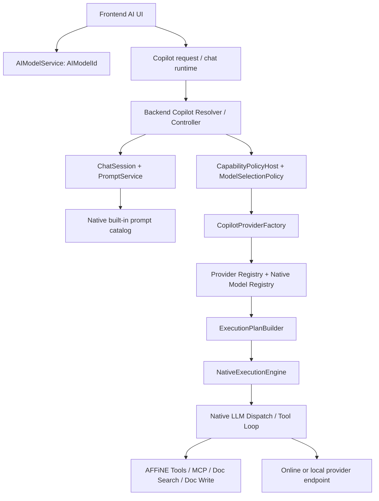
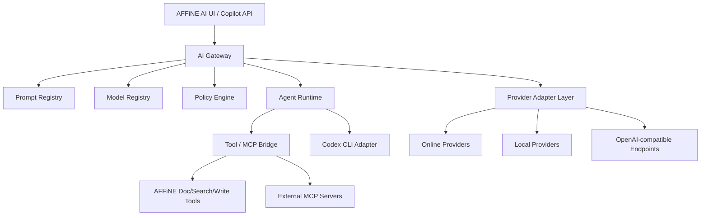
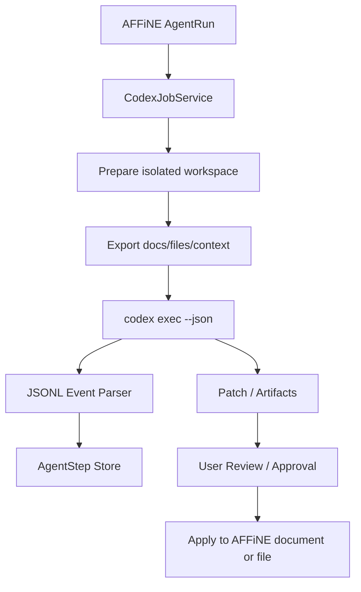

# Overview And Roadmap

Archived from the former docs/ai-capability-modernization-plan.md.
Use docs/ai-modernization/README.md as the active planning entrypoint.
The archived body below may still mention former entrypoint paths; those
references are historical only.

---
# AFFiNE AI 能力梳理与改造计划

> 当前状态：本文已转为历史审计与详细背景文档，不再作为后续
> Goal 任务的默认执行入口。继续 AI 现代化任务时，先阅读
> `/docs/ai-modernization/README.md` 和
> `/docs/localmind-ai-goal-continuation.md`，再按需查阅本文的具体章节。
>
> 最新 durable 进展：repair execution 已支持通过排队 worker 发布
> Prompt Registry、Task Route Policy、Model Registry 和 Provider Registry 的
> workspace-scoped DB revision。Provider Registry 已有 DB-backed read
> overlay、受限 GraphQL direct publish API，以及受限 queued repair executor；
> 这些路径都只覆盖现有 provider runtime/credentials 的已脱敏 profile
> metadata revision，不写 provider secrets。Provider health 已有
> DB-backed workspace state overlay，可影响现有 route health gate；仍未提供
> 通用编辑器、bulk migration、secret management 或自动 health probe worker。

## 1. 背景与目标

当前 AFFiNE canary 已经具备一套较完整的 Copilot/AI 基础能力：前端 AI 面板、Prompt 驱动的会话、后端 Copilot 插件、Native LLM 调度层、工具调用、文档检索、图片生成、Embedding、Rerank、BYOK 与 MCP 工具暴露等。但是从自部署和二次开发角度看，现有实现仍然偏向官方托管模型组合和固定内置 Prompt 目录，模型、提示词、工具、Agent 编排之间的耦合较强。

本改造计划的目标是建设一个可长期扩展的 AI 中间层，使 AFFiNE 分支可以：

- 兼容更多在线模型：OpenAI、Anthropic、Gemini、Azure OpenAI、OpenRouter、DeepSeek、Qwen/DashScope、Moonshot/Kimi、Zhipu、Volcengine、Together、Groq、Mistral 等。
- 兼容更多本地模型：Ollama、LM Studio、vLLM、llama.cpp server、LocalAI，以及任意 OpenAI-compatible endpoint。
- 将模型管理从源码内置清单升级为可配置、可观测、可验证的 Model Registry。
- 将 Prompt 从静态内置 JSON 升级为版本化、可灰度、可回滚、可评测的 Prompt Registry。
- 实现面向办公场景的 Agent 能力：文档、知识库、会议、表格、PPT、任务、自动化流程。
- 对接成熟开源 Agent，包括 Codex CLI，将其作为外部 Agent 后端/工具执行器接入 AFFiNE。
- 在现有 Copilot 能力上做渐进式演进，减少对上游 AFFiNE canary 的冲突面。

## 2. 当前 AI 能力总览

### 2.1 后端 Copilot 插件

主要代码位于 `packages/backend/server/src/plugins/copilot`。

| 模块                | 关键文件                                                                                                            | 当前职责                                                                                                                              |
| ------------------- | ------------------------------------------------------------------------------------------------------------------- | ------------------------------------------------------------------------------------------------------------------------------------- |
| 配置                | `config.ts`                                                                                                         | 定义 Copilot 开关、BYOK、provider profiles、provider defaults、Unsplash、Exa、Copilot storage。                                       |
| Provider 注册与路由 | `providers/provider-registry.ts`、`providers/factory.ts`                                                            | 构造 provider registry，解析 `providerId/modelId` 前缀，按 output type、默认 provider、BYOK、额度策略选择路线。                       |
| Provider 实现       | `providers/openai.ts`、`providers/gemini/*`、`providers/anthropic/*`、`providers/cloudflare.ts`、`providers/fal.ts` | 对接 OpenAI、Gemini、Anthropic、Cloudflare Workers AI、FAL 等后端。                                                                   |
| 模型能力匹配        | `providers/provider-model-runtime.ts`                                                                               | 调用 native model registry，判断模型是否支持 text/object/structured/embedding/rerank/image、附件和远程 URL。                          |
| 执行计划            | `runtime/execution-plan.ts`                                                                                         | 将一次 text、streamText、streamObject、structured、embedding、rerank、image 请求转为可序列化 execution plan 和 native dispatch plan。 |
| Native 执行         | `runtime/native-execution-engine.ts`                                                                                | 调用 native LLM dispatch，处理流式输出、tool loop、BYOK usage、错误映射。                                                             |
| 会话编排            | `runtime/turn-orchestrator.ts`                                                                                      | 从前端 query 读取 `modelId`、reasoning、webSearch、toolsConfig、BYOK lease，并完成 chat/object/image 选择与流式输出。                 |
| 模型选择策略        | `runtime/model-selection-policy.ts`、`runtime/hosts/capability-policy-host.ts`                                      | 在 prompt 默认模型、可选模型、前端请求模型、pro 模型之间做选择。                                                                      |
| Prompt              | `prompt/service.ts`                                                                                                 | 读取 native 内置 Prompt catalog，渲染 prompt/session。当前 canary 不再默认从 DB prompt 表读取内置 prompt。                            |
| 固定任务模型        | `runtime/task-policy.ts`                                                                                            | 历史上固定 embedding/rerank 默认模型；当前已改为返回空模型条件，让 provider registry/default route 选择任务模型。                     |
| 工具                | `tools/*`                                                                                                           | 文档读取、写入、同步、搜索、摘要、图片/网页/代码 artifact 等工具。                                                                    |
| MCP                 | `mcp/provider.ts`、`mcp/controller.ts`                                                                              | 将 AFFiNE workspace 工具以 MCP server 形式暴露，包含 read/search，dev/canary 下还有 create/update document。                          |
| Embedding           | `embedding/client.ts`、`embedding/job.ts`                                                                           | 文档、文件、workspace 语义检索所需的 embedding 任务和客户端。                                                                         |

### 2.2 Native LLM 层

主要代码位于 `packages/backend/native/src/llm`。

| 模块             | 关键文件                                            | 当前职责                                                                                       |
| ---------------- | --------------------------------------------------- | ---------------------------------------------------------------------------------------------- |
| 内置 Prompt 目录 | `assets/prompts/built-in.json`、`prompt_catalog.rs` | 编译内置 prompt，支持 partial、builtin params、模板参数、token 计算。                          |
| 模型注册         | `core/model_registry.rs`                            | 包装 `llm_adapter::core::default_model_registry_variants()`，提供模型解析和 capability match。 |
| 请求构建         | `core/request_builder/*`                            | 将 AFFiNE prompt message、tools、attachments 转为 provider 协议请求。                          |
| Dispatch         | `ffi/dispatch.rs`、`ffi/middleware.rs`              | Native 层实际发起 LLM 请求，提供 middleware、stream normalizer。                               |
| Tool loop        | `host/tool_loop/*`                                  | 支持模型工具调用循环。                                                                         |
| Action           | `action/*`                                          | 内置 action runtime/catalog，例如 slides outline。                                             |

### 2.3 前端 AI 能力

主要代码位于 `packages/frontend/core/src`。

| 模块         | 关键文件                                                | 当前职责                                                                                                                                      |
| ------------ | ------------------------------------------------------- | --------------------------------------------------------------------------------------------------------------------------------------------- |
| 模型列表     | `modules/ai-button/services/models.ts`                  | 通过 GraphQL `currentUser.copilot.models(promptName)` 获取当前 prompt 的默认模型、可选模型和 pro 模型，并保存用户选择到全局状态 `AIModelId`。 |
| AI 请求      | `blocksuite/ai/runtime/request/*`                       | 创建 Copilot session、发送请求、处理 action definition。                                                                                      |
| Chat runtime | `blocksuite/ai/runtime/chat/*`                          | 管理 chat session 策略、消息状态和交互流。                                                                                                    |
| AI UI        | `blocksuite/ai/components/*`、`blocksuite/ai/widgets/*` | 渲染 AI 面板、输入框、工具调用结果、edgeless copilot 等。                                                                                     |

### 2.4 当前调用链



## 3. 现有问题与限制

### 3.1 模型与 Prompt 耦合过强

`packages/backend/native/src/llm/assets/prompts/built-in.json` 中每个 prompt 都直接写死 `model` 和 `optionalModels`。例如 chat prompt 默认仍可能指向 `gemini-2.5-flash`，某些写作 prompt 指向 Gemini，代码/Make it real 指向 Claude，图片任务指向 `gpt-image-1` 或 FAL workflow。

这导致自部署时即使配置了 OpenAI provider，只要 prompt 默认模型仍是 Gemini，运行时仍会尝试解析 Gemini 模型，最终出现类似：

```text
No copilot provider available: gemini-2.5-flash
```

### 3.2 模型清单主要来自源码/Native Registry

`provider-model-runtime.ts` 调用 native registry 做模型解析和能力匹配。任意新模型 ID 不是只加 provider config 就一定可用，还需要：

- Native model registry 能解析模型。
- Provider 能匹配该模型的 backend kind。
- 模型 capability 满足 output type、input type、附件、structured、tool calling 等条件。
- Prompt 的 `model` / `optionalModels` 与 provider route 能对上。

这种方式对官方模型稳定，但对自部署用户添加本地模型、OpenAI-compatible 聚合模型、临时新模型不够友好。

### 3.3 Provider 类型扩展成本偏高

当前 provider type 是枚举：

```ts
CopilotProviderType.OpenAI;
CopilotProviderType.Gemini;
CopilotProviderType.GeminiVertex;
CopilotProviderType.Anthropic;
CopilotProviderType.AnthropicVertex;
CopilotProviderType.CloudflareWorkersAi;
CopilotProviderType.FAL;
```

新增 DeepSeek、Qwen、OpenRouter、Ollama、LM Studio、vLLM 等时，如果按 provider type 横向增加，会不断扩大配置 schema、provider token、middleware、runtime host、模型 registry 的改动面。

### 3.4 OpenAI-compatible 后端没有成为一等抽象

大量在线和本地模型都能暴露 OpenAI-compatible API，但当前系统中 OpenAI provider 仍更像官方 OpenAI provider，而不是通用 `openai_compatible` provider。对于模型 alias、工具调用差异、Responses API/Chat Completions 差异、embedding dims、structured output 支持差异，缺少统一配置层。

### 3.5 Embedding 与 Rerank 默认模型硬编码

历史问题：`runtime/task-policy.ts` 曾固定 embedding 和 rerank 默认模型，导致本地部署在没有 Gemini 或 OpenAI 对应 route 时，语义检索、文件索引、rerank 能力失败。

当前代码已将默认配置下的 `TaskPolicy.resolveEmbeddingModelId()`、`resolveWorkspaceIndexingModelId()` 与 `resolveRerankModelId()` 改为返回 `undefined`，由 provider registry、`copilot.providers.defaults`、provider health、route policy 与模型 capability 共同决定默认路线。后续第 63 节又新增 `copilot.tasks.models`，允许自部署显式配置 `embedding`、`workspaceIndexing` 与 `rerank` 逻辑模型 alias；因此“返回 `undefined`”只描述空配置默认行为，不再描述所有运行状态。该项的最小落地与验证记录见第 28、63 节。

剩余约束：workspace embedding 索引仍传入固定 `EMBEDDING_DIMENSIONS = 1024`，这是当前 pgvector 表结构和索引兼容性要求，不等同于默认模型 ID 硬编码。

### 3.6 前端模型列表依赖 prompt 可选模型

`AIModelService` 默认读取 `Chat With AFFiNE AI` 的可选模型；后端 resolver 通过 `PromptService.get(promptName)` 返回 prompt 默认/可选模型，再用 `providerFactory.resolveProvider` 过滤不可用模型。

这意味着：

- Admin 配置了 provider，但 prompt 的 `optionalModels` 没有包含该模型时，前端不会显示。
- Prompt 中包含的模型 provider 不可用时，前端列表会缺项。
- 模型管理 UI 与 prompt catalog 绑定太深。

### 3.7 Prompt 缺少版本化生命周期

当前 built-in prompt 是随代码发布的静态 JSON。它有模板能力，但缺少：

- Prompt version。
- workspace/user override。
- 灰度发布。
- prompt eval。
- 回滚。
- prompt 与模型能力的兼容矩阵。
- prompt 变更审计。

### 3.8 Agent Runtime 还停留在“工具调用增强 Chat”

现有工具调用和 MCP 基础已经存在，但还不是完整办公 Agent 运行时：

- 缺少可持久化 plan/task/run/step 状态。
- 缺少长任务队列和恢复。
- 缺少多 Agent handoff。
- 缺少工具权限审批、变更预览、执行确认。
- 缺少办公任务模板和自动化工作流。
- 缺少跨文档/跨文件的上下文预算管理。

## 4. 目标架构

建议引入一个 provider-neutral 的 AI 中间层，放在现有 Copilot ProviderFactory / Native LLM 层之上或旁边，逐步替代硬编码策略。



### 4.1 核心组件

| 组件                   | 作用                                                                                     | 首要改造点                                                                    |
| ---------------------- | ---------------------------------------------------------------------------------------- | ----------------------------------------------------------------------------- |
| AI Gateway             | 统一入口，归一化 chat、structured、embedding、rerank、image、agent run 请求。            | 从 `CapabilityRuntime` 和 `ExecutionPlanBuilder` 周边开始抽象。               |
| Model Registry         | DB/配置驱动的模型注册中心，支持 alias、capability、endpoint、cost、health。              | 替代 purely native/default registry，保留 native registry 作为内置 fallback。 |
| Provider Adapter Layer | 提供 OpenAI-compatible、Anthropic-compatible、Gemini-compatible、本地 provider adapter。 | 优先新增 `openaiCompatible` 通用 provider，而不是每家厂商都新增 enum。        |
| Prompt Registry        | 版本化 prompt、partial、变量、模型策略、eval、灰度、workspace override。                 | 从 `PromptService` 加 override resolver，内置 prompt 作为 seed/fallback。     |
| Policy Engine          | 选择模型、选择 provider、限流、成本、隐私、本地优先、失败 fallback。                     | 扩展 `ModelSelectionPolicy`、`TaskPolicy`。                                   |
| Agent Runtime          | 长任务、计划、工具调用、多步骤执行、审批、恢复、审计。                                   | 在 `runtime` 下新增 agent run/step/job 模型。                                 |
| Tool/MCP Bridge        | 将 AFFiNE 工具、外部 MCP、Codex CLI 能力统一为 Tool Contract。                           | 复用 `mcp/provider.ts` 和 `tools/*`，新增外部 tool registry。                 |
| Codex CLI Adapter      | 把 Codex CLI 作为代码/文件/自动化类 Agent 后端接入。                                     | 通过 `codex exec --json` 或 app-server 协议封装为异步 job。                   |

## 5. 在线模型兼容计划

### 5.1 新增 OpenAI-compatible Provider

优先不要为每个服务商新增 provider type，而是新增通用 provider：

```ts
type OpenAICompatibleProviderConfig = {
  apiKey?: string;
  baseURL: string;
  headers?: Record<string, string>;
  chatPath?: string;
  embeddingsPath?: string;
  imagesPath?: string;
  compatibility?: {
    apiStyle: 'chat_completions' | 'responses' | 'auto';
    toolCallStyle?: 'openai' | 'anthropic' | 'none';
    structuredOutputStyle?: 'json_schema' | 'json_object' | 'prompt_only';
    streamStyle?: 'sse' | 'openai_sse';
  };
};
```

适配范围：

| 服务                  | 接入方式                                               | 备注                                                            |
| --------------------- | ------------------------------------------------------ | --------------------------------------------------------------- |
| OpenAI                | official OpenAI provider 或 OpenAI-compatible provider | 保留官方 provider 以支持 Responses、images、advanced features。 |
| Azure OpenAI          | OpenAI-compatible + endpoint path override             | 需要 deployment name、api-version 参数处理。                    |
| OpenRouter            | OpenAI-compatible                                      | 模型 ID 多，capability 建议通过配置覆盖。                       |
| DeepSeek              | OpenAI-compatible                                      | 注意 reasoning、tool calling、JSON 输出能力差异。               |
| Qwen/DashScope        | OpenAI-compatible 或专用 adapter                       | 国内网络和模型命名需要 alias。                                  |
| Moonshot/Kimi         | OpenAI-compatible                                      | 长上下文能力应配置 context window。                             |
| Zhipu                 | OpenAI-compatible 或专用 adapter                       | 工具调用和 embedding 能力按实际 API 配置。                      |
| Volcengine            | OpenAI-compatible path override                        | 需要 region/endpoint 管理。                                     |
| Together/Groq/Mistral | OpenAI-compatible                                      | 高吞吐/低延迟模型可作为 fallback route。                        |

### 5.2 Model Alias 与路由策略

不要让 prompt 直接写死厂商模型。建议引入逻辑模型 alias：

| Alias                | 用途                   | 默认能力要求                                  |
| -------------------- | ---------------------- | --------------------------------------------- |
| `office-chat-fast`   | 日常问答、文档 QA      | text、tool calling、streaming、32k+ context。 |
| `office-chat-strong` | 高质量写作、复杂分析   | text、tool calling、reasoning、64k+ context。 |
| `office-structured`  | JSON/NDJSON/表格结构化 | structured output、schema validation。        |
| `office-vision`      | 图片理解               | image input、text output。                    |
| `office-embedding`   | 文档索引               | embedding、可配置 dims。                      |
| `office-rerank`      | 检索重排               | rerank 或 cross-encoder compatible。          |
| `office-image`       | 图片生成/编辑          | image output，可选 image input。              |
| `office-code-agent`  | 代码/文件/脚本任务     | tool calling 或外部 Codex adapter。           |

Prompt 只绑定 alias，Model Registry 再将 alias 解析到真实 provider/model：

```text
Chat With AFFiNE AI -> office-chat-fast -> openai-default/gpt-5.2
Write an article -> office-chat-strong -> anthropic-default/claude-sonnet-4-5
Workspace embedding -> office-embedding -> local-ollama/nomic-embed-text
```

### 5.3 Provider 健康检查与 fallback

Model Registry 应记录：

- provider enabled/disabled。
- endpoint health。
- last success/failure。
- average latency。
- rate limit。
- cost policy。
- workspace allowed providers。
- privacy level：cloud、private cloud、local。

执行计划中 `fallbackOrder` 不应只来自 provider priority，还应综合：

- 请求类型：chat、structured、embedding、rerank、image、agent。
- 数据敏感性：是否包含私有文档、附件、代码、个人信息。
- 用户策略：本地优先、低成本优先、质量优先、速度优先。
- 模型健康状态。
- prompt 对模型能力的最低要求。

## 6. 本地模型兼容计划

### 6.1 支持目标

| 本地后端         | 推荐协议                           | 主要用途                        |
| ---------------- | ---------------------------------- | ------------------------------- |
| Ollama           | OpenAI-compatible 或 Ollama native | chat、embedding、本地隐私场景。 |
| LM Studio        | OpenAI-compatible                  | 桌面本地模型快速接入。          |
| vLLM             | OpenAI-compatible                  | 服务端高吞吐推理。              |
| llama.cpp server | OpenAI-compatible                  | 轻量本地/边缘部署。             |
| LocalAI          | OpenAI-compatible                  | 本地多模态/embedding 兼容层。   |

### 6.2 本地模型配置示例

建议在 Admin 中支持如下配置结构，最终落 DB 或 config：

```json
{
  "id": "local-ollama",
  "type": "openai_compatible",
  "displayName": "Local Ollama",
  "baseURL": "http://host.docker.internal:11434/v1",
  "apiKey": "ollama",
  "privacy": "local",
  "models": [
    {
      "id": "qwen3:32b",
      "aliases": ["office-chat-fast"],
      "capabilities": ["text", "streaming", "tool_calling"],
      "contextWindow": 32768
    },
    {
      "id": "nomic-embed-text",
      "aliases": ["office-embedding"],
      "capabilities": ["embedding"],
      "embeddingDimensions": 768
    }
  ]
}
```

### 6.3 本地模型能力降级

本地模型能力差异大，中间层必须支持能力降级：

| 能力              | 强模型路径      | 弱/本地模型降级                                   |
| ----------------- | --------------- | ------------------------------------------------- |
| Tool calling      | 原生 tool calls | prompt-only function call JSON + parser + retry。 |
| Structured output | JSON Schema     | JSON object mode / prompt约束 / repair loop。     |
| Long context      | 直接塞上下文    | RAG 检索 + 分块总结 + sliding window。            |
| Vision            | 多模态模型      | OCR/文件解析后转文本。                            |
| Rerank            | 原生 rerank API | embedding similarity 或本地 cross-encoder。       |
| Image generation  | 原生 image API  | ComfyUI/Stable Diffusion/FAL adapter。            |

### 6.4 Docker 自部署注意点

容器内访问本机服务时，应支持：

- `host.docker.internal`。
- 用户自定义 Docker network service name。
- Admin UI 中 endpoint connectivity test。
- embedding dimensions 变更后重建索引。
- 本地模型 cold start timeout、并发限制、队列。

## 7. Prompt 能力升级计划

### 7.1 Prompt Registry 数据模型

新增或升级 prompt 数据结构：

```ts
type PromptDefinition = {
  id: string;
  key: string;
  version: string;
  title: string;
  scope: 'system' | 'workspace' | 'user';
  status: 'draft' | 'active' | 'deprecated' | 'archived';
  modelAlias: string;
  fallbackModelAliases?: string[];
  inputSchema?: JsonSchema;
  outputSchema?: JsonSchema;
  tools?: string[];
  partials?: string[];
  messages: Array<{
    role: 'system' | 'user' | 'assistant';
    template: string;
  }>;
  evals?: {
    datasetId: string;
    minScore: number;
  }[];
  rollout?: {
    percentage: number;
    workspaceIds?: string[];
  };
};
```

### 7.2 Prompt Resolver 顺序

建议 `PromptService` 改为分层解析：

1. User override。
2. Workspace active prompt。
3. System DB prompt。
4. Native built-in prompt fallback。

这样既保留上游内置 prompt，又允许自部署版本不改源码直接升级 prompt。

### 7.3 Prompt 与模型解耦

Prompt 不直接绑定真实模型 ID，而绑定：

- `modelAlias`：逻辑模型。
- `requiredCapabilities`：必须支持的能力。
- `preferredTraits`：低延迟、强推理、低成本、本地优先等。

示例：

```json
{
  "key": "Chat With AFFiNE AI",
  "version": "2026.06.01",
  "modelAlias": "office-chat-fast",
  "requiredCapabilities": ["text", "streaming", "tool_calling"],
  "fallbackModelAliases": ["office-chat-strong"]
}
```

### 7.4 Prompt 评测与发布

建立 prompt 发布流水线：

- Prompt lint：模板变量、partial、JSON Schema、tool references。
- Golden cases：固定输入输出质量检查。
- Provider matrix eval：同一个 prompt 在 OpenAI/Anthropic/Gemini/本地模型上的兼容性。
- Regression eval：升级 prompt 后对历史办公任务重新跑样本。
- Canary rollout：按 workspace 或用户灰度。
- 自动回滚：错误率、超时率、JSON parse 失败率、tool call 失败率超过阈值。

## 8. 办公 Agent 能力计划

### 8.1 目标场景

| Agent             | 能力                                                     |
| ----------------- | -------------------------------------------------------- |
| 文档写作 Agent    | 大纲、续写、改写、语气调整、引用、长文生成、版本对比。   |
| 知识库问答 Agent  | 跨文档检索、引用、来源校验、答案追问。                   |
| 会议 Agent        | 音频转写、说话人分离、摘要、行动项、待办同步。           |
| 表格/数据库 Agent | 表格理解、字段生成、分类、批量清洗、公式建议、图表解释。 |
| PPT Agent         | 主题扩展、页面大纲、配图关键词、讲稿、风格统一。         |
| 项目管理 Agent    | 从文档提取任务、生成计划、跟踪状态、周报/月报。          |
| 文件处理 Agent    | PDF/Word/Excel/图片解析、摘要、转换、归档。              |
| 自动化 Agent      | 定时总结、监控变更、批量处理 workspace 内容。            |

### 8.2 Agent Runtime 数据模型

```ts
type AgentRun = {
  id: string;
  workspaceId: string;
  userId: string;
  agentKey: string;
  status: 'queued' | 'running' | 'waiting_approval' | 'completed' | 'failed' | 'cancelled';
  input: unknown;
  plan?: AgentPlan;
  currentStepId?: string;
  createdAt: Date;
  updatedAt: Date;
};

type AgentStep = {
  id: string;
  runId: string;
  type: 'model' | 'tool' | 'approval' | 'handoff' | 'codex' | 'mcp';
  status: 'pending' | 'running' | 'completed' | 'failed' | 'skipped';
  input: unknown;
  output?: unknown;
  error?: string;
};
```

### 8.3 权限与审批

办公 Agent 需要明确区分读、写、外发、执行命令：

| 操作              | 默认策略                                        |
| ----------------- | ----------------------------------------------- |
| 读取当前文档      | 允许，遵守 AFFiNE 权限系统。                    |
| 跨 workspace 搜索 | 需要 workspace 权限。                           |
| 修改文档          | 先生成 diff/preview，再确认写入。               |
| 创建新文档        | 可配置自动创建或确认。                          |
| 调用外部在线模型  | 根据 workspace 隐私策略决定。                   |
| 调用本地模型      | 可设为隐私优先默认路径。                        |
| 执行 Codex/命令行 | 必须在隔离 workspace、sandbox、审批策略下运行。 |

### 8.4 工具层扩展

在现有 `tools/*` 基础上，建议统一为 Tool Contract：

```ts
type ToolContract = {
  name: string;
  description: string;
  inputSchema: JsonSchema;
  outputSchema?: JsonSchema;
  permission: {
    scope: 'doc' | 'workspace' | 'external' | 'filesystem' | 'network';
    action: 'read' | 'write' | 'execute';
    approval?: 'never' | 'on_write' | 'always';
  };
  handler: ToolHandler;
};
```

工具来源：

- AFFiNE internal tools：doc_read、doc_write、doc_search、section_edit、conversation_summary。
- MCP tools：workspace MCP、外部 MCP server。
- Connector tools：邮件、日历、网盘、知识库、Issue 系统。
- Local execution tools：Codex CLI、脚本、文件转换、OCR。

## 9. Codex CLI / 开源 Agent 对接计划

### 9.1 对接原则

Codex CLI 不应被直接当成普通 LLM provider，而应作为外部 Agent Backend：

- 它有自己的模型选择、工具执行、文件系统操作、sandbox、approval、安全策略。
- 它适合代码、文件、仓库、脚本、自动修复、复杂多步任务。
- AFFiNE 应负责传入任务上下文、权限边界和工作目录，Codex 负责在受控环境中执行。

### 9.2 可用接口形态

根据 Codex CLI 官方手册，适合接入的形态包括：

| 形态                         | 用途                                                                                                     | 接入建议                               |
| ---------------------------- | -------------------------------------------------------------------------------------------------------- | -------------------------------------- |
| `codex exec`                 | 非交互式任务，适合后台 job。                                                                             | 首选第一阶段 adapter。                 |
| `codex exec --json`          | 输出 JSONL 事件流，包含 thread、turn、item、command、file changes、MCP tool calls、plan updates 等事件。 | 用于映射到 AFFiNE AgentRun/AgentStep。 |
| `codex exec --output-schema` | 约束最终结构化输出。                                                                                     | 用于报告、任务提取、文档生成。         |
| `codex app-server`           | 本地开发/调试服务，支持 stdio/WebSocket/Unix socket。                                                    | 后续用于更深度的双向协议。             |
| `codex mcp-server`           | 将 Codex 作为 MCP server 暴露。                                                                          | 可作为 Tool/MCP Bridge 的候选路径。    |

### 9.3 Codex Adapter 架构



### 9.4 上下文桥接

AFFiNE 到 Codex：

- 当前文档 markdown。
- 相关文档检索结果和引用 metadata。
- 附件文件副本。
- 用户任务说明。
- 允许写入的目标：新文档、当前文档、临时 workspace、代码仓库。
- 规则文件：可生成任务专属 `AGENTS.md` 或 prompt constraints。

Codex 到 AFFiNE：

- 最终回答。
- JSONL 事件流。
- 执行过的命令摘要。
- 文件 diff。
- 生成 artifacts。
- 待用户确认的变更。
- 错误和日志。

### 9.5 安全边界

Codex Adapter 必须默认隔离：

- 每个 AgentRun 使用临时工作目录。
- 默认只读导出 AFFiNE 文档，写入必须走 AFFiNE API 或显式 apply。
- 默认关闭危险权限；需要命令执行时配置 sandbox。
- API key 只注入 Codex 进程，不暴露给用户文档或日志。
- 对输出 patch 做大小、路径、文件类型限制。
- 所有写入 AFFiNE 的结果都要经过权限检查和审计。

## 10. 配置与数据模型设计

### 10.1 ProviderProfile

```ts
type ProviderProfile = {
  id: string;
  type: 'openai' | 'openai_compatible' | 'anthropic' | 'gemini' | 'fal' | 'local' | 'agent';
  displayName: string;
  enabled: boolean;
  priority: number;
  privacy: 'cloud' | 'private_cloud' | 'local';
  config: Record<string, unknown>;
  middleware?: ProviderMiddlewareConfig;
  health?: {
    status: 'unknown' | 'healthy' | 'degraded' | 'down';
    lastCheckedAt?: string;
    lastError?: string;
  };
};
```

### 10.2 ModelDefinition

```ts
type ModelDefinition = {
  id: string;
  providerId: string;
  rawModelId: string;
  displayName: string;
  aliases: string[];
  enabled: boolean;
  capabilities: {
    input: Array<'text' | 'image' | 'audio' | 'file'>;
    output: Array<'text' | 'object' | 'structured' | 'embedding' | 'rerank' | 'image'>;
    toolCalling?: boolean;
    streaming?: boolean;
    structuredOutput?: boolean;
    remoteAttachments?: boolean;
  };
  limits?: {
    contextWindow?: number;
    maxOutputTokens?: number;
    embeddingDimensions?: number;
  };
  cost?: {
    inputPer1M?: number;
    outputPer1M?: number;
  };
};
```

### 10.3 ModelRoute

```ts
type ModelRoute = {
  alias: string;
  routes: Array<{
    providerId: string;
    modelId: string;
    weight?: number;
    priority?: number;
    conditions?: {
      workspaceId?: string;
      featureKind?: string;
      privacy?: 'cloud' | 'private_cloud' | 'local';
    };
  }>;
};
```

## 11. 关键代码改造点

| 阶段 | 文件/模块                             | 改造内容                                                                                              |
| ---- | ------------------------------------- | ----------------------------------------------------------------------------------------------------- |
| P0   | `runtime/task-policy.ts`              | 移除 embedding/rerank 硬编码，改为从 Model Registry 选择 alias：`office-embedding`、`office-rerank`。 |
| P0   | `prompt/service.ts`                   | 增加 DB/config override resolver，native built-in 作为 fallback。                                     |
| P0   | `assets/prompts/built-in.json`        | 将真实模型 ID 逐步替换为 alias，或在渲染后做 alias resolution。                                       |
| P0   | `resolver.ts` 的 `models(promptName)` | 返回 Model Registry 中 alias 对应的可用模型，而不是只返回 prompt optionalModels。                     |
| P1   | `providers/config.ts`                 | 增加 `openaiCompatible` provider profile schema。                                                     |
| P1   | `providers/*`                         | 新增通用 OpenAI-compatible adapter，支持 chat、stream、embedding、structured。                        |
| P1   | `provider-model-runtime.ts`           | 支持 DB/config model definitions 与 native registry 合并。                                            |
| P1   | `ExecutionPlanBuilder`                | route selection 增加 alias、privacy、health、cost、fallback 策略。                                    |
| P2   | `PromptService` / Prisma schema       | 新增 prompt version、scope、status、eval、rollout。                                                   |
| P2   | `tools/*`、`mcp/*`                    | 统一 Tool Contract，支持权限声明、审批和外部 MCP。                                                    |
| P2   | 新增 `agent/*`                        | AgentRun、AgentStep、AgentJob queue、事件流、恢复。                                                   |
| P3   | 新增 `agent/codex/*`                  | Codex CLI Adapter，封装 `codex exec --json`、事件解析、artifact apply。                               |
| P3   | 前端 AI UI                            | 模型管理、provider health、Agent run timeline、变更确认 UI。                                          |

## 12. 分阶段路线图

### P0：自部署可用性修复

目标：解决“配置了 OpenAI 但 prompt 仍请求 Gemini/Claude”的根问题。

- 增加模型 alias resolver。
- Prompt 默认模型通过 alias 解析，不直接依赖 `gemini-2.5-flash`。
- Embedding/rerank 默认模型改为配置驱动。
- Admin AI 配置页增加“测试 chat/embedding/structured/image”。
- 前端模型列表改为显示当前可用模型和 alias，而不是仅 prompt optionalModels。
- 保留现有 provider profiles 兼容。

验收：

- 只配置 OpenAI-compatible provider 时，Chat With AFFiNE AI 可用。
- 只配置本地 Ollama chat + embedding 时，普通 chat 和 workspace search 可用。
- 不再出现 prompt 默认 Gemini 导致的 `NO_COPILOT_PROVIDER_AVAILABLE`。

### P1：Provider 与 Model Registry 产品化

目标：让在线/本地模型通过 Admin UI 或配置文件可管理。

- 新增 `openai_compatible` provider。
- Model Registry 支持 DB/config/native 三层合并。
- 支持模型 capability 手动声明和自动探测。
- 支持 provider health check。
- 支持 route fallback 和 alias。
- 支持 workspace 级 provider 策略：本地优先、云优先、禁用外部云。

验收：

- 可在 Admin UI 添加 OpenRouter、DeepSeek、Qwen、LM Studio、Ollama。
- 新模型无需改 native registry 即可被 prompt 使用。
- Chat、structured、embedding 能按 capability 正确路由。

### P2：Prompt Registry 与办公 Prompt 升级

目标：把提示词变成可迭代资产。

- Prompt version、scope、status、rollout。
- Workspace prompt override。
- Prompt eval 数据集和回归测试。
- Prompt 与 tool set、required capabilities 绑定。
- 内置办公 prompt 重构：写作、总结、翻译、会议、PPT、知识库 QA。

验收：

- 可在不改代码的情况下升级 chat prompt。
- prompt 变更可灰度、可回滚。
- prompt eval 能发现 JSON 输出、引用格式、工具调用回归。

### P3：办公 Agent Runtime

目标：从“AI 聊天工具”升级为“办公任务执行系统”。

- AgentRun/AgentStep 持久化。
- 长任务队列、取消、恢复。
- 工具审批和变更预览。
- 文档/PPT/会议/知识库/表格 Agent。
- MCP tool registry。
- Agent timeline UI。

验收：

- 用户可以发起“整理这个 workspace 的会议纪要并生成周报”类长任务。
- Agent 能检索、计划、写入新文档，并在写入前展示预览。
- Agent run 可以失败重试、恢复和审计。

### P4：Codex CLI 与成熟 Agent 对接

目标：把 Codex CLI 作为可替换外部 Agent 后端接入。

- 实现 CodexJobService。
- 支持 `codex exec --json` 事件流解析。
- 支持文档/附件导出到临时 workspace。
- 支持 Codex 输出 patch/artifact 到 AFFiNE 文档。
- 支持安全策略：sandbox、approval、路径限制、密钥隔离。
- 后续评估 `codex app-server` 或 `codex mcp-server` 深度接入。

验收：

- AFFiNE 中可发起“分析这些文档并生成项目方案 Markdown”的 Codex job。
- Codex 执行过程可在 Agent timeline 中展示。
- 写入 AFFiNE 前可 review。

## 13. 测试与验证策略

| 层级        | 测试内容                                                                                   |
| ----------- | ------------------------------------------------------------------------------------------ |
| Unit        | Model alias resolution、capability matching、prompt resolver、provider config validation。 |
| Integration | OpenAI-compatible chat/embedding/structured streaming、本地 Ollama/LM Studio route。       |
| E2E         | 前端模型选择、chat 面板、文档检索、写入工具、图片任务。                                    |
| Eval        | Prompt golden cases、tool call 成功率、JSON schema 输出成功率、引用格式正确率。            |
| Load        | provider fallback、并发、超时、队列、长任务恢复。                                          |
| Security    | workspace 权限、工具审批、Codex sandbox、密钥不落日志。                                    |

## 14. 风险与应对

| 风险                                    | 应对                                                                        |
| --------------------------------------- | --------------------------------------------------------------------------- |
| 上游 canary 频繁变动                    | 中间层尽量新增模块，少改核心调用点；用 adapter 包装现有 CapabilityRuntime。 |
| 本地模型能力不稳定                      | capability 显式配置 + health check + 降级策略 + prompt repair loop。        |
| Prompt 与模型表现差异大                 | prompt eval matrix，按 provider/model 维护 overrides。                      |
| Agent 写入造成误操作                    | 默认 preview/diff，写操作需要权限和审批。                                   |
| Codex 执行命令风险                      | 临时 workspace、sandbox、最小权限、路径 allowlist、输出审计。               |
| embedding dimensions 变化导致索引不可用 | embedding model 变更触发索引版本升级和重建任务。                            |

## 15. 推荐优先级

短期不要先做完整 Agent 平台。建议先修通模型和 prompt 中间层，否则后续 Agent 仍会被模型硬编码和 prompt 硬编码限制。

推荐顺序：

1. P0：模型 alias、Prompt override、embedding/rerank 配置化。
2. P1：OpenAI-compatible provider 和 DB/config Model Registry。
3. P2：Prompt Registry、eval、workspace override。
4. P3：办公 Agent Runtime。
5. P4：Codex CLI Adapter。

这样可以先解决自部署 AI 可用性，再逐步建设办公 Agent 和外部成熟 Agent 对接能力。
