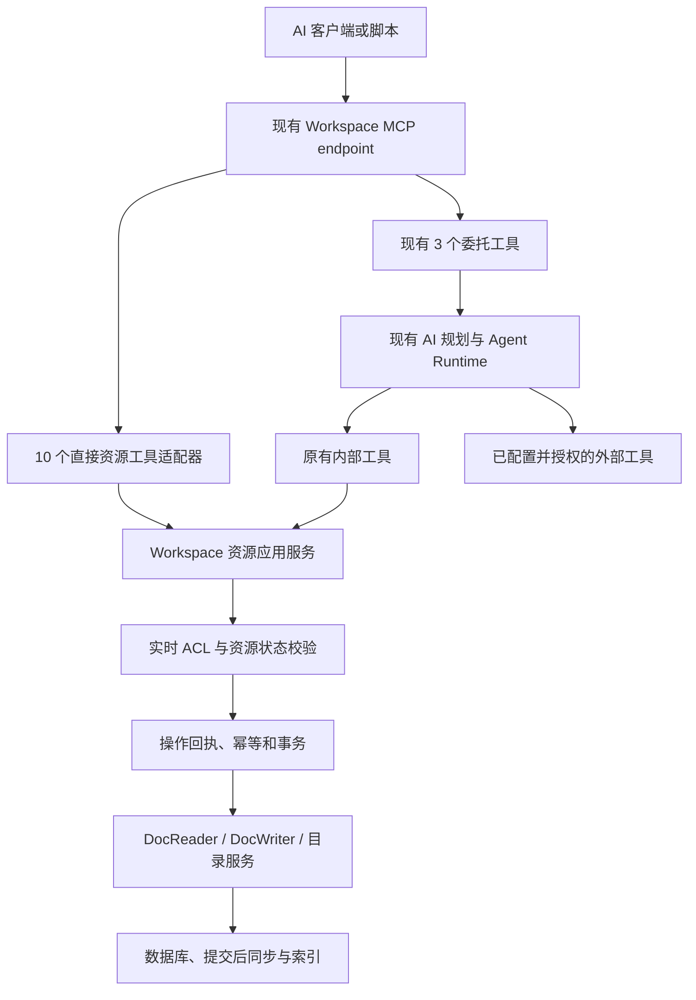
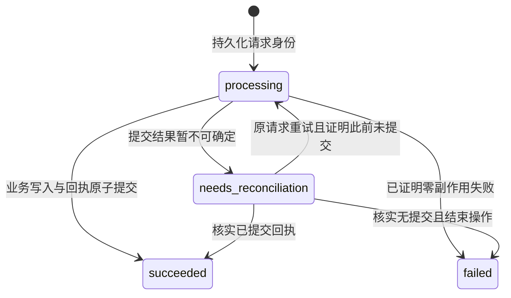

# LocalMind 对外 MCP 直接资源工具设计

## 1. 状态与决策

- 日期：2026-09-16。
- 状态：已实现；独立开关默认关闭，尚未同步或部署到运行环境。
- 对外形式：复用现有 Workspace MCP，首期不新增 REST API。
- 公开工具目录：新增 10 个直接资源工具，保留现有 3 个 AI 委托工具，共 13 个。
- 客户端：支持 MCP 的 AI 客户端与普通脚本均可调用，不要求客户端运行模型。
- 兼容原则：保留 `delegate_to_localmind` 的规划、执行、内部工具调用、外部工具调用、
  任务查询、取消和回调语义。

本文是本次公开工具扩展的产品契约。实际可用能力以
[MCP 接入说明](../localmind-mcp.md)、[工具参考](../localmind-mcp-tools.md)
和服务端注册代码为准。实现与验证结果见 [执行记录](mcp-direct-resource-tools.execution.zh-CN.md)。

相关边界继续遵守：

- [Workspace/Project 写入授权与工具命名契约](workspace-project-ai-write-authorization-remediation.zh-CN.md)。
- [Agent Runtime](tracks/agent-runtime.md)。
- [Project 原生资源](tracks/project-native-resources.md)。
- [验证规则](validation.md)与 [Docker 开发约束](../localmind-docker-development-constraints.md)。

## 2. 要解决的问题

当前外部客户端如果已经完成内容整理，仍须通过 `delegate_to_localmind` 将任务交给
LocalMind AI。例如 Codex 已经总结、脱敏并排版好工作日志，只需要保存正文和归档目录，
再次进入模型规划会增加延迟、成本和内容变化的不确定性。

新增直接资源工具后，调用者提交明确的操作、内容和资源 ID，LocalMind 执行权限校验、
版本检查和持久化，并返回真实结果。直接调用不创建 AI 会话或 AgentRun，不消耗模型额度，
不依赖 BYOK，不自动转交 delegate，也不要求用户到网页再次确认普通可逆写入。

`delegate_to_localmind` 继续服务需要 LocalMind 理解、生成、检索组合和多步骤执行的任务。
客户端也可明确选择将一个本可直接执行的任务委托给 LocalMind；服务端不改写其选择。

## 3. 范围与不变量

### 3.1 本期范围

1. 公开 Workspace 文档查询、读取、创建、正文更新和标题更新。
2. 公开 Workspace 目录查询、创建和文档归档位置调整。
3. 提供直接写入的持久化操作回执、幂等重放和结果查询。
4. 为外部日志等业务提供可选的稳定业务标识 `externalId`。
5. 扩展 MCP 凭据能力选择、发现信息、调用说明、测试和接入文档。

### 3.2 本期不扩展的能力

- 不新增 REST 接口、通用脚本执行工具或任意内部工具调用入口。
- 不公开 Project 资源工具、跨 Workspace 复制、Project 导入与发布。
- 不新增 Office、附件上传下载、结构化数据库块编辑、权限或成员管理工具。
- 不公开文档/文件夹删除、回收站、恢复及永久删除工具。
- 不增加 append、upsert、标题匹配覆盖或自然语言更新接口；调用者读取后完成内容合并。
- 不把 Enterprise/SparkClaw 底层工具目录直接扩展成新的公开工具。

这些能力的既有内部实现和已授权的 delegate 使用方式不因本期公开目录缩小而失效。

### 3.3 必须保持的不变量

- Workspace 身份由 MCP endpoint 和凭据共同绑定；参数不能指定另一个 Workspace。
- 用户身份来自凭据，不接受调用者传入的 actor、用户 ID、会话或 AI 授权证据。
- 直接资源能力与 AI 委托能力独立授权，互不隐式授予。
- 相同领域操作复用实时 ACL、数据模型和存储能力，不能在 MCP handler 中实现较弱规则。
- 直接工具不进入 `ToolRuntime.getTools()`，不创建伪造会话来复用 AI 封装。
- `operationId`、`taskId`、`documentId`、`folderId` 分属不同对象，不能混用。
- 不注册 `doc_create` 等退役名称别名，不按名称猜测资源所属 Project/Workspace。

## 4. 对外目录与发现

### 4.1 保留的 3 个工具

| 工具                     | 行为                                                                   |
| ------------------------ | ---------------------------------------------------------------------- |
| `delegate_to_localmind`  | 保留当前自然语言任务规划、直接回答、优化文档更新和 tool-agent 执行路径 |
| `get_localmind_task`     | 保留当前委托任务状态、结果和有界等待查询                               |
| `control_localmind_task` | 保留取消未完成委托任务的行为，不增加其他控制动作                       |

### 4.2 新增的 10 个工具

| 工具                             | 类型 | 用途                                         |
| -------------------------------- | ---- | -------------------------------------------- |
| `workspace_doc_list`             | 读   | 分页列出可读文档，支持目录和业务标识过滤     |
| `workspace_doc_keyword_search`   | 读   | 在可读文档范围内执行有界关键词搜索           |
| `workspace_doc_read`             | 读   | 读取 Markdown 正文、标题和版本凭据           |
| `workspace_doc_create`           | 写   | 保存调用者提供的文档，并放入指定目录或根目录 |
| `workspace_doc_update`           | 写   | 按预期版本更新正文                           |
| `workspace_doc_update_meta`      | 写   | 按预期版本更新标题                           |
| `workspace_folder_list`          | 读   | 按层分页列出可见文件夹及目录版本             |
| `workspace_folder_create`        | 写   | 在指定父目录或根目录创建文件夹               |
| `workspace_folder_move_document` | 写   | 将文档移动到指定目录，或移回根目录           |
| `workspace_operation_get`        | 读   | 查询本凭据族直接写入的持久化回执             |

新增工具为 5 个读工具、5 个写工具。`workspace_doc_list` 和 `workspace_operation_get`
需要新建公开契约；其余工具名称虽与内部工具一致，仍须建立独立的公开 Schema 和适配器。
不能直接透传内部工具参数，也不能把公开 Schema 写入内部工具快照。

### 4.3 协议与凭据发现

- 复用 `POST /api/workspaces/<WORKSPACE_ID>/mcp`。
- 复用现有 Stateless Streamable HTTP、JSON-RPC 和 Bearer 凭据验证。
- 保持现有协议版本兼容范围；本期不顺带升级 MCP transport 或初始化协议。
- `tools/list` 返回当前凭据被授予、且服务已启用的工具子集，最多 13 个；没有授权的工具
  不因用户本身拥有资源 ACL 而出现。
- `tools/call` 再检查当前凭据和对应 capability，不把已取得的工具列表当成持续授权。
- 每个新工具提供严格的 `inputSchema`、`outputSchema`、用途描述和 annotations。
- 读工具设置只读提示；5 个写工具依赖强制幂等键提供重试语义，但不能标为只读。
  正文替换和移动应提供准确的破坏性提示；annotations 本身不承担授权。
- 发布时提升服务实现版本并更新接入文档；3 个旧工具的输入输出契约不因本期扩展而改变。

## 5. 服务分层与复用



图中的内部工具复用属于针对重叠能力的抽取，不要求一次重构全部内部工具。

| 所有权边界                            | 责任                                                                             |
| ------------------------------------- | -------------------------------------------------------------------------------- |
| `src/plugins/copilot/mcp/`            | endpoint、凭据接入、工具注册、协议 Schema、领域错误到 MCP 结果的映射             |
| `src/core/doc/`                       | 不依赖模型的 Workspace 文档应用服务、Markdown 支持范围、版本检查、创建与归档协调 |
| `src/core/permission/` 与现有目录服务 | 用户、文档、目录的实时权限与写入期间权限校验                                     |
| `src/models/`                         | 操作状态、幂等唯一约束、业务标识映射、事务与持久化审计                           |
| 现有 AI 工具适配器                    | 保留会话、任务、来源审计和内部工具结果形式，调用抽取后的领域能力                 |

资源服务接收服务端构造的授权上下文和结构化命令。上下文区分 `mcp_direct`、AI 内部调用等
来源，但调用方不能用来源字段获得额外权限。正文不进入 prompt；资源服务不依赖
PromptRuntime、Provider、BYOK 或 AI 对话生命周期。

现有创建流程上层依赖 `CopilotDocumentOperation` 和 session；直接写入应复用明确目标后的
创建与放置逻辑，而非复用等待选址状态机。目录工具中的领域权限与操作逻辑如仍位于 AI
适配器，应先提取到现有目录服务，再由两种入口共用。

## 6. 直接工具公共契约

### 6.1 参数约定与边界

- 公开参数使用 camelCase，沿用现有公开 MCP 参数习惯；内部 snake_case 参数保持原状，
  由各自适配器转换。
- 所有对象使用严格 Schema，拒绝未知字段。
- 资源 ID 是有界的不透明字符串，不接受标题或路径代替 ID。
- `title` 去除首尾空白后长度为 1–512；`query` 为 1–128；幂等键和业务标识为 1–256。
- 创建和正文更新使用 `content: { format: "markdown", text: string }`；正文保留原文，
  不做摘要、翻译、语义合并或标题推断。
- 首期正文上限为 1 MiB UTF-8；空正文合法。Schema 字符边界与服务端字节边界均检查。
  HTTP body 上限须留出 JSON 包装和转义空间，不能误把 1 MiB body 等同于 1 MiB 正文。
- 列表 `limit` 默认 50、最大 100；搜索默认 10、最大 20。结果与扫描预算必须有界。
- 游标为服务端签发的不透明值，绑定 actor、Workspace、过滤条件和排序；不能用游标扩大
  权限。每页重查 ACL，不提供未授权资源数量或隐藏路径。
- 所有 5 个写工具强制传 `idempotencyKey`。客户端网络重试复用原键；修改请求内容后使用新键。
- `expectedVersion` 和 `expectedDirectoryVersion` 是服务端签发的并发条件，不是授权凭据。

### 6.2 返回结构

新直接工具统一沿用 `structuredContent.result` 包装，并在 `content` 中给出简洁文字回执。
以下为创建成功示例；示例 ID 和 URL 均为占位值：

```json
{
  "isError": false,
  "content": [{ "type": "text", "text": "文档已保存到指定目录。" }],
  "structuredContent": {
    "result": {
      "contractVersion": "localmind-resource-mcp/v1",
      "status": "succeeded",
      "operationId": "op_example",
      "toolName": "workspace_doc_create",
      "workspaceId": "workspace_example",
      "documentId": "document_example",
      "folderId": "folder_example",
      "version": "opaque-document-version",
      "changed": true,
      "replayed": false,
      "url": "https://localmind.example/<document-route>"
    }
  }
}
```

- 写结果必须包含操作 ID、状态、明确资源 ID、实际位置、版本与 `changed/replayed`。
- URL 按现有实际路由生成；不能返回创建前拼接的成功链接。
- 读结果不创建操作记录，返回 `items/nextCursor` 或单文档内容等工具专用字段。
- 字段随操作类型使用明确的判别联合，不以任意 JSON 取代输出 Schema。
- `succeeded` 只表示该次提交已持久化；随后资源可能被他人修改、移动或删除。
- delegate、任务查询和取消继续使用原有输出结构，不套用本节的新包装契约。

## 7. 十个工具的具体契约

### 7.1 `workspace_doc_list`

输入：`folderId?: string | null`、`externalId?: string`、`cursor?: string`、`limit?: number`。

- `folderId` 省略表示当前 Workspace 全部可读、未入回收站文档；`null` 表示根目录；字符串
  表示指定目录的直接文档。根目录按现有组织服务解释，不把其他不可见目录中的文档当作根目录。
- `externalId` 在本凭据族命名空间内精确查询，并与目录过滤取交集。
- 结果返回文档 ID、标题、类型、可见位置、更新时间、版本和 URL，不默认返回正文。
- 以更新时间及 ID 提供稳定排序和游标分页；同一文档不因多个放置关系重复列出。
- 业务标识查询直接访问持久化映射，不依赖全文索引。

### 7.2 `workspace_doc_keyword_search`

输入：`query: string`、`limit?: number`。

- 复用权限过滤后的关键词检索，不触发 embedding、rerank 或生成模型。
- 结果返回文档 ID、标题、有界纯文本摘要、URL 和 `retrievalMode`。
- 索引不可用时复用已有有界扫描能力；返回 `partial`、`coverage` 和稳定原因码说明覆盖范围。
  索引延迟或扫描预算耗尽时，零结果不能作为“文档不存在”的证据。
- 含 HTML 的内部 highlight 必须规范化为可安全显示的文本，不把检索内容当作调用指令。

### 7.3 `workspace_doc_read`

输入：`documentId: string`。

- 返回标题、完整 Markdown、文档类型、版本、可见位置、URL，以及是否支持正文直接更新。
- 正文和版本必须来自同一权威快照，包含尚未合并进快照的已提交 Yjs updates。
- 正文超过上限返回 `content_too_large`，不能静默截断后提供可用于整篇覆盖的编辑结果。
- 对可读取但不能安全 Markdown 往返的文档，可返回正文和 `contentWritable: false`、原因码；
  不能保证可靠读取时返回 `unsupported_document_kind` 或 `unsupported_document_structure`。

### 7.4 `workspace_doc_create`

输入：`title`、`content`、`folderId?: string | null`、`externalId?: string`、`idempotencyKey`。

- 首期创建普通 BlockSuite page。Office 与 Edgeless 创建不在本接口范围内。
- `folderId` 省略或为 `null` 表示根目录；指定目录无效、已删除、在回收站或无权写入时，
  直接失败，不降级到根目录，不创建选址任务。
- 文档 ID 由服务端在操作记录中预分配，重试不得重新分配。
- 正文、元数据、Workspace 根注册、目标目录放置、业务标识映射、成功回执与审计在同一
  原子提交边界中完成；任何业务步骤失败都不能留下“创建成功但未归档”的半成品。
- 不接收 `addToProject`、来源复制、用户 ID 或权限变更参数。

### 7.5 `workspace_doc_update`

输入：`documentId`、`content`、`expectedVersion`、`idempotencyKey`。

- 更新正文，不修改标题或目录。保留现有结构差异更新和历史能力，不以删除后新建替代。
- 要求 `Doc.Update`；调用者通常通过 `workspace_doc_read` 取得正文和版本。
- 版本不匹配返回 `version_conflict`，零写入；调用者重新读取、合并并使用新键提交。
- 内容等价时返回 `succeeded`、`changed: false`，保留操作回执，不制造无意义正文更新。
- 更新前在锁内检查实际文档结构。首期限定经过无损往返验证的 Markdown 子集；检测到
  数据库块、附件/图片、嵌入或其他不能保留的结构时拒绝正文替换，不丢弃未支持内容。
- read 返回的可写标记仅供调用者参考，执行时必须重新检查。

### 7.6 `workspace_doc_update_meta`

输入：`documentId`、`title`、`expectedVersion`、`idempotencyKey`。

- 首期只更新标题，拒绝任意 metadata map、ACL、分享状态或资源归属字段。
- 更新文档标题及现有 Workspace 元数据投影，遵守同一文档版本条件。
- 标题相同时记录成功的 no-op；不意外修改正文、目录或权限。

### 7.7 `workspace_folder_list`

输入：`parentId?: string | null`、`cursor?: string`、`limit?: number`。

- 省略或 `null` 表示根目录；逐层返回可见、未入回收站的直接子文件夹。
- 返回目录 ID、名称、可见父位置、可执行操作提示、`directoryVersion` 和下一页游标。
- 一页的结果与目录版本一致；目录在翻页间发生变化时返回 `cursor_stale`，调用者重新列出。
- 目录版本覆盖该 Workspace 组织树的相关结构与放置变化。权限仍逐次检查，不能从版本
  值判断或推算隐藏目录内容。

### 7.8 `workspace_folder_create`

输入：`title`、`parentId?: string | null`、`expectedDirectoryVersion`、`idempotencyKey`。

- 在明确的父目录或根目录创建一个文件夹，不递归猜测或创建路径。
- 目录版本不匹配返回 `directory_version_conflict`。
- 为避免月份目录因不同请求重复创建，本工具在目录写锁内检查同级同名文件夹；存在时
  返回 `folder_name_conflict`，仅包含当前可见候选，不自动选中其中一个。
- 不为现有全站目录强加唯一名称约束，不改动既有重复名称；客户端用精确 ID 复用目标。
- 隐藏同名项不能通过错误、候选或总数泄露。创建判定遵循现有父目录权限，不为不可见同名项
  引入可观察的额外存在性门禁。

### 7.9 `workspace_folder_move_document`

输入：`documentId`、`folderId: string | null`、`expectedDirectoryVersion`、`idempotencyKey`。

- 指定目录后，文档保留恰好一个目标放置位置；`null` 移除全部文件夹放置关系，表示移回根目录。
- 明确检查文档读取权、Workspace 组织/同步权，以及所有受影响源位置与目标目录的实时权限。
  若存在调用者无权移除的放置关系，整个操作拒绝，不静默删除该关系。
- 在目录版本条件下执行，返回实际位置与新的 `directoryVersion`。
- 已处于期望位置时返回成功 no-op；不更改文档正文或文档 ACL。

### 7.10 `workspace_operation_get`

输入：`operationId: string`。

- 只查询直接写操作，不推进状态、不触发恢复执行、不调用 AI，也不取消操作。
- 需要 `workspace_operation_get` capability、相同 actor/Workspace/credential family，以及
  当前有效凭据和 Workspace 访问权。
- 返回资源 ID、位置、版本等回执前，检查相关资源当前读取权；目录结果检查目录读取权。
  撤去原写权限不妨碍仍有读取权的调用者核对历史结果。
- 尚未提交的创建操作没有真实文档或文件夹，按目标父目录或根目录的当前读取权核对有界
  处理状态，不能因预分配 ID 尚不存在就错误报告操作不存在。
- 对从未有权查看的操作、其他凭据族、其他 Workspace 以及不可访问的结果，返回统一的
  `operation_not_found`，不泄露历史资源或错误详情。
- 已永久删除资源只在可证明仍有权查看其审计/墓碑时返回有界历史回执；否则同样返回
  `operation_not_found`，不借历史操作恢复资源可见性。
- 首期立即返回状态，不新增长轮询或外部回调；3 个原有工具的等待/回调机制保持原样。

## 8. 凭据与实时授权

### 8.1 能力管理

capability 使用上述完整公开工具名。设置界面分为“直接资源工具”和“AI 委托工具”两组；
每项可独立选择。勾选写工具时提示同时授权 `workspace_operation_get` 便于结果核对，
但服务端不能偷偷附加 capability。

`accessMode` 只是能力集合的兼容投影：包含任一直接写工具、delegate 或任务取消时为
`READ_WRITE`，其余为 `READ_ONLY`。执行以明确 capability 为准，不能仅靠 accessMode 授权。

旧凭据兼容必须显式固定：

1. 现有明确存储的 3 工具 capability 原样保留；轮换继续保留其 capability 与 familyId。
2. 历史空列表/缺省值按原先 3 工具语义固化，不引用扩充后的“全部工具”常量。
3. 兼容旧创建客户端省略 capabilities 的请求时，仍只采用原有默认集合。
4. 新的直接资源权限必须由用户在设置中明确选择；首期可新建资源专用凭据，不要求新增
   原地扩权 API。不得为本期功能自动撤销、扩权或重建既有委托凭据。
5. 从设置到 GraphQL、服务端归一化、数据库持久化、轮换和发现的每一步都检查以上规则。

### 8.2 权限矩阵

所有直接调用先检查有效用户、凭据绑定、capability 和实时 Workspace 访问权。

| 操作                 | 额外实时权限/条件                                                  |
| -------------------- | ------------------------------------------------------------------ |
| 列表、搜索、读取文档 | 每个结果的 `Doc.Read`；展示目录需要目录读取权                      |
| 创建文档             | `Workspace.CreateDoc`、现有创建/同步要求、目标目录写入及组织权限   |
| 更新正文、标题       | `Doc.Update`、文档未入回收站、版本与内容类型条件                   |
| 列出文件夹           | `Workspace.Organize.Read`、逐项目录读取权                          |
| 创建文件夹           | `Workspace.Sync`、父目录 `canCreateFolder`/`canWrite` 等现有条件   |
| 移动文档             | `Doc.Read`、`Workspace.Sync`、所有受影响源/目标目录的组织权限      |
| 查询操作             | 同 actor/Workspace/family、操作查询 capability、结果资源当前读取权 |

直接资源调用不要求 `Workspace.Copilot`，不受 AI 写工具的 dev/selfhosted/canary 开关控制；
是否启用公开资源工具由独立功能开关及凭据能力决定。数据容量、常规限流和领域 ACL 继续有效。
仅有能力名而缺少真实权限时，直接返回失败，不发起权限提升申请。

普通 Workspace 写入不追加 actor-only audience 或“必须同任务创建”门禁。
Project 工具隔离、来源导入和显式发布契约不变。

### 8.3 与 delegate 的授权关系

- 只授权直接资源工具的凭据不能调用 delegate，也不能调用外部集成工具。
- 只授权原有 delegate 能力的凭据仍可按现有规则执行内部文档工具和外部工具，
  无须额外勾选此次公开的资源 capability。
- 外部工具继续受连接状态、具体工具 allowlist、风险/明确意图规则及执行时 ACL 约束。
- 不能用公开 10 工具清单替换 delegate 内部工具类别清单，不能缩减或扩大已有任务的冻结快照。
- 传给原有委托服务及其公开能力快照的集合保持为现有 3 个委托 capability 的交集；新增
  直接资源 capability 由独立注册分支消费，不混入旧任务契约或改变其能力解释。
- 公开 `workspace_operation_get` 不加入内部模型工具集；直接操作状态与 AI 任务状态独立。

## 9. 幂等、业务标识和回执数据

### 9.1 两类标识分别解决的问题

| 标识             | 含义                                                          | 生命周期     |
| ---------------- | ------------------------------------------------------------- | ------------ |
| `idempotencyKey` | 一次创建、更新或移动请求的身份，防止网络重试重复执行          | 一次逻辑操作 |
| `externalId`     | 一篇业务文档的稳定身份，例如 `daily-log/member-02/2026-09-16` | 跨多次修订   |

相同幂等键与相同规范化请求返回同一操作；不同请求返回 `idempotency_conflict`。
请求指纹包含工具名、契约版本、明确目标、内容和并发条件；不包含 JSON 键顺序、请求 ID 或
连接信息。正文不做有损归一化。公开重试先核对幂等结果，再决定是否检查新的版本条件，
避免已成功请求因其旧预期版本而被错误报告为冲突。

幂等记录按 `(workspaceId, actorId, credentialFamilyId, toolName, idempotencyKey)` 唯一。
凭据轮换保留身份；不同工具即使使用相同键也不互相覆盖。重放仍验证当前 capability 与
实时结果读取权限；若需重新执行，还必须重新检查写权限。

`externalId` 按 `(workspaceId, credentialFamilyId, externalId)` 唯一，命名空间来自服务端，
调用者不能冒充另一个集成。新凭据族拥有独立命名空间；跨族复用文档须显式配置已知
documentId，不能声称同一个 externalId 能跨全部客户端自动去重。

不同幂等键创建同一 externalId 时返回 `external_id_conflict`，有读取权时可附已有文档 ID，
无读取权时统一返回 `resource_not_found`，不借冲突泄露现有文档。不自动覆盖或合并。
不论标题是否相同，没有 externalId 的独立创建仍可生成不同文档。
文档入回收站或被永久删除后保留业务标识墓碑，防止重试悄悄重建；解除/重新绑定不在首期范围。

### 9.2 拟新增的持久化模型

以下是逻辑模型，实施时使用仓库命名与迁移约定，不手写生成的 Prisma Client。

| 模型                          | 主要字段与约束                                                                                                                                                            |
| ----------------------------- | ------------------------------------------------------------------------------------------------------------------------------------------------------------------------- |
| `McpResourceOperation`        | ID、契约版本、Workspace、actor、credential family、接收请求的 credential ID、工具名、幂等键、请求指纹、预分配资源 ID、状态、结果摘要、错误码、创建/完成时间；幂等组合唯一 |
| `McpResourceOperationEvent`   | operation ID、事件序号、状态转换/恢复核对、时间与有界证据；追加写，不覆盖历史失败或恢复证据                                                                               |
| `McpResourceExternalDocument` | Workspace、credential family、externalId、documentId、创建操作、墓碑；业务组合唯一，成功绑定不可静默改写                                                                  |
| 现有审计/提交后事件机制       | 复用可表达直接资源来源的审计及 outbox；不足时补充领域事件，不伪造 AI session、run 或 tool-call ID                                                                         |

父对象、actor 和 Workspace 关系必须通过真实外键或现有复合身份约束保证；检查运行中的
凭据族引用方式，避免给没有独立主表的 familyId 伪造外键。引用清理不能级联擦除仍承担
幂等和回执职责的记录。

数据库至少约束合法状态、完成时间与终态一致、成功结果必须绑定目标身份、幂等身份不可变、
业务映射唯一，以及事件序号唯一。成功/失败终态不能被后续重试覆盖。

操作记录不长期保存完整请求正文；文档是正文真相来源。回执只存资源 ID、版本、指纹和
有界位置/结果信息。首期保留幂等摘要与墓碑，不通过后台 TTL 删除它们从而重新开放重复执行；
后续保留策略可裁剪事件详情，但必须保持拒绝重复创建的最小身份记录。

## 10. 事务、并发与故障恢复

### 10.1 直接操作状态



`succeeded`、`failed` 为不可变终态；状态转换用条件更新保护。`needs_reconciliation` 不表示
失败，更不能触发新文档创建。它是协议可表达的异常状态；数据库不可达时，不声称该状态已保存。

首期不新增直接资源 AgentRun、后台业务执行队列或取消工具。普通请求同步执行；并发重复
请求可返回同一个 `processing` 操作及建议查询间隔。状态查询只读。

### 10.2 写入顺序

1. 验证凭据、工具 capability、基础实时 ACL 和输入边界。
2. 在短事务中创建或取得唯一操作身份，冻结请求指纹并预分配目标 ID。
3. 获取操作执行锁；同键并发请求返回既有状态，不能同时开始执行。
4. 在同一个数据库事务中，按统一顺序取得目录、Workspace 根、目标文档等所需领域锁。
   重查凭据有效性、实时 ACL、目标状态与版本条件。
5. 执行正文/元数据/根注册/目录放置，写入 externalId 映射、成功回执与审计。
6. 提交后再发布实时通知和索引工作。不可事务化的消息投递使用持久 outbox 或等价恢复机制。
7. 返回持久化回执。提交后的通知失败不能把已成功业务改记为失败，也不能让客户端重建文档。

锁顺序必须统一覆盖内部工具与同步入口，不能在外层取得多把锁后触发现有服务的逆序锁定。
`withDeferredBroadcasts()` 只负责推迟广播，不等同于建立数据库事务。必须验证嵌套服务实际
共享事务，并处理已有 storage adapter 在事务内提前排队或发出事件的行为。

### 10.3 版本实现

当前 `DocWriter.updateDoc` 没有显式的 expectedVersion 参数，但
`models.doc.lockContentWrite/createUpdates` 已提供 PostgreSQL 事务级文档锁和已提交更新的
单调时间分配。本期应复用这些基础，补齐对外 compare-and-write 契约。

- 版本令牌绑定 Workspace、documentId、实际内容/标题版本和契约版本，不使用客户端时间。
- 从包含 pending updates 的权威状态生成版本，不能用可能滞后的 Markdown 缓存或索引时间。
- 比较预期版本、读取用于 diff 的正文、应用更新与生成新回执必须处于同一锁/事务保护内。
- 标题写入和全部 Web/Electron/同步正文写入必须参与同一版本与互斥规则。
- 后台快照合并不得让版本倒退或使未变化内容获得不一致令牌。
- 目录结构使用对应的 `directoryVersion`，与正文版本分开；移动文档不假装更新正文。
- 版本冲突返回有界的当前版本提示，不自动返回调用者无权读取的正文或目录差异。

复用现有锁不代表已证明并发安全；跨同步入口、目录变动和更新合并的测试是开放写接口的前置条件。

### 10.4 超时与进程重启

- 网络中断或客户端取消等待不等于业务取消；数据库提交结果决定是否成功。
- 若客户端拿到 operationId，使用查询工具核对；若未拿到，用原幂等键和原参数重试。
- 进程终止后，数据库事务级执行锁自动释放。原键重试先检查终态回执；成功就重放。
- 对仍为 processing 的操作，只有取得排他执行锁、确认没有活动事务且原子业务提交不存在，
  才可用本次重试携带的相同请求继续执行。不能因超时或“记录很旧”就直接重做。
- 不保存请求正文意味着未提交操作不会在后台自行恢复业务写入；客户端以原请求重试恢复。
- 已证明回滚的失败返回 failed 和明确错误码。修正参数、权限或冲突后发起新逻辑请求使用新键。
- 查询读取到过期 processing 可以返回“结果尚未确认”的观察提示，但不能改变持久状态或推动执行。

## 11. 错误与结果核对

JSON-RPC 的解析错误、未知方法/工具、非法协议参数沿用现有协议错误机制。
直接工具的领域失败返回 `isError: true` 与结构化 `error.code`，不能只返回自然语言。

| 错误码                                                         | 含义与客户端动作                              |
| -------------------------------------------------------------- | --------------------------------------------- |
| `invalid_input`                                                | 参数不符合契约，修正后提交                    |
| `capability_denied`                                            | 凭据未授权该工具，不自动改用 delegate         |
| `resource_not_found`                                           | 资源不存在或不可见，不泄露差异                |
| `permission_denied`                                            | 对已可见目标缺少对应操作权                    |
| `version_conflict`                                             | 重新读取文档、合并后使用新键提交              |
| `directory_version_conflict` / `cursor_stale`                  | 重新列出目录后决定操作                        |
| `idempotency_conflict`                                         | 同键被用于不同请求，不能继续重试该组合        |
| `external_id_conflict`                                         | 业务文档已经绑定或存在墓碑，不能自动覆盖/重建 |
| `folder_name_conflict`                                         | 可见同级同名目录已存在，按精确 ID 选择        |
| `unsupported_document_kind` / `unsupported_document_structure` | 不支持对应资源或无损 Markdown 修改            |
| `content_too_large` / `quota_exceeded` / `rate_limited`        | 内容边界、容量或频率限制                      |
| `operation_not_found`                                          | 操作不存在或当前无权核对                      |

结果还应区分 `writeOutcome: none | committed | unknown`。已拿到操作身份时返回 operationId；
提交不确定时返回 `unknown`，不能用普通 retryable 布尔值暗示调用者换键重试。
`processing/needs_reconciliation` 返回原 operationId 与查询建议，不能假装完成。
错误、日志和审计均不得包含 token、完整正文、不可见路径或原始数据库异常。

## 12. 日志场景示例与调用路由

### 12.1 首次提交

客户端在自己的上下文中完成日志总结、脱敏和格式整理。目录规则由调用者配置，服务端不理解
“部门/成员/月份”的业务含义，也不按自然语言猜测归档路径。

1. 复用配置的精确目录 ID；需要查找时逐层调用 `workspace_folder_list`。
2. 月份目录不存在时，根据返回的目录版本创建；有同名冲突时重新读取并解析精确身份。
3. 用 `workspace_doc_list({externalId})` 查询当天业务文档。
4. 不存在时调用创建；若并发创建导致 external_id_conflict，核对已有文档，不直接覆盖。

```json
{
  "jsonrpc": "2.0",
  "id": 1,
  "method": "tools/call",
  "params": {
    "name": "workspace_doc_create",
    "arguments": {
      "title": "2026-09-16｜member-02｜工作日志",
      "content": {
        "format": "markdown",
        "text": "## 今日完成\n\n- 完成直接资源 MCP 工具设计。\n"
      },
      "folderId": "folder_example",
      "externalId": "daily-log/member-02/2026-09-16",
      "idempotencyKey": "daily-log-member-02-20260916-create-001"
    }
  }
}
```

这是工具调用消息示例，实际客户端仍按服务支持版本完成初始化与认证。
若调用者已持有明确目录和唯一新业务身份，可直接创建，无须先搜索或读取目录。

### 12.2 补交与修订

1. 通过 externalId 或已保存的 documentId 定位文档。
2. `workspace_doc_read` 取得完整正文与版本。
3. Codex 或脚本按既定日志格式合并内容。
4. `workspace_doc_update` 提交合并后正文、expectedVersion 和新幂等键。
5. 有版本冲突时重读并比较，不原样盲重试；成功时报告真实文档链接与结果。

标题格式、日期/时区、脱敏和日志业务规则归调用者工作流所有，不增加 LocalMind 模型调用。

### 12.3 更新公开调用说明

MCP server instructions、工具描述和客户端工作流应采用以下决策规则：

| 用户/调用者意图                                          | 入口                      |
| -------------------------------------------------------- | ------------------------- |
| 查询已知 AI 委托任务                                     | `get_localmind_task`      |
| 取消已知 AI 委托任务                                     | `control_localmind_task`  |
| 核对已知直接写操作                                       | `workspace_operation_get` |
| 操作和目标已明确，直接读取/保存/整理资源                 | 对应的直接资源工具        |
| 明确要求 LocalMind AI 处理，或将完整任务委托给 LocalMind | `delegate_to_localmind`   |

移除“所有 LocalMind 读写都必须 delegate”和“公开工具只有 3 个”的排他性说明。
继续禁止把 LocalMind MCP 当作普通聊天的全局路由器。直接调用失败不能自动改用 AI 委托
绕过 capability、资源权限、版本冲突或不支持的内容类型。

客户端日志 skill 如包含强制 delegate 的旧规则，须在实际启用直接能力时同步调整；
凭据尚未具备直接能力的客户端仍按其明确选择的旧委托工作流运行。本次设计文档不修改
用户机器上的 skill、不签发凭据、不触发任何真实日志提交。

## 13. 实施顺序与兼容迁移

### P1：公开契约与共享基础

- 固定 13 工具目录和新工具输入输出 Schema；区分公开能力集合与内部 tool categories。
- 抽取资源应用服务，复用权限、文档读写、目录组织与现有事务锁。
- 新增操作、事件和业务标识映射迁移；实现版本令牌、原子创建归档和提交后事件机制。
- 新功能开关默认关闭，旧 3 工具正常服务。

### P2：直接读写工具

- 实现 5 个读工具和 5 个写工具，覆盖结果核对、分页、幂等和冲突处理。
- 共享能力的内部适配器保留原有 Schema、会话上下文和结果投影。
- 通过模型服务关闭、进程中断和 Web 同步并发测试。

### P3：凭据设置与调用说明

- 扩展 capability 常量、归一化、accessMode 投影、凭据 UI 与对应 GraphQL 消费。
- 涉及 GraphQL operation/schema 变化时运行既有生成流程，不手工修改生成文件。
- 固化旧凭据默认集合；新资源 capability 仅明确授权后生效。
- 更新 MCP 中英文指南、工具参考、实际适用的日志工作流与用户说明。
- 实现落地时同步 AGENTS.md 中的公开 MCP 导航及相关 source-of-truth 文档；本设计阶段
  不将现状文档改写成已实现 13 工具。

### P4：验证与受控启用

- 在隔离 Linux 环境验证迁移与功能，完成 delegate 与外部工具回归。
- 部署迁移前备份；按既有 Docker 和运行同步流程执行，部署另行明确安排。
- 启用功能后仅新授权凭据发现直接工具，旧客户端仍看到原有子集。
- 本期不改变旧 delegate 的请求/完成契约，不触发旧委托任务退役，不重写历史快照。
- 回滚优先关闭新直接工具的业务入口，保留已写资源、操作回执和查询核对能力；
  数据库兼容迁移不通过删除新业务数据回滚。

主要改动入口：

- `packages/backend/server/src/plugins/copilot/mcp/{provider,controller,capabilities,credential,resolver,types}.ts`
- `packages/backend/server/src/plugins/copilot/tools/{doc-write,workspace-organization}.ts`
- `packages/backend/server/src/core/doc/{reader,writer,workspace-organization}.ts`
- `packages/backend/server/src/core/doc/adapters/workspace.ts`
- `packages/backend/server/src/models/{doc,mcp-credential}.ts` 及新增直接操作模型
- `packages/backend/server/schema.prisma`、`packages/backend/server/migrations/`
- `packages/common/graphql/src/graphql/` 与前端 MCP 凭据设置消费者
- `docs/localmind-mcp.md`、`docs/localmind-mcp.zh-CN.md`、`docs/localmind-mcp-tools.md`

目录中残留的旧 `create_document/read_document` 等 surface 只能作为复用线索，不能重新
批量注册；其权限、版本、结果和能力契约不等同于本文定义的新公开工具。

## 14. 验收标准

下列为验收要求；已执行命令、覆盖范围和剩余限制见执行记录，不将目标清单等同于测试结果。

| 编号 | 验收场景                                                                                                 |
| ---- | -------------------------------------------------------------------------------------------------------- |
| A01  | 全能力新凭据可发现恰好 13 个工具；各子集凭据只发现所授予工具                                             |
| A02  | 原有 3 工具凭据、缺省/空 capability 历史凭据和轮换凭据均不自动扩权                                       |
| A03  | 仅资源凭据不能 delegate；仅 delegate 凭据仍能完成原有内部文档和授权外部工具任务                          |
| A04  | 无 BYOK、无模型额度、模型 provider 被测试桩禁止调用时，直接日志读写仍成功，模型调用次数为零              |
| A05  | 直接读写不产生 AI session、AgentRun、AI callback 或额外网页审批                                          |
| A06  | 缺少实时资源/目录权限时失败；锁等待中撤权、凭据撤销和用户停用均阻止新的写入                              |
| A07  | Workspace endpoint 与 token 不匹配、Project 资源 ID、伪造 actor/未知参数均被拒绝                         |
| A08  | 文档列表/搜索/目录分页不泄露不可读资源、隐藏路径、总数或游标信息；索引降级准确标注覆盖范围               |
| A09  | 创建并归档后有一个真实文档及正确目录位置；任一业务步骤故障时全部回滚                                     |
| A10  | 同键相同请求并发/重试只产生一次副作用与一个成功回执；同键不同请求明确冲突                                |
| A11  | 不同键同 externalId 并发创建只绑定一篇文档；标题相同但不同业务身份不会被自动合并                         |
| A12  | externalId 的凭据族隔离、轮换连续性、回收站/永久删除墓碑和业务冲突均可证明                               |
| A13  | 文档读取正文与版本一致；Web/Electron/同步入口并发修改使旧版本直接更新失败且保留他人内容                  |
| A14  | pending updates、缓存失效和后台快照合并不导致版本倒退、旧读或假冲突                                      |
| A15  | 标题与正文并发、目录变动与移动并发正确冲突；多个源放置关系中任一不可操作时不部分移动                     |
| A16  | 不支持的结构、超大正文、非法资源类型拒绝写入；空正文、中文 UTF-8 与 no-op 正确处理                       |
| A17  | 请求断连、提交后响应丢失、进程重启与活动重复调用不重复创建；原键可核对或安全恢复                         |
| A18  | 查询操作只读；不同 family/Workspace 无法查询；失去结果读取权后不能重放敏感回执                           |
| A19  | 事务提交后的通知/索引故障可恢复，不把持久化成功改为失败，不广播已回滚内容                                |
| A20  | 原 delegate 的优化更新、tool-agent、冻结能力、附件、查询、取消、回调与 Enterprise/SparkClaw 路径回归通过 |
| A21  | 原有在途 delegate 任务按原契约继续，未因公开能力集合扩充扩大内部快照或被错误退役                         |
| A22  | 从旧数据库升级保留既有凭据和任务；新增唯一约束、状态约束和恢复证据经过真实 PostgreSQL 验证               |
| A23  | 审计可区分直接 MCP 与 AI 委托来源；日志、错误、回执中没有 token、完整私密正文或不可见资源信息            |
| A24  | 凭据设置覆盖加载、空、失败、成功、禁用和重复提交状态；客户端路由说明与实际工具发现一致                   |

实现验证优先复用 `localmind-affine:test` 与隔离 PostgreSQL/Redis，运行领域模型、MCP
controller/provider、权限、并发、故障注入和现有 delegate 回归。不得以 Schema 生成成功
代替行为测试，也不为本功能新建里程碑镜像 tag。

仅创建或修改本文时，执行 Markdown 格式检查、链接检查与 `git diff --check` 即可，
不构建镜像、不修改数据库、不同步运行容器。

## 15. 实现入口与后续启用

本设计基于 2026-09-16 仓库检查；本次实现后的入口如下：

- [公开 provider](../../packages/backend/server/src/plugins/copilot/mcp/provider.ts) 按凭据与开关
  显式组合 3 个委托工具和 10 个直接工具。
- [capabilities](../../packages/backend/server/src/plugins/copilot/mcp/capabilities.ts) 将旧委托
  默认集合与新直接资源能力分离，缺省、空集合和轮换均不自动扩权。
- [内部创建适配器](../../packages/backend/server/src/plugins/copilot/tools/doc-write.ts) 依赖
  AI session 和文档操作服务，继续保留既有授权与执行语义。
- [资源应用服务](../../packages/backend/server/src/core/doc/workspace-resource.ts) 复用
  DocWriter、目录服务和实时 ACL，提供版本检查、原子归档及保守的 Markdown 支持范围。
- [操作模型](../../packages/backend/server/src/models/mcp-resource-operation.ts) 持久化操作身份、
  幂等、事件和 externalId；提交后通知通过独立 outbox 重试。
- [Doc model](../../packages/backend/server/src/models/doc.ts) 合并完整 snapshot 与 pending updates；
  迁移中的数据库锁触发器覆盖 native 快照合并，保证跨入口互斥和版本单调性。
- [目录服务](../../packages/backend/server/src/core/doc/workspace-organization.ts) 共享目录创建、
  所有源位置权限检查和原子移动逻辑，供直接工具与原内部工具使用。
- [ToolRuntime](../../packages/backend/server/src/plugins/copilot/runtime/tool-runtime.ts) 继续
  负责原有内部与动态外部工具；不以公开 13 工具目录取代其注册集合。

后续启用需单独安排数据库备份、运行环境升级、功能开关和新凭据授权；本次未执行部署。
具体测试证据和剩余限制见 [执行记录](mcp-direct-resource-tools.execution.zh-CN.md)。

本期完成标准是：调用者能通过 MCP 直接、确定地完成日志读取、创建、修订、归档与结果核对，
同时原有 AI 委托工作流按原来的授权和执行语义继续工作。
