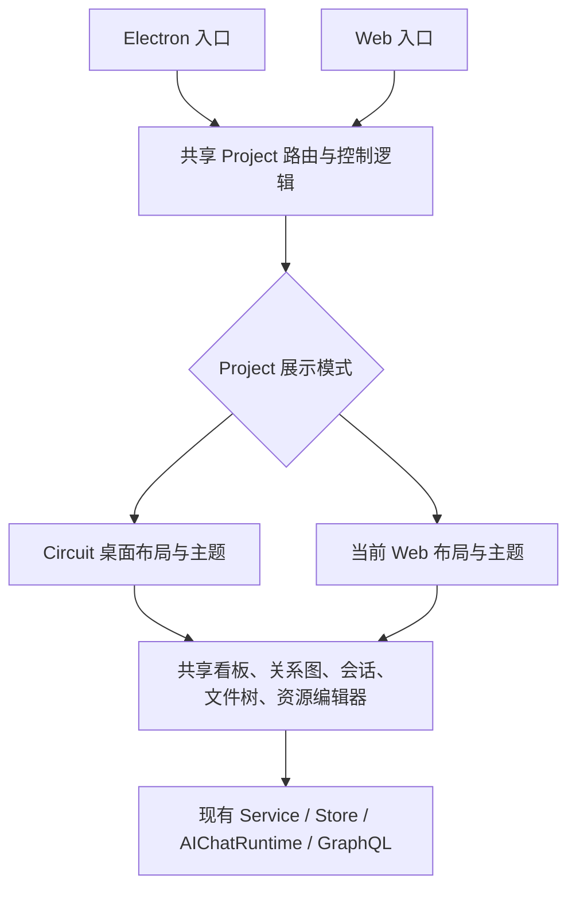

# Project 桌面工作台 v10 Circuit：设计与实施方案

日期：2026-09-29。状态：设计提案，尚未实施；不替代已确认的 Project、原生资源、工单与关系图契约。

后续开发入口：[开发文档](/Users/dev2/Documents/project/LocalMind/docs/ai-modernization/project-workbench-v10-desktop-development.zh-CN.md) 与 [Goal 指令](/Users/dev2/Documents/project/LocalMind/docs/ai-modernization/project-workbench-v10-desktop.goal.md)。开发文档细化了阶段和验收，并将关系图内部形态交由当前独立契约管理；本方案中的旧图布局描述仅作为当时基线。

## 1. 目标与范围

将 Electron 客户端的 Project 工作台改为参考 HTML 的 Circuit 风格，覆盖任务总览、关系视图、项目会话、项目文件和资源编辑五类状态。还原其空间结构、视觉层次和主要操作路径，并接入 LocalMind 已有的真实业务能力。

本方案按以下范围编排：

- 本期在 Electron 的 `/project` 路由族启用；Web 继续使用当前展示方式。两端继续共享业务组件、状态、协议和编辑器。若后续希望 Web 同步，可启用同一展示变体。
- 浅色模式以参考文件为视觉基准，深色模式使用现有主题体系补齐；不改变 Workspace、Admin 和移动端的整体界面。
- 实施包含布局与组件适配、必要的聊天组件展示扩展、桌面窗口集成和验证。默认不新增数据库表，不更改 Project/工单权限，不新增聊天引擎。
- 本次交付是方案文档。当前源码已存在大量在途改动，实际实施应以届时的工作区为基线逐项接入。

参考文件：[LocalMind AI Collaboration Workspace v10 Circuit Standalone.html](</Users/dev2/Library/Containers/com.tencent.xinWeChat/Data/Documents/xwechat_files/wxid_u1449u9gvaju12_1bbe/temp/RWTemp/2026-09/df7259d4429416b9610a3e4a4cdc0e6a/LocalMind AI Collaboration Workspace v10 Circuit Standalone.html>)。

参考文件 SHA-256：`c2d9a2be24f49eae14998a93f3e2a57d50ce6e8f4b954442a3bf917cca2a1aa7`。检查了最终 `circuit-theme-v10` 的实际渲染，以及条目/关系切换、会话、文件面板、产物预览交互。HTML 内的说明、旧版隐藏界面与演示脚本作为参考材料，不构成变更产品契约的授权。

## 2. 当前实现与改造判断

当前 Electron 的 App 导入 `@affine/core/desktop/router`，Project 路由统一加载 `desktop/pages/intelligence`。因此直接修改这里的公共布局或全局样式，会同时影响 Web。客户端的视觉差异需要在 Project 根部明确限定。

| 能力       | 当前源码基础                                                    | v10 改造内容                                 |
| ---------- | --------------------------------------------------------------- | -------------------------------------------- |
| 独立工作台 | 已有独立 Project 路由、项目导航和管理动作                       | 增加窄系统导航栏，调整项目侧栏与顶部栏       |
| 总览       | `ConversationBoard` 已有待处理、进行中、完成三列及条目/关系切换 | 调整卡片信息层级、列标题、状态与筛选布局     |
| 关系视图   | 已有有限世界坐标、缩放平移、方向分组、工单联动                  | 采用 v10 面板与节点视觉，保留现有图交互      |
| 项目会话   | 已复用 `AIChatRuntime`、`AIChatContent`、`AIChatToolbar`        | 调整消息区、输入区、执行记录和产物卡展示     |
| 右侧上下文 | 已有状态、引用、协作及发布相关信息                              | 重排为可扫描的上下文卡片，突出当前可执行动作 |
| 文件与产物 | 已有项目文件树、资源路由、原生编辑器和面板返回状态              | 实现参考中的文件抽屉及会话/编辑器并列效果    |
| 桌面能力   | 已有独立 Electron 入口、窗口控件、主题同步、DesktopApiService   | 处理拖动区、安全留白、窗口缩放和原生操作     |

结论：主要工作集中在展示层、组件组合及桌面适配。无需为 v10 建立另一份 Project 业务实现。

## 3. 页面设计

### 3.1 整体空间

```text
已有原生窗口区：交通灯 / Windows 控件 / 拖动区域
┌──────┬────────────────┬────────────────────────────────────┐
│系统栏│ 项目与会话侧栏 │ 面包屑、搜索、通知、账号            │
│      │                ├────────────────────────────────────┤
│工作台│ 新任务         │ 总览：条目看板 / 关系图与相关工单   │
│      │ 任务总览       │                                    │
│已有  │ 项目           │ 或                                 │
│入口  │   会话         │                                    │
│      │ 个人工单       │ 会话内容  │ 上下文 / 文件 / 编辑器  │
│设置  │ 项目管理       │ 输入区    │                        │
└──────┴────────────────┴────────────────────────────────────┘
```

系统栏承担跨区域导航，项目侧栏承担项目与私人会话导航，主区域承担当前工作。已有应用窗口壳与这里的系统栏必须先核对，避免出现两套同职责导航或叠加的标题栏。

建议初始尺寸（属于实施目标，需在原生窗口中微调）：

| 区域         | 建议尺寸与行为                                         |
| ------------ | ------------------------------------------------------ |
| 系统栏       | 56px；图标具有文字提示、选中态和键盘焦点               |
| 项目侧栏     | 默认 232px，可拖动，沿用现有宽度持久化与合理边界       |
| 顶部业务栏   | 56px；尺寸不包含原生窗口安全区域                       |
| 上下文栏     | 默认 280px，窄时折叠，保留明确的打开入口               |
| 文件树面板   | 默认 320px，沿用现有树的滚动与菜单行为                 |
| 资源编辑面板 | 默认占主区约一半；会话至少约 360px，编辑器至少约 480px |
| 分隔与留白   | 使用 4/8/12/16/24px 间距层级；面板各自滚动             |

当会话和编辑器的最小宽度无法同时满足时，先收起项目侧栏，再采用内容切换或扩大编辑区。输入框保持可见，文件编辑状态不因布局变化丢失。尺寸约束基于可用容器宽度，不只判断设备名称。

### 3.2 状态 A：任务总览·条目

- 顶部保留“条目 / 关系”切换、真实项目筛选和必要的状态筛选。参考中的 `Demo Workspace` 改为当前真实范围描述，Project 不绑定一个虚构 Workspace。
- 主体为“待我处理 / 进行中 / 已完成”三列；同一会话只对应一张卡片。完成列表保留历史分页，不因参考中的“最近 7 天”截断旧记录。
- 卡片优先显示标题、项目/工单归属、真实状态、需要我执行的动作和最后业务更新时间。详情说明、参与者、产物数量仅在已有可靠数据时显示。
- 颜色辅助表达状态，同时保留文字。整卡进入本人对应会话；菜单承载重命名、固定、标记完成等已有操作。
- “等待他人”保留在进行中，可在列内形成次级分组。待我处理只表达当前用户可以或必须处理的事情。
- 总览没有聊天输入框；“交给 AI 一个新任务”进入现有新会话入口，并明确选择项目。

### 3.3 状态 B：任务总览·关系

- 采用 v10 的浅色关系画布与右侧相关工单面板，保留单个“我”的结构。
- 沿用已确认的“用户 ID + 交付方向”分组、每工单一个摘要、独立展开、缩放/平移、查看全图、定位选中和展开工作区。
- 点击人物或摘要选中、筛选或定位相关工单；“打开对话 / 新建对话”单独执行经授权的会话导航。
- 刷新、展开和调整窗口不随意重置镜头、比例及选中项。支持多人、长标题、双向交付与数据截断提示。
- 原型的固定人员位置和静态连线只用来参考视觉；布局与命中仍由现有图模型和同一坐标变换驱动。

### 3.4 状态 C：项目会话＋上下文

- 顶部显示项目、会话名称和真实状态；保留会话菜单、固定、完成等现有动作。
- 消息采用参考中的清晰作者行、柔和背景、引用标签及产物卡。长消息保持阅读宽度，代码、表格和错误内容仍可展开、复制与滚动。
- 输入区固定在会话底部：文本、已有附件/引用能力、发送、生成中停止、失败重试。保留输入法组合输入、快捷键、草稿和流式滚动行为。
- “执行记录”展示已有 run/step/timeline 的实际阶段、结果和审批状态；无法确定总步骤时使用不定进度或阶段列表，避免固定四格造成虚假完成度。
- 右侧显示当前状态、相关协作者、会话已引用资源与当前可执行动作。项目成员身份不代表可以查看成员的私人聊天。
- 全局 Project BYOK 缺失/异常提示继续可见，管理员配置入口和普通用户说明保持原有授权差异。

### 3.5 状态 D：项目文件

- 文件按钮将上下文栏切换为项目文件树，展示真实目录、搜索、类型和选中态。
- 保留现有创建、上传、重命名、移动、复制、历史、回收站、导入及显式发布入口；低频操作收进菜单，避免把管理能力从新界面中删掉。
- “当前会话引用”是会话引用集合的视图；“AI 产物”须有真实来源证据。缺少来源字段时使用完整文件树，不根据文件名推断。
- 单击打开资源，显式“引用到会话”才改变会话上下文。打开文件不自动引用，不自动共享，也不自动发布。

### 3.6 状态 E：会话＋原生资源编辑器

- 点击消息产物、上下文资源或文件树节点，打开同一个资源编辑面板，基于 `resourceId` 和版本加载真实内容。
- Page/Edgeless、Docs/Sheets/Slides/PDF、普通文件仍分别进入现有组件；支持范围以原生 Office 和资源契约为准。
- 编辑栏提供资源名称、保存/只读状态、权限与租约反馈、已有历史/导出操作。工单成果采用、工具审批、发布授权分别使用对应动作和文案。
- 关闭后回到打开前的上下文/文件树状态，恢复焦点与选中项。后退、前进、刷新及资源深链可恢复正确对象。
- 编辑占用、保存冲突、离线、资源删除和失权都要有明确结果；未保存内容按已有脏状态保护处理。切换侧栏或窗口尺寸不重新创建聊天运行时。

## 4. 视觉规范与参考差异

| 要素   | 实施目标                                                                                   |
| ------ | ------------------------------------------------------------------------------------------ |
| 背景   | Circuit 冷灰底、较亮面板、轻边框与有限阴影，避免所有元素同等突出                           |
| 强调色 | 参考珊瑚红 `#EA4335` 用于品牌强调和主要发送动作；蓝色用于信息/选中；业务状态继续使用语义色 |
| 圆角   | 主要面板约 16–20px，卡片约 12–16px，控件约 8–12px；对齐现有组件 token                      |
| 字体   | 沿用系统字体；正文约 14px，辅助文字不低于 12px；不照搬原型大量 8–11px 字号                 |
| 密度   | 先保证标题、状态、动作可扫描，再安排描述与元数据；长标题两行截断并可查看全文               |
| 交互   | hover、pressed、focus、selected、disabled 状态齐全；拖动分隔条支持键盘                     |
| 主题   | 浅色按参考比对，深色映射语义 token，避免固定白色背景进入深色主题                           |
| 动效   | 只用于面板切换和状态反馈，支持 reduced motion；避免影响输入与流式输出                      |

参考中的整窗圆角、外阴影属于展示画框；客户端结合原生窗口实现，不在真实窗口内部再绘制一个假窗口。品牌图标优先使用现有 LocalMind 资产；参考中的图标样式与现有品牌不一致时，作为单独的资产选择记录。

以下演示细节需要明确转化：

| 参考中的表现                      | 生产实现                                                         |
| --------------------------------- | ---------------------------------------------------------------- |
| 系统栏部分按钮只弹“入口已预留”    | 接已有真实目的地；尚无对应能力的图标不作为可点击功能发布         |
| “全部团队”                        | 本期使用真实项目/范围筛选；团队范围须有授权投影才加入            |
| “最近 7 天”                       | 可作为真实可选过滤条件；默认完成历史保留既有分页语义             |
| 发送、附件或语音仅 Toast/切换状态 | 绑定已有真实能力；语音若无完整链路，本期不新增占位按钮           |
| 固定“12 份资料”“8 分钟”、四段进度 | 仅使用可信业务数据；缺失时省略或展示明确的处理中状态             |
| 产物预览只替换标题，内容相同      | 按资源类型、ID、版本加载原生内容                                 |
| 通用“批准当前版本”                | 依据对象分别展示采用成果、批准工具执行或其他已存在的动作         |
| 文档被描述为任务附件              | 项目资源继续拥有独立身份、目录、版本与生命周期；聊天只是使用入口 |

## 5. 代码实施方案

### 5.1 共享逻辑、限定展示差异



建议采取小范围改造：

1. 在 Project 根部集中决定 `default` / `circuit` 展示模式；初期可使用现有 `BUILD_CONFIG.isElectron` 编译配置。子组件接收语义化展示参数或继承局部主题，不各自检测 Electron。
2. 从现有页面抽出薄的 `ProjectWorkbenchShell`，负责系统栏、项目栏、业务头部、主区与右面板的组合；通过 slot/children 接收现有业务内容。
3. 原页面继续管理路由、查询、mutation 和面板状态。只有被拆分组件确实共同需要的逻辑才抽成 hook/service，避免为了换界面一次性搬迁整个页面。
4. Circuit 样式限定在 Project 根容器，使用现有 vanilla-extract、语义 token 和组件。共享组件的默认样式保持兼容。
5. 桌面文件操作、窗口操作等继续使用已有 `DesktopApiService`。只有出现多个真实平台实现时再增加适配接口。
6. 聊天内容包含 Lit 自定义元素。先检查现有 CSS custom properties 和组件公开属性；必要时增加可选展示属性/slot，在默认值下保持原效果。不得依赖穿透 Shadow DOM 的全局选择器。

建议新增文件，均为拟议路径：

- `/Users/dev2/Documents/project/LocalMind/packages/frontend/core/src/desktop/pages/intelligence/project-workbench-shell.tsx`
- `/Users/dev2/Documents/project/LocalMind/packages/frontend/core/src/desktop/pages/intelligence/project-workbench-shell.css.ts`
- `/Users/dev2/Documents/project/LocalMind/packages/frontend/core/src/desktop/pages/intelligence/project-circuit-theme.css.ts`
- `/Users/dev2/Documents/project/LocalMind/packages/frontend/core/src/desktop/pages/intelligence/project-system-rail.tsx`

### 5.2 主要代码落点

| 位置                                                                                                                                                                                                                                | 改造责任                                                  |
| ----------------------------------------------------------------------------------------------------------------------------------------------------------------------------------------------------------------------------------- | --------------------------------------------------------- |
| [Project 页面入口](/Users/dev2/Documents/project/LocalMind/packages/frontend/core/src/desktop/pages/intelligence/index.tsx)                                                                                                         | 接展示模式与新壳，保持查询、动作、路由和面板状态所有权    |
| [页面样式](/Users/dev2/Documents/project/LocalMind/packages/frontend/core/src/desktop/pages/intelligence/index.css.ts)                                                                                                              | 抽取布局职责，避免全局样式传播                            |
| [项目导航](/Users/dev2/Documents/project/LocalMind/packages/frontend/core/src/desktop/pages/intelligence/project-tree.tsx)                                                                                                          | 项目/会话层级、状态点、选中态和管理菜单                   |
| [任务总览](/Users/dev2/Documents/project/LocalMind/packages/frontend/core/src/desktop/pages/intelligence/conversation-board.tsx)                                                                                                    | 卡片、列、过滤器和条目/关系切换                           |
| [关系视图](/Users/dev2/Documents/project/LocalMind/packages/frontend/core/src/desktop/pages/intelligence/collaboration-graph.tsx)                                                                                                   | 节点、工具栏与列表样式；保留图模型、相机、布局算法        |
| [会话适配](/Users/dev2/Documents/project/LocalMind/packages/frontend/core/src/desktop/pages/intelligence/workbench-conversation.tsx)                                                                                                | 将展示配置传给共享聊天组件，调整会话头部与容器            |
| [共享聊天组件](/Users/dev2/Documents/project/LocalMind/packages/frontend/core/src/blocksuite/ai/components/ai-chat-content/ai-chat-content.ts)                                                                                      | 核对并扩展公开展示接口；具体内部文件以实施检索为准        |
| [上下文栏](/Users/dev2/Documents/project/LocalMind/packages/frontend/core/src/desktop/pages/intelligence/project-context-panel.tsx)                                                                                                 | 状态、相关人员、来源和动作的内容编排                      |
| [项目文件](/Users/dev2/Documents/project/LocalMind/packages/frontend/core/src/desktop/pages/intelligence/project-files.tsx)                                                                                                         | 抽屉布局、引用/打开动作与管理入口                         |
| [资源预览](/Users/dev2/Documents/project/LocalMind/packages/frontend/core/src/desktop/pages/intelligence/project-resource-preview.tsx)                                                                                              | 原生资源容器、头部与尺寸适配                              |
| [新会话](/Users/dev2/Documents/project/LocalMind/packages/frontend/core/src/desktop/pages/intelligence/new-conversation.tsx)                                                                                                        | 无默认项目的新任务入口、空状态与输入区对齐                |
| [个人工单会话](/Users/dev2/Documents/project/LocalMind/packages/frontend/core/src/desktop/pages/intelligence/work-order-conversation.tsx)                                                                                           | 同一展示语言，保持私人会话及工单动作边界                  |
| [Electron App](/Users/dev2/Documents/project/LocalMind/packages/frontend/apps/electron-renderer/src/app/app.tsx) 与 [Shell App](/Users/dev2/Documents/project/LocalMind/packages/frontend/apps/electron-renderer/src/shell/app.tsx) | 按实际嵌入方式协调原生窗口区、现有系统导航和 Windows 控件 |

### 5.3 状态与数据边界

- 路由继续表达 `projectId`、`sessionId`、`resourceId`、`workOrderId`；标题和列表索引不能代替资源身份。
- 右面板复用当前联合状态：`context`、`projectTree`、`resource(resourceId, openedFrom, treeOpen)`。扩大编辑区、收起导航等属于展示状态，不另建一套资源选择状态。
- 面板宽度、展开偏好可本地持久化；会话状态、审批、完成、引用、编辑内容通过现有领域服务持久化。调整宽度不得复制或重建运行任务。
- 看板统计和分页总数使用既有服务端投影，不能将当前已加载页长度伪装成全部数量。
- 先列一份显示字段对照表，核对 `title`、`attentionReasons`、`lastBusinessAt`、运行状态、引用和来源字段。仅在真实缺口影响核心交互时扩展 GraphQL 投影，并同步 schema、operation、生成类型和授权测试。
- 当前设计不要求新数据模型。若实施发现需要持久化新业务状态，先补充契约和迁移设计，不能把它塞进浏览器偏好。

## 6. 实施顺序与交付物

| 阶段              | 工作                                                                                   | 可检查的交付物 / 进入下一阶段条件                            |
| ----------------- | -------------------------------------------------------------------------------------- | ------------------------------------------------------------ |
| 0. 基线与字段核对 | 记录当前在途代码；保存五种参考状态；核对桌面窗口嵌入、可复用 token、数据字段及现有交互 | 原型→组件→数据→动作对照表；桌面与 Web 当前截图和关键流程基线 |
| 1. Circuit 壳     | 加局部主题、系统栏、项目栏、头部和尺寸规则；保留共享控制逻辑                           | Electron 五种状态均可使用现有内容，Web 默认模式无布局变化    |
| 2. 总览与关系     | 完成卡片层级、筛选、真实状态、关系图与列表视觉                                         | 真实数据可进入正确会话；原关系图几何、镜头和双向联动测试通过 |
| 3. 会话与原生资源 | 接消息/输入区展示配置、执行记录、产物卡、上下文、文件和编辑面板                        | 从新任务→流式执行→打开真实产物→编辑保存→返回会话完整走通     |
| 4. 桌面收尾与验收 | 窗口控件、拖动、深链、焦点、窄窗口、主题、异步状态和回归                               | 截图对照、关键流程记录、两端构建结果、已知差异清单           |

优先完成“一条真实会话带一个真实产物”的完整路径，再扩展到其余文件类型和复杂协作状态。第一阶段完成后即可直观看到 v10 的整体结构；最终交付必须包含后续交互与验证。

本期不需要更换 Rspack/Electron 打包链。发布仍通过既有客户端打包流程；只有 renderer 构建成功不足以证明安装包和原生窗口集成正确。

## 7. 验收标准

### 7.1 视觉与操作

1. 在 1440×900 和 1280×800 下，对照同状态的参考画面检查导航分区、比例、颜色、卡片、消息、输入区及资源双栏；差异仅来自原生窗口适配、可读性和已记录的业务修正。
2. 1024×768、窄至约 800px 的可调整窗口以及 125%/150% 缩放下，无关键操作被遮挡；编辑器可通过收起导航或扩大内容区保持可用。
3. 浅色和深色均有明确边界、可读辅助文字、可见焦点；状态不只用颜色表达。键盘可切换视图、打开资源、关闭面板并返回触发点。
4. macOS 交通灯、Windows 控件与业务头部互不遮挡；拖动窗口不吞按钮点击；全屏、最大化和退出全屏布局正确。未实测的平台明确列为未验证。
5. 页面、列、会话、文件及资源分别覆盖 loading、empty、error/retry、success、disabled、防重复提交；错误时保留可恢复的输入和选中状态。

### 7.2 业务路径

1. 从总览进入新会话，明确选择项目，发送后绑定真实会话；刷新与深链仍进入同一对象。
2. 在生成中打开文件、切换上下文和拖动面板，不重复发送、不丢草稿、不重建运行时；停止和重试沿用现有语义。
3. 打开资源不会自动引用；显式引用正确持久化；删除或失权的资源不会继续暴露内容。
4. 原生文档/Office/普通文件各走正确组件，保存保持资源 ID 和版本语义；失败不新建同名副本。
5. 保留编辑租约、只读占用、版本冲突和未保存保护；跨窗口同时编辑按既有规则处理。
6. 图与工单双向联动、不同方向分组、多组展开、相机边界和刷新保持状态均通过现有聚焦测试。
7. 个人工单和聊天私密性、项目成员管理、共享记忆边界、显式发布及 Project BYOK 行为不因视觉改造改变。
8. Web 的 Project 关键路径和默认布局回归通过；公共聊天组件在 Workspace 等已有消费者中正常工作。

### 7.3 验证执行

实施时按改动范围运行最小充分的 lint、format、类型和聚焦测试。现有 `index`、`project-tree`、`project-context-panel`、`project-files`、`project-file`、`new-conversation`、`project-chat-config`、`pane-resize-handle` 及关系图测试可复用；补充模式限定、面板切换与运行时不重建的行为测试，避免只测 CSS 类名。

需要验证的构建目标：

```sh
yarn workspace @affine/electron-renderer build
yarn workspace @affine/web build
```

原生端关键路径纳入现有 `@affine-test/affine-desktop` Playwright 流程，针对本次新增场景执行；客户端打包使用仓库已有命令和目标平台环境。涉及 AI 行为代码时在复用的 Linux 测试容器中执行对应聚焦验证，遵守固定镜像与磁盘约束；本方案文档本身不触发构建镜像或运行环境同步。

## 8. 实施依据与本次检查边界

产品契约：

- [Project 工作台 track](/Users/dev2/Documents/project/LocalMind/docs/ai-modernization/tracks/project-workbench-redesign.md)
- [Project 原生资源 track](/Users/dev2/Documents/project/LocalMind/docs/ai-modernization/tracks/project-native-resources.md)
- [v9 工作台实施契约及后续修订](/Users/dev2/Documents/project/LocalMind/docs/ai-modernization/project-workbench-v9-implementation.zh-CN.md)
- [关系图契约，含 2026-09-28 修订](/Users/dev2/Documents/project/LocalMind/docs/ai-modernization/project-relationship-graph-v9-implementation.zh-CN.md)
- [原生 Office 契约](/Users/dev2/Documents/project/LocalMind/docs/office-native/README.md)

本次已检查参考 HTML 的实际渲染、关键演示交互及当前相关源码。对当前产品能力的判断来自工作区代码与契约，未在本次方案任务中重新验证运行中的 LocalMind、客户端安装包或所有服务端行为。旧规划文档中的“尚未实现”描述不能直接替代当前源码事实。
