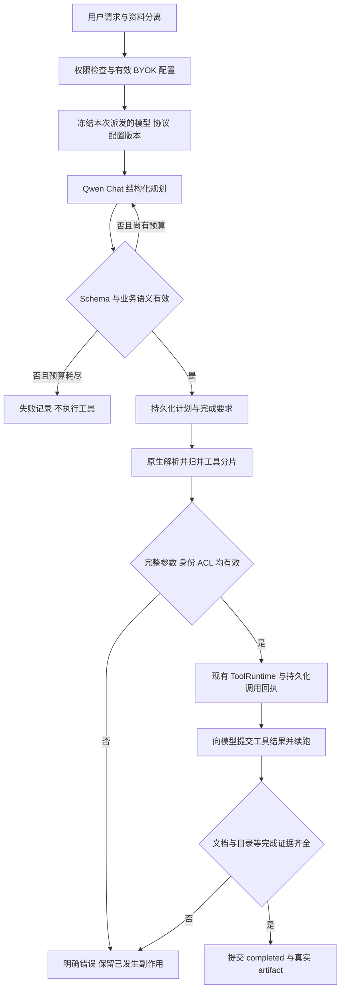

# Qwen 3.8 协议适配与任务执行修复方案

日期：2026-09-16。状态：设计方案，尚未实施。

## 1. 目标与结论

将 `qwen3.8-flash` 作为 LocalMind 后续文本生成、任务规划和工具执行的目标模型，修复当前阿里云 Token Plan 接入路径，最终通过公开 MCP 完成工作日志写入与目录核验。

推荐方案是：**显式配置 Chat 协议，修复原生流式调用身份归并，将结构化校验纳入有界重试，并以持久化业务结果判定任务完成。** 仅调整默认模型或删除日志中的否定语句不能解决这些问题。

现有实测证明这一方向可行：同一 Qwen 模型通过 Chat 完成规划 Schema 与分支语义校验；在独立诊断代理修正空调用 ID 后，工具获得完整参数、只执行一次，模型读取结果后回答 `OK`。这不是生产修复或完整业务验收。

本方案覆盖普通 Workspace、入站 MCP 和全局 Project BYOK 的生成模型路径。Embedding/rerank 属于独立的实例基础设施，不改为文本生成模型；其他专用能力仍按原能力契约配置。统一模型不合并 Workspace/Project 凭据，也不扩大工具授权。

依据与边界：

- [Qwen 3.8 诊断证据](./qwen38-compatibility-diagnosis.execution-20260916.zh-CN.md)。
- [日志失败与完成判定诊断](./localmind-daily-log-upload-failure-diagnosis.execution-20260916.zh-CN.md)。
- [Agent Runtime](./tracks/agent-runtime.md)、[Registries](./tracks/registries.md)、[Project AI Boundaries](./tracks/project-ai-boundaries.md)、[Project 原生资源](./tracks/project-native-resources.md)。
- [Workspace/Project 写入授权契约](./workspace-project-ai-write-authorization-remediation.zh-CN.md)、[MCP 契约](../localmind-mcp.md)、[Docker 约束](../localmind-docker-development-constraints.md)。

## 2. 已确认问题与修复归属

| 编号 | 问题与证据                                                                  | 影响                                    | 修复所有者                         |
| ---- | --------------------------------------------------------------------------- | --------------------------------------- | ---------------------------------- |
| F1   | BYOK 的 `provider=openai` 固定生成 `openai_responses`                       | Qwen 无法显式选择已验证的 Chat 路径     | BYOK 配置、模型定义和 Provider     |
| F2   | 当前 Token Plan Responses 请求带严格 Schema 仍返回不合规对象；Chat 对照通过 | 规划在入队前失败                        | 协议配置、结构化派发和校验         |
| F3   | Qwen Chat 参数分片含 `id=""`，解析器覆盖 index 映射                         | 正确参数变成 `{}`，可能重复调用直至超限 | `llm_adapter` Chat SSE 解析器      |
| F4   | Responses 的 `item_id` 未归并到真实 `call_id`                               | 一次上游调用触发两次本地执行            | `llm_adapter` Responses SSE 解析器 |
| F5   | Responses 嵌套 usage 未读取；模拟的 `response.failed` 未传播                | 用量缺失、错误被误判为正常结束          | 原生事件解析与运行时终态处理       |
| F6   | Schema 校验发生在 native 路由 fallback 之后                                 | 派发成功但格式失败时不能按正确策略重试  | 结构化执行管线                     |
| F7   | 对整段请求运行否定正则，日志中的“不要求账号登录，也不执行”清空写入要求      | 只检索却返回 completed                  | 任务意图与完成契约                 |

F3/F4 已通过真实 Qwen 返回数据复现；F5 的失败终态来自模拟，不能认定某次历史线上任务实际收到该事件。当前证据不足以把上传失败归因于模型整体能力不足。

## 3. 目标执行流程

流程图中的重试只针对尚未执行工具的规划调用。工具阶段发生错误后，依据回执恢复；不能重新跑一遍整个任务来代替恢复。

## 4. 显式持久化 OpenAI 兼容协议

### 4.1 配置契约

在现有 BYOK 配置中增加可选 `apiStyle`，值为 `chat_completions` 或 `responses`。它属于凭据配置，不由用户提示词或模型输出决定。

| 输入/存量状态                                  | 解析行为                                  |
| ---------------------------------------------- | ----------------------------------------- |
| OpenAI 配置显式 `chat_completions`             | `backendKind=openai_chat`                 |
| OpenAI 配置显式 `responses`                    | `backendKind=openai_responses`            |
| 存量 OpenAI 配置缺失/null                      | 保持原 Responses 语义，避免迁移隐式改路由 |
| 非 OpenAI Provider 缺失/null                   | 保持原协议                                |
| 非 OpenAI Provider 携带 apiStyle，或出现未知值 | 拒绝保存和派发，不能静默猜测              |

本实例 Qwen 的目标值明确为 `provider=openai`、`modelId=qwen3.8-flash`、`apiStyle=chat_completions`，使用已配置的 Token Plan 端点。运行时不按模型名称或域名临时猜协议，也不在一次调用失败后自动跨协议试探。

### 4.2 数据与接口变更

新增迁移，在 `AiWorkspaceByokConfig`、`AiProjectByokConfig` 中增加可空 `api_style`，并增加允许值及 Provider 组合约束。现有行保持 null，不改凭据内容、启用状态、Profile 归属或优先级。

Project 的新审计事件记录协议字段；旧审计行保留“历史未记录”，不回填伪造的显式选择。Project 继续使用现有 `expectedRevision` 和不可变审计。Workspace 增加仅在配置内容变化时递增的 `configRevision`，用于探测结果、Provider 实例缓存和配置并发写入校验；usage/lastUsedAt 更新不能推进此版本。

接口贯通范围：服务端存储、Admin 测试/保存/读取、GraphQL 输入输出和生成类型、仍受支持的本地加密配置及 lease 传输。旧客户端省略字段时，更新同一配置应保留现有 apiStyle；新建才采用兼容默认值。明确修改协议的新版调用必须携带配置版本，防止迟到的保存覆盖新配置。

配置改动须同步到：

- `ByokService.modelDefinition` 和 `providerConfig`，共用同一协议解析函数。
- `OpenAIProvider`、prepared route、结构化请求和工具循环。既有 `oldApiStyle` 仅在旧配置入口转换，不另建相互矛盾的协议真相。
- Workspace AI Profile 的有效 credential 集合与用户 assignment。
- 全局 Project BYOK 的独立配置、版本化 Provider ID 和成员校验；不得回退到 Workspace、设备 lease 或平台模型。

每次模型派发绑定实际配置版本、模型和协议，保证同一次请求前后一致。下一次模型派发，包括工具续跑和重试，仍检查配置启停、轮换及实时权限；不能用旧 prepared route 绕过已生效的停用。

### 4.3 Admin 验证

在现有 OpenAI 兼容配置表单增加“API 协议”选项。变更 Provider、Endpoint、Model ID、协议或密钥后，使旧验证结果失效。普通用户的日志提交页面不增加协议选项或额外审批。

沿用现有管理权限和安全网络访问策略。保存 Qwen Agent 配置前验证三项能力：

1. 文本请求返回可解析的非空文本。
2. 固定规划 Schema 返回合法对象，并通过分支语义检查。
3. 真实流式工具调用获得指定参数，执行一次纯内存回声，续跑后返回预期答案。

验证使用与生产相同的协议构造器和 native 解析器；不能继续只向 `/responses` 发送“Reply with OK”。不执行真实 Workspace/Project 工具。保留普通连接测试，但界面须区分“可连接”与“结构化/工具执行已验证”。

每次验证最多四个模型 HTTP 请求：文本一次、结构化一次、工具闭环最多两轮。完整能力验证建议总限时 90 秒、单次 30 秒，取消立即传播，管理端显示当前验证阶段；不能沿用当前 10 秒连接测试上限来判定完整规划能力。普通连接测试继续保留较短限时。

规划探测沿用有界的 8,192 输出 token 预算，文本和工具探测分别设置有限预算并核对端点实际行为。不能沿用“Reply with OK”的 64 token 上限去验证带推理的规划，也不把关闭推理作为协议正确性的替代修复。能力探测不做自动重试，遇到失败返回具体阶段和类别。

持久化有界的能力结果、验证契约版本、时间和对应配置版本，不存原始响应或密钥。迟到结果不能更新已轮换配置的验证状态。

## 5. 修复原生流式解析与调用身份

### 5.1 Chat：空 ID 不能创建或替换调用

修复 `llm_adapter` 的 `OpenaiChatStreamParser`：

1. 将空白 `id/call_id/name` 视为“本分片未提供”，保留已知值。
2. 在同一响应内按 `(choice index, tool index)` 关联分片；LocalMind 只消费支持的 choice，额外 choice 不能混入同一工具循环。
3. 首个有效调用 ID 到达后建立映射；后续仅带 index 的参数增量追加到同一状态。
4. 如参数先到、真实 ID 后到，合并暂存状态，保留全部分片与顺序。暂存 ID 不得流入业务回调或持久化账本。
5. 同一 index 出现冲突的非空 ID/工具名，或终态时身份仍不完整，返回协议错误；不能猜测归属。
6. 完整 JSON 解析和工具输入 Schema 校验通过后才调用 executor。损坏、截断参数不能替换成 `{}`；合法空对象仍须通过对应工具 Schema。

工具完成分片和流尾 flush 共享一次性发出标记。多个调用交错、重复快照与重复完成事件都不能导致额外执行。工具参数可先投影为界面进度，但必须确认本轮允许工具执行的有效终态后才能派发业务 executor；后续收到 failed/incomplete 的轮次不能继续发起写入。每轮结束清理分片状态，不污染下一轮，并对暂存调用数、参数字节数及整个流设置有界限制。

### 5.2 Responses：统一 item 与 call 身份

在同一响应内维护 `item_id -> call_id` 与 `output_index -> item_id` 映射。`output_item.added/done`、`function_call_arguments.delta/done` 更新同一调用状态。

缺少真实调用身份时只暂存，不能使用共享 `call_0` 触发工具。完整参数快照用于核对/完成增量，不再重复拼接。相互矛盾的快照或映射必须报错。不同真实 call ID 即使名称和参数相同，仍是两个调用，不能按参数哈希去重。

### 5.3 终态、截断与 usage

识别 `response.failed`、错误事件及 `response.incomplete`；从嵌套 `response` 读取错误、状态和 usage。完成、失败、取消、超时、达到 token/step 上限必须保留不同原因。异常 EOF、未闭合参数或缺少必要终态不等同于正常停止。

已经执行过的工具即使后续模型失败，也保留 confirmed 回执和 partial artifacts。流终态只决定模型本轮是否结束；业务任务是否完成由完成契约决定。

usage 来自协议明确字段；未知值保留 unknown，不伪装成已知零用量。同一响应只累计一次，重试产生的真实用量分别计入。

### 5.4 依赖交付与持久化幂等

当前锁定 `llm_adapter 0.2.11`、`llm_runtime 0.2.7`。已检查的缓存 `llm_adapter 0.2.20` 仍有关键解析问题，不能把升级版本号当成修复。

首选在依赖源码中修复并发布带回归用例的版本，LocalMind 锁定该确切版本及 Cargo.lock。若依赖发布暂不可用，使用仓库内可复现、含许可证和来源记录的最小 vendor patch；禁止修改机器的 Cargo registry 缓存后宣称交付，禁止把临时诊断代理变成生产必需服务。构建必须可从干净检出完成。

解析层只保证同一响应内每个调用发出一次。跨 worker/进程的幂等仍依赖现有任务调用 checkpoint、业务稳定 ID、版本条件和 side-effect ledger，不承诺网络异常下的通用 exactly-once。

真实 ID 与内部持久化调用 ID 需要明确关联。若同一任务后续轮次复用 call ID，先核对既有回执和参数指纹：完全相同的已完成 checkpoint 复用结果；不同内容使用相同身份应报冲突，不能覆盖历史或随机生成新 ID 再执行。任何涉及身份格式的变更都必须版本化，保留旧回执读取能力。

## 6. 结构化规划与有界重试

### 6.1 保持两层校验

通用 native 结构化派发在候选路由成功返回前，检查 JSON 解码和本次请求的 Schema。`native-execution-engine.ts` 保留宿主边界复核。这样格式失败不会先被记录为路由成功，错误仍能归属实际候选。

MCP 业务层保留固定六字段 result 和分支约束：`tool_agent` 必须有 summary；`document_update` 的 docId 必须来自授权上下文，正文满足长度和完整替换规则；无关字段应为空。生成一个看似合法的 docId 不产生资源访问权限。

保留当前完整规划系统提示词，不为压缩 token 删除字段映射或信任边界。不得用宽松对象、删除多余字段、自动补造 docId 或直接关闭 strict 来接受失败计划。

### 6.2 一份重试预算

建议每次逻辑规划最多 **2 次模型尝试**，包含传输失败、候选路由 fallback 和 Schema/语义修复；native 与 TypeScript 不能各自再重试两次形成乘法放大。由统一执行预算计数并传递 AbortSignal/剩余截止时间。

| 错误                               | 处理                                                                 |
| ---------------------------------- | -------------------------------------------------------------------- |
| JSON 解码、Schema 或字段语义错误   | 尚有预算时，用原任务和有界字段错误摘要重新规划一次；不附完整失败输出 |
| 短暂 429/5xx、连接失败             | 尚有预算且截止时间允许时按有界退避再尝试                             |
| 协议不支持、无效模型/配置、401/403 | 直接失败，提示管理端修正；不换协议或扩大凭据范围                     |
| 取消、ACL/成员资格撤回、总超时     | 立即停止，不再发起模型或工具请求                                     |
| 已有工具副作用或结果不确定         | 不走规划重试；进入现有回执核对与恢复流程                             |

重试只使用当前作用域内仍有效的候选。在统一 Qwen 的目标范围内，候选须绑定 `qwen3.8-flash`；失败不能自动切回 GPT、平台额度或别的 Workspace/Project 凭据。不能因为“至少还有一个模型能回答”而扩大候选集。

校验错误记录稳定类别、JSON path 和限制数量的关键词，避免 Schema 错误消息回显正文。每次尝试保留实际模型、协议、配置版本、耗时、终态类别和可获得的 usage；复用既有运行审计通道，失败证据追加记录，不覆盖原请求。

## 7. 完成契约：以任务目标和业务回执判定成功

### 7.1 区分任务指令与待保存资料

日志中的“未登录”“不执行完整验收”“恢复索引”等历史描述属于资料，不能清空当前“保存今日日志”的要求或新增恢复文件夹动作。公开 MCP 继续使用现有委托入口；附件和文档快照保持独立的不可信资料区域。

先去除 `deniesWriteAction(request) -> requirements=[]` 这种全局提前返回。否定语句必须作用于被否定的具体动作；例如“保存日志，不要发送消息”仍需要文档保存证据。对正文中的关键词不再直接生成写入/删除/恢复要求。

在规划结果中增加严格的意图描述：读回答、读工具、必需写入、条件写入，以及受限动作/目标。规划器提出候选意图，服务端结合请求的任务部分、明确资源 ID、工具能力快照和既有授权校验生成完成要求。模型不能自行声明“无需完成证据”。

内联正文按调用方显式正文区域、引用块等边界分离；没有明确边界时，保留上下文语义，不能仅凭一条正则视为全局禁止。若任务意图与计划矛盾，进行第 6 节预算内的修复；仍不能确定则返回有区别的规划错误，不得退成 `kind:none` 后 completed。这是意图校验，不新增普通 Workspace 写入审批。

### 7.2 结果约束

将计划动作映射到注册工具及结果约束，而不仅是“出现过某个工具名”：

- 读工具任务需要实际读取/检索证据；直接只读回答可以没有工具。
- 必需写入需要同一目标资源的成功回执及最终 artifact。
- 条件写入支持读后更新，或基于同一版本/指纹的确认无需修改；不能强迫重复写入来满足工具计数。
- 创建或更新日志、放到指定目录、调整顺序是不同完成要求；成功创建文档不能代替目录完成。
- 已有正确目录/顺序可由授权读取证明；不强制制造一次无意义移动。
- 业务写入后以有界资源读取核验。索引可见性单独记录，索引尚未更新不能推导出“文档不存在”并再建一份。

完成要求必须在执行前持久化并冻结。执行器根据受信任的工具结果生成 artifact，不能采用模型编造的 ID、路径或“已保存”文字。缺证据时保留明确错误及已确认的 partial 结果。

新意图/完成结果形状采用新的请求与完成契约版本，实施时以当前 v6/v4 为基线分配版本并更新 schema、fingerprint、读写器和测试。不要就地修改旧任务的计划、完成要求或审计证据；存量迁移按第 10 节处理。

## 8. 代码落点与交付单元

下表路径均相对仓库根目录；新增字段、用例及错误类别属于本方案拟实现内容。

| 单元          | 主要位置                                                                                                                                                            | 交付结果                                            |
| ------------- | ------------------------------------------------------------------------------------------------------------------------------------------------------------------- | --------------------------------------------------- |
| P1 原生解析   | `llm_adapter/src/stream/parse.rs`（依赖源码）、`llm_runtime` 对接回归、`packages/backend/native/src/llm/ffi/`、Cargo.lock                                           | 身份归并、终态和 usage 修复，真实 SSE 形态 fixtures |
| P2 协议配置   | `packages/backend/server/schema.prisma`、`migrations/`、`src/models/copilot-byok.ts`、`copilot-project-byok.ts`、`src/plugins/copilot/byok/`、`providers/openai.ts` | 显式协议、版本一致性、兼容迁移、准确探测            |
| P2 配置界面   | `packages/frontend/admin/src/modules/ai/workspace-byok.tsx`、`project-byok.tsx`、共享 GraphQL、仍受支持的本地 BYOK 配置/lease 消费端                                | 协议选择、配置变化使验证失效、状态反馈              |
| P3 规划与预算 | `packages/backend/native/src/llm/ffi/dispatch.rs`、`packages/backend/server/src/native.ts`、`runtime/native-execution-engine.ts`、`mcp/delegation.ts`               | 校验纳入路由结果、统一预算、脱敏尝试证据            |
| P4 完成要求   | `mcp/tool-agent-completion.ts`、`mcp/tool-agent-evidence.ts`、`agent-runtime-localmind-tool-agent-adapter.ts`、`runtime/tool/`、MCP 持久化/投影模型                 | 不误读正文、按目标验证效果、正确 partial/终态       |
| P5 发布验收   | 既有部署脚本、固定运行镜像、公开 MCP                                                                                                                                | Qwen 生效证据、日志 artifact、部署与回退记录        |

P1/P2 可作为独立代码交付单元；启用 Qwen Agent 路径前必须同时具备两者。P3/P4 是“今日日志已可靠完成”的发布门槛，不因单个回声测试通过而省略。GraphQL、Prisma 和其他生成类型通过仓库命令生成，不手改产物。

## 9. 验证矩阵

先以固定合成数据证明解析与状态机，再运行真实 Qwen 和业务验收。真实探测不放进普通离线 CI，不使用生产文档作为测试 fixture。

| 编号 | 场景                                                     | 必须满足                                              |
| ---- | -------------------------------------------------------- | ----------------------------------------------------- |
| T01  | Chat 首片真实 ID，后续空/缺失 ID                         | 完整参数；一次 executor 回调                          |
| T02  | 参数先到，ID 后到；两工具交错；UTF-8/SSE 被网络分块      | 不丢失、混合或重复参数                                |
| T03  | 身份冲突、损坏 JSON、参数截断                            | 未通过校验的工具调用次数为零                          |
| T04  | 重复 done/flush；不同 ID 但相同参数                      | 同 ID 只发出一次，不吞掉独立调用                      |
| T05  | Responses item_id/output_index/call_id 归并              | 一次上游调用对应一个真实调用回执，无 call_0           |
| T06  | failed/error/incomplete、异常 EOF、取消、超限            | 正确终态；已发生副作用仍保留                          |
| T07  | 嵌套 usage、重复 usage、缺失 usage                       | 正确累计一次；未知不等于零                            |
| T08  | 存量 null、显式 Chat/Responses、非法配置组合             | 兼容默认和拒绝行为正确，两类 native 请求路径一致      |
| T09  | Workspace/Profile/用户 assignment/本地 lease 与 Project  | 实际选中模型和协议正确，不跨作用域借凭据              |
| T10  | 并发保存、轮换、停用与迟到探测                           | 不覆盖新版本、不用旧验证证明新配置有效                |
| T11  | 首次 Schema/语义错误，第二次正确；连续错误               | 一次修复可成功，最多两次模型尝试；失败不入队          |
| T12  | 重试途中取消、ACL 撤回、预算耗尽                         | 不继续派发，不执行工具，不回退 GPT                    |
| T13  | 正文含“不要求账号登录，也不执行”“恢复索引”               | 保存要求保留；不增加恢复目录动作                      |
| T14  | “不要写入，只总结”与“保存，但不要发送消息”               | 前者不写；后者需要保存且不发送                        |
| T15  | 只检索却声称保存；创建成功但目录失败                     | 前者失败无写入 artifact；后者 partial，不能 completed |
| T16  | 条件追加，无变化且指纹正确/错误                          | 正确 no-op 可完成，错误或过期指纹不通过               |
| T17  | 工具完成后进程中断；调用结果未确认                       | 已确认回执复用；不确定非幂等操作先核对                |
| T18  | Prisma 全量应用、真实旧版 fixture 升级、旧客户端省略协议 | 凭据/权限/历史证据保留，不改变已有协议选择            |
| T19  | Admin 两种主题、加载/失败/成功/重复提交                  | 协议字段和验证状态一致，不显示密钥                    |
| T20  | 真实 Qwen：规划、工具参数、一次回调、续跑                | 都使用 qwen3.8-flash + openai_chat；合成调用闭环通过  |
| T21  | 真实日志创建、同日更新、目录排序、幂等查询               | 唯一文档及实际回执；无重复日期块或目录                |

建议真实合成验收：现有完整规划提示词下分别运行只读、工具写入规划、单文档替换三个场景，各连续五次；工具闭环连续五次。要求全部通过、零重复执行、零空参误执行；这是本次发布门槛，不代表长期成功率保证。若失败，记录首个有效证据并返回对应单元修复，不能不断重跑直到偶然成功。

优先扩展现有测试：`byok.spec.ts`、`byok-probe.spec.ts`、`project-global-byok.spec.ts`、`provider-native.spec.ts`、`tool-agent-completion.spec.ts`、`copilot-mcp-delegation.e2e.ts` 以及 Admin 的 Workspace/Project BYOK 测试。增加 Linux N-API fixture 回放，证明被打包模块与 Rust 单元测试行为一致。

按 [validation.md](./validation.md) 使用现有 `localmind-affine:test` 或复用 Linux 容器运行聚焦测试；AVA 使用仓库 TypeScript hook，smoke 用 `yarn r`。协议、迁移和 native 变化最后构建一次 `localmind-affine:local` 验证打包产物。本次仅编写方案文档，不执行这些实现阶段验证。

## 10. 发布、存量任务与回退

1. **准备可审查发布物**：锁定代码/依赖版本，完成 P1–P4 与验证矩阵；记录迁移列表及旧版兼容结论。先核对 `docker system df`，预计新增超过 30 GB 时停止构建并报告。沿用固定镜像角色，不新建里程碑 tag。
2. **盘点与备份**：记录当前镜像 ID、有效配置版本、Workspace/Profile 覆盖、全局 Project 配置状态、非终态任务及 confirmed/unconfirmed 回执；备份数据库和必要持久化文件，验证可恢复。凭据不写入报告。
3. **暂停新委托和相关 worker，处理旧任务**：让可确认任务结束；仍未结束的旧契约任务按已有维护工具的 dry-run/显式应用流程终结或待核对，实施时补齐新旧版本识别。不得把旧 v6/v4 请求按新意图结构重算后继续执行，不得抹掉未确认写入。终态历史仍可查询。
4. **迁移与部署**：按既有部署文档应用增量迁移、构建并启动 `localmind-affine:local`。核对源码提交、native 依赖版本、Prisma 与运行时协议能力，不能只复制 JavaScript。
5. **启用 Qwen**：通过现有授权的管理服务/API更新目标配置，完成三类探测。先验证当前日志所属 Workspace 的有效 Profile，确认规划和执行都选择 Qwen；再按配置清单覆盖其他生成入口。全局 Project 凭据独立配置，缺少对应配置时明确记为未覆盖，不复制 Workspace 密钥冒充全局配置。旧 GPT 凭据可保留，但从统一 Qwen 范围的有效路由集合移除，不能只调整排序。
6. **恢复 worker 并验收**：核对租约、取消和模型错误分类，再做第 11 节业务验收。记录实际模型/协议与工件结果，不能只看 health endpoint。

回退分两类：新版本代码可运行但 Qwen 不通过验收时，暂停受影响的生成/委托入口，保留可用文档功能和已确认写入，不自动改回 GPT；镜像本身不可运行时，先停止相关流量与 worker，按已验证的 schema/config/契约兼容矩阵恢复代码和配置。

旧镜像会忽略新协议字段并重新走 Responses，因此**数据库迁移可加性不代表业务回退安全**。回退验证前不能让旧 worker 接收新契约任务。不要为了回退自动还原整库并丢弃期间新文档；需要恢复备份时必须处理备份之后的数据与调用回执差异。任何路径都不删除 volume 或改写历史成功/失败证据。

## 11. 今日日志业务验收

使用现有公开 `delegate_to_localmind` / `get_localmind_task` 完成，目标保持：

- 日期：`2026-09-16`，按该日志日期处理；实施日变化时作为补交，不改成实施当天。
- 标题：`2026-09-16｜member-01｜工作日志`。
- 目录：`Infinimesh/陆天毅/2026-09`。
- 正文：已确认草稿的“今日完成、关键决策、问题与风险、相关任务与文档”四部分，保留真实未完成事项。

先查询原任务及其回执，核对同名文档。存在唯一文档时使用原 ID 合并；没有文档且检索覆盖可靠时创建；多个精确匹配时返回歧义，不任选、覆盖或删除。索引无结果但覆盖不完整时不能据此断言不存在。

正文作为附件提供，任务文本描述明确动作与目标；该提交方式减少资料歧义，但不能作为逃避 F7 修复的理由。相同幂等键重放只能返回原任务，不能偷偷重跑已失败任务。原任务确认无写入后才用新的幂等键重提；已有 partial artifact 时围绕原文档补齐缺失步骤；unconfirmed 调用先核对。

完成前核验：文档正文、原有内容是否保留、正确目录身份、目录挂载以及既有 ordinal-string 顺序规则。复用已有目录，保留其他合法 placement。需要跨页搜索或长目录遍历时按现有分页与权限边界完成。

最终交付必须包含真实 `documentId`/artifact、日期、目录、持久化顺序验证和实际 Qwen 模型/协议证据。`accepted`、附件上传成功、仅检索成功或模型说“已保存”，都不算日志写入完成。

## 12. 完成标准

本方案实施完成必须同时满足：源码修复可复现构建；配置迁移与兼容验证通过；P1–P4 失败路径覆盖；Qwen 规划与工具执行生效；日志正文和目录结果真实保存；历史审计、ACL、Project 边界和索引基础设施保持正确。

实施时同步更新相关 active track、当前状态、验证与部署记录；本方案当前不代表任何代码、模型配置或生产状态已经改变。
